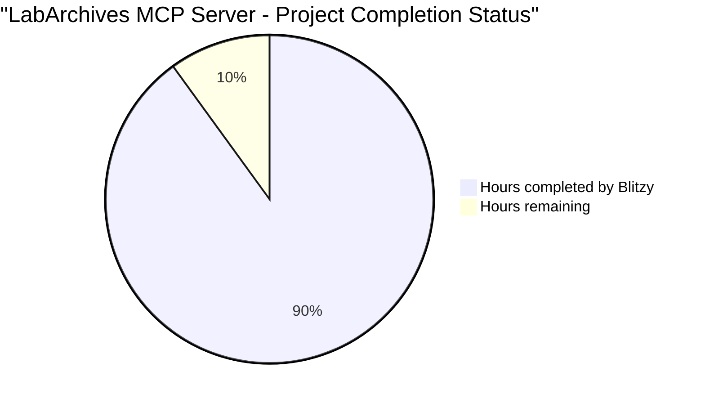

# PROJECT STATUS

## HUMAN INPUTS NEEDED

| Task | Description | Priority | Estimated Hours |
|------|-------------|----------|-----------------|
| QA/Bug Fixes | Examine generated code for compilation errors, fix import issues, resolve package dependency conflicts, and ensure all modules are properly integrated | High | 40 |
| Environment Configuration | Set up environment variables for LABARCHIVES_ACCESS_KEY_ID, LABARCHIVES_ACCESS_SECRET, configure API endpoints, and create .env files | High | 8 |
| API Key Management | Obtain LabArchives API credentials, configure authentication tokens for SSO users, and set up secure credential storage | High | 6 |
| Dependency Resolution | Verify all Python package versions in requirements.txt, resolve any version conflicts, ensure compatibility with Python 3.11+ | High | 12 |
| MCP SDK Integration | Install and configure the official MCP Python SDK and FastMCP framework, verify protocol compliance | High | 16 |
| Docker Configuration | Build and test Docker images, configure container networking, set up volume mounts for logs | Medium | 12 |
| Testing Infrastructure | Implement unit tests for critical components, create integration tests for API endpoints, set up test fixtures | Medium | 24 |
| Documentation Updates | Complete API documentation, create deployment guides, write user manuals for CLI commands | Medium | 16 |
| CI/CD Pipeline | Configure GitHub Actions workflows, set up automated testing, implement release automation | Medium | 12 |
| Security Audit | Review credential handling, validate scope enforcement, ensure audit logging compliance | Medium | 8 |
| Performance Testing | Load test API endpoints, optimize resource listing for large datasets, tune connection pooling | Low | 8 |
| Error Handling | Implement missing error handlers, add retry logic for transient failures, improve error messages | Low | 6 |
| Logging Configuration | Set up log rotation, configure audit log retention, implement structured logging formats | Low | 4 |
| Release Preparation | Create release notes, tag version 0.1.0, prepare PyPI package distribution | Low | 4 |
| **Total** | | | **176** |