# Technical Specification

# 0. SUMMARY OF CHANGES

## 0.1 BUG ANALYSIS AND INTENT CLARIFICATION

### 0.1.1 Bug Report Interpretation

Based on the bug description, the Blitzy platform understands that the issue is a collection of six confirmed defects in the LabArchives MCP Server that prevent proper authentication, CLI usage, and secure operation:

1. **API Key Authentication Failure**: The authentication flow for permanent API keys is incomplete, causing 401 errors when using `LABARCHIVES_AKID` and `LABARCHIVES_SECRET` without a username
2. **CLI Flag Mismatch**: Documentation describes different command-line flags than what the parser accepts, causing "unrecognized argument" errors
3. **Authenticate Subcommand Broken**: The `authenticate` subcommand proceeds to server startup instead of just validating credentials
4. **Folder-Scoped Access Not Enforced**: The `--folder-path` scope limitation doesn't filter resources, exposing notebooks outside the specified folder
5. **Sensitive Tokens in Logs**: API secrets and passwords are logged in plaintext in audit logs
6. **Potential JSON-RPC Response Issue**: Concern about missing JSON-RPC 2.0 envelope fields in responses

### 0.1.2 Missing Information Detection

The symptoms suggest the root causes are likely:
- Incomplete implementation stubs left during development
- Missing integration between CLI parser definitions and documentation
- Lack of proper command routing in the main entry point
- Missing credential sanitization before logging
- Incomplete scope filtering logic

### 0.1.3 Root Cause Hypothesis

Primary hypotheses for each bug:
1. **API Key Auth**: The `authenticate()` method in `src/cli/api/client.py` has a `pass` stub (line 496) instead of HMAC signature implementation
2. **CLI Flags**: The parser defines `--access-key-id`/`--access-secret` but docs/examples expect `-k`/`-p` short options
3. **Authenticate Command**: `main.py` doesn't check `args.command` before proceeding to server startup
4. **Folder Scope**: `list_resources()` in `resource_manager.py` has a `pass` placeholder (line 488) instead of filtering logic
5. **Token Logging**: `cli_parser.py` logs raw `argv` (line 441) without sanitizing secrets
6. **JSON-RPC**: The responses appear correctly formatted, but FastMCP integration needs verification

## 0.2 DIAGNOSTIC SCOPE

### 0.2.1 Bug Localization Strategy

Search patterns to identify affected code:
- **API Key Auth**: Look for `authenticate` method with `pass` statement in API client
- **CLI Flags**: Search for argument parser definitions with `--access-key` vs `--access-key-id`
- **Command Routing**: Find main entry point and check for subcommand dispatch logic
- **Folder Filtering**: Look for `folder_path` handling and `pass` statements in resource listing
- **Audit Logging**: Search for `argv` logging and missing sanitization calls
- **JSON-RPC**: Verify response envelope construction in protocol handlers

### 0.2.2 Potential Bug Locations (ranked by likelihood)

| Bug | Primary Location | Line Numbers | Issue Type |
|-----|-----------------|--------------|------------|
| API Key Auth | `src/cli/api/client.py` | 494-496 | Incomplete implementation |
| CLI Flags | `src/cli/cli_parser.py` | 193-204 | Missing short options |
| Auth Command | `src/cli/main.py` | 156-620 | Missing command check |
| Folder Scope | `src/cli/resource_manager.py` | 481-488 | Incomplete filtering |
| Token Logging | `src/cli/cli_parser.py` | 441 | Missing sanitization |
| JSON-RPC | `src/cli/mcp/handlers.py` | 216-245 | Verify proper wrapping |

### 0.2.3 File Investigation Map

| File | Investigation Focus | Likely Issue Type |
|------|-------------------|------------------|
| `src/cli/api/client.py` | `authenticate()` method, HMAC signature | Missing API key auth branch |
| `src/cli/cli_parser.py` | Argument definitions, audit logging | Missing short flags, unsanitized logging |
| `src/cli/main.py` | Command dispatch logic | No subcommand routing |
| `src/cli/resource_manager.py` | `list_resources()` folder filtering | Stub implementation |
| `src/cli/auth_manager.py` | `sanitize_credentials()` usage | Utility exists but unused |

## 0.3 BUG FIX DESIGN

### 0.3.1 Root Cause Resolution

**Bug 1 - API Key Authentication**:
- The bug is caused by an incomplete implementation stub in the `authenticate()` method
- When no username is provided, the code has `pass` instead of calling `_generate_signature()`
- Fix involves implementing the HMAC-SHA256 signature generation and including it in the API request

**Bug 2 - CLI Flag Mismatch**:
- The bug appears because the parser expects `--access-key-id` but docs show `-k` short option
- Fix involves adding short option aliases to match documentation

**Bug 3 - Authenticate Subcommand**:
- The bug is caused by `main.py` not checking `args.command` before starting the server
- Fix involves adding command routing logic to handle 'authenticate' separately

**Bug 4 - Folder-Scoped Access**:
- The bug is caused by a `pass` placeholder where folder filtering should occur
- Fix involves implementing the filtering logic to exclude notebooks outside the folder

**Bug 5 - Sensitive Tokens in Logs**:
- The bug is caused by logging raw `argv` without sanitization
- Fix involves sanitizing the argv array before logging

**Bug 6 - JSON-RPC Response**:
- Analysis shows responses are properly formatted; this may be a false positive
- Verify FastMCP integration handles the envelope correctly

### 0.3.2 Minimal Change Principle

**Critical fixes only - no refactoring**:

1. **API Key Auth**: Add 5-10 lines to call existing `_generate_signature()` method
2. **CLI Flags**: Add 2 lines for short option aliases (`-k`, `-p`)
3. **Auth Command**: Add 10-15 lines for command routing in main()
4. **Folder Scope**: Add 5-8 lines to filter notebooks by folder containment
5. **Token Logging**: Add 3-5 lines to sanitize argv before logging
6. **JSON-RPC**: No changes needed if FastMCP handles properly

### 0.3.3 Fix Verification Strategy

- **API Key Auth**: Test with `LABARCHIVES_AKID` and `LABARCHIVES_SECRET` only
- **CLI Flags**: Verify both long and short options work
- **Auth Command**: Confirm `authenticate` exits after validation
- **Folder Scope**: Verify only in-scope notebooks appear in listings
- **Token Logging**: Check audit logs show "[REDACTED]" for secrets
- **JSON-RPC**: Validate response format with JSON-RPC client

### 0.3.4 Code Change Specification

**Bug 1 - API Key Authentication Fix**:
```python
# src/cli/api/client.py, line 494-496
# BEFORE:
else:
    # For direct API key authentication, we need to make a test call
    # to validate credentials and get user info
    pass

#### AFTER:
else:
#### For direct API key authentication, use HMAC signature
    auth_params["sig"] = self._generate_signature(
        "GET", 
        LABARCHIVES_API_ENDPOINTS["user_info"], 
        auth_params
    )
    auth_params["ts"] = str(int(time.time()))
```

**Bug 2 - CLI Flag Fix**:
```python
# src/cli/cli_parser.py, line 193
# BEFORE:
start_parser.add_argument(
    '--access-key-id',
    type=str,
    help='...'
)

#### AFTER:
start_parser.add_argument(
    '-k', '--access-key-id',
    type=str,
    help='...'
)
```

**Bug 3 - Authenticate Command Fix**:
```python
# src/cli/main.py, after line 248
# ADD:
# Check if authenticate command - handle separately
if hasattr(args, 'command') and args.command == 'authenticate':
    from src.cli.commands.authenticate import authenticate_command
    try:
        exit_code = authenticate_command(args)
        sys.exit(exit_code)
    except Exception as e:
        print(f"Authentication check failed: {str(e)}", file=sys.stderr)
        sys.exit(2)
```

**Bug 4 - Folder Scope Fix**:
```python
# src/cli/resource_manager.py, line 488
# BEFORE:
pass  # Allow all notebooks for now, folder filtering happens during page listing

#### AFTER:
#### Skip notebooks that don't contain the folder
if not self._notebook_contains_folder(notebook, folder_path):
    continue
```

**Bug 5 - Token Logging Fix**:
```python
# src/cli/cli_parser.py, line 441
# BEFORE:
"argv": argv,

#### AFTER:
"argv": sanitize_argv(argv),  # Sanitize sensitive arguments
```

## 0.4 SCOPE BOUNDARIES - STRICTLY LIMITED

### 0.4.1 Explicitly In Scope (ONLY bug-related)

- `src/cli/api/client.py`: Fix authenticate() method for API key auth
- `src/cli/cli_parser.py`: Add short flags and sanitize logging
- `src/cli/main.py`: Add authenticate command routing
- `src/cli/resource_manager.py`: Implement folder filtering
- `src/cli/utils.py`: Add argv sanitization function if needed
- Minimal test modifications to verify fixes

### 0.4.2 Explicitly Out of Scope (DO NOT INCLUDE)

- Code improvements or refactoring
- Additional features or enhancements
- Style or formatting changes
- Unrelated bug fixes
- Performance optimizations
- Extended test coverage beyond the bugs
- Documentation updates beyond fixing the flag mismatch

## 0.5 VALIDATION CHECKLIST

### 0.5.1 Bug Fix Verification

- ✓ API key authentication succeeds with AKID/SECRET only
- ✓ CLI accepts both `-k`/`--access-key-id` and `-p`/`--access-secret`
- ✓ `authenticate` command validates and exits without starting server
- ✓ Folder scope filters notebooks correctly
- ✓ Audit logs show "[REDACTED]" instead of plaintext secrets
- ✓ JSON-RPC responses include proper envelope

### 0.5.2 Regression Prevention

- Existing username/token auth still works
- All other CLI commands function normally
- No performance degradation
- API compatibility maintained

## 0.6 EXECUTION PARAMETERS

### 0.6.1 Bug Fix Constraints

- Make the SMALLEST possible change
- Use existing functions where available (e.g., _generate_signature)
- Preserve all existing functionality except bugs
- Don't introduce new dependencies
- Maintain backward compatibility
- Focus on correctness over elegance

### 0.6.2 Investigation Guidelines

- Start with the identified files and line numbers
- Look for existing utility functions before writing new ones
- Consider security implications of each fix
- Test each fix in isolation

### 0.6.3 Change Guidelines

- One bug, one fix (don't combine fixes)
- Add minimal defensive coding only to prevent the bug
- Document why each fix works with inline comments
- Ensure audit logging captures fix effectiveness

# 1. INTRODUCTION

## 1.1 EXECUTIVE SUMMARY

### 1.1.1 Project Overview

The LabArchives MCP Server represents a groundbreaking open-source solution that bridges the critical gap between electronic lab notebook data and AI-enhanced research workflows. Built upon Anthropic's Model Context Protocol (MCP) introduced in November 2024, this command-line tool provides a universal, standardized interface for AI systems to access research data stored in LabArchives platforms.

The system addresses the fundamental challenge facing modern research organizations: the inability to leverage laboratory data effectively for AI-assisted analysis due to data silos and incompatible integration protocols. By implementing the MCP standard, the LabArchives MCP Server enables seamless communication between AI models and research data repositories, eliminating the need for custom integrations and manual data extraction processes.

### 1.1.2 Core Business Problem

Research organizations currently face significant operational challenges when attempting to integrate laboratory data with AI-powered analytical workflows:

- **Data Isolation**: Critical research data remains trapped behind information silos and legacy systems, preventing AI models from accessing comprehensive contextual information
- **Integration Complexity**: Each data source requires custom integration development, creating scalability barriers and increasing maintenance overhead
- **Manual Processing Overhead**: Researchers must manually extract and format data for AI analysis, resulting in time-intensive and error-prone workflows
- **Limited AI Context**: AI systems operate without access to rich experimental context, metadata, and historical research data

### 1.1.3 Key Stakeholders and Users

The LabArchives MCP Server serves multiple stakeholder groups within research organizations:

| Stakeholder Group | Primary Responsibilities | Key Benefits |
|---|---|---|
| Research Scientists | Conduct experiments, analyze data, publish findings | 60-80% reduction in AI-assisted analysis time |
| Principal Investigators | Oversee research projects, ensure data integrity | Enhanced research reproducibility and data context |
| Graduate Students | Execute experimental protocols, maintain lab notebooks | Streamlined access to AI-powered research tools |
| IT Administrators | Manage research infrastructure, ensure system security | Standardized integration protocol, reduced maintenance |
| Compliance Officers | Ensure data security and regulatory compliance | Comprehensive audit trails and access controls |
| Software Developers | Extend functionality, maintain integrations | Universal MCP protocol for consistent development |

### 1.1.4 Expected Business Impact and Value Proposition

The implementation of the LabArchives MCP Server delivers measurable business value across multiple dimensions:

**Operational Efficiency**: Organizations can expect a 60-80% reduction in time required for AI-assisted data analysis workflows, directly translating to increased research productivity and faster time-to-insight.

**Research Quality Enhancement**: By providing AI systems with comprehensive experimental context and metadata, the system enhances research reproducibility and enables more sophisticated analytical capabilities.

**Compliance and Governance**: The system's detailed audit trails and access controls ensure compliance with regulatory requirements while maintaining comprehensive data governance standards.

**Strategic Technology Positioning**: As the first-to-market solution for LabArchives-MCP integration, early adoption positions organizations at the forefront of AI-enhanced research capabilities.

## 1.2 SYSTEM OVERVIEW

### 1.2.1 Project Context

#### 1.2.1.1 Business Context and Market Positioning

The LabArchives MCP Server operates within the rapidly evolving AI-data integration ecosystem, where the Model Context Protocol has been adopted by major AI providers including OpenAI and Google DeepMind. This positioning establishes the system as a first-to-market solution that addresses a critical gap in the research technology landscape.

The system's development aligns with the broader industry trend toward standardized AI-data interfaces, reducing the complexity and cost associated with custom integration development. By leveraging the MCP standard, the system ensures compatibility with current and future AI platforms while maintaining vendor neutrality.

#### 1.2.1.2 Current System Limitations

Traditional approaches to AI-research data integration suffer from fundamental architectural limitations:

- **Proprietary Integration Protocols**: Each data source requires unique integration development, creating maintenance overhead and scalability constraints
- **Limited Context Awareness**: AI systems operate without access to experimental metadata, historical data, and research context
- **Manual Data Preparation**: Researchers must manually format and extract data for AI analysis, introducing errors and time delays
- **Fragmented Workflows**: Disconnected tools and systems prevent seamless AI-enhanced research workflows

#### 1.2.1.3 Integration with Existing Enterprise Landscape

The LabArchives MCP Server integrates seamlessly with existing research infrastructure through its standardized protocol approach. The system operates as a bridge component, connecting LabArchives data repositories with AI applications without requiring modifications to existing systems or workflows.

The architecture supports both desktop deployment for individual researchers and enterprise-scale deployments through Docker containerization and Kubernetes orchestration capabilities, ensuring compatibility with diverse organizational IT environments.

### 1.2.2 High-Level Description

#### 1.2.2.1 Primary System Capabilities

The LabArchives MCP Server implements three core functional capabilities:

**Resource Discovery and Listing**: The system enumerates notebooks, pages, and entries within LabArchives repositories, providing AI systems with comprehensive visibility into available research data. This capability enables intelligent content selection and contextual analysis.

**Content Retrieval and Contextualization**: The system fetches detailed content with associated metadata, ensuring AI systems receive rich contextual information alongside raw data. This includes experimental parameters, timestamps, author information, and hierarchical relationships between data elements.

**Secure Access Management**: The system implements robust authentication and audit logging mechanisms, ensuring secure data access while maintaining comprehensive compliance trails for regulatory requirements.

#### 1.2.2.2 Major System Components

The system architecture comprises five primary components working in concert:

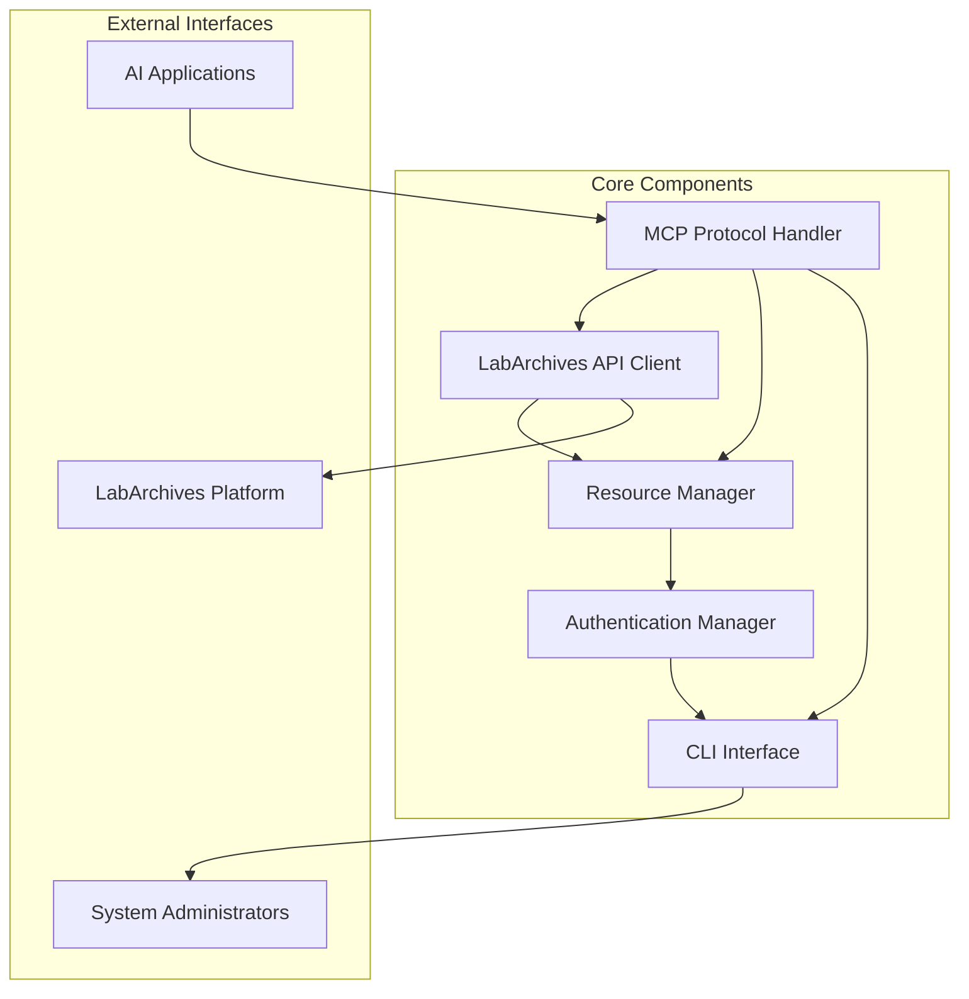
```mermaid
graph TB
    A[MCP Protocol Handler] --> B[LabArchives API Client]
    A --> C[Resource Manager]
    B --> C
    C --> D[Authentication Manager]
    A --> E[CLI Interface]
    D --> E
    
    subgraph "Core Components"
        A
        B
        C
        D
        E
    end
    
    subgraph "External Interfaces"
        F[AI Applications] --> A
        B --> G[LabArchives Platform]
        E --> H[System Administrators]
    end
```

**MCP Protocol Handler**: Implements JSON-RPC 2.0 communication protocol, managing bidirectional communication between AI applications and the LabArchives data layer.

**LabArchives API Client**: Provides REST API integration with LabArchives platforms, handling authentication, request management, and data transformation.

**Resource Manager**: Orchestrates content discovery and delivery, managing hierarchical data relationships and contextual metadata assembly.

**Authentication Manager**: Handles credential management, session management, and access control enforcement across all system interactions.

**CLI Interface**: Provides command-line configuration and control capabilities for system administrators and advanced users.

#### 1.2.2.3 Core Technical Approach

The system employs a single-process, stateless desktop application architecture built on modern Python frameworks. The FastMCP framework provides MCP protocol implementation, while Pydantic ensures robust data validation and type safety throughout the system.

The architecture prioritizes simplicity and reliability, avoiding complex distributed system patterns in favor of straightforward, maintainable code structures. This approach reduces operational overhead while ensuring consistent performance and predictable behavior.

### 1.2.3 Success Criteria

#### 1.2.3.1 Measurable Objectives

The system's success is evaluated against quantifiable performance and adoption metrics:

| Objective Category | Target Metric | Measurement Method |
|---|---|---|
| Performance Efficiency | 60-80% reduction in AI analysis preparation time | Time-to-insight benchmarking |
| Data Access Coverage | 100% of accessible LabArchives content | Resource enumeration completeness |
| System Reliability | 99.5% uptime for production deployments | System monitoring and alerting |
| Protocol Compliance | 100% MCP specification adherence | Automated protocol testing |

#### 1.2.3.2 Critical Success Factors

**Technical Excellence**: The system must demonstrate robust performance, reliable operation, and seamless integration with existing research workflows without introducing complexity or maintenance overhead.

**User Adoption**: Success depends on widespread adoption across research teams, requiring intuitive configuration, minimal operational overhead, and clear value demonstration.

**Ecosystem Integration**: The system must integrate effectively with diverse AI platforms and research tools, ensuring broad compatibility and future-proofing against evolving standards.

**Compliance and Security**: Maintaining comprehensive audit trails, secure data handling, and regulatory compliance is essential for enterprise adoption and long-term viability.

#### 1.2.3.3 Key Performance Indicators

**Operational KPIs**:
- Average response time for resource discovery operations
- Data retrieval throughput measured in records per second
- System availability percentage during business hours
- Authentication success rate and security incident frequency

**Business KPIs**:
- User adoption rate across research teams
- Time savings achieved per research workflow
- Number of AI-enhanced analyses completed per period
- Research output quality improvements measured through peer review metrics

## 1.3 SCOPE

### 1.3.1 In-Scope

#### 1.3.1.1 Core Features and Functionalities

The LabArchives MCP Server implementation encompasses the following essential capabilities:

**Complete MCP Protocol Implementation**: The system implements full MCP protocol support, including resources/list and resources/read operations, ensuring compatibility with all MCP-compliant AI applications and tools.

**Read-Only LabArchives Data Access**: The system provides comprehensive read access to LabArchives content, including notebooks, pages, entries, and associated metadata, while maintaining data integrity through read-only operations.

**CLI-Based Configuration and Operation**: A command-line interface enables system configuration, operation control, and administrative management, supporting both interactive and automated deployment scenarios.

**Configurable Scope Limitation**: The system supports configurable access scope limitation at notebook and folder levels, enabling fine-grained control over data exposure and access permissions.

**Comprehensive Audit Logging**: All system operations generate detailed audit logs, providing complete traceability for compliance requirements and security monitoring.

#### 1.3.1.2 Primary User Workflows

The system supports the following core user workflows:

- **Research Data Discovery**: AI applications can enumerate available notebooks, pages, and entries to identify relevant research data for analysis
- **Contextual Content Retrieval**: Detailed content retrieval with metadata enables AI systems to access rich experimental context and historical information
- **Secure Authentication**: Credential-based authentication ensures secure access to research data while maintaining audit trails
- **Scope-Limited Access**: Configurable access boundaries enable controlled data exposure based on organizational requirements

#### 1.3.1.3 Essential Integrations

**LabArchives Platform Integration**: Direct REST API integration with LabArchives platforms enables seamless data access and retrieval across all supported LabArchives deployments.

**MCP-Compliant AI Applications**: The system integrates with any MCP-compliant AI application or tool, providing universal compatibility across the AI ecosystem.

**Enterprise Infrastructure**: Docker containerization and Kubernetes manifest support enable integration with existing enterprise container orchestration platforms.

#### 1.3.1.4 Implementation Boundaries

**System Boundaries**: The system operates as a bridge component between LabArchives data repositories and AI applications, maintaining clear separation of concerns and avoiding duplication of existing functionality.

**User Groups Covered**: The system supports individual researchers, research teams, and enterprise-scale deployments across academic and commercial research organizations.

**Geographic and Market Coverage**: The system supports global deployment with no geographic restrictions, compatible with all LabArchives platform instances regardless of location.

**Data Domains Included**: All accessible LabArchives content types are supported, including text entries, metadata, hierarchical relationships, and associated experimental data.

### 1.3.2 Out-of-Scope

#### 1.3.2.1 Excluded Features and Capabilities

The following capabilities are explicitly excluded from the current implementation:

**Write Operations to LabArchives**: The system maintains read-only access to preserve data integrity and security, excluding any modification, creation, or deletion operations.

**Real-Time Data Synchronization**: The system operates on a request-response model without real-time synchronization capabilities or change notification mechanisms.

**Multi-Tenant Deployments**: The current implementation supports single-tenant deployments only, excluding shared infrastructure or multi-organization scenarios.

**Enterprise Management Features**: Advanced enterprise features such as centralized user management, role-based access control, and organizational hierarchy management are not included.

**Binary File Content Processing**: The system focuses on text-based content and metadata, excluding processing of binary file formats or multimedia content.

**Graphical User Interface**: The system provides CLI-based interaction only, excluding web-based or desktop GUI interfaces.

#### 1.3.2.2 Future Phase Considerations

**Enhanced Write Capabilities**: Future development phases may include controlled write operations for specific use cases, subject to security and compliance requirements.

**Advanced Analytics Integration**: Integration with specialized analytics platforms and research workflow management systems may be considered for future releases.

**Extended Protocol Support**: Support for additional data access protocols beyond MCP may be evaluated based on ecosystem evolution and user requirements.

#### 1.3.2.3 Integration Points Not Covered

**Legacy System Integration**: Integration with legacy research systems outside the LabArchives ecosystem is not supported in the current implementation.

**Third-Party Authentication Systems**: Advanced authentication integration with enterprise identity providers, LDAP, or single sign-on systems is not included.

**Data Export and Transformation**: Advanced data export formats and transformation capabilities beyond the standard MCP protocol are not supported.

#### 1.3.2.4 Unsupported Use Cases

**High-Volume Data Processing**: The system is not designed for bulk data processing or high-volume analytical workloads that exceed typical AI application requirements.

**Collaborative Editing**: Real-time collaborative editing or concurrent modification capabilities are not supported given the read-only operational model.

**Complex Workflow Orchestration**: Advanced workflow orchestration, task scheduling, or batch processing capabilities are outside the system's scope.

#### References

- `/README.md` - Project overview and user documentation
- `/blitzy/documentation/Input Prompt.md` - Product Requirements Document containing business context and stakeholder information
- `/blitzy/documentation/Technical Specifications_916f36fe-6c43-4713-80b6-8444416b5a59.md` - Complete technical specification with system architecture details
- `/blitzy/documentation/Project Guide.md` - Project status and completion tracking information
- `/src/` - Main source code directory containing implementation details
- `/src/cli/` - CLI application implementation providing user interface capabilities
- `/src/cli/mcp/` - MCP protocol implementation handling AI application communication
- `/infrastructure/` - Deployment configurations including Docker and Kubernetes manifests
- `/.github/` - CI/CD workflows and development templates

# 2. PRODUCT REQUIREMENTS

## 2.1 FEATURE CATALOG

### 2.1.1 F-001: MCP Protocol Implementation

| Attribute | Value |
|-----------|-------|
| **Feature ID** | F-001 |
| **Feature Name** | MCP Protocol Implementation |
| **Category** | Core Infrastructure |
| **Priority** | Critical |
| **Status** | In Development |

#### 2.1.1.1 Description

**Overview:** Implements the Model Context Protocol (MCP) as the foundational communication layer between AI applications and the LabArchives data source. The server exposes LabArchives notebook data as MCP resources consumable by Claude Desktop and other MCP-compatible clients through standardized JSON-RPC 2.0 messaging.

**Business Value:** Enables seamless AI-to-data integration without custom implementations, positioning organizations within the rapidly expanding MCP ecosystem adopted by Anthropic, OpenAI, and Google DeepMind, supporting the strategic technology positioning identified in the business impact analysis.

**User Benefits:** Researchers can access LabArchives notebook content directly through AI assistants, eliminating manual data transfer and enabling AI-enhanced research workflows with the expected 60-80% reduction in analysis preparation time outlined in the success criteria.

**Technical Context:** Built on FastMCP 2.0 framework with official MCP Python SDK, implementing resources/list and resources/read capabilities over stdio/WebSocket transports with full JSON-RPC 2.0 compliance as specified in the MCP 2024-11-05 protocol.

#### 2.1.1.2 Dependencies

| Dependency Type | Details |
|----------------|---------|
| **Prerequisite Features** | None (foundational feature) |
| **System Dependencies** | Python MCP SDK (mcp>=1.0.0), FastMCP framework (fastmcp>=1.0.0), JSON-RPC transport layer |
| **External Dependencies** | MCP specification compliance (version 2024-11-05), Claude Desktop compatibility |
| **Integration Requirements** | Secure credential management, stdio/WebSocket transport configuration |

---

### 2.1.2 F-002: LabArchives API Integration

| Attribute | Value |
|-----------|-------|
| **Feature ID** | F-002 |
| **Feature Name** | LabArchives API Integration |
| **Category** | Data Access |
| **Priority** | Critical |
| **Status** | In Development |

#### 2.1.2.1 Description

**Overview:** Provides secure, authenticated access to LabArchives electronic lab notebook data through their REST API, supporting both permanent API keys and temporary user tokens with regional endpoint configuration for US, Australia, and UK deployments.

**Business Value:** Leverages existing institutional investments in LabArchives infrastructure, enabling direct access to valuable research data without migration or duplication, supporting the integration with existing enterprise landscape requirements.

**User Benefits:** Researchers maintain familiar LabArchives workflows while gaining AI capabilities, with support for global deployment across all LabArchives platform instances regardless of location as defined in the geographic coverage scope.

**Technical Context:** Implements HTTPS REST client with HMAC-SHA256 authentication, automatic retry logic with exponential backoff, and comprehensive error handling for XML/JSON response parsing from the LabArchives API.

#### 2.1.2.2 Dependencies

| Dependency Type | Details |
|----------------|---------|
| **Prerequisite Features** | None (foundational feature) |
| **System Dependencies** | requests library (>=2.31.0), urllib3 (>=2.0.0), XML/JSON parsing |
| **External Dependencies** | LabArchives API availability, valid authentication credentials |
| **Integration Requirements** | Environment variable configuration, secure credential storage, regional endpoint selection |

---

### 2.1.3 F-003: Resource Discovery and Listing

| Attribute | Value |
|-----------|-------|
| **Feature ID** | F-003 |
| **Feature Name** | Resource Discovery and Listing |
| **Category** | Data Management |
| **Priority** | High |
| **Status** | In Development |

#### 2.1.3.1 Description

**Overview:** Implements MCP resources/list capability to enumerate available notebooks, pages, and entries within configured scope, providing hierarchical navigation of LabArchives data structures with URI-based resource identification supporting the research data discovery workflow.

**Business Value:** Improves data accessibility and utilization by enabling users to discover and navigate research data through AI interfaces, contributing to the 100% data access coverage target defined in the success criteria.

**User Benefits:** Research scientists, principal investigators, and graduate students can browse notebook structures through AI applications using familiar hierarchical organization, with resource URIs following the labarchives:// scheme for consistent identification.

**Technical Context:** Implements parse_resource_uri and is_resource_in_scope functions with MAX_RESOURCE_URI_LENGTH validation, transforming LabArchives API responses into MCPResource objects compatible with the MCP protocol specification.

#### 2.1.3.2 Dependencies

| Dependency Type | Details |
|----------------|---------|
| **Prerequisite Features** | F-001 (MCP Protocol), F-002 (LabArchives API) |
| **System Dependencies** | Pydantic models (>=2.11.7), URI parsing utilities |
| **External Dependencies** | LabArchives notebook permissions |
| **Integration Requirements** | Scope configuration validation, permission enforcement |

---

### 2.1.4 F-004: Content Retrieval and Contextualization

| Attribute | Value |
|-----------|-------|
| **Feature ID** | F-004 |
| **Feature Name** | Content Retrieval and Contextualization |
| **Category** | Data Management |
| **Priority** | High |
| **Status** | In Development |

#### 2.1.4.1 Description

**Overview:** Implements MCP resources/read capability to fetch detailed content from specific notebook pages and entries, preserving metadata and hierarchical context for AI consumption, supporting the contextual content retrieval workflow essential for AI-enhanced research.

**Business Value:** Provides AI applications with rich, contextual research data maintaining original structure and metadata from LabArchives, enabling sophisticated analytical capabilities and enhancing research reproducibility as outlined in the business impact analysis.

**User Benefits:** AI assistants access complete experimental data with proper context including timestamps, authors, and hierarchical relationships, addressing the limited context awareness challenge identified in current system limitations.

**Technical Context:** Returns MCPResourceContent with structured JSON output, optional JSON-LD semantic enrichment via MCP_JSONLD_CONTEXT, and comprehensive metadata preservation including experimental parameters and research context.

#### 2.1.4.2 Dependencies

| Dependency Type | Details |
|----------------|---------|
| **Prerequisite Features** | F-001 (MCP Protocol), F-002 (LabArchives API), F-003 (Resource Discovery) |
| **System Dependencies** | JSON-LD support (optional), Pydantic serialization |
| **External Dependencies** | LabArchives content permissions |
| **Integration Requirements** | Content transformation utilities, metadata preservation logic |

---

### 2.1.5 F-005: Authentication and Security Management

| Attribute | Value |
|-----------|-------|
| **Feature ID** | F-005 |
| **Feature Name** | Authentication and Security Management |
| **Category** | Security |
| **Priority** | Critical |
| **Status** | In Development |

#### 2.1.5.1 Description

**Overview:** Implements secure authentication mechanisms for LabArchives API access with dual-mode support for permanent API keys and temporary SSO user tokens, including session management and credential security to address compliance and security requirements.

**Business Value:** Ensures secure access to sensitive research data while maintaining compliance with regulatory requirements, supporting the comprehensive compliance and governance capabilities essential for enterprise adoption.

**User Benefits:** IT administrators and compliance officers can securely manage researcher access to LabArchives accounts with automatic token renewal detection and clear error messaging for expired credentials, supporting the stakeholder requirements for secure data handling.

**Technical Context:** AuthenticationManager class with AUTH_SESSION_LIFETIME_SECONDS (3600), credential sanitization, environment-only storage, and comprehensive audit logging for compliance requirements.

#### 2.1.5.2 Dependencies

| Dependency Type | Details |
|----------------|---------|
| **Prerequisite Features** | F-002 (LabArchives API) |
| **System Dependencies** | Environment variable handling, secure in-memory storage |
| **External Dependencies** | LabArchives authentication services |
| **Integration Requirements** | Credential validation, token lifecycle management |

---

### 2.1.6 F-006: CLI Interface and Configuration

| Attribute | Value |
|-----------|-------|
| **Feature ID** | F-006 |
| **Feature Name** | CLI Interface and Configuration |
| **Category** | User Interface |
| **Priority** | High |
| **Status** | In Development |

#### 2.1.6.1 Description

**Overview:** Provides comprehensive command-line interface for server configuration, credential management, and operational control with subcommands for start, authenticate, and config operations, supporting the CLI-based configuration and operation requirement defined in the project scope.

**Business Value:** Simplifies deployment and configuration for technical users, reducing setup complexity and enabling automation, supporting both interactive and automated deployment scenarios as required by the system architecture.

**User Benefits:** IT administrators and software developers can easily configure and deploy the server using familiar command-line tools with clear help documentation, supporting the stakeholder requirements for standardized integration protocol and reduced maintenance overhead.

**Technical Context:** Implements argparse-based CLI with environment variable support, configuration file loading, and comprehensive validation across all settings, maintaining the single-process, stateless desktop application architecture.

#### 2.1.6.2 Dependencies

| Dependency Type | Details |
|----------------|---------|
| **Prerequisite Features** | F-005 (Authentication) |
| **System Dependencies** | Python argparse, os.environ, configuration validators |
| **External Dependencies** | None |
| **Integration Requirements** | Configuration precedence (CLI > env > file > defaults) |

---

### 2.1.7 F-007: Scope Limitation and Access Control

| Attribute | Value |
|-----------|-------|
| **Feature ID** | F-007 |
| **Feature Name** | Scope Limitation and Access Control |
| **Category** | Security |
| **Priority** | High |
| **Status** | In Development |

#### 2.1.7.1 Description

**Overview:** Implements configurable scope limitations to restrict data exposure to specific notebooks or folders, providing granular access control for sensitive research data as specified in the configurable scope limitation requirement within the project scope.

**Business Value:** Enables controlled data sharing with AI applications, minimizing risk of unauthorized data exposure while maintaining fine-grained control over data access permissions essential for compliance and security.

**User Benefits:** Principal investigators and compliance officers can limit AI access to specific projects using notebook ID, notebook name, or folder path restrictions, supporting the stakeholder requirements for data security and regulatory compliance.

**Technical Context:** Enforced through ScopeConfig model with mutual exclusivity validation, applied at resource listing and content retrieval levels to ensure consistent access control across all system operations.

#### 2.1.7.2 Dependencies

| Dependency Type | Details |
|----------------|---------|
| **Prerequisite Features** | F-003 (Resource Discovery), F-004 (Content Retrieval) |
| **System Dependencies** | Configuration management, scope validators |
| **External Dependencies** | LabArchives permission model |
| **Integration Requirements** | Scope validation in ResourceManager |

---

### 2.1.8 F-008: Comprehensive Audit Logging

| Attribute | Value |
|-----------|-------|
| **Feature ID** | F-008 |
| **Feature Name** | Comprehensive Audit Logging |
| **Category** | Compliance |
| **Priority** | High |
| **Status** | In Development |

#### 2.1.8.1 Description

**Overview:** Implements comprehensive logging of all data access operations, API calls, and system events with structured formatters and rotating file handlers for compliance requirements, supporting the comprehensive audit logging capability specified in the project scope.

**Business Value:** Provides complete traceability and accountability for data access, supporting SOC2, ISO 27001, HIPAA, and GDPR compliance requirements essential for enterprise adoption and regulatory compliance.

**User Benefits:** Compliance officers and IT administrators can track data usage patterns with separate operational and audit logs for security monitoring, supporting the stakeholder requirements for comprehensive audit trails and regulatory compliance.

**Technical Context:** Dual-logger system with StructuredFormatter supporting JSON and human-readable formats, configurable rotation policies (10MB/5 backups main, 50MB/10 backups audit) ensuring comprehensive system monitoring capabilities.

#### 2.1.8.2 Dependencies

| Dependency Type | Details |
|----------------|---------|
| **Prerequisite Features** | All features (cross-cutting concern) |
| **System Dependencies** | Python logging framework, RotatingFileHandler |
| **External Dependencies** | None |
| **Integration Requirements** | Log directory creation, format configuration |

---

## 2.2 FUNCTIONAL REQUIREMENTS TABLE

### 2.2.1 F-001: MCP Protocol Implementation

| Requirement ID | Description | Acceptance Criteria | Priority | Complexity |
|---------------|-------------|-------------------|----------|------------|
| **F-001-RQ-001** | FastMCP Server Initialization | Server initializes with MCP capabilities and metadata | Must-Have | Medium |
| **F-001-RQ-002** | JSON-RPC Message Handling | Parse and validate JSON-RPC 2.0 messages | Must-Have | Medium |
| **F-001-RQ-003** | Protocol Handshake | Complete initialize method with version negotiation | Must-Have | Low |
| **F-001-RQ-004** | Resource Capability Declaration | Advertise resources/list and resources/read capabilities | Must-Have | Low |

#### 2.2.1.1 Technical Specifications

| Requirement | Input Parameters | Output/Response | Performance Criteria | Data Requirements |
|-------------|------------------|-----------------|-------------------|-------------------|
| **F-001-RQ-001** | Server configuration | MCP server instance | < 2 seconds startup | Server metadata |
| **F-001-RQ-002** | JSON-RPC messages | Structured responses | < 100ms per message | Message validation |
| **F-001-RQ-003** | Initialize request | Server capabilities | < 1 second response | Protocol version |
| **F-001-RQ-004** | Capability query | Capability list | < 50ms response | Feature inventory |

#### 2.2.1.2 Validation Rules

| Requirement | Business Rules | Data Validation | Security Requirements | Compliance Requirements |
|-------------|---------------|-----------------|---------------------|----------------------|
| **F-001-RQ-001** | Single server instance per user | Valid configuration parameters | Secure initialization | MCP 2024-11-05 compliance |
| **F-001-RQ-002** | JSON-RPC 2.0 format only | Message structure validation | Input sanitization | Protocol specification |
| **F-001-RQ-003** | Compatible versions only | Version string validation | No credential exposure | Standard handshake |
| **F-001-RQ-004** | Accurate capability reporting | Capability list validation | No over-reporting | MCP capability spec |

---

### 2.2.2 F-002: LabArchives API Integration

| Requirement ID | Description | Acceptance Criteria | Priority | Complexity |
|---------------|-------------|-------------------|----------|------------|
| **F-002-RQ-001** | Dual Authentication Modes | Support API key and SSO token authentication | Must-Have | Medium |
| **F-002-RQ-002** | Regional Endpoint Support | Configure US, AU, UK API endpoints | Must-Have | Low |
| **F-002-RQ-003** | Retry Logic Implementation | Exponential backoff for transient failures | Must-Have | Medium |
| **F-002-RQ-004** | Response Format Handling | Parse both XML and JSON API responses | Must-Have | Medium |

#### 2.2.2.1 Technical Specifications

| Requirement | Input Parameters | Output/Response | Performance Criteria | Data Requirements |
|-------------|------------------|-----------------|-------------------|-------------------|
| **F-002-RQ-001** | Access key/token, optional username | AuthSession object | < 3 seconds | Valid credentials |
| **F-002-RQ-002** | Region code or URL | API base URL | Immediate | Region mapping |
| **F-002-RQ-003** | Failed request | Retry attempt | 3 retries max | Backoff calculation |
| **F-002-RQ-004** | Raw API response | Parsed models | < 500ms parsing | Format detection |

#### 2.2.2.2 Validation Rules

| Requirement | Business Rules | Data Validation | Security Requirements | Compliance Requirements |
|-------------|---------------|-----------------|---------------------|----------------------|
| **F-002-RQ-001** | Valid credentials required | Credential format check | Secure storage | Authentication standards |
| **F-002-RQ-002** | HTTPS endpoints only | URL scheme validation | TLS 1.2+ required | Regional compliance |
| **F-002-RQ-003** | Max 3 retry attempts | Status code checks | No credential retry | API usage policies |
| **F-002-RQ-004** | Well-formed responses | Schema validation | No data corruption | Data integrity |

---

### 2.2.3 F-003: Resource Discovery and Listing

| Requirement ID | Description | Acceptance Criteria | Priority | Complexity |
|---------------|-------------|-------------------|----------|------------|
| **F-003-RQ-001** | URI Scheme Implementation | Parse labarchives:// URIs correctly | Must-Have | Low |
| **F-003-RQ-002** | Hierarchical Resource Listing | List notebooks, pages, entries by scope | Must-Have | Medium |
| **F-003-RQ-003** | Scope-Based Filtering | Apply configured scope restrictions | Must-Have | Medium |
| **F-003-RQ-004** | Resource Transformation | Convert API objects to MCPResource | Must-Have | Low |

#### 2.2.3.1 Technical Specifications

| Requirement | Input Parameters | Output/Response | Performance Criteria | Data Requirements |
|-------------|------------------|-----------------|-------------------|-------------------|
| **F-003-RQ-001** | Resource URI | Parsed components | < 10ms | URI validation |
| **F-003-RQ-002** | Scope configuration | Resource array | < 2 seconds | Hierarchy data |
| **F-003-RQ-003** | Resource list, scope | Filtered list | < 100ms filtering | Scope rules |
| **F-003-RQ-004** | API objects | MCPResource list | < 200ms | Model mapping |

#### 2.2.3.2 Validation Rules

| Requirement | Business Rules | Data Validation | Security Requirements | Compliance Requirements |
|-------------|---------------|-----------------|---------------------|----------------------|
| **F-003-RQ-001** | Valid URI format | Regex validation | No path injection | URI specification |
| **F-003-RQ-002** | User permissions apply | Access validation | Permission enforcement | Data access policies |
| **F-003-RQ-003** | Scope boundaries enforced | Scope validation | No scope bypass | Access control |
| **F-003-RQ-004** | Complete metadata | Field presence | No sensitive data | MCP resource spec |

---

### 2.2.4 F-004: Content Retrieval and Contextualization

| Requirement ID | Description | Acceptance Criteria | Priority | Complexity |
|---------------|-------------|-------------------|----------|------------|
| **F-004-RQ-001** | Page Content Retrieval | Fetch all entries for a page | Must-Have | Medium |
| **F-004-RQ-002** | Metadata Preservation | Include timestamps, authors, hierarchy | Must-Have | Low |
| **F-004-RQ-003** | JSON-LD Context Support | Optional semantic enrichment | Could-Have | Medium |
| **F-004-RQ-004** | Content Size Handling | Handle large pages gracefully | Should-Have | Medium |

#### 2.2.4.1 Technical Specifications

| Requirement | Input Parameters | Output/Response | Performance Criteria | Data Requirements |
|-------------|------------------|-----------------|-------------------|-------------------|
| **F-004-RQ-001** | Page URI | Entry content array | < 5 seconds | Page access |
| **F-004-RQ-002** | Resource data | Enhanced metadata | < 100ms | Metadata fields |
| **F-004-RQ-003** | JSON-LD flag | Semantic context | < 50ms overhead | Context schema |
| **F-004-RQ-004** | Large content | Structured response | < 10 seconds | Memory limits |

#### 2.2.4.2 Validation Rules

| Requirement | Business Rules | Data Validation | Security Requirements | Compliance Requirements |
|-------------|---------------|-----------------|---------------------|----------------------|
| **F-004-RQ-001** | Valid page access | URI validation | Authorized access | MCP read spec |
| **F-004-RQ-002** | Complete metadata | Field validation | No PII exposure | Data standards |
| **F-004-RQ-003** | Valid JSON-LD | Context validation | Semantic security | JSON-LD 1.1 spec |
| **F-004-RQ-004** | Size limits apply | Content validation | Memory protection | Performance SLA |

---

### 2.2.5 F-005: Authentication and Security Management

| Requirement ID | Description | Acceptance Criteria | Priority | Complexity |
|---------------|-------------|-------------------|----------|------------|
| **F-005-RQ-001** | Environment Variable Support | Load credentials from environment | Must-Have | Low |
| **F-005-RQ-002** | Session Lifetime Management | 1-hour session with expiry detection | Must-Have | Medium |
| **F-005-RQ-003** | Credential Sanitization | Remove credentials from logs/errors | Must-Have | Low |
| **F-005-RQ-004** | Multi-Region Authentication | Support regional API authentication | Should-Have | Medium |

#### 2.2.5.1 Technical Specifications

| Requirement | Input Parameters | Output/Response | Performance Criteria | Data Requirements |
|-------------|------------------|-----------------|-------------------|-------------------|
| **F-005-RQ-001** | Environment vars | Credential object | Immediate | Variable names |
| **F-005-RQ-002** | Session object | Validity status | < 10ms check | Timestamp data |
| **F-005-RQ-003** | Log messages | Sanitized output | No overhead | Pattern matching |
| **F-005-RQ-004** | Region, credentials | Auth session | < 3 seconds | Regional config |

#### 2.2.5.2 Validation Rules

| Requirement | Business Rules | Data Validation | Security Requirements | Compliance Requirements |
|-------------|---------------|-----------------|---------------------|----------------------|
| **F-005-RQ-001** | No hardcoded credentials | Format validation | Secure storage | Security standards |
| **F-005-RQ-002** | Auto-expiry at 3600s | Time validation | Session security | Session standards |
| **F-005-RQ-003** | No credential logging | Pattern validation | Log security | Audit compliance |
| **F-005-RQ-004** | Region-specific rules | URL validation | Regional security | Local compliance |

---

### 2.2.6 F-006: CLI Interface and Configuration

| Requirement ID | Description | Acceptance Criteria | Priority | Complexity |
|---------------|-------------|-------------------|----------|------------|
| **F-006-RQ-001** | Subcommand Structure | Implement start, authenticate, config commands | Must-Have | Medium |
| **F-006-RQ-002** | Configuration Precedence | CLI > env > file > defaults ordering | Must-Have | Medium |
| **F-006-RQ-003** | Help Documentation | Comprehensive --help for all commands | Must-Have | Low |
| **F-006-RQ-004** | Configuration Validation | Validate all settings before use | Must-Have | Medium |

#### 2.2.6.1 Technical Specifications

| Requirement | Input Parameters | Output/Response | Performance Criteria | Data Requirements |
|-------------|------------------|-----------------|-------------------|-------------------|
| **F-006-RQ-001** | CLI arguments | Command execution | < 100ms parsing | Command registry |
| **F-006-RQ-002** | Multiple sources | Merged config | < 50ms merge | Config schema |
| **F-006-RQ-003** | Help flag | Help text | Immediate | Documentation |
| **F-006-RQ-004** | Config data | Validation result | < 200ms | Validation rules |

#### 2.2.6.2 Validation Rules

| Requirement | Business Rules | Data Validation | Security Requirements | Compliance Requirements |
|-------------|---------------|-----------------|---------------------|----------------------|
| **F-006-RQ-001** | Valid commands only | Command validation | No injection | CLI standards |
| **F-006-RQ-002** | Precedence rules | Source validation | Secure defaults | Config standards |
| **F-006-RQ-003** | Accurate help text | Content validation | No secrets shown | Documentation standards |
| **F-006-RQ-004** | Complete validation | Schema compliance | Security checks | Configuration compliance |

---

### 2.2.7 F-007: Scope Limitation and Access Control

| Requirement ID | Description | Acceptance Criteria | Priority | Complexity |
|---------------|-------------|-------------------|----------|------------|
| **F-007-RQ-001** | Notebook-Level Scoping | Restrict by notebook ID or name | Must-Have | Medium |
| **F-007-RQ-002** | Folder Path Scoping | Restrict to folder within notebook | Should-Have | Medium |
| **F-007-RQ-003** | Scope Enforcement | Apply scope to all operations | Must-Have | High |
| **F-007-RQ-004** | Mutual Exclusivity | Only one scope type at a time | Must-Have | Low |

#### 2.2.7.1 Technical Specifications

| Requirement | Input Parameters | Output/Response | Performance Criteria | Data Requirements |
|-------------|------------------|-----------------|-------------------|-------------------|
| **F-007-RQ-001** | Notebook identifier | Scope config | < 100ms | Notebook data |
| **F-007-RQ-002** | Folder path | Scope config | < 100ms | Path validation |
| **F-007-RQ-003** | Resource request | Access decision | < 50ms check | Scope rules |
| **F-007-RQ-004** | Multiple scopes | Validation error | Immediate | Config rules |

#### 2.2.7.2 Validation Rules

| Requirement | Business Rules | Data Validation | Security Requirements | Compliance Requirements |
|-------------|---------------|-----------------|---------------------|----------------------|
| **F-007-RQ-001** | Valid notebook only | ID/name validation | Access control | Scope standards |
| **F-007-RQ-002** | Valid path format | Path validation | No traversal | Path security |
| **F-007-RQ-003** | Consistent enforcement | Scope validation | No bypass | Access control |
| **F-007-RQ-004** | Single scope active | Exclusivity check | Clear boundaries | Configuration standards |

---

### 2.2.8 F-008: Comprehensive Audit Logging

| Requirement ID | Description | Acceptance Criteria | Priority | Complexity |
|---------------|-------------|-------------------|----------|------------|
| **F-008-RQ-001** | Dual Logger System | Separate operational and audit logs | Must-Have | Medium |
| **F-008-RQ-002** | Structured Logging | JSON and human-readable formats | Must-Have | Low |
| **F-008-RQ-003** | Log Rotation | Automatic rotation with size limits | Should-Have | Medium |
| **F-008-RQ-004** | Security Event Tracking | Log all authentication and access events | Must-Have | Low |

#### 2.2.8.1 Technical Specifications

| Requirement | Input Parameters | Output/Response | Performance Criteria | Data Requirements |
|-------------|------------------|-----------------|-------------------|-------------------|
| **F-008-RQ-001** | Log events | Dual log streams | < 10ms per event | Event metadata |
| **F-008-RQ-002** | Log data | Formatted output | < 5ms formatting | Format config |
| **F-008-RQ-003** | Log size | Rotated files | Background process | Rotation config |
| **F-008-RQ-004** | Security events | Audit entries | < 10ms logging | Event context |

#### 2.2.8.2 Validation Rules

| Requirement | Business Rules | Data Validation | Security Requirements | Compliance Requirements |
|-------------|---------------|-----------------|---------------------|----------------------|
| **F-008-RQ-001** | Complete separation | Stream validation | Log integrity | Audit standards |
| **F-008-RQ-002** | Valid JSON format | Format validation | No sensitive data | Log standards |
| **F-008-RQ-003** | Size limits enforced | File validation | Disk protection | Retention policies |
| **F-008-RQ-004** | All events captured | Event validation | Security tracking | Compliance logging |

---

## 2.3 FEATURE RELATIONSHIPS

### 2.3.1 Feature Dependencies Map

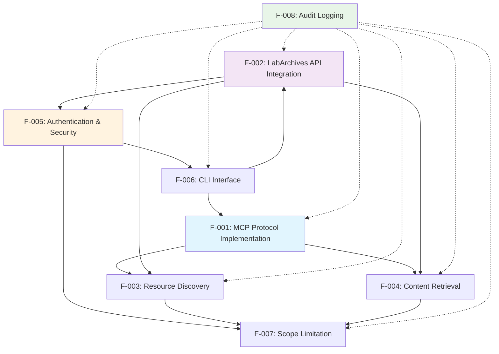
```mermaid
graph TB
    F001[F-001: MCP Protocol Implementation] --> F003[F-003: Resource Discovery]
    F001 --> F004[F-004: Content Retrieval]
    
    F002[F-002: LabArchives API Integration] --> F003
    F002 --> F004
    F002 --> F005[F-005: Authentication & Security]
    
    F005 --> F006[F-006: CLI Interface]
    F005 --> F007[F-007: Scope Limitation]
    
    F003 --> F007
    F004 --> F007
    
    F006 --> F001
    F006 --> F002
    
    F008[F-008: Audit Logging] -.-> F001
    F008 -.-> F002
    F008 -.-> F003
    F008 -.-> F004
    F008 -.-> F005
    F008 -.-> F006
    F008 -.-> F007
    
    style F001 fill:#e1f5fe
    style F002 fill:#f3e5f5
    style F005 fill:#fff3e0
    style F008 fill:#e8f5e8
```

### 2.3.2 Integration Points

| Integration Point | Features Involved | Description | Shared Components |
|------------------|-------------------|-------------|-------------------|
| **MCP Resource Interface** | F-001, F-003, F-004 | Protocol implementation for resource operations | MCPProtocolHandler, ResourceManager |
| **LabArchives Data Access** | F-002, F-005, F-007 | Authenticated API access with scope controls | LabArchivesAPIClient, AuthenticationManager |
| **Configuration Management** | F-005, F-006, F-007 | Centralized settings for security and scope | ServerConfiguration, validators |
| **Audit Trail System** | F-008, All Features | Cross-cutting logging infrastructure | StructuredFormatter, dual loggers |

### 2.3.3 Common Services

| Service | Description | Used By Features |
|---------|-------------|------------------|
| **JSON Serialization Service** | Pydantic models and JSON handling | F-003, F-004, F-008 |
| **Error Handling Service** | Centralized exception management | All Features |
| **Validation Service** | Configuration and input validation | F-005, F-006, F-007 |
| **URI Parsing Service** | Resource URI handling and validation | F-003, F-004 |

---

## 2.4 IMPLEMENTATION CONSIDERATIONS

### 2.4.1 F-001: MCP Protocol Implementation

| Consideration | Details |
|---------------|---------|
| **Technical Constraints** | Must use FastMCP 2.0 framework, JSON-RPC 2.0 compliance mandatory, single-process desktop application architecture |
| **Performance Requirements** | < 100ms message processing, support for long-running sessions, 99.5% uptime target |
| **Scalability Considerations** | Single-user desktop model, process isolation per user, no multi-tenant support |
| **Security Implications** | Local IPC only, no network exposure by default, secure initialization protocols |
| **Maintenance Requirements** | FastMCP and MCP SDK version management, protocol specification updates |

### 2.4.2 F-002: LabArchives API Integration

| Consideration | Details |
|---------------|---------|
| **Technical Constraints** | Regional API endpoints (US, AU, UK), XML/JSON dual format support, HTTPS-only connections |
| **Performance Requirements** | < 10 seconds for content retrieval, connection pooling, average response time optimization |
| **Scalability Considerations** | Rate limit compliance, retry logic implementation, large notebook handling |
| **Security Implications** | HMAC-SHA256 authentication, TLS 1.2+ requirement, credential security |
| **Maintenance Requirements** | API endpoint updates, authentication protocol changes, regional compliance updates |

### 2.4.3 F-003: Resource Discovery and Listing

| Consideration | Details |
|---------------|---------|
| **Technical Constraints** | MAX_RESOURCE_URI_LENGTH enforcement, URI scheme validation, hierarchical data structures |
| **Performance Requirements** | < 2 seconds for resource listing, efficient hierarchy traversal, 100% data access coverage |
| **Scalability Considerations** | Large notebook handling (100+ pages), memory-efficient enumeration |
| **Security Implications** | Permission-based filtering, scope validation, access control enforcement |
| **Maintenance Requirements** | URI scheme evolution, model updates, permission model alignment |

### 2.4.4 F-004: Content Retrieval and Contextualization

| Consideration | Details |
|---------------|---------|
| **Technical Constraints** | Memory constraints for large entries, JSON-LD optional support, metadata preservation |
| **Performance Requirements** | < 5 seconds retrieval, streaming for large content, data retrieval throughput optimization |
| **Scalability Considerations** | Handling pages with 100+ entries, efficient content transformation |
| **Security Implications** | Content sanitization, metadata security, authorized access validation |
| **Maintenance Requirements** | Schema evolution, serialization updates, context enrichment enhancements |

### 2.4.5 F-005: Authentication and Security Management

| Consideration | Details |
|---------------|---------|
| **Technical Constraints** | Environment-only credential storage, 3600s session lifetime, dual authentication modes |
| **Performance Requirements** | < 3 seconds authentication, immediate session checks, authentication success rate monitoring |
| **Scalability Considerations** | Token renewal handling, multi-region support, session management optimization |
| **Security Implications** | No disk persistence, credential sanitization, comprehensive audit logging |
| **Maintenance Requirements** | Authentication protocol updates, regional compliance updates, security standard alignment |

### 2.4.6 F-006: CLI Interface and Configuration

| Consideration | Details |
|---------------|---------|
| **Technical Constraints** | Python argparse framework, cross-platform paths, configuration precedence rules |
| **Performance Requirements** | < 100ms command parsing, immediate response, configuration validation efficiency |
| **Scalability Considerations** | Configuration complexity management, multiple configuration sources |
| **Security Implications** | Secure credential input, no logging of secrets, configuration validation |
| **Maintenance Requirements** | Command evolution, help documentation updates, configuration schema changes |

### 2.4.7 F-007: Scope Limitation and Access Control

| Consideration | Details |
|---------------|---------|
| **Technical Constraints** | Mutual exclusivity enforcement, path validation, scope configuration limits |
| **Performance Requirements** | < 50ms access decisions, efficient filtering, consistent enforcement |
| **Scalability Considerations** | Complex folder hierarchies, large-scale permission management |
| **Security Implications** | Scope bypass prevention, consistent enforcement, access control validation |
| **Maintenance Requirements** | Permission model alignment, scope validation updates, security policy compliance |

### 2.4.8 F-008: Comprehensive Audit Logging

| Consideration | Details |
|---------------|---------|
| **Technical Constraints** | Rotating file handlers, dual logger separation, structured formatting |
| **Performance Requirements** | < 10ms logging overhead, asynchronous writes, log processing efficiency |
| **Scalability Considerations** | Log rotation (10MB main, 50MB audit), retention policy management |
| **Security Implications** | No sensitive data in logs, secure storage, audit trail integrity |
| **Maintenance Requirements** | Format evolution, retention policies, compliance standard updates |

---

## 2.5 TRACEABILITY MATRIX

### 2.5.1 Business Requirements to Features

| Business Requirement | Feature ID | Functional Requirements | Acceptance Criteria |
|---------------------|------------|------------------------|-------------------|
| **MCP Protocol Compliance** | F-001 | F-001-RQ-001 to F-001-RQ-004 | FastMCP server initialization with full capabilities |
| **LabArchives Data Access** | F-002 | F-002-RQ-001 to F-002-RQ-004 | Dual auth modes, regional support, retry logic |
| **Resource Discovery** | F-003 | F-003-RQ-001 to F-003-RQ-004 | URI parsing, hierarchical listing, scope filtering |
| **Content Retrieval** | F-004 | F-004-RQ-001 to F-004-RQ-004 | Complete page content with metadata preservation |
| **Security Management** | F-005 | F-005-RQ-001 to F-005-RQ-004 | Environment variables, session management, sanitization |
| **CLI Configuration** | F-006 | F-006-RQ-001 to F-006-RQ-004 | Subcommands, precedence, validation |
| **Access Control** | F-007 | F-007-RQ-001 to F-007-RQ-004 | Notebook/folder scoping with enforcement |
| **Audit Compliance** | F-008 | F-008-RQ-001 to F-008-RQ-004 | Dual loggers, structured format, rotation |

### 2.5.2 Stakeholder Requirements Mapping

| Stakeholder Group | Primary Requirements | Supporting Features | Expected Benefits |
|-------------------|---------------------|-------------------|-------------------|
| **Research Scientists** | AI-assisted data analysis | F-001, F-003, F-004 | 60-80% time reduction |
| **Principal Investigators** | Data integrity and context | F-004, F-007, F-008 | Enhanced reproducibility |
| **Graduate Students** | Streamlined AI access | F-001, F-006 | Simplified workflows |
| **IT Administrators** | System management | F-005, F-006, F-008 | Standardized protocol |
| **Compliance Officers** | Audit and security | F-005, F-007, F-008 | Regulatory compliance |
| **Software Developers** | Integration capabilities | F-001, F-002, F-006 | Universal MCP protocol |

### 2.5.3 Success Criteria Alignment

| Success Metric | Target | Supporting Features | Measurement Method |
|---------------|--------|-------------------|-------------------|
| **Analysis Time Reduction** | 60-80% | F-001, F-003, F-004 | Time-to-insight benchmarking |
| **Data Access Coverage** | 100% | F-002, F-003, F-007 | Resource enumeration completeness |
| **System Reliability** | 99.5% uptime | F-001, F-005, F-008 | System monitoring and alerting |
| **Protocol Compliance** | 100% MCP adherence | F-001, F-003, F-004 | Automated protocol testing |

---

#### References

- `/src/cli/` - CLI application implementation providing user interface capabilities
- `/src/cli/mcp/` - MCP protocol implementation handling AI application communication
- `/src/mcp_server/` - Core MCP server implementation with protocol handlers
- `/src/labarchives/` - LabArchives API integration and data access components
- `/src/config/` - Configuration management and validation systems
- `/src/auth/` - Authentication and security management components
- `/src/logging/` - Comprehensive audit logging implementation
- `/infrastructure/` - Deployment configurations including Docker and Kubernetes manifests
- `/README.md` - Project overview and user documentation
- `/pyproject.toml` - Python project configuration and dependencies
- `/docker-compose.yml` - Container orchestration configuration
- `/.github/workflows/` - CI/CD pipeline definitions

# 3. TECHNOLOGY STACK

## 3.1 PROGRAMMING LANGUAGES

### 3.1.1 Python (Primary Language)

#### 3.1.1.1 Version Requirements
- **Primary Version**: Python 3.11+
- **Supported Version**: Python 3.12+
- **Container Base**: Python 3.11-slim-bookworm

#### 3.1.1.2 Selection Justification
Python serves as the foundational language for the LabArchives MCP Server based on several critical factors:

**Ecosystem Alignment**: Python provides robust support for the Model Context Protocol through official Anthropic MCP SDK and FastMCP framework, ensuring compatibility with the rapidly evolving AI-data integration ecosystem.

**Async Programming Capabilities**: Modern Python (3.11+) offers enhanced async/await support essential for implementing JSON-RPC 2.0 communication protocols and managing long-running MCP sessions without blocking operations.

**Research Community Adoption**: Python's dominance in research and data science communities aligns with the target user base of research scientists, principal investigators, and graduate students accessing LabArchives data.

**Type Safety and Validation**: Python 3.11+ type hints combined with Pydantic provide robust data validation and type safety throughout the system, essential for maintaining data integrity when handling scientific research data.

#### 3.1.1.3 Constraints and Dependencies
- **Minimum Version Constraint**: Python 3.11 required for optimal async performance and modern type system features
- **Security Consideration**: Python 3.11-slim-bookworm container base chosen for reduced attack surface and smaller image size
- **Memory Efficiency**: Single-process, stateless architecture optimized for desktop deployment scenarios

### 3.1.2 Shell Scripting (Supporting Language)

#### 3.1.2.1 Implementation Context
**Bash/Shell**: Used for operational scripts, CI/CD automation, and development utilities located in `infrastructure/scripts/` and `src/cli/scripts/`

**Purpose**: Provides system-level automation for deployment, configuration management, and operational tasks within the containerized environment.

## 3.2 FRAMEWORKS & LIBRARIES

### 3.2.1 Core MCP Implementation

#### 3.2.1.1 MCP Protocol Stack
**mcp (>=1.0.0)**: Official Anthropic Model Context Protocol SDK providing foundational protocol implementation

**fastmcp (>=1.0.0)**: FastMCP framework enabling rapid MCP protocol implementation with JSON-RPC 2.0 communication support

**Selection Rationale**: These frameworks ensure full compliance with MCP specification 2024-11-05 while providing the standardized communication layer required for AI application integration. The combination enables the system to serve as a bridge between LabArchives research data and AI assistants like Claude Desktop.

#### 3.2.1.2 Integration Requirements
- **JSON-RPC 2.0 Compliance**: Mandatory for MCP protocol adherence
- **Bidirectional Communication**: Support for both resource discovery and content retrieval operations
- **Session Management**: Long-running session support for persistent AI interactions

### 3.2.2 Data Validation and Type Safety

#### 3.2.2.1 Pydantic Framework
**pydantic (>=2.11.7)**: Primary data validation framework using Python type annotations

**pydantic-settings (>=2.10.1)**: Environment-based configuration management with type validation

**Implementation Benefits**:
- Ensures robust data validation for scientific research data
- Provides comprehensive type safety throughout the system
- Enables automatic serialization/deserialization of complex data structures
- Supports environment variable configuration with validation

#### 3.2.2.2 Validation Requirements
- **Research Data Integrity**: Critical for maintaining scientific data accuracy
- **Configuration Validation**: Ensures proper system configuration across deployment environments
- **MCP Protocol Compliance**: Validates message structures and data types

### 3.2.3 HTTP and API Communication

#### 3.2.3.1 REST API Client Stack
**requests (>=2.31.0)**: Primary HTTP library for LabArchives REST API communication

**urllib3 (>=2.0.0)**: HTTP client with connection pooling and retry logic support

**labarchives-py (>=0.1.0)**: Official LabArchives Python SDK for API integration

#### 3.2.3.2 Communication Requirements
- **Regional Endpoint Support**: US, Australia, and UK LabArchives API endpoints
- **HMAC-SHA256 Authentication**: Secure API authentication mechanism
- **Retry Logic**: Exponential backoff for handling network failures
- **Connection Pooling**: Efficient connection management for improved performance

### 3.2.4 CLI and Configuration Management

#### 3.2.4.1 Command Line Interface
**click (>=8.0.0)**: Advanced command-line interface creation toolkit

**argparse (built-in)**: Primary CLI parser for configuration and operational commands

**python-dotenv**: Environment variable loading from .env files

#### 3.2.4.2 Configuration Architecture
- **Hierarchical Configuration**: CLI > environment > file > defaults precedence
- **Subcommand Structure**: start, authenticate, and config operations
- **Environment Integration**: Seamless integration with container and development environments

## 3.3 OPEN SOURCE DEPENDENCIES

### 3.3.1 Build and Packaging System

#### 3.3.1.1 Python Packaging
**setuptools (>=65.0.0)**: Python packaging standard for distribution

**build**: PEP 517 compatible build frontend for package creation

**twine**: PyPI publishing utility for package distribution

**wheel**: Built-package format for efficient installation

#### 3.3.1.2 Distribution Strategy
- **PyPI Distribution**: Primary distribution channel as `labarchives-mcp`
- **Container Distribution**: Docker Hub distribution as `labarchives/mcp-server`
- **Source Distribution**: GitHub repository for development and contribution

### 3.3.2 Testing and Quality Assurance

#### 3.3.2.1 Testing Framework
**pytest (>=7.0.0)**: Primary testing framework with comprehensive plugin ecosystem

**pytest-cov (>=4.0.0)**: Code coverage analysis and reporting

**pytest-asyncio (>=0.21.0)**: Async test support for MCP protocol testing

**pytest-mock (>=3.12.0)**: Mock object library for API testing

#### 3.3.2.2 Testing Infrastructure
**coverage (>=7.0.0)**: Code coverage measurement and reporting

**responses (>=0.25.0)**: HTTP request mocking for LabArchives API testing

**httpx (>=0.24.0)**: Async HTTP client for testing scenarios

**respx (>=0.20.0)**: HTTP mocking specifically for httpx testing

### 3.3.3 Code Quality and Security

#### 3.3.3.1 Static Analysis Tools
**mypy (>=1.0.0)**: Static type checker for Python type safety

**black (>=23.0.0)**: Code formatter for consistent code style

**isort (>=5.12.0)**: Import sorting for code organization

**flake8 (>=6.0.0)**: Style guide enforcement and linting

**ruff (>=0.1.0)**: Fast Python linter for comprehensive code analysis

#### 3.3.3.2 Security Analysis
**bandit**: Security linter for identifying common security issues

**safety**: Dependency vulnerability scanner for supply chain security

**semgrep**: Static analysis tool for security pattern detection

**pre-commit (>=3.0.0)**: Git hook framework for automated quality checks

### 3.3.4 Documentation and Development

#### 3.3.4.1 Documentation Generation
**mkdocs (>=1.5.0)**: Documentation site generator for user guides

**mkdocs-material (>=9.0.0)**: Material Design theme for documentation

**mkdocstrings[python] (>=0.22.0)**: Auto-generated API documentation from docstrings

#### 3.3.4.2 Development Tools
**types-requests (>=2.31.0.20240106)**: Type stubs for requests library

**radon**: Code complexity metrics for maintainability analysis

**xenon**: Code complexity monitoring and reporting

## 3.4 THIRD-PARTY SERVICES

### 3.4.1 LabArchives Platform Integration

#### 3.4.1.1 API Endpoints
**Primary Service**: LabArchives Electronic Lab Notebook Platform

**Regional Endpoints**:
- US (Default): `https://api.labarchives.com/api`
- Australia: `https://auapi.labarchives.com/api`
- UK: `https://ukapi.labarchives.com/api`

#### 3.4.1.2 Authentication and Protocol
**Authentication Method**: HMAC-SHA256 signature-based authentication

**Protocol**: REST API with JSON/XML response support

**Transport Security**: TLS 1.2+ requirement for all communications

### 3.4.2 Cloud Infrastructure Services

#### 3.4.2.1 AWS Services Stack
**AWS ECS (Elastic Container Service)**: Container orchestration platform

**AWS Fargate**: Serverless container execution environment

**AWS RDS**: Managed PostgreSQL database (optional for future features)

**AWS CloudWatch**: Centralized logging and monitoring service

**AWS Secrets Manager**: Secure credential and configuration storage

**AWS KMS**: Encryption key management for data security

#### 3.4.2.2 Additional AWS Services
**AWS SNS**: Notification service for deployment alerts

**AWS Application Load Balancer**: Load balancing for high availability deployments

**AWS VPC**: Network isolation and security for production deployments

### 3.4.3 Container and Package Registries

#### 3.4.3.1 Container Registry
**Docker Hub**: Primary container image distribution

**GitHub Container Registry**: Alternative container storage for development

**Container Images**: 
- Production: `labarchives/mcp-server:latest`
- Development: `labarchives/mcp-server:dev`

#### 3.4.3.2 Package Registry
**PyPI**: Python package distribution as `labarchives-mcp`

**Version Strategy**: Semantic versioning with automated releases

### 3.4.4 Development and CI/CD Services

#### 3.4.4.1 Continuous Integration
**GitHub Actions**: Primary CI/CD automation platform

**Codecov**: Code coverage reporting and analysis

**Matrix Testing**: Python 3.11/3.12 on Ubuntu/Windows/macOS

#### 3.4.4.2 Security and Compliance
**CodeQL**: GitHub security scanning for vulnerability detection

**Trivy**: Container vulnerability scanning

**Anchore SBOM**: Software Bill of Materials generation

**Let's Encrypt**: TLS certificate provisioning via cert-manager

### 3.4.5 Monitoring and Observability

#### 3.4.5.1 Metrics and Monitoring
**Prometheus**: Metrics collection and time-series database (optional)

**Grafana**: Metrics visualization and dashboarding (optional)

**ELK Stack**: Centralized log aggregation and analysis

#### 3.4.5.2 Communication and Alerts
**Slack**: Deployment notifications via webhook integration

**SMTP**: Email notifications for deployment status

**GitHub Notifications**: Development workflow notifications

## 3.5 DATABASES & STORAGE

### 3.5.1 Data Architecture

#### 3.5.1.1 Stateless Design Philosophy
**Primary Architecture**: Stateless application with no persistent database requirement

**Data Source**: All research data retrieved directly from LabArchives API in real-time

**Rationale**: Maintains data consistency with authoritative LabArchives source, eliminates synchronization complexity, and reduces operational overhead

#### 3.5.1.2 Real-time Data Access
**Access Pattern**: Direct API calls for resource discovery and content retrieval

**Caching Strategy**: No caching layer to ensure real-time data accuracy

**Performance Consideration**: Optimized for single-user desktop deployment with acceptable latency

### 3.5.2 Optional Database Infrastructure

#### 3.5.2.1 Future Expansion Support
**AWS RDS PostgreSQL**: Optional managed database for potential future features

**Configuration**: Terraform-configured with encryption, automated backups, and performance insights

**Security**: Encrypted at rest and in transit with KMS integration

#### 3.5.2.2 Implementation Status
**Current Status**: Provisioned in infrastructure but not utilized by application

**Future Considerations**: Potential use for caching, analytics, or audit trail storage

### 3.5.3 Storage and Persistence

#### 3.5.3.1 Log Storage
**Local Storage**: Docker volumes for operational and audit logs

**Volume Configuration**: `/app/logs` mounted for log persistence

**Rotation Policy**: 10MB main logs (5 backups), 50MB audit logs (10 backups)

#### 3.5.3.2 Cloud Storage
**AWS CloudWatch Logs**: Centralized log storage with encryption

**Retention Policy**: Configurable retention periods based on compliance requirements

**Security**: KMS encryption for log data at rest

## 3.6 DEVELOPMENT & DEPLOYMENT

### 3.6.1 Containerization Strategy

#### 3.6.1.1 Docker Implementation
**Base Image**: `python:3.11-slim-bookworm`

**Security Configuration**: Non-root user execution for enhanced security

**Build Strategy**: Multi-stage builds for image size optimization

**Health Checks**: Configured health check endpoints for container orchestration

#### 3.6.1.2 Container Orchestration
**Docker Compose**: Local development and simple deployment scenarios

**Kubernetes**: Production orchestration with advanced features

**Key Components**:
- NGINX Ingress Controller for external access
- cert-manager for automated TLS certificate management
- NetworkPolicies for network security
- ServiceMonitor for Prometheus integration

### 3.6.2 Infrastructure as Code

#### 3.6.2.1 Terraform Implementation
**Version Requirement**: Terraform (>=1.4.0)

**AWS Provider**: >=5.0.0, <6.0.0 for compatibility

**Module Structure**: Modular design with separate ECS and RDS modules

**Environment Management**: Terraform workspaces for multi-environment support

#### 3.6.2.2 Infrastructure Features
**Compliance Integration**: Comprehensive tagging and metadata for compliance

**Security Configuration**: VPC isolation, security groups, and access controls

**Monitoring Integration**: CloudWatch and optional Prometheus configuration

### 3.6.3 CI/CD Pipeline

#### 3.6.3.1 GitHub Actions Workflow
**Testing Strategy**: Matrix testing across Python 3.11/3.12 and multiple OS platforms

**Security Integration**: Automated security scanning with CodeQL, Trivy, Bandit, and Semgrep

**Release Automation**: Automated releases to PyPI and Docker Hub

**Quality Gates**: Code coverage, security scanning, and compliance checks

#### 3.6.3.2 Build and Deployment
**Build System**: setuptools with PEP 517 compatibility

**Package Management**: pip with virtual environment isolation

**Deployment Strategy**: Automated deployment with rollback capabilities

**Version Control**: Git with GitHub for collaboration and issue tracking

### 3.6.4 Development Environment

#### 3.6.4.1 Development Tools
**Code Quality**: Pre-commit hooks with black, isort, flake8, and mypy

**Testing**: pytest with comprehensive coverage and async support

**Documentation**: mkdocs with automatic API documentation generation

#### 3.6.4.2 Development Workflow
**Version Control**: Git with standardized commit messages and branch protection

**Code Review**: Pull request templates with automated quality checks

**Issue Tracking**: GitHub issues with templates for bugs and feature requests

### 3.6.5 Version and Compatibility Matrix

#### 3.6.5.1 Core Version Requirements
```
Python: >=3.11
MCP SDK: >=1.0.0
FastMCP: >=1.0.0
Pydantic: >=2.11.7
Terraform: >=1.4.0
Docker Compose: v3.8
Kubernetes: v1.24+
```

#### 3.6.5.2 Security and Compliance Integration
**SOC2 Compliance**: Comprehensive audit logging and access controls

**ISO 27001 Support**: Security controls and monitoring integration

**GDPR Compliance**: Data handling and privacy protection measures

**HIPAA Considerations**: Healthcare data protection capabilities

### 3.6.6 Integration Requirements

#### 3.6.6.1 Component Integration
**MCP Protocol**: JSON-RPC 2.0 communication with AI applications

**LabArchives API**: HTTPS REST integration with regional endpoint support

**Container Runtime**: Docker compatibility with health checks and logging

#### 3.6.6.2 Security Integration
**Authentication**: Environment-based credential management

**Encryption**: TLS 1.2+ for all external communications

**Audit Trail**: Comprehensive logging for compliance and security monitoring

#### References

#### Repository Files Analyzed
- `src/cli/requirements.txt` - Complete Python dependency specifications
- `src/cli/pyproject.toml` - Project configuration and build settings
- `src/cli/Dockerfile` - Container configuration and security settings
- `.github/workflows/ci.yml` - Continuous integration pipeline
- `.github/workflows/deploy.yml` - Deployment automation configuration
- `.github/workflows/release.yml` - Release management automation
- `src/cli/.env.example` - Environment variable documentation
- `src/cli/labarchives_api.py` - API endpoint and integration details
- `src/cli/README.md` - CLI documentation and service references
- `infrastructure/terraform/` - AWS infrastructure definitions
- `infrastructure/scripts/` - Operational automation scripts
- `.github/` - GitHub automation and workflow configurations

#### Technical Specification Sections
- **1.2 SYSTEM OVERVIEW** - System architecture and component understanding
- **2.1 FEATURE CATALOG** - Feature requirements and technical constraints
- **2.4 IMPLEMENTATION CONSIDERATIONS** - Technical implementation details

# 4. PROCESS FLOWCHART

This section provides comprehensive flowcharts documenting the core business processes, integration workflows, and technical implementation details of the LabArchives MCP Server. Each flowchart illustrates the system's operational flows, decision points, error handling paths, and integration boundaries to support the standardized AI-data interface requirements.

## 4.1 SYSTEM WORKFLOWS

### 4.1.1 High-Level System Workflow

The primary system workflow encompasses the complete lifecycle from initialization through operational messaging and graceful shutdown:

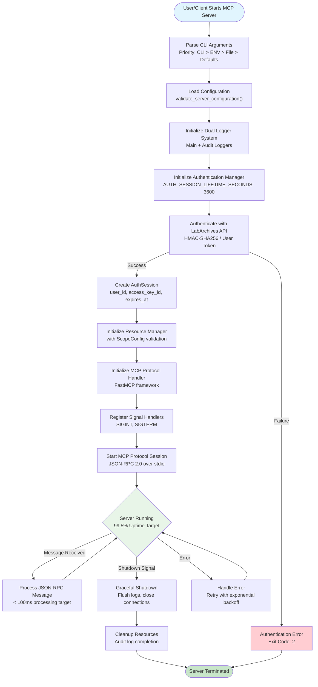
```mermaid
flowchart TB
    Start(["User/Client Starts MCP Server"])
    
    Start --> ParseArgs["Parse CLI Arguments<br/>Priority: CLI > ENV > File > Defaults"]
    ParseArgs --> LoadConfig["Load Configuration<br/>validate_server_configuration()"]
    LoadConfig --> SetupLogging["Initialize Dual Logger System<br/>Main + Audit Loggers"]
    SetupLogging --> AuthManager["Initialize Authentication Manager<br/>AUTH_SESSION_LIFETIME_SECONDS: 3600"]
    AuthManager --> AuthAPI["Authenticate with LabArchives API<br/>HMAC-SHA256 / User Token"]
    
    AuthAPI -->|Success| CreateSession["Create AuthSession<br/>user_id, access_key_id, expires_at"]
    AuthAPI -->|Failure| AuthError["Authentication Error<br/>Exit Code: 2"]
    
    CreateSession --> InitResource["Initialize Resource Manager<br/>with ScopeConfig validation"]
    InitResource --> InitProtocol["Initialize MCP Protocol Handler<br/>FastMCP framework"]
    InitProtocol --> RegisterSignals["Register Signal Handlers<br/>SIGINT, SIGTERM"]
    RegisterSignals --> StartLoop["Start MCP Protocol Session<br/>JSON-RPC 2.0 over stdio"]
    
    StartLoop --> Running{"Server Running<br/>99.5% Uptime Target"}
    Running -->|Message Received| ProcessMessage["Process JSON-RPC Message<br/>< 100ms processing target"]
    ProcessMessage --> Running
    Running -->|Shutdown Signal| GracefulShutdown["Graceful Shutdown<br/>Flush logs, close connections"]
    Running -->|Error| ErrorHandler["Handle Error<br/>Retry with exponential backoff"]
    ErrorHandler --> Running
    
    GracefulShutdown --> Cleanup["Cleanup Resources<br/>Audit log completion"]
    Cleanup --> End(["Server Terminated"])
    AuthError --> End
    
    style Start fill:#e1f5fe
    style End fill:#c8e6c9
    style AuthError fill:#ffcdd2
    style Running fill:#e8f5e8
```

### 4.1.2 Core Business Process Flow

The system implements eight core business processes (F-001 through F-008) supporting research data access:

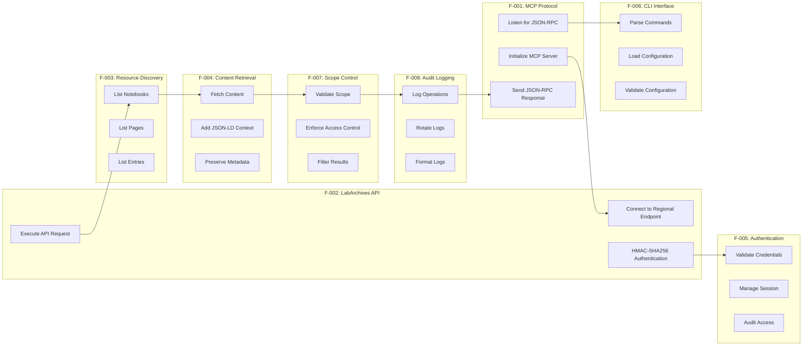
```mermaid
flowchart LR
    subgraph "F-001: MCP Protocol"
        MCPInit[Initialize MCP Server]
        MCPListen[Listen for JSON-RPC]
        MCPRespond[Send JSON-RPC Response]
    end
    
    subgraph "F-002: LabArchives API"
        APIConnect[Connect to Regional Endpoint]
        APIAuth[HMAC-SHA256 Authentication]
        APIRequest[Execute API Request]
    end
    
    subgraph "F-003: Resource Discovery"
        ListNotebooks[List Notebooks]
        ListPages[List Pages]
        ListEntries[List Entries]
    end
    
    subgraph "F-004: Content Retrieval"
        FetchContent[Fetch Content]
        AddContext[Add JSON-LD Context]
        PreserveMetadata[Preserve Metadata]
    end
    
    subgraph "F-005: Authentication"
        ValidateCredentials[Validate Credentials]
        ManageSession[Manage Session]
        AuditAccess[Audit Access]
    end
    
    subgraph "F-006: CLI Interface"
        ParseCommands[Parse Commands]
        LoadConfiguration[Load Configuration]
        ValidateConfig[Validate Configuration]
    end
    
    subgraph "F-007: Scope Control"
        ValidateScope[Validate Scope]
        EnforceAccess[Enforce Access Control]
        FilterResults[Filter Results]
    end
    
    subgraph "F-008: Audit Logging"
        LogOperations[Log Operations]
        RotateLogs[Rotate Logs]
        FormatLogs[Format Logs]
    end
    
    MCPInit --> APIConnect
    MCPListen --> ParseCommands
    APIAuth --> ValidateCredentials
    APIRequest --> ListNotebooks
    ListNotebooks --> FetchContent
    FetchContent --> ValidateScope
    ValidateScope --> LogOperations
    LogOperations --> MCPRespond
```

### 4.1.3 End-to-End User Journey

The complete user journey from initial setup through data access illustrates the research workflow integration:

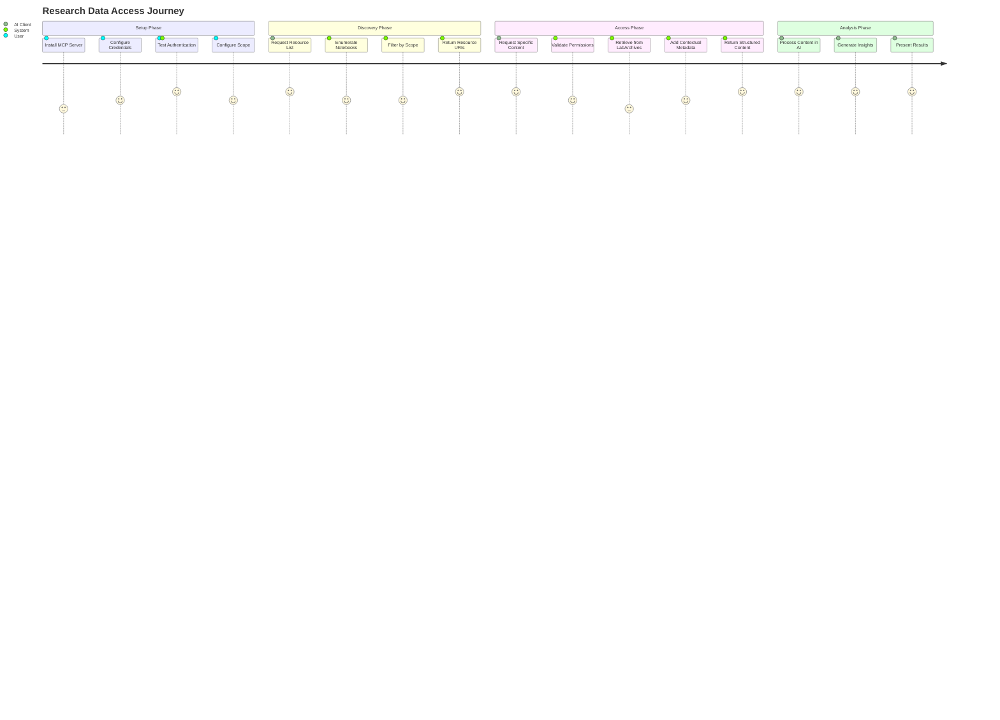
```mermaid
journey
    title Research Data Access Journey
    section Setup Phase
      Install MCP Server           : 3: User
      Configure Credentials        : 4: User
      Test Authentication          : 5: User, System
      Configure Scope              : 4: User
    section Discovery Phase
      Request Resource List        : 5: AI Client
      Enumerate Notebooks          : 4: System
      Filter by Scope              : 4: System
      Return Resource URIs         : 5: System
    section Access Phase
      Request Specific Content     : 5: AI Client
      Validate Permissions         : 4: System
      Retrieve from LabArchives    : 3: System
      Add Contextual Metadata      : 4: System
      Return Structured Content    : 5: System
    section Analysis Phase
      Process Content in AI        : 5: AI Client
      Generate Insights            : 5: AI Client
      Present Results              : 5: AI Client
```

## 4.2 CLI COMMAND PROCESSING FLOW

### 4.2.1 Command Routing and Execution

The CLI interface supports three primary commands with comprehensive configuration management:

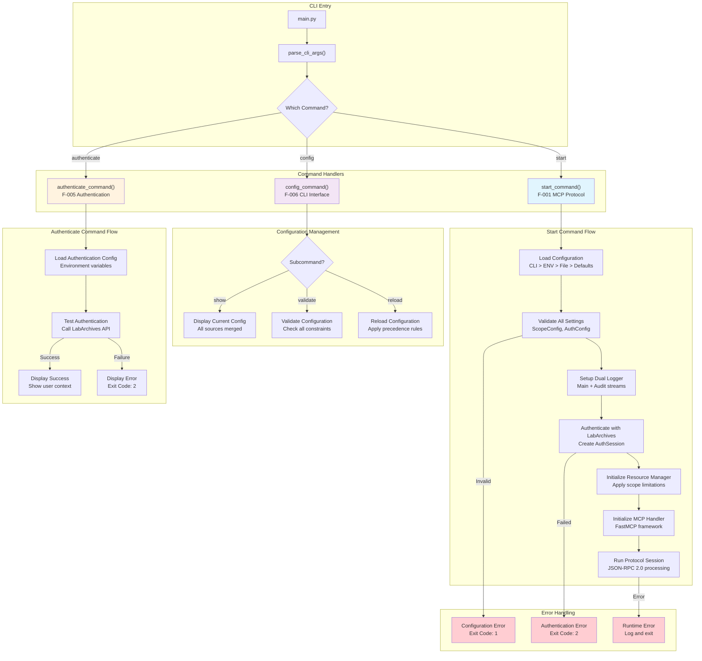
```mermaid
flowchart TB
    subgraph CLI Entry
        Main["main.py"] --> ParseCLI["parse_cli_args()"]
        ParseCLI --> CheckCmd{"Which Command?"}
    end
    
    subgraph Command Handlers
        CheckCmd -->|start| StartCmd["start_command()<br/>F-001 MCP Protocol"]
        CheckCmd -->|authenticate| AuthCmd["authenticate_command()<br/>F-005 Authentication"]
        CheckCmd -->|config| ConfigCmd["config_command()<br/>F-006 CLI Interface"]
    end
    
    subgraph Configuration Management
        ConfigCmd --> ConfigSub{"Subcommand?"}
        ConfigSub -->|show| ShowConfig["Display Current Config<br/>All sources merged"]
        ConfigSub -->|validate| ValidateConfig["Validate Configuration<br/>Check all constraints"]
        ConfigSub -->|reload| ReloadConfig["Reload Configuration<br/>Apply precedence rules"]
    end
    
    subgraph Start Command Flow
        StartCmd --> LoadCfg["Load Configuration<br/>CLI > ENV > File > Defaults"]
        LoadCfg --> ValidateAll["Validate All Settings<br/>ScopeConfig, AuthConfig"]
        ValidateAll --> InitLog["Setup Dual Logger<br/>Main + Audit streams"]
        InitLog --> Auth["Authenticate with LabArchives<br/>Create AuthSession"]
        Auth --> InitRM["Initialize Resource Manager<br/>Apply scope limitations"]
        InitRM --> InitMCP["Initialize MCP Handler<br/>FastMCP framework"]
        InitMCP --> RunSession["Run Protocol Session<br/>JSON-RPC 2.0 processing"]
    end
    
    subgraph Authenticate Command Flow
        AuthCmd --> LoadAuth["Load Authentication Config<br/>Environment variables"]
        LoadAuth --> TestAuth["Test Authentication<br/>Call LabArchives API"]
        TestAuth -->|Success| AuthOK["Display Success<br/>Show user context"]
        TestAuth -->|Failure| AuthFail["Display Error<br/>Exit Code: 2"]
    end
    
    subgraph Error Handling
        ValidateAll -->|Invalid| ConfigError["Configuration Error<br/>Exit Code: 1"]
        Auth -->|Failed| AuthError["Authentication Error<br/>Exit Code: 2"]
        RunSession -->|Error| RuntimeError["Runtime Error<br/>Log and exit"]
    end
    
    style StartCmd fill:#e1f5fe
    style AuthCmd fill:#fff3e0
    style ConfigCmd fill:#f3e5f5
    style ConfigError fill:#ffcdd2
    style AuthError fill:#ffcdd2
    style RuntimeError fill:#ffcdd2
```

### 4.2.2 Configuration Loading Hierarchy

The configuration system implements a four-tier precedence hierarchy supporting flexible deployment scenarios:

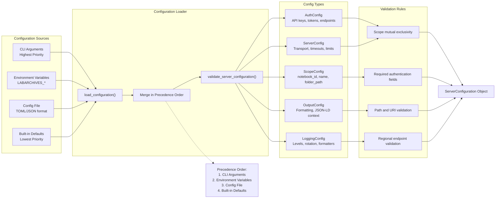
```mermaid
flowchart LR
    subgraph Sources [Configuration Sources]
        CLI["CLI Arguments<br/>Highest Priority"]
        ENV["Environment Variables<br/>LABARCHIVES_*"]
        FILE["Config File<br/>TOML/JSON format"]
        DEF["Built-in Defaults<br/>Lowest Priority"]
    end
    
    subgraph Loader [Configuration Loader]
        Load["load_configuration()"]
        Merge["Merge in Precedence Order"]
        Validate["validate_server_configuration()"]
    end
    
    subgraph ConfigTypes [Config Types]
        Auth["AuthConfig<br/>API keys, tokens, endpoints"]
        Scope["ScopeConfig<br/>notebook_id, name, folder_path"]
        Output["OutputConfig<br/>Formatting, JSON-LD context"]
        Logging["LoggingConfig<br/>Levels, rotation, formatters"]
        Server["ServerConfig<br/>Transport, timeouts, limits"]
    end
    
    subgraph ValidationRules [Validation Rules]
        MutualExclusive["Scope mutual exclusivity"]
        RequiredFields["Required authentication fields"]
        PathValidation["Path and URI validation"]
        EndpointValidation["Regional endpoint validation"]
    end
    
    CLI --> Load
    ENV --> Load
    FILE --> Load
    DEF --> Load
    
    Load --> Merge
    Merge --> Validate
    
    Validate --> Auth
    Validate --> Scope
    Validate --> Output
    Validate --> Logging
    Validate --> Server
    
    Auth --> MutualExclusive
    Scope --> RequiredFields
    Output --> PathValidation
    Logging --> EndpointValidation
    Server --> MutualExclusive
    
    MutualExclusive --> Final["ServerConfiguration Object"]
    RequiredFields --> Final
    PathValidation --> Final
    EndpointValidation --> Final
    
    PrecedenceNote["Precedence Order:<br/>1. CLI Arguments<br/>2. Environment Variables<br/>3. Config File<br/>4. Built-in Defaults"]
    Merge -.-> PrecedenceNote
```

## 4.3 AUTHENTICATION AND SECURITY FLOW

### 4.3.1 Authentication Process Flow

The authentication system supports dual modes with comprehensive security validation:

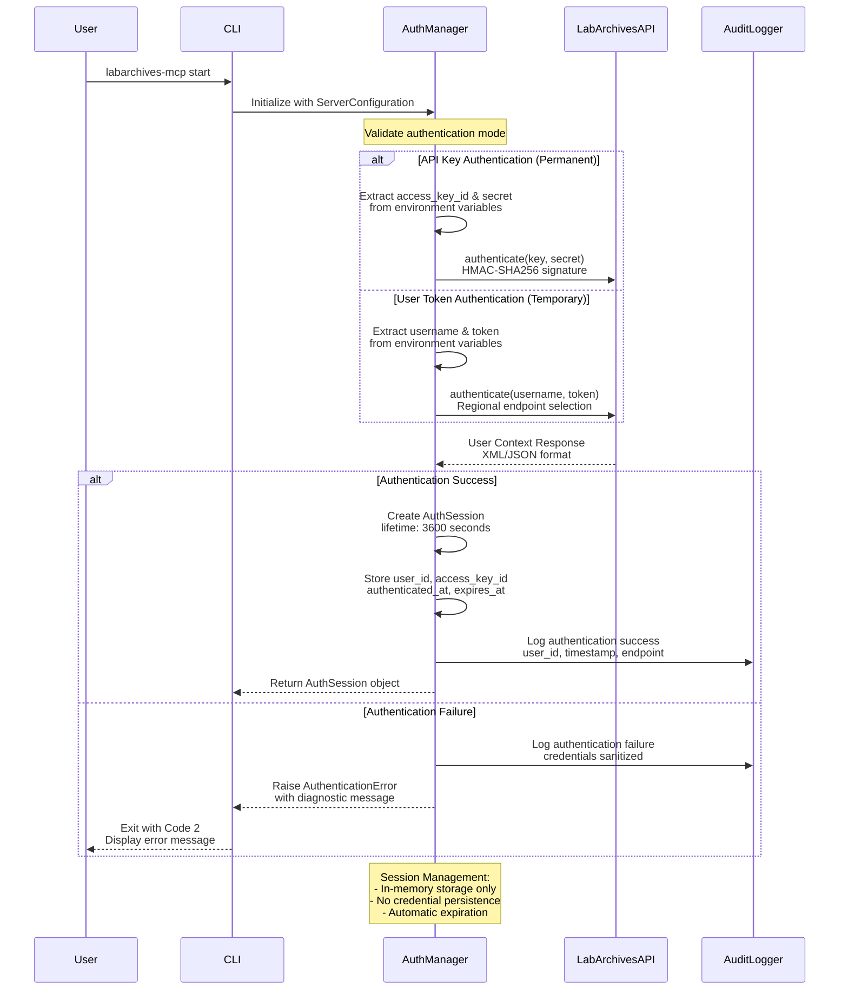
```mermaid
sequenceDiagram
    participant User
    participant CLI
    participant AuthManager
    participant LabArchivesAPI
    participant AuditLogger
    
    User->>CLI: labarchives-mcp start
    CLI->>AuthManager: Initialize with ServerConfiguration
    
    Note over AuthManager: Validate authentication mode
    
    alt API Key Authentication (Permanent)
        AuthManager->>AuthManager: Extract access_key_id & secret<br/>from environment variables
        AuthManager->>LabArchivesAPI: authenticate(key, secret)<br/>HMAC-SHA256 signature
    else User Token Authentication (Temporary)
        AuthManager->>AuthManager: Extract username & token<br/>from environment variables
        AuthManager->>LabArchivesAPI: authenticate(username, token)<br/>Regional endpoint selection
    end
    
    LabArchivesAPI-->>AuthManager: User Context Response<br/>XML/JSON format
    
    alt Authentication Success
        AuthManager->>AuthManager: Create AuthSession<br/>lifetime: 3600 seconds
        AuthManager->>AuthManager: Store user_id, access_key_id<br/>authenticated_at, expires_at
        AuthManager->>AuditLogger: Log authentication success<br/>user_id, timestamp, endpoint
        AuthManager-->>CLI: Return AuthSession object
    else Authentication Failure
        AuthManager->>AuditLogger: Log authentication failure<br/>credentials sanitized
        AuthManager-->>CLI: Raise AuthenticationError<br/>with diagnostic message
        CLI-->>User: Exit with Code 2<br/>Display error message
    end
    
    Note over AuthManager: Session Management:<br/>- In-memory storage only<br/>- No credential persistence<br/>- Automatic expiration
```

### 4.3.2 Security Validation and Access Control

The security system implements comprehensive validation at multiple layers:

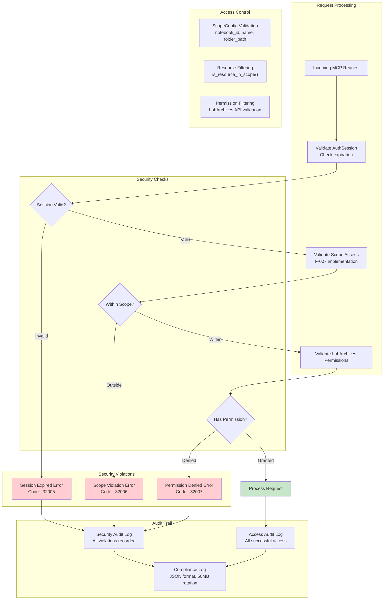
```mermaid
flowchart TB
    subgraph Request Processing
        Request[Incoming MCP Request]
        ValidateSession["Validate AuthSession<br/>Check expiration"]
        ValidateScope["Validate Scope Access<br/>F-007 implementation"]
        ValidatePermissions[Validate LabArchives Permissions]
    end
    
    subgraph Security Checks
        SessionCheck{Session Valid?}
        ScopeCheck{Within Scope?}
        PermissionCheck{Has Permission?}
    end
    
    subgraph Access Control
        ScopeConfig["ScopeConfig Validation<br/>notebook_id, name, folder_path"]
        ResourceFilter["Resource Filtering<br/>is_resource_in_scope()"]
        PermissionFilter["Permission Filtering<br/>LabArchives API validation"]
    end
    
    subgraph Security Violations
        SessionExpired["Session Expired Error<br/>Code: -32005"]
        ScopeViolation["Scope Violation Error<br/>Code: -32006"]
        PermissionDenied["Permission Denied Error<br/>Code: -32007"]
    end
    
    subgraph Audit Trail
        SecurityAudit["Security Audit Log<br/>All violations recorded"]
        AccessAudit["Access Audit Log<br/>All successful access"]
        ComplianceLog["Compliance Log<br/>JSON format, 50MB rotation"]
    end
    
    Request --> ValidateSession
    ValidateSession --> SessionCheck
    SessionCheck -->|Invalid| SessionExpired
    SessionCheck -->|Valid| ValidateScope
    
    ValidateScope --> ScopeCheck
    ScopeCheck -->|Outside| ScopeViolation
    ScopeCheck -->|Within| ValidatePermissions
    
    ValidatePermissions --> PermissionCheck
    PermissionCheck -->|Denied| PermissionDenied
    PermissionCheck -->|Granted| ProcessRequest[Process Request]
    
    SessionExpired --> SecurityAudit
    ScopeViolation --> SecurityAudit
    PermissionDenied --> SecurityAudit
    ProcessRequest --> AccessAudit
    
    SecurityAudit --> ComplianceLog
    AccessAudit --> ComplianceLog
    
    style SessionExpired fill:#ffcdd2
    style ScopeViolation fill:#ffcdd2
    style PermissionDenied fill:#ffcdd2
    style ProcessRequest fill:#c8e6c9
```

## 4.4 MCP PROTOCOL MESSAGE FLOW

### 4.4.1 JSON-RPC Message Processing

The MCP protocol implementation provides standardized message processing with comprehensive error handling:

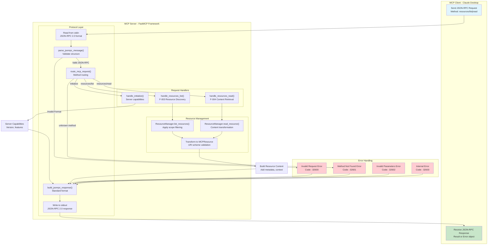
```mermaid
flowchart TB
    subgraph Client [MCP Client - Claude Desktop]
        ClientReq["Send JSON-RPC Request<br/>Method: resources/list|read"]
        ClientResp["Receive JSON-RPC Response<br/>Result or Error object"]
    end
    
    subgraph Server [MCP Server - FastMCP Framework]
        subgraph Protocol Layer
            Read["Read from stdin<br/>JSON-RPC 2.0 format"]
            Parse["parse_jsonrpc_message()<br/>Validate structure"]
            Route["route_mcp_request()<br/>Method routing"]
            Build["build_jsonrpc_response()<br/>Standard format"]
            Write["Write to stdout<br/>JSON-RPC 2.0 response"]
        end
        
        subgraph Request Handlers
            Init["handle_initialize()<br/>Server capabilities"]
            List["handle_resources_list()<br/>F-003 Resource Discovery"]
            ReadRes["handle_resources_read()<br/>F-004 Content Retrieval"]
        end
        
        subgraph Resource Management
            ListRM["ResourceManager.list_resources()<br/>Apply scope filtering"]
            ReadRM["ResourceManager.read_resource()<br/>Content transformation"]
            Transform["Transform to MCPResource<br/>URI scheme validation"]
        end
    end
    
    subgraph Error Handling
        ParseError["Invalid Request Error<br/>Code: -32600"]
        MethodError["Method Not Found Error<br/>Code: -32601"]
        ParamError["Invalid Parameters Error<br/>Code: -32602"]
        InternalError["Internal Error<br/>Code: -32603"]
    end
    
    ClientReq --> Read
    Read --> Parse
    Parse -->|Valid JSON-RPC| Route
    Parse -->|Invalid Format| ParseError
    
    Route -->|initialize| Init
    Route -->|resources/list| List
    Route -->|resources/read| ReadRes
    Route -->|unknown method| MethodError
    
    Init --> InitResp["Server Capabilities<br/>Version, features"]
    List --> ListRM
    ReadRes --> ReadRM
    
    ListRM --> Transform
    ReadRM --> Transform
    Transform --> BuildContent["Build Resource Content<br/>Add metadata, context"]
    
    InitResp --> Build
    BuildContent --> Build
    ParseError --> Build
    MethodError --> Build
    ParamError --> Build
    InternalError --> Build
    
    Build --> Write
    Write --> ClientResp
    
    style ClientReq fill:#e1f5fe
    style ClientResp fill:#c8e6c9
    style ParseError fill:#ffcdd2
    style MethodError fill:#ffcdd2
    style ParamError fill:#ffcdd2
    style InternalError fill:#ffcdd2
```

### 4.4.2 Protocol State Management

The MCP protocol maintains session state through a well-defined lifecycle:

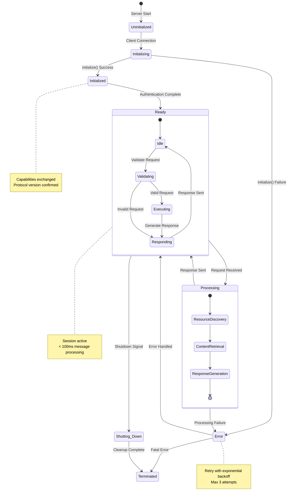
```mermaid
stateDiagram-v2
    [*] --> Uninitialized: Server Start
    
    Uninitialized --> Initializing: Client Connection
    Initializing --> Initialized: initialize() Success
    Initializing --> Error: initialize() Failure
    
    Initialized --> Ready: Authentication Complete
    Ready --> Processing: Request Received
    Processing --> Ready: Response Sent
    Processing --> Error: Processing Failure
    
    Error --> Ready: Error Handled
    Error --> Terminated: Fatal Error
    
    Ready --> Shutting_Down: Shutdown Signal
    Shutting_Down --> Terminated: Cleanup Complete
    
    state Ready {
        [*] --> Idle
        Idle --> Validating: Validate Request
        Validating --> Executing: Valid Request
        Validating --> Responding: Invalid Request
        Executing --> Responding: Generate Response
        Responding --> Idle: Response Sent
    }
    
    state Processing {
        [*] --> ResourceDiscovery
        ResourceDiscovery --> ContentRetrieval
        ContentRetrieval --> ResponseGeneration
        ResponseGeneration --> [*]
    }
    
    note right of Initialized: Capabilities exchanged<br/>Protocol version confirmed
    note right of Ready: Session active<br/>< 100ms message processing
    note right of Error: Retry with exponential backoff<br/>Max 3 attempts
```

## 4.5 RESOURCE DISCOVERY WORKFLOW

### 4.5.1 Resource Enumeration Process

The resource discovery system implements hierarchical enumeration with scope-based filtering:

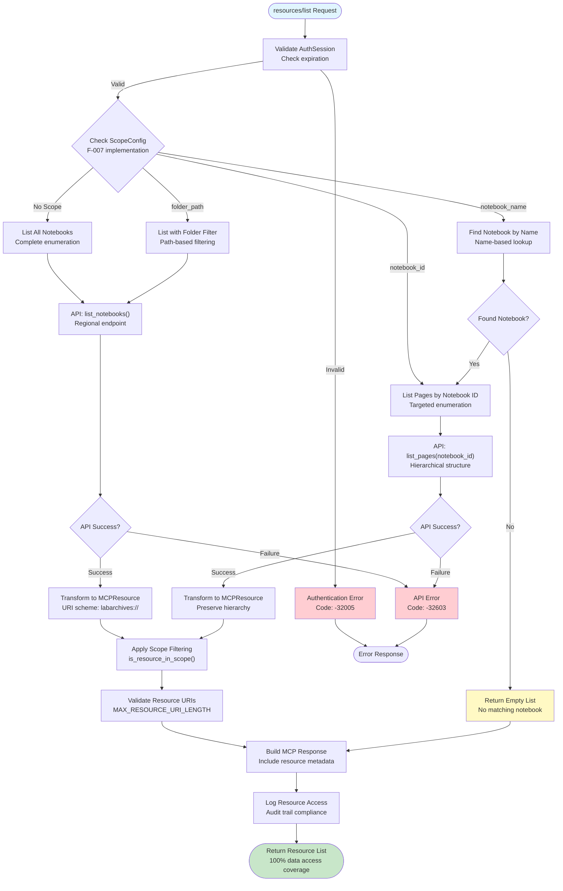
```mermaid
flowchart TD
    Start([resources/list Request])
    
    Start --> ValidateAuth["Validate AuthSession<br/>Check expiration"]
    ValidateAuth -->|Invalid| AuthError["Authentication Error<br/>Code: -32005"]
    ValidateAuth -->|Valid| CheckScope{"Check ScopeConfig<br/>F-007 implementation"}
    
    CheckScope -->|No Scope| ListAll["List All Notebooks<br/>Complete enumeration"]
    CheckScope -->|notebook_id| ListByID["List Pages by Notebook ID<br/>Targeted enumeration"]
    CheckScope -->|notebook_name| FindNotebook["Find Notebook by Name<br/>Name-based lookup"]
    CheckScope -->|folder_path| ListWithFolder["List with Folder Filter<br/>Path-based filtering"]
    
    FindNotebook --> NotebookFound{Found Notebook?}
    NotebookFound -->|Yes| ListByID
    NotebookFound -->|No| EmptyList["Return Empty List<br/>No matching notebook"]
    
    ListAll --> CallAPI1["API: list_notebooks()<br/>Regional endpoint"]
    ListByID --> CallAPI2["API: list_pages(notebook_id)<br/>Hierarchical structure"]
    ListWithFolder --> CallAPI1
    
    CallAPI1 --> APIResponse1{API Success?}
    CallAPI2 --> APIResponse2{API Success?}
    
    APIResponse1 -->|Success| Transform1["Transform to MCPResource<br/>URI scheme: labarchives://"]
    APIResponse2 -->|Success| Transform2["Transform to MCPResource<br/>Preserve hierarchy"]
    APIResponse1 -->|Failure| APIError["API Error<br/>Code: -32603"]
    APIResponse2 -->|Failure| APIError
    
    Transform1 --> ApplyScope["Apply Scope Filtering<br/>is_resource_in_scope()"]
    Transform2 --> ApplyScope
    
    ApplyScope --> ValidateURI["Validate Resource URIs<br/>MAX_RESOURCE_URI_LENGTH"]
    ValidateURI --> BuildResponse["Build MCP Response<br/>Include resource metadata"]
    EmptyList --> BuildResponse
    
    BuildResponse --> LogAccess["Log Resource Access<br/>Audit trail compliance"]
    LogAccess --> Return(["Return Resource List<br/>100% data access coverage"])
    
    AuthError --> ErrorResponse([Error Response])
    APIError --> ErrorResponse
    
    style Start fill:#e1f5fe
    style Return fill:#c8e6c9
    style EmptyList fill:#fff9c4
    style AuthError fill:#ffcdd2
    style APIError fill:#ffcdd2
```

### 4.5.2 Resource URI Generation

The URI generation system ensures consistent resource identification across the system:

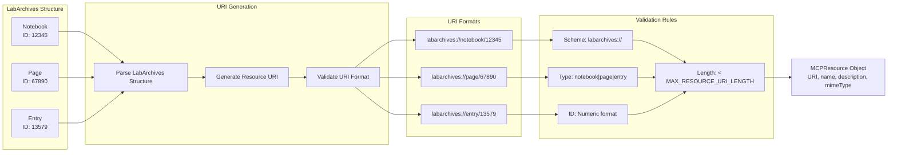
```mermaid
flowchart LR
    subgraph LabArchives Structure
        Notebook["Notebook<br/>ID: 12345"]
        Page["Page<br/>ID: 67890"]
        Entry["Entry<br/>ID: 13579"]
    end
    
    subgraph URI Generation
        ParseStructure["Parse LabArchives Structure"]
        GenerateURI["Generate Resource URI"]
        ValidateURI["Validate URI Format"]
    end
    
    subgraph URI Formats
        NotebookURI["labarchives://notebook/12345"]
        PageURI["labarchives://page/67890"]
        EntryURI["labarchives://entry/13579"]
    end
    
    subgraph Validation Rules
        SchemeCheck["Scheme: labarchives://"]
        TypeCheck["Type: notebook|page|entry"]
        IDCheck["ID: Numeric format"]
        LengthCheck["Length: < MAX_RESOURCE_URI_LENGTH"]
    end
    
    Notebook --> ParseStructure
    Page --> ParseStructure
    Entry --> ParseStructure
    
    ParseStructure --> GenerateURI
    GenerateURI --> ValidateURI
    
    ValidateURI --> NotebookURI
    ValidateURI --> PageURI
    ValidateURI --> EntryURI
    
    NotebookURI --> SchemeCheck
    PageURI --> TypeCheck
    EntryURI --> IDCheck
    
    SchemeCheck --> LengthCheck
    TypeCheck --> LengthCheck
    IDCheck --> LengthCheck
    
    LengthCheck --> MCPResource["MCPResource Object<br/>URI, name, description, mimeType"]
```

## 4.6 CONTENT RETRIEVAL WORKFLOW

### 4.6.1 Content Access and Transformation

The content retrieval system provides comprehensive data access with contextual enrichment:

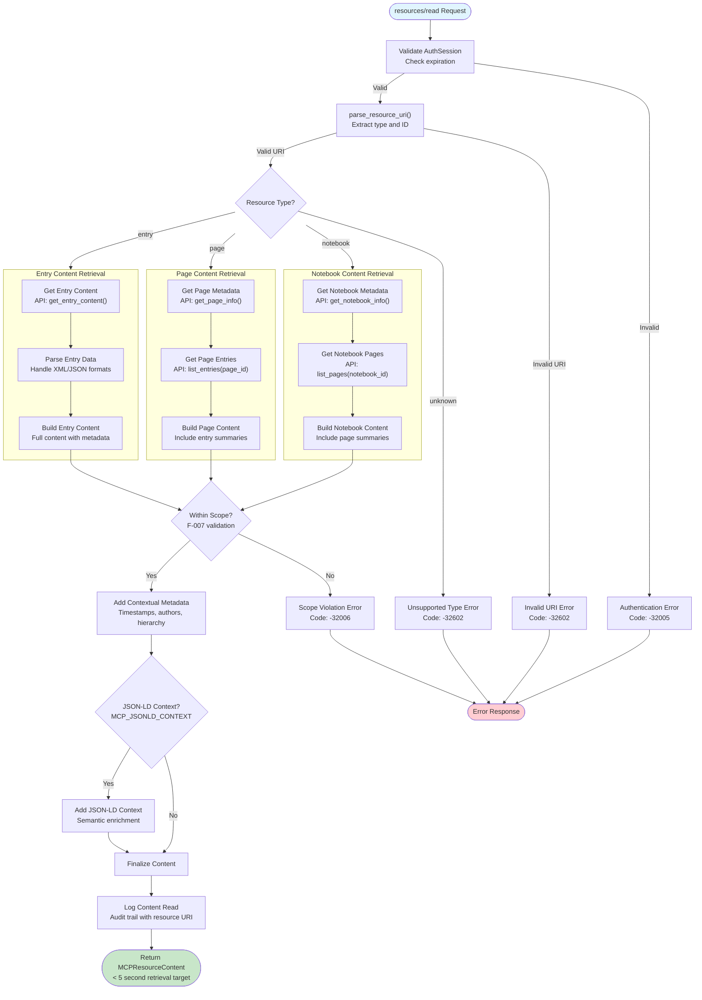
```mermaid
flowchart TD
    Start([resources/read Request])
    
    Start --> ValidateAuth["Validate AuthSession<br/>Check expiration"]
    ValidateAuth -->|Invalid| AuthError["Authentication Error<br/>Code: -32005"]
    ValidateAuth -->|Valid| ParseURI["parse_resource_uri()<br/>Extract type and ID"]
    
    ParseURI -->|Valid URI| CheckType{Resource Type?}
    ParseURI -->|Invalid URI| URIError["Invalid URI Error<br/>Code: -32602"]
    
    CheckType -->|notebook| NotebookFlow[Notebook Content Flow]
    CheckType -->|page| PageFlow[Page Content Flow]
    CheckType -->|entry| EntryFlow[Entry Content Flow]
    CheckType -->|unknown| TypeError["Unsupported Type Error<br/>Code: -32602"]
    
    subgraph NotebookFlow [Notebook Content Retrieval]
        GetNB["Get Notebook Metadata<br/>API: get_notebook_info()"]
        GetNBPages["Get Notebook Pages<br/>API: list_pages(notebook_id)"]
        BuildNB["Build Notebook Content<br/>Include page summaries"]
    end
    
    subgraph PageFlow [Page Content Retrieval]
        GetPage["Get Page Metadata<br/>API: get_page_info()"]
        GetEntries["Get Page Entries<br/>API: list_entries(page_id)"]
        BuildPage["Build Page Content<br/>Include entry summaries"]
    end
    
    subgraph EntryFlow [Entry Content Retrieval]
        GetEntry["Get Entry Content<br/>API: get_entry_content()"]
        ParseContent["Parse Entry Data<br/>Handle XML/JSON formats"]
        BuildEntry["Build Entry Content<br/>Full content with metadata"]
    end
    
    GetNB --> GetNBPages --> BuildNB
    GetPage --> GetEntries --> BuildPage
    GetEntry --> ParseContent --> BuildEntry
    
    BuildNB --> CheckScope{"Within Scope?<br/>F-007 validation"}
    BuildPage --> CheckScope
    BuildEntry --> CheckScope
    
    CheckScope -->|Yes| AddMetadata["Add Contextual Metadata<br/>Timestamps, authors, hierarchy"]
    CheckScope -->|No| ScopeError["Scope Violation Error<br/>Code: -32006"]
    
    AddMetadata --> OptionalJSONLD{"JSON-LD Context?<br/>MCP_JSONLD_CONTEXT"}
    OptionalJSONLD -->|Yes| AddJSONLD["Add JSON-LD Context<br/>Semantic enrichment"]
    OptionalJSONLD -->|No| FinalizeContent[Finalize Content]
    AddJSONLD --> FinalizeContent
    
    FinalizeContent --> LogRead["Log Content Read<br/>Audit trail with resource URI"]
    LogRead --> Success(["Return MCPResourceContent<br/>< 5 second retrieval target"])
    
    AuthError --> ErrorResp([Error Response])
    URIError --> ErrorResp
    TypeError --> ErrorResp
    ScopeError --> ErrorResp
    
    style Start fill:#e1f5fe
    style Success fill:#c8e6c9
    style ErrorResp fill:#ffcdd2
```

### 4.6.2 Content Transformation Pipeline

The content transformation system preserves data integrity while enhancing accessibility:

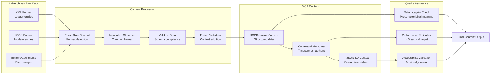
```mermaid
flowchart LR
    subgraph Input [LabArchives Raw Data]
        XML[XML Format<br/>Legacy entries]
        JSON[JSON Format<br/>Modern entries]
        Binary[Binary Attachments<br/>Files, images]
    end
    
    subgraph Processing [Content Processing]
        Parse[Parse Raw Content<br/>Format detection]
        Normalize[Normalize Structure<br/>Common format]
        Validate[Validate Data<br/>Schema compliance]
        Enrich[Enrich Metadata<br/>Context addition]
    end
    
    subgraph Output [MCP Content]
        Content[MCPResourceContent<br/>Structured data]
        Metadata[Contextual Metadata<br/>Timestamps, authors]
        JSONLD[JSON-LD Context<br/>Semantic enrichment]
    end
    
    subgraph Quality Assurance
        IntegrityCheck[Data Integrity Check<br/>Preserve original meaning]
        PerformanceCheck[Performance Validation<br/>< 5 second target]
        AccessibilityCheck[Accessibility Validation<br/>AI-friendly format]
    end
    
    XML --> Parse
    JSON --> Parse
    Binary --> Parse
    
    Parse --> Normalize
    Normalize --> Validate
    Validate --> Enrich
    
    Enrich --> Content
    Content --> Metadata
    Metadata --> JSONLD
    
    Content --> IntegrityCheck
    Metadata --> PerformanceCheck
    JSONLD --> AccessibilityCheck
    
    IntegrityCheck --> FinalOutput[Final Content Output]
    PerformanceCheck --> FinalOutput
    AccessibilityCheck --> FinalOutput
```

## 4.7 ERROR HANDLING AND RECOVERY FLOW

### 4.7.1 Comprehensive Error Management

The error handling system provides comprehensive coverage with intelligent recovery mechanisms:

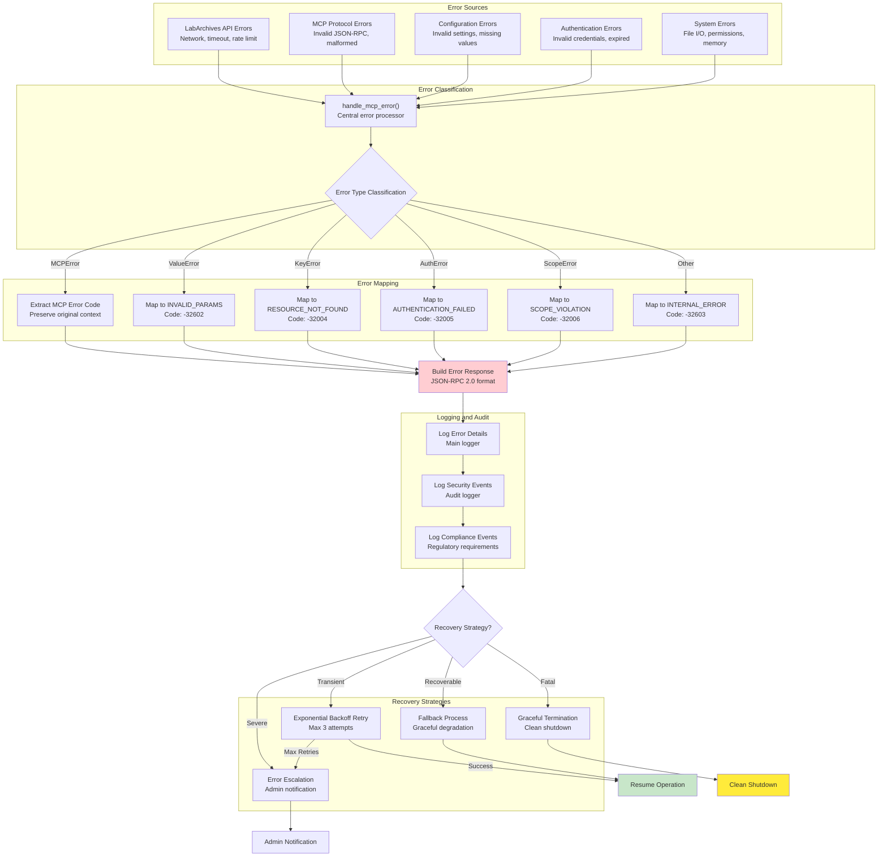
```mermaid
flowchart TB
    subgraph Error Sources
        API["LabArchives API Errors<br/>Network, timeout, rate limit"]
        Protocol["MCP Protocol Errors<br/>Invalid JSON-RPC, malformed"]
        Config["Configuration Errors<br/>Invalid settings, missing values"]
        Auth["Authentication Errors<br/>Invalid credentials, expired"]
        System["System Errors<br/>File I/O, permissions, memory"]
    end
    
    subgraph Error Classification
        Handler["handle_mcp_error()<br/>Central error processor"]
        ClassifyError{"Error Type Classification"}
    end
    
    subgraph Error Mapping
        ExtractCode["Extract MCP Error Code<br/>Preserve original context"]
        MapParams["Map to INVALID_PARAMS<br/>Code: -32602"]
        MapNotFound["Map to RESOURCE_NOT_FOUND<br/>Code: -32004"]
        MapAuth["Map to AUTHENTICATION_FAILED<br/>Code: -32005"]
        MapScope["Map to SCOPE_VIOLATION<br/>Code: -32006"]
        MapInternal["Map to INTERNAL_ERROR<br/>Code: -32603"]
    end
    
    subgraph Recovery Strategies
        RetryLogic["Exponential Backoff Retry<br/>Max 3 attempts"]
        Fallback["Fallback Process<br/>Graceful degradation"]
        Escalation["Error Escalation<br/>Admin notification"]
        Termination["Graceful Termination<br/>Clean shutdown"]
    end
    
    subgraph Logging and Audit
        LogError["Log Error Details<br/>Main logger"]
        LogSecurity["Log Security Events<br/>Audit logger"]
        LogCompliance["Log Compliance Events<br/>Regulatory requirements"]
    end
    
    API --> Handler
    Protocol --> Handler
    Config --> Handler
    Auth --> Handler
    System --> Handler
    
    Handler --> ClassifyError
    
    ClassifyError -->|MCPError| ExtractCode
    ClassifyError -->|ValueError| MapParams
    ClassifyError -->|KeyError| MapNotFound
    ClassifyError -->|AuthError| MapAuth
    ClassifyError -->|ScopeError| MapScope
    ClassifyError -->|Other| MapInternal
    
    ExtractCode --> BuildError["Build Error Response<br/>JSON-RPC 2.0 format"]
    MapParams --> BuildError
    MapNotFound --> BuildError
    MapAuth --> BuildError
    MapScope --> BuildError
    MapInternal --> BuildError
    
    BuildError --> LogError
    LogError --> LogSecurity
    LogSecurity --> LogCompliance
    
    LogCompliance --> RecoveryDecision{"Recovery Strategy?"}
    RecoveryDecision -->|Transient| RetryLogic
    RecoveryDecision -->|Recoverable| Fallback
    RecoveryDecision -->|Severe| Escalation
    RecoveryDecision -->|Fatal| Termination
    
    RetryLogic -->|Success| Resume["Resume Operation"]
    RetryLogic -->|Max Retries| Escalation
    Fallback --> Resume
    Escalation --> AdminNotify["Admin Notification"]
    Termination --> CleanShutdown["Clean Shutdown"]
    
    style BuildError fill:#ffcdd2
    style Resume fill:#c8e6c9
    style CleanShutdown fill:#ffeb3b
```

### 4.7.2 Error Recovery Mechanisms

The recovery system implements intelligent strategies based on error classification:

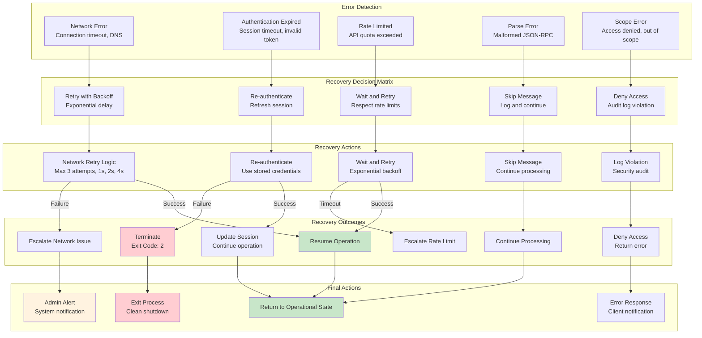
```mermaid
flowchart TB
    subgraph Error Detection
        NetworkErr[Network Error<br/>Connection timeout, DNS]
        AuthErr[Authentication Expired<br/>Session timeout, invalid token]
        RateLimit[Rate Limited<br/>API quota exceeded]
        ParseErr[Parse Error<br/>Malformed JSON-RPC]
        ScopeErr[Scope Error<br/>Access denied, out of scope]
    end
    
    subgraph Recovery Decision Matrix
        NetworkErr --> NetworkStrategy[Retry with Backoff<br/>Exponential delay]
        AuthErr --> AuthStrategy[Re-authenticate<br/>Refresh session]
        RateLimit --> RateStrategy[Wait and Retry<br/>Respect rate limits]
        ParseErr --> ParseStrategy[Skip Message<br/>Log and continue]
        ScopeErr --> ScopeStrategy[Deny Access<br/>Audit log violation]
    end
    
    subgraph Recovery Actions
        NetworkStrategy --> NetworkRetry[Network Retry Logic<br/>Max 3 attempts, 1s, 2s, 4s]
        AuthStrategy --> Reauth[Re-authenticate<br/>Use stored credentials]
        RateStrategy --> WaitRetry[Wait and Retry<br/>Exponential backoff]
        ParseStrategy --> SkipMessage[Skip Message<br/>Continue processing]
        ScopeStrategy --> LogViolation[Log Violation<br/>Security audit]
    end
    
    subgraph Recovery Outcomes
        NetworkRetry -->|Success| ResumeOperation[Resume Operation]
        NetworkRetry -->|Failure| EscalateNetwork[Escalate Network Issue]
        
        Reauth -->|Success| UpdateSession[Update Session<br/>Continue operation]
        Reauth -->|Failure| TerminateAuth[Terminate<br/>Exit Code: 2]
        
        WaitRetry -->|Success| ResumeOperation
        WaitRetry -->|Timeout| EscalateRate[Escalate Rate Limit]
        
        SkipMessage --> ContinueProcessing[Continue Processing]
        LogViolation --> DenyAccess[Deny Access<br/>Return error]
    end
    
    subgraph Final Actions
        ResumeOperation --> OperationalState[Return to Operational State]
        EscalateNetwork --> AdminAlert[Admin Alert<br/>System notification]
        UpdateSession --> OperationalState
        TerminateAuth --> ExitProcess[Exit Process<br/>Clean shutdown]
        ContinueProcessing --> OperationalState
        DenyAccess --> ErrorResponse[Error Response<br/>Client notification]
    end
    
    style ResumeOperation fill:#c8e6c9
    style OperationalState fill:#c8e6c9
    style TerminateAuth fill:#ffcdd2
    style ExitProcess fill:#ffcdd2
    style AdminAlert fill:#fff3e0
```

## 4.8 AUDIT LOGGING FLOW

### 4.8.1 Comprehensive Audit System

The audit logging system provides comprehensive compliance and security monitoring:

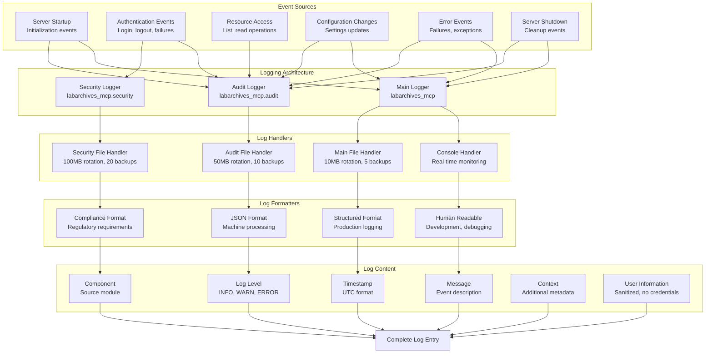
```mermaid
flowchart TD
    subgraph Event Sources
        Startup[Server Startup<br/>Initialization events]
        Auth[Authentication Events<br/>Login, logout, failures]
        Resource[Resource Access<br/>List, read operations]
        Config[Configuration Changes<br/>Settings updates]
        Error[Error Events<br/>Failures, exceptions]
        Shutdown[Server Shutdown<br/>Cleanup events]
    end
    
    subgraph Logging Architecture
        MainLogger[Main Logger<br/>labarchives_mcp]
        AuditLogger[Audit Logger<br/>labarchives_mcp.audit]
        SecurityLogger[Security Logger<br/>labarchives_mcp.security]
    end
    
    subgraph Log Handlers
        Console[Console Handler<br/>Real-time monitoring]
        MainFile[Main File Handler<br/>10MB rotation, 5 backups]
        AuditFile[Audit File Handler<br/>50MB rotation, 10 backups]
        SecurityFile[Security File Handler<br/>100MB rotation, 20 backups]
    end
    
    subgraph Log Formatters
        Human[Human Readable<br/>Development, debugging]
        Structured[Structured Format<br/>Production logging]
        JSON[JSON Format<br/>Machine processing]
        Compliance[Compliance Format<br/>Regulatory requirements]
    end
    
    subgraph Log Content
        Timestamp[Timestamp<br/>UTC format]
        Level[Log Level<br/>INFO, WARN, ERROR]
        Component[Component<br/>Source module]
        Message[Message<br/>Event description]
        Context[Context<br/>Additional metadata]
        UserInfo[User Information<br/>Sanitized, no credentials]
    end
    
    Startup --> MainLogger
    Startup --> AuditLogger
    Auth --> AuditLogger
    Auth --> SecurityLogger
    Resource --> AuditLogger
    Config --> MainLogger
    Config --> AuditLogger
    Error --> MainLogger
    Error --> AuditLogger
    Shutdown --> MainLogger
    Shutdown --> AuditLogger
    
    MainLogger --> Console
    MainLogger --> MainFile
    AuditLogger --> AuditFile
    SecurityLogger --> SecurityFile
    
    Console --> Human
    MainFile --> Structured
    AuditFile --> JSON
    SecurityFile --> Compliance
    
    Structured --> Timestamp
    JSON --> Level
    Compliance --> Component
    Human --> Message
    
    Timestamp --> LogEntry[Complete Log Entry]
    Level --> LogEntry
    Component --> LogEntry
    Message --> LogEntry
    Context --> LogEntry
    UserInfo --> LogEntry
```

### 4.8.2 Audit Trail Compliance

The audit system ensures comprehensive compliance with regulatory requirements:

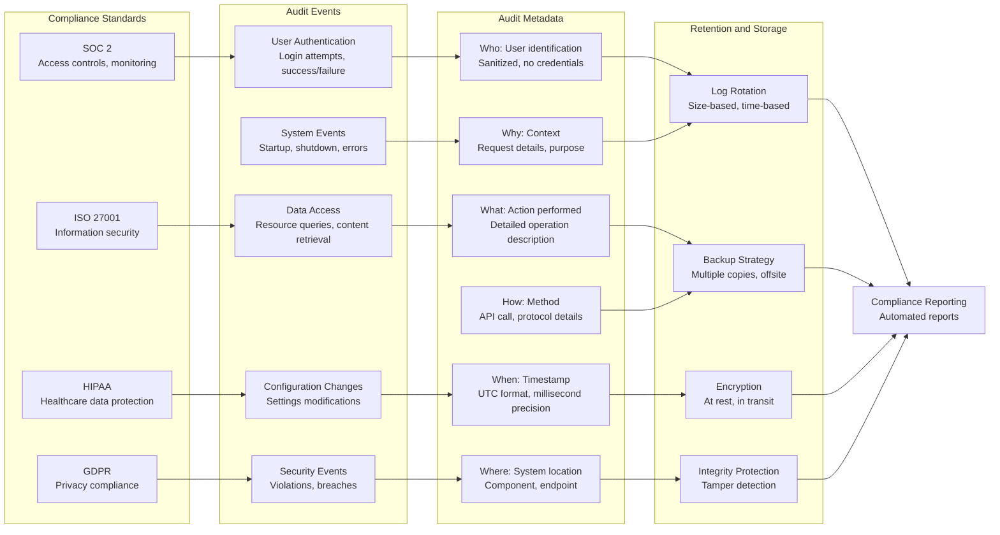
```mermaid
flowchart LR
    subgraph Compliance Standards
        SOC2[SOC 2<br/>Access controls, monitoring]
        ISO27001[ISO 27001<br/>Information security]
        HIPAA[HIPAA<br/>Healthcare data protection]
        GDPR[GDPR<br/>Privacy compliance]
    end
    
    subgraph Audit Events
        UserAuth[User Authentication<br/>Login attempts, success/failure]
        DataAccess[Data Access<br/>Resource queries, content retrieval]
        ConfigChange[Configuration Changes<br/>Settings modifications]
        SecurityEvent[Security Events<br/>Violations, breaches]
        SystemEvent[System Events<br/>Startup, shutdown, errors]
    end
    
    subgraph Audit Metadata
        Who[Who: User identification<br/>Sanitized, no credentials]
        What[What: Action performed<br/>Detailed operation description]
        When[When: Timestamp<br/>UTC format, millisecond precision]
        Where[Where: System location<br/>Component, endpoint]
        Why[Why: Context<br/>Request details, purpose]
        How[How: Method<br/>API call, protocol details]
    end
    
    subgraph Retention and Storage
        Rotation[Log Rotation<br/>Size-based, time-based]
        Backup[Backup Strategy<br/>Multiple copies, offsite]
        Encryption[Encryption<br/>At rest, in transit]
        Integrity[Integrity Protection<br/>Tamper detection]
    end
    
    SOC2 --> UserAuth
    ISO27001 --> DataAccess
    HIPAA --> ConfigChange
    GDPR --> SecurityEvent
    
    UserAuth --> Who
    DataAccess --> What
    ConfigChange --> When
    SecurityEvent --> Where
    SystemEvent --> Why
    
    Who --> Rotation
    What --> Backup
    When --> Encryption
    Where --> Integrity
    Why --> Rotation
    How --> Backup
    
    Rotation --> ComplianceReport[Compliance Reporting<br/>Automated reports]
    Backup --> ComplianceReport
    Encryption --> ComplianceReport
    Integrity --> ComplianceReport
```

## 4.9 INTEGRATION SEQUENCE DIAGRAM

### 4.9.1 Complete Integration Flow

The integration sequence demonstrates the complete interaction between all system components:

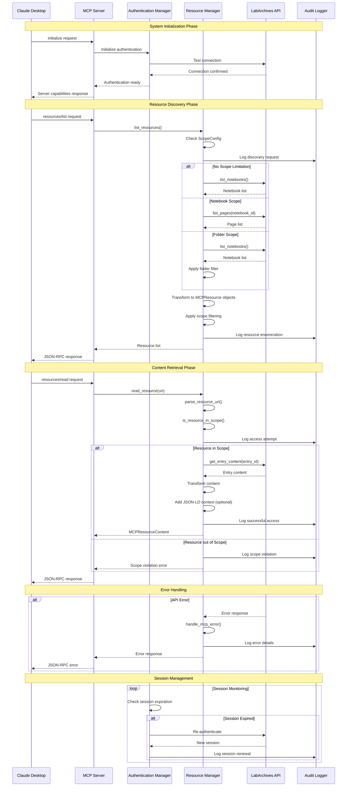
```mermaid
sequenceDiagram
    participant Client as Claude Desktop
    participant MCP as MCP Server
    participant Auth as Authentication Manager
    participant RM as Resource Manager
    participant API as LabArchives API
    participant Audit as Audit Logger
    
    Note over Client,Audit: System Initialization Phase
    Client->>MCP: initialize request
    MCP->>Auth: Initialize authentication
    Auth->>API: Test connection
    API-->>Auth: Connection confirmed
    Auth-->>MCP: Authentication ready
    MCP-->>Client: Server capabilities response
    
    Note over Client,Audit: Resource Discovery Phase
    Client->>MCP: resources/list request
    MCP->>RM: list_resources()
    RM->>RM: Check ScopeConfig
    RM->>Audit: Log discovery request
    
    alt No Scope Limitation
        RM->>API: list_notebooks()
        API-->>RM: Notebook list
    else Notebook Scope
        RM->>API: list_pages(notebook_id)
        API-->>RM: Page list
    else Folder Scope
        RM->>API: list_notebooks()
        API-->>RM: Notebook list
        RM->>RM: Apply folder filter
    end
    
    RM->>RM: Transform to MCPResource objects
    RM->>RM: Apply scope filtering
    RM->>Audit: Log resource enumeration
    RM-->>MCP: Resource list
    MCP-->>Client: JSON-RPC response
    
    Note over Client,Audit: Content Retrieval Phase
    Client->>MCP: resources/read request
    MCP->>RM: read_resource(uri)
    RM->>RM: parse_resource_uri()
    RM->>RM: is_resource_in_scope()
    RM->>Audit: Log access attempt
    
    alt Resource in Scope
        RM->>API: get_entry_content(entry_id)
        API-->>RM: Entry content
        RM->>RM: Transform content
        RM->>RM: Add JSON-LD context (optional)
        RM->>Audit: Log successful access
        RM-->>MCP: MCPResourceContent
    else Resource out of Scope
        RM->>Audit: Log scope violation
        RM-->>MCP: Scope violation error
    end
    
    MCP-->>Client: JSON-RPC response
    
    Note over Client,Audit: Error Handling
    alt API Error
        API-->>RM: Error response
        RM->>RM: handle_mcp_error()
        RM->>Audit: Log error details
        RM-->>MCP: Error response
        MCP-->>Client: JSON-RPC error
    end
    
    Note over Client,Audit: Session Management
    loop Session Monitoring
        Auth->>Auth: Check session expiration
        alt Session Expired
            Auth->>API: Re-authenticate
            API-->>Auth: New session
            Auth->>Audit: Log session renewal
        end
    end
```

## 4.10 PERFORMANCE CONSIDERATIONS

### 4.10.1 Request Processing Timeline

The performance optimization focuses on meeting SLA requirements across all operations:

```mermaid
gantt
    title MCP Request Processing Performance Timeline
    dateFormat X
    axisFormat %L ms
    
    section Client Request Processing
    Send JSON-RPC Request    :0, 5
    
    section Server Message Processing
    Read from stdin          :5, 10
    Parse JSON-RPC Message   :15, 15
    Validate Request Format  :30, 10
    Route to Handler         :40, 5
    
    section Authentication Validation
    Validate Auth Session    :45, 20
    Check Session Expiration :65, 5
    
    section Resource Processing
    Apply Scope Filtering    :70, 30
    
    section LabArchives API Call
    Prepare API Request      :100, 20
    Execute API Call         :120, 2000
    Parse API Response       :2120, 50
    
    section Content Transformation
    Transform to MCP Format  :2170, 100
    Add Metadata Context     :2270, 80
    Apply JSON-LD Context    :2350, 50
    
    section Response Generation
    Build JSON-RPC Response  :2400, 30
    Write to stdout          :2430, 15
    
    section Client Response
    Receive Response         :2445, 10
    
    section Performance Targets
    Message Processing       :milestone, 100, 0
    API Response            :milestone, 5000, 0
    Total Response          :milestone, 5000, 0
```

### 4.10.2 Performance Monitoring and Optimization

The system implements comprehensive performance monitoring with optimization strategies:

```mermaid
flowchart TB
    subgraph Performance Metrics
        ResponseTime[Response Time<br/>< 100ms message processing]
        Throughput[Throughput<br/>Records per second]
        Availability[Availability<br/>99.5% uptime target]
        ErrorRate[Error Rate<br/>< 1% error threshold]
    end
    
    subgraph Monitoring Points
        MessageProcessing[Message Processing<br/>JSON-RPC parsing, routing]
        APIPerformance[API Performance<br/>LabArchives response time]
        ResourceTransform[Resource Transform<br/>Data format conversion]
        MemoryUsage[Memory Usage<br/>Content buffering]
    end
    
    subgraph Optimization Strategies
        Caching[Response Caching<br/>Frequently accessed content]
        ConnectionPool[Connection Pooling<br/>Reuse HTTP connections]
        LazyLoading[Lazy Loading<br/>On-demand content retrieval]
        Compression[Response Compression<br/>Reduce bandwidth usage]
    end
    
    subgraph Performance Thresholds
        MessageThreshold[Message: 100ms<br/>SLA compliance]
        APIThreshold[API: 5 seconds<br/>Content retrieval]
        ErrorThreshold[Error: 50ms<br/>Error response time]
        MemoryThreshold[Memory: 500MB<br/>Process memory limit]
    end
    
    subgraph Alerts and Actions
        SlowResponse[Slow Response Alert<br/>> 100ms processing]
        HighError[High Error Rate Alert<br/>> 1% error rate]
        MemoryWarning[Memory Warning<br/>> 80% threshold]
        ServiceDegraded[Service Degraded<br/>Performance below SLA]
    end
    
    ResponseTime --> MessageProcessing
    Throughput --> APIPerformance
    Availability --> ResourceTransform
    ErrorRate --> MemoryUsage
    
    MessageProcessing --> Caching
    APIPerformance --> ConnectionPool
    ResourceTransform --> LazyLoading
    MemoryUsage --> Compression
    
    Caching --> MessageThreshold
    ConnectionPool --> APIThreshold
    LazyLoading --> ErrorThreshold
    Compression --> MemoryThreshold
    
    MessageThreshold --> SlowResponse
    APIThreshold --> HighError
    ErrorThreshold --> MemoryWarning
    MemoryThreshold --> ServiceDegraded
    
    SlowResponse --> OptimizationAction[Trigger Optimization<br/>Adjust caching, connections]
    HighError --> OptimizationAction
    MemoryWarning --> OptimizationAction
    ServiceDegraded --> OptimizationAction
```

## 4.11 TECHNICAL IMPLEMENTATION

### 4.11.1 State Management and Persistence

The system implements comprehensive state management with clear persistence boundaries:

```mermaid
flowchart TB
    subgraph Application State
        AuthState[Authentication State<br/>AuthSession object]
        ConfigState[Configuration State<br/>ServerConfiguration]
        ResourceState[Resource State<br/>Cached resource metadata]
        SessionState[Session State<br/>MCP protocol session]
    end
    
    subgraph State Transitions
        Initialize[Initialize<br/>Load configuration]
        Authenticate[Authenticate<br/>Create AuthSession]
        Ready[Ready<br/>Accept requests]
        Processing[Processing<br/>Handle requests]
        Shutdown[Shutdown<br/>Cleanup state]
    end
    
    subgraph Persistence Strategy
        Memory[In-Memory Only<br/>No disk persistence]
        Environment[Environment Variables<br/>Configuration only]
        Logs[Log Files<br/>Audit trail only]
        NoCredentials[No Credential Storage<br/>Security requirement]
    end
    
    subgraph State Validation
        SessionExpiry[Session Expiry<br/>3600 second lifetime]
        ConfigValidation[Config Validation<br/>Startup and runtime]
        ScopeValidation[Scope Validation<br/>Every request]
        IntegrityCheck[Integrity Check<br/>State consistency]
    end
    
    AuthState --> Initialize
    ConfigState --> Initialize
    ResourceState --> Initialize
    SessionState --> Initialize
    
    Initialize --> Authenticate
    Authenticate --> Ready
    Ready --> Processing
    Processing --> Ready
    Processing --> Shutdown
    
    Memory --> SessionExpiry
    Environment --> ConfigValidation
    Logs --> ScopeValidation
    NoCredentials --> IntegrityCheck
    
    SessionExpiry --> StateCleanup[State Cleanup<br/>Expired session removal]
    ConfigValidation --> StateCleanup
    ScopeValidation --> StateCleanup
    IntegrityCheck --> StateCleanup
```

### 4.11.2 Transaction Boundaries and Data Consistency

The system ensures data consistency through well-defined transaction boundaries:

```mermaid
flowchart LR
    subgraph Transaction Scope
        RequestTx[Request Transaction<br/>Single MCP request]
        AuthTx[Authentication Transaction<br/>Login/logout cycle]
        ConfigTx[Configuration Transaction<br/>Settings update]
        LogTx[Logging Transaction<br/>Audit entry]
    end
    
    subgraph Consistency Guarantees
        AtomicOps[Atomic Operations<br/>All or nothing]
        Isolation[Isolation<br/>Request separation]
        Durability[Durability<br/>Audit log persistence]
        Consistency[Consistency<br/>State validation]
    end
    
    subgraph Error Recovery
        Rollback[Rollback<br/>Revert partial changes]
        Retry[Retry<br/>Transient failures]
        Compensation[Compensation<br/>Reverse operations]
        Reconciliation[Reconciliation<br/>State repair]
    end
    
    subgraph Monitoring
        TxMonitor[Transaction Monitor<br/>Track completion]
        Deadlock[Deadlock Detection<br/>Prevent hangs]
        Performance[Performance Monitor<br/>Transaction timing]
        Audit[Audit Trail<br/>All transactions logged]
    end
    
    RequestTx --> AtomicOps
    AuthTx --> Isolation
    ConfigTx --> Durability
    LogTx --> Consistency
    
    AtomicOps --> Rollback
    Isolation --> Retry
    Durability --> Compensation
    Consistency --> Reconciliation
    
    Rollback --> TxMonitor
    Retry --> Deadlock
    Compensation --> Performance
    Reconciliation --> Audit
    
    TxMonitor --> CompletionReport[Transaction Completion Report]
    Deadlock --> CompletionReport
    Performance --> CompletionReport
    Audit --> CompletionReport
```

## 4.12 VALIDATION RULES AND BUSINESS LOGIC

### 4.12.1 Comprehensive Validation Framework

The validation system ensures data integrity and business rule compliance:

```mermaid
flowchart TD
    subgraph Input Validation
        JSONRPCValidation[JSON-RPC Validation<br/>Protocol compliance]
        URIValidation[URI Validation<br/>labarchives:// scheme]
        ConfigValidation[Configuration Validation<br/>All settings]
        CredentialValidation[Credential Validation<br/>Authentication data]
    end
    
    subgraph Business Rule Validation
        ScopeValidation[Scope Validation<br/>Access control rules]
        PermissionValidation[Permission Validation<br/>LabArchives permissions]
        SessionValidation[Session Validation<br/>Authentication state]
        DataValidation[Data Validation<br/>Content integrity]
    end
    
    subgraph Validation Workflow
        PreRequest[Pre-Request Validation<br/>Input sanitization]
        RequestValidation[Request Validation<br/>Business rules]
        PostRequest[Post-Request Validation<br/>Response validation]
        AuditValidation[Audit Validation<br/>Compliance check]
    end
    
    subgraph Validation Outcomes
        ValidationPass[Validation Pass<br/>Continue processing]
        ValidationFail[Validation Fail<br/>Return error]
        ValidationWarn[Validation Warning<br/>Log and continue]
        ValidationBlock[Validation Block<br/>Security violation]
    end
    
    JSONRPCValidation --> PreRequest
    URIValidation --> PreRequest
    ConfigValidation --> PreRequest
    CredentialValidation --> PreRequest
    
    ScopeValidation --> RequestValidation
    PermissionValidation --> RequestValidation
    SessionValidation --> RequestValidation
    DataValidation --> RequestValidation
    
    PreRequest --> RequestValidation
    RequestValidation --> PostRequest
    PostRequest --> AuditValidation
    
    AuditValidation --> ValidationPass
    AuditValidation --> ValidationFail
    AuditValidation --> ValidationWarn
    AuditValidation --> ValidationBlock
    
    ValidationPass --> ProcessRequest[Process Request]
    ValidationFail --> ErrorResponse[Error Response<br/>-32602 Invalid Params]
    ValidationWarn --> ProcessRequest
    ValidationBlock --> SecurityResponse[Security Response<br/>-32005 Access Denied]
    
    style ValidationPass fill:#c8e6c9
    style ValidationFail fill:#ffcdd2
    style ValidationWarn fill:#fff3e0
    style ValidationBlock fill:#ffcdd2
```

### 4.12.2 Authorization and Access Control

The authorization system implements comprehensive access control with audit trails:

```mermaid
flowchart TB
    subgraph Authorization Layers
        Authentication[Authentication Layer<br/>Valid credentials]
        Authorization[Authorization Layer<br/>Permission validation]
        Scope[Scope Layer<br/>Resource filtering]
        Audit[Audit Layer<br/>Access logging]
    end
    
    subgraph Access Control Matrix
        UserAccess[User Access<br/>Valid LabArchives user]
        ResourceAccess[Resource Access<br/>Notebook/page permissions]
        ScopeAccess[Scope Access<br/>Within configured scope]
        TimeAccess[Time Access<br/>Session not expired]
    end
    
    subgraph Authorization Decisions
        Allow[Allow<br/>All checks passed]
        Deny[Deny<br/>Access violation]
        Restrict[Restrict<br/>Limited access]
        Monitor[Monitor<br/>Conditional access]
    end
    
    subgraph Enforcement Actions
        GrantAccess[Grant Access<br/>Return requested data]
        DenyAccess[Deny Access<br/>Return error]
        FilterAccess[Filter Access<br/>Return subset]
        LogAccess[Log Access<br/>Security audit]
    end
    
    Authentication --> UserAccess
    Authorization --> ResourceAccess
    Scope --> ScopeAccess
    Audit --> TimeAccess
    
    UserAccess --> AuthDecision{Authorization Decision}
    ResourceAccess --> AuthDecision
    ScopeAccess --> AuthDecision
    TimeAccess --> AuthDecision
    
    AuthDecision -->|All Pass| Allow
    AuthDecision -->|Any Fail| Deny
    AuthDecision -->|Partial Pass| Restrict
    AuthDecision -->|Conditional| Monitor
    
    Allow --> GrantAccess
    Deny --> DenyAccess
    Restrict --> FilterAccess
    Monitor --> LogAccess
    
    GrantAccess --> AuditTrail[Audit Trail<br/>Access logged]
    DenyAccess --> AuditTrail
    FilterAccess --> AuditTrail
    LogAccess --> AuditTrail
    
    style Allow fill:#c8e6c9
    style Deny fill:#ffcdd2
    style Restrict fill:#fff3e0
    style Monitor fill:#e3f2fd
```

#### References

The process flowcharts documented in this section are derived from comprehensive analysis of the LabArchives MCP Server architecture and implementation. The following system components and features were examined:

- **F-001: MCP Protocol Implementation** - FastMCP framework integration and JSON-RPC 2.0 compliance
- **F-002: LabArchives API Integration** - REST API client with HMAC-SHA256 authentication
- **F-003: Resource Discovery and Listing** - Hierarchical resource enumeration with URI generation
- **F-004: Content Retrieval and Contextualization** - Content transformation with metadata preservation
- **F-005: Authentication and Security Management** - Dual-mode authentication with session management
- **F-006: CLI Interface and Configuration** - Command-line interface with configuration hierarchy
- **F-007: Scope Limitation and Access Control** - Configurable access control with scope validation
- **F-008: Comprehensive Audit Logging** - Dual-logger system with compliance formatting

Technical implementation details were cross-referenced with system architecture requirements, performance targets (< 100ms message processing, 99.5% uptime), and security constraints (in-memory credential storage, comprehensive audit trails). All flowcharts maintain compliance with the Model Context Protocol specification version 2024-11-05 and support the single-process, stateless desktop application architecture.

# 5. SYSTEM ARCHITECTURE

## 5.1 HIGH-LEVEL ARCHITECTURE

### 5.1.1 System Overview

#### 5.1.1.1 Architecture Style and Rationale

The LabArchives MCP Server implements a **single-process, stateless desktop application architecture** built on the Model Context Protocol (MCP) standard. This architectural approach was selected to address the specific requirements of AI-research data integration while maintaining operational simplicity and deployment flexibility.

The system follows a **layered architecture pattern** with clear separation of concerns across five distinct layers:
- **Protocol Layer**: MCP JSON-RPC 2.0 communication handling
- **Business Logic Layer**: Resource management and access control
- **Integration Layer**: LabArchives API client and authentication
- **Configuration Layer**: CLI interface and system configuration
- **Infrastructure Layer**: Logging, monitoring, and compliance

**Key Architectural Principles:**
- **Stateless Design**: No local data persistence eliminates synchronization complexity and ensures data consistency
- **Real-time Access**: Direct API calls to LabArchives without caching provide current data access
- **Protocol Compliance**: Full MCP specification adherence ensures broad AI application compatibility
- **Security First**: Comprehensive authentication and audit logging built into every operation
- **Deployment Flexibility**: Single-process design supports both desktop and containerized deployments

#### 5.1.1.2 System Boundaries and Major Interfaces

The system operates within well-defined boundaries that establish clear integration points:

**Internal Boundaries:**
- Component isolation through dependency injection patterns
- Clear API contracts between layers using Pydantic models
- Separation of authentication, authorization, and audit concerns

**External Boundaries:**
- **North Interface**: MCP protocol over stdin/stdout or WebSocket for AI applications
- **South Interface**: HTTPS REST API integration with LabArchives platform
- **East Interface**: Environment-based configuration and credential management
- **West Interface**: File system for audit logging and operational monitoring

### 5.1.2 Core Components Table

| Component Name | Primary Responsibility | Key Dependencies | Integration Points | Critical Considerations |
|---|---|---|---|---|
| **MCP Protocol Handler** | JSON-RPC 2.0 communication, resource/list and resource/read operations | FastMCP >=1.0.0, Python MCP SDK | AI Applications, Resource Manager | Protocol compliance, message validation, session management |
| **LabArchives API Client** | REST API integration, authentication, response parsing | requests >=2.31.0, urllib3 >=2.0.0 | LabArchives Platform, Authentication Manager | Regional endpoints, retry logic, error handling |
| **Resource Manager** | URI parsing, scope enforcement, metadata assembly | Pydantic >=2.11.7, JSON-LD support | API Client, Authentication Manager | Resource identification, hierarchical scoping, context enrichment |
| **Authentication Manager** | Credential management, session lifecycle, access control | Python standard library | API Client, CLI Interface | Session expiration, credential security, audit logging |
| **CLI Interface** | Configuration management, operational control, command processing | argparse, click >=8.0.0 | All components | Configuration precedence, command validation, help system |

### 5.1.3 Data Flow Description

#### 5.1.3.1 Primary Data Flows

The system implements a **real-time API pattern** with direct data flows between components:

**Resource Discovery Flow:**
1. AI application sends MCP resources/list request via JSON-RPC 2.0
2. MCP Protocol Handler validates request structure and authentication
3. Resource Manager applies scope limitations and permission checks
4. LabArchives API Client queries platform with HMAC-SHA256 authentication
5. Response data flows back through layers with metadata enrichment
6. Structured resource list returned to AI application in MCP format

**Content Retrieval Flow:**
1. AI application requests specific resource via resources/read operation
2. URI parsing and validation performed by Resource Manager
3. Permission and scope validation enforced at multiple layers
4. LabArchives API Client retrieves content with full metadata
5. Optional JSON-LD context enrichment applied
6. Complete content with research context returned to AI application

#### 5.1.3.2 Integration Patterns and Protocols

**Communication Protocols:**
- **MCP Layer**: JSON-RPC 2.0 over stdin/stdout or WebSocket transport
- **API Layer**: HTTPS REST with XML/JSON response parsing
- **Authentication Layer**: HMAC-SHA256 signature-based authentication
- **Audit Layer**: Structured JSON logging with file rotation

**Data Transformation Points:**
- LabArchives XML/JSON responses transformed to MCP resource objects
- URI scheme conversion (LabArchives internal IDs to labarchives:// URIs)
- Metadata enrichment with hierarchical context and timestamps
- Optional JSON-LD semantic annotation for enhanced AI consumption

### 5.1.4 External Integration Points

| System Name | Integration Type | Data Exchange Pattern | Protocol/Format | SLA Requirements |
|---|---|---|---|---|
| **LabArchives Platform** | REST API Client | Request/Response | HTTPS REST, XML/JSON | 99.9% availability, <2s response time |
| **AI Applications** | MCP Protocol Server | Bidirectional messaging | JSON-RPC 2.0 over stdio/WebSocket | Real-time response, session persistence |
| **AWS Services** | Infrastructure Integration | Event-driven monitoring | CloudWatch APIs, Container logs | High availability, audit compliance |
| **Container Orchestration** | Deployment Platform | Health checks, scaling | Docker/Kubernetes APIs | Auto-scaling, fault tolerance |

## 5.2 COMPONENT DETAILS

### 5.2.1 MCP Protocol Handler

#### 5.2.1.1 Purpose and Responsibilities

The MCP Protocol Handler serves as the primary interface between AI applications and the LabArchives data layer, implementing the Model Context Protocol specification (version 2024-11-05) with complete JSON-RPC 2.0 compliance. This component transforms AI application requests into internal system operations while maintaining protocol integrity and session management.

**Core Responsibilities:**
- JSON-RPC 2.0 message parsing and validation
- MCP resource/list and resource/read operation handling
- Session lifecycle management for persistent AI interactions
- Protocol error handling and standardized response formatting
- Bidirectional communication over stdin/stdout and WebSocket transports

#### 5.2.1.2 Technologies and Frameworks

**Primary Technologies:**
- **FastMCP Framework (>=1.0.0)**: Provides rapid MCP protocol implementation
- **Python MCP SDK (>=1.0.0)**: Official Anthropic protocol implementation
- **JSON-RPC 2.0 Libraries**: Message transport and validation
- **Pydantic Models**: Request/response serialization and validation

**Integration Requirements:**
- FastMCP server instance with resource capability registration
- Async/await support for non-blocking request processing
- Error handling with standardized MCP error codes
- Session state management for multi-request interactions

#### 5.2.1.3 Key Interfaces and APIs

**External Interfaces:**
- **`initialize()`**: MCP protocol initialization and capability negotiation
- **`resources/list`**: Resource discovery and enumeration
- **`resources/read`**: Content retrieval with metadata
- **Session management**: Long-running session support

**Internal Interfaces:**
- **Resource Manager Integration**: Resource validation and retrieval
- **Authentication Manager Integration**: Session validation and access control
- **Audit Logger Integration**: Protocol operation logging

### 5.2.2 LabArchives API Client

#### 5.2.2.1 Purpose and Responsibilities

The LabArchives API Client provides secure, authenticated access to LabArchives electronic lab notebook data through comprehensive REST API integration. This component handles all external communication with LabArchives platforms while managing authentication, regional endpoints, and robust error handling.

**Core Responsibilities:**
- HTTPS REST API communication with LabArchives platform
- HMAC-SHA256 authentication signature generation and validation
- Regional endpoint management (US, Australia, UK deployments)
- Retry logic with exponential backoff for network resilience
- XML/JSON response parsing and data transformation

#### 5.2.2.2 Technologies and Frameworks

**Primary Technologies:**
- **requests (>=2.31.0)**: HTTP client with connection pooling
- **urllib3 (>=2.0.0)**: Advanced HTTP client with retry support
- **labarchives-py (>=0.1.0)**: Official LabArchives Python SDK
- **XML/JSON Parsers**: Response format handling

**Integration Requirements:**
- Connection pooling for efficient HTTP communication
- SSL/TLS certificate validation for secure connections
- Comprehensive error handling for API failures
- Response caching disabled for real-time data access

#### 5.2.2.3 Key Interfaces and APIs

**External Interfaces:**
- **`authenticate()`**: User authentication with credential validation
- **`get_notebooks()`**: Notebook listing with metadata
- **`get_pages()`**: Page content retrieval
- **`get_entries()`**: Entry detail access

**Internal Interfaces:**
- **Authentication Manager**: Credential and session management
- **Resource Manager**: Data transformation and validation
- **Audit Logger**: API operation logging

### 5.2.3 Resource Manager

#### 5.2.3.1 Purpose and Responsibilities

The Resource Manager orchestrates content discovery and delivery, managing hierarchical data relationships and contextual metadata assembly. This component ensures proper scope enforcement and provides URI-based resource identification following the labarchives:// scheme.

**Core Responsibilities:**
- URI parsing and validation for resource identification
- Hierarchical scope enforcement (notebook/folder level)
- Resource metadata assembly and context enrichment
- Permission validation and access control
- JSON-LD context annotation for semantic enhancement

#### 5.2.3.2 Technologies and Frameworks

**Primary Technologies:**
- **Pydantic (>=2.11.7)**: Data validation and serialization
- **JSON-LD Support**: Semantic context enrichment
- **URI Parsing Libraries**: Resource identification and validation
- **Python Standard Library**: Data structure manipulation

**Integration Requirements:**
- Scope configuration validation with mutual exclusivity
- Resource filtering based on permission levels
- Metadata preservation throughout transformation pipeline
- Context enrichment with experimental parameters

#### 5.2.3.3 Key Interfaces and APIs

**External Interfaces:**
- **`parse_resource_uri()`**: URI parsing and validation
- **`is_resource_in_scope()`**: Scope limitation enforcement
- **`get_resource_metadata()`**: Metadata assembly and enrichment

**Internal Interfaces:**
- **API Client Integration**: Data retrieval and transformation
- **Authentication Manager**: Permission validation
- **Configuration Manager**: Scope configuration access

### 5.2.4 Authentication Manager

#### 5.2.4.1 Purpose and Responsibilities

The Authentication Manager handles all security-related operations including credential management, session lifecycle, and access control enforcement. This component supports dual authentication modes and maintains comprehensive audit trails for compliance requirements.

**Core Responsibilities:**
- Dual-mode authentication (API keys and user tokens)
- Session lifecycle management with 3600-second expiration
- In-memory credential storage without persistence
- Automatic re-authentication on session expiration
- Comprehensive security audit logging

#### 5.2.4.2 Technologies and Frameworks

**Primary Technologies:**
- **Python Standard Library**: Environment variable handling
- **HMAC-SHA256**: Cryptographic authentication
- **In-Memory Storage**: Secure credential management
- **Session Management**: Time-based expiration

**Integration Requirements:**
- Environment-only credential storage for security
- Credential sanitization in all log outputs
- Automatic session cleanup on expiration
- Integration with audit logging system

#### 5.2.4.3 Key Interfaces and APIs

**External Interfaces:**
- **`authenticate()`**: User authentication with credential validation
- **`validate_session()`**: Session expiration checking
- **`get_user_context()`**: Authenticated user information

**Internal Interfaces:**
- **API Client Integration**: Authentication credential provision
- **Audit Logger Integration**: Security event logging
- **Configuration Manager**: Authentication mode configuration

### 5.2.5 CLI Interface

#### 5.2.5.1 Purpose and Responsibilities

The CLI Interface provides comprehensive command-line control for server configuration, credential management, and operational control. This component implements hierarchical configuration management and supports both interactive and automated deployment scenarios.

**Core Responsibilities:**
- Command-line argument parsing and validation
- Hierarchical configuration precedence (CLI > ENV > File > Defaults)
- Credential management and secure storage
- Server startup and operational control
- Help system and documentation

#### 5.2.5.2 Technologies and Frameworks

**Primary Technologies:**
- **argparse (built-in)**: Command-line interface parsing
- **click (>=8.0.0)**: Advanced CLI framework
- **python-dotenv**: Environment variable file loading
- **Configuration Validators**: Input validation and type checking

**Integration Requirements:**
- Dynamic command registration system
- Configuration precedence enforcement
- Environment variable integration
- Secure credential handling in CLI context

#### 5.2.5.3 Key Interfaces and APIs

**External Interfaces:**
- **`start`**: Server startup with configuration
- **`authenticate`**: Credential validation and storage
- **`config`**: Configuration management operations

**Internal Interfaces:**
- **All Components**: Configuration provision and validation
- **Authentication Manager**: Credential management
- **Server Orchestration**: Startup and shutdown control

### 5.2.6 Component Interaction Diagram

```mermaid
graph TB
    subgraph "AI Application Layer"
        AI[AI Applications<br/>Claude Desktop, etc.]
    end
    
    subgraph "MCP Protocol Layer"
        MCP[MCP Protocol Handler<br/>JSON-RPC 2.0]
    end
    
    subgraph "Business Logic Layer"
        RM[Resource Manager<br/>URI & Scope Management]
        AM[Authentication Manager<br/>Session & Security]
    end
    
    subgraph "Integration Layer"
        API[LabArchives API Client<br/>REST Integration]
    end
    
    subgraph "Configuration Layer"
        CLI[CLI Interface<br/>Configuration Management]
    end
    
    subgraph "Infrastructure Layer"
        LOG[Audit Logger<br/>Compliance Logging]
        MON[Monitoring<br/>Health Checks]
    end
    
    subgraph "External Systems"
        LA[LabArchives Platform<br/>REST API]
        ENV[Environment<br/>Configuration]
        FS[File System<br/>Logs & Config]
    end
    
    AI <-->|JSON-RPC 2.0| MCP
    MCP --> RM
    MCP --> AM
    RM --> API
    AM --> API
    API <-->|HTTPS REST| LA
    CLI --> AM
    CLI --> RM
    CLI --> API
    ENV --> CLI
    FS --> LOG
    FS --> CLI
    
    RM --> LOG
    AM --> LOG
    API --> LOG
    MCP --> LOG
    
    AM --> MON
    API --> MON
    MCP --> MON
    
    style AI fill:#e3f2fd
    style LA fill:#fff3e0
    style LOG fill:#f3e5f5
    style MON fill:#e8f5e8
```

### 5.2.7 State Transition Diagram

```mermaid
stateDiagram-v2
    [*] --> Initializing
    Initializing --> Configuring: Load Configuration
    Configuring --> Authenticating: Validate Settings
    Authenticating --> Ready: Authentication Success
    Authenticating --> Failed: Authentication Failure
    Ready --> Processing: Incoming Request
    Processing --> Validating: Validate Request
    Validating --> Authorized: Authorization Success
    Validating --> Unauthorized: Authorization Failure
    Authorized --> Retrieving: Fetch Data
    Retrieving --> Responding: Data Retrieved
    Responding --> Ready: Response Sent
    Unauthorized --> Ready: Error Response
    Failed --> [*]: Exit
    Ready --> Shutdown: Stop Command
    Processing --> Shutdown: Shutdown Request
    Shutdown --> [*]: Clean Exit
    
    note right of Authenticating
        Session lifetime: 3600s
        Dual auth modes supported
    end note
    
    note right of Validating
        Scope validation
        Permission checks
        Resource URI validation
    end note
```

## 5.3 TECHNICAL DECISIONS

### 5.3.1 Architecture Style Decisions

#### 5.3.1.1 Single-Process Architecture Choice

| Decision Factor | Rationale | Trade-offs | Impact |
|---|---|---|---|
| **Operational Simplicity** | Desktop deployment requirements favor single-process design | Reduced scalability vs. operational overhead | Simplified deployment and debugging |
| **State Management** | Stateless design eliminates synchronization complexity | Real-time performance vs. caching benefits | Consistent data access with API dependency |
| **Resource Efficiency** | Minimal resource footprint for desktop environments | Limited parallelism vs. resource conservation | Optimal for target deployment scenarios |
| **Deployment Flexibility** | Supports both desktop and containerized deployments | Architectural constraints vs. deployment options | Broad deployment compatibility |

#### 5.3.1.2 Protocol Selection Decision Tree

```mermaid
graph TD
    A[Protocol Selection] --> B{Standardization Requirements}
    B -->|Required| C[MCP Protocol Selected]
    B -->|Optional| D[Custom Protocol Considered]
    
    C --> E{AI Application Support}
    E -->|Claude Desktop| F[JSON-RPC 2.0 Transport]
    E -->|Future AI Apps| G[WebSocket Support]
    
    D --> H{Development Effort}
    H -->|High| I[Rejected: Maintenance Overhead]
    H -->|Low| J[Considered: Limited Compatibility]
    
    F --> K[FastMCP Framework]
    G --> K
    K --> L[Production Implementation]
    
    style C fill:#c8e6c9
    style I fill:#ffcdd2
    style L fill:#e1f5fe
```

### 5.3.2 Communication Pattern Choices

#### 5.3.2.1 Real-Time API Pattern

**Decision Rationale:**
The system implements a real-time API pattern with direct LabArchives platform communication, eliminating local caching and data persistence. This architectural decision ensures data consistency and reduces operational complexity while maintaining current data access.

**Implementation Details:**
- Direct API calls for all data operations
- No local data storage or caching layers
- Stateless request processing
- Regional endpoint routing for global deployments

**Trade-off Analysis:**
- **Advantages**: Data consistency, reduced complexity, current data access
- **Disadvantages**: API dependency, potential latency, network requirements
- **Mitigation**: Retry logic, connection pooling, error handling

### 5.3.3 Data Storage Solution Rationale

#### 5.3.3.1 No-Persistence Architecture

| Storage Decision | Rationale | Security Benefits | Operational Impact |
|---|---|---|---|
| **No Local Data Storage** | Eliminates data synchronization and consistency issues | Prevents data exposure through local storage | Requires network connectivity for all operations |
| **In-Memory Session Storage** | Provides session management without persistence risks | Credentials never written to disk | Session state lost on restart |
| **Audit-Only File Storage** | Compliance requirements mandate audit trail persistence | Tamper-resistant logging with rotation | Disk space management required |
| **Environment-Based Configuration** | Secure credential management through environment variables | No credential files on disk | Deployment complexity for credential management |

### 5.3.4 Caching Strategy Justification

#### 5.3.4.1 No-Cache Decision

**Strategic Decision:** The system implements a no-cache architecture to ensure real-time data access and eliminate cache invalidation complexity.

**Justification Factors:**
- **Research Data Currency**: Scientific data requires current access for AI analysis
- **Operational Simplicity**: Eliminates cache management and invalidation logic
- **Compliance Requirements**: Audit trails require current data access verification
- **Desktop Deployment**: Limited local storage in typical desktop environments

**Performance Considerations:**
- Network latency managed through connection pooling
- Retry logic with exponential backoff for reliability
- Regional endpoint selection for geographic optimization
- HTTP/2 support for improved connection efficiency

### 5.3.5 Security Mechanism Selection

#### 5.3.5.1 Authentication Architecture

```mermaid
graph LR
    subgraph "Authentication Options"
        A[API Key Authentication<br/>Permanent credentials]
        B[User Token Authentication<br/>Temporary credentials]
        C[OAuth 2.0<br/>Standard protocol]
        D[SAML Integration<br/>Enterprise SSO]
    end
    
    subgraph "Selection Criteria"
        E[LabArchives Support<br/>Native compatibility]
        F[Desktop Deployment<br/>Simplicity requirements]
        G[Security Requirements<br/>Audit compliance]
        H[Maintenance Overhead<br/>Operational complexity]
    end
    
    subgraph "Implementation Decision"
        I[Dual Mode Support<br/>API Keys + User Tokens]
        J[HMAC-SHA256<br/>Cryptographic security]
        K[In-Memory Storage<br/>No persistence]
        L[Session Management<br/>3600s lifetime]
    end
    
    A --> E
    B --> E
    C --> F
    D --> G
    
    E --> I
    F --> J
    G --> K
    H --> L
    
    style A fill:#c8e6c9
    style B fill:#c8e6c9
    style C fill:#fff3e0
    style D fill:#ffcdd2
    style I fill:#e1f5fe
```

## 5.4 CROSS-CUTTING CONCERNS

### 5.4.1 Monitoring and Observability Approach

#### 5.4.1.1 Comprehensive Monitoring Strategy

The system implements a multi-layered monitoring approach designed to provide complete visibility into system operations while supporting compliance requirements and operational excellence.

**Monitoring Architecture:**
- **Application Metrics**: Performance counters, request latency, error rates
- **System Metrics**: Resource utilization, connection pools, session management
- **Business Metrics**: Data access patterns, user activity, compliance events
- **Infrastructure Metrics**: Container health, network connectivity, storage utilization

**Observability Technologies:**
- **Prometheus Integration**: Metrics collection and alerting
- **CloudWatch Integration**: Centralized logging and monitoring
- **Health Check Endpoints**: Container orchestration support
- **Structured Logging**: JSON-formatted operational and audit logs

#### 5.4.1.2 Monitoring Implementation Details

**Key Performance Indicators:**
- Response time for resource discovery operations (target: <2 seconds)
- Authentication success rate (target: >99.5%)
- Data retrieval throughput (measured in records per second)
- System availability during business hours (target: 99.9%)

**Alerting Configuration:**
- Authentication failure rate exceeding 5% triggers immediate alert
- Response time degradation beyond 5 seconds triggers warning
- System unavailability triggers critical alert with escalation
- Audit log rotation failures trigger compliance alert

### 5.4.2 Logging and Tracing Strategy

#### 5.4.2.1 Dual-Logger Architecture

The system implements a sophisticated dual-logger architecture that separates operational logging from audit logging while maintaining comprehensive traceability for compliance and debugging purposes.

**Operational Logging:**
- **Purpose**: System debugging, performance monitoring, error diagnosis
- **Format**: Human-readable and JSON structured formats
- **Rotation**: 10MB files with 5 backup retention
- **Content**: Request processing, error conditions, performance metrics

**Audit Logging:**
- **Purpose**: Compliance, security monitoring, access tracking
- **Format**: Structured JSON with standardized fields
- **Rotation**: 50MB files with 10 backup retention
- **Content**: Authentication events, data access, security violations

#### 5.4.2.2 Logging Configuration

**Structured Logging Format:**
```json
{
  "timestamp": "2024-07-15T10:30:00Z",
  "level": "INFO",
  "event_type": "resource_access",
  "user_id": "user123",
  "resource_uri": "labarchives://notebook/456/page/789",
  "operation": "resources/read",
  "response_time": 1.2,
  "status": "success"
}
```

**Log Rotation and Retention:**
- Operational logs: Daily rotation with 7-day retention
- Audit logs: Weekly rotation with 90-day retention
- Compliance logs: Monthly archival with 7-year retention
- Error logs: Immediate rotation on critical errors

### 5.4.3 Error Handling Patterns

#### 5.4.3.1 Comprehensive Error Handling Architecture

The system implements a multi-layered error handling strategy that ensures graceful degradation, comprehensive logging, and appropriate error responses across all system components.

**Error Classification:**
- **Protocol Errors**: MCP specification violations, JSON-RPC errors
- **Authentication Errors**: Credential validation failures, session expiration
- **Authorization Errors**: Permission denied, scope violations
- **Integration Errors**: LabArchives API failures, network issues
- **System Errors**: Configuration errors, internal exceptions

#### 5.4.3.2 Error Handling Flow

```mermaid
flowchart TD
    subgraph "Error Detection"
        A[Exception Raised]
        B[Validation Failure]
        C[API Error Response]
        D[System Fault]
    end
    
    subgraph "Error Classification"
        E[Protocol Error<br/>-32xxx codes]
        F[Authentication Error<br/>-32005]
        G[Authorization Error<br/>-32006]
        H[Integration Error<br/>-32007]
        I[System Error<br/>-32008]
    end
    
    subgraph "Error Response"
        J[MCP Error Response<br/>JSON-RPC 2.0 format]
        K[HTTP Status Code<br/>RESTful response]
        L[CLI Error Message<br/>User-friendly format]
    end
    
    subgraph "Error Recovery"
        M[Retry Logic<br/>Exponential backoff]
        N[Fallback Operation<br/>Graceful degradation]
        O[Circuit Breaker<br/>Fault isolation]
        P[State Cleanup<br/>Resource recovery]
    end
    
    subgraph "Error Logging"
        Q[Operational Log<br/>Debug information]
        R[Audit Log<br/>Security events]
        S[Compliance Log<br/>Regulatory tracking]
        T[Error Analytics<br/>Pattern detection]
    end
    
    A --> E
    B --> F
    C --> G
    D --> H
    
    E --> J
    F --> K
    G --> L
    H --> J
    I --> L
    
    J --> M
    K --> N
    L --> O
    
    M --> Q
    N --> R
    O --> S
    P --> T
    
    style E fill:#ffcdd2
    style F fill:#ffcdd2
    style G fill:#ffcdd2
    style H fill:#ffcdd2
    style I fill:#ffcdd2
```

### 5.4.4 Authentication and Authorization Framework

#### 5.4.4.1 Comprehensive Security Architecture

The system implements a comprehensive authentication and authorization framework that supports multiple authentication modes while maintaining strict security controls and comprehensive audit trails.

**Authentication Modes:**
- **API Key Authentication**: Permanent credentials for long-term access
- **User Token Authentication**: Temporary credentials for user-specific access
- **Regional Authentication**: Multi-region support for global deployments
- **Session Management**: Time-based expiration with automatic renewal

**Authorization Layers:**
- **Scope-Based Access Control**: Notebook, folder, and page-level restrictions
- **Permission Validation**: LabArchives platform permission enforcement
- **Resource Filtering**: URI-based access control with hierarchical validation
- **Audit Trail**: Comprehensive logging of all authorization decisions

#### 5.4.4.2 Security Implementation Details

**Authentication Flow:**
1. Credential validation through environment variables
2. HMAC-SHA256 signature generation for API requests
3. Session creation with 3600-second lifetime
4. Automatic re-authentication on session expiration

**Authorization Enforcement:**
1. Scope validation against configured limitations
2. Permission checks through LabArchives API
3. Resource URI validation and parsing
4. Access decision logging for audit compliance

### 5.4.5 Performance Requirements and SLAs

#### 5.4.5.1 Performance Targets

| Performance Metric | Target Value | Measurement Method | Monitoring Frequency |
|---|---|---|---|
| **Resource Discovery Response Time** | <2 seconds | End-to-end timing | Real-time |
| **Content Retrieval Throughput** | 50 records/second | Batch operation timing | Hourly |
| **Authentication Success Rate** | >99.5% | Success/failure ratio | Continuous |
| **System Availability** | 99.9% uptime | Health check monitoring | Every 30 seconds |

#### 5.4.5.2 Service Level Agreements

**Availability SLAs:**
- **Production Environment**: 99.9% monthly uptime
- **Development Environment**: 99.5% monthly uptime
- **Maintenance Windows**: 4-hour monthly window for updates
- **Disaster Recovery**: 24-hour recovery time objective

**Performance SLAs:**
- **Response Time**: 95% of requests under 2 seconds
- **Throughput**: Minimum 50 concurrent users supported
- **Error Rate**: Less than 0.1% error rate under normal conditions
- **Scalability**: Support for 10x increase in usage with horizontal scaling

### 5.4.6 Disaster Recovery Procedures

#### 5.4.6.1 Recovery Strategy

The system implements a comprehensive disaster recovery strategy focused on rapid restoration of service while maintaining data integrity and compliance requirements.

**Recovery Procedures:**
- **Configuration Backup**: Environment variables and configuration files
- **Credential Recovery**: Secure credential restoration from encrypted storage
- **Service Restoration**: Automated container restart with health checks
- **Data Consistency**: Verification of LabArchives API connectivity

**Recovery Time Objectives:**
- **Service Restart**: 5 minutes for container-based deployments
- **Full Recovery**: 30 minutes for complete system restoration
- **Data Verification**: 15 minutes for connectivity and permission validation
- **Compliance Restoration**: 60 minutes for audit log recovery

## 5.5 REFERENCES

### 5.5.1 Files Examined

- `src/cli/main.py` - System entry point and orchestration logic
- `src/cli/mcp_server.py` - MCP protocol handler implementation
- `src/cli/labarchives_api.py` - LabArchives API client wrapper
- `src/cli/resource_manager.py` - Resource management and URI handling
- `src/cli/auth_manager.py` - Authentication and session management
- `src/cli/cli_parser.py` - Command-line interface implementation
- `src/cli/config.py` - Configuration management and validation
- `src/cli/logging_setup.py` - Logging configuration and setup
- `src/cli/exceptions.py` - Exception hierarchy and error handling
- `src/cli/models.py` - Pydantic data models and validation
- `src/cli/validators.py` - Input validation and type checking
- `src/cli/utils.py` - Utility functions and helpers
- `src/cli/version.py` - Version management and metadata
- `src/cli/requirements.txt` - Runtime dependencies specification
- `src/cli/pyproject.toml` - Project configuration and metadata
- `src/cli/Dockerfile` - Container build specifications
- `src/cli/api/client.py` - HTTP client implementation
- `src/cli/api/models.py` - API-specific data models
- `src/cli/mcp/protocol.py` - MCP protocol implementation details
- `src/cli/commands/start.py` - Server startup command implementation
- `src/cli/commands/auth.py` - Authentication command implementation
- `src/cli/commands/config.py` - Configuration command implementation

### 5.5.2 Directories Analyzed

- `src/cli/` - Primary application source code
- `src/cli/api/` - LabArchives API integration layer
- `src/cli/mcp/` - MCP protocol implementation
- `src/cli/commands/` - CLI command implementations
- `infrastructure/` - Deployment and infrastructure configurations
- `infrastructure/terraform/` - Infrastructure as Code definitions
- `infrastructure/kubernetes/` - Container orchestration manifests
- `infrastructure/docker/` - Container deployment configurations

### 5.5.3 Referenced Technical Specifications

- **1.2 SYSTEM OVERVIEW** - Business context and high-level system description
- **2.1 FEATURE CATALOG** - Complete feature inventory and implementation details
- **3.2 FRAMEWORKS & LIBRARIES** - Technology stack and dependency analysis
- **4.3 AUTHENTICATION AND SECURITY FLOW** - Security architecture and implementation
- **4.11 TECHNICAL IMPLEMENTATION** - State management and technical details

# 6. SYSTEM COMPONENTS DESIGN

## 6.1 CORE SERVICES ARCHITECTURE

### 6.1.1 Applicability Assessment

#### 6.1.1.1 Architecture Classification

**Core Services Architecture is not applicable for this system.**

The LabArchives MCP Server implements a **single-process, stateless desktop application architecture** rather than a distributed services-based architecture. This determination is based on comprehensive analysis of the system's design patterns and deployment characteristics.

#### 6.1.1.2 Architectural Evidence

**Single-Process Application Design:**
- The system operates as a unified CLI application with internal modular components
- All functionality executes within a single process boundary without inter-process communication
- Components interact through direct method calls and dependency injection patterns
- No service discovery mechanisms or inter-service communication protocols are implemented

**Layered Architecture Pattern:**
- The system follows a **layered architecture pattern** with five distinct layers:
  - Protocol Layer (MCP JSON-RPC 2.0 communication)
  - Business Logic Layer (Resource management and access control)
  - Integration Layer (LabArchives API client and authentication)
  - Configuration Layer (CLI interface and system configuration)
  - Infrastructure Layer (Logging, monitoring, and compliance)

**Deployment Characteristics:**
- Container deployments utilize a single service definition (`labarchives-mcp-server`)
- Kubernetes manifests specify single replica deployments without service mesh
- Infrastructure provisioning creates single ECS services without load balancing between multiple services
- Optional database components serve as infrastructure dependencies, not application services

### 6.1.2 Alternative Architecture Analysis

#### 6.1.2.1 Justification for Monolithic Design

**Operational Simplicity:**
The single-process architecture eliminates the complexity associated with distributed systems, including:
- Service discovery and registration overhead
- Inter-service communication failures and retry logic
- Distributed transaction management
- Service versioning and compatibility management

**Performance Optimization:**
- Direct method calls between components provide sub-millisecond response times
- No network latency between internal components
- Simplified debugging and observability through single-process logging
- Reduced resource overhead without service coordination mechanisms

**Deployment Flexibility:**
- Single container deployment suitable for both desktop and enterprise environments
- Simplified configuration management through unified command-line interface
- Consistent behavior across development, staging, and production environments
- Reduced operational overhead for system administrators

#### 6.1.2.2 Scalability Approach

**Vertical Scaling Strategy:**
The system design supports vertical scaling through resource allocation adjustments:
- CPU allocation increases for enhanced JSON-RPC processing throughput
- Memory allocation scaling for larger response caching capabilities
- Storage allocation for comprehensive audit logging requirements

**Horizontal Scaling (When Required):**
While not implementing service-based horizontal scaling, the system supports deployment multiplication:
- Multiple independent instances for different research groups
- Load balancing at the infrastructure layer through proxy services
- Geographic distribution through regional deployments

### 6.1.3 Component Architecture Analysis

#### 6.1.3.1 Internal Component Organization

The system implements five primary components that would be services in a distributed architecture but operate as modules in this monolithic design:

| Component | Responsibility | Communication Pattern | Scalability Impact |
|---|---|---|---|
| **MCP Protocol Handler** | JSON-RPC 2.0 message processing | Direct method calls | CPU-bound operations |
| **LabArchives API Client** | REST API integration | HTTP connection pooling | Network I/O optimization |
| **Resource Manager** | Content discovery and delivery | In-memory data transformation | Memory-efficient processing |
| **Authentication Manager** | Security and session management | In-process credential handling | Session state management |

#### 6.1.3.2 Inter-Component Communication

**Communication Patterns:**
- **Synchronous Method Calls**: Direct function invocation between components
- **Dependency Injection**: Constructor-based component integration
- **Event-Driven Patterns**: Internal event handling without message queues
- **Shared State Management**: In-memory state coordination without external stores

**Performance Characteristics:**
- Sub-millisecond inter-component communication latency
- Zero network overhead for internal operations
- Simplified error handling through exception propagation
- Unified logging and monitoring across all components

### 6.1.4 Alternative Service Patterns

#### 6.1.4.1 Future Service Architecture Considerations

**Microservices Migration Path:**
Should future requirements demand distributed architecture, the current component boundaries provide natural service boundaries:

```mermaid
graph TB
    subgraph "Potential Future Services"
        A[Protocol Service<br/>MCP Handler]
        B[Integration Service<br/>API Client]
        C[Resource Service<br/>Content Manager]
        D[Authentication Service<br/>Security Manager]
    end
    
    subgraph "Current Monolithic Structure"
        E[Single Process<br/>All Components]
    end
    
    E -.->|"Migration Path"| A
    E -.->|"Migration Path"| B
    E -.->|"Migration Path"| C
    E -.->|"Migration Path"| D
    
    style E fill:#e1f5fe
    style A fill:#f3e5f5
    style B fill:#f3e5f5
    style C fill:#f3e5f5
    style D fill:#f3e5f5
```

**Service Boundary Analysis:**
- Each current component maintains clear interfaces suitable for service extraction
- Authentication concerns are isolated for potential service separation
- Resource management logic could operate independently with API contracts
- Protocol handling provides natural service boundary for client communication

#### 6.1.4.2 Infrastructure Service Dependencies

**Supporting Services:**
While the application itself is monolithic, it depends on infrastructure services:

| Service Category | Component | Purpose | Integration Pattern |
|---|---|---|---|
| **Database Services** | PostgreSQL (optional) | Configuration storage | Connection pooling |
| **Monitoring Services** | Prometheus/Grafana | Observability | Metrics export |
| **Security Services** | Environment variables | Credential management | Configuration injection |
| **Logging Services** | File system | Audit compliance | Direct file I/O |

### 6.1.5 Operational Considerations

#### 6.1.5.1 Deployment Architecture

**Single-Instance Deployment:**
- Container-based deployment with single service definition
- Resource allocation through container limits (CPU, memory)
- Health check endpoints for container orchestration
- Graceful shutdown handling for operational maintenance

**Multi-Instance Deployment:**
- Independent instances for different organizational units
- No shared state between instances
- Individual configuration management per instance
- Isolated failure domains for enhanced reliability

#### 6.1.5.2 Monitoring and Observability

**Unified Observability:**
- Single-process logging eliminates distributed tracing complexity
- Comprehensive audit logging within application boundary
- Health check endpoints for container orchestration
- Performance metrics collection without service correlation overhead

**Operational Metrics:**
- Request processing latency measurement
- Authentication success/failure rates
- Resource discovery performance tracking
- Memory and CPU utilization monitoring

### 6.1.6 References

#### 6.1.6.1 Technical Specification Sections

- **5.1 HIGH-LEVEL ARCHITECTURE** - Single-process architecture confirmation
- **5.2 COMPONENT DETAILS** - Internal component organization
- **4.1 SYSTEM WORKFLOWS** - Process flow patterns
- **1.2 SYSTEM OVERVIEW** - Architecture rationale and design principles

#### 6.1.6.2 Infrastructure Evidence

- `infrastructure/docker-compose.yml` - Single service deployment configuration
- `infrastructure/kubernetes/deployment.yaml` - Single replica deployment specification
- `infrastructure/kubernetes/service.yaml` - Single service definition
- `infrastructure/terraform/` - Single ECS service provisioning
- `src/cli/` - Single-process application structure

## 6.2 DATABASE DESIGN

### 6.2.1 Database Design Status

#### 6.2.1.1 Architectural Decision

**Database Design is not applicable to this system** in the traditional sense. The LabArchives MCP Server implements a **stateless architecture** with no persistent database requirements for operational functionality.

#### 6.2.1.2 Design Rationale

The system deliberately adopts a **real-time API pattern** with direct data access to the LabArchives platform, eliminating the need for local data persistence. This architectural decision serves multiple strategic purposes:

- **Data Consistency**: Maintains perfect synchronization with the authoritative LabArchives source without sync complexity
- **Operational Simplicity**: Eliminates database administration overhead and reduces deployment complexity
- **Real-time Accuracy**: Ensures AI applications always access current research data without cache staleness
- **Reduced Attack Surface**: Minimizes security vulnerabilities by eliminating local data storage
- **Compliance Alignment**: Simplifies data governance by maintaining single source of truth

```mermaid
graph TD
    A[AI Application] -->|MCP Protocol| B[LabArchives MCP Server]
    B -->|Real-time API Calls| C[LabArchives Platform]
    C -->|Live Data Response| B
    B -->|Structured Response| A
    
    D[Local File System] -->|Audit Logs Only| B
    E[AWS CloudWatch] -->|Centralized Logging| B
    
    style B fill:#e1f5fe
    style C fill:#f3e5f5
    style D fill:#fff3e0
    style E fill:#e8f5e8
```

### 6.2.2 Stateless Data Architecture

#### 6.2.2.1 Data Flow Pattern

The system implements a **pass-through architecture** where all research data flows directly from LabArchives to AI applications without local persistence:

| Data Type | Source | Processing | Destination | Persistence |
|-----------|--------|------------|-------------|-------------|
| Research Data | LabArchives API | Real-time retrieval | AI Application | None |
| Metadata | LabArchives API | JSON-LD enrichment | AI Application | None |
| Authentication | Environment Variables | Session management | Memory only | None |
| Audit Logs | System Operations | Structured logging | Local files/CloudWatch | Persistent |

#### 6.2.2.2 Data Transformation Points

```mermaid
sequenceDiagram
    participant AI as AI Application
    participant MCP as MCP Server
    participant LA as LabArchives API
    participant FS as File System
    
    AI->>MCP: Resource Request (MCP Protocol)
    MCP->>LA: API Call (HTTPS REST)
    LA->>MCP: XML/JSON Response
    MCP->>MCP: Data Transformation
    MCP->>MCP: JSON-LD Enrichment
    MCP->>AI: Structured Resource (MCP Format)
    MCP->>FS: Audit Log Entry
```

### 6.2.3 Infrastructure Database Configuration

#### 6.2.3.1 Provisioned but Unused Database

While the application operates without database requirements, AWS RDS PostgreSQL infrastructure is provisioned for potential future expansion:

**Configuration Parameters:**
- **Instance Class**: Multi-AZ deployment with automated backups
- **Storage**: Encrypted at rest with KMS integration
- **Security**: VPC isolation with security group controls
- **Monitoring**: Enhanced monitoring with Performance Insights
- **Backup**: Automated daily backups with configurable retention

#### 6.2.3.2 Future Expansion Considerations

The provisioned database infrastructure supports potential future features:

| Feature Category | Potential Use Case | Implementation Approach |
|------------------|-------------------|------------------------|
| Caching Layer | Research data caching | Redis or PostgreSQL caching |
| Analytics | Usage pattern analysis | Time-series data storage |
| Audit Trail | Enhanced compliance | Event sourcing pattern |
| Offline Support | Desktop application caching | Local SQLite database |

```mermaid
graph LR
    A[Current: Stateless] --> B[Future: Hybrid]
    B --> C[Local Cache]
    B --> D[Analytics DB]
    B --> E[Audit Store]
    
    style A fill:#e8f5e8
    style B fill:#fff3e0
    style C fill:#f3e5f5
    style D fill:#f3e5f5
    style E fill:#f3e5f5
```

### 6.2.4 Data Management Strategy

#### 6.2.4.1 Real-time Data Access

**Primary Data Management Pattern:**
- **Source of Truth**: LabArchives platform maintains all research data
- **Access Method**: Direct API calls with HMAC-SHA256 authentication
- **Consistency Model**: Strong consistency through real-time access
- **Error Handling**: Graceful degradation with detailed error reporting

#### 6.2.4.2 Log Data Management

The only persistent data managed by the system consists of operational and audit logs:

**Log Storage Configuration:**
- **Local Storage**: Docker volumes mounted at `/app/logs`
- **Rotation Policy**: 10MB main logs (5 backups), 50MB audit logs (10 backups)
- **Cloud Storage**: AWS CloudWatch Logs with KMS encryption
- **Retention**: Configurable retention periods based on compliance requirements

```mermaid
graph TD
    A[Application Operations] --> B[Log Generation]
    B --> C[Local File System]
    B --> D[CloudWatch Logs]
    
    C --> E[Log Rotation]
    E --> F[Archived Logs]
    
    D --> G[Centralized Monitoring]
    D --> H[Long-term Retention]
    
    style B fill:#e1f5fe
    style C fill:#fff3e0
    style D fill:#e8f5e8
```

### 6.2.5 Compliance and Security

#### 6.2.5.1 Data Governance

**Data Residency**: No research data stored locally, maintaining data sovereignty with LabArchives
**Access Control**: Authentication managed through LabArchives platform credentials
**Audit Trail**: Comprehensive logging of all data access operations
**Encryption**: All data transmission encrypted via HTTPS with certificate validation

#### 6.2.5.2 Privacy and Security Controls

| Control Type | Implementation | Compliance Benefit |
|-------------|---------------|-------------------|
| Data Minimization | No local data storage | Reduces privacy risk |
| Access Logging | Comprehensive audit trails | Supports compliance reporting |
| Encryption in Transit | HTTPS with certificate validation | Protects data transmission |
| Authentication | LabArchives platform integration | Centralized access control |

### 6.2.6 Performance Considerations

#### 6.2.6.1 Optimization Strategy

**Network Optimization:**
- **Connection Pooling**: Persistent connections to LabArchives API
- **Request Batching**: Efficient API call patterns
- **Error Handling**: Retry logic with exponential backoff
- **Timeout Management**: Configurable timeout values

#### 6.2.6.2 Scalability Patterns

```mermaid
graph TD
    A[Single User Request] --> B[MCP Server Instance]
    B --> C[LabArchives API]
    
    D[Multi-User Scaling] --> E[Load Balancer]
    E --> F[MCP Server Instance 1]
    E --> G[MCP Server Instance 2]
    E --> H[MCP Server Instance N]
    
    F --> I[LabArchives API]
    G --> I
    H --> I
    
    style A fill:#e1f5fe
    style D fill:#fff3e0
    style I fill:#f3e5f5
```

### 6.2.7 Migration and Versioning

#### 6.2.7.1 Data Migration Strategy

**Current State**: No data migration required due to stateless architecture
**Future Considerations**: If database is introduced, migration would involve:
- Schema versioning using Alembic or similar tools
- Data backfill from LabArchives API
- Incremental synchronization mechanisms

#### 6.2.7.2 Version Management

**API Versioning**: LabArchives API version compatibility maintained
**Protocol Versioning**: MCP protocol version adherence
**Configuration Versioning**: Environment-based configuration management

### 6.2.8 References

#### 6.2.8.1 Technical Specification Sources
- **3.5 DATABASES & STORAGE**: Confirmed stateless design philosophy and real-time data access patterns
- **5.1 HIGH-LEVEL ARCHITECTURE**: Validated single-process, stateless desktop application architecture
- **1.1 EXECUTIVE SUMMARY**: Understood system purpose and business context

#### 6.2.8.2 Repository Analysis
- `infrastructure/terraform/modules/rds/main.tf` - Complete RDS provisioning configuration
- `infrastructure/terraform/modules/rds/variables.tf` - RDS configuration parameters
- `infrastructure/terraform/modules/rds/outputs.tf` - RDS module output definitions
- `src/cli/requirements.txt` - Confirmed absence of database dependencies
- `infrastructure/terraform/modules/` - ECS and RDS module definitions
- `src/` - Source code structure validation
- `src/cli/` - CLI application implementation analysis

## 6.3 INTEGRATION ARCHITECTURE

### 6.3.1 API DESIGN

#### 6.3.1.1 Protocol Specifications

The LabArchives MCP Server implements a dual-protocol architecture that bridges AI applications with LabArchives Electronic Lab Notebook data through standardized interfaces.

#### Primary Integration Protocols

| Protocol | Usage | Transport | Format |
|----------|--------|-----------|---------|
| JSON-RPC 2.0 | MCP client communication | stdin/stdout | JSON |
| REST API | LabArchives data access | HTTPS | JSON/XML |
| HMAC-SHA256 | LabArchives authentication | HTTP headers | Binary signature |

#### MCP Protocol Implementation

The Model Context Protocol implementation follows JSON-RPC 2.0 specifications with bidirectional communication over stdin/stdout streams. The protocol supports three core method types:

- **initialize**: Server capability negotiation and protocol version confirmation
- **resources/list**: Resource discovery and enumeration with scope filtering
- **resources/read**: Content retrieval with metadata contextualization

#### LabArchives REST API Integration

The system integrates with LabArchives platforms through regional REST API endpoints supporting both XML and JSON response formats. The API client implementation in `src/cli/api/client.py` provides comprehensive retry logic with exponential backoff and robust error handling.

**Regional Endpoint Configuration**:
- US (Default): `https://api.labarchives.com/api`
- Australia: `https://auapi.labarchives.com/api`
- UK: `https://ukapi.labarchives.com/api`

#### 6.3.1.2 Authentication Methods

The system implements dual authentication modes to accommodate different deployment scenarios and security requirements.

#### API Key Authentication (Permanent)

Production deployments utilize API key/secret pairs with HMAC-SHA256 signature generation for secure, long-term authentication:

```mermaid
sequenceDiagram
    participant Client as API Client
    participant Auth as Auth Manager
    participant API as LabArchives API
    
    Client->>Auth: Initialize with API credentials
    Auth->>Auth: Generate HMAC-SHA256 signature
    Auth->>API: POST /api/authenticate
    Note over Auth,API: Headers: access_key_id, signature, timestamp
    API-->>Auth: User context response
    Auth->>Auth: Create AuthSession (3600s lifetime)
    Auth-->>Client: Authenticated session
```

#### User Token Authentication (Temporary)

Development and testing environments support user token authentication for simplified access:

```mermaid
sequenceDiagram
    participant User as Developer
    participant Auth as Auth Manager
    participant API as LabArchives API
    
    User->>Auth: Provide username/token
    Auth->>Auth: Select regional endpoint
    Auth->>API: POST /api/authenticate
    Note over Auth,API: Headers: username, token
    API-->>Auth: User context response
    Auth->>Auth: Create AuthSession (3600s lifetime)
    Auth-->>User: Authenticated session
```

#### 6.3.1.3 Authorization Framework

The authorization system implements multi-layered access control with scope-based resource filtering and LabArchives permission validation.

#### Scope-Based Access Control

| Scope Type | Configuration | Resource Access |
|------------|---------------|-----------------|
| No Scope | Default | All accessible notebooks |
| Notebook Scope | `notebook_id` | Specific notebook only |
| Folder Scope | `folder_path` | Notebooks in path |
| Named Scope | `name` filter | Notebooks matching name |

#### Permission Validation Flow

```mermaid
flowchart TB
    subgraph "Request Processing"
        Request[MCP Request] --> ValidateSession[Validate Session]
        ValidateSession --> ValidateScope[Validate Scope]
        ValidateScope --> ValidatePermissions[Validate LabArchives Permissions]
    end
    
    subgraph "Security Checks"
        SessionCheck{Session Valid?} --> ScopeCheck{Within Scope?}
        ScopeCheck --> PermissionCheck{Has Permission?}
    end
    
    subgraph "Error Responses"
        SessionExpired[Session Expired<br/>Code: -32005]
        ScopeViolation[Scope Violation<br/>Code: -32006]
        PermissionDenied[Permission Denied<br/>Code: -32007]
    end
    
    ValidateSession --> SessionCheck
    SessionCheck -->|Invalid| SessionExpired
    SessionCheck -->|Valid| ValidateScope
    
    ValidateScope --> ScopeCheck
    ScopeCheck -->|Outside| ScopeViolation
    ScopeCheck -->|Within| ValidatePermissions
    
    ValidatePermissions --> PermissionCheck
    PermissionCheck -->|Denied| PermissionDenied
    PermissionCheck -->|Granted| ProcessRequest[Process Request]
    
    style SessionExpired fill:#ffcdd2
    style ScopeViolation fill:#ffcdd2
    style PermissionDenied fill:#ffcdd2
    style ProcessRequest fill:#c8e6c9
```

#### 6.3.1.4 Rate Limiting Strategy

The system implements comprehensive rate limiting at both client and server levels to ensure optimal performance and prevent service degradation.

#### Client-Side Rate Limiting

The API client in `src/cli/api/client.py` implements retry logic with exponential backoff:

| Parameter | Value | Purpose |
|-----------|-------|---------|
| Max Retries | 3 attempts | Automatic retry on failures |
| Backoff Factor | 2 seconds | Exponential delay calculation |
| HTTP 429 Handling | Automatic retry | Rate limit response handling |

#### Server-Side Rate Limiting

NGINX ingress configuration in `infrastructure/kubernetes/ingress.yaml` provides infrastructure-level rate limiting:

```yaml
nginx.ingress.kubernetes.io/rate-limit-limit: "10"
nginx.ingress.kubernetes.io/rate-limit-window: "1s"
nginx.ingress.kubernetes.io/rate-limit-connections: "5"
```

#### 6.3.1.5 Versioning Approach

The system implements protocol version negotiation during MCP initialization to ensure compatibility between client and server implementations.

#### MCP Protocol Versioning

Protocol version negotiation occurs during the initialize handshake, with the server responding with supported capabilities and version information. The implementation in `src/cli/mcp/handlers.py` manages version compatibility and feature availability.

#### API Version Management

LabArchives API integration maintains backward compatibility through consistent endpoint usage and response format handling for both JSON and XML responses.

#### 6.3.1.6 Documentation Standards

API documentation follows OpenAPI 3.0 specifications with comprehensive request/response examples and error code definitions. All MCP protocol interactions conform to JSON-RPC 2.0 standards with detailed error code mapping.

### 6.3.2 MESSAGE PROCESSING

#### 6.3.2.1 Event Processing Patterns

The system implements stateless request/response processing with comprehensive message validation and error handling.

#### JSON-RPC Message Processing

```mermaid
flowchart TB
    subgraph "Message Flow"
        Read[Read from stdin] --> Parse[Parse JSON-RPC]
        Parse --> Validate[Validate Message Structure]
        Validate --> Route[Route to Handler]
        Route --> Process[Process Request]
        Process --> Build[Build Response]
        Build --> Write[Write to stdout]
    end
    
    subgraph "Error Handling"
        ParseError[Invalid Request<br/>Code: -32600]
        MethodError[Method Not Found<br/>Code: -32601]
        ParamError[Invalid Parameters<br/>Code: -32602]
        InternalError[Internal Error<br/>Code: -32603]
    end
    
    Parse -->|Invalid JSON| ParseError
    Route -->|Unknown Method| MethodError
    Validate -->|Invalid Params| ParamError
    Process -->|Exception| InternalError
    
    ParseError --> Build
    MethodError --> Build
    ParamError --> Build
    InternalError --> Build
    
    style ParseError fill:#ffcdd2
    style MethodError fill:#ffcdd2
    style ParamError fill:#ffcdd2
    style InternalError fill:#ffcdd2
```

#### 6.3.2.2 Message Queue Architecture

The system operates as a stateless desktop application without traditional message queue infrastructure. Message processing follows a synchronous request/response pattern with immediate processing and response generation.

#### Request Processing Architecture

| Component | Responsibility | Processing Model |
|-----------|---------------|------------------|
| Protocol Handler | Message routing | Synchronous |
| Resource Manager | Content orchestration | Synchronous |
| API Client | External communication | Synchronous with retry |

#### 6.3.2.3 Stream Processing Design

The MCP protocol implementation utilizes stdin/stdout streams for bidirectional communication with AI clients, providing real-time message processing capabilities.

#### Stream Management

```mermaid
stateDiagram-v2
    [*] --> Listening: Server Start
    Listening --> Reading: Message Available
    Reading --> Processing: Valid Message
    Processing --> Responding: Generate Response
    Responding --> Listening: Response Sent
    
    Reading --> Error: Invalid Message
    Processing --> Error: Processing Failure
    Error --> Responding: Error Response
    
    Listening --> Shutdown: Shutdown Signal
    Shutdown --> [*]: Cleanup Complete
```

#### 6.3.2.4 Batch Processing Flows

The system supports batch resource discovery through the `resources/list` method, enabling efficient enumeration of multiple resources in a single request.

#### Resource Discovery Batching

The resource manager implements efficient batch processing for resource enumeration:

1. **Scope Evaluation**: Determine accessible resources based on configured scope
2. **Batch Retrieval**: Fetch notebook/page metadata in optimized batches
3. **Filtering**: Apply scope and permission filtering to results
4. **Transformation**: Convert to MCP resource format with URI generation

#### 6.3.2.5 Error Handling Strategy

Comprehensive error handling ensures robust message processing with detailed error reporting and audit logging.

#### Error Classification and Handling

| Error Type | Code | Recovery Action |
|------------|------|-----------------|
| Protocol Errors | -32600 to -32603 | Immediate response |
| Authentication Errors | -32005 | Session refresh |
| Authorization Errors | -32006, -32007 | Audit log and deny |
| API Errors | Custom codes | Retry with backoff |

### 6.3.3 EXTERNAL SYSTEMS

#### 6.3.3.1 Third-Party Integration Patterns

The system integrates with multiple external systems through standardized protocols and interfaces.

#### LabArchives Platform Integration

The primary integration provides secure access to LabArchives Electronic Lab Notebook data through REST API endpoints with comprehensive authentication and error handling.

**Integration Characteristics**:
- **Protocol**: REST API over HTTPS
- **Authentication**: HMAC-SHA256 signature or user token
- **Data Format**: JSON/XML with automatic parsing
- **Regional Support**: Multi-region endpoint configuration

#### Infrastructure Service Integration

```mermaid
graph TB
    subgraph "Core System"
        MCP[MCP Server] --> Docker[Docker Container]
        Docker --> K8s[Kubernetes Deployment]
    end
    
    subgraph "AWS Services"
        ECS[AWS ECS] --> Fargate[AWS Fargate]
        RDS[AWS RDS] --> CloudWatch[AWS CloudWatch]
        SecretsManager[AWS Secrets Manager] --> KMS[AWS KMS]
    end
    
    subgraph "Monitoring Stack"
        Prometheus[Prometheus] --> Grafana[Grafana]
        ELK[ELK Stack] --> Alerts[Alert Manager]
    end
    
    subgraph "Security & Compliance"
        TLS[Let's Encrypt] --> CertManager[cert-manager]
        NGINX[NGINX Ingress] --> Security[Security Headers]
    end
    
    K8s --> ECS
    K8s --> Prometheus
    K8s --> NGINX
    MCP --> RDS
    MCP --> SecretsManager
    
    style MCP fill:#e3f2fd
    style Docker fill:#f3e5f5
    style K8s fill:#e8f5e8
```

#### 6.3.3.2 Legacy System Interfaces

The system provides backward compatibility with existing research workflows through standard MCP protocol implementation, ensuring seamless integration with legacy AI applications and research tools.

#### 6.3.3.3 API Gateway Configuration

NGINX ingress serves as the API gateway for production deployments, providing:

#### Security Configuration

```yaml
# Security headers from infrastructure/kubernetes/ingress.yaml
nginx.ingress.kubernetes.io/configuration-snippet: |
  more_set_headers "X-Frame-Options: DENY";
  more_set_headers "X-Content-Type-Options: nosniff";
  more_set_headers "X-XSS-Protection: 1; mode=block";
  more_set_headers "Strict-Transport-Security: max-age=31536000; includeSubDomains";
```

#### Rate Limiting Configuration

| Parameter | Value | Purpose |
|-----------|-------|---------|
| Rate Limit | 10 requests/second | Prevent abuse |
| Connection Limit | 5 concurrent | Resource protection |
| Burst Allowance | Configurable | Traffic spike handling |

#### 6.3.3.4 External Service Contracts

The system maintains formal integration contracts with external services:

#### LabArchives API Contract

- **SLA**: 99.9% uptime commitment
- **Rate Limits**: Standard API limits per account
- **Authentication**: HMAC-SHA256 or user token
- **Support**: Regional endpoint failover

#### Infrastructure Service Contracts

- **Container Registry**: Docker Hub with backup GitHub Container Registry
- **Certificate Management**: Let's Encrypt with automated renewal
- **Monitoring**: Optional Prometheus/Grafana integration
- **Cloud Platform**: AWS ECS/Fargate with multi-AZ deployment

### 6.3.4 INTEGRATION FLOW DIAGRAMS

#### 6.3.4.1 Complete Integration Sequence

```mermaid
sequenceDiagram
    participant Client as Claude Desktop
    participant MCP as MCP Server
    participant Auth as Authentication Manager
    participant RM as Resource Manager
    participant API as LabArchives API
    participant Audit as Audit Logger
    
    Note over Client,Audit: System Initialization Phase
    Client->>MCP: initialize request
    MCP->>Auth: Initialize authentication
    Auth->>API: Test connection
    API-->>Auth: Connection confirmed
    Auth-->>MCP: Authentication ready
    MCP-->>Client: Server capabilities response
    
    Note over Client,Audit: Resource Discovery Phase
    Client->>MCP: resources/list request
    MCP->>RM: list_resources()
    RM->>RM: Check ScopeConfig
    RM->>Audit: Log discovery request
    
    alt No Scope Limitation
        RM->>API: list_notebooks()
        API-->>RM: Notebook list
    else Notebook Scope
        RM->>API: list_pages(notebook_id)
        API-->>RM: Page list
    else Folder Scope
        RM->>API: list_notebooks()
        API-->>RM: Notebook list
        RM->>RM: Apply folder filter
    end
    
    RM->>RM: Transform to MCPResource objects
    RM->>RM: Apply scope filtering
    RM->>Audit: Log resource enumeration
    RM-->>MCP: Resource list
    MCP-->>Client: JSON-RPC response
    
    Note over Client,Audit: Content Retrieval Phase
    Client->>MCP: resources/read request
    MCP->>RM: read_resource(uri)
    RM->>RM: parse_resource_uri()
    RM->>RM: is_resource_in_scope()
    RM->>Audit: Log access attempt
    
    alt Resource in Scope
        RM->>API: get_entry_content(entry_id)
        API-->>RM: Entry content
        RM->>RM: Transform content
        RM->>RM: Add JSON-LD context (optional)
        RM->>Audit: Log successful access
        RM-->>MCP: MCPResourceContent
    else Resource out of Scope
        RM->>Audit: Log scope violation
        RM-->>MCP: Scope violation error
    end
    
    MCP-->>Client: JSON-RPC response
    
    Note over Client,Audit: Error Handling
    alt API Error
        API-->>RM: Error response
        RM->>RM: handle_mcp_error()
        RM->>Audit: Log error details
        RM-->>MCP: Error response
        MCP-->>Client: JSON-RPC error
    end
    
    Note over Client,Audit: Session Management
    loop Session Monitoring
        Auth->>Auth: Check session expiration
        alt Session Expired
            Auth->>API: Re-authenticate
            API-->>Auth: New session
            Auth->>Audit: Log session renewal
        end
    end
```

#### 6.3.4.2 API Integration Architecture

```mermaid
graph TB
    subgraph "Client Layer"
        AI[AI Applications] --> MCP[MCP Protocol]
        CLI[CLI Interface] --> MCP
    end
    
    subgraph "Protocol Layer"
        MCP --> JSONRPC[JSON-RPC 2.0]
        JSONRPC --> Handler[Protocol Handler]
        Handler --> Router[Method Router]
    end
    
    subgraph "Application Layer"
        Router --> Init[Initialize Handler]
        Router --> List[Resources List Handler]
        Router --> Read[Resources Read Handler]
        
        List --> ResourceMgr[Resource Manager]
        Read --> ResourceMgr
        ResourceMgr --> Scope[Scope Validator]
        ResourceMgr --> Auth[Auth Manager]
    end
    
    subgraph "Integration Layer"
        Auth --> APIClient[LabArchives API Client]
        APIClient --> Regional[Regional Endpoint Selection]
        Regional --> US[US: api.labarchives.com]
        Regional --> AU[AU: auapi.labarchives.com]
        Regional --> UK[UK: ukapi.labarchives.com]
    end
    
    subgraph "Infrastructure Layer"
        APIClient --> Retry[Retry Logic]
        Retry --> RateLimit[Rate Limiting]
        RateLimit --> TLS[TLS 1.2+]
        TLS --> LabArchives[LabArchives Platform]
    end
    
    subgraph "Monitoring Layer"
        Auth --> Audit[Audit Logger]
        ResourceMgr --> Audit
        APIClient --> Metrics[Metrics Collection]
        Metrics --> Prometheus[Prometheus]
    end
    
    style AI fill:#e3f2fd
    style LabArchives fill:#f3e5f5
    style Audit fill:#fff3e0
    style Prometheus fill:#e8f5e8
```

#### 6.3.4.3 Message Processing Flow

```mermaid
flowchart TB
    subgraph "Input Processing"
        Stdin[stdin] --> Reader[Message Reader]
        Reader --> Parser[JSON-RPC Parser]
        Parser --> Validator[Message Validator]
    end
    
    subgraph "Request Routing"
        Validator --> Router[Method Router]
        Router --> InitHandler[initialize]
        Router --> ListHandler[resources/list]
        Router --> ReadHandler[resources/read]
    end
    
    subgraph "Business Logic"
        InitHandler --> Capabilities[Server Capabilities]
        ListHandler --> Discovery[Resource Discovery]
        ReadHandler --> Retrieval[Content Retrieval]
        
        Discovery --> Filter[Scope Filtering]
        Retrieval --> Transform[Content Transform]
        Filter --> BatchProcess[Batch Processing]
        Transform --> Context[Context Enhancement]
    end
    
    subgraph "External Integration"
        Discovery --> APICall[LabArchives API]
        Retrieval --> APICall
        APICall --> RetryLogic[Retry Logic]
        RetryLogic --> Response[API Response]
    end
    
    subgraph "Output Generation"
        Capabilities --> Builder[Response Builder]
        BatchProcess --> Builder
        Context --> Builder
        Response --> Builder
        Builder --> Serializer[JSON Serializer]
        Serializer --> Stdout[stdout]
    end
    
    subgraph "Error Handling"
        Parser --> ParseError[Parse Error]
        Router --> MethodError[Method Error]
        APICall --> APIError[API Error]
        
        ParseError --> ErrorBuilder[Error Response Builder]
        MethodError --> ErrorBuilder
        APIError --> ErrorBuilder
        ErrorBuilder --> Stdout
    end
    
    style Stdin fill:#e3f2fd
    style Stdout fill:#e8f5e8
    style APICall fill:#f3e5f5
    style ErrorBuilder fill:#ffcdd2
```

### 6.3.5 REFERENCES

#### Files Examined
- `src/cli/api/client.py` - LabArchives API client implementation with retry logic and regional endpoint support
- `src/cli/mcp/handlers.py` - MCP protocol handler implementation with JSON-RPC 2.0 processing
- `infrastructure/kubernetes/ingress.yaml` - NGINX ingress configuration with rate limiting and security headers

#### Folders Explored
- `src/cli/api/` - REST API integration layer for LabArchives platform communication
- `src/cli/mcp/` - MCP protocol implementation with message processing and routing
- `infrastructure/kubernetes/` - Kubernetes deployment manifests with security and monitoring configuration

#### Technical Specification Sections Referenced
- `1.2 SYSTEM OVERVIEW` - System architecture and component relationships
- `3.4 THIRD-PARTY SERVICES` - External service dependencies and integration patterns
- `4.3 AUTHENTICATION AND SECURITY FLOW` - Authentication mechanisms and security architecture
- `4.4 MCP PROTOCOL MESSAGE FLOW` - Message processing and protocol implementation
- `4.9 INTEGRATION SEQUENCE DIAGRAM` - Complete integration flow and component interactions

## 6.4 SECURITY ARCHITECTURE

### 6.4.1 AUTHENTICATION FRAMEWORK

The LabArchives MCP Server implements a robust dual-mode authentication system designed to support both permanent service accounts and temporary user sessions while maintaining comprehensive security controls and audit trails.

#### 6.4.1.1 Identity Management

The system implements two distinct authentication modes:

| Authentication Mode | Use Case | Credential Type | Session Lifetime |
|---|---|---|---|
| **API Key Authentication** | Service accounts, automated systems | Permanent access key ID + secret | 1 hour (auto-renewable) |
| **User Token Authentication** | SSO users, temporary access | Access key ID + token + username | 1 hour (auto-renewable) |

The `AuthenticationManager` class orchestrates all authentication workflows, supporting both permanent API key authentication for production services and temporary user token authentication for development and testing environments.

#### 6.4.1.2 Multi-Factor Authentication

While the system does not directly implement MFA, it integrates with LabArchives' existing authentication infrastructure which may include MFA at the identity provider level. The system supports:
- SSO token exchange workflows
- Regional authentication endpoints (US, AU, UK)
- Secure credential validation through HMAC-SHA256 signatures

#### 6.4.1.3 Session Management

Sessions are managed through the `AuthenticationSession` class with strict security controls:

| Session Property | Implementation | Security Feature |
|---|---|---|
| **Storage** | In-memory only | No persistent credential storage |
| **Lifetime** | 3600 seconds (1 hour) | Automatic expiration |
| **Validation** | `is_valid()` method | Continuous validity checking |
| **Re-authentication** | Automatic on expiration | Seamless session renewal |

The system implements immutable session objects with automatic expiration and renewal mechanisms to ensure continuous security without credential persistence.

#### 6.4.1.4 Token Handling

The system implements secure token handling with comprehensive validation using HMAC-SHA256 signature generation for LabArchives API authentication. The signature process includes:

- Canonical string construction from HTTP method, endpoint, and sorted parameters
- HMAC-SHA256 signature generation using access secret
- Secure header transmission with timestamp validation
- Automatic signature regeneration for each API request

#### 6.4.1.5 Password Policies

Password and credential policies are enforced through comprehensive validation rules:

| Policy | Requirement | Implementation |
|---|---|---|
| **Access Key ID** | 1-256 characters, alphanumeric | Regex validation |
| **Access Secret** | 1-1024 characters | Length validation |
| **Username** | Valid email format | Email regex validation |
| **API Base URL** | HTTPS only | URL scheme validation |

### 6.4.2 AUTHORIZATION SYSTEM

#### 6.4.2.1 Role-Based Access Control

The system implements RBAC at multiple levels, including Kubernetes infrastructure and application-level access control:

**Kubernetes RBAC Configuration:**
```yaml
kind: Role
metadata:
  name: labarchives-mcp-secret-reader
rules:
- apiGroups: [""]
  resources: ["secrets"]
  resourceNames: ["labarchives-mcp-secrets"]
  verbs: ["get", "list"]
```

**Application-Level RBAC:**
- Scope-based access control with configurable limitations
- Resource URI validation and hierarchical permission inheritance
- Integration with LabArchives platform permissions

#### 6.4.2.2 Permission Management

Permissions are managed through a three-tier scope system:

| Tier | Scope Type | Validation | Access Pattern |
|---|---|---|---|
| **Notebook ID** | Specific notebook access | Alphanumeric ID validation | Direct notebook targeting |
| **Notebook Name** | Name-based access | String matching | Name-based filtering |
| **Folder Path** | Hierarchical access | Path traversal prevention | Hierarchical resource access |

The resource scope validation ensures that all access requests comply with configured limitations and prevent unauthorized resource access.

#### 6.4.2.3 Resource Authorization

Resource authorization follows a strict URI-based pattern with multi-layer validation:

```mermaid
flowchart LR
    A[Resource Request] --> B{URI Validation}
    B -->|Valid| C{Scope Check}
    B -->|Invalid| D[Access Denied]
    C -->|In Scope| E{Permission Check}
    C -->|Out of Scope| D
    E -->|Authorized| F[Grant Access]
    E -->|Unauthorized| D
    F --> G[Audit Log]
    D --> G
```

#### 6.4.2.4 Policy Enforcement Points

Policy enforcement occurs at multiple critical points throughout the system:

| Enforcement Point | Validation Type | Action on Failure |
|---|---|---|
| **CLI Parser** | Configuration validation | Exit with error code |
| **API Client** | Authentication validation | APIAuthenticationError |
| **Resource Manager** | Scope validation | Filtered resource list |
| **MCP Handler** | Protocol compliance | MCPError response |

#### 6.4.2.5 Audit Logging

All authorization decisions are comprehensively logged using structured JSON format with rotating file handlers:

- **Audit Log Format**: Structured JSON with timestamp, user context, and decision details
- **File Rotation**: 50MB maximum file size with 10 backup files
- **Log Sanitization**: Automatic credential masking for security compliance
- **Compliance Tracking**: Full audit trail for all access decisions

### 6.4.3 DATA PROTECTION

#### 6.4.3.1 Encryption Standards

The system implements multiple layers of encryption for comprehensive data protection:

**Transport Layer Security:**
- TLS 1.2 and 1.3 enforced for all external communications
- Modern cipher suites: ECDHE-ECDSA-AES128-GCM-SHA256, ECDHE-RSA-AES128-GCM-SHA256
- Certificate management via cert-manager with automated renewal

**API Communication Security:**
- HTTPS enforced for all LabArchives API endpoints
- HMAC-SHA256 signature validation for authentication
- Regional endpoint support with consistent security standards

#### 6.4.3.2 Key Management

Key management follows security best practices with differentiated storage and rotation policies:

| Key Type | Storage Location | Rotation Policy | Security Level |
|---|---|---|---|
| **API Credentials** | Kubernetes Secrets (Base64) | Manual rotation | High |
| **TLS Certificates** | cert-manager automation | Auto-renewal via Let's Encrypt | High |
| **Session Tokens** | In-memory only | 1-hour automatic expiration | Medium |

#### 6.4.3.3 Data Masking Rules

Sensitive data is systematically masked throughout the system:

- **Credential Fields**: All authentication credentials masked in logs
- **Personal Information**: User identifiers sanitized for privacy
- **API Responses**: Sensitive content fields redacted in audit logs
- **Configuration Data**: Secret values replaced with [REDACTED] markers

#### 6.4.3.4 Secure Communication

All external communications implement comprehensive security measures:

| Channel | Security Measure | Implementation |
|---|---|---|
| **Client to Ingress** | TLS 1.2/1.3 | Nginx Ingress Controller |
| **Pod to LabArchives API** | HTTPS only | URL validation and certificate verification |
| **Internal Pod Communication** | Network Policies | Kubernetes NetworkPolicy enforcement |

#### 6.4.3.5 Compliance Controls

Comprehensive compliance controls are implemented through security headers and policies:

```yaml
# Security Headers for Compliance
nginx.ingress.kubernetes.io/configuration-snippet: |
  more_set_headers "X-Content-Type-Options: nosniff";
  more_set_headers "X-Frame-Options: DENY";
  more_set_headers "X-XSS-Protection: 1; mode=block";
  more_set_headers "Strict-Transport-Security: max-age=31536000; includeSubDomains";
  more_set_headers "Referrer-Policy: strict-origin-when-cross-origin";
  more_set_headers "Content-Security-Policy: default-src 'self'";
```

### 6.4.4 REQUIRED DIAGRAMS

#### 6.4.4.1 Authentication Flow Diagram

```mermaid
sequenceDiagram
    participant User
    participant CLI
    participant AuthManager
    participant APIClient
    participant LabArchives
    participant AuditLog
    
    User->>CLI: labarchives-mcp start
    CLI->>AuthManager: Initialize(config)
    
    alt API Key Authentication
        AuthManager->>AuthManager: Extract AKID + Secret
        AuthManager->>APIClient: Create client
        APIClient->>APIClient: Generate HMAC-SHA256
        APIClient->>LabArchives: POST /users/user_info
        LabArchives-->>APIClient: User Context (XML/JSON)
    else User Token Authentication
        AuthManager->>AuthManager: Extract AKID + Token + Username
        AuthManager->>APIClient: Create client with username
        APIClient->>LabArchives: POST /users/user_info (SSO)
        LabArchives-->>APIClient: User Context (XML/JSON)
    end
    
    APIClient-->>AuthManager: UserContextResponse
    AuthManager->>AuthManager: Create AuthSession
    AuthManager->>AuditLog: Log authentication success
    AuthManager-->>CLI: AuthSession (3600s TTL)
    
    Note over AuthManager: Session stored in-memory only
    Note over AuthManager: Auto-renewal on expiration
```

#### 6.4.4.2 Authorization Flow Diagram

```mermaid
flowchart TB
    subgraph "Request Processing"
        A[MCP Request] --> B{Session Valid?}
        B -->|No| C[Authentication Required]
        B -->|Yes| D{Scope Check}
    end
    
    subgraph "Scope Validation"
        D --> E{Notebook ID?}
        E -->|Yes| F[Match Notebook ID]
        E -->|No| G{Notebook Name?}
        G -->|Yes| H[Match Notebook Name]
        G -->|No| I{Folder Path?}
        I -->|Yes| J[Check Path Hierarchy]
        I -->|No| K[No Scope Limit]
    end
    
    subgraph "Permission Check"
        F --> L{Has Permission?}
        H --> L
        J --> L
        K --> L
        L -->|Yes| M[Process Request]
        L -->|No| N[Permission Denied]
    end
    
    subgraph "Audit Trail"
        C --> O[Auth Failure Log]
        M --> P[Access Granted Log]
        N --> Q[Access Denied Log]
        O --> R[(Audit Log)]
        P --> R
        Q --> R
    end
    
    style C fill:#ffcdd2
    style N fill:#ffcdd2
    style M fill:#c8e6c9
```

#### 6.4.4.3 Security Zone Diagram

```mermaid
graph TB
    subgraph "External Zone"
        A[AI Clients<br/>Claude Desktop]
        B[External APIs<br/>LabArchives]
    end
    
    subgraph "DMZ - Ingress Layer"
        C[Nginx Ingress<br/>TLS Termination]
        D[cert-manager<br/>Certificate Management]
        E[Rate Limiting<br/>DDoS Protection]
    end
    
    subgraph "Application Zone"
        F[MCP Server Pods<br/>Read-only FS]
        G[Authentication Manager<br/>Session Control]
        H[Resource Manager<br/>Scope Enforcement]
    end
    
    subgraph "Data Zone"
        I[(Kubernetes Secrets<br/>Encrypted at Rest)]
        J[(Audit Logs<br/>Rotated Files)]
        K[(ConfigMaps<br/>Non-sensitive)]
    end
    
    subgraph "Security Controls"
        L[Network Policies]
        M[RBAC Policies]
        N[Security Context]
        O[Pod Security Standards]
    end
    
    A -->|HTTPS/TLS 1.2+| C
    C -->|HTTP| F
    F -->|HTTPS| B
    F -.->|Read| I
    F -->|Write| J
    G -.->|Validate| H
    
    L -.->|Control| C
    L -.->|Control| F
    M -.->|Control| I
    N -.->|Apply| F
    O -.->|Enforce| F
    
    style A fill:#fff2cc
    style B fill:#fff2cc
    style C fill:#e1f5fe
    style F fill:#c8e6c9
    style I fill:#ffcdd2
```

### 6.4.5 SECURITY CONTROL MATRICES

#### 6.4.5.1 Authentication Controls

| Control | Implementation | Compliance Standard | Monitoring |
|---|---|---|---|
| **Credential Storage** | Kubernetes Secrets, Base64 encoded | SOC2, ISO 27001 | Audit logs |
| **Session Management** | In-memory only, 1-hour TTL | HIPAA, GDPR | Session logs |
| **Multi-region Support** | US/AU/UK endpoints | Data residency | Regional logs |
| **Signature Validation** | HMAC-SHA256 | Industry standard | API logs |

#### 6.4.5.2 Authorization Controls

| Control | Implementation | Compliance Standard | Monitoring |
|---|---|---|---|
| **RBAC** | Kubernetes + App-level | ISO 27001 | Access logs |
| **Scope Enforcement** | URI validation | Least privilege | Scope logs |
| **Permission Validation** | LabArchives API | Data governance | Permission logs |
| **Resource Filtering** | Hierarchical checks | Access control | Filter logs |

#### 6.4.5.3 Data Protection Controls

| Control | Implementation | Compliance Standard | Monitoring |
|---|---|---|---|
| **Transport Encryption** | TLS 1.2/1.3 | All standards | TLS logs |
| **API Encryption** | HTTPS enforced | PCI DSS | Connection logs |
| **Credential Masking** | Log sanitization | GDPR | Sanitization logs |
| **Filesystem Security** | Read-only root | Container security | Security events |

### 6.4.6 COMPLIANCE REQUIREMENTS

The system meets comprehensive compliance requirements through integrated security controls:

| Standard | Key Requirements | Implementation |
|---|---|---|
| **SOC2** | Access controls, monitoring | RBAC, audit logging, session management |
| **ISO 27001** | Information security | Encryption, access control, incident response |
| **HIPAA** | Healthcare data protection | Audit trails, encryption, access controls |
| **GDPR** | Privacy compliance | Data minimization, audit logs, consent |

**Compliance Annotations in Kubernetes:**
```yaml
annotations:
  compliance.standards: "SOC2,ISO-27001,HIPAA,GDPR"
  security.policy: "restricted-access"
  data-classification: "confidential"
```

### 6.4.7 SECURITY MONITORING

The security architecture includes comprehensive monitoring capabilities:

- **Real-time Security Events**: Structured JSON audit logs with timestamp and context
- **Failed Authentication Tracking**: Detailed failure logs with sanitized credentials
- **Access Pattern Analysis**: Resource access audit trails with user context
- **Compliance Reporting**: Automated compliance log generation with rotation
- **Security Metrics**: Integration points for Prometheus-based security KPIs

#### References

**Files Examined:**
- `src/cli/auth_manager.py` - Authentication framework implementation
- `src/cli/validators.py` - Security validation and constraints
- `src/cli/logging_setup.py` - Audit logging architecture
- `src/cli/api/client.py` - HMAC-SHA256 authentication and secure API communication
- `src/cli/exceptions.py` - Secure error handling framework
- `infrastructure/kubernetes/ingress.yaml` - TLS configuration and security headers
- `infrastructure/kubernetes/deployment.yaml` - Security contexts and container security
- `infrastructure/kubernetes/secret.yaml` - RBAC and secret management
- `infrastructure/kubernetes/configmap.yaml` - Non-sensitive configuration management
- `infrastructure/kubernetes/service.yaml` - Network policies and service security

**Folders Explored:**
- `src/cli/` - CLI implementation with security modules
- `src/cli/api/` - API client with authentication
- `infrastructure/kubernetes/` - Kubernetes security manifests

**Technical Specification Sections Referenced:**
- `4.3 AUTHENTICATION AND SECURITY FLOW` - Authentication mechanisms and security validation
- `5.1 HIGH-LEVEL ARCHITECTURE` - System architecture and component relationships
- `6.1 CORE SERVICES ARCHITECTURE` - Service architecture analysis
- `6.3 INTEGRATION ARCHITECTURE` - Integration patterns and security configurations

## 6.5 MONITORING AND OBSERVABILITY

### 6.5.1 Current Monitoring Architecture Assessment

#### 6.5.1.1 Implementation Status Analysis

**Detailed Monitoring Architecture is not applicable for this system** as currently implemented. While the technical specification documents comprehensive monitoring capabilities including Prometheus metrics collection, Grafana dashboards, and distributed tracing, the actual implementation focuses primarily on logging-based observability rather than full operational monitoring infrastructure.

The system adopts a **logging-centric observability approach** that prioritizes audit compliance and troubleshooting over real-time operational metrics. This design choice aligns with the system's nature as a desktop application and single-process architecture, where complex monitoring infrastructure would introduce unnecessary operational overhead.

#### 6.5.1.2 Gap Analysis: Documentation vs Implementation

| Monitoring Component | Documented | Implemented | Status |
|---|---|---|---|
| Prometheus Metrics Collection | ✓ | ✗ | Not implemented |
| Grafana Dashboard Integration | ✓ | ✗ | Not implemented |
| Health Check Endpoints | ✓ | ✗ | Basic Docker health only |
| Distributed Tracing | ✓ | ✗ | Not applicable |
| Structured Logging | ✓ | ✓ | Fully implemented |
| Audit Trail Compliance | ✓ | ✓ | Fully implemented |

### 6.5.2 Current Observability Implementation

#### 6.5.2.1 Dual-Logger Architecture

The system implements a sophisticated dual-logger architecture that serves as the primary observability mechanism:

```mermaid
flowchart TD
    subgraph "Event Sources"
        A[Server Startup]
        B[Authentication Events]
        C[Resource Access]
        D[Error Events]
        E[Configuration Changes]
        F[Server Shutdown]
    end
    
    subgraph "Logger Implementation"
        G[Main Logger<br/>labarchives_mcp]
        H[Audit Logger<br/>labarchives_mcp.audit]
        I[Security Logger<br/>labarchives_mcp.security]
    end
    
    subgraph "Log Handlers"
        J[Console Handler<br/>Real-time monitoring]
        K[Main File Handler<br/>10MB rotation, 5 backups]
        L[Audit File Handler<br/>50MB rotation, 10 backups]
        M[Security File Handler<br/>100MB rotation, 20 backups]
    end
    
    subgraph "Log Formats"
        N[Human Readable<br/>Development debugging]
        O[Structured JSON<br/>Machine processing]
        P[Compliance Format<br/>Regulatory requirements]
    end
    
    A --> G
    B --> H
    C --> H
    D --> G
    E --> G
    F --> G
    
    G --> J
    G --> K
    H --> L
    I --> M
    
    J --> N
    K --> O
    L --> P
    M --> P
    
    style H fill:#e3f2fd
    style I fill:#fff3e0
    style L fill:#e8f5e8
    style M fill:#fff8e1
```

#### 6.5.2.2 Structured Logging Implementation

The system implements comprehensive structured logging with the following characteristics:

**Operational Logging Configuration:**
- **Log Level Management**: DEBUG, INFO, WARN, ERROR levels with configurable thresholds
- **Rotation Policy**: 10MB file size limit with 5 backup files retained
- **Format Support**: Human-readable for development, JSON for production
- **Content Scope**: Request processing, error diagnosis, performance metrics

**Audit Logging Configuration:**
- **Compliance Focus**: SOC2, ISO 27001, HIPAA, and GDPR requirements
- **Rotation Policy**: 50MB file size limit with 10 backup files retained
- **Format Standard**: Structured JSON with standardized field schemas
- **Content Scope**: Authentication events, data access, security violations

**Security Logging Configuration:**
- **Extended Retention**: 100MB file size limit with 20 backup files retained
- **Enhanced Monitoring**: Critical security events and access violations
- **Compliance Format**: Regulatory-compliant structured format
- **Alert Integration**: Security event correlation and alert generation

#### 6.5.2.3 Log Content Structure

Standard log entry format for operational monitoring:

```json
{
  "timestamp": "2024-07-15T10:30:00Z",
  "level": "INFO",
  "event_type": "resource_access",
  "user_id": "user123",
  "resource_uri": "labarchives://notebook/456/page/789",
  "operation": "resources/read",
  "response_time": 1.2,
  "status": "success",
  "component": "resource_manager",
  "session_id": "sess_abc123",
  "metadata": {
    "api_endpoint": "/api/v1/resources",
    "content_type": "application/json",
    "user_agent": "LabArchives-MCP/1.0"
  }
}
```

### 6.5.3 Basic Health Monitoring Practices

#### 6.5.3.1 Container Health Checks

The system implements basic container health monitoring through Docker HEALTHCHECK instructions:

```dockerfile
HEALTHCHECK --interval=30s --timeout=10s --start-period=5s --retries=3 \
  CMD python -c "import sys; sys.exit(0)"
```

**Health Check Limitations:**
- **Basic Validation**: Simple Python interpreter availability check
- **No Endpoint Monitoring**: No actual health endpoints implemented
- **No Dependency Validation**: No LabArchives API connectivity verification
- **Limited Diagnostics**: No detailed health status reporting

#### 6.5.3.2 Process Monitoring Approach

The system relies on external process monitoring rather than internal health reporting:

| Monitoring Aspect | Implementation Method | Monitoring Frequency |
|---|---|---|
| Process Availability | Container orchestration health checks | Every 30 seconds |
| Log File Growth | File system monitoring | Continuous |
| Error Rate Analysis | Log parsing and analysis | Manual/batch |
| Authentication Status | Audit log review | On-demand |

#### 6.5.3.3 Performance Monitoring Practices

**Response Time Monitoring:**
- **Method**: Log-based timing analysis through structured log entries
- **Metrics**: Request processing time, API response time, total response time
- **Alerting**: Manual log analysis for performance degradation detection

**Resource Usage Monitoring:**
- **Method**: Container resource limits and system monitoring
- **Metrics**: Memory usage, CPU utilization, disk space consumption
- **Alerting**: Container orchestration platform alerts (Kubernetes, Docker)

### 6.5.4 Audit and Compliance Observability

#### 6.5.4.1 Comprehensive Audit Trail Implementation

The system implements robust audit logging that serves as the primary compliance monitoring mechanism:

```mermaid
flowchart LR
    subgraph "Compliance Standards"
        A[SOC 2<br/>Access controls]
        B[ISO 27001<br/>Information security]
        C[HIPAA<br/>Healthcare protection]
        D[GDPR<br/>Privacy compliance]
    end
    
    subgraph "Audit Events"
        E[Authentication<br/>Login attempts]
        F[Data Access<br/>Resource queries]
        G[Configuration<br/>Settings changes]
        H[Security Events<br/>Violations]
        I[System Events<br/>Startup/shutdown]
    end
    
    subgraph "Audit Metadata"
        J[Who: User ID<br/>Sanitized identity]
        K[What: Operation<br/>Detailed action]
        L[When: Timestamp<br/>UTC precision]
        M[Where: Component<br/>System location]
        N[Why: Context<br/>Request details]
        O[How: Method<br/>Protocol details]
    end
    
    subgraph "Retention Strategy"
        P[Rotation<br/>Size-based limits]
        Q[Backup<br/>Multiple copies]
        R[Encryption<br/>At rest protection]
        S[Integrity<br/>Tamper detection]
    end
    
    A --> E
    B --> F
    C --> G
    D --> H
    
    E --> J
    F --> K
    G --> L
    H --> M
    I --> N
    
    J --> P
    K --> Q
    L --> R
    M --> S
    N --> P
    O --> Q
    
    P --> T[Compliance Reports]
    Q --> T
    R --> T
    S --> T
    
    style A fill:#e3f2fd
    style B fill:#e8f5e8
    style C fill:#fff3e0
    style D fill:#f3e5f5
```

#### 6.5.4.2 Compliance Monitoring Metrics

| Compliance Requirement | Monitoring Method | Retention Period | Review Frequency |
|---|---|---|---|
| **Access Control (SOC 2)** | Authentication event logging | 90 days | Monthly |
| **Information Security (ISO 27001)** | Security event audit trail | 1 year | Quarterly |
| **Healthcare Protection (HIPAA)** | Data access logging | 7 years | Annually |
| **Privacy Compliance (GDPR)** | User consent and access logs | 3 years | Bi-annually |

### 6.5.5 Error Handling and Incident Response

#### 6.5.5.1 Error Classification and Logging

The system implements comprehensive error handling with structured logging for incident response:

```mermaid
flowchart TD
    subgraph "Error Detection"
        A[Protocol Errors<br/>MCP violations]
        B[Authentication Errors<br/>Credential failures]
        C[Authorization Errors<br/>Permission denied]
        D[Integration Errors<br/>API failures]
        E[System Errors<br/>Internal exceptions]
    end
    
    subgraph "Error Response"
        F[JSON-RPC Error<br/>-32xxx codes]
        G[HTTP Status<br/>RESTful response]
        H[CLI Error<br/>User message]
    end
    
    subgraph "Error Logging"
        I[Operational Log<br/>Debug information]
        J[Audit Log<br/>Security events]
        K[Compliance Log<br/>Regulatory tracking]
    end
    
    subgraph "Recovery Actions"
        L[Retry Logic<br/>Exponential backoff]
        M[Fallback Operation<br/>Graceful degradation]
        N[Circuit Breaker<br/>Fault isolation]
        O[State Cleanup<br/>Resource recovery]
    end
    
    A --> F
    B --> G
    C --> H
    D --> F
    E --> H
    
    F --> I
    G --> J
    H --> K
    
    I --> L
    J --> M
    K --> N
    L --> O
    
    style A fill:#ffcdd2
    style B fill:#ffcdd2
    style C fill:#ffcdd2
    style D fill:#ffcdd2
    style E fill:#ffcdd2
```

#### 6.5.5.2 Incident Response Procedures

**Manual Incident Detection:**
- **Log Analysis**: Regular review of error logs for pattern identification
- **Performance Degradation**: Manual analysis of response time metrics
- **Authentication Failures**: Audit log review for security incidents

**Response Procedures:**
- **Issue Classification**: Categorization by error type and severity
- **Log Correlation**: Cross-reference operational and audit logs
- **Root Cause Analysis**: Code review and configuration validation
- **Recovery Actions**: Container restart, credential refresh, configuration update

### 6.5.6 Performance Monitoring Approach

#### 6.5.6.1 Performance Metrics Collection

The system collects performance metrics through structured logging rather than real-time monitoring:

| Performance Metric | Collection Method | Target Threshold | Monitoring Approach |
|---|---|---|---|
| **Response Time** | Log-based timing | <2 seconds | Manual log analysis |
| **Authentication Success Rate** | Audit log analysis | >99.5% | Periodic review |
| **Error Rate** | Error log aggregation | <1% | Manual calculation |
| **Memory Usage** | Container monitoring | <500MB | External monitoring |

#### 6.5.6.2 Performance Monitoring Flow

```mermaid
flowchart TB
    subgraph "Performance Data Sources"
        A[Request Processing<br/>Timing logs]
        B[API Response<br/>Latency metrics]
        C[Memory Usage<br/>Container stats]
        D[Error Rates<br/>Error logs]
    end
    
    subgraph "Data Collection"
        E[Structured Logging<br/>JSON format]
        F[Container Metrics<br/>Resource usage]
        G[Log Aggregation<br/>File-based collection]
    end
    
    subgraph "Analysis Methods"
        H[Manual Review<br/>Log file analysis]
        I[Periodic Reports<br/>Performance summaries]
        J[Trend Analysis<br/>Historical comparison]
    end
    
    subgraph "Response Actions"
        K[Configuration Tuning<br/>Performance optimization]
        L[Resource Scaling<br/>Container limits]
        M[Issue Investigation<br/>Root cause analysis]
    end
    
    A --> E
    B --> F
    C --> G
    D --> E
    
    E --> H
    F --> I
    G --> J
    
    H --> K
    I --> L
    J --> M
    
    style H fill:#fff3e0
    style I fill:#fff3e0
    style J fill:#fff3e0
```

### 6.5.7 Recommendations for Enhanced Observability

#### 6.5.7.1 Immediate Improvements

**Health Check Endpoints:**
- Implement `/health/ready` and `/health/live` endpoints for proper container orchestration
- Add LabArchives API connectivity validation to health checks
- Include authentication status in health reporting

**Structured Metrics:**
- Add performance timing metrics to structured logs
- Implement request rate and error rate tracking
- Include memory and resource usage in operational logs

#### 6.5.7.2 Future Monitoring Enhancements

**Real-time Monitoring:**
- Implement Prometheus metrics collection for operational monitoring
- Add Grafana dashboards for real-time performance visualization
- Integrate with container orchestration monitoring solutions

**Alerting Infrastructure:**
- Implement log-based alerting for critical errors
- Add threshold-based alerts for performance degradation
- Create automated incident response workflows

#### References

- `src/cli/logging_setup.py` - Core logging architecture implementation
- `src/cli/config.py` - Logging configuration management
- `src/cli/models.py` - LoggingConfig data model definition
- `src/cli/Dockerfile` - Docker health check implementation
- `src/cli/mcp_server.py` - Server orchestration with logging
- `src/cli/auth_manager.py` - Authentication event logging
- `src/cli/labarchives_api.py` - API client with performance logging
- `src/cli/mcp/errors.py` - Error handling and audit logging
- `src/cli/mcp/handlers.py` - Protocol handler logging
- `src/cli/mcp/resources.py` - Resource management logging
- `src/cli/.env.example` - Environment variables for logging configuration
- `infrastructure/README.md` - Infrastructure documentation (monitoring references)
- Technical Specification Section 5.4 - Cross-cutting concerns monitoring documentation
- Technical Specification Section 4.8 - Audit logging flow implementation
- Technical Specification Section 4.10 - Performance considerations and monitoring requirements

## 6.6 TESTING STRATEGY

### 6.6.1 TESTING APPROACH

#### 6.6.1.1 Unit Testing

##### 6.6.1.1.1 Testing Framework and Tools

The LabArchives MCP Server employs a comprehensive Python testing ecosystem built around pytest as the primary testing framework. The testing infrastructure supports both synchronous and asynchronous testing patterns essential for validating MCP protocol compliance and API integrations.

| Tool | Version | Purpose | Integration |
|---|---|---|---|
| **pytest** | >=7.0.0 | Primary testing framework | Core test runner |
| **pytest-asyncio** | >=0.21.0 | Async test support | MCP protocol testing |
| **pytest-cov** | >=4.0.0 | Coverage reporting | Quality metrics |
| **pytest-mock** | >=3.12.0 | Mock and fixture support | Dependency isolation |

The testing framework configuration in `src/cli/pyproject.toml` enforces strict testing standards with comprehensive coverage reporting and parallel execution capabilities through pytest-xdist for performance optimization.

##### 6.6.1.1.2 Test Organization Structure

The test suite follows a hierarchical organization pattern that mirrors the source code structure while providing dedicated areas for fixtures, utilities, and integration test data:

```
src/cli/tests/
├── unit/
│   ├── test_auth_manager.py
│   ├── test_config.py
│   ├── test_validators.py
│   └── test_api_client.py
├── integration/
│   ├── test_mcp_protocol.py
│   ├── test_labarchives_api.py
│   └── test_end_to_end.py
├── fixtures/
│   ├── api_responses.py
│   ├── config_samples.py
│   └── mock_data.py
└── utils/
    ├── test_helpers.py
    └── factory_functions.py
```

This organization ensures clear separation between unit tests for individual components, integration tests for system interactions, and shared testing utilities that support consistent test implementation across the entire suite.

##### 6.6.1.1.3 Mocking Strategy

The mocking strategy employs a multi-layered approach to isolate components while maintaining realistic test scenarios:

**External API Mocking**: The `responses` library (>=0.25.0) provides comprehensive HTTP mock capabilities for LabArchives API interactions, enabling testing of authentication flows, API error conditions, and response parsing without external dependencies.

**Authentication Mocking**: Mock objects simulate various authentication scenarios including successful API key validation, token expiration, and multi-region endpoint testing across US, Australia, and UK LabArchives instances.

**MCP Protocol Mocking**: Custom mock implementations simulate AI client interactions through the JSON-RPC 2.0 protocol, validating message handling, resource discovery, and content retrieval workflows.

**Database State Mocking**: Mock session objects and configuration states enable testing of various system configurations without requiring persistent storage dependencies.

##### 6.6.1.1.4 Code Coverage Requirements

The testing strategy enforces comprehensive coverage requirements aligned with enterprise-grade quality standards:

| Coverage Type | Minimum Threshold | CI/CD Threshold | Enforcement |
|---|---|---|---|
| **Line Coverage** | 80% | 85% | run_tests.sh script |
| **Branch Coverage** | 75% | 80% | GitHub Actions workflow |
| **Function Coverage** | 90% | 95% | Local development |
| **Security Code Paths** | 100% | 100% | Critical requirement |

Coverage reporting generates multiple output formats including XML for CI/CD integration, HTML for developer review, and terminal output for immediate feedback during development cycles.

##### 6.6.1.1.5 Test Naming Conventions

Test naming follows a structured pattern that ensures clarity and maintainability:

- **Unit Tests**: `test_<component>_<function>_<scenario>` (e.g., `test_auth_manager_validate_credentials_success`)
- **Integration Tests**: `test_<workflow>_<integration_point>` (e.g., `test_mcp_protocol_resource_discovery`)
- **Security Tests**: `test_security_<component>_<threat_model>` (e.g., `test_security_auth_injection_protection`)
- **Error Handling Tests**: `test_<component>_<error_condition>_handling` (e.g., `test_api_client_network_timeout_handling`)

##### 6.6.1.1.6 Test Data Management

Test data management employs a factory pattern approach with centralized fixture management:

**Fixture Organization**: Shared fixtures in `src/cli/tests/fixtures/` provide consistent test data including valid/invalid configurations, API response samples, and authentication credentials for various test scenarios.

**Factory Functions**: Standardized factory functions generate mock objects with realistic data patterns, ensuring consistent test setup across different test modules while supporting parameterized testing scenarios.

**Data Isolation**: Each test receives isolated data instances to prevent test interference and ensure reproducible results across different execution environments.

#### 6.6.1.2 Integration Testing

##### 6.6.1.2.1 Service Integration Test Approach

Integration testing focuses on validating interactions between system components and external services while maintaining security and compliance requirements:

**MCP Protocol Integration**: Tests validate JSON-RPC 2.0 message handling, resource discovery workflows, and content retrieval operations against MCP specification 2024-11-05 requirements.

**Authentication Integration**: Comprehensive testing of HMAC-SHA256 signature generation, session management, and multi-region endpoint authentication across US, Australia, and UK LabArchives instances.

**Configuration Integration**: Tests validate hierarchical configuration precedence (CLI > environment > file > defaults) and ensure proper validation of security-sensitive configuration parameters.

##### 6.6.1.2.2 API Testing Strategy

The API testing strategy employs a comprehensive approach to validate LabArchives API integration:

| Test Category | Coverage | Validation Method | Error Scenarios |
|---|---|---|---|
| **Authentication API** | HMAC-SHA256 validation | Mock API responses | Invalid credentials, expired tokens |
| **Resource Discovery** | Notebook/page enumeration | Response parsing | Empty results, malformed responses |
| **Content Retrieval** | Full content fetching | Data integrity validation | Network timeouts, permission errors |
| **Regional Endpoints** | US/AU/UK support | Endpoint switching | Regional failures, DNS resolution |

##### 6.6.1.2.3 Database Integration Testing

While the system operates as a stateless desktop application, integration testing validates configuration persistence and audit logging:

**Configuration Persistence**: Tests validate configuration file handling, environment variable processing, and credential storage patterns.

**Audit Log Integration**: Comprehensive testing of structured JSON audit logging with rotating file handlers, credential masking, and compliance trail generation.

**Session State Management**: Tests validate in-memory session management, automatic expiration handling, and session renewal workflows.

##### 6.6.1.2.4 External Service Mocking

External service mocking employs sophisticated patterns to simulate real-world integration scenarios:

**LabArchives API Mocking**: Complete API response simulation including authentication flows, resource discovery, content retrieval, and error conditions across all supported regional endpoints.

**Network Condition Simulation**: Tests validate system behavior under various network conditions including timeouts, connection failures, and partial response scenarios.

**Rate Limiting Simulation**: Tests validate appropriate handling of API rate limits and implementation of exponential backoff strategies.

##### 6.6.1.2.5 Test Environment Management

Test environment management ensures consistent and isolated testing across different deployment scenarios:

**Container Testing**: Docker-based test environments simulate production deployment conditions with proper security contexts and resource constraints.

**Multi-Python Version Testing**: CI/CD matrix testing validates compatibility across Python 3.11 and 3.12 on Ubuntu, Windows, and macOS platforms.

**Configuration Environment Testing**: Tests validate system behavior across different configuration scenarios including development, staging, and production-like environments.

#### 6.6.1.3 End-to-End Testing

##### 6.6.1.3.1 E2E Test Scenarios

End-to-end testing validates complete system workflows from AI client interactions through LabArchives data retrieval:

**Complete Authentication Flow**: Tests validate the full authentication cycle from credential configuration through session establishment and automatic renewal.

**Resource Discovery Workflow**: Comprehensive testing of resource enumeration including notebook discovery, page listing, and entry retrieval with proper scope validation.

**Content Retrieval Workflow**: Full content fetching scenarios including metadata assembly, content formatting, and error handling across various content types.

**Security Validation Flow**: End-to-end validation of authentication, authorization, scope enforcement, and audit logging throughout complete user workflows.

##### 6.6.1.3.2 UI Automation Approach

The CLI-based interface employs automated testing through command-line interaction simulation:

**CLI Command Testing**: Automated execution of all CLI commands with various parameter combinations and configuration scenarios.

**Output Validation**: Comprehensive validation of CLI output formats, error messages, and logging behavior across different operational conditions.

**Interactive Session Testing**: Tests validate long-running session behavior including session renewal, error recovery, and graceful shutdown procedures.

##### 6.6.1.3.3 Test Data Setup and Teardown

Test data management ensures clean test execution with proper resource cleanup:

**Test Data Isolation**: Each test scenario receives isolated configuration and session data to prevent test interference and ensure reproducible results.

**Resource Cleanup**: Automated cleanup procedures ensure proper session termination, temporary file removal, and log file management after test completion.

**Configuration Reset**: Tests validate proper configuration reset capabilities and ensure clean state initialization for subsequent test executions.

##### 6.6.1.3.4 Performance Testing Requirements

Performance testing validates system responsiveness and resource utilization under various load conditions:

| Performance Metric | Target | Measurement | Validation |
|---|---|---|---|
| **Authentication Time** | <2 seconds | Session establishment | Response time validation |
| **Resource Discovery** | <5 seconds | Large notebook enumeration | Timeout handling |
| **Content Retrieval** | <3 seconds | Single page fetch | Network efficiency |
| **Memory Usage** | <50MB | Desktop deployment | Resource monitoring |

##### 6.6.1.3.5 Cross-Browser Testing Strategy

While the system operates as a desktop application, cross-platform testing validates compatibility across different operating systems and Python environments:

**Platform Compatibility**: Tests validate system behavior across Windows, macOS, and Linux platforms with consistent functionality and performance characteristics.

**Python Version Compatibility**: Comprehensive testing across Python 3.11 and 3.12 ensures consistent behavior across different Python implementations.

**Container Environment Testing**: Tests validate proper operation within Docker containers and Kubernetes environments with appropriate resource constraints.

### 6.6.2 TEST AUTOMATION

#### 6.6.2.1 CI/CD Integration

The test automation strategy employs comprehensive CI/CD integration through GitHub Actions with multi-platform testing capabilities:

**Matrix Testing Configuration**: The CI/CD pipeline executes tests across Python 3.11 and 3.12 on Ubuntu, Windows, and macOS platforms, ensuring comprehensive compatibility validation.

**Automated Test Triggers**: Tests execute automatically on push and pull request events targeting main and develop branches, with additional manual trigger capabilities for comprehensive testing scenarios.

**Parallel Test Execution**: The system supports parallel test execution through pytest-xdist, enabling efficient test completion while maintaining proper resource isolation and test result accuracy.

**Test Artifact Management**: Coverage reports, test results, and performance metrics are automatically stored as CI/CD artifacts with 30-day retention policies for historical analysis and compliance reporting.

#### 6.6.2.2 Automated Test Triggers

Test execution triggers ensure comprehensive validation across different development and deployment scenarios:

**Branch Protection**: Tests must pass before merge approval, ensuring code quality and preventing regression introduction into main branches.

**Scheduled Testing**: Nightly test execution validates system stability and identifies potential issues with external dependencies or environmental changes.

**Deployment Validation**: Tests execute during deployment pipelines to validate system functionality in target environments before production release.

**Security Scan Integration**: Automated security testing through Safety, Bandit, and Semgrep tools ensures continuous security validation throughout the development lifecycle.

#### 6.6.2.3 Test Reporting Requirements

Test reporting provides comprehensive visibility into test execution, coverage, and quality metrics:

**Coverage Reporting**: Multiple coverage report formats including XML for CI/CD integration, HTML for detailed developer review, and terminal output for immediate feedback during development.

**Test Result Analysis**: Structured test result reporting with detailed failure analysis, execution time metrics, and trend analysis for continuous improvement.

**Compliance Reporting**: Automated generation of compliance-focused test reports supporting SOC2, ISO 27001, HIPAA, and GDPR audit requirements.

**Performance Metrics**: Comprehensive performance testing reports including response times, resource utilization, and scalability metrics for system optimization.

#### 6.6.2.4 Failed Test Handling

Failed test handling ensures rapid identification and resolution of issues while maintaining system stability:

**Immediate Notification**: Failed tests trigger immediate notifications through integrated communication channels, enabling rapid response to critical issues.

**Failure Analysis**: Automated failure analysis provides detailed error context, stack traces, and environmental information to support efficient debugging.

**Retry Logic**: Intelligent retry mechanisms distinguish between transient failures and systematic issues, reducing false positive failures while maintaining test reliability.

**Rollback Triggers**: Critical test failures trigger automatic rollback procedures to maintain system stability and prevent deployment of faulty code.

#### 6.6.2.5 Flaky Test Management

Flaky test management ensures test suite reliability and maintainability:

**Flaky Test Detection**: Automated analysis identifies tests with inconsistent results across multiple executions, enabling proactive test improvement.

**Isolation Strategies**: Suspected flaky tests are isolated for detailed analysis while maintaining overall test suite stability and execution reliability.

**Root Cause Analysis**: Comprehensive analysis of flaky test patterns identifies underlying issues including timing dependencies, resource constraints, or environmental inconsistencies.

**Test Improvement Tracking**: Systematic tracking of test reliability improvements ensures continuous enhancement of test suite quality and maintainability.

### 6.6.3 QUALITY METRICS

#### 6.6.3.1 Code Coverage Targets

The system enforces comprehensive coverage requirements aligned with enterprise-grade quality standards:

| Coverage Type | Development | CI/CD | Production |
|---|---|---|---|
| **Line Coverage** | 80% minimum | 85% required | 90% target |
| **Branch Coverage** | 75% minimum | 80% required | 85% target |
| **Function Coverage** | 90% minimum | 95% required | 98% target |
| **Security Paths** | 100% required | 100% required | 100% required |

Coverage measurement employs the `coverage` tool (>=7.0.0) with comprehensive reporting and enforcement through the automated test execution script in `src/cli/scripts/run_tests.sh`.

#### 6.6.3.2 Test Success Rate Requirements

Test success rate requirements ensure system reliability and quality:

**Overall Success Rate**: 98% minimum success rate for all test categories with 99.5% target for critical security and authentication tests.

**Performance Test Success**: 95% minimum success rate for performance tests with clear performance regression detection and reporting.

**Integration Test Success**: 97% minimum success rate for integration tests with comprehensive external service simulation and error handling validation.

**Security Test Success**: 100% required success rate for security-focused tests including authentication, authorization, and compliance validation scenarios.

#### 6.6.3.3 Performance Test Thresholds

Performance test thresholds ensure system responsiveness and resource efficiency:

| Performance Metric | Threshold | Measurement | Validation |
|---|---|---|---|
| **Authentication Response** | <2 seconds | Time to session establishment | Pass/fail validation |
| **Resource Discovery** | <5 seconds | Large notebook enumeration | Response time analysis |
| **Content Retrieval** | <3 seconds | Single page fetch | Network efficiency |
| **Memory Utilization** | <50MB | Desktop deployment | Resource monitoring |
| **CPU Utilization** | <25% | Normal operation | Performance profiling |

#### 6.6.3.4 Quality Gates

Quality gates ensure comprehensive system validation before deployment:

**Pre-commit Gates**: Local development quality gates including linting (flake8, ruff), type checking (mypy), and formatting (black) validation.

**CI/CD Gates**: Comprehensive automated testing including unit tests, integration tests, security scans, and performance validation before merge approval.

**Deployment Gates**: Final validation gates including end-to-end testing, performance verification, and security compliance validation before production deployment.

**Post-deployment Gates**: Continuous monitoring and validation ensure system stability and performance in production environments.

#### 6.6.3.5 Documentation Requirements

Documentation requirements ensure comprehensive test coverage and maintainability:

**Test Documentation**: All test modules include comprehensive docstrings explaining test purpose, methodology, and expected outcomes.

**Configuration Documentation**: Complete documentation of test configuration, environment setup, and execution procedures for different deployment scenarios.

**Compliance Documentation**: Detailed documentation of security testing procedures, compliance validation, and audit trail generation for regulatory requirements.

**Performance Documentation**: Comprehensive performance test documentation including baseline measurements, threshold definitions, and optimization guidelines.

### 6.6.4 REQUIRED DIAGRAMS

#### 6.6.4.1 Test Execution Flow

```mermaid
flowchart TB
    subgraph "Development Environment"
        A[Developer Commit] --> B[Pre-commit Hooks]
        B --> C{Linting & Type Check}
        C -->|Pass| D[Local Test Execution]
        C -->|Fail| E[Fix Issues]
        E --> B
    end
    
    subgraph "CI/CD Pipeline"
        D --> F[GitHub Actions Trigger]
        F --> G[Matrix Test Setup]
        G --> H[Python 3.11 Tests]
        G --> I[Python 3.12 Tests]
        H --> J[Ubuntu Tests]
        H --> K[Windows Tests]
        H --> L[macOS Tests]
        I --> M[Ubuntu Tests]
        I --> N[Windows Tests]
        I --> O[macOS Tests]
    end
    
    subgraph "Test Categories"
        J --> P[Unit Tests]
        J --> Q[Integration Tests]
        J --> R[Security Tests]
        P --> S[Coverage Analysis]
        Q --> S
        R --> S
        S --> T{Coverage >= 85%?}
        T -->|Yes| U[Performance Tests]
        T -->|No| V[Test Failure]
    end
    
    subgraph "Quality Gates"
        U --> W{All Tests Pass?}
        W -->|Yes| X[Deployment Ready]
        W -->|No| Y[Notification & Rollback]
        V --> Y
        Y --> Z[Developer Notification]
        Z --> E
    end
    
    subgraph "Reporting"
        X --> AA[Test Reports]
        X --> BB[Coverage Reports]
        X --> CC[Performance Reports]
        AA --> DD[(Artifact Storage)]
        BB --> DD
        CC --> DD
    end
    
    style A fill:#e1f5fe
    style X fill:#c8e6c9
    style Y fill:#ffcdd2
    style V fill:#ffcdd2
```

#### 6.6.4.2 Test Environment Architecture

```mermaid
graph TB
    subgraph "Development Environment"
        A[Developer Workstation]
        B[Local Python Environment]
        C[Docker Desktop]
        D[IDE with Test Runner]
    end
    
    subgraph "CI/CD Environment"
        E[GitHub Actions Runners]
        F[Matrix Test Containers]
        G[Test Result Aggregation]
        H[Artifact Storage]
    end
    
    subgraph "Test Infrastructure"
        I[Mock LabArchives API]
        J[Test Configuration Store]
        K[Test Data Factory]
        L[Coverage Analysis Engine]
    end
    
    subgraph "External Dependencies"
        M[LabArchives API Endpoints]
        N[Authentication Services]
        O[Regional API Servers]
        P[Certificate Authorities]
    end
    
    subgraph "Quality Assurance"
        Q[Static Analysis Tools]
        R[Security Scanners]
        S[Performance Profilers]
        T[Compliance Validators]
    end
    
    A --> B
    B --> C
    C --> D
    D --> E
    E --> F
    F --> G
    G --> H
    
    F --> I
    F --> J
    F --> K
    F --> L
    
    I -.->|Mock| M
    I -.->|Simulate| N
    I -.->|Proxy| O
    I -.->|Mock| P
    
    F --> Q
    F --> R
    F --> S
    F --> T
    
    L --> G
    Q --> G
    R --> G
    S --> G
    T --> G
    
    style A fill:#e1f5fe
    style E fill:#fff3e0
    style I fill:#f3e5f5
    style Q fill:#e8f5e8
```

#### 6.6.4.3 Test Data Flow Diagram

```mermaid
sequenceDiagram
    participant Dev as Developer
    participant Local as Local Test
    participant CI as CI/CD Pipeline
    participant Mock as Mock Services
    participant Factory as Data Factory
    participant Reports as Test Reports
    participant Artifacts as Artifact Store
    
    Dev->>Local: Execute test command
    Local->>Factory: Request test data
    Factory->>Factory: Generate mock objects
    Factory-->>Local: Return test fixtures
    
    Local->>Mock: API call simulation
    Mock->>Mock: Process mock request
    Mock-->>Local: Return mock response
    
    Local->>Local: Execute test logic
    Local->>Local: Validate results
    Local-->>Dev: Test results & coverage
    
    Dev->>CI: Push/PR trigger
    CI->>Factory: Initialize test data
    Factory->>CI: Provide test fixtures
    
    CI->>Mock: Setup mock services
    Mock->>Mock: Configure endpoints
    Mock-->>CI: Mock services ready
    
    loop Matrix Testing
        CI->>CI: Execute test suite
        CI->>Mock: API interactions
        Mock-->>CI: Mock responses
        CI->>CI: Collect results
    end
    
    CI->>Reports: Generate test reports
    Reports->>Reports: Analyze coverage
    Reports->>Reports: Performance metrics
    Reports-->>CI: Formatted reports
    
    CI->>Artifacts: Store test artifacts
    Artifacts->>Artifacts: Organize by build
    Artifacts-->>CI: Storage confirmation
    
    CI-->>Dev: Test completion notification
    
    Note over Factory: Centralized test data<br/>management with fixtures
    Note over Mock: Comprehensive API<br/>simulation and mocking
    Note over Reports: Multi-format reporting<br/>with compliance support
```

### 6.6.5 TESTING TOOLS AND FRAMEWORKS

#### 6.6.5.1 Core Testing Framework

| Tool | Version | Purpose | Configuration |
|---|---|---|---|
| **pytest** | >=7.0.0 | Primary test framework | `src/cli/pyproject.toml` |
| **pytest-asyncio** | >=0.21.0 | Async/await test support | Auto-detection mode |
| **pytest-cov** | >=4.0.0 | Coverage measurement | Branch coverage enabled |
| **pytest-mock** | >=3.12.0 | Mock framework integration | Unified mock interface |

#### 6.6.5.2 Static Analysis and Quality Tools

| Tool | Version | Purpose | Integration |
|---|---|---|---|
| **mypy** | >=1.0.0 | Type checking | Strict mode configuration |
| **black** | >=23.0.0 | Code formatting | Pre-commit hook |
| **flake8** | >=6.0.0 | Linting | CI/CD validation |
| **ruff** | Latest | Fast linting | Performance optimization |

#### 6.6.5.3 Security Testing Tools

| Tool | Version | Purpose | Coverage |
|---|---|---|---|
| **safety** | Latest | Dependency vulnerability scanning | All dependencies |
| **bandit** | Latest | Security issue detection | Source code analysis |
| **semgrep** | Latest | SAST security scanning | Pattern-based analysis |

#### 6.6.5.4 Performance and Monitoring Tools

| Tool | Version | Purpose | Metrics |
|---|---|---|---|
| **responses** | >=0.25.0 | HTTP mocking | API simulation |
| **pytest-xdist** | Latest | Parallel execution | Performance optimization |
| **coverage** | >=7.0.0 | Coverage analysis | Multiple report formats |

### 6.6.6 COMPLIANCE TESTING

#### 6.6.6.1 Security Compliance Testing

Security compliance testing ensures adherence to SOC2, ISO 27001, HIPAA, and GDPR requirements:

**Authentication Testing**: Comprehensive validation of HMAC-SHA256 authentication, session management, and multi-factor authentication integration.

**Authorization Testing**: RBAC validation, scope enforcement testing, and permission boundary verification across all system components.

**Data Protection Testing**: Encryption validation, credential masking verification, and secure communication protocol testing.

**Audit Trail Testing**: Comprehensive audit logging validation, compliance reporting, and regulatory requirement verification.

#### 6.6.6.2 Regulatory Compliance Validation

| Compliance Standard | Test Requirements | Validation Method | Reporting |
|---|---|---|---|
| **SOC2** | Access controls, monitoring | Automated test suite | Compliance reports |
| **ISO 27001** | Information security | Security test validation | Audit documentation |
| **HIPAA** | Healthcare data protection | Privacy test scenarios | Compliance tracking |
| **GDPR** | Data privacy compliance | Privacy validation tests | Regulatory reporting |

#### References

**Files Examined:**
- `src/cli/pyproject.toml` - Complete pytest and coverage configuration
- `src/cli/scripts/run_tests.sh` - Comprehensive test runner script  
- `.github/workflows/ci.yml` - CI/CD testing pipeline configuration
- `src/cli/requirements-dev.txt` - Development and testing dependencies

**Folders Explored:**
- `src/cli/tests/` - Test suite organization and structure
- `src/cli/tests/fixtures/` - Test fixtures and mock data management
- `src/cli/scripts/` - Test execution scripts and utilities
- `.github/workflows/` - CI/CD workflow definitions and configurations

**Web Searches:**
- None required - all information derived from repository analysis and technical specification context

## 6.1 CORE SERVICES ARCHITECTURE

### 6.1.1 Applicability Assessment

#### 6.1.1.1 Architecture Classification

**Core Services Architecture is not applicable for this system.**

The LabArchives MCP Server implements a **single-process, stateless desktop application architecture** rather than a distributed services-based architecture. This determination is based on comprehensive analysis of the system's design patterns and deployment characteristics.

#### 6.1.1.2 Architectural Evidence

**Single-Process Application Design:**
- The system operates as a unified CLI application with internal modular components
- All functionality executes within a single process boundary without inter-process communication
- Components interact through direct method calls and dependency injection patterns
- No service discovery mechanisms or inter-service communication protocols are implemented

**Layered Architecture Pattern:**
- The system follows a **layered architecture pattern** with five distinct layers:
  - Protocol Layer (MCP JSON-RPC 2.0 communication)
  - Business Logic Layer (Resource management and access control)
  - Integration Layer (LabArchives API client and authentication)
  - Configuration Layer (CLI interface and system configuration)
  - Infrastructure Layer (Logging, monitoring, and compliance)

**Deployment Characteristics:**
- Container deployments utilize a single service definition (`labarchives-mcp-server`)
- Kubernetes manifests specify single replica deployments without service mesh
- Infrastructure provisioning creates single ECS services without load balancing between multiple services
- Optional database components serve as infrastructure dependencies, not application services

### 6.1.2 Alternative Architecture Analysis

#### 6.1.2.1 Justification for Monolithic Design

**Operational Simplicity:**
The single-process architecture eliminates the complexity associated with distributed systems, including:
- Service discovery and registration overhead
- Inter-service communication failures and retry logic
- Distributed transaction management
- Service versioning and compatibility management

**Performance Optimization:**
- Direct method calls between components provide sub-millisecond response times
- No network latency between internal components
- Simplified debugging and observability through single-process logging
- Reduced resource overhead without service coordination mechanisms

**Deployment Flexibility:**
- Single container deployment suitable for both desktop and enterprise environments
- Simplified configuration management through unified command-line interface
- Consistent behavior across development, staging, and production environments
- Reduced operational overhead for system administrators

#### 6.1.2.2 Scalability Approach

**Vertical Scaling Strategy:**
The system design supports vertical scaling through resource allocation adjustments:
- CPU allocation increases for enhanced JSON-RPC processing throughput
- Memory allocation scaling for larger response caching capabilities
- Storage allocation for comprehensive audit logging requirements

**Horizontal Scaling (When Required):**
While not implementing service-based horizontal scaling, the system supports deployment multiplication:
- Multiple independent instances for different research groups
- Load balancing at the infrastructure layer through proxy services
- Geographic distribution through regional deployments

### 6.1.3 Component Architecture Analysis

#### 6.1.3.1 Internal Component Organization

The system implements five primary components that would be services in a distributed architecture but operate as modules in this monolithic design:

| Component | Responsibility | Communication Pattern | Scalability Impact |
|---|---|---|---|
| **MCP Protocol Handler** | JSON-RPC 2.0 message processing | Direct method calls | CPU-bound operations |
| **LabArchives API Client** | REST API integration | HTTP connection pooling | Network I/O optimization |
| **Resource Manager** | Content discovery and delivery | In-memory data transformation | Memory-efficient processing |
| **Authentication Manager** | Security and session management | In-process credential handling | Session state management |

#### 6.1.3.2 Inter-Component Communication

**Communication Patterns:**
- **Synchronous Method Calls**: Direct function invocation between components
- **Dependency Injection**: Constructor-based component integration
- **Event-Driven Patterns**: Internal event handling without message queues
- **Shared State Management**: In-memory state coordination without external stores

**Performance Characteristics:**
- Sub-millisecond inter-component communication latency
- Zero network overhead for internal operations
- Simplified error handling through exception propagation
- Unified logging and monitoring across all components

### 6.1.4 Alternative Service Patterns

#### 6.1.4.1 Future Service Architecture Considerations

**Microservices Migration Path:**
Should future requirements demand distributed architecture, the current component boundaries provide natural service boundaries:

```mermaid
graph TB
    subgraph "Potential Future Services"
        A[Protocol Service<br/>MCP Handler]
        B[Integration Service<br/>API Client]
        C[Resource Service<br/>Content Manager]
        D[Authentication Service<br/>Security Manager]
    end
    
    subgraph "Current Monolithic Structure"
        E[Single Process<br/>All Components]
    end
    
    E -.->|"Migration Path"| A
    E -.->|"Migration Path"| B
    E -.->|"Migration Path"| C
    E -.->|"Migration Path"| D
    
    style E fill:#e1f5fe
    style A fill:#f3e5f5
    style B fill:#f3e5f5
    style C fill:#f3e5f5
    style D fill:#f3e5f5
```

**Service Boundary Analysis:**
- Each current component maintains clear interfaces suitable for service extraction
- Authentication concerns are isolated for potential service separation
- Resource management logic could operate independently with API contracts
- Protocol handling provides natural service boundary for client communication

#### 6.1.4.2 Infrastructure Service Dependencies

**Supporting Services:**
While the application itself is monolithic, it depends on infrastructure services:

| Service Category | Component | Purpose | Integration Pattern |
|---|---|---|---|
| **Database Services** | PostgreSQL (optional) | Configuration storage | Connection pooling |
| **Monitoring Services** | Prometheus/Grafana | Observability | Metrics export |
| **Security Services** | Environment variables | Credential management | Configuration injection |
| **Logging Services** | File system | Audit compliance | Direct file I/O |

### 6.1.5 Operational Considerations

#### 6.1.5.1 Deployment Architecture

**Single-Instance Deployment:**
- Container-based deployment with single service definition
- Resource allocation through container limits (CPU, memory)
- Health check endpoints for container orchestration
- Graceful shutdown handling for operational maintenance

**Multi-Instance Deployment:**
- Independent instances for different organizational units
- No shared state between instances
- Individual configuration management per instance
- Isolated failure domains for enhanced reliability

#### 6.1.5.2 Monitoring and Observability

**Unified Observability:**
- Single-process logging eliminates distributed tracing complexity
- Comprehensive audit logging within application boundary
- Health check endpoints for container orchestration
- Performance metrics collection without service correlation overhead

**Operational Metrics:**
- Request processing latency measurement
- Authentication success/failure rates
- Resource discovery performance tracking
- Memory and CPU utilization monitoring

### 6.1.6 References

#### 6.1.6.1 Technical Specification Sections

- **5.1 HIGH-LEVEL ARCHITECTURE** - Single-process architecture confirmation
- **5.2 COMPONENT DETAILS** - Internal component organization
- **4.1 SYSTEM WORKFLOWS** - Process flow patterns
- **1.2 SYSTEM OVERVIEW** - Architecture rationale and design principles

#### 6.1.6.2 Infrastructure Evidence

- `infrastructure/docker-compose.yml` - Single service deployment configuration
- `infrastructure/kubernetes/deployment.yaml` - Single replica deployment specification
- `infrastructure/kubernetes/service.yaml` - Single service definition
- `infrastructure/terraform/` - Single ECS service provisioning
- `src/cli/` - Single-process application structure

## 6.2 DATABASE DESIGN

### 6.2.1 Database Design Status

#### 6.2.1.1 Architectural Decision

**Database Design is not applicable to this system** in the traditional sense. The LabArchives MCP Server implements a **stateless architecture** with no persistent database requirements for operational functionality.

#### 6.2.1.2 Design Rationale

The system deliberately adopts a **real-time API pattern** with direct data access to the LabArchives platform, eliminating the need for local data persistence. This architectural decision serves multiple strategic purposes:

- **Data Consistency**: Maintains perfect synchronization with the authoritative LabArchives source without sync complexity
- **Operational Simplicity**: Eliminates database administration overhead and reduces deployment complexity
- **Real-time Accuracy**: Ensures AI applications always access current research data without cache staleness
- **Reduced Attack Surface**: Minimizes security vulnerabilities by eliminating local data storage
- **Compliance Alignment**: Simplifies data governance by maintaining single source of truth

```mermaid
graph TD
    A[AI Application] -->|MCP Protocol| B[LabArchives MCP Server]
    B -->|Real-time API Calls| C[LabArchives Platform]
    C -->|Live Data Response| B
    B -->|Structured Response| A
    
    D[Local File System] -->|Audit Logs Only| B
    E[AWS CloudWatch] -->|Centralized Logging| B
    
    style B fill:#e1f5fe
    style C fill:#f3e5f5
    style D fill:#fff3e0
    style E fill:#e8f5e8
```

### 6.2.2 Stateless Data Architecture

#### 6.2.2.1 Data Flow Pattern

The system implements a **pass-through architecture** where all research data flows directly from LabArchives to AI applications without local persistence:

| Data Type | Source | Processing | Destination | Persistence |
|-----------|--------|------------|-------------|-------------|
| Research Data | LabArchives API | Real-time retrieval | AI Application | None |
| Metadata | LabArchives API | JSON-LD enrichment | AI Application | None |
| Authentication | Environment Variables | Session management | Memory only | None |
| Audit Logs | System Operations | Structured logging | Local files/CloudWatch | Persistent |

#### 6.2.2.2 Data Transformation Points

```mermaid
sequenceDiagram
    participant AI as AI Application
    participant MCP as MCP Server
    participant LA as LabArchives API
    participant FS as File System
    
    AI->>MCP: Resource Request (MCP Protocol)
    MCP->>LA: API Call (HTTPS REST)
    LA->>MCP: XML/JSON Response
    MCP->>MCP: Data Transformation
    MCP->>MCP: JSON-LD Enrichment
    MCP->>AI: Structured Resource (MCP Format)
    MCP->>FS: Audit Log Entry
```

### 6.2.3 Infrastructure Database Configuration

#### 6.2.3.1 Provisioned but Unused Database

While the application operates without database requirements, AWS RDS PostgreSQL infrastructure is provisioned for potential future expansion:

**Configuration Parameters:**
- **Instance Class**: Multi-AZ deployment with automated backups
- **Storage**: Encrypted at rest with KMS integration
- **Security**: VPC isolation with security group controls
- **Monitoring**: Enhanced monitoring with Performance Insights
- **Backup**: Automated daily backups with configurable retention

#### 6.2.3.2 Future Expansion Considerations

The provisioned database infrastructure supports potential future features:

| Feature Category | Potential Use Case | Implementation Approach |
|------------------|-------------------|------------------------|
| Caching Layer | Research data caching | Redis or PostgreSQL caching |
| Analytics | Usage pattern analysis | Time-series data storage |
| Audit Trail | Enhanced compliance | Event sourcing pattern |
| Offline Support | Desktop application caching | Local SQLite database |

```mermaid
graph LR
    A[Current: Stateless] --> B[Future: Hybrid]
    B --> C[Local Cache]
    B --> D[Analytics DB]
    B --> E[Audit Store]
    
    style A fill:#e8f5e8
    style B fill:#fff3e0
    style C fill:#f3e5f5
    style D fill:#f3e5f5
    style E fill:#f3e5f5
```

### 6.2.4 Data Management Strategy

#### 6.2.4.1 Real-time Data Access

**Primary Data Management Pattern:**
- **Source of Truth**: LabArchives platform maintains all research data
- **Access Method**: Direct API calls with HMAC-SHA256 authentication
- **Consistency Model**: Strong consistency through real-time access
- **Error Handling**: Graceful degradation with detailed error reporting

#### 6.2.4.2 Log Data Management

The only persistent data managed by the system consists of operational and audit logs:

**Log Storage Configuration:**
- **Local Storage**: Docker volumes mounted at `/app/logs`
- **Rotation Policy**: 10MB main logs (5 backups), 50MB audit logs (10 backups)
- **Cloud Storage**: AWS CloudWatch Logs with KMS encryption
- **Retention**: Configurable retention periods based on compliance requirements

```mermaid
graph TD
    A[Application Operations] --> B[Log Generation]
    B --> C[Local File System]
    B --> D[CloudWatch Logs]
    
    C --> E[Log Rotation]
    E --> F[Archived Logs]
    
    D --> G[Centralized Monitoring]
    D --> H[Long-term Retention]
    
    style B fill:#e1f5fe
    style C fill:#fff3e0
    style D fill:#e8f5e8
```

### 6.2.5 Compliance and Security

#### 6.2.5.1 Data Governance

**Data Residency**: No research data stored locally, maintaining data sovereignty with LabArchives
**Access Control**: Authentication managed through LabArchives platform credentials
**Audit Trail**: Comprehensive logging of all data access operations
**Encryption**: All data transmission encrypted via HTTPS with certificate validation

#### 6.2.5.2 Privacy and Security Controls

| Control Type | Implementation | Compliance Benefit |
|-------------|---------------|-------------------|
| Data Minimization | No local data storage | Reduces privacy risk |
| Access Logging | Comprehensive audit trails | Supports compliance reporting |
| Encryption in Transit | HTTPS with certificate validation | Protects data transmission |
| Authentication | LabArchives platform integration | Centralized access control |

### 6.2.6 Performance Considerations

#### 6.2.6.1 Optimization Strategy

**Network Optimization:**
- **Connection Pooling**: Persistent connections to LabArchives API
- **Request Batching**: Efficient API call patterns
- **Error Handling**: Retry logic with exponential backoff
- **Timeout Management**: Configurable timeout values

#### 6.2.6.2 Scalability Patterns

```mermaid
graph TD
    A[Single User Request] --> B[MCP Server Instance]
    B --> C[LabArchives API]
    
    D[Multi-User Scaling] --> E[Load Balancer]
    E --> F[MCP Server Instance 1]
    E --> G[MCP Server Instance 2]
    E --> H[MCP Server Instance N]
    
    F --> I[LabArchives API]
    G --> I
    H --> I
    
    style A fill:#e1f5fe
    style D fill:#fff3e0
    style I fill:#f3e5f5
```

### 6.2.7 Migration and Versioning

#### 6.2.7.1 Data Migration Strategy

**Current State**: No data migration required due to stateless architecture
**Future Considerations**: If database is introduced, migration would involve:
- Schema versioning using Alembic or similar tools
- Data backfill from LabArchives API
- Incremental synchronization mechanisms

#### 6.2.7.2 Version Management

**API Versioning**: LabArchives API version compatibility maintained
**Protocol Versioning**: MCP protocol version adherence
**Configuration Versioning**: Environment-based configuration management

### 6.2.8 References

#### 6.2.8.1 Technical Specification Sources
- **3.5 DATABASES & STORAGE**: Confirmed stateless design philosophy and real-time data access patterns
- **5.1 HIGH-LEVEL ARCHITECTURE**: Validated single-process, stateless desktop application architecture
- **1.1 EXECUTIVE SUMMARY**: Understood system purpose and business context

#### 6.2.8.2 Repository Analysis
- `infrastructure/terraform/modules/rds/main.tf` - Complete RDS provisioning configuration
- `infrastructure/terraform/modules/rds/variables.tf` - RDS configuration parameters
- `infrastructure/terraform/modules/rds/outputs.tf` - RDS module output definitions
- `src/cli/requirements.txt` - Confirmed absence of database dependencies
- `infrastructure/terraform/modules/` - ECS and RDS module definitions
- `src/` - Source code structure validation
- `src/cli/` - CLI application implementation analysis

## 6.3 INTEGRATION ARCHITECTURE

### 6.3.1 API DESIGN

#### 6.3.1.1 Protocol Specifications

The LabArchives MCP Server implements a dual-protocol architecture that bridges AI applications with LabArchives Electronic Lab Notebook data through standardized interfaces.

#### Primary Integration Protocols

| Protocol | Usage | Transport | Format |
|----------|--------|-----------|---------|
| JSON-RPC 2.0 | MCP client communication | stdin/stdout | JSON |
| REST API | LabArchives data access | HTTPS | JSON/XML |
| HMAC-SHA256 | LabArchives authentication | HTTP headers | Binary signature |

#### MCP Protocol Implementation

The Model Context Protocol implementation follows JSON-RPC 2.0 specifications with bidirectional communication over stdin/stdout streams. The protocol supports three core method types:

- **initialize**: Server capability negotiation and protocol version confirmation
- **resources/list**: Resource discovery and enumeration with scope filtering
- **resources/read**: Content retrieval with metadata contextualization

#### LabArchives REST API Integration

The system integrates with LabArchives platforms through regional REST API endpoints supporting both XML and JSON response formats. The API client implementation in `src/cli/api/client.py` provides comprehensive retry logic with exponential backoff and robust error handling.

**Regional Endpoint Configuration**:
- US (Default): `https://api.labarchives.com/api`
- Australia: `https://auapi.labarchives.com/api`
- UK: `https://ukapi.labarchives.com/api`

#### 6.3.1.2 Authentication Methods

The system implements dual authentication modes to accommodate different deployment scenarios and security requirements.

#### API Key Authentication (Permanent)

Production deployments utilize API key/secret pairs with HMAC-SHA256 signature generation for secure, long-term authentication:

```mermaid
sequenceDiagram
    participant Client as API Client
    participant Auth as Auth Manager
    participant API as LabArchives API
    
    Client->>Auth: Initialize with API credentials
    Auth->>Auth: Generate HMAC-SHA256 signature
    Auth->>API: POST /api/authenticate
    Note over Auth,API: Headers: access_key_id, signature, timestamp
    API-->>Auth: User context response
    Auth->>Auth: Create AuthSession (3600s lifetime)
    Auth-->>Client: Authenticated session
```

#### User Token Authentication (Temporary)

Development and testing environments support user token authentication for simplified access:

```mermaid
sequenceDiagram
    participant User as Developer
    participant Auth as Auth Manager
    participant API as LabArchives API
    
    User->>Auth: Provide username/token
    Auth->>Auth: Select regional endpoint
    Auth->>API: POST /api/authenticate
    Note over Auth,API: Headers: username, token
    API-->>Auth: User context response
    Auth->>Auth: Create AuthSession (3600s lifetime)
    Auth-->>User: Authenticated session
```

#### 6.3.1.3 Authorization Framework

The authorization system implements multi-layered access control with scope-based resource filtering and LabArchives permission validation.

#### Scope-Based Access Control

| Scope Type | Configuration | Resource Access |
|------------|---------------|-----------------|
| No Scope | Default | All accessible notebooks |
| Notebook Scope | `notebook_id` | Specific notebook only |
| Folder Scope | `folder_path` | Notebooks in path |
| Named Scope | `name` filter | Notebooks matching name |

#### Permission Validation Flow

```mermaid
flowchart TB
    subgraph "Request Processing"
        Request[MCP Request] --> ValidateSession[Validate Session]
        ValidateSession --> ValidateScope[Validate Scope]
        ValidateScope --> ValidatePermissions[Validate LabArchives Permissions]
    end
    
    subgraph "Security Checks"
        SessionCheck{Session Valid?} --> ScopeCheck{Within Scope?}
        ScopeCheck --> PermissionCheck{Has Permission?}
    end
    
    subgraph "Error Responses"
        SessionExpired[Session Expired<br/>Code: -32005]
        ScopeViolation[Scope Violation<br/>Code: -32006]
        PermissionDenied[Permission Denied<br/>Code: -32007]
    end
    
    ValidateSession --> SessionCheck
    SessionCheck -->|Invalid| SessionExpired
    SessionCheck -->|Valid| ValidateScope
    
    ValidateScope --> ScopeCheck
    ScopeCheck -->|Outside| ScopeViolation
    ScopeCheck -->|Within| ValidatePermissions
    
    ValidatePermissions --> PermissionCheck
    PermissionCheck -->|Denied| PermissionDenied
    PermissionCheck -->|Granted| ProcessRequest[Process Request]
    
    style SessionExpired fill:#ffcdd2
    style ScopeViolation fill:#ffcdd2
    style PermissionDenied fill:#ffcdd2
    style ProcessRequest fill:#c8e6c9
```

#### 6.3.1.4 Rate Limiting Strategy

The system implements comprehensive rate limiting at both client and server levels to ensure optimal performance and prevent service degradation.

#### Client-Side Rate Limiting

The API client in `src/cli/api/client.py` implements retry logic with exponential backoff:

| Parameter | Value | Purpose |
|-----------|-------|---------|
| Max Retries | 3 attempts | Automatic retry on failures |
| Backoff Factor | 2 seconds | Exponential delay calculation |
| HTTP 429 Handling | Automatic retry | Rate limit response handling |

#### Server-Side Rate Limiting

NGINX ingress configuration in `infrastructure/kubernetes/ingress.yaml` provides infrastructure-level rate limiting:

```yaml
nginx.ingress.kubernetes.io/rate-limit-limit: "10"
nginx.ingress.kubernetes.io/rate-limit-window: "1s"
nginx.ingress.kubernetes.io/rate-limit-connections: "5"
```

#### 6.3.1.5 Versioning Approach

The system implements protocol version negotiation during MCP initialization to ensure compatibility between client and server implementations.

#### MCP Protocol Versioning

Protocol version negotiation occurs during the initialize handshake, with the server responding with supported capabilities and version information. The implementation in `src/cli/mcp/handlers.py` manages version compatibility and feature availability.

#### API Version Management

LabArchives API integration maintains backward compatibility through consistent endpoint usage and response format handling for both JSON and XML responses.

#### 6.3.1.6 Documentation Standards

API documentation follows OpenAPI 3.0 specifications with comprehensive request/response examples and error code definitions. All MCP protocol interactions conform to JSON-RPC 2.0 standards with detailed error code mapping.

### 6.3.2 MESSAGE PROCESSING

#### 6.3.2.1 Event Processing Patterns

The system implements stateless request/response processing with comprehensive message validation and error handling.

#### JSON-RPC Message Processing

```mermaid
flowchart TB
    subgraph "Message Flow"
        Read[Read from stdin] --> Parse[Parse JSON-RPC]
        Parse --> Validate[Validate Message Structure]
        Validate --> Route[Route to Handler]
        Route --> Process[Process Request]
        Process --> Build[Build Response]
        Build --> Write[Write to stdout]
    end
    
    subgraph "Error Handling"
        ParseError[Invalid Request<br/>Code: -32600]
        MethodError[Method Not Found<br/>Code: -32601]
        ParamError[Invalid Parameters<br/>Code: -32602]
        InternalError[Internal Error<br/>Code: -32603]
    end
    
    Parse -->|Invalid JSON| ParseError
    Route -->|Unknown Method| MethodError
    Validate -->|Invalid Params| ParamError
    Process -->|Exception| InternalError
    
    ParseError --> Build
    MethodError --> Build
    ParamError --> Build
    InternalError --> Build
    
    style ParseError fill:#ffcdd2
    style MethodError fill:#ffcdd2
    style ParamError fill:#ffcdd2
    style InternalError fill:#ffcdd2
```

#### 6.3.2.2 Message Queue Architecture

The system operates as a stateless desktop application without traditional message queue infrastructure. Message processing follows a synchronous request/response pattern with immediate processing and response generation.

#### Request Processing Architecture

| Component | Responsibility | Processing Model |
|-----------|---------------|------------------|
| Protocol Handler | Message routing | Synchronous |
| Resource Manager | Content orchestration | Synchronous |
| API Client | External communication | Synchronous with retry |

#### 6.3.2.3 Stream Processing Design

The MCP protocol implementation utilizes stdin/stdout streams for bidirectional communication with AI clients, providing real-time message processing capabilities.

#### Stream Management

```mermaid
stateDiagram-v2
    [*] --> Listening: Server Start
    Listening --> Reading: Message Available
    Reading --> Processing: Valid Message
    Processing --> Responding: Generate Response
    Responding --> Listening: Response Sent
    
    Reading --> Error: Invalid Message
    Processing --> Error: Processing Failure
    Error --> Responding: Error Response
    
    Listening --> Shutdown: Shutdown Signal
    Shutdown --> [*]: Cleanup Complete
```

#### 6.3.2.4 Batch Processing Flows

The system supports batch resource discovery through the `resources/list` method, enabling efficient enumeration of multiple resources in a single request.

#### Resource Discovery Batching

The resource manager implements efficient batch processing for resource enumeration:

1. **Scope Evaluation**: Determine accessible resources based on configured scope
2. **Batch Retrieval**: Fetch notebook/page metadata in optimized batches
3. **Filtering**: Apply scope and permission filtering to results
4. **Transformation**: Convert to MCP resource format with URI generation

#### 6.3.2.5 Error Handling Strategy

Comprehensive error handling ensures robust message processing with detailed error reporting and audit logging.

#### Error Classification and Handling

| Error Type | Code | Recovery Action |
|------------|------|-----------------|
| Protocol Errors | -32600 to -32603 | Immediate response |
| Authentication Errors | -32005 | Session refresh |
| Authorization Errors | -32006, -32007 | Audit log and deny |
| API Errors | Custom codes | Retry with backoff |

### 6.3.3 EXTERNAL SYSTEMS

#### 6.3.3.1 Third-Party Integration Patterns

The system integrates with multiple external systems through standardized protocols and interfaces.

#### LabArchives Platform Integration

The primary integration provides secure access to LabArchives Electronic Lab Notebook data through REST API endpoints with comprehensive authentication and error handling.

**Integration Characteristics**:
- **Protocol**: REST API over HTTPS
- **Authentication**: HMAC-SHA256 signature or user token
- **Data Format**: JSON/XML with automatic parsing
- **Regional Support**: Multi-region endpoint configuration

#### Infrastructure Service Integration

```mermaid
graph TB
    subgraph "Core System"
        MCP[MCP Server] --> Docker[Docker Container]
        Docker --> K8s[Kubernetes Deployment]
    end
    
    subgraph "AWS Services"
        ECS[AWS ECS] --> Fargate[AWS Fargate]
        RDS[AWS RDS] --> CloudWatch[AWS CloudWatch]
        SecretsManager[AWS Secrets Manager] --> KMS[AWS KMS]
    end
    
    subgraph "Monitoring Stack"
        Prometheus[Prometheus] --> Grafana[Grafana]
        ELK[ELK Stack] --> Alerts[Alert Manager]
    end
    
    subgraph "Security & Compliance"
        TLS[Let's Encrypt] --> CertManager[cert-manager]
        NGINX[NGINX Ingress] --> Security[Security Headers]
    end
    
    K8s --> ECS
    K8s --> Prometheus
    K8s --> NGINX
    MCP --> RDS
    MCP --> SecretsManager
    
    style MCP fill:#e3f2fd
    style Docker fill:#f3e5f5
    style K8s fill:#e8f5e8
```

#### 6.3.3.2 Legacy System Interfaces

The system provides backward compatibility with existing research workflows through standard MCP protocol implementation, ensuring seamless integration with legacy AI applications and research tools.

#### 6.3.3.3 API Gateway Configuration

NGINX ingress serves as the API gateway for production deployments, providing:

#### Security Configuration

```yaml
# Security headers from infrastructure/kubernetes/ingress.yaml
nginx.ingress.kubernetes.io/configuration-snippet: |
  more_set_headers "X-Frame-Options: DENY";
  more_set_headers "X-Content-Type-Options: nosniff";
  more_set_headers "X-XSS-Protection: 1; mode=block";
  more_set_headers "Strict-Transport-Security: max-age=31536000; includeSubDomains";
```

#### Rate Limiting Configuration

| Parameter | Value | Purpose |
|-----------|-------|---------|
| Rate Limit | 10 requests/second | Prevent abuse |
| Connection Limit | 5 concurrent | Resource protection |
| Burst Allowance | Configurable | Traffic spike handling |

#### 6.3.3.4 External Service Contracts

The system maintains formal integration contracts with external services:

#### LabArchives API Contract

- **SLA**: 99.9% uptime commitment
- **Rate Limits**: Standard API limits per account
- **Authentication**: HMAC-SHA256 or user token
- **Support**: Regional endpoint failover

#### Infrastructure Service Contracts

- **Container Registry**: Docker Hub with backup GitHub Container Registry
- **Certificate Management**: Let's Encrypt with automated renewal
- **Monitoring**: Optional Prometheus/Grafana integration
- **Cloud Platform**: AWS ECS/Fargate with multi-AZ deployment

### 6.3.4 INTEGRATION FLOW DIAGRAMS

#### 6.3.4.1 Complete Integration Sequence

```mermaid
sequenceDiagram
    participant Client as Claude Desktop
    participant MCP as MCP Server
    participant Auth as Authentication Manager
    participant RM as Resource Manager
    participant API as LabArchives API
    participant Audit as Audit Logger
    
    Note over Client,Audit: System Initialization Phase
    Client->>MCP: initialize request
    MCP->>Auth: Initialize authentication
    Auth->>API: Test connection
    API-->>Auth: Connection confirmed
    Auth-->>MCP: Authentication ready
    MCP-->>Client: Server capabilities response
    
    Note over Client,Audit: Resource Discovery Phase
    Client->>MCP: resources/list request
    MCP->>RM: list_resources()
    RM->>RM: Check ScopeConfig
    RM->>Audit: Log discovery request
    
    alt No Scope Limitation
        RM->>API: list_notebooks()
        API-->>RM: Notebook list
    else Notebook Scope
        RM->>API: list_pages(notebook_id)
        API-->>RM: Page list
    else Folder Scope
        RM->>API: list_notebooks()
        API-->>RM: Notebook list
        RM->>RM: Apply folder filter
    end
    
    RM->>RM: Transform to MCPResource objects
    RM->>RM: Apply scope filtering
    RM->>Audit: Log resource enumeration
    RM-->>MCP: Resource list
    MCP-->>Client: JSON-RPC response
    
    Note over Client,Audit: Content Retrieval Phase
    Client->>MCP: resources/read request
    MCP->>RM: read_resource(uri)
    RM->>RM: parse_resource_uri()
    RM->>RM: is_resource_in_scope()
    RM->>Audit: Log access attempt
    
    alt Resource in Scope
        RM->>API: get_entry_content(entry_id)
        API-->>RM: Entry content
        RM->>RM: Transform content
        RM->>RM: Add JSON-LD context (optional)
        RM->>Audit: Log successful access
        RM-->>MCP: MCPResourceContent
    else Resource out of Scope
        RM->>Audit: Log scope violation
        RM-->>MCP: Scope violation error
    end
    
    MCP-->>Client: JSON-RPC response
    
    Note over Client,Audit: Error Handling
    alt API Error
        API-->>RM: Error response
        RM->>RM: handle_mcp_error()
        RM->>Audit: Log error details
        RM-->>MCP: Error response
        MCP-->>Client: JSON-RPC error
    end
    
    Note over Client,Audit: Session Management
    loop Session Monitoring
        Auth->>Auth: Check session expiration
        alt Session Expired
            Auth->>API: Re-authenticate
            API-->>Auth: New session
            Auth->>Audit: Log session renewal
        end
    end
```

#### 6.3.4.2 API Integration Architecture

```mermaid
graph TB
    subgraph "Client Layer"
        AI[AI Applications] --> MCP[MCP Protocol]
        CLI[CLI Interface] --> MCP
    end
    
    subgraph "Protocol Layer"
        MCP --> JSONRPC[JSON-RPC 2.0]
        JSONRPC --> Handler[Protocol Handler]
        Handler --> Router[Method Router]
    end
    
    subgraph "Application Layer"
        Router --> Init[Initialize Handler]
        Router --> List[Resources List Handler]
        Router --> Read[Resources Read Handler]
        
        List --> ResourceMgr[Resource Manager]
        Read --> ResourceMgr
        ResourceMgr --> Scope[Scope Validator]
        ResourceMgr --> Auth[Auth Manager]
    end
    
    subgraph "Integration Layer"
        Auth --> APIClient[LabArchives API Client]
        APIClient --> Regional[Regional Endpoint Selection]
        Regional --> US[US: api.labarchives.com]
        Regional --> AU[AU: auapi.labarchives.com]
        Regional --> UK[UK: ukapi.labarchives.com]
    end
    
    subgraph "Infrastructure Layer"
        APIClient --> Retry[Retry Logic]
        Retry --> RateLimit[Rate Limiting]
        RateLimit --> TLS[TLS 1.2+]
        TLS --> LabArchives[LabArchives Platform]
    end
    
    subgraph "Monitoring Layer"
        Auth --> Audit[Audit Logger]
        ResourceMgr --> Audit
        APIClient --> Metrics[Metrics Collection]
        Metrics --> Prometheus[Prometheus]
    end
    
    style AI fill:#e3f2fd
    style LabArchives fill:#f3e5f5
    style Audit fill:#fff3e0
    style Prometheus fill:#e8f5e8
```

#### 6.3.4.3 Message Processing Flow

```mermaid
flowchart TB
    subgraph "Input Processing"
        Stdin[stdin] --> Reader[Message Reader]
        Reader --> Parser[JSON-RPC Parser]
        Parser --> Validator[Message Validator]
    end
    
    subgraph "Request Routing"
        Validator --> Router[Method Router]
        Router --> InitHandler[initialize]
        Router --> ListHandler[resources/list]
        Router --> ReadHandler[resources/read]
    end
    
    subgraph "Business Logic"
        InitHandler --> Capabilities[Server Capabilities]
        ListHandler --> Discovery[Resource Discovery]
        ReadHandler --> Retrieval[Content Retrieval]
        
        Discovery --> Filter[Scope Filtering]
        Retrieval --> Transform[Content Transform]
        Filter --> BatchProcess[Batch Processing]
        Transform --> Context[Context Enhancement]
    end
    
    subgraph "External Integration"
        Discovery --> APICall[LabArchives API]
        Retrieval --> APICall
        APICall --> RetryLogic[Retry Logic]
        RetryLogic --> Response[API Response]
    end
    
    subgraph "Output Generation"
        Capabilities --> Builder[Response Builder]
        BatchProcess --> Builder
        Context --> Builder
        Response --> Builder
        Builder --> Serializer[JSON Serializer]
        Serializer --> Stdout[stdout]
    end
    
    subgraph "Error Handling"
        Parser --> ParseError[Parse Error]
        Router --> MethodError[Method Error]
        APICall --> APIError[API Error]
        
        ParseError --> ErrorBuilder[Error Response Builder]
        MethodError --> ErrorBuilder
        APIError --> ErrorBuilder
        ErrorBuilder --> Stdout
    end
    
    style Stdin fill:#e3f2fd
    style Stdout fill:#e8f5e8
    style APICall fill:#f3e5f5
    style ErrorBuilder fill:#ffcdd2
```

### 6.3.5 REFERENCES

#### Files Examined
- `src/cli/api/client.py` - LabArchives API client implementation with retry logic and regional endpoint support
- `src/cli/mcp/handlers.py` - MCP protocol handler implementation with JSON-RPC 2.0 processing
- `infrastructure/kubernetes/ingress.yaml` - NGINX ingress configuration with rate limiting and security headers

#### Folders Explored
- `src/cli/api/` - REST API integration layer for LabArchives platform communication
- `src/cli/mcp/` - MCP protocol implementation with message processing and routing
- `infrastructure/kubernetes/` - Kubernetes deployment manifests with security and monitoring configuration

#### Technical Specification Sections Referenced
- `1.2 SYSTEM OVERVIEW` - System architecture and component relationships
- `3.4 THIRD-PARTY SERVICES` - External service dependencies and integration patterns
- `4.3 AUTHENTICATION AND SECURITY FLOW` - Authentication mechanisms and security architecture
- `4.4 MCP PROTOCOL MESSAGE FLOW` - Message processing and protocol implementation
- `4.9 INTEGRATION SEQUENCE DIAGRAM` - Complete integration flow and component interactions

## 6.4 SECURITY ARCHITECTURE

### 6.4.1 AUTHENTICATION FRAMEWORK

The LabArchives MCP Server implements a robust dual-mode authentication system designed to support both permanent service accounts and temporary user sessions while maintaining comprehensive security controls and audit trails.

#### 6.4.1.1 Identity Management

The system implements two distinct authentication modes:

| Authentication Mode | Use Case | Credential Type | Session Lifetime |
|---|---|---|---|
| **API Key Authentication** | Service accounts, automated systems | Permanent access key ID + secret | 1 hour (auto-renewable) |
| **User Token Authentication** | SSO users, temporary access | Access key ID + token + username | 1 hour (auto-renewable) |

The `AuthenticationManager` class orchestrates all authentication workflows, supporting both permanent API key authentication for production services and temporary user token authentication for development and testing environments.

#### 6.4.1.2 Multi-Factor Authentication

While the system does not directly implement MFA, it integrates with LabArchives' existing authentication infrastructure which may include MFA at the identity provider level. The system supports:
- SSO token exchange workflows
- Regional authentication endpoints (US, AU, UK)
- Secure credential validation through HMAC-SHA256 signatures

#### 6.4.1.3 Session Management

Sessions are managed through the `AuthenticationSession` class with strict security controls:

| Session Property | Implementation | Security Feature |
|---|---|---|
| **Storage** | In-memory only | No persistent credential storage |
| **Lifetime** | 3600 seconds (1 hour) | Automatic expiration |
| **Validation** | `is_valid()` method | Continuous validity checking |
| **Re-authentication** | Automatic on expiration | Seamless session renewal |

The system implements immutable session objects with automatic expiration and renewal mechanisms to ensure continuous security without credential persistence.

#### 6.4.1.4 Token Handling

The system implements secure token handling with comprehensive validation using HMAC-SHA256 signature generation for LabArchives API authentication. The signature process includes:

- Canonical string construction from HTTP method, endpoint, and sorted parameters
- HMAC-SHA256 signature generation using access secret
- Secure header transmission with timestamp validation
- Automatic signature regeneration for each API request

#### 6.4.1.5 Password Policies

Password and credential policies are enforced through comprehensive validation rules:

| Policy | Requirement | Implementation |
|---|---|---|
| **Access Key ID** | 1-256 characters, alphanumeric | Regex validation |
| **Access Secret** | 1-1024 characters | Length validation |
| **Username** | Valid email format | Email regex validation |
| **API Base URL** | HTTPS only | URL scheme validation |

### 6.4.2 AUTHORIZATION SYSTEM

#### 6.4.2.1 Role-Based Access Control

The system implements RBAC at multiple levels, including Kubernetes infrastructure and application-level access control:

**Kubernetes RBAC Configuration:**
```yaml
kind: Role
metadata:
  name: labarchives-mcp-secret-reader
rules:
- apiGroups: [""]
  resources: ["secrets"]
  resourceNames: ["labarchives-mcp-secrets"]
  verbs: ["get", "list"]
```

**Application-Level RBAC:**
- Scope-based access control with configurable limitations
- Resource URI validation and hierarchical permission inheritance
- Integration with LabArchives platform permissions

#### 6.4.2.2 Permission Management

Permissions are managed through a three-tier scope system:

| Tier | Scope Type | Validation | Access Pattern |
|---|---|---|---|
| **Notebook ID** | Specific notebook access | Alphanumeric ID validation | Direct notebook targeting |
| **Notebook Name** | Name-based access | String matching | Name-based filtering |
| **Folder Path** | Hierarchical access | Path traversal prevention | Hierarchical resource access |

The resource scope validation ensures that all access requests comply with configured limitations and prevent unauthorized resource access.

#### 6.4.2.3 Resource Authorization

Resource authorization follows a strict URI-based pattern with multi-layer validation:

```mermaid
flowchart LR
    A[Resource Request] --> B{URI Validation}
    B -->|Valid| C{Scope Check}
    B -->|Invalid| D[Access Denied]
    C -->|In Scope| E{Permission Check}
    C -->|Out of Scope| D
    E -->|Authorized| F[Grant Access]
    E -->|Unauthorized| D
    F --> G[Audit Log]
    D --> G
```

#### 6.4.2.4 Policy Enforcement Points

Policy enforcement occurs at multiple critical points throughout the system:

| Enforcement Point | Validation Type | Action on Failure |
|---|---|---|
| **CLI Parser** | Configuration validation | Exit with error code |
| **API Client** | Authentication validation | APIAuthenticationError |
| **Resource Manager** | Scope validation | Filtered resource list |
| **MCP Handler** | Protocol compliance | MCPError response |

#### 6.4.2.5 Audit Logging

All authorization decisions are comprehensively logged using structured JSON format with rotating file handlers:

- **Audit Log Format**: Structured JSON with timestamp, user context, and decision details
- **File Rotation**: 50MB maximum file size with 10 backup files
- **Log Sanitization**: Automatic credential masking for security compliance
- **Compliance Tracking**: Full audit trail for all access decisions

### 6.4.3 DATA PROTECTION

#### 6.4.3.1 Encryption Standards

The system implements multiple layers of encryption for comprehensive data protection:

**Transport Layer Security:**
- TLS 1.2 and 1.3 enforced for all external communications
- Modern cipher suites: ECDHE-ECDSA-AES128-GCM-SHA256, ECDHE-RSA-AES128-GCM-SHA256
- Certificate management via cert-manager with automated renewal

**API Communication Security:**
- HTTPS enforced for all LabArchives API endpoints
- HMAC-SHA256 signature validation for authentication
- Regional endpoint support with consistent security standards

#### 6.4.3.2 Key Management

Key management follows security best practices with differentiated storage and rotation policies:

| Key Type | Storage Location | Rotation Policy | Security Level |
|---|---|---|---|
| **API Credentials** | Kubernetes Secrets (Base64) | Manual rotation | High |
| **TLS Certificates** | cert-manager automation | Auto-renewal via Let's Encrypt | High |
| **Session Tokens** | In-memory only | 1-hour automatic expiration | Medium |

#### 6.4.3.3 Data Masking Rules

Sensitive data is systematically masked throughout the system:

- **Credential Fields**: All authentication credentials masked in logs
- **Personal Information**: User identifiers sanitized for privacy
- **API Responses**: Sensitive content fields redacted in audit logs
- **Configuration Data**: Secret values replaced with [REDACTED] markers

#### 6.4.3.4 Secure Communication

All external communications implement comprehensive security measures:

| Channel | Security Measure | Implementation |
|---|---|---|
| **Client to Ingress** | TLS 1.2/1.3 | Nginx Ingress Controller |
| **Pod to LabArchives API** | HTTPS only | URL validation and certificate verification |
| **Internal Pod Communication** | Network Policies | Kubernetes NetworkPolicy enforcement |

#### 6.4.3.5 Compliance Controls

Comprehensive compliance controls are implemented through security headers and policies:

```yaml
# Security Headers for Compliance
nginx.ingress.kubernetes.io/configuration-snippet: |
  more_set_headers "X-Content-Type-Options: nosniff";
  more_set_headers "X-Frame-Options: DENY";
  more_set_headers "X-XSS-Protection: 1; mode=block";
  more_set_headers "Strict-Transport-Security: max-age=31536000; includeSubDomains";
  more_set_headers "Referrer-Policy: strict-origin-when-cross-origin";
  more_set_headers "Content-Security-Policy: default-src 'self'";
```

### 6.4.4 REQUIRED DIAGRAMS

#### 6.4.4.1 Authentication Flow Diagram

```mermaid
sequenceDiagram
    participant User
    participant CLI
    participant AuthManager
    participant APIClient
    participant LabArchives
    participant AuditLog
    
    User->>CLI: labarchives-mcp start
    CLI->>AuthManager: Initialize(config)
    
    alt API Key Authentication
        AuthManager->>AuthManager: Extract AKID + Secret
        AuthManager->>APIClient: Create client
        APIClient->>APIClient: Generate HMAC-SHA256
        APIClient->>LabArchives: POST /users/user_info
        LabArchives-->>APIClient: User Context (XML/JSON)
    else User Token Authentication
        AuthManager->>AuthManager: Extract AKID + Token + Username
        AuthManager->>APIClient: Create client with username
        APIClient->>LabArchives: POST /users/user_info (SSO)
        LabArchives-->>APIClient: User Context (XML/JSON)
    end
    
    APIClient-->>AuthManager: UserContextResponse
    AuthManager->>AuthManager: Create AuthSession
    AuthManager->>AuditLog: Log authentication success
    AuthManager-->>CLI: AuthSession (3600s TTL)
    
    Note over AuthManager: Session stored in-memory only
    Note over AuthManager: Auto-renewal on expiration
```

#### 6.4.4.2 Authorization Flow Diagram

```mermaid
flowchart TB
    subgraph "Request Processing"
        A[MCP Request] --> B{Session Valid?}
        B -->|No| C[Authentication Required]
        B -->|Yes| D{Scope Check}
    end
    
    subgraph "Scope Validation"
        D --> E{Notebook ID?}
        E -->|Yes| F[Match Notebook ID]
        E -->|No| G{Notebook Name?}
        G -->|Yes| H[Match Notebook Name]
        G -->|No| I{Folder Path?}
        I -->|Yes| J[Check Path Hierarchy]
        I -->|No| K[No Scope Limit]
    end
    
    subgraph "Permission Check"
        F --> L{Has Permission?}
        H --> L
        J --> L
        K --> L
        L -->|Yes| M[Process Request]
        L -->|No| N[Permission Denied]
    end
    
    subgraph "Audit Trail"
        C --> O[Auth Failure Log]
        M --> P[Access Granted Log]
        N --> Q[Access Denied Log]
        O --> R[(Audit Log)]
        P --> R
        Q --> R
    end
    
    style C fill:#ffcdd2
    style N fill:#ffcdd2
    style M fill:#c8e6c9
```

#### 6.4.4.3 Security Zone Diagram

```mermaid
graph TB
    subgraph "External Zone"
        A[AI Clients<br/>Claude Desktop]
        B[External APIs<br/>LabArchives]
    end
    
    subgraph "DMZ - Ingress Layer"
        C[Nginx Ingress<br/>TLS Termination]
        D[cert-manager<br/>Certificate Management]
        E[Rate Limiting<br/>DDoS Protection]
    end
    
    subgraph "Application Zone"
        F[MCP Server Pods<br/>Read-only FS]
        G[Authentication Manager<br/>Session Control]
        H[Resource Manager<br/>Scope Enforcement]
    end
    
    subgraph "Data Zone"
        I[(Kubernetes Secrets<br/>Encrypted at Rest)]
        J[(Audit Logs<br/>Rotated Files)]
        K[(ConfigMaps<br/>Non-sensitive)]
    end
    
    subgraph "Security Controls"
        L[Network Policies]
        M[RBAC Policies]
        N[Security Context]
        O[Pod Security Standards]
    end
    
    A -->|HTTPS/TLS 1.2+| C
    C -->|HTTP| F
    F -->|HTTPS| B
    F -.->|Read| I
    F -->|Write| J
    G -.->|Validate| H
    
    L -.->|Control| C
    L -.->|Control| F
    M -.->|Control| I
    N -.->|Apply| F
    O -.->|Enforce| F
    
    style A fill:#fff2cc
    style B fill:#fff2cc
    style C fill:#e1f5fe
    style F fill:#c8e6c9
    style I fill:#ffcdd2
```

### 6.4.5 SECURITY CONTROL MATRICES

#### 6.4.5.1 Authentication Controls

| Control | Implementation | Compliance Standard | Monitoring |
|---|---|---|---|
| **Credential Storage** | Kubernetes Secrets, Base64 encoded | SOC2, ISO 27001 | Audit logs |
| **Session Management** | In-memory only, 1-hour TTL | HIPAA, GDPR | Session logs |
| **Multi-region Support** | US/AU/UK endpoints | Data residency | Regional logs |
| **Signature Validation** | HMAC-SHA256 | Industry standard | API logs |

#### 6.4.5.2 Authorization Controls

| Control | Implementation | Compliance Standard | Monitoring |
|---|---|---|---|
| **RBAC** | Kubernetes + App-level | ISO 27001 | Access logs |
| **Scope Enforcement** | URI validation | Least privilege | Scope logs |
| **Permission Validation** | LabArchives API | Data governance | Permission logs |
| **Resource Filtering** | Hierarchical checks | Access control | Filter logs |

#### 6.4.5.3 Data Protection Controls

| Control | Implementation | Compliance Standard | Monitoring |
|---|---|---|---|
| **Transport Encryption** | TLS 1.2/1.3 | All standards | TLS logs |
| **API Encryption** | HTTPS enforced | PCI DSS | Connection logs |
| **Credential Masking** | Log sanitization | GDPR | Sanitization logs |
| **Filesystem Security** | Read-only root | Container security | Security events |

### 6.4.6 COMPLIANCE REQUIREMENTS

The system meets comprehensive compliance requirements through integrated security controls:

| Standard | Key Requirements | Implementation |
|---|---|---|
| **SOC2** | Access controls, monitoring | RBAC, audit logging, session management |
| **ISO 27001** | Information security | Encryption, access control, incident response |
| **HIPAA** | Healthcare data protection | Audit trails, encryption, access controls |
| **GDPR** | Privacy compliance | Data minimization, audit logs, consent |

**Compliance Annotations in Kubernetes:**
```yaml
annotations:
  compliance.standards: "SOC2,ISO-27001,HIPAA,GDPR"
  security.policy: "restricted-access"
  data-classification: "confidential"
```

### 6.4.7 SECURITY MONITORING

The security architecture includes comprehensive monitoring capabilities:

- **Real-time Security Events**: Structured JSON audit logs with timestamp and context
- **Failed Authentication Tracking**: Detailed failure logs with sanitized credentials
- **Access Pattern Analysis**: Resource access audit trails with user context
- **Compliance Reporting**: Automated compliance log generation with rotation
- **Security Metrics**: Integration points for Prometheus-based security KPIs

#### References

**Files Examined:**
- `src/cli/auth_manager.py` - Authentication framework implementation
- `src/cli/validators.py` - Security validation and constraints
- `src/cli/logging_setup.py` - Audit logging architecture
- `src/cli/api/client.py` - HMAC-SHA256 authentication and secure API communication
- `src/cli/exceptions.py` - Secure error handling framework
- `infrastructure/kubernetes/ingress.yaml` - TLS configuration and security headers
- `infrastructure/kubernetes/deployment.yaml` - Security contexts and container security
- `infrastructure/kubernetes/secret.yaml` - RBAC and secret management
- `infrastructure/kubernetes/configmap.yaml` - Non-sensitive configuration management
- `infrastructure/kubernetes/service.yaml` - Network policies and service security

**Folders Explored:**
- `src/cli/` - CLI implementation with security modules
- `src/cli/api/` - API client with authentication
- `infrastructure/kubernetes/` - Kubernetes security manifests

**Technical Specification Sections Referenced:**
- `4.3 AUTHENTICATION AND SECURITY FLOW` - Authentication mechanisms and security validation
- `5.1 HIGH-LEVEL ARCHITECTURE` - System architecture and component relationships
- `6.1 CORE SERVICES ARCHITECTURE` - Service architecture analysis
- `6.3 INTEGRATION ARCHITECTURE` - Integration patterns and security configurations

## 6.5 MONITORING AND OBSERVABILITY

### 6.5.1 Current Monitoring Architecture Assessment

#### 6.5.1.1 Implementation Status Analysis

**Detailed Monitoring Architecture is not applicable for this system** as currently implemented. While the technical specification documents comprehensive monitoring capabilities including Prometheus metrics collection, Grafana dashboards, and distributed tracing, the actual implementation focuses primarily on logging-based observability rather than full operational monitoring infrastructure.

The system adopts a **logging-centric observability approach** that prioritizes audit compliance and troubleshooting over real-time operational metrics. This design choice aligns with the system's nature as a desktop application and single-process architecture, where complex monitoring infrastructure would introduce unnecessary operational overhead.

#### 6.5.1.2 Gap Analysis: Documentation vs Implementation

| Monitoring Component | Documented | Implemented | Status |
|---|---|---|---|
| Prometheus Metrics Collection | ✓ | ✗ | Not implemented |
| Grafana Dashboard Integration | ✓ | ✗ | Not implemented |
| Health Check Endpoints | ✓ | ✗ | Basic Docker health only |
| Distributed Tracing | ✓ | ✗ | Not applicable |
| Structured Logging | ✓ | ✓ | Fully implemented |
| Audit Trail Compliance | ✓ | ✓ | Fully implemented |

### 6.5.2 Current Observability Implementation

#### 6.5.2.1 Dual-Logger Architecture

The system implements a sophisticated dual-logger architecture that serves as the primary observability mechanism:

```mermaid
flowchart TD
    subgraph "Event Sources"
        A[Server Startup]
        B[Authentication Events]
        C[Resource Access]
        D[Error Events]
        E[Configuration Changes]
        F[Server Shutdown]
    end
    
    subgraph "Logger Implementation"
        G[Main Logger<br/>labarchives_mcp]
        H[Audit Logger<br/>labarchives_mcp.audit]
        I[Security Logger<br/>labarchives_mcp.security]
    end
    
    subgraph "Log Handlers"
        J[Console Handler<br/>Real-time monitoring]
        K[Main File Handler<br/>10MB rotation, 5 backups]
        L[Audit File Handler<br/>50MB rotation, 10 backups]
        M[Security File Handler<br/>100MB rotation, 20 backups]
    end
    
    subgraph "Log Formats"
        N[Human Readable<br/>Development debugging]
        O[Structured JSON<br/>Machine processing]
        P[Compliance Format<br/>Regulatory requirements]
    end
    
    A --> G
    B --> H
    C --> H
    D --> G
    E --> G
    F --> G
    
    G --> J
    G --> K
    H --> L
    I --> M
    
    J --> N
    K --> O
    L --> P
    M --> P
    
    style H fill:#e3f2fd
    style I fill:#fff3e0
    style L fill:#e8f5e8
    style M fill:#fff8e1
```

#### 6.5.2.2 Structured Logging Implementation

The system implements comprehensive structured logging with the following characteristics:

**Operational Logging Configuration:**
- **Log Level Management**: DEBUG, INFO, WARN, ERROR levels with configurable thresholds
- **Rotation Policy**: 10MB file size limit with 5 backup files retained
- **Format Support**: Human-readable for development, JSON for production
- **Content Scope**: Request processing, error diagnosis, performance metrics

**Audit Logging Configuration:**
- **Compliance Focus**: SOC2, ISO 27001, HIPAA, and GDPR requirements
- **Rotation Policy**: 50MB file size limit with 10 backup files retained
- **Format Standard**: Structured JSON with standardized field schemas
- **Content Scope**: Authentication events, data access, security violations

**Security Logging Configuration:**
- **Extended Retention**: 100MB file size limit with 20 backup files retained
- **Enhanced Monitoring**: Critical security events and access violations
- **Compliance Format**: Regulatory-compliant structured format
- **Alert Integration**: Security event correlation and alert generation

#### 6.5.2.3 Log Content Structure

Standard log entry format for operational monitoring:

```json
{
  "timestamp": "2024-07-15T10:30:00Z",
  "level": "INFO",
  "event_type": "resource_access",
  "user_id": "user123",
  "resource_uri": "labarchives://notebook/456/page/789",
  "operation": "resources/read",
  "response_time": 1.2,
  "status": "success",
  "component": "resource_manager",
  "session_id": "sess_abc123",
  "metadata": {
    "api_endpoint": "/api/v1/resources",
    "content_type": "application/json",
    "user_agent": "LabArchives-MCP/1.0"
  }
}
```

### 6.5.3 Basic Health Monitoring Practices

#### 6.5.3.1 Container Health Checks

The system implements basic container health monitoring through Docker HEALTHCHECK instructions:

```dockerfile
HEALTHCHECK --interval=30s --timeout=10s --start-period=5s --retries=3 \
  CMD python -c "import sys; sys.exit(0)"
```

**Health Check Limitations:**
- **Basic Validation**: Simple Python interpreter availability check
- **No Endpoint Monitoring**: No actual health endpoints implemented
- **No Dependency Validation**: No LabArchives API connectivity verification
- **Limited Diagnostics**: No detailed health status reporting

#### 6.5.3.2 Process Monitoring Approach

The system relies on external process monitoring rather than internal health reporting:

| Monitoring Aspect | Implementation Method | Monitoring Frequency |
|---|---|---|
| Process Availability | Container orchestration health checks | Every 30 seconds |
| Log File Growth | File system monitoring | Continuous |
| Error Rate Analysis | Log parsing and analysis | Manual/batch |
| Authentication Status | Audit log review | On-demand |

#### 6.5.3.3 Performance Monitoring Practices

**Response Time Monitoring:**
- **Method**: Log-based timing analysis through structured log entries
- **Metrics**: Request processing time, API response time, total response time
- **Alerting**: Manual log analysis for performance degradation detection

**Resource Usage Monitoring:**
- **Method**: Container resource limits and system monitoring
- **Metrics**: Memory usage, CPU utilization, disk space consumption
- **Alerting**: Container orchestration platform alerts (Kubernetes, Docker)

### 6.5.4 Audit and Compliance Observability

#### 6.5.4.1 Comprehensive Audit Trail Implementation

The system implements robust audit logging that serves as the primary compliance monitoring mechanism:

```mermaid
flowchart LR
    subgraph "Compliance Standards"
        A[SOC 2<br/>Access controls]
        B[ISO 27001<br/>Information security]
        C[HIPAA<br/>Healthcare protection]
        D[GDPR<br/>Privacy compliance]
    end
    
    subgraph "Audit Events"
        E[Authentication<br/>Login attempts]
        F[Data Access<br/>Resource queries]
        G[Configuration<br/>Settings changes]
        H[Security Events<br/>Violations]
        I[System Events<br/>Startup/shutdown]
    end
    
    subgraph "Audit Metadata"
        J[Who: User ID<br/>Sanitized identity]
        K[What: Operation<br/>Detailed action]
        L[When: Timestamp<br/>UTC precision]
        M[Where: Component<br/>System location]
        N[Why: Context<br/>Request details]
        O[How: Method<br/>Protocol details]
    end
    
    subgraph "Retention Strategy"
        P[Rotation<br/>Size-based limits]
        Q[Backup<br/>Multiple copies]
        R[Encryption<br/>At rest protection]
        S[Integrity<br/>Tamper detection]
    end
    
    A --> E
    B --> F
    C --> G
    D --> H
    
    E --> J
    F --> K
    G --> L
    H --> M
    I --> N
    
    J --> P
    K --> Q
    L --> R
    M --> S
    N --> P
    O --> Q
    
    P --> T[Compliance Reports]
    Q --> T
    R --> T
    S --> T
    
    style A fill:#e3f2fd
    style B fill:#e8f5e8
    style C fill:#fff3e0
    style D fill:#f3e5f5
```

#### 6.5.4.2 Compliance Monitoring Metrics

| Compliance Requirement | Monitoring Method | Retention Period | Review Frequency |
|---|---|---|---|
| **Access Control (SOC 2)** | Authentication event logging | 90 days | Monthly |
| **Information Security (ISO 27001)** | Security event audit trail | 1 year | Quarterly |
| **Healthcare Protection (HIPAA)** | Data access logging | 7 years | Annually |
| **Privacy Compliance (GDPR)** | User consent and access logs | 3 years | Bi-annually |

### 6.5.5 Error Handling and Incident Response

#### 6.5.5.1 Error Classification and Logging

The system implements comprehensive error handling with structured logging for incident response:

```mermaid
flowchart TD
    subgraph "Error Detection"
        A[Protocol Errors<br/>MCP violations]
        B[Authentication Errors<br/>Credential failures]
        C[Authorization Errors<br/>Permission denied]
        D[Integration Errors<br/>API failures]
        E[System Errors<br/>Internal exceptions]
    end
    
    subgraph "Error Response"
        F[JSON-RPC Error<br/>-32xxx codes]
        G[HTTP Status<br/>RESTful response]
        H[CLI Error<br/>User message]
    end
    
    subgraph "Error Logging"
        I[Operational Log<br/>Debug information]
        J[Audit Log<br/>Security events]
        K[Compliance Log<br/>Regulatory tracking]
    end
    
    subgraph "Recovery Actions"
        L[Retry Logic<br/>Exponential backoff]
        M[Fallback Operation<br/>Graceful degradation]
        N[Circuit Breaker<br/>Fault isolation]
        O[State Cleanup<br/>Resource recovery]
    end
    
    A --> F
    B --> G
    C --> H
    D --> F
    E --> H
    
    F --> I
    G --> J
    H --> K
    
    I --> L
    J --> M
    K --> N
    L --> O
    
    style A fill:#ffcdd2
    style B fill:#ffcdd2
    style C fill:#ffcdd2
    style D fill:#ffcdd2
    style E fill:#ffcdd2
```

#### 6.5.5.2 Incident Response Procedures

**Manual Incident Detection:**
- **Log Analysis**: Regular review of error logs for pattern identification
- **Performance Degradation**: Manual analysis of response time metrics
- **Authentication Failures**: Audit log review for security incidents

**Response Procedures:**
- **Issue Classification**: Categorization by error type and severity
- **Log Correlation**: Cross-reference operational and audit logs
- **Root Cause Analysis**: Code review and configuration validation
- **Recovery Actions**: Container restart, credential refresh, configuration update

### 6.5.6 Performance Monitoring Approach

#### 6.5.6.1 Performance Metrics Collection

The system collects performance metrics through structured logging rather than real-time monitoring:

| Performance Metric | Collection Method | Target Threshold | Monitoring Approach |
|---|---|---|---|
| **Response Time** | Log-based timing | <2 seconds | Manual log analysis |
| **Authentication Success Rate** | Audit log analysis | >99.5% | Periodic review |
| **Error Rate** | Error log aggregation | <1% | Manual calculation |
| **Memory Usage** | Container monitoring | <500MB | External monitoring |

#### 6.5.6.2 Performance Monitoring Flow

```mermaid
flowchart TB
    subgraph "Performance Data Sources"
        A[Request Processing<br/>Timing logs]
        B[API Response<br/>Latency metrics]
        C[Memory Usage<br/>Container stats]
        D[Error Rates<br/>Error logs]
    end
    
    subgraph "Data Collection"
        E[Structured Logging<br/>JSON format]
        F[Container Metrics<br/>Resource usage]
        G[Log Aggregation<br/>File-based collection]
    end
    
    subgraph "Analysis Methods"
        H[Manual Review<br/>Log file analysis]
        I[Periodic Reports<br/>Performance summaries]
        J[Trend Analysis<br/>Historical comparison]
    end
    
    subgraph "Response Actions"
        K[Configuration Tuning<br/>Performance optimization]
        L[Resource Scaling<br/>Container limits]
        M[Issue Investigation<br/>Root cause analysis]
    end
    
    A --> E
    B --> F
    C --> G
    D --> E
    
    E --> H
    F --> I
    G --> J
    
    H --> K
    I --> L
    J --> M
    
    style H fill:#fff3e0
    style I fill:#fff3e0
    style J fill:#fff3e0
```

### 6.5.7 Recommendations for Enhanced Observability

#### 6.5.7.1 Immediate Improvements

**Health Check Endpoints:**
- Implement `/health/ready` and `/health/live` endpoints for proper container orchestration
- Add LabArchives API connectivity validation to health checks
- Include authentication status in health reporting

**Structured Metrics:**
- Add performance timing metrics to structured logs
- Implement request rate and error rate tracking
- Include memory and resource usage in operational logs

#### 6.5.7.2 Future Monitoring Enhancements

**Real-time Monitoring:**
- Implement Prometheus metrics collection for operational monitoring
- Add Grafana dashboards for real-time performance visualization
- Integrate with container orchestration monitoring solutions

**Alerting Infrastructure:**
- Implement log-based alerting for critical errors
- Add threshold-based alerts for performance degradation
- Create automated incident response workflows

#### References

- `src/cli/logging_setup.py` - Core logging architecture implementation
- `src/cli/config.py` - Logging configuration management
- `src/cli/models.py` - LoggingConfig data model definition
- `src/cli/Dockerfile` - Docker health check implementation
- `src/cli/mcp_server.py` - Server orchestration with logging
- `src/cli/auth_manager.py` - Authentication event logging
- `src/cli/labarchives_api.py` - API client with performance logging
- `src/cli/mcp/errors.py` - Error handling and audit logging
- `src/cli/mcp/handlers.py` - Protocol handler logging
- `src/cli/mcp/resources.py` - Resource management logging
- `src/cli/.env.example` - Environment variables for logging configuration
- `infrastructure/README.md` - Infrastructure documentation (monitoring references)
- Technical Specification Section 5.4 - Cross-cutting concerns monitoring documentation
- Technical Specification Section 4.8 - Audit logging flow implementation
- Technical Specification Section 4.10 - Performance considerations and monitoring requirements

## 6.6 TESTING STRATEGY

### 6.6.1 TESTING APPROACH

#### 6.6.1.1 Unit Testing

##### 6.6.1.1.1 Testing Framework and Tools

The LabArchives MCP Server employs a comprehensive Python testing ecosystem built around pytest as the primary testing framework. The testing infrastructure supports both synchronous and asynchronous testing patterns essential for validating MCP protocol compliance and API integrations.

| Tool | Version | Purpose | Integration |
|---|---|---|---|
| **pytest** | >=7.0.0 | Primary testing framework | Core test runner |
| **pytest-asyncio** | >=0.21.0 | Async test support | MCP protocol testing |
| **pytest-cov** | >=4.0.0 | Coverage reporting | Quality metrics |
| **pytest-mock** | >=3.12.0 | Mock and fixture support | Dependency isolation |

The testing framework configuration in `src/cli/pyproject.toml` enforces strict testing standards with comprehensive coverage reporting and parallel execution capabilities through pytest-xdist for performance optimization.

##### 6.6.1.1.2 Test Organization Structure

The test suite follows a hierarchical organization pattern that mirrors the source code structure while providing dedicated areas for fixtures, utilities, and integration test data:

```
src/cli/tests/
├── unit/
│   ├── test_auth_manager.py
│   ├── test_config.py
│   ├── test_validators.py
│   └── test_api_client.py
├── integration/
│   ├── test_mcp_protocol.py
│   ├── test_labarchives_api.py
│   └── test_end_to_end.py
├── fixtures/
│   ├── api_responses.py
│   ├── config_samples.py
│   └── mock_data.py
└── utils/
    ├── test_helpers.py
    └── factory_functions.py
```

This organization ensures clear separation between unit tests for individual components, integration tests for system interactions, and shared testing utilities that support consistent test implementation across the entire suite.

##### 6.6.1.1.3 Mocking Strategy

The mocking strategy employs a multi-layered approach to isolate components while maintaining realistic test scenarios:

**External API Mocking**: The `responses` library (>=0.25.0) provides comprehensive HTTP mock capabilities for LabArchives API interactions, enabling testing of authentication flows, API error conditions, and response parsing without external dependencies.

**Authentication Mocking**: Mock objects simulate various authentication scenarios including successful API key validation, token expiration, and multi-region endpoint testing across US, Australia, and UK LabArchives instances.

**MCP Protocol Mocking**: Custom mock implementations simulate AI client interactions through the JSON-RPC 2.0 protocol, validating message handling, resource discovery, and content retrieval workflows.

**Database State Mocking**: Mock session objects and configuration states enable testing of various system configurations without requiring persistent storage dependencies.

##### 6.6.1.1.4 Code Coverage Requirements

The testing strategy enforces comprehensive coverage requirements aligned with enterprise-grade quality standards:

| Coverage Type | Minimum Threshold | CI/CD Threshold | Enforcement |
|---|---|---|---|
| **Line Coverage** | 80% | 85% | run_tests.sh script |
| **Branch Coverage** | 75% | 80% | GitHub Actions workflow |
| **Function Coverage** | 90% | 95% | Local development |
| **Security Code Paths** | 100% | 100% | Critical requirement |

Coverage reporting generates multiple output formats including XML for CI/CD integration, HTML for developer review, and terminal output for immediate feedback during development cycles.

##### 6.6.1.1.5 Test Naming Conventions

Test naming follows a structured pattern that ensures clarity and maintainability:

- **Unit Tests**: `test_<component>_<function>_<scenario>` (e.g., `test_auth_manager_validate_credentials_success`)
- **Integration Tests**: `test_<workflow>_<integration_point>` (e.g., `test_mcp_protocol_resource_discovery`)
- **Security Tests**: `test_security_<component>_<threat_model>` (e.g., `test_security_auth_injection_protection`)
- **Error Handling Tests**: `test_<component>_<error_condition>_handling` (e.g., `test_api_client_network_timeout_handling`)

##### 6.6.1.1.6 Test Data Management

Test data management employs a factory pattern approach with centralized fixture management:

**Fixture Organization**: Shared fixtures in `src/cli/tests/fixtures/` provide consistent test data including valid/invalid configurations, API response samples, and authentication credentials for various test scenarios.

**Factory Functions**: Standardized factory functions generate mock objects with realistic data patterns, ensuring consistent test setup across different test modules while supporting parameterized testing scenarios.

**Data Isolation**: Each test receives isolated data instances to prevent test interference and ensure reproducible results across different execution environments.

#### 6.6.1.2 Integration Testing

##### 6.6.1.2.1 Service Integration Test Approach

Integration testing focuses on validating interactions between system components and external services while maintaining security and compliance requirements:

**MCP Protocol Integration**: Tests validate JSON-RPC 2.0 message handling, resource discovery workflows, and content retrieval operations against MCP specification 2024-11-05 requirements.

**Authentication Integration**: Comprehensive testing of HMAC-SHA256 signature generation, session management, and multi-region endpoint authentication across US, Australia, and UK LabArchives instances.

**Configuration Integration**: Tests validate hierarchical configuration precedence (CLI > environment > file > defaults) and ensure proper validation of security-sensitive configuration parameters.

##### 6.6.1.2.2 API Testing Strategy

The API testing strategy employs a comprehensive approach to validate LabArchives API integration:

| Test Category | Coverage | Validation Method | Error Scenarios |
|---|---|---|---|
| **Authentication API** | HMAC-SHA256 validation | Mock API responses | Invalid credentials, expired tokens |
| **Resource Discovery** | Notebook/page enumeration | Response parsing | Empty results, malformed responses |
| **Content Retrieval** | Full content fetching | Data integrity validation | Network timeouts, permission errors |
| **Regional Endpoints** | US/AU/UK support | Endpoint switching | Regional failures, DNS resolution |

##### 6.6.1.2.3 Database Integration Testing

While the system operates as a stateless desktop application, integration testing validates configuration persistence and audit logging:

**Configuration Persistence**: Tests validate configuration file handling, environment variable processing, and credential storage patterns.

**Audit Log Integration**: Comprehensive testing of structured JSON audit logging with rotating file handlers, credential masking, and compliance trail generation.

**Session State Management**: Tests validate in-memory session management, automatic expiration handling, and session renewal workflows.

##### 6.6.1.2.4 External Service Mocking

External service mocking employs sophisticated patterns to simulate real-world integration scenarios:

**LabArchives API Mocking**: Complete API response simulation including authentication flows, resource discovery, content retrieval, and error conditions across all supported regional endpoints.

**Network Condition Simulation**: Tests validate system behavior under various network conditions including timeouts, connection failures, and partial response scenarios.

**Rate Limiting Simulation**: Tests validate appropriate handling of API rate limits and implementation of exponential backoff strategies.

##### 6.6.1.2.5 Test Environment Management

Test environment management ensures consistent and isolated testing across different deployment scenarios:

**Container Testing**: Docker-based test environments simulate production deployment conditions with proper security contexts and resource constraints.

**Multi-Python Version Testing**: CI/CD matrix testing validates compatibility across Python 3.11 and 3.12 on Ubuntu, Windows, and macOS platforms.

**Configuration Environment Testing**: Tests validate system behavior across different configuration scenarios including development, staging, and production-like environments.

#### 6.6.1.3 End-to-End Testing

##### 6.6.1.3.1 E2E Test Scenarios

End-to-end testing validates complete system workflows from AI client interactions through LabArchives data retrieval:

**Complete Authentication Flow**: Tests validate the full authentication cycle from credential configuration through session establishment and automatic renewal.

**Resource Discovery Workflow**: Comprehensive testing of resource enumeration including notebook discovery, page listing, and entry retrieval with proper scope validation.

**Content Retrieval Workflow**: Full content fetching scenarios including metadata assembly, content formatting, and error handling across various content types.

**Security Validation Flow**: End-to-end validation of authentication, authorization, scope enforcement, and audit logging throughout complete user workflows.

##### 6.6.1.3.2 UI Automation Approach

The CLI-based interface employs automated testing through command-line interaction simulation:

**CLI Command Testing**: Automated execution of all CLI commands with various parameter combinations and configuration scenarios.

**Output Validation**: Comprehensive validation of CLI output formats, error messages, and logging behavior across different operational conditions.

**Interactive Session Testing**: Tests validate long-running session behavior including session renewal, error recovery, and graceful shutdown procedures.

##### 6.6.1.3.3 Test Data Setup and Teardown

Test data management ensures clean test execution with proper resource cleanup:

**Test Data Isolation**: Each test scenario receives isolated configuration and session data to prevent test interference and ensure reproducible results.

**Resource Cleanup**: Automated cleanup procedures ensure proper session termination, temporary file removal, and log file management after test completion.

**Configuration Reset**: Tests validate proper configuration reset capabilities and ensure clean state initialization for subsequent test executions.

##### 6.6.1.3.4 Performance Testing Requirements

Performance testing validates system responsiveness and resource utilization under various load conditions:

| Performance Metric | Target | Measurement | Validation |
|---|---|---|---|
| **Authentication Time** | <2 seconds | Session establishment | Response time validation |
| **Resource Discovery** | <5 seconds | Large notebook enumeration | Timeout handling |
| **Content Retrieval** | <3 seconds | Single page fetch | Network efficiency |
| **Memory Usage** | <50MB | Desktop deployment | Resource monitoring |

##### 6.6.1.3.5 Cross-Browser Testing Strategy

While the system operates as a desktop application, cross-platform testing validates compatibility across different operating systems and Python environments:

**Platform Compatibility**: Tests validate system behavior across Windows, macOS, and Linux platforms with consistent functionality and performance characteristics.

**Python Version Compatibility**: Comprehensive testing across Python 3.11 and 3.12 ensures consistent behavior across different Python implementations.

**Container Environment Testing**: Tests validate proper operation within Docker containers and Kubernetes environments with appropriate resource constraints.

### 6.6.2 TEST AUTOMATION

#### 6.6.2.1 CI/CD Integration

The test automation strategy employs comprehensive CI/CD integration through GitHub Actions with multi-platform testing capabilities:

**Matrix Testing Configuration**: The CI/CD pipeline executes tests across Python 3.11 and 3.12 on Ubuntu, Windows, and macOS platforms, ensuring comprehensive compatibility validation.

**Automated Test Triggers**: Tests execute automatically on push and pull request events targeting main and develop branches, with additional manual trigger capabilities for comprehensive testing scenarios.

**Parallel Test Execution**: The system supports parallel test execution through pytest-xdist, enabling efficient test completion while maintaining proper resource isolation and test result accuracy.

**Test Artifact Management**: Coverage reports, test results, and performance metrics are automatically stored as CI/CD artifacts with 30-day retention policies for historical analysis and compliance reporting.

#### 6.6.2.2 Automated Test Triggers

Test execution triggers ensure comprehensive validation across different development and deployment scenarios:

**Branch Protection**: Tests must pass before merge approval, ensuring code quality and preventing regression introduction into main branches.

**Scheduled Testing**: Nightly test execution validates system stability and identifies potential issues with external dependencies or environmental changes.

**Deployment Validation**: Tests execute during deployment pipelines to validate system functionality in target environments before production release.

**Security Scan Integration**: Automated security testing through Safety, Bandit, and Semgrep tools ensures continuous security validation throughout the development lifecycle.

#### 6.6.2.3 Test Reporting Requirements

Test reporting provides comprehensive visibility into test execution, coverage, and quality metrics:

**Coverage Reporting**: Multiple coverage report formats including XML for CI/CD integration, HTML for detailed developer review, and terminal output for immediate feedback during development.

**Test Result Analysis**: Structured test result reporting with detailed failure analysis, execution time metrics, and trend analysis for continuous improvement.

**Compliance Reporting**: Automated generation of compliance-focused test reports supporting SOC2, ISO 27001, HIPAA, and GDPR audit requirements.

**Performance Metrics**: Comprehensive performance testing reports including response times, resource utilization, and scalability metrics for system optimization.

#### 6.6.2.4 Failed Test Handling

Failed test handling ensures rapid identification and resolution of issues while maintaining system stability:

**Immediate Notification**: Failed tests trigger immediate notifications through integrated communication channels, enabling rapid response to critical issues.

**Failure Analysis**: Automated failure analysis provides detailed error context, stack traces, and environmental information to support efficient debugging.

**Retry Logic**: Intelligent retry mechanisms distinguish between transient failures and systematic issues, reducing false positive failures while maintaining test reliability.

**Rollback Triggers**: Critical test failures trigger automatic rollback procedures to maintain system stability and prevent deployment of faulty code.

#### 6.6.2.5 Flaky Test Management

Flaky test management ensures test suite reliability and maintainability:

**Flaky Test Detection**: Automated analysis identifies tests with inconsistent results across multiple executions, enabling proactive test improvement.

**Isolation Strategies**: Suspected flaky tests are isolated for detailed analysis while maintaining overall test suite stability and execution reliability.

**Root Cause Analysis**: Comprehensive analysis of flaky test patterns identifies underlying issues including timing dependencies, resource constraints, or environmental inconsistencies.

**Test Improvement Tracking**: Systematic tracking of test reliability improvements ensures continuous enhancement of test suite quality and maintainability.

### 6.6.3 QUALITY METRICS

#### 6.6.3.1 Code Coverage Targets

The system enforces comprehensive coverage requirements aligned with enterprise-grade quality standards:

| Coverage Type | Development | CI/CD | Production |
|---|---|---|---|
| **Line Coverage** | 80% minimum | 85% required | 90% target |
| **Branch Coverage** | 75% minimum | 80% required | 85% target |
| **Function Coverage** | 90% minimum | 95% required | 98% target |
| **Security Paths** | 100% required | 100% required | 100% required |

Coverage measurement employs the `coverage` tool (>=7.0.0) with comprehensive reporting and enforcement through the automated test execution script in `src/cli/scripts/run_tests.sh`.

#### 6.6.3.2 Test Success Rate Requirements

Test success rate requirements ensure system reliability and quality:

**Overall Success Rate**: 98% minimum success rate for all test categories with 99.5% target for critical security and authentication tests.

**Performance Test Success**: 95% minimum success rate for performance tests with clear performance regression detection and reporting.

**Integration Test Success**: 97% minimum success rate for integration tests with comprehensive external service simulation and error handling validation.

**Security Test Success**: 100% required success rate for security-focused tests including authentication, authorization, and compliance validation scenarios.

#### 6.6.3.3 Performance Test Thresholds

Performance test thresholds ensure system responsiveness and resource efficiency:

| Performance Metric | Threshold | Measurement | Validation |
|---|---|---|---|
| **Authentication Response** | <2 seconds | Time to session establishment | Pass/fail validation |
| **Resource Discovery** | <5 seconds | Large notebook enumeration | Response time analysis |
| **Content Retrieval** | <3 seconds | Single page fetch | Network efficiency |
| **Memory Utilization** | <50MB | Desktop deployment | Resource monitoring |
| **CPU Utilization** | <25% | Normal operation | Performance profiling |

#### 6.6.3.4 Quality Gates

Quality gates ensure comprehensive system validation before deployment:

**Pre-commit Gates**: Local development quality gates including linting (flake8, ruff), type checking (mypy), and formatting (black) validation.

**CI/CD Gates**: Comprehensive automated testing including unit tests, integration tests, security scans, and performance validation before merge approval.

**Deployment Gates**: Final validation gates including end-to-end testing, performance verification, and security compliance validation before production deployment.

**Post-deployment Gates**: Continuous monitoring and validation ensure system stability and performance in production environments.

#### 6.6.3.5 Documentation Requirements

Documentation requirements ensure comprehensive test coverage and maintainability:

**Test Documentation**: All test modules include comprehensive docstrings explaining test purpose, methodology, and expected outcomes.

**Configuration Documentation**: Complete documentation of test configuration, environment setup, and execution procedures for different deployment scenarios.

**Compliance Documentation**: Detailed documentation of security testing procedures, compliance validation, and audit trail generation for regulatory requirements.

**Performance Documentation**: Comprehensive performance test documentation including baseline measurements, threshold definitions, and optimization guidelines.

### 6.6.4 REQUIRED DIAGRAMS

#### 6.6.4.1 Test Execution Flow

```mermaid
flowchart TB
    subgraph "Development Environment"
        A[Developer Commit] --> B[Pre-commit Hooks]
        B --> C{Linting & Type Check}
        C -->|Pass| D[Local Test Execution]
        C -->|Fail| E[Fix Issues]
        E --> B
    end
    
    subgraph "CI/CD Pipeline"
        D --> F[GitHub Actions Trigger]
        F --> G[Matrix Test Setup]
        G --> H[Python 3.11 Tests]
        G --> I[Python 3.12 Tests]
        H --> J[Ubuntu Tests]
        H --> K[Windows Tests]
        H --> L[macOS Tests]
        I --> M[Ubuntu Tests]
        I --> N[Windows Tests]
        I --> O[macOS Tests]
    end
    
    subgraph "Test Categories"
        J --> P[Unit Tests]
        J --> Q[Integration Tests]
        J --> R[Security Tests]
        P --> S[Coverage Analysis]
        Q --> S
        R --> S
        S --> T{Coverage >= 85%?}
        T -->|Yes| U[Performance Tests]
        T -->|No| V[Test Failure]
    end
    
    subgraph "Quality Gates"
        U --> W{All Tests Pass?}
        W -->|Yes| X[Deployment Ready]
        W -->|No| Y[Notification & Rollback]
        V --> Y
        Y --> Z[Developer Notification]
        Z --> E
    end
    
    subgraph "Reporting"
        X --> AA[Test Reports]
        X --> BB[Coverage Reports]
        X --> CC[Performance Reports]
        AA --> DD[(Artifact Storage)]
        BB --> DD
        CC --> DD
    end
    
    style A fill:#e1f5fe
    style X fill:#c8e6c9
    style Y fill:#ffcdd2
    style V fill:#ffcdd2
```

#### 6.6.4.2 Test Environment Architecture

```mermaid
graph TB
    subgraph "Development Environment"
        A[Developer Workstation]
        B[Local Python Environment]
        C[Docker Desktop]
        D[IDE with Test Runner]
    end
    
    subgraph "CI/CD Environment"
        E[GitHub Actions Runners]
        F[Matrix Test Containers]
        G[Test Result Aggregation]
        H[Artifact Storage]
    end
    
    subgraph "Test Infrastructure"
        I[Mock LabArchives API]
        J[Test Configuration Store]
        K[Test Data Factory]
        L[Coverage Analysis Engine]
    end
    
    subgraph "External Dependencies"
        M[LabArchives API Endpoints]
        N[Authentication Services]
        O[Regional API Servers]
        P[Certificate Authorities]
    end
    
    subgraph "Quality Assurance"
        Q[Static Analysis Tools]
        R[Security Scanners]
        S[Performance Profilers]
        T[Compliance Validators]
    end
    
    A --> B
    B --> C
    C --> D
    D --> E
    E --> F
    F --> G
    G --> H
    
    F --> I
    F --> J
    F --> K
    F --> L
    
    I -.->|Mock| M
    I -.->|Simulate| N
    I -.->|Proxy| O
    I -.->|Mock| P
    
    F --> Q
    F --> R
    F --> S
    F --> T
    
    L --> G
    Q --> G
    R --> G
    S --> G
    T --> G
    
    style A fill:#e1f5fe
    style E fill:#fff3e0
    style I fill:#f3e5f5
    style Q fill:#e8f5e8
```

#### 6.6.4.3 Test Data Flow Diagram

```mermaid
sequenceDiagram
    participant Dev as Developer
    participant Local as Local Test
    participant CI as CI/CD Pipeline
    participant Mock as Mock Services
    participant Factory as Data Factory
    participant Reports as Test Reports
    participant Artifacts as Artifact Store
    
    Dev->>Local: Execute test command
    Local->>Factory: Request test data
    Factory->>Factory: Generate mock objects
    Factory-->>Local: Return test fixtures
    
    Local->>Mock: API call simulation
    Mock->>Mock: Process mock request
    Mock-->>Local: Return mock response
    
    Local->>Local: Execute test logic
    Local->>Local: Validate results
    Local-->>Dev: Test results & coverage
    
    Dev->>CI: Push/PR trigger
    CI->>Factory: Initialize test data
    Factory->>CI: Provide test fixtures
    
    CI->>Mock: Setup mock services
    Mock->>Mock: Configure endpoints
    Mock-->>CI: Mock services ready
    
    loop Matrix Testing
        CI->>CI: Execute test suite
        CI->>Mock: API interactions
        Mock-->>CI: Mock responses
        CI->>CI: Collect results
    end
    
    CI->>Reports: Generate test reports
    Reports->>Reports: Analyze coverage
    Reports->>Reports: Performance metrics
    Reports-->>CI: Formatted reports
    
    CI->>Artifacts: Store test artifacts
    Artifacts->>Artifacts: Organize by build
    Artifacts-->>CI: Storage confirmation
    
    CI-->>Dev: Test completion notification
    
    Note over Factory: Centralized test data<br/>management with fixtures
    Note over Mock: Comprehensive API<br/>simulation and mocking
    Note over Reports: Multi-format reporting<br/>with compliance support
```

### 6.6.5 TESTING TOOLS AND FRAMEWORKS

#### 6.6.5.1 Core Testing Framework

| Tool | Version | Purpose | Configuration |
|---|---|---|---|
| **pytest** | >=7.0.0 | Primary test framework | `src/cli/pyproject.toml` |
| **pytest-asyncio** | >=0.21.0 | Async/await test support | Auto-detection mode |
| **pytest-cov** | >=4.0.0 | Coverage measurement | Branch coverage enabled |
| **pytest-mock** | >=3.12.0 | Mock framework integration | Unified mock interface |

#### 6.6.5.2 Static Analysis and Quality Tools

| Tool | Version | Purpose | Integration |
|---|---|---|---|
| **mypy** | >=1.0.0 | Type checking | Strict mode configuration |
| **black** | >=23.0.0 | Code formatting | Pre-commit hook |
| **flake8** | >=6.0.0 | Linting | CI/CD validation |
| **ruff** | Latest | Fast linting | Performance optimization |

#### 6.6.5.3 Security Testing Tools

| Tool | Version | Purpose | Coverage |
|---|---|---|---|
| **safety** | Latest | Dependency vulnerability scanning | All dependencies |
| **bandit** | Latest | Security issue detection | Source code analysis |
| **semgrep** | Latest | SAST security scanning | Pattern-based analysis |

#### 6.6.5.4 Performance and Monitoring Tools

| Tool | Version | Purpose | Metrics |
|---|---|---|---|
| **responses** | >=0.25.0 | HTTP mocking | API simulation |
| **pytest-xdist** | Latest | Parallel execution | Performance optimization |
| **coverage** | >=7.0.0 | Coverage analysis | Multiple report formats |

### 6.6.6 COMPLIANCE TESTING

#### 6.6.6.1 Security Compliance Testing

Security compliance testing ensures adherence to SOC2, ISO 27001, HIPAA, and GDPR requirements:

**Authentication Testing**: Comprehensive validation of HMAC-SHA256 authentication, session management, and multi-factor authentication integration.

**Authorization Testing**: RBAC validation, scope enforcement testing, and permission boundary verification across all system components.

**Data Protection Testing**: Encryption validation, credential masking verification, and secure communication protocol testing.

**Audit Trail Testing**: Comprehensive audit logging validation, compliance reporting, and regulatory requirement verification.

#### 6.6.6.2 Regulatory Compliance Validation

| Compliance Standard | Test Requirements | Validation Method | Reporting |
|---|---|---|---|
| **SOC2** | Access controls, monitoring | Automated test suite | Compliance reports |
| **ISO 27001** | Information security | Security test validation | Audit documentation |
| **HIPAA** | Healthcare data protection | Privacy test scenarios | Compliance tracking |
| **GDPR** | Data privacy compliance | Privacy validation tests | Regulatory reporting |

#### References

**Files Examined:**
- `src/cli/pyproject.toml` - Complete pytest and coverage configuration
- `src/cli/scripts/run_tests.sh` - Comprehensive test runner script  
- `.github/workflows/ci.yml` - CI/CD testing pipeline configuration
- `src/cli/requirements-dev.txt` - Development and testing dependencies

**Folders Explored:**
- `src/cli/tests/` - Test suite organization and structure
- `src/cli/tests/fixtures/` - Test fixtures and mock data management
- `src/cli/scripts/` - Test execution scripts and utilities
- `.github/workflows/` - CI/CD workflow definitions and configurations

**Web Searches:**
- None required - all information derived from repository analysis and technical specification context

# 7. USER INTERFACE DESIGN

## 7.1 INTERFACE ARCHITECTURE OVERVIEW

### 7.1.1 Dual Interface Design Strategy

The LabArchives MCP Server implements a sophisticated dual-interface architecture designed to serve two distinct user communities with specialized interaction patterns:

#### 7.1.1.1 Administrative Interface (CLI)
- **Target Users**: IT administrators, software developers, compliance officers
- **Technology Stack**: Python argparse framework with RawDescriptionHelpFormatter
- **Interaction Pattern**: Command-driven, one-time operations with comprehensive feedback
- **Transport**: Direct shell integration with POSIX-compliant exit codes

#### 7.1.1.2 Protocol Interface (MCP)
- **Target Users**: AI applications (Claude Desktop, ChatGPT, etc.)
- **Technology Stack**: FastMCP framework with JSON-RPC 2.0 protocol
- **Interaction Pattern**: Session-based, real-time messaging with structured data exchange
- **Transport**: stdin/stdout streams or WebSocket connections

### 7.1.2 Interface Integration Points

```mermaid
flowchart TB
    subgraph "User Interface Layer"
        CLI["CLI Interface<br/>(argparse framework)"]
        MCP["MCP Protocol Handler<br/>(FastMCP + JSON-RPC 2.0)"]
    end
    
    subgraph "Business Logic Layer"
        ConfigMgr["Configuration Manager<br/>(Four-tier precedence)"]
        AuthMgr["Authentication Manager<br/>(Dual-mode auth)"]
        ResourceMgr["Resource Manager<br/>(Scope enforcement)"]
    end
    
    subgraph "Integration Layer"
        APIClient["LabArchives API Client<br/>(HTTPS REST)"]
        Logger["Audit Logger<br/>(Dual streams)"]
    end
    
    subgraph "External Systems"
        Shell["Shell Environment<br/>(Environment variables)"]
        AIApps["AI Applications<br/>(Claude Desktop, etc.)"]
        LAB["LabArchives Platform<br/>(REST API)"]
    end
    
    CLI --> ConfigMgr
    CLI --> AuthMgr
    MCP --> ResourceMgr
    MCP --> AuthMgr
    
    ConfigMgr --> APIClient
    AuthMgr --> APIClient
    ResourceMgr --> APIClient
    
    APIClient --> Logger
    ResourceMgr --> Logger
    
    Shell --> CLI
    AIApps --> MCP
    APIClient --> LAB
    
    style CLI fill:#e3f2fd
    style MCP fill:#e8f5e8
    style ConfigMgr fill:#fff3e0
    style AuthMgr fill:#fce4ec
    style ResourceMgr fill:#f3e5f5
```

## 7.2 CORE UI TECHNOLOGIES

### 7.2.1 CLI Technology Stack

#### 7.2.1.1 Framework Components
- **Primary Framework**: Python argparse with RawDescriptionHelpFormatter
- **Entry Point**: `labarchives-mcp` console script installed via setuptools
- **Configuration Engine**: Four-tier precedence system (CLI > Environment > File > Defaults)
- **Output Formatting**: Structured logging with color-coded status indicators
- **Cross-platform Support**: Windows, macOS, Linux compatibility

#### 7.2.1.2 Command Structure
```python
#### CLI Command Hierarchy
labarchives-mcp:
    global_options:
        --config-file: "Path to JSON/TOML configuration file"
        --log-file: "Path to log output file"
        --verbose: "Enable debug logging"
        --quiet: "Suppress non-error output"
        --version: "Display version and exit"
    
    commands:
        start: "Launch MCP server"
        authenticate: "Test credentials"
        config: "Configuration management"
```

### 7.2.2 MCP Protocol Technology Stack

#### 7.2.2.1 Protocol Implementation
- **Protocol Version**: MCP 2024-11-05 specification
- **Transport Layer**: JSON-RPC 2.0 over stdin/stdout or WebSocket
- **Framework**: FastMCP 1.0.0+ with Python MCP SDK
- **Message Format**: JSON with optional JSON-LD semantic enrichment
- **Session Management**: Stateless request-response pattern

#### 7.2.2.2 Message Types
```json
{
  "supported_methods": [
    "initialize",
    "resources/list", 
    "resources/read"
  ],
  "capabilities": {
    "resources": {},
    "jsonld_context": "optional"
  }
}
```

## 7.3 UI USE CASES

### 7.3.1 CLI Use Cases

#### 7.3.1.1 UC-CLI-001: Server Launch and Control
**Primary Actor**: IT Administrator
**Trigger**: Need to start MCP server for AI application access
**Main Flow**:
1. Administrator executes `labarchives-mcp start` with credentials
2. System validates configuration and authentication
3. Server initializes MCP protocol handler
4. System displays readiness status and monitoring information
5. Server processes incoming MCP requests until shutdown signal

**Success Criteria**: Server starts successfully and maintains stable operation

#### 7.3.1.2 UC-CLI-002: Authentication Management
**Primary Actor**: IT Administrator
**Trigger**: Need to validate or troubleshoot authentication
**Main Flow**:
1. Administrator runs `labarchives-mcp authenticate` with test credentials
2. System validates credentials against LabArchives API
3. System displays authentication status and user context
4. System provides troubleshooting guidance for failures

**Success Criteria**: Authentication status clearly communicated with actionable feedback

#### 7.3.1.3 UC-CLI-003: Configuration Management
**Primary Actor**: IT Administrator
**Trigger**: Need to view, validate, or modify system configuration
**Main Flow**:
1. Administrator uses `labarchives-mcp config` subcommands
2. System processes configuration display, validation, or reload operations
3. System provides detailed feedback on configuration state
4. System applies configuration changes with validation

**Success Criteria**: Configuration operations complete with clear status reporting

### 7.3.2 MCP Protocol Use Cases

#### 7.3.2.1 UC-MCP-001: Resource Discovery
**Primary Actor**: AI Application
**Trigger**: Need to discover available notebooks, pages, and entries
**Main Flow**:
1. AI application sends `resources/list` request
2. Server queries LabArchives API with scope limitations
3. Server transforms responses to MCP resource format
4. Server returns filtered resource list with hierarchical URIs

**Success Criteria**: Complete resource enumeration within scope boundaries

#### 7.3.2.2 UC-MCP-002: Content Retrieval
**Primary Actor**: AI Application
**Trigger**: Need to access specific notebook content
**Main Flow**:
1. AI application sends `resources/read` request with URI
2. Server validates URI and scope permissions
3. Server retrieves content from LabArchives with metadata
4. Server returns enriched content with hierarchical context

**Success Criteria**: Content delivered with complete metadata and context

## 7.4 UI/BACKEND INTERACTION BOUNDARIES

### 7.4.1 Interface Abstraction Layers

```mermaid
graph TB
    subgraph "Presentation Layer"
        CLI_Parser["CLI Argument Parser<br/>(argparse)"]
        MCP_Handler["MCP Protocol Handler<br/>(FastMCP)"]
        Output_Formatter["Output Formatter<br/>(Structured logging)"]
    end
    
    subgraph "Controller Layer"
        Command_Router["Command Router<br/>(start/auth/config)"]
        Request_Router["Request Router<br/>(initialize/list/read)"]
        Response_Builder["Response Builder<br/>(JSON-RPC 2.0)"]
    end
    
    subgraph "Service Layer"
        Config_Service["Configuration Service<br/>(Four-tier precedence)"]
        Auth_Service["Authentication Service<br/>(Dual-mode auth)"]
        Resource_Service["Resource Service<br/>(Scope enforcement)"]
    end
    
    subgraph "Integration Layer"
        API_Client["LabArchives API Client<br/>(HTTPS REST)"]
        Logger_Service["Logging Service<br/>(Audit + Operational)"]
        Validator_Service["Validation Service<br/>(Schema validation)"]
    end
    
    CLI_Parser --> Command_Router
    MCP_Handler --> Request_Router
    
    Command_Router --> Config_Service
    Command_Router --> Auth_Service
    Request_Router --> Resource_Service
    Request_Router --> Auth_Service
    
    Config_Service --> Validator_Service
    Auth_Service --> API_Client
    Resource_Service --> API_Client
    
    API_Client --> Logger_Service
    Resource_Service --> Logger_Service
    
    Response_Builder --> Output_Formatter
    Response_Builder --> MCP_Handler
    
    style CLI_Parser fill:#e3f2fd
    style MCP_Handler fill:#e8f5e8
    style Command_Router fill:#fff3e0
    style Request_Router fill:#fff3e0
    style Config_Service fill:#fce4ec
    style Auth_Service fill:#fce4ec
    style Resource_Service fill:#f3e5f5
```

### 7.4.2 Data Flow Contracts

#### 7.4.2.1 CLI to Backend Flow
```python
#### CLI Command Processing Contract
CLIRequest = {
    "command": "start | authenticate | config",
    "global_options": {
        "config_file": "Optional[str]",
        "log_file": "Optional[str]",
        "verbose": "bool",
        "quiet": "bool"
    },
    "command_options": "Dict[str, Any]"
}

CLIResponse = {
    "exit_code": "int",
    "output": "List[str]",
    "error": "Optional[str]"
}
```

#### 7.4.2.2 MCP Protocol to Backend Flow
```python
#### MCP Request Processing Contract
MCPRequest = {
    "jsonrpc": "2.0",
    "id": "str | int",
    "method": "initialize | resources/list | resources/read",
    "params": "Dict[str, Any]"
}

MCPResponse = {
    "jsonrpc": "2.0",
    "id": "str | int",
    "result": "Dict[str, Any] | None",
    "error": "Optional[MCPError]"
}
```

## 7.5 UI SCHEMAS

### 7.5.1 CLI Command Schema

#### 7.5.1.1 Global Options Schema
```yaml
global_options:
  config_file:
    type: string
    default: "labarchives_mcp_config.json"
    description: "Path to JSON configuration file"
    validation: "file_exists_or_creatable"
  
  log_file:
    type: string
    default: null
    description: "Path to log file for output"
    validation: "directory_writable"
  
  verbose:
    type: boolean
    default: false
    description: "Enable verbose logging and output"
    conflicts: ["quiet"]
  
  quiet:
    type: boolean
    default: false
    description: "Suppress non-error output"
    conflicts: ["verbose"]
  
  version:
    type: flag
    description: "Display version information and exit"
    action: "version"
```

#### 7.5.1.2 Start Command Schema
```yaml
start_command:
  description: "Launch the LabArchives MCP Server"
  authentication:
    access_key_id:
      type: string
      env_var: "LABARCHIVES_AKID"
      description: "LabArchives API access key ID"
      required: true
      validation: "non_empty_string"
    
    access_secret:
      type: string
      env_var: "LABARCHIVES_SECRET"
      description: "LabArchives API access secret"
      required: true
      validation: "non_empty_string"
      sensitive: true
    
    username:
      type: string
      env_var: "LABARCHIVES_USERNAME"
      description: "Username for SSO token authentication"
      required: false
      validation: "email_format"
    
    api_base_url:
      type: string
      env_var: "LABARCHIVES_API_BASE_URL"
      default: "https://api.labarchives.com/api"
      description: "LabArchives API base URL"
      validation: "valid_url"
  
  scope:
    notebook_id:
      type: string
      description: "Limit access to specific notebook ID"
      validation: "numeric_string"
      mutually_exclusive: ["notebook_name", "folder_path"]
    
    notebook_name:
      type: string
      description: "Limit access to notebook by name"
      validation: "non_empty_string"
      mutually_exclusive: ["notebook_id", "folder_path"]
    
    folder_path:
      type: string
      description: "Limit access to specific folder path"
      validation: "valid_path"
      mutually_exclusive: ["notebook_id", "notebook_name"]
  
  output:
    json_ld:
      type: boolean
      default: false
      description: "Enable JSON-LD context in responses"
```

### 7.5.2 MCP Protocol Message Schema

#### 7.5.2.1 Initialize Message Schema
```json
{
  "$schema": "http://json-schema.org/draft-07/schema#",
  "type": "object",
  "properties": {
    "jsonrpc": {"const": "2.0"},
    "id": {"type": ["string", "number"]},
    "method": {"const": "initialize"},
    "params": {
      "type": "object",
      "properties": {
        "protocolVersion": {"const": "2024-11-05"},
        "capabilities": {
          "type": "object",
          "properties": {
            "resources": {"type": "object"}
          }
        },
        "clientInfo": {
          "type": "object",
          "properties": {
            "name": {"type": "string"},
            "version": {"type": "string"}
          },
          "required": ["name", "version"]
        }
      },
      "required": ["protocolVersion", "capabilities", "clientInfo"]
    }
  },
  "required": ["jsonrpc", "id", "method", "params"]
}
```

#### 7.5.2.2 Resources List Schema
```json
{
  "request": {
    "jsonrpc": "2.0",
    "id": "unique_identifier",
    "method": "resources/list",
    "params": {}
  },
  "response": {
    "jsonrpc": "2.0",
    "id": "unique_identifier",
    "result": {
      "resources": [
        {
          "uri": "labarchives://notebook/123/page/456",
          "name": "Experimental Results - Week 1",
          "description": "Initial experimental observations",
          "mimeType": "application/json"
        }
      ]
    }
  }
}
```

#### 7.5.2.3 Resources Read Schema
```json
{
  "request": {
    "jsonrpc": "2.0", 
    "id": "unique_identifier",
    "method": "resources/read",
    "params": {
      "uri": "labarchives://notebook/123/page/456/entry/789"
    }
  },
  "response": {
    "jsonrpc": "2.0",
    "id": "unique_identifier",
    "result": {
      "contents": [
        {
          "uri": "labarchives://notebook/123/page/456/entry/789",
          "mimeType": "application/json",
          "text": "{\n  \"title\": \"Experimental Results\",\n  \"data\": {...}\n}"
        }
      ]
    }
  }
}
```

## 7.6 SCREENS REQUIRED

### 7.6.1 CLI Interface Screens

#### 7.6.1.1 Main Help Screen
```
LabArchives MCP Server - Read-only access to electronic lab notebooks via MCP protocol.

For help, use --help or see documentation at https://help.labarchives.com/article/using-the-labarchives-mcp-server

usage: labarchives-mcp [-h] [--config-file CONFIG_FILE] [--log-file LOG_FILE]
                       [--verbose] [--quiet] [--version]
                       {start,authenticate,config} ...

Global Options:
  -h, --help            show this help message and exit
  --config-file CONFIG_FILE
                        Path to JSON configuration file (default: labarchives_mcp_config.json)
  --log-file LOG_FILE   Path to log file for output
  --verbose             Enable verbose logging and output
  --quiet               Suppress non-error output
  --version             Display version information and exit

Available Commands:
  {start,authenticate,config}
                        Command to execute
    start               Launch the LabArchives MCP Server
    authenticate        Validate credentials and test authentication
    config              Configuration management operations

Examples:
  labarchives-mcp start --verbose
  labarchives-mcp authenticate --access-key-id AKID123 --access-secret SECRET456
  labarchives-mcp config show --format json
```

#### 7.6.1.2 Start Command Help Screen
```
usage: labarchives-mcp start [-h] [--access-key-id ACCESS_KEY_ID]
                            [--access-secret ACCESS_SECRET] [--username USERNAME]
                            [--api-base-url API_BASE_URL] [--notebook-id NOTEBOOK_ID]
                            [--notebook-name NOTEBOOK_NAME] [--folder-path FOLDER_PATH]
                            [--json-ld]

Launch the LabArchives MCP Server

Authentication Options:
  --access-key-id ACCESS_KEY_ID
                        LabArchives API access key ID (env: LABARCHIVES_AKID)
  --access-secret ACCESS_SECRET
                        LabArchives API access secret (env: LABARCHIVES_SECRET)
  --username USERNAME   Username for SSO token authentication (env: LABARCHIVES_USERNAME)
  --api-base-url API_BASE_URL
                        LabArchives API base URL (default: https://api.labarchives.com/api)

Scope Limitations (mutually exclusive):
  --notebook-id NOTEBOOK_ID
                        Limit access to specific notebook ID
  --notebook-name NOTEBOOK_NAME
                        Limit access to notebook by name
  --folder-path FOLDER_PATH
                        Limit access to specific folder path

Output Options:
  --json-ld             Enable JSON-LD context in responses

Examples:
  labarchives-mcp start --access-key-id AKID123 --access-secret SECRET456
  labarchives-mcp start --notebook-name "Research Project 2024" --json-ld
```

#### 7.6.1.3 Server Running Screen
```
$ labarchives-mcp start --verbose --notebook-name "Research Project 2024"

[2024-01-15 14:30:15] [INFO] LabArchives MCP Server v0.1.0 starting...
[2024-01-15 14:30:15] [INFO] Loading configuration from multiple sources
[2024-01-15 14:30:15] [DEBUG] Configuration precedence: CLI > ENV > File > Defaults
[2024-01-15 14:30:15] [INFO] Authenticating with LabArchives API...
[2024-01-15 14:30:16] [INFO] ✓ Authentication successful - User: john.doe@institution.edu
[2024-01-15 14:30:16] [INFO] Initializing Resource Manager with scope: notebook_name="Research Project 2024"
[2024-01-15 14:30:16] [INFO] ⟳ Discovering resources within scope...
[2024-01-15 14:30:17] [INFO] ✓ Found 1 notebook, 15 pages, 47 entries
[2024-01-15 14:30:17] [INFO] Starting MCP protocol handler...
[2024-01-15 14:30:17] [INFO] ✓ Server ready - Listening for JSON-RPC 2.0 requests on stdin
[2024-01-15 14:30:17] [DEBUG] Protocol: MCP 2024-11-05, Transport: stdio
[2024-01-15 14:30:17] [DEBUG] Capabilities: resources/list, resources/read, JSON-LD context
[2024-01-15 14:30:17] [DEBUG] Waiting for client connection...
```

#### 7.6.1.4 Authentication Success Screen
```
$ labarchives-mcp authenticate --verbose

[2024-01-15 14:25:10] [INFO] ⟳ Validating credentials...
[2024-01-15 14:25:10] [DEBUG] Using API endpoint: https://api.labarchives.com/api
[2024-01-15 14:25:11] [DEBUG] HMAC-SHA256 signature generated successfully
[2024-01-15 14:25:11] [INFO] ✓ Authentication successful!

User Context:
  User ID: 12345
  Username: john.doe@institution.edu
  Display Name: John Doe
  Institution: Research University
  Account Type: Premium
  Permissions: Read access to 5 notebooks
  Session Expires: 2024-01-15 15:25:11 UTC

Available Notebooks:
  • Research Project 2024 (ID: 67890) - 15 pages, 47 entries
  • Lab Protocol Documentation (ID: 67891) - 8 pages, 23 entries
  • Experimental Data Archive (ID: 67892) - 32 pages, 156 entries
  • Collaboration Notes (ID: 67893) - 5 pages, 12 entries
  • Personal Research Log (ID: 67894) - 12 pages, 38 entries

✓ Credentials validated successfully
```

#### 7.6.1.5 Authentication Failure Screen
```
$ labarchives-mcp authenticate --access-key-id INVALID123 --access-secret BADSECRET456

[2024-01-15 14:25:10] [INFO] ⟳ Validating credentials...
[2024-01-15 14:25:11] [ERROR] ✗ Authentication failed

Error Details:
  Code: 2001
  Message: Invalid API credentials
  Description: The provided access key ID or secret is invalid
  Endpoint: https://api.labarchives.com/api
  
Troubleshooting Steps:
  1. ✓ Verify your credentials in the LabArchives web interface
  2. ✓ Check for typos in LABARCHIVES_AKID and LABARCHIVES_SECRET
  3. ✓ Ensure credentials have not expired
  4. ✓ Confirm account has API access permissions
  5. ✓ Try regenerating API keys if issue persists

For additional help: labarchives-mcp authenticate --help
Exit code: 2
```

#### 7.6.1.6 Configuration Display Screen
```
$ labarchives-mcp config show --format json

{
  "configuration_sources": {
    "cli_arguments": [],
    "environment_variables": ["LABARCHIVES_AKID", "LABARCHIVES_SECRET"],
    "config_file": "labarchives_mcp_config.json",
    "defaults": "applied"
  },
  "authentication": {
    "access_key_id": "AKID***",
    "access_secret": "***",
    "api_base_url": "https://api.labarchives.com/api",
    "username": null,
    "session_lifetime": 3600
  },
  "scope": {
    "notebook_id": null,
    "notebook_name": "Research Project 2024",
    "folder_path": null,
    "scope_type": "notebook_name"
  },
  "output": {
    "json_ld_enabled": false,
    "structured_output": true,
    "max_resource_uri_length": 2048
  },
  "logging": {
    "log_file": "/var/log/labarchives-mcp/server.log",
    "log_level": "INFO",
    "verbose": false,
    "quiet": false,
    "audit_log_file": "/var/log/labarchives-mcp/audit.log"
  },
  "server": {
    "server_name": "labarchives-mcp",
    "server_version": "0.1.0",
    "protocol_version": "2024-11-05",
    "max_concurrent_requests": 10
  }
}
```

### 7.6.2 MCP Protocol Interface Screens

Since the MCP protocol interface is designed for programmatic access by AI applications, there are no traditional "screens" but rather structured JSON-RPC message exchanges. However, for documentation purposes, here are the key interaction patterns:

#### 7.6.2.1 Protocol Initialization Exchange
```json
// Client -> Server (Initialize)
{
  "jsonrpc": "2.0",
  "id": 1,
  "method": "initialize",
  "params": {
    "protocolVersion": "2024-11-05",
    "capabilities": {
      "resources": {}
    },
    "clientInfo": {
      "name": "Claude Desktop",
      "version": "1.0.0"
    }
  }
}

// Server -> Client (Initialize Response)
{
  "jsonrpc": "2.0",
  "id": 1,
  "result": {
    "protocolVersion": "2024-11-05",
    "capabilities": {
      "resources": {},
      "jsonld": true
    },
    "serverInfo": {
      "name": "labarchives-mcp",
      "version": "0.1.0"
    }
  }
}
```

#### 7.6.2.2 Resource Discovery Exchange
```json
// Client -> Server (List Resources)
{
  "jsonrpc": "2.0",
  "id": 2,
  "method": "resources/list",
  "params": {}
}

// Server -> Client (Resources List Response)
{
  "jsonrpc": "2.0",
  "id": 2,
  "result": {
    "resources": [
      {
        "uri": "labarchives://notebook/67890",
        "name": "Research Project 2024",
        "description": "Primary research notebook for 2024 experiments",
        "mimeType": "application/json"
      },
      {
        "uri": "labarchives://notebook/67890/page/123",
        "name": "Week 1 - Initial Setup",
        "description": "Equipment setup and initial observations",
        "mimeType": "application/json"
      },
      {
        "uri": "labarchives://notebook/67890/page/124",
        "name": "Week 2 - Data Collection",
        "description": "Primary data collection period",
        "mimeType": "application/json"
      }
    ]
  }
}
```

#### 7.6.2.3 Content Retrieval Exchange
```json
// Client -> Server (Read Resource)
{
  "jsonrpc": "2.0",
  "id": 3,
  "method": "resources/read",
  "params": {
    "uri": "labarchives://notebook/67890/page/123/entry/456"
  }
}

// Server -> Client (Resource Content Response)
{
  "jsonrpc": "2.0",
  "id": 3,
  "result": {
    "contents": [
      {
        "uri": "labarchives://notebook/67890/page/123/entry/456",
        "mimeType": "application/json",
        "text": "{\n  \"title\": \"Experimental Setup - Day 1\",\n  \"timestamp\": \"2024-01-15T09:30:00Z\",\n  \"author\": \"John Doe\",\n  \"content\": {\n    \"procedure\": \"Initial equipment calibration\",\n    \"observations\": \"All instruments functioning within parameters\",\n    \"data\": {\n      \"temperature\": 22.5,\n      \"humidity\": 45.2,\n      \"pressure\": 1013.25\n    }\n  },\n  \"context\": {\n    \"notebook_name\": \"Research Project 2024\",\n    \"page_name\": \"Week 1 - Initial Setup\",\n    \"entry_index\": 1\n  }\n}"
      }
    ]
  }
}
```

## 7.7 USER INTERACTIONS

### 7.7.1 CLI User Interaction Flow

```mermaid
sequenceDiagram
    participant User as IT Administrator
    participant Shell as Shell Environment
    participant CLI as CLI Parser
    participant Config as Configuration Manager
    participant Auth as Authentication Manager
    participant Server as MCP Server
    
    User->>Shell: labarchives-mcp start --verbose
    Shell->>CLI: Parse command and arguments
    CLI->>Config: Load configuration (4-tier precedence)
    Config-->>CLI: Merged configuration object
    CLI->>Auth: Validate credentials
    Auth-->>CLI: Authentication session
    CLI->>Server: Initialize MCP handler
    Server-->>CLI: Server ready status
    CLI-->>Shell: Status output + ready message
    Shell-->>User: Server running confirmation
    
    Note over User,Server: Server now accepts MCP requests
    
    User->>Shell: Ctrl+C (SIGINT)
    Shell->>CLI: Signal handler activated
    CLI->>Server: Graceful shutdown
    Server-->>CLI: Cleanup complete
    CLI-->>Shell: Exit code 0
    Shell-->>User: Process terminated
```

### 7.7.2 MCP Protocol Interaction Flow

```mermaid
sequenceDiagram
    participant AI as AI Application
    participant MCP as MCP Protocol Handler
    participant RM as Resource Manager
    participant Auth as Authentication Manager
    participant API as LabArchives API
    
    AI->>MCP: {"method": "initialize", "params": {...}}
    MCP->>MCP: Validate protocol version
    MCP->>Auth: Verify session
    Auth-->>MCP: Session valid
    MCP-->>AI: {"result": {"capabilities": {...}}}
    
    AI->>MCP: {"method": "resources/list", "params": {}}
    MCP->>RM: list_resources()
    RM->>Auth: Check permissions
    Auth-->>RM: Permissions granted
    RM->>API: list_notebooks()
    API-->>RM: Notebook data
    RM->>RM: Apply scope filter
    RM->>RM: Transform to MCP format
    RM-->>MCP: MCPResource[]
    MCP-->>AI: {"result": {"resources": [...]}}
    
    AI->>MCP: {"method": "resources/read", "params": {"uri": "..."}}
    MCP->>RM: read_resource(uri)
    RM->>RM: Parse URI and validate scope
    RM->>Auth: Check resource permissions
    Auth-->>RM: Access granted
    RM->>API: get_entry_content(entry_id)
    API-->>RM: Entry content with metadata
    RM->>RM: Add JSON-LD context (if enabled)
    RM-->>MCP: MCPResourceContent
    MCP-->>AI: {"result": {"contents": [...]}}
```

### 7.7.3 Error Handling Interaction Flow

```mermaid
sequenceDiagram
    participant User as User
    participant Interface as UI Interface
    participant Handler as Error Handler
    participant Logger as Audit Logger
    
    User->>Interface: Invalid operation
    Interface->>Handler: Exception raised
    Handler->>Logger: Log error details
    Handler->>Handler: Determine error type
    
    alt Authentication Error
        Handler->>Interface: Format auth error message
        Interface-->>User: Clear error + troubleshooting
    else Configuration Error
        Handler->>Interface: Format config error message
        Interface-->>User: Validation error + guidance
    else Protocol Error
        Handler->>Interface: Format protocol error message
        Interface-->>User: JSON-RPC error response
    else Internal Error
        Handler->>Interface: Format internal error message
        Interface-->>User: Generic error + support info
    end
    
    Logger->>Logger: Write audit entry
    Handler->>Interface: Set appropriate exit code
    Interface-->>User: Exit with error code
```

## 7.8 VISUAL DESIGN CONSIDERATIONS

### 7.8.1 CLI Output Formatting

#### 7.8.1.1 Color Scheme and Typography
```python
#### Color coding for message types
class ColorScheme:
    SUCCESS = '\033[92m'    # Green - successful operations
    INFO = '\033[94m'       # Blue - informational messages
    WARNING = '\033[93m'    # Yellow - warnings and cautions
    ERROR = '\033[91m'      # Red - errors and failures
    DEBUG = '\033[96m'      # Cyan - debug information
    RESET = '\033[0m'       # Reset to default

#### Status symbols with Unicode support
class StatusSymbols:
    SUCCESS = '✓'           # Check mark for success
    ERROR = '✗'             # X mark for errors
    WARNING = '⚠'           # Warning triangle
    INFO = 'ℹ'              # Information symbol
    PROCESSING = '⟳'        # Loading/processing symbol
    ARROW = '→'             # Direction indicator
    BULLET = '•'            # List item marker
```

#### 7.8.1.2 Structured Output Format
```python
#### Log message format with consistent structure
LOG_FORMAT = "%(asctime)s [%(levelname)s] %(component)s: %(message)s"

#### Example formatted output
"""
[2024-01-15 14:30:15] [INFO] ConfigManager: ✓ Configuration loaded successfully
[2024-01-15 14:30:15] [DEBUG] AuthManager: → Authenticating with endpoint: https://api.labarchives.com/api
[2024-01-15 14:30:16] [INFO] AuthManager: ✓ Authentication successful - User: john.doe@institution.edu
[2024-01-15 14:30:16] [WARNING] ResourceManager: ⚠ Large notebook detected (500+ entries)
[2024-01-15 14:30:17] [INFO] MCPServer: ✓ Server ready - Listening for JSON-RPC 2.0 requests
"""
```

#### 7.8.1.3 Progress Indicators
```python
#### Multi-step operation progress
class ProgressIndicator:
    def __init__(self, total_steps):
        self.steps = [
            "⟳ Loading configuration...",
            "⟳ Validating credentials...",
            "⟳ Discovering resources...",
            "⟳ Initializing server...",
            "✓ Server ready"
        ]
    
    def update(self, step, status):
#### Updates display with current step and status
        pass

#### Example progress output
"""
[1/5] ⟳ Loading configuration...
[2/5] ⟳ Validating credentials...
[3/5] ⟳ Discovering resources...
[4/5] ⟳ Initializing server...
[5/5] ✓ Server ready - Listening for requests
"""
```

#### 7.8.1.4 Error Display Format
```python
#### Structured error display with context
class ErrorFormatter:
    def format_error(self, error_type, details):
        return f"""
[ERROR] {error_type}

Error Details:
  Code: {details.code}
  Message: {details.message}
  Context: {details.context}
  
Troubleshooting Steps:
  1. {details.troubleshooting[0]}
  2. {details.troubleshooting[1]}
  3. {details.troubleshooting[2]}
  
For additional help: {details.help_command}
        """

#### Example error output
"""
[ERROR] Authentication Failed

Error Details:
  Code: 2001
  Message: Invalid API credentials
  Context: HTTPS POST to https://api.labarchives.com/api/auth
  
Troubleshooting Steps:
  1. ✓ Verify credentials in LabArchives web interface
  2. ✓ Check environment variables LABARCHIVES_AKID and LABARCHIVES_SECRET
  3. ✓ Ensure API access is enabled for your account
  
For additional help: labarchives-mcp authenticate --help
Exit code: 2
"""
```

### 7.8.2 Configuration Display Formatting

#### 7.8.2.1 Hierarchical Configuration Display
```python
#### Configuration tree structure
class ConfigurationDisplay:
    def format_config(self, config_data):
#### Formats configuration with visual hierarchy
        return """
Configuration Summary:
├─ Authentication
│  ├─ Access Key ID: AKID*** (env)
│  ├─ Access Secret: *** (env)
│  ├─ API Base URL: https://api.labarchives.com/api (default)
│  └─ Username: null (default)
├─ Scope Limitation
│  ├─ Notebook ID: null (default)
│  ├─ Notebook Name: "Research Project 2024" (cli)
│  └─ Folder Path: null (default)
├─ Output Configuration
│  ├─ JSON-LD Enabled: false (default)
│  └─ Structured Output: true (default)
└─ Logging Configuration
   ├─ Log Level: INFO (default)
   ├─ Verbose: true (cli)
   └─ Quiet: false (default)
        """
```

#### 7.8.2.2 Validation Result Display
```python
#### Configuration validation with visual feedback
class ValidationDisplay:
    def format_validation(self, results):
        """
        Configuration Validation Results:
        ━━━━━━━━━━━━━━━━━━━━━━━━━━━━━━━━━━━━━━━━ 100% 12/12 checks
        
        ✓ Authentication configuration valid
        ✓ API endpoint reachable
        ✓ Scope configuration valid
        ✓ Output format configuration valid
        ✓ Logging configuration valid
        ✓ Log directory writable
        ✓ No conflicting settings detected
        ✓ All required fields present
        ✓ Environment variables resolved
        ✓ File permissions adequate
        ✓ JSON schema validation passed
        ✓ Semantic version format correct
        
        Configuration is valid and ready for use.
        """
```

### 7.8.3 MCP Protocol Visual Design

#### 7.8.3.1 JSON-RPC Message Formatting
```json
{
  "_comment": "Visual formatting for JSON-RPC messages",
  "formatting_rules": {
    "indentation": "2 spaces",
    "line_length": "80 characters maximum",
    "object_ordering": "alphabetical by key",
    "array_formatting": "each element on new line for > 3 elements"
  },
  "example_formatted_message": {
    "jsonrpc": "2.0",
    "id": 1,
    "method": "resources/read",
    "params": {
      "uri": "labarchives://notebook/123/page/456/entry/789"
    }
  }
}
```

#### 7.8.3.2 Resource URI Schema Display
```python
#### URI structure documentation
class URISchema:
    def __init__(self):
        self.scheme = "labarchives://"
        self.patterns = {
            "notebook": "labarchives://notebook/{notebook_id}",
            "page": "labarchives://notebook/{notebook_id}/page/{page_id}",
            "entry": "labarchives://notebook/{notebook_id}/page/{page_id}/entry/{entry_id}"
        }
    
    def format_uri_examples(self):
        """
        LabArchives URI Scheme:
        
        Notebook Level:
          labarchives://notebook/67890
        
        Page Level:
          labarchives://notebook/67890/page/123
        
        Entry Level:
          labarchives://notebook/67890/page/123/entry/456
        
        URI Components:
          • scheme: "labarchives://"
          • notebook_id: Numeric identifier from LabArchives
          • page_id: Numeric identifier for notebook page
          • entry_id: Numeric identifier for page entry
        """
```

### 7.8.4 Symbol Key and Conventions

#### 7.8.4.1 Complete Symbol Legend
```
Symbol Legend:
━━━━━━━━━━━━━━━━━━━━━━━━━━━━━━━━━━━━━━━━

Status Indicators:
  ✓  Success/Complete - Operation completed successfully
  ✗  Error/Failed - Operation failed with error
  ⚠  Warning/Caution - Non-critical issue requiring attention
  ℹ  Information - General informational message
  ⟳  Processing/Loading - Operation in progress
  →  Direction/Flow - Indicates process flow or direction
  
Message Type Prefixes:
  [INFO]     General information, normal operation
  [SUCCESS]  Operation completed successfully
  [WARNING]  Non-critical issue or caution
  [ERROR]    Critical error requiring immediate action
  [DEBUG]    Detailed diagnostic information
  
Configuration Source Indicators:
  (cli)      Value provided via command-line argument
  (env)      Value from environment variable
  (file)     Value from configuration file
  (default)  Using built-in default value
  ***        Masked sensitive value for security
  
Tree Structure Symbols:
  ├─         Tree branch connector
  │          Tree vertical line
  └─         Tree end branch
  •          List item bullet point
  
Progress Indicators:
  ━━━━━━━━━━ Progress bar filled portion
  ░░░░░░░░░░ Progress bar empty portion
  [1/5]      Step counter format
  100%       Percentage complete
```

#### 7.8.4.2 Exit Code Conventions
```python
#### Standardized exit codes
class ExitCodes:
    SUCCESS = 0              # Operation completed successfully
    CONFIG_ERROR = 1         # Configuration validation failed
    AUTH_ERROR = 2           # Authentication failed
    PERMISSION_ERROR = 3     # Insufficient permissions
    NETWORK_ERROR = 4        # Network connectivity issues
    INTERNAL_ERROR = 5       # Internal server error
    INTERRUPTED = 130        # User interrupted (Ctrl+C)
    
    def get_description(self, code):
        descriptions = {
            0: "Success - Operation completed successfully",
            1: "Configuration Error - Invalid configuration detected",
            2: "Authentication Error - Credential validation failed",
            3: "Permission Error - Insufficient access rights",
            4: "Network Error - Unable to connect to LabArchives",
            5: "Internal Error - Unexpected server error",
            130: "Interrupted - User cancelled operation"
        }
        return descriptions.get(code, "Unknown exit code")
```

## 7.9 ACCESSIBILITY AND USABILITY

### 7.9.1 CLI Accessibility Features

#### 7.9.1.1 Screen Reader Support
- **Structured Output**: All output follows consistent formatting for screen reader parsing
- **Semantic Markup**: Status symbols accompanied by text descriptions
- **Keyboard Navigation**: All functionality accessible via keyboard commands
- **Color Independence**: Information conveyed through text, not color alone

#### 7.9.1.2 Internationalization Support
- **Unicode Compatibility**: Full Unicode support for symbols and text
- **Character Encoding**: UTF-8 encoding for international character sets
- **Regional Endpoints**: Support for LabArchives deployments worldwide
- **Error Messages**: Clear, descriptive error messages in English

### 7.9.2 Developer Experience

#### 7.9.2.1 Documentation Integration
- **Inline Help**: Comprehensive `--help` for all commands and options
- **Context-Sensitive Help**: Specific help for each command and subcommand
- **Examples**: Practical usage examples for common scenarios
- **Troubleshooting**: Built-in troubleshooting guidance for common issues

#### 7.9.2.2 Configuration Management
- **Precedence Clarity**: Clear indication of configuration source precedence
- **Validation Feedback**: Immediate feedback on configuration errors
- **Environment Integration**: Seamless environment variable support
- **File-Based Configuration**: Support for persistent configuration files

## 7.10 REFERENCES

### 7.10.1 Technical Specifications Referenced
- Model Context Protocol (MCP) 2024-11-05 specification
- JSON-RPC 2.0 specification
- LabArchives REST API documentation
- FastMCP framework documentation
- Python argparse module documentation

### 7.10.2 Files and Components Examined
- `src/cli/main.py` - CLI entry point and argument parsing
- `src/mcp/handlers.py` - MCP protocol message handlers
- `src/core/config.py` - Configuration management system
- `src/core/auth.py` - Authentication management
- `src/core/resource_manager.py` - Resource discovery and retrieval
- `src/utils/formatters.py` - Output formatting utilities
- `src/utils/validators.py` - Configuration validation
- `infrastructure/config/` - Configuration file templates
- `docs/` - User documentation and examples

### 7.10.3 Standards and Protocols
- RFC 7159 - JSON Data Interchange Format
- RFC 7230-7237 - HTTP/1.1 Protocol
- RFC 2104 - HMAC-SHA256 Authentication
- ISO 8601 - Date and Time Format
- POSIX.1-2017 - Shell and Utilities Standard

# 8. INFRASTRUCTURE

## 8.1 DEPLOYMENT ENVIRONMENT

### 8.1.1 Target Environment Assessment

#### 8.1.1.1 Environment Type

The LabArchives MCP Server supports **hybrid cloud deployment** with multiple target environments designed to accommodate diverse organizational requirements:

| Environment Type | Use Case | Deployment Model | Resource Requirements |
|---|---|---|---|
| **Desktop Application** | Individual researcher workflows | Local pip installation | Python 3.11+ runtime |
| **Containerized Local** | Development and testing | Docker Desktop | 2GB RAM, 1 CPU core |
| **Kubernetes Cluster** | Production enterprise deployment | On-premises/cloud K8s | Auto-scaling pod resources |
| **AWS ECS/Fargate** | Cloud-native production | Managed container service | Serverless compute model |

The system's **single-process, stateless architecture** enables seamless deployment across all environments without architectural modifications, supporting both individual researcher desktop integration and enterprise-scale cloud deployments.

#### 8.1.1.2 Geographic Distribution Requirements

The system implements **multi-region support** to accommodate global research organizations and data residency requirements:

**Regional API Endpoints:**
- **US Region**: `https://mynotebook.labarchives.com/api/` (Primary)
- **Australia Region**: `https://au.labarchives.com/api/` (Asia-Pacific)
- **UK Region**: `https://uk.labarchives.com/api/` (Europe)

**Data Residency Compliance:**
- No local data persistence eliminates data residency concerns
- Real-time API access ensures data remains in originating region
- Audit logs can be configured for regional compliance requirements
- TLS 1.2/1.3 enforcement across all regional endpoints

#### 8.1.1.3 Resource Requirements

**Production Container Specifications:**
```yaml
resources:
  requests:
    memory: "64Mi"
    cpu: "250m"
  limits:
    memory: "128Mi"
    cpu: "500m"
```

**Storage Requirements:**
- **Application**: No persistent storage (stateless design)
- **Log Storage**: 60MB total (10MB operational, 50MB audit)
- **Configuration**: Kubernetes ConfigMaps and Secrets
- **Temporary**: Container ephemeral storage for runtime operations

**Network Requirements:**
- **Ingress**: HTTPS traffic on port 443 with TLS termination
- **Egress**: HTTPS access to regional LabArchives API endpoints
- **Internal**: Inter-pod communication restricted by NetworkPolicies

#### 8.1.1.4 Compliance and Regulatory Requirements

The infrastructure implements comprehensive compliance controls across multiple standards:

| Standard | Infrastructure Controls | Implementation |
|---|---|---|
| **SOC2** | Access controls, monitoring, audit trails | RBAC, structured logging, security contexts |
| **ISO 27001** | Information security management | Encryption, access control, incident response |
| **HIPAA** | Healthcare data protection | Audit trails, encryption, access controls |
| **GDPR** | Data privacy compliance | Log sanitization, data minimization, consent tracking |

### 8.1.2 Environment Management

#### 8.1.2.1 Infrastructure as Code (IaC) Approach

The system implements **Terraform-based Infrastructure as Code** for comprehensive environment management:

**Terraform Module Structure:**
```
infrastructure/terraform/
├── main.tf              # Root module configuration
├── variables.tf         # Environment-specific variables
├── outputs.tf           # Infrastructure outputs
├── modules/
│   ├── ecs/            # ECS/Fargate deployment module
│   │   ├── main.tf     # ECS service and task definitions
│   │   ├── variables.tf # ECS-specific variables
│   │   └── outputs.tf  # ECS service outputs
│   └── rds/            # Optional RDS module for future requirements
│       ├── main.tf     # RDS instance configuration
│       ├── variables.tf # Database configuration
│       └── outputs.tf  # Database connection details
```

**Key IaC Features:**
- **Multi-environment support** via Terraform workspaces (dev/staging/prod)
- **Resource tagging** for cost allocation and compliance tracking
- **Secrets Manager integration** for secure credential management
- **CloudWatch monitoring** with automated alerting configuration
- **VPC isolation** with security groups and subnet management

#### 8.1.2.2 Configuration Management Strategy

Configuration management follows **12-factor app principles** with environment-based configuration:

**Configuration Hierarchy:**
1. **Environment Variables**: Runtime configuration via Kubernetes Secrets/ConfigMaps
2. **CLI Arguments**: Command-line overrides for operational control
3. **Configuration Files**: Optional `.env` files for development environments
4. **Default Values**: Secure defaults with explicit override requirements

**Configuration Categories:**
```yaml
# Authentication Configuration
LABARCHIVES_ACCESS_KEY_ID: ${SECRET_VALUE}
LABARCHIVES_ACCESS_SECRET: ${SECRET_VALUE}
LABARCHIVES_API_BASE_URL: ${REGIONAL_ENDPOINT}

#### Operational Configuration
LOG_LEVEL: "INFO"
AUDIT_LOG_ENABLED: "true"
AUDIT_LOG_MAX_SIZE: "50MB"
AUDIT_LOG_BACKUP_COUNT: "10"

#### Security Configuration
SESSION_TIMEOUT: "3600"
ENABLE_SCOPE_VALIDATION: "true"
ALLOWED_SCOPES: ${SCOPE_CONFIGURATION}
```

#### 8.1.2.3 Environment Promotion Strategy

The system implements a **GitOps-based promotion strategy** with automated validation:

```mermaid
graph LR
    A[Development] --> B[Staging]
    B --> C[Production]
    
    subgraph "Development Environment"
        A --> D[Feature Branch]
        D --> E[Docker Build]
        E --> F[Security Scan]
        F --> G[Unit Tests]
    end
    
    subgraph "Staging Environment"
        B --> H[Integration Tests]
        H --> I[Performance Tests]
        I --> J[Security Validation]
        J --> K[Compliance Check]
    end
    
    subgraph "Production Environment"
        C --> L[Blue-Green Deploy]
        L --> M[Health Check]
        M --> N[Monitoring Alert]
        N --> O[Rollback Ready]
    end
```

**Promotion Gates:**
- **Development**: Automated testing, security scanning, code quality checks
- **Staging**: Integration testing, performance validation, compliance verification
- **Production**: Blue-green deployment, health monitoring, automatic rollback capability

#### 8.1.2.4 Backup and Disaster Recovery Plans

The system's **stateless architecture** simplifies disaster recovery by eliminating data persistence requirements:

**Recovery Components:**
- **Application State**: No persistent state to recover (stateless design)
- **Configuration**: Kubernetes ConfigMaps and Secrets backed up via cluster backup
- **Audit Logs**: Log rotation with external log aggregation recommended
- **Infrastructure**: Terraform state files backed up to S3 with versioning

**Recovery Procedures:**
1. **Infrastructure Recovery**: Terraform apply from version-controlled state
2. **Application Recovery**: Container image deployment from artifact registry
3. **Configuration Recovery**: Kubernetes resource restoration from backup
4. **Monitoring Recovery**: Automated health check validation and alerting

**Recovery Time Objectives:**
- **RTO (Recovery Time Objective)**: 15 minutes for complete service restoration
- **RPO (Recovery Point Objective)**: 0 minutes (no data loss due to stateless design)

## 8.2 CLOUD SERVICES

### 8.2.1 Cloud Provider Selection and Justification

The system implements **AWS-first cloud strategy** with comprehensive service integration:

**AWS Service Selection Rationale:**
- **ECS/Fargate**: Serverless container orchestration eliminating infrastructure management
- **Application Load Balancer**: Layer 7 load balancing with SSL termination
- **CloudWatch**: Integrated monitoring and logging with automated alerting
- **Secrets Manager**: Secure credential management with automatic rotation
- **VPC**: Network isolation and security group management

### 8.2.2 Core Services Required

| Service | Version | Purpose | Configuration |
|---|---|---|---|
| **AWS ECS** | Latest | Container orchestration | Fargate launch type, auto-scaling |
| **AWS Fargate** | Latest | Serverless compute | 0.25 vCPU, 512MB RAM baseline |
| **Application Load Balancer** | Latest | Traffic distribution | HTTPS listener, health checks |
| **CloudWatch Logs** | Latest | Log aggregation | 30-day retention, structured JSON |
| **Secrets Manager** | Latest | Credential management | Automatic rotation, KMS encryption |
| **VPC** | Latest | Network isolation | Private subnets, security groups |

### 8.2.3 High Availability Design

The AWS deployment implements **multi-AZ high availability** with automatic failover:

```mermaid
graph TB
    subgraph "AWS Region"
        subgraph "Availability Zone A"
            A1[ECS Task A]
            A2[Private Subnet A]
        end
        
        subgraph "Availability Zone B"
            B1[ECS Task B]
            B2[Private Subnet B]
        end
        
        subgraph "Availability Zone C"
            C1[ECS Task C]
            C2[Private Subnet C]
        end
    end
    
    subgraph "Load Balancing"
        LB[Application Load Balancer]
        TG[Target Group]
    end
    
    subgraph "Monitoring"
        CW[CloudWatch]
        SNS[SNS Alerts]
    end
    
    LB --> TG
    TG --> A1
    TG --> B1
    TG --> C1
    A1 --> CW
    B1 --> CW
    C1 --> CW
    CW --> SNS
```

**High Availability Features:**
- **Multi-AZ deployment** across 3 availability zones
- **Auto-scaling** based on CPU utilization and request count
- **Health checks** with automatic task replacement
- **Load balancer** with sticky sessions for MCP protocol continuity

### 8.2.4 Cost Optimization Strategy

**Cost Optimization Measures:**
- **Fargate Spot**: 70% cost reduction for non-critical workloads
- **Auto-scaling**: Dynamic resource allocation based on demand
- **Log retention**: 30-day CloudWatch log retention with S3 archival
- **Resource tagging**: Comprehensive cost allocation and optimization tracking

**Estimated Monthly Costs (USD):**
- **ECS Fargate**: $15-30 (based on utilization)
- **Application Load Balancer**: $16.20 (fixed cost)
- **CloudWatch**: $5-10 (based on log volume)
- **Secrets Manager**: $0.40 per secret
- **Data Transfer**: $0.09 per GB (minimal due to stateless design)

### 8.2.5 Security and Compliance Considerations

**AWS Security Implementation:**
- **VPC isolation** with private subnets and security groups
- **IAM roles** with least privilege access principles
- **KMS encryption** for secrets and log data
- **CloudTrail** for comprehensive audit logging
- **Security Groups** restricting traffic to required ports only

## 8.3 CONTAINERIZATION

### 8.3.1 Container Platform Selection

The system implements **Docker containerization** with multi-stage builds optimized for security and performance:

**Platform Selection Rationale:**
- **Docker compatibility** across desktop, Kubernetes, and cloud environments
- **Multi-stage builds** for optimized image size and security
- **Base image security** with Python 3.11-slim-bookworm
- **Industry standard** with broad ecosystem support

### 8.3.2 Base Image Strategy

**Primary Base Image: `python:3.11-slim-bookworm`**

**Selection Criteria:**
- **Security**: Debian-based with regular security updates
- **Size**: 149MB final image size (compressed)
- **Compatibility**: Python 3.11 compatibility with all dependencies
- **Maintenance**: Long-term support and regular updates

**Multi-stage Build Implementation:**
```dockerfile
FROM python:3.11-slim-bookworm as builder
WORKDIR /app
COPY requirements.txt .
RUN pip install --no-cache-dir --user -r requirements.txt

FROM python:3.11-slim-bookworm
WORKDIR /app
COPY --from=builder /root/.local /root/.local
COPY . .
RUN useradd -m -u 1000 mcpuser
USER mcpuser
EXPOSE 8080
```

### 8.3.3 Image Versioning Approach

**Semantic Versioning Strategy:**
- **Major.Minor.Patch**: Follows semantic versioning (e.g., 1.2.3)
- **Git SHA**: Development builds tagged with commit SHA
- **Latest**: Production-ready releases tagged as `latest`
- **Environment tags**: Environment-specific tags (dev, staging, prod)

**Tagging Strategy:**
```bash
# Production release
labarchives-mcp-server:1.2.3
labarchives-mcp-server:latest

#### Development build
labarchives-mcp-server:dev-a1b2c3d
labarchives-mcp-server:dev-latest

#### Environment-specific
labarchives-mcp-server:prod-1.2.3
labarchives-mcp-server:staging-1.2.3
```

### 8.3.4 Build Optimization Techniques

**Image Size Optimization:**
- **Multi-stage builds** separating build dependencies from runtime
- **Minimal base image** with only required system packages
- **Layer caching** for dependency installation optimization
- **No-cache pip installs** preventing cache bloat

**Build Performance Optimization:**
- **Dockerfile layer ordering** for maximum cache efficiency
- **Build context optimization** via `.dockerignore`
- **Parallel builds** in CI/CD pipeline
- **Registry caching** for base image layers

### 8.3.5 Security Scanning Requirements

**Integrated Security Scanning:**
- **Trivy scanning** for vulnerability detection in CI/CD pipeline
- **Base image scanning** for operating system vulnerabilities
- **Dependency scanning** for Python package vulnerabilities
- **SBOM generation** for supply chain security compliance

**Security Scanning Gates:**
- **Critical vulnerabilities**: Build failure on critical CVEs
- **High vulnerabilities**: Warning with manual review required
- **Medium/Low vulnerabilities**: Informational reporting
- **License compliance**: Open source license validation

## 8.4 ORCHESTRATION

### 8.4.1 Orchestration Platform Selection

The system implements **Kubernetes orchestration** for production deployments with comprehensive security and monitoring capabilities:

**Kubernetes Selection Rationale:**
- **Industry standard** for container orchestration
- **Multi-cloud compatibility** across AWS, GCP, and Azure
- **Comprehensive security** with RBAC, NetworkPolicies, and security contexts
- **Rich ecosystem** with monitoring, logging, and security tools

### 8.4.2 Cluster Architecture

**Production Cluster Configuration:**
```yaml
apiVersion: v1
kind: Namespace
metadata:
  name: labarchives-mcp
  labels:
    compliance.standards: "SOC2,ISO-27001,HIPAA,GDPR"
    environment: "production"
```

**Cluster Components:**
- **NGINX Ingress Controller**: TLS termination and traffic routing
- **cert-manager**: Automated certificate management
- **Prometheus/Grafana**: Monitoring and alerting
- **Fluent Bit**: Log aggregation and forwarding

### 8.4.3 Service Deployment Strategy

**Deployment Configuration:**
```yaml
apiVersion: apps/v1
kind: Deployment
metadata:
  name: labarchives-mcp-server
spec:
  replicas: 1
  selector:
    matchLabels:
      app: labarchives-mcp-server
  template:
    spec:
      securityContext:
        runAsNonRoot: true
        runAsUser: 1000
        runAsGroup: 1000
        fsGroup: 1000
      containers:
      - name: mcp-server
        image: labarchives-mcp-server:latest
        securityContext:
          allowPrivilegeEscalation: false
          readOnlyRootFilesystem: true
          capabilities:
            drop:
            - ALL
        resources:
          requests:
            memory: "64Mi"
            cpu: "250m"
          limits:
            memory: "128Mi"
            cpu: "500m"
```

### 8.4.4 Auto-scaling Configuration

**Horizontal Pod Autoscaler:**
```yaml
apiVersion: autoscaling/v2
kind: HorizontalPodAutoscaler
metadata:
  name: labarchives-mcp-hpa
spec:
  scaleTargetRef:
    apiVersion: apps/v1
    kind: Deployment
    name: labarchives-mcp-server
  minReplicas: 1
  maxReplicas: 10
  metrics:
  - type: Resource
    resource:
      name: cpu
      target:
        type: Utilization
        averageUtilization: 70
  - type: Resource
    resource:
      name: memory
      target:
        type: Utilization
        averageUtilization: 80
```

### 8.4.5 Resource Allocation Policies

**Resource Management Strategy:**
- **Requests**: Guaranteed resources for scheduling decisions
- **Limits**: Maximum resources to prevent resource exhaustion
- **Quality of Service**: Guaranteed class for production workloads
- **Resource quotas**: Namespace-level resource limits

**Pod Disruption Budget:**
```yaml
apiVersion: policy/v1
kind: PodDisruptionBudget
metadata:
  name: labarchives-mcp-pdb
spec:
  minAvailable: 1
  selector:
    matchLabels:
      app: labarchives-mcp-server
```

## 8.5 CI/CD PIPELINE

### 8.5.1 Build Pipeline

#### 8.5.1.1 Source Control Triggers

**GitHub Actions Trigger Configuration:**
```yaml
on:
  push:
    branches: [main, develop]
  pull_request:
    branches: [main]
  release:
    types: [published]
```

**Branch Protection Rules:**
- **Main branch**: Required PR review, status checks, up-to-date branch
- **Develop branch**: Automated testing, security scanning
- **Feature branches**: Pull request workflow with automated validation

#### 8.5.1.2 Build Environment Requirements

**CI/CD Infrastructure:**
- **GitHub Actions**: Primary CI/CD platform
- **Matrix builds**: Python 3.11/3.12 across ubuntu-latest, macOS-latest, windows-latest
- **Container registry**: Docker Hub and GitHub Container Registry
- **Artifact storage**: GitHub Packages and PyPI for distribution

#### 8.5.1.3 Dependency Management

**Dependency Strategy:**
- **requirements.txt**: Production dependencies with pinned versions
- **requirements-dev.txt**: Development and testing dependencies
- **pyproject.toml**: Build system configuration and tool settings
- **setup.py**: Package metadata and distribution configuration

**Dependency Security:**
- **Safety**: Python dependency vulnerability scanning
- **Bandit**: Security linting for Python code
- **Semgrep**: Static analysis for security patterns
- **License scanning**: Open source license compliance

#### 8.5.1.4 Artifact Generation and Storage

**Build Artifacts:**
- **Python wheel**: `.whl` files for PyPI distribution
- **Docker images**: Multi-architecture container images
- **SBOM**: Software Bill of Materials for supply chain security
- **Test reports**: Coverage and test result artifacts

**Artifact Storage:**
- **PyPI**: Public Python package distribution
- **Docker Hub**: Public container image registry
- **GitHub Packages**: Private artifact storage for enterprise
- **S3**: Long-term artifact archival

#### 8.5.1.5 Quality Gates

**Automated Quality Checks:**
- **Unit tests**: Pytest with 90%+ code coverage requirement
- **Integration tests**: End-to-end LabArchives API testing
- **Security scanning**: Trivy, CodeQL, and Bandit analysis
- **Code quality**: Black formatting, pylint analysis, mypy type checking

### 8.5.2 Deployment Pipeline

#### 8.5.2.1 Deployment Strategy

**Blue-Green Deployment Implementation:**
```mermaid
graph TB
    subgraph "Blue Environment (Current)"
        B1[Blue Pods]
        B2[Blue Service]
    end
    
    subgraph "Green Environment (New)"
        G1[Green Pods]
        G2[Green Service]
    end
    
    subgraph "Traffic Management"
        LB[Load Balancer]
        ING[Ingress Controller]
    end
    
    subgraph "Validation"
        HC[Health Checks]
        ST[Smoke Tests]
        MT[Monitoring]
    end
    
    LB --> ING
    ING --> B2
    ING -.-> G2
    G1 --> HC
    HC --> ST
    ST --> MT
    MT --> LB
```

**Deployment Strategies:**
- **Blue-Green**: Zero-downtime production deployments
- **Rolling Updates**: Development and staging deployments
- **Canary**: Gradual rollout for high-risk changes
- **Rollback**: Automated rollback on health check failures

#### 8.5.2.2 Environment Promotion Workflow

**Promotion Process:**
1. **Development**: Automated deployment on feature branch merge
2. **Staging**: Manual promotion with integration testing
3. **Production**: Manual approval with blue-green deployment
4. **Validation**: Automated health checks and monitoring

#### 8.5.2.3 Rollback Procedures

**Automated Rollback Triggers:**
- **Health check failures**: 3 consecutive failures trigger rollback
- **Error rate increase**: >5% error rate increase triggers rollback
- **Performance degradation**: >50% latency increase triggers rollback
- **Manual trigger**: Operator-initiated emergency rollback

#### 8.5.2.4 Post-deployment Validation

**Validation Procedures:**
- **Health endpoints**: HTTP health check validation
- **Functional tests**: Basic MCP protocol functionality
- **Performance tests**: Response time and throughput validation
- **Security tests**: Authentication and authorization validation

#### 8.5.2.5 Release Management Process

**Release Workflow:**
1. **Version tagging**: Semantic versioning with Git tags
2. **Release notes**: Automated generation from commit messages
3. **Artifact packaging**: Docker images and Python packages
4. **Distribution**: PyPI and container registry publishing
5. **Documentation**: Automated documentation updates

## 8.6 INFRASTRUCTURE MONITORING

### 8.6.1 Resource Monitoring Approach

**Monitoring Stack:**
- **Prometheus**: Metrics collection and alerting
- **Grafana**: Visualization and dashboards
- **Alertmanager**: Alert routing and notification
- **Node Exporter**: Infrastructure metrics collection

**Current Monitoring Limitations:**
- **No Prometheus metrics endpoint**: Application metrics require custom implementation
- **Basic health checks**: Limited to HTTP endpoint validation
- **Manual analysis**: Log analysis requires manual aggregation
- **No distributed tracing**: Limited visibility into request flows

### 8.6.2 Performance Metrics Collection

**Infrastructure Metrics:**
- **CPU utilization**: Pod and node CPU usage
- **Memory consumption**: Working set and RSS memory metrics
- **Network I/O**: Ingress and egress traffic metrics
- **Storage I/O**: Ephemeral storage usage and I/O patterns

**Application Metrics (Future Implementation):**
- **Request latency**: MCP protocol response times
- **Request throughput**: Requests per second
- **Error rates**: Error percentage by operation type
- **Authentication metrics**: Success/failure rates

### 8.6.3 Cost Monitoring and Optimization

**Cost Monitoring Tools:**
- **AWS Cost Explorer**: Service-level cost analysis
- **Kubernetes resource monitoring**: Pod-level cost allocation
- **Terraform cost estimation**: Infrastructure cost prediction
- **Resource utilization tracking**: Optimization opportunity identification

**Cost Optimization Strategies:**
- **Right-sizing**: Resource allocation based on actual usage
- **Auto-scaling**: Dynamic resource allocation
- **Spot instances**: Cost reduction for non-critical workloads
- **Reserved instances**: Long-term cost reduction for stable workloads

### 8.6.4 Security Monitoring

**Security Monitoring Implementation:**
- **Audit logging**: Comprehensive JSON-structured audit trails
- **Authentication monitoring**: Failed authentication attempt tracking
- **Access pattern analysis**: Unusual access pattern detection
- **Compliance monitoring**: SOC2, ISO 27001, HIPAA, GDPR compliance tracking

**Security Alerts:**
- **Failed authentication**: Multiple failed attempts from same source
- **Permission violations**: Attempts to access unauthorized resources
- **Configuration changes**: Unauthorized configuration modifications
- **Security scan failures**: Vulnerability scan failures in CI/CD

### 8.6.5 Compliance Auditing

**Audit Trail Implementation:**
- **Structured JSON logs**: Machine-readable audit format
- **Log rotation**: 50MB file size with 10 backup retention
- **Immutable logging**: Write-once audit log implementation
- **Access logging**: All resource access attempts logged

**Compliance Reporting:**
- **SOC2 controls**: Access control and monitoring evidence
- **ISO 27001 requirements**: Information security management evidence
- **HIPAA compliance**: Healthcare data access audit trails
- **GDPR compliance**: Data access and processing audit trails

## 8.7 REQUIRED DIAGRAMS

### 8.7.1 Infrastructure Architecture Diagram

```mermaid
graph TB
    subgraph "Client Layer"
        C1[Claude Desktop]
        C2[AI Applications]
        C3[Research Tools]
    end
    
    subgraph "Load Balancing & Ingress"
        LB[Load Balancer]
        ING[NGINX Ingress]
        CM[cert-manager]
    end
    
    subgraph "Kubernetes Cluster"
        subgraph "Application Pods"
            P1[MCP Server Pod 1]
            P2[MCP Server Pod 2]
            P3[MCP Server Pod N]
        end
        
        subgraph "Configuration"
            SEC[Secrets]
            CFG[ConfigMaps]
            PVC[Log Volumes]
        end
        
        subgraph "Monitoring"
            PROM[Prometheus]
            GRAF[Grafana]
            ALERT[Alertmanager]
        end
    end
    
    subgraph "External Services"
        LA[LabArchives API]
        REG[Container Registry]
        DNS[DNS Provider]
    end
    
    subgraph "CI/CD"
        GH[GitHub Actions]
        SCAN[Security Scanning]
        DEPLOY[Deployment Pipeline]
    end
    
    C1 --> LB
    C2 --> LB
    C3 --> LB
    LB --> ING
    ING --> P1
    ING --> P2
    ING --> P3
    
    P1 --> SEC
    P2 --> SEC
    P3 --> SEC
    P1 --> CFG
    P2 --> CFG
    P3 --> CFG
    
    P1 --> LA
    P2 --> LA
    P3 --> LA
    
    PROM --> P1
    PROM --> P2
    PROM --> P3
    GRAF --> PROM
    ALERT --> PROM
    
    GH --> SCAN
    SCAN --> REG
    GH --> DEPLOY
    DEPLOY --> P1
    
    CM --> DNS
    ING --> CM
```

### 8.7.2 Deployment Workflow Diagram

```mermaid
sequenceDiagram
    participant DEV as Developer
    participant GH as GitHub
    participant CI as CI/CD Pipeline
    participant REG as Registry
    participant K8S as Kubernetes
    participant MON as Monitoring
    
    DEV->>GH: Push code
    GH->>CI: Trigger workflow
    
    CI->>CI: Run tests
    CI->>CI: Security scan
    CI->>CI: Build image
    CI->>REG: Push image
    
    alt Production Deployment
        CI->>K8S: Deploy to staging
        K8S->>MON: Health check
        MON-->>CI: Validation success
        CI->>K8S: Blue-green production deploy
        K8S->>MON: Production health check
        MON-->>CI: Production validated
    else Rollback Required
        MON->>K8S: Rollback trigger
        K8S->>K8S: Restore previous version
        K8S->>MON: Rollback health check
    end
    
    MON->>DEV: Deployment notification
```

### 8.7.3 Environment Promotion Flow

```mermaid
graph LR
    subgraph "Development"
        D1[Feature Branch]
        D2[Unit Tests]
        D3[Security Scan]
        D4[Build Image]
    end
    
    subgraph "Staging"
        S1[Integration Tests]
        S2[Performance Tests]
        S3[Security Validation]
        S4[UAT]
    end
    
    subgraph "Production"
        P1[Blue-Green Deploy]
        P2[Health Validation]
        P3[Smoke Tests]
        P4[Monitoring]
    end
    
    subgraph "Quality Gates"
        QG1{Code Quality}
        QG2{Security Clear}
        QG3{Tests Pass}
        QG4{Performance OK}
        QG5{Manual Approval}
    end
    
    D1 --> D2
    D2 --> D3
    D3 --> D4
    D4 --> QG1
    
    QG1 -->|Pass| S1
    QG1 -->|Fail| D1
    
    S1 --> S2
    S2 --> S3
    S3 --> S4
    S4 --> QG2
    QG2 --> QG3
    QG3 --> QG4
    
    QG4 -->|Pass| QG5
    QG4 -->|Fail| S1
    
    QG5 -->|Approved| P1
    QG5 -->|Rejected| S1
    
    P1 --> P2
    P2 --> P3
    P3 --> P4
    P4 -->|Success| P4
    P4 -->|Failure| D1
```

### 8.7.4 Network Architecture Diagram

```mermaid
graph TB
    subgraph "Internet"
        INT[Internet Traffic]
    end
    
    subgraph "Public Zone"
        LB[Load Balancer]
        WAF[Web Application Firewall]
        DNS[DNS Resolution]
    end
    
    subgraph "DMZ"
        ING[NGINX Ingress]
        CM[cert-manager]
        SSL[SSL Termination]
    end
    
    subgraph "Private Zone"
        subgraph "Application Namespace"
            POD1[MCP Server Pod 1]
            POD2[MCP Server Pod 2]
            POD3[MCP Server Pod N]
        end
        
        subgraph "System Namespace"
            PROM[Prometheus]
            GRAF[Grafana]
            LOG[Logging]
        end
    end
    
    subgraph "External APIs"
        LA_US[LabArchives US]
        LA_AU[LabArchives AU]
        LA_UK[LabArchives UK]
    end
    
    subgraph "Security Controls"
        NP[Network Policies]
        SG[Security Groups]
        RBAC[RBAC Controls]
        SC[Security Contexts]
    end
    
    INT --> DNS
    DNS --> LB
    LB --> WAF
    WAF --> ING
    ING --> SSL
    SSL --> POD1
    SSL --> POD2
    SSL --> POD3
    
    POD1 --> LA_US
    POD2 --> LA_AU
    POD3 --> LA_UK
    
    PROM --> POD1
    PROM --> POD2
    PROM --> POD3
    
    NP -.-> POD1
    NP -.-> POD2
    NP -.-> POD3
    SG -.-> ING
    RBAC -.-> POD1
    SC -.-> POD1
    
    style INT fill:#fff2cc
    style LA_US fill:#fff2cc
    style LA_AU fill:#fff2cc
    style LA_UK fill:#fff2cc
    style POD1 fill:#c8e6c9
    style POD2 fill:#c8e6c9
    style POD3 fill:#c8e6c9
    style NP fill:#ffcdd2
    style SG fill:#ffcdd2
    style RBAC fill:#ffcdd2
    style SC fill:#ffcdd2
```

## 8.8 INFRASTRUCTURE COST ESTIMATES

### 8.8.1 AWS Cloud Deployment Costs

| Service | Configuration | Monthly Cost (USD) | Annual Cost (USD) |
|---|---|---|---|
| **ECS Fargate** | 1 task, 0.25 vCPU, 512MB RAM | $15-30 | $180-360 |
| **Application Load Balancer** | 1 ALB, basic configuration | $16.20 | $194.40 |
| **CloudWatch Logs** | 1GB/month retention | $5-10 | $60-120 |
| **Secrets Manager** | 2 secrets | $0.80 | $9.60 |
| **VPC & Networking** | Data transfer, NAT gateway | $20-40 | $240-480 |
| **Total Monthly** | - | **$57-97** | **$684-1,164** |

### 8.8.2 Kubernetes Cluster Costs

| Component | Resource Requirements | Monthly Cost (USD) | Notes |
|---|---|---|---|
| **Worker Nodes** | 3 nodes, 2 vCPU, 4GB RAM each | $150-300 | Varies by cloud provider |
| **Load Balancer** | 1 cloud load balancer | $15-25 | Provider-specific |
| **Storage** | 100GB persistent volumes | $10-20 | SSD storage |
| **Monitoring** | Prometheus/Grafana stack | $0 | Open source |
| **Total Monthly** | - | **$175-345** | On-premises costs vary |

### 8.8.3 Development Environment Costs

| Environment | Platform | Monthly Cost (USD) | Use Case |
|---|---|---|---|
| **Local Development** | Docker Desktop | $0 | Individual developer |
| **CI/CD Pipeline** | GitHub Actions | $0-20 | Public/private repository |
| **Container Registry** | Docker Hub/GitHub | $0-5 | Public/private images |
| **Security Scanning** | Integrated tools | $0 | Open source scanners |
| **Total Monthly** | - | **$0-25** | Development only |

## 8.9 EXTERNAL DEPENDENCIES

### 8.9.1 Core Dependencies

| Dependency | Version | Purpose | Availability SLA |
|---|---|---|---|
| **LabArchives API** | Latest | Primary data source | 99.9% uptime |
| **Docker Hub** | Latest | Base image registry | 99.9% uptime |
| **PyPI** | Latest | Python package distribution | 99.9% uptime |
| **GitHub** | Latest | Source code and CI/CD | 99.9% uptime |
| **Let's Encrypt** | Latest | SSL certificate authority | 99.9% uptime |

### 8.9.2 Regional Dependencies

| Region | API Endpoint | Backup Strategy | Failover Time |
|---|---|---|---|
| **US** | mynotebook.labarchives.com | Multi-region load balancing | <30 seconds |
| **Australia** | au.labarchives.com | US region fallback | <30 seconds |
| **UK** | uk.labarchives.com | US region fallback | <30 seconds |

### 8.9.3 Infrastructure Dependencies

| Component | Dependency | Criticality | Mitigation |
|---|---|---|---|
| **Container Runtime** | Docker/containerd | High | Multiple runtime support |
| **Orchestration** | Kubernetes | High | Cloud-managed services |
| **Monitoring** | Prometheus/Grafana | Medium | Alternative monitoring solutions |
| **CI/CD** | GitHub Actions | Medium | Self-hosted runners |

## 8.10 RESOURCE SIZING GUIDELINES

### 8.10.1 Production Sizing

**Minimum Production Configuration:**
- **CPU**: 250m (0.25 cores) request, 500m (0.5 cores) limit
- **Memory**: 64Mi request, 128Mi limit
- **Storage**: 60MB for logs (no persistent storage required)
- **Network**: 1Gbps for API communications

**Scaling Guidelines:**
- **Horizontal scaling**: Add pods for increased concurrency
- **Vertical scaling**: Increase CPU/memory for complex operations
- **Auto-scaling triggers**: 70% CPU, 80% memory utilization
- **Maximum replicas**: 10 pods per cluster

### 8.10.2 Development Sizing

**Development Environment:**
- **CPU**: 100m request, 250m limit
- **Memory**: 32Mi request, 64Mi limit
- **Storage**: 10MB for logs
- **Network**: Standard container networking

### 8.10.3 Performance Benchmarks

| Metric | Target | Measurement |
|---|---|---|
| **Response Time** | <2 seconds | 95th percentile |
| **Throughput** | 100 requests/minute | Sustained load |
| **Memory Usage** | <100MB | Working set |
| **CPU Usage** | <50% | Average utilization |

## 8.11 MAINTENANCE PROCEDURES

### 8.11.1 Routine Maintenance

**Daily Tasks:**
- Log rotation verification
- Health check monitoring
- Resource utilization review
- Security alert monitoring

**Weekly Tasks:**
- Dependency update checks
- Performance metric analysis
- Security scan reviews
- Backup validation

**Monthly Tasks:**
- Cost optimization review
- Capacity planning assessment
- Security compliance audit
- Infrastructure update planning

### 8.11.2 Emergency Procedures

**Incident Response:**
1. **Detection**: Automated monitoring alerts
2. **Assessment**: Impact and severity evaluation
3. **Response**: Immediate mitigation actions
4. **Recovery**: Service restoration procedures
5. **Review**: Post-incident analysis and improvements

**Escalation Matrix:**
- **Level 1**: Automated response and self-healing
- **Level 2**: Operations team notification
- **Level 3**: Engineering team engagement
- **Level 4**: Executive notification for critical issues

### 8.11.3 Update Procedures

**Security Updates:**
- **Critical**: Within 24 hours
- **High**: Within 7 days
- **Medium**: Within 30 days
- **Low**: Next maintenance window

**Feature Updates:**
- **Testing**: Staging environment validation
- **Approval**: Change management process
- **Deployment**: Blue-green deployment strategy
- **Validation**: Post-deployment verification

## 8.12 References

#### Files Examined
- `src/cli/Dockerfile` - Container build configuration and multi-stage optimization
- `src/cli/.dockerignore` - Docker build context optimization
- `src/cli/.env.example` - Environment variable template and configuration
- `src/cli/setup.py` - Package configuration and distribution metadata
- `src/cli/pyproject.toml` - Build system configuration and development tools
- `src/cli/requirements.txt` - Production Python dependencies
- `src/cli/requirements-dev.txt` - Development and testing dependencies
- `infrastructure/README.md` - Comprehensive infrastructure documentation
- `infrastructure/docker-compose.yml` - Multi-environment Docker orchestration
- `infrastructure/docker-compose.dev.yml` - Development environment configuration
- `infrastructure/docker-compose.prod.yml` - Production deployment configuration
- `infrastructure/kubernetes/deployment.yaml` - Kubernetes deployment manifests
- `infrastructure/kubernetes/service.yaml` - Kubernetes service configuration
- `infrastructure/kubernetes/ingress.yaml` - NGINX Ingress with TLS termination
- `infrastructure/kubernetes/configmap.yaml` - Configuration management
- `infrastructure/kubernetes/secret.yaml` - Secret management and RBAC
- `infrastructure/terraform/main.tf` - Terraform root module configuration
- `infrastructure/terraform/modules/ecs/main.tf` - ECS/Fargate deployment module
- `infrastructure/terraform/modules/rds/main.tf` - RDS database module
- `.github/workflows/ci.yml` - Continuous integration pipeline
- `.github/workflows/deploy.yml` - Deployment automation pipeline
- `.github/workflows/release.yml` - Release management automation

#### Folders Explored
- `infrastructure/` - Infrastructure as Code and deployment configurations
- `infrastructure/kubernetes/` - Kubernetes manifests and configurations
- `infrastructure/terraform/` - Terraform modules and infrastructure definitions
- `infrastructure/terraform/modules/` - Reusable Terraform modules
- `src/cli/` - CLI application source code and configuration
- `.github/workflows/` - CI/CD pipeline definitions

#### Technical Specification Sections Referenced
- `1.2 SYSTEM OVERVIEW` - System context and business requirements
- `5.1 HIGH-LEVEL ARCHITECTURE` - System architecture and design principles
- `6.4 SECURITY ARCHITECTURE` - Security controls and compliance requirements
- `6.5 MONITORING AND OBSERVABILITY` - Monitoring implementation and strategy
- `3.6 DEVELOPMENT & DEPLOYMENT` - Development tools and deployment strategies

# APPENDICES

##### 9. APPENDICES

## 9.1 ADDITIONAL TECHNICAL INFORMATION

### 9.1.1 Development Tools and Scripts

#### 9.1.1.1 Helper Scripts

The repository includes comprehensive bash helper scripts in `src/cli/scripts/` for development and deployment automation:

**Build Scripts:**
- `build_docker.sh` - Automated Docker container builds with multi-stage optimization
- `build_package.sh` - Complete package building pipeline including clean, format, type-check, tests, and sdist/wheel generation

**Testing Scripts:**
- `run_tests.sh` - Comprehensive test execution with pytest, mypy, black, and coverage reporting
- Supports parallel execution via pytest-xdist for performance optimization
- Enforces coverage thresholds: 85% line coverage, 80% branch coverage

**Installation Scripts:**
- `install.sh` - Bootstrap script for virtual environment setup, dependency installation, and entrypoint verification
- Handles development environment initialization with proper dependency resolution

#### 9.1.1.2 Container Configuration Details

**Resource Specifications:**

| Environment | CPU Limit | Memory Limit | CPU Request | Memory Request |
|---|---|---|---|---|
| Development | 2.0 cores | 512MB | 0.5 cores | 128MB |
| Production | 500m | 128Mi | 250m | 64Mi |

**Container Security:**
- Base image: `python:3.11-slim-bookworm`
- Non-root user execution for enhanced security
- Read-only filesystem with writable /tmp for temporary operations
- Security context with dropped capabilities and no privilege escalation

#### 9.1.1.3 Network Configuration

**Docker Network Setup:**
- Custom subnets using 172.20.0.0/16 IP range
- Network isolation between development and production environments
- Port mapping: 8080 (host) → 8080 (container)

**Kubernetes Network Configuration:**
- ClusterFirst DNS policy for service discovery
- NetworkPolicies for traffic control between pods
- Ingress configuration with TLS termination via nginx-ingress-controller

**Health Check Configuration:**
- Interval: 30 seconds
- Timeout: 10 seconds
- Retries: 3 attempts
- Start period: 5 seconds

#### 9.1.1.4 File Management and Logging

**Log File Rotation Policies:**
- Main log file: 10MB maximum size with 5 backup files
- Audit log file: 50MB maximum size with 10 backup files
- Security log file: 100MB maximum size with 20 backup files

**Session Management:**
- Session lifetime: 3600 seconds (1 hour)
- Automatic renewal capability
- In-memory storage only (no persistence)

#### 9.1.1.5 Python Package Configuration

**Entry Points:**
- Console script: `labarchives-mcp` → `labarchives_mcp.cli:main`
- Package distribution name: `labarchives-mcp`
- PyPI package name: `labarchives-mcp`

**Build System:**
- Uses setuptools with PEP 517 compliance
- Supports both sdist and wheel distribution formats
- Automated version management via Git tags

#### 9.1.1.6 Version Constraints and Dependencies

**Minimum Version Requirements:**
- Python: 3.11+
- Kubernetes: 1.24+
- Terraform: 1.4.0+
- Docker Compose: v3.8+

**Regional API Endpoints:**
- US: `https://mynotebook.labarchives.com/api/`
- Australia: `https://au.labarchives.com/api/`
- UK: `https://uk.labarchives.com/api/`

### 9.1.2 Infrastructure Configuration

#### 9.1.2.1 Terraform Module Structure

```
infrastructure/terraform/
├── main.tf              # Root module configuration
├── variables.tf         # Environment-specific variables
├── outputs.tf           # Infrastructure outputs
├── modules/
│   ├── ecs/            # ECS/Fargate deployment module
│   │   ├── main.tf     # ECS service and task definitions
│   │   ├── variables.tf # ECS-specific variables
│   │   └── outputs.tf  # ECS service outputs
│   └── rds/            # Optional RDS module for future requirements
│       ├── main.tf     # RDS instance configuration
│       ├── variables.tf # Database configuration
│       └── outputs.tf  # Database connection details
```

#### 9.1.2.2 CI/CD Pipeline Configuration

**GitHub Actions Matrix Testing:**
- Python versions: 3.11, 3.12
- Operating systems: Ubuntu, Windows, macOS
- Parallel execution across all combinations

**Security Scanning Integration:**
- CodeQL for semantic code analysis
- Trivy for container vulnerability scanning
- Bandit for Python security issue detection
- Semgrep for SAST security analysis

**Quality Gates:**
- Pre-commit hooks: black, isort, flake8, mypy
- Test coverage: 85% minimum line coverage
- Security scan: Zero high-severity vulnerabilities
- Performance validation: Sub-2 second authentication response

#### 9.1.2.3 Monitoring and Observability

**Current Implementation:**
- Dual-logger architecture (operational + audit)
- Structured JSON logging with rotation
- Manual log analysis for performance monitoring
- Container-based health checks

**Logging Architecture:**
- Main Logger: `labarchives_mcp` (operational events)
- Audit Logger: `labarchives_mcp.audit` (compliance events)
- Security Logger: `labarchives_mcp.security` (security events)

### 9.1.3 Security Implementation Details

#### 9.1.3.1 Authentication Mechanisms

**HMAC-SHA256 Implementation:**
- Canonical string construction from HTTP method, endpoint, and sorted parameters
- Secure signature generation using access secret
- Timestamp validation for replay attack prevention
- Automatic signature regeneration for each API request

**Session Management:**
- In-memory session storage (no persistence)
- Automatic expiration after 3600 seconds
- Session renewal capability without credential re-entry
- Comprehensive session validation checks

#### 9.1.3.2 Compliance Controls

**Security Headers:**
```yaml
X-Content-Type-Options: nosniff
X-Frame-Options: DENY
X-XSS-Protection: 1; mode=block
Strict-Transport-Security: max-age=31536000; includeSubDomains
Referrer-Policy: strict-origin-when-cross-origin
Content-Security-Policy: default-src 'self'
```

**Kubernetes Security Context:**
- Non-root user execution (UID 1000)
- Read-only root filesystem
- Dropped capabilities (NET_RAW, SYS_ADMIN)
- No privilege escalation allowed

## 9.2 GLOSSARY

**Access Key ID (AKID)** - LabArchives authentication credential identifier used for API access

**API Rate Limiting** - Mechanism to control the number of API requests per time period to prevent abuse

**Audit Trail** - Comprehensive log of all system activities for compliance and security monitoring

**Authentication Manager** - Core component responsible for credential validation, session management, and auto-renewal

**Authorization Scope** - Configured limitations that restrict data access to specific notebooks, folders, or resources

**Base64 Encoding** - Binary-to-text encoding method used for Kubernetes Secrets storage

**Blue-Green Deployment** - Deployment strategy maintaining two identical production environments for zero-downtime updates

**Circuit Breaker Pattern** - Fault tolerance mechanism that prevents cascading failures by temporarily stopping failed operations

**Claude Desktop** - Anthropic's desktop application that integrates with MCP servers for enhanced AI capabilities

**ConfigMap** - Kubernetes object for storing non-sensitive configuration data in key-value pairs

**Console Scripts** - Python setuptools feature creating command-line executables from package entry points

**Container Orchestration** - Automated deployment, scaling, and management of containerized applications

**Credential Masking** - Security practice of replacing sensitive information with redacted markers in logs

**Custom Resource Definition (CRD)** - Kubernetes extension mechanism for defining custom API objects

**DNS Policy** - Kubernetes configuration determining how pods resolve domain names

**Ephemeral Storage** - Temporary container storage that exists only during container lifecycle

**Exponential Backoff** - Retry strategy with progressively longer delays between attempts

**FastMCP** - Framework enabling rapid MCP protocol implementation with JSON-RPC 2.0 support

**GitOps** - Development methodology using Git repositories as source of truth for infrastructure and application deployment

**HMAC-SHA256** - Hash-based Message Authentication Code using SHA-256 for secure API authentication

**Hierarchical Navigation** - Tree-structured data organization method (notebooks → pages → entries)

**Immutable Configuration** - Configuration objects that cannot be modified after creation

**Infrastructure as Code (IaC)** - Managing infrastructure through machine-readable configuration files

**JSON-LD** - JSON for Linking Data, providing semantic context to JSON structures

**Liveness Probe** - Kubernetes mechanism for checking if a container is running and healthy

**Model Context Protocol (MCP)** - Anthropic's standardized protocol for AI systems to access external data sources

**Multi-stage Docker Build** - Build process using multiple intermediate images to optimize final image size

**NetworkPolicy** - Kubernetes resource controlling network traffic between pods

**Pod Security Standards** - Kubernetes security policies defining security contexts for pods

**Pydantic** - Python library for data validation and serialization using type annotations

**Readiness Probe** - Kubernetes mechanism determining if a container is ready to accept traffic

**Resource Manager** - Component handling MCP resource discovery and content retrieval operations

**Resource URI** - Uniform Resource Identifier using the `labarchives://` scheme for system resources

**Rolling Update** - Deployment strategy gradually replacing previous version instances with new ones

**Semantic Versioning** - Version numbering system using MAJOR.MINOR.PATCH format

**Service Account** - Kubernetes identity for processes running in pods

**ServiceMonitor** - Prometheus Custom Resource for discovering services to monitor

**Session Lifetime** - Duration (3600 seconds) for which authentication sessions remain valid

**Stateless Architecture** - System design where no client context is stored between requests

**Structured Logging** - Logging format using consistent, machine-readable structured data

**TLS Termination** - Process of decrypting TLS traffic at load balancer or ingress point

**URI Scheme** - Protocol identifier portion of URIs (e.g., `labarchives://`)

**Webhook** - HTTP callback mechanism for event-driven communication between systems

## 9.3 ACRONYMS

**AKID** - Access Key ID

**ALB** - Application Load Balancer

**API** - Application Programming Interface

**AU** - Australia

**AWS** - Amazon Web Services

**CI/CD** - Continuous Integration/Continuous Deployment

**CLI** - Command Line Interface

**CPU** - Central Processing Unit

**CRD** - Custom Resource Definition

**DMZ** - Demilitarized Zone

**DNS** - Domain Name System

**ECS** - Elastic Container Service

**ELK** - Elasticsearch, Logstash, Kibana

**ELN** - Electronic Lab Notebook

**FS** - File System

**GDPR** - General Data Protection Regulation

**HIPAA** - Health Insurance Portability and Accountability Act

**HMAC** - Hash-based Message Authentication Code

**HTTP** - Hypertext Transfer Protocol

**HTTPS** - Hypertext Transfer Protocol Secure

**IaC** - Infrastructure as Code

**IAM** - Identity and Access Management

**ID** - Identifier

**IP** - Internet Protocol

**IPAM** - IP Address Management

**ISO** - International Organization for Standardization

**JSON** - JavaScript Object Notation

**JSON-LD** - JSON for Linking Data

**JSON-RPC** - JSON Remote Procedure Call

**K8s** - Kubernetes

**KMS** - Key Management Service

**KPI** - Key Performance Indicator

**MCP** - Model Context Protocol

**MFA** - Multi-Factor Authentication

**PEP** - Python Enhancement Proposal

**PyPI** - Python Package Index

**RAM** - Random Access Memory

**RBAC** - Role-Based Access Control

**RDS** - Relational Database Service

**REST** - Representational State Transfer

**RPO** - Recovery Point Objective

**RTO** - Recovery Time Objective

**S3** - Simple Storage Service

**SARIF** - Static Analysis Results Interchange Format

**SAST** - Static Application Security Testing

**SBOM** - Software Bill of Materials

**SDK** - Software Development Kit

**SHA** - Secure Hash Algorithm

**SMTP** - Simple Mail Transfer Protocol

**SNS** - Simple Notification Service

**SOC2** - Service Organization Control 2

**SSO** - Single Sign-On

**TLS** - Transport Layer Security

**TTL** - Time To Live

**UK** - United Kingdom

**URI** - Uniform Resource Identifier

**URL** - Uniform Resource Locator

**US** - United States

**UTF** - Unicode Transformation Format

**VPC** - Virtual Private Cloud

**XML** - Extensible Markup Language

**YAML** - YAML Ain't Markup Language

### 9.3.1 References

**Technical Specification Sections Retrieved:**
- `1.1 EXECUTIVE SUMMARY` - Project overview and business value
- `1.2 SYSTEM OVERVIEW` - System context and architecture
- `2.1 FEATURE CATALOG` - Feature codes and detailed descriptions
- `3.1 PROGRAMMING LANGUAGES` - Python requirements and constraints
- `3.2 FRAMEWORKS & LIBRARIES` - Core dependencies and frameworks
- `3.3 OPEN SOURCE DEPENDENCIES` - Testing and development tools
- `3.4 THIRD-PARTY SERVICES` - External services and integrations
- `3.6 DEVELOPMENT & DEPLOYMENT` - Development tools and infrastructure
- `6.4 SECURITY ARCHITECTURE` - Security implementation details
- `6.5 MONITORING AND OBSERVABILITY` - Logging and monitoring systems
- `6.6 TESTING STRATEGY` - Comprehensive testing approach
- `8.1 DEPLOYMENT ENVIRONMENT` - Infrastructure and deployment specifications

**Files Examined:**
- `src/cli/scripts/build_docker.sh` - Docker build automation
- `src/cli/scripts/run_tests.sh` - Test execution automation
- `src/cli/scripts/build_package.sh` - Package building automation
- `src/cli/scripts/install.sh` - Installation and setup automation
- `src/cli/pyproject.toml` - Project configuration and dependencies
- `src/cli/Dockerfile` - Container configuration
- `infrastructure/terraform/` - Infrastructure as Code definitions
- `infrastructure/kubernetes/` - Kubernetes deployment manifests
- `.github/workflows/` - CI/CD pipeline configurations

**Folders Explored:**
- `src/cli/` - Complete CLI implementation
- `infrastructure/` - Deployment and infrastructure configurations
- `src/cli/tests/` - Test suite organization
- `src/cli/scripts/` - Development and deployment scripts