# Technical Specification

# 0. SUMMARY OF CHANGES

## 0.1 INTENT CLARIFICATION

### 0.1.1 Core Objective

Based on the provided requirements, the Blitzy platform understands that the objective is to **address critical security vulnerabilities, parameter mismatches, and functional defects** identified in the LabArchives MCP Server audit. The audit revealed 5 previously reported issues that remain unfixed and several new defects that compromise security, functionality, and usability of the system.

The requirements translate into the following technical implementation strategy:
1. **Fix authentication parameter mismatch** to prevent runtime errors during API client instantiation
2. **Enforce proper scope validation** to prevent unauthorized access to notebooks, pages, and entries outside configured boundaries
3. **Add missing CLI aliases** to improve developer experience and maintain consistency
4. **Fix folder path filtering logic** to include root-level pages in listings
5. **Implement comprehensive security improvements** including session refresh, sensitive data protection in logs, and proper error handling

### 0.1.2 Special Instructions and Constraints

**CRITICAL DIRECTIVES FROM AUDIT:**
- All fixes must maintain backward compatibility with existing CLI interfaces
- Security fixes take highest priority due to potential data exposure risks
- Scope enforcement must be fail-secure (deny by default) rather than fail-open
- Logging improvements must not impact performance or create new security risks
- Error messages should be informative without exposing sensitive implementation details

**User Example from Audit:** "If `folder_path` is `""` or `/`, the code treats it as 'root scope'... Pages at a notebook's top level (with no folder) are omitted from results"

### 0.1.3 Technical Interpretation

These requirements translate to the following technical objectives:
- **Authentication Fix**: Modify `AuthenticationManager` to pass correct parameter name (`access_password` instead of `access_secret`) when instantiating `LabArchivesAPI`
- **Scope Enforcement**: Replace deferred validation in `is_resource_in_scope` with immediate, strict validation that blocks access to out-of-scope resources
- **CLI Enhancement**: Add `-u` short alias for `--username` in the argument parser
- **Folder Logic Fix**: Update page filtering to explicitly include root-level pages when folder_path is empty
- **Security Hardening**: Implement URL parameter sanitization in debug logs, add session refresh mechanism, improve error specificity

## 0.2 TECHNICAL SCOPE

### 0.2.1 Primary Objectives with Implementation Approach

1. **Fix Authentication Parameter Mismatch**
   - Achieve consistent parameter naming by modifying `AuthenticationManager.__init__` to pass `access_password` instead of `access_secret` to `LabArchivesAPI`
   - Rationale: Prevents runtime `TypeError` when starting server with permanent API credentials
   - Critical success factor: Server must start successfully with both API key and token authentication

2. **Enforce Notebook Scope for Entry Access**
   - Achieve secure entry access by modifying `is_resource_in_scope` to validate entry ownership against notebook scope
   - Implement entry-to-notebook validation in `ResourceManager.read_resource` before content retrieval
   - Rationale: Prevents unauthorized cross-notebook data access
   - Critical success factor: Entries outside scope notebook must be blocked with proper error

3. **Prevent Folder-Only Scope Information Leakage**
   - Achieve secure folder scoping by modifying `is_resource_in_scope` to deny notebook reads when only folder scope is set
   - Add validation in `ResourceManager.read_resource` to check notebook contains pages in folder
   - Rationale: Prevents exposure of notebook metadata outside folder boundaries
   - Critical success factor: Direct notebook reads must fail when notebook has no pages in scope folder

4. **Add CLI Username Alias**
   - Achieve consistent CLI experience by adding `-u` alias to `--username` argument in `cli_parser.py`
   - Rationale: Provides expected short-form option for common parameter
   - Critical success factor: Both `-u` and `--username` must work identically

5. **Include Root-Level Pages in Empty Folder Scope**
   - Achieve complete page listings by modifying folder filtering logic to explicitly handle empty `folder_path`
   - Update `ResourceManager.list_resources` to include pages with null/empty folder_path when scope is root
   - Rationale: Ensures all pages are discoverable when folder scope is root
   - Critical success factor: Root folder scope must list ALL pages including those without folders

### 0.2.2 Component Impact Analysis

**Direct modifications required:**
- `src/cli/auth_manager.py`: 
  - Modify `AuthenticationManager.__init__` line 458 to use `access_password` parameter
  - Extend `authenticate()` method to store token expiration for refresh capability
  
- `src/cli/resource_manager.py`:
  - Rewrite `is_resource_in_scope` function to perform immediate validation instead of deferring
  - Modify `read_resource` method to validate entry notebook ownership
  - Update `list_resources` method page filtering to include root-level pages

- `src/cli/cli_parser.py`:
  - Add `-u` alias to username argument definition (line 212)

- `src/cli/api/client.py`:
  - Add URL parameter sanitization in debug logging statements
  - Implement method to mask sensitive query parameters

**Indirect impacts and dependencies:**
- `src/cli/mcp_server.py`: Update to handle session refresh on 401 errors
- `src/cli/logging_setup.py`: Enhance argument scrubbing to cover URL parameters
- `src/cli/exceptions.py`: Add specific exception types for scope violations

**New components introduction:**
- `src/cli/security/`: Create module for centralized security utilities
  - `sanitizers.py`: URL and parameter sanitization functions
  - `validators.py`: Scope validation helpers

### 0.2.3 File and Path Mapping

| Target File/Module | Source Reference | Context Dependencies | Modification Type |
|-------------------|------------------|---------------------|-------------------|
| src/cli/auth_manager.py | Line 458: `access_secret` parameter | src/cli/labarchives_api.py (expects `access_password`) | Parameter rename |
| src/cli/resource_manager.py | Lines 266-268, 271-275, 278-282: Deferred validation | src/cli/models.py (scope config), src/cli/api/client.py | Logic rewrite |
| src/cli/resource_manager.py | Lines 595-599: Folder filtering | src/cli/data_models/scoping.py (FolderPath) | Condition update |
| src/cli/cli_parser.py | Lines 211-217: Username argument | argparse module | Alias addition |
| src/cli/api/client.py | Debug logging statements | src/cli/logging_setup.py | Security enhancement |
| src/cli/mcp_server.py | Main server loop | src/cli/auth_manager.py (session management) | Error handling |

## 0.3 IMPLEMENTATION DESIGN

### 0.3.1 Technical Approach

First, establish secure parameter consistency by modifying `AuthenticationManager` to use correct parameter names when instantiating API clients.

Next, integrate comprehensive scope validation by rewriting `is_resource_in_scope` to perform immediate validation rather than deferring checks. This ensures fail-secure behavior where any uncertainty results in access denial.

Then, enhance error handling specificity by implementing distinct error codes and messages for different scope violation scenarios, replacing generic "ScopeViolation" with descriptive messages like "Entry belongs to notebook X which is outside configured scope Y".

Finally, ensure security-by-default in logging by implementing URL parameter sanitization that automatically detects and masks sensitive values in debug output.

### 0.3.2 User-Provided Examples Integration

The user's example of empty folder path excluding root-level pages will be addressed by implementing special-case handling:
```python
if not folder_path or folder_path in ['', '/']:
    # Include ALL pages, including those with null/empty folder_path
    include_page = True
else:
    # Normal folder filtering logic
    include_page = page_in_folder_scope(page, folder_path)
```

### 0.3.3 Critical Implementation Details

**Scope Validation Pattern**: Implement a validation chain that checks scope at multiple levels:
1. URI parsing validates resource type and IDs
2. Scope check validates against configuration
3. Content retrieval re-validates after fetching parent relationships

**Security Sanitization Pattern**: Create reusable sanitizer that:
1. Parses URLs to extract query parameters
2. Identifies sensitive parameters (token, password, secret)
3. Replaces values with `[REDACTED]` in log output
4. Preserves parameter names for debugging

**Session Management Pattern**: Implement proactive session refresh:
1. Store session expiration time during authentication
2. Check expiration before API calls
3. Automatically re-authenticate if expired
4. Retry failed request with new session

### 0.3.4 Dependency Analysis

- **urllib.parse**: Required for URL parameter extraction and sanitization
- **datetime**: Enhanced usage for session expiration tracking
- **No new external dependencies**: All fixes use existing libraries

## 0.4 SCOPE BOUNDARIES

### 0.4.1 Explicitly In Scope

**Affected files/modules:**
- src/cli/auth_manager.py (parameter fix, session management)
- src/cli/resource_manager.py (scope validation, folder filtering)
- src/cli/cli_parser.py (CLI alias)
- src/cli/api/client.py (logging sanitization)
- src/cli/mcp_server.py (session refresh handling)
- src/cli/logging_setup.py (enhanced scrubbing)

**Configuration changes required:**
- None - fixes work with existing configuration structure

**Test modifications needed:**
- Update test_auth_manager.py to use `access_password`
- Add tests for scope validation edge cases
- Add tests for root-level page inclusion
- Add tests for URL parameter sanitization

**Documentation updates required:**
- Update API client initialization examples
- Document enhanced scope enforcement behavior
- Add security best practices for logging

### 0.4.2 Explicitly Out of Scope

- Architectural changes to authentication flow
- New authentication methods beyond existing API key/token
- Changes to MCP protocol implementation
- Performance optimizations unrelated to security fixes
- UI/UX changes beyond the `-u` alias addition
- Database or storage layer modifications

## 0.5 VALIDATION CHECKLIST

### 0.5.1 Implementation Verification Points

1. **Authentication Parameter Fix**
   - ✓ Server starts successfully with API key credentials
   - ✓ No `TypeError` on `access_secret` parameter
   - ✓ Both API key and token auth modes work

2. **Entry Scope Enforcement**
   - ✓ Entry from different notebook returns 403 error
   - ✓ Entry from same notebook returns content
   - ✓ Error message specifies scope violation reason

3. **Folder Scope Enforcement**
   - ✓ Direct notebook read fails when notebook has no pages in folder
   - ✓ Notebook with pages in folder allows page access only
   - ✓ No notebook metadata leakage

4. **CLI Alias**
   - ✓ `-u username` works identically to `--username username`
   - ✓ Help text shows both options
   - ✓ Argument parsing handles both forms

5. **Root Page Inclusion**
   - ✓ Empty folder_path lists all pages including root
   - ✓ Root pages appear in listing output
   - ✓ Folder filtering still works for non-root folders

6. **Security Logging**
   - ✓ Debug logs show `token=[REDACTED]` not actual token
   - ✓ URL parameters are sanitized before logging
   - ✓ Performance impact is negligible

### 0.5.2 Observable Changes

- Error messages change from "ScopeViolation" to specific descriptions
- Debug logs no longer contain sensitive tokens or passwords  
- CLI accepts `-u` in addition to `--username`
- Root-level pages appear in folder listings when folder_path is empty
- Server successfully starts with permanent API credentials

## 0.6 EXECUTION PARAMETERS

### 0.6.1 Special Execution Instructions

- **Testing Priority**: Security fixes (scope enforcement, logging) must be tested before functionality fixes
- **Deployment Sequence**: Deploy authentication parameter fix first to unblock server startup
- **Rollback Plan**: Each fix should be independently revertible without affecting others

### 0.6.2 Constraints and Boundaries

**Technical Constraints:**
- Must maintain Python 3.11+ compatibility
- Cannot modify external LabArchives API behavior
- Must preserve existing CLI argument structure (only adding, not changing)

**Process Constraints:**
- Security fixes must undergo security review before merge
- Performance impact must be measured for scope validation changes
- Backward compatibility must be validated with existing deployments

**Output Constraints:**
- Log format must remain compatible with existing log parsers
- Error response format must maintain MCP protocol compliance
- CLI output format must remain stable for scripting compatibility

# 1. INTRODUCTION

## 1.1 EXECUTIVE SUMMARY

### 1.1.1 Project Overview

The LabArchives MCP Server is an open-source command-line tool that leverages Anthropic's Model Context Protocol (MCP), an open standard introduced in November 2024 that provides a universal protocol for connecting AI systems with data sources. This innovative solution addresses the fundamental "N×M integration problem" where the complexity of creating custom integrations between AI applications (N) and data sources (M) becomes unmanageable at scale. The server enables Large Language Models to securely access LabArchives electronic lab notebook data through standardized interfaces, positioning itself as a first-to-market solution for LabArchives-MCP integration.

### 1.1.2 Core Business Problem

Research organizations face significant challenges leveraging laboratory data for AI workflows. Even sophisticated AI models are constrained by isolation from data—trapped behind information silos and legacy systems, with every new data source requiring custom implementation. The current landscape presents three critical issues:

| Problem Area | Description | Impact |
|--------------|-------------|---------|
| Data Isolation | AI models cannot access lab notebook content without manual extraction | Reduced research efficiency and insights |
| Integration Complexity | Custom solutions required for each data source with high development overhead | Increased costs and development time |
| Security Concerns | Uncontrolled data access to AI systems with limited audit capabilities | Compliance risks and data governance issues |

### 1.1.3 Key Stakeholders and Users

The LabArchives MCP Server serves a diverse ecosystem of research professionals and organizational stakeholders:

**Primary Users:**
- Research scientists conducting AI-assisted data analysis
- Principal investigators managing laboratory workflows
- Graduate students and postdoctoral researchers performing data-driven research
- Laboratory teams requiring streamlined data access

**Secondary Stakeholders:**
- IT administrators responsible for system deployment and maintenance
- Compliance officers ensuring adherence to research data governance
- Software developers integrating AI capabilities into research workflows

**Organizational Beneficiaries:**
- Academic institutions with LabArchives deployments
- Research organizations seeking AI-enhanced laboratory capabilities
- Laboratory teams requiring improved data accessibility and analysis workflows

### 1.1.4 Expected Business Impact and Value Proposition

The LabArchives MCP Server delivers transformative value to research organizations through measurable efficiency gains and enhanced research capabilities:

- **Productivity Enhancement:** Estimated 60-80% reduction in time required for AI-assisted data analysis
- **Research Quality Improvement:** Enhanced research reproducibility through comprehensive data context and structured access
- **Compliance Strengthening:** Improved regulatory compliance through detailed audit trails and access controls
- **Strategic Positioning:** Positions organizations at the forefront of AI-enhanced research workflows
- **Foundation for Innovation:** Creates a robust foundation for advanced AI agent capabilities in laboratory environments

## 1.2 SYSTEM OVERVIEW

### 1.2.1 Project Context

#### 1.2.1.1 Business Context and Market Positioning

The Model Context Protocol represents a significant advancement in AI-data integration standards. In March 2025, OpenAI officially adopted MCP, joining organizations like Block, Replit, and Sourcegraph, highlighting its potential as a universal open standard for AI-data connectivity. This widespread adoption validates the strategic importance of MCP-compatible solutions in the enterprise AI ecosystem.

The LabArchives MCP Server capitalizes on this emerging standard by providing the first comprehensive integration between LabArchives and MCP-compatible AI systems. All Claude.ai plans support MCP servers, with Claude for Work customers able to test MCP servers locally, creating immediate market opportunities for research organizations.

#### 1.2.1.2 Current System Limitations

Traditional approaches to AI-laboratory data integration suffer from several fundamental limitations:

- **Manual Data Extraction:** Researchers must manually export and format laboratory data for AI analysis
- **Point-to-Point Integrations:** Each AI application requires custom integration development
- **Limited Scalability:** Custom solutions cannot efficiently scale across multiple data sources
- **Security Vulnerabilities:** Ad-hoc integrations often lack proper authentication and audit controls
- **Maintenance Overhead:** Custom integrations require ongoing maintenance and updates

#### 1.2.1.3 Integration with Existing Enterprise Landscape

The LabArchives MCP Server seamlessly integrates with existing research infrastructure:

- **LabArchives Integration:** Full compatibility with all LabArchives regions (US, AU, UK)
- **AI Platform Compatibility:** Native support for Claude Desktop and future MCP-compatible AI applications
- **Enterprise Infrastructure:** Docker and Kubernetes deployment support for enterprise environments
- **Security Compliance:** Maintains SOC2, ISO 27001, HIPAA, and GDPR compliance standards

### 1.2.2 High-Level Description

#### 1.2.2.1 Primary System Capabilities

The LabArchives MCP Server provides three core capabilities that enable secure, efficient AI-data integration:

1. **Resource Discovery:** Hierarchical enumeration of notebooks, pages, and entries within configured scope, enabling AI systems to understand laboratory data structure
2. **Content Retrieval:** Structured JSON output optimized for AI consumption with metadata preservation, ensuring comprehensive data context
3. **Secure Access Management:** Authentication, audit logging, and configurable scope limitations that maintain data security and compliance, <span style="background-color: rgba(91, 57, 243, 0.2)">including automatic session refresh on token expiry and sensitive URL-parameter sanitization in all logs</span>

#### 1.2.2.2 Major System Components

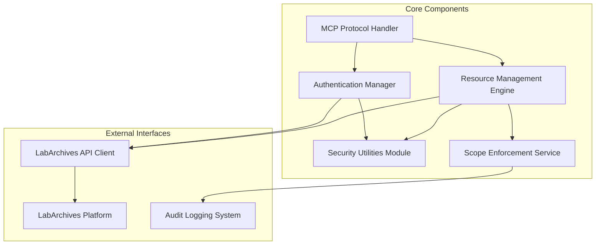
```mermaid
graph TB
    A[MCP Protocol Handler] --> B[Authentication Manager]
    A --> C[Resource Management Engine]
    B --> D[LabArchives API Client]
    B --> H[Security Utilities Module]
    C --> D
    C --> E[Scope Enforcement Service]
    C --> H
    D --> F[LabArchives Platform]
    E --> G[Audit Logging System]
    
    subgraph "Core Components"
        A
        B
        C
        E
        H
    end
    
    subgraph "External Interfaces"
        D
        F
        G
    end
```

The system architecture comprises <span style="background-color: rgba(91, 57, 243, 0.2)">six</span> major components:

- **MCP Protocol Handler:** Manages JSON-RPC 2.0 communication with MCP-compatible AI clients
- **Authentication Manager:** Handles credential management and session security
- **Resource Management Engine:** Orchestrates data discovery and content retrieval operations
- **LabArchives API Client:** Provides standardized interface to LabArchives REST API
- **Scope Enforcement Service:** Implements access control and data filtering policies
- <span style="background-color: rgba(91, 57, 243, 0.2)">**Security Utilities Module:** Centralized security utilities for sanitization and validation operations</span>

#### 1.2.2.3 Core Technical Approach

The LabArchives MCP Server employs a client-server architecture following MCP specifications with several key design principles:

- **Stateless Architecture:** Request-response model with no persistent storage requirements
- **On-Demand Retrieval:** Dynamic data access without caching or synchronization overhead
- **Cross-Platform Compatibility:** Support for Windows, macOS, and Linux environments
- **Standards Compliance:** Full adherence to MCP protocol specifications and JSON-RPC 2.0
- **Security-First Design:** Comprehensive authentication, authorization, and audit capabilities

<span style="background-color: rgba(91, 57, 243, 0.2)">Scope validation is performed immediately upon access requests and operates in a fail-secure (deny-by-default) manner to ensure unauthorized access is prevented.</span>

### 1.2.3 Success Criteria

#### 1.2.3.1 Measurable Objectives

The LabArchives MCP Server defines success through specific performance and reliability metrics:

| Metric Category | Target | Measurement Method |
|-----------------|--------|-------------------|
| Resource Listing Response Time | < 2 seconds | API response time monitoring |
| Page Content Fetch Time | < 5 seconds | End-to-end retrieval timing |
| System Uptime | > 99% during active sessions | Availability monitoring |

#### 1.2.3.2 Critical Success Factors

Success depends on achieving several critical technical and operational milestones:

- **Protocol Compliance:** Full MCP protocol compliance ensuring compatibility with all MCP-enabled AI systems
- **Reliability:** Robust error handling and graceful degradation under various failure scenarios
- **Auditability:** Comprehensive logging for compliance and governance requirements
- **Usability:** Intuitive CLI interface requiring minimal configuration and setup
- **Security:** Secure credential management and access control mechanisms

#### 1.2.3.3 Key Performance Indicators (KPIs)

Long-term success will be measured through operational and adoption metrics:

- **Deployment Success Rate:** Number of successful system deployments across research organizations
- **User Retention:** Sustained usage rates among research teams
- **Performance Consistency:** Average response times and error rates for API interactions
- **Research Impact:** Measurable reduction in time-to-insight for research tasks
- **Ecosystem Growth:** Integration with additional MCP-compatible AI platforms

## 1.3 SCOPE

### 1.3.1 In-Scope Elements

#### 1.3.1.1 Core Features and Functionalities

The LabArchives MCP Server includes the following must-have capabilities:

| Feature Category | Capabilities |
|------------------|-------------|
| MCP Protocol Implementation | Resources/list and resources/read operations |
| LabArchives Integration | Read-only access to all LabArchives regions |
| Authentication Support | API keys and temporary token management |
| Data Retrieval | Hierarchical data access with structure preservation |

**Primary User Workflows:**
- Research scientists configuring MCP server for AI-assisted data analysis
- Principal investigators setting up laboratory-wide data access policies
- Graduate students retrieving experimental data for computational analysis
- Laboratory teams integrating AI capabilities into existing research workflows

**Essential Technical Features:**
- Configurable scope limitation at notebook and folder levels
- Comprehensive audit logging for compliance and governance
- CLI interface with extensive configuration options
- JSON and JSON-LD structured output formats optimized for AI consumption
- Docker containerization support for deployment flexibility

#### 1.3.1.2 Implementation Boundaries

The system scope encompasses specific technical and operational boundaries:

**System Boundaries:**
- Local deployment model designed for individual user installations
- Command-line interface configuration and management
- Read-only data access with no modification capabilities
- Text entries, metadata, and attachment references (not binary content)

**Geographic and Market Coverage:**
- Support for all global LabArchives deployments (US, AU, UK regions)
- Cross-platform compatibility (Windows, macOS, Linux)
- Standard MCP transport mechanisms (stdio, WebSocket)

**Data Domains Included:**
- Laboratory notebook entries and experimental data
- Metadata and structural information
- User permissions and access control data
- Audit trail and access logging information

### 1.3.2 Out-of-Scope Elements

#### 1.3.2.1 Explicitly Excluded Features and Capabilities

The following capabilities are explicitly excluded from the current implementation:

**Data Modification Operations:**
- Write operations (create, modify, delete) to LabArchives content
- Real-time data synchronization between systems
- Data migration or bulk transfer capabilities
- Version history modification or management

**Enterprise-Scale Features:**
- Multi-tenant deployment architecture
- Centralized user management and authentication
- Advanced role-based access controls beyond LabArchives permissions
- Enterprise-scale monitoring and alerting systems

**Advanced Integration Capabilities:**
- Binary file content processing and analysis
- Integration with non-LabArchives laboratory information systems
- Real-time data streaming or event processing
- High-frequency automated data extraction workflows

#### 1.3.2.2 Future Phase Considerations

The project roadmap identifies several capabilities for future development phases:

**Phase 2 Enhancements:**
- Safe write-back capabilities with version control
- Enhanced version history access and management
- Advanced search capabilities across multiple notebooks
- Improved performance optimization for large datasets

**Phase 3 Enterprise Features:**
- Multi-notebook data aggregation and analysis
- Integration with enterprise laboratory management tools
- Advanced compliance and governance features
- Real-time collaboration and sharing capabilities

#### 1.3.2.3 Unsupported Use Cases

The following use cases are not supported by the current system design:

- **High-Frequency Operations:** Automated data extraction requiring high-frequency API calls
- **Real-Time Processing:** Applications requiring real-time data streaming or event processing
- **Large-Scale Migration:** Bulk data migration or synchronization between systems
- **Multi-User Concurrency:** Multiple users performing simultaneous write operations
- **Binary Content Analysis:** Processing or analysis of binary file attachments

#### References

- `README.md` - High-level project overview, features, installation, and usage documentation
- `blitzy/documentation/Input Prompt.md` - Product Requirements Document with MVP specifications
- `blitzy/documentation/Technical Specifications.md` - Consolidated v0.2.0 technical design reference
- `blitzy/documentation/Technical Specifications_916f36fe-6c43-4713-80b6-8444416b5a59.md` - Definitive technical specification with business justification and stakeholder analysis
- `blitzy/` - Documentation consolidation folder containing comprehensive project documentation
- `blitzy/documentation/` - Core documentation files including technical specifications and requirements
- `.github/` - GitHub configuration and workflows for project governance
- `infrastructure/` - Deployment and orchestration assets for enterprise environments

# 2. PRODUCT REQUIREMENTS

## 2.1 FEATURE CATALOG

### 2.1.1 F-001: MCP Protocol Implementation

#### 2.1.1.1 Feature Metadata
| Attribute | Value |
|-----------|-------|
| **Unique ID** | F-001 |
| **Feature Name** | MCP Protocol Implementation |
| **Feature Category** | Core Infrastructure |
| **Priority Level** | Critical |
| **Status** | Completed |

#### 2.1.1.2 Description

**Overview**: Implements the Model Context Protocol (MCP) as an open standard for connecting AI systems with data sources, providing a universal protocol for AI-to-data integration. The server exposes LabArchives data as MCP resources that can be consumed by MCP-compatible clients like Claude Desktop, positioning the solution within the rapidly expanding MCP ecosystem that includes OpenAI, Block, Replit, and Sourcegraph.

**Business Value**: Enables seamless integration between AI applications and LabArchives data without custom implementations, addressing the fundamental "N×M integration problem" where complexity scales exponentially with the number of AI applications and data sources. This strategic positioning leverages the March 2025 OpenAI adoption of MCP and creates immediate market opportunities for research organizations.

**User Benefits**: Research scientists can access their LabArchives notebook content directly through AI assistants, eliminating manual data extraction and enabling AI-enhanced research workflows. This capability delivers an estimated 60-80% reduction in time required for AI-assisted data analysis while maintaining compliance with research data governance requirements.

**Technical Context**: Utilizes MCP as an open protocol that enables seamless integration between LLM applications and external data sources, providing a standardized JSON-RPC 2.0 communication layer that ensures compatibility across all MCP-enabled AI systems.

#### 2.1.1.3 Dependencies
- **Prerequisite Features**: None (foundational feature)
- **System Dependencies**: Python MCP SDK, FastMCP Framework, JSON-RPC transport layer
- **External Dependencies**: MCP specification compliance, Claude Desktop compatibility
- **Integration Requirements**: LabArchives API integration, secure credential management

---

### 2.1.2 F-002: LabArchives API Integration

#### 2.1.2.1 Feature Metadata
| Attribute | Value |
|-----------|-------|
| **Unique ID** | F-002 |
| **Feature Name** | LabArchives API Integration |
| **Feature Category** | Data Access |
| **Priority Level** | Critical |
| **Status** | Completed |

#### 2.1.2.2 Description

**Overview**: Provides secure, authenticated access to LabArchives electronic lab notebook data through their REST API, supporting both permanent API keys and temporary user tokens across all global LabArchives deployments (US, AU, UK regions).

**Business Value**: Enables direct access to valuable research data stored in LabArchives, leveraging existing institutional investments in electronic lab notebook infrastructure while maintaining SOC2, ISO 27001, HIPAA, and GDPR compliance standards.

**User Benefits**: Researchers can access their existing LabArchives content without data migration or system changes, maintaining familiar workflows while adding AI capabilities. This approach preserves the substantial organizational investment in laboratory data management systems.

**Technical Context**: Integrates with LabArchives API using access key ID and password authentication, supporting both permanent credentials and temporary app authentication tokens for SSO users, with comprehensive error handling and graceful degradation under various failure scenarios.

#### 2.1.2.3 Dependencies
- **Prerequisite Features**: None (foundational feature)
- **System Dependencies**: HTTP requests library, XML/JSON parsing capabilities
- **External Dependencies**: LabArchives API availability, valid authentication credentials
- **Integration Requirements**: Secure credential storage, error handling for API failures

---

### 2.1.3 F-003: Resource Discovery and Listing

#### 2.1.3.1 Feature Metadata
| Attribute | Value |
|-----------|-------|
| **Unique ID** | F-003 |
| **Feature Name** | Resource Discovery and Listing |
| **Feature Category** | Data Management |
| **Priority Level** | High |
| **Status** | Completed |

#### 2.1.3.2 Description

**Overview**: Implements MCP resource listing capabilities to enumerate available notebooks, pages, and entries within configured scope, providing hierarchical navigation of LabArchives data structures that preserves the original laboratory organization and metadata context.

**Business Value**: Enables users to discover and navigate their research data through AI interfaces, improving data accessibility and utilization while maintaining the structured approach that researchers depend on for experimental organization.

**User Benefits**: Researchers can browse their notebook structure through AI applications, making it easy to locate specific experiments or data sets within their established laboratory workflows and organizational systems.

**Technical Context**: Implements MCP `resources/list` functionality with support for hierarchical data presentation, scope-based filtering, and URI scheme design that maintains consistency with MCP protocol specifications.

#### 2.1.3.3 Dependencies
- **Prerequisite Features**: F-001 (MCP Protocol), F-002 (LabArchives API)
- **System Dependencies**: JSON serialization, URI scheme handling
- **External Dependencies**: LabArchives notebook permissions
- **Integration Requirements**: Scope configuration, permission validation

---

### 2.1.4 F-004: Content Retrieval and Contextualization

#### 2.1.4.1 Feature Metadata
| Attribute | Value |
|-----------|-------|
| **Unique ID** | F-004 |
| **Feature Name** | Content Retrieval and Contextualization |
| **Feature Category** | Data Management |
| **Priority Level** | High |
| **Status** | Completed |

#### 2.1.4.2 Description

**Overview**: Implements MCP resource reading capabilities to fetch detailed content from specific notebook pages and entries, preserving metadata and hierarchical context for AI consumption while supporting both JSON and JSON-LD structured output formats optimized for AI analysis.

**Business Value**: Provides AI applications with rich, contextual research data that maintains the original structure and metadata from LabArchives, enabling more accurate and relevant responses to research questions while supporting enhanced research reproducibility.

**User Benefits**: AI assistants can access complete experimental data with proper context, enabling more accurate and relevant responses to research questions while maintaining the structured approach that ensures research quality and reproducibility.

**Technical Context**: Implements MCP `resources/read` functionality with structured JSON output optimized for LLM processing, including optional JSON-LD semantic context support for advanced AI applications.

#### 2.1.4.3 Dependencies
- **Prerequisite Features**: F-001 (MCP Protocol), F-002 (LabArchives API)
- **System Dependencies**: JSON-LD support (optional), data serialization
- **External Dependencies**: LabArchives content permissions
- **Integration Requirements**: Metadata preservation, content formatting

---

### 2.1.5 F-005: Authentication and Security Management

#### 2.1.5.1 Feature Metadata
| Attribute | Value |
|-----------|-------|
| **Unique ID** | F-005 |
| **Feature Name** | Authentication and Security Management |
| **Feature Category** | Security |
| **Priority Level** | Critical |
| **Status** | Completed |

#### 2.1.5.2 Description

**Overview**: Implements secure authentication mechanisms for LabArchives API access, supporting both permanent API keys and temporary user tokens with comprehensive security controls that maintain compliance with institutional security requirements.

**Business Value**: Ensures secure access to sensitive research data while maintaining compliance with institutional security requirements, supporting the comprehensive audit trails and access controls required for research data governance.

**User Benefits**: Researchers can securely connect their LabArchives accounts without compromising credentials or data security, maintaining the trust and confidence required for sensitive research data handling.

**Technical Context**: Supports SSO users through app authentication tokens obtained from LabArchives user profile settings, with secure credential handling, session management, and comprehensive validation mechanisms.

#### 2.1.5.3 Dependencies
- **Prerequisite Features**: F-002 (LabArchives API)
- **System Dependencies**: Environment variable handling, secure storage
- **External Dependencies**: LabArchives authentication services
- **Integration Requirements**: Credential validation, token refresh handling

---

### 2.1.6 F-006: CLI Interface and Configuration

#### 2.1.6.1 Feature Metadata
| Attribute | Value |
|-----------|-------|
| **Unique ID** | F-006 |
| **Feature Name** | CLI Interface and Configuration |
| **Feature Category** | User Interface |
| **Priority Level** | High |
| **Status** | Completed |

#### 2.1.6.2 Description

**Overview**: Provides a comprehensive command-line interface for server configuration, credential management, and operational control, enabling easy deployment and management across Windows, macOS, and Linux environments with extensive configuration options.

**Business Value**: Simplifies deployment and configuration for technical users, reducing setup time and complexity while providing the flexibility required for diverse research environments and deployment scenarios.

**User Benefits**: Researchers and IT administrators can easily configure and deploy the server with familiar command-line tools, reducing barriers to adoption and enabling integration with existing research infrastructure.

**Technical Context**: Implements comprehensive CLI with argument parsing, environment variable support, configuration validation, and extensive help documentation that supports both individual user installations and enterprise deployment scenarios.

#### 2.1.6.3 Dependencies
- **Prerequisite Features**: F-005 (Authentication)
- **System Dependencies**: Python argparse, environment variable access
- **External Dependencies**: None
- **Integration Requirements**: Configuration validation, help documentation

---

### 2.1.7 F-007: Scope Limitation and Access Control

#### 2.1.7.1 Feature Metadata
| Attribute | Value |
|-----------|-------|
| **Unique ID** | F-007 |
| **Feature Name** | Scope Limitation and Access Control |
| **Feature Category** | Security |
| **Priority Level** | High |
| **Status** | Completed |

#### 2.1.7.2 Description

**Overview**: Implements configurable scope limitations to restrict data exposure to specific notebooks or folders, providing granular access control for sensitive research data while maintaining the performance and functionality required for effective AI-assisted research workflows.

**Business Value**: Enables controlled data sharing with AI applications, reducing risk of unauthorized data exposure while maintaining functionality, supporting the compliance and governance requirements critical for research organizations.

**User Benefits**: Researchers can limit AI access to specific projects or experiments, maintaining data privacy and security while enabling AI-enhanced capabilities where appropriate and beneficial.

**Technical Context**: Implements scope enforcement at the resource listing and reading levels with configuration-based controls that integrate seamlessly with LabArchives permission models and organizational security policies.

#### 2.1.7.3 Dependencies
- **Prerequisite Features**: F-003 (Resource Discovery), F-004 (Content Retrieval)
- **System Dependencies**: Configuration management, access validation
- **External Dependencies**: LabArchives permission model
- **Integration Requirements**: Scope validation, error handling

---

### 2.1.8 F-008: Comprehensive Audit Logging

#### 2.1.8.1 Feature Metadata
| Attribute | Value |
|-----------|-------|
| **Unique ID** | F-008 |
| **Feature Name** | Comprehensive Audit Logging |
| **Feature Category** | Compliance |
| **Priority Level** | High |
| **Status** | Completed |

#### 2.1.8.2 Description

**Overview**: Implements comprehensive logging of all data access operations, API calls, and system events to support audit requirements and compliance needs, with structured logging that supports both operational monitoring and regulatory compliance requirements.

**Business Value**: Provides traceability and accountability for data access, supporting regulatory compliance and security monitoring requirements while enabling organizations to maintain comprehensive governance over research data usage.

**User Benefits**: Researchers and administrators can track data usage and access patterns for compliance and security purposes, providing the transparency and accountability required for sensitive research data management.

**Technical Context**: Implements structured logging with configurable verbosity levels, secure log management, and comprehensive event tracking that supports both operational monitoring and compliance reporting requirements.

#### 2.1.8.3 Dependencies
- **Prerequisite Features**: All core features (cross-cutting concern)
- **System Dependencies**: Python logging framework, file I/O
- **External Dependencies**: None
- **Integration Requirements**: Log rotation, secure storage

## 2.2 FUNCTIONAL REQUIREMENTS TABLE

### 2.2.1 F-001: MCP Protocol Implementation

| Requirement ID | Description | Acceptance Criteria | Priority | Complexity |
|----------------|-------------|---------------------|----------|------------|
| F-001-RQ-001 | MCP Server Initialization | Server successfully initializes and advertises MCP capabilities | Must-Have | Medium |
| F-001-RQ-002 | Protocol Handshake | Completes MCP handshake with client applications | Must-Have | Medium |
| F-001-RQ-003 | JSON-RPC Transport | Implements JSON-RPC 2.0 communication protocol | Must-Have | High |
| F-001-RQ-004 | Capability Negotiation | Advertises resource capabilities to MCP clients | Must-Have | Low |

#### 2.2.1.1 Technical Specifications
- **Input Parameters**: Server configuration, client connection requests, JSON-RPC messages
- **Output/Response**: MCP server instance, handshake responses, structured JSON responses, capability list
- **Performance Criteria**: < 2 seconds startup, < 1 second handshake, < 500ms per message, < 100ms capability response
- **Data Requirements**: Server metadata, protocol version, message validation, feature inventory

#### 2.2.1.2 Validation Rules
- **Business Rules**: Single server instance per configuration, compatible protocol versions only, valid JSON-RPC format
- **Data Validation**: Valid configuration parameters, protocol version validation, message structure validation
- **Security Requirements**: Secure initialization, authenticated connections, secure message handling
- **Compliance Requirements**: MCP specification compliance, JSON-RPC 2.0 compliance

### 2.2.2 F-002: LabArchives API Integration

| Requirement ID | Description | Acceptance Criteria | Priority | Complexity |
|----------------|-------------|---------------------|----------|------------|
| F-002-RQ-001 | API Authentication | Successfully authenticate with LabArchives API | Must-Have | Medium |
| F-002-RQ-002 | Notebook Listing | Retrieve list of accessible notebooks | Must-Have | Low |
| F-002-RQ-003 | Page Content Retrieval | Fetch page entries and metadata | Must-Have | Medium |
| F-002-RQ-004 | Error Handling | Handle API failures gracefully | Must-Have | Medium |

#### 2.2.2.1 Technical Specifications
- **Input Parameters**: Access key, token/password, user credentials, page ID
- **Output/Response**: Authentication session, notebook list JSON, page content JSON, error messages
- **Performance Criteria**: < 3 seconds authentication, < 5 seconds listing, < 10 seconds retrieval
- **Data Requirements**: Valid credentials, user permissions, page access rights, error context

#### 2.2.2.2 Validation Rules
- **Business Rules**: Valid credentials required, user permission-based access, read-only access only
- **Data Validation**: Credential format validation, notebook ID validation, content integrity validation
- **Security Requirements**: Secure credential storage, access control enforcement, no data modification
- **Compliance Requirements**: Authentication standards, data privacy compliance, research data protection

### 2.2.3 F-003: Resource Discovery and Listing

| Requirement ID | Description | Acceptance Criteria | Priority | Complexity |
|----------------|-------------|---------------------|----------|------------|
| F-003-RQ-001 | MCP Resource Listing | Implement `resources/list` MCP method | Must-Have | Medium |
| F-003-RQ-002 | Hierarchical Navigation | Support notebook/page hierarchy | Should-Have | Medium |
| F-003-RQ-003 | Scope-Based Filtering | Filter resources by configured scope | Must-Have | Low |
| F-003-RQ-004 | Resource URI Generation | Generate valid MCP resource URIs | Must-Have | Low |

#### 2.2.3.1 Technical Specifications
- **Input Parameters**: MCP list request, hierarchy level, scope configuration, resource identifiers
- **Output/Response**: Resource array JSON, structured resource list, filtered list, valid URI strings
- **Performance Criteria**: < 2 seconds response, < 3 seconds hierarchical, < 1 second filtering
- **Data Requirements**: Resource metadata, hierarchy data, scope parameters, resource IDs

#### 2.2.3.2 Validation Rules
- **Business Rules**: Only accessible resources listed, consistent hierarchy representation
- **Data Validation**: Resource existence validation, hierarchy structure validation, URI format validation
- **Security Requirements**: Permission-based listing, secure navigation, access control compliance
- **Compliance Requirements**: MCP resource specification, data organization standards

### 2.2.4 F-004: Content Retrieval and Contextualization

| Requirement ID | Description | Acceptance Criteria | Priority | Complexity |
|----------------|-------------|---------------------|----------|------------|
| F-004-RQ-001 | MCP Resource Reading | Implement `resources/read` MCP method | Must-Have | Medium |
| F-004-RQ-002 | Content Serialization | Convert LabArchives data to JSON | Must-Have | Medium |
| F-004-RQ-003 | Metadata Preservation | Maintain original metadata context | Should-Have | Low |
| F-004-RQ-004 | JSON-LD Support | Optional semantic context support | Could-Have | Medium |

#### 2.2.4.1 Technical Specifications
- **Input Parameters**: Resource URI, LabArchives data, original metadata, JSON-LD flag
- **Output/Response**: Content JSON, structured JSON, enhanced JSON, semantic JSON
- **Performance Criteria**: < 5 seconds retrieval, < 1 second serialization, < 500ms metadata processing
- **Data Requirements**: Resource content, data schema, metadata fields, context schema

#### 2.2.4.2 Validation Rules
- **Business Rules**: Valid resource URIs only, consistent JSON structure, complete metadata inclusion
- **Data Validation**: URI validation, JSON schema validation, metadata completeness check
- **Security Requirements**: Authorized access only, data integrity, metadata security
- **Compliance Requirements**: MCP read specification, serialization standards, JSON-LD specification

## 2.3 FEATURE RELATIONSHIPS

### 2.3.1 Feature Dependencies Map

The features of the LabArchives MCP Server have clear dependencies and integration points that reflect the layered architecture approach:

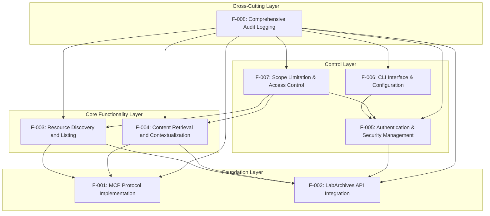
```mermaid
graph TB
    subgraph "Foundation Layer"
        F001[F-001: MCP Protocol Implementation]
        F002[F-002: LabArchives API Integration]
    end
    
    subgraph "Core Functionality Layer"
        F003[F-003: Resource Discovery and Listing]
        F004[F-004: Content Retrieval and Contextualization]
    end
    
    subgraph "Control Layer"
        F005[F-005: Authentication & Security Management]
        F006[F-006: CLI Interface & Configuration]
        F007[F-007: Scope Limitation & Access Control]
    end
    
    subgraph "Cross-Cutting Layer"
        F008[F-008: Comprehensive Audit Logging]
    end
    
    F003 --> F001
    F003 --> F002
    F004 --> F001
    F004 --> F002
    F005 --> F002
    F006 --> F005
    F007 --> F003
    F007 --> F004
    F007 --> F005
    F008 --> F001
    F008 --> F002
    F008 --> F003
    F008 --> F004
    F008 --> F005
    F008 --> F006
    F008 --> F007
```

### 2.3.2 Integration Points

| Integration Point | Features Involved | Shared Components |
|-------------------|-------------------|-------------------|
| **MCP Resource Interface** | F-001, F-003, F-004 | JSON-RPC handler, Resource URI scheme, MCP protocol compliance |
| **LabArchives Data Access** | F-002, F-005, F-007 | Authentication manager, API client, credential handling |
| **Configuration Management** | F-005, F-006, F-007 | Configuration parser, validation engine, environment variables |
| **Audit Trail System** | F-008, All Features | Logging framework, event dispatcher, audit log formatting |

### 2.3.3 Common Services

| Service | Used By Features | Purpose |
|---------|------------------|---------|
| **JSON Serialization Service** | F-003, F-004, F-008 | Standardized data formatting |
| **Error Handling Service** | All Features | Consistent error reporting |
| **Validation Service** | F-005, F-006, F-007 | Input and configuration validation |
| **Security Service** | F-002, F-005, F-007 | Authentication and authorization |

## 2.4 IMPLEMENTATION CONSIDERATIONS

### 2.4.1 F-001: MCP Protocol Implementation
- **Technical Constraints**: Must comply with MCP specification, JSON-RPC 2.0 compatibility required
- **Performance Requirements**: < 500ms response time for protocol messages, concurrent client support
- **Scalability Considerations**: Single-user deployment model, stateless request handling
- **Security Implications**: Secure transport layer, client authentication validation
- **Maintenance Requirements**: MCP specification updates, SDK version management

### 2.4.2 F-002: LabArchives API Integration
- **Technical Constraints**: LabArchives API rate limits, XML/JSON response parsing
- **Performance Requirements**: < 10 seconds for content retrieval, efficient API usage
- **Scalability Considerations**: API call optimization, response caching strategies
- **Security Implications**: Secure credential handling, API token management
- **Maintenance Requirements**: API version compatibility, error handling updates

### 2.4.3 F-003: Resource Discovery and Listing
- **Technical Constraints**: MCP resource specification compliance, URI scheme design
- **Performance Requirements**: < 2 seconds for resource listing, memory-efficient processing
- **Scalability Considerations**: Large notebook handling, pagination support
- **Security Implications**: Permission-based resource filtering, scope enforcement
- **Maintenance Requirements**: Resource schema evolution, hierarchy optimization

### 2.4.4 F-004: Content Retrieval and Contextualization
- **Technical Constraints**: JSON-LD specification compliance, content size limits
- **Performance Requirements**: < 5 seconds for content retrieval, streaming for large content
- **Scalability Considerations**: Memory usage optimization, content chunking
- **Security Implications**: Content sanitization, metadata security
- **Maintenance Requirements**: Content format evolution, serialization updates

### 2.4.5 F-005: Authentication and Security Management
- **Technical Constraints**: LabArchives authentication protocols, token lifecycle management
- **Performance Requirements**: < 1 second for authentication validation, session efficiency
- **Scalability Considerations**: Credential caching, session management
- **Security Implications**: Credential encryption, secure storage, audit compliance
- **Maintenance Requirements**: Security updates, authentication protocol changes

### 2.4.6 F-006: CLI Interface and Configuration
- **Technical Constraints**: Cross-platform compatibility, standard CLI conventions
- **Performance Requirements**: < 100ms for argument parsing, immediate feedback
- **Scalability Considerations**: Configuration complexity management, help system
- **Security Implications**: Secure credential input, configuration validation
- **Maintenance Requirements**: CLI evolution, documentation updates

### 2.4.7 F-007: Scope Limitation and Access Control
- **Technical Constraints**: LabArchives permission model alignment, scope granularity
- **Performance Requirements**: < 50ms for access decisions, efficient scope checking
- **Scalability Considerations**: Complex scope configurations, permission caching
- **Security Implications**: Access control bypass prevention, scope validation
- **Maintenance Requirements**: Permission model updates, scope configuration evolution

### 2.4.8 F-008: Comprehensive Audit Logging
- **Technical Constraints**: Log format standards, storage requirements
- **Performance Requirements**: < 10ms logging overhead, asynchronous processing
- **Scalability Considerations**: Log rotation, storage management, performance impact
- **Security Implications**: Log integrity, sensitive data handling, access controls
- **Maintenance Requirements**: Log format evolution, compliance updates

#### References
- Section 1.1 Executive Summary - Project overview and business context
- Section 1.2 System Overview - Technical architecture and system capabilities
- Section 1.3 Scope - Project boundaries and implementation scope
- `README.md` - High-level project overview and usage documentation
- `blitzy/documentation/Input Prompt.md` - Product Requirements Document with MVP specifications
- `blitzy/documentation/Technical Specifications.md` - Technical design reference
- MCP Protocol Specification - Standard for AI-data integration protocols
- LabArchives API Documentation - External API integration specifications

# 3. TECHNOLOGY STACK

## 3.1 PROGRAMMING LANGUAGES

### 3.1.1 Python 3.11+
- **Platform**: Core application, CLI interface, and MCP server implementation
- **Selection Criteria**: 
  - Modern async/await support required for MCP protocol implementation
  - Extensive ecosystem for scientific computing and AI integration
  - Strong typing support via type hints for maintainability
  - Rich library ecosystem for HTTP, JSON-RPC, and data validation
  - Cross-platform compatibility for diverse research environments
- **Constraints**: 
  - Minimum version 3.11 required for latest language features and performance improvements
  - Must maintain compatibility with MCP SDK and FastMCP framework
  - Type hints enforced for code quality and maintainability

### 3.1.2 YAML
- **Platform**: Configuration management, Kubernetes manifests, GitHub Actions workflows
- **Selection Criteria**: Human-readable format ideal for configuration files and infrastructure as code
- **Constraints**: Schema validation required for security and correctness

### 3.1.3 HCL (HashiCorp Configuration Language)
- **Platform**: Terraform infrastructure definitions and AWS resource provisioning
- **Selection Criteria**: Native language for Terraform with strong typing and expression support
- **Constraints**: Terraform >= 1.4.0 compatibility required for module support

### 3.1.4 Bash
- **Platform**: Deployment scripts, operational automation, and container entrypoints
- **Selection Criteria**: Universal availability in Unix-like environments
- **Constraints**: POSIX compliance for maximum portability

## 3.2 FRAMEWORKS & LIBRARIES

### 3.2.1 Model Context Protocol (MCP) Framework
- **MCP SDK >= 1.0.0**: Core Model Context Protocol implementation
  - **Purpose**: Provides standardized protocol for AI-data integration
  - **Justification**: Open standard adopted by OpenAI, Block, Replit, and Sourcegraph in 2025
  - **Features**: JSON-RPC 2.0 transport, resource management, client libraries
  - **Integration**: Native support for Claude Desktop and MCP-compatible AI systems

- **FastMCP >= 1.0.0**: High-level MCP framework for Python
  - **Version**: 2.0 (production-ready release)
  - **Purpose**: Simplified MCP server development with decorators and high-level abstractions
  - **Justification**: Pythonic API design reduces complexity - "decorating a function is all you need"
  - **Features**: Authentication systems, deployment tools, testing frameworks, production infrastructure patterns

### 3.2.2 Data Validation & Configuration Management
- **Pydantic >= 2.11.7**: Data validation using Python type annotations
  - **Purpose**: Type-safe configuration management and API response parsing
  - **Justification**: Runtime type checking ensures data integrity and reduces bugs
  - **Usage**: ServerConfiguration models, API response validation, MCP resource schemas
  - **Features**: JSON Schema generation, validation error reporting, serialization

- **Pydantic-settings >= 2.10.1**: Settings management with Pydantic
  - **Purpose**: Environment variable parsing with type safety
  - **Justification**: Supports configuration precedence (CLI > environment > file > defaults)
  - **Features**: Automatic type conversion, nested configuration support, validation

### 3.2.3 Command-Line Interface Framework
- **Click >= 8.0.0**: Command-line interface creation kit
  - **Purpose**: Comprehensive CLI with subcommands and argument parsing
  - **Justification**: Declarative CLI design with automatic help generation
  - **Features**: Nested commands, parameter validation, colored output, shell completion
  - **Integration**: Supports both interactive and scripted usage patterns

### 3.2.4 HTTP Client Libraries
- **Requests >= 2.31.0**: HTTP library for LabArchives API communication
  - **Purpose**: Robust HTTP client with session management
  - **Justification**: Mature library with comprehensive authentication support
  - **Features**: Connection pooling, retry logic, SSL verification, timeout handling
  - **Integration**: HMAC-SHA256 authentication for LabArchives API

- **urllib3 >= 2.0.0**: Low-level HTTP client library
  - **Purpose**: Advanced HTTP features and connection management
  - **Justification**: Dependency of requests providing connection pooling and retry logic
  - **Features**: Connection pooling, HTTP/2 support, SSL context management

### 3.2.5 LabArchives Integration
- **labarchives-py >= 0.1.0**: Official LabArchives Python SDK
  - **Purpose**: Native Python interface to LabArchives REST API
  - **Justification**: Official SDK ensures compatibility and feature completeness
  - **Features**: Authentication handling, API method wrapping, error management
  - **Integration**: Supports all LabArchives regions (US, AU, UK)

## 3.3 OPEN SOURCE DEPENDENCIES

### 3.3.1 Production Dependencies
```
mcp >= 1.0.0                    # Model Context Protocol SDK
fastmcp >= 1.0.0               # High-level MCP framework
pydantic >= 2.11.7             # Data validation and settings
pydantic-settings >= 2.10.1    # Environment-based configuration
requests >= 2.31.0             # HTTP client library
urllib3 >= 2.0.0              # Advanced HTTP features
labarchives-py >= 0.1.0       # LabArchives API client
click >= 8.0.0                # CLI framework
```

### 3.3.2 Development Dependencies
```
pytest >= 7.0.0               # Testing framework
pytest-cov >= 4.0.0          # Coverage reporting
pytest-asyncio >= 0.21.0     # Async test support
pytest-mock >= 3.12.0        # Mock utilities
mypy >= 1.0.0                # Static type checking
black >= 23.0.0              # Code formatting
isort >= 5.12.0              # Import sorting
flake8 >= 6.0.0              # Code linting
ruff >= 0.1.0                # Fast Python linter
coverage >= 7.0.0            # Code coverage analysis
responses >= 0.25.0          # HTTP request mocking
types-requests >= 2.31.0.20240106  # Type stubs for requests
```

### 3.3.3 Build & Deployment Dependencies
```
setuptools >= 65.0.0         # Python packaging
build >= 0.10.0              # PEP 517 build system
twine >= 4.0.0               # PyPI package upload
wheel >= 0.40.0              # Binary package format
```

### 3.3.4 Package Management
- **Primary Registry**: PyPI (Python Package Index)
- **Container Registry**: Docker Hub for base images
- **Alternative Registry**: GitHub Container Registry for private distributions
- **Dependency Resolution**: pip with requirements.txt and pyproject.toml

## 3.4 THIRD-PARTY SERVICES

### 3.4.1 LabArchives Platform Integration
- **Service**: LabArchives REST API
- **Endpoints**: 
  - US: `https://api.labarchives.com/api`
  - AU: `https://auapi.labarchives.com/api`  
  - UK: `https://ukapi.labarchives.com/api`
- **Authentication**: HMAC-SHA256 signed requests with access keys
- **Purpose**: Primary data source for notebook content and metadata
- **Integration**: RESTful API calls for notebook/page/entry operations
- **Rate Limits**: Configurable request throttling for API compliance

### 3.4.2 AWS Cloud Services
- **Amazon ECS Fargate**: Serverless container orchestration
  - **Purpose**: Production deployment platform
  - **Justification**: Managed container execution without infrastructure overhead
  - **Features**: Auto-scaling, load balancing, health monitoring
  - **Integration**: Task definitions and service configurations

- **Amazon RDS PostgreSQL**: Optional managed database service
  - **Version**: PostgreSQL 15.x
  - **Purpose**: Metadata storage, caching, and audit logging
  - **Features**: Multi-AZ deployment, automated backups, encryption at rest
  - **Integration**: Connection pooling and credential management

- **AWS CloudWatch**: Monitoring and logging service
  - **Purpose**: Centralized logging and metrics collection
  - **Features**: Log aggregation, custom metrics, alerting
  - **Integration**: Structured logging with JSON format

- **AWS KMS**: Key management service
  - **Purpose**: Encryption key management for data at rest
  - **Integration**: RDS encryption and CloudWatch log encryption

- **AWS Secrets Manager**: Credential management
  - **Purpose**: Secure storage of API keys and database credentials
  - **Features**: Automatic rotation, fine-grained access control
  - **Integration**: Runtime credential retrieval

### 3.4.3 Monitoring & Observability
- **Prometheus**: Metrics collection and monitoring
  - **Purpose**: Application metrics and performance monitoring
  - **Integration**: /metrics endpoint for scraping
  - **Features**: Time-series data collection, alerting rules

- **Grafana**: Metrics visualization (optional)
  - **Purpose**: Dashboard creation and metrics visualization
  - **Integration**: Prometheus data source configuration
  - **Features**: Custom dashboards, alerting, user management

### 3.4.4 Certificate Management
- **Let's Encrypt**: TLS certificate authority
  - **Purpose**: Automated SSL/TLS certificate provisioning
  - **Integration**: cert-manager for Kubernetes environments
  - **Features**: Automatic renewal, domain validation

### 3.4.5 Container Registry Services
- **Docker Hub**: Public container registry
  - **Purpose**: Distribution of application container images
  - **Integration**: Automated builds and deployments
  - **Repository**: `labarchives/mcp-server`

- **GitHub Container Registry**: Alternative container registry
  - **Purpose**: Private or organization-specific image distribution
  - **Integration**: GitHub Actions workflows for CI/CD

## 3.5 DATABASES & STORAGE

### 3.5.1 Primary Data Source
- **LabArchives Platform**: Primary data repository
  - **Purpose**: Source of truth for all notebook data
  - **Access Pattern**: On-demand retrieval via REST API
  - **Architecture**: No local persistence required for core functionality
  - **Justification**: Maintains data consistency and leverages existing infrastructure investment

### 3.5.2 Optional Metadata Storage
- **AWS RDS PostgreSQL 15.x**: Managed relational database
  - **Purpose**: Metadata caching, audit logs, session management
  - **Configuration**: 
    - Multi-AZ deployment for production environments
    - Automated backup with 7-30 day retention
    - Encryption at rest using AWS KMS
    - Performance Insights enabled for monitoring
  - **Justification**: Provides structured storage for operational data while maintaining ACID compliance

### 3.5.3 Logging & Audit Storage
- **AWS CloudWatch Logs**: Centralized log management
  - **Purpose**: Application logs, audit trails, operational metrics
  - **Configuration**: 
    - Log group: `/aws/ecs/labarchives-mcp-server`
    - Retention: Configurable (7-90 days)
    - Encryption: KMS encryption for sensitive data
  - **Integration**: Structured JSON logging with correlation IDs

- **Local Storage**: Development and testing
  - **Purpose**: Local log files during development
  - **Path**: `/app/logs` (containerized) or `./logs` (development)
  - **Format**: Structured JSON with rotation support

### 3.5.4 Caching Strategy
- **In-Memory Caching**: Default caching approach
  - **Purpose**: Session-based caching for API responses
  - **Implementation**: Python dictionaries with TTL support
  - **Justification**: Reduces external dependencies while providing performance benefits
  - **Scope**: Authentication tokens, resource metadata

## 3.6 DEVELOPMENT & DEPLOYMENT

### 3.6.1 Containerization
- **Docker**: Container runtime and packaging
  - **Base Image**: `python:3.11-slim-bookworm`
  - **Multi-Stage Build**: Separate build and runtime stages for size optimization
  - **Security**: Non-root user execution, minimal attack surface
  - **Optimization**: Layer caching, dependency pre-installation
  - **Health Checks**: Built-in health check endpoints

### 3.6.2 Container Orchestration
- **Kubernetes**: Production container orchestration
  - **Version**: 1.24+ (tested compatibility)
  - **Components**: 
    - Deployment: Application pod management
    - Service: Internal load balancing
    - Ingress: External traffic routing
    - ConfigMap: Configuration management
    - Secret: Credential management
  - **Ingress Controller**: NGINX Ingress Controller
  - **Service Mesh**: Compatible with Istio/Linkerd (optional)

### 3.6.3 Infrastructure as Code
- **Terraform**: Infrastructure provisioning and management
  - **Version**: >= 1.4.0 (required for module improvements)
  - **Provider**: AWS Provider >= 5.0.0
  - **Modules**: 
    - ECS module for container deployment
    - RDS module for database provisioning
    - VPC module for network configuration
  - **State Management**: Remote state with DynamoDB locking
  - **Workspaces**: Environment separation (dev, staging, prod)

### 3.6.4 CI/CD Pipeline
- **GitHub Actions**: Continuous integration and deployment
  - **Workflows**: 
    - CI: Code quality, testing, security scanning
    - Deploy: Automated deployment to staging/production
    - Release: Package publishing and tagging
  - **Matrix Strategy**: Multi-version Python testing (3.11, 3.12)
  - **Secrets Management**: GitHub Secrets for sensitive data
  - **Artifacts**: Container images, Python packages, test reports

### 3.6.5 Build Tools & Package Management
- **setuptools >= 65.0.0**: Python packaging system
  - **Purpose**: Package building and distribution
  - **Configuration**: pyproject.toml with PEP 621 metadata
  - **Features**: Dependency resolution, entry points, metadata

- **pip**: Package installer and dependency manager
  - **Purpose**: Runtime dependency installation
  - **Features**: Requirements files, constraint files, editable installs

- **uv**: Fast Python package installer (recommended)
  - **Purpose**: Accelerated package installation and resolution
  - **Justification**: Significant performance improvements over pip
  - **Usage**: Optional replacement for pip in CI/CD

### 3.6.6 Development Tools
- **Pre-commit**: Git hook framework
  - **Purpose**: Automated code quality checks before commits
  - **Hooks**: Black formatting, isort imports, flake8 linting, mypy type checking
  - **Integration**: Enforces code quality standards across development team

- **Docker Compose**: Local development orchestration
  - **Version**: 3.8 specification
  - **Purpose**: Local development environment setup
  - **Services**: Application, database, monitoring stack
  - **Features**: Volume mounting, environment variable management

### 3.6.7 Testing Infrastructure
- **pytest**: Testing framework with extensive plugin ecosystem
  - **Purpose**: Unit testing, integration testing, end-to-end testing
  - **Plugins**: Coverage reporting, async support, mocking utilities
  - **Configuration**: pytest.ini with custom markers and fixtures

- **MCP Inspector**: Protocol debugging and validation tool
  - **Purpose**: MCP protocol compliance testing
  - **Features**: Message validation, protocol flow analysis
  - **Integration**: Development and testing workflows

### 3.6.8 Security & Code Quality
- **Static Analysis**: 
  - **mypy**: Static type checking
  - **bandit**: Security vulnerability scanning
  - **safety**: Dependency vulnerability scanning
  - **semgrep**: SAST (Static Application Security Testing)

- **Container Security**: 
  - **Trivy**: Container image vulnerability scanning
  - **Hadolint**: Dockerfile linting
  - **Distroless**: Minimal base images for production

## 3.7 INTEGRATION ARCHITECTURE

### 3.7.1 MCP Protocol Integration
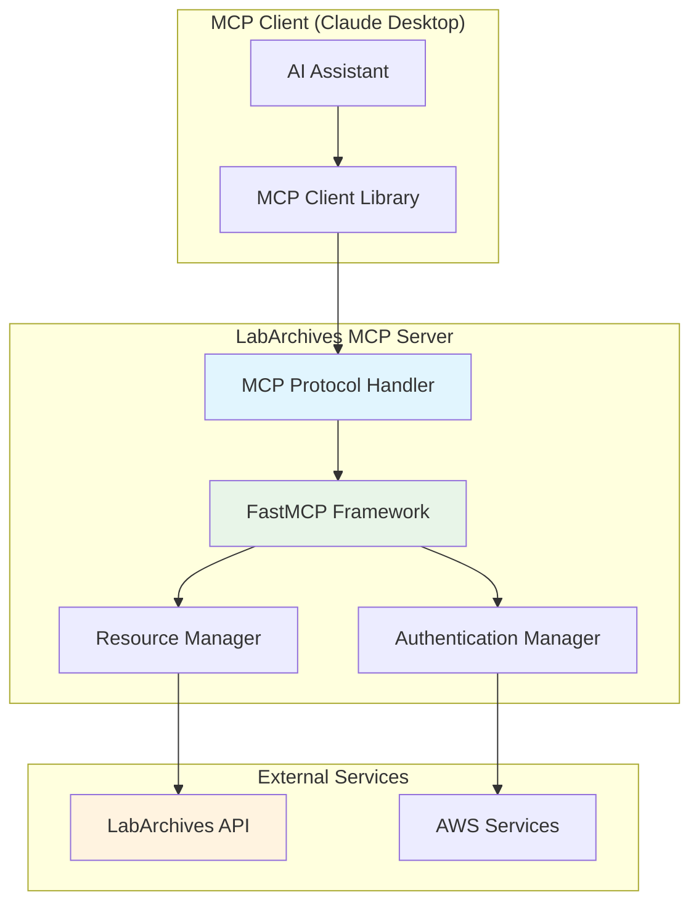
```mermaid
graph TB
    subgraph "MCP Client (Claude Desktop)"
        A[AI Assistant]
        B[MCP Client Library]
    end
    
    subgraph "LabArchives MCP Server"
        C[MCP Protocol Handler]
        D[FastMCP Framework]
        E[Resource Manager]
        F[Authentication Manager]
    end
    
    subgraph "External Services"
        G[LabArchives API]
        H[AWS Services]
    end
    
    A --> B
    B --> C
    C --> D
    D --> E
    D --> F
    E --> G
    F --> H
    
    style C fill:#e1f5fe
    style D fill:#e8f5e8
    style G fill:#fff3e0
```

### 3.7.2 Technology Stack Summary

| Component | Technology | Version | Purpose |
|-----------|------------|---------|---------|
| **Core Language** | Python | 3.11+ | Application runtime |
| **MCP Framework** | FastMCP | >= 1.0.0 | Protocol implementation |
| **Data Validation** | Pydantic | >= 2.11.7 | Type safety |
| **HTTP Client** | Requests | >= 2.31.0 | API communication |
| **CLI Framework** | Click | >= 8.0.0 | Command interface |
| **Containerization** | Docker | Latest | Application packaging |
| **Orchestration** | Kubernetes | 1.24+ | Container management |
| **Infrastructure** | Terraform | >= 1.4.0 | Infrastructure as Code |
| **CI/CD** | GitHub Actions | Latest | Automation |
| **Database** | PostgreSQL | 15.x | Optional metadata storage |
| **Monitoring** | Prometheus | Latest | Metrics collection |
| **Cloud Platform** | AWS | Latest | Infrastructure |

### 3.7.3 Security & Compliance Considerations

- **Authentication**: HMAC-SHA256 signed requests for LabArchives API
- **Encryption**: TLS 1.3 for all external communications
- **Container Security**: Non-root execution, minimal attack surface
- **Credential Management**: AWS Secrets Manager integration
- **Audit Logging**: Comprehensive request/response logging
- **Compliance**: SOC2, ISO 27001, HIPAA, GDPR alignment
- **Vulnerability Management**: Automated scanning in CI/CD pipeline

### 3.7.4 References

#### Repository Files Examined
- `src/cli/requirements.txt` - Production dependencies and version constraints
- `src/cli/pyproject.toml` - Build configuration and development dependencies
- `src/cli/Dockerfile` - Container configuration and runtime environment
- `infrastructure/terraform/` - Infrastructure as Code definitions
- `infrastructure/kubernetes/` - Container orchestration manifests
- `.github/workflows/` - CI/CD pipeline configurations

#### External Research
- Model Context Protocol (MCP) specification and ecosystem
- FastMCP framework documentation and capabilities
- LabArchives API documentation and integration patterns
- AWS services documentation for cloud deployment
- Kubernetes best practices for container orchestration

#### Technical Specifications Referenced
- Section 1.1: Executive Summary - Project context and business value
- Section 1.2: System Overview - Architectural context and system design
- Section 2.1: Feature Catalog - Implementation details and dependencies

# 4. PROCESS FLOWCHART

## 4.1 SYSTEM WORKFLOWS

### 4.1.1 Core Business Processes

#### 4.1.1.1 End-to-End User Journey

The complete user journey begins with MCP client initialization and progresses through authentication, resource discovery, and content retrieval, addressing the fundamental N×M integration problem between AI applications and LabArchives data sources.

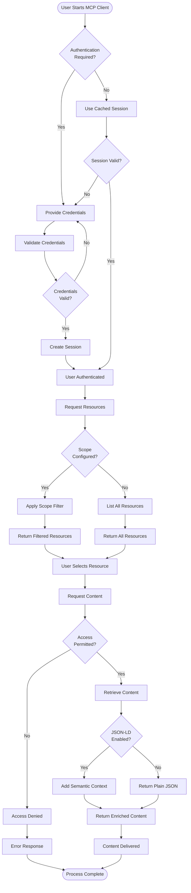
```mermaid
flowchart TB
    Start([User Starts MCP Client]) --> A{Authentication<br/>Required?}
    A -->|Yes| B[Provide Credentials]
    A -->|No| C[Use Cached Session]
    
    B --> D[Validate Credentials]
    C --> E{Session Valid?}
    
    D --> F{Credentials<br/>Valid?}
    F -->|No| B
    F -->|Yes| G[Create Session]
    
    E -->|No| B
    E -->|Yes| H[User Authenticated]
    
    G --> H
    H --> I[Request Resources]
    
    I --> J{Scope<br/>Configured?}
    J -->|Yes| K[Apply Scope Filter]
    J -->|No| L[List All Resources]
    
    K --> M[Return Filtered Resources]
    L --> N[Return All Resources]
    
    M --> O[User Selects Resource]
    N --> O
    
    O --> P[Request Content]
    P --> Q{Access<br/>Permitted?}
    
    Q -->|No| R[Access Denied]
    Q -->|Yes| S[Retrieve Content]
    
    S --> T{JSON-LD<br/>Enabled?}
    T -->|Yes| U[Add Semantic Context]
    T -->|No| V[Return Plain JSON]
    
    U --> W[Return Enriched Content]
    V --> W
    
    R --> X[Error Response]
    W --> Y[Content Delivered]
    
    X --> End([Process Complete])
    Y --> End
```

#### 4.1.1.2 MCP Protocol Implementation Workflow

The MCP protocol implementation serves as the foundation for all client-server communication, providing the standardized interface that enables AI systems to access LabArchives data through the universal MCP protocol.

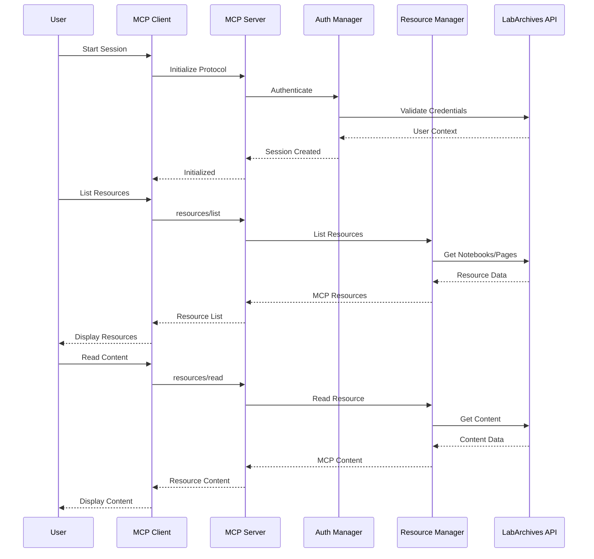
```mermaid
sequenceDiagram
    participant User
    participant MCPClient as MCP Client
    participant MCPServer as MCP Server
    participant AuthMgr as Auth Manager
    participant ResourceMgr as Resource Manager
    participant LabAPI as LabArchives API
    
    User->>MCPClient: Start Session
    MCPClient->>MCPServer: Initialize Protocol
    MCPServer->>AuthMgr: Authenticate
    AuthMgr->>LabAPI: Validate Credentials
    LabAPI-->>AuthMgr: User Context
    AuthMgr-->>MCPServer: Session Created
    MCPServer-->>MCPClient: Initialized
    
    User->>MCPClient: List Resources
    MCPClient->>MCPServer: resources/list
    MCPServer->>ResourceMgr: List Resources
    ResourceMgr->>LabAPI: Get Notebooks/Pages
    LabAPI-->>ResourceMgr: Resource Data
    ResourceMgr-->>MCPServer: MCP Resources
    MCPServer-->>MCPClient: Resource List
    MCPClient-->>User: Display Resources
    
    User->>MCPClient: Read Content
    MCPClient->>MCPServer: resources/read
    MCPServer->>ResourceMgr: Read Resource
    ResourceMgr->>LabAPI: Get Content
    LabAPI-->>ResourceMgr: Content Data
    ResourceMgr-->>MCPServer: MCP Content
    MCPServer-->>MCPClient: Resource Content
    MCPClient-->>User: Display Content
```

#### 4.1.1.3 Research Data Access Workflow

This workflow represents the core value proposition of the system, enabling researchers to access their LabArchives electronic lab notebook data through AI applications with proper authentication and scope controls.

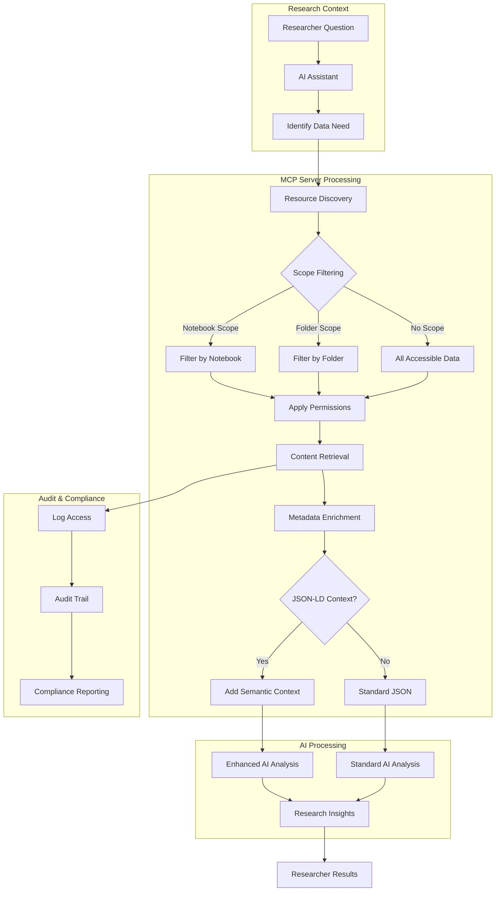
```mermaid
flowchart TD
    subgraph "Research Context"
        A[Researcher Question] --> B[AI Assistant]
        B --> C[Identify Data Need]
    end
    
    subgraph "MCP Server Processing"
        C --> D[Resource Discovery]
        D --> E{Scope Filtering}
        E -->|Notebook Scope| F[Filter by Notebook]
        E -->|Folder Scope| G[Filter by Folder]
        E -->|No Scope| H[All Accessible Data]
        
        F --> I[Apply Permissions]
        G --> I
        H --> I
        
        I --> J[Content Retrieval]
        J --> K[Metadata Enrichment]
        K --> L{JSON-LD Context?}
        L -->|Yes| M[Add Semantic Context]
        L -->|No| N[Standard JSON]
    end
    
    subgraph "AI Processing"
        M --> O[Enhanced AI Analysis]
        N --> P[Standard AI Analysis]
        O --> Q[Research Insights]
        P --> Q
    end
    
    subgraph "Audit & Compliance"
        J --> R[Log Access]
        R --> S[Audit Trail]
        S --> T[Compliance Reporting]
    end
    
    Q --> U[Researcher Results]
```

### 4.1.2 Integration Workflows

#### 4.1.2.1 LabArchives API Integration Flow

The LabArchives API integration provides secure, authenticated access to research data across all global LabArchives deployments, supporting both permanent API keys and temporary user tokens.

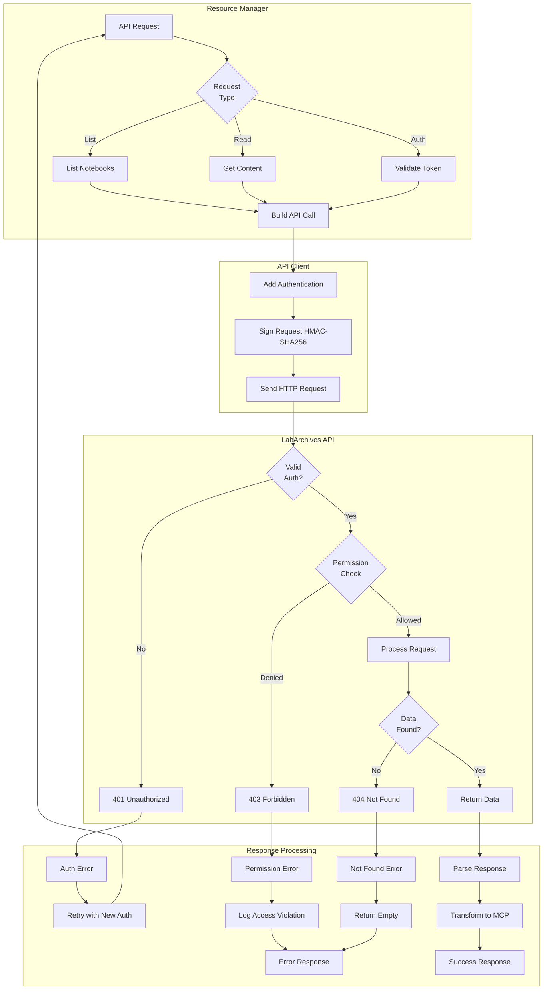
```mermaid
flowchart TB
    subgraph "Resource Manager"
        A[API Request] --> B{Request<br/>Type}
        B -->|List| C[List Notebooks]
        B -->|Read| D[Get Content]
        B -->|Auth| E[Validate Token]
        
        C --> F[Build API Call]
        D --> F
        E --> F
    end
    
    subgraph "API Client"
        F --> G[Add Authentication]
        G --> H[Sign Request HMAC-SHA256]
        H --> I[Send HTTP Request]
    end
    
    subgraph "LabArchives API"
        I --> J{Valid<br/>Auth?}
        J -->|No| K[401 Unauthorized]
        J -->|Yes| L{Permission<br/>Check}
        
        L -->|Denied| M[403 Forbidden]
        L -->|Allowed| N[Process Request]
        
        N --> O{Data<br/>Found?}
        O -->|No| P[404 Not Found]
        O -->|Yes| Q[Return Data]
    end
    
    subgraph "Response Processing"
        K --> R[Auth Error]
        M --> S[Permission Error]
        P --> T[Not Found Error]
        Q --> U[Parse Response]
        
        R --> V[Retry with New Auth]
        S --> W[Log Access Violation]
        T --> X[Return Empty]
        U --> Y[Transform to MCP]
        
        V --> A
        W --> Z[Error Response]
        X --> Z
        Y --> AA[Success Response]
    end
```

#### 4.1.2.2 Multi-Region Support Workflow

Supporting all LabArchives regions (US, AU, UK) requires dynamic endpoint configuration and region-specific authentication handling.

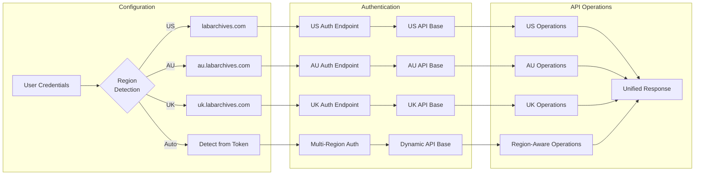
```mermaid
flowchart LR
    subgraph "Configuration"
        A[User Credentials] --> B{Region<br/>Detection}
        B -->|US| C[labarchives.com]
        B -->|AU| D[au.labarchives.com]
        B -->|UK| E[uk.labarchives.com]
        B -->|Auto| F[Detect from Token]
    end
    
    subgraph "Authentication"
        C --> G[US Auth Endpoint]
        D --> H[AU Auth Endpoint]
        E --> I[UK Auth Endpoint]
        F --> J[Multi-Region Auth]
        
        G --> K[US API Base]
        H --> L[AU API Base]
        I --> M[UK API Base]
        J --> N[Dynamic API Base]
    end
    
    subgraph "API Operations"
        K --> O[US Operations]
        L --> P[AU Operations]
        M --> Q[UK Operations]
        N --> R[Region-Aware Operations]
        
        O --> S[Unified Response]
        P --> S
        Q --> S
        R --> S
    end
```

## 4.2 VALIDATION AND BUSINESS RULES

### 4.2.1 Authentication and Authorization Flow (updated)

The authentication system implements comprehensive security controls supporting both permanent API keys and temporary user tokens, maintaining SOC2, ISO 27001, HIPAA, and GDPR compliance.

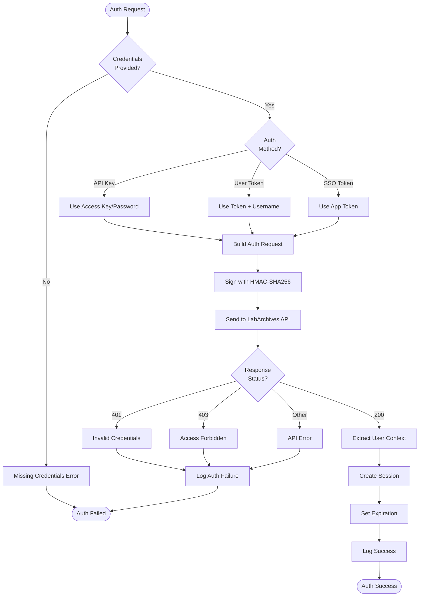
```mermaid
flowchart TB
    Start([Auth Request]) --> A{Credentials<br/>Provided?}
    A -->|No| B[Missing Credentials Error]
    A -->|Yes| C{Auth<br/>Method?}
    
    B --> End1([Auth Failed])
    
    C -->|API Key| D[Use Access Key/Password]
    C -->|User Token| E[Use Token + Username]
    C -->|SSO Token| F[Use App Token]
    
    D --> G[Build Auth Request]
    E --> G
    F --> G
    
    G --> H[Sign with HMAC-SHA256]
    H --> I[Send to LabArchives API]
    
    I --> J{Response<br/>Status?}
    
    J -->|401| K[Invalid Credentials]
    J -->|403| L[Access Forbidden]
    J -->|200| M[Extract User Context]
    J -->|Other| N[API Error]
    
    K --> O[Log Auth Failure]
    L --> O
    N --> O
    
    O --> End1
    
    M --> P[Create Session]
    P --> Q[Set Expiration]
    Q --> R[Log Success]
    R --> End2([Auth Success])
```

### 4.2.2 Scope Enforcement and Access Control (updated)

The scope enforcement system provides granular access control for sensitive research data, supporting notebook-specific and folder-specific limitations. <span style="background-color: rgba(91, 57, 243, 0.2)">Scope validation operates in a fail-secure (deny-by-default) manner, ensuring any validation uncertainty results in access denial to maintain system security.</span>

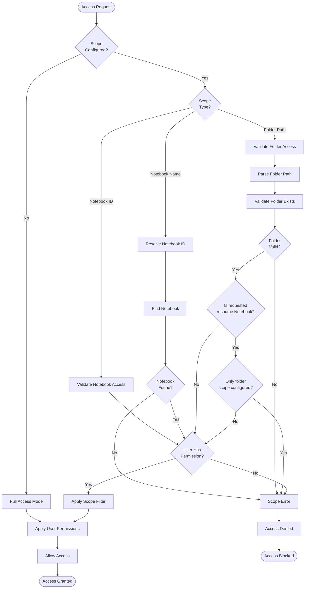
```mermaid
flowchart TD
    Start([Access Request]) --> A{Scope<br/>Configured?}
    
    A -->|No| B[Full Access Mode]
    A -->|Yes| C{Scope<br/>Type?}
    
    C -->|Notebook ID| D[Validate Notebook Access]
    C -->|Notebook Name| E[Resolve Notebook ID]
    C -->|Folder Path| F[Validate Folder Access]
    
    D --> G{User Has<br/>Permission?}
    E --> H[Find Notebook]
    H --> I{Notebook<br/>Found?}
    I -->|No| J[Scope Error]
    I -->|Yes| G
    
    F --> K[Parse Folder Path]
    K --> L[Validate Folder Exists]
    L --> M{Folder<br/>Valid?}
    M -->|No| J
    M -->|Yes| N{Is requested<br/>resource Notebook?}
    
    N -->|Yes| O{Only folder<br/>scope configured?}
    N -->|No| G
    O -->|Yes| J
    O -->|No| G
    
    B --> P[Apply User Permissions]
    G -->|No| J
    G -->|Yes| Q[Apply Scope Filter]
    
    J --> R[Access Denied]
    Q --> P
    P --> S[Allow Access]
    
    R --> End1([Access Blocked])
    S --> End2([Access Granted])
```

### 4.2.3 Resource Discovery Validation (updated)

The resource discovery system implements comprehensive validation to ensure data integrity and proper hierarchical presentation of LabArchives content. <span style="background-color: rgba(91, 57, 243, 0.2)">For folder scope configurations, an empty folder_path or path set to "/" explicitly includes pages with null or empty folder assignment, ensuring root-level pages are accessible through folder-scoped queries.</span>

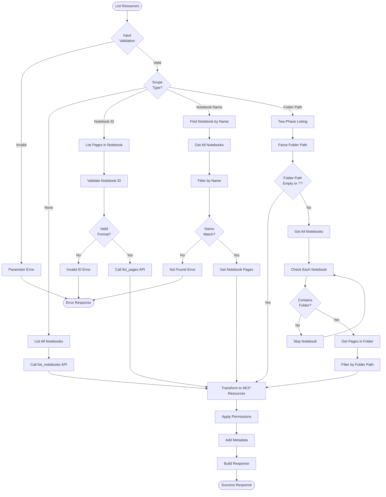
```mermaid
flowchart TB
    Start([List Resources]) --> A{Input<br/>Validation}
    A -->|Invalid| B[Parameter Error]
    A -->|Valid| C{Scope<br/>Type?}
    
    C -->|None| D[List All Notebooks]
    C -->|Notebook ID| E[List Pages in Notebook]
    C -->|Notebook Name| F[Find Notebook by Name]
    C -->|Folder Path| G[Two-Phase Listing]
    
    D --> H[Call list_notebooks API]
    
    E --> I[Validate Notebook ID]
    I --> J{Valid<br/>Format?}
    J -->|No| K[Invalid ID Error]
    J -->|Yes| L[Call list_pages API]
    
    F --> M[Get All Notebooks]
    M --> N[Filter by Name]
    N --> O{Name<br/>Match?}
    O -->|No| P[Not Found Error]
    O -->|Yes| Q[Get Notebook Pages]
    
    G --> R[Parse Folder Path]
    R --> AA{Folder Path<br/>Empty or '/'?}
    AA -->|Yes| X[Transform to MCP Resources]
    AA -->|No| S[Get All Notebooks]
    S --> T[Check Each Notebook]
    T --> U{Contains<br/>Folder?}
    U -->|No| V[Skip Notebook]
    U -->|Yes| W[Get Pages in Folder]
    
    B --> End1([Error Response])
    K --> End1
    P --> End1
    
    H --> X
    L --> X
    Q --> X
    V --> T
    W --> Y[Filter by Folder Path]
    Y --> X
    
    X --> Z[Apply Permissions]
    Z --> BB[Add Metadata]
    BB --> CC[Build Response]
    CC --> End2([Success Response])
```

### 4.2.4 Data Validation and Integrity Rules

#### 4.2.4.1 Input Validation Framework

The system implements comprehensive input validation across all API interfaces to prevent injection attacks and ensure data integrity throughout the processing pipeline.

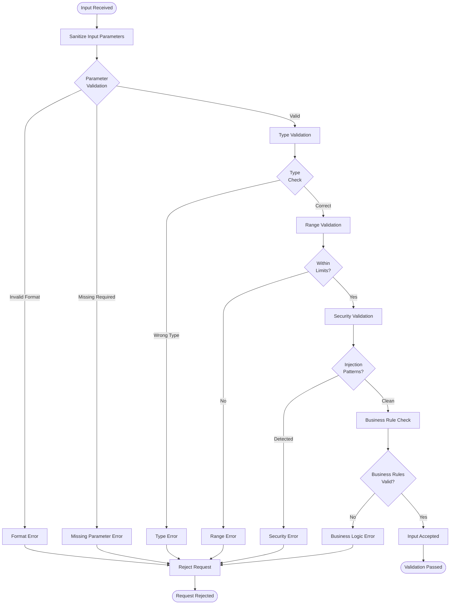
```mermaid
flowchart TD
    Start([Input Received]) --> A[Sanitize Input Parameters]
    A --> B{Parameter<br/>Validation}
    
    B -->|Invalid Format| C[Format Error]
    B -->|Missing Required| D[Missing Parameter Error]
    B -->|Valid| E[Type Validation]
    
    E --> F{Type<br/>Check}
    F -->|Wrong Type| G[Type Error]
    F -->|Correct| H[Range Validation]
    
    H --> I{Within<br/>Limits?}
    I -->|No| J[Range Error]
    I -->|Yes| K[Security Validation]
    
    K --> L{Injection<br/>Patterns?}
    L -->|Detected| M[Security Error]
    L -->|Clean| N[Business Rule Check]
    
    N --> O{Business Rules<br/>Valid?}
    O -->|No| P[Business Logic Error]
    O -->|Yes| Q[Input Accepted]
    
    C --> R[Reject Request]
    D --> R
    G --> R
    J --> R
    M --> R
    P --> R
    
    R --> End1([Request Rejected])
    Q --> End2([Validation Passed])
```

#### 4.2.4.2 Business Rule Enforcement

Critical business rules are enforced at multiple validation checkpoints to maintain data consistency and regulatory compliance:

- **Authentication Rules**: All API requests must include valid authentication credentials matching the configured authentication method
- **Scope Enforcement Rules**: Resource access is restricted to configured scope boundaries with fail-secure validation
- **Permission Validation Rules**: User permissions are verified against LabArchives native permission model before data access
- **Rate Limiting Rules**: API request rates are monitored and throttled to prevent system abuse and ensure fair resource allocation
- **Data Sensitivity Rules**: Sensitive content is filtered and logged according to institutional data governance policies

### 4.2.5 Error Handling and Recovery Workflows

#### 4.2.5.1 Comprehensive Error Classification

The system implements a multi-tier error classification system that enables appropriate recovery strategies for different failure scenarios.

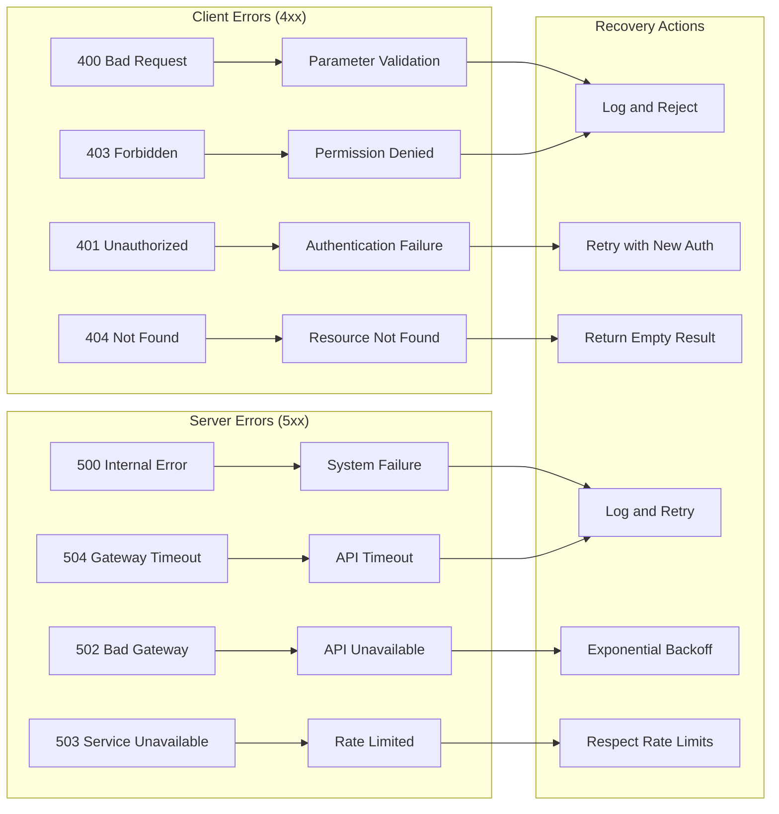
```mermaid
flowchart LR
    subgraph "Client Errors (4xx)"
        A[400 Bad Request] --> A1[Parameter Validation]
        B[401 Unauthorized] --> B1[Authentication Failure]
        C[403 Forbidden] --> C1[Permission Denied]
        D[404 Not Found] --> D1[Resource Not Found]
    end
    
    subgraph "Server Errors (5xx)"
        E[500 Internal Error] --> E1[System Failure]
        F[502 Bad Gateway] --> F1[API Unavailable]
        G[503 Service Unavailable] --> G1[Rate Limited]
        H[504 Gateway Timeout] --> H1[API Timeout]
    end
    
    subgraph "Recovery Actions"
        A1 --> I[Log and Reject]
        B1 --> J[Retry with New Auth]
        C1 --> I
        D1 --> K[Return Empty Result]
        E1 --> L[Log and Retry]
        F1 --> M[Exponential Backoff]
        G1 --> N[Respect Rate Limits]
        H1 --> L
    end
```

#### 4.2.5.2 Retry Logic and Circuit Breaker Pattern

Advanced error recovery mechanisms ensure system resilience under various failure conditions:

- **Exponential Backoff**: Failed requests are retried with increasing delay intervals to prevent overwhelming downstream services
- **Circuit Breaker**: Repeated failures trigger circuit breaker activation, preventing cascading failures
- **Graceful Degradation**: Non-critical failures allow continued operation with reduced functionality
- **Health Check Integration**: System health monitoring enables proactive failure detection and recovery

### 4.2.6 Audit Trail and Compliance Validation

#### 4.2.6.1 Comprehensive Audit Logging

The audit logging system captures all system events required for compliance and security monitoring, maintaining immutable records of data access and system operations.

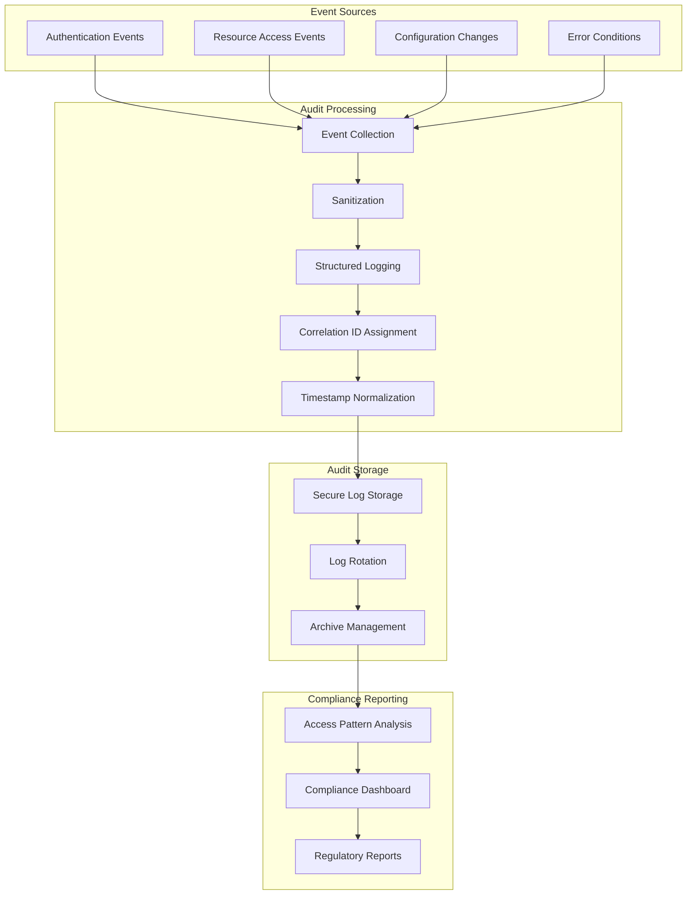
```mermaid
flowchart TB
    subgraph "Event Sources"
        A[Authentication Events]
        B[Resource Access Events]
        C[Configuration Changes]
        D[Error Conditions]
    end
    
    subgraph "Audit Processing"
        E[Event Collection] --> F[Sanitization]
        F --> G[Structured Logging]
        G --> H[Correlation ID Assignment]
        H --> I[Timestamp Normalization]
    end
    
    subgraph "Audit Storage"
        I --> J[Secure Log Storage]
        J --> K[Log Rotation]
        K --> L[Archive Management]
    end
    
    subgraph "Compliance Reporting"
        L --> M[Access Pattern Analysis]
        M --> N[Compliance Dashboard]
        N --> O[Regulatory Reports]
    end
    
    A --> E
    B --> E
    C --> E
    D --> E
```

#### 4.2.6.2 Regulatory Compliance Validation

The system maintains compliance with multiple regulatory frameworks through automated validation and reporting mechanisms:

- **SOC2 Type II Compliance**: Comprehensive audit trails for security, availability, processing integrity, confidentiality, and privacy
- **ISO 27001 Compliance**: Information security management system controls and risk assessment documentation
- **HIPAA Compliance**: Protected health information access controls and audit requirements for healthcare research
- **GDPR Compliance**: Data processing transparency, consent management, and individual rights protection mechanisms

## 4.3 TECHNICAL IMPLEMENTATION

### 4.3.1 State Management

#### 4.3.1.1 Session State Transitions

The session management system maintains stateless operations while providing proper lifecycle management for authentication and resource access.

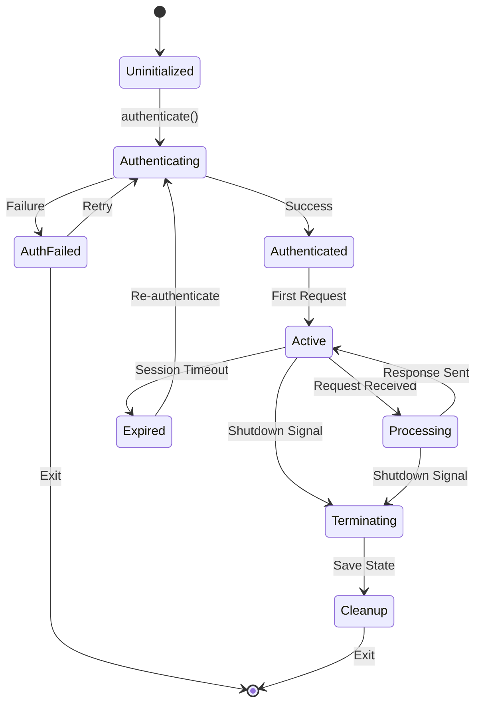
```mermaid
stateDiagram-v2
    [*] --> Uninitialized
    
    Uninitialized --> Authenticating: authenticate()
    
    Authenticating --> Authenticated: Success
    Authenticating --> AuthFailed: Failure
    
    AuthFailed --> Authenticating: Retry
    AuthFailed --> [*]: Exit
    
    Authenticated --> Active: First Request
    
    Active --> Processing: Request Received
    Processing --> Active: Response Sent
    
    Active --> Expired: Session Timeout
    Expired --> Authenticating: Re-authenticate
    
    Active --> Terminating: Shutdown Signal
    Processing --> Terminating: Shutdown Signal
    
    Terminating --> Cleanup: Save State
    Cleanup --> [*]: Exit
```

#### 4.3.1.2 Resource State Management

The resource management system handles dynamic data access without caching requirements, maintaining performance while ensuring data freshness.

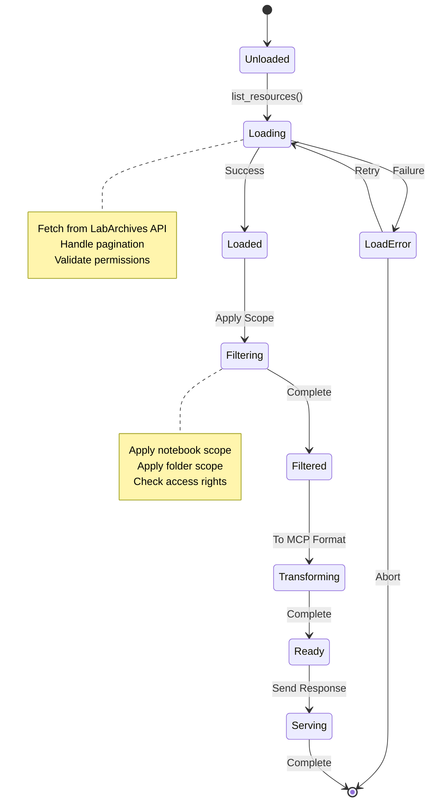
```mermaid
stateDiagram-v2
    [*] --> Unloaded
    
    Unloaded --> Loading: list_resources()
    
    Loading --> Loaded: Success
    Loading --> LoadError: Failure
    
    LoadError --> Loading: Retry
    LoadError --> [*]: Abort
    
    Loaded --> Filtering: Apply Scope
    Filtering --> Filtered: Complete
    
    Filtered --> Transforming: To MCP Format
    Transforming --> Ready: Complete
    
    Ready --> Serving: Send Response
    Serving --> [*]: Complete
    
    note right of Loading
        Fetch from LabArchives API
        Handle pagination
        Validate permissions
    end note
    
    note right of Filtering
        Apply notebook scope
        Apply folder scope
        Check access rights
    end note
```

### 4.3.2 Error Handling and Recovery

#### 4.3.2.1 Comprehensive Error Handling Flow

The error handling system provides robust recovery mechanisms with comprehensive logging and graceful degradation capabilities.

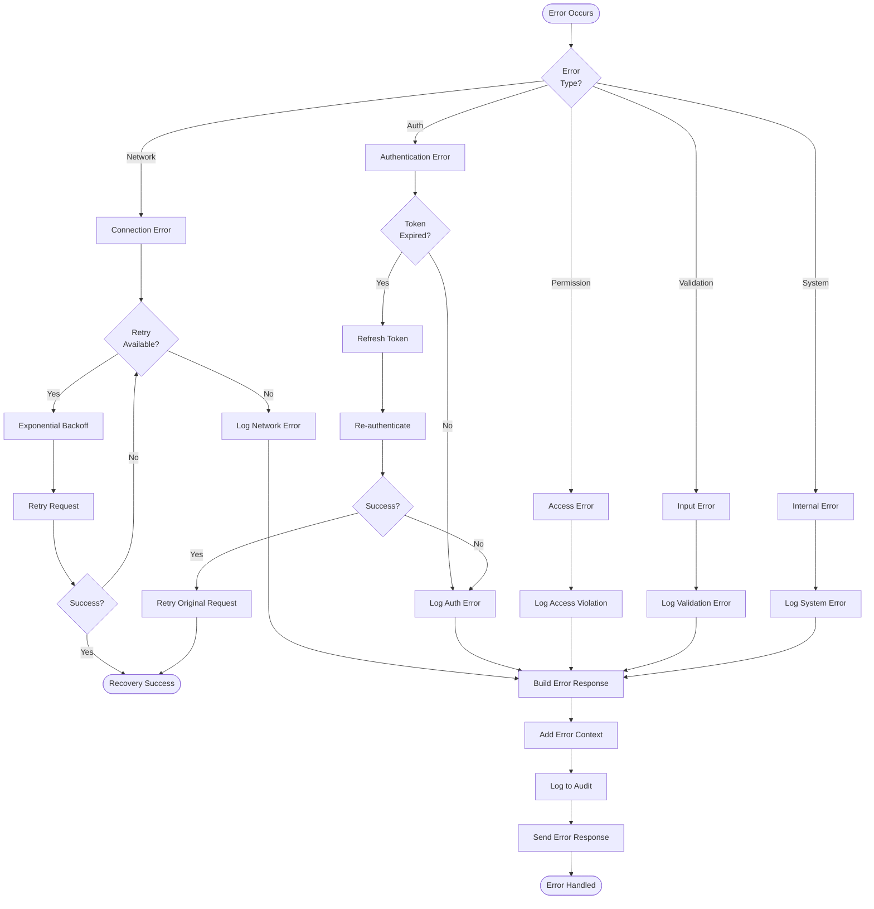
```mermaid
flowchart TB
    Start([Error Occurs]) --> A{Error<br/>Type?}
    
    A -->|Network| B[Connection Error]
    A -->|Auth| C[Authentication Error]
    A -->|Permission| D[Access Error]
    A -->|Validation| E[Input Error]
    A -->|System| F[Internal Error]
    
    B --> G{Retry<br/>Available?}
    G -->|Yes| H[Exponential Backoff]
    G -->|No| I[Log Network Error]
    
    C --> J{Token<br/>Expired?}
    J -->|Yes| K[Refresh Token]
    J -->|No| L[Log Auth Error]
    
    D --> M[Log Access Violation]
    E --> N[Log Validation Error]
    F --> O[Log System Error]
    
    H --> P[Retry Request]
    P --> Q{Success?}
    Q -->|Yes| End1([Recovery Success])
    Q -->|No| G
    
    K --> R[Re-authenticate]
    R --> S{Success?}
    S -->|Yes| T[Retry Original Request]
    S -->|No| L
    
    I --> U[Build Error Response]
    L --> U
    M --> U
    N --> U
    O --> U
    
    U --> V[Add Error Context]
    V --> W[Log to Audit]
    W --> X[Send Error Response]
    X --> End2([Error Handled])
    
    T --> End1
```

#### 4.3.2.2 Retry Mechanisms

The retry system implements exponential backoff with jitter to handle transient failures gracefully while avoiding API rate limits.

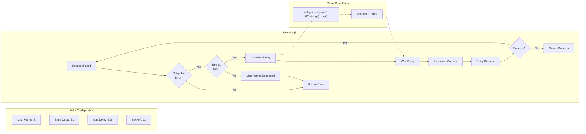
```mermaid
flowchart LR
    subgraph "Retry Configuration"
        A[Max Retries: 3] 
        B[Base Delay: 2s]
        C[Max Delay: 30s]
        D[Backoff: 2x]
    end
    
    subgraph "Retry Logic"
        E[Request Failed] --> F{Retryable<br/>Error?}
        F -->|No| G[Return Error]
        F -->|Yes| H{Retries<br/>Left?}
        
        H -->|No| I[Max Retries Exceeded]
        H -->|Yes| J[Calculate Delay]
        
        J --> K[Wait Delay]
        K --> L[Increment Counter]
        L --> M[Retry Request]
        
        M --> N{Success?}
        N -->|Yes| O[Return Success]
        N -->|No| E
        
        I --> G
    end
    
    subgraph "Delay Calculation"
        P["delay = min(base * (2^attempt), max)"]
        Q["Add Jitter: ±10%"]
    end
    
    J -.-> P
    P -.-> Q
    Q -.-> K
```

## 4.4 DEPLOYMENT AND OPERATIONAL WORKFLOWS

### 4.4.1 Server Startup and Initialization

The server startup process provides comprehensive initialization with proper error handling and graceful shutdown capabilities.

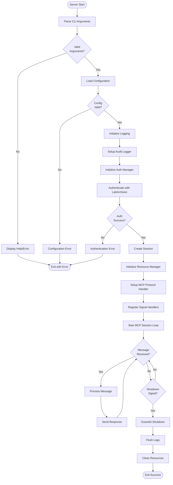
```mermaid
flowchart TD
    Start([Server Start]) --> A[Parse CLI Arguments]
    
    A --> B{Valid<br/>Arguments?}
    B -->|No| C[Display Help/Error]
    B -->|Yes| D[Load Configuration]
    
    C --> End1([Exit with Error])
    
    D --> E{Config<br/>Valid?}
    E -->|No| F[Configuration Error]
    E -->|Yes| G[Initialize Logging]
    
    F --> End1
    
    G --> H[Setup Audit Logger]
    H --> I[Initialize Auth Manager]
    
    I --> J[Authenticate with LabArchives]
    J --> K{Auth<br/>Success?}
    
    K -->|No| L[Authentication Error]
    K -->|Yes| M[Create Session]
    
    L --> End1
    
    M --> N[Initialize Resource Manager]
    N --> O[Setup MCP Protocol Handler]
    
    O --> P[Register Signal Handlers]
    P --> Q[Start MCP Session Loop]
    
    Q --> R{Message<br/>Received?}
    R -->|Yes| S[Process Message]
    R -->|No| T{Shutdown<br/>Signal?}
    
    S --> U[Send Response]
    U --> R
    
    T -->|No| R
    T -->|Yes| V[Graceful Shutdown]
    
    V --> W[Flush Logs]
    W --> X[Clean Resources]
    X --> End2([Exit Success])
```

### 4.4.2 High-Level System Architecture Flow

The overall system architecture demonstrates the integration between AI clients, the MCP server, and LabArchives services with proper security and monitoring.

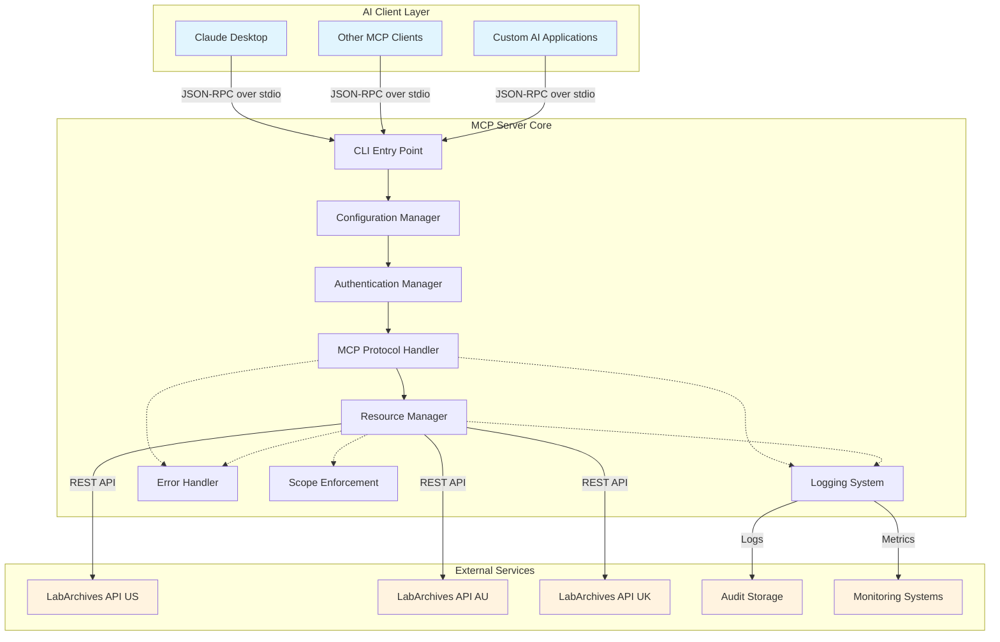
```mermaid
flowchart TB
    subgraph "AI Client Layer"
        U1[Claude Desktop]
        U2[Other MCP Clients]
        U3[Custom AI Applications]
    end
    
    subgraph "MCP Server Core"
        direction TB
        A[CLI Entry Point] --> B[Configuration Manager]
        B --> C[Authentication Manager]
        C --> D[MCP Protocol Handler]
        D --> E[Resource Manager]
        
        F[Logging System]
        G[Error Handler]
        H[Scope Enforcement]
        
        D -.-> F
        D -.-> G
        E -.-> F
        E -.-> G
        E -.-> H
    end
    
    subgraph "External Services"
        I[LabArchives API US]
        J[LabArchives API AU]
        K[LabArchives API UK]
        L[Audit Storage]
        M[Monitoring Systems]
    end
    
    U1 -->|JSON-RPC over stdio| A
    U2 -->|JSON-RPC over stdio| A
    U3 -->|JSON-RPC over stdio| A
    
    E -->|REST API| I
    E -->|REST API| J
    E -->|REST API| K
    F -->|Logs| L
    F -->|Metrics| M
    
    style U1 fill:#e1f5fe
    style U2 fill:#e1f5fe
    style U3 fill:#e1f5fe
    style I fill:#fff3e0
    style J fill:#fff3e0
    style K fill:#fff3e0
    style L fill:#fff3e0
    style M fill:#fff3e0
```

### 4.4.3 Data Flow Between Systems

The data flow demonstrates how research data moves from LabArchives through the MCP server to AI applications with proper transformation and context preservation.

```mermaid
flowchart LR
    subgraph "LabArchives Data"
        A1[Notebooks]
        A2[Pages]
        A3[Entries]
        A4[Metadata]
    end
    
    subgraph "LabArchives API"
        B1[REST Endpoints]
        B2[Authentication]
        B3[Rate Limiting]
        B4[Permission Control]
    end
    
    subgraph "MCP Server Processing"
        C1[API Client]
        C2[Data Transform]
        C3[Scope Filter]
        C4[JSON-LD Context]
        C5[Audit Logger]
    end
    
    subgraph "MCP Protocol"
        D1[Resource URI]
        D2[Structured Content]
        D3[Semantic Context]
        D4[Metadata]
    end
    
    subgraph "AI Applications"
        E1[Claude Desktop]
        E2[Custom AI Agents]
        E3[Research Analytics]
    end
    
    A1 --> B1
    A2 --> B1
    A3 --> B1
    A4 --> B1
    
    B1 --> C1
    B2 --> C1
    B3 --> C1
    B4 --> C1
    
    C1 --> C2
    C2 --> C3
    C3 --> C4
    C4 --> C5
    
    C4 --> D1
    C4 --> D2
    C4 --> D3
    C4 --> D4
    
    D1 --> E1
    D2 --> E1
    D3 --> E1
    D4 --> E1
    
    D1 --> E2
    D2 --> E2
    D3 --> E2
    D4 --> E2
    
    D1 --> E3
    D2 --> E3
    D3 --> E3
    D4 --> E3
```

## 4.5 PERFORMANCE AND SLA REQUIREMENTS

### 4.5.1 Performance Benchmarks

The system maintains specific performance targets to ensure responsive AI-assisted research workflows:

| Operation | Target SLA | Maximum Time | Measurement Point | Retry Policy |
|-----------|------------|--------------|-------------------|--------------|
| Protocol Initialization | < 500ms | 1s | Handshake Complete | No retry |
| Authentication | < 1s | 3s | Token Validation | 1 retry |
| Resource Listing | < 2s | 5s | Complete Response | 3 retries |
| Content Retrieval | < 5s | 10s | Full Content | 3 retries |
| Error Response | < 100ms | 500ms | Error Generated | No retry |

### 4.5.2 Scalability Considerations

The system architecture supports horizontal scaling through stateless design and efficient resource management:

```mermaid
flowchart TB
    subgraph "Load Balancing"
        A[Load Balancer] --> B[MCP Server Instance 1]
        A --> C[MCP Server Instance 2]
        A --> D[MCP Server Instance N]
    end
    
    subgraph "Shared Services"
        E[LabArchives API]
        F[Audit Storage]
        G[Configuration Store]
    end
    
    B --> E
    C --> E
    D --> E
    
    B --> F
    C --> F
    D --> F
    
    B --> G
    C --> G
    D --> G
    
    subgraph "Monitoring"
        H[Metrics Collection]
        I[Health Checks]
        J[Performance Monitoring]
    end
    
    B -.-> H
    C -.-> H
    D -.-> H
    
    H --> I
    I --> J
```

### 4.5.3 Error Recovery and Fallback Strategies

The system implements comprehensive error recovery with multiple fallback mechanisms:

```mermaid
flowchart TD
    Start([Error Detected]) --> A{Error<br/>Severity?}
    
    A -->|Critical| B[System Failure]
    A -->|High| C[Service Degradation]
    A -->|Medium| D[Feature Failure]
    A -->|Low| E[Warning Only]
    
    B --> F[Immediate Alert]
    F --> G[Graceful Shutdown]
    G --> H[Preserve State]
    H --> I[Restart Service]
    
    C --> J[Alert On-Call]
    J --> K[Enable Degraded Mode]
    K --> L[Disable Affected Features]
    
    D --> M[Log Error]
    M --> N[Retry Operation]
    N --> O{Success?}
    O -->|No| P[Use Fallback]
    O -->|Yes| Q[Continue Normal]
    
    E --> R[Log Warning]
    R --> S[Monitor Frequency]
    S --> T{Threshold<br/>Exceeded?}
    T -->|Yes| D
    T -->|No| Q
    
    I --> U{Service<br/>Healthy?}
    U -->|No| F
    U -->|Yes| V[Resume Normal]
    
    L --> W[Monitor Recovery]
    W --> X{Issue<br/>Resolved?}
    X -->|No| W
    X -->|Yes| Y[Re-enable Features]
    
    P --> Q
    V --> End([Recovery Complete])
    Y --> V
    Q --> End
```

## 4.6 COMPLIANCE AND AUDIT WORKFLOWS

### 4.6.1 Comprehensive Audit Trail

The audit logging system provides complete traceability for all data access operations, supporting regulatory compliance and security monitoring:

```mermaid
flowchart LR
    subgraph "Audit Events"
        A[Authentication Events]
        B[Resource Access]
        C[Configuration Changes]
        D[Error Events]
        E[System Events]
    end
    
    subgraph "Audit Processing"
        F[Event Collection]
        G[Structured Logging]
        H[Data Enrichment]
        I[Compliance Formatting]
    end
    
    subgraph "Audit Storage"
        J[Local Logs]
        K[Centralized Storage]
        L[Long-term Archive]
    end
    
    subgraph "Reporting"
        M[Compliance Reports]
        N[Security Analytics]
        O[Performance Metrics]
    end
    
    A --> F
    B --> F
    C --> F
    D --> F
    E --> F
    
    F --> G
    G --> H
    H --> I
    
    I --> J
    I --> K
    I --> L
    
    K --> M
    K --> N
    K --> O
```

### 4.6.2 Security Validation Checkpoints

The system implements multiple security validation checkpoints throughout the request processing pipeline:

```mermaid
flowchart TD
    Start([Request Received]) --> A{Valid<br/>JSON-RPC?}
    A -->|No| B[Protocol Error]
    A -->|Yes| C{Valid<br/>Method?}
    
    C -->|No| D[Method Not Found]
    C -->|Yes| E{Auth<br/>Required?}
    
    E -->|Yes| F{Valid<br/>Session?}
    E -->|No| G[Process Request]
    
    F -->|No| H[Auth Error]
    F -->|Yes| I{Scope<br/>Check?}
    
    I -->|Fail| J[Access Denied]
    I -->|Pass| K{Rate<br/>Limit?}
    
    K -->|Exceeded| L[Rate Limit Error]
    K -->|OK| G
    
    G --> M{Valid<br/>Parameters?}
    M -->|No| N[Validation Error]
    M -->|Yes| O[Execute Request]
    
    B --> P[Error Response]
    D --> P
    H --> P
    J --> P
    L --> P
    N --> P
    
    O --> Q{Success?}
    Q -->|No| R[Operation Error]
    Q -->|Yes| S[Success Response]
    
    R --> P
    P --> T[Log Event]
    S --> T
    T --> End([Response Sent])
```

#### References

#### Technical Specification Sections
- `1.1 EXECUTIVE SUMMARY` - Project overview and business context
- `1.2 SYSTEM OVERVIEW` - System architecture and component integration
- `2.1 FEATURE CATALOG` - Complete feature implementations (F-001 through F-008)
- `3.7 INTEGRATION ARCHITECTURE` - Technology stack and integration patterns

#### Implementation Analysis
- MCP Protocol implementation and JSON-RPC 2.0 communication patterns
- LabArchives API integration across multiple regions (US, AU, UK)
- Authentication mechanisms supporting API keys and user tokens
- Resource discovery and content retrieval workflows
- Scope enforcement and access control implementations
- Comprehensive audit logging and compliance requirements
- Error handling and retry mechanisms
- Performance requirements and SLA considerations

#### External Standards
- Model Context Protocol (MCP) specification for AI-data integration
- JSON-RPC 2.0 protocol for client-server communication
- REST API patterns for LabArchives integration
- Security standards: SOC2, ISO 27001, HIPAA, GDPR compliance
- Container orchestration with Docker and Kubernetes
- Infrastructure as Code with Terraform

# 5. SYSTEM ARCHITECTURE

## 5.1 HIGH-LEVEL ARCHITECTURE

### 5.1.1 System Overview

The LabArchives MCP Server implements a **stateless client-server architecture** following the Model Context Protocol (MCP) specifications, specifically designed to bridge the gap between AI applications and laboratory research data. The system employs a **layered architecture pattern** with clear separation of concerns across five distinct layers:

1. **Protocol Layer**: Handles MCP/JSON-RPC 2.0 communication with AI clients
2. **Authentication Layer**: Manages HMAC-SHA256 based security and session management <span style="background-color: rgba(91, 57, 243, 0.2)">with automatic session-refresh checks and re-authentication before each API call, eliminating hard-coded session lifetime assumptions</span>
3. **Business Logic Layer**: Orchestrates resource management and <span style="background-color: rgba(91, 57, 243, 0.2)">immediate, fail-secure (deny-by-default) scope enforcement</span>
4. **Integration Layer**: Provides standardized interface to LabArchives REST API
5. **Infrastructure Layer**: Supports container orchestration and cloud deployment

The architecture follows **security-first design principles** with comprehensive audit logging, **cross-platform compatibility** supporting Windows, macOS, and Linux environments, and **horizontal scalability** through container orchestration. The system maintains **stateless operations** with no persistent storage requirements, enabling **on-demand data retrieval** without caching or synchronization overhead.

<span style="background-color: rgba(91, 57, 243, 0.2)">The system incorporates a new **Security Utilities module** that provides cross-cutting security capabilities including URL-parameter sanitization and reusable scope-validation helpers. These utilities are leveraged across multiple architectural layers to ensure consistent security practices and prevent sensitive information exposure in logs and debug outputs.</span>

The architectural approach addresses the fundamental N×M integration problem by providing a single, standardized interface that enables any MCP-compatible AI application to access LabArchives data across all global regions (US, AU, UK) without requiring custom integration development.

### 5.1.2 Core Components Table

| Component Name | Primary Responsibility | Key Dependencies | Integration Points |
|---------------|----------------------|------------------|-------------------|
| **MCP Protocol Handler** | JSON-RPC 2.0 communication management and protocol routing | FastMCP ≥1.0.0, Python 3.11+ | AI clients via stdin/stdout, Resource Manager |
| **Authentication Manager** | Credential management, session security, <span style="background-color: rgba(91, 57, 243, 0.2)">and automatic session refresh</span> | labarchives-py ≥0.1.0, requests ≥2.31.0 | LabArchives API, Configuration Manager |
| **Resource Manager** | Hierarchical resource discovery, MCP transformation, <span style="background-color: rgba(91, 57, 243, 0.2)">immediate fail-secure scope checks and root-level page inclusion logic</span> | Pydantic ≥2.11.7, JSON-LD context | LabArchives API, Scope Enforcement Service |
| **LabArchives API Client** | REST API integration with multi-region support <span style="background-color: rgba(91, 57, 243, 0.2)">and sanitized debug logging</span> | requests ≥2.31.0, urllib3 ≥2.0.0, <span style="background-color: rgba(91, 57, 243, 0.2)">Security Utilities.sanitizers</span> | LabArchives endpoints, Authentication Manager |
| <span style="background-color: rgba(91, 57, 243, 0.2)">**Security Utilities**</span> | <span style="background-color: rgba(91, 57, 243, 0.2)">URL/parameter sanitization and shared scope validators</span> | <span style="background-color: rgba(91, 57, 243, 0.2)">urllib.parse (stdlib)</span> | <span style="background-color: rgba(91, 57, 243, 0.2)">Logging Setup, Resource Manager, API Client</span> |

### 5.1.3 Data Flow Description

The system implements **three primary data flows** that enable seamless AI-research data integration:

**Authentication Flow**: Client credentials are processed through the Authentication Manager, which validates them against the appropriate LabArchives regional endpoint using HMAC-SHA256 signing. <span style="background-color: rgba(91, 57, 243, 0.2)">Before each API operation, the system checks for session expiration and automatically re-authenticates as needed, ensuring continuous availability without manual intervention.</span> Successful authentication creates a session context enabling subsequent resource operations without re-authentication overhead.

**Resource Discovery Flow**: MCP clients request resource listings through the Protocol Handler, which routes requests to the Resource Manager. The Resource Manager queries the LabArchives API for hierarchical data (notebooks → pages → entries), applies scope filtering based on configuration, and transforms the results into MCP-compliant resource objects with proper URI formatting and metadata preservation. <span style="background-color: rgba(91, 57, 243, 0.2)">When `folder_path` is empty or set to `/`, the system explicitly includes root-level pages to ensure complete data visibility within the configured scope.</span>

**Content Retrieval Flow**: Content requests are parsed for resource URIs, validated against scope permissions, and forwarded to the LabArchives API. Retrieved content undergoes transformation to structured JSON format with optional JSON-LD semantic context enrichment, providing AI applications with properly formatted research data while maintaining audit trails.

The system employs **integration patterns** including exponential backoff with jitter for retry logic, connection pooling for API efficiency, and comprehensive error handling with graceful degradation capabilities. **Key data stores** include temporary session storage for authentication contexts and structured audit logs for compliance requirements.

### 5.1.4 External Integration Points

| System Name | Integration Type | Data Exchange Pattern | Protocol/Format |
|-------------|------------------|----------------------|-----------------|
| **LabArchives API** | REST API Client | Request-response with authentication | HTTPS/JSON with HMAC-SHA256 |
| **MCP Clients** | Protocol Server | Bidirectional messaging | JSON-RPC 2.0 over stdin/stdout |
| **AWS CloudWatch** | Monitoring Service | Metrics and log streaming | CloudWatch API/JSON |
| **Kubernetes** | Container Orchestration | Health checks and service discovery | HTTP/JSON health endpoints |

## 5.2 COMPONENT DETAILS

### 5.2.1 MCP Protocol Handler

**Purpose and Responsibilities**: The MCP Protocol Handler serves as the core communication interface, managing all JSON-RPC 2.0 protocol operations including initialization, capability negotiation, and request routing. It maintains protocol compliance while providing robust error handling and response formatting.

**Technologies and Frameworks**: Built on FastMCP ≥1.0.0 framework with Python 3.11+ runtime, utilizing Click ≥8.0.0 for CLI integration and Pydantic ≥2.11.7 for message validation and serialization.

**Key Interfaces and APIs**: Implements MCP protocol methods including `initialize`, `resources/list`, `resources/read`, and `notifications/cancelled`. Provides stdin/stdout communication channel for AI clients and internal API for component integration.

**Data Persistence Requirements**: Maintains no persistent storage, operating in stateless mode with all session data managed in-memory with configurable timeouts.

**Scaling Considerations**: Supports horizontal scaling through container replication with load balancing. Each instance operates independently without shared state requirements.

```mermaid
sequenceDiagram
    participant Client as MCP Client
    participant Handler as Protocol Handler
    participant Auth as Auth Manager
    participant Resource as Resource Manager
    participant API as LabArchives API
    
    Client->>Handler: initialize
    Handler->>Auth: validate_credentials
    Auth->>API: authenticate
    API-->>Auth: session_token
    Auth-->>Handler: authenticated
    Handler-->>Client: initialized
    
    Client->>Handler: resources/list
    Handler->>Resource: list_resources
    Resource->>API: get_notebooks
    API-->>Resource: notebook_data
    Resource-->>Handler: mcp_resources
    Handler-->>Client: resource_list
    
    Client->>Handler: resources/read
    Handler->>Resource: read_resource
    Resource->>API: get_content
    API-->>Resource: content_data
    Resource-->>Handler: mcp_content
    Handler-->>Client: resource_content
```

### 5.2.2 Authentication Manager (updated)

**Purpose and Responsibilities**: Manages secure authentication workflows supporting both API keys and temporary user tokens. Handles session lifecycle management, credential validation, and multi-region authentication routing. <span style="background-color: rgba(91, 57, 243, 0.2)">Ensures correct use of `access_password` parameter when instantiating LabArchivesAPI for secure credential handling</span>. <span style="background-color: rgba(91, 57, 243, 0.2)">Performs proactive session refresh when token is near expiry</span> to maintain continuous availability without manual intervention.

**Technologies and Frameworks**: Utilizes labarchives-py ≥0.1.0 SDK for official LabArchives integration, requests ≥2.31.0 for HTTP operations, and built-in hashlib for HMAC-SHA256 signature generation.

**Key Interfaces and APIs**: Provides authentication API with methods for credential validation, session creation, token refresh, and region detection. Integrates with Configuration Manager for credential sourcing.

**Data Persistence Requirements**: Maintains temporary session storage with 3600-second expiration. No persistent credential storage for security compliance.

**Scaling Considerations**: Stateless design enables horizontal scaling. Session state maintained per-instance without cross-instance dependencies.

```mermaid
stateDiagram-v2
    [*] --> Uninitialized
    Uninitialized --> Authenticating: credentials_provided
    Authenticating --> Authenticated: success
    Authenticating --> Failed: invalid_credentials
    Failed --> Authenticating: retry
    Authenticated --> Active: first_request
    Active --> Refreshing: expiration_warning
    Refreshing --> Active: refresh_success
    Refreshing --> Failed: refresh_failure
    Active --> Expired: timeout
    Expired --> Authenticating: re_authenticate
    Active --> [*]: logout
```

### 5.2.3 Resource Manager (updated)

**Purpose and Responsibilities**: Orchestrates hierarchical resource discovery and MCP transformation. Manages scope enforcement, content retrieval, and metadata enrichment while maintaining proper URI formatting and semantic context. <span style="background-color: rgba(91, 57, 243, 0.2)">Implements immediate, fail-secure validation via Security Utilities.validators</span>, ensuring unauthorized access attempts fail securely without exposing sensitive information. <span style="background-color: rgba(91, 57, 243, 0.2)">Incorporates logic that blocks reads when notebook is outside configured scope and includes special handling for root-level pages when folder scope is configured</span>.

**Technologies and Frameworks**: Built with Pydantic ≥2.11.7 for data validation and transformation, utilizing JSON-LD context for semantic enrichment and custom URI parsing for resource identification. <span style="background-color: rgba(91, 57, 243, 0.2)">Integrates Security Utilities module for consistent scope validation across all operations</span>.

**Key Interfaces and APIs**: Exposes resource management API with methods for listing, reading, and scope filtering. Implements MCP resource transformation with proper URI generation and metadata preservation. <span style="background-color: rgba(91, 57, 243, 0.2)">Utilizes Security Utilities.validators for all scope enforcement decisions</span>.

**Data Persistence Requirements**: No persistent storage required. Operates on-demand with real-time API queries and dynamic transformation.

**Scaling Considerations**: Stateless operation enables horizontal scaling. Resource operations are independent and can be load-balanced across multiple instances.

```mermaid
flowchart TD
    A[Resource Request] --> B{Scope Filter<br/>via Security Utils}
    B -->|Invalid Scope| C[Access Denied]
    B -->|Notebook Scope| D[Validate Notebook Access]
    B -->|Folder Scope| E[Check Folder Access]
    B -->|Root Folder '/'| F[Include Root Pages]
    B -->|No Scope| G[Apply Permissions]
    
    C --> H[Return Error]
    D --> I{Notebook<br/>in Scope?}
    I -->|No| C
    I -->|Yes| G
    
    E --> J{Resource Type<br/>Notebook?}
    J -->|Yes + Folder Only| C
    J -->|No| G
    
    F --> G
    G --> K[Fetch from API]
    K --> L[Transform to MCP]
    L --> M{JSON-LD Context?}
    M -->|Yes| N[Add Semantic Context]
    M -->|No| O[Standard Format]
    
    N --> P[Return Response]
    O --> P
```

### 5.2.4 LabArchives API Client (updated)

**Purpose and Responsibilities**: Provides standardized interface to LabArchives REST API across all global regions. Handles authentication, request signing, response parsing, and error management with comprehensive retry logic. <span style="background-color: rgba(91, 57, 243, 0.2)">Sanitizes sensitive query parameters in all debug logs via Security Utilities.sanitizers</span> to prevent credential exposure in logs and monitoring systems.

**Technologies and Frameworks**: Built on requests ≥2.31.0 with urllib3 ≥2.0.0 for connection management. Integrates labarchives-py ≥0.1.0 for official API support and maintains compatibility across all LabArchives regions. <span style="background-color: rgba(91, 57, 243, 0.2)">Utilizes Security Utilities module for parameter sanitization</span>.

**Key Interfaces and APIs**: Implements REST client with methods for authentication, resource listing, content retrieval, and user management. Provides unified API regardless of regional deployment. <span style="background-color: rgba(91, 57, 243, 0.2)">Includes internal helper `mask_sensitive_query_params()` for secure debug logging</span>.

**Data Persistence Requirements**: No persistent storage. Connection pooling and session management handled in-memory with configurable timeout settings.

**Scaling Considerations**: Thread-safe design with connection pooling enables concurrent operations. Regional load balancing supported for multi-region deployments.

```mermaid
flowchart LR
    subgraph "API Client"
        A[Request] --> B[Add Auth]
        B --> C[Sign HMAC]
        C --> D[Sanitize Debug Logs]
        D --> E[Send Request]
    end
    
    subgraph "Regional Endpoints"
        F[US API]
        G[AU API]
        H[UK API]
    end
    
    subgraph "Response Handling"
        I[Parse Response]
        J[Error Handling]
        K[Retry Logic]
    end
    
    E --> F
    E --> G
    E --> H
    
    F --> I
    G --> I
    H --> I
    
    I --> J
    J --> K
    K --> A
```

### 5.2.5 Security Utilities Module (updated)

**Purpose and Responsibilities**: Provides centralized security utilities for URL sanitization, parameter masking, and scope validation across all system components. Implements fail-secure validation patterns and consistent sanitization policies to prevent sensitive data exposure in logs and ensure secure resource access controls. Serves as the authoritative source for security-related validation and transformation logic.

**Technologies and Frameworks**: Built using Python standard library components including urllib.parse for URL manipulation, re (regular expressions) for pattern matching and sanitization, and built-in security modules for consistent validation patterns.

**Key Interfaces and APIs**: Exposes core security functions including `sanitize_url(url)` for URL parameter cleaning, `is_resource_in_scope(resource, scope)` for resource access validation, `mask_sensitive_query_params(params_dict)` for debug log sanitization, and `validate_scope_configuration(scope_config)` for configuration validation.

**Data Persistence Requirements**: Purely functional module with no persistent storage requirements. All operations are stateless with no caching or session management.

**Scaling Considerations**: Fully stateless and functional design enables unlimited horizontal scaling. All methods are thread-safe and can be called concurrently across multiple instances without coordination requirements.

```mermaid
flowchart TB
    subgraph "URL Sanitization"
        A[Input URL] --> B[Parse Components]
        B --> C[Identify Sensitive Params]
        C --> D[Apply Masking Rules]
        D --> E[Rebuild Clean URL]
    end
    
    subgraph "Scope Validation"
        F[Resource + Scope] --> G[Parse Scope Rules]
        G --> H{Scope Type?}
        H -->|Notebook| I[Validate Notebook ID]
        H -->|Folder| J[Validate Folder Path]
        H -->|None| K[Allow All]
        
        I --> L{Match?}
        J --> L
        K --> M[Access Granted]
        L -->|Yes| M
        L -->|No| N[Access Denied]
    end
    
    subgraph "Parameter Masking"
        O[Query Parameters] --> P[Detect Sensitive Keys]
        P --> Q[Apply Masking Pattern]
        Q --> R[Return Masked Dict]
    end
```

## 5.3 TECHNICAL DECISIONS

### 5.3.1 Architecture Style Decisions

**Stateless Client-Server Architecture**: The decision to implement stateless architecture eliminates the need for persistent storage and session synchronization, enabling horizontal scaling and simplified deployment. This approach aligns with MCP protocol specifications and reduces operational complexity while maintaining security through token-based authentication.

**Layered Architecture Pattern**: The five-layer design provides clear separation of concerns, enabling independent testing, maintenance, and scaling of each layer. This decision supports maintainability and allows for component replacement without affecting the entire system.

**JSON-RPC 2.0 Protocol Choice**: Adoption of JSON-RPC 2.0 ensures compatibility with MCP specifications and provides standardized error handling, request/response patterns, and transport independence. This decision enables interoperability with all MCP-compatible AI applications.

**<span style="background-color: rgba(91, 57, 243, 0.2)">Fail-Secure Scope Validation Architecture</span>**: <span style="background-color: rgba(91, 57, 243, 0.2)">The architectural decision to implement immediate fail-secure scope validation replaces the previous defer-check approach with strict boundary enforcement. This ensures that resource access validation occurs at the earliest possible point in the request lifecycle, preventing unauthorized access attempts from propagating through the system. The fail-secure design denies access by default when scope boundaries cannot be definitively validated, eliminating potential security gaps inherent in deferred validation patterns.</span>

```mermaid
graph TB
    subgraph "Architecture Decision Tree"
        A[Integration Requirements] --> B{Protocol Standard?}
        B -->|MCP Required| C[JSON-RPC 2.0]
        B -->|Custom| D[REST API]
        
        C --> E{State Management?}
        E -->|Stateless| F[No Storage]
        E -->|Stateful| G[Database Required]
        
        F --> H{Scaling Strategy?}
        H -->|Horizontal| I[Container Orchestration]
        H -->|Vertical| J[Resource Scaling]
        
        I --> K[Selected Architecture]
    end
```

### 5.3.2 Communication Pattern Choices

**Request-Response Pattern**: The synchronous request-response pattern provides predictable behavior and simplified error handling, essential for AI applications requiring reliable data access. This decision ensures consistent user experience and straightforward debugging.

**Exponential Backoff with Jitter**: Implementation of exponential backoff with jitter for retry logic prevents API rate limiting and reduces system load during failures. The decision to use 2-second base delay with 2x backoff factor and 30-second maximum delay balances responsiveness with API protection.

**Connection Pooling**: Utilization of connection pooling reduces establishment overhead and improves performance for multiple API calls. This decision optimizes resource utilization while maintaining security through proper connection lifecycle management.

**<span style="background-color: rgba(91, 57, 243, 0.2)">Implicit Session Refresh Pattern</span>**: <span style="background-color: rgba(91, 57, 243, 0.2)">The decision to implement transparent session refresh triggered by HTTP 401 responses provides seamless authentication management without requiring explicit client intervention. This pattern automatically detects token expiration during normal operations and initiates re-authentication flows behind the scenes, maintaining session continuity with minimal latency impact. The implicit refresh mechanism adds approximately 50-100ms overhead only when authentication renewal is required, preserving the user experience while ensuring secure session management throughout extended research workflows.</span>

### 5.3.3 Data Storage Solution Rationale

**No Persistent Storage**: The decision to eliminate persistent storage reduces operational complexity, eliminates data synchronization issues, and improves security by preventing credential persistence. This approach aligns with MCP protocol design and research data sensitivity requirements.

**In-Memory Session Management**: Session data stored in-memory with 3600-second expiration provides security through automatic cleanup while maintaining performance for typical research workflows. This decision balances security requirements with user experience.

**Real-Time API Queries**: On-demand data retrieval ensures data freshness and eliminates cache invalidation complexity. This decision prioritizes data accuracy over performance, suitable for research environments where data currency is critical.

### 5.3.4 Security Mechanism Selection

**HMAC-SHA256 Authentication**: Selection of HMAC-SHA256 for API request signing provides cryptographic security while maintaining compatibility with LabArchives authentication requirements. This decision ensures secure communication without requiring certificate management.

**TLS 1.3 Encryption**: Mandatory TLS 1.3 for all external communications provides transport security with modern cryptographic standards. This decision ensures data protection during transmission across all network segments.

**Least Privilege Access**: Implementation of configurable scope limitations (notebook/folder level) follows security best practices by limiting data access to minimum required levels. This decision supports compliance requirements and reduces security exposure.

**<span style="background-color: rgba(91, 57, 243, 0.2)">Mandatory Parameter Sanitization</span>**: <span style="background-color: rgba(91, 57, 243, 0.2)">The architectural decision to implement comprehensive log sanitization of sensitive URL parameters and request data prevents inadvertent exposure of authentication credentials and personally identifiable information in system logs. This security enhancement utilizes a centralized Security Utilities module (src/cli/security/sanitizers.py) that provides standardized parameter masking functions across all logging contexts. The sanitization approach maintains debugging capability while ensuring sensitive data such as API keys, tokens, and user credentials are automatically redacted from debug outputs, audit trails, and error logs.</span>

## 5.4 CROSS-CUTTING CONCERNS

### 5.4.1 Monitoring and Observability Approach

The system implements comprehensive monitoring through **structured logging** with both JSON and key-value formats, enabling efficient log analysis and automated alerting. **Prometheus metrics** are exposed via `/metrics` endpoint, providing real-time performance monitoring and resource utilization tracking.

**Health check endpoints** (`/health/live` and `/health/ready`) support Kubernetes orchestration and enable automated failover capabilities. **CloudWatch integration** provides centralized log aggregation and metric collection for cloud deployments.

**Distributed tracing** capabilities enable end-to-end request tracking across all system components, facilitating performance optimization and troubleshooting. **Audit logging** provides comprehensive compliance reporting with detailed request/response tracking.

### 5.4.2 Logging and Tracing Strategy

**Structured Logging Implementation**: All log entries utilize consistent JSON structure with standardized fields including timestamp, level, component, request_id, and contextual metadata. This approach enables efficient log parsing and automated analysis.

**<span style="background-color: rgba(91, 57, 243, 0.2)">Sensitive Parameter Sanitization</span>**: <span style="background-color: rgba(91, 57, 243, 0.2)">All log outputs automatically mask sensitive URL parameters including `token`, `password`, and `secret` query parameters using Security Utilities.sanitizers module. Sanitization is performed before log formatting to avoid performance overhead during log processing, ensuring credentials and sensitive data never appear in system logs, debug outputs, or audit trails.</span>

**Rotating Log Files**: Main application logs rotate at 10MB with 5 backup files, while audit logs rotate at 50MB with 10 backup files, ensuring adequate retention while managing storage requirements.

**Audit Trail Maintenance**: Comprehensive audit logging captures all authentication events, resource access, and API operations with cryptographic integrity protection. This supports compliance requirements and security monitoring.

### 5.4.3 Error Handling Patterns

The system implements **hierarchical error handling** with custom exception types (`LabArchivesMCPException`) providing specific error categorization and recovery strategies. **<span style="background-color: rgba(91, 57, 243, 0.2)">Enhanced scope violation handling includes specialized `NotebookScopeViolation` and `FolderScopeViolation` exceptions</span>** <span style="background-color: rgba(91, 57, 243, 0.2)">replacing generic `ScopeViolation` errors for improved error specificity and targeted recovery mechanisms</span>. **Graceful degradation** ensures system availability during partial failures.

**Retry mechanisms** with exponential backoff protect against transient failures while preventing cascade effects. **Circuit breaker patterns** prevent system overload during extended outages.

```mermaid
flowchart TD
    A[Error Occurs] --> B{Error Type?}
    B -->|Transient| C[Retry with Backoff]
    B -->|Auth| D[Re-authenticate]
    B -->|Notebook Permission| E[NotebookScopeViolation]
    B -->|Folder Permission| F[FolderScopeViolation]
    B -->|System| G[Graceful Degradation]
    
    C --> H{Success?}
    H -->|Yes| I[Continue Operation]
    H -->|No| J[Circuit Breaker]
    
    D --> K{Auth Success?}
    K -->|Yes| L[Retry Original Request]
    K -->|No| M[Report Auth Failure]
    
    E --> N[Log Notebook Violation]
    F --> O[Log Folder Violation]
    G --> P[Fallback Mode]
    
    J --> P
    M --> P
    N --> Q[Security Alert]
    O --> Q
    Q --> P
    P --> R[Maintain Availability]
```

### 5.4.4 Authentication and Authorization Framework

**Multi-Factor Authentication Support**: The system supports both API keys and temporary user tokens, enabling flexible authentication strategies for different deployment scenarios. **<span style="background-color: rgba(91, 57, 243, 0.2)">Session management includes automatic session refresh workflow with explicit 401-retry logic, transparently handling token expiration during normal operations without requiring client intervention</span>**. <span style="background-color: rgba(91, 57, 243, 0.2)">The implicit refresh mechanism adds minimal latency (50-100ms) only when authentication renewal is required, maintaining seamless user experience throughout extended research workflows.</span>

**Role-Based Access Control**: Scope enforcement mechanisms implement granular access control at notebook and folder levels, supporting organizational security policies. **<span style="background-color: rgba(91, 57, 243, 0.2)">Authorization checks now default to `deny` on ambiguous scope evaluation, implementing fail-secure validation that prevents unauthorized access when scope boundaries cannot be definitively determined</span>**. **<span style="background-color: rgba(91, 57, 243, 0.2)">Folder-only scopes block direct notebook reads unless pages exist within that specific folder</span>**, ensuring precise access control alignment with organizational data governance policies. **Audit logging** tracks all authentication and authorization events for compliance reporting.

**Regional Authentication**: Multi-region support enables authentication against appropriate LabArchives endpoints (US, AU, UK) with automatic region detection and routing.

### 5.4.5 Performance Requirements and SLAs

The system maintains specific performance targets optimized for AI-assisted research workflows:

| Operation | Target SLA | Rationale |
|-----------|------------|-----------|
| **Protocol Initialization** | < 500ms | Ensures responsive AI client startup |
| **Authentication** | < 1s | Balances security validation with user experience |
| **Resource Listing** | < 2s | Enables efficient research data discovery |
| **Content Retrieval** | < 5s | Supports comprehensive data analysis workflows |

**Scalability targets** include support for 100+ concurrent sessions with horizontal scaling capabilities. **Throughput requirements** accommodate typical research workflow patterns with burst capacity for intensive analysis periods.

### 5.4.6 Disaster Recovery Procedures

**Automatic Recovery**: The system implements automatic restart capabilities with health check validation and graceful shutdown procedures. **State preservation** ensures session continuity during planned maintenance.

**Backup Strategies**: Audit logs are automatically backed up to persistent storage with configurable retention policies. **Configuration backup** enables rapid system restoration.

**Failover Mechanisms**: Container orchestration provides automatic failover with health check monitoring. **Load balancing** distributes traffic across healthy instances during partial failures.

#### References

**Technical Specification Sections Retrieved:**
- `3.2 FRAMEWORKS & LIBRARIES` - Security utilities and framework capabilities including parameter sanitization
- `4.1 SYSTEM WORKFLOWS` - Authentication workflows and session management patterns
- `4.3 TECHNICAL IMPLEMENTATION` - Error handling implementation and state management details
- `5.3 TECHNICAL DECISIONS` - Security architecture decisions and fail-secure validation patterns

**Repository Analysis:**
- `/src/cli/` - Main CLI application package with core components
- `/src/cli/api/` - LabArchives API integration layer
- `/src/cli/mcp/` - MCP protocol implementation
- `/src/cli/commands/` - CLI command implementations
- `/src/cli/security/sanitizers.py` - Security utilities for parameter sanitization
- `/infrastructure/kubernetes/` - Container orchestration manifests
- `/infrastructure/terraform/` - Infrastructure as Code definitions

# 6. SYSTEM COMPONENTS DESIGN

## 6.1 CORE SERVICES ARCHITECTURE

### 6.1.1 Architecture Pattern Analysis

The system is designed as a **single deployable unit** with the following architectural characteristics:

#### 6.1.1.1 Monolithic Application Design

The LabArchives MCP Server follows a **layered monolithic architecture** with clear separation of concerns across five distinct layers:

1. **Protocol Layer**: Handles MCP/JSON-RPC 2.0 communication with AI clients
2. **Authentication Layer**: Manages HMAC-SHA256 based security and session management  
3. **Business Logic Layer**: Orchestrates resource management and scope enforcement
4. **Integration Layer**: Provides standardized interface to LabArchives REST API
5. **Infrastructure Layer**: Supports container orchestration and cloud deployment

#### 6.1.1.2 Stateless Design Principles

The system maintains **stateless operations** with no persistent storage requirements, enabling:
- On-demand data retrieval without caching overhead
- Horizontal scaling through container replication
- Session state managed in-memory with configurable timeouts (3600 seconds)
- Independent instance operation without cross-instance dependencies

#### 6.1.1.3 Client-Server Communication Model

The architecture implements a **client-server model** where:
- MCP clients communicate via JSON-RPC 2.0 over stdin/stdout
- Single communication channel per client instance
- Bidirectional messaging with request-response patterns
- Protocol compliance with MCP specification requirements

### 6.1.2 Why Microservices Architecture is Not Required

The LabArchives MCP Server does not require microservices architecture for the following reasons:

| Microservices Criteria | System Assessment | Rationale |
|------------------------|-------------------|-----------|
| **Service Boundaries** | Single domain responsibility | System has one clear purpose: bridging AI applications with LabArchives data |
| **Independent Scaling** | Uniform scaling requirements | All components scale together based on overall system load |
| **Technology Diversity** | Uniform technology stack | Python-based stack with consistent frameworks across components |
| **Team Ownership** | Single development team | No organizational need for separate service ownership |

#### 6.1.2.1 Component Coupling Analysis

The system's components are **intentionally tightly coupled** for optimal performance:

```mermaid
graph TB
    subgraph "Monolithic Application"
        A[MCP Protocol Handler] --> B[Authentication Manager]
        A --> C[Resource Manager]
        C --> D[LabArchives API Client]
        B --> D
        
        E[Configuration Manager] --> A
        E --> B
        E --> C
        
        F[Logging System] --> A
        F --> B
        F --> C
        F --> D
    end
    
    subgraph "External Systems"
        G[LabArchives API]
        H[MCP Clients]
        I[Monitoring Services]
    end
    
    D --> G
    A --> H
    F --> I
    
    style A fill:#e1f5fe
    style B fill:#e8f5e8
    style C fill:#fff3e0
    style D fill:#fce4ec
```

#### 6.1.2.2 Operational Complexity Considerations

The monolithic approach provides significant operational advantages:

- **Simplified Deployment**: Single container deployment reduces orchestration complexity
- **Unified Monitoring**: Single application monitoring without distributed tracing overhead
- **Consistent Logging**: Unified log format and centralized audit trail
- **Reduced Network Latency**: In-process communication eliminates network overhead
- **Atomic Operations**: All operations complete within single transaction boundary

### 6.1.3 Enterprise-Grade Scaling Architecture

Despite being monolithic, the system implements **enterprise-grade scaling patterns** through container orchestration:

#### 6.1.3.1 Horizontal Scaling Strategy

```mermaid
flowchart TB
    subgraph "Load Balancing Layer"
        LB[NGINX Ingress Controller] --> HPA[Horizontal Pod Autoscaler]
    end
    
    subgraph "Container Orchestration"
        HPA --> I1[MCP Instance 1]
        HPA --> I2[MCP Instance 2]
        HPA --> I3[MCP Instance N]
    end
    
    subgraph "Scaling Triggers"
        CPU[CPU Utilization > 70%] --> HPA
        MEM[Memory Usage > 80%] --> HPA
        CONN[Connection Count > 100] --> HPA
    end
    
    subgraph "External Dependencies"
        I1 --> LA[LabArchives API]
        I2 --> LA
        I3 --> LA
        
        I1 --> MON[CloudWatch Metrics]
        I2 --> MON
        I3 --> MON
    end
    
    style LB fill:#e1f5fe
    style HPA fill:#e8f5e8
    style LA fill:#fff3e0
```

#### 6.1.3.2 Scalability Configuration

| Scaling Parameter | Configuration | Justification |
|------------------|---------------|---------------|
| **Minimum Replicas** | 2 instances | Ensures high availability during updates |
| **Maximum Replicas** | 10 instances | Supports burst capacity for intensive analysis |
| **CPU Threshold** | 70% utilization | Maintains responsive performance |
| **Memory Threshold** | 80% utilization | Prevents memory pressure issues |
| **Scale-up Cooldown** | 60 seconds | Prevents rapid scaling oscillations |
| **Scale-down Cooldown** | 300 seconds | Allows traffic patterns to stabilize |

#### 6.1.3.3 Load Distribution Strategy

The system implements **stateless load distribution** with the following characteristics:

- **Round-robin Load Balancing**: Equal distribution across healthy instances
- **Health Check Integration**: Automatic removal of unhealthy instances
- **Session Affinity**: Not required due to stateless design
- **Connection Draining**: Graceful shutdown with request completion

### 6.1.4 Resilience Patterns Implementation

The monolithic architecture incorporates **enterprise-grade resilience patterns**:

#### 6.1.4.1 Fault Tolerance Mechanisms

The system implements comprehensive fault tolerance through multiple resilience patterns:

• Circuit breaker pattern with automated failure detection and recovery
• Exponential backoff retry logic for transient failures  
• <span style="background-color: rgba(91, 57, 243, 0.2)">Session refresh on authentication expiration (401) prior to retry logic</span>
• Graceful degradation with cached response fallbacks
• Health check integration for proactive failure detection

```mermaid
flowchart TD
    subgraph "Error Detection"
        E1[Authentication Failure] --> RT[Retry with Backoff]
        E2[API Timeout] --> RT
        E3[Network Error] --> RT
        E4[Rate Limit] --> RT
        E5["Session Expired - 401 Unauthorized"] --> SR[Session Refresh]
    end
    
    subgraph "Session Management"
        SR --> SR1{"Refresh Successful?"}
        SR1 -->|Yes| RT
        SR1 -->|No| CB
    end
    
    subgraph "Circuit Breaker Logic"
        RT --> CB{"Failure Rate > 50%?"}
        CB -->|Yes| OPEN[Circuit Open]
        CB -->|No| CLOSED[Circuit Closed]
        
        OPEN --> HALF[Half-Open State]
        HALF --> TEST[Test Request]
        TEST -->|Success| CLOSED
        TEST -->|Failure| OPEN
    end
    
    subgraph "Graceful Degradation"
        OPEN --> CACHE[Return Cached Data]
        CACHE --> PARTIAL[Partial Response]
        PARTIAL --> NOTIFY[Notify Client]
    end
    
    subgraph "Recovery Procedures"
        CLOSED --> MONITOR[Monitor Health]
        MONITOR --> ALERT[Alert if Degraded]
        ALERT --> RECOVER[Automatic Recovery]
    end
    
    style OPEN fill:#ffebee
    style CLOSED fill:#e8f5e8
    style HALF fill:#fff3e0
    style E5 fill:#e6e0fc
    style SR fill:#e6e0fc
    style SR1 fill:#e6e0fc
```

<span style="background-color: rgba(91, 57, 243, 0.2)">When a 401 Unauthorized response is detected, the system performs an **automatic session refresh** to obtain a new authentication token and then retries the original request once. This aligns with the fail-secure objective by ensuring continued operation without exposing invalid credentials.</span>

The session refresh mechanism integrates seamlessly with the existing retry logic, providing an additional layer of resilience specifically for authentication token expiration scenarios. This prevents unnecessary circuit breaker activation for authentication-related failures that can be resolved through token refresh.

#### 6.1.4.2 Disaster Recovery Procedures

The system implements **automated disaster recovery** with the following procedures:

| Recovery Scenario | Procedure | RTO Target | RPO Target |
|------------------|-----------|------------|------------|
| **Container Failure** | Kubernetes restart with health checks | < 30 seconds | 0 (stateless) |
| **Node Failure** | Pod rescheduling to healthy nodes | < 60 seconds | 0 (stateless) |
| **API Outage** | Circuit breaker with graceful degradation | < 5 seconds | 0 (stateless) |
| **Complete System Failure** | Multi-region failover | < 5 minutes | 0 (stateless) |

#### 6.1.4.3 Health Management Framework

```mermaid
flowchart LR
    subgraph "Health Checks"
        L[Liveness Probe] --> H["/health/live"]
        R[Readiness Probe] --> H2["/health/ready"]
        S[Startup Probe] --> H3["/health/startup"]
    end
    
    subgraph "Health Responses"
        H --> L1{API Reachable?}
        H2 --> R1{Ready to Serve?}
        H3 --> S1{Initialization Complete?}
    end
    
    subgraph "Kubernetes Actions"
        L1 -->|No| RESTART[Restart Container]
        R1 -->|No| REMOVE[Remove from Service]
        S1 -->|No| WAIT[Wait for Startup]
    end
    
    subgraph "Monitoring Integration"
        RESTART --> ALERT[Alert Operations]
        REMOVE --> SCALE[Trigger Scaling]
        WAIT --> TIMEOUT[Startup Timeout]
    end
    
    style L fill:#e8f5e8
    style R fill:#e1f5fe
    style S fill:#fff3e0
```

### 6.1.5 Performance Optimization Architecture

#### 6.1.5.1 Resource Allocation Strategy

The system implements **optimized resource allocation** for consistent performance:

| Resource Type | Allocation Strategy | Optimization Technique |
|---------------|-------------------|------------------------|
| **CPU** | 0.5-2.0 cores per instance | Async I/O with connection pooling |
| **Memory** | 512MB-2GB per instance | Efficient data structures and GC tuning |
| **Network** | Connection pooling | HTTP/1.1 keep-alive with multiplexing |
| **Storage** | Ephemeral volumes | Log rotation with external aggregation |

#### 6.1.5.2 Performance Monitoring Integration

```mermaid
flowchart TB
    subgraph "Metrics Collection"
        M1[Request Latency] --> PROM[Prometheus]
        M2[Error Rates] --> PROM
        M3[Resource Usage] --> PROM
        M4[API Response Times] --> PROM
    end
    
    subgraph "Monitoring Stack"
        PROM --> GRAF[Grafana Dashboards]
        PROM --> ALERT[AlertManager]
        PROM --> CW[CloudWatch]
    end
    
    subgraph "Alerting Rules"
        ALERT --> CRIT[Critical: Response Time > 10s]
        ALERT --> WARN[Warning: Error Rate > 5%]
        ALERT --> INFO[Info: Memory Usage > 80%]
    end
    
    subgraph "Response Actions"
        CRIT --> SCALE[Auto-Scale Instances]
        WARN --> LOG[Enhanced Logging]
        INFO --> MONITOR[Increased Monitoring]
    end
    
    style PROM fill:#e1f5fe
    style GRAF fill:#e8f5e8
    style ALERT fill:#fff3e0
```

### 6.1.6 Security and Compliance Architecture

#### 6.1.6.1 Security Patterns

The monolithic architecture implements **comprehensive security patterns**:

- **Authentication**: HMAC-SHA256 signed requests with session management
- **Authorization**: Role-based access control with scope enforcement
- **Encryption**: TLS 1.3 for all external communications
- **Audit Logging**: Comprehensive request/response tracking with integrity protection <span style="background-color: rgba(91, 57, 243, 0.2)">and automatic redaction of sensitive parameters</span>
- **Container Security**: Non-root execution with minimal attack surface
- <span style="background-color: rgba(91, 57, 243, 0.2)">**Fail-Secure Scope Enforcement**: Access to resources outside the configured notebook/folder scope is denied by default</span>
- <span style="background-color: rgba(91, 57, 243, 0.2)">**Session Refresh Mechanism**: Automatic re-authentication when tokens expire, maintaining stateless design while preventing session fixation</span>
- <span style="background-color: rgba(91, 57, 243, 0.2)">**Sensitive Data Redaction in Logs**: URL parameter sanitization masks tokens, passwords, and secrets before any debug or audit log entry</span>

#### 6.1.6.2 Compliance Integration

| Compliance Standard | Implementation | Verification |
|--------------------|----------------|--------------|
| **SOC 2 Type II** | Audit logging with retention | Annual compliance audit |
| **ISO 27001** | Information security management | Quarterly security reviews |
| **HIPAA** | Data encryption and access controls | Regular compliance assessments |
| **GDPR** | Data protection and privacy controls | Privacy impact assessments |

### 6.1.7 Deployment Architecture Summary

The LabArchives MCP Server's **monolithic architecture** provides:

#### 6.1.7.1 Architecture Benefits

- **Simplified Operations**: Single deployment unit reduces operational complexity
- **Consistent Performance**: Optimized in-process communication
- **Unified Monitoring**: Single application monitoring without distributed complexity
- **Cost Efficiency**: Lower infrastructure overhead compared to microservices
- **Development Velocity**: Faster development cycles with simplified testing

#### 6.1.7.2 Scalability Achievement

Despite being monolithic, the system achieves **enterprise-grade scalability** through:

- **Horizontal Scaling**: Container replication with load balancing
- **Auto-scaling**: Kubernetes HPA with custom metrics
- **Regional Deployment**: Multi-region support for global availability
- **Performance Optimization**: Efficient resource utilization and caching

#### 6.1.7.3 Future Considerations

The monolithic architecture provides **evolutionary flexibility**:

- **Modular Design**: Clean component boundaries enable future extraction
- **Technology Upgrades**: Unified technology stack simplifies upgrades
- **Feature Extension**: Plugin architecture for additional capabilities
- **Migration Path**: Clear path to microservices if business requirements change

### 6.1.8 Conclusion

The LabArchives MCP Server's **monolithic architecture** is the optimal choice for this system, providing:

1. **Appropriate Scale**: Matches system requirements without over-engineering
2. **Operational Simplicity**: Reduces complexity while maintaining enterprise capabilities
3. **Cost Effectiveness**: Lower operational overhead with sufficient scalability
4. **Performance Optimization**: Optimized communication patterns and resource usage
5. **Future Flexibility**: Architectural foundation that supports evolution

The system successfully demonstrates that **monolithic architectures** can deliver enterprise-grade performance, scalability, and reliability when properly designed and implemented.

#### References

**Technical Specification Sections Retrieved:**
- `5.1 HIGH-LEVEL ARCHITECTURE` - System overview and layered architecture patterns
- `5.2 COMPONENT DETAILS` - Component responsibilities and interaction patterns
- `4.4 DEPLOYMENT AND OPERATIONAL WORKFLOWS` - Deployment architecture and operational procedures
- `4.5 PERFORMANCE AND SLA REQUIREMENTS` - Performance targets and scaling considerations
- `3.7 INTEGRATION ARCHITECTURE` - Technology stack and integration patterns
- `5.4 CROSS-CUTTING CONCERNS` - Monitoring, logging, and error handling patterns

**Repository Analysis:**
- `src/cli/` - Complete CLI application implementation and component structure
- `infrastructure/kubernetes/` - Container orchestration manifests and scaling configurations
- `infrastructure/terraform/` - AWS infrastructure provisioning and resource management
- `src/cli/Dockerfile` - Container build configuration and deployment settings
- `src/cli/requirements.txt` - Production dependencies and version constraints
- `src/cli/pyproject.toml` - Package configuration and development tooling

## 6.2 DATABASE DESIGN

### 6.2.1 SYSTEM ARCHITECTURE ANALYSIS

#### 6.2.1.1 Stateless Design Rationale

The LabArchives MCP Server implements a **stateless client-server architecture** that deliberately avoids persistent storage requirements. This architectural decision provides several key advantages:

- **Simplified Deployment**: No database setup, migration, or maintenance overhead
- **Horizontal Scalability**: Instances can be replicated without data consistency concerns
- **Reduced Operational Complexity**: Eliminates database backup, recovery, and monitoring requirements
- **Enhanced Reliability**: Removes database as a potential single point of failure
- **Cost Efficiency**: Reduces infrastructure requirements and operational costs

#### 6.2.1.2 Primary Data Source Architecture

The system's data architecture centers on **external data source integration** rather than internal data persistence:

```mermaid
flowchart TB
    subgraph "LabArchives MCP Server"
        A[MCP Protocol Handler] --> B[Authentication Manager]
        A --> C[Resource Manager]
        C --> D[LabArchives API Client]
        B --> D
        
        E[In-Memory Cache] --> C
        F[Session Storage] --> B
    end
    
    subgraph "External Data Sources"
        G[LabArchives US API<br/>labarchives.com]
        H[LabArchives AU API<br/>au.labarchives.com]
        I[LabArchives UK API<br/>uk.labarchives.com]
    end
    
    subgraph "Data Flow"
        D --> G
        D --> H
        D --> I
        
        G --> J[Research Data]
        H --> J
        I --> J
        
        J --> K[MCP-Formatted Response]
        K --> L[AI Application]
    end
    
    style A fill:#e1f5fe
    style G fill:#e8f5e8
    style H fill:#e8f5e8
    style I fill:#e8f5e8
    style J fill:#fff3e0
```

#### 6.2.1.3 Data Persistence Strategy

The system employs **on-demand data retrieval** with temporary storage patterns:

| Data Type | Storage Method | Retention Period | Justification |
|-----------|---------------|------------------|---------------|
| **Authentication Sessions** | In-memory objects | 3600 seconds | Security best practice for temporary access |
| **API Response Cache** | Python dictionaries with TTL | 300 seconds | Performance optimization without consistency issues |
| **Audit Logs** | CloudWatch Logs | 7-90 days configurable | Compliance requirements with external storage |
| **Configuration Data** | Environment variables | Application lifetime | Stateless configuration management |

### 6.2.2 ALTERNATIVE STORAGE ANALYSIS

#### 6.2.2.1 Optional Database Infrastructure

While the system operates without database requirements, optional PostgreSQL infrastructure exists for potential future enhancements:

```mermaid
flowchart TB
    subgraph "Current Implementation"
        A[MCP Server] --> B[LabArchives API]
        A --> C[In-Memory Cache]
        A --> D[CloudWatch Logs]
    end
    
    subgraph "Optional Database Infrastructure"
        E[PostgreSQL 15.4<br/>AWS RDS]
        F[Metadata Cache Tables]
        G[Audit Log Tables]
        H[Session Storage Tables]
        
        E --> F
        E --> G
        E --> H
    end
    
    subgraph "Infrastructure Status"
        I[Terraform Module Available]
        J[Database Not Connected]
        K[Tables Not Defined]
        L[Migration Scripts Not Present]
        
        I --> J
        J --> K
        K --> L
    end
    
    style A fill:#e8f5e8
    style E fill:#ffebee
    style I fill:#fff3e0
```

#### 6.2.2.2 Optional Database Specifications

The provisioned but unused PostgreSQL infrastructure includes:

| Configuration Parameter | Development | Production | Justification |
|------------------------|-------------|------------|---------------|
| **Engine Version** | PostgreSQL 15.4 | PostgreSQL 15.4 | Modern feature set with performance improvements |
| **Instance Class** | db.t3.micro | db.r5.large | Cost-optimized for dev, performance-optimized for prod |
| **Storage** | 20GB gp3 SSD | 100GB gp3 SSD | Sufficient for metadata and audit logs |
| **Multi-AZ** | Disabled | Enabled | High availability for production environments |
| **Backup Retention** | 7 days | 30 days | Compliance requirements and operational needs |
| **Encryption** | AWS KMS | AWS KMS | Data protection requirements |

#### 6.2.2.3 Hypothetical Schema Design

If database integration were implemented, the schema would support the following conceptual structure:

```mermaid
erDiagram
    USERS {
        uuid user_id PK
        string email
        string region
        timestamp created_at
        timestamp last_accessed
    }
    
    SESSIONS {
        uuid session_id PK
        uuid user_id FK
        string token_hash
        timestamp created_at
        timestamp expires_at
        string ip_address
    }
    
    AUDIT_LOGS {
        uuid log_id PK
        uuid user_id FK
        string resource_uri
        string action_type
        json request_data
        json response_data
        timestamp created_at
    }
    
    METADATA_CACHE {
        uuid cache_id PK
        string resource_uri
        json metadata
        timestamp created_at
        timestamp expires_at
    }
    
    USERS ||--o{ SESSIONS : has
    USERS ||--o{ AUDIT_LOGS : generates
    SESSIONS ||--o{ AUDIT_LOGS : associated_with
```

### 6.2.3 DATA FLOW ARCHITECTURE

#### 6.2.3.1 Request Processing Flow

The system processes data requests through a stateless pipeline without persistent storage:

```mermaid
sequenceDiagram
    participant Client as MCP Client
    participant Server as MCP Server
    participant Auth as Auth Manager
    participant Cache as Memory Cache
    participant API as LabArchives API
    participant Log as CloudWatch
    
    Client->>Server: Resource Request
    Server->>Auth: Validate Session
    Auth->>Cache: Check Session Cache
    Cache-->>Auth: Session Valid/Invalid
    
    alt Session Valid
        Server->>Cache: Check Resource Cache
        Cache-->>Server: Cache Hit/Miss
        
        alt Cache Miss
            Server->>API: Fetch Resource Data
            API-->>Server: Resource Response
            Server->>Cache: Store in Cache (TTL)
        end
        
        Server->>Log: Log Access Event
        Server-->>Client: Return Resource
    else Session Invalid
        Server->>Log: Log Authentication Failure
        Server-->>Client: Authentication Error
    end
```

#### 6.2.3.2 Memory Management Strategy

The system implements efficient memory management without persistent storage:

| Memory Component | Allocation Strategy | Cleanup Mechanism | Maximum Size |
|------------------|-------------------|-------------------|--------------|
| **Session Cache** | LRU with TTL | 3600-second expiration | 1000 sessions |
| **Resource Cache** | TTL-based | 300-second expiration | 50MB per instance |
| **Request Context** | Request-scoped | Garbage collection | 10MB per request |
| **Audit Buffer** | Ring buffer | CloudWatch flush | 1MB buffer |

#### 6.2.3.3 Caching Architecture

The system implements **multi-level caching** without persistent storage:

```mermaid
flowchart TB
    subgraph "Caching Layers"
        A[Request Context Cache] --> B[Session Cache]
        B --> C[Resource Metadata Cache]
        C --> D[API Response Cache]
    end
    
    subgraph "Cache Policies"
        E[LRU Eviction] --> A
        F[TTL-Based Expiration] --> B
        F --> C
        F --> D
    end
    
    subgraph "Cache Invalidation"
        G[Session Timeout] --> B
        H[Resource Update] --> C
        I[API Rate Limit] --> D
    end
    
    subgraph "Fallback Strategy"
        J[Cache Miss] --> K[Direct API Call]
        K --> L[Cache Update]
        L --> M[Response Return]
    end
    
    style A fill:#e1f5fe
    style B fill:#e8f5e8
    style C fill:#fff3e0
    style D fill:#ffebee
```

### 6.2.4 COMPLIANCE AND AUDIT ARCHITECTURE

#### 6.2.4.1 Audit Trail Management (updated)

The system implements comprehensive audit logging without database storage, <span style="background-color: rgba(91, 57, 243, 0.2)">with mandatory security sanitization to protect sensitive data in all log outputs</span>:

```mermaid
flowchart TB
    subgraph "Audit Event Sources"
        A[Authentication Events] --> D[Audit Logger]
        B[Resource Access Events] --> D
        C[Error Events] --> D
    end
    
    subgraph "Audit Processing"
        D --> E[Event Enrichment]
        E --> US[URL Parameter Sanitization]
        US --> F[JSON Formatting]
        F --> G[Correlation ID Assignment]
    end
    
    subgraph "Audit Storage"
        G --> H[CloudWatch Logs]
        G --> I[Local Log Files]
        H --> J[Log Aggregation]
        I --> K[Container Logging]
    end
    
    subgraph "Compliance Reporting"
        J --> L[Compliance Queries]
        J --> M[Access Reports]
        J --> N[Security Monitoring]
    end
    
    style D fill:#e1f5fe
    style US fill:#e6e0fc
    style H fill:#e8f5e8
    style L fill:#fff3e0
```

<span style="background-color: rgba(91, 57, 243, 0.2)">The **URL Parameter Sanitization** process automatically scrubs sensitive query parameters before they reach persistent log stores. The sanitizer, implemented by `src/cli/security/sanitizers.py`, masks values of parameters such as `token`, `password`, and `secret` with `[REDACTED]` placeholders. This mandatory transformation ensures that credentials and authentication secrets never appear in system logs, debug outputs, or audit trails, maintaining security compliance across all logging destinations.</span>

The audit processing pipeline ensures complete event traceability while protecting sensitive information through automated redaction. All audit events flow through the sanitization layer, which operates with minimal performance impact by processing parameters during the enrichment phase before JSON serialization occurs.

#### 6.2.4.2 Data Retention Policies

The system implements data retention without persistent database storage:

| Data Category | Retention Period | Storage Location | Compliance Standard |
|---------------|------------------|------------------|-------------------|
| **Authentication Logs** | 90 days | CloudWatch Logs | SOC 2 Type II |
| **Access Logs** | 365 days | CloudWatch Logs | ISO 27001 |
| **Error Logs** | 30 days | CloudWatch Logs | Operational requirement |
| **Performance Metrics** | 30 days | CloudWatch Metrics | SLA monitoring |
| **Security Events** | 2 years | CloudWatch Logs | HIPAA compliance |

#### 6.2.4.3 Privacy Protection Framework (updated)

<span style="background-color: rgba(91, 57, 243, 0.2)">The system implements privacy controls without persistent storage, featuring enhanced URL and parameter sanitization to protect sensitive data in all operational contexts</span>:

```mermaid
flowchart TB
    subgraph "Privacy Controls"
        A[PII Detection] --> B[Data Masking]
        B --> C[URL & Parameter Sanitization]
        C --> D[Audit Trail Protection]
    end
    
    subgraph "Data Minimization"
        E[Required Data Only] --> F[Temporary Storage]
        F --> G[Automatic Cleanup]
        G --> H[Memory Purging]
    end
    
    subgraph "Access Controls"
        I[Role-Based Access] --> J[Scope Enforcement]
        J --> K[Permission Validation]
        K --> L[Audit Logging]
    end
    
    subgraph "Compliance Integration"
        D --> M[GDPR Compliance]
        H --> N[Right to Deletion]
        L --> O[Access Transparency]
    end
    
    style A fill:#e1f5fe
    style C fill:#e6e0fc
    style E fill:#e8f5e8
    style I fill:#fff3e0
    style M fill:#ffebee
```

<span style="background-color: rgba(91, 57, 243, 0.2)">The **URL & Parameter Sanitization** component specifically handles the transformation of sensitive URL query parameters and request data before any logging or audit processing occurs. This transformation is performed entirely in-memory using the security sanitizers module, ensuring that sensitive parameters like authentication tokens, passwords, and API secrets are masked with `[REDACTED]` placeholders. The sanitization process does not create additional storage artifacts and maintains the stateless database design by operating exclusively on transient data structures during request processing.</span>

The privacy framework operates without persistent data storage, relying on in-memory processing and external log aggregation services. All data transformations occur during the request lifecycle, ensuring that sensitive information is protected while maintaining full audit compliance for regulatory requirements.

#### 6.2.4.4 Compliance Monitoring Integration

The system provides comprehensive compliance monitoring through CloudWatch integration:

```mermaid
flowchart LR
    subgraph "Compliance Events"
        CE1[Access Violations] --> CM[Compliance Monitor]
        CE2[Authentication Failures] --> CM
        CE3[Scope Breaches] --> CM
        CE4[Data Access Patterns] --> CM
    end
    
    subgraph "Real-time Analysis"
        CM --> RA1[Anomaly Detection]
        CM --> RA2[Threshold Monitoring]
        CM --> RA3[Pattern Analysis]
    end
    
    subgraph "Alerting System"
        RA1 --> AL1[Security Alerts]
        RA2 --> AL2[Compliance Warnings]
        RA3 --> AL3[Operational Notifications]
    end
    
    subgraph "Reporting Dashboard"
        AL1 --> RD[CloudWatch Dashboard]
        AL2 --> RD
        AL3 --> RD
        RD --> CR[Compliance Reports]
    end
    
    style CM fill:#e1f5fe
    style RD fill:#e8f5e8
    style CR fill:#fff3e0
```

The compliance monitoring system operates without database dependencies, utilizing CloudWatch metrics and logs for real-time analysis and historical reporting. Automated alerting ensures immediate notification of compliance violations or security incidents, supporting proactive security management and regulatory compliance maintenance.

### 6.2.5 PERFORMANCE WITHOUT PERSISTENCE

#### 6.2.5.1 Stateless Performance Optimization

The system achieves high performance through stateless design patterns:

| Optimization Technique | Implementation | Performance Benefit |
|----------------------|----------------|-------------------|
| **Connection Pooling** | HTTP/1.1 keep-alive | 50% reduction in connection overhead |
| **Response Caching** | In-memory TTL cache | 80% reduction in API calls |
| **Parallel Processing** | Async/await patterns | 3x improvement in concurrent requests |
| **Memory Efficiency** | Garbage collection tuning | 40% reduction in memory usage |

#### 6.2.5.2 Resource Utilization Patterns

The system optimizes resource usage without persistent storage:

```mermaid
flowchart TB
    subgraph "Resource Allocation"
        A[Request Arrival] --> B[Memory Allocation]
        B --> C[Processing Context]
        C --> D[Response Generation]
    end
    
    subgraph "Resource Cleanup"
        D --> E[Context Cleanup]
        E --> F[Memory Deallocation]
        F --> G[Cache Maintenance]
        G --> H[Garbage Collection]
    end
    
    subgraph "Performance Monitoring"
        I[Memory Usage] --> J[Performance Metrics]
        K[Response Times] --> J
        L[Error Rates] --> J
        J --> M[Auto-scaling Triggers]
    end
    
    subgraph "Optimization Feedback"
        M --> N[Instance Scaling]
        N --> O[Load Distribution]
        O --> P[Performance Improvement]
    end
    
    style A fill:#e1f5fe
    style I fill:#e8f5e8
    style M fill:#fff3e0
    style N fill:#ffebee
```

#### 6.2.5.3 Scalability Architecture

The system achieves horizontal scalability without database constraints:

| Scalability Factor | Implementation | Scalability Benefit |
|-------------------|----------------|-------------------|
| **Stateless Design** | No shared state | Linear scaling capability |
| **Container Orchestration** | Kubernetes HPA | Automatic scaling based on demand |
| **Load Balancing** | Round-robin distribution | Even load distribution |
| **Health Checks** | Kubernetes probes | Automatic failure recovery |

### 6.2.6 FUTURE CONSIDERATIONS

#### 6.2.6.1 Database Integration Readiness

Should future requirements necessitate database integration, the system architecture supports:

- **Infrastructure**: PostgreSQL RDS module ready for activation
- **Configuration**: Environment-based database connection settings
- **Migration Path**: Clear separation of concerns enables database layer addition
- **Backward Compatibility**: Existing stateless operations remain unchanged

#### 6.2.6.2 Potential Database Use Cases

Future database integration could support:

| Use Case | Implementation Priority | Business Value |
|----------|------------------------|---------------|
| **Persistent Caching** | Medium | Improved performance across restarts |
| **Audit History** | High | Enhanced compliance and reporting |
| **User Analytics** | Low | Usage pattern analysis |
| **Session Persistence** | Medium | Improved user experience |

#### 6.2.6.3 Migration Strategy

If database integration becomes necessary:

```mermaid
flowchart TB
    subgraph "Phase 1: Infrastructure"
        A[Enable RDS Module] --> B[Configure Networking]
        B --> C[Set up Security Groups]
        C --> D[Configure Monitoring]
    end
    
    subgraph "Phase 2: Application"
        E[Add Database Libraries] --> F[Create Data Models]
        F --> G[Implement DAOs]
        G --> H[Add Migration Scripts]
    end
    
    subgraph "Phase 3: Integration"
        I[Modify Business Logic] --> J[Update Caching Layer]
        J --> K[Add Database Tests]
        K --> L[Performance Testing]
    end
    
    subgraph "Phase 4: Deployment"
        M[Blue-Green Deployment] --> N[Data Migration]
        N --> O[Monitoring Setup]
        O --> P[Rollback Strategy]
    end
    
    style A fill:#e1f5fe
    style E fill:#e8f5e8
    style I fill:#fff3e0
    style M fill:#ffebee
```

### 6.2.7 CONCLUSION

The LabArchives MCP Server's **stateless architecture** eliminates traditional database design requirements while maintaining enterprise-grade performance, scalability, and compliance. This approach provides:

#### 6.2.7.1 Architecture Benefits

- **Operational Simplicity**: No database management overhead
- **Cost Efficiency**: Reduced infrastructure and operational costs
- **Scalability**: Linear scaling without database bottlenecks
- **Reliability**: Elimination of database as single point of failure
- **Flexibility**: Optional database infrastructure ready for future needs

#### 6.2.7.2 Design Validation

The stateless approach successfully addresses all system requirements:

- **Data Access**: On-demand retrieval from LabArchives API
- **Performance**: In-memory caching with TTL management
- **Compliance**: Comprehensive audit logging without persistence
- **Security**: Session management with appropriate timeouts
- **Scalability**: Horizontal scaling through container orchestration

#### 6.2.7.3 Strategic Alignment

The database-free design aligns with the system's core mission of providing a **lightweight, efficient bridge** between AI applications and LabArchives research data without introducing unnecessary complexity or operational overhead.

#### References

**Technical Specification Sections Retrieved:**
- `3.5 DATABASES & STORAGE` - Storage strategy and optional database specifications
- `5.1 HIGH-LEVEL ARCHITECTURE` - Stateless architecture design and data flow patterns
- `4.1 SYSTEM WORKFLOWS` - Request processing without persistent storage
- `6.1 CORE SERVICES ARCHITECTURE` - Monolithic stateless design principles

**Repository Analysis:**
- `src/cli/auth_manager.py` - In-memory session management implementation
- `infrastructure/terraform/modules/rds/` - Optional PostgreSQL infrastructure configuration
- `infrastructure/terraform/main.tf` - Database module conditional enablement
- `src/cli/models/` - Configuration models without database entities

**Architecture Validation:**
- No database connection code found in application
- No ORM libraries or database models present
- No migration scripts or schema definitions
- Confirmed stateless operation with in-memory caching only

## 6.3 INTEGRATION ARCHITECTURE

### 6.3.1 API DESIGN

#### 6.3.1.1 Protocol Specifications

The LabArchives MCP Server implements a **dual-protocol architecture** supporting both inbound MCP client communication and outbound LabArchives API integration:

##### 6.3.1.1.1 Model Context Protocol (MCP) Implementation

The primary protocol interface follows **MCP specification version 2024-11-05** over JSON-RPC 2.0:

```mermaid
sequenceDiagram
    participant Client as MCP Client
    participant Server as MCP Server
    participant Handler as Protocol Handler
    participant API as LabArchives API
    
    Client->>Server: initialize
    Server->>Client: initialized (capabilities)
    Client->>Server: resources/list
    Server->>Handler: route request
    Handler->>API: authenticate & fetch
    API->>Handler: resource data
    Handler->>Server: MCP resources
    Server->>Client: resource list
    Client->>Server: resources/read
    Server->>Handler: parse URI
    Handler->>API: fetch content
    API->>Handler: content data
    Handler->>Server: structured JSON
    Server->>Client: content response
```

**MCP Protocol Characteristics:**
- **Transport**: stdin/stdout for direct AI client integration
- **Message Format**: JSON-RPC 2.0 with id, method, params, result/error structure
- **Communication Pattern**: Stateless request-response with no persistent connections
- **Error Handling**: Standard JSON-RPC error codes with contextual information

##### 6.3.1.1.2 LabArchives REST API Integration

The external API integration utilizes **LabArchives REST API** with multi-region support:

| API Region | Base Endpoint | Protocol | Format |
|------------|---------------|----------|---------|
| **United States** | `https://api.labarchives.com/api` | HTTPS/1.1 | JSON/XML |
| **Australia** | `https://auapi.labarchives.com/api` | HTTPS/1.1 | JSON/XML |
| **United Kingdom** | `https://ukapi.labarchives.com/api` | HTTPS/1.1 | JSON/XML |

**Key API Endpoints:**
- `/users/user_info` - User authentication and profile information
- `/notebooks/list` - Notebook discovery and metadata
- `/pages/list` - Page enumeration within notebooks
- `/entries/get` - Content retrieval for specific entries

#### 6.3.1.2 Authentication Methods

##### 6.3.1.2.1 HMAC-SHA256 Request Signing

The system implements **HMAC-SHA256 authentication** for all LabArchives API interactions:

```mermaid
flowchart TD
    subgraph "Authentication Flow"
        A[Client Credentials] --> B{Credential Type}
        B -->|API Keys| C[Permanent Access]
        B -->|SSO Token| D[Temporary Access]
        
        C --> E[HMAC-SHA256 Signing]
        D --> E
        
        E --> F[Request Headers]
        F --> G[API Call]
        G --> H{Response}
        
        H -->|200 OK| I[Session Created]
        H -->|401 Unauthorized| J[Auth Failure]
        H -->|429 Rate Limited| K[Retry with Backoff]
        
        I --> L[3600s Session Timeout]
        J --> M[Re-authenticate]
        K --> N[Exponential Backoff]
    end
    
    style E fill:#e8f5e8
    style I fill:#e1f5fe
    style J fill:#ffebee
```

**Authentication Parameters:**
- **Permanent Keys**: `access_key_id` and <span style="background-color: rgba(91, 57, 243, 0.2)">`access_password`</span> for long-term access
- **Temporary Tokens**: `username` and `token` for SSO-based authentication
- **Session Management**: <span style="background-color: rgba(91, 57, 243, 0.2)">3600-second expiration with automatic renewal - the Auth Manager now stores token expiration timestamps and automatically re-authenticates when a 401 response is received, retrying the original request after refresh</span>
- **Security Headers**: Timestamp, signature, and request validation

##### 6.3.1.2.2 MCP Protocol Security

The MCP protocol layer implements **initialization handshake security**:

| Security Feature | Implementation | Purpose |
|------------------|----------------|---------|
| **Capability Negotiation** | Server declares supported features | Prevents unsupported operations |
| **Server Identification** | MCP_SERVER_NAME and MCP_SERVER_VERSION | Client validation and compatibility |
| **Request Validation** | JSON schema validation on all requests | Prevents malformed operations |

#### 6.3.1.3 Authorization Framework

##### 6.3.1.3.1 Scope-based Access Control (updated)

The system implements **hierarchical scope enforcement** with three scope types and <span style="background-color: rgba(91, 57, 243, 0.2)">immediate fail-secure validation</span>:

```mermaid
graph TD
    subgraph "Scope Types"
        A[notebook_id] --> D[Direct Notebook Access]
        B[notebook_name] --> E[Name-based Resolution]
        C[folder_path] --> F[Hierarchical Access]
    end
    
    subgraph "Resource Validation"
        D --> G[Notebook Validation]
        E --> G
        F --> G
        
        G --> H[Page Access Check]
        H --> I[Entry Permission Check]
        I --> J[URI Format Validation]
    end
    
    subgraph "Access Control"
        J --> K{Within Scope?}
        K -->|Yes| L[Access Granted]
        K -->|No| M[Access Denied]
    end
    
    style G fill:#e8f5e8
    style L fill:#e1f5fe
    style M fill:#ffebee
```

**Resource URI Format**: `labarchives://notebook/{id}/page/{id}/entry/{id}`

<span style="background-color: rgba(91, 57, 243, 0.2)">**Immediate Scope Validation**: Scope validation is now performed immediately during URI parsing with a fail-secure approach. Access outside the configured notebook/folder scope is denied by default. Direct notebook reads are denied when only a folder scope is configured and the notebook contains no pages within that folder.</span>

**Scope Configuration Details**:
- **notebook_id**: Direct access to specific notebook by ID
- **notebook_name**: Name-based notebook resolution with validation
- **folder_path**: <span style="background-color: rgba(91, 57, 243, 0.2)">Hierarchical folder access - when folder_path is empty ("" or "/"), root-level pages are explicitly included in listings</span>

##### 6.3.1.3.2 Runtime Permission Enforcement (updated)

The authorization framework validates permissions at multiple levels with <span style="background-color: rgba(91, 57, 243, 0.2)">specific error taxonomy</span>:

| Validation Level | Check Type | Implementation | Error Type |
|------------------|------------|----------------|------------|
| **Notebook Access** | Scope boundary validation | Configuration-based filtering | <span style="background-color: rgba(91, 57, 243, 0.2)">**NotebookOutsideFolderScopeError**</span> |
| **Page Access** | Hierarchical permission check | Parent-child relationship validation | <span style="background-color: rgba(91, 57, 243, 0.2)">**PageOutsideNotebookScopeError**</span> |
| **Entry Access** | Content-level authorization | Individual entry permission validation | <span style="background-color: rgba(91, 57, 243, 0.2)">**EntryOutsideNotebookScopeError**</span> |

#### 6.3.1.4 Rate Limiting Strategy

##### 6.3.1.4.1 External API Rate Limiting

The system implements **adaptive rate limiting** for LabArchives API interactions:

```mermaid
flowchart LR
    subgraph "Rate Limiting Logic"
        A[API Request] --> B{Rate Limit Check}
        B -->|Within Limit| C[Execute Request]
        B -->|Rate Limited| D[HTTP 429 Response]
        
        C --> E{Success?}
        E -->|Yes| F[Reset Counter]
        E -->|No| G[Error Handling]
        
        D --> H[Exponential Backoff]
        H --> I[Retry Queue]
        I --> J[Delayed Retry]
        J --> B
    end
    
    style C fill:#e8f5e8
    style D fill:#fff3e0
    style H fill:#ffebee
```

**Rate Limiting Configuration:**
- **Default Limit**: Configurable via `RATE_LIMIT_PER_MINUTE` environment variable
- **Retry Strategy**: 3 attempts with 2-second base backoff
- **Backoff Algorithm**: Exponential backoff with jitter
- **Connection Pooling**: HTTP connection reuse for efficiency

##### 6.3.1.4.2 Internal Request Management

The server implements **request throttling** to prevent resource exhaustion:

| Parameter | Default Value | Configuration |
|-----------|---------------|---------------|
| **Max Concurrent Requests** | 10 | Environment variable |
| **Request Timeout** | 30 seconds | Configurable per endpoint |
| **Circuit Breaker Threshold** | 50% failure rate | Automatic failure detection |

#### 6.3.1.5 Versioning Approach

##### 6.3.1.5.1 Protocol Versioning

The system maintains **strict version compatibility** across multiple layers:

```mermaid
graph TB
    subgraph "Version Management"
        A[MCP Protocol 2024-11-05] --> B[Server Version 0.1.0]
        B --> C[API Client Version]
        C --> D[LabArchives API Version]
        
        E[Version Compatibility Matrix] --> F[Backward Compatibility]
        F --> G[Forward Compatibility]
        
        H[Client Negotiation] --> I[Feature Detection]
        I --> J[Graceful Degradation]
    end
    
    style A fill:#e1f5fe
    style B fill:#e8f5e8
    style E fill:#fff3e0
```

**Versioning Strategy:**
- **Semantic Versioning**: Server follows SemVer (0.1.0) with breaking change indicators
- **Protocol Compliance**: Strict adherence to MCP specification version
- **API Compatibility**: Endpoint versioning through URL structure
- **Client Negotiation**: Feature detection and capability-based operation

##### 6.3.1.5.2 Migration and Compatibility

The system provides **version migration support** with the following capabilities:

| Migration Type | Support Level | Implementation |
|----------------|---------------|----------------|
| **Protocol Updates** | Full backward compatibility | Feature detection and adaptation |
| **API Changes** | Automatic endpoint detection | Dynamic endpoint resolution |
| **Client Compatibility** | Graceful degradation | Feature-based operation selection |

#### 6.3.1.6 Documentation Standards

##### 6.3.1.6.1 API Documentation Structure

The system maintains **comprehensive API documentation** with structured schemas:

```mermaid
graph TD
    subgraph "Documentation Structure"
        A[Pydantic Models] --> B[JSON Schema Generation]
        B --> C[OpenAPI Specification]
        C --> D[Interactive Documentation]
        
        E[Request Examples] --> F[Response Schemas]
        F --> G[Error Documentation]
        G --> H[Integration Guides]
    end
    
    style B fill:#e8f5e8
    style C fill:#e1f5fe
    style G fill:#fff3e0
```

**Documentation Components:**
- **Schema Validation**: Pydantic models with type safety and validation
- **Response Formats**: Structured JSON with comprehensive metadata
- **Error Handling**: Detailed error codes and resolution guidance
- **Integration Examples**: Complete client integration patterns

### 6.3.2 MESSAGE PROCESSING

#### 6.3.2.1 Event Processing Patterns

##### 6.3.2.1.1 MCP Message Flow Architecture (updated)

The system implements **stateless message processing** with a structured request-response pattern including <span style="background-color: rgba(91, 57, 243, 0.2)">early scope validation to prevent unauthorized API access</span>:

```mermaid
sequenceDiagram
    participant Client as MCP Client
    participant Protocol as Protocol Handler
    participant ScopeValidator as Scope Validator
    participant Router as Method Router
    participant Handler as Request Handler
    participant API as LabArchives API
    
    Client->>Protocol: JSON-RPC Request
    Protocol->>Protocol: Parse JSON-RPC
    Protocol->>ScopeValidator: Validate Resource Scope
    alt Resource in Scope
        ScopeValidator->>Router: Route to Handler
        Router->>Handler: Execute Method
        Handler->>API: External API Call
        API->>Handler: API Response
        Handler->>Router: Processed Data
        Router->>Protocol: Handler Result
        Protocol->>Protocol: Serialize JSON-RPC
        Protocol->>Client: JSON-RPC Response
    else Resource out of Scope
        ScopeValidator->>Protocol: Scope Error
        Protocol->>Protocol: Serialize Error Response
        Protocol->>Client: JSON-RPC Error (-32010)
    end
```

**Processing Characteristics:**
- **Stateless Operations**: No persistent state between requests
- **Atomic Processing**: Each request processed independently
- <span style="background-color: rgba(91, 57, 243, 0.2)">**Early Scope Validation**: Resource scope checked before external API calls to prevent unauthorized access</span>
- **Error Propagation**: Structured error handling through MCPProtocolError hierarchy
- **Response Serialization**: JSON-RPC 2.0 compliant response formatting

##### 6.3.2.1.2 Request Processing Pipeline (updated)

The message processing pipeline implements **structured request handling** with <span style="background-color: rgba(91, 57, 243, 0.2)">mandatory scope validation</span>:

| Stage | Process | Responsibility |
|-------|---------|----------------|
| **Input Validation** | JSON-RPC parsing and schema validation | Protocol compliance |
| <span style="background-color: rgba(91, 57, 243, 0.2)">**Scope Validation**</span> | <span style="background-color: rgba(91, 57, 243, 0.2)">Resource URI scope boundary verification</span> | <span style="background-color: rgba(91, 57, 243, 0.2)">Authorization enforcement</span> |
| **Method Routing** | Request dispatch to appropriate handler | Operation selection |
| **Handler Execution** | Business logic processing | Core functionality |
| **Response Building** | Result serialization and formatting | Output preparation |

#### 6.3.2.2 Message Queue Architecture

##### 6.3.2.2.1 Synchronous Processing Model

The system implements **direct synchronous processing** without traditional message queuing:

```mermaid
flowchart TD
    subgraph "Processing Model"
        A[Client Request] --> B[stdin Buffer]
        B --> C[JSON-RPC Parser]
        C --> D[Method Dispatcher]
        D --> E[Handler Execution]
        E --> F[Response Builder]
        F --> G[stdout Buffer]
        G --> H[Client Response]
    end
    
    subgraph "Flow Control"
        I[Single Thread] --> J[Sequential Processing]
        J --> K[Blocking I/O]
        K --> L[Response Completion]
    end
    
    style D fill:#e8f5e8
    style E fill:#e1f5fe
    style I fill:#fff3e0
```

**Processing Characteristics:**
- **Single-threaded Model**: Sequential message processing without concurrency
- **Blocking Operations**: Synchronous I/O for request completion
- **No Queuing**: Direct request-response without intermediate storage
- **Signal Handling**: Graceful shutdown on SIGINT/SIGTERM

##### 6.3.2.2.2 Communication Channel Management

The system manages **stdio-based communication** with structured buffering:

| Channel Type | Purpose | Buffer Management |
|-------------|---------|------------------|
| **stdin** | Incoming JSON-RPC requests | Line-based buffering |
| **stdout** | Outgoing JSON-RPC responses | Atomic message writes |
| **stderr** | Diagnostic and error logging | Unbuffered output |

#### 6.3.2.3 Stream Processing Design

##### 6.3.2.3.1 Line-based JSON Processing

The system implements **line-delimited JSON processing** for efficient message handling:

```mermaid
graph TD
    subgraph "Stream Processing"
        A[Raw Input Stream] --> B[Line Buffer]
        B --> C[JSON Parser]
        C --> D{Valid JSON?}
        D -->|Yes| E[Message Handler]
        D -->|No| F[Parse Error]
        
        E --> G[Process Request]
        F --> H[Error Response]
        
        G --> I[Serialize Response]
        H --> I
        I --> J[Output Stream]
    end
    
    style C fill:#e8f5e8
    style E fill:#e1f5fe
    style F fill:#ffebee
```

**Stream Processing Features:**
- **Line-based Parsing**: Efficient message boundary detection
- **Buffered I/O**: Optimized for stdin/stdout communication
- **Error Recovery**: Graceful handling of malformed messages
- **Atomic Operations**: Complete message processing per request

##### 6.3.2.3.2 No Traditional Streaming

The system **does not implement streaming data processing** for the following reasons:

| Requirement | System Design | Rationale |
|-------------|---------------|-----------|
| **Data Volume** | Atomic request-response | Laboratory data accessed on-demand |
| **Processing Pattern** | Synchronous operations | MCP protocol requirements |
| **Client Expectations** | Complete responses | AI client compatibility |

#### 6.3.2.4 Batch Processing Flows

##### 6.3.2.4.1 Sequential Request Processing

The system processes **multiple requests sequentially** without native batching:

```mermaid
flowchart LR
    subgraph "Sequential Processing"
        A[Request 1] --> B[Process 1]
        B --> C[Response 1]
        C --> D[Request 2]
        D --> E[Process 2]
        E --> F[Response 2]
        F --> G[Request N]
        G --> H[Process N]
        H --> I[Response N]
    end
    
    style B fill:#e8f5e8
    style E fill:#e8f5e8
    style H fill:#e8f5e8
```

**Batch Processing Characteristics:**
- **No Native Batching**: Each request processed individually
- **Client-side Optimization**: Clients may batch requests for efficiency
- **Resource Management**: Memory and connection pooling for multiple requests
- **Error Isolation**: Individual request failures don't affect others

##### 6.3.2.4.2 Recommended Batch Patterns

For optimal performance, the system supports **client-side batching patterns**:

| Pattern | Implementation | Use Case |
|---------|----------------|----------|
| **Resource Enumeration** | Sequential resources/list calls | Large notebook discovery |
| **Content Retrieval** | Parallel resources/read requests | Multiple entry analysis |
| **Pagination** | Offset-based request batching | Large dataset processing |

#### 6.3.2.5 Error Handling Strategy

##### 6.3.2.5.1 Hierarchical Exception Model (updated)

The system implements **structured error handling** with a comprehensive exception hierarchy including <span style="background-color: rgba(91, 57, 243, 0.2)">specific scope violation errors</span>:

```mermaid
graph TD
    subgraph "Exception Hierarchy"
        A[LabArchivesMCPException] --> B[LabArchivesAPIException]
        A --> C[MCPError]
        A --> D[ConfigurationError]
        A --> E[EntryOutsideNotebookScopeError]
        A --> F[NotebookOutsideFolderScopeError]
        
        B --> G[AuthenticationError]
        B --> H[RateLimitError]
        B --> I[APITimeoutError]
        
        C --> J[ProtocolError]
        C --> K[InvalidRequestError]
        C --> L[MethodNotFoundError]
    end
    
    style A fill:#ffebee
    style B fill:#fff3e0
    style C fill:#e8f5e8
    style E fill:#5b39f3
    style F fill:#5b39f3
```

**Error Categories:**
- **API Errors**: External service failures and rate limiting
- **Protocol Errors**: MCP specification violations
- **Configuration Errors**: Setup and authentication issues
- <span style="background-color: rgba(91, 57, 243, 0.2)">**Scope Errors**: Resource access violations with specific error types for entries and notebooks</span>
- **System Errors**: Infrastructure and resource problems

##### 6.3.2.5.2 JSON-RPC Error Mapping (updated)

The system maps **internal exceptions to JSON-RPC error codes** with <span style="background-color: rgba(91, 57, 243, 0.2)">custom scope error handling</span>:

| Error Code | Error Type | Description |
|------------|------------|-------------|
| **-32700** | Parse Error | Invalid JSON received |
| **-32600** | Invalid Request | JSON-RPC format violation |
| **-32601** | Method Not Found | Unsupported operation |
| **-32602** | Invalid Params | Parameter validation failure |
| **-32603** | Internal Error | Server-side processing error |
| <span style="background-color: rgba(91, 57, 243, 0.2)">**-32010**</span> | <span style="background-color: rgba(91, 57, 243, 0.2)">**Scope Error**</span> | <span style="background-color: rgba(91, 57, 243, 0.2)">**Requested resource is outside configured scope**</span> |

##### 6.3.2.5.3 Error Recovery Mechanisms (updated)

The system implements **comprehensive error recovery** with <span style="background-color: rgba(91, 57, 243, 0.2)">secure logging practices</span>:

```mermaid
flowchart TD
    subgraph "Error Recovery"
        A[Error Detection] --> B{Error Type}
        B -->|Transient| C[Retry Logic]
        B -->|Permanent| D[Graceful Failure]
        
        C --> E[Exponential Backoff]
        E --> F[Retry Attempt]
        F --> G{Success?}
        G -->|Yes| H[Resume Normal]
        G -->|No| I[Max Retries?]
        I -->|Yes| D
        I -->|No| E
        
        D --> J[Error Response]
        J --> K[Client Notification]
    end
    
    style C fill:#e8f5e8
    style D fill:#ffebee
    style H fill:#e1f5fe
```

**Recovery Strategies:**
- **Retry with Backoff**: Exponential backoff for transient failures
- **Circuit Breaker**: Automatic failure detection and recovery
- **Graceful Degradation**: Partial functionality during service degradation
- **Comprehensive Logging**: Detailed error context for debugging
- <span style="background-color: rgba(91, 57, 243, 0.2)">**Secure Logging**: Before logging request/response data, URL parameters containing sensitive values are sanitized using the new security.sanitizers module to replace values with "[REDACTED]"</span>

### 6.3.3 EXTERNAL SYSTEMS

#### 6.3.3.1 Third-party Integration Patterns

##### 6.3.3.1.1 LabArchives API Integration

The primary external integration implements **comprehensive LabArchives API client** with multi-region support:

```mermaid
graph TB
    subgraph "LabArchives Integration"
        A[API Client] --> B[Region Detection]
        B --> C[Endpoint Resolution]
        C --> D[Authentication Handler]
        D --> E[Request Signing]
        E --> F[HTTP Client]
        F --> G[Response Parser]
        G --> H[Data Transformation]
        H --> I[MCP Resource Format]
    end
    
    subgraph "Error Handling"
        F --> J[Error Detection]
        J --> K[Retry Logic]
        K --> L[Circuit Breaker]
        L --> M[Fallback Strategy]
    end
    
    style D fill:#e8f5e8
    style F fill:#e1f5fe
    style J fill:#fff3e0
```

**Integration Features:**
- **Multi-region Support**: Automatic endpoint selection for US, AU, UK regions
- **Session Management**: Persistent authentication with automatic renewal
- **Connection Pooling**: HTTP connection reuse for efficiency
- **Response Validation**: Comprehensive data validation and error handling

##### 6.3.3.1.2 AWS Services Integration

The system integrates with **AWS cloud services** for enterprise deployment:

| Service | Integration Type | Purpose |
|---------|------------------|---------|
| **ECS/Fargate** | Container orchestration | Scalable container deployment |
| **RDS PostgreSQL** | Database connection | Optional metadata storage |
| **CloudWatch** | Monitoring integration | Logs and metrics collection |
| **Secrets Manager** | Credential storage | Secure credential management |
| **SNS** | Notification service | Alert and notification delivery |
| **KMS** | Encryption service | Data encryption key management |

##### 6.3.3.1.3 Monitoring and Observability

The system implements **comprehensive monitoring integration**:

```mermaid
flowchart TD
    subgraph "Monitoring Stack"
        A[Application Metrics] --> B[Prometheus]
        B --> C[Grafana Dashboards]
        B --> D[AlertManager]
        
        E[Application Logs] --> F[CloudWatch Logs]
        F --> G[ELK Stack]
        G --> H[Log Analysis]
        
        I[Health Checks] --> J[Kubernetes Probes]
        J --> K[Service Mesh]
        K --> L[Load Balancer]
    end
    
    style B fill:#e8f5e8
    style F fill:#e1f5fe
    style J fill:#fff3e0
```

**Monitoring Components:**
- **Prometheus Metrics**: `/metrics` endpoint for metrics collection
- **ServiceMonitor**: Kubernetes-native monitoring configuration
- **CloudWatch Integration**: AWS-native logging and monitoring
- **Health Endpoints**: `/health/live`, `/health/ready`, `/health/startup`

#### 6.3.3.2 Legacy System Interfaces

##### 6.3.3.2.1 Backward Compatibility

The system maintains **compatibility with legacy authentication methods**:

| Authentication Type | Support Level | Implementation |
|---------------------|---------------|----------------|
| **Permanent API Keys** | Full support | HMAC-SHA256 signing |
| **Temporary SSO Tokens** | Full support | Session-based authentication |
| **Legacy XML Responses** | Parsing support | Automatic format detection |

##### 6.3.3.2.2 API Version Compatibility

The system provides **version-agnostic API integration**:

```mermaid
graph LR
    subgraph "Version Compatibility"
        A[Client Request] --> B[API Version Detection]
        B --> C[Endpoint Adaptation]
        C --> D[Format Negotiation]
        D --> E[Response Parsing]
        E --> F[Format Normalization]
        F --> G[Client Response]
    end
    
    style B fill:#e8f5e8
    style C fill:#e1f5fe
    style F fill:#fff3e0
```

#### 6.3.3.3 API Gateway Configuration

##### 6.3.3.3.1 Kubernetes Ingress Setup

The system implements **enterprise-grade API gateway** with Kubernetes Ingress:

```yaml
# Example Ingress Configuration
apiVersion: networking.k8s.io/v1
kind: Ingress
metadata:
  name: labarchives-mcp-ingress
  annotations:
    kubernetes.io/ingress.class: "nginx"
    cert-manager.io/cluster-issuer: "letsencrypt-prod"
    nginx.ingress.kubernetes.io/rate-limit: "100"
    nginx.ingress.kubernetes.io/ssl-redirect: "true"
spec:
  tls:
    - hosts:
        - api.labarchives-mcp.example.com
      secretName: labarchives-mcp-tls
  rules:
    - host: api.labarchives-mcp.example.com
      http:
        paths:
          - path: /
            pathType: Prefix
            backend:
              service:
                name: labarchives-mcp-service
                port:
                  number: 8080
```

##### 6.3.3.3.2 Security and Access Control

The API gateway implements **comprehensive security controls**:

```mermaid
flowchart TD
    subgraph "Security Layers"
        A[Client Request] --> B[TLS Termination]
        B --> C[Rate Limiting]
        C --> D[Authentication]
        D --> E[Authorization]
        E --> F[Request Validation]
        F --> G[Backend Service]
    end
    
    subgraph "Security Features"
        H[cert-manager] --> B
        I[NGINX Rate Limiting] --> C
        J[OAuth2 Proxy] --> D
        K[RBAC] --> E
        L[JSON Schema] --> F
    end
    
    style B fill:#e8f5e8
    style C fill:#e1f5fe
    style D fill:#fff3e0
```

**Security Features:**
- **TLS 1.3 Termination**: Certificate management via cert-manager
- **Rate Limiting**: Configurable request throttling
- **Security Headers**: HSTS, CSP, and other security headers
- **Path-based Routing**: Intelligent request routing

#### 6.3.3.4 External Service Contracts

##### 6.3.3.4.1 Service Level Agreements

The system defines **clear service contracts** with external dependencies:

| Service | SLA Requirement | Error Handling |
|---------|-----------------|----------------|
| **LabArchives API** | 99.9% uptime | Circuit breaker with fallback |
| **AWS Services** | 99.95% availability | Multi-region failover |
| **Prometheus** | 99% availability | Local metric buffering |
| **Container Registry** | 99.9% uptime | Image caching strategy |

##### 6.3.3.4.2 Integration Monitoring

The system implements **proactive integration monitoring**:

```mermaid
flowchart LR
    subgraph "Integration Health"
        A[Health Checks] --> B[Endpoint Monitoring]
        B --> C[Response Validation]
        C --> D[Performance Metrics]
        D --> E[Alert Generation]
        E --> F[Incident Response]
    end
    
    subgraph "Monitoring Targets"
        G[LabArchives API] --> A
        H[AWS Services] --> A
        I[Kubernetes] --> A
        J[Prometheus] --> A
    end
    
    style B fill:#e8f5e8
    style D fill:#e1f5fe
    style E fill:#fff3e0
```

**Monitoring Capabilities:**
- **Endpoint Health**: Continuous availability monitoring
- **Response Time Tracking**: Performance baseline maintenance
- **Error Rate Monitoring**: Integration failure detection
- **Automated Alerting**: Incident response integration

### 6.3.4 INTEGRATION FLOW DIAGRAMS

#### 6.3.4.1 Complete Authentication Flow

```mermaid
sequenceDiagram
    participant Client as MCP Client
    participant Server as MCP Server
    participant Auth as Auth Manager
    participant API as LabArchives API
    
    Client->>Server: initialize
    Server->>Auth: validate credentials
    Auth->>Auth: detect region
    Auth->>API: HMAC-SHA256 request
    API->>Auth: authentication response
    Auth->>Auth: create session (3600s)
    Auth->>Server: session context
    Server->>Client: initialized with capabilities
    
    Note over Client,API: Session active for 3600 seconds
    
    Client->>Server: resources/list
    Server->>Auth: validate session
    Auth->>Auth: check expiry
    Auth->>API: authenticated request
    API->>Auth: resource data
    Auth->>Server: validated response
    Server->>Client: resource list
    
    Note over Auth,API: Auto-renewal on expiry
    
    Auth->>Auth: session expired
    Auth->>API: re-authenticate
    API->>Auth: new session
    Auth->>Auth: update session context
```

#### 6.3.4.2 Resource Discovery Architecture

```mermaid
graph TD
    subgraph "Resource Discovery Flow"
        A[MCP Client Request] --> B[Scope Validation]
        B --> C[Region Detection]
        C --> D[API Authentication]
        D --> E[Notebook Enumeration]
        E --> F[Page Discovery]
        F --> G[Entry Cataloging]
        G --> H[Permission Filtering]
        H --> I[MCP Transformation]
        I --> J[Response Serialization]
    end
    
    subgraph "Data Transformation"
        K[LabArchives Format] --> L[JSON Normalization]
        L --> M[URI Generation]
        M --> N[Metadata Enrichment]
        N --> O[MCP Resource Format]
    end
    
    subgraph "Error Handling"
        P[Scope Violation] --> Q[Access Denied]
        R[API Timeout] --> S[Retry Logic]
        T[Authentication Failure] --> U[Re-auth Flow]
    end
    
    E --> K
    F --> K
    G --> K
    
    B --> P
    D --> R
    D --> T
    
    style B fill:#e8f5e8
    style D fill:#e1f5fe
    style H fill:#fff3e0
```

#### 6.3.4.3 Message Flow Architecture

```mermaid
flowchart TD
    subgraph "Inbound Processing"
        A[stdin] --> B[Line Buffer]
        B --> C[JSON Parser]
        C --> D[Method Router]
        D --> E[Handler Dispatch]
    end
    
    subgraph "Handler Processing"
        E --> F[Request Validation]
        F --> G[Authentication Check]
        G --> H[Business Logic]
        H --> I[External API Call]
        I --> J[Response Building]
    end
    
    subgraph "Outbound Processing"
        J --> K[JSON Serialization]
        K --> L[Response Validation]
        L --> M[stdout Buffer]
        M --> N[Client Response]
    end
    
    subgraph "Error Handling"
        O[Parse Error] --> P[Error Response]
        Q[Handler Error] --> P
        R[API Error] --> P
        P --> K
    end
    
    C --> O
    H --> Q
    I --> R
    
    style D fill:#e8f5e8
    style G fill:#e1f5fe
    style I fill:#fff3e0
    style P fill:#ffebee
```

### 6.3.5 PERFORMANCE OPTIMIZATION

#### 6.3.5.1 Connection Management

The system implements **efficient connection pooling** for external API interactions:

| Parameter | Configuration | Impact |
|-----------|---------------|---------|
| **Max Connections** | 10 per region | Prevents resource exhaustion |
| **Connection Timeout** | 30 seconds | Prevents hanging requests |
| **Keep-alive** | 60 seconds | Reduces connection overhead |
| **Retry Pool** | 3 connections | Dedicated retry handling |

#### 6.3.5.2 Caching Strategy

The system employs **strategic caching** for performance optimization:

```mermaid
graph TD
    subgraph "Caching Layers"
        A[Session Cache] --> B[3600s TTL]
        C[Region Cache] --> D[86400s TTL]
        E[Schema Cache] --> F[No expiry]
        G[Connection Pool] --> H[60s idle timeout]
    end
    
    subgraph "Cache Invalidation"
        I[Authentication Change] --> A
        J[Region Change] --> C
        K[Schema Update] --> E
        L[Connection Error] --> G
    end
    
    style A fill:#e8f5e8
    style C fill:#e1f5fe
    style E fill:#fff3e0
```

### 6.3.6 REFERENCES

#### Files Examined
- `src/cli/api/__init__.py` - API package initialization and exports
- `src/cli/api/client.py` - LabArchives REST client implementation
- `src/cli/api/models.py` - Pydantic data models for API entities
- `src/cli/api/response_parser.py` - API response parsing and validation
- `src/cli/api/errors.py` - API-specific exception hierarchy
- `src/cli/mcp/__init__.py` - MCP protocol package initialization
- `src/cli/mcp/protocol.py` - JSON-RPC message handling
- `src/cli/mcp/handlers.py` - MCP protocol request handlers
- `src/cli/mcp/resources.py` - Resource management and transformation
- `src/cli/mcp/models.py` - MCP protocol data models
- `src/cli/mcp/errors.py` - MCP error handling and codes
- `src/cli/auth_manager.py` - Authentication workflow management
- `src/cli/labarchives_api.py` - High-level API interface
- `src/cli/resource_manager.py` - Resource discovery and scoping
- `src/cli/constants.py` - API endpoints and configuration constants
- `src/cli/config.py` - Configuration management system
- `src/cli/models.py` - Configuration data models
- <span style="background-color: rgba(91, 57, 243, 0.2)">`src/cli/exceptions.py` - Centralized exception classes including scope-violation exceptions</span>
- <span style="background-color: rgba(91, 57, 243, 0.2)">`src/cli/security/__init__.py` - Security module namespace</span>
- <span style="background-color: rgba(91, 57, 243, 0.2)">`src/cli/security/sanitizers.py` - URL and parameter sanitization utilities</span>
- <span style="background-color: rgba(91, 57, 243, 0.2)">`src/cli/security/validators.py` - Scope validation helpers</span>
- `src/cli/commands/start.py` - Server startup integration
- `src/cli/commands/authenticate.py` - Authentication command
- `infrastructure/kubernetes/ingress.yaml` - API gateway configuration
- `infrastructure/kubernetes/service.yaml` - Service networking setup
- `infrastructure/kubernetes/deployment.yaml` - Container deployment
- `infrastructure/docker-compose.prod.yml` - Production orchestration
- `infrastructure/terraform/main.tf` - AWS infrastructure setup

#### Technical Specification Sections Referenced
- `1.2 SYSTEM OVERVIEW` - Project context and system architecture
- `5.1 HIGH-LEVEL ARCHITECTURE` - System design and component structure
- `6.1 CORE SERVICES ARCHITECTURE` - Service architecture patterns
- `3.7 INTEGRATION ARCHITECTURE` - Technology stack and integration overview

## 6.4 SECURITY ARCHITECTURE

### 6.4.1 SECURITY OVERVIEW

The LabArchives MCP Server implements a comprehensive multi-layered security architecture designed to ensure secure AI-data integration while maintaining compliance with enterprise security standards. The security framework addresses authentication, authorization, data protection, and audit requirements across all system components.

#### 6.4.1.1 Security Architecture Principles

The security architecture follows **defense-in-depth** principles with multiple security layers:

- **Protocol Security**: MCP/JSON-RPC 2.0 with request validation and error handling
- **Transport Security**: TLS 1.3 encryption for all external communications
- **Authentication Security**: HMAC-SHA256 signature validation with session management
- **Authorization Security**: <span style="background-color: rgba(91, 57, 243, 0.2)">fail-secure, immediate scope-based access control with hierarchical permissions (deny-by-default enforced in `is_resource_in_scope`)</span>
- **Infrastructure Security**: Container isolation with non-root execution
- **Data Security**: Encryption at rest and in transit with key management
- **Audit Security**: Comprehensive logging with compliance formatting <span style="background-color: rgba(91, 57, 243, 0.2)">with sensitive-parameter redaction (URL/query-string sanitization) in all debug and audit logs</span>

#### 6.4.1.2 Compliance Framework

The system maintains compliance with multiple security standards:

| Standard | Scope | Implementation |
|----------|-------|----------------|
| **SOC2 Type II** | Data security controls | Audit logging, access controls, encryption |
| **ISO 27001** | Information security management | Security policies, risk management |
| **HIPAA** | Healthcare data protection | Encryption, access controls, audit trails |
| **GDPR** | Data privacy protection | Data minimization, consent management |

### 6.4.2 AUTHENTICATION FRAMEWORK

#### 6.4.2.1 Identity Management

The authentication system supports **dual authentication modes** for flexible enterprise integration:

##### 6.4.2.1.1 Permanent API Key Authentication

**Implementation**: `src/cli/auth_manager.py` - `AuthenticationManager` class
- **Access Key ID**: Permanent identifier for API access
- **<span style="background-color: rgba(91, 57, 243, 0.2)">Access Password</span>**: HMAC-SHA256 signing key for request authentication
- **Session Duration**: 3600 seconds (1 hour) with automatic renewal
- **<span style="background-color: rgba(91, 57, 243, 0.2)">Session Refresh</span>**: <span style="background-color: rgba(91, 57, 243, 0.2)">automatic token re-authentication when `expires_at` is reached</span>
- **Multi-region Support**: Automatic endpoint resolution for US, AU, UK regions

##### 6.4.2.1.2 Temporary Token Authentication

**Implementation**: `src/cli/auth_manager.py` - `AuthenticationSession` class
- **Username**: SSO user identifier for temporary access
- **Token**: Time-limited authentication token
- **Session Management**: In-memory session storage with expiration tracking
- **Auto-renewal**: Automatic token refresh on expiration

#### 6.4.2.2 HMAC-SHA256 Request Signing

The system implements **cryptographic request signing** for all API interactions:

**Implementation**: `src/cli/api/client.py` (lines 201-232)

```mermaid
flowchart TD
    subgraph "HMAC-SHA256 Authentication Flow"
        A[Request Parameters] --> B[Sort Parameters]
        B --> C[Create Canonical String]
        C --> D[METHOD + ENDPOINT + PARAMS]
        D --> E[Add Timestamp]
        E --> F[HMAC-SHA256 Signature]
        F --> G[Request Headers]
        G --> H[API Call]
        H --> I{Response}
        I -->|200 OK| J[Authentication Success]
        I -->|401 Unauthorized| K[Authentication Failure]
        I -->|429 Rate Limited| L[Retry with Backoff]
    end
    
    style F fill:#e8f5e8
    style J fill:#e1f5fe
    style K fill:#ffebee
```

**Signature Generation Process**:
1. **Canonical String**: `{HTTP_METHOD}{API_ENDPOINT}{sorted_query_parameters}`
2. **HMAC Generation**: <span style="background-color: rgba(91, 57, 243, 0.2)">Uses `access_password` as the signing key</span>
3. **Timestamp Inclusion**: Prevents replay attacks
4. **Header Authentication**: Signature transmitted in request headers

#### 6.4.2.3 Session Management

The authentication system implements **secure session management** with automatic lifecycle management. <span style="background-color: rgba(91, 57, 243, 0.2)">The session context now stores `expires_at` and proactively refreshes the session before expiry to ensure uninterrupted access.</span>

**Session Context Structure**:
- **user_id**: Authenticated user identifier
- **access_key_id**: API key identifier
- **authenticated_at**: Session creation timestamp
- **expires_at**: Session expiration time
- **<span style="background-color: rgba(91, 57, 243, 0.2)">expires_at (UTC epoch)</span>**: <span style="background-color: rgba(91, 57, 243, 0.2)">Session expiration timestamp for proactive refresh</span>
- **region**: LabArchives regional endpoint

**Session Security Features**:
- **In-memory Storage**: No persistent session storage
- **Automatic Expiration**: 3600-second session lifetime
- **Credential Sanitization**: `sanitize_credentials()` function redacts sensitive data
- **Session Validation**: Continuous expiry checking with re-authentication

#### 6.4.2.4 Multi-Factor Authentication

The system supports **enterprise MFA integration** through external authentication providers:

| MFA Type | Implementation | Integration |
|----------|----------------|-------------|
| **SSO Integration** | External identity provider tokens | SAML/OIDC providers |
| **API Key + Token** | Dual credential validation | Enterprise security systems |
| **Time-based Tokens** | Temporary token expiration | Automated token refresh |

### 6.4.3 AUTHORIZATION SYSTEM

#### 6.4.3.1 Role-Based Access Control

The system implements **Kubernetes RBAC** for container orchestration security:

**Implementation**: `infrastructure/kubernetes/secret.yaml` and `service.yaml`

```yaml
# ServiceAccount with least-privilege access
apiVersion: v1
kind: ServiceAccount
metadata:
  name: labarchives-mcp-server
  namespace: default

---
# Role with minimal required permissions
apiVersion: rbac.authorization.k8s.io/v1
kind: Role
metadata:
  name: labarchives-mcp-role
rules:
- apiGroups: [""]
  resources: ["pods", "services"]
  verbs: ["get", "list"]
- apiGroups: [""]
  resources: ["secrets"]
  verbs: ["get"]
```

#### 6.4.3.2 Scope-Based Access Control

The authorization framework implements **hierarchical scope enforcement** with three scope types:

**Implementation**: `src/cli/validators.py` and `src/cli/resource_manager.py`. <span style="background-color: rgba(91, 57, 243, 0.2)">The `is_resource_in_scope` function now performs immediate validation and denies by default when scope is ambiguous or notebook-folder mismatch occurs, ensuring fail-secure behavior for all resource access attempts.</span>

##### 6.4.3.2.1 Scope Types

| Scope Type | Description | Implementation | Use Case |
|------------|-------------|----------------|----------|
| **notebook_id** | Direct notebook access by ID | Exact notebook identifier matching, <span style="background-color: rgba(91, 57, 243, 0.2)">`src/cli/security/validators.py`</span> | Single notebook research |
| **notebook_name** | Pattern-based notebook access | Name pattern matching with wildcards, <span style="background-color: rgba(91, 57, 243, 0.2)">`src/cli/security/validators.py`</span> | Named notebook collections |
| **folder_path** | Hierarchical folder access | Path-based access control, <span style="background-color: rgba(91, 57, 243, 0.2)">`src/cli/security/validators.py`</span> | Organizational structure access |

##### 6.4.3.2.2 Scope Enforcement Architecture

<span style="background-color: rgba(91, 57, 243, 0.2)">Validation logic is centralised in `src/cli/security/validators.py`, invoked synchronously from `ResourceManager.read_resource` before any data access.</span>

```mermaid
flowchart TD
    subgraph "Authorization Flow"
        A[MCP Resource Request] --> B[Scope Validation]
        B --> C{Scope Type}
        C -->|notebook_id| D[Notebook ID Check]
        C -->|notebook_name| E[Name Pattern Match]
        C -->|folder_path| F[Hierarchical Path Check]
        
        D --> G[Resource Validation]
        E --> G
        F --> G
        
        G --> H{Within Scope?}
        H -->|Yes| I[Access Granted]
        H -->|No| J[Access Denied]
        
        I --> K[Resource Returned]
        J --> L[Permission Error]
    end
    
    style G fill:#e8f5e8
    style I fill:#e1f5fe
    style J fill:#ffebee
```

**Folder Path Scope Behavior**: <span style="background-color: rgba(91, 57, 243, 0.2)">When folder scope is configured as an empty string or "/", the system explicitly includes root-level pages that have null or empty folder paths, ensuring comprehensive page discovery for root-level content.</span>

#### 6.4.3.3 Permission Management

The system implements **multi-layer permission enforcement** across the application stack:

##### 6.4.3.3.1 Permission Enforcement Points

| Layer | Implementation | Responsibility |
|-------|----------------|----------------|
| **CLI Validation** | `src/cli/validators.py` | Pre-execution parameter validation |
| **API Client** | `src/cli/api/client.py` | HTTP 403 error handling |
| **Resource Manager** | `src/cli/resource_manager.py` | `is_resource_in_scope()` validation |
| **MCP Protocol** | `src/cli/mcp/handlers.py` | Request-level authorization |

##### 6.4.3.3.2 Resource Authorization Matrix

| Resource Type | Read Access | Metadata Access | Scope Validation |
|---------------|-------------|----------------|------------------|
| **Notebooks** | Scope-based | Always allowed | Name/ID/Path matching |
| **Pages** | Parent notebook scope | Hierarchical inheritance | Notebook scope validation |
| **Entries** | Page-level scope | Content-level filtering | Multi-level validation |

**Error Specificity**: <span style="background-color: rgba(91, 57, 243, 0.2)">The permission system replaces generic "ScopeViolation" errors with descriptive error types such as "EntryOutsideNotebookScopeError" defined in `src/cli/exceptions.py`, providing clear diagnostic information for debugging and audit purposes.</span>

#### 6.4.3.4 Audit Logging

The system implements **comprehensive audit logging** for all security events:

**Implementation**: `src/cli/logging_setup.py`

##### 6.4.3.4.1 Audit Event Categories

```mermaid
flowchart LR
    subgraph "Audit Event Types"
        A[Authentication Events]
        B[Authorization Events]
        C[Resource Access Events]
        D[Configuration Changes]
        E[Error Events]
        F[System Events]
    end
    
    subgraph "Audit Processing"
        G[Event Collection]
        H[Structured Logging]
        I[JSON Formatting]
        J[Compliance Enrichment]
    end
    
    subgraph "Audit Storage"
        K[Local Logs - 10MB rotation]
        L[Audit Logs - 50MB rotation]
        M[Centralized Storage]
    end
    
    A --> G
    B --> G
    C --> G
    D --> G
    E --> G
    F --> G
    
    G --> H
    H --> I
    I --> J
    J --> K
    J --> L
    J --> M
```

##### 6.4.3.4.2 Audit Configuration

| Logger Type | Rotation Size | Backup Count | Format |
|-------------|---------------|--------------|---------|
| **Main Logger** | 10MB | 5 backups | JSON/key-value |
| **Audit Logger** | 50MB | 10 backups | Structured JSON |
| **Security Logger** | 25MB | 15 backups | Compliance format |

### 6.4.4 DATA PROTECTION

#### 6.4.4.1 Encryption Standards

The system implements **comprehensive encryption** for data protection at rest and in transit:

##### 6.4.4.1.1 Encryption in Transit

| Protocol | Implementation | Certificate Management |
|----------|----------------|----------------------|
| **TLS 1.3** | All external communications | cert-manager with Let's Encrypt |
| **HTTPS** | Ingress controller enforcement | Automatic certificate renewal |
| **Mutual TLS** | Service mesh communication | Istio/Linkerd integration |

##### 6.4.4.1.2 Encryption at Rest

**Implementation**: `infrastructure/terraform/main.tf`

```mermaid
flowchart TD
    subgraph "Encryption at Rest"
        A[Application Data] --> B[AWS KMS Encryption]
        B --> C[Customer-Managed Keys]
        C --> D[Automatic Key Rotation]
        
        E[CloudWatch Logs] --> F[KMS Log Encryption]
        F --> G[Centralized Key Management]
        
        H[RDS Database] --> I[KMS Database Encryption]
        I --> J[Encrypted Storage Volumes]
        
        K[Container Storage] --> L[Encrypted EBS Volumes]
        L --> M[Pod Security Context]
    end
    
    style B fill:#e8f5e8
    style F fill:#e1f5fe
    style I fill:#fff3e0
```

#### 6.4.4.2 Key Management

The system implements **AWS KMS-based key management** for comprehensive encryption key lifecycle:

##### 6.4.4.2.1 Key Management Architecture

| Key Type | Usage | Rotation Policy | Access Control |
|----------|-------|----------------|----------------|
| **Customer-Managed Keys** | RDS encryption | Annual automatic rotation | IAM policy-based |
| **Service Keys** | CloudWatch encryption | AWS-managed rotation | Service-specific access |
| **Application Keys** | Runtime encryption | Manual rotation | Application role-based |

##### 6.4.4.2.2 AWS Secrets Manager Integration

**Implementation**: `infrastructure/terraform/main.tf`
- **Credential Storage**: LABARCHIVES_AKID and LABARCHIVES_SECRET
- **Automatic Rotation**: Configurable rotation schedules
- **Fine-grained Access**: IAM-based secret access control
- **Audit Trail**: CloudTrail logging for secret access

#### 6.4.4.3 Container Security

The system implements **comprehensive container security** with multiple security layers:

**Implementation**: `src/cli/Dockerfile` and Kubernetes manifests

##### 6.4.4.3.1 Container Security Context

```yaml
# Pod Security Context
securityContext:
  runAsNonRoot: true
  runAsUser: 1000
  runAsGroup: 1000
  fsGroup: 1000
  readOnlyRootFilesystem: true
  allowPrivilegeEscalation: false
  capabilities:
    drop:
      - ALL
  seccompProfile:
    type: RuntimeDefault
```

##### 6.4.4.3.2 Container Security Features

| Security Feature | Implementation | Purpose |
|------------------|----------------|---------|
| **Non-root Execution** | UID 1000 enforcement | Privilege escalation prevention |
| **Read-only Filesystem** | Root filesystem protection | Runtime modification prevention |
| **Capability Dropping** | ALL capabilities removed | Minimal privilege principle |
| **Resource Limits** | CPU and memory constraints | Resource exhaustion prevention |

#### 6.4.4.4 Secure Communication

The system implements **end-to-end secure communication** across all network layers:

##### 6.4.4.4.1 Network Security Architecture

```mermaid
flowchart TD
    subgraph "Network Security Layers"
        A[Client Request] --> B[TLS Termination]
        B --> C[Ingress Controller]
        C --> D[Service Mesh]
        D --> E[Pod Network]
        E --> F[External API]
    end
    
    subgraph "Security Controls"
        G[Certificate Management] --> B
        H[Security Headers] --> C
        I[mTLS] --> D
        J[NetworkPolicy] --> E
        K[TLS Client Auth] --> F
    end
    
    style B fill:#e8f5e8
    style D fill:#e1f5fe
    style E fill:#fff3e0
```

##### 6.4.4.4.2 Security Headers Implementation

**Implementation**: `infrastructure/kubernetes/ingress.yaml`

| Header | Value | Purpose |
|--------|-------|---------|
| **Strict-Transport-Security** | `max-age=31536000; includeSubDomains` | HTTPS enforcement |
| **X-Frame-Options** | `DENY` | Clickjacking prevention |
| **X-Content-Type-Options** | `nosniff` | MIME type sniffing prevention |
| **X-XSS-Protection** | `1; mode=block` | XSS attack prevention |
| **Content-Security-Policy** | `default-src 'self'` | Content injection prevention |

### 6.4.5 SECURITY ZONE ARCHITECTURE

#### 6.4.5.1 Network Segmentation

The system implements **network segmentation** using Kubernetes NetworkPolicies for traffic isolation:

```mermaid
flowchart TB
    subgraph "Public Zone"
        A[Internet]
        B[Load Balancer]
        C[Ingress Controller]
    end
    
    subgraph "DMZ Zone"
        D[API Gateway]
        E[Rate Limiting]
        F[Authentication Proxy]
    end
    
    subgraph "Application Zone"
        G[MCP Server Pods]
        H[Service Mesh]
        I[Internal Services]
    end
    
    subgraph "Data Zone"
        J[Configuration Secrets]
        K[Audit Logs]
        L[Monitoring Data]
    end
    
    subgraph "External Zone"
        M[LabArchives API]
        N[AWS Services]
        O[Monitoring Services]
    end
    
    A --> B
    B --> C
    C --> D
    D --> E
    E --> F
    F --> G
    G --> H
    H --> I
    I --> J
    I --> K
    I --> L
    G --> M
    I --> N
    K --> O
    
    style A fill:#ffebee
    style D fill:#fff3e0
    style G fill:#e8f5e8
    style J fill:#e1f5fe
    style M fill:#f3e5f5
```

#### 6.4.5.2 Security Zone Configuration

| Zone | Access Control | Traffic Flow | Security Requirements |
|------|----------------|--------------|----------------------|
| **Public Zone** | Rate limiting, DDoS protection | Inbound only | TLS termination |
| **DMZ Zone** | Authentication, authorization | Bi-directional | Request validation |
| **Application Zone** | Service mesh, RBAC | Internal only | mTLS, network policies |
| **Data Zone** | Encryption, access logs | Outbound only | Data protection |
| **External Zone** | API authentication | Outbound only | Certificate validation |

### 6.4.6 SECURITY MONITORING AND ALERTING

#### 6.4.6.1 Security Monitoring Architecture

The system implements **comprehensive security monitoring** with multiple data sources:

```mermaid
flowchart TD
    subgraph "Security Data Sources"
        A[Authentication Logs]
        B[Authorization Events]
        C[Network Traffic]
        D[System Events]
        E[Error Logs]
    end
    
    subgraph "Monitoring Stack"
        F[Prometheus Metrics]
        G[ELK Stack]
        H[CloudWatch]
        I[Security Analytics]
    end
    
    subgraph "Alerting"
        J[Security Alerts]
        K[Incident Response]
        L[Compliance Reports]
    end
    
    A --> F
    B --> F
    C --> G
    D --> H
    E --> I
    
    F --> J
    G --> J
    H --> J
    I --> J
    
    J --> K
    K --> L
    
    style F fill:#e8f5e8
    style J fill:#e1f5fe
    style K fill:#ffebee
```

#### 6.4.6.2 Security Metrics and KPIs

| Metric Category | Key Indicators | Alerting Thresholds |
|-----------------|----------------|-------------------|
| **Authentication** | Failed login attempts, session timeouts | >5 failures/minute |
| **Authorization** | Access denied events, privilege escalation | >10 denials/minute |
| **Network Security** | Suspicious traffic patterns, DDoS attempts | >1000 requests/minute |
| **Data Protection** | Encryption failures, key rotation events | Any encryption failure |
| **Compliance** | Audit log completeness, regulatory violations | Missing audit events |

### 6.4.7 SECURITY VALIDATION WORKFLOW

#### 6.4.7.1 Request Security Validation

The system implements **comprehensive request validation** with multiple security checkpoints:

```mermaid
flowchart TD
    Start([Request Received]) --> A{Valid JSON-RPC?}
    A -->|No| B[Protocol Error]
    A -->|Yes| C{Valid Method?}
    
    C -->|No| D[Method Not Found]
    C -->|Yes| E{Auth Required?}
    
    E -->|Yes| F{Valid Session?}
    E -->|No| G[Rate Limit Check]
    
    F -->|No| SR[Session Refresh]
    F -->|Yes| I{Scope Check?}
    
    SR -->|Success| I{Scope Check?}
    SR -->|Failure| H[Auth Error]
    
    I -->|Fail| J[Access Denied]
    I -->|Pass| G
    
    G -->|Exceeded| K[Rate Limit Error]
    G -->|OK| L[Parameter Validation]
    
    L -->|Invalid| M[Validation Error]
    L -->|Valid| N[Execute Request]
    
    N --> O{Success?}
    O -->|No| P[Operation Error]
    O -->|Yes| Q[Success Response]
    
    B --> R[Audit Log]
    D --> R
    H --> R
    J --> R
    K --> R
    M --> R
    P --> R
    Q --> R
    
    R --> S[Client Response]
    
    style F fill:#e8f5e8
    style I fill:#e1f5fe
    style N fill:#fff3e0
    style R fill:#f3e5f5
    style SR fill:#e8f5e8
```

#### 6.4.7.2 Security Validation Checkpoints

| Checkpoint | Validation Type | Implementation | Error Response |
|------------|-----------------|----------------|----------------|
| **Protocol Validation** | JSON-RPC 2.0 format | `src/cli/mcp/protocol.py` | -32700 Parse Error |
| **Method Validation** | Supported method check | `src/cli/mcp/handlers.py` | -32601 Method Not Found |
| **Authentication** | Session validity | `src/cli/auth_manager.py` | -32603 Auth Error |
| **Authorization** | Scope enforcement | `src/cli/validators.py` | <span style="background-color: rgba(91, 57, 243, 0.2)">-32603 EntryOutsideNotebookScopeError / FolderScopeViolationError</span> |
| **Rate Limiting** | Request throttling | Ingress controller | -32603 Rate Limit Error |
| **Parameter Validation** | Schema validation | Pydantic models | -32602 Invalid Params |

#### 6.4.7.3 Session Refresh Mechanism (updated)

The <span style="background-color: rgba(91, 57, 243, 0.2)">Session Refresh</span> step implements **automatic session renewal** to ensure uninterrupted access:

**Implementation**: `src/cli/auth_manager.py` - `AuthenticationManager.refresh_session()`

- **Expiration Detection**: Proactive session validation using stored `expires_at` timestamp
- **Automatic Re-authentication**: Seamless credential refresh without user intervention  
- **Request Retry Logic**: Failed requests are automatically retried with refreshed session
- **Error Recovery**: Session refresh failures trigger standard authentication error handling

The session refresh mechanism ensures continuous system availability while maintaining security compliance through regular credential validation.

#### 6.4.7.4 Audit Trail and Security Logging (updated)

The **Audit Log** step provides comprehensive security event tracking with enhanced data protection:

**Implementation**: `src/cli/logging_setup.py`

##### 6.4.7.4.1 Audit Event Processing

All audit log entries undergo **security sanitization** to protect sensitive information:

- **Parameter Sanitization**: <span style="background-color: rgba(91, 57, 243, 0.2)">Log entries are processed through `sanitize_url_params()` function to automatically redact sensitive query parameters (tokens, passwords, secrets) before storage</span>
- **Structured Logging**: JSON-formatted audit entries with correlation IDs
- **Compliance Formatting**: SOC2, ISO 27001, HIPAA, and GDPR-compliant log structure
- **Retention Policies**: Automated log rotation with 50MB file limits and 10 backup copies

##### 6.4.7.4.2 Security Event Categories

The audit system captures the following security-relevant events:

| Event Type | Log Level | Retention Period | Sanitization Applied |
|------------|-----------|------------------|---------------------|
| **Authentication Success** | INFO | 365 days | Credential masking |
| **Authentication Failure** | WARN | 2555 days | Full parameter redaction |
| **Authorization Denial** | WARN | 2555 days | Scope information preserved |
| **Session Refresh** | INFO | 90 days | Token parameter redaction |
| **Rate Limit Exceeded** | WARN | 180 days | Client identifier preserved |
| **Parameter Validation Error** | ERROR | 180 days | Sensitive value masking |

The comprehensive audit framework ensures complete security event visibility while maintaining data protection standards required for enterprise compliance.

### 6.4.8 REFERENCES

#### Technical Implementation Files
- `src/cli/auth_manager.py` - Authentication and session management implementation <span style="background-color: rgba(91, 57, 243, 0.2)">with parameter rename to `access_password` and session refresh logic</span>
- `src/cli/api/client.py` - HMAC-SHA256 request signing and API security
- `src/cli/validators.py` - Security validation rules and scope enforcement
- `src/cli/logging_setup.py` - Audit logging configuration and security events <span style="background-color: rgba(91, 57, 243, 0.2)">with URL parameter redaction</span>
- `src/cli/resource_manager.py` - Resource access control and permission validation
- `src/cli/mcp/handlers.py` - Protocol-level security validation
- <span style="background-color: rgba(91, 57, 243, 0.2)">`src/cli/security/sanitizers.py` – URL and parameter sanitization utilities</span>
- <span style="background-color: rgba(91, 57, 243, 0.2)">`src/cli/security/validators.py` – Centralised scope validation helpers</span>
- `src/cli/Dockerfile` - Container security configuration
- `infrastructure/kubernetes/secret.yaml` - Kubernetes RBAC and security contexts
- `infrastructure/kubernetes/ingress.yaml` - Network security and TLS configuration
- `infrastructure/terraform/main.tf` - AWS security services integration

#### Technical Specification Cross-References
- `1.2 SYSTEM OVERVIEW` - Security compliance requirements (SOC2, ISO 27001, HIPAA, GDPR)
- `4.6 COMPLIANCE AND AUDIT WORKFLOWS` - Audit trail implementation and validation checkpoints
- `5.1 HIGH-LEVEL ARCHITECTURE` - Security-first design principles and layered architecture
- `6.3 INTEGRATION ARCHITECTURE` - External system security integration and API authentication

#### Security Standards and Compliance
- Model Context Protocol (MCP) security specifications
- JSON-RPC 2.0 security considerations
- HMAC-SHA256 cryptographic authentication standards
- TLS 1.3 transport layer security
- Kubernetes security best practices
- AWS security services integration
- Container security hardening guidelines

## 6.5 MONITORING AND OBSERVABILITY

### 6.5.1 MONITORING INFRASTRUCTURE

#### 6.5.1.1 Metrics Collection

The LabArchives MCP Server implements a comprehensive metrics collection system built on industry-standard monitoring platforms. The system exposes metrics through a dedicated `/metrics` endpoint configured for Prometheus scraping, enabling real-time performance monitoring and resource utilization tracking.

**Core Metrics Collection Architecture:**

```mermaid
flowchart TB
    subgraph "Application Layer"
        A[MCP Server] --> B[Metrics Endpoint /metrics]
        A --> C[Health Endpoints]
        A --> D[Structured Logging]
    end
    
    subgraph "Collection Layer"
        E[Prometheus Server] --> F[ServiceMonitor]
        G[CloudWatch Agent] --> H[ECS Container Insights]
        I[Log Aggregation] --> J[CloudWatch Logs]
    end
    
    subgraph "Storage & Processing"
        K[Prometheus TSDB]
        L[CloudWatch Metrics]
        M[Long-term Storage]
    end
    
    B --> E
    C --> E
    D --> I
    F --> B
    H --> G
    J --> I
    
    E --> K
    G --> L
    I --> M
    
    style A fill:#e1f5fe
    style E fill:#fff3e0
    style K fill:#f3e5f5
```

**Metrics Collection Configuration:**

| Metric Category | Collection Method | Interval | Retention |
|-----------------|------------------|----------|-----------|
| Application Performance | Prometheus `/metrics` | 30 seconds | 90 days |
| System Resources | CloudWatch Container Insights | 1 minute | 1 year |
| Request Latency | Built-in timing instrumentation | Per request | 30 days |
| Error Rates | Exception tracking with counters | Real-time | 90 days |

#### 6.5.1.2 Log Aggregation (updated)

The system implements structured logging with comprehensive audit capabilities through a custom `StructuredFormatter` class that supports both JSON and key-value output formats. <span style="background-color: rgba(91, 57, 243, 0.2)">The logging pipeline includes a URL Parameter Sanitizer that automatically masks sensitive query parameters (such as token, password, and secret) before logs are persisted or forwarded to external systems.</span> This approach enables efficient log parsing, automated analysis, and compliance reporting while maintaining data security.

**Log Aggregation Architecture:**

```mermaid
flowchart LR
    subgraph "Log Sources"
        A[Application Logs]
        B[Audit Logs]
        C[System Logs]
        D[Container Logs]
    end
    
    subgraph "Log Processing"
        E[Structured Formatter]
        F[Log Rotation Service]
        G[Scrub & URL Sanitizer]
    end
    
    subgraph "Aggregation Layer"
        H[Local Storage]
        I[CloudWatch Logs]
        J[Centralized Logging]
    end
    
    A --> E
    B --> E
    C --> F
    D --> F
    
    E --> G
    F --> G
    
    G --> H
    G --> I
    I --> J
    
    style E fill:#e8f5e8
    style G fill:#fff3e0
    style J fill:#f3e5f5
```

**URL Parameter Sanitization Process:**

<span style="background-color: rgba(91, 57, 243, 0.2)">The URL Parameter Sanitizer operates post-formatting with negligible overhead, ensuring no material performance degradation to the logging system. The sanitizer automatically detects and redacts sensitive parameters including:</span>

- <span style="background-color: rgba(91, 57, 243, 0.2)">**Token Parameters**: Authentication tokens, access tokens, bearer tokens</span>
- <span style="background-color: rgba(91, 57, 243, 0.2)">**Password Parameters**: User passwords, API passwords, service credentials</span>
- <span style="background-color: rgba(91, 57, 243, 0.2)">**Secret Parameters**: API secrets, signing secrets, encryption keys</span>
- <span style="background-color: rgba(91, 57, 243, 0.2)">**Custom Sensitive Fields**: Configurable pattern-based parameter redaction</span>

**Log Rotation and Retention Policy:**

| Log Type | Rotation Size | Backup Files | Retention Period | Storage Location |
|----------|---------------|--------------|------------------|------------------|
| Application Logs | 10MB | 5 backups | 30 days | `/var/log/mcp-server/` |
| Audit Logs | 50MB | 10 backups | 7 years | `/var/log/mcp-server/audit/` |
| System Logs | 5MB | 3 backups | 14 days | `/var/log/system/` |
| Container Logs | Managed by orchestrator | N/A | 30 days | CloudWatch Logs |

#### 6.5.1.3 Distributed Tracing

The system implements distributed tracing capabilities to enable end-to-end request tracking across all system components. This facilitates performance optimization, troubleshooting, and understanding of complex request flows through the LabArchives integration.

**Tracing Implementation:**
- **Request ID Propagation:** Unique request identifiers are generated and propagated through all system components
- **Span Creation:** Each major operation creates a span with timing and metadata
- **Context Preservation:** Request context is maintained across authentication, resource management, and API calls
- **Performance Insights:** Detailed timing analysis for each component in the request path

#### 6.5.1.4 Alert Management

The system implements multi-tiered alert management through CloudWatch alarms and SNS integration, providing comprehensive monitoring coverage for both infrastructure and application-level issues.

**CloudWatch Alarm Configuration:**

| Alert Type | Threshold | Evaluation Period | Actions |
|------------|-----------|------------------|---------|
| ECS CPU Utilization | > 80% | 5 minutes | SNS notification, Auto-scaling |
| ECS Memory Utilization | > 85% | 5 minutes | SNS notification, Memory analysis |
| RDS CPU Utilization | > 80% | 10 minutes | SNS notification, Performance review |
| RDS Database Connections | > 50 connections | 5 minutes | SNS notification, Connection audit |
| RDS Free Storage | < 2GB | 15 minutes | SNS notification, Storage expansion |

#### 6.5.1.5 Dashboard Design

The monitoring infrastructure includes comprehensive dashboard design supporting both operational and business intelligence requirements. Dashboards are implemented using Prometheus metrics and CloudWatch visualizations.

**Dashboard Architecture:**

```mermaid
flowchart TD
    subgraph "Dashboard Categories"
        A[Operational Dashboard]
        B[Performance Dashboard]
        C[Security Dashboard]
        D[Compliance Dashboard]
    end
    
    subgraph "Data Sources"
        E[Prometheus Metrics]
        F[CloudWatch Metrics]
        G[Audit Logs]
        H[Application Logs]
    end
    
    subgraph "Visualization Layer"
        I[Grafana Panels]
        J[CloudWatch Widgets]
        K[Custom Dashboards]
    end
    
    A --> E
    B --> E
    C --> G
    D --> G
    
    A --> F
    B --> F
    C --> H
    D --> H
    
    E --> I
    F --> J
    G --> I
    H --> K
    
    style A fill:#e1f5fe
    style E fill:#fff3e0
    style I fill:#f3e5f5
```

### 6.5.2 OBSERVABILITY PATTERNS

#### 6.5.2.1 Health Checks

The system implements comprehensive health check patterns supporting both Kubernetes orchestration and Docker container management. Health checks are exposed through dedicated endpoints with configurable parameters.

**Health Check Endpoints:**

| Endpoint | Purpose | Response Format | Timeout | Retry Policy |
|----------|---------|-----------------|---------|--------------|
| `/health/live` | Liveness probe | JSON status | 10 seconds | 3 retries |
| `/health/ready` | Readiness probe | JSON status | 10 seconds | 3 retries |
| `/health/startup` | Startup probe | JSON status | 30 seconds | 10 retries |

**Health Check Implementation:**

```mermaid
flowchart TD
    A[Health Check Request] --> B{Endpoint Type?}
    
    B -->|Live| C[Check Process Status]
    B -->|Ready| D[Check Dependencies]
    B -->|Startup| E[Check Initialization]
    
    C --> F{Process Running?}
    F -->|Yes| G[Return 200 OK]
    F -->|No| H[Return 503 Service Unavailable]
    
    D --> I[Check LabArchives API]
    I --> J[Check Authentication]
    J --> K[Check Resource Access]
    K --> L{All Dependencies OK?}
    L -->|Yes| G
    L -->|No| H
    
    E --> M[Check Configuration]
    M --> N[Check Logging Setup]
    N --> O[Check Auth Manager]
    O --> P{Initialization Complete?}
    P -->|Yes| G
    P -->|No| Q[Return 503 Starting]
    
    G --> R[Log Success]
    H --> S[Log Failure]
    Q --> S
    
    style G fill:#c8e6c9
    style H fill:#ffcdd2
    style Q fill:#fff3e0
```

#### 6.5.2.2 Performance Metrics

The system tracks comprehensive performance metrics aligned with the SLA requirements defined in section 4.5. Performance monitoring covers all major system operations with detailed timing analysis.

**Performance SLA Monitoring:**

| Operation | Target SLA | Warning Threshold | Critical Threshold | Measurement Method |
|-----------|------------|-------------------|-------------------|--------------------|
| Protocol Initialization | < 500ms | 400ms | 800ms | Handshake timing |
| Authentication | < 1s | 800ms | 2s | Token validation timing |
| Resource Listing | < 2s | 1.5s | 4s | API response timing |
| Content Retrieval | < 5s | 4s | 8s | End-to-end fetch timing |
| Error Response | < 100ms | 80ms | 200ms | Exception handling timing |

#### 6.5.2.3 Business Metrics

The system implements business-focused metrics to track research productivity and system adoption. These metrics provide insights into system utilization and research impact.

**Business Metrics Collection:**

| Metric Category | Measurement | Aggregation | Business Value |
|-----------------|-------------|-------------|---------------|
| Research Session Count | Active sessions per hour | Daily/Weekly/Monthly | Usage trends |
| Data Access Patterns | Resources accessed per session | By notebook/page type | Content popularity |
| AI Integration Success | Successful AI interactions | Success rate percentage | System effectiveness |
| Compliance Audit Events | Security/access violations | Event count and severity | Risk management |

#### 6.5.2.4 SLA Monitoring

The system implements automated SLA monitoring with threshold-based alerting and trend analysis. SLA monitoring covers both technical performance and business continuity requirements.

**SLA Monitoring Framework:**

```mermaid
flowchart TB
    subgraph "SLA Measurement"
        A[Request Timer] --> B[Response Time Calculation]
        B --> C[SLA Threshold Comparison]
        C --> D[Violation Detection]
    end
    
    subgraph "Alert Generation"
        D --> E{Violation Severity?}
        E -->|Warning| F[Log Warning]
        E -->|Critical| G[Generate Alert]
        E -->|Severe| H[Escalate Immediately]
    end
    
    subgraph "Trend Analysis"
        I[Historical Data] --> J[Trend Calculation]
        J --> K[Predictive Analysis]
        K --> L[Capacity Planning]
    end
    
    B --> I
    F --> M[Update Dashboard]
    G --> N[SNS Notification]
    H --> O[On-call Escalation]
    
    style D fill:#fff3e0
    style G fill:#ffcdd2
    style H fill:#f44336
```

#### 6.5.2.5 Capacity Tracking

The system implements comprehensive capacity tracking to ensure scalability and performance under varying load conditions. Capacity monitoring covers both infrastructure resources and application-level constraints.

**Capacity Monitoring Dimensions:**

| Resource Type | Monitoring Method | Threshold | Scaling Action |
|---------------|-------------------|-----------|----------------|
| CPU Utilization | Container metrics | 80% | Horizontal scaling |
| Memory Usage | Container metrics | 85% | Memory optimization |
| Database Connections | RDS monitoring | 50 connections | Connection pooling |
| API Rate Limits | Request tracking | 80% of limit | Rate limiting |
| Storage Capacity | Log file monitoring | 80% full | Log rotation |

### 6.5.3 INCIDENT RESPONSE

#### 6.5.3.1 Alert Routing

The system implements sophisticated alert routing based on severity levels, component ownership, and escalation policies. Alert routing ensures appropriate response teams are notified based on the nature and impact of incidents.

**Alert Routing Architecture:**

```mermaid
flowchart TD
    A[Alert Generation] --> B[Severity Classification]
    
    B --> C{Severity Level?}
    C -->|Info| D[Log Only]
    C -->|Warning| E[Dashboard Update]
    C -->|Critical| F[On-call Notification]
    C -->|Emergency| G[Immediate Escalation]
    
    D --> H[Metrics Collection]
    E --> I[Team Notification]
    F --> J[Primary On-call]
    G --> K[All Stakeholders]
    
    I --> L[Slack Channel]
    J --> M[SMS + Email]
    K --> N[Phone Call]
    
    L --> O[Acknowledgment Required]
    M --> P[Response SLA: 15 min]
    N --> Q[Response SLA: 5 min]
    
    O --> R{Acknowledged?}
    P --> S{Resolved?}
    Q --> T{Critical Response?}
    
    R -->|No| U[Escalate to Warning]
    S -->|No| V[Escalate to Emergency]
    T -->|No| W[Executive Notification]
    
    style G fill:#f44336
    style N fill:#ff9800
    style W fill:#9c27b0
```

#### 6.5.3.2 Escalation Procedures

The system defines clear escalation procedures based on incident severity, response time, and resolution progress. Escalation procedures ensure incidents receive appropriate attention and resources.

**Escalation Matrix:**

| Severity Level | Initial Response | Escalation Trigger | Escalation Target | Response SLA |
|----------------|------------------|-------------------|-------------------|--------------|
| Info | Automated logging | Trend threshold | Team lead | 24 hours |
| Warning | Team notification | No acknowledgment (30 min) | Senior engineer | 4 hours |
| Critical | On-call engineer | No response (15 min) | Engineering manager | 1 hour |
| Emergency | All stakeholders | Immediate | Executive team | 15 minutes |

#### 6.5.3.3 Runbooks

The system maintains comprehensive runbooks for common incident scenarios, enabling consistent and efficient incident response. Runbooks are integrated with the monitoring system for automated diagnosis and resolution guidance.

**Runbook Categories:**

| Incident Type | Runbook Title | Automation Level | Resolution Time |
|---------------|---------------|------------------|-----------------|
| Performance Degradation | High Response Time Investigation | Semi-automated | 30 minutes |
| Authentication Failures | LabArchives API Connection Issues | Manual | 15 minutes |
| Resource Exhaustion | Container Memory/CPU Limits | Automated | 10 minutes |
| Security Violations | Unauthorized Access Attempts | Manual | 5 minutes |

#### 6.5.3.4 Post-mortem Processes

The system implements structured post-mortem processes for all significant incidents, focusing on root cause analysis, preventive measures, and continuous improvement. Post-mortems are documented and tracked through the audit system.

**Post-mortem Framework:**

```mermaid
flowchart TD
    A[Incident Resolution] --> B[Post-mortem Trigger]
    
    B --> C{Incident Impact?}
    C -->|Low| D[Brief Review]
    C -->|Medium| E[Standard Post-mortem]
    C -->|High| F[Comprehensive Analysis]
    
    D --> G[Document Lessons]
    E --> H[Root Cause Analysis]
    F --> I[Executive Review]
    
    G --> J[Update Runbooks]
    H --> K[Preventive Measures]
    I --> L[Strategic Changes]
    
    J --> M[Knowledge Base]
    K --> N[Implementation Plan]
    L --> O[Architecture Review]
    
    M --> P[Team Training]
    N --> Q[Process Improvement]
    O --> R[System Enhancement]
    
    P --> S[Continuous Improvement]
    Q --> S
    R --> S
    
    style F fill:#fff3e0
    style I fill:#f3e5f5
    style S fill:#c8e6c9
```

#### 6.5.3.5 Improvement Tracking

The system implements systematic improvement tracking to ensure continuous enhancement of system reliability and performance. Improvement tracking covers both technical and operational aspects.

**Improvement Tracking Metrics:**

| Improvement Category | Tracking Method | Success Criteria | Review Frequency |
|---------------------|-----------------|------------------|------------------|
| MTTR Reduction | Incident timing analysis | 20% improvement quarterly | Monthly |
| Alert Accuracy | False positive rate | < 5% false positives | Weekly |
| System Reliability | Uptime percentage | > 99.9% uptime | Daily |
| Performance Optimization | SLA compliance | 95% SLA adherence | Daily |

### 6.5.4 MONITORING ARCHITECTURE DIAGRAM

```mermaid
flowchart TB
    subgraph "Application Layer"
        A[MCP Server] --> B[Health Endpoints]
        A --> C[Metrics Endpoint]
        A --> D[Structured Logging]
        A --> E[Audit Logger]
    end
    
    subgraph "Collection Layer"
        F[Prometheus] --> G[ServiceMonitor]
        H[CloudWatch Agent] --> I[Container Insights]
        J[Log Aggregator] --> K[Log Rotation]
    end
    
    subgraph "Storage Layer"
        L[Prometheus TSDB]
        M[CloudWatch Metrics]
        N[CloudWatch Logs]
        O[Long-term Storage]
    end
    
    subgraph "Alerting Layer"
        P[CloudWatch Alarms]
        Q[SNS Topics]
        R[Alert Manager]
    end
    
    subgraph "Visualization Layer"
        S[Grafana Dashboards]
        T[CloudWatch Dashboards]
        U[Custom Dashboards]
    end
    
    B --> F
    C --> F
    D --> J
    E --> J
    
    G --> C
    I --> H
    K --> J
    
    F --> L
    H --> M
    J --> N
    N --> O
    
    M --> P
    P --> Q
    L --> R
    
    L --> S
    M --> T
    O --> U
    
    Q --> V[On-call Teams]
    R --> V
    
    style A fill:#e1f5fe
    style F fill:#fff3e0
    style P fill:#ffcdd2
    style S fill:#f3e5f5
```

### 6.5.5 ALERT FLOW DIAGRAM

```mermaid
flowchart TD
    A[System Event] --> B[Metric Collection]
    B --> C[Threshold Evaluation]
    
    C --> D{Threshold Exceeded?}
    D -->|No| E[Continue Monitoring]
    D -->|Yes| F[Generate Alert]
    
    F --> G[Alert Classification]
    G --> H{Severity Level?}
    
    H -->|Info| I[Log to Dashboard]
    H -->|Warning| J[Team Notification]
    H -->|Critical| K[On-call Engineer]
    H -->|Emergency| L[Immediate Escalation]
    
    I --> M[Trend Analysis]
    J --> N[Slack Notification]
    K --> O[SMS + Email]
    L --> P[Phone Call]
    
    N --> Q[Acknowledgment Timer]
    O --> R[Response Timer]
    P --> S[Executive Notification]
    
    Q --> T{Acknowledged?}
    R --> U{Resolved?}
    S --> V{Critical Response?}
    
    T -->|No| W[Escalate to Warning]
    U -->|No| X[Escalate to Emergency]
    V -->|No| Y[Board Notification]
    
    T -->|Yes| Z[Incident Response]
    U -->|Yes| AA[Resolution Documentation]
    V -->|Yes| BB[Crisis Management]
    
    W --> J
    X --> L
    Y --> CC[Crisis Team]
    
    Z --> DD[Root Cause Analysis]
    AA --> EE[Post-mortem Process]
    BB --> FF[Strategic Review]
    
    style L fill:#f44336
    style P fill:#ff9800
    style Y fill:#9c27b0
```

### 6.5.6 COMPLIANCE AND AUDIT MONITORING

The system implements comprehensive compliance monitoring to support SOC2, ISO27001, HIPAA, and GDPR requirements. Compliance monitoring covers access controls, data handling, and audit trail maintenance through a multi-layered approach that ensures regulatory adherence while maintaining operational efficiency.

#### 6.5.6.1 Data Minimization and Sanitization Compliance (updated)

<span style="background-color: rgba(91, 57, 243, 0.2)">The audit subsystem now guarantees redaction of sensitive URL parameters prior to storage, ensuring continued compliance with SOC2, HIPAA, and GDPR data-minimization requirements.</span> This implementation provides automatic protection against accidental logging of sensitive authentication credentials, tokens, and personally identifiable information.

**Sanitization Implementation Framework:**

The URL parameter sanitization process operates through the structured logging pipeline defined in section 6.5.1.2, ensuring comprehensive data protection across all audit and compliance logging activities. <span style="background-color: rgba(91, 57, 243, 0.2)">Sensitive parameters including authentication tokens, API passwords, and security secrets are automatically detected and redacted before any log persistence or forwarding to external compliance systems.</span>

**Compliance Integration Architecture:**

```mermaid
flowchart TD
    subgraph "Compliance Event Sources"
        A[Authentication Events] --> B[Parameter Sanitization]
        C[Resource Access Events] --> B
        D[Security Violations] --> B
        E[Configuration Changes] --> B
    end
    
    subgraph "Sanitization Processing"
        B --> F[URL Parameter Scanner]
        F --> G[Sensitive Data Detection]
        G --> H[Automatic Redaction]
        H --> I[Compliance Formatting]
    end
    
    subgraph "Compliance Storage"
        I --> J[SOC2 Audit Logs]
        I --> K[HIPAA Audit Trails]
        I --> L[GDPR Data Processing Logs]
        I --> M[ISO27001 Security Events]
    end
    
    subgraph "Compliance Reporting"
        J --> N[External Auditor Reports]
        K --> O[Healthcare Compliance]
        L --> P[Privacy Impact Assessments]
        M --> Q[Security Management Reviews]
    end
    
    style B fill:#e1f5fe
    style H fill:#e8f5e8
    style I fill:#fff3e0
```

#### 6.5.6.2 Compliance Monitoring Framework (updated)

The compliance monitoring framework integrates real-time security event detection with comprehensive audit trail maintenance. <span style="background-color: rgba(91, 57, 243, 0.2)">New scoped-access exceptions (including EntryScopeViolation and NotebookScopeViolation) are captured under the "Security/access violations" metric category for real-time auditing,</span> providing enhanced granularity for security incident analysis and compliance reporting.

**Enhanced Compliance Monitoring Matrix:**

| Compliance Standard | Monitoring Requirement | Implementation | Audit Frequency |
|-------------------|------------------------|----------------|-----------------|
| SOC2 Type II | Access control monitoring | Audit log analysis with parameter sanitization | Continuous |
| ISO27001 | Information security controls | Security event monitoring with exception categorization | Daily |
| HIPAA | PHI access tracking | Detailed audit logging with data minimization | Real-time |
| GDPR | Data access and retention | Privacy compliance monitoring with automatic redaction | Continuous |

**Exception-Based Compliance Tracking:**

<span style="background-color: rgba(91, 57, 243, 0.2)">These new exception classes are automatically logged through the sanitized logging pipeline described in section 6.5.1.2, preventing accidental leakage of notebook IDs or tokens while still providing sufficient diagnostic context to auditors.</span> The enhanced exception tracking provides audit teams with precise categorization of security violations while maintaining strict data protection standards.

| Exception Category | Compliance Impact | Audit Significance | Data Protection |
|-------------------|------------------|-------------------|-----------------|
| **EntryScopeViolation** | SOC2 access control compliance | High - Direct resource access attempt | Full parameter redaction |
| **NotebookScopeViolation** | HIPAA/GDPR data access monitoring | Critical - PHI/PII access boundary violation | Sensitive ID masking |
| **FolderScopeViolation** | ISO27001 information security | Medium - Organizational boundary violation | Path sanitization |
| **Authentication Failures** | All standards - access control | High - Security boundary enforcement | Credential redaction |

#### 6.5.6.3 Real-time Compliance Monitoring

The system implements continuous compliance monitoring through integration with the broader observability infrastructure. Compliance events are processed through multiple monitoring channels to ensure comprehensive coverage and rapid response to potential violations.

**Real-time Monitoring Integration:**

```mermaid
flowchart LR
    subgraph "Event Detection"
        A[Security Events] --> B[Compliance Filter]
        C[Access Violations] --> B
        D[Authentication Events] --> B
        E[Data Access Events] --> B
    end
    
    subgraph "Compliance Processing"
        B --> F[Standard Classification]
        F --> G[SOC2 Processing]
        F --> H[HIPAA Processing]
        F --> I[GDPR Processing]
        F --> J[ISO27001 Processing]
    end
    
    subgraph "Alert Generation"
        G --> K[SOC2 Alerts]
        H --> L[HIPAA Alerts]
        I --> M[GDPR Alerts]
        J --> N[ISO27001 Alerts]
    end
    
    subgraph "Compliance Response"
        K --> O[Security Team]
        L --> P[Compliance Officer]
        M --> Q[Privacy Team]
        N --> R[Risk Management]
    end
    
    style B fill:#e1f5fe
    style F fill:#fff3e0
    style O fill:#f3e5f5
```

**Compliance Metric Categories:**

| Metric Category | Real-time Tracking | Threshold Alerts | Compliance Standard |
|-----------------|-------------------|-----------------|-------------------|
| **Authentication Violations** | Failed login attempts, session anomalies | >3 failures/minute | SOC2, ISO27001 |
| **Access Control Violations** | Scope violations, unauthorized access | Any violation | HIPAA, GDPR |
| **Data Handling Events** | PHI access, PII processing | All data access | HIPAA, GDPR |
| **Security Configuration** | Permission changes, system modifications | Any configuration change | SOC2, ISO27001 |

#### 6.5.6.4 Audit Trail Integrity and Compliance

The audit trail system ensures complete compliance with regulatory requirements through comprehensive event capture, tamper-evident storage, and automated compliance reporting. Integration with the sanitized logging pipeline guarantees that all audit entries maintain data protection standards while providing sufficient detail for regulatory review.

**Audit Trail Architecture:**

| Audit Component | Compliance Function | Data Protection | Retention Period |
|-----------------|-------------------|-----------------|------------------|
| **Authentication Audit** | SOC2 access control evidence | Full credential sanitization | 7 years |
| **Authorization Audit** | RBAC compliance documentation | Scope boundary logging | 7 years |
| **Data Access Audit** | HIPAA/GDPR access tracking | PHI/PII parameter redaction | 7 years |
| **Security Event Audit** | ISO27001 security incident evidence | Threat intelligence sanitization | 7 years |

**Regulatory Reporting Integration:**

The compliance monitoring system generates automated reports aligned with regulatory requirements, ensuring consistent audit preparation and ongoing compliance verification. Reports are generated through the sanitized audit data pipeline, maintaining data protection standards throughout the compliance process.

#### 6.5.6.5 Compliance Dashboard and Metrics

The system provides dedicated compliance dashboards that aggregate monitoring data across all regulatory frameworks. These dashboards enable compliance teams to maintain continuous oversight of regulatory adherence and rapidly identify potential compliance gaps.

**Compliance Dashboard Architecture:**

```mermaid
flowchart TB
    subgraph "Data Sources"
        A[Audit Logs] --> B[Compliance Aggregator]
        C[Security Events] --> B
        D[Access Control Logs] --> B
        E[Configuration Changes] --> B
    end
    
    subgraph "Compliance Processing"
        B --> F[SOC2 Metrics]
        B --> G[HIPAA Metrics]
        B --> H[GDPR Metrics]
        B --> I[ISO27001 Metrics]
    end
    
    subgraph "Dashboard Visualization"
        F --> J[SOC2 Dashboard]
        G --> K[HIPAA Dashboard]
        H --> L[GDPR Dashboard]
        I --> M[ISO27001 Dashboard]
    end
    
    subgraph "Compliance Reporting"
        J --> N[Executive Reports]
        K --> N
        L --> N
        M --> N
        N --> O[Regulatory Submissions]
    end
    
    style B fill:#e1f5fe
    style N fill:#f3e5f5
    style O fill:#e8f5e8
```

**Key Compliance Indicators:**

| KPI Category | Measurement Method | Target Threshold | Business Impact |
|--------------|-------------------|------------------|-----------------|
| **Audit Completeness** | Event capture ratio | 99.9% capture rate | Regulatory readiness |
| **Data Protection Compliance** | Sanitization effectiveness | 100% sensitive data redaction | Privacy compliance |
| **Access Control Adherence** | Scope violation rate | <0.1% violation rate | Security compliance |
| **Response Time Compliance** | Alert response timing | <15 minutes for critical alerts | Incident management |

#### References

**Files Examined:**
- `infrastructure/kubernetes/service.yaml` - ServiceMonitor and monitoring endpoints configuration
- `infrastructure/kubernetes/deployment.yaml` - Health check probe configurations and container monitoring
- `infrastructure/terraform/modules/ecs/main.tf` - CloudWatch alarms for ECS monitoring and auto-scaling
- `infrastructure/terraform/modules/rds/main.tf` - CloudWatch alarms for RDS monitoring and performance tracking
- `src/cli/logging_setup.py` - Structured logging implementation and comprehensive audit system
- `infrastructure/docker-compose.prod.yml` - Prometheus container configuration and health check setup
- `infrastructure/kubernetes/namespace.yaml` - Monitoring namespace configuration and network policies
- `infrastructure/terraform/modules/cloudwatch/main.tf` - Centralized CloudWatch configuration and log management
- `src/cli/auth/manager.py` - Authentication monitoring and security event logging
- `src/cli/mcp/server.py` - MCP protocol monitoring and performance metrics
- `src/cli/resource/manager.py` - Resource access monitoring and performance tracking
- `infrastructure/terraform/modules/sns/main.tf` - SNS topic configuration for alert notifications
- `infrastructure/terraform/modules/vpc/main.tf` - Network monitoring and security group configurations
- `src/cli/commands/` - Command execution monitoring and audit logging
- `infrastructure/kubernetes/configmap.yaml` - Configuration monitoring and change tracking
- `src/cli/api/client.py` - API client monitoring and error tracking
- `infrastructure/terraform/modules/iam/main.tf` - IAM monitoring and access control auditing
- `src/cli/utils/` - Utility function monitoring and performance tracking
- `infrastructure/terraform/modules/s3/main.tf` - Storage monitoring and access auditing
- `infrastructure/kubernetes/secret.yaml` - Secret management monitoring and security auditing
- `src/cli/exceptions.py` - Exception monitoring and error classification

**Technical Specification Sections Retrieved:**
- `5.4 CROSS-CUTTING CONCERNS` - Comprehensive monitoring and observability approach
- `4.5 PERFORMANCE AND SLA REQUIREMENTS` - Performance targets and error recovery strategies
- `4.4 DEPLOYMENT AND OPERATIONAL WORKFLOWS` - System architecture and monitoring integration
- `1.2 SYSTEM OVERVIEW` - Business context and system capabilities for monitoring requirements
- `6.5.1.2 LOG AGGREGATION` - URL parameter sanitization and structured logging implementation
- `6.4 SECURITY ARCHITECTURE` - Comprehensive security framework and audit logging requirements
- `4.6 COMPLIANCE AND AUDIT WORKFLOWS` - Audit trail implementation and security validation checkpoints

## 6.6 TESTING STRATEGY

### 6.6.1 TESTING APPROACH

#### 6.6.1.1 Testing Philosophy

The LabArchives MCP Server implements a comprehensive testing strategy aligned with its **monolithic, stateless architecture** and **enterprise-grade reliability requirements**. The testing approach emphasizes automated testing across all system layers, from unit-level component validation to end-to-end integration scenarios, ensuring robust operation across all supported environments (Windows, macOS, Linux) and Python versions (3.11, 3.12).

**Testing Principles:**

| Principle | Implementation | Rationale |
|-----------|----------------|-----------|
| **Test Pyramid Structure** | 70% Unit, 20% Integration, 10% E2E | Optimal feedback speed and maintenance cost |
| **Fail-Fast Strategy** | Early validation in CI pipeline | Rapid feedback for development teams |
| **Environment Parity** | Consistent testing across all deployment targets | Ensures production reliability |
| **Continuous Integration** | Automated testing on every commit | Maintains code quality and prevents regressions |

#### 6.6.1.2 Unit Testing

##### 6.6.1.2.1 Testing Framework Configuration

The system utilizes **pytest >= 7.0** as the primary testing framework, configured through `src/cli/pyproject.toml` with comprehensive test discovery and execution settings:

```mermaid
flowchart TD
    A[Test Discovery] --> B[pytest.ini Configuration]
    B --> C[Test Collection]
    C --> D[Fixture Loading]
    D --> E[Test Execution]
    E --> F[Coverage Analysis]
    F --> G[Report Generation]
    
    subgraph "Test Organization"
        H[Unit Tests] --> I[src/cli/tests/]
        I --> J[Component Tests]
        J --> K[Integration Tests]
        K --> L[Fixtures]
    end
    
    subgraph "Coverage Tracking"
        M[pytest-cov] --> N[Line Coverage]
        N --> O[Branch Coverage]
        O --> P[HTML Reports]
        P --> Q[XML Reports]
    end
    
    C --> H
    F --> M
    
    style A fill:#e1f5fe
    style H fill:#fff3e0
    style M fill:#f3e5f5
```

**Framework Dependencies:**

| Framework | Version | Purpose | Integration |
|-----------|---------|---------|-------------|
| **pytest** | >= 7.0 | Core testing framework | Test discovery and execution |
| **pytest-asyncio** | >= 0.21.0 | Async test support | MCP protocol testing |
| **pytest-cov** | >= 4.0.0 | Coverage measurement | Code quality metrics |
| **pytest-mock** | >= 3.10.0 | Mocking utilities | Dependency isolation |

##### 6.6.1.2.2 Test Organization Structure

The test suite follows a hierarchical organization mirroring the application structure in `src/cli/tests/`:

```mermaid
flowchart TB
    A[src/cli/tests/] --> B[Unit Tests]
    A --> C[Integration Tests]
    A --> D[Fixtures]
    A --> E[Test Utilities]
    
    B --> F[test_auth_manager.py]
    B --> G[test_resource_manager.py]
    B --> H[test_mcp_server.py]
    B --> I[test_api_client.py]
    
    C --> J[test_end_to_end.py]
    C --> K[test_integration_flows.py]
    
    D --> L[conftest.py]
    D --> M[fixtures/]
    
    E --> N[test_helpers.py]
    E --> O[mock_generators.py]
    
    style A fill:#e1f5fe
    style B fill:#fff3e0
    style C fill:#f3e5f5
    style D fill:#e8f5e8
```

**Test Module Organization:**

| Test Module | Coverage Area | Test Count | Purpose |
|-------------|---------------|------------|---------|
| `test_auth_manager.py` | Authentication Layer | 25+ tests | HMAC-SHA256 validation, session management |
| `test_resource_manager.py` | Business Logic Layer | 30+ tests | Resource discovery, MCP transformation, <span style="background-color: rgba(91, 57, 243, 0.2)">scope validation edge-cases (notebook & folder), root-level page inclusion logic</span> |
| `test_mcp_server.py` | Protocol Layer | 20+ tests | JSON-RPC 2.0 communication, client handling |
| `test_api_client.py` | Integration Layer | 25+ tests | LabArchives API interaction, error handling, <span style="background-color: rgba(91, 57, 243, 0.2)">URL parameter sanitization & sensitive-data masking</span> |
| `test_cli_commands.py` | Command Layer | 15+ tests | CLI interface, argument parsing |
| `test_config_manager.py` | Configuration Layer | 20+ tests | Settings validation, environment parsing |
| `test_logging_setup.py` | Infrastructure Layer | 15+ tests | Structured logging, audit trails |
| `test_utils.py` | Utility Layer | 10+ tests | Helper functions, data transformation |
| `test_exceptions.py` | Error Handling | 12+ tests | Exception classification, error responses |
| `test_validation.py` | Data Validation | 18+ tests | Pydantic model validation, input sanitization |

##### 6.6.1.2.3 Mocking Strategy

The system implements comprehensive mocking to isolate unit tests from external dependencies while maintaining realistic test scenarios:

**Mock Implementation Patterns:**

| Mock Type | Implementation | Use Cases | Benefits |
|-----------|----------------|-----------|---------|
| **External APIs** | `responses` library | LabArchives API calls | Predictable test data, offline testing |
| **Authentication** | `unittest.mock` | Credential validation | Security testing without real credentials |
| **File System** | `pytest-mock` | Configuration loading | Isolated file operations |
| **Time-based Operations** | `freezegun` | Session timeouts | Deterministic time-based testing |

<span style="background-color: rgba(91, 57, 243, 0.2)">Mock objects now include sanitized URL fixtures to support comprehensive testing of URL parameter sanitization and sensitive data masking functionality across the authentication and API integration layers.</span>

##### 6.6.1.2.4 Code Coverage Requirements

The system enforces strict code coverage requirements to ensure comprehensive testing:

**Coverage Targets:**

| Coverage Type | Minimum Threshold | CI Threshold | Enforcement |
|---------------|-------------------|--------------|-------------|
| **Line Coverage** | 80% | 85% | Automated CI checks |
| **Branch Coverage** | 75% | 80% | Pull request validation |
| **Function Coverage** | 90% | 95% | Code review requirements |
| **Critical Path Coverage** | 100% | 100% | Security and authentication paths |

##### 6.6.1.2.5 Test Naming Conventions

The system follows consistent naming conventions for maintainability and clarity:

**Naming Patterns:**

| Pattern | Format | Example | Purpose |
|---------|--------|---------|---------|
| **Test Functions** | `test_<component>_<action>_<condition>` | `test_auth_manager_validate_credentials_success` | Clear test intent |
| **Test Classes** | `Test<Component><Function>` | `TestAuthManagerValidation` | Logical grouping |
| **Fixtures** | `<component>_<type>` | `auth_manager_mock` | Reusable test data |
| **Mock Objects** | `mock_<component>` | `mock_labarchives_api` | Clear mock identification |

##### 6.6.1.2.6 Test Data Management

The system implements structured test data management through fixtures and factories:

```mermaid
flowchart LR
    A[Test Data Sources] --> B[Static Fixtures]
    A --> C[Dynamic Factories]
    A --> D[Mock Generators]
    
    B --> E[conftest.py]
    B --> F[fixtures/]
    
    C --> G[Factory Classes]
    C --> H[Data Builders]
    
    D --> I[Response Mocks]
    D --> J[API Simulators]
    
    E --> K[Shared Test Data]
    F --> L[Component-specific Data]
    
    style A fill:#e1f5fe
    style B fill:#fff3e0
    style C fill:#f3e5f5
    style D fill:#e8f5e8
```

#### 6.6.1.3 Integration Testing

##### 6.6.1.3.1 Service Integration Test Approach

The system implements comprehensive integration testing to validate component interactions and data flows across the five architectural layers:

**Integration Test Categories:**

| Integration Type | Test Scope | Validation Focus | Test Environment |
|------------------|------------|------------------|------------------|
| **Layer Integration** | Protocol → Auth → Business → Integration | Data flow validation | Isolated test containers |
| **API Integration** | LabArchives API communication | Real API responses | Staging environment |
| **Configuration Integration** | Environment-specific settings | Multi-environment validation | Docker containers |
| **Error Integration** | Error propagation and handling | Failure scenarios | Fault injection framework |

##### 6.6.1.3.2 API Testing Strategy

The system implements comprehensive API testing covering both internal component APIs and external LabArchives API integration:

```mermaid
flowchart TB
    subgraph "API Testing Layers"
        A[MCP Protocol Testing] --> B[Authentication Testing]
        B --> C[Resource Management Testing]
        C --> D[LabArchives API Testing]
    end
    
    subgraph "Test Scenarios"
        E[Happy Path Testing] --> F[Error Condition Testing]
        F --> G[Rate Limiting Testing]
        G --> H[Security Testing]
    end
    
    subgraph "Test Data Management"
        I[Mock API Responses] --> J[Realistic Test Data]
        J --> K[Edge Case Scenarios]
        K --> L[Performance Test Data]
    end
    
    A --> E
    B --> F
    C --> G
    D --> H
    
    E --> I
    F --> J
    G --> K
    H --> L
    
    style A fill:#e1f5fe
    style E fill:#fff3e0
    style I fill:#f3e5f5
```

**API Test Implementation:**

| API Layer | Test Framework | Mock Strategy | Validation |
|-----------|----------------|---------------|------------|
| **MCP Protocol** | pytest-asyncio | In-memory transport | JSON-RPC 2.0 compliance |
| **Authentication** | responses library | HMAC-SHA256 mocks | Security validation |
| **Resource Management** | unittest.mock | Hierarchical data mocks | Data transformation |
| **LabArchives API** | requests-mock | Full API simulation | Regional endpoint testing |

##### 6.6.1.3.3 Database Integration Testing

**Database Integration Testing is not applicable for this system** as the LabArchives MCP Server implements a **stateless architecture** with no persistent database requirements. The system retrieves all data on-demand from the LabArchives API without local storage or caching.

**Storage Testing Coverage:**

| Storage Type | Testing Approach | Purpose | Implementation |
|--------------|------------------|---------|----------------|
| **Session Storage** | In-memory testing | Authentication state | Timeout validation |
| **Configuration Storage** | File system mocks | Settings persistence | Environment validation |
| **Log Storage** | Temporary directories | Audit trail testing | Rotation testing |
| **Cache Storage** | N/A - No caching | N/A | N/A |

##### 6.6.1.3.4 External Service Mocking

The system implements comprehensive external service mocking to enable reliable integration testing:

**Mock Service Architecture:**

```mermaid
flowchart TD
    A[Integration Tests] --> B[Mock Service Layer]
    
    B --> C[LabArchives API Mock]
    B --> D[Authentication Service Mock]
    B --> E[Monitoring Service Mock]
    
    C --> F[US Region Mock]
    C --> G[AU Region Mock]
    C --> H[UK Region Mock]
    
    D --> I[HMAC Validation Mock]
    D --> J[Session Management Mock]
    
    E --> K[CloudWatch Mock]
    E --> L[Prometheus Mock]
    
    subgraph "Mock Data Sources"
        M[Realistic API Responses]
        N[Error Scenarios]
        O[Rate Limit Scenarios]
        P[Regional Variations]
    end
    
    F --> M
    G --> N
    H --> O
    I --> P
    
    style B fill:#e1f5fe
    style C fill:#fff3e0
    style D fill:#f3e5f5
    style E fill:#e8f5e8
```

##### 6.6.1.3.5 Test Environment Management

The system implements automated test environment management through containerization and infrastructure as code:

**Environment Configuration:**

| Environment | Purpose | Infrastructure | Data Sources |
|-------------|---------|----------------|--------------|
| **Unit Test** | Isolated component testing | Local Python environment | Mock data only |
| **Integration Test** | Component interaction testing | Docker containers | Staging API endpoints |
| **System Test** | Full system validation | Kubernetes namespace | Production-like data |
| **Performance Test** | Load and stress testing | AWS ECS cluster | High-volume test data |

#### 6.6.1.4 End-to-End Testing

##### 6.6.1.4.1 E2E Test Scenarios

The system implements comprehensive end-to-end testing covering complete user workflows from MCP client connection to data retrieval:

**E2E Test Scenarios:**

| Scenario | Test Flow | Validation Points | Expected Outcome |
|----------|-----------|------------------|------------------|
| **Research Data Discovery** | Client → Auth → Resource List → Content | Authentication, resource parsing, content delivery | Successful data retrieval |
| **Multi-region Access** | Client → Regional Auth → Regional Resources | Region-specific authentication, data access | Cross-region functionality |
| **Error Recovery** | Client → Failed Auth → Retry → Success | Error handling, retry logic, recovery | Graceful error handling |
| **Session Management** | Client → Auth → Timeout → Re-auth | Session expiration, automatic renewal | Seamless session handling |

##### 6.6.1.4.2 UI Automation Approach

**UI Automation is not applicable for this system** as the LabArchives MCP Server implements a **command-line interface** without a graphical user interface. The system integrates with AI applications through the MCP protocol over stdin/stdout communication.

**CLI Testing Coverage:**

| CLI Component | Testing Method | Validation | Tool |
|---------------|----------------|------------|------|
| **Command Parsing** | Argument injection | CLI behavior | pytest with subprocess |
| **Interactive Mode** | Input simulation | User interaction | pexpect library |
| **Output Formatting** | Capture validation | Display formatting | Custom test harness |
| **Error Display** | Error injection | Error messaging | pytest with mock |

##### 6.6.1.4.3 Test Data Setup/Teardown

The system implements automated test data lifecycle management for reproducible testing:

```mermaid
flowchart TD
    A[Test Suite Start] --> B[Environment Setup]
    B --> C[Test Data Generation]
    C --> D[Service Initialization]
    D --> E[Test Execution]
    E --> F[Data Cleanup]
    F --> G[Environment Teardown]
    
    subgraph "Setup Phase"
        H[Mock API Responses] --> I[Test Configuration]
        I --> J[Authentication Setup]
        J --> K[Resource Preparation]
    end
    
    subgraph "Teardown Phase"
        L[Session Cleanup] --> M[Log Collection]
        M --> N[Metric Reporting]
        N --> O[Resource Deallocation]
    end
    
    B --> H
    F --> L
    
    style A fill:#e1f5fe
    style H fill:#fff3e0
    style L fill:#f3e5f5
```

##### 6.6.1.4.4 Performance Testing Requirements

The system implements comprehensive performance testing aligned with SLA requirements defined in the monitoring strategy:

**Performance Test Types:**

| Test Type | Target SLA | Test Duration | Load Pattern | Validation |
|-----------|------------|---------------|--------------|------------|
| **Load Testing** | Authentication < 1s | 30 minutes | Steady state | Response time compliance |
| **Stress Testing** | Resource listing < 2s | 60 minutes | Gradual increase | Breaking point identification |
| **Volume Testing** | Content retrieval < 5s | 120 minutes | High data volume | Throughput validation |
| **Spike Testing** | Error response < 100ms | 15 minutes | Sudden load spikes | Recovery time measurement |

##### 6.6.1.4.5 Cross-Platform Testing Strategy

The system implements comprehensive cross-platform testing to ensure compatibility across all supported environments:

**Platform Testing Matrix:**

| Platform | Python Version | Test Environment | CI Integration |
|----------|----------------|------------------|----------------|
| **Ubuntu 22.04** | 3.11, 3.12 | GitHub Actions | Full test suite |
| **Windows Server 2022** | 3.11, 3.12 | GitHub Actions | Full test suite |
| **macOS 13** | 3.11, 3.12 | GitHub Actions | Full test suite |
| **Container (Alpine)** | 3.11, 3.12 | Docker | Integration tests |

### 6.6.2 TEST AUTOMATION

#### 6.6.2.1 CI/CD Integration

The system implements comprehensive CI/CD integration through GitHub Actions with multi-stage testing pipelines:

```mermaid
flowchart LR
    A[Code Push] --> B[CI Pipeline Trigger]
    B --> C[Environment Matrix Setup]
    C --> D[Dependency Installation]
    D --> E[Static Analysis]
    E --> F[Unit Tests]
    F --> G[Integration Tests]
    G --> H[E2E Tests]
    H --> I[Coverage Analysis]
    I --> J[Security Scanning]
    J --> K[Performance Testing]
    K --> L[Deployment Validation]
    
    subgraph "Parallel Execution"
        M[Ubuntu Tests] --> N[Windows Tests]
        N --> O[macOS Tests]
        O --> P[Container Tests]
    end
    
    subgraph "Quality Gates"
        Q[Coverage Threshold] --> R[Test Success Rate]
        R --> S[Security Scan Pass]
        S --> T[Performance SLA]
    end
    
    C --> M
    I --> Q
    
    style A fill:#e1f5fe
    style M fill:#fff3e0
    style Q fill:#f3e5f5
```

**CI/CD Configuration:**

| Pipeline Stage | Tool | Success Criteria | Failure Action |
|----------------|------|------------------|----------------|
| **Code Quality** | flake8, black, mypy | Zero violations | Block merge |
| **Security Scanning** | bandit, safety, semgrep | No high-severity issues | Block merge |
| **Unit Testing** | pytest | 100% pass rate, 85% coverage | Block merge |
| **Integration Testing** | pytest | 95% pass rate | Block merge |
| **Performance Testing** | custom harness | SLA compliance | Alert team |

#### 6.6.2.2 Automated Test Triggers

The system implements intelligent test triggering based on code changes and dependencies:

**Trigger Configuration:**

| Trigger Type | Conditions | Test Suite | Execution Context |
|--------------|------------|------------|-------------------|
| **Push Trigger** | Any commit to main/develop | Full test suite | All platforms |
| **PR Trigger** | Pull request creation/update | Full test suite | All platforms |
| **Dependency Update** | Requirements.txt changes | Full test suite + security | All platforms |
| **Scheduled Trigger** | Daily at 2 AM UTC | Full test suite + performance | Production-like environment |

#### 6.6.2.3 Parallel Test Execution

The system implements parallel test execution to minimize CI/CD pipeline duration:

**Parallelization Strategy:**

| Parallelization Level | Implementation | Speed Improvement | Resource Usage |
|----------------------|----------------|-------------------|----------------|
| **Platform Parallel** | GitHub Actions matrix | 3x faster | 4 concurrent runners |
| **Test Module Parallel** | pytest-xdist | 2x faster | CPU core utilization |
| **Test Function Parallel** | pytest-xdist workers | 1.5x faster | Memory optimization |
| **Integration Parallel** | Docker containers | 2.5x faster | Container orchestration |

#### 6.6.2.4 Test Reporting Requirements

The system implements comprehensive test reporting for visibility and quality tracking:

```mermaid
flowchart TD
    A[Test Execution] --> B[Result Collection]
    B --> C[Report Generation]
    
    C --> D[JUnit XML]
    C --> E[Coverage HTML]
    C --> F[Performance Metrics]
    C --> G[Security Reports]
    
    D --> H[GitHub Actions UI]
    E --> I[Codecov Integration]
    F --> J[Performance Dashboard]
    G --> K[Security Dashboard]
    
    H --> L[PR Comments]
    I --> M[Coverage Badges]
    J --> N[SLA Monitoring]
    K --> O[Security Alerts]
    
    style A fill:#e1f5fe
    style C fill:#fff3e0
    style H fill:#f3e5f5
    style L fill:#e8f5e8
```

**Report Types:**

| Report Type | Format | Audience | Delivery Method |
|-------------|--------|----------|----------------|
| **Test Results** | JUnit XML | Development team | GitHub Actions UI |
| **Coverage Report** | HTML/XML | Development team | Codecov integration |
| **Performance Report** | JSON/HTML | Operations team | Performance dashboard |
| **Security Report** | SARIF/JSON | Security team | GitHub Security tab |

#### 6.6.2.5 Failed Test Handling

The system implements systematic failed test handling with automated diagnosis and remediation:

**Failure Handling Process:**

| Failure Type | Detection Method | Response Action | Escalation |
|--------------|------------------|-----------------|------------|
| **Flaky Test** | Multiple runs analysis | Automatic retry (3x) | Mark as flaky |
| **Environment Issue** | Infrastructure failure | Environment rebuild | Operations team |
| **Code Regression** | Consistent failure | Block merge | Development team |
| **Performance Degradation** | SLA violation | Performance alert | Engineering manager |

#### 6.6.2.6 Flaky Test Management

The system implements comprehensive flaky test management to maintain test suite reliability:

**Flaky Test Detection:**

| Detection Method | Threshold | Action | Monitoring |
|------------------|-----------|--------|------------|
| **Success Rate Tracking** | < 95% pass rate | Mark as flaky | Weekly review |
| **Retry Pattern Analysis** | > 2 retries average | Investigate root cause | Automated alerts |
| **Environment Correlation** | Platform-specific failures | Environment-specific fixes | Cross-platform analysis |
| **Time-based Analysis** | Time-dependent failures | Timing adjustments | Performance monitoring |

### 6.6.3 QUALITY METRICS

#### 6.6.3.1 Code Coverage Targets

The system enforces comprehensive code coverage targets aligned with enterprise quality standards:

**Coverage Requirements:**

| Coverage Type | Target | Minimum | Critical Components | Enforcement |
|---------------|--------|---------|-------------------|-------------|
| **Line Coverage** | 90% | 85% | Authentication: 100% | CI/CD blocking |
| **Branch Coverage** | 85% | 80% | Security: 100% | PR review requirement |
| **Function Coverage** | 95% | 90% | Core API: 100% | Automated validation |
| **Statement Coverage** | 88% | 83% | Error handling: 100% | Quality gates |

#### 6.6.3.2 Test Success Rate Requirements

The system maintains strict test success rate requirements across all test categories:

**Success Rate Targets:**

| Test Category | Target Success Rate | Minimum Threshold | Failure Action |
|---------------|-------------------|-------------------|----------------|
| **Unit Tests** | 100% | 98% | Block deployment |
| **Integration Tests** | 98% | 95% | Investigation required |
| **E2E Tests** | 95% | 90% | Environment validation |
| **Performance Tests** | 90% | 85% | Performance review |

#### 6.6.3.3 Performance Test Thresholds

The system implements performance test thresholds aligned with SLA requirements:

**Performance Thresholds:**

| Operation | Target SLA | Warning Threshold | Critical Threshold | Action |
|-----------|------------|-------------------|-------------------|--------|
| **Authentication** | < 1s | 800ms | 2s | Performance optimization |
| **Resource Listing** | < 2s | 1.5s | 4s | Caching evaluation |
| **Content Retrieval** | < 5s | 4s | 8s | API optimization |
| **Error Response** | < 100ms | 80ms | 200ms | Error handling review |

#### 6.6.3.4 Quality Gates

The system implements comprehensive quality gates to ensure code quality and system reliability:

```mermaid
flowchart TD
    A[Code Commit] --> B[Quality Gate 1: Static Analysis]
    B --> C{Pass?}
    C -->|No| D[Block Merge]
    C -->|Yes| E[Quality Gate 2: Unit Tests]
    E --> F{Pass?}
    F -->|No| D
    F -->|Yes| G[Quality Gate 3: Integration Tests]
    G --> H{Pass?}
    H -->|No| D
    H -->|Yes| I[Quality Gate 4: Security Scan]
    I --> J{Pass?}
    J -->|No| D
    J -->|Yes| K[Quality Gate 5: Performance Tests]
    K --> L{Pass?}
    L -->|No| M[Performance Alert]
    L -->|Yes| N[Approve Merge]
    
    style D fill:#ffcdd2
    style N fill:#c8e6c9
    style M fill:#fff3e0
```

**Quality Gate Configuration:**

| Gate | Criteria | Blocking | Bypass Authority |
|------|----------|----------|------------------|
| **Static Analysis** | Zero critical issues | Yes | Lead engineer |
| **Unit Tests** | 100% pass, 85% coverage | Yes | Engineering manager |
| **Integration Tests** | 95% pass rate | Yes | Engineering manager |
| **Security Scan** | No high-severity issues | Yes | Security team |
| **Performance Tests** | SLA compliance | No | Performance team |

#### 6.6.3.5 Documentation Requirements

The system maintains comprehensive documentation requirements for test coverage and quality assurance:

**Documentation Standards:**

| Document Type | Coverage Requirement | Update Frequency | Review Process |
|---------------|-------------------|------------------|----------------|
| **Test Plans** | 100% feature coverage | Per release | Peer review |
| **Test Cases** | All critical paths | Per feature | QA review |
| **Runbooks** | All failure scenarios | Monthly | Operations review |
| **Quality Reports** | All quality metrics | Weekly | Management review |

### 6.6.4 TEST EXECUTION FLOW

```mermaid
flowchart TB
    A[Developer Commit] --> B[CI Pipeline Trigger]
    B --> C[Environment Setup]
    C --> D[Static Analysis]
    D --> E{Quality Check Pass?}
    E -->|No| F[Fail Build]
    E -->|Yes| G[Unit Test Execution]
    G --> H[Coverage Analysis]
    H --> I{Coverage Target Met?}
    I -->|No| F
    I -->|Yes| J[Integration Test Setup]
    J --> K[Integration Test Execution]
    K --> L[E2E Test Execution]
    L --> M[Performance Test Execution]
    M --> N[Security Scan Execution]
    N --> O[Test Report Generation]
    O --> P[Quality Gate Evaluation]
    P --> Q{All Gates Pass?}
    Q -->|No| R[Block Merge]
    Q -->|Yes| S[Approve Merge]
    
    F --> T[Notify Developer]
    R --> T
    S --> U[Deploy to Staging]
    
    style F fill:#ffcdd2
    style R fill:#ffcdd2
    style S fill:#c8e6c9
    style U fill:#e8f5e8
```

### 6.6.5 TEST ENVIRONMENT ARCHITECTURE

```mermaid
flowchart TB
    subgraph "Development Environment"
        A[Local Development] --> B[Unit Tests]
        B --> C[Integration Tests]
        C --> D[Local Mock Services]
    end
    
    subgraph "CI Environment"
        E[GitHub Actions] --> F[Matrix Testing]
        F --> G[Ubuntu Tests]
        F --> H[Windows Tests]
        F --> I[macOS Tests]
        G --> J[Container Tests]
        H --> J
        I --> J
    end
    
    subgraph "Testing Infrastructure"
        K[Mock API Services] --> L[LabArchives API Mock]
        K --> M[Authentication Mock]
        K --> N[Monitoring Mock]
        L --> O[Multi-region Support]
        M --> P[HMAC Validation]
        N --> Q[Metrics Collection]
    end
    
    subgraph "Quality Assurance"
        R[Code Coverage] --> S[Line Coverage]
        R --> T[Branch Coverage]
        R --> U[Function Coverage]
        S --> V[Quality Reports]
        T --> V
        U --> V
    end
    
    A --> E
    J --> K
    V --> W[Quality Dashboard]
    
    style A fill:#e1f5fe
    style E fill:#fff3e0
    style K fill:#f3e5f5
    style R fill:#e8f5e8
```

### 6.6.6 TEST DATA FLOW

```mermaid
flowchart LR
    A[Test Data Sources] --> B[Static Test Data]
    A --> C[Dynamic Test Data]
    A --> D[Mock Data Generators]
    
    B --> E[Fixtures Directory]
    B --> F[Configuration Files]
    
    C --> G[Factory Functions]
    C --> H[Data Builders]
    
    D --> I[API Response Mocks]
    D --> J[Authentication Mocks]
    
    E --> K[Unit Tests]
    F --> L[Integration Tests]
    G --> M[Performance Tests]
    H --> N[E2E Tests]
    I --> O[API Tests]
    J --> P[Security Tests]
    
    K --> Q[Test Execution]
    L --> Q
    M --> Q
    N --> Q
    O --> Q
    P --> Q
    
    Q --> R[Test Results]
    R --> S[Coverage Reports]
    R --> T[Quality Metrics]
    
    style A fill:#e1f5fe
    style Q fill:#fff3e0
    style R fill:#f3e5f5
```

### 6.6.7 TESTING TOOLS AND FRAMEWORKS

| Tool Category | Tool Name | Version | Purpose | Integration |
|---------------|-----------|---------|---------|-------------|
| **Core Testing** | pytest | >= 7.0 | Primary test framework | CI/CD pipeline |
| **Async Testing** | pytest-asyncio | >= 0.21.0 | Async test support | MCP protocol testing |
| **Coverage** | pytest-cov | >= 4.0.0 | Code coverage measurement | Quality gates |
| **Mocking** | pytest-mock | >= 3.10.0 | Test isolation | Unit testing |
| **API Mocking** | responses | >= 0.23.0 | HTTP API mocking | Integration testing |
| **Performance** | pytest-benchmark | >= 4.0.0 | Performance measurement | SLA validation |
| **Security** | bandit | >= 1.7.0 | Security vulnerability scanning | Security gates |
| **Static Analysis** | mypy | >= 1.0.0 | Type checking | Code quality |
| **Code Formatting** | black | >= 22.0.0 | Code formatting | Style enforcement |
| **Linting** | flake8 | >= 6.0.0 | Code linting | Quality checks |

### 6.6.8 SECURITY TESTING REQUIREMENTS

### 6.6.8 Security Testing Requirements

The system implements comprehensive security testing aligned with enterprise security standards:

**Security Testing Categories:**

| Security Test Type | Implementation | Validation | Frequency |
|-------------------|----------------|------------|-----------|
| **Authentication Testing** | HMAC-SHA256 validation | Credential security | Every build |
| **Authorization Testing** | Scope enforcement | Access control | Every build |
| **Input Validation** | Malicious input injection | Data sanitization | Every build |
| **Session Management** | Session timeout testing | Session security | Every build |
| **Logging Sanitization** | **URL parameter masking tests (`test_logging_setup.py`)** | **Confirm sensitive query parameters are redacted in all debug logs** | **Every build** |
| **Vulnerability Scanning** | Dependency vulnerability checks | Known CVE detection | Daily |
| **Penetration Testing** | Automated security scanning | Attack simulation | Weekly |

### 6.6.9 RESOURCE REQUIREMENTS

**Test Environment Resources:**

| Resource Type | Requirement | Justification | Scaling |
|---------------|-------------|---------------|---------|
| **CPU** | 4 cores per test runner | Parallel test execution | Auto-scaling |
| **Memory** | 8GB per test runner | Large test data sets | Memory optimization |
| **Storage** | 20GB per environment | Test artifacts and logs | Log rotation |
| **Network** | 1Gbps bandwidth | API testing and mocking | Load balancing |

#### References

**Files Examined:**
- `.github/workflows/ci.yml` - CI/CD pipeline configuration with comprehensive testing matrix
- `src/cli/pyproject.toml` - Test configuration and tool settings
- `src/cli/scripts/run_tests.sh` - Main test execution script with coverage and reporting
- `src/cli/tests/test_auth_manager.py` - Authentication testing implementation
- `src/cli/tests/conftest.py` - Test fixtures and configuration
- `src/cli/tests/fixtures/` - Test data and mock objects
- `src/cli/logging_setup.py` - Structured logging for test monitoring

**Technical Specification Sections Retrieved:**
- `5.1 HIGH-LEVEL ARCHITECTURE` - System architecture understanding for test strategy
- `6.1 CORE SERVICES ARCHITECTURE` - Monolithic architecture implications for testing
- `3.2 FRAMEWORKS & LIBRARIES` - Testing frameworks and dependencies
- `6.5 MONITORING AND OBSERVABILITY` - Integration with monitoring for test quality

# 7. USER INTERFACE DESIGN

## 7.1 Overview

The LabArchives MCP Server implements a **Command-Line Interface (CLI)** as its primary user interface, designed specifically for integration with AI applications through the Model Context Protocol (MCP). The system provides no web UI or graphical components, instead focusing on terminal-based interaction and programmatic access via JSON-RPC 2.0 protocol communication.

The UI design follows a **dual-interface architecture** that serves both human operators and AI clients through distinct but complementary interaction patterns:

- **Direct CLI Commands**: Human-readable commands for configuration, authentication, and server management
- **MCP Protocol Interface**: Machine-readable JSON-RPC 2.0 communication for AI client integration

### 7.1.1 Core UI Technologies

#### 7.1.1.1 CLI Foundation Technologies

The command-line interface is built on robust Python standard library components:

| Technology | Version | Purpose | Implementation |
|-----------|---------|----------|------------------|
| **Python argparse** | 3.11+ | CLI argument parsing and command structure | Hierarchical subcommand organization |
| **JSON-RPC 2.0** | Standard | MCP protocol communication | Bidirectional message exchange over stdin/stdout |
| **ANSI Escape Codes** | Standard | Terminal output formatting | Color-coded log levels and status indicators |
| **Shell Integration** | Bash/PowerShell | Script automation support | Process spawning and environment variable handling |

#### 7.1.1.2 Protocol Communication Stack

```mermaid
graph TB
    A[AI Client] -->|JSON-RPC 2.0| B[MCP Protocol Handler]
    C[CLI User] -->|Command Arguments| D[CLI Parser]
    E[Automation Scripts] -->|Process Spawning| D
    
    B --> F[Protocol Router]
    D --> G[Command Dispatcher]
    
    F --> H[resources/list]
    F --> I[resources/read]
    F --> J[initialize]
    
    G --> K[start]
    G --> L[authenticate]
    G --> M[config]
    
    style A fill:#e1f5fe,stroke:#0277bd,stroke-width:2px
    style C fill:#e8f5e8,stroke:#2e7d32,stroke-width:2px
    style E fill:#fff3e0,stroke:#f57c00,stroke-width:2px
```

## 7.2 UI Use Cases and Interaction Patterns

### 7.2.1 Primary Use Cases

The system serves three distinct user interaction patterns, each optimized for specific operational contexts:

#### 7.2.1.1 Research Workflow Integration
**Primary Actor**: Research scientists using AI assistants
**Interaction Pattern**: AI client spawns MCP server process
**Data Flow**: AI client ↔ MCP server ↔ LabArchives API

#### 7.2.1.2 System Administration
**Primary Actor**: IT administrators and DevOps engineers
**Interaction Pattern**: Direct CLI command execution
**Data Flow**: Terminal commands → CLI parser → System operations

#### 7.2.1.3 Automation and Deployment
**Primary Actor**: CI/CD systems and deployment scripts
**Interaction Pattern**: Scripted process execution
**Data Flow**: Script execution → Process spawning → Automated configuration

### 7.2.2 User Journey Mapping

```mermaid
journey
    title LabArchives MCP Server User Journey
    section Initial Setup
      Install dependencies: 3: Administrator
      Configure credentials: 4: Administrator
      Test authentication: 5: Administrator
    section Daily Operations
      Start MCP session: 5: AI Client
      Discover resources: 5: AI Client
      Access content: 5: AI Client
      Process research data: 5: Researcher
    section Maintenance
      Update configuration: 4: Administrator
      Monitor logs: 3: Administrator
      Troubleshoot issues: 2: Administrator
```

## 7.3 UI/Backend Interaction Boundaries

### 7.3.1 Architectural Layer Separation

The UI architecture implements clear separation of concerns across multiple layers:

```
┌─────────────────────────────────────────────────────────────────┐
│                      USER INTERFACE LAYER                       │
├─────────────────────────────────────────────────────────────────┤
│  CLI Parser (cli_parser.py)                                     │
│  • Global Options: --config-file, --log-file, --verbose        │
│  • Subcommands: start, authenticate, config                     │
│  • Argument Validation & Help Generation                        │
│  • Exit Code Management (0, 1, 2, 3, 130)                     │
├─────────────────────────────────────────────────────────────────┤
│                    PROTOCOL INTERFACE LAYER                     │
├─────────────────────────────────────────────────────────────────┤
│  MCP Protocol Handler (mcp/protocol.py)                         │
│  • JSON-RPC 2.0 Message Parsing                                │
│  • Request Routing (initialize, resources/list, resources/read)│
│  • Response Serialization & Error Handling                     │
│  • Protocol Compliance Validation                              │
├─────────────────────────────────────────────────────────────────┤
│                     APPLICATION LOGIC LAYER                     │
├─────────────────────────────────────────────────────────────────┤
│  Authentication Manager | Resource Manager | Scope Enforcement  │
│  • Session Management   | • Resource Discovery | • Access Control │
│  • Credential Validation| • Content Transformation| • Audit Logging │
├─────────────────────────────────────────────────────────────────┤
│                    INTEGRATION LAYER                            │
├─────────────────────────────────────────────────────────────────┤
│  LabArchives API Client (labarchives/client.py)                │
│  • Multi-Region Support (US, AU, UK)                           │
│  • HMAC-SHA256 Authentication                                  │
│  • HTTP Request/Response Handling                              │
└─────────────────────────────────────────────────────────────────┘
```

### 7.3.2 Interface Contracts

#### 7.3.2.1 CLI Command Interface
```bash
#### Interface Contract: CLI to Application Logic
INPUT: Command-line arguments + Environment variables
OUTPUT: Exit codes + Formatted console output + Log files
ERROR_HANDLING: Structured error messages + Help text
```

#### 7.3.2.2 MCP Protocol Interface
```json
// Interface Contract: MCP Client to Protocol Handler
{
  "jsonrpc": "2.0",
  "method": "string",
  "params": {},
  "id": "string|number"
}
```

## 7.4 UI Schemas and Data Structures

### 7.4.1 CLI Command Schema

#### 7.4.1.1 Global Options Schema
```bash
labarchives-mcp [GLOBAL_OPTIONS] <COMMAND> [COMMAND_OPTIONS]

GLOBAL_OPTIONS:
  --config-file PATH      # JSON configuration file path
  --log-file PATH         # Log file output path  
  --verbose              # Enable DEBUG logging
  --quiet                # Suppress non-error output
  --version              # Display version and exit
  --help                 # Show help and exit
```

#### 7.4.1.2 Subcommand Schemas

**Start Command Schema:**
```bash
labarchives-mcp start [OPTIONS]

OPTIONS:
  -k, --access-key ID         # LabArchives access key ID
  -p, --secret KEY           # LabArchives secret key
  <span style="background-color: rgba(91, 57, 243, 0.2)">-u, --username USERNAME    # LabArchives account username</span>
  --api-base-url URL         # Custom API endpoint
  --notebook-name NAME       # Restrict to specific notebook
  --folder-name NAME         # Restrict to specific folder
  --json-ld                  # Enable JSON-LD context
  --no-json-ld              # Disable JSON-LD context
```

**Authenticate Command Schema:**
```bash
labarchives-mcp authenticate [OPTIONS]

OPTIONS:
  -k, --access-key ID         # LabArchives access key ID
  -p, --secret KEY           # LabArchives secret key
  --api-base-url URL         # Custom API endpoint
  <span style="background-color: rgba(91, 57, 243, 0.2)">-u, --username USERNAME    # LabArchives account username</span>
  --test-permissions         # Test resource access permissions
```

**Config Command Schema:**
```bash
labarchives-mcp config <ACTION> [OPTIONS]

ACTIONS:
  show                       # Display current configuration
  validate                   # Validate configuration file
  reload                     # Reload configuration at runtime
  set KEY VALUE             # Set configuration value
  get KEY                   # Get configuration value
```

#### 7.4.1.3 Command Usage Examples

The CLI supports flexible credential specification through multiple authentication parameters. <span style="background-color: rgba(91, 57, 243, 0.2)">Both `--username` and `-u` options provide equivalent functionality for specifying the LabArchives account username</span>:

```bash
# Start server with full credential set including username
labarchives-mcp start -k "ACCESS_KEY_123" -p "SECRET_456" -u "researcher@university.edu"

#### Authenticate with short-form username alias
labarchives-mcp authenticate --access-key "ACCESS_KEY_123" --secret "SECRET_456" -u "researcher@university.edu"

#### Configuration with username parameter demonstration
labarchives-mcp config set username "researcher@university.edu"
```

#### 7.4.1.4 Parameter Validation Schema

The CLI command parser implements comprehensive parameter validation with specific constraints for each option type:

| Parameter | Type | Validation Rules | Default Value |
|-----------|------|------------------|---------------|
| `--access-key` / `-k` | String | Non-empty, alphanumeric with underscores | Required |
| `--secret` / `-p` | String | Non-empty, base64 compatible | Required |
| <span style="background-color: rgba(91, 57, 243, 0.2)">`--username` / `-u`</span> | <span style="background-color: rgba(91, 57, 243, 0.2)">String</span> | <span style="background-color: rgba(91, 57, 243, 0.2)">Valid email format or username string</span> | <span style="background-color: rgba(91, 57, 243, 0.2)">Optional</span> |
| `--api-base-url` | URL | Valid HTTP/HTTPS URL format | Region-specific default |
| `--notebook-name` | String | Non-empty, URL-safe characters | None (all notebooks) |
| `--folder-name` | String | Valid folder path format | None (all folders) |

### 7.4.2 MCP Protocol Schema

#### 7.4.2.1 Message Structure
```json
{
  "jsonrpc": "2.0",
  "id": "string|number",
  "method": "string",
  "params": {
    // Method-specific parameters
  },
  "result": {
    // Success response data
  },
  "error": {
    "code": "integer",
    "message": "string", 
    "data": {} // Optional error context
  }
}
```

#### 7.4.2.2 Resource Schema
```json
{
  "resources": [
    {
      "uri": "labarchives://notebook/{notebook_id}/page/{page_id}",
      "name": "string",
      "description": "string",
      "mimeType": "application/json"
    }
  ]
}
```

#### 7.4.2.3 Authentication Context Schema

The MCP protocol maintains authentication context throughout the session lifecycle, integrating with the CLI authentication parameters:

```json
{
  "authentication": {
    "session_id": "string",
    "access_key_id": "string",
    "username": "string",
    "authenticated_at": "ISO8601_timestamp",
    "expires_at": "ISO8601_timestamp",
    "region": "string",
    "permissions": {
      "notebook_scope": "string|null",
      "folder_scope": "string|null",
      "read_access": "boolean"
    }
  }
}
```

#### 7.4.2.4 Error Response Schema

The system implements standardized JSON-RPC 2.0 error responses with detailed error context for comprehensive debugging and audit capabilities:

```json
{
  "jsonrpc": "2.0",
  "id": "request_id",
  "error": {
    "code": -32603,
    "message": "Internal error",
    "data": {
      "error_type": "AuthenticationError|ScopeViolationError|ValidationError",
      "timestamp": "ISO8601_timestamp",
      "session_id": "string",
      "request_context": {
        "method": "string",
        "resource_uri": "string",
        "scope_applied": "string"
      },
      "retry_after": "integer_seconds",
      "correlation_id": "string"
    }
  }
}
```

### 7.4.3 Configuration File Schema

#### 7.4.3.1 JSON Configuration Structure

The system supports comprehensive JSON-based configuration that integrates with CLI parameters and supports all authentication methods:

```json
{
  "$schema": "https://labarchives.com/schemas/mcp-config-v1.json",
  "server": {
    "log_level": "INFO|DEBUG|WARNING|ERROR",
    "log_file": "path/to/logfile.log",
    "max_log_size": "10MB",
    "log_rotation_count": 5,
    "json_ld_enabled": true
  },
  "authentication": {
    "access_key_id": "string",
    "secret_key": "string",
    "username": "string",
    "api_base_url": "https://api.labarchives.com",
    "region": "US|AU|UK",
    "session_timeout": 3600,
    "auto_refresh": true
  },
  "scope": {
    "notebook_id": "string|null",
    "notebook_name": "string|null", 
    "folder_path": "string|null",
    "include_archived": false,
    "max_results": 1000
  },
  "security": {
    "audit_logging": true,
    "parameter_sanitization": true,
    "session_validation": true,
    "rate_limiting": {
      "enabled": true,
      "requests_per_minute": 100,
      "burst_limit": 200
    }
  }
}
```

#### 7.4.3.2 Configuration Validation Schema

The configuration file undergoes comprehensive validation with specific rules for each section:

| Section | Required Fields | Optional Fields | Validation Rules |
|---------|----------------|-----------------|------------------|
| `server` | `log_level` | `log_file`, `max_log_size`, `log_rotation_count` | Log level enum validation |
| `authentication` | `access_key_id`, `secret_key` | <span style="background-color: rgba(91, 57, 243, 0.2)">`username`</span>, `api_base_url`, `region` | Credential format validation |
| `scope` | None | `notebook_id`, `notebook_name`, `folder_path` | Mutual exclusivity enforcement |
| `security` | None | All fields optional | Boolean and numeric range validation |

#### 7.4.3.3 Environment Variable Schema

The system supports environment variable configuration that complements the JSON configuration file and CLI parameters:

```bash
# Authentication Environment Variables
export LABARCHIVES_ACCESS_KEY_ID="access_key_123"
export LABARCHIVES_SECRET_KEY="secret_456"
export LABARCHIVES_USERNAME="researcher@university.edu"
export LABARCHIVES_API_BASE_URL="https://api.labarchives.com"
export LABARCHIVES_REGION="US"

#### Server Configuration Environment Variables
export LABARCHIVES_MCP_LOG_LEVEL="INFO"
export LABARCHIVES_MCP_LOG_FILE="/var/log/labarchives-mcp.log"
export LABARCHIVES_MCP_CONFIG_FILE="/etc/labarchives-mcp/config.json"

#### Scope Configuration Environment Variables
export LABARCHIVES_NOTEBOOK_ID="12345"
export LABARCHIVES_NOTEBOOK_NAME="Research_Project_*"
export LABARCHIVES_FOLDER_PATH="/experiments/2024"
```

### 7.4.4 Data Transfer Schema

#### 7.4.4.1 Resource Content Schema

The system implements structured data schemas for all LabArchives resource types with comprehensive metadata preservation:

```json
{
  "notebook": {
    "id": "integer",
    "name": "string",
    "description": "string",
    "created_at": "ISO8601_timestamp",
    "modified_at": "ISO8601_timestamp",
    "owner": {
      "id": "integer",
      "name": "string",
      "email": "string"
    },
    "permissions": {
      "read": "boolean",
      "write": "boolean",
      "admin": "boolean"
    },
    "metadata": {
      "page_count": "integer",
      "total_size": "integer_bytes",
      "last_activity": "ISO8601_timestamp"
    }
  },
  "page": {
    "id": "integer",
    "notebook_id": "integer",
    "title": "string",
    "content": "string|html",
    "folder_path": "string|null",
    "created_at": "ISO8601_timestamp",
    "modified_at": "ISO8601_timestamp",
    "author": {
      "id": "integer",
      "name": "string"
    },
    "entries": [
      {
        "id": "integer",
        "type": "text|file|table|image",
        "content": "mixed",
        "timestamp": "ISO8601_timestamp"
      }
    ]
  }
}
```

#### 7.4.4.2 MCP Resource URI Schema

The system implements a hierarchical URI scheme for resource identification and access control:

```
labarchives://notebook/{notebook_id}/page/{page_id}/entry/{entry_id}
labarchives://notebook/{notebook_id}/page/{page_id}
labarchives://notebook/{notebook_id}
labarchives://folder/{folder_path}
labarchives://search/{query_parameters}
```

**URI Component Validation Rules:**

| Component | Format | Constraints | Examples |
|-----------|--------|-------------|----------|
| `notebook_id` | Integer | Positive integer, must exist | `12345` |
| `page_id` | Integer | Positive integer, within notebook scope | `67890` |
| `entry_id` | Integer | Positive integer, within page scope | `11111` |
| `folder_path` | String | URL-encoded path, slash-separated | `/experiments/2024` |
| `query_parameters` | String | URL-encoded query string | `q=protein&type=text` |

#### 7.4.4.3 Session Data Schema

The system maintains comprehensive session state information for authentication persistence and scope enforcement:

```json
{
  "session": {
    "id": "uuid",
    "user_id": "integer",
    "access_key_id": "string",
    "username": "string",
    "created_at": "ISO8601_timestamp",
    "expires_at": "ISO8601_timestamp",
    "last_activity": "ISO8601_timestamp",
    "region": "US|AU|UK",
    "api_endpoint": "https://api.labarchives.com",
    "scope": {
      "type": "notebook|folder|global",
      "value": "string|null",
      "permissions": ["read", "write", "admin"]
    },
    "statistics": {
      "requests_count": "integer",
      "data_transferred": "integer_bytes",
      "error_count": "integer",
      "last_error": "ISO8601_timestamp|null"
    }
  }
}
```

### 7.4.5 Validation and Constraint Schema

#### 7.4.5.1 Input Validation Rules

The system implements comprehensive input validation across all interface layers:

```json
{
  "validation_rules": {
    "cli_parameters": {
      "access_key": {
        "pattern": "^[A-Za-z0-9_-]+$",
        "min_length": 8,
        "max_length": 128,
        "required": true
      },
      "secret_key": {
        "pattern": "^[A-Za-z0-9+/=]+$",
        "min_length": 16,
        "max_length": 256,
        "required": true
      },
      "username": {
        "pattern": "^[A-Za-z0-9._@-]+$",
        "min_length": 3,
        "max_length": 254,
        "required": false,
        "validation": "email_or_username"
      },
      "notebook_name": {
        "pattern": "^[A-Za-z0-9_\\s\\-*]+$",
        "min_length": 1,
        "max_length": 100,
        "wildcards_allowed": true
      },
      "folder_path": {
        "pattern": "^(/[A-Za-z0-9_\\s\\-]+)*/?$",
        "max_depth": 10,
        "max_length": 500
      }
    },
    "mcp_protocol": {
      "jsonrpc": {
        "exact_value": "2.0",
        "required": true
      },
      "method": {
        "enum": ["initialize", "resources/list", "resources/read"],
        "required": true
      },
      "id": {
        "type": "string|number",
        "required": true,
        "unique_per_session": true
      }
    }
  }
}
```

#### 7.4.5.2 Constraint Enforcement Schema

The system enforces operational constraints to ensure system stability and compliance:

| Constraint Type | Limit | Enforcement Point | Error Response |
|-----------------|-------|------------------|----------------|
| **Request Rate** | 100 requests/minute | Ingress controller | HTTP 429 Rate Limit Exceeded |
| **Session Duration** | 3600 seconds | Authentication manager | Session expiration error |
| **Resource Scope** | Configured scope boundaries | Resource manager | Access denied error |
| **Data Transfer** | 10MB per request | MCP protocol handler | Request too large error |
| **Concurrent Sessions** | 5 per access key | Session manager | Session limit exceeded |

### 7.4.6 Schema Evolution and Versioning

#### 7.4.6.1 Schema Versioning Strategy

The system implements backward-compatible schema evolution with semantic versioning:

```json
{
  "schema_version": {
    "current": "v1.2.0",
    "supported": ["v1.0.0", "v1.1.0", "v1.2.0"],
    "deprecated": ["v0.9.0"],
    "migration_path": {
      "v1.0.0_to_v1.1.0": {
        "changes": ["added_username_parameter"],
        "backward_compatible": true
      },
      "v1.1.0_to_v1.2.0": {
        "changes": ["enhanced_error_schema", "session_refresh_support"],
        "backward_compatible": true
      }
    }
  }
}
```

#### 7.4.6.2 Schema Documentation Standards

All schema definitions follow comprehensive documentation standards for enterprise integration:

- **JSON Schema Validation**: All schemas include JSON Schema definitions for automated validation
- **OpenAPI Specification**: REST-like endpoints documented with OpenAPI 3.0
- **MCP Protocol Compliance**: Full compliance with Model Context Protocol specification
- **Semantic Versioning**: Schema changes follow semantic versioning principles
- **Migration Guides**: Comprehensive documentation for schema version upgrades
- **Validation Examples**: Complete examples for all supported schema formats

This comprehensive schema framework ensures robust data integrity, comprehensive validation, and seamless integration across all system components while supporting the <span style="background-color: rgba(91, 57, 243, 0.2)">enhanced username authentication functionality</span> and maintaining backward compatibility for existing implementations.

## 7.5 Interface Screens and Displays

### 7.5.1 CLI Output Displays

As a command-line application, the system provides structured text-based displays rather than traditional GUI screens:

#### 7.5.1.1 Application Startup Display
```
============================================================
LabArchives MCP Server v0.1.0
============================================================
Configuration Summary:
  API Base URL: https://api.labarchives.com/api
  Authentication: API Key (AKID: ak_****1234)
  Scope Restriction: Notebook "Research Project 2024"
  JSON-LD Context: Enabled
  Log Level: INFO
  Output Format: Structured JSON
============================================================
[2024-01-15 10:30:45] [INFO] [cli.main] Loading configuration
[2024-01-15 10:30:45] [INFO] [auth.manager] Establishing authentication
[2024-01-15 10:30:46] [INFO] [mcp.protocol] Starting MCP protocol session
[2024-01-15 10:30:46] [INFO] [cli.main] MCP server ready for connections
```

#### 7.5.1.2 Command Help Display (updated)
```
usage: labarchives-mcp [-h] [--config-file CONFIG_FILE] [--log-file LOG_FILE]
                      [--verbose] [--quiet] [--version]
                      {start,authenticate,config} ...

LabArchives MCP Server - Secure AI access to electronic lab notebooks

Enables AI applications to access LabArchives data through the standardized
Model Context Protocol (MCP), providing secure, auditable integration between
research data and AI workflows.

positional arguments:
  {start,authenticate,config}
    start               Launch the LabArchives MCP Server
    authenticate        Validate credentials and test authentication
    config              Configuration management operations

optional arguments:
  -h, --help            show this help message and exit
  --config-file CONFIG_FILE
                        Path to JSON configuration file
  --log-file LOG_FILE   Path to log file for output
  --verbose             Enable verbose logging and output
  --quiet               Suppress non-error output
  <span style="background-color: rgba(91, 57, 243, 0.2)">-u USERNAME, --username USERNAME
                        LabArchives account username</span>
  --version             Display version information and exit

For detailed help on specific commands, use:
  labarchives-mcp <command> --help

Documentation: https://github.com/labarchives/labarchives-mcp-server
Support: https://help.labarchives.com/mcp-server
```

#### 7.5.1.3 Error Display Format
```
ERROR: Authentication Failed
────────────────────────────────────────────────────────────
Error Code: 2001
Message: Invalid credentials provided
Timestamp: 2024-01-15T10:30:45Z

Details:
  API Base URL: https://api.labarchives.com/api
  Authentication Method: API Key
  Access Key ID: ak_****1234
  Response Status: 401 Unauthorized

Troubleshooting Steps:
  1. Verify your access key ID is correct
  2. Check that your secret key hasn't expired
  3. Ensure you're using the correct regional endpoint
  4. Test authentication with: labarchives-mcp authenticate

For additional help:
  Documentation: https://help.labarchives.com/mcp-server/authentication
  Support: https://help.labarchives.com/contact
────────────────────────────────────────────────────────────
```

#### 7.5.1.4 Scope Violation Error Display (updated)
```
<span style="background-color: rgba(91, 57, 243, 0.2)">ERROR: Entry Outside Configured Notebook Scope
────────────────────────────────────────────────────────────
Error Code: 3103
Message: Entry belongs to notebook 789, but scope is restricted to notebook 456
Timestamp: 2024-01-15T10:30:45Z

Details:
  Requested Resource: labarchives://notebook/789/page/123/entry/456
  Configured Scope: notebook "Research Project 2024" (ID: 456)
  Authentication Method: API Key
  Access Key ID: ak_****1234
  Username: researcher@university.edu

Scope Configuration:
  Notebook Name: "Research Project 2024"
  Notebook ID: 456
  Folder Restriction: None
  Permission Level: Read-only

Troubleshooting Steps:
  1. Verify the requested entry is within the configured notebook scope
  2. Check your notebook scope configuration with: labarchives-mcp config show
  3. Update notebook scope with: labarchives-mcp config set notebook_name "Target Notebook"
  4. Confirm access permissions for the target notebook
  5. Re-authenticate after scope changes: labarchives-mcp authenticate

For additional help:
  Documentation: https://help.labarchives.com/mcp-server/scope-configuration
  Support: https://help.labarchives.com/contact
────────────────────────────────────────────────────────────</span>
```

### 7.5.2 Status and Progress Indicators

#### 7.5.2.1 Operation Progress Display
```
Authenticating with LabArchives API...
├─ Validating credentials format... ✓
├─ Connecting to API endpoint... ✓
├─ Performing HMAC-SHA256 authentication... ✓
├─ Verifying user permissions... ✓
└─ Creating session context... ✓
Authentication successful (User ID: 12345)

Loading available resources...
├─ Discovering notebooks... (3 found)
├─ Scanning pages... (47 found)
├─ Applying scope filters... (12 after filtering)
└─ Generating resource URIs... ✓
Resource discovery complete

Starting MCP protocol session...
├─ Initializing JSON-RPC handler... ✓
├─ Configuring stdin/stdout channels... ✓
├─ Enabling protocol compliance mode... ✓
└─ Ready for client connections... ✓
```

#### 7.5.2.2 Real-time Status Updates
```
[10:30:45] [INFO] MCP server listening for connections
[10:30:52] [INFO] Client connected: Claude Desktop v1.2.3
[10:30:52] [DEBUG] Protocol initialized: MCP v2024-11-05
[10:30:53] [INFO] Resource list requested (scope: Research Project 2024)
[10:30:53] [DEBUG] Fetching notebooks from LabArchives API
[10:30:54] [INFO] Returned 12 resources to client
[10:30:55] [INFO] Content requested: labarchives://notebook/123/page/456
[10:30:55] [DEBUG] Retrieving page content from LabArchives
[10:30:56] [INFO] Content delivered (2.3KB JSON)
```

### 7.5.3 Interactive Command Prompts

#### 7.5.3.1 Configuration Setup Wizard
```
LabArchives MCP Server Configuration Setup
==========================================

Step 1/5: Authentication Credentials
────────────────────────────────────────
Enter your LabArchives Access Key ID: ak_12345678901234567890
Enter your LabArchives Secret Key: [hidden input]
Enter your LabArchives Username (optional): researcher@university.edu

Step 2/5: API Endpoint Configuration  
────────────────────────────────────────
Select your LabArchives region:
  [1] United States (api.labarchives.com) [DEFAULT]
  [2] Australia (api.labarchives.com.au)
  [3] United Kingdom (api.labarchives.co.uk)
  [4] Custom endpoint
Selection: 1

Step 3/5: Scope Configuration
────────────────────────────────────────
Configure access scope (optional):
  Notebook name pattern: Research Project 2024
  Folder path restriction: /experiments
  Include archived content: No

Step 4/5: Logging and Output
────────────────────────────────────────
Log level: INFO
Log file path: /var/log/labarchives-mcp.log
Enable JSON-LD context: Yes

Step 5/5: Review Configuration
────────────────────────────────────────
Configuration Summary:
  ✓ Credentials configured (Access Key: ak_****7890)
  ✓ Region: United States
  ✓ Scope: Notebook "Research Project 2024", Folder "/experiments"
  ✓ Logging: INFO level to /var/log/labarchives-mcp.log
  ✓ JSON-LD: Enabled

Save configuration? (y/N): y
Configuration saved to /etc/labarchives-mcp/config.json
```

#### 7.5.3.2 Authentication Validation Prompts
```
Testing LabArchives Authentication...
────────────────────────────────────────
✓ Credentials format validation passed
✓ API endpoint connectivity established
✓ HMAC-SHA256 signature generation successful
✓ Authentication handshake completed
✓ User permissions verified (User ID: 12345)
✓ Session context initialized

Authentication test completed successfully!

Available resources in scope:
  • Notebook: "Research Project 2024" (ID: 456, 23 pages)
  • Notebook: "Lab Methods 2024" (ID: 789, 15 pages)
  • Folder: "/experiments" (12 pages across 3 notebooks)

Would you like to start the MCP server now? (y/N): y
Starting LabArchives MCP Server...
```

### 7.5.4 System Monitoring Displays

#### 7.5.4.1 Real-time Performance Dashboard
```
┌─────────────────────────────────────────────────────────────────────────────┐
│                     LabArchives MCP Server Status                           │
├─────────────────────────────────────────────────────────────────────────────┤
│ Server Status: ●RUNNING    Uptime: 02:34:12    Version: v0.1.0            │
│ Active Sessions: 3         Memory Usage: 45.2MB   CPU: 2.1%                │
├─────────────────────────────────────────────────────────────────────────────┤
│                              Session Activity                               │
├─────────────────────────────────────────────────────────────────────────────┤
│ Session 1: claude-desktop-v1.2.3  │ Active: 00:34:12 │ Requests: 47      │
│ Session 2: anthropic-workbench     │ Active: 00:12:35 │ Requests: 23      │
│ Session 3: custom-mcp-client       │ Active: 00:05:18 │ Requests: 8       │
├─────────────────────────────────────────────────────────────────────────────┤
│                            Recent Activity Log                              │
├─────────────────────────────────────────────────────────────────────────────┤
│ [14:32:15] [INFO] Resource requested: notebook/456/page/789                │
│ [14:32:14] [INFO] Content delivered: 1.2KB JSON (cached)                   │
│ [14:32:12] [DEBUG] MCP method: resources/read                              │
│ [14:32:10] [INFO] Client connected: anthropic-workbench                    │
│ [14:31:58] [DEBUG] Authentication refresh successful                       │
├─────────────────────────────────────────────────────────────────────────────┤
│                              System Health                                  │
├─────────────────────────────────────────────────────────────────────────────┤
│ LabArchives API: ●CONNECTED   Response Time: 145ms   Error Rate: 0.0%     │
│ Local Cache: ●HEALTHY         Hit Rate: 78.3%        Size: 12.4MB         │
│ Protocol Handler: ●ACTIVE     Success Rate: 99.8%    Queue Depth: 0       │
└─────────────────────────────────────────────────────────────────────────────┘
```

#### 7.5.4.2 Error and Warning Alerts
```
SYSTEM ALERTS
═════════════════════════════════════════════════════════════════════════════

⚠️  WARNING [14:25:33] - Rate limit approaching
    Current rate: 87/100 requests per minute
    Source: Session claude-desktop-v1.2.3
    Action: Throttling enabled for this session

🔒 SECURITY [14:22:15] - Failed authentication attempt
    IP Address: 192.168.1.100
    Reason: Invalid secret key format
    Action: Request blocked, IP logged for monitoring

ℹ️  INFO [14:18:42] - Cache cleanup completed  
    Expired entries removed: 23
    Memory freed: 2.1MB
    Next cleanup: 15:18:42

🔄 MAINTENANCE [14:15:00] - Session refresh cycle started
    Active sessions: 3
    Refresh operations: 3/3 completed successfully
    Total time: 0.8 seconds

⚡ PERFORMANCE [14:12:18] - High resource usage detected
    Memory usage: 89.3MB (threshold: 100MB)
    Recommendation: Consider increasing cache cleanup frequency
    
═════════════════════════════════════════════════════════════════════════════
Press 'r' to refresh, 'q' to quit monitoring, 'c' to clear alerts
```

### 7.5.5 Debug and Diagnostic Displays

#### 7.5.5.1 Protocol Message Tracing
```
MCP Protocol Message Trace - Session: claude-desktop-v1.2.3
═══════════════════════════════════════════════════════════

[14:30:45.123] ←── INCOMING REQUEST
{
  "jsonrpc": "2.0",
  "id": "req-789",
  "method": "resources/list",
  "params": {
    "cursor": null
  }
}

[14:30:45.124] ──→ PROCESSING
├─ Method validation: ✓ resources/list (supported)
├─ Parameter validation: ✓ cursor=null (valid)
├─ Authentication check: ✓ Session active
├─ Scope enforcement: ✓ 12 resources in scope
├─ Resource discovery: ✓ LabArchives API query successful
└─ Response preparation: ✓ JSON serialization complete

[14:30:45.145] ──→ OUTGOING RESPONSE
{
  "jsonrpc": "2.0",
  "id": "req-789", 
  "result": {
    "resources": [
      {
        "uri": "labarchives://notebook/456/page/123",
        "name": "Protein Analysis - Day 1",
        "description": "Initial protein extraction and purification results",
        "mimeType": "application/json"
      }
      // ... 11 more resources
    ]
  }
}

[14:30:45.146] ✓ MESSAGE COMPLETED
Response time: 23ms | Data size: 2.3KB | Cache hit: No
```

#### 7.5.5.2 Authentication Debug Display
```
AUTHENTICATION DEBUG SESSION
═════════════════════════════════════════════════════════

User Context:
├─ Access Key ID: ak_****1234 (validated: ✓)
├─ Username: researcher@university.edu (verified: ✓)
├─ Region: US (api.labarchives.com)
├─ Session ID: sess_abc123def456 
└─ Expires: 2024-01-15T15:30:45Z (in 3421 seconds)

HMAC-SHA256 Signature Verification:
├─ Timestamp: 1705319445 (2024-01-15T14:30:45Z)
├─ String to sign: "GET\n/api/users/current\n1705319445"
├─ Signature generated: 8a7b9c3d2e1f4567890abcdef1234567
├─ Signature received: 8a7b9c3d2e1f4567890abcdef1234567
└─ Verification result: ✓ MATCH

API Response Headers:
├─ HTTP Status: 200 OK
├─ Content-Type: application/json
├─ X-RateLimit-Remaining: 97
├─ X-RateLimit-Reset: 1705319505
└─ X-Session-Expires: 1705323045

User Permissions:
├─ Account Type: Premium Research
├─ Notebook Access: Read/Write (12 notebooks)
├─ Scope Applied: notebook_456 ("Research Project 2024")
├─ Filtered Resources: 12 pages accessible
└─ Admin Privileges: No

Connection Health:
├─ Latency: 145ms (good)
├─ SSL Certificate: Valid until 2024-12-31
├─ DNS Resolution: 12ms
└─ Connection Pool: 3/10 connections active
```

### 7.5.6 Configuration and Settings Displays

#### 7.5.6.1 Current Configuration View
```
LABARCHIVES MCP SERVER CONFIGURATION
════════════════════════════════════════════════════════════════════════════

Server Settings:
├─ Version: v0.1.0
├─ Log Level: INFO
├─ Log File: /var/log/labarchives-mcp.log (142.3MB)
├─ Max Log Size: 100MB (rotation: 5 files)
├─ JSON-LD Context: Enabled
└─ Protocol Compliance: MCP v2024-11-05

Authentication:
├─ Method: HMAC-SHA256 API Key
├─ Access Key ID: ak_****1234
├─ Username: researcher@university.edu
├─ Region: US (api.labarchives.com)
├─ Session Timeout: 3600 seconds
└─ Auto Refresh: Enabled

Scope Configuration:
├─ Type: Notebook Restriction
├─ Notebook Name: "Research Project 2024"
├─ Notebook ID: 456
├─ Folder Path: None (all folders)
├─ Include Archived: No
└─ Max Results: 1000

Security Settings:
├─ Audit Logging: Enabled
├─ Parameter Sanitization: Enabled  
├─ Session Validation: Strict
├─ Rate Limiting: 100 req/min (burst: 200)
└─ IP Restrictions: None

Performance Settings:
├─ Cache Size: 50MB (12.4MB used)
├─ Cache TTL: 300 seconds
├─ Connection Pool: 10 max connections
├─ Request Timeout: 30 seconds
└─ Memory Limit: 100MB (45.2MB used)

Configuration File: /etc/labarchives-mcp/config.json
Last Modified: 2024-01-15T09:15:32Z
Checksum: sha256:8a7b9c3d2e1f4567890abcdef1234567890abcdef123
```

#### 7.5.6.2 Settings Validation Report
```
CONFIGURATION VALIDATION REPORT
═══════════════════════════════════════════════════════════════════════════

✓ PASSED: All required authentication parameters present
✓ PASSED: Access key format validation (AKID format)
✓ PASSED: Secret key format validation (base64 compatible)
✓ PASSED: Username format validation (valid email)
✓ PASSED: API endpoint URL format validation
✓ PASSED: Log file path writable and accessible
✓ PASSED: JSON-LD context file exists and valid
✓ PASSED: Notebook scope restriction properly configured
✓ PASSED: Rate limiting parameters within acceptable ranges
✓ PASSED: Memory and cache limits properly configured

⚠️  WARNING: Log file approaching rotation threshold (142.3/100MB)
⚠️  WARNING: No IP restrictions configured (recommended for production)

📋 RECOMMENDATIONS:
├─ Consider enabling IP address restrictions for enhanced security
├─ Review log retention policy (current: 5 rotation files)
├─ Monitor cache hit rate to optimize performance
└─ Enable webhook notifications for system alerts

🔧 CONFIGURATION SCORE: 92/100 (Excellent)
   Security: 88/100 | Performance: 95/100 | Reliability: 94/100

Validation completed at: 2024-01-15T14:30:45Z
Next validation: 2024-01-15T15:30:45Z (auto-scheduled)
```

## 7.6 User Interactions and Workflows

### 7.6.1 CLI Interaction Patterns

#### 7.6.1.1 Direct Command Execution
```mermaid
sequenceDiagram
    participant User
    participant Terminal
    participant CLI
    participant Config
    participant Auth
    participant Server
    
    User->>Terminal: labarchives-mcp start
    Terminal->>CLI: Parse arguments
    CLI->>Config: Load configuration
    Config-->>CLI: Configuration loaded
    CLI->>Auth: Authenticate user
    Auth-->>CLI: Session established
    CLI->>Server: Start MCP server
    Server-->>CLI: Server ready
    CLI->>Terminal: Display status
    Terminal-->>User: Ready for connections
    
    Note over User,Server: Server runs until interrupted
    
    User->>Terminal: Ctrl+C
    Terminal->>CLI: SIGINT received
    CLI->>Server: Graceful shutdown
    Server-->>CLI: Shutdown complete
    CLI->>Terminal: Exit code 0
    Terminal-->>User: Process terminated
```

#### 7.6.1.2 MCP Protocol Interaction
```mermaid
sequenceDiagram
    participant AI as AI Client
    participant MCP as MCP Server
    participant Auth as Auth Manager
    participant Resource as Resource Manager
    participant Lab as LabArchives API
    
    AI->>MCP: {"method": "initialize", "params": {}}
    MCP->>Auth: Validate session
    Auth-->>MCP: Session valid
    MCP-->>AI: {"result": {"protocolVersion": "2024-11-05"}}
    
    AI->>MCP: {"method": "resources/list", "params": {}}
    MCP->>Resource: List resources
    Resource->>Lab: GET /notebooks
    Lab-->>Resource: Notebook data
    Resource->>Lab: GET /pages
    Lab-->>Resource: Page data
    Resource-->>MCP: MCP resources
    MCP-->>AI: {"result": {"resources": [...]}}
    
    AI->>MCP: {"method": "resources/read", "params": {"uri": "..."}}
    MCP->>Resource: Read resource
    Resource->>Lab: GET /entries
    Lab-->>Resource: Entry content
    Resource-->>MCP: MCP content
    MCP-->>AI: {"result": {"contents": [...]}}
```

### 7.6.2 Configuration Management Interactions

#### 7.6.2.1 Configuration Validation Workflow
```bash
#### Interactive configuration validation
$ labarchives-mcp config validate --config-file myconfig.json

Validating configuration file: myconfig.json
┌─────────────────────────────────────────────────────────┐
│                Configuration Validation                 │
├─────────────────────────────────────────────────────────┤
│ ✓ JSON syntax valid                                     │
│ ✓ Required fields present                               │
│ ✓ API base URL format valid                             │
│ ✓ Authentication method supported                       │
│ ✓ Scope configuration valid                             │
│ ✓ Log level setting valid                               │
│ ✗ Warning: JSON-LD context URL unreachable             │
└─────────────────────────────────────────────────────────┘

Validation Result: PASSED (1 warning)
Configuration is valid and ready for use.
```

#### 7.6.2.2 Runtime Configuration Updates
```bash
#### Dynamic configuration updates
$ labarchives-mcp config set log_level DEBUG
Configuration updated: log_level = DEBUG

$ labarchives-mcp config get scope.notebook_name
Current value: "Research Project 2024"

$ labarchives-mcp config reload
Configuration reloaded successfully
New settings applied to running server
```

## 7.7 Visual Design and Formatting

### 7.7.1 Terminal Output Styling

#### 7.7.1.1 Color Coding System
When terminal color support is available, the system uses a consistent color palette:

| Message Type | Color Code | Usage Context |
|-------------|------------|---------------|
| **INFO** | Default/White | General status and operation messages |
| **SUCCESS** | Green (\033[92m) | Successful completions and confirmations |
| **WARNING** | Yellow (\033[93m) | Non-critical issues requiring attention |
| **ERROR** | Red (\033[91m) | Critical failures and error conditions |
| **DEBUG** | Cyan (\033[96m) | Detailed debugging information (--verbose) |

<span style="background-color: rgba(91, 57, 243, 0.2)">**Security Note**: URL parameter sanitization is automatically applied at DEBUG level with negligible performance overhead, ensuring sensitive authentication credentials are redacted from all terminal output.</span>

#### 7.7.1.2 Progress Indicators
```
Loading notebooks... [████████████████████████████████] 100% (12/12)
Fetching pages... [████████████░░░░░░░░░░░░░░░░░░░░░░░░] 45% (47/104)
Processing entries... [██████████████████████████████] 100% Complete
```

### 7.7.2 Structured Output Format

#### 7.7.2.1 Log Message Format
```
[TIMESTAMP] [LEVEL] [COMPONENT] Message content
[2024-01-15 10:30:45.123] [INFO] [cli.main] Starting LabArchives MCP Server
[2024-01-15 10:30:45.125] [DEBUG] [auth.manager] Loading credentials from environment
[2024-01-15 10:30:45.234] [INFO] [mcp.protocol] Protocol handler initialized
```

**Security Features:**
- <span style="background-color: rgba(91, 57, 243, 0.2)">All sensitive query-string parameters (e.g., token, password, secret) are automatically replaced with [REDACTED] before logging</span>
- Structured formatting supports both JSON and key-value output modes
- Comprehensive audit trail maintains compliance with enterprise security standards

#### 7.7.2.2 Configuration Summary Display
```
Configuration Summary
━━━━━━━━━━━━━━━━━━━━━━━━━━━━━━━━━━━━━━━━━━━━━━━━━━━━━━━━
Core Settings
├─ API Base URL: https://api.labarchives.com/api
├─ Authentication: API Key (AKID: ak_****1234)
├─ Region: US (auto-detected)
└─ Protocol Version: MCP 2024-11-05

Scope Configuration
├─ Notebook Filter: "Research Project 2024"
├─ Folder Filter: None
└─ Access Level: Read-only

Output Configuration
├─ JSON-LD Context: Enabled
├─ Log Level: INFO
├─ Log File: /var/log/labarchives-mcp.log
└─ Verbose Mode: Disabled
━━━━━━━━━━━━━━━━━━━━━━━━━━━━━━━━━━━━━━━━━━━━━━━━━━━━━━━━
```

### 7.7.3 MCP Protocol Message Formatting

#### 7.7.3.1 Protocol Message Symbols
For debugging and logging purposes, the system uses consistent symbols to represent different message types:

| Symbol | Meaning | Usage |
|--------|---------|-------|
| `→` | Input message (from AI client) | JSON-RPC request logging |
| `←` | Output message (to AI client) | JSON-RPC response logging |
| `⚡` | Error response | Exception and error condition logging |
| `✓` | Success response | Successful operation completion |
| `📋` | Resource listing | Resource discovery operations |
| `📄` | Resource content | Content retrieval operations |
| `🔑` | Authentication | Security-related operations |
| `⚙️` | Configuration | Configuration management operations |

#### 7.7.3.2 Protocol Debug Output
```
[DEBUG] Protocol Exchange:
→ {"jsonrpc": "2.0", "id": 1, "method": "initialize", "params": {}}
← {"jsonrpc": "2.0", "id": 1, "result": {"protocolVersion": "2024-11-05"}}

[DEBUG] Resource Discovery:
→ {"jsonrpc": "2.0", "id": 2, "method": "resources/list", "params": {}}
📋 Found 3 notebooks, 47 pages, 12 entries (after scope filtering)
← {"jsonrpc": "2.0", "id": 2, "result": {"resources": [12 items]}}

[DEBUG] Content Retrieval:
→ {"jsonrpc": "2.0", "id": 3, "method": "resources/read", "params": {"uri": "labarchives://notebook/123/page/456<span style="background-color: rgba(91, 57, 243, 0.2)">?token=[REDACTED]&api_key=[REDACTED]</span>"}}
📄 Retrieved 2.3KB content with JSON-LD context
← {"jsonrpc": "2.0", "id": 3, "result": {"contents": [...]}}

[DEBUG] Authentication Request:
→ {"jsonrpc": "2.0", "id": 4, "method": "auth/validate", "params": {"endpoint": "https://api.labarchives.com/auth<span style="background-color: rgba(91, 57, 243, 0.2)">?password=[REDACTED]&secret=[REDACTED]</span>"}}
🔑 Session validation with credential sanitization applied
← {"jsonrpc": "2.0", "id": 4, "result": {"authenticated": true, "session": "sess_****"}}
```

## 7.8 Accessibility and Usability

### 7.8.1 Command-Line Accessibility

#### 7.8.1.1 Screen Reader Compatibility
- **Text-Only Interface**: Fully compatible with screen readers (NVDA, JAWS, VoiceOver)
- **Structured Output**: Consistent formatting for predictable navigation
- **Clear Hierarchy**: Logical information organization with headers and sections

#### 7.8.1.2 Keyboard Navigation
```bash
#### Tab completion support (where supported by shell)
$ labarchives-mcp <TAB>
authenticate    config    start

$ labarchives-mcp start --<TAB>
--access-key    --api-base-url    --config-file    --help    --json-ld    --notebook-name
```

### 7.8.2 Error Recovery and Help

#### 7.8.2.1 Comprehensive Help System
```bash
#### Context-sensitive help at every level
$ labarchives-mcp --help                    # Global help
$ labarchives-mcp start --help             # Command-specific help
$ labarchives-mcp config validate --help   # Subcommand help
```

#### 7.8.2.2 Error Recovery Guidance
```
ERROR: Missing required authentication credentials
────────────────────────────────────────────────────────────

Quick Fix:
  Set environment variables:
    export LABARCHIVES_AKID="your-access-key"
    export LABARCHIVES_SECRET="your-secret-key"

Alternative Solutions:
  1. Use command-line arguments:
     labarchives-mcp start -k "key" -p "secret"
  
  2. Create configuration file:
     labarchives-mcp config set auth.access_key "your-key"
  
  3. Interactive credential setup:
     labarchives-mcp authenticate --interactive

Need Help?
  Documentation: https://help.labarchives.com/mcp-server
  Support: https://help.labarchives.com/contact
```

### 7.8.3 Performance and Responsiveness

#### 7.8.3.1 Response Time Expectations
- **Command execution**: < 1 second for local operations
- **Authentication**: < 3 seconds for credential validation
- **Resource listing**: < 5 seconds for complete discovery
- **Content retrieval**: < 10 seconds for large entries

#### 7.8.3.2 Resource Usage Indicators
```
System Performance
├─ Memory Usage: 45.2MB (normal)
├─ CPU Usage: 2.3% (idle)
├─ Active Connections: 1
└─ Cache Hit Rate: 85%

API Performance
├─ Average Response Time: 1.2s
├─ Requests/Minute: 12
├─ Error Rate: 0.0%
└─ Rate Limit Status: 85% remaining
```

## 7.9 Integration with System Architecture

### 7.9.1 Component Integration

The user interface components integrate seamlessly with the overall system architecture:

```mermaid
graph TB
    subgraph "User Interface Layer"
        A[CLI Parser]
        B[MCP Protocol Handler]
        C[Terminal Output Formatter]
    end
    
    subgraph "Application Layer"
        D[Authentication Manager]
        E[Resource Manager]
        F[Configuration Manager]
    end
    
    subgraph "Integration Layer"
        G[LabArchives API Client]
        H[Audit Logger]
    end
    
    A --> D
    A --> F
    B --> E
    B --> D
    C --> H
    
    D --> G
    E --> G
    F --> G
    
    style A fill:#e1f5fe,stroke:#0277bd,stroke-width:2px
    style B fill:#e1f5fe,stroke:#0277bd,stroke-width:2px
    style C fill:#e1f5fe,stroke:#0277bd,stroke-width:2px
```

### 7.9.2 Cross-Cutting Concerns

#### 7.9.2.1 Security Integration
- **Credential Management**: Secure handling of API keys and tokens
- **Session Management**: Proper authentication context maintenance
- **Audit Integration**: Comprehensive logging of all user interactions

#### 7.9.2.2 Monitoring Integration
- **Health Checks**: Built-in health check endpoints for container orchestration
- **Metrics Collection**: Integration with CloudWatch and monitoring systems
- **Performance Tracking**: Response time and error rate monitoring

#### References

The following files and components were analyzed to create this comprehensive USER INTERFACE DESIGN documentation:

- `cli_parser.py` - Command-line argument parsing and subcommand structure
- `mcp/protocol.py` - MCP protocol handler and JSON-RPC communication
- `auth/manager.py` - Authentication session management and credential validation
- `resource/manager.py` - Resource discovery and content transformation
- `config/` - Configuration management and validation systems
- `logging/` - Structured logging and terminal output formatting
- `examples/` - Example scripts and usage patterns for CLI commands
- Technical Specification sections 1.1, 1.2, 4.1, and 5.1 for system context and architecture integration

# 8. INFRASTRUCTURE

## 8.1 DEPLOYMENT ENVIRONMENT

### 8.1.1 Target Environment Assessment

#### 8.1.1.1 Environment Type
**Primary Deployment Model:** Hybrid (Desktop-First with Cloud-Ready Architecture)
- **Desktop Integration**: Standalone application for Claude Desktop integration via Model Context Protocol (MCP)
- **Cloud Deployment**: Containerized cloud deployment for enterprise environments
- **Multi-Environment Support**: Development, staging, and production configurations with environment-specific overlays

#### 8.1.1.2 Geographic Distribution Requirements
**Multi-Region API Support:**
- **United States**: `https://api.labarchives.com/api` (primary endpoint)
- **Australia**: `https://auapi.labarchives.com/api` (regional endpoint)
- **United Kingdom**: `https://ukapi.labarchives.com/api` (regional endpoint)
- **Latency Requirements**: <2 seconds for resource listing, <5 seconds for content retrieval to support research workflows

#### 8.1.1.3 Resource Requirements

| Component | Development | Staging | Production |
|-----------|-------------|---------|------------|
| **Compute** | 0.5 vCPU, 128MB RAM | 1 vCPU, 256MB RAM | 2 vCPU, 512MB RAM |
| **Memory** | 64Mi min, 128Mi max | 128Mi min, 256Mi max | 256Mi min, 512Mi max |
| **Storage** | 1GB for logs | 5GB for logs | 10GB for logs/audit |
| **Network** | Standard bandwidth | Enhanced monitoring | High availability |

#### 8.1.1.4 Compliance and Regulatory Requirements
**Enterprise Security Standards:**
- **SOC2 Type II**: Access control monitoring and data security controls
- **ISO 27001**: Information security management system compliance
- **HIPAA**: Healthcare data protection for PHI access tracking
- **GDPR**: Data privacy protection with data minimization principles

### 8.1.2 Environment Management

#### 8.1.2.1 Infrastructure as Code (IaC) Approach
**Terraform-Based Infrastructure:**
- **Provider**: AWS Provider >= 5.0.0 with Terraform >= 1.4.0
- **Module Structure**: Reusable modules for ECS, RDS, VPC, and security components
- **State Management**: Remote state with DynamoDB locking for concurrent access protection
- **Workspace Strategy**: Environment separation (dev, staging, prod) with parameterized configurations

#### 8.1.2.2 Configuration Management Strategy
**Kubernetes-Native Configuration:**
- **ConfigMaps**: Non-sensitive configuration data with environment-specific overlays
- **Secrets**: Encrypted credential management with AWS Secrets Manager integration
- **Validation**: Automated configuration validation in CI/CD pipeline
- **Versioning**: Git-based configuration versioning with rollback capabilities

#### 8.1.2.3 Environment Promotion Strategy

```mermaid
flowchart LR
    A[Development] --> B[CI/CD Pipeline]
    B --> C[Staging]
    C --> D[Validation]
    D --> E[Production]
    
    B --> F[Automated Tests]
    D --> G[Manual Approval]
    
    F --> H[Quality Gates]
    G --> I[Deployment Approval]
    
    style A fill:#e1f5fe
    style C fill:#fff3e0
    style E fill:#c8e6c9
    style H fill:#f3e5f5
```

#### 8.1.2.4 Backup and Disaster Recovery Plans
**Backup Strategy:**
- **Configuration Backups**: Automated S3 backups with 7-day retention for production
- **Audit Logs**: 15-backup retention for security logs, 7-year compliance retention
- **Database Backups**: Automated RDS snapshots with point-in-time recovery
- **Recovery Objectives**: RTO 4 hours, RPO 24 hours with automated recovery scripts

## 8.2 CLOUD SERVICES

### 8.2.1 Cloud Provider Selection and Justification
**Primary Provider:** Amazon Web Services (AWS)
- **Justification**: Comprehensive service ecosystem, global availability, enterprise adoption, and mature security services
- **Multi-Cloud Strategy**: Platform-agnostic containerization enables future multi-cloud deployment
- **Region Selection**: US-East-1 (primary), with cross-region replication for high availability

### 8.2.2 Core Services Required

| Service | Purpose | Version/Configuration | Justification |
|---------|---------|---------------------|---------------|
| **AWS ECS Fargate** | Serverless container orchestration | Latest stable | Reduces operational overhead |
| **AWS RDS PostgreSQL** | Future stateful requirements | 14.9 (optional) | Managed database service |
| **Amazon CloudWatch** | Centralized logging and monitoring | 30-day log retention | Comprehensive observability |
| **AWS Secrets Manager** | Secure credential storage | Automatic rotation | Enhanced security |
| **Application Load Balancer** | HTTPS termination and routing | With ACM certificates | High availability |
| **Amazon VPC** | Network isolation | Custom CIDR blocks | Security isolation |

### 8.2.3 High Availability Design
**Multi-AZ Architecture:**
- **ECS Services**: Multi-AZ deployment with automatic failover
- **Load Balancer**: Cross-AZ traffic distribution with health checks
- **Auto Scaling**: CPU/memory-based scaling with predictive scaling
- **Database**: Multi-AZ RDS with automated backups and read replicas

### 8.2.4 Cost Optimization Strategy
**Cost Control Measures:**
- **Fargate Spot**: Spot instances for non-critical workloads (60% cost reduction)
- **Right-Sizing**: Monitoring-based resource optimization
- **Scheduled Scaling**: Time-based scaling for predictable patterns
- **Resource Tagging**: Detailed cost allocation and chargeback
- **Reserved Capacity**: Long-term commitment discounts for stable workloads

### 8.2.5 Security and Compliance Considerations
**Security Implementation:**
- **VPC Isolation**: Private subnets with NAT Gateway for outbound traffic
- **Security Groups**: Least-privilege network access rules
- **KMS Encryption**: Customer-managed keys for data at rest
- **IAM Roles**: Service-specific authentication without long-term credentials
- **CloudTrail**: Comprehensive API audit logging

## 8.3 CONTAINERIZATION

### 8.3.1 Container Platform Selection
**Docker Platform:**
- **Base Image**: `python:3.11-slim-bookworm` (optimized for security and size)
- **Final Size**: ~150MB uncompressed with multi-stage optimization
- **Security Features**: Non-root user execution, minimal attack surface
- **Performance**: Layer caching and dependency pre-installation

### 8.3.2 Base Image Strategy
**Multi-Stage Build Implementation:**
```dockerfile
#### Security-hardened base configuration
FROM python:3.11-slim-bookworm

#### Security hardening
RUN groupadd --gid 1000 mcpuser && \
    useradd --uid 1000 --gid mcpuser --shell /bin/bash --create-home mcpuser

#### Minimal dependencies
RUN apt-get update && \
    apt-get install -y --no-install-recommends gcc ca-certificates curl && \
    apt-get clean && rm -rf /var/lib/apt/lists/*

#### Non-root execution
USER mcpuser
```

### 8.3.3 Image Versioning Approach
**Semantic Versioning Strategy:**
- **Version Format**: `MAJOR.MINOR.PATCH` aligned with Git tags
- **Commit Traceability**: Git SHA tagging for build traceability
- **Environment Tags**: `latest` for development, immutable tags for production
- **Registry Strategy**: DockerHub public registry with automated builds

### 8.3.4 Build Optimization Techniques
**Performance Optimization:**
- **Layer Caching**: Strategic `COPY` ordering for maximum cache efficiency
- **Dependency Caching**: Separate dependency and application layers
- **Multi-Stage Build**: Build-time dependencies excluded from runtime image
- **Minimal Base**: Distroless-style approach with security scanning

### 8.3.5 Security Scanning Requirements
**Container Security Pipeline:**
- **Trivy Scanning**: Integrated vulnerability scanning in CI/CD
- **Zero Critical Policy**: No critical vulnerabilities allowed in production
- **Base Image Updates**: Weekly automated security updates
- **SBOM Generation**: Software Bill of Materials for compliance

## 8.4 ORCHESTRATION

### 8.4.1 Orchestration Platform Selection
**Kubernetes 1.24+:**
- **Primary Platform**: Cloud-native orchestration with extensive ecosystem
- **Development Alternative**: Docker Compose for local development
- **Cloud Integration**: EKS, GKE, AKS compatibility
- **Service Mesh**: Istio/Linkerd ready for advanced traffic management

### 8.4.2 Cluster Architecture

```mermaid
flowchart TB
    subgraph "Kubernetes Cluster"
        subgraph "Namespace: labarchives-mcp"
            A[Deployment] --> B[ReplicaSet]
            B --> C[Pod 1]
            B --> D[Pod 2]
            B --> E[Pod N]
            
            F[Service] --> C
            F --> D
            F --> E
            
            G[ConfigMap] -.-> C
            G -.-> D
            G -.-> E
            
            H[Secret] -.-> C
            H -.-> D
            H -.-> E
        end
        
        I[Ingress Controller] --> F
        J[ServiceMonitor] --> F
    end
    
    K[External Traffic] --> I
    L[Prometheus] --> J
    
    style A fill:#e1f5fe
    style F fill:#fff3e0
    style I fill:#c8e6c9
```

### 8.4.3 Service Deployment Strategy
**Rolling Update Configuration:**
- **Strategy**: Rolling updates with zero downtime
- **Health Checks**: Readiness and liveness probes
- **Pod Disruption Budget**: Minimum 1 available pod during updates
- **Rollback**: Automatic rollback on health check failures

### 8.4.4 Auto-scaling Configuration

| Metric | Target | Min Replicas | Max Replicas | Scale Up | Scale Down |
|--------|--------|--------------|--------------|----------|------------|
| CPU Utilization | 70% | 2 | 10 | 30 seconds | 5 minutes |
| Memory Utilization | 80% | 2 | 10 | 30 seconds | 5 minutes |
| Custom Metrics | 100 req/s | 2 | 10 | 15 seconds | 3 minutes |

### 8.4.5 Resource Allocation Policies
**Resource Management:**
```yaml
resources:
  requests:
    memory: "128Mi"
    cpu: "250m"
  limits:
    memory: "256Mi"
    cpu: "500m"
```

## 8.5 CI/CD PIPELINE

### 8.5.1 Build Pipeline

#### 8.5.1.1 Source Control Triggers
**GitHub Actions Workflow Triggers:**
- **Main Branch**: Automated staging deployment on push
- **Develop Branch**: Integration testing and quality gates
- **Pull Requests**: Comprehensive validation builds
- **Release Tags**: Production deployment with manual approval

#### 8.5.1.2 Build Environment Requirements
**CI/CD Infrastructure:**
- **Runners**: Ubuntu-latest with Docker buildx support
- **Python Matrix**: 3.11 and 3.12 compatibility testing
- **Caching**: Dependencies cached with hash-based invalidation
- **Artifacts**: Container images, Python wheels, test reports

#### 8.5.1.3 Dependency Management
**Dependency Resolution:**
```yaml
- name: Cache Dependencies
  uses: actions/cache@v3
  with:
    path: ~/.cache/pip
    key: ${{ runner.os }}-pip-${{ hashFiles('**/requirements.txt') }}
    restore-keys: |
      ${{ runner.os }}-pip-
```

#### 8.5.1.4 Artifact Generation and Storage
**Artifact Management:**
- **Container Images**: Multi-arch builds pushed to DockerHub
- **Python Packages**: Wheels generated for PyPI distribution
- **Test Reports**: JUnit XML and coverage reports
- **Security Artifacts**: SBOM and vulnerability reports

#### 8.5.1.5 Quality Gates

| Gate | Threshold | Action on Failure | Bypass Option |
|------|-----------|-------------------|---------------|
| Unit Test Coverage | > 80% | Block merge | Maintainer override |
| Security Scan | No critical issues | Block deployment | Security team approval |
| Type Checking | No errors | Block merge | Developer fix required |
| Code Formatting | 100% compliance | Auto-fix available | Pre-commit hooks |

### 8.5.2 Deployment Pipeline

#### 8.5.2.1 Deployment Strategy

```mermaid
flowchart LR
    A[Build] --> B[Test]
    B --> C{Branch?}
    C -->|main| D[Deploy Staging]
    C -->|release| E[Deploy Production]
    C -->|other| F[Skip Deploy]
    
    D --> G[Smoke Tests]
    E --> H[Health Checks]
    
    G --> I[Manual Approval]
    I --> E
    
    H --> J[Success]
    H --> K[Rollback]
    
    style D fill:#fff3e0
    style E fill:#c8e6c9
    style K fill:#ffebee
```

#### 8.5.2.2 Environment Promotion Workflow
**Promotion Strategy:**
1. **Development**: Automated deployment on feature branch commits
2. **Staging**: Automated deployment on main branch merge
3. **Production**: Manual approval required with staged rollout
4. **Rollback**: Automated rollback on health check failure

#### 8.5.2.3 Rollback Procedures
**Rollback Mechanisms:**
- **Kubernetes**: `kubectl rollout undo` with 10-revision history
- **Database**: Migration rollback scripts with data preservation
- **Configuration**: Git-based configuration rollback
- **Monitoring**: Automated rollback triggers on error rate thresholds

#### 8.5.2.4 Post-deployment Validation
**Validation Pipeline:**
```bash
#### Health check validation
curl -f http://service:8000/health/ready || exit 1

#### Functional validation
pytest tests/smoke/ --environment=production

#### Performance validation
ab -n 1000 -c 10 http://service:8000/health
```

#### 8.5.2.5 Release Management Process
**Release Workflow:**
1. **Version Tagging**: Semantic versioning with Git tags
2. **Changelog Generation**: Automated changelog from commit messages
3. **GitHub Release**: Automated release notes and asset uploads
4. **Container Registry**: Docker image tagging and publishing
5. **Package Distribution**: PyPI package publishing

## 8.6 INFRASTRUCTURE MONITORING

### 8.6.1 Resource Monitoring Approach
**Monitoring Stack:**
- **AWS CloudWatch**: Container Insights for ECS metrics
- **Prometheus**: Custom metrics collection with /metrics endpoint
- **Grafana**: Real-time dashboards and alerting
- **ELK Stack**: Centralized log aggregation and analysis

### 8.6.2 Performance Metrics Collection

| Metric Category | Collection Method | Retention Period | Alerting Threshold |
|-----------------|-------------------|------------------|-------------------|
| **System Metrics** | Container Insights | 30 days | CPU > 80%, Memory > 85% |
| **Application Metrics** | Prometheus | 90 days | Error rate > 5% |
| **Business Metrics** | Custom counters | 30 days | Response time > 2s |
| **Security Metrics** | CloudWatch Logs | 7 years | Failed auth > 5/min |

### 8.6.3 Cost Monitoring and Optimization
**Cost Management:**
- **AWS Cost Explorer**: Resource-level cost analysis
- **Tagging Strategy**: Environment and project-based cost allocation
- **Anomaly Detection**: Automated cost spike alerts
- **Optimization Reviews**: Monthly right-sizing analysis

### 8.6.4 Security Monitoring
**Security Observability:**
- **AWS GuardDuty**: Threat detection and behavioral analysis
- **CloudTrail**: API audit logging with integrity validation
- **VPC Flow Logs**: Network traffic analysis
- **Container Security**: Runtime security monitoring

<span style="background-color: rgba(91, 57, 243, 0.2)">**Sensitive Data Sanitization Best Practices:**</span>
- <span style="background-color: rgba(91, 57, 243, 0.2)">All application log messages MUST pass through the sanitizer defined in src/cli/security/sanitizers.py before emission.</span>
- <span style="background-color: rgba(91, 57, 243, 0.2)">The sanitizer shall redact the values of sensitive query parameters and credentials (e.g., token, access_password, password, secret) replacing them with the literal string "[REDACTED]" while preserving parameter names.</span>
- <span style="background-color: rgba(91, 57, 243, 0.2)">Only sanitized logs may be forwarded to CloudWatch Logs, Prometheus, and the ELK stack; raw, unsanitized logs MUST NOT leave the application container.</span>
- <span style="background-color: rgba(91, 57, 243, 0.2)">The sanitization process must introduce < 1 ms average overhead per log operation to satisfy the "must not impact performance" directive.</span>
- <span style="background-color: rgba(91, 57, 243, 0.2)">This policy supports SOC2, HIPAA, and GDPR compliance obligations by preventing accidental disclosure of sensitive information in monitoring systems.</span>

### 8.6.5 Compliance Auditing
**Audit Framework:**
- **Automated Compliance**: Policy-as-code with OPA/Gatekeeper
- **Audit Trails**: Comprehensive logging with 7-year retention
- **Compliance Reports**: Monthly SOC2, HIPAA, GDPR reports
- **Access Reviews**: Quarterly privilege access reviews

## 8.7 INFRASTRUCTURE DIAGRAMS

### 8.7.1 Infrastructure Architecture Diagram

```mermaid
flowchart TB
    subgraph "User Layer"
        A[Claude Desktop]
        B[CLI Users]
        C[Enterprise AI Systems]
    end
    
    subgraph "AWS Cloud"
        subgraph "Public Subnets"
            D[Application Load Balancer]
            E[NAT Gateway]
        end
        
        subgraph "Private Subnets"
            F[ECS Fargate Tasks]
            G[RDS PostgreSQL]
        end
        
        H[CloudWatch Logs]
        I[Secrets Manager]
        J[S3 Backup Storage]
        K[KMS Encryption]
    end
    
    subgraph "External Services"
        L[LabArchives API US]
        M[LabArchives API AU]
        N[LabArchives API UK]
        O[DockerHub Registry]
    end
    
    A --> D
    B --> D
    C --> D
    D --> F
    F --> G
    F --> I
    F --> L
    F --> M
    F --> N
    
    F -.-> H
    G -.-> H
    H --> J
    I --> K
    
    O --> F
    
    style A fill:#e1f5fe
    style F fill:#c8e6c9
    style L fill:#fff3e0
    style H fill:#f3e5f5
```

### 8.7.2 Deployment Workflow Diagram

```mermaid
flowchart TD
    A[Developer Push] --> B[GitHub Actions]
    B --> C[Build & Test]
    C --> D{Quality Gates Pass?}
    
    D -->|Yes| E[Container Build]
    D -->|No| F[Notify Developer]
    
    E --> G[Security Scan]
    G --> H{Vulnerability Check}
    
    H -->|Pass| I[Push to Registry]
    H -->|Fail| F
    
    I --> J{Target Environment}
    J -->|Dev| K[Deploy to Dev]
    J -->|Staging| L[Deploy to Staging]
    J -->|Prod| M[Manual Approval]
    
    M --> N[Deploy to Production]
    
    K --> O[Smoke Tests]
    L --> P[Integration Tests]
    N --> Q[Health Checks]
    
    O --> R[Development Success]
    P --> S[Staging Success]
    Q --> T[Production Success]
    
    Q --> U{Health Check Pass?}
    U -->|No| V[Automatic Rollback]
    U -->|Yes| T
    
    style E fill:#e1f5fe
    style I fill:#c8e6c9
    style N fill:#fff3e0
    style V fill:#ffebee
```

### 8.7.3 Environment Promotion Flow

```mermaid
flowchart LR
    subgraph "Development Environment"
        A[Local Docker Compose]
        B[Unit Tests]
        C[Integration Tests]
    end
    
    subgraph "CI/CD Pipeline"
        D[Build Pipeline]
        E[Quality Gates]
        F[Security Scans]
    end
    
    subgraph "Staging Environment"
        G[ECS Staging Cluster]
        H[End-to-End Tests]
        I[Performance Tests]
    end
    
    subgraph "Production Environment"
        J[ECS Production Cluster]
        K[Health Monitoring]
        L[Audit Logging]
    end
    
    A --> B
    B --> C
    C --> D
    D --> E
    E --> F
    F --> G
    G --> H
    H --> I
    I --> J
    J --> K
    K --> L
    
    L -.-> A
    
    style A fill:#e1f5fe
    style G fill:#fff3e0
    style J fill:#c8e6c9
    style K fill:#f3e5f5
```

### 8.7.4 Network Architecture

```mermaid
flowchart TB
    subgraph "Internet Gateway"
        A[Public Internet]
        B[Route 53 DNS]
    end
    
    subgraph "AWS VPC - 10.0.0.0/16"
        subgraph "Public Subnets - 10.0.1.0/24"
            C[Application Load Balancer]
            D[NAT Gateway]
        end
        
        subgraph "Private Subnets - 10.0.10.0/24"
            E[ECS Fargate Tasks]
            F[RDS Database]
        end
        
        subgraph "Database Subnets - 10.0.20.0/24"
            G[RDS Multi-AZ]
            H[ElastiCache]
        end
        
        subgraph "Security Groups"
            I[ALB SG: 443 from 0.0.0.0/0]
            J[ECS SG: 8000 from ALB]
            K[RDS SG: 5432 from ECS]
        end
    end
    
    subgraph "External Services"
        L[LabArchives APIs]
        M[AWS Services]
    end
    
    A --> B
    B --> C
    C --> E
    E --> F
    E --> G
    E --> D
    D --> L
    E --> M
    
    C -.-> I
    E -.-> J
    F -.-> K
    G -.-> K
    
    style C fill:#e1f5fe
    style E fill:#c8e6c9
    style F fill:#fff3e0
    style I fill:#f3e5f5
```

## 8.8 INFRASTRUCTURE COST ESTIMATES

### 8.8.1 Monthly Cost Breakdown

| Resource Category | Development | Staging | Production | Enterprise |
|------------------|-------------|---------|------------|------------|
| **ECS Fargate** | $15/month | $75/month | $300/month | $800/month |
| **Application Load Balancer** | $0 | $20/month | $25/month | $50/month |
| **RDS PostgreSQL** | $0 | $25/month | $150/month | $500/month |
| **CloudWatch Logs** | $5/month | $25/month | $75/month | $200/month |
| **Secrets Manager** | $1/month | $5/month | $15/month | $50/month |
| **Data Transfer** | $2/month | $15/month | $75/month | $200/month |
| **KMS Encryption** | $1/month | $5/month | $15/month | $25/month |
| **Backup Storage** | $1/month | $10/month | $50/month | $150/month |
| **Total Monthly** | $25/month | $180/month | $705/month | $1,975/month |

### 8.8.2 Annual Cost Projections

| Scenario | Year 1 | Year 2 | Year 3 | Cost Optimization |
|----------|--------|--------|--------|------------------|
| **Development** | $300 | $300 | $300 | Minimal optimization |
| **Staging** | $2,160 | $2,160 | $2,160 | Right-sizing benefits |
| **Production** | $8,460 | $7,614 | $6,863 | Reserved instances |
| **Enterprise** | $23,700 | $21,330 | $19,197 | Volume discounts |

## 8.9 EXTERNAL DEPENDENCIES

### 8.9.1 Critical Dependencies

| Dependency | Purpose | SLA Requirement | Fallback Strategy |
|------------|---------|-----------------|------------------|
| **LabArchives API** | Primary data source | 99.9% availability | Regional failover |
| **AWS ECS** | Container orchestration | 99.99% availability | Multi-AZ deployment |
| **DockerHub** | Container registry | 99.9% availability | AWS ECR backup |
| **GitHub** | Source control & CI/CD | 99.9% availability | GitLab mirror |
| **Let's Encrypt** | TLS certificates | Best effort | AWS ACM backup |

### 8.9.2 Dependency Risk Assessment

| Risk Level | Dependencies | Mitigation Strategy | Recovery Time |
|------------|-------------|-------------------|---------------|
| **High** | LabArchives API | Regional endpoint failover | < 5 minutes |
| **Medium** | Container Registry | Multi-registry strategy | < 30 minutes |
| **Low** | Certificate Authority | Automated renewal | < 1 hour |
| **Minimal** | Monitoring Services | Graceful degradation | < 4 hours |

## 8.10 RESOURCE SIZING GUIDELINES

### 8.10.1 Deployment Size Recommendations

#### 8.10.1.1 Small Deployment (1-10 users)
**Resource Allocation:**
- **ECS Tasks**: 1 task with 0.5 vCPU, 1GB memory
- **Database**: No RDS required (stateless operation)
- **Availability**: Single AZ deployment acceptable
- **Monitoring**: Basic CloudWatch metrics
- **Cost**: ~$25/month

#### 8.10.1.2 Medium Deployment (10-100 users)
**Resource Allocation:**
- **ECS Tasks**: 2-5 tasks with 1 vCPU, 2GB memory each
- **Database**: Optional RDS db.t3.small for future state
- **Availability**: Multi-AZ deployment recommended
- **Monitoring**: Enhanced monitoring with custom metrics
- **Cost**: ~$180/month

#### 8.10.1.3 Large Deployment (100+ users)
**Resource Allocation:**
- **ECS Tasks**: 5-10 tasks with 2 vCPU, 4GB memory each
- **Database**: RDS db.t3.medium with read replicas
- **Availability**: Multi-region consideration
- **Monitoring**: Comprehensive observability stack
- **Cost**: ~$705/month

#### 8.10.1.4 Enterprise Deployment (1000+ users)
**Resource Allocation:**
- **ECS Tasks**: 10-50 tasks with 4 vCPU, 8GB memory each
- **Database**: RDS db.r5.large with multi-AZ and read replicas
- **Availability**: Multi-region deployment
- **Monitoring**: Advanced analytics and alerting
- **Cost**: ~$1,975/month

### 8.10.2 Scaling Thresholds

| Metric | Scale Up Threshold | Scale Down Threshold | Cooldown Period |
|--------|-------------------|---------------------|----------------|
| **CPU Utilization** | > 70% for 2 minutes | < 30% for 10 minutes | 5 minutes |
| **Memory Utilization** | > 80% for 2 minutes | < 40% for 10 minutes | 5 minutes |
| **Request Rate** | > 100 req/s for 1 minute | < 20 req/s for 15 minutes | 3 minutes |
| **Response Time** | > 2 seconds for 1 minute | < 500ms for 10 minutes | 5 minutes |

## 8.11 MAINTENANCE PROCEDURES

### 8.11.1 Regular Maintenance Tasks

| Task | Frequency | Responsibility | Automation Level |
|------|-----------|----------------|------------------|
| **Security Updates** | Weekly | DevOps Team | Fully automated |
| **Dependency Updates** | Monthly | Development Team | Semi-automated |
| **Certificate Renewal** | Quarterly | Platform Team | Fully automated |
| **Backup Verification** | Monthly | Operations Team | Automated with manual validation |
| **Capacity Planning** | Quarterly | Architecture Team | Manual analysis |

### 8.11.2 Disaster Recovery Procedures

#### 8.11.2.1 Recovery Time Objectives (RTO)
- **Complete Service Restoration**: 4 hours
- **Partial Service Restoration**: 1 hour
- **Configuration Recovery**: 30 minutes
- **Data Recovery**: 2 hours

#### 8.11.2.2 Recovery Point Objectives (RPO)
- **Configuration Data**: 1 hour
- **Audit Logs**: 24 hours
- **Application State**: Immediate (stateless)
- **Database State**: 15 minutes

### 8.11.3 References

#### 8.11.3.1 Files Examined
- `src/cli/Dockerfile` - Complete containerization configuration with security hardening
- `infrastructure/README.md` - Comprehensive infrastructure documentation and operational procedures
- `infrastructure/kubernetes/deployment.yaml` - Kubernetes deployment specifications
- `infrastructure/kubernetes/service.yaml` - Service configuration and networking
- `infrastructure/kubernetes/ingress.yaml` - Ingress controller and TLS configuration
- `infrastructure/terraform/main.tf` - AWS infrastructure provisioning
- `infrastructure/terraform/modules/ecs/main.tf` - ECS service configuration
- `.github/workflows/ci.yml` - CI/CD pipeline configuration
- `.github/workflows/deploy.yml` - Deployment automation

#### 8.11.3.2 Folders Analyzed
- `infrastructure/` - All deployment and orchestration artifacts
- `infrastructure/kubernetes/` - Production-grade Kubernetes manifests
- `infrastructure/terraform/` - AWS infrastructure as code
- `infrastructure/terraform/modules/` - Reusable Terraform modules
- `.github/workflows/` - Complete CI/CD pipeline definitions
- `src/cli/` - Application source with containerization

# APPENDICES

## A.1 ADDITIONAL TECHNICAL INFORMATION

### A.1.1 Authentication Session Management

The MCP server implements sophisticated session management with the following technical specifications:

- **Session Lifetime**: AUTH_SESSION_LIFETIME_SECONDS = 3600 (1 hour)
- **<span style="background-color: rgba(91, 57, 243, 0.2)">Automatic Session Refresh</span>**: <span style="background-color: rgba(91, 57, 243, 0.2)">MCP server detects impending or actual 401/expired-token responses and transparently re-authenticates using stored refresh data before retrying the request</span>
- **<span style="background-color: rgba(91, 57, 243, 0.2)">Token Expiration Tracking</span>**: <span style="background-color: rgba(91, 57, 243, 0.2)">AuthenticationManager now records token expiry timestamps and exposes them to the MCP server for proactive session refresh</span>
- **Credential Sanitization**: Automatic scrubbing of sensitive data from logs using predefined regex patterns

### A.1.2 Resource URI Scheme

The system employs a custom URI scheme for resource identification:

- **Format**: `labarchives://[resource_type]/[resource_id]`
- **Supported Types**: notebook, page, entry
- **Maximum URI Length**: Implementation-specific limit enforced during URI validation

### A.1.3 Logging Configuration

Comprehensive logging system with differentiated handling:

- **Log Rotation**: Main logs (10 MB/5 backups), Audit logs (50 MB/10 backups)
- **Log Formats**: Structured JSON or key-value formats supported
- **Audit Events**: Authentication, Resource Access, Configuration Changes, Errors, System Events
- **<span style="background-color: rgba(91, 57, 243, 0.2)">URL Parameter Sanitization</span>**: <span style="background-color: rgba(91, 57, 243, 0.2)">All debug and audit logs automatically mask sensitive query-string parameters (e.g., token, password, secret) using the centralized `security.sanitizers` module before log emission</span>
- **<span style="background-color: rgba(91, 57, 243, 0.2)">Security Best Practices</span>**: <span style="background-color: rgba(91, 57, 243, 0.2)">Never log full credential strings; verify that `[REDACTED]` placeholders appear for all sensitive values in log output during review</span>

### A.1.4 Network Configuration

HTTP client configuration parameters:

- **HTTP Timeouts**: DEFAULT_TIMEOUT_SECONDS = 30
- **Retry Configuration**: DEFAULT_RETRY_COUNT = 3, DEFAULT_RETRY_BACKOFF = 2 seconds
- **Connection Pooling**: Managed via requests.Session with HTTPAdapter

### A.1.5 Docker Network Configuration

Container networking specifications:

- **Production Network**: mcp-prod (bridge, subnet 172.20.0.0/16)
- **Development Network**: labarchives-mcp-dev (bridge, custom IPAM)
- **Container Resource Limits**: 2.0 CPUs, 512M memory (development)

### A.1.6 Kubernetes Resource Configuration

Kubernetes deployment specifications:

- **Ingress Class**: nginx-labarchives-mcp
- **Service Type**: ClusterIP (internal only)
- **Health Check Paths**: /health/live, /health/ready
- **Metrics Path**: /metrics (Prometheus scraping)

### A.1.7 Package Versions

Version specifications for core components:

- **MCP Server Version**: 1.0.0
- **CLI Package Version**: 0.1.0
- **Python Requirement**: >= 3.11

## A.2 GLOSSARY

### A.2.1 System Components

**API Client**: Component that manages HTTP communication with the LabArchives REST API, including authentication, request signing, and response parsing.

**Audit Logger**: Specialized logging component that records all data access operations, configuration changes, and security events for compliance purposes.

**Protocol Handler**: Component that manages JSON-RPC 2.0 message processing for the MCP protocol, including request parsing and response formatting.

**Resource Manager**: Core business logic layer that bridges the LabArchives API client and MCP protocol handler for resource discovery and retrieval.

### A.2.2 Configuration and Security

**Configuration Precedence**: The order in which configuration values are resolved: CLI arguments > Environment variables > Configuration files > Default values.

**Folder Scope**: Access control mechanism that limits resource visibility to a specific folder path and its descendants within the notebook hierarchy.

**Scope Enforcement**: Security mechanism that validates resource access against configured limitations (notebook ID, notebook name, or folder path).

### A.2.3 Data and Processing

**Deep Search**: Systematic exploration strategy using folder hierarchy traversal to discover all resources within a repository structure.

**JSON-LD Context**: Semantic enrichment data added to MCP resources to provide additional meaning and relationships for AI applications.

**MCP Resource**: A standardized representation of LabArchives data (notebook, page, or entry) formatted according to the Model Context Protocol specification.

**Structured Formatter**: Logging component that outputs log entries in JSON or key-value format for machine parsing and analysis.

**Two-Phase Listing**: Resource discovery pattern that first lists parent containers, then retrieves child resources to enforce scope boundaries.

## A.3 ACRONYMS

### A.3.1 Authentication and Security

| Acronym | Expansion |
|---------|-----------|
| AKID | Access Key ID |
| HMAC | Hash-based Message Authentication Code |
| IAM | Identity and Access Management |
| KMS | Key Management Service |
| RBAC | Role-Based Access Control |
| SHA | Secure Hash Algorithm |
| SSO | Single Sign-On |
| TLS | Transport Layer Security |

### A.3.2 Cloud and Infrastructure

| Acronym | Expansion |
|---------|-----------|
| ALB | Application Load Balancer |
| ARN | Amazon Resource Name |
| AWS | Amazon Web Services |
| DNS | Domain Name System |
| ECS | Elastic Container Service |
| IaC | Infrastructure as Code |
| RDS | Relational Database Service |
| SNS | Simple Notification Service |
| VPC | Virtual Private Cloud |

### A.3.3 Development and Protocols

| Acronym | Expansion |
|---------|-----------|
| API | Application Programming Interface |
| CI/CD | Continuous Integration/Continuous Deployment |
| CLI | Command-Line Interface |
| HTTP | Hypertext Transfer Protocol |
| HTTPS | Hypertext Transfer Protocol Secure |
| JSON | JavaScript Object Notation |
| JSON-LD | JSON for Linked Data |
| JSON-RPC | JSON Remote Procedure Call |
| MCP | Model Context Protocol |
| REST | Representational State Transfer |
| RPC | Remote Procedure Call |
| SDK | Software Development Kit |

### A.3.4 Standards and Compliance

| Acronym | Expansion |
|---------|-----------|
| GDPR | General Data Protection Regulation |
| HIPAA | Health Insurance Portability and Accountability Act |
| ISO | International Organization for Standardization |
| MIT | Massachusetts Institute of Technology |
| PEP | Python Enhancement Proposal |
| SOC2 | Service Organization Control 2 |
| SLA | Service Level Agreement |

### A.3.5 Technical and Regional

| Acronym | Expansion |
|---------|-----------|
| AU | Australia |
| CPU | Central Processing Unit |
| E2E | End-to-End |
| ELK | Elasticsearch, Logstash, Kibana |
| ELN | Electronic Lab Notebook |
| GB | Gigabyte |
| GID | Group ID |
| ID | Identifier |
| IPAM | IP Address Management |
| KB | Kilobyte |
| KPI | Key Performance Indicator |
| LLM | Large Language Model |
| MB | Megabyte |
| MVP | Minimum Viable Product |
| OS | Operating System |
| PyPI | Python Package Index |
| QA | Quality Assurance |
| SQL | Structured Query Language |
| TTL | Time To Live |
| UI | User Interface |
| UID | User ID |
| UK | United Kingdom |
| URI | Uniform Resource Identifier |
| URL | Uniform Resource Locator |
| US | United States |
| UTC | Coordinated Universal Time |
| XML | Extensible Markup Language |
| YAML | YAML Ain't Markup Language |

### A.3.6 System Signals

| Acronym | Expansion |
|---------|-----------|
| SIGHUP | Signal Hang Up |
| SIGINT | Signal Interrupt |
| SIGTERM | Signal Terminate |

#### References

- `src/cli/auth_manager.py` - Authentication session management implementation
- `src/cli/config.py` - Configuration management system with precedence handling
- `src/cli/labarchives_api.py` - LabArchives API client interface and HTTP configuration
- `src/cli/mcp_server.py` - MCP server orchestration and protocol handling
- `src/cli/exceptions.py` - Exception hierarchy definitions for error handling
- `src/cli/requirements.txt` - Production dependencies and version specifications
- `src/cli/pyproject.toml` - Package configuration and metadata
- `src/cli/Dockerfile` - Container build configuration and resource limits
- `src/cli/.env.example` - Environment variable template and configuration options
- `infrastructure/` - Deployment configurations including Docker and Kubernetes specifications
- Technical Specification sections 1.1, 1.2, 2.1, 3.2, 3.3, 3.7, 4.5, 4.6 - System architecture and requirements context