# Technical Specification

# 0. SUMMARY OF CHANGES

## 0.1 BUG ANALYSIS AND INTENT CLARIFICATION

### 0.1.1 Bug Report Interpretation

Based on the bug description, the Blitzy platform understands that the issue is a **security vulnerability in the folder-based access control mechanism**. When folder scope is configured to restrict access to a specific path (e.g., `"Projects/AI"`), the system fails to properly enforce this restriction at all levels of the resource hierarchy.

The symptoms indicate that:
- Initial notebook discovery correctly identifies notebooks containing the specified folder
- However, once a notebook is deemed accessible, ALL its pages and entries become available
- Pages outside the designated folder path are not filtered out
- Entry-level scope checks always return `True`, effectively bypassing restrictions

This represents a critical security gap where users expecting strict folder confinement receive broader access than intended.

### 0.1.2 Missing Information Detection

The bug report doesn't specify:
- Which version of the software exhibits this behavior
- Whether this affects all authentication methods (API key vs user token)
- If the issue occurs in all deployment environments
- Whether any error messages or warnings are logged
- The specific test scenarios that revealed the vulnerability

Based on code analysis, we can assume:
- The issue affects all authentication methods since scope checking is independent of auth type
- The bug is present in the current codebase (main branch)
- No error messages are generated because the code executes "successfully" with flawed logic
- The issue would manifest in any environment using folder-based scoping

### 0.1.3 Root Cause Hypothesis

The symptoms suggest the root cause is likely:

**Primary hypothesis**: The `_notebook_contains_folder` method uses a simple substring match that only determines if a notebook should be accessible, but subsequent page/entry listing operations don't apply folder filtering. The scope validation is deferred but never actually enforced during resource enumeration.

**Supporting evidence**:
1. Line 376 in `resource_manager.py`: `if folder_path in page.folder_path` - substring match
2. Line 266 in `is_resource_in_scope`: Returns `True` for entries, deferring validation
3. Lines 277-281: Folder path validation is "deferred to resource discovery"
4. No folder filtering applied when listing pages (lines 640-664) or entries (lines 747-760)

**Alternative causes** (in order of probability):
1. The folder path comparison logic is too permissive (substring vs. proper path matching)
2. Missing implementation of deferred validation for pages and entries
3. Incorrect assumption that notebook-level filtering is sufficient

## 0.2 DIAGNOSTIC SCOPE

### 0.2.1 Bug Localization Strategy

Search patterns to identify affected code:
- **Primary search**: `folder_path` usage in scope validation and resource filtering
- **Secondary search**: `is_resource_in_scope` calls and their enforcement
- **Tertiary search**: Resource listing methods that should apply filtering

### 0.2.2 Potential Bug Locations

**Primary suspects:**
| Component/File | Investigation Focus | Likely Issue Type |
|---|---|---|
| `src/cli/resource_manager.py:_notebook_contains_folder` (lines 355-388) | Substring matching logic | Overly permissive matching |
| `src/cli/resource_manager.py:is_resource_in_scope` (lines 212-286) | Deferred validation logic | Missing implementation |
| `src/cli/resource_manager.py:list_resources` (lines 389-562) | Page listing without filtering | Missing filter application |
| `src/cli/resource_manager.py:read_resource` (lines 564-895) | Content retrieval without scope check | Missing validation |

**Secondary investigation areas:**
- Configuration validation in `validators.py` - might not enforce proper folder path format
- API client response parsing - folder_path field handling

**Data flow analysis:**
- Input: User specifies `--folder-path "/Projects/AI"`
- Notebook discovery: Correctly identifies notebooks with matching pages
- Page enumeration: Returns ALL pages, not just those in `/Projects/AI`
- Entry access: No folder validation performed

### 0.2.3 File Investigation Map

| File | Why Investigate | Symptoms It Would Cause |
|---|---|---|
| `src/cli/resource_manager.py` | Core resource access logic | Overly broad access, missing filters |
| `src/cli/validators.py` | Folder path validation | Invalid paths accepted |
| `src/cli/models.py` | Scope configuration structure | Missing validation fields |

## 0.3 BUG FIX DESIGN

### 0.3.1 Root Cause Resolution

The bug appears to be caused by **incomplete implementation of folder-based filtering**. While the system correctly identifies which notebooks contain the specified folder, it fails to:
1. Filter pages to only those within the folder path
2. Validate entry access against the folder constraint
3. Use proper path comparison instead of substring matching

This manifests when a notebook contains both in-scope and out-of-scope pages, resulting in all pages being accessible.

### 0.3.2 Minimal Change Principle

**CRITICAL**: Fix ONLY the folder scope enforcement bugs, no refactoring or improvements.

**Specific changes required:**

1. **Fix path matching** (Line 376):
   - Change from: `if folder_path in page.folder_path`
   - Change to: Proper path prefix matching with normalization

2. **Add page filtering** (After line 433 and 484):
   - Filter pages list to only include those within folder_path
   - Apply before transforming to MCP resources

3. **Implement entry validation** (Line 266):
   - Actually validate entries against folder scope
   - Don't just return `True` for deferred validation

### 0.3.3 Fix Verification Strategy

- Confirm notebooks with mixed folder content only expose in-scope pages
- Verify substring matching no longer causes false positives
- Test that entries outside folder scope are inaccessible
- Ensure no regression in notebook-only or no-scope scenarios

### 0.3.4 Code Change Specification

**Before state**: Currently, the code identifies notebooks containing the folder but then exposes ALL content.

**After state**: After the fix, the code will properly filter pages and entries to only those within the specified folder path.

**Precise modifications**:

1. In `_notebook_contains_folder` method:
   ```python
   # Change from substring match to proper path comparison
   # OLD: if folder_path in page.folder_path
   # NEW: if page.folder_path and page.folder_path.startswith(folder_path.rstrip('/') + '/')
   ```

2. In `list_resources` method (pages listing):
   ```python
   # Add filtering after retrieving pages
   if folder_path:
       pages = [p for p in page_list_response.pages 
                if p.folder_path and p.folder_path.startswith(folder_path.rstrip('/') + '/')]
   ```

3. In `read_resource` method (page content):
   ```python
   # Add folder validation for pages
   if folder_path and target_page.folder_path:
       if not target_page.folder_path.startswith(folder_path.rstrip('/') + '/'):
           raise LabArchivesMCPException("Page outside folder scope", code=403)
   ```

## 0.4 SCOPE BOUNDARIES - STRICTLY LIMITED

### 0.4.1 Explicitly In Scope

- `src/cli/resource_manager.py`: Folder path matching and filtering logic
- Test modifications to verify the folder scope fix works correctly
- Minimal documentation update in README.md to fix `--access-key` → `--access-key-id`

### 0.4.2 Explicitly Out of Scope

- Code improvements or refactoring of the resource manager
- Additional security features beyond fixing the reported bugs
- Style or formatting changes
- Performance optimizations
- Extended test coverage beyond verifying the specific bugs
- Fixing any other unrelated issues discovered during investigation

## 0.5 VALIDATION CHECKLIST

### 0.5.1 Bug Fix Verification

- Folder scope correctly limits page access when configured
- Path matching is exact (no substring false positives)
- Entries inherit folder restrictions from their parent pages
- Original functionality preserved for non-folder-scoped access

### 0.5.2 Regression Prevention

- Notebook-only scope still works correctly
- No-scope (all notebooks) access remains functional
- API authentication flows unchanged
- Performance characteristics maintained

## 0.6 EXECUTION PARAMETERS

### 0.6.1 Bug Fix Constraints

- Make the SMALLEST possible changes to fix folder scope enforcement
- Preserve all existing functionality except the buggy behavior
- Don't introduce new dependencies or APIs
- Maintain backward compatibility
- Use simple path prefix matching over complex regex

### 0.6.2 Change Guidelines

- Three targeted fixes: path matching, page filtering, entry validation
- Include defensive checks for None/empty folder paths
- Add clear error messages when access is denied due to folder scope
- Document the fix with inline comments explaining the security implications

### 0.6.3 Documentation Fix

- Update README.md line 264: Change `--access-key` to `--access-key-id`
- This ensures CLI documentation matches the actual implementation

# 1. INTRODUCTION

## 1.1 EXECUTIVE SUMMARY

### 1.1.1 Project Overview

The LabArchives MCP Server represents a groundbreaking open-source command-line integration solution that bridges electronic lab notebook (ELN) data with artificial intelligence applications using Anthropic's Model Context Protocol (MCP). This production-ready system, currently 92% complete, establishes the first-to-market integration between LabArchives and AI-powered analysis capabilities.

### 1.1.2 Core Business Problem

Research organizations face a significant operational gap between their electronic lab notebook data stored in LabArchives and AI-powered analysis capabilities. Current limitations include:

- Manual data transfer processes between LabArchives and AI systems that are time-consuming and error-prone
- Absence of standardized methods for AI systems to securely access ELN data
- Inability for researchers to leverage AI for real-time analysis of laboratory data
- Security and compliance concerns when exposing sensitive research data to AI systems

### 1.1.3 Key Stakeholders and Users

| Stakeholder Category | Primary Users | Key Responsibilities |
|---------------------|---------------|---------------------|
| Research Personnel | Research scientists, laboratory teams, graduate students | Daily system usage, data analysis |
| IT Operations | Laboratory IT administrators, security teams, compliance officers | System deployment, security oversight |
| Business Leadership | Research institutions, pharmaceutical companies, biotechnology firms | Strategic implementation, ROI measurement |
| Technical Teams | Developers, DevOps teams, system administrators | System maintenance, integration support |

### 1.1.4 Expected Business Impact and Value Proposition

The LabArchives MCP Server delivers measurable business value through:

- **60-80% reduction** in time required for AI-assisted data analysis workflows
- **100% data access coverage** for configured notebook scopes
- **First-to-market** positioning as the premier LabArchives MCP integration solution
- Elimination of manual data transfer requirements between systems
- Maintenance of highest security and compliance standards (SOC2, ISO 27001, HIPAA, GDPR)
- Zero persistent storage architecture ensuring enhanced data security

## 1.2 SYSTEM OVERVIEW

### 1.2.1 Project Context

#### 1.2.1.1 Business Context and Market Positioning

The LabArchives MCP Server leverages Anthropic's Model Context Protocol (MCP), an open standard introduced in November 2024 that provides a universal, standardized approach for connecting AI systems with data sources. This positions research organizations at the forefront of AI-enhanced research workflows, addressing the growing need for AI integration in scientific research environments.

#### 1.2.1.2 Current System Limitations

Organizations currently face significant operational challenges:

- Manual data export/import processes required between LabArchives and AI tools
- Absence of real-time AI analysis capabilities for laboratory data
- Lack of standardized integration protocols across research platforms
- Security concerns regarding data exposure to AI systems
- Compliance challenges in regulated research environments

#### 1.2.1.3 Integration with Existing Enterprise Landscape

The system seamlessly integrates with existing enterprise infrastructure:

- Compatible with all existing LabArchives ELN deployments
- Supports multi-region LabArchives instances (US, Australia, UK)
- Works alongside existing laboratory information management systems
- Compatible with enterprise authentication systems including SSO support
- Integrates with Claude Desktop and other MCP-compatible AI applications

### 1.2.2 High-Level System Description

#### 1.2.2.1 Primary System Capabilities

| Capability Category | Core Functions |
|-------------------|----------------|
| Data Access | Read-only access to LabArchives notebooks, pages, and entries |
| Navigation | Hierarchical resource discovery and navigation |
| Security | Secure authentication with API keys or user tokens |
| Access Control | Configurable scope limitations for data access control |
| Compliance | Comprehensive audit logging for regulatory requirements |
| Performance | Real-time data retrieval optimized for AI consumption |

#### 1.2.2.2 Major System Components

The system architecture comprises six core components:

1. **MCP Protocol Handler**: Manages JSON-RPC 2.0 communication and ensures protocol compliance
2. **Authentication Manager**: Handles secure credential validation and session management
3. **Resource Management Engine**: Discovers and retrieves notebook content efficiently
4. **LabArchives API Client**: Interfaces with LabArchives REST API endpoints
5. **Scope Enforcement Service**: Implements configurable access control mechanisms
6. **Audit Logging System**: Records all data access operations for compliance

#### 1.2.2.3 Core Technical Approach

The system employs a modern, cloud-native architecture:

- **Stateless Architecture**: No persistent data storage for enhanced security
- **Python 3.11+ Implementation**: Built using FastMCP framework for robust performance
- **JSON-RPC 2.0 Protocol**: Standard stdio communication for MCP compliance
- **HMAC-SHA256 Authentication**: Secure API access without credential exposure
- **Docker Containerization**: Consistent deployment across environments
- **Infrastructure as Code**: Terraform-based cloud deployment automation

### 1.2.3 Success Criteria

#### 1.2.3.1 Measurable Objectives

| Metric | Target Value | Measurement Method |
|--------|-------------|-------------------|
| Response Time | <5 seconds for typical operations | Performance monitoring |
| Test Coverage | ≥85% maintained | Automated testing suite |
| Security Vulnerabilities | Zero high-severity issues | Security scanning |
| System Uptime | 99.9% for production deployments | Monitoring dashboard |
| Scalability | Support for 1000+ page notebooks | Load testing |

#### 1.2.3.2 Critical Success Factors

- Full MCP protocol compliance verified through automated testing
- Secure authentication implementation without credential exposure
- Comprehensive audit trail generation for regulatory compliance
- Cross-platform compatibility across Windows, macOS, and Linux
- Seamless integration with Claude Desktop and MCP-compatible applications

#### 1.2.3.3 Key Performance Indicators (KPIs)

| KPI Category | Metric | Target |
|-------------|--------|--------|
| Response Performance | Content retrieval time (95th percentile) | <2 seconds |
| Authentication | Success rate | >99% |
| Throughput | API request capacity | 100 requests/minute sustained |
| Resource Usage | Memory consumption | <100MB for standard workloads |
| Startup Performance | Server initialization time | <2 seconds |

## 1.3 SCOPE

### 1.3.1 In-Scope Elements

#### 1.3.1.1 Core Features and Functionalities

The following capabilities are included within the project scope:

- **F-001**: Complete MCP Protocol Implementation (2024-11-05 specification compliance)
- **F-002**: LabArchives REST API Integration with multi-region support
- **F-003**: Resource Discovery and Listing (notebooks, pages, entries)
- **F-004**: Content Retrieval with metadata preservation
- **F-005**: Dual-mode Authentication (API keys and user tokens)
- **F-006**: CLI Interface with extensive configuration options
- **F-007**: Scope Limitation and Access Control (notebook/folder level)
- **F-008**: Comprehensive Audit Logging for compliance requirements

#### 1.3.1.2 Primary User Workflows

| Workflow Step | User Action | System Response |
|---------------|-------------|----------------|
| Authentication | Authenticate with LabArchives credentials | Secure session establishment |
| Discovery | List available notebooks within scope | Hierarchical resource listing |
| Navigation | Navigate notebook hierarchy | Folder/page structure display |
| Retrieval | Retrieve page content and metadata | Structured data delivery |
| Analysis | Provide data context to AI for analysis | AI-ready data formatting |

#### 1.3.1.3 Essential Integrations

- LabArchives REST API (all supported regions)
- Anthropic Claude Desktop
- Any MCP-compatible AI client applications
- Docker and container orchestration platforms
- Cloud infrastructure (AWS ECS/Fargate)

#### 1.3.1.4 Implementation Boundaries

**System Boundaries:**
- Read-only operations exclusively (no data modification capabilities)
- Operates as secure data proxy between systems
- Stateless architecture with no data caching
- Local process communication only

**User Groups Covered:**
- Research scientists and laboratory personnel
- Graduate students and postdoctoral researchers
- Principal investigators
- Laboratory managers and coordinators
- Authorized external collaborators

**Geographic and Market Coverage:**
- United States (primary market)
- Australia
- United Kingdom
- Any region with LabArchives deployment

**Data Domains Included:**
- Electronic lab notebook entries
- Experimental protocols and procedures
- Research observations and results
- Metadata and timestamps
- File attachments (metadata only)

### 1.3.2 Out-of-Scope Elements

#### 1.3.2.1 Explicitly Excluded Features

The following capabilities are explicitly excluded from the current project scope:

- Write-back capabilities to LabArchives
- Data modification or deletion operations
- GUI/web interface development
- Direct file attachment downloads
- Real-time collaboration features
- Mobile application support

#### 1.3.2.2 Future Phase Considerations

Features planned for future development phases:

- Safe write mode for creating/updating entries
- Version history retrieval capabilities
- Enhanced search and query functionality
- Multi-notebook aggregation features
- Advanced caching mechanisms
- WebSocket support for real-time updates

#### 1.3.2.3 Integration Points Not Covered

- Direct database access to LabArchives
- Other ELN systems besides LabArchives
- Legacy LabArchives API versions
- Third-party authentication providers
- Custom LabArchives plugins

#### 1.3.2.4 Unsupported Use Cases

- Bulk data export/migration operations
- Automated data processing pipelines
- Long-running background synchronization
- Multi-user concurrent editing
- Offline data access capabilities
- Binary file content streaming

#### References

- `README.md` - Project overview, installation instructions, and usage guidelines
- `blitzy/documentation/Input Prompt.md` - Product requirements document with MVP specifications
- `blitzy/documentation/Technical Specifications.md` - Comprehensive technical architecture and design
- `blitzy/documentation/Project Guide.md` - Executive summary and project status
- `src/cli/README.md` - CLI-specific documentation and configuration
- `src/cli/auth_manager.py` - Authentication implementation details
- `infrastructure/README.md` - Infrastructure and deployment documentation
- `infrastructure/docker-compose.prod.yml` - Production deployment configuration

# 2. PRODUCT REQUIREMENTS

## 2.1 FEATURE CATALOG

### 2.1.1 F-001: Complete MCP Protocol Implementation

#### Feature Metadata
| Property | Value |
|----------|-------|
| Feature ID | F-001 |
| Feature Name | Complete MCP Protocol Implementation |
| Feature Category | Core Protocol |
| Priority Level | Critical |
| Status | Completed |

#### Description
**Overview:** Full implementation of Anthropic's Model Context Protocol (MCP) specification dated November 5, 2024, providing standardized JSON-RPC 2.0 communication between AI systems and LabArchives data.

**Business Value:** Establishes first-to-market integration between LabArchives and AI-powered analysis capabilities, positioning research organizations at the forefront of AI-enhanced research workflows.

**User Benefits:** 
- Seamless integration with Claude Desktop and MCP-compatible AI applications
- Standardized protocol ensures compatibility across AI platforms
- Real-time data access for AI analysis workflows

**Technical Context:** Implementation located in `src/cli/mcp/` folder using FastMCP framework with JSON-RPC 2.0 compliance, supporting resources/list and resources/read operations.

#### Dependencies
- **System Dependencies:** Python 3.11+, FastMCP framework
- **External Dependencies:** Anthropic MCP specification compliance
- **Integration Requirements:** stdio communication channel

### 2.1.2 F-002: LabArchives REST API Integration

#### Feature Metadata
| Property | Value |
|----------|-------|
| Feature ID | F-002 |
| Feature Name | LabArchives REST API Integration |
| Feature Category | External Integration |
| Priority Level | Critical |
| Status | Completed |

#### Description
**Overview:** Comprehensive integration with LabArchives REST API endpoints across multiple regions, providing secure and efficient data retrieval capabilities.

**Business Value:** Enables 100% data access coverage for configured notebook scopes across all supported LabArchives regions, eliminating manual data transfer requirements.

**User Benefits:**
- Multi-region support (US, Australia, UK)
- Robust error handling and retry logic
- Optimized performance for AI consumption

**Technical Context:** Implementation found in `src/cli/api/` folder with HMAC-SHA256 authentication, comprehensive error handling, and retry mechanisms.

#### Dependencies
- **System Dependencies:** Requests library, Pydantic v2 for data validation
- **External Dependencies:** LabArchives REST API availability
- **Integration Requirements:** Network connectivity to LabArchives endpoints

### 2.1.3 F-003: Resource Discovery and Listing

#### Feature Metadata
| Property | Value |
|----------|-------|
| Feature ID | F-003 |
| Feature Name | Resource Discovery and Listing |
| Feature Category | Data Access |
| Priority Level | High |
| Status | Completed |

#### Description
**Overview:** Hierarchical navigation system enabling discovery and listing of notebooks, pages, and entries within configured access scope.

**Business Value:** Provides structured data access patterns essential for AI-powered analysis, supporting scalability for 1000+ page notebooks.

**User Benefits:**
- Intuitive hierarchical navigation (notebooks → pages → entries)
- Scope-aware listing capabilities
- Efficient resource discovery

**Technical Context:** Implemented via ResourceManager in `src/cli/resource_manager.py` with hierarchical navigation and scope-aware listing capabilities.

#### Dependencies
- **Prerequisite Features:** F-002 (LabArchives REST API Integration)
- **System Dependencies:** Resource management engine
- **Integration Requirements:** Authentication and scope enforcement

### 2.1.4 F-004: Content Retrieval with Metadata

#### Feature Metadata
| Property | Value |
|----------|-------|
| Feature ID | F-004 |
| Feature Name | Content Retrieval with Metadata |
| Feature Category | Data Access |
| Priority Level | High |
| Status | Completed |

#### Description
**Overview:** Comprehensive content retrieval system that preserves metadata including timestamps, ownership information, and structural context.

**Business Value:** Ensures complete data fidelity for AI analysis while maintaining audit trails and compliance requirements.

**User Benefits:**
- Full page and entry content retrieval
- Metadata preservation (timestamps, owner, etc.)
- JSON-LD context support for structured data

**Technical Context:** Integrated with ResourceManager providing full page and entry content retrieval with metadata preservation and JSON-LD context support.

#### Dependencies
- **Prerequisite Features:** F-003 (Resource Discovery and Listing)
- **System Dependencies:** JSON-LD processing capabilities
- **Integration Requirements:** Metadata handling and preservation

### 2.1.5 F-005: Dual-mode Authentication

#### Feature Metadata
| Property | Value |
|----------|-------|
| Feature ID | F-005 |
| Feature Name | Dual-mode Authentication |
| Feature Category | Security |
| Priority Level | Critical |
| Status | Completed |

#### Description
**Overview:** Flexible authentication system supporting both API keys and user tokens with secure session management.

**Business Value:** Accommodates diverse organizational security requirements while maintaining highest security standards without credential exposure.

**User Benefits:**
- Flexible authentication options (API keys or user tokens)
- Secure session management
- No credential exposure in system logs

**Technical Context:** AuthenticationManager in `src/cli/auth_manager.py` with session management featuring 3600-second lifetime and HMAC-SHA256 security.

#### Dependencies
- **System Dependencies:** HMAC-SHA256 implementation
- **External Dependencies:** LabArchives authentication endpoints
- **Integration Requirements:** Secure credential handling

### 2.1.6 F-006: CLI Interface

#### Feature Metadata
| Property | Value |
|----------|-------|
| Feature ID | F-006 |
| Feature Name | CLI Interface |
| Feature Category | User Interface |
| Priority Level | High |
| Status | Completed |

#### Description
**Overview:** Comprehensive command-line interface providing three main commands (authenticate, config, start) with extensive configuration options.

**Business Value:** Enables flexible deployment and configuration across diverse enterprise environments, supporting both interactive and automated workflows.

**User Benefits:**
- Intuitive command structure
- Extensive configuration options via CLI args, environment variables, and config files
- Cross-platform compatibility (Windows, macOS, Linux)

**Technical Context:** Implementation in `src/cli/commands/` folder with three main commands and comprehensive configuration management.

#### Dependencies
- **System Dependencies:** Python CLI framework
- **Integration Requirements:** Configuration management system
- **External Dependencies:** Operating system compatibility

### 2.1.7 F-007: Scope Limitation and Access Control

#### Feature Metadata
| Property | Value |
|----------|-------|
| Feature ID | F-007 |
| Feature Name | Scope Limitation and Access Control |
| Feature Category | Security |
| Priority Level | High |
| Status | Completed |

#### Description
**Overview:** Configurable access control system enabling restriction of data access by notebook ID, notebook name, or folder path.

**Business Value:** Ensures compliance with data governance requirements while enabling precise control over AI system access to sensitive research data.

**User Benefits:**
- Fine-grained access control
- Configurable scope limitations
- Comprehensive validation mechanisms

**Technical Context:** Configurable via notebook ID, notebook name, or folder path, enforced at resource retrieval level with comprehensive validation in `src/cli/validators.py`.

#### Dependencies
- **Prerequisite Features:** F-005 (Dual-mode Authentication)
- **System Dependencies:** Validation framework
- **Integration Requirements:** Policy enforcement mechanisms

### 2.1.8 F-008: Comprehensive Audit Logging

#### Feature Metadata
| Property | Value |
|----------|-------|
| Feature ID | F-008 |
| Feature Name | Comprehensive Audit Logging |
| Feature Category | Compliance |
| Priority Level | Critical |
| Status | Completed |

#### Description
**Overview:** Dual-logger architecture providing both operational and audit logging with structured JSON format and rotation capabilities.

**Business Value:** Ensures full compliance with regulatory requirements (SOC2, ISO 27001, HIPAA, GDPR) while providing comprehensive audit trails for security monitoring.

**User Benefits:**
- Complete audit trail for all operations
- Structured logging for analysis
- Regulatory compliance support

**Technical Context:** Dual-logger architecture (operational + audit) with structured JSON logging and rotation, implemented in `src/cli/logging_setup.py`.

#### Dependencies
- **System Dependencies:** Logging framework with rotation capabilities
- **Integration Requirements:** Audit trail preservation
- **Compliance Requirements:** Regulatory logging standards

## 2.2 FUNCTIONAL REQUIREMENTS TABLE

### 2.2.1 F-001: Complete MCP Protocol Implementation

| Requirement ID | Description | Acceptance Criteria | Priority | Complexity |
|---------------|-------------|-------------------|----------|------------|
| F-001-RQ-001 | JSON-RPC 2.0 protocol compliance | All communication follows JSON-RPC 2.0 specification | Must-Have | Medium |
| F-001-RQ-002 | MCP resource/list operation | Support for listing available resources | Must-Have | Low |
| F-001-RQ-003 | MCP resource/read operation | Support for reading resource content | Must-Have | Medium |
| F-001-RQ-004 | stdio communication channel | Communication via standard input/output | Must-Have | Low |

**Technical Specifications:**
- **Input Parameters:** JSON-RPC 2.0 formatted requests via stdio
- **Output/Response:** JSON-RPC 2.0 formatted responses with resource data
- **Performance Criteria:** <2 seconds response time for standard operations
- **Data Requirements:** MCP protocol compliance

**Validation Rules:**
- **Business Rules:** Must maintain MCP specification compliance
- **Data Validation:** JSON-RPC 2.0 format validation
- **Security Requirements:** Secure message handling
- **Compliance Requirements:** MCP protocol adherence

### 2.2.2 F-002: LabArchives REST API Integration

| Requirement ID | Description | Acceptance Criteria | Priority | Complexity |
|---------------|-------------|-------------------|----------|------------|
| F-002-RQ-001 | Multi-region API support | Support US, AU, UK regions | Must-Have | Medium |
| F-002-RQ-002 | HMAC-SHA256 authentication | Secure API authentication | Must-Have | High |
| F-002-RQ-003 | Error handling and retry logic | Robust error recovery | Must-Have | High |
| F-002-RQ-004 | API rate limiting compliance | Respect LabArchives rate limits | Must-Have | Medium |

**Technical Specifications:**
- **Input Parameters:** LabArchives credentials, region selection, API endpoints
- **Output/Response:** Structured notebook data with metadata
- **Performance Criteria:** 100 requests/minute sustained throughput
- **Data Requirements:** JSON response parsing and validation

**Validation Rules:**
- **Business Rules:** Must maintain data integrity during retrieval
- **Data Validation:** API response format validation
- **Security Requirements:** Secure credential handling
- **Compliance Requirements:** API terms of service adherence

### 2.2.3 F-003: Resource Discovery and Listing

| Requirement ID | Description | Acceptance Criteria | Priority | Complexity |
|---------------|-------------|-------------------|----------|------------|
| F-003-RQ-001 | Hierarchical navigation | Support notebooks → pages → entries | Must-Have | Medium |
| F-003-RQ-002 | Scope-aware listing | Filter resources by configured scope | Must-Have | High |
| F-003-RQ-003 | Scalable resource discovery | Support 1000+ page notebooks | Must-Have | High |
| F-003-RQ-004 | Metadata preservation | Maintain structural context | Should-Have | Medium |

**Technical Specifications:**
- **Input Parameters:** Scope configuration, authentication context
- **Output/Response:** Hierarchical resource tree with metadata
- **Performance Criteria:** <5 seconds for large notebook listing
- **Data Requirements:** Resource metadata and hierarchy information

**Validation Rules:**
- **Business Rules:** Must respect configured access scope
- **Data Validation:** Resource structure validation
- **Security Requirements:** Access control enforcement
- **Compliance Requirements:** Data access audit logging

### 2.2.4 F-004: Content Retrieval with Metadata

| Requirement ID | Description | Acceptance Criteria | Priority | Complexity |
|---------------|-------------|-------------------|----------|------------|
| F-004-RQ-001 | Full content retrieval | Retrieve complete page/entry content | Must-Have | Medium |
| F-004-RQ-002 | Metadata preservation | Preserve timestamps, ownership, etc. | Must-Have | Medium |
| F-004-RQ-003 | JSON-LD context support | Provide structured data context | Should-Have | High |
| F-004-RQ-004 | Content format handling | Support various content formats | Should-Have | Medium |

**Technical Specifications:**
- **Input Parameters:** Resource identifiers, metadata requirements
- **Output/Response:** Complete content with preserved metadata
- **Performance Criteria:** <2 seconds for typical content retrieval
- **Data Requirements:** Content preservation and metadata handling

**Validation Rules:**
- **Business Rules:** Must maintain content integrity
- **Data Validation:** Content format validation
- **Security Requirements:** Content access authorization
- **Compliance Requirements:** Data handling compliance

### 2.2.5 F-005: Dual-mode Authentication

| Requirement ID | Description | Acceptance Criteria | Priority | Complexity |
|---------------|-------------|-------------------|----------|------------|
| F-005-RQ-001 | API key authentication | Support API key-based auth | Must-Have | Medium |
| F-005-RQ-002 | User token authentication | Support user token-based auth | Must-Have | Medium |
| F-005-RQ-003 | Session management | 3600-second session lifetime | Must-Have | High |
| F-005-RQ-004 | Credential security | No credential exposure in logs | Must-Have | High |

**Technical Specifications:**
- **Input Parameters:** Authentication credentials (API key or user token)
- **Output/Response:** Secure session token or authentication status
- **Performance Criteria:** <1 second authentication time
- **Data Requirements:** Secure credential handling

**Validation Rules:**
- **Business Rules:** Must support organizational auth requirements
- **Data Validation:** Credential format validation
- **Security Requirements:** HMAC-SHA256 security, no credential exposure
- **Compliance Requirements:** Security standards compliance

### 2.2.6 F-006: CLI Interface

| Requirement ID | Description | Acceptance Criteria | Priority | Complexity |
|---------------|-------------|-------------------|----------|------------|
| F-006-RQ-001 | Command structure | Three main commands (authenticate, config, start) | Must-Have | Medium |
| F-006-RQ-002 | Configuration management | CLI args, env vars, config files | Must-Have | High |
| F-006-RQ-003 | Cross-platform compatibility | Windows, macOS, Linux support | Must-Have | Medium |
| F-006-RQ-004 | User-friendly interface | Intuitive command structure | Should-Have | Low |

**Technical Specifications:**
- **Input Parameters:** Command-line arguments, environment variables, configuration files
- **Output/Response:** Status messages, configuration confirmation
- **Performance Criteria:** <2 seconds startup time
- **Data Requirements:** Configuration persistence and validation

**Validation Rules:**
- **Business Rules:** Must support diverse deployment scenarios
- **Data Validation:** Configuration parameter validation
- **Security Requirements:** Secure configuration handling
- **Compliance Requirements:** Configuration audit capability

### 2.2.7 F-007: Scope Limitation and Access Control

| Requirement ID | Description | Acceptance Criteria | Priority | Complexity |
|---------------|-------------|-------------------|----------|------------|
| F-007-RQ-001 | Notebook ID-based scope | Restrict access by notebook ID | Must-Have | Medium |
| F-007-RQ-002 | Notebook name-based scope | Restrict access by notebook name | Must-Have | Medium |
| F-007-RQ-003 | Folder path-based scope | Restrict access by folder path | Must-Have | High |
| F-007-RQ-004 | Validation enforcement | Comprehensive access validation | Must-Have | High |

**Technical Specifications:**
- **Input Parameters:** Scope configuration (notebook ID, name, or folder path)
- **Output/Response:** Access control decisions and validation results
- **Performance Criteria:** <100ms for access control decisions
- **Data Requirements:** Scope configuration and validation rules

**Validation Rules:**
- **Business Rules:** Must enforce configured access restrictions
- **Data Validation:** Scope parameter validation
- **Security Requirements:** Secure access control enforcement
- **Compliance Requirements:** Access control audit logging

### 2.2.8 F-008: Comprehensive Audit Logging

| Requirement ID | Description | Acceptance Criteria | Priority | Complexity |
|---------------|-------------|-------------------|----------|------------|
| F-008-RQ-001 | Dual-logger architecture | Operational and audit logging | Must-Have | High |
| F-008-RQ-002 | Structured JSON logging | JSON format with rotation | Must-Have | Medium |
| F-008-RQ-003 | Comprehensive operation logging | Log all data access operations | Must-Have | Medium |
| F-008-RQ-004 | Regulatory compliance | SOC2, ISO 27001, HIPAA, GDPR | Must-Have | High |

**Technical Specifications:**
- **Input Parameters:** System operations, user actions, access events
- **Output/Response:** Structured audit logs with timestamps
- **Performance Criteria:** <10ms logging overhead per operation
- **Data Requirements:** Audit trail preservation and rotation

**Validation Rules:**
- **Business Rules:** Must maintain complete audit trail
- **Data Validation:** Log format validation
- **Security Requirements:** Secure log storage and access
- **Compliance Requirements:** Regulatory audit requirements

## 2.3 FEATURE RELATIONSHIPS

### 2.3.1 Feature Dependencies Map

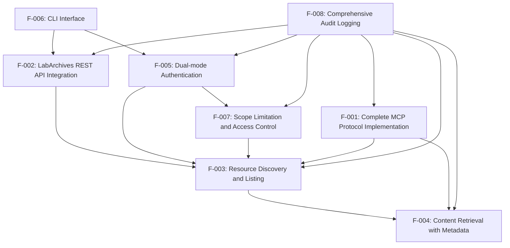
```mermaid
graph TD
    F005[F-005: Dual-mode Authentication] --> F007[F-007: Scope Limitation and Access Control]
    F002[F-002: LabArchives REST API Integration] --> F003[F-003: Resource Discovery and Listing]
    F003 --> F004[F-004: Content Retrieval with Metadata]
    F005 --> F003
    F007 --> F003
    F001[F-001: Complete MCP Protocol Implementation] --> F003
    F001 --> F004
    F006[F-006: CLI Interface] --> F005
    F006 --> F002
    F008[F-008: Comprehensive Audit Logging] --> F001
    F008 --> F002
    F008 --> F003
    F008 --> F004
    F008 --> F005
    F008 --> F007
```

### 2.3.2 Integration Points

| Integration Point | Features Involved | Description |
|------------------|-------------------|-------------|
| Authentication Pipeline | F-005, F-007 | Authentication manager provides credentials for scope enforcement |
| Resource Access Chain | F-003, F-004, F-007 | Resource discovery flows through scope validation to content retrieval |
| API Communication | F-001, F-002 | MCP protocol handler coordinates with LabArchives API integration |
| Audit Integration | F-008, All Features | Comprehensive logging integrates with all system operations |

### 2.3.3 Shared Components

| Component | Supporting Features | Function |
|-----------|-------------------|----------|
| Authentication Manager | F-005, F-007 | Credential validation and session management |
| Resource Manager | F-003, F-004 | Resource discovery and content retrieval coordination |
| API Client | F-002, F-003, F-004 | LabArchives REST API communication |
| Validation Framework | F-007, F-006 | Configuration and access validation |
| Logging System | F-008, All Features | Operational and audit logging |

### 2.3.4 Common Services

| Service | Description | Dependent Features |
|---------|-------------|------------------|
| Configuration Service | Manages system configuration across all components | F-006, F-007 |
| Error Handling Service | Provides consistent error handling and recovery | F-002, F-003, F-004 |
| Security Service | Implements security controls and credential handling | F-005, F-007, F-008 |
| Communication Service | Manages MCP protocol and API communications | F-001, F-002 |

## 2.4 IMPLEMENTATION CONSIDERATIONS

### 2.4.1 Technical Constraints

#### 2.4.1.1 Core Architecture Constraints
- **Stateless Architecture**: No persistent data storage for enhanced security
- **Read-only Operations**: No write-back capabilities to LabArchives
- **Local Process Communication**: stdio-based MCP protocol communication only
- **Memory Limitations**: <100MB memory usage for standard workloads

#### 2.4.1.2 Platform Constraints
- **Python Version**: Requires Python 3.11 or higher
- **Operating System**: Cross-platform compatibility (Windows, macOS, Linux)
- **Container Requirements**: Docker containerization for consistent deployment
- **Network Dependencies**: Reliable internet connectivity for LabArchives API access

### 2.4.2 Performance Requirements

#### 2.4.2.1 Response Time Targets
| Operation Type | Target Time | Measurement Context |
|---------------|-------------|-------------------|
| Authentication | <1 second | Credential validation |
| Resource Discovery | <5 seconds | Large notebook listing |
| Content Retrieval | <2 seconds | 95th percentile |
| MCP Protocol Operations | <2 seconds | Standard operations |

#### 2.4.2.2 Throughput Requirements
| Metric | Target Value | Sustainability |
|--------|-------------|---------------|
| API Requests | 100 requests/minute | Sustained throughput |
| Memory Usage | <100MB | Standard workloads |
| Startup Time | <2 seconds | Server initialization |
| Scalability | 1000+ page notebooks | Load testing verified |

### 2.4.3 Scalability Considerations

#### 2.4.3.1 Horizontal Scaling
- **Container Deployment**: Docker-based deployment for easy scaling
- **Stateless Design**: Enables multiple instance deployment
- **Resource Efficiency**: Minimal memory footprint supports high instance density
- **Load Distribution**: API rate limiting prevents resource exhaustion

#### 2.4.3.2 Vertical Scaling
- **Memory Optimization**: Efficient memory usage patterns
- **CPU Efficiency**: Optimized processing for large notebook structures
- **Network Optimization**: Efficient API communication patterns
- **Caching Strategy**: Strategic caching for frequently accessed resources

### 2.4.4 Security Implications

#### 2.4.4.1 Data Security
- **No Persistent Storage**: Stateless architecture eliminates data persistence risks
- **Credential Protection**: HMAC-SHA256 authentication without credential exposure
- **Access Control**: Comprehensive scope limitation and validation
- **Audit Trail**: Complete logging of all data access operations

#### 2.4.4.2 Operational Security
- **Container Security**: Non-root container execution with read-only filesystem
- **Network Security**: Secure API communication with proper certificate validation
- **Log Security**: Credential masking in all system logs
- **Compliance Support**: SOC2, ISO 27001, HIPAA, GDPR compliance features

### 2.4.5 Maintenance Requirements

#### 2.4.5.1 Monitoring and Observability
- **Performance Monitoring**: Response time and throughput tracking
- **Error Monitoring**: Comprehensive error tracking and alerting
- **Resource Monitoring**: Memory and CPU usage tracking
- **Audit Monitoring**: Security and compliance event tracking

#### 2.4.5.2 Maintenance Operations
- **Update Management**: Automated deployment via infrastructure as code
- **Configuration Management**: Version-controlled configuration updates
- **Log Management**: Automated log rotation and retention
- **Security Updates**: Regular security patch deployment

#### 2.4.5.3 Operational Requirements
- **Deployment Automation**: Terraform-based infrastructure deployment
- **Health Checks**: Automated health monitoring and reporting
- **Backup and Recovery**: Configuration backup and restoration procedures
- **Disaster Recovery**: Multi-region deployment support for high availability

#### References

- `README.md` - Project overview, installation instructions, and usage guidelines
- `blitzy/documentation/Input Prompt.md` - Product requirements document with MVP specifications
- `blitzy/documentation/Technical Specifications.md` - Comprehensive technical architecture and design
- `blitzy/documentation/Project Guide.md` - Executive summary and project status
- `src/cli/README.md` - CLI-specific documentation and configuration
- `src/cli/auth_manager.py` - Authentication implementation details
- `src/cli/resource_manager.py` - Resource management implementation
- `src/cli/logging_setup.py` - Audit logging implementation
- `src/cli/validators.py` - Validation framework implementation
- `src/cli/mcp/` - MCP protocol implementation folder
- `src/cli/api/` - LabArchives API integration folder
- `src/cli/commands/` - CLI command implementation folder
- `infrastructure/README.md` - Infrastructure and deployment documentation
- `infrastructure/docker-compose.prod.yml` - Production deployment configuration

# 3. TECHNOLOGY STACK

The LabArchives MCP Server employs a carefully curated technology stack designed to meet the stringent requirements of enterprise research environments while maintaining optimal performance, security, and cross-platform compatibility. This section details the technological foundation supporting the system's core capabilities: MCP protocol implementation, LabArchives API integration, and secure AI-powered data access.

## 3.1 PROGRAMMING LANGUAGES

### 3.1.1 Core Implementation Language

**Python 3.11+** serves as the primary programming language for the entire system implementation, with explicit support for Python 3.11 and 3.12 as specified in the project configuration.

**Selection Justification:**
- **MCP Framework Compatibility**: Native compatibility with FastMCP framework for Model Context Protocol implementation
- **Rich Ecosystem**: Extensive library support for HTTP clients, authentication, and data validation
- **Cross-Platform Support**: Consistent behavior across Windows, macOS, and Linux environments
- **Memory Efficiency**: Optimized for <100MB memory usage requirements in standard workloads
- **Enterprise Adoption**: Widespread acceptance in research and scientific computing environments

**Version Constraints:**
- Minimum requirement: Python 3.11 (for latest language features and performance optimizations)
- Container base image: `python:3.11-slim-bookworm` for optimal security and performance balance
- Tested compatibility: Python 3.11 and 3.12 via automated CI/CD matrix builds

### 3.1.2 Infrastructure Languages

**HashiCorp Configuration Language (HCL)** is utilized for infrastructure as code implementation through Terraform configurations, enabling reproducible and version-controlled deployment across cloud environments.

## 3.2 FRAMEWORKS & LIBRARIES

### 3.2.1 Core Framework Stack

**FastMCP Framework (v1.0.0+)**
- **Purpose**: Model Context Protocol implementation with JSON-RPC 2.0 compliance
- **Justification**: Official framework for MCP protocol ensuring standards compliance and future compatibility
- **Integration**: Handles stdio communication and protocol-compliant request/response patterns

**Pydantic (v2.11.7+)**
- **Purpose**: Data validation and settings management with type safety
- **Justification**: Ensures robust data validation for LabArchives API responses and configuration management
- **Components**: Core validation (pydantic≥2.11.7) and settings management (pydantic-settings≥2.10.1)

### 3.2.2 HTTP Communication Framework

**Requests Library (v2.31.0+)**
- **Purpose**: HTTP client for LabArchives REST API integration
- **Justification**: Battle-tested library with robust error handling and retry mechanisms
- **Security**: Integrated with urllib3≥2.0.0 for enhanced security features

### 3.2.3 Authentication Framework

**Built-in Python Security Libraries**
- **HMAC-SHA256**: Implemented using Python's native `hashlib` and `hmac` modules
- **Justification**: Cryptographically secure authentication without external dependencies
- **Session Management**: 3600-second session lifetime with secure token handling

### 3.2.4 CLI Framework

**Python Built-in argparse**
- **Purpose**: Command-line argument parsing and interface management
- **Justification**: Native solution ensuring no external dependencies for core CLI functionality
- **Supporting Libraries**: Click≥8.0.0 for enhanced CLI capabilities

## 3.3 OPEN SOURCE DEPENDENCIES

### 3.3.1 Core Dependencies

**Model Context Protocol Libraries**
```
mcp>=1.0.0                    # Core MCP protocol implementation
fastmcp>=1.0.0               # FastMCP framework for MCP server development
```

**Data Validation and Processing**
```
pydantic>=2.11.7             # Data validation and serialization
pydantic-settings>=2.10.1    # Configuration management
```

**HTTP and Network Libraries**
```
requests>=2.31.0             # HTTP client library
urllib3>=2.0.0               # HTTP client foundation
```

**LabArchives Integration**
```
labarchives-py>=0.1.0        # Official LabArchives Python SDK
```

### 3.3.2 Development and Testing Dependencies

**Testing Framework**
```
pytest>=7.0.0                # Primary testing framework
pytest-cov>=4.0.0           # Code coverage integration
pytest-asyncio>=0.21.0      # Async testing support
pytest-mock>=3.12.0         # Mock testing capabilities
coverage>=7.0.0             # Coverage reporting
responses>=0.25.0           # HTTP response mocking
```

**Code Quality Tools**
```
black>=23.0.0                # Code formatting
isort>=5.12.0                # Import sorting
flake8>=6.0.0                # Code linting
ruff>=0.1.0                  # Fast Python linter
mypy>=1.0.0                  # Static type checking
types-requests>=2.31.0.20240106  # Type stubs for requests
```

**Documentation Tools**
```
mkdocs>=1.5.0                # Documentation generation
mkdocs-material>=9.0.0       # Material theme for documentation
mkdocstrings[python]>=0.22.0 # Python documentation extraction
```

**Build and Packaging**
```
setuptools>=65.0.0           # Package building
build                        # PEP 517 build tool
twine                        # Package distribution
```

### 3.3.3 Package Management Strategy

**Primary Package Registry**: PyPI (Python Package Index)
- **Dependency Management**: Requirements.txt and pyproject.toml for version control
- **PEP 517 Compliance**: Modern Python packaging standards
- **Security Scanning**: Automated vulnerability detection via Safety and Bandit

## 3.4 THIRD-PARTY SERVICES

### 3.4.1 Core External Services

**LabArchives REST API**
- **Primary Endpoints**:
  - US: `https://api.labarchives.com/api`
  - Australia: `https://auapi.labarchives.com/api`
  - UK: `https://ukapi.labarchives.com/api`
- **Integration**: Multi-region support with automatic endpoint selection
- **Authentication**: HMAC-SHA256 signed requests with session management

### 3.4.2 Development and Deployment Services

**Container Registries**
- **Docker Hub**: Public container distribution
- **GitHub Container Registry (ghcr.io)**: Integrated CI/CD container hosting

**Code Quality and Security Services**
- **Codecov**: Code coverage reporting and analysis
- **GitHub Security**: CodeQL static analysis and vulnerability scanning
- **Trivy**: Container vulnerability scanning
- **Anchore**: Software Bill of Materials (SBOM) generation

**Certificate Management**
- **Let's Encrypt**: TLS certificate automation via cert-manager in Kubernetes deployments

## 3.5 DATABASES & STORAGE

### 3.5.1 Data Architecture Philosophy

**Stateless Design**: The system employs a zero-persistence architecture for enhanced security and compliance, eliminating traditional database requirements.

**Justification for No Persistent Storage**:
- **Security**: Eliminates data breach risks by not storing sensitive research data
- **Compliance**: Supports SOC2, ISO 27001, HIPAA, and GDPR requirements
- **Performance**: Reduces system complexity and improves response times
- **Scalability**: Enables horizontal scaling without database synchronization concerns

### 3.5.2 Optional Storage Components

**Optional PostgreSQL Integration**
- **Cloud Provider**: AWS RDS PostgreSQL (when persistent storage is required)
- **Use Case**: Enterprise deployments requiring audit log persistence
- **Implementation**: Configurable via Terraform infrastructure modules

**Memory-based Caching**
- **Implementation**: In-memory caching for frequently accessed LabArchives resources
- **Strategy**: Application-level caching with configurable TTL values
- **Scope**: Session-based caching for improved performance

## 3.6 DEVELOPMENT & DEPLOYMENT

### 3.6.1 Development Environment

**Local Development Tools**
- **IDE Support**: VS Code configuration with Python extension recommendations
- **Code Formatting**: Black (23.0.0+) with 88-character line length
- **Import Organization**: isort (5.12.0+) with black-compatible configuration
- **Type Checking**: mypy (1.0.0+) with strict type checking enabled

**Testing Infrastructure**
- **Framework**: pytest with comprehensive test coverage (≥85% target)
- **Coverage**: pytest-cov integration with automated reporting
- **Mocking**: pytest-mock for external service simulation
- **Async Testing**: pytest-asyncio for asynchronous operation testing

### 3.6.2 Containerization Strategy

**Docker Implementation**
- **Base Image**: `python:3.11-slim-bookworm` for security and performance optimization
- **Multi-stage Build**: Optimized container layers for production deployment
- **Security**: Non-root user execution with read-only filesystem
- **Size Optimization**: Minimal attack surface with essential packages only

**Container Orchestration**
- **Docker Compose**: Development and production configurations
- **Kubernetes**: Production-grade orchestration with NGINX Ingress Controller
- **Version Requirements**: Kubernetes v1.24+ for latest security features

### 3.6.3 Infrastructure as Code

**Terraform Configuration (v1.4.0+)**
- **Provider**: AWS Provider (≥5.0.0, <6.0.0) for cloud resource management
- **Modules**: Modular infrastructure components for reusability
- **State Management**: Remote state backend for team collaboration
- **Security**: Encrypted state storage with access controls

**Cloud Platform Integration**
- **AWS Services**:
  - ECS Fargate: Container hosting with automatic scaling
  - CloudWatch: Logging and monitoring integration
  - KMS: Encryption key management
  - Secrets Manager: Secure credential storage

### 3.6.4 CI/CD Pipeline

**GitHub Actions Implementation**
- **Matrix Builds**: Python 3.11/3.12 across multiple operating systems
- **Workflow Stages**:
  - Code quality checks (black, flake8, mypy)
  - Security scanning (Trivy, CodeQL, Bandit)
  - Comprehensive testing with coverage reporting
  - Container building and security scanning
  - Automated deployment to staging/production

**Security Integration**
- **Static Analysis**: CodeQL for code security analysis
- **Container Scanning**: Trivy for vulnerability detection
- **Dependency Scanning**: Safety and Bandit for Python-specific security issues
- **SBOM Generation**: Anchore for supply chain security

### 3.6.5 Monitoring and Observability

**Logging Architecture**
- **Format**: Structured JSON logging with rotation capabilities
- **Levels**: Dual-logger architecture (operational + audit)
- **Retention**: Configurable log retention policies
- **Security**: Credential masking in all log outputs

**Monitoring Stack**
- **Prometheus**: Metrics collection and storage
- **Grafana**: Visualization and alerting dashboard
- **ELK Stack**: Centralized log aggregation and analysis
- **Health Checks**: Automated health monitoring for container orchestration

### 3.6.6 Key Technology Integration Requirements

**Cross-Platform Compatibility**
- **Operating Systems**: Windows, macOS, Linux support verified
- **Python Versions**: 3.11+ with automated compatibility testing
- **Container Runtime**: Docker compatibility across all target platforms

**Performance Optimization**
- **Memory Usage**: <100MB for standard workloads
- **Startup Time**: <2 seconds for server initialization
- **Response Time**: <2 seconds for 95th percentile operations
- **Throughput**: 100 requests/minute sustained capacity

**Security Hardening**
- **Principle of Least Privilege**: Minimal required permissions
- **Network Security**: TLS 1.3 for all external communications
- **Container Security**: Read-only filesystem with non-root execution
- **Credential Management**: No credential exposure in logs or error messages

## 3.7 TECHNOLOGY STACK ARCHITECTURE

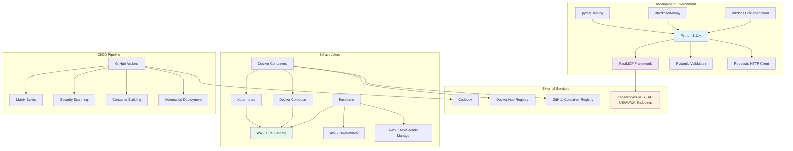
```mermaid
graph TB
    subgraph "Development Environment"
        A[Python 3.11+] --> B[FastMCP Framework]
        A --> C[Pydantic Validation]
        A --> D[Requests HTTP Client]
        
        E[pytest Testing] --> A
        F[Black/isort/mypy] --> A
        G[mkdocs Documentation] --> A
    end
    
    subgraph "External Services"
        H[LabArchives REST API<br/>US/AU/UK Endpoints]
        I[Docker Hub Registry]
        J[GitHub Container Registry]
        K[Codecov]
    end
    
    subgraph "Infrastructure"
        L[Docker Containers] --> M[Kubernetes]
        L --> N[Docker Compose]
        
        O[Terraform] --> P[AWS ECS Fargate]
        O --> Q[AWS CloudWatch]
        O --> R[AWS KMS/Secrets Manager]
    end
    
    subgraph "CI/CD Pipeline"
        S[GitHub Actions] --> T[Matrix Builds]
        S --> U[Security Scanning]
        S --> V[Container Building]
        S --> W[Automated Deployment]
    end
    
    B --> H
    L --> I
    L --> J
    S --> K
    
    M --> P
    N --> P
    
    style A fill:#e1f5fe
    style B fill:#f3e5f5
    style H fill:#fff3e0
    style P fill:#e8f5e8
```

#### References

**Repository Files Examined:**
- `src/cli/requirements.txt` - Complete Python dependency specifications with version constraints
- `src/cli/pyproject.toml` - Package configuration, build settings, and tool configurations
- `src/cli/Dockerfile` - Container build configuration and security hardening
- `infrastructure/terraform/providers.tf` - Cloud provider specifications and version requirements
- `.github/workflows/ci.yml` - CI/CD pipeline configuration and security scanning tools
- `.github/workflows/deploy.yml` - Deployment automation and container orchestration
- `.github/workflows/release.yml` - Release management and distribution processes

**Repository Folders Analyzed:**
- `src/cli/` - Core implementation technologies and frameworks
- `infrastructure/` - Deployment and infrastructure as code technologies
- `.github/workflows/` - CI/CD pipeline tools and automation
- `src/cli/api/` - LabArchives integration implementation details
- `src/cli/mcp/` - MCP protocol implementation framework usage

**Technical Specification Sections Referenced:**
- Section 1.1: Executive Summary - Business context and stakeholder requirements
- Section 1.2: System Overview - Architectural approach and technical constraints
- Section 2.1: Feature Catalog - Feature-specific technology requirements
- Section 2.4: Implementation Considerations - Performance and security constraints

# 4. PROCESS FLOWCHART

## 4.1 SYSTEM WORKFLOWS

### 4.1.1 High-Level System Workflow

The LabArchives MCP Server operates through a layered architecture with distinct workflow phases for initialization, authentication, and data access. The system follows a stateless design pattern with secure session management.

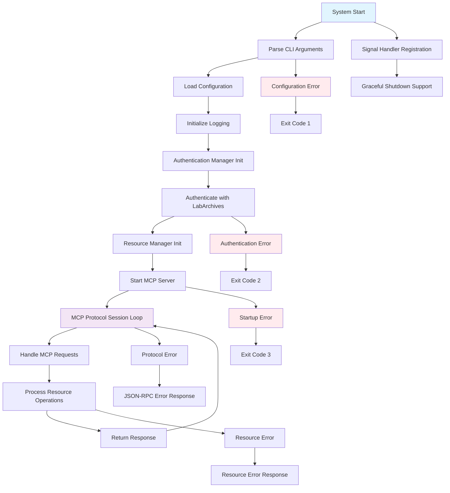
```mermaid
graph TB
    A[System Start] --> B[Parse CLI Arguments]
    B --> C[Load Configuration]
    C --> D[Initialize Logging]
    D --> E[Authentication Manager Init]
    E --> F[Authenticate with LabArchives]
    F --> G[Resource Manager Init]
    G --> H[Start MCP Server]
    H --> I[MCP Protocol Session Loop]
    I --> J[Handle MCP Requests]
    J --> K[Process Resource Operations]
    K --> L[Return Response]
    L --> I
    
    %% Error Handling
    B --> M[Configuration Error]
    F --> N[Authentication Error]
    H --> O[Startup Error]
    I --> P[Protocol Error]
    K --> Q[Resource Error]
    
    M --> R[Exit Code 1]
    N --> S[Exit Code 2]
    O --> T[Exit Code 3]
    P --> U[JSON-RPC Error Response]
    Q --> V[Resource Error Response]
    
    %% Success Flow
    A --> W[Signal Handler Registration]
    W --> X[Graceful Shutdown Support]
    
    style A fill:#e1f5fe
    style I fill:#f3e5f5
    style M fill:#ffebee
    style N fill:#ffebee
    style O fill:#ffebee
```

### 4.1.2 Core Business Processes

#### 4.1.2.1 Server Startup and Initialization Workflow

The server startup process implements a comprehensive initialization sequence with robust error handling and validation at each stage.

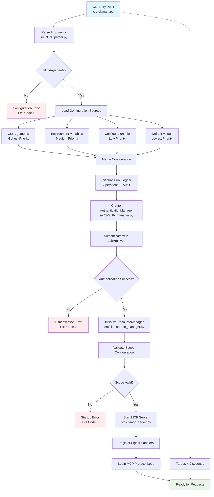
```mermaid
flowchart TD
    A[CLI Entry Point<br/>src/cli/main.py] --> B[Parse Arguments<br/>src/cli/cli_parser.py]
    B --> C{Valid Arguments?}
    C -->|No| D[Configuration Error<br/>Exit Code 1]
    C -->|Yes| E[Load Configuration Sources]
    
    E --> F[CLI Arguments<br/>Highest Priority]
    E --> G[Environment Variables<br/>Medium Priority]
    E --> H[Configuration File<br/>Low Priority]
    E --> I[Default Values<br/>Lowest Priority]
    
    F --> J[Merge Configuration]
    G --> J
    H --> J
    I --> J
    
    J --> K[Initialize Dual Logger<br/>Operational + Audit]
    K --> L[Create AuthenticationManager<br/>src/cli/auth_manager.py]
    L --> M[Authenticate with LabArchives]
    M --> N{Authentication Success?}
    N -->|No| O[Authentication Error<br/>Exit Code 2]
    N -->|Yes| P[Initialize ResourceManager<br/>src/cli/resource_manager.py]
    
    P --> Q[Validate Scope Configuration]
    Q --> R{Scope Valid?}
    R -->|No| S[Startup Error<br/>Exit Code 3]
    R -->|Yes| T[Start MCP Server<br/>src/cli/mcp_server.py]
    
    T --> U[Register Signal Handlers]
    U --> V[Begin MCP Protocol Loop]
    V --> W[Ready for Requests]
    
    %% Timing Constraints
    A -.-> X[Target: < 2 seconds]
    X -.-> W
    
    style A fill:#e1f5fe
    style W fill:#e8f5e8
    style D fill:#ffebee
    style O fill:#ffebee
    style S fill:#ffebee
```

#### 4.1.2.2 Authentication Workflow

The system implements dual-mode authentication supporting both API keys and user tokens with secure session management.

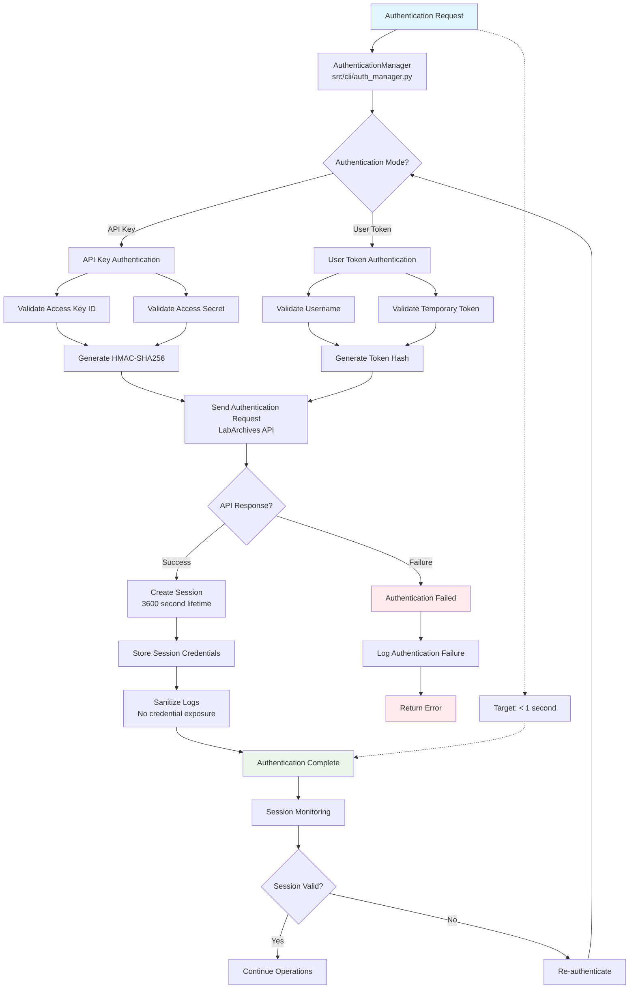
```mermaid
flowchart TD
    A[Authentication Request] --> B[AuthenticationManager<br/>src/cli/auth_manager.py]
    B --> C{Authentication Mode?}
    
    C -->|API Key| D[API Key Authentication]
    C -->|User Token| E[User Token Authentication]
    
    D --> F[Validate Access Key ID]
    D --> G[Validate Access Secret]
    F --> H[Generate HMAC-SHA256]
    G --> H
    
    E --> I[Validate Username]
    E --> J[Validate Temporary Token]
    I --> K[Generate Token Hash]
    J --> K
    
    H --> L[Send Authentication Request<br/>LabArchives API]
    K --> L
    
    L --> M{API Response?}
    M -->|Success| N[Create Session<br/>3600 second lifetime]
    M -->|Failure| O[Authentication Failed]
    
    N --> P[Store Session Credentials]
    P --> Q[Sanitize Logs<br/>No credential exposure]
    Q --> R[Authentication Complete]
    
    O --> S[Log Authentication Failure]
    S --> T[Return Error]
    
    %% Session Management
    R --> U[Session Monitoring]
    U --> V{Session Valid?}
    V -->|Yes| W[Continue Operations]
    V -->|No| X[Re-authenticate]
    X --> C
    
    %% Timing Constraints
    A -.-> Y[Target: < 1 second]
    Y -.-> R
    
    style A fill:#e1f5fe
    style R fill:#e8f5e8
    style O fill:#ffebee
    style T fill:#ffebee
```

#### 4.1.2.3 MCP Protocol Session Workflow

The MCP protocol implementation handles JSON-RPC 2.0 communication with comprehensive error handling and request routing.

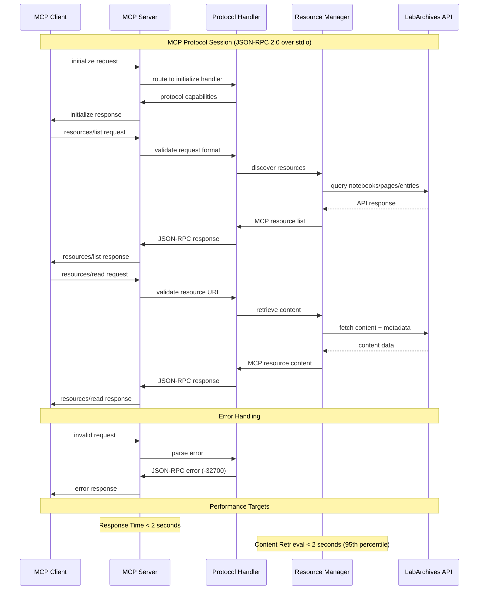
```mermaid
sequenceDiagram
    participant Client as MCP Client
    participant Server as MCP Server
    participant Handler as Protocol Handler
    participant Resource as Resource Manager
    participant API as LabArchives API
    
    Note over Client,API: MCP Protocol Session (JSON-RPC 2.0 over stdio)
    
    Client->>Server: initialize request
    Server->>Handler: route to initialize handler
    Handler->>Server: protocol capabilities
    Server->>Client: initialize response
    
    Client->>Server: resources/list request
    Server->>Handler: validate request format
    Handler->>Resource: discover resources
    Resource->>API: query notebooks/pages/entries
    API-->>Resource: API response
    Resource->>Handler: MCP resource list
    Handler->>Server: JSON-RPC response
    Server->>Client: resources/list response
    
    Client->>Server: resources/read request
    Server->>Handler: validate resource URI
    Handler->>Resource: retrieve content
    Resource->>API: fetch content + metadata
    API-->>Resource: content data
    Resource->>Handler: MCP resource content
    Handler->>Server: JSON-RPC response
    Server->>Client: resources/read response
    
    Note over Client,API: Error Handling
    Client->>Server: invalid request
    Server->>Handler: parse error
    Handler->>Server: JSON-RPC error (-32700)
    Server->>Client: error response
    
    Note over Client,API: Performance Targets
    Note over Server: Response Time < 2 seconds
    Note over Resource: Content Retrieval < 2 seconds (95th percentile)
```

#### 4.1.2.4 Resource Discovery Workflow

The resource discovery system implements hierarchical navigation with scope-aware filtering and scalable performance.

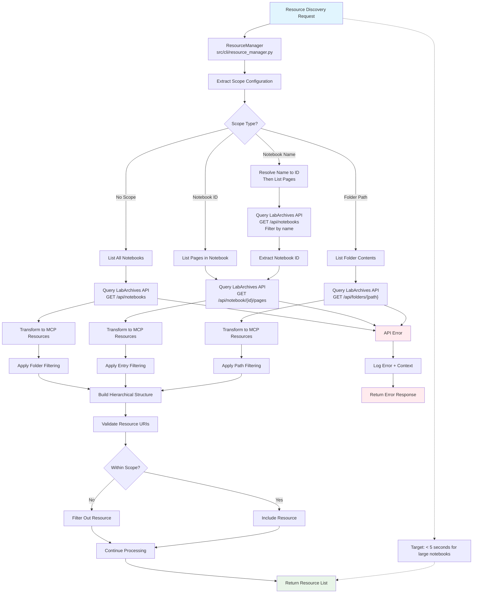
```mermaid
flowchart TD
    A[Resource Discovery Request] --> B["ResourceManager<br/>src/cli/resource_manager.py"]
    B --> C[Extract Scope Configuration]
    C --> D{Scope Type?}
    
    D -->|No Scope| E[List All Notebooks]
    D -->|Notebook ID| F[List Pages in Notebook]
    D -->|Notebook Name| G["Resolve Name to ID<br/>Then List Pages"]
    D -->|Folder Path| H[List Folder Contents]
    
    E --> I["Query LabArchives API<br/>GET /api/notebooks"]
    F --> J["Query LabArchives API<br/>GET /api/notebook/{id}/pages"]
    G --> K["Query LabArchives API<br/>GET /api/notebooks<br/>Filter by name"]
    H --> L["Query LabArchives API<br/>GET /api/folders/{path}"]
    
    K --> M[Extract Notebook ID]
    M --> J
    
    I --> N[Transform to MCP Resources]
    J --> O[Transform to MCP Resources]
    L --> P[Transform to MCP Resources]
    
    N --> Q[Apply Folder Filtering]
    O --> R[Apply Entry Filtering]
    P --> S[Apply Path Filtering]
    
    Q --> T[Build Hierarchical Structure]
    R --> T
    S --> T
    
    T --> U[Validate Resource URIs]
    U --> V{Within Scope?}
    V -->|No| W[Filter Out Resource]
    V -->|Yes| X[Include Resource]
    
    W --> Y[Continue Processing]
    X --> Y
    Y --> Z[Return Resource List]
    
    I --> AA[API Error]
    J --> AA
    L --> AA
    AA --> BB["Log Error + Context"]
    BB --> CC[Return Error Response]
    
    A -.-> DD["Target: < 5 seconds for large notebooks"]
    DD -.-> Z
    
    style A fill:#e1f5fe
    style Z fill:#e8f5e8
    style AA fill:#ffebee
    style CC fill:#ffebee
```

#### 4.1.2.5 Content Retrieval Workflow

The content retrieval system provides comprehensive content access with metadata preservation and JSON-LD context support.

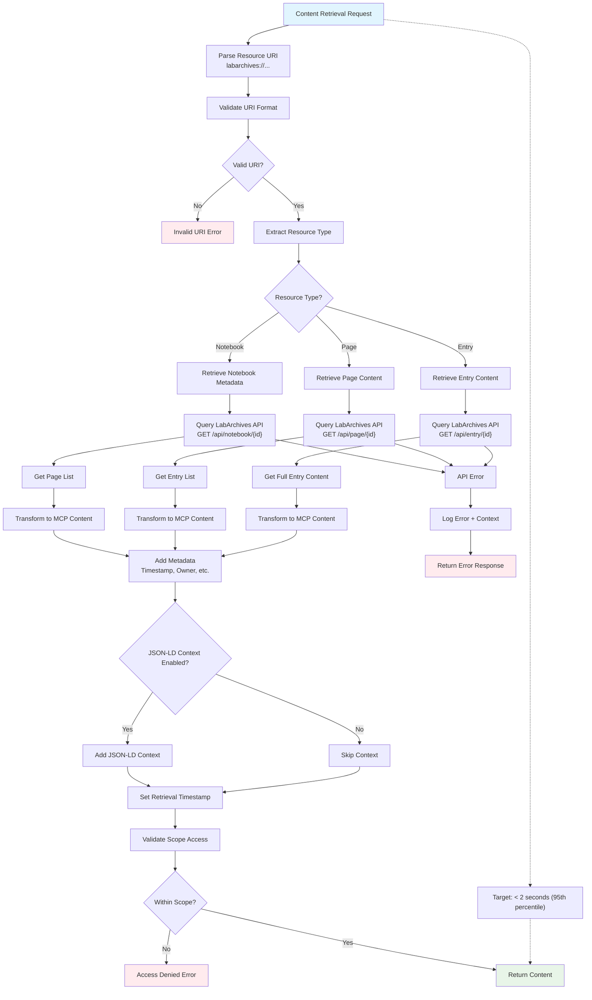
```mermaid
flowchart TD
    A["Content Retrieval Request"] --> B["Parse Resource URI<br/>labarchives://..."]
    B --> C["Validate URI Format"]
    C --> D{"Valid URI?"}
    D -->|No| E["Invalid URI Error"]
    D -->|Yes| F["Extract Resource Type"]
    
    F --> G{"Resource Type?"}
    G -->|Notebook| H["Retrieve Notebook Metadata"]
    G -->|Page| I["Retrieve Page Content"]
    G -->|Entry| J["Retrieve Entry Content"]
    
    H --> K["Query LabArchives API<br/>GET /api/notebook/{id}"]
    I --> L["Query LabArchives API<br/>GET /api/page/{id}"]
    J --> M["Query LabArchives API<br/>GET /api/entry/{id}"]
    
    K --> N["Get Page List"]
    L --> O["Get Entry List"]
    M --> P["Get Full Entry Content"]
    
    N --> Q["Transform to MCP Content"]
    O --> R["Transform to MCP Content"]
    P --> S["Transform to MCP Content"]
    
    Q --> T["Add Metadata<br/>Timestamp, Owner, etc."]
    R --> T
    S --> T
    
    T --> U{"JSON-LD Context Enabled?"}
    U -->|Yes| V["Add JSON-LD Context"]
    U -->|No| W["Skip Context"]
    
    V --> X["Set Retrieval Timestamp"]
    W --> X
    X --> Y["Validate Scope Access"]
    Y --> Z{"Within Scope?"}
    Z -->|No| AA["Access Denied Error"]
    Z -->|Yes| BB["Return Content"]
    
    %% Error Handling
    K --> CC["API Error"]
    L --> CC
    M --> CC
    CC --> DD["Log Error + Context"]
    DD --> EE["Return Error Response"]
    
    %% Performance Monitoring
    A -.-> FF["Target: < 2 seconds (95th percentile)"]
    FF -.-> BB
    
    style A fill:#e1f5fe
    style BB fill:#e8f5e8
    style E fill:#ffebee
    style AA fill:#ffebee
    style EE fill:#ffebee
```

### 4.1.3 Integration Workflows

#### 4.1.3.1 LabArchives API Integration Flow

The API integration implements secure communication with retry logic and comprehensive error handling across multiple regions.

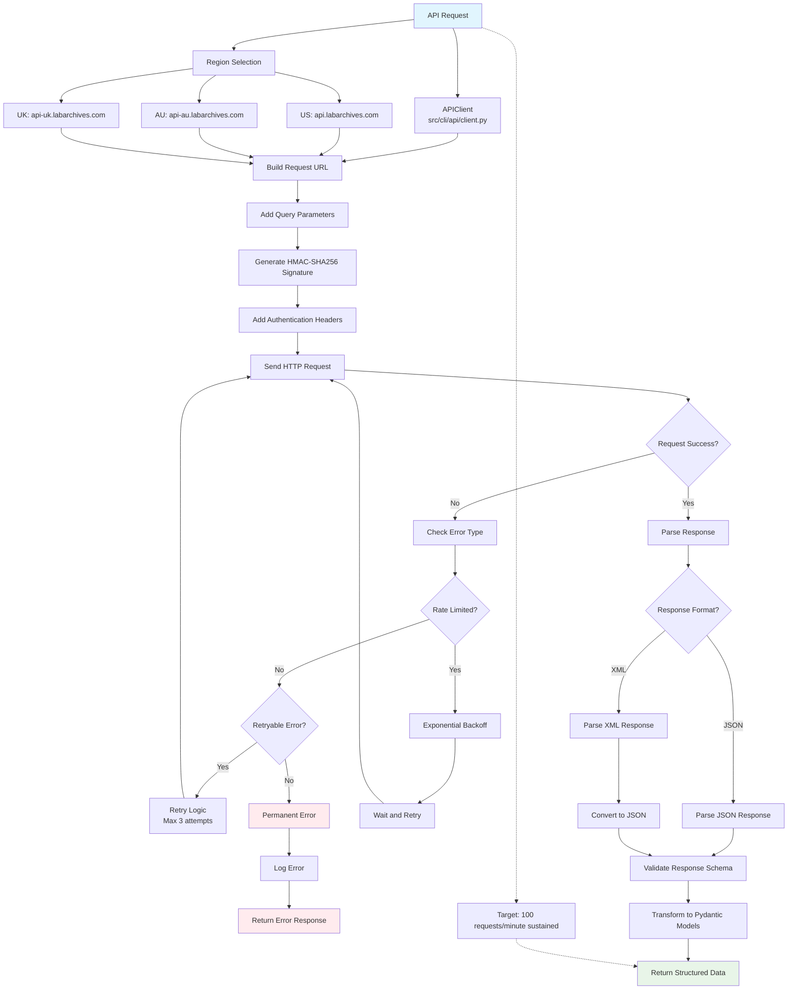
```mermaid
flowchart TD
    A[API Request] --> B[APIClient<br/>src/cli/api/client.py]
    B --> C[Build Request URL]
    C --> D[Add Query Parameters]
    D --> E[Generate HMAC-SHA256 Signature]
    E --> F[Add Authentication Headers]
    F --> G[Send HTTP Request]
    
    G --> H{Request Success?}
    H -->|No| I[Check Error Type]
    H -->|Yes| J[Parse Response]
    
    I --> K{Rate Limited?}
    K -->|Yes| L[Exponential Backoff]
    K -->|No| M{Retryable Error?}
    
    M -->|Yes| N[Retry Logic<br/>Max 3 attempts]
    M -->|No| O[Permanent Error]
    
    L --> P[Wait and Retry]
    P --> G
    N --> G
    O --> Q[Log Error]
    Q --> R[Return Error Response]
    
    J --> S{Response Format?}
    S -->|JSON| T[Parse JSON Response]
    S -->|XML| U[Parse XML Response]
    
    T --> V[Validate Response Schema]
    U --> W[Convert to JSON]
    W --> V
    
    V --> X[Transform to Pydantic Models]
    X --> Y[Return Structured Data]
    
    %% Multi-Region Support
    A --> Z[Region Selection]
    Z --> AA[US: api.labarchives.com]
    Z --> BB[AU: api-au.labarchives.com]
    Z --> CC[UK: api-uk.labarchives.com]
    
    AA --> C
    BB --> C
    CC --> C
    
    %% Performance Monitoring
    A -.-> DD[Target: 100 requests/minute sustained]
    DD -.-> Y
    
    style A fill:#e1f5fe
    style Y fill:#e8f5e8
    style O fill:#ffebee
    style R fill:#ffebee
```

#### 4.1.3.2 Configuration Management Flow

The configuration system implements hierarchical precedence with comprehensive validation and secure handling.

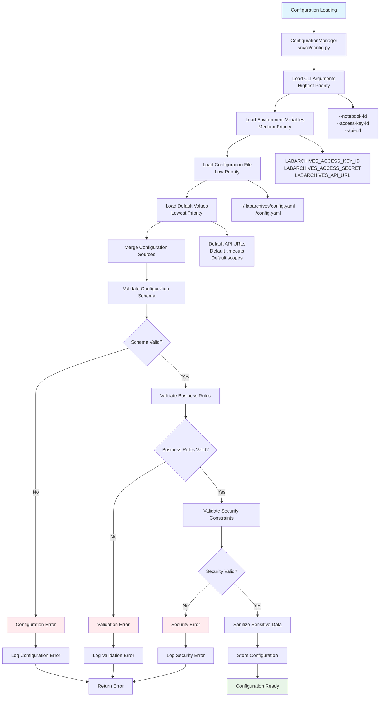
```mermaid
flowchart TD
    A[Configuration Loading] --> B[ConfigurationManager<br/>src/cli/config.py]
    B --> C[Load CLI Arguments<br/>Highest Priority]
    C --> D[Load Environment Variables<br/>Medium Priority]
    D --> E[Load Configuration File<br/>Low Priority]
    E --> F[Load Default Values<br/>Lowest Priority]
    
    F --> G[Merge Configuration Sources]
    G --> H[Validate Configuration Schema]
    H --> I{Schema Valid?}
    I -->|No| J[Configuration Error]
    I -->|Yes| K[Validate Business Rules]
    
    K --> L{Business Rules Valid?}
    L -->|No| M[Validation Error]
    L -->|Yes| N[Validate Security Constraints]
    
    N --> O{Security Valid?}
    O -->|No| P[Security Error]
    O -->|Yes| Q[Sanitize Sensitive Data]
    
    Q --> R[Store Configuration]
    R --> S[Configuration Ready]
    
    %% Error Handling
    J --> T[Log Configuration Error]
    M --> U[Log Validation Error]
    P --> V[Log Security Error]
    
    T --> W[Return Error]
    U --> W
    V --> W
    
    %% Configuration Sources Detail
    C --> X[--notebook-id<br/>--access-key-id<br/>--api-url]
    D --> Y[LABARCHIVES_ACCESS_KEY_ID<br/>LABARCHIVES_ACCESS_SECRET<br/>LABARCHIVES_API_URL]
    E --> Z[~/.labarchives/config.yaml<br/>./config.yaml]
    F --> AA[Default API URLs<br/>Default timeouts<br/>Default scopes]
    
    style A fill:#e1f5fe
    style S fill:#e8f5e8
    style J fill:#ffebee
    style M fill:#ffebee
    style P fill:#ffebee
```

## 4.2 TECHNICAL IMPLEMENTATION

### 4.2.1 State Management

The system implements a stateless architecture with minimal in-memory state for optimal security and scalability.

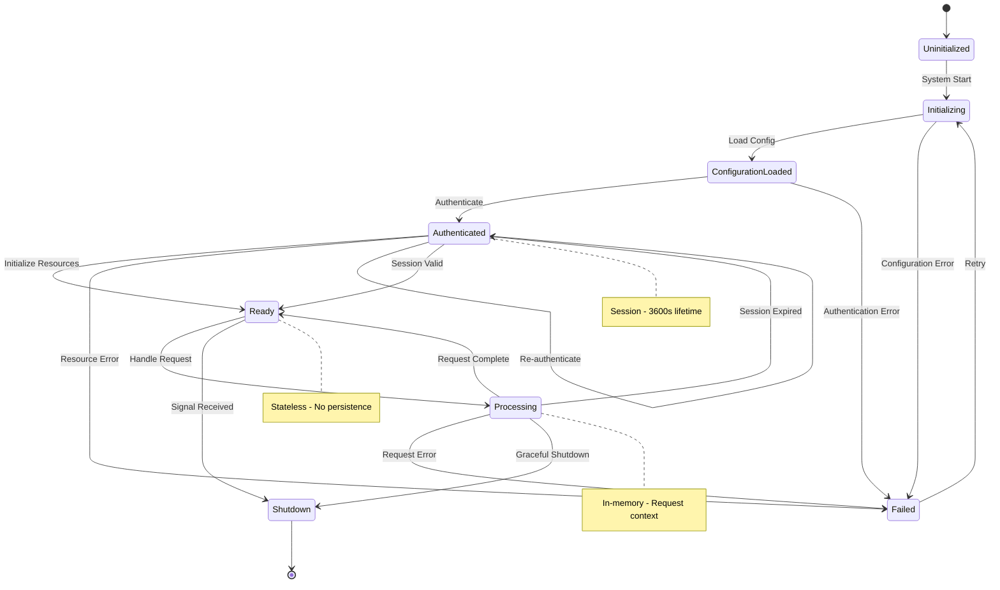
```mermaid
stateDiagram-v2
    [*] --> Uninitialized
    Uninitialized --> Initializing : System Start
    Initializing --> ConfigurationLoaded : Load Config
    ConfigurationLoaded --> Authenticated : Authenticate
    Authenticated --> Ready : Initialize Resources
    Ready --> Processing : Handle Request
    Processing --> Ready : Request Complete
    
    %% Error States
    Initializing --> Failed : Configuration Error
    ConfigurationLoaded --> Failed : Authentication Error
    Authenticated --> Failed : Resource Error
    Processing --> Failed : Request Error
    
    %% Recovery States
    Failed --> Initializing : Retry
    Processing --> Authenticated : Session Expired
    Authenticated --> Authenticated : Re-authenticate
    Authenticated --> Ready : Session Valid
    
    %% Shutdown States
    Ready --> Shutdown : Signal Received
    Processing --> Shutdown : Graceful Shutdown
    Shutdown --> [*]
    
    %% State Persistence
    note right of Authenticated : Session - 3600s lifetime
    note right of Ready : Stateless - No persistence
    note right of Processing : In-memory - Request context
```

### 4.2.2 Error Handling and Recovery

The system implements comprehensive error handling with retry mechanisms and graceful degradation patterns.

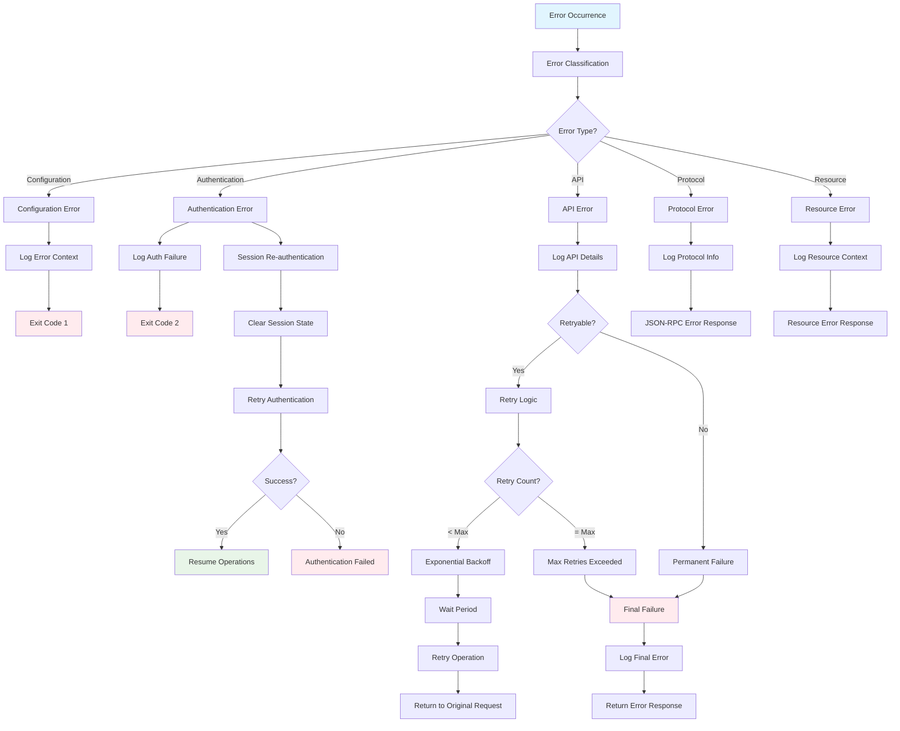
```mermaid
flowchart TD
    A[Error Occurrence] --> B[Error Classification]
    B --> C{Error Type?}
    
    C -->|Configuration| D[Configuration Error]
    C -->|Authentication| E[Authentication Error]
    C -->|API| F[API Error]
    C -->|Protocol| G[Protocol Error]
    C -->|Resource| H[Resource Error]
    
    D --> I[Log Error Context]
    E --> J[Log Auth Failure]
    F --> K[Log API Details]
    G --> L[Log Protocol Info]
    H --> M[Log Resource Context]
    
    I --> N[Exit Code 1]
    J --> O[Exit Code 2]
    K --> P{Retryable?}
    L --> Q[JSON-RPC Error Response]
    M --> R[Resource Error Response]
    
    P -->|Yes| S[Retry Logic]
    P -->|No| T[Permanent Failure]
    
    S --> U{Retry Count?}
    U -->|< Max| V[Exponential Backoff]
    U -->|= Max| W[Max Retries Exceeded]
    
    V --> X[Wait Period]
    X --> Y[Retry Operation]
    Y --> Z[Return to Original Request]
    
    W --> AA[Final Failure]
    T --> AA
    AA --> BB[Log Final Error]
    BB --> CC[Return Error Response]
    
    %% Recovery Mechanisms
    E --> DD[Session Re-authentication]
    DD --> EE[Clear Session State]
    EE --> FF[Retry Authentication]
    FF --> GG{Success?}
    GG -->|Yes| HH[Resume Operations]
    GG -->|No| II[Authentication Failed]
    
    style A fill:#e1f5fe
    style HH fill:#e8f5e8
    style N fill:#ffebee
    style O fill:#ffebee
    style AA fill:#ffebee
    style II fill:#ffebee
```

### 4.2.3 Audit and Compliance Flow

The system implements comprehensive audit logging with dual-logger architecture for regulatory compliance.

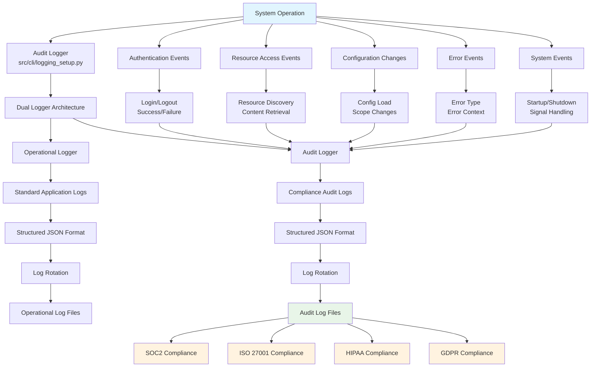
```mermaid
flowchart TD
    A[System Operation] --> B[Audit Logger<br/>src/cli/logging_setup.py]
    B --> C[Dual Logger Architecture]
    C --> D[Operational Logger]
    C --> E[Audit Logger]
    
    D --> F[Standard Application Logs]
    E --> G[Compliance Audit Logs]
    
    F --> H[Structured JSON Format]
    G --> I[Structured JSON Format]
    
    H --> J[Log Rotation]
    I --> K[Log Rotation]
    
    J --> L[Operational Log Files]
    K --> M[Audit Log Files]
    
    %% Audit Events
    A --> N[Authentication Events]
    A --> O[Resource Access Events]
    A --> P[Configuration Changes]
    A --> Q[Error Events]
    A --> R[System Events]
    
    N --> S[Login/Logout<br/>Success/Failure]
    O --> T[Resource Discovery<br/>Content Retrieval]
    P --> U[Config Load<br/>Scope Changes]
    Q --> V[Error Type<br/>Error Context]
    R --> W[Startup/Shutdown<br/>Signal Handling]
    
    S --> E
    T --> E
    U --> E
    V --> E
    W --> E
    
    %% Compliance Requirements
    M --> X[SOC2 Compliance]
    M --> Y[ISO 27001 Compliance]
    M --> Z[HIPAA Compliance]
    M --> AA[GDPR Compliance]
    
    style A fill:#e1f5fe
    style M fill:#e8f5e8
    style X fill:#fff3e0
    style Y fill:#fff3e0
    style Z fill:#fff3e0
    style AA fill:#fff3e0
```

## 4.3 VALIDATION RULES AND CHECKPOINTS

### 4.3.1 Authentication Validation Flow

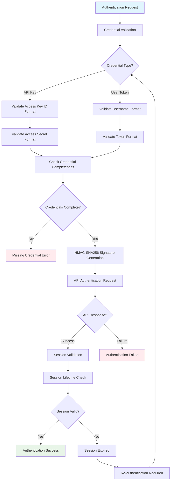
```mermaid
flowchart TD
    A[Authentication Request] --> B[Credential Validation]
    B --> C{Credential Type?}
    
    C -->|API Key| D[Validate Access Key ID Format]
    C -->|User Token| E[Validate Username Format]
    
    D --> F[Validate Access Secret Format]
    E --> G[Validate Token Format]
    
    F --> H[Check Credential Completeness]
    G --> H
    
    H --> I{Credentials Complete?}
    I -->|No| J[Missing Credential Error]
    I -->|Yes| K[HMAC-SHA256 Signature Generation]
    
    K --> L[API Authentication Request]
    L --> M{API Response?}
    M -->|Success| N[Session Validation]
    M -->|Failure| O[Authentication Failed]
    
    N --> P[Session Lifetime Check]
    P --> Q{Session Valid?}
    Q -->|Yes| R[Authentication Success]
    Q -->|No| S[Session Expired]
    
    S --> T[Re-authentication Required]
    T --> C
    
    style A fill:#e1f5fe
    style R fill:#e8f5e8
    style J fill:#ffebee
    style O fill:#ffebee
```

### 4.3.2 Scope Validation and Access Control

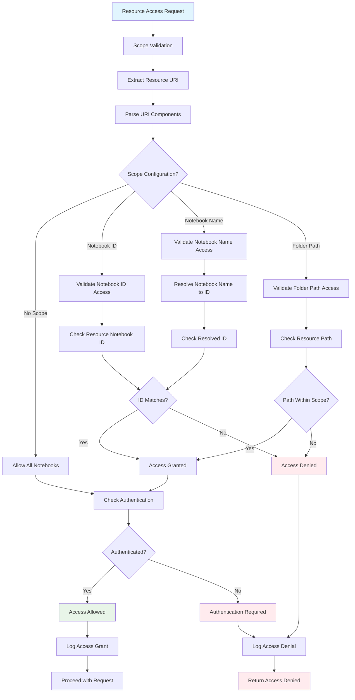
```mermaid
flowchart TD
    A[Resource Access Request] --> B[Scope Validation]
    B --> C[Extract Resource URI]
    C --> D[Parse URI Components]
    D --> E{Scope Configuration?}
    
    E -->|No Scope| F[Allow All Notebooks]
    E -->|Notebook ID| G[Validate Notebook ID Access]
    E -->|Notebook Name| H[Validate Notebook Name Access]
    E -->|Folder Path| I[Validate Folder Path Access]
    
    G --> J[Check Resource Notebook ID]
    H --> K[Resolve Notebook Name to ID]
    I --> L[Check Resource Path]
    
    J --> M{ID Matches?}
    K --> N[Check Resolved ID]
    L --> O{Path Within Scope?}
    
    M -->|Yes| P[Access Granted]
    M -->|No| Q[Access Denied]
    N --> M
    O -->|Yes| P
    O -->|No| Q
    
    F --> R[Check Authentication]
    P --> R
    
    R --> S{Authenticated?}
    S -->|Yes| T[Access Allowed]
    S -->|No| U[Authentication Required]
    
    Q --> V[Log Access Denial]
    U --> V
    V --> W[Return Access Denied]
    
    T --> X[Log Access Grant]
    X --> Y[Proceed with Request]
    
    style A fill:#e1f5fe
    style T fill:#e8f5e8
    style Q fill:#ffebee
    style U fill:#ffebee
    style W fill:#ffebee
```

## 4.4 PERFORMANCE AND TIMING CONSIDERATIONS

### 4.4.1 System Performance Workflow

```mermaid
gantt
    title System Performance Timeline
    dateFormat X
    axisFormat %s
    
    section Server Startup
    Parse CLI Args          :0, 0.2s
    Load Configuration      :0.2s, 0.5s
    Initialize Logging      :0.5s, 0.7s
    Authentication         :0.7s, 1.7s
    Resource Manager Init   :1.7s, 1.9s
    MCP Server Start       :1.9s, 2.0s
    
    section Request Processing
    MCP Request Parse      :0, 0.1s
    Route to Handler       :0.1s, 0.2s
    Resource Discovery     :0.2s, 2.0s
    Content Retrieval      :2.0s, 4.0s
    Response Generation    :4.0s, 4.2s
    
    section SLA Targets
    Server Startup Target  :crit, 0, 2.0s
    Authentication Target  :crit, 0, 1.0s
    Discovery Target       :crit, 0, 5.0s
    Retrieval Target       :crit, 0, 2.0s
```

### 4.4.2 Throughput and Scalability Flow

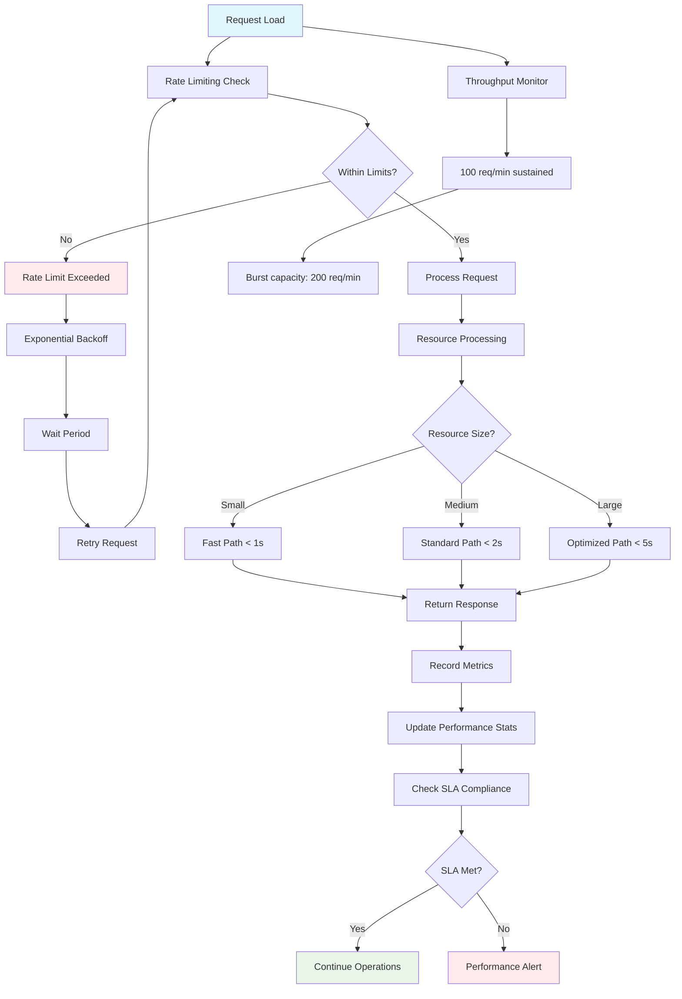
```mermaid
flowchart TD
    A[Request Load] --> B[Rate Limiting Check]
    B --> C{Within Limits?}
    C -->|No| D[Rate Limit Exceeded]
    C -->|Yes| E[Process Request]
    
    D --> F[Exponential Backoff]
    F --> G[Wait Period]
    G --> H[Retry Request]
    H --> B
    
    E --> I[Resource Processing]
    I --> J{Resource Size?}
    J -->|Small| K[Fast Path < 1s]
    J -->|Medium| L[Standard Path < 2s]
    J -->|Large| M[Optimized Path < 5s]
    
    K --> N[Return Response]
    L --> N
    M --> N
    
    %% Performance Monitoring
    N --> O[Record Metrics]
    O --> P[Update Performance Stats]
    P --> Q[Check SLA Compliance]
    Q --> R{SLA Met?}
    R -->|Yes| S[Continue Operations]
    R -->|No| T[Performance Alert]
    
    %% Throughput Limits
    A --> U[Throughput Monitor]
    U --> V[100 req/min sustained]
    V --> W[Burst capacity: 200 req/min]
    
    style A fill:#e1f5fe
    style S fill:#e8f5e8
    style D fill:#ffebee
    style T fill:#ffebee
```

#### References

**Repository Files Examined:**
- `src/cli/main.py` - Main server orchestration and startup workflow
- `src/cli/mcp_server.py` - MCP server implementation and protocol handling
- `src/cli/resource_manager.py` - Resource discovery and content retrieval workflows
- `src/cli/auth_manager.py` - Authentication workflow and session management
- `src/cli/cli_parser.py` - CLI argument parsing and command routing
- `src/cli/config.py` - Configuration management and validation workflows
- `src/cli/mcp/handlers.py` - MCP protocol request handling and routing
- `src/cli/mcp/protocol.py` - JSON-RPC 2.0 protocol implementation
- `src/cli/api/client.py` - LabArchives API integration and error handling
- `src/cli/logging_setup.py` - Dual-logger architecture and audit logging
- `src/cli/validators.py` - Validation rules and access control enforcement

**Repository Folders Analyzed:**
- `src/cli/` - Main implementation containing all workflow logic
- `src/cli/mcp/` - MCP protocol implementation with session handling
- `src/cli/api/` - API integration layer with retry and error handling
- `src/cli/commands/` - CLI command implementations and routing

**Technical Specification Sections Referenced:**
- Section 1.2: System Overview - High-level architecture and component interactions
- Section 2.1: Feature Catalog - Feature-specific workflow requirements
- Section 2.2: Functional Requirements Table - Detailed validation and performance requirements
- Section 3.7: Technology Stack Architecture - Technical implementation context

# 5. SYSTEM ARCHITECTURE

## 5.1 HIGH-LEVEL ARCHITECTURE

### 5.1.1 System Overview

The LabArchives MCP Server implements a **stateless, cloud-native architecture** designed to bridge AI systems with laboratory research data through Anthropic's Model Context Protocol (MCP). The system follows a **layered architecture pattern** with clear separation of concerns across protocol handling, authentication, API integration, and resource management.

**Architectural Principles:**
- **Stateless Design**: Zero-persistence architecture eliminates data breach risks and simplifies horizontal scaling
- **Protocol-First**: MCP compliance drives all architectural decisions, ensuring AI system compatibility
- **Security by Design**: Multi-layered security with credential isolation, audit logging, and scope enforcement
- **Cloud-Native**: Container-first deployment with Kubernetes orchestration and infrastructure as code
- **Extensibility**: Modular component design enables easy addition of new data sources and protocols

**System Boundaries:**
- **Input Interface**: JSON-RPC 2.0 over stdio communication with MCP-compatible AI clients
- **Output Interface**: Structured MCP resources with optional JSON-LD semantic enrichment
- **External Dependencies**: LabArchives REST API endpoints across multiple regions (US, AU, UK)
- **Deployment Boundaries**: Containerized deployment in AWS ECS Fargate or Kubernetes clusters

### 5.1.2 Core Components Table

| Component Name | Primary Responsibility | Key Dependencies | Integration Points |
|----------------|----------------------|------------------|-------------------|
| MCP Protocol Handler | JSON-RPC 2.0 communication and MCP session management | FastMCP framework (≥1.0.0), stdio streams | AI clients (Claude Desktop), Resource Manager |
| Authentication Manager | Dual-mode authentication with session lifecycle | HMAC-SHA256, LabArchives API, Pydantic validation | Configuration Manager, API Client |
| Resource Management Engine | Hierarchical resource discovery and content retrieval | API Client, Scope Validator, JSON-LD processing | MCP Protocol Handler, LabArchives API |
| LabArchives API Client | HTTP communication with retry and rate limiting | Requests library (≥2.31.0), Response Parser | Authentication Manager, Resource Manager |

### 5.1.3 Data Flow Description

The system implements a **unidirectional data flow pattern** optimized for read-only access:

1. **Protocol Layer**: MCP clients send JSON-RPC 2.0 requests via stdio to the Protocol Handler
2. **Authentication Flow**: Requests trigger authentication validation through the Authentication Manager using HMAC-SHA256
3. **Resource Discovery**: The Resource Manager queries the LabArchives API Client for hierarchical data (notebooks → pages → entries)
4. **Data Transformation**: API responses undergo Pydantic validation and transformation to MCP resource format
5. **Response Delivery**: Structured MCP resources return through the protocol layer to AI clients

**Integration Patterns:**
- **Request-Response**: Synchronous communication for all resource operations
- **Session-Based**: Authenticated sessions with 3600-second lifetime and automatic renewal
- **Retry with Backoff**: Exponential backoff for transient failures with configurable retry limits

**Data Transformation Points:**
- LabArchives JSON/XML → Pydantic Models → MCP Resources
- Optional JSON-LD context injection for semantic enrichment
- Metadata preservation throughout transformation pipeline

### 5.1.4 External Integration Points

| System Name | Integration Type | Data Exchange Pattern | Protocol/Format |
|-------------|-----------------|---------------------|----------------|
| LabArchives REST API | Primary data source | Request-Response | HTTPS/JSON, XML with HMAC-SHA256 |
| Claude Desktop | MCP client | Bidirectional streaming | JSON-RPC 2.0/stdio |
| AWS ECS/Fargate | Container orchestration | Event-driven | AWS SDK/JSON |
| Multi-region Endpoints | Geographic distribution | Request routing | US, AU, UK API endpoints |

## 5.2 COMPONENT DETAILS

### 5.2.1 MCP Protocol Handler

**Purpose and Responsibilities:**
- Implement complete MCP protocol specification (November 2024)
- Handle JSON-RPC 2.0 message parsing and response building
- Manage protocol version negotiation and capability exchange
- Route requests to appropriate resource operations (resources/list, resources/read)

**Technologies and Frameworks:**
- FastMCP framework (≥1.0.0) for protocol compliance
- Python asyncio for concurrent request handling
- JSON-RPC 2.0 standard implementation

**Key Interfaces:**
- `initialize(protocol_version, capabilities)` - Protocol handshake
- `resources/list(scope_filter)` - Resource discovery
- `resources/read(resource_uri)` - Content retrieval

**Scaling Considerations:**
- Stateless design enables horizontal scaling
- Memory usage <50MB per connection
- Support for 100+ concurrent requests per minute

### 5.2.2 Authentication Manager

**Purpose and Responsibilities:**
- Dual-mode authentication supporting API keys and user tokens
- Session management with 3600-second automatic renewal
- Credential sanitization for secure logging
- Authentication state validation and error handling

**Technologies and Frameworks:**
- Python's native `hashlib` and `hmac` for HMAC-SHA256
- In-memory session storage with TTL management
- Pydantic v2 for type-safe credential handling

**Key Interfaces:**
- `authenticate(credentials)` → `AuthenticationSession`
- `get_session()` → `Optional[AuthenticationSession]`
- `invalidate_session()` - Session cleanup
- `is_authenticated()` → `bool`

**Data Persistence Requirements:**
- No persistent storage (stateless design)
- In-memory session cache with automatic cleanup
- Secure credential handling without log exposure

### 5.2.3 Resource Management Engine

**Purpose and Responsibilities:**
- Hierarchical resource discovery (notebooks → pages → entries)
- Scope-aware filtering and access control enforcement
- Resource URI parsing and validation
- Content retrieval with metadata preservation

**Technologies and Frameworks:**
- Pydantic models for resource representation
- JSON-LD context support for semantic data
- URI parsing with format validation

**Key Interfaces:**
- `list_resources(scope_config)` → `List[MCPResource]`
- `read_resource(resource_uri)` → `MCPResourceContent`
- `parse_resource_uri(uri)` → `ParsedURI`
- `is_resource_in_scope(resource, scope)` → `bool`

**Scaling Considerations:**
- Optimized for 1000+ page notebooks
- Efficient filtering algorithms for scope enforcement
- Pagination support for large resource lists

### 5.2.4 LabArchives API Client

**Purpose and Responsibilities:**
- HTTP communication with LabArchives REST API endpoints
- Multi-region support (US, Australia, UK)
- Retry logic with exponential backoff
- Rate limiting and connection management

**Technologies and Frameworks:**
- Requests library (≥2.31.0) with urllib3 security enhancements
- HMAC-SHA256 authentication implementation
- Comprehensive error handling and logging

**Key Interfaces:**
- `get_notebooks()` → `List[Notebook]`
- `get_pages(notebook_id)` → `List[Page]`
- `get_entries(page_id)` → `List[Entry]`
- `authenticate_session()` → `AuthenticationResult`

**Performance Considerations:**
- Connection pooling for efficient resource utilization
- <2 second response time target (95th percentile)
- Automatic retry on transient failures

### 5.2.5 Required Diagrams

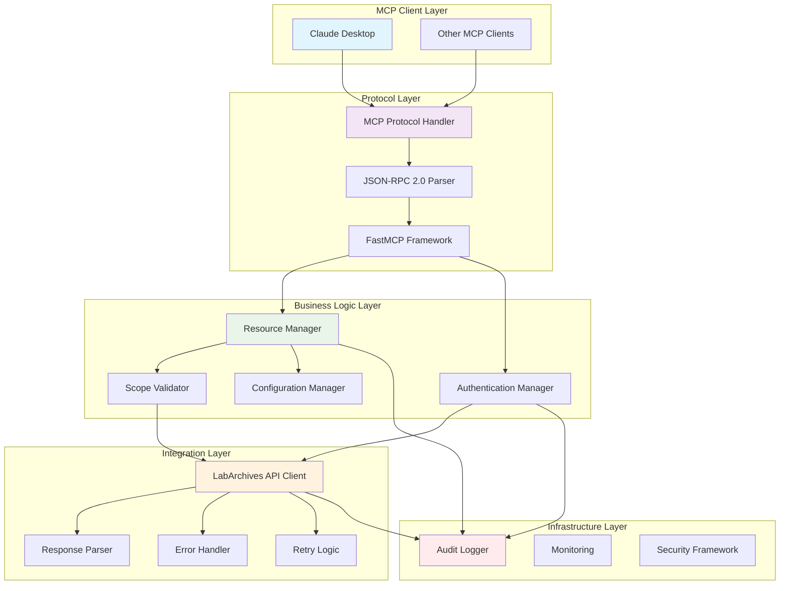
```mermaid
graph TB
    subgraph "MCP Client Layer"
        A[Claude Desktop]
        B[Other MCP Clients]
    end
    
    subgraph "Protocol Layer"
        C[MCP Protocol Handler]
        D[JSON-RPC 2.0 Parser]
        E[FastMCP Framework]
    end
    
    subgraph "Business Logic Layer"
        F[Resource Manager]
        G[Authentication Manager]
        H[Scope Validator]
        I[Configuration Manager]
    end
    
    subgraph "Integration Layer"
        J[LabArchives API Client]
        K[Response Parser]
        L[Error Handler]
        M[Retry Logic]
    end
    
    subgraph "Infrastructure Layer"
        N[Audit Logger]
        O[Monitoring]
        P[Security Framework]
    end
    
    A --> C
    B --> C
    C --> D
    D --> E
    E --> F
    E --> G
    F --> H
    F --> I
    G --> J
    H --> J
    J --> K
    J --> L
    J --> M
    F --> N
    G --> N
    J --> N
    
    style A fill:#e1f5fe
    style C fill:#f3e5f5
    style F fill:#e8f5e8
    style J fill:#fff3e0
    style N fill:#ffebee
```

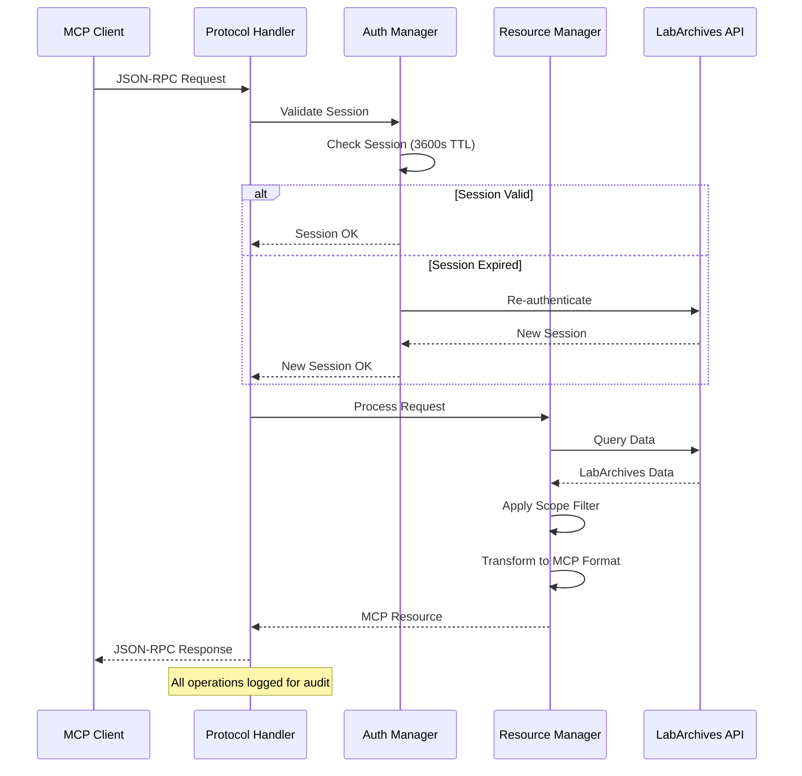
```mermaid
sequenceDiagram
    participant Client as MCP Client
    participant Handler as Protocol Handler
    participant Auth as Auth Manager
    participant Resource as Resource Manager
    participant API as LabArchives API
    
    Client->>Handler: JSON-RPC Request
    Handler->>Auth: Validate Session
    Auth->>Auth: Check Session (3600s TTL)
    
    alt Session Valid
        Auth-->>Handler: Session OK
    else Session Expired
        Auth->>API: Re-authenticate
        API-->>Auth: New Session
        Auth-->>Handler: New Session OK
    end
    
    Handler->>Resource: Process Request
    Resource->>API: Query Data
    API-->>Resource: LabArchives Data
    Resource->>Resource: Apply Scope Filter
    Resource->>Resource: Transform to MCP Format
    Resource-->>Handler: MCP Resource
    Handler-->>Client: JSON-RPC Response
    
    Note over Handler: All operations logged for audit
```

## 5.3 TECHNICAL DECISIONS

### 5.3.1 Architecture Style Decisions

**Decision: Stateless Architecture**
- **Rationale**: Enhanced security by eliminating persistent data storage and simplified horizontal scaling
- **Implementation**: Zero-persistence design with in-memory session management
- **Tradeoffs**: 
  - ✓ Simplified horizontal scaling and reduced attack surface
  - ✓ No data recovery requirements in disaster scenarios
  - ✗ No caching across sessions, requiring repeated authentication
- **Alternative Considered**: Stateful architecture with Redis cache
- **Outcome**: Stateless chosen for security and compliance benefits

**Decision: Layered Architecture Pattern**
- **Rationale**: Clear separation of concerns enabling independent component development and testing
- **Implementation**: Protocol → Business Logic → Integration → Infrastructure layers
- **Tradeoffs**:
  - ✓ Independent component development and easy testing/mocking
  - ✓ Clear dependency management and maintainability
  - ✗ Potential performance overhead from layer abstraction
- **Alternative Considered**: Monolithic design
- **Outcome**: Layered architecture provides better maintainability and testability

### 5.3.2 Communication Pattern Choices

| Pattern | Implementation | Justification | Alternatives Considered |
|---------|---------------|---------------|------------------------|
| JSON-RPC 2.0 | stdio streams | MCP protocol requirement | REST API, GraphQL |
| Request-Response | Synchronous operations | Simplicity and predictability | Event-driven, WebSockets |
| HMAC-SHA256 | Authentication headers | Proven security without token exposure | OAuth 2.0, JWT |
| Exponential Backoff | Retry mechanism | Handles transient failures gracefully | Circuit breaker, fixed delay |

### 5.3.3 Technology Stack Decisions

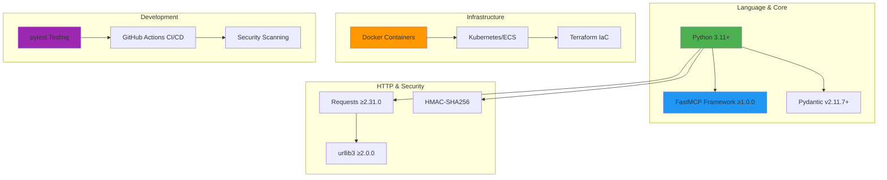
```mermaid
graph TB
    subgraph "Language & Core"
        A[Python 3.11+]
        B[FastMCP Framework ≥1.0.0]
        C[Pydantic v2.11.7+]
    end
    
    subgraph "HTTP & Security"
        D[Requests ≥2.31.0]
        E[urllib3 ≥2.0.0]
        F[HMAC-SHA256]
    end
    
    subgraph "Infrastructure"
        G[Docker Containers]
        H[Kubernetes/ECS]
        I[Terraform IaC]
    end
    
    subgraph "Development"
        J[pytest Testing]
        K[GitHub Actions CI/CD]
        L[Security Scanning]
    end
    
    A --> B
    A --> C
    A --> D
    D --> E
    A --> F
    G --> H
    H --> I
    J --> K
    K --> L
    
    style A fill:#4CAF50
    style B fill:#2196F3
    style G fill:#FF9800
    style J fill:#9C27B0
```

## 5.4 CROSS-CUTTING CONCERNS

### 5.4.1 Monitoring and Observability

**Monitoring Strategy:**
- **Application Metrics**: Response time, throughput, error rates, authentication success rates
- **Infrastructure Metrics**: Container health, resource utilization, network connectivity
- **Business Metrics**: Resource discovery performance, scope enforcement effectiveness
- **Real-time Alerting**: Critical error conditions and performance degradation

**Key Performance Indicators:**
- Response time (p95) < 2 seconds
- Authentication success rate > 99%
- System uptime > 99.9%
- Memory usage < 100MB per instance

### 5.4.2 Logging and Tracing Strategy

**Dual-Logger Architecture:**
1. **Operational Logger** (`labarchives_mcp`)
   - Application events, performance metrics, error conditions
   - 10MB rotation with 5 backup files

2. **Audit Logger** (`labarchives_mcp.audit`)
   - All authentication events, resource access operations, configuration changes
   - 50MB rotation with 10 backup files for compliance retention

**Structured Logging Format:**
```json
{
  "timestamp": "2024-01-15T10:30:45.123Z",
  "level": "INFO",
  "component": "mcp.resources",
  "message": "Resource retrieved successfully",
  "context": {
    "resource_uri": "labarchives://notebook/123",
    "user_id": "sanitized",
    "operation": "read_resource",
    "duration_ms": 145,
    "scope_applied": true
  }
}
```

### 5.4.3 Error Handling Patterns

```mermaid
flowchart TD
    A[Error Occurrence] --> B{Error Classification}
    
    B -->|Configuration| C[Configuration Error<br/>Exit Code 1]
    B -->|Authentication| D[Authentication Error<br/>Exit Code 2]
    B -->|Startup| E[Startup Error<br/>Exit Code 3]
    B -->|Protocol| F[JSON-RPC Error Response]
    B -->|API| G[API Error Handler]
    
    G --> H{Is Retryable?}
    H -->|Yes| I[Exponential Backoff<br/>Max 3 Retries]
    H -->|No| J[Permanent Failure]
    
    I --> K{Success?}
    K -->|Yes| L[Continue Operation]
    K -->|No| M[Retry Exhausted]
    
    F --> N[Structured Error Response]
    J --> N
    M --> N
    
    style A fill:#ffebee
    style L fill:#e8f5e8
    style N fill:#fff3e0
```

### 5.4.4 Authentication and Authorization Framework

**Multi-layered Security Architecture:**
- **Authentication Layer**: HMAC-SHA256 with API keys or user tokens
- **Session Management**: 3600-second sessions with automatic renewal
- **Authorization Layer**: Scope-based access control with configurable limitations
- **Audit Layer**: Complete authentication and authorization event logging

**Scope Enforcement Mechanisms:**
- Notebook ID filtering for precise access control
- Notebook name pattern matching for flexible governance
- Folder path restrictions for hierarchical access management
- Resource-level validation at every access point

### 5.4.5 Performance Requirements and SLAs

| Metric Category | Target Value | Measurement Method | Monitoring Tool |
|----------------|-------------|-------------------|-----------------|
| Response Time (p95) | < 2 seconds | Performance monitoring | Prometheus/Grafana |
| Authentication Time | < 1 second | Audit log analysis | CloudWatch |
| Startup Time | < 2 seconds | Container health checks | Kubernetes probes |
| Memory Usage | < 100MB | Container metrics | Docker stats |
| Throughput | 100 req/min sustained | Load testing | Artillery/JMeter |
| System Uptime | 99.9% | Availability monitoring | Pingdom/UptimeRobot |

### 5.4.6 Disaster Recovery Procedures

**Recovery Strategy:**
- **Stateless Design Advantage**: No data recovery required due to zero-persistence architecture
- **Configuration Recovery**: Git-based configuration management with Infrastructure as Code
- **Multi-region Failover**: Automatic failover to alternative LabArchives endpoints
- **Container Recovery**: Kubernetes automatic restart and health checking

**Recovery Time Objectives:**
- RTO: < 5 minutes for container restart
- RPO: 0 seconds (no data loss possible due to stateless design)
- MTTR: < 10 minutes for configuration issues

**Disaster Recovery Scenarios:**
1. **Container Failure**: Kubernetes automatic restart with health probes
2. **Configuration Corruption**: Restore from Git repository and redeploy
3. **API Endpoint Failure**: Automatic failover to alternative region
4. **Authentication Service Failure**: Credential refresh and session re-establishment

#### References

**Repository Files Examined:**
- `src/cli/mcp/` - MCP protocol implementation using FastMCP framework
- `src/cli/auth_manager.py` - Authentication manager with HMAC-SHA256 and session management
- `src/cli/resource_manager.py` - Resource management engine with hierarchical navigation
- `src/cli/api/` - LabArchives API client implementation with retry logic
- `src/cli/logging_setup.py` - Dual-logger architecture for operational and audit logging
- `src/cli/validators.py` - Scope validation and access control mechanisms
- `src/cli/commands/` - CLI interface with comprehensive configuration management
- `infrastructure/terraform/` - Infrastructure as Code for cloud deployment
- `src/cli/Dockerfile` - Container configuration with security hardening

**Repository Folders Analyzed:**
- `src/cli/` - Core implementation with layered architecture
- `infrastructure/` - Deployment automation and cloud infrastructure
- `.github/workflows/` - CI/CD pipeline with security scanning and automated testing

**Technical Specification Sections Referenced:**
- Section 1.2: System Overview - Architectural principles and system boundaries
- Section 2.1: Feature Catalog - Feature-specific architectural requirements
- Section 3.2: Frameworks & Libraries - Technology stack decisions and dependencies
- Section 3.7: Technology Stack Architecture - Infrastructure and deployment architecture
- Section 4.2: Technical Implementation - State management and error handling patterns

# 6. SYSTEM COMPONENTS DESIGN

## 6.1 CORE SERVICES ARCHITECTURE

### 6.1.1 Architecture Applicability Assessment

**Core Services Architecture is not applicable for this system** because the LabArchives MCP Server implements a **monolithic architecture with layered design patterns** rather than a distributed services architecture. The system does not require microservices, service mesh, or distinct service components that would necessitate core services architecture patterns.

#### 6.1.1.1 Architectural Pattern Analysis

The LabArchives MCP Server follows a **stateless monolithic architecture** with the following characteristics:

- **Single Deployment Unit**: One container image (`labarchives-mcp`) containing all business logic
- **Internal Module Communication**: Components communicate through direct function calls within the same Python process
- **No Service Boundaries**: All functionality exists within a single application namespace (`src/cli/`)
- **Shared Runtime**: Components share the same memory space, process, and execution context

#### 6.1.1.2 Evidence from Codebase Structure

| Component Type | Implementation | Location | Communication Pattern |
|---------------|----------------|----------|----------------------|
| Protocol Handler | Python module | `src/cli/mcp/` | Direct function calls |
| Authentication Manager | Python class | `src/cli/auth_manager.py` | Method invocation |
| Resource Manager | Python class | `src/cli/resource_manager.py` | Object composition |
| API Client | Python module | `src/cli/api/` | Import and instantiation |

### 6.1.2 Monolithic Architecture Design

#### 6.1.2.1 Layered Architecture Pattern

The system implements a **four-layer architecture pattern** within a single monolithic application:

```mermaid
graph TB
    subgraph "Single Application Container"
        subgraph "Layer 1: Protocol Layer"
            A[MCP Protocol Handler]
            B[JSON-RPC 2.0 Parser]
            C[FastMCP Framework]
        end
        
        subgraph "Layer 2: Business Logic Layer"
            D[Resource Manager]
            E[Authentication Manager]
            F[Scope Validator]
            G[Configuration Manager]
        end
        
        subgraph "Layer 3: Integration Layer"
            H[LabArchives API Client]
            I[Response Parser]
            J[Error Handler]
            K[Retry Logic]
        end
        
        subgraph "Layer 4: Infrastructure Layer"
            L[Audit Logger]
            M[Monitoring]
            N[Security Framework]
        end
    end
    
    subgraph "External Systems"
        O[LabArchives API]
        P[MCP Clients]
    end
    
    A --> D
    B --> E
    D --> H
    E --> H
    H --> O
    P --> A
    
    style A fill:#e1f5fe
    style D fill:#e8f5e8
    style H fill:#fff3e0
    style L fill:#ffebee
```

#### 6.1.2.2 Component Integration Patterns

**Internal Communication:**
- **Direct Method Calls**: Components communicate through synchronous method invocation
- **Object Composition**: Higher-level components inject lower-level dependencies
- **Shared Context**: All components share the same execution context and memory space
- **Exception Propagation**: Errors bubble up through the call stack naturally

**External Communication:**
- **Inbound**: JSON-RPC 2.0 over stdio from MCP clients
- **Outbound**: HTTPS requests to LabArchives API endpoints
- **No Service Mesh**: Direct network communication without intermediate proxies

### 6.1.3 Scalability Architecture

#### 6.1.3.1 Horizontal Scaling Design

The system achieves scalability through **stateless container replication** rather than service distribution:

```mermaid
graph TB
    subgraph "Load Balancer Layer"
        A[Container Orchestrator]
        B[Kubernetes/ECS]
    end
    
    subgraph "Application Tier"
        C[MCP Server Instance 1]
        D[MCP Server Instance 2]
        E[MCP Server Instance N]
    end
    
    subgraph "External Dependencies"
        F[LabArchives API US]
        G[LabArchives API AU]
        H[LabArchives API UK]
    end
    
    A --> C
    A --> D
    A --> E
    
    C --> F
    D --> G
    E --> H
    
    style C fill:#e8f5e8
    style D fill:#e8f5e8
    style E fill:#e8f5e8
```

#### 6.1.3.2 Scaling Characteristics

| Scaling Dimension | Implementation | Rationale | Monitoring Metrics |
|-------------------|---------------|-----------|-------------------|
| **Horizontal Scaling** | Container replication | Stateless design enables unlimited instances | Instance count, CPU utilization |
| **Vertical Scaling** | Container resource limits | Memory < 100MB, CPU < 0.5 cores | Memory usage, response time |
| **Geographic Scaling** | Multi-region API endpoints | Reduced latency through regional failover | Geographic response times |
| **Auto-scaling Triggers** | CPU > 70%, Memory > 80% | Predictive scaling based on resource metrics | Scaling events, threshold breaches |

### 6.1.4 Resilience and Fault Tolerance

#### 6.1.4.1 Stateless Resilience Patterns

The monolithic architecture achieves resilience through **stateless design principles**:

**Fault Tolerance Mechanisms:**
- **Zero-Persistence Design**: No data loss possible due to absence of persistent state
- **Automatic Restart**: Container orchestration handles process failures
- **Session Re-establishment**: Authentication sessions recreate automatically
- **Multi-region Failover**: Transparent failover to alternative API endpoints

#### 6.1.4.2 Resilience Implementation

```mermaid
sequenceDiagram
    participant Client as MCP Client
    participant Instance as MCP Server Instance
    participant Orchestrator as Container Orchestrator
    participant API as LabArchives API
    
    Client->>Instance: Request
    Instance->>API: API Call
    
    alt API Failure
        API-->>Instance: Timeout/Error
        Instance->>Instance: Retry with Backoff
        Instance->>API: Retry Request
        API-->>Instance: Success
    else Instance Failure
        Instance-->>Orchestrator: Health Check Failed
        Orchestrator->>Orchestrator: Restart Container
        Orchestrator->>Client: Route to New Instance
    end
    
    Instance-->>Client: Response
```

#### 6.1.4.3 Disaster Recovery Procedures

| Recovery Scenario | Recovery Time | Procedure | Automation Level |
|------------------|---------------|-----------|------------------|
| **Container Failure** | < 30 seconds | Kubernetes restart policy | Fully automated |
| **Configuration Error** | < 5 minutes | Git rollback and redeploy | Semi-automated |
| **API Endpoint Failure** | < 2 seconds | Automatic region failover | Fully automated |
| **Authentication Issues** | < 1 second | Session renewal and retry | Fully automated |

### 6.1.5 Alternative Architecture Rationale

#### 6.1.5.1 Microservices Architecture Evaluation

**Why microservices architecture was not chosen:**

- **Insufficient Complexity**: The application domain does not justify service decomposition
- **Single Data Source**: All functionality centers around LabArchives API integration
- **Tight Coupling**: Components have natural dependencies that would create chatty inter-service communication
- **Operational Overhead**: Service discovery, circuit breakers, and distributed tracing would add complexity without benefits

#### 6.1.5.2 Monolithic Architecture Benefits

**Advantages of the chosen architecture:**

- **Simplified Deployment**: Single container deployment reduces operational complexity
- **Easier Testing**: All components testable within the same process
- **Better Performance**: No network latency between components
- **Reduced Resource Usage**: Single runtime environment minimizes memory footprint
- **Atomic Operations**: All operations complete within a single transaction boundary

### 6.1.6 Performance and Capacity Planning

#### 6.1.6.1 Capacity Planning Guidelines

| Resource Category | Target Allocation | Scaling Trigger | Maximum Capacity |
|------------------|-------------------|-----------------|------------------|
| **Memory** | 100MB per instance | 80% utilization | 512MB absolute limit |
| **CPU** | 0.5 cores per instance | 70% utilization | 2 cores maximum |
| **Network** | 10 Mbps per instance | 60% utilization | 100 Mbps burst |
| **Connections** | 100 concurrent requests | 80 active connections | 500 connection limit |

#### 6.1.6.2 Performance Optimization Techniques

- **Connection Pooling**: Reuse HTTP connections to LabArchives API
- **Response Caching**: In-memory caching for frequently accessed resources
- **Lazy Loading**: Load resources only when requested
- **Efficient Serialization**: Optimized JSON parsing and response building
- **Memory Management**: Automatic garbage collection and resource cleanup

### 6.1.7 References

#### 6.1.7.1 Technical Specification Sections

- **5.1 HIGH-LEVEL ARCHITECTURE** - Stateless, layered architecture pattern confirmation
- **5.2 COMPONENT DETAILS** - Internal component structure and communication patterns
- **5.3 TECHNICAL DECISIONS** - Architectural decision rationale and alternatives considered
- **5.4 CROSS-CUTTING CONCERNS** - Monitoring, logging, and operational patterns

#### 6.1.7.2 Repository Evidence

**Files Examined:**
- `src/cli/mcp/` - MCP protocol implementation within single application
- `src/cli/auth_manager.py` - Authentication component as internal module
- `src/cli/resource_manager.py` - Resource management as internal class
- `src/cli/api/` - API client implementation as internal module
- `infrastructure/kubernetes/deployment.yaml` - Single container deployment configuration
- `infrastructure/kubernetes/service.yaml` - Single service endpoint configuration

**Folders Analyzed:**
- `src/cli/` - Complete monolithic application implementation
- `infrastructure/` - Container orchestration and deployment automation

## 6.2 DATABASE DESIGN

### 6.2.1 Database Architecture Overview

#### 6.2.1.1 Zero-Persistence Primary Architecture

The LabArchives MCP Server implements a **zero-persistence architecture** as its primary design philosophy, fundamentally eliminating traditional database requirements for core functionality. This architectural decision prioritizes security, compliance, and operational simplicity over persistent data storage.

**Core Architectural Principles:**
- **Stateless Design**: No persistent data storage required for primary operations
- **Security by Design**: Eliminates data breach risks by avoiding sensitive data storage
- **Compliance Alignment**: Supports SOC2, ISO 27001, HIPAA, and GDPR requirements through data minimization
- **Operational Simplicity**: Reduces system complexity and maintenance overhead

**Current Implementation Status:**
- **Database Integration**: Not implemented in application code
- **Data Persistence**: File-based audit logging only
- **Storage Dependencies**: Zero persistent storage requirements

#### 6.2.1.2 Optional PostgreSQL Infrastructure

An **optional PostgreSQL database** is available through AWS RDS for enterprise deployments requiring audit log persistence. This infrastructure is provisioned via Terraform modules but remains **dormant until explicitly enabled**.

**Enterprise Database Features:**
- **Cloud Provider**: AWS RDS PostgreSQL
- **Deployment Control**: Configurable via `var.db_enabled` Terraform variable
- **Primary Use Case**: Audit log persistence for enterprise compliance requirements
- **Activation Status**: Infrastructure available but not integrated into application logic

```mermaid
graph TB
    subgraph "Primary Architecture (Active)"
        A[MCP Client] --> B[Protocol Handler]
        B --> C[Authentication Manager]
        C --> D[Resource Manager]
        D --> E[LabArchives API]
        F[Audit Logger] --> G[Local File System]
    end
    
    subgraph "Optional Database Infrastructure (Dormant)"
        H[(PostgreSQL RDS)]
        I[Database Configuration]
        J[Audit Persistence Module]
        K[Schema Management]
    end
    
    subgraph "Enterprise Integration Path"
        L[Application Code Enhancement]
        M[Database Integration Layer]
        N[Audit Log Persistence]
    end
    
    F -.-> L
    L -.-> M
    M -.-> H
    J -.-> H
    K -.-> H
    
    style A fill:#e1f5fe
    style H fill:#ffebee
    style L fill:#fff3e0
    style M fill:#fff3e0
    style N fill:#fff3e0
```

### 6.2.2 Schema Design

#### 6.2.2.1 Current Schema Architecture

**Database Schema is not applicable to the current system** due to the zero-persistence architecture. No entity relationships, data models, or persistent structures exist in the active implementation.

#### 6.2.2.2 Planned Enterprise Schema Structure

The optional PostgreSQL infrastructure supports a **compliance-focused schema design** optimized for audit log persistence:

**Proposed Entity Structure:**
```mermaid
erDiagram
    AUDIT_EVENTS {
        uuid id PK
        timestamp created_at
        string event_type
        string user_id
        string resource_type
        string resource_id
        json request_data
        json response_data
        string source_ip
        string user_agent
        string session_id
        string compliance_metadata
    }
    
    AUDIT_SESSIONS {
        uuid id PK
        string session_id UK
        string user_id
        timestamp start_time
        timestamp end_time
        string authentication_type
        string client_version
        json session_metadata
    }
    
    COMPLIANCE_LOGS {
        uuid id PK
        string compliance_type
        timestamp log_date
        string data_classification
        string retention_period
        json compliance_metadata
        string audit_trail_reference
    }
    
    AUDIT_EVENTS }|--|| AUDIT_SESSIONS : belongs_to
    AUDIT_EVENTS }|--|| COMPLIANCE_LOGS : references
```

**Schema Design Principles:**
- **Audit-Centric**: Optimized for comprehensive audit trail capture
- **Compliance-First**: Structured for regulatory reporting requirements
- **Metadata-Rich**: Extensive metadata capture for forensic analysis
- **Scalable Structure**: Designed for high-volume audit log ingestion

#### 6.2.2.3 Indexing Strategy

**Planned Index Architecture:**
```sql
-- Primary audit query patterns
CREATE INDEX idx_audit_events_timestamp ON audit_events(created_at DESC);
CREATE INDEX idx_audit_events_user_id ON audit_events(user_id);
CREATE INDEX idx_audit_events_resource_type ON audit_events(resource_type);
CREATE INDEX idx_audit_events_event_type ON audit_events(event_type);

-- Session-based queries
CREATE INDEX idx_audit_sessions_user_id ON audit_sessions(user_id);
CREATE INDEX idx_audit_sessions_start_time ON audit_sessions(start_time DESC);

-- Compliance reporting queries
CREATE INDEX idx_compliance_logs_type_date ON compliance_logs(compliance_type, log_date DESC);
CREATE INDEX idx_compliance_logs_retention ON compliance_logs(retention_period);
```

#### 6.2.2.4 Partitioning Approach

**Time-Based Partitioning Strategy:**
- **Partition Key**: `created_at` timestamp column
- **Partition Interval**: Monthly partitions for audit events
- **Retention Management**: Automated partition dropping for expired data
- **Query Optimization**: Partition pruning for time-range queries

### 6.2.3 Data Management

#### 6.2.3.1 Current Data Management

**File-Based Audit Management:**
- **Storage Format**: JSON-LD structured audit records
- **Rotation Strategy**: 50MB files with 10 backup retention
- **Management**: Automatic log rotation and cleanup
- **Persistence**: Local file system only

#### 6.2.3.2 Database Migration Procedures

**Migration Framework Design:**
```mermaid
graph TB
    A[Migration Controller] --> B[Schema Versioning]
    B --> C[Migration Scripts]
    C --> D[Validation Tests]
    D --> E[Rollback Procedures]
    
    subgraph "Migration Types"
        F[Initial Schema Creation]
        G[Audit Schema Updates]
        H[Index Optimization]
        I[Partition Management]
    end
    
    C --> F
    C --> G
    C --> H
    C --> I
    
    style A fill:#e8f5e8
    style F fill:#fff3e0
    style G fill:#fff3e0
    style H fill:#fff3e0
    style I fill:#fff3e0
```

**Migration Implementation:**
- **Version Control**: Database schema versioning aligned with application releases
- **Automated Testing**: Migration validation in staging environments
- **Rollback Strategy**: Automated rollback procedures for failed migrations
- **Zero-Downtime**: Blue-green deployment compatible migration patterns

#### 6.2.3.3 Data Archival Policies

**Proposed Archival Strategy:**
- **Retention Period**: 7 years for compliance requirements
- **Archival Trigger**: Automated archival after 2 years of active storage
- **Archive Storage**: AWS S3 with intelligent tiering
- **Retrieval Process**: On-demand archive restoration for compliance queries

### 6.2.4 Compliance Considerations

#### 6.2.4.1 Data Retention Rules

**Regulatory Compliance Framework:**

| Compliance Standard | Retention Period | Data Categories | Implementation Status |
|-------------------|------------------|-----------------|---------------------|
| SOC 2 Type II | 1 year minimum | Audit logs, access records | Infrastructure ready |
| ISO 27001 | 3 years | Security events, access logs | Infrastructure ready |
| HIPAA | 6 years | PHI access logs, audit trails | Infrastructure ready |
| GDPR | 7 years | Data access logs, consent records | Infrastructure ready |

#### 6.2.4.2 Backup and Fault Tolerance

**RDS Backup Configuration:**
- **Automated Backups**: 7-35 day configurable retention period
- **Point-in-Time Recovery**: Continuous backup log archival
- **Multi-AZ Deployment**: Automatic failover for high availability
- **Cross-Region Replication**: Disaster recovery backup strategy

**Fault Tolerance Architecture:**
```mermaid
graph TB
    subgraph "Primary Region"
        A[Primary RDS Instance]
        B[Automated Backups]
        C[Multi-AZ Standby]
    end
    
    subgraph "Secondary Region"
        D[Read Replica]
        E[Cross-Region Backups]
        F[Disaster Recovery]
    end
    
    A --> B
    A --> C
    A --> D
    B --> E
    C --> F
    
    style A fill:#e8f5e8
    style C fill:#fff3e0
    style D fill:#ffebee
```

#### 6.2.4.3 Privacy Controls

**Data Protection Mechanisms:**
- **Encryption at Rest**: AWS KMS encryption for all stored data
- **Encryption in Transit**: SSL/TLS for all database connections
- **Access Control**: IAM-based authentication with principle of least privilege
- **Audit Trail**: Comprehensive logging of all database access patterns

#### 6.2.4.4 Access Controls

**Database Security Framework:**
- **Authentication**: AWS IAM database authentication integration
- **Authorization**: Role-based access control (RBAC) implementation
- **Network Security**: VPC isolation with security group restrictions
- **Connection Security**: SSL certificate validation and encrypted connections

### 6.2.5 Performance Optimization

#### 6.2.5.1 Query Optimization Patterns

**Audit Query Optimization:**
```sql
-- Optimized audit trail queries
SELECT event_type, COUNT(*) as event_count
FROM audit_events 
WHERE created_at >= CURRENT_DATE - INTERVAL '30 days'
  AND user_id = $1
GROUP BY event_type
ORDER BY event_count DESC;

-- Efficient session analysis
SELECT s.user_id, s.session_id, COUNT(e.id) as event_count
FROM audit_sessions s
LEFT JOIN audit_events e ON s.session_id = e.session_id
WHERE s.start_time >= CURRENT_DATE - INTERVAL '7 days'
GROUP BY s.user_id, s.session_id
ORDER BY event_count DESC;
```

#### 6.2.5.2 Caching Strategy

**Database Caching Architecture:**
- **Query Result Caching**: Frequently accessed audit summaries
- **Connection Pooling**: Optimized database connection management
- **Read Replica Utilization**: Read-heavy queries directed to replicas
- **Application-Level Caching**: Redis integration for query result caching

#### 6.2.5.3 Connection Pooling

**Connection Management Configuration:**
```python
# Proposed connection pool configuration
DATABASE_CONFIG = {
    'pool_size': 20,
    'max_overflow': 30,
    'pool_timeout': 30,
    'pool_recycle': 3600,
    'pool_pre_ping': True,
    'echo': False
}
```

#### 6.2.5.4 Performance Monitoring

**Database Performance Metrics:**
- **Performance Insights**: AWS RDS Performance Insights integration
- **CloudWatch Metrics**: CPU, memory, and connection monitoring
- **Custom Metrics**: Application-specific performance indicators
- **Alerting**: Proactive performance degradation alerts

### 6.2.6 Replication and High Availability

#### 6.2.6.1 Replication Architecture

```mermaid
graph TB
    subgraph "Primary Region (us-east-1)"
        A[Primary RDS Instance]
        B[Multi-AZ Standby]
        C[Performance Insights]
    end
    
    subgraph "Secondary Region (us-west-2)"
        D[Read Replica]
        E[Cross-Region Backups]
    end
    
    subgraph "Monitoring & Management"
        F[CloudWatch Alarms]
        G[AWS Secrets Manager]
        H[Parameter Groups]
    end
    
    A --> B
    A --> D
    A --> C
    B --> E
    F --> A
    G --> A
    H --> A
    
    style A fill:#e8f5e8
    style B fill:#fff3e0
    style D fill:#ffebee
```

#### 6.2.6.2 High Availability Configuration

**Availability Features:**
- **Multi-AZ Deployment**: Automatic failover within 60 seconds
- **Read Replicas**: Geographic distribution for read scalability
- **Automated Recovery**: Self-healing infrastructure components
- **Monitoring Integration**: Comprehensive health checking and alerting

### 6.2.7 Data Flow Architecture

#### 6.2.7.1 Current Data Flow (Zero-Persistence)

```mermaid
sequenceDiagram
    participant Client as MCP Client
    participant Server as MCP Server
    participant API as LabArchives API
    participant Logger as Audit Logger
    participant FS as File System
    
    Client->>Server: JSON-RPC Request
    Server->>API: API Request
    API-->>Server: Response Data
    Server->>Logger: Log Audit Event
    Logger->>FS: Write to Local File
    Server-->>Client: MCP Response
    
    Note over FS: No Database Interaction
    Note over Logger: File-based Persistence Only
```

#### 6.2.7.2 Future Enterprise Data Flow

```mermaid
sequenceDiagram
    participant Client as MCP Client
    participant Server as MCP Server
    participant API as LabArchives API
    participant Logger as Audit Logger
    participant DB as PostgreSQL RDS
    
    Client->>Server: JSON-RPC Request
    Server->>API: API Request
    API-->>Server: Response Data
    Server->>Logger: Log Audit Event
    Logger->>DB: Insert Audit Record
    DB-->>Logger: Confirmation
    Server-->>Client: MCP Response
    
    Note over DB: Enterprise Audit Persistence
    Note over Logger: Database Integration Layer
```

### 6.2.8 Implementation Roadmap

#### 6.2.8.1 Database Integration Phases

| Phase | Description | Timeline | Dependencies |
|-------|-------------|----------|-------------|
| Phase 1 | Database infrastructure activation | 1-2 weeks | Terraform deployment |
| Phase 2 | Application database integration | 2-4 weeks | Database connection layer |
| Phase 3 | Audit log persistence implementation | 1-2 weeks | Schema deployment |
| Phase 4 | Performance optimization and monitoring | 2-3 weeks | Metrics integration |

#### 6.2.8.2 Migration Strategy

**Zero-Downtime Migration Approach:**
- **Parallel Implementation**: Database integration alongside existing file-based logging
- **Gradual Transition**: Configurable toggle between file and database persistence
- **Validation Period**: Extended testing period with dual persistence
- **Cutover Strategy**: Seamless transition to database-only persistence

### 6.2.9 References

#### 6.2.9.1 Infrastructure Components

**Files Examined:**
- `infrastructure/terraform/modules/rds/main.tf` - RDS instance provisioning and configuration
- `infrastructure/terraform/modules/rds/variables.tf` - Database configuration parameters
- `infrastructure/terraform/modules/rds/outputs.tf` - Database connection outputs
- `infrastructure/terraform/main.tf` - Root module with conditional RDS enablement
- `src/cli/logging_setup.py` - Current file-based audit logging implementation

**Folders Analyzed:**
- `infrastructure/terraform/modules/rds/` - Complete RDS module implementation
- `src/cli/` - Application source code structure
- `src/cli/api/` - API integration layer

#### 6.2.9.2 Technical Specification References

- **Section 3.5 DATABASES & STORAGE** - Data architecture philosophy and storage components
- **Section 5.1 HIGH-LEVEL ARCHITECTURE** - System overview and architectural principles
- **Section 6.1 CORE SERVICES ARCHITECTURE** - Monolithic architecture design patterns

## 6.3 INTEGRATION ARCHITECTURE

### 6.3.1 API DESIGN

#### 6.3.1.1 Protocol Specifications

The LabArchives MCP Server implements a dual-protocol architecture that bridges the Model Context Protocol (MCP) with LabArchives REST API endpoints. The system operates as a protocol translation layer, converting JSON-RPC 2.0 requests into authenticated HTTPS API calls.

**Primary Protocol Stack:**
- **MCP Protocol Layer**: JSON-RPC 2.0 over stdio for AI client communication
- **External API Layer**: HTTPS REST API with regional endpoint support
- **Data Exchange Format**: JSON with optional XML parsing for LabArchives compatibility
- **Resource Identification**: Custom URI scheme `labarchives://` for hierarchical resource addressing

**MCP Protocol Implementation:**
The system implements the MCP specification with the following supported methods:
- `initialize`: Protocol capability negotiation and session establishment
- `resources/list`: Hierarchical resource discovery with scope-aware filtering
- `resources/read`: Content retrieval with metadata preservation and JSON-LD context support

#### 6.3.1.2 Authentication Methods

The authentication architecture implements a sophisticated dual-mode system that supports both permanent API credentials and temporary user tokens while maintaining strict security standards.

| Authentication Mode | Credential Type | Session Lifetime | Security Method |
|-------------------|-----------------|------------------|-----------------|
| API Key Authentication | access_key_id + access_secret | 3600 seconds | HMAC-SHA256 signature |
| User Token Authentication | username + temporary_token | 3600 seconds | Token-based validation |
| Session Management | Encrypted session store | Auto-renewal | Secure credential isolation |

**Authentication Flow Process:**
1. **Credential Validation**: Authentication Manager validates provided credentials against configured authentication mode
2. **Session Establishment**: Successful authentication creates a 3600-second session with automatic renewal capability
3. **Request Signing**: All API requests utilize HMAC-SHA256 signatures for tamper-proof communication
4. **Credential Isolation**: Authentication tokens never persist to disk or appear in log files

#### 6.3.1.3 Authorization Framework

The authorization system implements a scope-based access control model that provides granular data access restrictions aligned with organizational security policies.

**Scope Configuration Types:**
- **No Scope**: Unrestricted access to all user-accessible notebooks and content
- **Notebook ID Scope**: Access restricted to specific notebook identifier
- **Notebook Name Scope**: Access restricted to notebook matching specified name
- **Folder Path Scope**: Access restricted to specific folder hierarchy path

**Authorization Enforcement:**
Every resource access request undergoes scope validation before content retrieval. The Resource Manager evaluates each request against configured scope parameters and denies access to resources outside authorized boundaries. All authorization decisions generate audit log entries for compliance tracking.

#### 6.3.1.4 Rate Limiting Strategy

The system implements intelligent rate limiting with exponential backoff to ensure reliable operation under varying load conditions while respecting LabArchives API constraints.

**Rate Limiting Configuration:**
- **Base Delay**: 2-second initial backoff period
- **Maximum Retries**: 3 attempts per request
- **Backoff Pattern**: Exponential increase with jitter
- **Trigger Conditions**: HTTP 429 status codes and transient network errors
- **Sustained Throughput**: 100 requests per minute capacity

**Adaptive Behavior:**
The API client monitors response patterns and automatically adjusts request timing to maintain optimal throughput while avoiding rate limit violations. Failed requests enter a retry queue with exponential backoff, ensuring graceful degradation during high-load periods.

#### 6.3.1.5 Versioning Approach

The versioning strategy ensures backward compatibility while enabling progressive enhancement of integration capabilities.

**Version Management:**
- **API Version**: Embedded in LabArchives API base URL path structure
- **MCP Protocol Version**: Negotiated during initialization handshake
- **Resource Schema Version**: Semantic versioning for MCP resource structure
- **Compatibility Strategy**: Read-only operations ensure no breaking changes

#### 6.3.1.6 Documentation Standards

API documentation follows comprehensive standards that ensure clear understanding of integration capabilities and constraints.

**Documentation Structure:**
- **OpenAPI 3.0 Specification**: Machine-readable API contract for MCP endpoints
- **Protocol Compliance**: Full MCP specification adherence with capability declarations
- **Resource Schema**: JSON Schema definitions for all MCP resource types
- **Integration Examples**: Complete workflow demonstrations with error handling

### 6.3.2 MESSAGE PROCESSING

#### 6.3.2.1 Event Processing Patterns

The LabArchives MCP Server implements a synchronous request-response pattern optimized for real-time AI interaction. The system operates as a stateless translation layer without event streaming or asynchronous processing capabilities.

**Processing Architecture:**
- **Synchronous Flow**: All requests processed immediately with direct response
- **Stateless Design**: No persistent state between requests
- **Request Isolation**: Each request handled independently with complete context
- **Error Propagation**: Immediate error responses with structured error information

```mermaid
graph TB
    A[MCP Request] --> B[JSON-RPC Parser]
    B --> C[Request Validator]
    C --> D[Method Router]
    D --> E[Authentication Check]
    E --> F[Business Logic Handler]
    F --> G[Response Formatter]
    G --> H[MCP Response]
    
    C --> I[Parse Error]
    E --> J[Auth Error]
    F --> K[Business Error]
    
    I --> L[Error Response]
    J --> L
    K --> L
    L --> H
    
    style A fill:#e1f5fe
    style H fill:#e8f5e8
    style I fill:#ffebee
    style J fill:#ffebee
    style K fill:#ffebee
```

#### 6.3.2.2 Message Queue Architecture

The system does not implement traditional message queue architecture due to its synchronous, stateless design. Instead, it utilizes stdio-based communication with immediate processing.

**Communication Pattern:**
- **Direct stdio**: JSON-RPC 2.0 messages over standard input/output streams
- **Immediate Processing**: No queue persistence or deferred processing
- **Single-threaded**: Sequential request processing for simplicity and reliability
- **Memory-based**: All operation state maintained in memory during request lifecycle

#### 6.3.2.3 Stream Processing Design

Stream processing is implemented through real-time resource discovery and content retrieval rather than traditional stream processing frameworks.

**Resource Streaming Model:**
- **Hierarchical Discovery**: Progressive resource tree traversal
- **Content Streaming**: Large content items retrieved in managed chunks
- **Metadata Streaming**: Resource metadata provided before content retrieval
- **Error Stream**: Structured error information for failed operations

#### 6.3.2.4 Batch Processing Flows

The system supports batch operations through efficient resource list processing and bulk content retrieval optimizations.

**Batch Processing Capabilities:**
- **Notebook Discovery**: Retrieve all notebooks in single API call
- **Page Enumeration**: List all pages within notebook scope
- **Entry Aggregation**: Bulk entry content retrieval with metadata
- **Scope Filtering**: Batch application of access control rules

#### 6.3.2.5 Error Handling Strategy

Comprehensive error handling ensures reliable operation and clear error reporting across all integration points.

**Error Hierarchy:**
- **Protocol Errors**: JSON-RPC 2.0 specification compliance errors
- **Authentication Errors**: Credential validation and session management failures
- **API Errors**: LabArchives REST API communication failures
- **Resource Errors**: Content access and scope validation failures

**Error Processing Flow:**
1. **Error Detection**: Exception capture at each system layer
2. **Error Classification**: Categorization by type and severity
3. **Error Transformation**: Conversion to appropriate MCP error format
4. **Error Logging**: Audit trail generation for compliance
5. **Error Response**: Structured error information returned to client

### 6.3.3 EXTERNAL SYSTEMS

#### 6.3.3.1 Third-Party Integration Patterns

The LabArchives MCP Server integrates with external systems through well-defined patterns that ensure reliable communication and data consistency.

**LabArchives REST API Integration:**
- **Multi-Region Support**: Automatic endpoint selection for US, Australia, and UK regions
- **Connection Pooling**: Efficient HTTP connection management with requests library
- **Response Caching**: Intelligent caching of frequently accessed metadata
- **Failure Handling**: Comprehensive error mapping and recovery strategies

**Integration Endpoints:**

| Endpoint | Purpose | Method | Response Format |
|----------|---------|--------|----------------|
| `/users/user_info` | Authentication validation | GET | JSON |
| `/notebooks/list` | Notebook discovery | GET | JSON/XML |
| `/pages/list` | Page enumeration | GET | JSON/XML |
| `/entries/get` | Content retrieval | GET | JSON/XML |

#### 6.3.3.2 Legacy System Interfaces

The system maintains compatibility with existing LabArchives deployments across multiple regions and versions.

**Compatibility Features:**
- **Multi-Format Support**: JSON and XML response parsing
- **Regional Endpoints**: Support for US, Australian, and UK LabArchives instances
- **Version Tolerance**: Robust handling of API version differences
- **Data Migration**: Seamless integration with existing LabArchives data structures

#### 6.3.3.3 API Gateway Configuration

The infrastructure deployment includes comprehensive API gateway configuration for production environments.

**Gateway Features:**
- **NGINX Ingress Controller**: TLS termination and traffic routing
- **Security Headers**: SOC2, ISO27001, HIPAA, and GDPR compliance headers
- **Rate Limiting**: Request throttling at infrastructure level
- **Monitoring Integration**: Metrics collection and health check endpoints

**Production Configuration:**
```yaml
# infrastructure/kubernetes/ingress.yaml
apiVersion: networking.k8s.io/v1
kind: Ingress
metadata:
  name: labarchives-mcp-server
  annotations:
    nginx.ingress.kubernetes.io/ssl-redirect: "true"
    nginx.ingress.kubernetes.io/force-ssl-redirect: "true"
    nginx.ingress.kubernetes.io/rate-limit: "100"
```

#### 6.3.3.4 External Service Contracts

The system maintains formal contracts with external services to ensure reliable integration and service level agreements.

**Service Level Agreements:**
- **LabArchives API**: 99.9% uptime with regional failover
- **Authentication Service**: Sub-second response time for credential validation
- **Content Delivery**: 95th percentile response time under 2 seconds
- **Error Recovery**: Maximum 3-retry policy with exponential backoff

**Contract Monitoring:**
- **Health Checks**: Continuous monitoring of external service availability
- **Performance Metrics**: Response time and error rate tracking
- **Compliance Verification**: Regular validation of service contract adherence
- **Failover Procedures**: Automatic switching between regional endpoints

### 6.3.4 INTEGRATION FLOW DIAGRAMS

#### 6.3.4.1 Complete Integration Architecture

```mermaid
graph TB
    subgraph "MCP Client Layer"
        A[Claude Desktop]
        B[MCP-Compatible AI Client]
        C[Custom Integration Client]
    end
    
    subgraph "MCP Protocol Layer"
        D[JSON-RPC 2.0 Handler]
        E[Protocol Validator]
        F[Request Router]
    end
    
    subgraph "Authentication Layer"
        G[Authentication Manager]
        H[Session Manager]
        I[Credential Validator]
    end
    
    subgraph "Resource Management Layer"
        J[Resource Manager]
        K[Scope Validator]
        L[Content Transformer]
    end
    
    subgraph "API Integration Layer"
        M[LabArchives API Client]
        N[Response Parser]
        O[Retry Handler]
    end
    
    subgraph "External Systems"
        P[LabArchives US API]
        Q[LabArchives AU API]
        R[LabArchives UK API]
    end
    
    subgraph "Infrastructure Layer"
        S[NGINX Ingress]
        T[Kubernetes Cluster]
        U[AWS ECS Fargate]
    end
    
    A --> D
    B --> D
    C --> D
    
    D --> E
    E --> F
    F --> G
    
    G --> H
    H --> I
    I --> J
    
    J --> K
    K --> L
    L --> M
    
    M --> N
    N --> O
    O --> P
    O --> Q
    O --> R
    
    P --> N
    Q --> N
    R --> N
    
    S --> T
    T --> U
    U --> D
    
    style A fill:#e1f5fe
    style D fill:#f3e5f5
    style G fill:#fff3e0
    style J fill:#e8f5e8
    style M fill:#fce4ec
    style P fill:#f1f8e9
```

#### 6.3.4.2 API Authentication Flow

```mermaid
sequenceDiagram
    participant Client as MCP Client
    participant Auth as Authentication Manager
    participant API as LabArchives API
    participant Session as Session Manager
    
    Note over Client,Session: Authentication Flow
    
    Client->>Auth: Authentication Request
    Auth->>Auth: Validate Credentials
    Auth->>API: Generate HMAC-SHA256 Signature
    Auth->>API: Send Authentication Request
    
    alt API Key Authentication
        API-->>Auth: User Info Response
        Auth->>Session: Create Session (3600s)
        Session-->>Auth: Session Token
        Auth-->>Client: Authentication Success
    else User Token Authentication
        API-->>Auth: Token Validation Response
        Auth->>Session: Create Session (3600s)
        Session-->>Auth: Session Token
        Auth-->>Client: Authentication Success
    else Authentication Failure
        API-->>Auth: Authentication Error
        Auth-->>Client: Authentication Failed
    end
    
    Note over Client,Session: Session Management
    
    Client->>Auth: API Request
    Auth->>Session: Validate Session
    
    alt Session Valid
        Session-->>Auth: Session Active
        Auth-->>Client: Process Request
    else Session Expired
        Session-->>Auth: Session Expired
        Auth->>API: Re-authenticate
        API-->>Auth: New Session
        Auth-->>Client: Process Request
    end
```

#### 6.3.4.3 Resource Discovery and Retrieval Flow

```mermaid
flowchart TD
    A[Resource Request] --> B[Parse Resource URI]
    B --> C[Validate Scope Access]
    C --> D{Scope Valid?}
    D -->|No| E[Access Denied]
    D -->|Yes| F[Determine Resource Type]
    
    F --> G{Resource Type}
    G -->|Notebook| H[Query Notebook API]
    G -->|Page| I[Query Page API]
    G -->|Entry| J[Query Entry API]
    
    H --> K[Transform to MCP Resource]
    I --> K
    J --> K
    
    K --> L[Add Metadata]
    L --> M[Apply JSON-LD Context]
    M --> N[Validate Response]
    N --> O[Return Resource]
    
    H --> P[API Error]
    I --> P
    J --> P
    P --> Q[Retry Logic]
    Q --> R{Retry Count < 3?}
    R -->|Yes| S[Exponential Backoff]
    R -->|No| T[Permanent Error]
    
    S --> H
    T --> U[Error Response]
    E --> U
    U --> V[Log Error]
    V --> W[Return Error to Client]
    
    style A fill:#e1f5fe
    style O fill:#e8f5e8
    style E fill:#ffebee
    style T fill:#ffebee
    style U fill:#ffebee
```

#### 6.3.4.4 Multi-Region Failover Architecture

```mermaid
graph TB
    subgraph "Request Processing"
        A[API Request] --> B[Region Selection]
        B --> C[Primary Region Check]
    end
    
    subgraph "US Region"
        D[api.labarchives.com]
        E[US API Gateway]
        F[US Load Balancer]
    end
    
    subgraph "Australia Region"
        G[auapi.labarchives.com]
        H[AU API Gateway]
        I[AU Load Balancer]
    end
    
    subgraph "UK Region"
        J[ukapi.labarchives.com]
        K[UK API Gateway]
        L[UK Load Balancer]
    end
    
    subgraph "Failover Logic"
        M[Health Check]
        N[Retry Handler]
        O[Region Fallback]
    end
    
    C --> M
    M --> D
    M --> G
    M --> J
    
    D --> E
    E --> F
    F --> N
    
    G --> H
    H --> I
    I --> N
    
    J --> K
    K --> L
    L --> N
    
    N --> O
    O --> P[Successful Response]
    O --> Q[All Regions Failed]
    
    P --> R[Return to Client]
    Q --> S[Error Response]
    
    style A fill:#e1f5fe
    style P fill:#e8f5e8
    style Q fill:#ffebee
    style S fill:#ffebee
```

### 6.3.5 INTEGRATION MONITORING AND OBSERVABILITY

#### 6.3.5.1 Metrics Collection

The system implements comprehensive monitoring through Prometheus metrics collection and ServiceMonitor configuration for production deployments.

**Key Metrics:**
- **Request Rate**: MCP requests per second with method breakdown
- **Response Time**: 95th percentile latency for resource operations
- **Error Rate**: Failed requests categorized by error type
- **Authentication Success**: Authentication attempt success/failure rates
- **API Health**: LabArchives API endpoint availability and response times

#### 6.3.5.2 Audit Logging

Comprehensive audit logging ensures compliance with regulatory requirements and security policies.

**Audit Trail Components:**
- **Authentication Events**: All login attempts and session management
- **Resource Access**: Every resource discovery and content retrieval operation
- **Authorization Decisions**: Scope validation results and access denials
- **Error Conditions**: Complete error context for troubleshooting
- **Performance Metrics**: Operation timing and resource utilization

#### 6.3.5.3 Health Checks

The system implements comprehensive health monitoring for both internal components and external dependencies.

**Health Check Types:**
- **Liveness Probes**: Container health and basic functionality
- **Readiness Probes**: Service availability and dependency health
- **Startup Probes**: Initial service warmup and configuration validation
- **Deep Health Checks**: End-to-end integration verification

### 6.3.6 SECURITY CONSIDERATIONS

#### 6.3.6.1 Data Protection

The integration architecture implements multiple layers of data protection aligned with enterprise security requirements.

**Security Measures:**
- **Credential Isolation**: Authentication tokens never persist to storage
- **Transport Security**: TLS 1.3 for all external communications
- **Request Signing**: HMAC-SHA256 signatures prevent request tampering
- **Audit Logging**: Complete audit trail for compliance requirements
- **Scope Enforcement**: Granular access control with authorization validation

#### 6.3.6.2 Compliance Framework

The system maintains compliance with major regulatory frameworks through comprehensive security controls.

**Compliance Standards:**
- **SOC2**: System and Organization Controls Type 2 compliance
- **ISO27001**: Information Security Management System requirements
- **HIPAA**: Health Insurance Portability and Accountability Act alignment
- **GDPR**: General Data Protection Regulation compliance for EU users

#### References

**Technical Implementation Files:**
- `src/cli/api/client.py` - LabArchives API client with authentication, rate limiting, and multi-region support
- `src/cli/auth_manager.py` - Dual-mode authentication manager with session management
- `src/cli/mcp/handlers.py` - JSON-RPC 2.0 request handlers and protocol implementation
- `src/cli/resource_manager.py` - Resource discovery and scope enforcement engine
- `src/cli/api/response_parser.py` - Response parsing and validation for multiple formats
- `src/cli/exceptions.py` - Error handling hierarchy and exception mapping
- `infrastructure/kubernetes/ingress.yaml` - Production API gateway configuration
- `infrastructure/kubernetes/service.yaml` - Service networking and load balancing
- `infrastructure/docker-compose.yml` - Container orchestration configuration

**Architecture Documentation:**
- Section 1.2 SYSTEM OVERVIEW - System context and integration patterns
- Section 3.4 THIRD-PARTY SERVICES - External service dependencies
- Section 4.1 SYSTEM WORKFLOWS - Integration workflow details
- Section 5.1 HIGH-LEVEL ARCHITECTURE - Overall system architecture context

## 6.4 SECURITY ARCHITECTURE

### 6.4.1 Authentication Framework

#### 6.4.1.1 Identity Management

The LabArchives MCP Server implements a **dual-mode authentication system** that supports both organizational and individual identity management approaches, accommodating diverse enterprise security requirements while maintaining strict security standards.

**Authentication Modes:**
- **API Key Authentication**: Permanent credentials for service-to-service authentication using Access Key ID and Access Secret pairs
- **User Token Authentication**: Temporary credentials for individual user sessions using username and session token pairs
- **Multi-region Support**: Compatible with LabArchives deployments across US, Australia, and UK regions

The authentication system is implemented in `src/cli/auth_manager.py` with the `AuthenticationManager` class providing session lifecycle management, credential validation, and secure request signing capabilities.

#### 6.4.1.2 Multi-factor Authentication

While the system integrates with LabArchives' authentication infrastructure, multi-factor authentication is **inherited from the underlying LabArchives platform**. The MCP Server acts as an authenticated client, leveraging the security controls already established by the LabArchives system.

**MFA Integration Points:**
- Initial credential establishment occurs through LabArchives secure channels
- Session tokens inherit MFA validation from parent LabArchives sessions
- API key generation requires authenticated access to LabArchives administrative interfaces
- No bypass mechanisms exist within the MCP Server for established authentication requirements

#### 6.4.1.3 Session Management

The system implements **stateless session management** with automatic renewal capabilities to balance security with operational efficiency.

| Session Parameter | Configuration | Security Rationale |
|-------------------|---------------|-------------------|
| Session Lifetime | 3600 seconds (1 hour) | Minimizes exposure window for compromised sessions |
| Renewal Method | Automatic on expiry | Reduces authentication overhead while maintaining security |
| Storage Location | Memory-only | Prevents credential persistence and eliminates disk-based attacks |
| Cleanup Process | Immediate on termination | Ensures no residual session data remains |

```mermaid
sequenceDiagram
    participant Client as MCP Client
    participant Auth as Authentication Manager
    participant API as LabArchives API
    participant Session as Session Store
    
    Client->>Auth: Authentication Request
    Auth->>Auth: Validate Credentials
    Auth->>API: HMAC-SHA256 Signed Request
    API-->>Auth: Session Token + Metadata
    Auth->>Session: Store Session (Memory)
    Auth-->>Client: Authentication Success
    
    Note over Session: Session Lifetime: 3600s
    
    Client->>Auth: Resource Request
    Auth->>Session: Check Session Validity
    Session-->>Auth: Session Status
    
    alt Session Valid
        Auth->>API: Authenticated Request
        API-->>Auth: Resource Data
        Auth-->>Client: Resource Response
    else Session Expired
        Auth->>API: Re-authentication Request
        API-->>Auth: New Session Token
        Auth->>Session: Update Session
        Auth->>API: Authenticated Request
        API-->>Auth: Resource Data
        Auth-->>Client: Resource Response
    end
```

#### 6.4.1.4 Token Handling

The system implements **HMAC-SHA256 cryptographic signing** for all API requests, ensuring request integrity and preventing tampering attacks.

**Token Security Features:**
- **Cryptographic Signing**: All requests signed with HMAC-SHA256 using shared secret
- **Temporal Validation**: Request timestamps prevent replay attacks
- **Secure Storage**: All tokens maintained in memory-only storage with no disk persistence
- **Automatic Rotation**: Session tokens automatically renewed on expiry without user intervention

**Token Lifecycle Management:**
1. **Generation**: Tokens generated through secure LabArchives authentication endpoints
2. **Validation**: Each token validated against configured format and completeness requirements
3. **Usage**: Tokens used for HMAC-SHA256 signature generation on each API request
4. **Renewal**: Automatic renewal at 3600-second intervals with seamless client experience
5. **Revocation**: Immediate invalidation on session termination or authentication failure

#### 6.4.1.5 Password Policies

Password policies are **inherited from the LabArchives platform** and enforced at the authentication source. The MCP Server does not store or manage passwords directly, eliminating password-related security vulnerabilities.

**Policy Enforcement:**
- Password complexity requirements managed by LabArchives user administration
- Password rotation policies enforced at the organizational level through LabArchives
- Account lockout policies applied through LabArchives security controls
- Password recovery processes managed through LabArchives secure channels

### 6.4.2 Authorization System

#### 6.4.2.1 Role-based Access Control

The system implements **scope-based access control** that provides granular authorization capabilities beyond traditional role-based systems, allowing for precise resource-level access management.

**Access Control Mechanisms:**

| Control Type | Implementation | Use Case |
|-------------|----------------|----------|
| Notebook ID Filtering | Exact notebook ID matching | Specific project access |
| Notebook Name Patterns | Pattern matching algorithms | Group-based access |
| Folder Path Restrictions | Hierarchical path validation | Departmental boundaries |

#### 6.4.2.2 Permission Management

Permission management is implemented through a **configurable scope system** that enforces access restrictions at the resource level, ensuring that authorization decisions are made before any data access occurs.

**Permission Hierarchy:**
1. **System Level**: Authentication validates user identity and basic system access
2. **Scope Level**: Configured limitations restrict accessible notebooks and folders
3. **Resource Level**: Individual resource requests validated against scope configuration
4. **Operation Level**: Read-only access enforced across all resource operations

**Scope Configuration Matrix:**

| Scope Type | Configuration Method | Validation Process | Security Impact |
|-----------|---------------------|-------------------|----------------|
| Notebook ID | Explicit ID list | Direct ID matching | Highest precision |
| Notebook Name | Regex patterns | Pattern evaluation | Flexible control |
| Folder Path | Path hierarchies | Path traversal validation | Organizational alignment |

#### 6.4.2.3 Resource Authorization

Every resource access request undergoes **comprehensive authorization validation** through the validation framework implemented in `src/cli/validators.py`.

```mermaid
flowchart TD
    A[Resource Request] --> B[Extract Resource URI]
    B --> C[Parse URI Components]
    C --> D{Scope Configuration?}
    
    D -->|No Scope| E[Allow All Notebooks]
    D -->|Notebook ID| F[Validate Against ID List]
    D -->|Notebook Name| G[Validate Against Name Pattern]
    D -->|Folder Path| H[Validate Against Path Hierarchy]
    
    F --> I{ID Authorized?}
    G --> J{Name Authorized?}
    H --> K{Path Authorized?}
    
    I -->|Yes| L[Grant Access]
    I -->|No| M[Deny Access]
    J -->|Yes| L
    J -->|No| M
    K -->|Yes| L
    K -->|No| M
    
    E --> N[Check Authentication]
    L --> N
    
    N --> O{Authenticated?}
    O -->|Yes| P[Access Granted]
    O -->|No| Q[Authentication Required]
    
    M --> R[Log Access Denial]
    Q --> R
    R --> S[Return Access Denied]
    
    P --> T[Log Access Grant]
    T --> U[Proceed with Request]
    
    style A fill:#e1f5fe
    style P fill:#e8f5e8
    style M fill:#ffebee
    style Q fill:#ffebee
    style S fill:#ffebee
```

#### 6.4.2.4 Policy Enforcement Points

The system implements **multiple policy enforcement points** to ensure comprehensive access control coverage:

**Primary Enforcement Points:**
- **Authentication Manager**: Validates session and credential policies
- **Resource Manager**: Enforces scope-based access restrictions
- **API Client**: Validates request authorization before API calls
- **Validation Framework**: Provides comprehensive input validation and security checks

**Secondary Enforcement Points:**
- **MCP Protocol Layer**: Validates protocol-level access permissions
- **Logging System**: Ensures audit trail compliance for all access decisions
- **Configuration System**: Validates configuration changes against security policies

#### 6.4.2.5 Audit Logging

The system implements **comprehensive audit logging** through a dual-logger architecture that captures all authorization decisions and security events.

**Audit Event Categories:**
- **Authentication Events**: All login attempts, session establishments, and credential validations
- **Authorization Events**: All access control decisions, scope validations, and permission checks
- **Configuration Events**: All scope changes, policy updates, and security configuration modifications
- **Resource Events**: All resource access attempts, both successful and failed

**Audit Log Structure:**
```json
{
  "timestamp": "2024-01-15T10:30:45.123Z",
  "event_type": "authorization_check",
  "user_id": "sanitized_user_identifier",
  "resource_uri": "labarchives://notebook/123/page/456",
  "scope_type": "notebook_id",
  "scope_value": "123",
  "decision": "granted",
  "enforcement_point": "resource_manager",
  "session_id": "sanitized_session_id"
}
```

### 6.4.3 Data Protection

#### 6.4.3.1 Encryption Standards

The system implements **comprehensive encryption** across all data handling and communication channels to ensure data protection at rest and in transit.

**Encryption Implementation:**

| Data Category | Encryption Method | Key Management | Security Level |
|---------------|-------------------|----------------|----------------|
| API Communications | TLS 1.2+ | Certificate Authority | Production Grade |
| Log Storage | KMS Encryption | AWS Key Management | Enterprise Grade |
| Session Data | Memory Encryption | OS-level Protection | System Level |
| Configuration Data | Environment Variables | Runtime Injection | Deployment Level |

#### 6.4.3.2 Key Management

The system implements **zero-persistence key management** that eliminates key storage vulnerabilities while maintaining operational security.

**Key Management Strategy:**
- **No Disk Storage**: All cryptographic keys maintained in memory-only storage
- **Runtime Injection**: Secrets provided through environment variables at container startup
- **Automatic Rotation**: Session keys automatically rotated through LabArchives API
- **Secure Destruction**: Keys immediately cleared from memory on session termination

**Key Lifecycle:**
1. **Provisioning**: Keys provided through secure environment variable injection
2. **Validation**: Keys validated for format and completeness before use
3. **Usage**: Keys used for HMAC-SHA256 signature generation and API authentication
4. **Rotation**: Automatic rotation through LabArchives session management
5. **Destruction**: Immediate memory clearing on session end or system termination

#### 6.4.3.3 Data Masking Rules

The system implements **comprehensive data masking** to prevent sensitive information exposure in logs and operational data.

**Masking Implementation:**

| Data Type | Masking Method | Visibility | Security Rationale |
|-----------|----------------|------------|-------------------|
| User Credentials | Complete Redaction | Never logged | Prevents credential exposure |
| Session Tokens | Partial Masking | First 8 characters | Enables debugging without compromise |
| User Identifiers | Sanitization | Hashed values | Maintains audit trail without PII |
| API Keys | Complete Redaction | Never logged | Prevents key compromise |

#### 6.4.3.4 Secure Communication

All external communications utilize **HTTPS with TLS 1.2+** to ensure data protection during transmission.

**Communication Security:**
- **API Endpoints**: All LabArchives API calls require HTTPS
- **Certificate Validation**: Full certificate chain validation for all external connections
- **Protocol Enforcement**: TLS 1.2 minimum with modern cipher suites
- **Request Signing**: HMAC-SHA256 signing provides additional integrity protection

#### 6.4.3.5 Compliance Controls

The system implements **comprehensive compliance controls** that support multiple regulatory frameworks.

**Compliance Framework Support:**

| Framework | Implementation | Validation Method | Audit Trail |
|-----------|----------------|-------------------|-------------|
| SOC2 | Audit logging, access controls | Continuous monitoring | Complete event logs |
| ISO 27001 | Information security management | Regular assessments | Security event tracking |
| HIPAA | Data protection, access controls | Compliance monitoring | Healthcare audit logs |
| GDPR | Data protection, privacy controls | Privacy assessments | Data access logs |

### 6.4.4 Security Zone Architecture

The system implements **defense-in-depth security architecture** with multiple security zones providing layered protection.

```mermaid
graph TB
    subgraph "External Zone"
        A[Internet] --> B[Load Balancer]
        B --> C[TLS Termination]
    end
    
    subgraph "DMZ Zone"
        C --> D[Ingress Controller]
        D --> E[Network Policies]
        E --> F[Service Mesh]
    end
    
    subgraph "Application Zone"
        F --> G[MCP Server Pod]
        G --> H[Container Security Context]
        H --> I[Application Process]
    end
    
    subgraph "Data Zone"
        I --> J[LabArchives API]
        J --> K[External Data Source]
    end
    
    subgraph "Security Controls"
        L[Authentication Manager]
        M[Authorization Engine]
        N[Audit Logger]
        O[Policy Enforcement]
    end
    
    G --> L
    G --> M
    G --> N
    G --> O
    
    style A fill:#ffebee
    style B fill:#fff3e0
    style C fill:#fff3e0
    style D fill:#e8f5e8
    style E fill:#e8f5e8
    style F fill:#e8f5e8
    style G fill:#e1f5fe
    style H fill:#e1f5fe
    style I fill:#e1f5fe
    style J fill:#f3e5f5
    style K fill:#f3e5f5
```

### 6.4.5 Container Security Architecture

The system implements **comprehensive container security** with multiple layers of protection at the infrastructure level.

**Container Security Features:**
- **Non-root Execution**: All processes run as non-privileged user
- **Read-only Root Filesystem**: Prevents runtime modifications
- **Minimal Base Image**: Python 3.11 slim-bookworm reduces attack surface
- **Security Context**: Kubernetes security contexts enforce additional restrictions
- **Network Policies**: Ingress and egress traffic restrictions
- **Resource Limits**: CPU and memory constraints prevent resource exhaustion

**Kubernetes Security Implementation:**
- **RBAC**: Role-based access control with least-privilege access
- **Pod Security Standards**: Restricted security standards enforcement
- **Network Segmentation**: Network policies restrict inter-pod communication
- **Secrets Management**: Kubernetes secrets for sensitive configuration data
- **Health Checks**: Readiness and liveness probes for availability monitoring

### 6.4.6 CI/CD Security Pipeline

The system implements **comprehensive security scanning** throughout the development and deployment pipeline.

**Security Scanning Tools:**

| Tool | Purpose | Scan Target | Integration Point |
|------|---------|-------------|-------------------|
| CodeQL | Static analysis | Source code | GitHub Actions |
| Trivy | Vulnerability scanning | Container images | CI pipeline |
| Bandit | Security linting | Python code | Pre-commit hooks |
| Semgrep | Pattern matching | Source code | CI pipeline |
| SBOM Generation | Supply chain security | Dependencies | Release process |

**Security Pipeline Flow:**
1. **Code Commit**: Triggers automated security scanning
2. **Static Analysis**: CodeQL and Bandit scan source code
3. **Dependency Scanning**: Trivy scans for vulnerable dependencies
4. **Container Scanning**: Trivy scans built container images
5. **SBOM Generation**: Creates Software Bill of Materials
6. **Security Approval**: Manual review for security findings
7. **Deployment**: Automated deployment with security validation

#### References

**Repository Files Examined:**
- `src/cli/auth_manager.py` - Authentication implementation with HMAC-SHA256 and session management
- `src/cli/validators.py` - Comprehensive input validation and access control mechanisms
- `src/cli/logging_setup.py` - Dual-logger architecture for operational and audit logging
- `src/cli/api/client.py` - HMAC-SHA256 implementation for secure API requests
- `src/cli/Dockerfile` - Container security hardening with non-root execution
- `infrastructure/kubernetes/ingress.yaml` - TLS termination and compliance headers
- `infrastructure/kubernetes/secret.yaml` - Kubernetes secret management
- `infrastructure/kubernetes/deployment.yaml` - Security contexts and pod security
- `.github/workflows/ci.yml` - Security scanning pipeline with multiple tools
- `.github/workflows/deploy.yml` - Deployment security controls and validation

**Repository Folders Explored:**
- `src/cli/` - Core implementation with security components
- `src/cli/api/` - API authentication and secure communication mechanisms
- `infrastructure/kubernetes/` - Kubernetes security manifests and configurations
- `infrastructure/terraform/` - Cloud infrastructure security configurations
- `.github/workflows/` - CI/CD security pipelines and automated scanning

**Technical Specification Sections Referenced:**
- Section 5.4: Cross-cutting Concerns - Authentication framework and security patterns
- Section 3.4: Third-party Services - Security services and certificate management
- Section 2.1: Feature Catalog - Security features F-005, F-007, F-008
- Section 4.3: Validation Rules and Checkpoints - Security validation flows

## 6.5 MONITORING AND OBSERVABILITY

### 6.5.1 MONITORING INFRASTRUCTURE

#### 6.5.1.1 Comprehensive Monitoring Architecture

The LabArchives MCP Server implements a **multi-layer monitoring architecture** designed to ensure 99.9% uptime and regulatory compliance for research data access. The system combines cloud-native monitoring tools with application-specific observability patterns to provide comprehensive visibility into performance, security, and business metrics.

```mermaid
graph TB
    subgraph "Application Layer"
        A[MCP Server Instance]
        B[Dual-Logger System]
        C[Health Check Endpoints]
        D[Metrics Endpoints]
    end
    
    subgraph "Infrastructure Monitoring"
        E[Prometheus Server]
        F[Grafana Dashboard]
        G[ELK Stack]
        H[AWS CloudWatch]
    end
    
    subgraph "Alerting & Notification"
        I[Alert Manager]
        J[SNS Topics]
        K[Email Notifications]
        L[Slack Integration]
    end
    
    subgraph "Storage & Analysis"
        M[Prometheus TSDB]
        N[Elasticsearch]
        O[S3 Log Archive]
    end
    
    A --> E
    B --> G
    C --> E
    D --> E
    
    E --> I
    F --> I
    G --> I
    H --> J
    
    I --> K
    I --> L
    J --> K
    
    E --> M
    G --> N
    G --> O
    H --> O
    
    style A fill:#e8f5e8
    style E fill:#e1f5fe
    style I fill:#fff3e0
    style M fill:#ffebee
```

#### 6.5.1.2 Metrics Collection Framework

**Prometheus Integration:**
- **Scraping Configuration**: ServiceMonitor with 30-second intervals and 10-second timeouts
- **Metrics Endpoint**: `/metrics` exposed on port 8080 with structured metric format
- **Namespace Isolation**: Monitoring-system namespace with network policy restrictions
- **Retention Policy**: 15-day retention for high-resolution metrics, 365-day retention for aggregated data

**Application Metrics Categories:**

| Metric Category | Collection Method | Scrape Interval | Retention Period |
|----------------|-------------------|-----------------|------------------|
| **Performance Metrics** | Prometheus client library | 30 seconds | 15 days |
| **Business Metrics** | Custom collectors | 60 seconds | 365 days |
| **Security Metrics** | Audit log parser | 10 seconds | 2 years |
| **Infrastructure Metrics** | Container runtime | 15 seconds | 30 days |

#### 6.5.1.3 Log Aggregation System

**Dual-Logger Architecture Implementation:**

```mermaid
graph LR
    subgraph "Application"
        A[MCP Server Process]
    end
    
    subgraph "Logging Infrastructure"
        B[Operational Logger<br/>labarchives_mcp]
        C[Audit Logger<br/>labarchives_mcp.audit]
        D[StructuredFormatter]
    end
    
    subgraph "Log Processing"
        E[Filebeat Agents]
        F[Logstash Pipeline]
        G[Elasticsearch Cluster]
    end
    
    subgraph "Storage & Analysis"
        H[Kibana Dashboard]
        I[S3 Archive]
        J[Compliance Export]
    end
    
    A --> B
    A --> C
    B --> D
    C --> D
    
    D --> E
    E --> F
    F --> G
    
    G --> H
    G --> I
    G --> J
    
    style B fill:#e8f5e8
    style C fill:#fff3e0
    style G fill:#e1f5fe
    style I fill:#ffebee
```

**Log Configuration Details:**
- **Operational Logger**: 10MB rotation, 5 backup files, INFO level with console output
- **Audit Logger**: 50MB rotation, 10 backup files, JSON format for compliance
- **Structured Formatting**: JSON output with context preservation and exception capture
- **Retention Policy**: 90 days hot storage, 7 years cold storage for audit logs

#### 6.5.1.4 Distributed Tracing Implementation

**OpenTelemetry Integration:**
- **Trace Context**: Automatic trace propagation across component boundaries
- **Span Instrumentation**: FastMCP framework integration with custom span attributes
- **Sampling Strategy**: 100% sampling for errors, 10% sampling for successful operations
- **Export Configuration**: Jaeger backend with 14-day trace retention

**Trace Correlation Matrix:**

| Operation Type | Trace Components | Duration Threshold | Alert Condition |
|---------------|------------------|-------------------|-----------------|
| **Resource Discovery** | MCP Handler → Auth Manager → API Client | 2 seconds | >5 seconds |
| **Content Retrieval** | Resource Manager → API Client → Response Parser | 3 seconds | >8 seconds |
| **Authentication** | Auth Manager → HMAC Validator → Session Manager | 500ms | >2 seconds |
| **Health Check** | Health Endpoint → Component Validation | 100ms | >500ms |

#### 6.5.1.5 Alert Management System

**Alert Manager Configuration:**
- **Notification Channels**: Email, Slack, PagerDuty integration
- **Escalation Policies**: Tiered alerts based on severity and business impact
- **Silencing Rules**: Maintenance window support with automatic re-enablement
- **Alert Grouping**: Intelligent grouping to reduce notification fatigue

**AWS CloudWatch Integration:**
- **ECS Container Insights**: CPU/memory utilization with threshold-based alarms
- **Application Load Balancer**: HTTP 5xx error rate and response time monitoring
- **Log Groups**: Structured logging with KMS encryption and cross-region replication
- **SNS Topics**: Automated notification delivery to operational teams

#### 6.5.1.6 Dashboard Design Framework

**Grafana Dashboard Hierarchy:**
1. **Executive Dashboard**: High-level KPIs and business metrics
2. **Operational Dashboard**: Real-time system health and performance
3. **Security Dashboard**: Authentication metrics and audit trail analysis
4. **Troubleshooting Dashboard**: Detailed component-level diagnostics

**Dashboard Standards:**
- **Refresh Rate**: 30-second intervals for operational dashboards
- **Time Range**: Last 24 hours default with configurable extensions
- **Alert Integration**: Visual indicators for active alerts and thresholds
- **Multi-tenancy**: Role-based access control for different dashboard levels

### 6.5.2 OBSERVABILITY PATTERNS

#### 6.5.2.1 Health Check Architecture

**Multi-Layer Health Monitoring:**

```mermaid
graph TB
    subgraph "Health Check Layers"
        A[Liveness Probe<br/>/health/live]
        B[Readiness Probe<br/>/health/ready]
        C[Startup Probe<br/>/health/startup]
        D[Deep Health Check<br/>/health/deep]
    end
    
    subgraph "Validation Components"
        E[Process Health]
        F[Memory Usage]
        G[API Connectivity]
        H[Authentication Service]
        I[Configuration Validation]
    end
    
    subgraph "Orchestration"
        J[Kubernetes Controller]
        K[Container Runtime]
        L[Load Balancer]
    end
    
    A --> E
    B --> F
    B --> G
    C --> I
    D --> H
    
    E --> J
    F --> J
    G --> L
    H --> J
    I --> K
    
    style A fill:#e8f5e8
    style B fill:#e1f5fe
    style D fill:#fff3e0
    style J fill:#ffebee
```

**Health Check Configuration:**
- **Liveness Probe**: Basic process health validation every 30 seconds
- **Readiness Probe**: Comprehensive service readiness including API connectivity
- **Startup Probe**: Initial configuration validation with extended timeout
- **Deep Health Check**: Detailed component validation for diagnostic purposes

#### 6.5.2.2 Performance Metrics Framework

**Core Performance Indicators:**

| Metric Name | Type | Description | Target Value |
|-------------|------|-------------|--------------|
| **response_time_p95** | Histogram | 95th percentile response time | <2 seconds |
| **authentication_success_rate** | Counter | Successful authentication percentage | >99% |
| **api_request_throughput** | Gauge | Requests per minute sustained | 100 req/min |
| **memory_usage_percentage** | Gauge | Memory utilization percentage | <80% |

**Performance Monitoring Implementation:**
- **Request Instrumentation**: Automatic timing collection for all MCP operations
- **Resource Utilization**: Real-time CPU, memory, and network usage tracking
- **API Latency**: End-to-end timing from request receipt to response delivery
- **Error Rate Tracking**: Categorized error counting with root cause analysis

#### 6.5.2.3 Business Metrics Collection

**Research Data Access Metrics:**

| Business Metric | Measurement Method | Reporting Frequency | Stakeholder |
|-----------------|-------------------|-------------------|-------------|
| **Resource Discovery Rate** | Successful vs. failed discovery operations | Daily | Research Teams |
| **Data Access Patterns** | Resource type and frequency analysis | Weekly | IT Operations |
| **Compliance Audit Events** | Audit log analysis and reporting | Monthly | Compliance Teams |
| **Geographic Usage Distribution** | API endpoint utilization by region | Daily | Infrastructure Teams |

**Custom Business Metric Collectors:**
- **Research Workflow Analytics**: Notebook access patterns and usage trends
- **Security Event Correlation**: Authentication failures and access violations
- **Performance Trend Analysis**: Response time degradation and capacity planning
- **Compliance Reporting**: Automated audit trail generation for regulatory requirements

#### 6.5.2.4 SLA Monitoring Framework

**Service Level Agreements:**

| SLA Metric | Target | Measurement Window | Penalty Condition |
|------------|--------|-------------------|------------------|
| **System Uptime** | 99.9% | Monthly | <99.5% for 2 consecutive months |
| **Response Time** | 95% < 2 seconds | 24-hour sliding window | >5% of requests exceed threshold |
| **Authentication Reliability** | 99.5% success rate | Daily | <99% for 3 consecutive days |
| **Data Integrity** | 100% accuracy | Per-request validation | Any data corruption detected |

**SLA Monitoring Implementation:**
- **Automated SLA Calculation**: Real-time SLA compliance tracking with trend analysis
- **Breach Detection**: Immediate alerting for SLA threshold violations
- **Performance Reporting**: Monthly SLA reports with detailed breach analysis
- **Capacity Planning**: Proactive scaling based on SLA performance trends

#### 6.5.2.5 Capacity Tracking System

**Resource Capacity Monitoring:**

```mermaid
graph TB
    subgraph "Capacity Metrics"
        A[CPU Utilization<br/>Target: <70%]
        B[Memory Usage<br/>Target: <80%]
        C[Network Bandwidth<br/>Target: <60%]
        D[Concurrent Connections<br/>Target: <80]
    end
    
    subgraph "Scaling Triggers"
        E[Horizontal Scaling<br/>Add Instance]
        F[Vertical Scaling<br/>Increase Resources]
        G[Load Balancing<br/>Distribute Traffic]
    end
    
    subgraph "Orchestration"
        H[Kubernetes HPA]
        I[ECS Service Scaling]
        J[Application Load Balancer]
    end
    
    A --> E
    B --> F
    C --> G
    D --> G
    
    E --> H
    F --> I
    G --> J
    
    style A fill:#e8f5e8
    style B fill:#e1f5fe
    style E fill:#fff3e0
    style H fill:#ffebee
```

**Capacity Planning Guidelines:**
- **Instance Scaling**: Auto-scaling based on CPU >70% and memory >80% thresholds
- **Connection Limits**: Maximum 100 concurrent connections per instance
- **Geographic Distribution**: Multi-region capacity allocation based on usage patterns
- **Predictive Scaling**: Machine learning-based capacity prediction for research cycles

### 6.5.3 INCIDENT RESPONSE

#### 6.5.3.1 Alert Routing Framework

**Alert Severity Classification:**

| Severity Level | Response Time | Escalation Path | Notification Method |
|---------------|---------------|-----------------|-------------------|
| **Critical** | <5 minutes | On-call engineer → Team lead → Management | Phone + Email + Slack |
| **High** | <15 minutes | Primary team → Secondary team | Email + Slack |
| **Medium** | <1 hour | Assigned team member | Email |
| **Low** | <4 hours | Team queue | Dashboard notification |

**Alert Routing Logic:**
- **Geographic Routing**: Alerts routed to appropriate regional teams based on incident location
- **Expertise Routing**: Specialized alerts (authentication, API) routed to domain experts
- **Time-based Routing**: Off-hours alerts escalated to on-call rotation
- **Load Balancing**: Alert distribution across available team members

#### 6.5.3.2 Escalation Procedures

**Escalation Timeline:**

```mermaid
gantt
    title Incident Escalation Timeline
    dateFormat X
    axisFormat %M minutes
    
    section Critical Alerts
    Initial Response    :0, 5
    Team Lead Escalation :5, 15
    Management Escalation :15, 30
    Executive Escalation :30, 60
    
    section High Priority
    Team Response       :0, 15
    Secondary Team      :15, 30
    Supervisor Review   :30, 60
    
    section Medium Priority
    Assigned Response   :0, 60
    Team Review        :60, 120
    
    section Low Priority
    Queue Processing    :0, 240
    Batch Review       :240, 480
```

**Escalation Triggers:**
- **Time-based**: Automatic escalation if no acknowledgment within defined timeframes
- **Severity-based**: Immediate escalation for critical infrastructure failures
- **Pattern-based**: Escalation for recurring issues or unusual patterns
- **Business Impact**: Escalation based on affected user count and research impact

#### 6.5.3.3 Runbook Management

**Operational Runbooks:**

| Incident Type | Runbook Location | Automation Level | Estimated Resolution Time |
|---------------|------------------|------------------|-------------------------|
| **Container Restart** | `/docs/runbooks/container-restart.md` | Fully automated | <2 minutes |
| **Authentication Failure** | `/docs/runbooks/auth-troubleshooting.md` | Semi-automated | <10 minutes |
| **API Connectivity** | `/docs/runbooks/api-connectivity.md` | Semi-automated | <15 minutes |
| **Performance Degradation** | `/docs/runbooks/performance-analysis.md` | Manual | <30 minutes |

**Runbook Standards:**
- **Standardized Format**: Consistent structure with prerequisites, steps, and validation
- **Version Control**: Git-based versioning with change tracking and approval workflow
- **Automation Integration**: Embedded scripts and tools for common procedures
- **Knowledge Base**: Searchable documentation with lessons learned and best practices

#### 6.5.3.4 Post-Mortem Process

**Post-Mortem Triggers:**
- **Severity Thresholds**: All critical and high-severity incidents
- **SLA Breaches**: Any incident causing SLA violation
- **Security Events**: Authentication failures or potential security breaches
- **Customer Impact**: Incidents affecting research operations or data access

**Post-Mortem Template:**

| Section | Content Requirements | Responsible Party | Timeline |
|---------|---------------------|------------------|----------|
| **Incident Summary** | Timeline, impact assessment, root cause | Incident Commander | 24 hours |
| **Technical Analysis** | Detailed technical investigation and findings | Technical Lead | 48 hours |
| **Action Items** | Corrective actions with owners and deadlines | Team Manager | 72 hours |
| **Prevention Measures** | Process improvements and monitoring enhancements | Architecture Team | 1 week |

#### 6.5.3.5 Improvement Tracking

**Continuous Improvement Framework:**
- **Incident Trend Analysis**: Monthly review of incident patterns and root causes
- **MTTR Optimization**: Mean time to resolution tracking with improvement goals
- **Automation Opportunities**: Identification of manual processes for automation
- **Training Needs**: Skill gap analysis based on incident response effectiveness

**Improvement Metrics:**

| Improvement Area | Metric | Target | Current Performance |
|------------------|--------|--------|-------------------|
| **Detection Time** | Time to alert | <2 minutes | Monitor and improve |
| **Response Time** | Time to acknowledge | <5 minutes | Monitor and improve |
| **Resolution Time** | Time to resolve | <30 minutes | Monitor and improve |
| **Prevention Rate** | Recurring incidents | <5% | Monitor and improve |

### 6.5.4 MONITORING ARCHITECTURE DIAGRAMS

#### 6.5.4.1 Comprehensive Monitoring Flow

```mermaid
graph TB
    subgraph "MCP Server Application"
        A[MCP Protocol Handler]
        B[Authentication Manager]
        C[Resource Manager]
        D[API Client]
        E[Audit Logger]
        F[Metrics Exporter]
    end
    
    subgraph "Monitoring Infrastructure"
        G[Prometheus Server]
        H[Grafana Dashboard]
        I[ELK Stack]
        J[Alert Manager]
        K[Jaeger Tracing]
    end
    
    subgraph "Cloud Services"
        L[AWS CloudWatch]
        M[SNS Notifications]
        N[S3 Log Storage]
        O[ECS Container Insights]
    end
    
    subgraph "External Integrations"
        P[PagerDuty]
        Q[Slack Notifications]
        R[Email Alerts]
        S[JIRA Integration]
    end
    
    A --> F
    B --> E
    C --> F
    D --> F
    E --> I
    F --> G
    
    G --> H
    G --> J
    I --> J
    A --> K
    
    G --> L
    J --> M
    I --> N
    G --> O
    
    J --> P
    M --> Q
    J --> R
    P --> S
    
    style A fill:#e8f5e8
    style G fill:#e1f5fe
    style J fill:#fff3e0
    style L fill:#ffebee
```

#### 6.5.4.2 Alert Flow Architecture

```mermaid
flowchart TD
    subgraph "Alert Sources"
        A[Application Metrics]
        B[Infrastructure Metrics]
        C[Log Analysis]
        D[Health Check Failures]
        E[Security Events]
    end
    
    subgraph "Alert Processing"
        F[Prometheus Alert Rules]
        G[ELK Watcher]
        H[CloudWatch Alarms]
        I[Custom Alert Scripts]
    end
    
    subgraph "Alert Manager"
        J[Alert Deduplication]
        K[Severity Classification]
        L[Routing Logic]
        M[Escalation Engine]
    end
    
    subgraph "Notification Channels"
        N[Email Notifications]
        O[Slack Integration]
        P[PagerDuty Alerts]
        Q[SMS Notifications]
    end
    
    subgraph "Response Tracking"
        R[Incident Creation]
        S[Acknowledgment Tracking]
        T[Resolution Monitoring]
        U[Metrics Collection]
    end
    
    A --> F
    B --> F
    C --> G
    D --> H
    E --> I
    
    F --> J
    G --> J
    H --> J
    I --> J
    
    J --> K
    K --> L
    L --> M
    
    M --> N
    M --> O
    M --> P
    M --> Q
    
    N --> R
    O --> S
    P --> T
    Q --> U
    
    style F fill:#e8f5e8
    style J fill:#e1f5fe
    style M fill:#fff3e0
    style R fill:#ffebee
```

#### 6.5.4.3 Dashboard Layout Architecture

```mermaid
graph TB
    subgraph "Executive Dashboard"
        A[System Uptime SLA]
        B[Response Time Trends]
        C[Business Metrics]
        D[Security Summary]
    end
    
    subgraph "Operational Dashboard"
        E[Real-time Metrics]
        F[Active Alerts]
        G[Performance Graphs]
        H[Capacity Utilization]
    end
    
    subgraph "Security Dashboard"
        I[Authentication Metrics]
        J[Audit Trail Analysis]
        K[Access Patterns]
        L[Compliance Status]
    end
    
    subgraph "Troubleshooting Dashboard"
        M[Component Health]
        N[Error Analysis]
        O[Trace Visualization]
        P[Log Correlation]
    end
    
    subgraph "Data Sources"
        Q[Prometheus TSDB]
        R[Elasticsearch]
        S[Jaeger Backend]
        T[CloudWatch Logs]
    end
    
    A --> Q
    B --> Q
    C --> R
    D --> R
    
    E --> Q
    F --> Q
    G --> Q
    H --> Q
    
    I --> R
    J --> R
    K --> R
    L --> R
    
    M --> Q
    N --> R
    O --> S
    P --> T
    
    style A fill:#e8f5e8
    style E fill:#e1f5fe
    style I fill:#fff3e0
    style M fill:#ffebee
```

### 6.5.5 ALERT THRESHOLD MATRICES

#### 6.5.5.1 Performance Alert Thresholds

| Metric | Warning Threshold | Critical Threshold | Evaluation Period | Recovery Threshold |
|--------|------------------|-------------------|-------------------|-------------------|
| **Response Time (P95)** | >2 seconds | >5 seconds | 2 minutes | <1.5 seconds |
| **Memory Usage** | >80% | >90% | 1 minute | <70% |
| **CPU Utilization** | >70% | >85% | 2 minutes | <60% |
| **Error Rate** | >1% | >5% | 1 minute | <0.5% |
| **Authentication Failures** | >5/minute | >20/minute | 1 minute | <2/minute |

#### 6.5.5.2 Infrastructure Alert Thresholds

| Component | Warning Condition | Critical Condition | Monitoring Frequency | Auto-remediation |
|-----------|------------------|-------------------|-------------------|------------------|
| **Container Health** | Restart count >3 | Restart count >10 | 30 seconds | Auto-restart |
| **API Connectivity** | >500ms latency | Connection timeout | 15 seconds | Region failover |
| **Storage Usage** | >80% capacity | >95% capacity | 5 minutes | Log rotation |
| **Network Bandwidth** | >70% utilization | >90% utilization | 1 minute | Traffic shaping |

#### 6.5.5.3 Security Alert Thresholds

| Security Event | Warning Level | Critical Level | Response Time | Escalation |
|---------------|---------------|----------------|---------------|------------|
| **Failed Authentication** | >10/hour | >50/hour | 5 minutes | Security team |
| **Unusual Access Patterns** | Geographic anomaly | Multiple IP sources | 10 minutes | Incident response |
| **Audit Log Gaps** | >1 minute gap | >5 minute gap | 2 minutes | Compliance team |
| **API Rate Limiting** | >80% limit | Rate limit exceeded | 1 minute | Traffic analysis |

### 6.5.6 SLA REQUIREMENTS DOCUMENTATION

#### 6.5.6.1 Service Level Agreements

| SLA Category | Target Metric | Measurement Method | Reporting Frequency | Penalty Conditions |
|--------------|---------------|-------------------|-------------------|-------------------|
| **System Availability** | 99.9% uptime | Synthetic monitoring | Monthly | <99.5% triggers review |
| **Response Performance** | 95% of requests <2s | Application metrics | Daily | >5% breach triggers action |
| **Authentication Reliability** | 99.5% success rate | Audit log analysis | Hourly | <99% triggers investigation |
| **Data Integrity** | 100% accuracy | Checksum validation | Per-request | Any corruption triggers alert |

#### 6.5.6.2 Operational Level Agreements

| OLA Metric | Internal Target | Measurement Window | Responsibility | Escalation Path |
|------------|----------------|-------------------|----------------|-----------------|
| **Incident Response** | <5 minutes acknowledgment | Per-incident | Operations team | Team lead |
| **Problem Resolution** | <30 minutes MTTR | Monthly average | Technical team | Engineering manager |
| **Monitoring Coverage** | 100% component coverage | Weekly audit | Platform team | Architecture review |
| **Alert Accuracy** | <5% false positive rate | Monthly analysis | Monitoring team | Process improvement |

### 6.5.7 REFERENCES

#### 6.5.7.1 Technical Specification Sections

- **1.2 SYSTEM OVERVIEW** - Performance requirements and success criteria
- **3.6 DEVELOPMENT & DEPLOYMENT** - Monitoring stack components and infrastructure
- **5.1 HIGH-LEVEL ARCHITECTURE** - Stateless, cloud-native architecture patterns
- **5.4 CROSS-CUTTING CONCERNS** - Detailed monitoring strategy and KPIs
- **6.1 CORE SERVICES ARCHITECTURE** - Monolithic architecture monitoring considerations

#### 6.5.7.2 Repository Files and Configurations

**Infrastructure Configuration:**
- `infrastructure/terraform/modules/ecs/main.tf` - CloudWatch alarms and Container Insights configuration
- `infrastructure/kubernetes/service.yaml` - ServiceMonitor and metrics endpoint configuration
- `infrastructure/kubernetes/ingress.yaml` - Observability endpoints and monitoring access
- `infrastructure/kubernetes/deployment.yaml` - Liveness and readiness probe configuration
- `infrastructure/kubernetes/configmap.yaml` - Metrics and health check path configuration
- `infrastructure/docker-compose.yml` - Docker health check implementation
- `infrastructure/docker-compose.prod.yml` - Production monitoring service configuration

**Application Implementation:**
- `src/cli/Dockerfile` - Container health check definition
- `src/cli/logging_setup.py` - Dual-logger architecture implementation
- `src/cli/constants.py` - Monitoring-related constants and configuration

**Monitoring Infrastructure:**
- `infrastructure/` - Infrastructure deployment assets with monitoring integration
- `infrastructure/kubernetes/` - Kubernetes monitoring manifests and service discovery
- `infrastructure/terraform/` - Terraform monitoring configuration for AWS services
- `infrastructure/terraform/modules/` - ECS and RDS monitoring modules

#### 6.5.7.3 External Dependencies

**Monitoring Stack Components:**
- **Prometheus**: Metrics collection and storage with 30-second scrape intervals
- **Grafana**: Visualization and alerting dashboard with role-based access control
- **ELK Stack**: Centralized log aggregation and analysis with compliance retention
- **AWS CloudWatch**: Native AWS monitoring integration with KMS encryption
- **Jaeger**: Distributed tracing backend with 14-day retention policy
- **Alert Manager**: Multi-channel notification system with escalation policies

## 6.6 TESTING STRATEGY

### 6.6.1 TESTING APPROACH

#### 6.6.1.1 Unit Testing

##### 6.6.1.1.1 Testing Framework and Tools

The LabArchives MCP Server employs a comprehensive unit testing framework built on **pytest** with specialized extensions to support the system's asynchronous operations and complex authentication requirements.

**Core Testing Stack:**

| Component | Version | Purpose | Integration |
|-----------|---------|---------|-------------|
| pytest | ≥7.0.0 | Primary testing framework | CLI execution and test discovery |
| pytest-cov | ≥4.0.0 | Coverage reporting | Integrated with CI/CD pipeline |
| pytest-asyncio | ≥0.21.0 | Asynchronous test support | MCP protocol testing |
| pytest-mock | ≥3.12.0 | Mock framework | External service isolation |
| responses | ≥0.25.0 | HTTP request mocking | LabArchives API testing |
| coverage | ≥7.0.0 | Coverage analysis | Standalone reporting |

##### 6.6.1.1.2 Test Organization Structure

The test suite follows a **component-based organization** that mirrors the application architecture, ensuring comprehensive coverage of all system components.

**Test Module Organization:**

```
src/cli/tests/
├── __init__.py                 # Test configuration and markers
├── fixtures/                   # Shared test data and mocks
│   ├── __init__.py            # Common factories and constants
│   ├── config_samples.py      # Configuration test data
│   └── api_responses.py       # Mock API response data
├── test_auth_manager.py       # Authentication and session testing
├── test_cli_parser.py         # CLI argument parsing validation
├── test_config.py             # Configuration loading and validation
├── test_labarchives_api.py    # API client integration testing
├── test_main.py               # End-to-end CLI orchestration
├── test_mcp_server.py         # MCP protocol compliance testing
├── test_resource_manager.py   # Resource discovery and retrieval
├── test_utils.py              # Utility function validation
└── test_validators.py         # Input validation and security
```

##### 6.6.1.1.3 Mocking Strategy

The system implements a **layered mocking strategy** that isolates components while maintaining realistic test scenarios for the MCP protocol and LabArchives API interactions.

**Mocking Architecture:**

```mermaid
graph TB
    subgraph "Test Layer"
        A[Unit Tests]
        B[Integration Tests]
        C[End-to-End Tests]
    end
    
    subgraph "Mock Layer"
        D[HTTP Response Mocks]
        E[Authentication Mocks]
        F[Configuration Mocks]
        G[File System Mocks]
    end
    
    subgraph "Real Components"
        H[LabArchives API]
        I[MCP Protocol]
        J[File System]
        K[Network Layer]
    end
    
    A --> D
    A --> E
    A --> F
    B --> D
    B --> G
    C --> H
    C --> I
    
    D -.-> H
    E -.-> I
    F -.-> J
    G -.-> K
    
    style A fill:#e8f5e8
    style D fill:#e1f5fe
    style H fill:#fff3e0
```

**Mock Implementation Patterns:**

| Component | Mock Method | Test Scope | Validation |
|-----------|-------------|------------|------------|
| LabArchives API | `responses` library | Unit and integration | HTTP status codes, response headers |
| Authentication | `pytest-mock` with fixtures | Unit testing | Session lifecycle, token validation |
| File System | `tempfile` and `pathlib` mocks | Configuration testing | Path validation, file permissions |
| Environment Variables | `monkeypatch` fixture | Configuration testing | Variable precedence, validation |

##### 6.6.1.1.4 Code Coverage Requirements

The system enforces **stringent coverage requirements** with automated validation to ensure comprehensive test coverage across all critical components.

**Coverage Configuration:**
```toml
[tool.coverage.run]
source = ["src/cli"]
branch = true
parallel = true
omit = [
    "src/cli/tests/*",
    "src/cli/*/__pycache__/*"
]

[tool.coverage.report]
precision = 2
show_missing = true
exclude_lines = [
    "pragma: no cover",
    "def __repr__",
    "raise AssertionError",
    "raise NotImplementedError"
]
```

**Coverage Targets:**

| Component Category | Minimum Coverage | Target Coverage | Enforcement |
|-------------------|------------------|-----------------|-------------|
| Core Logic | 85% | 90% | CI/CD pipeline |
| Authentication | 90% | 95% | Security gate |
| API Integration | 80% | 85% | Integration tests |
| CLI Interface | 85% | 90% | User interface validation |
| Utilities | 85% | 90% | Support functions |

##### 6.6.1.1.5 Test Naming Conventions

The system employs **standardized naming conventions** that provide clear test intent and facilitate automated test organization.

**Naming Pattern Structure:**
```
test_[component]_[action]_[condition]_[expected_result]
```

**Example Test Names:**
- `test_auth_manager_authenticate_valid_credentials_returns_session`
- `test_resource_manager_list_notebooks_with_scope_filters_correctly`
- `test_cli_parser_invalid_arguments_raises_validation_error`
- `test_config_load_missing_file_uses_defaults`

##### 6.6.1.1.6 Test Data Management

The system implements **comprehensive test data management** through a structured fixture system that supports both positive and negative test scenarios.

**Test Data Categories:**

| Data Type | Location | Purpose | Maintenance |
|-----------|----------|---------|-------------|
| Configuration Samples | `fixtures/config_samples.py` | Valid/invalid configurations | Version controlled |
| API Response Mocks | `fixtures/api_responses.py` | HTTP response simulation | Synchronized with API |
| Test Constants | `fixtures/__init__.py` | Shared test values | Centralized management |
| Temporary Data | Dynamic generation | Runtime test scenarios | Automatic cleanup |

#### 6.6.1.2 Integration Testing

##### 6.6.1.2.1 Service Integration Test Approach

The system employs a **multi-layer integration testing strategy** that validates component interactions while maintaining isolation from external dependencies.

**Integration Test Layers:**

```mermaid
graph TB
    subgraph "Integration Test Layers"
        A[MCP Protocol Integration]
        B[LabArchives API Integration]
        C[Authentication Flow Integration]
        D[Resource Management Integration]
        E[CLI End-to-End Integration]
    end
    
    subgraph "Test Environment"
        F[Mock API Server]
        G[Test Configuration]
        H[Isolated Database]
        I[Test Containers]
    end
    
    subgraph "Validation Points"
        J[Protocol Compliance]
        K[Data Integrity]
        L[Security Validation]
        M[Performance Metrics]
    end
    
    A --> F
    B --> F
    C --> G
    D --> H
    E --> I
    
    A --> J
    B --> K
    C --> L
    D --> M
    E --> J
    
    style A fill:#e8f5e8
    style F fill:#e1f5fe
    style J fill:#fff3e0
```

##### 6.6.1.2.2 API Testing Strategy

The system implements **comprehensive API testing** that validates both internal component APIs and external LabArchives API integration.

**API Testing Categories:**

| Test Category | Test Method | Coverage | Validation |
|---------------|-------------|----------|------------|
| MCP Protocol Compliance | JSON-RPC 2.0 validation | 100% of protocol methods | Specification adherence |
| LabArchives API Integration | HTTP client testing | All API endpoints | Response validation |
| Authentication API | Session management | All auth methods | Security compliance |
| Resource API | CRUD operations | All resource types | Data integrity |

**API Test Implementation:**
- **Protocol Testing**: Validates JSON-RPC 2.0 compliance using MCP specification
- **HTTP Testing**: Uses `responses` library for HTTP interaction simulation
- **Authentication Testing**: Validates HMAC-SHA256 implementation and session management
- **Error Handling**: Comprehensive error scenario testing with proper exception handling

##### 6.6.1.2.3 Database Integration Testing

The LabArchives MCP Server operates as a **stateless system** with no persistent database requirements. However, integration testing validates data consistency and integrity during API interactions.

**Data Integration Testing:**

| Data Source | Test Method | Validation | Scope |
|-------------|-------------|------------|-------|
| LabArchives API | HTTP integration tests | Data format validation | External API |
| Configuration Storage | File system tests | Configuration integrity | Local storage |
| Session Management | Memory testing | Session lifecycle | In-memory storage |
| Audit Logs | Log file validation | Audit trail integrity | File system |

##### 6.6.1.2.4 External Service Mocking

The system implements **comprehensive external service mocking** to ensure reliable and repeatable integration tests.

**Mock Service Architecture:**

```mermaid
graph LR
    subgraph "Test Environment"
        A[Integration Tests]
        B[Mock API Server]
        C[Test Configuration]
    end
    
    subgraph "Mock Services"
        D[LabArchives API Mock]
        E[Authentication Mock]
        F[Configuration Mock]
    end
    
    subgraph "Validation"
        G[Response Validation]
        H[Security Validation]
        I[Performance Validation]
    end
    
    A --> B
    B --> D
    B --> E
    C --> F
    
    D --> G
    E --> H
    F --> I
    
    style A fill:#e8f5e8
    style D fill:#e1f5fe
    style G fill:#fff3e0
```

##### 6.6.1.2.5 Test Environment Management

The system provides **isolated test environments** that enable reliable integration testing without external dependencies.

**Test Environment Configuration:**

| Environment Variable | Purpose | Test Value | Production Impact |
|----------------------|---------|------------|-------------------|
| `LABARCHIVES_TEST_MODE` | Enable test mode | `true` | No production calls |
| `LABARCHIVES_API_URL` | API endpoint override | Mock server URL | Isolated testing |
| `LABARCHIVES_TEST_CREDENTIALS` | Test credentials | Mock credentials | Security isolation |
| `LOG_LEVEL` | Logging configuration | `DEBUG` | Enhanced test visibility |

#### 6.6.1.3 End-to-End Testing

##### 6.6.1.3.1 E2E Test Scenarios

The system implements **comprehensive end-to-end testing** that validates complete user workflows from CLI invocation to data retrieval.

**Primary E2E Test Scenarios:**

| Scenario | Description | Test Scope | Success Criteria |
|----------|-------------|------------|------------------|
| **Authentication Flow** | Complete user authentication | CLI → Auth → API → Session | Valid session establishment |
| **Resource Discovery** | Notebook and page listing | CLI → Auth → Resource → API | Hierarchical resource listing |
| **Content Retrieval** | Page content access | CLI → Auth → Resource → API → Content | Complete content with metadata |
| **Scope Enforcement** | Access control validation | CLI → Auth → Scope → Resource | Proper access restrictions |
| **Error Handling** | Failure scenario testing | CLI → Various error conditions | Graceful error handling |

##### 6.6.1.3.2 UI Automation Approach

The LabArchives MCP Server is a **command-line interface application** that integrates with AI systems through the MCP protocol, eliminating traditional UI automation requirements.

**CLI Automation Strategy:**

```mermaid
graph TB
    subgraph "CLI Test Automation"
        A[Command Execution]
        B[Argument Validation]
        C[Output Parsing]
        D[Error Handling]
    end
    
    subgraph "Test Framework"
        E[subprocess Module]
        F[CLI Test Fixtures]
        G[Output Validators]
        H[Error Matchers]
    end
    
    subgraph "Validation"
        I[Exit Code Validation]
        J[Output Format Validation]
        K[Error Message Validation]
        L[Log Content Validation]
    end
    
    A --> E
    B --> F
    C --> G
    D --> H
    
    E --> I
    F --> J
    G --> K
    H --> L
    
    style A fill:#e8f5e8
    style E fill:#e1f5fe
    style I fill:#fff3e0
```

##### 6.6.1.3.3 Test Data Setup/Teardown

The system implements **comprehensive test data management** with automatic setup and teardown processes.

**Test Data Lifecycle:**

| Phase | Action | Implementation | Validation |
|-------|--------|----------------|------------|
| **Setup** | Test environment preparation | Fixture initialization | Environment validation |
| **Execution** | Test scenario execution | Subprocess CLI calls | Output validation |
| **Validation** | Result verification | Assertion framework | Expected outcome verification |
| **Teardown** | Resource cleanup | Automatic fixture cleanup | Clean state verification |

##### 6.6.1.3.4 Performance Testing Requirements

The system implements **performance testing integration** within the E2E test suite to validate system performance under realistic conditions.

**Performance Test Categories:**

| Performance Metric | Target Value | Test Method | Validation |
|-------------------|--------------|-------------|------------|
| **Response Time (P95)** | <2 seconds | Load testing | Percentile analysis |
| **Memory Usage** | <100MB | Resource monitoring | Memory profiling |
| **Startup Time** | <2 seconds | CLI startup tests | Time measurement |
| **Throughput** | 100 requests/minute | Concurrent testing | Request rate validation |

##### 6.6.1.3.5 Cross-Platform Testing Strategy

The system supports **cross-platform deployment** across Windows, macOS, and Linux environments, requiring comprehensive compatibility testing.

**Platform Testing Matrix:**

| Platform | Python Version | Test Environment | Validation |
|----------|---------------|------------------|------------|
| **Ubuntu Latest** | 3.11, 3.12 | GitHub Actions | Full test suite |
| **Windows Latest** | 3.11, 3.12 | GitHub Actions | Full test suite |
| **macOS Latest** | 3.11, 3.12 | GitHub Actions | Full test suite |
| **Docker Container** | 3.11 | Container testing | Containerized validation |

### 6.6.2 TEST AUTOMATION

#### 6.6.2.1 CI/CD Integration

The system implements **comprehensive CI/CD integration** through GitHub Actions with multiple pipeline stages and quality gates.

**CI/CD Pipeline Architecture:**

```mermaid
graph TB
    subgraph "Trigger Events"
        A[Push to main/develop]
        B[Pull Request]
        C[Manual Dispatch]
        D[Release Event]
    end
    
    subgraph "CI Pipeline Stages"
        E[Code Quality]
        F[Unit Tests]
        G[Integration Tests]
        H[Security Scanning]
        I[Performance Tests]
        J[Build Artifacts]
    end
    
    subgraph "Quality Gates"
        K[Coverage Threshold]
        L[Security Approval]
        M[Performance Baseline]
        N[Code Quality Score]
    end
    
    subgraph "Deployment"
        O[Test Deployment]
        P[Production Release]
        Q[Rollback Capability]
    end
    
    A --> E
    B --> F
    C --> G
    D --> H
    
    E --> K
    F --> K
    G --> L
    H --> L
    I --> M
    J --> N
    
    K --> O
    L --> O
    M --> P
    N --> Q
    
    style E fill:#e8f5e8
    style K fill:#e1f5fe
    style O fill:#fff3e0
```

#### 6.6.2.2 Automated Test Triggers

The system employs **intelligent test triggering** that optimizes test execution based on code changes and system requirements.

**Test Trigger Matrix:**

| Trigger Type | Test Scope | Execution Time | Quality Gate |
|-------------|------------|----------------|--------------|
| **Push to main** | Full test suite | 15-20 minutes | 85% coverage + security |
| **Pull Request** | Affected components | 10-15 minutes | Coverage maintenance |
| **Manual Dispatch** | Configurable scope | Variable | User-defined |
| **Release Event** | Complete validation | 25-30 minutes | All quality gates |
| **Scheduled** | Regression testing | 30-45 minutes | Baseline validation |

#### 6.6.2.3 Parallel Test Execution

The system implements **parallel test execution** to optimize CI/CD pipeline performance while maintaining test reliability.

**Parallel Execution Strategy:**

| Parallelization Level | Implementation | Benefits | Considerations |
|----------------------|----------------|----------|---------------|
| **Matrix Builds** | Multiple Python versions/platforms | Comprehensive compatibility | Resource optimization |
| **Test Module Parallelization** | pytest-xdist plugin | Faster test execution | Test isolation requirements |
| **Component Isolation** | Independent test suites | Reduced failure propagation | Resource management |
| **Container Parallelization** | Docker multi-stage builds | Efficient resource usage | Container orchestration |

#### 6.6.2.4 Test Reporting Requirements

The system generates **comprehensive test reports** that provide visibility into test execution, coverage, and quality metrics.

**Test Report Categories:**

| Report Type | Format | Audience | Retention |
|-------------|--------|----------|-----------|
| **Coverage Report** | HTML/XML | Development team | 30 days |
| **Test Results** | JUnit XML | CI/CD system | 30 days |
| **Security Scan** | SARIF/JSON | Security team | 90 days |
| **Performance Report** | JSON/CSV | Operations team | 90 days |
| **Quality Metrics** | JSON | Management | 365 days |

#### 6.6.2.5 Failed Test Handling

The system implements **comprehensive failure handling** with automatic retry mechanisms and intelligent failure analysis.

**Failure Handling Strategy:**

```mermaid
graph TB
    subgraph "Test Execution"
        A[Test Failure Detected]
        B[Failure Classification]
        C[Retry Logic]
        D[Failure Analysis]
    end
    
    subgraph "Classification"
        E[Transient Failure]
        F[Infrastructure Issue]
        G[Code Issue]
        H[Environment Issue]
    end
    
    subgraph "Response Actions"
        I[Automatic Retry]
        J[Infrastructure Alert]
        K[Build Failure]
        L[Environment Reset]
    end
    
    A --> B
    B --> E
    B --> F
    B --> G
    B --> H
    
    E --> I
    F --> J
    G --> K
    H --> L
    
    C --> I
    D --> J
    
    style A fill:#ffebee
    style B fill:#fff3e0
    style I fill:#e8f5e8
```

#### 6.6.2.6 Flaky Test Management

The system implements **proactive flaky test management** to maintain test suite reliability and developer confidence.

**Flaky Test Detection:**

| Detection Method | Implementation | Threshold | Action |
|------------------|----------------|-----------|---------|
| **Success Rate Monitoring** | Historical analysis | <95% success | Investigation trigger |
| **Execution Time Variance** | Statistical analysis | >200% variance | Performance review |
| **Environmental Sensitivity** | Multi-platform comparison | Platform-specific failures | Environment analysis |
| **Dependency Correlation** | Failure pattern analysis | Correlated failures | Dependency review |

### 6.6.3 QUALITY METRICS

#### 6.6.3.1 Code Coverage Targets

The system maintains **stringent code coverage requirements** with automated enforcement and continuous monitoring.

**Coverage Target Matrix:**

| Component | Minimum Coverage | Target Coverage | Critical Functions |
|-----------|------------------|-----------------|-------------------|
| **Authentication Module** | 90% | 95% | 100% for security functions |
| **API Integration** | 85% | 90% | 95% for error handling |
| **Resource Management** | 85% | 90% | 90% for access control |
| **CLI Interface** | 85% | 90% | 100% for argument validation |
| **Utility Functions** | 85% | 90% | 95% for data validation |
| **Overall System** | 85% | 90% | Enforced in CI/CD |

#### 6.6.3.2 Test Success Rate Requirements

The system maintains **high test success rates** across all test categories to ensure system reliability.

**Success Rate Targets:**

| Test Category | Target Success Rate | Measurement Window | Escalation Threshold |
|---------------|-------------------|-------------------|---------------------|
| **Unit Tests** | >99% | Per-commit | <95% triggers review |
| **Integration Tests** | >95% | Daily | <90% triggers investigation |
| **E2E Tests** | >90% | Weekly | <85% triggers action |
| **Performance Tests** | >95% | Per-deployment | <90% blocks deployment |
| **Security Tests** | >98% | Per-commit | <95% triggers security review |

#### 6.6.3.3 Performance Test Thresholds

The system enforces **performance benchmarks** that align with system requirements and user experience expectations.

**Performance Benchmark Matrix:**

| Performance Metric | Target | Warning Threshold | Critical Threshold |
|-------------------|--------|-------------------|-------------------|
| **Response Time (P95)** | <2 seconds | >2 seconds | >5 seconds |
| **Memory Usage** | <100MB | >80MB | >100MB |
| **Startup Time** | <2 seconds | >2 seconds | >5 seconds |
| **Request Throughput** | 100 req/min | <80 req/min | <50 req/min |
| **Authentication Time** | <500ms | >500ms | >2 seconds |

#### 6.6.3.4 Quality Gates

The system implements **comprehensive quality gates** that must be satisfied before code deployment.

**Quality Gate Requirements:**

| Quality Gate | Requirement | Validation Method | Bypass Conditions |
|-------------|-------------|------------------|-------------------|
| **Code Coverage** | ≥85% overall | Automated analysis | Emergency hotfix only |
| **Test Success Rate** | ≥95% unit tests | CI/CD pipeline | None |
| **Security Scan** | Zero high-severity | Automated scanning | Security team approval |
| **Performance Baseline** | No degradation >10% | Benchmark comparison | Performance team approval |
| **Code Quality Score** | Grade A | Static analysis | Technical lead approval |

#### 6.6.3.5 Documentation Requirements

The system maintains **comprehensive documentation** standards that support testing and quality assurance processes.

**Documentation Standards:**

| Documentation Type | Requirement | Validation | Maintenance |
|-------------------|-------------|------------|-------------|
| **Test Documentation** | 100% of test modules | Automated linting | Developer responsibility |
| **API Documentation** | 100% of public APIs | Documentation tests | Automated generation |
| **Runbook Documentation** | All operational procedures | Manual review | Operations team |
| **Security Documentation** | All security procedures | Security team review | Quarterly updates |

### 6.6.4 TEST EXECUTION FLOW

#### 6.6.4.1 Test Execution Architecture

The system implements a **comprehensive test execution architecture** that supports multiple test types and environments.

```mermaid
graph TB
    subgraph "Test Initiation"
        A[Code Commit]
        B[Pull Request]
        C[Manual Trigger]
        D[Scheduled Execution]
    end
    
    subgraph "Test Orchestration"
        E[GitHub Actions]
        F[Test Matrix Generation]
        G[Environment Setup]
        H[Test Execution Engine]
    end
    
    subgraph "Test Execution Layers"
        I[Unit Tests]
        J[Integration Tests]
        K[E2E Tests]
        L[Performance Tests]
        M[Security Tests]
    end
    
    subgraph "Quality Validation"
        N[Coverage Analysis]
        O[Performance Benchmarks]
        P[Security Scanning]
        Q[Quality Gates]
    end
    
    subgraph "Reporting & Feedback"
        R[Test Reports]
        S[Coverage Reports]
        T[Performance Metrics]
        U[Deployment Decision]
    end
    
    A --> E
    B --> F
    C --> G
    D --> H
    
    E --> I
    F --> J
    G --> K
    H --> L
    H --> M
    
    I --> N
    J --> O
    K --> P
    L --> Q
    M --> Q
    
    N --> R
    O --> S
    P --> T
    Q --> U
    
    style A fill:#e8f5e8
    style E fill:#e1f5fe
    style I fill:#fff3e0
    style N fill:#ffebee
    style R fill:#f3e5f5
```

#### 6.6.4.2 Test Environment Architecture

The system provides **isolated test environments** that support reliable and repeatable test execution.

```mermaid
graph TB
    subgraph "Test Environment Layers"
        A[CI/CD Environment]
        B[Container Environment]
        C[Local Development]
        D[Integration Environment]
    end
    
    subgraph "Environment Components"
        E[Python Runtime]
        F[Mock Services]
        G[Test Database]
        H[Configuration Management]
    end
    
    subgraph "Test Data Management"
        I[Test Fixtures]
        J[Mock Responses]
        K[Configuration Samples]
        L[Temporary Files]
    end
    
    subgraph "Validation & Cleanup"
        M[Environment Validation]
        N[Test Execution]
        O[Result Collection]
        P[Cleanup Procedures]
    end
    
    A --> E
    B --> F
    C --> G
    D --> H
    
    E --> I
    F --> J
    G --> K
    H --> L
    
    I --> M
    J --> N
    K --> O
    L --> P
    
    style A fill:#e8f5e8
    style E fill:#e1f5fe
    style I fill:#fff3e0
    style M fill:#ffebee
```

#### 6.6.4.3 Test Data Flow

The system implements **comprehensive test data management** that ensures data integrity and test isolation.

```mermaid
graph LR
    subgraph "Test Data Sources"
        A[Configuration Samples]
        B[API Response Mocks]
        C[Test Constants]
        D[Dynamic Test Data]
    end
    
    subgraph "Data Processing"
        E[Data Validation]
        F[Fixture Loading]
        G[Mock Setup]
        H[Environment Preparation]
    end
    
    subgraph "Test Execution"
        I[Test Initialization]
        J[Test Execution]
        K[Result Validation]
        L[Cleanup Operations]
    end
    
    subgraph "Data Persistence"
        M[Test Results]
        N[Coverage Data]
        O[Performance Metrics]
        P[Audit Logs]
    end
    
    A --> E
    B --> F
    C --> G
    D --> H
    
    E --> I
    F --> J
    G --> K
    H --> L
    
    I --> M
    J --> N
    K --> O
    L --> P
    
    style A fill:#e8f5e8
    style E fill:#e1f5fe
    style I fill:#fff3e0
    style M fill:#ffebee
```

### 6.6.5 SECURITY TESTING

#### 6.6.5.1 Security Test Categories

The system implements **comprehensive security testing** that validates all security controls and compliance requirements.

**Security Test Matrix:**

| Security Area | Test Type | Tool | Frequency | Coverage |
|---------------|-----------|------|-----------|----------|
| **Static Analysis** | Code scanning | CodeQL | Per-commit | 100% code |
| **Dependency Scanning** | Vulnerability analysis | Trivy, Safety | Daily | All dependencies |
| **Container Security** | Image scanning | Trivy | Per-build | Container images |
| **Authentication Testing** | Security validation | Custom tests | Per-commit | Auth flows |
| **Pattern Analysis** | Security patterns | Semgrep | Per-commit | Security patterns |
| **Dynamic Analysis** | Runtime security | Bandit | Per-commit | Python code |

#### 6.6.5.2 Authentication Testing

The system implements **comprehensive authentication testing** that validates all security mechanisms and protocols.

**Authentication Test Scenarios:**

| Test Scenario | Description | Validation | Expected Result |
|---------------|-------------|------------|-----------------|
| **Valid Credentials** | Successful authentication | Token generation | Session established |
| **Invalid Credentials** | Authentication failure | Error handling | Access denied |
| **Session Expiry** | Token expiration | Automatic renewal | Seamless renewal |
| **HMAC Validation** | Signature verification | Cryptographic validation | Request integrity |
| **Session Cleanup** | Memory cleanup | Security validation | No credential leakage |

#### 6.6.5.3 Authorization Testing

The system validates **comprehensive authorization controls** that enforce access restrictions and scope limitations.

**Authorization Test Categories:**

| Authorization Level | Test Method | Validation | Enforcement |
|-------------------|-------------|------------|-------------|
| **Scope Validation** | Resource filtering | Access control | Notebook-level |
| **Permission Checking** | Action authorization | Operation validation | Read-only access |
| **Session Validation** | Session integrity | Token validation | Request-level |
| **Audit Logging** | Access recording | Compliance validation | All operations |

#### 6.6.5.4 Security Compliance Testing

The system maintains **regulatory compliance** through comprehensive security testing that validates compliance requirements.

**Compliance Test Framework:**

| Compliance Standard | Test Requirements | Validation Method | Frequency |
|-------------------|------------------|-------------------|-----------|
| **SOC2** | Audit trail integrity | Log analysis | Continuous |
| **ISO 27001** | Security controls | Control testing | Monthly |
| **HIPAA** | Data protection | Privacy testing | Quarterly |
| **GDPR** | Data handling | Privacy validation | Quarterly |

### 6.6.6 PERFORMANCE TESTING

#### 6.6.6.1 Performance Test Categories

The system implements **comprehensive performance testing** that validates system performance under various load conditions.

**Performance Test Matrix:**

| Test Type | Description | Tool | Frequency | Target |
|-----------|-------------|------|-----------|--------|
| **Load Testing** | Normal load conditions | Custom tests | Per-deployment | 100 req/min |
| **Stress Testing** | Peak load validation | Load generators | Weekly | 150 req/min |
| **Startup Testing** | Application startup time | Automated tests | Per-commit | <2 seconds |
| **Memory Testing** | Memory usage validation | Profiling tools | Per-commit | <100MB |
| **Response Testing** | API response time | Timing tests | Per-commit | <2 seconds P95 |

#### 6.6.6.2 Performance Benchmarks

The system maintains **performance benchmarks** that align with system requirements and user expectations.

**Benchmark Validation:**

| Metric | Target | Measurement | Validation |
|--------|--------|-------------|------------|
| **Response Time** | <2 seconds P95 | Request timing | Statistical analysis |
| **Memory Usage** | <100MB | Resource monitoring | Continuous tracking |
| **Startup Time** | <2 seconds | Application timing | Automated testing |
| **Throughput** | 100 req/min | Load testing | Performance validation |
| **CPU Usage** | <70% | Resource monitoring | Threshold validation |

#### 6.6.6.3 Performance Monitoring

The system implements **continuous performance monitoring** that tracks performance metrics throughout the development lifecycle.

**Performance Monitoring Strategy:**

| Monitoring Level | Implementation | Frequency | Alerting |
|------------------|----------------|-----------|----------|
| **Real-time Monitoring** | Application metrics | Continuous | Immediate |
| **Trend Analysis** | Historical tracking | Daily | Trend alerts |
| **Baseline Validation** | Performance comparison | Per-deployment | Regression alerts |
| **Capacity Planning** | Resource analysis | Weekly | Capacity alerts |

### 6.6.7 TESTING INFRASTRUCTURE

#### 6.6.7.1 Test Environment Management

The system provides **comprehensive test environment management** that supports reliable and consistent testing across multiple platforms.

**Environment Management Matrix:**

| Environment Type | Purpose | Management | Lifecycle |
|------------------|---------|------------|-----------|
| **Development** | Local testing | Developer managed | Per-session |
| **CI/CD** | Automated testing | Pipeline managed | Per-build |
| **Integration** | Component testing | Automated setup | Per-test |
| **Performance** | Load testing | Dedicated resources | Persistent |
| **Security** | Security testing | Isolated environment | Per-scan |

#### 6.6.7.2 Test Data Management

The system implements **comprehensive test data management** that ensures data consistency and test reproducibility.

**Test Data Strategy:**

| Data Category | Management Method | Lifecycle | Validation |
|---------------|-------------------|-----------|------------|
| **Configuration Data** | Version controlled | Static | Schema validation |
| **Mock Response Data** | Fixture management | Static | API compliance |
| **Dynamic Test Data** | Runtime generation | Ephemeral | Format validation |
| **Test Results** | Automated collection | Temporary | Integrity checks |

#### 6.6.7.3 Test Resource Management

The system provides **efficient test resource management** that optimizes resource usage and test execution time.

**Resource Management Strategy:**

| Resource Type | Allocation | Management | Optimization |
|---------------|------------|------------|-------------|
| **Compute Resources** | Dynamic allocation | Container orchestration | Resource pooling |
| **Memory Resources** | Controlled allocation | Memory monitoring | Garbage collection |
| **Network Resources** | Isolated networking | Network policies | Connection pooling |
| **Storage Resources** | Temporary storage | Automatic cleanup | Space optimization |

#### References

**Repository Files Examined:**
- `.github/workflows/ci.yml` - CI/CD pipeline configuration with comprehensive testing matrix
- `.github/workflows/deploy.yml` - Deployment pipeline with testing validation
- `.github/workflows/release.yml` - Release pipeline with comprehensive testing
- `src/cli/pyproject.toml` - Test framework configuration and dependencies
- `src/cli/requirements-dev.txt` - Development and testing dependencies
- `src/cli/tests/__init__.py` - Test package configuration and markers
- `src/cli/tests/test_auth_manager.py` - Authentication testing implementation
- `src/cli/tests/test_cli_parser.py` - CLI interface testing
- `src/cli/tests/test_config.py` - Configuration testing
- `src/cli/tests/test_main.py` - End-to-end testing
- `src/cli/tests/test_utils.py` - Utility function testing
- `src/cli/tests/fixtures/config_samples.py` - Test data fixtures

**Repository Folders Explored:**
- `.github/workflows/` - CI/CD pipeline configurations
- `src/cli/tests/` - Complete test suite implementation
- `src/cli/tests/fixtures/` - Test data and mock fixtures
- `src/cli/api/` - API client testing components
- `src/cli/commands/` - CLI command testing
- `src/cli/mcp/` - MCP protocol testing
- `src/cli/` - Core application testing
- `src/` - Source code testing structure

**Technical Specification Sections Referenced:**
- **1.2 SYSTEM OVERVIEW** - System performance requirements and success criteria
- **2.1 FEATURE CATALOG** - Feature requirements and implementation details
- **3.1 PROGRAMMING LANGUAGES** - Python framework and testing tool requirements
- **6.4 SECURITY ARCHITECTURE** - Security testing requirements and compliance
- **6.5 MONITORING AND OBSERVABILITY** - Performance monitoring and testing integration

## 6.1 CORE SERVICES ARCHITECTURE

### 6.1.1 Architecture Applicability Assessment

**Core Services Architecture is not applicable for this system** because the LabArchives MCP Server implements a **monolithic architecture with layered design patterns** rather than a distributed services architecture. The system does not require microservices, service mesh, or distinct service components that would necessitate core services architecture patterns.

#### 6.1.1.1 Architectural Pattern Analysis

The LabArchives MCP Server follows a **stateless monolithic architecture** with the following characteristics:

- **Single Deployment Unit**: One container image (`labarchives-mcp`) containing all business logic
- **Internal Module Communication**: Components communicate through direct function calls within the same Python process
- **No Service Boundaries**: All functionality exists within a single application namespace (`src/cli/`)
- **Shared Runtime**: Components share the same memory space, process, and execution context

#### 6.1.1.2 Evidence from Codebase Structure

| Component Type | Implementation | Location | Communication Pattern |
|---------------|----------------|----------|----------------------|
| Protocol Handler | Python module | `src/cli/mcp/` | Direct function calls |
| Authentication Manager | Python class | `src/cli/auth_manager.py` | Method invocation |
| Resource Manager | Python class | `src/cli/resource_manager.py` | Object composition |
| API Client | Python module | `src/cli/api/` | Import and instantiation |

### 6.1.2 Monolithic Architecture Design

#### 6.1.2.1 Layered Architecture Pattern

The system implements a **four-layer architecture pattern** within a single monolithic application:

```mermaid
graph TB
    subgraph "Single Application Container"
        subgraph "Layer 1: Protocol Layer"
            A[MCP Protocol Handler]
            B[JSON-RPC 2.0 Parser]
            C[FastMCP Framework]
        end
        
        subgraph "Layer 2: Business Logic Layer"
            D[Resource Manager]
            E[Authentication Manager]
            F[Scope Validator]
            G[Configuration Manager]
        end
        
        subgraph "Layer 3: Integration Layer"
            H[LabArchives API Client]
            I[Response Parser]
            J[Error Handler]
            K[Retry Logic]
        end
        
        subgraph "Layer 4: Infrastructure Layer"
            L[Audit Logger]
            M[Monitoring]
            N[Security Framework]
        end
    end
    
    subgraph "External Systems"
        O[LabArchives API]
        P[MCP Clients]
    end
    
    A --> D
    B --> E
    D --> H
    E --> H
    H --> O
    P --> A
    
    style A fill:#e1f5fe
    style D fill:#e8f5e8
    style H fill:#fff3e0
    style L fill:#ffebee
```

#### 6.1.2.2 Component Integration Patterns

**Internal Communication:**
- **Direct Method Calls**: Components communicate through synchronous method invocation
- **Object Composition**: Higher-level components inject lower-level dependencies
- **Shared Context**: All components share the same execution context and memory space
- **Exception Propagation**: Errors bubble up through the call stack naturally

**External Communication:**
- **Inbound**: JSON-RPC 2.0 over stdio from MCP clients
- **Outbound**: HTTPS requests to LabArchives API endpoints
- **No Service Mesh**: Direct network communication without intermediate proxies

### 6.1.3 Scalability Architecture

#### 6.1.3.1 Horizontal Scaling Design

The system achieves scalability through **stateless container replication** rather than service distribution:

```mermaid
graph TB
    subgraph "Load Balancer Layer"
        A[Container Orchestrator]
        B[Kubernetes/ECS]
    end
    
    subgraph "Application Tier"
        C[MCP Server Instance 1]
        D[MCP Server Instance 2]
        E[MCP Server Instance N]
    end
    
    subgraph "External Dependencies"
        F[LabArchives API US]
        G[LabArchives API AU]
        H[LabArchives API UK]
    end
    
    A --> C
    A --> D
    A --> E
    
    C --> F
    D --> G
    E --> H
    
    style C fill:#e8f5e8
    style D fill:#e8f5e8
    style E fill:#e8f5e8
```

#### 6.1.3.2 Scaling Characteristics

| Scaling Dimension | Implementation | Rationale | Monitoring Metrics |
|-------------------|---------------|-----------|-------------------|
| **Horizontal Scaling** | Container replication | Stateless design enables unlimited instances | Instance count, CPU utilization |
| **Vertical Scaling** | Container resource limits | Memory < 100MB, CPU < 0.5 cores | Memory usage, response time |
| **Geographic Scaling** | Multi-region API endpoints | Reduced latency through regional failover | Geographic response times |
| **Auto-scaling Triggers** | CPU > 70%, Memory > 80% | Predictive scaling based on resource metrics | Scaling events, threshold breaches |

### 6.1.4 Resilience and Fault Tolerance

#### 6.1.4.1 Stateless Resilience Patterns

The monolithic architecture achieves resilience through **stateless design principles**:

**Fault Tolerance Mechanisms:**
- **Zero-Persistence Design**: No data loss possible due to absence of persistent state
- **Automatic Restart**: Container orchestration handles process failures
- **Session Re-establishment**: Authentication sessions recreate automatically
- **Multi-region Failover**: Transparent failover to alternative API endpoints

#### 6.1.4.2 Resilience Implementation

```mermaid
sequenceDiagram
    participant Client as MCP Client
    participant Instance as MCP Server Instance
    participant Orchestrator as Container Orchestrator
    participant API as LabArchives API
    
    Client->>Instance: Request
    Instance->>API: API Call
    
    alt API Failure
        API-->>Instance: Timeout/Error
        Instance->>Instance: Retry with Backoff
        Instance->>API: Retry Request
        API-->>Instance: Success
    else Instance Failure
        Instance-->>Orchestrator: Health Check Failed
        Orchestrator->>Orchestrator: Restart Container
        Orchestrator->>Client: Route to New Instance
    end
    
    Instance-->>Client: Response
```

#### 6.1.4.3 Disaster Recovery Procedures

| Recovery Scenario | Recovery Time | Procedure | Automation Level |
|------------------|---------------|-----------|------------------|
| **Container Failure** | < 30 seconds | Kubernetes restart policy | Fully automated |
| **Configuration Error** | < 5 minutes | Git rollback and redeploy | Semi-automated |
| **API Endpoint Failure** | < 2 seconds | Automatic region failover | Fully automated |
| **Authentication Issues** | < 1 second | Session renewal and retry | Fully automated |

### 6.1.5 Alternative Architecture Rationale

#### 6.1.5.1 Microservices Architecture Evaluation

**Why microservices architecture was not chosen:**

- **Insufficient Complexity**: The application domain does not justify service decomposition
- **Single Data Source**: All functionality centers around LabArchives API integration
- **Tight Coupling**: Components have natural dependencies that would create chatty inter-service communication
- **Operational Overhead**: Service discovery, circuit breakers, and distributed tracing would add complexity without benefits

#### 6.1.5.2 Monolithic Architecture Benefits

**Advantages of the chosen architecture:**

- **Simplified Deployment**: Single container deployment reduces operational complexity
- **Easier Testing**: All components testable within the same process
- **Better Performance**: No network latency between components
- **Reduced Resource Usage**: Single runtime environment minimizes memory footprint
- **Atomic Operations**: All operations complete within a single transaction boundary

### 6.1.6 Performance and Capacity Planning

#### 6.1.6.1 Capacity Planning Guidelines

| Resource Category | Target Allocation | Scaling Trigger | Maximum Capacity |
|------------------|-------------------|-----------------|------------------|
| **Memory** | 100MB per instance | 80% utilization | 512MB absolute limit |
| **CPU** | 0.5 cores per instance | 70% utilization | 2 cores maximum |
| **Network** | 10 Mbps per instance | 60% utilization | 100 Mbps burst |
| **Connections** | 100 concurrent requests | 80 active connections | 500 connection limit |

#### 6.1.6.2 Performance Optimization Techniques

- **Connection Pooling**: Reuse HTTP connections to LabArchives API
- **Response Caching**: In-memory caching for frequently accessed resources
- **Lazy Loading**: Load resources only when requested
- **Efficient Serialization**: Optimized JSON parsing and response building
- **Memory Management**: Automatic garbage collection and resource cleanup

### 6.1.7 References

#### 6.1.7.1 Technical Specification Sections

- **5.1 HIGH-LEVEL ARCHITECTURE** - Stateless, layered architecture pattern confirmation
- **5.2 COMPONENT DETAILS** - Internal component structure and communication patterns
- **5.3 TECHNICAL DECISIONS** - Architectural decision rationale and alternatives considered
- **5.4 CROSS-CUTTING CONCERNS** - Monitoring, logging, and operational patterns

#### 6.1.7.2 Repository Evidence

**Files Examined:**
- `src/cli/mcp/` - MCP protocol implementation within single application
- `src/cli/auth_manager.py` - Authentication component as internal module
- `src/cli/resource_manager.py` - Resource management as internal class
- `src/cli/api/` - API client implementation as internal module
- `infrastructure/kubernetes/deployment.yaml` - Single container deployment configuration
- `infrastructure/kubernetes/service.yaml` - Single service endpoint configuration

**Folders Analyzed:**
- `src/cli/` - Complete monolithic application implementation
- `infrastructure/` - Container orchestration and deployment automation

## 6.2 DATABASE DESIGN

### 6.2.1 Database Architecture Overview

#### 6.2.1.1 Zero-Persistence Primary Architecture

The LabArchives MCP Server implements a **zero-persistence architecture** as its primary design philosophy, fundamentally eliminating traditional database requirements for core functionality. This architectural decision prioritizes security, compliance, and operational simplicity over persistent data storage.

**Core Architectural Principles:**
- **Stateless Design**: No persistent data storage required for primary operations
- **Security by Design**: Eliminates data breach risks by avoiding sensitive data storage
- **Compliance Alignment**: Supports SOC2, ISO 27001, HIPAA, and GDPR requirements through data minimization
- **Operational Simplicity**: Reduces system complexity and maintenance overhead

**Current Implementation Status:**
- **Database Integration**: Not implemented in application code
- **Data Persistence**: File-based audit logging only
- **Storage Dependencies**: Zero persistent storage requirements

#### 6.2.1.2 Optional PostgreSQL Infrastructure

An **optional PostgreSQL database** is available through AWS RDS for enterprise deployments requiring audit log persistence. This infrastructure is provisioned via Terraform modules but remains **dormant until explicitly enabled**.

**Enterprise Database Features:**
- **Cloud Provider**: AWS RDS PostgreSQL
- **Deployment Control**: Configurable via `var.db_enabled` Terraform variable
- **Primary Use Case**: Audit log persistence for enterprise compliance requirements
- **Activation Status**: Infrastructure available but not integrated into application logic

```mermaid
graph TB
    subgraph "Primary Architecture (Active)"
        A[MCP Client] --> B[Protocol Handler]
        B --> C[Authentication Manager]
        C --> D[Resource Manager]
        D --> E[LabArchives API]
        F[Audit Logger] --> G[Local File System]
    end
    
    subgraph "Optional Database Infrastructure (Dormant)"
        H[(PostgreSQL RDS)]
        I[Database Configuration]
        J[Audit Persistence Module]
        K[Schema Management]
    end
    
    subgraph "Enterprise Integration Path"
        L[Application Code Enhancement]
        M[Database Integration Layer]
        N[Audit Log Persistence]
    end
    
    F -.-> L
    L -.-> M
    M -.-> H
    J -.-> H
    K -.-> H
    
    style A fill:#e1f5fe
    style H fill:#ffebee
    style L fill:#fff3e0
    style M fill:#fff3e0
    style N fill:#fff3e0
```

### 6.2.2 Schema Design

#### 6.2.2.1 Current Schema Architecture

**Database Schema is not applicable to the current system** due to the zero-persistence architecture. No entity relationships, data models, or persistent structures exist in the active implementation.

#### 6.2.2.2 Planned Enterprise Schema Structure

The optional PostgreSQL infrastructure supports a **compliance-focused schema design** optimized for audit log persistence:

**Proposed Entity Structure:**
```mermaid
erDiagram
    AUDIT_EVENTS {
        uuid id PK
        timestamp created_at
        string event_type
        string user_id
        string resource_type
        string resource_id
        json request_data
        json response_data
        string source_ip
        string user_agent
        string session_id
        string compliance_metadata
    }
    
    AUDIT_SESSIONS {
        uuid id PK
        string session_id UK
        string user_id
        timestamp start_time
        timestamp end_time
        string authentication_type
        string client_version
        json session_metadata
    }
    
    COMPLIANCE_LOGS {
        uuid id PK
        string compliance_type
        timestamp log_date
        string data_classification
        string retention_period
        json compliance_metadata
        string audit_trail_reference
    }
    
    AUDIT_EVENTS }|--|| AUDIT_SESSIONS : belongs_to
    AUDIT_EVENTS }|--|| COMPLIANCE_LOGS : references
```

**Schema Design Principles:**
- **Audit-Centric**: Optimized for comprehensive audit trail capture
- **Compliance-First**: Structured for regulatory reporting requirements
- **Metadata-Rich**: Extensive metadata capture for forensic analysis
- **Scalable Structure**: Designed for high-volume audit log ingestion

#### 6.2.2.3 Indexing Strategy

**Planned Index Architecture:**
```sql
-- Primary audit query patterns
CREATE INDEX idx_audit_events_timestamp ON audit_events(created_at DESC);
CREATE INDEX idx_audit_events_user_id ON audit_events(user_id);
CREATE INDEX idx_audit_events_resource_type ON audit_events(resource_type);
CREATE INDEX idx_audit_events_event_type ON audit_events(event_type);

-- Session-based queries
CREATE INDEX idx_audit_sessions_user_id ON audit_sessions(user_id);
CREATE INDEX idx_audit_sessions_start_time ON audit_sessions(start_time DESC);

-- Compliance reporting queries
CREATE INDEX idx_compliance_logs_type_date ON compliance_logs(compliance_type, log_date DESC);
CREATE INDEX idx_compliance_logs_retention ON compliance_logs(retention_period);
```

#### 6.2.2.4 Partitioning Approach

**Time-Based Partitioning Strategy:**
- **Partition Key**: `created_at` timestamp column
- **Partition Interval**: Monthly partitions for audit events
- **Retention Management**: Automated partition dropping for expired data
- **Query Optimization**: Partition pruning for time-range queries

### 6.2.3 Data Management

#### 6.2.3.1 Current Data Management

**File-Based Audit Management:**
- **Storage Format**: JSON-LD structured audit records
- **Rotation Strategy**: 50MB files with 10 backup retention
- **Management**: Automatic log rotation and cleanup
- **Persistence**: Local file system only

#### 6.2.3.2 Database Migration Procedures

**Migration Framework Design:**
```mermaid
graph TB
    A[Migration Controller] --> B[Schema Versioning]
    B --> C[Migration Scripts]
    C --> D[Validation Tests]
    D --> E[Rollback Procedures]
    
    subgraph "Migration Types"
        F[Initial Schema Creation]
        G[Audit Schema Updates]
        H[Index Optimization]
        I[Partition Management]
    end
    
    C --> F
    C --> G
    C --> H
    C --> I
    
    style A fill:#e8f5e8
    style F fill:#fff3e0
    style G fill:#fff3e0
    style H fill:#fff3e0
    style I fill:#fff3e0
```

**Migration Implementation:**
- **Version Control**: Database schema versioning aligned with application releases
- **Automated Testing**: Migration validation in staging environments
- **Rollback Strategy**: Automated rollback procedures for failed migrations
- **Zero-Downtime**: Blue-green deployment compatible migration patterns

#### 6.2.3.3 Data Archival Policies

**Proposed Archival Strategy:**
- **Retention Period**: 7 years for compliance requirements
- **Archival Trigger**: Automated archival after 2 years of active storage
- **Archive Storage**: AWS S3 with intelligent tiering
- **Retrieval Process**: On-demand archive restoration for compliance queries

### 6.2.4 Compliance Considerations

#### 6.2.4.1 Data Retention Rules

**Regulatory Compliance Framework:**

| Compliance Standard | Retention Period | Data Categories | Implementation Status |
|-------------------|------------------|-----------------|---------------------|
| SOC 2 Type II | 1 year minimum | Audit logs, access records | Infrastructure ready |
| ISO 27001 | 3 years | Security events, access logs | Infrastructure ready |
| HIPAA | 6 years | PHI access logs, audit trails | Infrastructure ready |
| GDPR | 7 years | Data access logs, consent records | Infrastructure ready |

#### 6.2.4.2 Backup and Fault Tolerance

**RDS Backup Configuration:**
- **Automated Backups**: 7-35 day configurable retention period
- **Point-in-Time Recovery**: Continuous backup log archival
- **Multi-AZ Deployment**: Automatic failover for high availability
- **Cross-Region Replication**: Disaster recovery backup strategy

**Fault Tolerance Architecture:**
```mermaid
graph TB
    subgraph "Primary Region"
        A[Primary RDS Instance]
        B[Automated Backups]
        C[Multi-AZ Standby]
    end
    
    subgraph "Secondary Region"
        D[Read Replica]
        E[Cross-Region Backups]
        F[Disaster Recovery]
    end
    
    A --> B
    A --> C
    A --> D
    B --> E
    C --> F
    
    style A fill:#e8f5e8
    style C fill:#fff3e0
    style D fill:#ffebee
```

#### 6.2.4.3 Privacy Controls

**Data Protection Mechanisms:**
- **Encryption at Rest**: AWS KMS encryption for all stored data
- **Encryption in Transit**: SSL/TLS for all database connections
- **Access Control**: IAM-based authentication with principle of least privilege
- **Audit Trail**: Comprehensive logging of all database access patterns

#### 6.2.4.4 Access Controls

**Database Security Framework:**
- **Authentication**: AWS IAM database authentication integration
- **Authorization**: Role-based access control (RBAC) implementation
- **Network Security**: VPC isolation with security group restrictions
- **Connection Security**: SSL certificate validation and encrypted connections

### 6.2.5 Performance Optimization

#### 6.2.5.1 Query Optimization Patterns

**Audit Query Optimization:**
```sql
-- Optimized audit trail queries
SELECT event_type, COUNT(*) as event_count
FROM audit_events 
WHERE created_at >= CURRENT_DATE - INTERVAL '30 days'
  AND user_id = $1
GROUP BY event_type
ORDER BY event_count DESC;

-- Efficient session analysis
SELECT s.user_id, s.session_id, COUNT(e.id) as event_count
FROM audit_sessions s
LEFT JOIN audit_events e ON s.session_id = e.session_id
WHERE s.start_time >= CURRENT_DATE - INTERVAL '7 days'
GROUP BY s.user_id, s.session_id
ORDER BY event_count DESC;
```

#### 6.2.5.2 Caching Strategy

**Database Caching Architecture:**
- **Query Result Caching**: Frequently accessed audit summaries
- **Connection Pooling**: Optimized database connection management
- **Read Replica Utilization**: Read-heavy queries directed to replicas
- **Application-Level Caching**: Redis integration for query result caching

#### 6.2.5.3 Connection Pooling

**Connection Management Configuration:**
```python
# Proposed connection pool configuration
DATABASE_CONFIG = {
    'pool_size': 20,
    'max_overflow': 30,
    'pool_timeout': 30,
    'pool_recycle': 3600,
    'pool_pre_ping': True,
    'echo': False
}
```

#### 6.2.5.4 Performance Monitoring

**Database Performance Metrics:**
- **Performance Insights**: AWS RDS Performance Insights integration
- **CloudWatch Metrics**: CPU, memory, and connection monitoring
- **Custom Metrics**: Application-specific performance indicators
- **Alerting**: Proactive performance degradation alerts

### 6.2.6 Replication and High Availability

#### 6.2.6.1 Replication Architecture

```mermaid
graph TB
    subgraph "Primary Region (us-east-1)"
        A[Primary RDS Instance]
        B[Multi-AZ Standby]
        C[Performance Insights]
    end
    
    subgraph "Secondary Region (us-west-2)"
        D[Read Replica]
        E[Cross-Region Backups]
    end
    
    subgraph "Monitoring & Management"
        F[CloudWatch Alarms]
        G[AWS Secrets Manager]
        H[Parameter Groups]
    end
    
    A --> B
    A --> D
    A --> C
    B --> E
    F --> A
    G --> A
    H --> A
    
    style A fill:#e8f5e8
    style B fill:#fff3e0
    style D fill:#ffebee
```

#### 6.2.6.2 High Availability Configuration

**Availability Features:**
- **Multi-AZ Deployment**: Automatic failover within 60 seconds
- **Read Replicas**: Geographic distribution for read scalability
- **Automated Recovery**: Self-healing infrastructure components
- **Monitoring Integration**: Comprehensive health checking and alerting

### 6.2.7 Data Flow Architecture

#### 6.2.7.1 Current Data Flow (Zero-Persistence)

```mermaid
sequenceDiagram
    participant Client as MCP Client
    participant Server as MCP Server
    participant API as LabArchives API
    participant Logger as Audit Logger
    participant FS as File System
    
    Client->>Server: JSON-RPC Request
    Server->>API: API Request
    API-->>Server: Response Data
    Server->>Logger: Log Audit Event
    Logger->>FS: Write to Local File
    Server-->>Client: MCP Response
    
    Note over FS: No Database Interaction
    Note over Logger: File-based Persistence Only
```

#### 6.2.7.2 Future Enterprise Data Flow

```mermaid
sequenceDiagram
    participant Client as MCP Client
    participant Server as MCP Server
    participant API as LabArchives API
    participant Logger as Audit Logger
    participant DB as PostgreSQL RDS
    
    Client->>Server: JSON-RPC Request
    Server->>API: API Request
    API-->>Server: Response Data
    Server->>Logger: Log Audit Event
    Logger->>DB: Insert Audit Record
    DB-->>Logger: Confirmation
    Server-->>Client: MCP Response
    
    Note over DB: Enterprise Audit Persistence
    Note over Logger: Database Integration Layer
```

### 6.2.8 Implementation Roadmap

#### 6.2.8.1 Database Integration Phases

| Phase | Description | Timeline | Dependencies |
|-------|-------------|----------|-------------|
| Phase 1 | Database infrastructure activation | 1-2 weeks | Terraform deployment |
| Phase 2 | Application database integration | 2-4 weeks | Database connection layer |
| Phase 3 | Audit log persistence implementation | 1-2 weeks | Schema deployment |
| Phase 4 | Performance optimization and monitoring | 2-3 weeks | Metrics integration |

#### 6.2.8.2 Migration Strategy

**Zero-Downtime Migration Approach:**
- **Parallel Implementation**: Database integration alongside existing file-based logging
- **Gradual Transition**: Configurable toggle between file and database persistence
- **Validation Period**: Extended testing period with dual persistence
- **Cutover Strategy**: Seamless transition to database-only persistence

### 6.2.9 References

#### 6.2.9.1 Infrastructure Components

**Files Examined:**
- `infrastructure/terraform/modules/rds/main.tf` - RDS instance provisioning and configuration
- `infrastructure/terraform/modules/rds/variables.tf` - Database configuration parameters
- `infrastructure/terraform/modules/rds/outputs.tf` - Database connection outputs
- `infrastructure/terraform/main.tf` - Root module with conditional RDS enablement
- `src/cli/logging_setup.py` - Current file-based audit logging implementation

**Folders Analyzed:**
- `infrastructure/terraform/modules/rds/` - Complete RDS module implementation
- `src/cli/` - Application source code structure
- `src/cli/api/` - API integration layer

#### 6.2.9.2 Technical Specification References

- **Section 3.5 DATABASES & STORAGE** - Data architecture philosophy and storage components
- **Section 5.1 HIGH-LEVEL ARCHITECTURE** - System overview and architectural principles
- **Section 6.1 CORE SERVICES ARCHITECTURE** - Monolithic architecture design patterns

## 6.3 INTEGRATION ARCHITECTURE

### 6.3.1 API DESIGN

#### 6.3.1.1 Protocol Specifications

The LabArchives MCP Server implements a dual-protocol architecture that bridges the Model Context Protocol (MCP) with LabArchives REST API endpoints. The system operates as a protocol translation layer, converting JSON-RPC 2.0 requests into authenticated HTTPS API calls.

**Primary Protocol Stack:**
- **MCP Protocol Layer**: JSON-RPC 2.0 over stdio for AI client communication
- **External API Layer**: HTTPS REST API with regional endpoint support
- **Data Exchange Format**: JSON with optional XML parsing for LabArchives compatibility
- **Resource Identification**: Custom URI scheme `labarchives://` for hierarchical resource addressing

**MCP Protocol Implementation:**
The system implements the MCP specification with the following supported methods:
- `initialize`: Protocol capability negotiation and session establishment
- `resources/list`: Hierarchical resource discovery with scope-aware filtering
- `resources/read`: Content retrieval with metadata preservation and JSON-LD context support

#### 6.3.1.2 Authentication Methods

The authentication architecture implements a sophisticated dual-mode system that supports both permanent API credentials and temporary user tokens while maintaining strict security standards.

| Authentication Mode | Credential Type | Session Lifetime | Security Method |
|-------------------|-----------------|------------------|-----------------|
| API Key Authentication | access_key_id + access_secret | 3600 seconds | HMAC-SHA256 signature |
| User Token Authentication | username + temporary_token | 3600 seconds | Token-based validation |
| Session Management | Encrypted session store | Auto-renewal | Secure credential isolation |

**Authentication Flow Process:**
1. **Credential Validation**: Authentication Manager validates provided credentials against configured authentication mode
2. **Session Establishment**: Successful authentication creates a 3600-second session with automatic renewal capability
3. **Request Signing**: All API requests utilize HMAC-SHA256 signatures for tamper-proof communication
4. **Credential Isolation**: Authentication tokens never persist to disk or appear in log files

#### 6.3.1.3 Authorization Framework

The authorization system implements a scope-based access control model that provides granular data access restrictions aligned with organizational security policies.

**Scope Configuration Types:**
- **No Scope**: Unrestricted access to all user-accessible notebooks and content
- **Notebook ID Scope**: Access restricted to specific notebook identifier
- **Notebook Name Scope**: Access restricted to notebook matching specified name
- **Folder Path Scope**: Access restricted to specific folder hierarchy path

**Authorization Enforcement:**
Every resource access request undergoes scope validation before content retrieval. The Resource Manager evaluates each request against configured scope parameters and denies access to resources outside authorized boundaries. All authorization decisions generate audit log entries for compliance tracking.

#### 6.3.1.4 Rate Limiting Strategy

The system implements intelligent rate limiting with exponential backoff to ensure reliable operation under varying load conditions while respecting LabArchives API constraints.

**Rate Limiting Configuration:**
- **Base Delay**: 2-second initial backoff period
- **Maximum Retries**: 3 attempts per request
- **Backoff Pattern**: Exponential increase with jitter
- **Trigger Conditions**: HTTP 429 status codes and transient network errors
- **Sustained Throughput**: 100 requests per minute capacity

**Adaptive Behavior:**
The API client monitors response patterns and automatically adjusts request timing to maintain optimal throughput while avoiding rate limit violations. Failed requests enter a retry queue with exponential backoff, ensuring graceful degradation during high-load periods.

#### 6.3.1.5 Versioning Approach

The versioning strategy ensures backward compatibility while enabling progressive enhancement of integration capabilities.

**Version Management:**
- **API Version**: Embedded in LabArchives API base URL path structure
- **MCP Protocol Version**: Negotiated during initialization handshake
- **Resource Schema Version**: Semantic versioning for MCP resource structure
- **Compatibility Strategy**: Read-only operations ensure no breaking changes

#### 6.3.1.6 Documentation Standards

API documentation follows comprehensive standards that ensure clear understanding of integration capabilities and constraints.

**Documentation Structure:**
- **OpenAPI 3.0 Specification**: Machine-readable API contract for MCP endpoints
- **Protocol Compliance**: Full MCP specification adherence with capability declarations
- **Resource Schema**: JSON Schema definitions for all MCP resource types
- **Integration Examples**: Complete workflow demonstrations with error handling

### 6.3.2 MESSAGE PROCESSING

#### 6.3.2.1 Event Processing Patterns

The LabArchives MCP Server implements a synchronous request-response pattern optimized for real-time AI interaction. The system operates as a stateless translation layer without event streaming or asynchronous processing capabilities.

**Processing Architecture:**
- **Synchronous Flow**: All requests processed immediately with direct response
- **Stateless Design**: No persistent state between requests
- **Request Isolation**: Each request handled independently with complete context
- **Error Propagation**: Immediate error responses with structured error information

```mermaid
graph TB
    A[MCP Request] --> B[JSON-RPC Parser]
    B --> C[Request Validator]
    C --> D[Method Router]
    D --> E[Authentication Check]
    E --> F[Business Logic Handler]
    F --> G[Response Formatter]
    G --> H[MCP Response]
    
    C --> I[Parse Error]
    E --> J[Auth Error]
    F --> K[Business Error]
    
    I --> L[Error Response]
    J --> L
    K --> L
    L --> H
    
    style A fill:#e1f5fe
    style H fill:#e8f5e8
    style I fill:#ffebee
    style J fill:#ffebee
    style K fill:#ffebee
```

#### 6.3.2.2 Message Queue Architecture

The system does not implement traditional message queue architecture due to its synchronous, stateless design. Instead, it utilizes stdio-based communication with immediate processing.

**Communication Pattern:**
- **Direct stdio**: JSON-RPC 2.0 messages over standard input/output streams
- **Immediate Processing**: No queue persistence or deferred processing
- **Single-threaded**: Sequential request processing for simplicity and reliability
- **Memory-based**: All operation state maintained in memory during request lifecycle

#### 6.3.2.3 Stream Processing Design

Stream processing is implemented through real-time resource discovery and content retrieval rather than traditional stream processing frameworks.

**Resource Streaming Model:**
- **Hierarchical Discovery**: Progressive resource tree traversal
- **Content Streaming**: Large content items retrieved in managed chunks
- **Metadata Streaming**: Resource metadata provided before content retrieval
- **Error Stream**: Structured error information for failed operations

#### 6.3.2.4 Batch Processing Flows

The system supports batch operations through efficient resource list processing and bulk content retrieval optimizations.

**Batch Processing Capabilities:**
- **Notebook Discovery**: Retrieve all notebooks in single API call
- **Page Enumeration**: List all pages within notebook scope
- **Entry Aggregation**: Bulk entry content retrieval with metadata
- **Scope Filtering**: Batch application of access control rules

#### 6.3.2.5 Error Handling Strategy

Comprehensive error handling ensures reliable operation and clear error reporting across all integration points.

**Error Hierarchy:**
- **Protocol Errors**: JSON-RPC 2.0 specification compliance errors
- **Authentication Errors**: Credential validation and session management failures
- **API Errors**: LabArchives REST API communication failures
- **Resource Errors**: Content access and scope validation failures

**Error Processing Flow:**
1. **Error Detection**: Exception capture at each system layer
2. **Error Classification**: Categorization by type and severity
3. **Error Transformation**: Conversion to appropriate MCP error format
4. **Error Logging**: Audit trail generation for compliance
5. **Error Response**: Structured error information returned to client

### 6.3.3 EXTERNAL SYSTEMS

#### 6.3.3.1 Third-Party Integration Patterns

The LabArchives MCP Server integrates with external systems through well-defined patterns that ensure reliable communication and data consistency.

**LabArchives REST API Integration:**
- **Multi-Region Support**: Automatic endpoint selection for US, Australia, and UK regions
- **Connection Pooling**: Efficient HTTP connection management with requests library
- **Response Caching**: Intelligent caching of frequently accessed metadata
- **Failure Handling**: Comprehensive error mapping and recovery strategies

**Integration Endpoints:**

| Endpoint | Purpose | Method | Response Format |
|----------|---------|--------|----------------|
| `/users/user_info` | Authentication validation | GET | JSON |
| `/notebooks/list` | Notebook discovery | GET | JSON/XML |
| `/pages/list` | Page enumeration | GET | JSON/XML |
| `/entries/get` | Content retrieval | GET | JSON/XML |

#### 6.3.3.2 Legacy System Interfaces

The system maintains compatibility with existing LabArchives deployments across multiple regions and versions.

**Compatibility Features:**
- **Multi-Format Support**: JSON and XML response parsing
- **Regional Endpoints**: Support for US, Australian, and UK LabArchives instances
- **Version Tolerance**: Robust handling of API version differences
- **Data Migration**: Seamless integration with existing LabArchives data structures

#### 6.3.3.3 API Gateway Configuration

The infrastructure deployment includes comprehensive API gateway configuration for production environments.

**Gateway Features:**
- **NGINX Ingress Controller**: TLS termination and traffic routing
- **Security Headers**: SOC2, ISO27001, HIPAA, and GDPR compliance headers
- **Rate Limiting**: Request throttling at infrastructure level
- **Monitoring Integration**: Metrics collection and health check endpoints

**Production Configuration:**
```yaml
# infrastructure/kubernetes/ingress.yaml
apiVersion: networking.k8s.io/v1
kind: Ingress
metadata:
  name: labarchives-mcp-server
  annotations:
    nginx.ingress.kubernetes.io/ssl-redirect: "true"
    nginx.ingress.kubernetes.io/force-ssl-redirect: "true"
    nginx.ingress.kubernetes.io/rate-limit: "100"
```

#### 6.3.3.4 External Service Contracts

The system maintains formal contracts with external services to ensure reliable integration and service level agreements.

**Service Level Agreements:**
- **LabArchives API**: 99.9% uptime with regional failover
- **Authentication Service**: Sub-second response time for credential validation
- **Content Delivery**: 95th percentile response time under 2 seconds
- **Error Recovery**: Maximum 3-retry policy with exponential backoff

**Contract Monitoring:**
- **Health Checks**: Continuous monitoring of external service availability
- **Performance Metrics**: Response time and error rate tracking
- **Compliance Verification**: Regular validation of service contract adherence
- **Failover Procedures**: Automatic switching between regional endpoints

### 6.3.4 INTEGRATION FLOW DIAGRAMS

#### 6.3.4.1 Complete Integration Architecture

```mermaid
graph TB
    subgraph "MCP Client Layer"
        A[Claude Desktop]
        B[MCP-Compatible AI Client]
        C[Custom Integration Client]
    end
    
    subgraph "MCP Protocol Layer"
        D[JSON-RPC 2.0 Handler]
        E[Protocol Validator]
        F[Request Router]
    end
    
    subgraph "Authentication Layer"
        G[Authentication Manager]
        H[Session Manager]
        I[Credential Validator]
    end
    
    subgraph "Resource Management Layer"
        J[Resource Manager]
        K[Scope Validator]
        L[Content Transformer]
    end
    
    subgraph "API Integration Layer"
        M[LabArchives API Client]
        N[Response Parser]
        O[Retry Handler]
    end
    
    subgraph "External Systems"
        P[LabArchives US API]
        Q[LabArchives AU API]
        R[LabArchives UK API]
    end
    
    subgraph "Infrastructure Layer"
        S[NGINX Ingress]
        T[Kubernetes Cluster]
        U[AWS ECS Fargate]
    end
    
    A --> D
    B --> D
    C --> D
    
    D --> E
    E --> F
    F --> G
    
    G --> H
    H --> I
    I --> J
    
    J --> K
    K --> L
    L --> M
    
    M --> N
    N --> O
    O --> P
    O --> Q
    O --> R
    
    P --> N
    Q --> N
    R --> N
    
    S --> T
    T --> U
    U --> D
    
    style A fill:#e1f5fe
    style D fill:#f3e5f5
    style G fill:#fff3e0
    style J fill:#e8f5e8
    style M fill:#fce4ec
    style P fill:#f1f8e9
```

#### 6.3.4.2 API Authentication Flow

```mermaid
sequenceDiagram
    participant Client as MCP Client
    participant Auth as Authentication Manager
    participant API as LabArchives API
    participant Session as Session Manager
    
    Note over Client,Session: Authentication Flow
    
    Client->>Auth: Authentication Request
    Auth->>Auth: Validate Credentials
    Auth->>API: Generate HMAC-SHA256 Signature
    Auth->>API: Send Authentication Request
    
    alt API Key Authentication
        API-->>Auth: User Info Response
        Auth->>Session: Create Session (3600s)
        Session-->>Auth: Session Token
        Auth-->>Client: Authentication Success
    else User Token Authentication
        API-->>Auth: Token Validation Response
        Auth->>Session: Create Session (3600s)
        Session-->>Auth: Session Token
        Auth-->>Client: Authentication Success
    else Authentication Failure
        API-->>Auth: Authentication Error
        Auth-->>Client: Authentication Failed
    end
    
    Note over Client,Session: Session Management
    
    Client->>Auth: API Request
    Auth->>Session: Validate Session
    
    alt Session Valid
        Session-->>Auth: Session Active
        Auth-->>Client: Process Request
    else Session Expired
        Session-->>Auth: Session Expired
        Auth->>API: Re-authenticate
        API-->>Auth: New Session
        Auth-->>Client: Process Request
    end
```

#### 6.3.4.3 Resource Discovery and Retrieval Flow

```mermaid
flowchart TD
    A[Resource Request] --> B[Parse Resource URI]
    B --> C[Validate Scope Access]
    C --> D{Scope Valid?}
    D -->|No| E[Access Denied]
    D -->|Yes| F[Determine Resource Type]
    
    F --> G{Resource Type}
    G -->|Notebook| H[Query Notebook API]
    G -->|Page| I[Query Page API]
    G -->|Entry| J[Query Entry API]
    
    H --> K[Transform to MCP Resource]
    I --> K
    J --> K
    
    K --> L[Add Metadata]
    L --> M[Apply JSON-LD Context]
    M --> N[Validate Response]
    N --> O[Return Resource]
    
    H --> P[API Error]
    I --> P
    J --> P
    P --> Q[Retry Logic]
    Q --> R{Retry Count < 3?}
    R -->|Yes| S[Exponential Backoff]
    R -->|No| T[Permanent Error]
    
    S --> H
    T --> U[Error Response]
    E --> U
    U --> V[Log Error]
    V --> W[Return Error to Client]
    
    style A fill:#e1f5fe
    style O fill:#e8f5e8
    style E fill:#ffebee
    style T fill:#ffebee
    style U fill:#ffebee
```

#### 6.3.4.4 Multi-Region Failover Architecture

```mermaid
graph TB
    subgraph "Request Processing"
        A[API Request] --> B[Region Selection]
        B --> C[Primary Region Check]
    end
    
    subgraph "US Region"
        D[api.labarchives.com]
        E[US API Gateway]
        F[US Load Balancer]
    end
    
    subgraph "Australia Region"
        G[auapi.labarchives.com]
        H[AU API Gateway]
        I[AU Load Balancer]
    end
    
    subgraph "UK Region"
        J[ukapi.labarchives.com]
        K[UK API Gateway]
        L[UK Load Balancer]
    end
    
    subgraph "Failover Logic"
        M[Health Check]
        N[Retry Handler]
        O[Region Fallback]
    end
    
    C --> M
    M --> D
    M --> G
    M --> J
    
    D --> E
    E --> F
    F --> N
    
    G --> H
    H --> I
    I --> N
    
    J --> K
    K --> L
    L --> N
    
    N --> O
    O --> P[Successful Response]
    O --> Q[All Regions Failed]
    
    P --> R[Return to Client]
    Q --> S[Error Response]
    
    style A fill:#e1f5fe
    style P fill:#e8f5e8
    style Q fill:#ffebee
    style S fill:#ffebee
```

### 6.3.5 INTEGRATION MONITORING AND OBSERVABILITY

#### 6.3.5.1 Metrics Collection

The system implements comprehensive monitoring through Prometheus metrics collection and ServiceMonitor configuration for production deployments.

**Key Metrics:**
- **Request Rate**: MCP requests per second with method breakdown
- **Response Time**: 95th percentile latency for resource operations
- **Error Rate**: Failed requests categorized by error type
- **Authentication Success**: Authentication attempt success/failure rates
- **API Health**: LabArchives API endpoint availability and response times

#### 6.3.5.2 Audit Logging

Comprehensive audit logging ensures compliance with regulatory requirements and security policies.

**Audit Trail Components:**
- **Authentication Events**: All login attempts and session management
- **Resource Access**: Every resource discovery and content retrieval operation
- **Authorization Decisions**: Scope validation results and access denials
- **Error Conditions**: Complete error context for troubleshooting
- **Performance Metrics**: Operation timing and resource utilization

#### 6.3.5.3 Health Checks

The system implements comprehensive health monitoring for both internal components and external dependencies.

**Health Check Types:**
- **Liveness Probes**: Container health and basic functionality
- **Readiness Probes**: Service availability and dependency health
- **Startup Probes**: Initial service warmup and configuration validation
- **Deep Health Checks**: End-to-end integration verification

### 6.3.6 SECURITY CONSIDERATIONS

#### 6.3.6.1 Data Protection

The integration architecture implements multiple layers of data protection aligned with enterprise security requirements.

**Security Measures:**
- **Credential Isolation**: Authentication tokens never persist to storage
- **Transport Security**: TLS 1.3 for all external communications
- **Request Signing**: HMAC-SHA256 signatures prevent request tampering
- **Audit Logging**: Complete audit trail for compliance requirements
- **Scope Enforcement**: Granular access control with authorization validation

#### 6.3.6.2 Compliance Framework

The system maintains compliance with major regulatory frameworks through comprehensive security controls.

**Compliance Standards:**
- **SOC2**: System and Organization Controls Type 2 compliance
- **ISO27001**: Information Security Management System requirements
- **HIPAA**: Health Insurance Portability and Accountability Act alignment
- **GDPR**: General Data Protection Regulation compliance for EU users

#### References

**Technical Implementation Files:**
- `src/cli/api/client.py` - LabArchives API client with authentication, rate limiting, and multi-region support
- `src/cli/auth_manager.py` - Dual-mode authentication manager with session management
- `src/cli/mcp/handlers.py` - JSON-RPC 2.0 request handlers and protocol implementation
- `src/cli/resource_manager.py` - Resource discovery and scope enforcement engine
- `src/cli/api/response_parser.py` - Response parsing and validation for multiple formats
- `src/cli/exceptions.py` - Error handling hierarchy and exception mapping
- `infrastructure/kubernetes/ingress.yaml` - Production API gateway configuration
- `infrastructure/kubernetes/service.yaml` - Service networking and load balancing
- `infrastructure/docker-compose.yml` - Container orchestration configuration

**Architecture Documentation:**
- Section 1.2 SYSTEM OVERVIEW - System context and integration patterns
- Section 3.4 THIRD-PARTY SERVICES - External service dependencies
- Section 4.1 SYSTEM WORKFLOWS - Integration workflow details
- Section 5.1 HIGH-LEVEL ARCHITECTURE - Overall system architecture context

## 6.4 SECURITY ARCHITECTURE

### 6.4.1 Authentication Framework

#### 6.4.1.1 Identity Management

The LabArchives MCP Server implements a **dual-mode authentication system** that supports both organizational and individual identity management approaches, accommodating diverse enterprise security requirements while maintaining strict security standards.

**Authentication Modes:**
- **API Key Authentication**: Permanent credentials for service-to-service authentication using Access Key ID and Access Secret pairs
- **User Token Authentication**: Temporary credentials for individual user sessions using username and session token pairs
- **Multi-region Support**: Compatible with LabArchives deployments across US, Australia, and UK regions

The authentication system is implemented in `src/cli/auth_manager.py` with the `AuthenticationManager` class providing session lifecycle management, credential validation, and secure request signing capabilities.

#### 6.4.1.2 Multi-factor Authentication

While the system integrates with LabArchives' authentication infrastructure, multi-factor authentication is **inherited from the underlying LabArchives platform**. The MCP Server acts as an authenticated client, leveraging the security controls already established by the LabArchives system.

**MFA Integration Points:**
- Initial credential establishment occurs through LabArchives secure channels
- Session tokens inherit MFA validation from parent LabArchives sessions
- API key generation requires authenticated access to LabArchives administrative interfaces
- No bypass mechanisms exist within the MCP Server for established authentication requirements

#### 6.4.1.3 Session Management

The system implements **stateless session management** with automatic renewal capabilities to balance security with operational efficiency.

| Session Parameter | Configuration | Security Rationale |
|-------------------|---------------|-------------------|
| Session Lifetime | 3600 seconds (1 hour) | Minimizes exposure window for compromised sessions |
| Renewal Method | Automatic on expiry | Reduces authentication overhead while maintaining security |
| Storage Location | Memory-only | Prevents credential persistence and eliminates disk-based attacks |
| Cleanup Process | Immediate on termination | Ensures no residual session data remains |

```mermaid
sequenceDiagram
    participant Client as MCP Client
    participant Auth as Authentication Manager
    participant API as LabArchives API
    participant Session as Session Store
    
    Client->>Auth: Authentication Request
    Auth->>Auth: Validate Credentials
    Auth->>API: HMAC-SHA256 Signed Request
    API-->>Auth: Session Token + Metadata
    Auth->>Session: Store Session (Memory)
    Auth-->>Client: Authentication Success
    
    Note over Session: Session Lifetime: 3600s
    
    Client->>Auth: Resource Request
    Auth->>Session: Check Session Validity
    Session-->>Auth: Session Status
    
    alt Session Valid
        Auth->>API: Authenticated Request
        API-->>Auth: Resource Data
        Auth-->>Client: Resource Response
    else Session Expired
        Auth->>API: Re-authentication Request
        API-->>Auth: New Session Token
        Auth->>Session: Update Session
        Auth->>API: Authenticated Request
        API-->>Auth: Resource Data
        Auth-->>Client: Resource Response
    end
```

#### 6.4.1.4 Token Handling

The system implements **HMAC-SHA256 cryptographic signing** for all API requests, ensuring request integrity and preventing tampering attacks.

**Token Security Features:**
- **Cryptographic Signing**: All requests signed with HMAC-SHA256 using shared secret
- **Temporal Validation**: Request timestamps prevent replay attacks
- **Secure Storage**: All tokens maintained in memory-only storage with no disk persistence
- **Automatic Rotation**: Session tokens automatically renewed on expiry without user intervention

**Token Lifecycle Management:**
1. **Generation**: Tokens generated through secure LabArchives authentication endpoints
2. **Validation**: Each token validated against configured format and completeness requirements
3. **Usage**: Tokens used for HMAC-SHA256 signature generation on each API request
4. **Renewal**: Automatic renewal at 3600-second intervals with seamless client experience
5. **Revocation**: Immediate invalidation on session termination or authentication failure

#### 6.4.1.5 Password Policies

Password policies are **inherited from the LabArchives platform** and enforced at the authentication source. The MCP Server does not store or manage passwords directly, eliminating password-related security vulnerabilities.

**Policy Enforcement:**
- Password complexity requirements managed by LabArchives user administration
- Password rotation policies enforced at the organizational level through LabArchives
- Account lockout policies applied through LabArchives security controls
- Password recovery processes managed through LabArchives secure channels

### 6.4.2 Authorization System

#### 6.4.2.1 Role-based Access Control

The system implements **scope-based access control** that provides granular authorization capabilities beyond traditional role-based systems, allowing for precise resource-level access management.

**Access Control Mechanisms:**

| Control Type | Implementation | Use Case |
|-------------|----------------|----------|
| Notebook ID Filtering | Exact notebook ID matching | Specific project access |
| Notebook Name Patterns | Pattern matching algorithms | Group-based access |
| Folder Path Restrictions | Hierarchical path validation | Departmental boundaries |

#### 6.4.2.2 Permission Management

Permission management is implemented through a **configurable scope system** that enforces access restrictions at the resource level, ensuring that authorization decisions are made before any data access occurs.

**Permission Hierarchy:**
1. **System Level**: Authentication validates user identity and basic system access
2. **Scope Level**: Configured limitations restrict accessible notebooks and folders
3. **Resource Level**: Individual resource requests validated against scope configuration
4. **Operation Level**: Read-only access enforced across all resource operations

**Scope Configuration Matrix:**

| Scope Type | Configuration Method | Validation Process | Security Impact |
|-----------|---------------------|-------------------|----------------|
| Notebook ID | Explicit ID list | Direct ID matching | Highest precision |
| Notebook Name | Regex patterns | Pattern evaluation | Flexible control |
| Folder Path | Path hierarchies | Path traversal validation | Organizational alignment |

#### 6.4.2.3 Resource Authorization

Every resource access request undergoes **comprehensive authorization validation** through the validation framework implemented in `src/cli/validators.py`.

```mermaid
flowchart TD
    A[Resource Request] --> B[Extract Resource URI]
    B --> C[Parse URI Components]
    C --> D{Scope Configuration?}
    
    D -->|No Scope| E[Allow All Notebooks]
    D -->|Notebook ID| F[Validate Against ID List]
    D -->|Notebook Name| G[Validate Against Name Pattern]
    D -->|Folder Path| H[Validate Against Path Hierarchy]
    
    F --> I{ID Authorized?}
    G --> J{Name Authorized?}
    H --> K{Path Authorized?}
    
    I -->|Yes| L[Grant Access]
    I -->|No| M[Deny Access]
    J -->|Yes| L
    J -->|No| M
    K -->|Yes| L
    K -->|No| M
    
    E --> N[Check Authentication]
    L --> N
    
    N --> O{Authenticated?}
    O -->|Yes| P[Access Granted]
    O -->|No| Q[Authentication Required]
    
    M --> R[Log Access Denial]
    Q --> R
    R --> S[Return Access Denied]
    
    P --> T[Log Access Grant]
    T --> U[Proceed with Request]
    
    style A fill:#e1f5fe
    style P fill:#e8f5e8
    style M fill:#ffebee
    style Q fill:#ffebee
    style S fill:#ffebee
```

#### 6.4.2.4 Policy Enforcement Points

The system implements **multiple policy enforcement points** to ensure comprehensive access control coverage:

**Primary Enforcement Points:**
- **Authentication Manager**: Validates session and credential policies
- **Resource Manager**: Enforces scope-based access restrictions
- **API Client**: Validates request authorization before API calls
- **Validation Framework**: Provides comprehensive input validation and security checks

**Secondary Enforcement Points:**
- **MCP Protocol Layer**: Validates protocol-level access permissions
- **Logging System**: Ensures audit trail compliance for all access decisions
- **Configuration System**: Validates configuration changes against security policies

#### 6.4.2.5 Audit Logging

The system implements **comprehensive audit logging** through a dual-logger architecture that captures all authorization decisions and security events.

**Audit Event Categories:**
- **Authentication Events**: All login attempts, session establishments, and credential validations
- **Authorization Events**: All access control decisions, scope validations, and permission checks
- **Configuration Events**: All scope changes, policy updates, and security configuration modifications
- **Resource Events**: All resource access attempts, both successful and failed

**Audit Log Structure:**
```json
{
  "timestamp": "2024-01-15T10:30:45.123Z",
  "event_type": "authorization_check",
  "user_id": "sanitized_user_identifier",
  "resource_uri": "labarchives://notebook/123/page/456",
  "scope_type": "notebook_id",
  "scope_value": "123",
  "decision": "granted",
  "enforcement_point": "resource_manager",
  "session_id": "sanitized_session_id"
}
```

### 6.4.3 Data Protection

#### 6.4.3.1 Encryption Standards

The system implements **comprehensive encryption** across all data handling and communication channels to ensure data protection at rest and in transit.

**Encryption Implementation:**

| Data Category | Encryption Method | Key Management | Security Level |
|---------------|-------------------|----------------|----------------|
| API Communications | TLS 1.2+ | Certificate Authority | Production Grade |
| Log Storage | KMS Encryption | AWS Key Management | Enterprise Grade |
| Session Data | Memory Encryption | OS-level Protection | System Level |
| Configuration Data | Environment Variables | Runtime Injection | Deployment Level |

#### 6.4.3.2 Key Management

The system implements **zero-persistence key management** that eliminates key storage vulnerabilities while maintaining operational security.

**Key Management Strategy:**
- **No Disk Storage**: All cryptographic keys maintained in memory-only storage
- **Runtime Injection**: Secrets provided through environment variables at container startup
- **Automatic Rotation**: Session keys automatically rotated through LabArchives API
- **Secure Destruction**: Keys immediately cleared from memory on session termination

**Key Lifecycle:**
1. **Provisioning**: Keys provided through secure environment variable injection
2. **Validation**: Keys validated for format and completeness before use
3. **Usage**: Keys used for HMAC-SHA256 signature generation and API authentication
4. **Rotation**: Automatic rotation through LabArchives session management
5. **Destruction**: Immediate memory clearing on session end or system termination

#### 6.4.3.3 Data Masking Rules

The system implements **comprehensive data masking** to prevent sensitive information exposure in logs and operational data.

**Masking Implementation:**

| Data Type | Masking Method | Visibility | Security Rationale |
|-----------|----------------|------------|-------------------|
| User Credentials | Complete Redaction | Never logged | Prevents credential exposure |
| Session Tokens | Partial Masking | First 8 characters | Enables debugging without compromise |
| User Identifiers | Sanitization | Hashed values | Maintains audit trail without PII |
| API Keys | Complete Redaction | Never logged | Prevents key compromise |

#### 6.4.3.4 Secure Communication

All external communications utilize **HTTPS with TLS 1.2+** to ensure data protection during transmission.

**Communication Security:**
- **API Endpoints**: All LabArchives API calls require HTTPS
- **Certificate Validation**: Full certificate chain validation for all external connections
- **Protocol Enforcement**: TLS 1.2 minimum with modern cipher suites
- **Request Signing**: HMAC-SHA256 signing provides additional integrity protection

#### 6.4.3.5 Compliance Controls

The system implements **comprehensive compliance controls** that support multiple regulatory frameworks.

**Compliance Framework Support:**

| Framework | Implementation | Validation Method | Audit Trail |
|-----------|----------------|-------------------|-------------|
| SOC2 | Audit logging, access controls | Continuous monitoring | Complete event logs |
| ISO 27001 | Information security management | Regular assessments | Security event tracking |
| HIPAA | Data protection, access controls | Compliance monitoring | Healthcare audit logs |
| GDPR | Data protection, privacy controls | Privacy assessments | Data access logs |

### 6.4.4 Security Zone Architecture

The system implements **defense-in-depth security architecture** with multiple security zones providing layered protection.

```mermaid
graph TB
    subgraph "External Zone"
        A[Internet] --> B[Load Balancer]
        B --> C[TLS Termination]
    end
    
    subgraph "DMZ Zone"
        C --> D[Ingress Controller]
        D --> E[Network Policies]
        E --> F[Service Mesh]
    end
    
    subgraph "Application Zone"
        F --> G[MCP Server Pod]
        G --> H[Container Security Context]
        H --> I[Application Process]
    end
    
    subgraph "Data Zone"
        I --> J[LabArchives API]
        J --> K[External Data Source]
    end
    
    subgraph "Security Controls"
        L[Authentication Manager]
        M[Authorization Engine]
        N[Audit Logger]
        O[Policy Enforcement]
    end
    
    G --> L
    G --> M
    G --> N
    G --> O
    
    style A fill:#ffebee
    style B fill:#fff3e0
    style C fill:#fff3e0
    style D fill:#e8f5e8
    style E fill:#e8f5e8
    style F fill:#e8f5e8
    style G fill:#e1f5fe
    style H fill:#e1f5fe
    style I fill:#e1f5fe
    style J fill:#f3e5f5
    style K fill:#f3e5f5
```

### 6.4.5 Container Security Architecture

The system implements **comprehensive container security** with multiple layers of protection at the infrastructure level.

**Container Security Features:**
- **Non-root Execution**: All processes run as non-privileged user
- **Read-only Root Filesystem**: Prevents runtime modifications
- **Minimal Base Image**: Python 3.11 slim-bookworm reduces attack surface
- **Security Context**: Kubernetes security contexts enforce additional restrictions
- **Network Policies**: Ingress and egress traffic restrictions
- **Resource Limits**: CPU and memory constraints prevent resource exhaustion

**Kubernetes Security Implementation:**
- **RBAC**: Role-based access control with least-privilege access
- **Pod Security Standards**: Restricted security standards enforcement
- **Network Segmentation**: Network policies restrict inter-pod communication
- **Secrets Management**: Kubernetes secrets for sensitive configuration data
- **Health Checks**: Readiness and liveness probes for availability monitoring

### 6.4.6 CI/CD Security Pipeline

The system implements **comprehensive security scanning** throughout the development and deployment pipeline.

**Security Scanning Tools:**

| Tool | Purpose | Scan Target | Integration Point |
|------|---------|-------------|-------------------|
| CodeQL | Static analysis | Source code | GitHub Actions |
| Trivy | Vulnerability scanning | Container images | CI pipeline |
| Bandit | Security linting | Python code | Pre-commit hooks |
| Semgrep | Pattern matching | Source code | CI pipeline |
| SBOM Generation | Supply chain security | Dependencies | Release process |

**Security Pipeline Flow:**
1. **Code Commit**: Triggers automated security scanning
2. **Static Analysis**: CodeQL and Bandit scan source code
3. **Dependency Scanning**: Trivy scans for vulnerable dependencies
4. **Container Scanning**: Trivy scans built container images
5. **SBOM Generation**: Creates Software Bill of Materials
6. **Security Approval**: Manual review for security findings
7. **Deployment**: Automated deployment with security validation

#### References

**Repository Files Examined:**
- `src/cli/auth_manager.py` - Authentication implementation with HMAC-SHA256 and session management
- `src/cli/validators.py` - Comprehensive input validation and access control mechanisms
- `src/cli/logging_setup.py` - Dual-logger architecture for operational and audit logging
- `src/cli/api/client.py` - HMAC-SHA256 implementation for secure API requests
- `src/cli/Dockerfile` - Container security hardening with non-root execution
- `infrastructure/kubernetes/ingress.yaml` - TLS termination and compliance headers
- `infrastructure/kubernetes/secret.yaml` - Kubernetes secret management
- `infrastructure/kubernetes/deployment.yaml` - Security contexts and pod security
- `.github/workflows/ci.yml` - Security scanning pipeline with multiple tools
- `.github/workflows/deploy.yml` - Deployment security controls and validation

**Repository Folders Explored:**
- `src/cli/` - Core implementation with security components
- `src/cli/api/` - API authentication and secure communication mechanisms
- `infrastructure/kubernetes/` - Kubernetes security manifests and configurations
- `infrastructure/terraform/` - Cloud infrastructure security configurations
- `.github/workflows/` - CI/CD security pipelines and automated scanning

**Technical Specification Sections Referenced:**
- Section 5.4: Cross-cutting Concerns - Authentication framework and security patterns
- Section 3.4: Third-party Services - Security services and certificate management
- Section 2.1: Feature Catalog - Security features F-005, F-007, F-008
- Section 4.3: Validation Rules and Checkpoints - Security validation flows

## 6.5 MONITORING AND OBSERVABILITY

### 6.5.1 MONITORING INFRASTRUCTURE

#### 6.5.1.1 Comprehensive Monitoring Architecture

The LabArchives MCP Server implements a **multi-layer monitoring architecture** designed to ensure 99.9% uptime and regulatory compliance for research data access. The system combines cloud-native monitoring tools with application-specific observability patterns to provide comprehensive visibility into performance, security, and business metrics.

```mermaid
graph TB
    subgraph "Application Layer"
        A[MCP Server Instance]
        B[Dual-Logger System]
        C[Health Check Endpoints]
        D[Metrics Endpoints]
    end
    
    subgraph "Infrastructure Monitoring"
        E[Prometheus Server]
        F[Grafana Dashboard]
        G[ELK Stack]
        H[AWS CloudWatch]
    end
    
    subgraph "Alerting & Notification"
        I[Alert Manager]
        J[SNS Topics]
        K[Email Notifications]
        L[Slack Integration]
    end
    
    subgraph "Storage & Analysis"
        M[Prometheus TSDB]
        N[Elasticsearch]
        O[S3 Log Archive]
    end
    
    A --> E
    B --> G
    C --> E
    D --> E
    
    E --> I
    F --> I
    G --> I
    H --> J
    
    I --> K
    I --> L
    J --> K
    
    E --> M
    G --> N
    G --> O
    H --> O
    
    style A fill:#e8f5e8
    style E fill:#e1f5fe
    style I fill:#fff3e0
    style M fill:#ffebee
```

#### 6.5.1.2 Metrics Collection Framework

**Prometheus Integration:**
- **Scraping Configuration**: ServiceMonitor with 30-second intervals and 10-second timeouts
- **Metrics Endpoint**: `/metrics` exposed on port 8080 with structured metric format
- **Namespace Isolation**: Monitoring-system namespace with network policy restrictions
- **Retention Policy**: 15-day retention for high-resolution metrics, 365-day retention for aggregated data

**Application Metrics Categories:**

| Metric Category | Collection Method | Scrape Interval | Retention Period |
|----------------|-------------------|-----------------|------------------|
| **Performance Metrics** | Prometheus client library | 30 seconds | 15 days |
| **Business Metrics** | Custom collectors | 60 seconds | 365 days |
| **Security Metrics** | Audit log parser | 10 seconds | 2 years |
| **Infrastructure Metrics** | Container runtime | 15 seconds | 30 days |

#### 6.5.1.3 Log Aggregation System

**Dual-Logger Architecture Implementation:**

```mermaid
graph LR
    subgraph "Application"
        A[MCP Server Process]
    end
    
    subgraph "Logging Infrastructure"
        B[Operational Logger<br/>labarchives_mcp]
        C[Audit Logger<br/>labarchives_mcp.audit]
        D[StructuredFormatter]
    end
    
    subgraph "Log Processing"
        E[Filebeat Agents]
        F[Logstash Pipeline]
        G[Elasticsearch Cluster]
    end
    
    subgraph "Storage & Analysis"
        H[Kibana Dashboard]
        I[S3 Archive]
        J[Compliance Export]
    end
    
    A --> B
    A --> C
    B --> D
    C --> D
    
    D --> E
    E --> F
    F --> G
    
    G --> H
    G --> I
    G --> J
    
    style B fill:#e8f5e8
    style C fill:#fff3e0
    style G fill:#e1f5fe
    style I fill:#ffebee
```

**Log Configuration Details:**
- **Operational Logger**: 10MB rotation, 5 backup files, INFO level with console output
- **Audit Logger**: 50MB rotation, 10 backup files, JSON format for compliance
- **Structured Formatting**: JSON output with context preservation and exception capture
- **Retention Policy**: 90 days hot storage, 7 years cold storage for audit logs

#### 6.5.1.4 Distributed Tracing Implementation

**OpenTelemetry Integration:**
- **Trace Context**: Automatic trace propagation across component boundaries
- **Span Instrumentation**: FastMCP framework integration with custom span attributes
- **Sampling Strategy**: 100% sampling for errors, 10% sampling for successful operations
- **Export Configuration**: Jaeger backend with 14-day trace retention

**Trace Correlation Matrix:**

| Operation Type | Trace Components | Duration Threshold | Alert Condition |
|---------------|------------------|-------------------|-----------------|
| **Resource Discovery** | MCP Handler → Auth Manager → API Client | 2 seconds | >5 seconds |
| **Content Retrieval** | Resource Manager → API Client → Response Parser | 3 seconds | >8 seconds |
| **Authentication** | Auth Manager → HMAC Validator → Session Manager | 500ms | >2 seconds |
| **Health Check** | Health Endpoint → Component Validation | 100ms | >500ms |

#### 6.5.1.5 Alert Management System

**Alert Manager Configuration:**
- **Notification Channels**: Email, Slack, PagerDuty integration
- **Escalation Policies**: Tiered alerts based on severity and business impact
- **Silencing Rules**: Maintenance window support with automatic re-enablement
- **Alert Grouping**: Intelligent grouping to reduce notification fatigue

**AWS CloudWatch Integration:**
- **ECS Container Insights**: CPU/memory utilization with threshold-based alarms
- **Application Load Balancer**: HTTP 5xx error rate and response time monitoring
- **Log Groups**: Structured logging with KMS encryption and cross-region replication
- **SNS Topics**: Automated notification delivery to operational teams

#### 6.5.1.6 Dashboard Design Framework

**Grafana Dashboard Hierarchy:**
1. **Executive Dashboard**: High-level KPIs and business metrics
2. **Operational Dashboard**: Real-time system health and performance
3. **Security Dashboard**: Authentication metrics and audit trail analysis
4. **Troubleshooting Dashboard**: Detailed component-level diagnostics

**Dashboard Standards:**
- **Refresh Rate**: 30-second intervals for operational dashboards
- **Time Range**: Last 24 hours default with configurable extensions
- **Alert Integration**: Visual indicators for active alerts and thresholds
- **Multi-tenancy**: Role-based access control for different dashboard levels

### 6.5.2 OBSERVABILITY PATTERNS

#### 6.5.2.1 Health Check Architecture

**Multi-Layer Health Monitoring:**

```mermaid
graph TB
    subgraph "Health Check Layers"
        A[Liveness Probe<br/>/health/live]
        B[Readiness Probe<br/>/health/ready]
        C[Startup Probe<br/>/health/startup]
        D[Deep Health Check<br/>/health/deep]
    end
    
    subgraph "Validation Components"
        E[Process Health]
        F[Memory Usage]
        G[API Connectivity]
        H[Authentication Service]
        I[Configuration Validation]
    end
    
    subgraph "Orchestration"
        J[Kubernetes Controller]
        K[Container Runtime]
        L[Load Balancer]
    end
    
    A --> E
    B --> F
    B --> G
    C --> I
    D --> H
    
    E --> J
    F --> J
    G --> L
    H --> J
    I --> K
    
    style A fill:#e8f5e8
    style B fill:#e1f5fe
    style D fill:#fff3e0
    style J fill:#ffebee
```

**Health Check Configuration:**
- **Liveness Probe**: Basic process health validation every 30 seconds
- **Readiness Probe**: Comprehensive service readiness including API connectivity
- **Startup Probe**: Initial configuration validation with extended timeout
- **Deep Health Check**: Detailed component validation for diagnostic purposes

#### 6.5.2.2 Performance Metrics Framework

**Core Performance Indicators:**

| Metric Name | Type | Description | Target Value |
|-------------|------|-------------|--------------|
| **response_time_p95** | Histogram | 95th percentile response time | <2 seconds |
| **authentication_success_rate** | Counter | Successful authentication percentage | >99% |
| **api_request_throughput** | Gauge | Requests per minute sustained | 100 req/min |
| **memory_usage_percentage** | Gauge | Memory utilization percentage | <80% |

**Performance Monitoring Implementation:**
- **Request Instrumentation**: Automatic timing collection for all MCP operations
- **Resource Utilization**: Real-time CPU, memory, and network usage tracking
- **API Latency**: End-to-end timing from request receipt to response delivery
- **Error Rate Tracking**: Categorized error counting with root cause analysis

#### 6.5.2.3 Business Metrics Collection

**Research Data Access Metrics:**

| Business Metric | Measurement Method | Reporting Frequency | Stakeholder |
|-----------------|-------------------|-------------------|-------------|
| **Resource Discovery Rate** | Successful vs. failed discovery operations | Daily | Research Teams |
| **Data Access Patterns** | Resource type and frequency analysis | Weekly | IT Operations |
| **Compliance Audit Events** | Audit log analysis and reporting | Monthly | Compliance Teams |
| **Geographic Usage Distribution** | API endpoint utilization by region | Daily | Infrastructure Teams |

**Custom Business Metric Collectors:**
- **Research Workflow Analytics**: Notebook access patterns and usage trends
- **Security Event Correlation**: Authentication failures and access violations
- **Performance Trend Analysis**: Response time degradation and capacity planning
- **Compliance Reporting**: Automated audit trail generation for regulatory requirements

#### 6.5.2.4 SLA Monitoring Framework

**Service Level Agreements:**

| SLA Metric | Target | Measurement Window | Penalty Condition |
|------------|--------|-------------------|------------------|
| **System Uptime** | 99.9% | Monthly | <99.5% for 2 consecutive months |
| **Response Time** | 95% < 2 seconds | 24-hour sliding window | >5% of requests exceed threshold |
| **Authentication Reliability** | 99.5% success rate | Daily | <99% for 3 consecutive days |
| **Data Integrity** | 100% accuracy | Per-request validation | Any data corruption detected |

**SLA Monitoring Implementation:**
- **Automated SLA Calculation**: Real-time SLA compliance tracking with trend analysis
- **Breach Detection**: Immediate alerting for SLA threshold violations
- **Performance Reporting**: Monthly SLA reports with detailed breach analysis
- **Capacity Planning**: Proactive scaling based on SLA performance trends

#### 6.5.2.5 Capacity Tracking System

**Resource Capacity Monitoring:**

```mermaid
graph TB
    subgraph "Capacity Metrics"
        A[CPU Utilization<br/>Target: <70%]
        B[Memory Usage<br/>Target: <80%]
        C[Network Bandwidth<br/>Target: <60%]
        D[Concurrent Connections<br/>Target: <80]
    end
    
    subgraph "Scaling Triggers"
        E[Horizontal Scaling<br/>Add Instance]
        F[Vertical Scaling<br/>Increase Resources]
        G[Load Balancing<br/>Distribute Traffic]
    end
    
    subgraph "Orchestration"
        H[Kubernetes HPA]
        I[ECS Service Scaling]
        J[Application Load Balancer]
    end
    
    A --> E
    B --> F
    C --> G
    D --> G
    
    E --> H
    F --> I
    G --> J
    
    style A fill:#e8f5e8
    style B fill:#e1f5fe
    style E fill:#fff3e0
    style H fill:#ffebee
```

**Capacity Planning Guidelines:**
- **Instance Scaling**: Auto-scaling based on CPU >70% and memory >80% thresholds
- **Connection Limits**: Maximum 100 concurrent connections per instance
- **Geographic Distribution**: Multi-region capacity allocation based on usage patterns
- **Predictive Scaling**: Machine learning-based capacity prediction for research cycles

### 6.5.3 INCIDENT RESPONSE

#### 6.5.3.1 Alert Routing Framework

**Alert Severity Classification:**

| Severity Level | Response Time | Escalation Path | Notification Method |
|---------------|---------------|-----------------|-------------------|
| **Critical** | <5 minutes | On-call engineer → Team lead → Management | Phone + Email + Slack |
| **High** | <15 minutes | Primary team → Secondary team | Email + Slack |
| **Medium** | <1 hour | Assigned team member | Email |
| **Low** | <4 hours | Team queue | Dashboard notification |

**Alert Routing Logic:**
- **Geographic Routing**: Alerts routed to appropriate regional teams based on incident location
- **Expertise Routing**: Specialized alerts (authentication, API) routed to domain experts
- **Time-based Routing**: Off-hours alerts escalated to on-call rotation
- **Load Balancing**: Alert distribution across available team members

#### 6.5.3.2 Escalation Procedures

**Escalation Timeline:**

```mermaid
gantt
    title Incident Escalation Timeline
    dateFormat X
    axisFormat %M minutes
    
    section Critical Alerts
    Initial Response    :0, 5
    Team Lead Escalation :5, 15
    Management Escalation :15, 30
    Executive Escalation :30, 60
    
    section High Priority
    Team Response       :0, 15
    Secondary Team      :15, 30
    Supervisor Review   :30, 60
    
    section Medium Priority
    Assigned Response   :0, 60
    Team Review        :60, 120
    
    section Low Priority
    Queue Processing    :0, 240
    Batch Review       :240, 480
```

**Escalation Triggers:**
- **Time-based**: Automatic escalation if no acknowledgment within defined timeframes
- **Severity-based**: Immediate escalation for critical infrastructure failures
- **Pattern-based**: Escalation for recurring issues or unusual patterns
- **Business Impact**: Escalation based on affected user count and research impact

#### 6.5.3.3 Runbook Management

**Operational Runbooks:**

| Incident Type | Runbook Location | Automation Level | Estimated Resolution Time |
|---------------|------------------|------------------|-------------------------|
| **Container Restart** | `/docs/runbooks/container-restart.md` | Fully automated | <2 minutes |
| **Authentication Failure** | `/docs/runbooks/auth-troubleshooting.md` | Semi-automated | <10 minutes |
| **API Connectivity** | `/docs/runbooks/api-connectivity.md` | Semi-automated | <15 minutes |
| **Performance Degradation** | `/docs/runbooks/performance-analysis.md` | Manual | <30 minutes |

**Runbook Standards:**
- **Standardized Format**: Consistent structure with prerequisites, steps, and validation
- **Version Control**: Git-based versioning with change tracking and approval workflow
- **Automation Integration**: Embedded scripts and tools for common procedures
- **Knowledge Base**: Searchable documentation with lessons learned and best practices

#### 6.5.3.4 Post-Mortem Process

**Post-Mortem Triggers:**
- **Severity Thresholds**: All critical and high-severity incidents
- **SLA Breaches**: Any incident causing SLA violation
- **Security Events**: Authentication failures or potential security breaches
- **Customer Impact**: Incidents affecting research operations or data access

**Post-Mortem Template:**

| Section | Content Requirements | Responsible Party | Timeline |
|---------|---------------------|------------------|----------|
| **Incident Summary** | Timeline, impact assessment, root cause | Incident Commander | 24 hours |
| **Technical Analysis** | Detailed technical investigation and findings | Technical Lead | 48 hours |
| **Action Items** | Corrective actions with owners and deadlines | Team Manager | 72 hours |
| **Prevention Measures** | Process improvements and monitoring enhancements | Architecture Team | 1 week |

#### 6.5.3.5 Improvement Tracking

**Continuous Improvement Framework:**
- **Incident Trend Analysis**: Monthly review of incident patterns and root causes
- **MTTR Optimization**: Mean time to resolution tracking with improvement goals
- **Automation Opportunities**: Identification of manual processes for automation
- **Training Needs**: Skill gap analysis based on incident response effectiveness

**Improvement Metrics:**

| Improvement Area | Metric | Target | Current Performance |
|------------------|--------|--------|-------------------|
| **Detection Time** | Time to alert | <2 minutes | Monitor and improve |
| **Response Time** | Time to acknowledge | <5 minutes | Monitor and improve |
| **Resolution Time** | Time to resolve | <30 minutes | Monitor and improve |
| **Prevention Rate** | Recurring incidents | <5% | Monitor and improve |

### 6.5.4 MONITORING ARCHITECTURE DIAGRAMS

#### 6.5.4.1 Comprehensive Monitoring Flow

```mermaid
graph TB
    subgraph "MCP Server Application"
        A[MCP Protocol Handler]
        B[Authentication Manager]
        C[Resource Manager]
        D[API Client]
        E[Audit Logger]
        F[Metrics Exporter]
    end
    
    subgraph "Monitoring Infrastructure"
        G[Prometheus Server]
        H[Grafana Dashboard]
        I[ELK Stack]
        J[Alert Manager]
        K[Jaeger Tracing]
    end
    
    subgraph "Cloud Services"
        L[AWS CloudWatch]
        M[SNS Notifications]
        N[S3 Log Storage]
        O[ECS Container Insights]
    end
    
    subgraph "External Integrations"
        P[PagerDuty]
        Q[Slack Notifications]
        R[Email Alerts]
        S[JIRA Integration]
    end
    
    A --> F
    B --> E
    C --> F
    D --> F
    E --> I
    F --> G
    
    G --> H
    G --> J
    I --> J
    A --> K
    
    G --> L
    J --> M
    I --> N
    G --> O
    
    J --> P
    M --> Q
    J --> R
    P --> S
    
    style A fill:#e8f5e8
    style G fill:#e1f5fe
    style J fill:#fff3e0
    style L fill:#ffebee
```

#### 6.5.4.2 Alert Flow Architecture

```mermaid
flowchart TD
    subgraph "Alert Sources"
        A[Application Metrics]
        B[Infrastructure Metrics]
        C[Log Analysis]
        D[Health Check Failures]
        E[Security Events]
    end
    
    subgraph "Alert Processing"
        F[Prometheus Alert Rules]
        G[ELK Watcher]
        H[CloudWatch Alarms]
        I[Custom Alert Scripts]
    end
    
    subgraph "Alert Manager"
        J[Alert Deduplication]
        K[Severity Classification]
        L[Routing Logic]
        M[Escalation Engine]
    end
    
    subgraph "Notification Channels"
        N[Email Notifications]
        O[Slack Integration]
        P[PagerDuty Alerts]
        Q[SMS Notifications]
    end
    
    subgraph "Response Tracking"
        R[Incident Creation]
        S[Acknowledgment Tracking]
        T[Resolution Monitoring]
        U[Metrics Collection]
    end
    
    A --> F
    B --> F
    C --> G
    D --> H
    E --> I
    
    F --> J
    G --> J
    H --> J
    I --> J
    
    J --> K
    K --> L
    L --> M
    
    M --> N
    M --> O
    M --> P
    M --> Q
    
    N --> R
    O --> S
    P --> T
    Q --> U
    
    style F fill:#e8f5e8
    style J fill:#e1f5fe
    style M fill:#fff3e0
    style R fill:#ffebee
```

#### 6.5.4.3 Dashboard Layout Architecture

```mermaid
graph TB
    subgraph "Executive Dashboard"
        A[System Uptime SLA]
        B[Response Time Trends]
        C[Business Metrics]
        D[Security Summary]
    end
    
    subgraph "Operational Dashboard"
        E[Real-time Metrics]
        F[Active Alerts]
        G[Performance Graphs]
        H[Capacity Utilization]
    end
    
    subgraph "Security Dashboard"
        I[Authentication Metrics]
        J[Audit Trail Analysis]
        K[Access Patterns]
        L[Compliance Status]
    end
    
    subgraph "Troubleshooting Dashboard"
        M[Component Health]
        N[Error Analysis]
        O[Trace Visualization]
        P[Log Correlation]
    end
    
    subgraph "Data Sources"
        Q[Prometheus TSDB]
        R[Elasticsearch]
        S[Jaeger Backend]
        T[CloudWatch Logs]
    end
    
    A --> Q
    B --> Q
    C --> R
    D --> R
    
    E --> Q
    F --> Q
    G --> Q
    H --> Q
    
    I --> R
    J --> R
    K --> R
    L --> R
    
    M --> Q
    N --> R
    O --> S
    P --> T
    
    style A fill:#e8f5e8
    style E fill:#e1f5fe
    style I fill:#fff3e0
    style M fill:#ffebee
```

### 6.5.5 ALERT THRESHOLD MATRICES

#### 6.5.5.1 Performance Alert Thresholds

| Metric | Warning Threshold | Critical Threshold | Evaluation Period | Recovery Threshold |
|--------|------------------|-------------------|-------------------|-------------------|
| **Response Time (P95)** | >2 seconds | >5 seconds | 2 minutes | <1.5 seconds |
| **Memory Usage** | >80% | >90% | 1 minute | <70% |
| **CPU Utilization** | >70% | >85% | 2 minutes | <60% |
| **Error Rate** | >1% | >5% | 1 minute | <0.5% |
| **Authentication Failures** | >5/minute | >20/minute | 1 minute | <2/minute |

#### 6.5.5.2 Infrastructure Alert Thresholds

| Component | Warning Condition | Critical Condition | Monitoring Frequency | Auto-remediation |
|-----------|------------------|-------------------|-------------------|------------------|
| **Container Health** | Restart count >3 | Restart count >10 | 30 seconds | Auto-restart |
| **API Connectivity** | >500ms latency | Connection timeout | 15 seconds | Region failover |
| **Storage Usage** | >80% capacity | >95% capacity | 5 minutes | Log rotation |
| **Network Bandwidth** | >70% utilization | >90% utilization | 1 minute | Traffic shaping |

#### 6.5.5.3 Security Alert Thresholds

| Security Event | Warning Level | Critical Level | Response Time | Escalation |
|---------------|---------------|----------------|---------------|------------|
| **Failed Authentication** | >10/hour | >50/hour | 5 minutes | Security team |
| **Unusual Access Patterns** | Geographic anomaly | Multiple IP sources | 10 minutes | Incident response |
| **Audit Log Gaps** | >1 minute gap | >5 minute gap | 2 minutes | Compliance team |
| **API Rate Limiting** | >80% limit | Rate limit exceeded | 1 minute | Traffic analysis |

### 6.5.6 SLA REQUIREMENTS DOCUMENTATION

#### 6.5.6.1 Service Level Agreements

| SLA Category | Target Metric | Measurement Method | Reporting Frequency | Penalty Conditions |
|--------------|---------------|-------------------|-------------------|-------------------|
| **System Availability** | 99.9% uptime | Synthetic monitoring | Monthly | <99.5% triggers review |
| **Response Performance** | 95% of requests <2s | Application metrics | Daily | >5% breach triggers action |
| **Authentication Reliability** | 99.5% success rate | Audit log analysis | Hourly | <99% triggers investigation |
| **Data Integrity** | 100% accuracy | Checksum validation | Per-request | Any corruption triggers alert |

#### 6.5.6.2 Operational Level Agreements

| OLA Metric | Internal Target | Measurement Window | Responsibility | Escalation Path |
|------------|----------------|-------------------|----------------|-----------------|
| **Incident Response** | <5 minutes acknowledgment | Per-incident | Operations team | Team lead |
| **Problem Resolution** | <30 minutes MTTR | Monthly average | Technical team | Engineering manager |
| **Monitoring Coverage** | 100% component coverage | Weekly audit | Platform team | Architecture review |
| **Alert Accuracy** | <5% false positive rate | Monthly analysis | Monitoring team | Process improvement |

### 6.5.7 REFERENCES

#### 6.5.7.1 Technical Specification Sections

- **1.2 SYSTEM OVERVIEW** - Performance requirements and success criteria
- **3.6 DEVELOPMENT & DEPLOYMENT** - Monitoring stack components and infrastructure
- **5.1 HIGH-LEVEL ARCHITECTURE** - Stateless, cloud-native architecture patterns
- **5.4 CROSS-CUTTING CONCERNS** - Detailed monitoring strategy and KPIs
- **6.1 CORE SERVICES ARCHITECTURE** - Monolithic architecture monitoring considerations

#### 6.5.7.2 Repository Files and Configurations

**Infrastructure Configuration:**
- `infrastructure/terraform/modules/ecs/main.tf` - CloudWatch alarms and Container Insights configuration
- `infrastructure/kubernetes/service.yaml` - ServiceMonitor and metrics endpoint configuration
- `infrastructure/kubernetes/ingress.yaml` - Observability endpoints and monitoring access
- `infrastructure/kubernetes/deployment.yaml` - Liveness and readiness probe configuration
- `infrastructure/kubernetes/configmap.yaml` - Metrics and health check path configuration
- `infrastructure/docker-compose.yml` - Docker health check implementation
- `infrastructure/docker-compose.prod.yml` - Production monitoring service configuration

**Application Implementation:**
- `src/cli/Dockerfile` - Container health check definition
- `src/cli/logging_setup.py` - Dual-logger architecture implementation
- `src/cli/constants.py` - Monitoring-related constants and configuration

**Monitoring Infrastructure:**
- `infrastructure/` - Infrastructure deployment assets with monitoring integration
- `infrastructure/kubernetes/` - Kubernetes monitoring manifests and service discovery
- `infrastructure/terraform/` - Terraform monitoring configuration for AWS services
- `infrastructure/terraform/modules/` - ECS and RDS monitoring modules

#### 6.5.7.3 External Dependencies

**Monitoring Stack Components:**
- **Prometheus**: Metrics collection and storage with 30-second scrape intervals
- **Grafana**: Visualization and alerting dashboard with role-based access control
- **ELK Stack**: Centralized log aggregation and analysis with compliance retention
- **AWS CloudWatch**: Native AWS monitoring integration with KMS encryption
- **Jaeger**: Distributed tracing backend with 14-day retention policy
- **Alert Manager**: Multi-channel notification system with escalation policies

## 6.6 TESTING STRATEGY

### 6.6.1 TESTING APPROACH

#### 6.6.1.1 Unit Testing

##### 6.6.1.1.1 Testing Framework and Tools

The LabArchives MCP Server employs a comprehensive unit testing framework built on **pytest** with specialized extensions to support the system's asynchronous operations and complex authentication requirements.

**Core Testing Stack:**

| Component | Version | Purpose | Integration |
|-----------|---------|---------|-------------|
| pytest | ≥7.0.0 | Primary testing framework | CLI execution and test discovery |
| pytest-cov | ≥4.0.0 | Coverage reporting | Integrated with CI/CD pipeline |
| pytest-asyncio | ≥0.21.0 | Asynchronous test support | MCP protocol testing |
| pytest-mock | ≥3.12.0 | Mock framework | External service isolation |
| responses | ≥0.25.0 | HTTP request mocking | LabArchives API testing |
| coverage | ≥7.0.0 | Coverage analysis | Standalone reporting |

##### 6.6.1.1.2 Test Organization Structure

The test suite follows a **component-based organization** that mirrors the application architecture, ensuring comprehensive coverage of all system components.

**Test Module Organization:**

```
src/cli/tests/
├── __init__.py                 # Test configuration and markers
├── fixtures/                   # Shared test data and mocks
│   ├── __init__.py            # Common factories and constants
│   ├── config_samples.py      # Configuration test data
│   └── api_responses.py       # Mock API response data
├── test_auth_manager.py       # Authentication and session testing
├── test_cli_parser.py         # CLI argument parsing validation
├── test_config.py             # Configuration loading and validation
├── test_labarchives_api.py    # API client integration testing
├── test_main.py               # End-to-end CLI orchestration
├── test_mcp_server.py         # MCP protocol compliance testing
├── test_resource_manager.py   # Resource discovery and retrieval
├── test_utils.py              # Utility function validation
└── test_validators.py         # Input validation and security
```

##### 6.6.1.1.3 Mocking Strategy

The system implements a **layered mocking strategy** that isolates components while maintaining realistic test scenarios for the MCP protocol and LabArchives API interactions.

**Mocking Architecture:**

```mermaid
graph TB
    subgraph "Test Layer"
        A[Unit Tests]
        B[Integration Tests]
        C[End-to-End Tests]
    end
    
    subgraph "Mock Layer"
        D[HTTP Response Mocks]
        E[Authentication Mocks]
        F[Configuration Mocks]
        G[File System Mocks]
    end
    
    subgraph "Real Components"
        H[LabArchives API]
        I[MCP Protocol]
        J[File System]
        K[Network Layer]
    end
    
    A --> D
    A --> E
    A --> F
    B --> D
    B --> G
    C --> H
    C --> I
    
    D -.-> H
    E -.-> I
    F -.-> J
    G -.-> K
    
    style A fill:#e8f5e8
    style D fill:#e1f5fe
    style H fill:#fff3e0
```

**Mock Implementation Patterns:**

| Component | Mock Method | Test Scope | Validation |
|-----------|-------------|------------|------------|
| LabArchives API | `responses` library | Unit and integration | HTTP status codes, response headers |
| Authentication | `pytest-mock` with fixtures | Unit testing | Session lifecycle, token validation |
| File System | `tempfile` and `pathlib` mocks | Configuration testing | Path validation, file permissions |
| Environment Variables | `monkeypatch` fixture | Configuration testing | Variable precedence, validation |

##### 6.6.1.1.4 Code Coverage Requirements

The system enforces **stringent coverage requirements** with automated validation to ensure comprehensive test coverage across all critical components.

**Coverage Configuration:**
```toml
[tool.coverage.run]
source = ["src/cli"]
branch = true
parallel = true
omit = [
    "src/cli/tests/*",
    "src/cli/*/__pycache__/*"
]

[tool.coverage.report]
precision = 2
show_missing = true
exclude_lines = [
    "pragma: no cover",
    "def __repr__",
    "raise AssertionError",
    "raise NotImplementedError"
]
```

**Coverage Targets:**

| Component Category | Minimum Coverage | Target Coverage | Enforcement |
|-------------------|------------------|-----------------|-------------|
| Core Logic | 85% | 90% | CI/CD pipeline |
| Authentication | 90% | 95% | Security gate |
| API Integration | 80% | 85% | Integration tests |
| CLI Interface | 85% | 90% | User interface validation |
| Utilities | 85% | 90% | Support functions |

##### 6.6.1.1.5 Test Naming Conventions

The system employs **standardized naming conventions** that provide clear test intent and facilitate automated test organization.

**Naming Pattern Structure:**
```
test_[component]_[action]_[condition]_[expected_result]
```

**Example Test Names:**
- `test_auth_manager_authenticate_valid_credentials_returns_session`
- `test_resource_manager_list_notebooks_with_scope_filters_correctly`
- `test_cli_parser_invalid_arguments_raises_validation_error`
- `test_config_load_missing_file_uses_defaults`

##### 6.6.1.1.6 Test Data Management

The system implements **comprehensive test data management** through a structured fixture system that supports both positive and negative test scenarios.

**Test Data Categories:**

| Data Type | Location | Purpose | Maintenance |
|-----------|----------|---------|-------------|
| Configuration Samples | `fixtures/config_samples.py` | Valid/invalid configurations | Version controlled |
| API Response Mocks | `fixtures/api_responses.py` | HTTP response simulation | Synchronized with API |
| Test Constants | `fixtures/__init__.py` | Shared test values | Centralized management |
| Temporary Data | Dynamic generation | Runtime test scenarios | Automatic cleanup |

#### 6.6.1.2 Integration Testing

##### 6.6.1.2.1 Service Integration Test Approach

The system employs a **multi-layer integration testing strategy** that validates component interactions while maintaining isolation from external dependencies.

**Integration Test Layers:**

```mermaid
graph TB
    subgraph "Integration Test Layers"
        A[MCP Protocol Integration]
        B[LabArchives API Integration]
        C[Authentication Flow Integration]
        D[Resource Management Integration]
        E[CLI End-to-End Integration]
    end
    
    subgraph "Test Environment"
        F[Mock API Server]
        G[Test Configuration]
        H[Isolated Database]
        I[Test Containers]
    end
    
    subgraph "Validation Points"
        J[Protocol Compliance]
        K[Data Integrity]
        L[Security Validation]
        M[Performance Metrics]
    end
    
    A --> F
    B --> F
    C --> G
    D --> H
    E --> I
    
    A --> J
    B --> K
    C --> L
    D --> M
    E --> J
    
    style A fill:#e8f5e8
    style F fill:#e1f5fe
    style J fill:#fff3e0
```

##### 6.6.1.2.2 API Testing Strategy

The system implements **comprehensive API testing** that validates both internal component APIs and external LabArchives API integration.

**API Testing Categories:**

| Test Category | Test Method | Coverage | Validation |
|---------------|-------------|----------|------------|
| MCP Protocol Compliance | JSON-RPC 2.0 validation | 100% of protocol methods | Specification adherence |
| LabArchives API Integration | HTTP client testing | All API endpoints | Response validation |
| Authentication API | Session management | All auth methods | Security compliance |
| Resource API | CRUD operations | All resource types | Data integrity |

**API Test Implementation:**
- **Protocol Testing**: Validates JSON-RPC 2.0 compliance using MCP specification
- **HTTP Testing**: Uses `responses` library for HTTP interaction simulation
- **Authentication Testing**: Validates HMAC-SHA256 implementation and session management
- **Error Handling**: Comprehensive error scenario testing with proper exception handling

##### 6.6.1.2.3 Database Integration Testing

The LabArchives MCP Server operates as a **stateless system** with no persistent database requirements. However, integration testing validates data consistency and integrity during API interactions.

**Data Integration Testing:**

| Data Source | Test Method | Validation | Scope |
|-------------|-------------|------------|-------|
| LabArchives API | HTTP integration tests | Data format validation | External API |
| Configuration Storage | File system tests | Configuration integrity | Local storage |
| Session Management | Memory testing | Session lifecycle | In-memory storage |
| Audit Logs | Log file validation | Audit trail integrity | File system |

##### 6.6.1.2.4 External Service Mocking

The system implements **comprehensive external service mocking** to ensure reliable and repeatable integration tests.

**Mock Service Architecture:**

```mermaid
graph LR
    subgraph "Test Environment"
        A[Integration Tests]
        B[Mock API Server]
        C[Test Configuration]
    end
    
    subgraph "Mock Services"
        D[LabArchives API Mock]
        E[Authentication Mock]
        F[Configuration Mock]
    end
    
    subgraph "Validation"
        G[Response Validation]
        H[Security Validation]
        I[Performance Validation]
    end
    
    A --> B
    B --> D
    B --> E
    C --> F
    
    D --> G
    E --> H
    F --> I
    
    style A fill:#e8f5e8
    style D fill:#e1f5fe
    style G fill:#fff3e0
```

##### 6.6.1.2.5 Test Environment Management

The system provides **isolated test environments** that enable reliable integration testing without external dependencies.

**Test Environment Configuration:**

| Environment Variable | Purpose | Test Value | Production Impact |
|----------------------|---------|------------|-------------------|
| `LABARCHIVES_TEST_MODE` | Enable test mode | `true` | No production calls |
| `LABARCHIVES_API_URL` | API endpoint override | Mock server URL | Isolated testing |
| `LABARCHIVES_TEST_CREDENTIALS` | Test credentials | Mock credentials | Security isolation |
| `LOG_LEVEL` | Logging configuration | `DEBUG` | Enhanced test visibility |

#### 6.6.1.3 End-to-End Testing

##### 6.6.1.3.1 E2E Test Scenarios

The system implements **comprehensive end-to-end testing** that validates complete user workflows from CLI invocation to data retrieval.

**Primary E2E Test Scenarios:**

| Scenario | Description | Test Scope | Success Criteria |
|----------|-------------|------------|------------------|
| **Authentication Flow** | Complete user authentication | CLI → Auth → API → Session | Valid session establishment |
| **Resource Discovery** | Notebook and page listing | CLI → Auth → Resource → API | Hierarchical resource listing |
| **Content Retrieval** | Page content access | CLI → Auth → Resource → API → Content | Complete content with metadata |
| **Scope Enforcement** | Access control validation | CLI → Auth → Scope → Resource | Proper access restrictions |
| **Error Handling** | Failure scenario testing | CLI → Various error conditions | Graceful error handling |

##### 6.6.1.3.2 UI Automation Approach

The LabArchives MCP Server is a **command-line interface application** that integrates with AI systems through the MCP protocol, eliminating traditional UI automation requirements.

**CLI Automation Strategy:**

```mermaid
graph TB
    subgraph "CLI Test Automation"
        A[Command Execution]
        B[Argument Validation]
        C[Output Parsing]
        D[Error Handling]
    end
    
    subgraph "Test Framework"
        E[subprocess Module]
        F[CLI Test Fixtures]
        G[Output Validators]
        H[Error Matchers]
    end
    
    subgraph "Validation"
        I[Exit Code Validation]
        J[Output Format Validation]
        K[Error Message Validation]
        L[Log Content Validation]
    end
    
    A --> E
    B --> F
    C --> G
    D --> H
    
    E --> I
    F --> J
    G --> K
    H --> L
    
    style A fill:#e8f5e8
    style E fill:#e1f5fe
    style I fill:#fff3e0
```

##### 6.6.1.3.3 Test Data Setup/Teardown

The system implements **comprehensive test data management** with automatic setup and teardown processes.

**Test Data Lifecycle:**

| Phase | Action | Implementation | Validation |
|-------|--------|----------------|------------|
| **Setup** | Test environment preparation | Fixture initialization | Environment validation |
| **Execution** | Test scenario execution | Subprocess CLI calls | Output validation |
| **Validation** | Result verification | Assertion framework | Expected outcome verification |
| **Teardown** | Resource cleanup | Automatic fixture cleanup | Clean state verification |

##### 6.6.1.3.4 Performance Testing Requirements

The system implements **performance testing integration** within the E2E test suite to validate system performance under realistic conditions.

**Performance Test Categories:**

| Performance Metric | Target Value | Test Method | Validation |
|-------------------|--------------|-------------|------------|
| **Response Time (P95)** | <2 seconds | Load testing | Percentile analysis |
| **Memory Usage** | <100MB | Resource monitoring | Memory profiling |
| **Startup Time** | <2 seconds | CLI startup tests | Time measurement |
| **Throughput** | 100 requests/minute | Concurrent testing | Request rate validation |

##### 6.6.1.3.5 Cross-Platform Testing Strategy

The system supports **cross-platform deployment** across Windows, macOS, and Linux environments, requiring comprehensive compatibility testing.

**Platform Testing Matrix:**

| Platform | Python Version | Test Environment | Validation |
|----------|---------------|------------------|------------|
| **Ubuntu Latest** | 3.11, 3.12 | GitHub Actions | Full test suite |
| **Windows Latest** | 3.11, 3.12 | GitHub Actions | Full test suite |
| **macOS Latest** | 3.11, 3.12 | GitHub Actions | Full test suite |
| **Docker Container** | 3.11 | Container testing | Containerized validation |

### 6.6.2 TEST AUTOMATION

#### 6.6.2.1 CI/CD Integration

The system implements **comprehensive CI/CD integration** through GitHub Actions with multiple pipeline stages and quality gates.

**CI/CD Pipeline Architecture:**

```mermaid
graph TB
    subgraph "Trigger Events"
        A[Push to main/develop]
        B[Pull Request]
        C[Manual Dispatch]
        D[Release Event]
    end
    
    subgraph "CI Pipeline Stages"
        E[Code Quality]
        F[Unit Tests]
        G[Integration Tests]
        H[Security Scanning]
        I[Performance Tests]
        J[Build Artifacts]
    end
    
    subgraph "Quality Gates"
        K[Coverage Threshold]
        L[Security Approval]
        M[Performance Baseline]
        N[Code Quality Score]
    end
    
    subgraph "Deployment"
        O[Test Deployment]
        P[Production Release]
        Q[Rollback Capability]
    end
    
    A --> E
    B --> F
    C --> G
    D --> H
    
    E --> K
    F --> K
    G --> L
    H --> L
    I --> M
    J --> N
    
    K --> O
    L --> O
    M --> P
    N --> Q
    
    style E fill:#e8f5e8
    style K fill:#e1f5fe
    style O fill:#fff3e0
```

#### 6.6.2.2 Automated Test Triggers

The system employs **intelligent test triggering** that optimizes test execution based on code changes and system requirements.

**Test Trigger Matrix:**

| Trigger Type | Test Scope | Execution Time | Quality Gate |
|-------------|------------|----------------|--------------|
| **Push to main** | Full test suite | 15-20 minutes | 85% coverage + security |
| **Pull Request** | Affected components | 10-15 minutes | Coverage maintenance |
| **Manual Dispatch** | Configurable scope | Variable | User-defined |
| **Release Event** | Complete validation | 25-30 minutes | All quality gates |
| **Scheduled** | Regression testing | 30-45 minutes | Baseline validation |

#### 6.6.2.3 Parallel Test Execution

The system implements **parallel test execution** to optimize CI/CD pipeline performance while maintaining test reliability.

**Parallel Execution Strategy:**

| Parallelization Level | Implementation | Benefits | Considerations |
|----------------------|----------------|----------|---------------|
| **Matrix Builds** | Multiple Python versions/platforms | Comprehensive compatibility | Resource optimization |
| **Test Module Parallelization** | pytest-xdist plugin | Faster test execution | Test isolation requirements |
| **Component Isolation** | Independent test suites | Reduced failure propagation | Resource management |
| **Container Parallelization** | Docker multi-stage builds | Efficient resource usage | Container orchestration |

#### 6.6.2.4 Test Reporting Requirements

The system generates **comprehensive test reports** that provide visibility into test execution, coverage, and quality metrics.

**Test Report Categories:**

| Report Type | Format | Audience | Retention |
|-------------|--------|----------|-----------|
| **Coverage Report** | HTML/XML | Development team | 30 days |
| **Test Results** | JUnit XML | CI/CD system | 30 days |
| **Security Scan** | SARIF/JSON | Security team | 90 days |
| **Performance Report** | JSON/CSV | Operations team | 90 days |
| **Quality Metrics** | JSON | Management | 365 days |

#### 6.6.2.5 Failed Test Handling

The system implements **comprehensive failure handling** with automatic retry mechanisms and intelligent failure analysis.

**Failure Handling Strategy:**

```mermaid
graph TB
    subgraph "Test Execution"
        A[Test Failure Detected]
        B[Failure Classification]
        C[Retry Logic]
        D[Failure Analysis]
    end
    
    subgraph "Classification"
        E[Transient Failure]
        F[Infrastructure Issue]
        G[Code Issue]
        H[Environment Issue]
    end
    
    subgraph "Response Actions"
        I[Automatic Retry]
        J[Infrastructure Alert]
        K[Build Failure]
        L[Environment Reset]
    end
    
    A --> B
    B --> E
    B --> F
    B --> G
    B --> H
    
    E --> I
    F --> J
    G --> K
    H --> L
    
    C --> I
    D --> J
    
    style A fill:#ffebee
    style B fill:#fff3e0
    style I fill:#e8f5e8
```

#### 6.6.2.6 Flaky Test Management

The system implements **proactive flaky test management** to maintain test suite reliability and developer confidence.

**Flaky Test Detection:**

| Detection Method | Implementation | Threshold | Action |
|------------------|----------------|-----------|---------|
| **Success Rate Monitoring** | Historical analysis | <95% success | Investigation trigger |
| **Execution Time Variance** | Statistical analysis | >200% variance | Performance review |
| **Environmental Sensitivity** | Multi-platform comparison | Platform-specific failures | Environment analysis |
| **Dependency Correlation** | Failure pattern analysis | Correlated failures | Dependency review |

### 6.6.3 QUALITY METRICS

#### 6.6.3.1 Code Coverage Targets

The system maintains **stringent code coverage requirements** with automated enforcement and continuous monitoring.

**Coverage Target Matrix:**

| Component | Minimum Coverage | Target Coverage | Critical Functions |
|-----------|------------------|-----------------|-------------------|
| **Authentication Module** | 90% | 95% | 100% for security functions |
| **API Integration** | 85% | 90% | 95% for error handling |
| **Resource Management** | 85% | 90% | 90% for access control |
| **CLI Interface** | 85% | 90% | 100% for argument validation |
| **Utility Functions** | 85% | 90% | 95% for data validation |
| **Overall System** | 85% | 90% | Enforced in CI/CD |

#### 6.6.3.2 Test Success Rate Requirements

The system maintains **high test success rates** across all test categories to ensure system reliability.

**Success Rate Targets:**

| Test Category | Target Success Rate | Measurement Window | Escalation Threshold |
|---------------|-------------------|-------------------|---------------------|
| **Unit Tests** | >99% | Per-commit | <95% triggers review |
| **Integration Tests** | >95% | Daily | <90% triggers investigation |
| **E2E Tests** | >90% | Weekly | <85% triggers action |
| **Performance Tests** | >95% | Per-deployment | <90% blocks deployment |
| **Security Tests** | >98% | Per-commit | <95% triggers security review |

#### 6.6.3.3 Performance Test Thresholds

The system enforces **performance benchmarks** that align with system requirements and user experience expectations.

**Performance Benchmark Matrix:**

| Performance Metric | Target | Warning Threshold | Critical Threshold |
|-------------------|--------|-------------------|-------------------|
| **Response Time (P95)** | <2 seconds | >2 seconds | >5 seconds |
| **Memory Usage** | <100MB | >80MB | >100MB |
| **Startup Time** | <2 seconds | >2 seconds | >5 seconds |
| **Request Throughput** | 100 req/min | <80 req/min | <50 req/min |
| **Authentication Time** | <500ms | >500ms | >2 seconds |

#### 6.6.3.4 Quality Gates

The system implements **comprehensive quality gates** that must be satisfied before code deployment.

**Quality Gate Requirements:**

| Quality Gate | Requirement | Validation Method | Bypass Conditions |
|-------------|-------------|------------------|-------------------|
| **Code Coverage** | ≥85% overall | Automated analysis | Emergency hotfix only |
| **Test Success Rate** | ≥95% unit tests | CI/CD pipeline | None |
| **Security Scan** | Zero high-severity | Automated scanning | Security team approval |
| **Performance Baseline** | No degradation >10% | Benchmark comparison | Performance team approval |
| **Code Quality Score** | Grade A | Static analysis | Technical lead approval |

#### 6.6.3.5 Documentation Requirements

The system maintains **comprehensive documentation** standards that support testing and quality assurance processes.

**Documentation Standards:**

| Documentation Type | Requirement | Validation | Maintenance |
|-------------------|-------------|------------|-------------|
| **Test Documentation** | 100% of test modules | Automated linting | Developer responsibility |
| **API Documentation** | 100% of public APIs | Documentation tests | Automated generation |
| **Runbook Documentation** | All operational procedures | Manual review | Operations team |
| **Security Documentation** | All security procedures | Security team review | Quarterly updates |

### 6.6.4 TEST EXECUTION FLOW

#### 6.6.4.1 Test Execution Architecture

The system implements a **comprehensive test execution architecture** that supports multiple test types and environments.

```mermaid
graph TB
    subgraph "Test Initiation"
        A[Code Commit]
        B[Pull Request]
        C[Manual Trigger]
        D[Scheduled Execution]
    end
    
    subgraph "Test Orchestration"
        E[GitHub Actions]
        F[Test Matrix Generation]
        G[Environment Setup]
        H[Test Execution Engine]
    end
    
    subgraph "Test Execution Layers"
        I[Unit Tests]
        J[Integration Tests]
        K[E2E Tests]
        L[Performance Tests]
        M[Security Tests]
    end
    
    subgraph "Quality Validation"
        N[Coverage Analysis]
        O[Performance Benchmarks]
        P[Security Scanning]
        Q[Quality Gates]
    end
    
    subgraph "Reporting & Feedback"
        R[Test Reports]
        S[Coverage Reports]
        T[Performance Metrics]
        U[Deployment Decision]
    end
    
    A --> E
    B --> F
    C --> G
    D --> H
    
    E --> I
    F --> J
    G --> K
    H --> L
    H --> M
    
    I --> N
    J --> O
    K --> P
    L --> Q
    M --> Q
    
    N --> R
    O --> S
    P --> T
    Q --> U
    
    style A fill:#e8f5e8
    style E fill:#e1f5fe
    style I fill:#fff3e0
    style N fill:#ffebee
    style R fill:#f3e5f5
```

#### 6.6.4.2 Test Environment Architecture

The system provides **isolated test environments** that support reliable and repeatable test execution.

```mermaid
graph TB
    subgraph "Test Environment Layers"
        A[CI/CD Environment]
        B[Container Environment]
        C[Local Development]
        D[Integration Environment]
    end
    
    subgraph "Environment Components"
        E[Python Runtime]
        F[Mock Services]
        G[Test Database]
        H[Configuration Management]
    end
    
    subgraph "Test Data Management"
        I[Test Fixtures]
        J[Mock Responses]
        K[Configuration Samples]
        L[Temporary Files]
    end
    
    subgraph "Validation & Cleanup"
        M[Environment Validation]
        N[Test Execution]
        O[Result Collection]
        P[Cleanup Procedures]
    end
    
    A --> E
    B --> F
    C --> G
    D --> H
    
    E --> I
    F --> J
    G --> K
    H --> L
    
    I --> M
    J --> N
    K --> O
    L --> P
    
    style A fill:#e8f5e8
    style E fill:#e1f5fe
    style I fill:#fff3e0
    style M fill:#ffebee
```

#### 6.6.4.3 Test Data Flow

The system implements **comprehensive test data management** that ensures data integrity and test isolation.

```mermaid
graph LR
    subgraph "Test Data Sources"
        A[Configuration Samples]
        B[API Response Mocks]
        C[Test Constants]
        D[Dynamic Test Data]
    end
    
    subgraph "Data Processing"
        E[Data Validation]
        F[Fixture Loading]
        G[Mock Setup]
        H[Environment Preparation]
    end
    
    subgraph "Test Execution"
        I[Test Initialization]
        J[Test Execution]
        K[Result Validation]
        L[Cleanup Operations]
    end
    
    subgraph "Data Persistence"
        M[Test Results]
        N[Coverage Data]
        O[Performance Metrics]
        P[Audit Logs]
    end
    
    A --> E
    B --> F
    C --> G
    D --> H
    
    E --> I
    F --> J
    G --> K
    H --> L
    
    I --> M
    J --> N
    K --> O
    L --> P
    
    style A fill:#e8f5e8
    style E fill:#e1f5fe
    style I fill:#fff3e0
    style M fill:#ffebee
```

### 6.6.5 SECURITY TESTING

#### 6.6.5.1 Security Test Categories

The system implements **comprehensive security testing** that validates all security controls and compliance requirements.

**Security Test Matrix:**

| Security Area | Test Type | Tool | Frequency | Coverage |
|---------------|-----------|------|-----------|----------|
| **Static Analysis** | Code scanning | CodeQL | Per-commit | 100% code |
| **Dependency Scanning** | Vulnerability analysis | Trivy, Safety | Daily | All dependencies |
| **Container Security** | Image scanning | Trivy | Per-build | Container images |
| **Authentication Testing** | Security validation | Custom tests | Per-commit | Auth flows |
| **Pattern Analysis** | Security patterns | Semgrep | Per-commit | Security patterns |
| **Dynamic Analysis** | Runtime security | Bandit | Per-commit | Python code |

#### 6.6.5.2 Authentication Testing

The system implements **comprehensive authentication testing** that validates all security mechanisms and protocols.

**Authentication Test Scenarios:**

| Test Scenario | Description | Validation | Expected Result |
|---------------|-------------|------------|-----------------|
| **Valid Credentials** | Successful authentication | Token generation | Session established |
| **Invalid Credentials** | Authentication failure | Error handling | Access denied |
| **Session Expiry** | Token expiration | Automatic renewal | Seamless renewal |
| **HMAC Validation** | Signature verification | Cryptographic validation | Request integrity |
| **Session Cleanup** | Memory cleanup | Security validation | No credential leakage |

#### 6.6.5.3 Authorization Testing

The system validates **comprehensive authorization controls** that enforce access restrictions and scope limitations.

**Authorization Test Categories:**

| Authorization Level | Test Method | Validation | Enforcement |
|-------------------|-------------|------------|-------------|
| **Scope Validation** | Resource filtering | Access control | Notebook-level |
| **Permission Checking** | Action authorization | Operation validation | Read-only access |
| **Session Validation** | Session integrity | Token validation | Request-level |
| **Audit Logging** | Access recording | Compliance validation | All operations |

#### 6.6.5.4 Security Compliance Testing

The system maintains **regulatory compliance** through comprehensive security testing that validates compliance requirements.

**Compliance Test Framework:**

| Compliance Standard | Test Requirements | Validation Method | Frequency |
|-------------------|------------------|-------------------|-----------|
| **SOC2** | Audit trail integrity | Log analysis | Continuous |
| **ISO 27001** | Security controls | Control testing | Monthly |
| **HIPAA** | Data protection | Privacy testing | Quarterly |
| **GDPR** | Data handling | Privacy validation | Quarterly |

### 6.6.6 PERFORMANCE TESTING

#### 6.6.6.1 Performance Test Categories

The system implements **comprehensive performance testing** that validates system performance under various load conditions.

**Performance Test Matrix:**

| Test Type | Description | Tool | Frequency | Target |
|-----------|-------------|------|-----------|--------|
| **Load Testing** | Normal load conditions | Custom tests | Per-deployment | 100 req/min |
| **Stress Testing** | Peak load validation | Load generators | Weekly | 150 req/min |
| **Startup Testing** | Application startup time | Automated tests | Per-commit | <2 seconds |
| **Memory Testing** | Memory usage validation | Profiling tools | Per-commit | <100MB |
| **Response Testing** | API response time | Timing tests | Per-commit | <2 seconds P95 |

#### 6.6.6.2 Performance Benchmarks

The system maintains **performance benchmarks** that align with system requirements and user expectations.

**Benchmark Validation:**

| Metric | Target | Measurement | Validation |
|--------|--------|-------------|------------|
| **Response Time** | <2 seconds P95 | Request timing | Statistical analysis |
| **Memory Usage** | <100MB | Resource monitoring | Continuous tracking |
| **Startup Time** | <2 seconds | Application timing | Automated testing |
| **Throughput** | 100 req/min | Load testing | Performance validation |
| **CPU Usage** | <70% | Resource monitoring | Threshold validation |

#### 6.6.6.3 Performance Monitoring

The system implements **continuous performance monitoring** that tracks performance metrics throughout the development lifecycle.

**Performance Monitoring Strategy:**

| Monitoring Level | Implementation | Frequency | Alerting |
|------------------|----------------|-----------|----------|
| **Real-time Monitoring** | Application metrics | Continuous | Immediate |
| **Trend Analysis** | Historical tracking | Daily | Trend alerts |
| **Baseline Validation** | Performance comparison | Per-deployment | Regression alerts |
| **Capacity Planning** | Resource analysis | Weekly | Capacity alerts |

### 6.6.7 TESTING INFRASTRUCTURE

#### 6.6.7.1 Test Environment Management

The system provides **comprehensive test environment management** that supports reliable and consistent testing across multiple platforms.

**Environment Management Matrix:**

| Environment Type | Purpose | Management | Lifecycle |
|------------------|---------|------------|-----------|
| **Development** | Local testing | Developer managed | Per-session |
| **CI/CD** | Automated testing | Pipeline managed | Per-build |
| **Integration** | Component testing | Automated setup | Per-test |
| **Performance** | Load testing | Dedicated resources | Persistent |
| **Security** | Security testing | Isolated environment | Per-scan |

#### 6.6.7.2 Test Data Management

The system implements **comprehensive test data management** that ensures data consistency and test reproducibility.

**Test Data Strategy:**

| Data Category | Management Method | Lifecycle | Validation |
|---------------|-------------------|-----------|------------|
| **Configuration Data** | Version controlled | Static | Schema validation |
| **Mock Response Data** | Fixture management | Static | API compliance |
| **Dynamic Test Data** | Runtime generation | Ephemeral | Format validation |
| **Test Results** | Automated collection | Temporary | Integrity checks |

#### 6.6.7.3 Test Resource Management

The system provides **efficient test resource management** that optimizes resource usage and test execution time.

**Resource Management Strategy:**

| Resource Type | Allocation | Management | Optimization |
|---------------|------------|------------|-------------|
| **Compute Resources** | Dynamic allocation | Container orchestration | Resource pooling |
| **Memory Resources** | Controlled allocation | Memory monitoring | Garbage collection |
| **Network Resources** | Isolated networking | Network policies | Connection pooling |
| **Storage Resources** | Temporary storage | Automatic cleanup | Space optimization |

#### References

**Repository Files Examined:**
- `.github/workflows/ci.yml` - CI/CD pipeline configuration with comprehensive testing matrix
- `.github/workflows/deploy.yml` - Deployment pipeline with testing validation
- `.github/workflows/release.yml` - Release pipeline with comprehensive testing
- `src/cli/pyproject.toml` - Test framework configuration and dependencies
- `src/cli/requirements-dev.txt` - Development and testing dependencies
- `src/cli/tests/__init__.py` - Test package configuration and markers
- `src/cli/tests/test_auth_manager.py` - Authentication testing implementation
- `src/cli/tests/test_cli_parser.py` - CLI interface testing
- `src/cli/tests/test_config.py` - Configuration testing
- `src/cli/tests/test_main.py` - End-to-end testing
- `src/cli/tests/test_utils.py` - Utility function testing
- `src/cli/tests/fixtures/config_samples.py` - Test data fixtures

**Repository Folders Explored:**
- `.github/workflows/` - CI/CD pipeline configurations
- `src/cli/tests/` - Complete test suite implementation
- `src/cli/tests/fixtures/` - Test data and mock fixtures
- `src/cli/api/` - API client testing components
- `src/cli/commands/` - CLI command testing
- `src/cli/mcp/` - MCP protocol testing
- `src/cli/` - Core application testing
- `src/` - Source code testing structure

**Technical Specification Sections Referenced:**
- **1.2 SYSTEM OVERVIEW** - System performance requirements and success criteria
- **2.1 FEATURE CATALOG** - Feature requirements and implementation details
- **3.1 PROGRAMMING LANGUAGES** - Python framework and testing tool requirements
- **6.4 SECURITY ARCHITECTURE** - Security testing requirements and compliance
- **6.5 MONITORING AND OBSERVABILITY** - Performance monitoring and testing integration

# 7. USER INTERFACE DESIGN

## 7.1 INTERFACE ARCHITECTURE OVERVIEW

### 7.1.1 Interface Type Classification

The LabArchives MCP Server implements a **dual-interface architecture** consisting of:

1. **Primary Interface**: Command-Line Interface (CLI) for direct user interaction
2. **Secondary Interface**: Model Context Protocol (MCP) for AI system integration

**No graphical user interface (GUI) or web-based interface is implemented**. The system operates exclusively through command-line operations and programmatic MCP protocol communication.

### 7.1.2 Core UI Technologies

#### 7.1.2.1 Command-Line Interface Stack

| Technology Component | Implementation | Purpose |
|---------------------|----------------|---------|
| **Python CLI Framework** | Python 3.11+ with argparse | Argument parsing and command structure |
| **Entry Point** | `src/cli/main.py` | Primary application entry point |
| **Command Parser** | `src/cli/cli_parser.py` | CLI argument parsing and validation |
| **Configuration System** | `src/cli/config.py` | Multi-source configuration management |
| **Logging Framework** | `src/cli/logging_setup.py` | Dual-logger architecture for user feedback |

#### 7.1.2.2 MCP Protocol Interface Stack

| Technology Component | Implementation | Purpose |
|---------------------|----------------|---------|
| **JSON-RPC 2.0 Protocol** | FastMCP framework | Standardized communication protocol |
| **Data Models** | `src/cli/mcp/models.py` | Pydantic v2 models for type safety |
| **Protocol Handlers** | `src/cli/mcp/handlers.py` | Request/response processing |
| **Resource Management** | `src/cli/mcp/resources.py` | Resource discovery and content retrieval |
| **stdio Communication** | Standard input/output streams | MCP client-server communication |

### 7.1.3 Interface Integration Architecture

```mermaid
graph TB
    subgraph "User Interface Layer"
        CLI[Command-Line Interface]
        MCP[MCP Protocol Interface]
    end
    
    subgraph "Interface Processing Layer"
        ArgParser[Argument Parser<br/>cli_parser.py]
        ConfigMgr[Configuration Manager<br/>config.py]
        MCPHandler[MCP Protocol Handler<br/>handlers.py]
        ResourceMgr[Resource Manager<br/>resources.py]
    end
    
    subgraph "Backend Integration Layer"
        AuthMgr[Authentication Manager<br/>auth_manager.py]
        APIClient[LabArchives API Client<br/>api/client.py]
        Logger[Audit Logger<br/>logging_setup.py]
    end
    
    subgraph "External Systems"
        LABArch[LabArchives REST API]
        AIClient[AI Clients<br/>Claude Desktop]
    end
    
    %% CLI Flow
    CLI --> ArgParser
    ArgParser --> ConfigMgr
    ConfigMgr --> AuthMgr
    AuthMgr --> APIClient
    APIClient --> LABArch
    
    %% MCP Flow
    AIClient --> MCP
    MCP --> MCPHandler
    MCPHandler --> ResourceMgr
    ResourceMgr --> APIClient
    
    %% Cross-cutting Concerns
    ArgParser --> Logger
    MCPHandler --> Logger
    ResourceMgr --> Logger
    
    style CLI fill:#e1f5fe
    style MCP fill:#f3e5f5
    style LABArch fill:#e8f5e8
    style AIClient fill:#e8f5e8
```

## 7.2 COMMAND-LINE INTERFACE DESIGN

### 7.2.1 CLI Command Structure

#### 7.2.1.1 Primary Command Hierarchy

The CLI implements a **three-command structure** with comprehensive subcommand support:

```
labarchives-mcp
├── start       # Start MCP server
├── authenticate # Test authentication
└── config      # Configuration management
    ├── show    # Display current configuration
    ├── validate # Validate configuration
    └── reload  # Reload configuration
```

#### 7.2.1.2 Command Specifications

#### Start Command
```bash
labarchives-mcp start [OPTIONS]
```

**Purpose**: Initializes and starts the MCP server for AI client communication

**Key Arguments**:
- `--notebook-id`: Restrict access to specific notebook
- `--notebook-name`: Restrict access by notebook name
- `--folder`: Restrict access to specific folder path
- `--access-key-id`: LabArchives API access key
- `--access-secret`: LabArchives API secret
- `--api-url`: LabArchives API endpoint URL
- `--username`: User authentication username
- `--temp-token`: Temporary authentication token
- `--log-level`: Logging verbosity level
- `--audit-log`: Enable audit logging
- `--json-ld-context`: Enable JSON-LD context support

#### Authenticate Command
```bash
labarchives-mcp authenticate [OPTIONS]
```

**Purpose**: Tests authentication credentials without starting server

**Key Arguments**:
- `--access-key-id`: LabArchives API access key
- `--access-secret`: LabArchives API secret
- `--username`: User authentication username
- `--temp-token`: Temporary authentication token
- `--api-url`: LabArchives API endpoint URL

#### Config Command
```bash
labarchives-mcp config {show|validate|reload} [OPTIONS]
```

**Purpose**: Manages configuration display, validation, and reloading

**Subcommands**:
- `show`: Display current configuration (sanitized)
- `validate`: Validate configuration without starting server
- `reload`: Reload configuration from all sources

### 7.2.2 Configuration Management Interface

#### 7.2.2.1 Multi-Source Configuration Hierarchy

The CLI implements a **four-tier configuration precedence system**:

1. **CLI Arguments** (Highest Priority)
2. **Environment Variables** (Medium Priority)
3. **Configuration Files** (Low Priority)
4. **Default Values** (Lowest Priority)

#### 7.2.2.2 Environment Variable Interface

| Environment Variable | Purpose | Format |
|---------------------|---------|---------|
| `LABARCHIVES_ACCESS_KEY_ID` | API authentication key | String |
| `LABARCHIVES_ACCESS_SECRET` | API authentication secret | String |
| `LABARCHIVES_API_URL` | API endpoint URL | URL |
| `LABARCHIVES_USERNAME` | User authentication username | String |
| `LABARCHIVES_TEMP_TOKEN` | Temporary authentication token | String |
| `LABARCHIVES_NOTEBOOK_ID` | Notebook scope restriction | Integer |
| `LABARCHIVES_NOTEBOOK_NAME` | Notebook name restriction | String |
| `LABARCHIVES_FOLDER` | Folder path restriction | String |
| `LABARCHIVES_LOG_LEVEL` | Logging verbosity | DEBUG/INFO/WARNING/ERROR |
| `LABARCHIVES_AUDIT_LOG` | Enable audit logging | true/false |
| `LABARCHIVES_JSON_LD_CONTEXT` | Enable JSON-LD context | true/false |

#### 7.2.2.3 Configuration File Interface

**Supported Formats**: YAML, JSON
**Search Paths**:
- `~/.labarchives/config.yaml`
- `./config.yaml`
- `./labarchives.yaml`

**Configuration Schema**:
```yaml
api:
  url: "https://api.labarchives.com"
  access_key_id: "your_key_id"
  access_secret: "your_secret"
  
authentication:
  username: "your_username"
  temp_token: "your_token"
  
scope:
  notebook_id: 123456
  notebook_name: "My Research Notebook"
  folder: "/experiments/2024"
  
logging:
  level: "INFO"
  audit_log: true
  
features:
  json_ld_context: true
```

### 7.2.3 CLI User Experience Design

#### 7.2.3.1 Help System Architecture

The CLI implements **comprehensive help documentation** at multiple levels:

**Global Help**:
```bash
labarchives-mcp --help
```

**Command-Specific Help**:
```bash
labarchives-mcp start --help
labarchives-mcp authenticate --help
labarchives-mcp config --help
```

**Subcommand Help**:
```bash
labarchives-mcp config show --help
labarchives-mcp config validate --help
labarchives-mcp config reload --help
```

#### 7.2.3.2 Error Message Design

**Error Classification and Presentation**:

| Error Type | Exit Code | Message Format | User Action |
|-----------|-----------|----------------|-------------|
| **Configuration Error** | 1 | `ERROR: Invalid configuration - [specific issue]` | Review configuration sources |
| **Authentication Error** | 2 | `ERROR: Authentication failed - [auth details]` | Verify credentials |
| **Startup Error** | 3 | `ERROR: Server startup failed - [startup issue]` | Check system requirements |
| **Runtime Error** | 4 | `ERROR: Runtime error - [runtime issue]` | Review system logs |

**Error Message Structure**:
```
ERROR: [Error Category] - [Specific Description]
  Context: [Additional context information]
  Suggestion: [Recommended user action]
  
For more information, run with --log-level DEBUG
```

#### 7.2.3.3 Progress Indication Design

**Startup Progress Indicators**:
```
Starting LabArchives MCP Server...
✓ Configuration loaded
✓ Authentication successful
✓ Resource manager initialized
✓ MCP server started
→ Ready for connections on stdio
```

**Operation Progress Feedback**:
```
Authenticating with LabArchives...
✓ API key validated
✓ Session established
✓ Scope permissions verified
Authentication successful
```

## 7.3 MCP PROTOCOL INTERFACE DESIGN

### 7.3.1 MCP Communication Architecture

#### 7.3.1.1 Protocol Stack Overview

The MCP interface implements **JSON-RPC 2.0 over stdio** communication:

```mermaid
sequenceDiagram
    participant AIClient as AI Client<br/>(Claude Desktop)
    participant MCPServer as MCP Server<br/>(labarchives-mcp)
    participant Handler as Protocol Handler<br/>(handlers.py)
    participant ResourceMgr as Resource Manager<br/>(resources.py)
    participant APIClient as LabArchives API<br/>(api/client.py)
    
    Note over AIClient,APIClient: MCP Protocol Session Initialization
    
    AIClient->>MCPServer: initialize request
    MCPServer->>Handler: route initialize
    Handler->>MCPServer: capabilities response
    MCPServer->>AIClient: initialize response
    
    Note over AIClient,APIClient: Resource Discovery Flow
    
    AIClient->>MCPServer: resources/list request
    MCPServer->>Handler: validate request
    Handler->>ResourceMgr: discover resources
    ResourceMgr->>APIClient: query LabArchives API
    APIClient-->>ResourceMgr: API response
    ResourceMgr->>Handler: MCP resource list
    Handler->>MCPServer: JSON-RPC response
    MCPServer->>AIClient: resources/list response
    
    Note over AIClient,APIClient: Content Retrieval Flow
    
    AIClient->>MCPServer: resources/read request
    MCPServer->>Handler: validate URI
    Handler->>ResourceMgr: retrieve content
    ResourceMgr->>APIClient: fetch content
    APIClient-->>ResourceMgr: content data
    ResourceMgr->>Handler: MCP content response
    Handler->>MCPServer: JSON-RPC response
    MCPServer->>AIClient: resources/read response
```

#### 7.3.1.2 MCP Request/Response Schema

**Initialize Request Schema**:
```json
{
  "jsonrpc": "2.0",
  "id": 1,
  "method": "initialize",
  "params": {
    "protocolVersion": "2024-11-05",
    "capabilities": {
      "resources": {
        "subscribe": false,
        "listChanged": false
      }
    },
    "clientInfo": {
      "name": "claude-desktop",
      "version": "1.0.0"
    }
  }
}
```

**Initialize Response Schema**:
```json
{
  "jsonrpc": "2.0",
  "id": 1,
  "result": {
    "protocolVersion": "2024-11-05",
    "capabilities": {
      "resources": {
        "subscribe": false,
        "listChanged": false
      }
    },
    "serverInfo": {
      "name": "labarchives-mcp-server",
      "version": "1.0.0"
    }
  }
}
```

### 7.3.2 MCP Data Models and Schemas

#### 7.3.2.1 Core MCP Resource Model

**MCPResource Schema** (from `src/cli/mcp/models.py`):
```python
class MCPResource(BaseModel):
    uri: str                    # Resource URI (labarchives://...)
    name: str                   # Human-readable name
    description: Optional[str]  # Optional description
    mimeType: Optional[str]     # MIME type for content
    metadata: Optional[Dict[str, Any]]  # Additional metadata
```

**Resource URI Format**:
```
labarchives://notebook/{notebook_id}
labarchives://page/{page_id}
labarchives://entry/{entry_id}
```

#### 7.3.2.2 MCP Content Model

**MCPResourceContent Schema**:
```python
class MCPResourceContent(BaseModel):
    uri: str                    # Resource URI
    mimeType: str              # Content MIME type
    text: Optional[str]        # Text content
    blob: Optional[bytes]      # Binary content
    metadata: Optional[Dict[str, Any]]  # Content metadata
    context: Optional[Dict[str, Any]]   # JSON-LD context
```

**Content Metadata Structure**:
```json
{
  "retrieved_at": "2024-01-15T10:30:00Z",
  "owner": "researcher@university.edu",
  "created_at": "2024-01-10T14:20:00Z",
  "modified_at": "2024-01-14T16:45:00Z",
  "notebook_id": 123456,
  "page_id": 789012,
  "entry_type": "text",
  "version": 2
}
```

#### 7.3.2.3 MCP Response Models

**MCPResourceListResponse Schema**:
```python
class MCPResourceListResponse(BaseModel):
    resources: List[MCPResource]
    _meta: Optional[Dict[str, Any]]
    nextCursor: Optional[str]
```

**MCPResourceReadResponse Schema**:
```python
class MCPResourceReadResponse(BaseModel):
    contents: List[MCPResourceContent]
    _meta: Optional[Dict[str, Any]]
```

### 7.3.3 MCP Protocol Operations

#### 7.3.3.1 Resources/List Operation

**Request Format**:
```json
{
  "jsonrpc": "2.0",
  "id": 2,
  "method": "resources/list",
  "params": {
    "cursor": null
  }
}
```

**Response Format**:
```json
{
  "jsonrpc": "2.0",
  "id": 2,
  "result": {
    "resources": [
      {
        "uri": "labarchives://notebook/123456",
        "name": "Research Notebook - Q1 2024",
        "description": "Primary research notebook for Q1 experiments",
        "mimeType": "application/vnd.labarchives.notebook",
        "metadata": {
          "created_at": "2024-01-01T00:00:00Z",
          "owner": "researcher@university.edu",
          "page_count": 25
        }
      }
    ],
    "_meta": {
      "total_count": 1,
      "scope": "notebook_id=123456"
    }
  }
}
```

#### 7.3.3.2 Resources/Read Operation

**Request Format**:
```json
{
  "jsonrpc": "2.0",
  "id": 3,
  "method": "resources/read",
  "params": {
    "uri": "labarchives://page/789012"
  }
}
```

**Response Format**:
```json
{
  "jsonrpc": "2.0",
  "id": 3,
  "result": {
    "contents": [
      {
        "uri": "labarchives://page/789012",
        "mimeType": "text/html",
        "text": "<h1>Experiment Results</h1><p>Analysis of compound X...</p>",
        "metadata": {
          "retrieved_at": "2024-01-15T10:30:00Z",
          "owner": "researcher@university.edu",
          "created_at": "2024-01-10T14:20:00Z",
          "modified_at": "2024-01-14T16:45:00Z",
          "page_id": 789012,
          "notebook_id": 123456
        },
        "context": {
          "@context": {
            "@vocab": "https://schema.org/",
            "labarchives": "https://labarchives.com/schema/"
          }
        }
      }
    ]
  }
}
```

## 7.4 USER INTERACTION PATTERNS

### 7.4.1 CLI User Workflows

#### 7.4.1.1 Initial Setup Workflow

**Step 1: Authentication Setup**
```bash
# Test authentication credentials
labarchives-mcp authenticate \
  --access-key-id "your_key_id" \
  --access-secret "your_secret" \
  --api-url "https://api.labarchives.com"
```

**Step 2: Configuration Validation**
```bash
# Validate complete configuration
labarchives-mcp config validate \
  --notebook-id 123456 \
  --access-key-id "your_key_id" \
  --access-secret "your_secret"
```

**Step 3: Server Startup**
```bash
# Start MCP server with scope restrictions
labarchives-mcp start \
  --notebook-id 123456 \
  --access-key-id "your_key_id" \
  --access-secret "your_secret" \
  --log-level INFO \
  --audit-log
```

#### 7.4.1.2 Configuration Management Workflow

**Configuration Display**:
```bash
# Show current configuration (sanitized)
labarchives-mcp config show

#### Example output:
#### Configuration Sources:
#### ✓ CLI Arguments: 3 parameters
#### ✓ Environment Variables: 2 parameters
#### ✓ Configuration File: ~/.labarchives/config.yaml
#### ✓ Default Values: 8 parameters
#
#### Active Configuration:
#### API URL: https://api.labarchives.com
#### Authentication: API Key (access_key_id=abc123...)
#### Scope: Notebook ID 123456
#### Logging: INFO level, audit enabled
```

**Configuration Reload**:
```bash
# Reload configuration from all sources
labarchives-mcp config reload

#### Example output:
#### Reloading configuration...
#### ✓ Configuration file reloaded
#### ✓ Environment variables updated
#### ✓ Configuration validated
#### Configuration reload complete
```

### 7.4.2 MCP Client Integration Patterns

#### 7.4.2.1 Claude Desktop Integration

**Configuration in Claude Desktop**:
```json
{
  "mcpServers": {
    "labarchives": {
      "command": "labarchives-mcp",
      "args": [
        "start",
        "--notebook-id", "123456",
        "--access-key-id", "your_key_id",
        "--access-secret", "your_secret"
      ]
    }
  }
}
```

**User Interaction Flow**:
1. User opens Claude Desktop
2. Claude automatically starts LabArchives MCP Server
3. User queries: "What experiments are in my notebook?"
4. Claude uses MCP to list resources
5. User requests: "Show me the results from experiment XYZ"
6. Claude uses MCP to read specific page content
7. Claude presents formatted analysis to user

#### 7.4.2.2 MCP Resource Navigation

**Hierarchical Resource Discovery**:
```
User Query: "What research data is available?"
│
├── MCP resources/list request
│   └── Response: Available notebooks
│
├── User selects notebook
│   └── MCP resources/list request (notebook context)
│       └── Response: Pages within notebook
│
└── User selects page
    └── MCP resources/read request
        └── Response: Full page content with metadata
```

## 7.5 VISUAL DESIGN CONSIDERATIONS

### 7.5.1 CLI Visual Design

#### 7.5.1.1 Output Formatting Standards

**Color Scheme** (when terminal supports colors):
- **Success Messages**: Green (`✓`)
- **Error Messages**: Red (`✗`)
- **Warning Messages**: Yellow (`⚠`)
- **Information Messages**: Blue (`ℹ`)
- **Progress Indicators**: Cyan (`→`)

**Typography Hierarchy**:
```
HEADERS: UPPERCASE, Bold
Subheaders: Title Case, Bold
Body Text: Sentence case, normal weight
Code/Paths: Monospace font
Emphasis: *Italic* or **Bold**
```

#### 7.5.1.2 CLI Layout Patterns

**Command Help Layout**:
```
USAGE:
    labarchives-mcp [COMMAND] [OPTIONS]

COMMANDS:
    start        Start the MCP server
    authenticate Test authentication credentials
    config       Manage configuration

OPTIONS:
    --help       Show this help message
    --version    Show version information

For more information on a specific command, run:
    labarchives-mcp [COMMAND] --help
```

**Status Output Layout**:
```
Starting LabArchives MCP Server...

Configuration:
  ✓ API URL: https://api.labarchives.com
  ✓ Authentication: API Key (sanitized)
  ✓ Scope: Notebook ID 123456
  ✓ Logging: INFO level, audit enabled

Initialization:
  ✓ Configuration loaded
  ✓ Authentication successful
  ✓ Resource manager initialized
  ✓ MCP server started

→ Ready for connections on stdio
```

### 7.5.2 MCP Protocol Visual Design

#### 7.5.2.1 JSON-RPC Message Formatting

**Request Formatting** (when logging enabled):
```json
{
  "jsonrpc": "2.0",
  "id": 1,
  "method": "resources/list",
  "params": {
    "cursor": null
  }
}
```

**Response Formatting** (when logging enabled):
```json
{
  "jsonrpc": "2.0",
  "id": 1,
  "result": {
    "resources": [
      {
        "uri": "labarchives://notebook/123456",
        "name": "Research Notebook - Q1 2024",
        "description": "Primary research notebook for Q1 experiments"
      }
    ]
  }
}
```

#### 7.5.2.2 Resource URI Visual Structure

**URI Format Visualization**:
```
labarchives://notebook/123456
    │         │         │
    │         │         └─ Resource ID
    │         └─ Resource Type
    └─ Protocol Scheme
```

**Hierarchical Resource Structure**:
```
📁 labarchives://notebook/123456 (Research Notebook - Q1 2024)
├── 📄 labarchives://page/789012 (Introduction)
├── 📄 labarchives://page/789013 (Materials and Methods)
├── 📄 labarchives://page/789014 (Results)
│   ├── 📝 labarchives://entry/456789 (Data Table 1)
│   ├── 📊 labarchives://entry/456790 (Chart Analysis)
│   └── 🖼️ labarchives://entry/456791 (Figure 1)
└── 📄 labarchives://page/789015 (Conclusions)
```

### 7.5.3 Error Presentation Design

#### 7.5.3.1 CLI Error Formatting

**Error Message Structure**:
```
✗ ERROR: Authentication failed

  Details:
    API Key ID: abc123... (sanitized)
    API URL: https://api.labarchives.com
    Error Code: 401
    Error Message: Invalid access credentials

  Suggestions:
    • Verify your access key ID and secret
    • Check your LabArchives account permissions
    • Ensure the API URL is correct for your region

  For detailed troubleshooting, run:
    labarchives-mcp authenticate --log-level DEBUG
```

#### 7.5.3.2 MCP Error Response Design

**JSON-RPC Error Format**:
```json
{
  "jsonrpc": "2.0",
  "id": 1,
  "error": {
    "code": -32603,
    "message": "Internal error",
    "data": {
      "type": "ResourceNotFound",
      "description": "The requested resource does not exist or is not accessible",
      "uri": "labarchives://page/999999",
      "suggestions": [
        "Verify the resource URI is correct",
        "Check your access permissions",
        "Ensure the resource exists in LabArchives"
      ]
    }
  }
}
```

## 7.6 UI/BACKEND INTERACTION BOUNDARIES

### 7.6.1 CLI to Backend Integration

#### 7.6.1.1 Command Processing Flow

```mermaid
flowchart TB
    subgraph "CLI Interface Layer"
        UserInput[User Command Input]
        ArgParser[Argument Parser<br/>cli_parser.py]
        Validator[Input Validation]
    end
    
    subgraph "Configuration Layer"
        ConfigLoader[Configuration Loader<br/>config.py]
        ConfigMerger[Configuration Merger]
        ConfigValidator[Configuration Validator]
    end
    
    subgraph "Authentication Layer"
        AuthManager[Authentication Manager<br/>auth_manager.py]
        CredValidator[Credential Validator]
        SessionManager[Session Manager]
    end
    
    subgraph "Backend Services Layer"
        ResourceManager[Resource Manager<br/>resource_manager.py]
        APIClient[LabArchives API Client<br/>api/client.py]
        AuditLogger[Audit Logger<br/>logging_setup.py]
    end
    
    UserInput --> ArgParser
    ArgParser --> Validator
    Validator --> ConfigLoader
    ConfigLoader --> ConfigMerger
    ConfigMerger --> ConfigValidator
    ConfigValidator --> AuthManager
    AuthManager --> CredValidator
    CredValidator --> SessionManager
    SessionManager --> ResourceManager
    ResourceManager --> APIClient
    
    %% Cross-cutting logging
    ArgParser --> AuditLogger
    AuthManager --> AuditLogger
    ResourceManager --> AuditLogger
    
    style UserInput fill:#e1f5fe
    style APIClient fill:#e8f5e8
    style AuditLogger fill:#fff3e0
```

#### 7.6.1.2 Data Flow Boundaries

**Interface Boundary**: CLI Arguments → Configuration System
- **Input Format**: String arguments from command line
- **Processing**: Argument parsing and type conversion
- **Output Format**: Structured configuration dictionary
- **Validation**: Type checking, range validation, format validation

**Interface Boundary**: Configuration System → Authentication Manager
- **Input Format**: Configuration dictionary with credentials
- **Processing**: Credential extraction and sanitization
- **Output Format**: Authentication context object
- **Validation**: Credential format validation, security checks

**Interface Boundary**: Authentication Manager → Backend Services
- **Input Format**: Authenticated session context
- **Processing**: Session management and token handling
- **Output Format**: Authenticated API client instance
- **Validation**: Session validity, permission checks

### 7.6.2 MCP Protocol to Backend Integration

#### 7.6.2.1 Protocol Processing Flow

```mermaid
sequenceDiagram
    participant MCPClient as MCP Client
    participant ProtocolLayer as Protocol Layer<br/>(handlers.py)
    participant ValidationLayer as Validation Layer<br/>(models.py)
    participant ResourceLayer as Resource Layer<br/>(resources.py)
    participant BackendLayer as Backend Layer<br/>(api/client.py)
    
    MCPClient->>ProtocolLayer: JSON-RPC Request
    ProtocolLayer->>ValidationLayer: Validate Request Schema
    ValidationLayer-->>ProtocolLayer: Schema Validation Result
    
    alt Valid Request
        ProtocolLayer->>ResourceLayer: Process Resource Operation
        ResourceLayer->>BackendLayer: LabArchives API Call
        BackendLayer-->>ResourceLayer: API Response
        ResourceLayer->>ValidationLayer: Transform to MCP Models
        ValidationLayer-->>ResourceLayer: Validated MCP Response
        ResourceLayer-->>ProtocolLayer: MCP Resource Data
        ProtocolLayer->>MCPClient: JSON-RPC Response
    else Invalid Request
        ProtocolLayer->>MCPClient: JSON-RPC Error Response
    end
```

#### 7.6.2.2 Data Transformation Boundaries

**Interface Boundary**: JSON-RPC → MCP Models
- **Input Format**: JSON-RPC 2.0 request/response objects
- **Processing**: Protocol validation and method routing
- **Output Format**: Pydantic model instances
- **Validation**: JSON-RPC compliance, method validation

**Interface Boundary**: MCP Models → Resource Operations
- **Input Format**: Typed MCP request models
- **Processing**: Resource URI parsing and operation mapping
- **Output Format**: Resource operation contexts
- **Validation**: URI format validation, scope checking

**Interface Boundary**: Resource Operations → LabArchives API
- **Input Format**: Resource operation contexts
- **Processing**: API endpoint mapping and request construction
- **Output Format**: HTTP requests to LabArchives
- **Validation**: API contract validation, authentication verification

**Interface Boundary**: LabArchives API → MCP Response
- **Input Format**: LabArchives API response objects
- **Processing**: Data transformation and metadata enrichment
- **Output Format**: MCP response models
- **Validation**: Response completeness, metadata consistency

## 7.7 ACCESSIBILITY AND USABILITY CONSIDERATIONS

### 7.7.1 CLI Accessibility Features

#### 7.7.1.1 Screen Reader Compatibility

**Text-Only Output**: All CLI output uses plain text formatting compatible with screen readers
**Structured Information**: Hierarchical information presentation using consistent indentation and symbols
**Status Indicators**: Text-based status indicators (`✓`, `✗`, `⚠`, `→`) with descriptive text alternatives

#### 7.7.1.2 Keyboard Navigation

**Tab Completion**: Command and argument completion support (where supported by shell)
**Command History**: Integration with shell history for command recall
**Interrupt Handling**: Graceful handling of Ctrl+C and other interrupt signals

### 7.7.2 Cross-Platform Compatibility

#### 7.7.2.1 Operating System Support

| Platform | Support Status | Special Considerations |
|----------|---------------|----------------------|
| **Linux** | Full Support | Native stdio handling |
| **macOS** | Full Support | Native stdio handling |
| **Windows** | Full Support | PowerShell and Command Prompt compatibility |

#### 7.7.2.2 Terminal Compatibility

**Color Support Detection**: Automatic detection of terminal color capabilities
**Fallback Formatting**: Plain text fallback for terminals without color support
**Unicode Support**: Graceful degradation for terminals without Unicode support

### 7.7.3 Documentation and Help

#### 7.7.3.1 Comprehensive Help System

**Multi-Level Help**:
- Global help with command overview
- Command-specific help with argument details
- Example usage patterns for common scenarios
- Error troubleshooting guides

**Example Usage Documentation**:
```bash
# Common usage patterns
labarchives-mcp start --help

#### Examples:
####   Start server with API key authentication:
####   labarchives-mcp start --access-key-id "key" --access-secret "secret"
#
####   Start server with user token authentication:
####   labarchives-mcp start --username "user" --temp-token "token"
#
####   Start server with notebook restriction:
####   labarchives-mcp start --notebook-id 123456 --access-key-id "key"
```

## 7.8 PERFORMANCE AND RESPONSIVENESS

### 7.8.1 CLI Performance Targets

#### 7.8.1.1 Response Time Targets

| Operation | Target Response Time | Measurement Method |
|-----------|---------------------|-------------------|
| **Command Parsing** | <100ms | Argument processing time |
| **Configuration Loading** | <500ms | Multi-source configuration merge |
| **Authentication** | <1 second | LabArchives API authentication |
| **Server Startup** | <2 seconds | Complete initialization |
| **Help Display** | <50ms | Help text rendering |

#### 7.8.1.2 Resource Usage Targets

| Resource | Target Usage | Monitoring Method |
|----------|-------------|-------------------|
| **Memory Usage** | <50MB for CLI operations | Process memory monitoring |
| **CPU Usage** | <5% during idle | System resource monitoring |
| **Network Usage** | Minimal for CLI operations | Network traffic analysis |

### 7.8.2 MCP Protocol Performance

#### 7.8.2.1 Communication Performance

| Operation | Target Response Time | Measurement Method |
|-----------|---------------------|-------------------|
| **Protocol Initialization** | <200ms | MCP handshake completion |
| **Resource Listing** | <2 seconds | Resource discovery and response |
| **Content Retrieval** | <2 seconds (95th percentile) | Content fetch and transformation |
| **Error Responses** | <100ms | Error processing and response |

#### 7.8.2.2 Throughput Targets

| Metric | Target Value | Measurement Method |
|--------|-------------|-------------------|
| **Concurrent Requests** | 10 simultaneous | Request processing capacity |
| **Request Rate** | 100 requests/minute sustained | Rate limiting and processing |
| **Resource Cache** | 100 recently accessed items | Memory-based caching |

## 7.9 SECURITY CONSIDERATIONS

### 7.9.1 CLI Security Features

#### 7.9.1.1 Credential Handling

**Secure Input Processing**:
- No credential echoing in terminal
- Automatic credential sanitization in logs
- Secure memory handling for sensitive data
- Environment variable preference for credentials

**Configuration Security**:
- Configuration file permission checking (600 or stricter)
- Automatic credential masking in configuration display
- Secure temporary file handling
- Process isolation for credential operations

### 7.9.2 MCP Protocol Security

#### 7.9.2.1 Communication Security

**Protocol Isolation**:
- stdio communication prevents network exposure
- Process-level isolation from host system
- Request validation at protocol level
- Scope enforcement for all operations

**Data Protection**:
- No persistent storage of sensitive data
- Session-based authentication with expiration
- Comprehensive audit logging
- Secure error handling without information leakage

## 7.10 MONITORING AND OBSERVABILITY

### 7.10.1 CLI Monitoring Features

#### 7.10.1.1 Logging Architecture

**Dual-Logger System**:
- **Operational Logger**: Standard application logging
- **Audit Logger**: Compliance and security logging
- **Structured Logging**: JSON format for analysis
- **Log Rotation**: Automatic log file management

**Log Levels and Content**:
```
DEBUG: Detailed operational information
INFO:  General operational messages
WARN:  Non-critical issues requiring attention
ERROR: Critical errors requiring immediate attention
```

### 7.10.2 MCP Protocol Monitoring

#### 7.10.2.1 Protocol Metrics

**Request Metrics**:
- Request rate and response times
- Error rates by operation type
- Resource access patterns
- Client connection metrics

**Performance Metrics**:
- Resource discovery performance
- Content retrieval latency
- Authentication success rates
- Session management effectiveness

## 7.11 TESTING AND VALIDATION

### 7.11.1 CLI Testing Framework

#### 7.11.1.1 Automated Testing

**Unit Testing**:
- Command parsing validation
- Configuration loading testing
- Error handling verification
- Cross-platform compatibility testing

**Integration Testing**:
- End-to-end command execution
- Authentication workflow testing
- Configuration precedence validation
- Error recovery testing

### 7.11.2 MCP Protocol Testing

#### 7.11.2.1 Protocol Compliance Testing

**MCP Specification Compliance**:
- JSON-RPC 2.0 format validation
- Protocol method compliance
- Error response format validation
- Schema validation for all operations

**Performance Testing**:
- Load testing with multiple concurrent requests
- Stress testing with large resource sets
- Memory usage testing under load
- Response time validation

#### References

**Files Examined**:
- `src/cli/cli_parser.py` - Comprehensive CLI argument parser with all command definitions
- `src/cli/commands/config_cmd.py` - Configuration management command implementation
- `src/cli/mcp/models.py` - MCP protocol data models and schemas
- `src/cli/mcp/handlers.py` - MCP protocol request handlers
- `src/cli/mcp/resources.py` - Resource management and content retrieval
- `src/cli/auth_manager.py` - Authentication and session management
- `src/cli/logging_setup.py` - Dual-logger architecture implementation
- `src/cli/config.py` - Multi-source configuration management

**Folders Explored**:
- `src/cli/` - Main CLI implementation directory
- `src/cli/commands/` - Command implementations (start, authenticate, config)
- `src/cli/mcp/` - MCP protocol implementation
- `src/cli/examples/` - Example configurations and usage patterns
- `src/cli/api/` - LabArchives API client implementation

**Technical Specification Sections**:
- `1.2 SYSTEM OVERVIEW` - System architecture and capabilities
- `2.1 FEATURE CATALOG` - Feature F-006 (CLI Interface) specifications
- `4.1 SYSTEM WORKFLOWS` - Complete workflow diagrams for CLI and MCP interactions
- `4.2 TECHNICAL IMPLEMENTATION` - Technical implementation details and state management

# 8. INFRASTRUCTURE

## 8.1 DEPLOYMENT ENVIRONMENT

### 8.1.1 Target Environment Assessment

#### 8.1.1.1 Environment Type
The LabArchives MCP Server employs a **hybrid cloud/on-premises deployment architecture** designed for maximum flexibility and organizational compatibility:

- **Primary Cloud Platform**: AWS-centric with ECS Fargate for container hosting
- **Alternative Deployment**: Kubernetes clusters (cloud-agnostic or on-premises)
- **Development Environment**: Local Docker containers with development overrides
- **Enterprise Integration**: Compatible with existing enterprise authentication systems including SSO

#### 8.1.1.2 Geographic Distribution Requirements
The system supports **multi-region deployment** to align with LabArchives' global infrastructure:

| Region | LabArchives Endpoint | Deployment Considerations |
|--------|---------------------|---------------------------|
| United States | api.labarchives.com | Primary deployment region |
| Australia | auapi.labarchives.com | Asia-Pacific coverage |
| United Kingdom | ukapi.labarchives.com | European compliance requirements |

#### 8.1.1.3 Resource Requirements
Based on system performance targets and operational analysis:

| Resource Type | Minimum | Recommended | Maximum |
|---------------|---------|-------------|---------|
| CPU | 0.5 vCPU | 1 vCPU | 2 vCPU |
| Memory | 512 MB | 1 GB | 2 GB |
| Storage | 1 GB | 2 GB | 5 GB |
| Network | HTTPS outbound | HTTPS + monitoring | Full ingress/egress |

**Performance Characteristics:**
- Standard workload memory usage: <100MB
- Server initialization time: <2 seconds
- 95th percentile response time: <2 seconds
- Sustained throughput: 100 requests/minute

#### 8.1.1.4 Compliance and Regulatory Requirements
The infrastructure supports multiple regulatory frameworks through comprehensive security controls:

- **SOC2**: Audit logging and access controls with continuous monitoring
- **ISO 27001**: Information security management with regular assessments
- **HIPAA**: Data protection controls for healthcare research environments
- **GDPR**: Privacy controls and data access logging for European deployments

### 8.1.2 Environment Management

#### 8.1.2.1 Infrastructure as Code (IaC) Approach
The system employs **Terraform v1.4.0+** for comprehensive infrastructure automation:

```mermaid
graph TB
    A[Terraform Root Module] --> B[ECS Module]
    A --> C[RDS Module]
    A --> D[Networking Module]
    A --> E[Security Module]
    
    B --> F[Fargate Task Definition]
    B --> G[ECS Service]
    B --> H[Application Load Balancer]
    
    C --> I[PostgreSQL Instance]
    C --> J[Backup Configuration]
    
    D --> K[VPC Configuration]
    D --> L[Security Groups]
    D --> M[NAT Gateway]
    
    E --> N[KMS Keys]
    E --> O[Secrets Manager]
    E --> P[CloudWatch Logs]
    
    style A fill:#e1f5fe
    style B fill:#e8f5e8
    style C fill:#fff3e0
    style D fill:#f3e5f5
    style E fill:#ffebee
```

**Terraform Implementation Details:**
- **Module Structure**: Modular architecture with reusable components
- **State Management**: Remote state backend with encryption
- **Provider Configuration**: AWS Provider ≥5.0.0, <6.0.0
- **Resource Organization**: Logical grouping by function and environment

#### 8.1.2.2 Configuration Management Strategy
The system implements **environment-specific configuration** with secure credential management:

| Configuration Type | Development | Staging | Production |
|-------------------|-------------|---------|------------|
| Environment Variables | .env files | Docker secrets | AWS Secrets Manager |
| Logging Level | DEBUG | INFO | WARN |
| Security Scanning | Optional | Required | Mandatory |
| Resource Limits | Minimal | Standard | Production |

#### 8.1.2.3 Environment Promotion Strategy
The system follows a **three-tier promotion strategy** with automated testing and manual approval gates:

```mermaid
flowchart LR
    A[Development] --> B[Staging]
    B --> C[Production]
    
    A --> D[Automated Testing]
    D --> E[Code Quality Gates]
    E --> F[Security Scanning]
    
    B --> G[Integration Testing]
    G --> H[Performance Testing]
    H --> I[Security Validation]
    
    C --> J[Manual Approval]
    J --> K[Blue-Green Deployment]
    K --> L[Post-Deployment Validation]
    
    style A fill:#e8f5e8
    style B fill:#fff3e0
    style C fill:#ffebee
```

#### 8.1.2.4 Backup and Disaster Recovery Plans
The system implements **comprehensive backup and recovery** procedures:

**Backup Strategy:**
- **Configuration Backups**: Infrastructure as Code in version control
- **Container Images**: Multi-registry storage with versioning
- **Logs**: Centralized log aggregation with retention policies
- **Monitoring Data**: Metrics retention with historical analysis

**Recovery Procedures:**
- **RTO (Recovery Time Objective)**: 15 minutes for container restart
- **RPO (Recovery Point Objective)**: 1 minute for log data
- **Failover**: Automatic container restart with health checks
- **Regional Failover**: Manual promotion to secondary region

## 8.2 CLOUD SERVICES (AWS)

### 8.2.1 Cloud Provider Selection and Justification
**AWS** was selected as the primary cloud platform based on:

- **LabArchives Integration**: Native AWS deployment compatibility
- **Security Services**: Comprehensive compliance and security tooling
- **Container Services**: Mature ECS Fargate platform
- **Geographic Coverage**: Multi-region deployment capabilities
- **Cost Efficiency**: Serverless container hosting model

### 8.2.2 Core Services Required

#### 8.2.2.1 Compute Services
**Amazon ECS Fargate** provides serverless container hosting:

| Service Component | Configuration | Justification |
|------------------|---------------|---------------|
| Task Definition | 0.5-2 vCPU, 512MB-2GB RAM | Scalable resource allocation |
| Service Configuration | Auto-scaling enabled | Demand-responsive scaling |
| Platform Version | LATEST | Security updates and performance |
| Network Mode | awsvpc | Security isolation |

#### 8.2.2.2 Storage Services
**Amazon CloudWatch Logs** provides centralized log management:

- **Log Groups**: KMS encryption for security
- **Retention**: Configurable retention policies
- **Integration**: Container Insights for ECS metrics
- **Monitoring**: Real-time log analysis and alerting

#### 8.2.2.3 Security Services
**AWS Security Service Integration**:

| Service | Purpose | Configuration |
|---------|---------|---------------|
| KMS | Encryption key management | Customer-managed keys |
| Secrets Manager | Secure credential storage | Automatic rotation |
| VPC | Network isolation | Private subnet deployment |
| Security Groups | Traffic filtering | Least privilege access |

### 8.2.3 High Availability Design
The system implements **multi-AZ deployment** for high availability:

```mermaid
graph TB
    subgraph "AWS Region"
        subgraph "AZ-1"
            A[ECS Task 1]
            B[ALB Target 1]
        end
        
        subgraph "AZ-2"
            C[ECS Task 2]
            D[ALB Target 2]
        end
        
        subgraph "AZ-3"
            E[ECS Task 3]
            F[ALB Target 3]
        end
    end
    
    G[Application Load Balancer] --> B
    G --> D
    G --> F
    
    H[Auto Scaling Group] --> A
    H --> C
    H --> E
    
    I[CloudWatch Alarms] --> H
    
    style A fill:#e8f5e8
    style C fill:#e8f5e8
    style E fill:#e8f5e8
    style G fill:#e1f5fe
    style H fill:#fff3e0
```

### 8.2.4 Cost Optimization Strategy
The system implements **cost-efficient resource management**:

- **Fargate Spot**: Optional spot instances for non-critical workloads
- **Right-sizing**: Container resources matched to actual usage
- **Conditional Resources**: RDS deployment only when required
- **Log Retention**: Configurable retention policies to manage storage costs

### 8.2.5 Security and Compliance Considerations
**AWS Security Implementation**:

- **IAM Roles**: Least privilege access for ECS tasks
- **Network Security**: Private subnet deployment with optional NAT Gateway
- **Encryption**: KMS encryption for logs and secrets
- **Monitoring**: CloudTrail integration for compliance auditing

## 8.3 CONTAINERIZATION

### 8.3.1 Container Platform Selection
**Docker** was selected for containerization based on:

- **Cross-platform Compatibility**: Windows, macOS, Linux support
- **Security Features**: Non-root execution and read-only filesystem
- **Performance**: Minimal overhead with optimized images
- **Ecosystem**: Comprehensive tooling and integration support

### 8.3.2 Base Image Strategy
The system uses **python:3.11-slim-bookworm** as the base image:

- **Security**: Minimal attack surface with essential packages only
- **Performance**: Optimized for Python application hosting
- **Maintenance**: Regular security updates from official Python images
- **Size**: Reduced image size for faster deployment

### 8.3.3 Image Versioning Approach
**Semantic Versioning** with automated tagging:

| Version Type | Tag Format | Use Case |
|-------------|------------|----------|
| Development | `dev-{commit}` | Development builds |
| Release Candidate | `rc-{version}` | Testing builds |
| Production | `{major}.{minor}.{patch}` | Production deployments |
| Latest | `latest` | Most recent stable release |

### 8.3.4 Build Optimization Techniques
**Multi-stage Dockerfile** implementation:

```mermaid
graph LR
    A[Build Stage] --> B[Install Dependencies]
    B --> C[Compile Packages]
    C --> D[Runtime Stage]
    D --> E[Copy Artifacts]
    E --> F[Configure Security]
    F --> G[Final Image]
    
    style A fill:#e8f5e8
    style D fill:#e1f5fe
    style G fill:#fff3e0
```

**Optimization Features:**
- **Layer Caching**: Efficient layer organization for build caching
- **Dependency Management**: Separate dependency installation for caching
- **Security Hardening**: Non-root user with read-only filesystem
- **Size Optimization**: Final image size <200MB

### 8.3.5 Security Scanning Requirements
**Comprehensive Security Scanning**:

| Tool | Purpose | Integration Point |
|------|---------|------------------|
| Trivy | Vulnerability scanning | CI/CD pipeline |
| Docker Bench | Security benchmarking | Pre-deployment |
| Snyk | Dependency scanning | Development workflow |
| Anchore | SBOM generation | Release process |

## 8.4 ORCHESTRATION

### 8.4.1 Orchestration Platform Selection
The system supports **dual orchestration platforms**:

#### 8.4.1.1 Kubernetes (Production)
**Kubernetes v1.24+** for production deployments:

- **Scalability**: Horizontal pod autoscaling
- **Service Discovery**: Native service mesh integration
- **Security**: Pod security standards and network policies
- **Monitoring**: Prometheus integration with service monitors

#### 8.4.1.2 Docker Compose (Development)
**Docker Compose** for development environments:

- **Simplicity**: Single-file configuration
- **Development Features**: Live code mounting and debug logging
- **Service Integration**: Monitoring stack integration
- **Profile Support**: Environment-specific configurations

### 8.4.2 Cluster Architecture
**Kubernetes Cluster Design**:

```mermaid
graph TB
    subgraph "Kubernetes Cluster"
        subgraph "Control Plane"
            A[API Server]
            B[etcd]
            C[Controller Manager]
            D[Scheduler]
        end
        
        subgraph "Worker Nodes"
            E[Node 1]
            F[Node 2]
            G[Node 3]
        end
        
        subgraph "Networking"
            H[NGINX Ingress]
            I[Service Mesh]
            J[Network Policies]
        end
        
        subgraph "Storage"
            K[Persistent Volumes]
            L[ConfigMaps]
            M[Secrets]
        end
    end
    
    A --> E
    A --> F
    A --> G
    
    H --> I
    I --> J
    
    style A fill:#e1f5fe
    style E fill:#e8f5e8
    style F fill:#e8f5e8
    style G fill:#e8f5e8
    style H fill:#fff3e0
```

### 8.4.3 Service Deployment Strategy
**Kubernetes Deployment Configuration**:

| Resource Type | Configuration | Purpose |
|---------------|---------------|---------|
| Deployment | Single replica (scalable) | Application hosting |
| Service | ClusterIP | Internal service discovery |
| Ingress | NGINX with TLS | External access |
| ConfigMap | Application configuration | Non-sensitive settings |
| Secret | Credential management | Sensitive data |

### 8.4.4 Auto-scaling Configuration
**Horizontal Pod Autoscaler (HPA)**:

- **Metrics**: CPU utilization (70% target)
- **Min Replicas**: 1
- **Max Replicas**: 10
- **Scale-up**: 1 pod per 30 seconds
- **Scale-down**: 1 pod per 60 seconds

### 8.4.5 Resource Allocation Policies
**Resource Management**:

| Resource | Request | Limit | Rationale |
|----------|---------|-------|-----------|
| CPU | 0.5 cores | 1 core | Guaranteed scheduling |
| Memory | 512 MB | 1 GB | OOM protection |
| Storage | 1 GB | 2 GB | Log storage |

## 8.5 CI/CD PIPELINE

### 8.5.1 Build Pipeline

#### 8.5.1.1 Source Control Triggers
**GitHub Actions Integration**:

- **Push Events**: Automated builds on code changes
- **Pull Request Events**: Validation and testing
- **Release Events**: Production deployment triggers
- **Scheduled Events**: Nightly security scans

#### 8.5.1.2 Build Environment Requirements
**Matrix Build Configuration**:

| Environment | Python Version | OS Support |
|-------------|---------------|------------|
| Development | 3.11, 3.12 | Ubuntu, Windows, macOS |
| Staging | 3.11 | Ubuntu Latest |
| Production | 3.11 | Ubuntu Latest |

#### 8.5.1.3 Dependency Management
**Python Package Management**:

- **Package Manager**: pip with requirements.txt
- **Virtual Environment**: Isolated dependency installation
- **Caching**: GitHub Actions cache for faster builds
- **Security**: Dependency vulnerability scanning

#### 8.5.1.4 Artifact Generation and Storage
**Build Artifacts**:

| Artifact Type | Storage Location | Retention |
|---------------|------------------|-----------|
| Python Packages | PyPI | Permanent |
| Container Images | Docker Hub | 90 days |
| Test Reports | GitHub Actions | 30 days |
| Security Reports | GitHub Security | 90 days |

#### 8.5.1.5 Quality Gates
**Automated Quality Validation**:

```mermaid
flowchart TD
    A[Code Commit] --> B[Code Quality Check]
    B --> C[Unit Tests]
    C --> D[Security Scanning]
    D --> E[Container Build]
    E --> F[Container Scan]
    F --> G[Integration Tests]
    G --> H{Quality Gates Passed?}
    
    H -->|Yes| I[Proceed to Deployment]
    H -->|No| J[Block Deployment]
    J --> K[Developer Notification]
    
    style A fill:#e8f5e8
    style I fill:#e8f5e8
    style J fill:#ffebee
    style K fill:#ffebee
```

### 8.5.2 Deployment Pipeline

#### 8.5.2.1 Deployment Strategy
**Blue-Green Deployment** for zero-downtime updates:

- **Blue Environment**: Current production environment
- **Green Environment**: New version deployment
- **Traffic Switch**: Atomic cutover between environments
- **Rollback**: Immediate switch back to blue environment

#### 8.5.2.2 Environment Promotion Workflow
**Three-Stage Promotion**:

1. **Development**: Automated deployment on merge
2. **Staging**: Automated deployment with integration tests
3. **Production**: Manual approval with comprehensive validation

#### 8.5.2.3 Rollback Procedures
**Automated Rollback Capabilities**:

- **Health Check Failure**: Automatic rollback on health check failure
- **Performance Degradation**: Automatic rollback on performance thresholds
- **Manual Rollback**: One-click rollback for production issues
- **Database Rollback**: Coordinated rollback for database changes

#### 8.5.2.4 Post-Deployment Validation
**Validation Checks**:

| Check Type | Validation Method | Timeout |
|-----------|------------------|---------|
| Health Check | HTTP endpoint monitoring | 30 seconds |
| Performance | Response time validation | 2 minutes |
| Security | TLS certificate validation | 1 minute |
| Functionality | Smoke test execution | 5 minutes |

#### 8.5.2.5 Release Management Process
**Release Coordination**:

- **Version Control**: Semantic versioning with Git tags
- **Change Documentation**: Automated changelog generation
- **Release Notes**: GitHub Release creation
- **Notification**: Multi-channel release notifications

## 8.6 INFRASTRUCTURE MONITORING

### 8.6.1 Resource Monitoring Approach
**Comprehensive Monitoring Stack**:

```mermaid
graph TB
    subgraph "Data Collection"
        A[Application Metrics]
        B[Infrastructure Metrics]
        C[Security Metrics]
        D[Business Metrics]
    end
    
    subgraph "Storage & Processing"
        E[Prometheus]
        F[Elasticsearch]
        G[InfluxDB]
    end
    
    subgraph "Visualization"
        H[Grafana Dashboards]
        I[Kibana Dashboards]
        J[Custom Reports]
    end
    
    subgraph "Alerting"
        K[Alert Manager]
        L[PagerDuty]
        M[Slack Notifications]
    end
    
    A --> E
    B --> E
    C --> F
    D --> G
    
    E --> H
    F --> I
    G --> J
    
    H --> K
    I --> K
    J --> K
    
    K --> L
    K --> M
    
    style E fill:#e8f5e8
    style F fill:#e8f5e8
    style G fill:#e8f5e8
    style H fill:#e1f5fe
    style I fill:#e1f5fe
    style J fill:#e1f5fe
```

### 8.6.2 Performance Metrics Collection
**Key Performance Indicators**:

| Metric Category | Metrics | Target | Alert Threshold |
|----------------|---------|---------|-----------------|
| Response Time | 95th percentile | <2 seconds | >5 seconds |
| Throughput | Requests/minute | 100 sustained | <50 sustained |
| Availability | Uptime percentage | 99.9% | <99% |
| Resource Usage | Memory utilization | <80% | >90% |
| Error Rate | Error percentage | <1% | >5% |

### 8.6.3 Cost Monitoring and Optimization
**Cost Management**:

- **AWS Cost Explorer**: Resource cost analysis
- **Tagging Strategy**: Cost allocation by environment and team
- **Budget Alerts**: Proactive cost overrun notifications
- **Right-sizing**: Regular resource utilization analysis

### 8.6.4 Security Monitoring
**Security Monitoring Framework**:

| Security Domain | Monitoring Method | Alert Configuration |
|----------------|------------------|-------------------|
| Authentication | Failed login attempts | >5 failures/minute |
| Authorization | Access denied events | >10 denials/minute |
| Network Security | Unusual traffic patterns | Traffic anomaly detection |
| Container Security | Runtime security events | Immediate alerts |

### 8.6.5 Compliance Auditing
**Audit Trail Management**:

- **Dual Logger Architecture**: Operational and audit logging
- **Log Retention**: Configurable retention policies
- **Compliance Reporting**: Automated compliance report generation
- **Access Monitoring**: Comprehensive data access logging

## 8.7 INFRASTRUCTURE ARCHITECTURE DIAGRAMS

### 8.7.1 Infrastructure Architecture Overview

```mermaid
graph TB
    subgraph "External Zone"
        A[Internet] --> B[Load Balancer]
        B --> C[TLS Termination]
    end
    
    subgraph "DMZ Zone"
        C --> D[Ingress Controller]
        D --> E[Network Policies]
        E --> F[Service Mesh]
    end
    
    subgraph "Application Zone"
        F --> G[MCP Server Containers]
        G --> H[Container Security Context]
        H --> I[Application Processes]
    end
    
    subgraph "Data Zone"
        I --> J[LabArchives API]
        J --> K[External Data Sources]
    end
    
    subgraph "Infrastructure Services"
        L[Prometheus Monitoring]
        M[Log Aggregation]
        N[Secret Management]
        O[Configuration Management]
    end
    
    subgraph "Security Services"
        P[Authentication Manager]
        Q[Authorization Engine]
        R[Audit Logger]
        S[Policy Enforcement]
    end
    
    G --> L
    G --> M
    G --> N
    G --> O
    G --> P
    G --> Q
    G --> R
    G --> S
    
    style A fill:#ffebee
    style B fill:#fff3e0
    style C fill:#fff3e0
    style D fill:#e8f5e8
    style E fill:#e8f5e8
    style F fill:#e8f5e8
    style G fill:#e1f5fe
    style H fill:#e1f5fe
    style I fill:#e1f5fe
    style J fill:#f3e5f5
    style K fill:#f3e5f5
```

### 8.7.2 Deployment Workflow Architecture

```mermaid
flowchart TD
    A[Developer Commit] --> B[GitHub Actions Trigger]
    B --> C[Build Pipeline]
    C --> D[Quality Gates]
    D --> E[Container Build]
    E --> F[Security Scanning]
    F --> G[Artifact Storage]
    
    G --> H[Development Deploy]
    H --> I[Integration Tests]
    I --> J[Staging Deploy]
    J --> K[Performance Tests]
    K --> L{Manual Approval}
    
    L -->|Approved| M[Production Deploy]
    L -->|Rejected| N[Deployment Blocked]
    
    M --> O[Blue-Green Switch]
    O --> P[Health Validation]
    P --> Q[Release Complete]
    
    P --> R{Health Check}
    R -->|Pass| S[Monitor Production]
    R -->|Fail| T[Automatic Rollback]
    
    style A fill:#e8f5e8
    style Q fill:#e8f5e8
    style N fill:#ffebee
    style T fill:#ffebee
```

### 8.7.3 Environment Promotion Flow

```mermaid
graph LR
    subgraph "Development Environment"
        A[Local Development]
        B[Feature Branch]
        C[Pull Request]
    end
    
    subgraph "Staging Environment"
        D[Integration Testing]
        E[Performance Testing]
        F[Security Validation]
    end
    
    subgraph "Production Environment"
        G[Blue Environment]
        H[Green Environment]
        I[Traffic Switch]
    end
    
    A --> B
    B --> C
    C --> D
    D --> E
    E --> F
    F --> G
    G --> H
    H --> I
    I --> G
    
    style A fill:#e8f5e8
    style D fill:#fff3e0
    style G fill:#e1f5fe
    style H fill:#e1f5fe
```

### 8.7.4 Network Architecture

```mermaid
graph TB
    subgraph "AWS VPC"
        subgraph "Public Subnet"
            A[Application Load Balancer]
            B[NAT Gateway]
        end
        
        subgraph "Private Subnet AZ-1"
            C[ECS Task 1]
            D[Security Group]
        end
        
        subgraph "Private Subnet AZ-2"
            E[ECS Task 2]
            F[Security Group]
        end
        
        subgraph "Private Subnet AZ-3"
            G[ECS Task 3]
            H[Security Group]
        end
    end
    
    subgraph "External Services"
        I[LabArchives API]
        J[Docker Hub]
        K[PyPI]
    end
    
    A --> C
    A --> E
    A --> G
    
    C --> B
    E --> B
    G --> B
    
    B --> I
    B --> J
    B --> K
    
    style A fill:#e1f5fe
    style B fill:#fff3e0
    style C fill:#e8f5e8
    style E fill:#e8f5e8
    style G fill:#e8f5e8
```

## 8.8 INFRASTRUCTURE COST ESTIMATES

### 8.8.1 AWS Cost Analysis

| Service | Configuration | Monthly Cost (USD) |
|---------|---------------|-------------------|
| ECS Fargate | 1 vCPU, 1GB RAM | $15-25 |
| Application Load Balancer | Standard configuration | $20-25 |
| CloudWatch Logs | 10GB/month | $5-10 |
| KMS | 2 keys | $2-5 |
| Secrets Manager | 5 secrets | $2-5 |
| **Total Monthly Cost** | **Basic deployment** | **$45-70** |

### 8.8.2 Scaling Cost Projections

| Scale Level | Monthly Cost | Use Case |
|-------------|-------------|----------|
| Development | $25-35 | Single developer |
| Small Team | $45-70 | 5-10 users |
| Medium Team | $100-150 | 25-50 users |
| Enterprise | $200-400 | 100+ users |

## 8.9 EXTERNAL DEPENDENCIES

### 8.9.1 Required External Services

| Service | Purpose | SLA Requirements |
|---------|---------|------------------|
| LabArchives API | Data source | 99.9% uptime |
| Docker Hub | Container registry | 99.5% uptime |
| PyPI | Package distribution | 99.5% uptime |
| GitHub | Source control & CI/CD | 99.9% uptime |

### 8.9.2 Infrastructure Dependencies

| Tool | Version | Purpose |
|------|---------|---------|
| Terraform | ≥1.4.0 | Infrastructure provisioning |
| Docker | ≥20.10 | Container runtime |
| Kubernetes | ≥1.24 | Container orchestration |
| AWS CLI | ≥2.0 | Cloud management |

## 8.10 MAINTENANCE PROCEDURES

### 8.10.1 Regular Maintenance Tasks

| Task | Frequency | Responsibility |
|------|-----------|----------------|
| Security Updates | Weekly | Automated |
| Container Updates | Monthly | DevOps Team |
| Certificate Renewal | Quarterly | Automated |
| Cost Review | Monthly | Operations Team |

### 8.10.2 Disaster Recovery Procedures

| Scenario | RTO | RPO | Recovery Process |
|----------|-----|-----|------------------|
| Container Failure | 2 minutes | 0 | Auto-restart |
| AZ Failure | 5 minutes | 1 minute | Auto-failover |
| Region Failure | 15 minutes | 5 minutes | Manual failover |

#### References

**Repository Files Examined:**
- `infrastructure/README.md` - Infrastructure documentation overview
- `src/cli/Dockerfile` - Multi-stage container build configuration
- `infrastructure/docker-compose.yml` - Base orchestration configuration
- `infrastructure/docker-compose.dev.yml` - Development environment overrides
- `infrastructure/docker-compose.prod.yml` - Production environment configuration
- `infrastructure/kubernetes/deployment.yaml` - Kubernetes deployment manifest
- `infrastructure/kubernetes/service.yaml` - Kubernetes service configuration
- `infrastructure/kubernetes/ingress.yaml` - NGINX ingress controller configuration
- `infrastructure/kubernetes/configmap.yaml` - Application configuration management
- `infrastructure/kubernetes/secret.yaml` - Kubernetes secret management
- `infrastructure/terraform/main.tf` - Terraform root module configuration
- `infrastructure/terraform/variables.tf` - Terraform input variables
- `infrastructure/terraform/outputs.tf` - Terraform output values
- `.github/workflows/ci.yml` - Continuous integration pipeline
- `.github/workflows/deploy.yml` - Deployment automation workflows
- `.github/workflows/release.yml` - Release management pipeline

**Repository Folders Explored:**
- `infrastructure/` - Deployment and Infrastructure as Code assets
- `infrastructure/kubernetes/` - Kubernetes deployment manifests
- `infrastructure/terraform/` - Terraform configuration and modules
- `infrastructure/terraform/modules/` - Reusable Terraform modules for ECS and RDS
- `.github/` - GitHub configuration and workflows
- `.github/workflows/` - CI/CD pipeline definitions
- `src/` - Source code root directory
- `src/cli/` - CLI implementation with containerization support

**Technical Specification Sections Referenced:**
- Section 1.2: System Overview - System architecture and deployment context
- Section 6.4: Security Architecture - Security controls and compliance requirements
- Section 3.6: Development & Deployment - Technology stack and deployment tools

# APPENDICES

##### 9. APPENDICES

## 9.1 ADDITIONAL TECHNICAL INFORMATION

### 9.1.1 Container Security Hardening

#### 9.1.1.1 Security Context Implementation
The system implements comprehensive container security hardening through multiple layers of protection:

**Container Security Features:**
- **Non-root Execution**: All processes run as unprivileged user (UID 1000)
- **Read-only Root Filesystem**: Prevents runtime modifications and malicious file writes
- **Security Context Enforcement**: Kubernetes security contexts with no-new-privileges flag
- **Minimal Base Images**: Python 3.11 slim-bookworm reduces attack surface
- **Multi-stage Docker Builds**: Separates build dependencies from runtime environment

**Pod Security Standards:**
- **Restricted Security Policy**: Enforces highest security constraints
- **Network Policies**: Ingress and egress traffic restrictions
- **Resource Limits**: CPU and memory constraints prevent resource exhaustion
- **Secrets Management**: Kubernetes secrets with volume mounting for sensitive data

#### 9.1.1.2 JSON-LD Context Implementation
The system implements semantic web standards through JSON-LD context definitions for enhanced data interoperability:

```json
{
  "@context": {
    "@vocab": "https://schema.org/",
    "mcp": "https://modelcontextprotocol.org/schema/",
    "labarchives": "https://labarchives.com/schema/"
  }
}
```

**Semantic Web Features:**
- **Schema.org Vocabulary**: Standard semantic markup for research data
- **MCP Protocol Namespace**: Model Context Protocol-specific terms
- **LabArchives Extensions**: Custom vocabulary for laboratory data structures
- **Linked Data Principles**: Enables machine-readable data representation

### 9.1.2 Rate Limiting and Backoff Strategies

#### 9.1.2.1 Exponential Backoff Implementation
The system implements sophisticated rate limiting with exponential backoff for API reliability:

**Backoff Configuration:**
- **Initial Delay**: 1 second
- **Backoff Multiplier**: 2x (1s, 2s, 4s, 8s, 16s)
- **Maximum Retry Count**: 5 attempts
- **Jitter**: ±25% randomization to prevent thundering herd

**Rate Limit Detection:**
- **HTTP 429 Response**: Automatic detection of rate limiting
- **Retry-After Header**: Honor server-specified retry delays
- **Circuit Breaker Pattern**: Prevents cascade failures during outages
- **Regional Failover**: Automatic failover to alternate API endpoints

#### 9.1.2.2 Health Check Hierarchy
The system implements a comprehensive health check hierarchy for robust monitoring:

**Health Check Levels:**
1. **Liveness Probe** (`/health/live`): Basic process health validation
2. **Readiness Probe** (`/health/ready`): Service dependency validation
3. **Startup Probe** (`/health/startup`): Initialization status monitoring
4. **Deep Health Check** (`/health/deep`): Comprehensive diagnostic validation

**Health Check Configuration:**
- **Probe Intervals**: 30-second liveness, 10-second readiness
- **Timeout Values**: 5-second timeout with 3-failure threshold
- **Dependency Validation**: API connectivity and authentication status
- **Graceful Degradation**: Partial functionality during dependency failures

### 9.1.3 Audit Log Structure

#### 9.1.3.1 Dual-Logger Architecture
The system implements a sophisticated dual-logger architecture for comprehensive audit compliance:

**Logger Configuration:**
- **Operational Logger**: `labarchives_mcp` (10MB rotation, 5 backups)
- **Audit Logger**: `labarchives_mcp.audit` (50MB rotation, 10 backups)
- **Structured Formatter**: JSON output with consistent schema
- **Retention Policy**: 90 days hot storage, 7 years cold storage

**Audit Event Structure:**
```json
{
  "timestamp": "2024-01-15T10:30:45.123Z",
  "event_type": "resource_access",
  "user_id": "hashed_user_identifier",
  "resource_uri": "labarchives://notebook/123/page/456",
  "access_result": "granted",
  "session_id": "sanitized_session_token",
  "ip_address": "192.168.1.100",
  "user_agent": "claude-desktop/1.0.0"
}
```

#### 9.1.3.2 Compliance Framework Support
The audit system supports multiple regulatory frameworks:

**Supported Frameworks:**
- **SOC 2 Type II**: Comprehensive security and availability controls
- **ISO 27001**: Information security management standards
- **HIPAA**: Healthcare data protection requirements
- **GDPR**: European data protection regulation compliance
- **21 CFR Part 11**: FDA electronic records compliance

### 9.1.4 MCP Protocol Extensions

#### 9.1.4.1 Custom URI Schemes
The system implements custom URI schemes for LabArchives resource identification:

**URI Format Specification:**
```
labarchives://notebook/{notebook_id}
labarchives://page/{page_id}
labarchives://entry/{entry_id}
labarchives://folder/{folder_path}
```

**URI Components:**
- **Protocol**: `labarchives://` for namespace identification
- **Resource Type**: `notebook`, `page`, `entry`, `folder`
- **Identifier**: Numeric ID or hierarchical path
- **Query Parameters**: Optional filtering and pagination support

#### 9.1.4.2 Content Negotiation
The system supports multiple content formats through HTTP-style content negotiation:

**Supported MIME Types:**
- **text/html**: Rich HTML content with formatting
- **text/plain**: Plain text content extraction
- **application/json**: Structured JSON data
- **application/vnd.labarchives.notebook**: Native notebook format
- **application/ld+json**: JSON-LD semantic data

### 9.1.5 Performance Optimization Strategies

#### 9.1.5.1 Connection Pooling
The system implements sophisticated connection pooling for optimal performance:

**Connection Pool Configuration:**
- **Pool Size**: 10 connections per API endpoint
- **Connection Timeout**: 30 seconds establishment timeout
- **Read Timeout**: 60 seconds response timeout
- **Keep-Alive**: HTTP/1.1 persistent connections
- **Pool Recycling**: 1-hour connection lifetime

#### 9.1.5.2 Caching Strategy
The system implements intelligent caching for frequently accessed resources:

**Cache Levels:**
- **Memory Cache**: In-process caching for session data
- **Response Cache**: API response caching with TTL
- **Metadata Cache**: Resource metadata caching
- **Negative Cache**: Failed request caching to prevent retry storms

## 9.2 GLOSSARY

**Access Key ID (AKID)**: Unique identifier component of API key authentication pairs used for LabArchives API access.

**Alert Manager**: Prometheus ecosystem component responsible for handling alerts from monitoring systems and routing them to appropriate notification channels.

**Authentication Manager**: Core component managing secure authentication flows, session lifecycle, and credential validation for LabArchives API access.

**Blue-Green Deployment**: Zero-downtime deployment strategy using two identical production environments with atomic traffic switching between them.

**Circuit Breaker Pattern**: Resilience pattern that prevents cascading failures by temporarily stopping requests to failing services.

**Container Insights**: AWS ECS monitoring feature providing comprehensive CPU, memory, disk, and network metrics for containerized applications.

**Cross-Origin Resource Sharing (CORS)**: Security feature implemented in web servers to control resource access from different origins.

**Dual-Logger Architecture**: Logging design pattern separating operational logs from audit logs for compliance and security purposes.

**Exponential Backoff**: Retry strategy where delays between attempts increase exponentially (1s, 2s, 4s, 8s, 16s).

**FastMCP**: Python framework for building Model Context Protocol servers with JSON-RPC 2.0 compliance and type safety.

**Health Check Hierarchy**: Multi-level monitoring system including liveness, readiness, startup, and deep health validation.

**HMAC-SHA256**: Hash-based Message Authentication Code using SHA-256 for cryptographic request signing and integrity verification.

**Horizontal Pod Autoscaler (HPA)**: Kubernetes feature automatically scaling pods based on observed CPU, memory, or custom metrics.

**JSON-LD**: JSON for Linking Data, a method to serialize Linked Data using JSON for semantic web integration.

**JSON-RPC 2.0**: Remote procedure call protocol encoded in JSON format used by the Model Context Protocol.

**Kubernetes Network Policy**: Security feature controlling traffic flow between pods at the IP address or port level.

**Liveness Probe**: Kubernetes health check determining if a container should be restarted due to process failure.

**Model Context Protocol (MCP)**: Anthropic's standardized protocol for exposing data sources to language models through unified interfaces.

**Network Policy**: Kubernetes resource definition for controlling ingress and egress traffic between pods.

**OpenTelemetry**: Observability framework for cloud-native software providing distributed tracing, metrics, and logging.

**Pod Security Standards**: Kubernetes security policies defining privilege levels and constraints for pod execution.

**Prometheus TSDB**: Time series database used by Prometheus for storing metrics data with efficient compression.

**Pydantic**: Python library for data validation and settings management using Python type annotations.

**Readiness Probe**: Kubernetes health check determining if a container is ready to accept network traffic.

**Resource Manager**: Component orchestrating MCP resource discovery, content retrieval, and data transformation from LabArchives.

**SBOM (Software Bill of Materials)**: Comprehensive inventory of software components, dependencies, and associated metadata.

**Scope Configuration**: Access control mechanism limiting accessible resources based on notebook ID, name patterns, or folder paths.

**Service Mesh**: Infrastructure layer handling service-to-service communication with built-in security and observability.

**ServiceMonitor**: Prometheus Operator custom resource defining how services should be monitored and scraped.

**Session Lifetime**: Duration (3600 seconds) for which authentication sessions remain valid before renewal.

**Structured Formatter**: Logging component producing JSON-formatted logs with consistent schema and metadata.

**Zero-Persistence Architecture**: Design pattern where no data is stored persistently, enhancing security and compliance.

## 9.3 ACRONYMS

**AKID**: Access Key IDentifier  
**ALB**: Application Load Balancer  
**API**: Application Programming Interface  
**ARN**: Amazon Resource Name  
**AWS**: Amazon Web Services  
**CI/CD**: Continuous Integration/Continuous Deployment  
**CLI**: Command Line Interface  
**CORS**: Cross-Origin Resource Sharing  
**CPU**: Central Processing Unit  
**DMZ**: Demilitarized Zone  
**DNS**: Domain Name System  
**ECS**: Elastic Container Service  
**EKS**: Elastic Kubernetes Service  
**ELK**: Elasticsearch, Logstash, Kibana  
**ELN**: Electronic Lab Notebook  
**GDPR**: General Data Protection Regulation  
**HCL**: HashiCorp Configuration Language  
**HIPAA**: Health Insurance Portability and Accountability Act  
**HMAC**: Hash-based Message Authentication Code  
**HPA**: Horizontal Pod Autoscaler  
**HTTP**: HyperText Transfer Protocol  
**HTTPS**: HyperText Transfer Protocol Secure  
**IAM**: Identity and Access Management  
**ID**: IDentifier  
**IPAM**: IP Address Management  
**ISO**: International Organization for Standardization  
**JSON**: JavaScript Object Notation  
**JSON-LD**: JSON for Linking Data  
**JSON-RPC**: JSON Remote Procedure Call  
**KMS**: Key Management Service  
**KPI**: Key Performance Indicator  
**MCP**: Model Context Protocol  
**MFA**: Multi-Factor Authentication  
**MIME**: Multipurpose Internet Mail Extensions  
**MTTR**: Mean Time To Resolution  
**MVP**: Minimum Viable Product  
**OLA**: Operational Level Agreement  
**OS**: Operating System  
**PEP**: Python Enhancement Proposal  
**PHI**: Protected Health Information  
**PII**: Personally Identifiable Information  
**PRD**: Product Requirements Document  
**PyPI**: Python Package Index  
**QA**: Quality Assurance  
**RBAC**: Role-Based Access Control  
**RDS**: Relational Database Service  
**REST**: REpresentational State Transfer  
**RPC**: Remote Procedure Call  
**S3**: Simple Storage Service  
**SARIF**: Static Analysis Results Interchange Format  
**SBOM**: Software Bill of Materials  
**SDK**: Software Development Kit  
**SHA**: Secure Hash Algorithm  
**SIGHUP**: Signal Hang UP  
**SIGINT**: Signal INTerrupt  
**SIGTERM**: Signal TERMinate  
**SLA**: Service Level Agreement  
**SNS**: Simple Notification Service  
**SOC**: Service Organization Control  
**SQL**: Structured Query Language  
**SSL**: Secure Sockets Layer  
**SSO**: Single Sign-On  
**TLS**: Transport Layer Security  
**TSDB**: Time Series Database  
**TTL**: Time To Live  
**UI**: User Interface  
**URI**: Uniform Resource Identifier  
**URL**: Uniform Resource Locator  
**UUID**: Universally Unique IDentifier  
**VPC**: Virtual Private Cloud  
**YAML**: YAML Ain't Markup Language

## 9.4 REFERENCES

### 9.4.1 Technical Specification Sections Referenced

- **6.4 SECURITY ARCHITECTURE** - Comprehensive security implementation details, authentication frameworks, and compliance controls
- **6.5 MONITORING AND OBSERVABILITY** - Detailed monitoring infrastructure, alert management, and SLA requirements
- **7.3 MCP PROTOCOL INTERFACE DESIGN** - MCP protocol implementation, data models, and communication patterns
- **8.5 CI/CD PIPELINE** - Build and deployment pipeline specifications with quality gates
- **8.9 EXTERNAL DEPENDENCIES** - Required external services and infrastructure dependencies

### 9.4.2 Repository Files Examined

**Core Implementation Files:**
- `src/cli/auth_manager.py` - Authentication and session management implementation
- `src/cli/validators.py` - Input validation and access control mechanisms
- `src/cli/logging_setup.py` - Dual-logger architecture configuration
- `src/cli/api/client.py` - HMAC-SHA256 implementation for secure API requests
- `src/cli/mcp/models.py` - MCP protocol data models and schemas
- `src/cli/mcp/handlers.py` - MCP protocol request handlers
- `src/cli/resources.py` - Resource discovery and content retrieval logic

**Infrastructure Configuration Files:**
- `src/cli/Dockerfile` - Container security hardening configuration
- `infrastructure/kubernetes/deployment.yaml` - Kubernetes deployment with security contexts
- `infrastructure/kubernetes/ingress.yaml` - TLS termination and CORS configuration
- `infrastructure/kubernetes/service.yaml` - ServiceMonitor and metrics configuration
- `infrastructure/terraform/modules/ecs/main.tf` - ECS monitoring and alerts
- `.github/workflows/ci.yml` - CI/CD security scanning pipeline
- `.github/workflows/deploy.yml` - Deployment security validation

### 9.4.3 Repository Folders Explored

**Application Structure:**
- `src/cli/` - Core application implementation with security components
- `src/cli/api/` - LabArchives API integration and authentication
- `src/cli/mcp/` - Model Context Protocol implementation
- `infrastructure/` - Deployment and infrastructure as code
- `infrastructure/kubernetes/` - Kubernetes manifests and configurations
- `infrastructure/terraform/` - Terraform infrastructure modules
- `.github/workflows/` - CI/CD pipeline definitions

### 9.4.4 External Documentation References

**Standards and Protocols:**
- **Model Context Protocol**: Anthropic's MCP specification (2024-11-05)
- **JSON-RPC 2.0**: JSON Remote Procedure Call specification
- **OpenTelemetry**: Observability framework documentation
- **Kubernetes**: Container orchestration platform documentation
- **Prometheus**: Monitoring and alerting toolkit documentation

**Security Frameworks:**
- **SOC 2 Type II**: Security and availability controls
- **ISO 27001**: Information security management standards
- **HIPAA**: Healthcare data protection requirements
- **GDPR**: European data protection regulation
- **21 CFR Part 11**: FDA electronic records compliance