# Technical Specification

# 0. SUMMARY OF CHANGES

## 0.1 INTENT CLARIFICATION

### 0.1.1 Core Objective

Based on the provided requirements, the Blitzy platform understands that the objective is to:

1. **Enforce strict folder-scoped access control** throughout the LabArchives MCP Server to ensure that once a folder scope is configured, ALL resource operations (listing and reading) respect that boundary without exceptions or leaks
2. **Eliminate substring-based path matching vulnerabilities** that currently allow false positives (e.g., "Chem" matching "Chemistry") by implementing exact hierarchical path comparison
3. **Guarantee complete secret redaction from all logging paths** to ensure compliance with security auditing requirements by preventing any literal secret/token strings from appearing in logs
4. **Harmonize CLI flag naming conventions** to eliminate the current inconsistency between documentation (--access-key) and implementation (--access-key-id)

These requirements translate to a fundamental shift from partial enforcement to complete, audit-compliant access control that blocks strict data-access compliance.

### 0.1.2 Special Instructions and Constraints

**CRITICAL DIRECTIVES CAPTURED:**
- **G-1 Success Metric**: "Attempting to list or read a page/entry outside the folder returns MCP error 403 ScopeViolation" - This is the definitive acceptance criterion
- **G-2 Success Metric**: "Folder 'Chem' must not match 'Chemistry'" - Exact path matching is mandatory, no substring shortcuts
- **G-3 Success Metric**: "Grep of logs shows no literal secret/token strings in any code path" - Zero tolerance for credential leakage
- **G-4 Success Metric**: "labarchives-mcp -k … -p … behaves exactly as docs show" - CLI must work with shortened flags

**METHODOLOGY REQUIREMENTS:**
- Maintain backward compatibility: Existing --access-key-id flag must continue working
- Zero behavior change for existing users when adding --access-key alias
- Secrets must be scrubbed before ANY logging occurs, not just in specific handlers

**USER-PROVIDED EXAMPLES:**
- User Example Command: `labarchives-mcp start -k $KEY -p $PW --notebook-name "Research" --folder-path "Projects/AI"`
- User Example Expected Behavior: "resources/list shows only pages whose folder_path starts with Projects/AI/…"
- User Example Error Response: `{ "jsonrpc": "2.0", "id": 12, "error": { "code": 403, "message": "ScopeViolation" } }`

### 0.1.3 Technical Interpretation

These requirements translate to the following technical implementation strategy:

1. **To achieve exact folder path matching**, we will introduce a FolderPath value object in models/scoping.py that normalizes paths to component tuples and implements precise parent-child relationships
2. **To enforce folder scope across all operations**, we will refactor ResourceManager to use FolderPath comparisons in both list_resources() and read_resource() methods, splitting the listing logic into two phases for proper filtering
3. **To guarantee secret redaction**, we will wrap the top-level logger initialization to intercept and sanitize argv before any logging occurs, ensuring secrets never enter the logging pipeline
4. **To harmonize CLI flags**, we will add argument aliases using argparse's argument groups, allowing both --access-key and --access-key-id to work identically

## 0.2 TECHNICAL SCOPE

### 0.2.1 Primary Objectives with Implementation Approach

**Achieve strict folder-scoped access control** by modifying ResourceManager to:
- Replace all substring-based folder path checks with FolderPath.is_parent_of() comparisons
- Implement two-phase listing: first filter notebooks to those containing in-scope pages, then filter pages by exact path
- Block read_resource() calls for pages/entries outside the configured folder scope with proper 403 errors

**Eliminate path matching vulnerabilities** by creating FolderPath value object to:
- Parse folder paths into normalized component tuples (e.g., "Projects/AI/" → ("Projects", "AI"))
- Implement is_parent_of() method using tuple prefix matching instead of string operations
- Handle edge cases like trailing slashes, empty components, and root paths consistently

**Guarantee complete secret redaction** by modifying logging initialization to:
- Intercept sys.argv at the earliest possible point in application startup
- Apply sanitize_argv() transformation before any logger is configured
- Extend redaction patterns to cover all variants of credential-passing flags

**Harmonize CLI interface** by updating cli_parser.py to:
- Add --access-key as an alias for --access-key-id using argparse dest parameter
- Update all help text and documentation to show the shorter form
- Ensure both flags map to the same configuration value

### 0.2.2 Component Impact Analysis

**Direct modifications required:**

- **models/scoping.py** (NEW): Create FolderPath value object with path normalization and comparison logic
- **resource_manager.py**: Modify _notebook_contains_folder(), list_resources(), and read_resource() to use FolderPath comparisons
- **cli_parser.py**: Extend argument definitions to support --access-key/-k aliases for all subcommands
- **logging_setup.py**: Modify setup_logging() to call scrub_argv() before configuring any handlers
- **utils.py**: Create new scrub_argv() function (distinct from sanitize_argv) for logging integration

**Indirect impacts and dependencies:**

- **All CLI commands**: Will inherit the new --access-key alias support automatically
- **Audit logs**: Will no longer contain any credential values due to early scrubbing
- **MCP error responses**: Will properly return 403 ScopeViolation for out-of-scope access attempts

**New components introduction:**

- **FolderPath**: Immutable value object for exact path comparison operations
- **scrub_argv**: Specialized function for logger-level secret redaction

### 0.2.3 File and Path Mapping

| Target File/Module | Source Reference | Context Dependencies | Modification Type |
|-------------------|------------------|---------------------|-------------------|
| src/cli/models/scoping.py | NEW FILE | models.py, exceptions.py | Create new module |
| src/cli/resource_manager.py | Lines 355-394, 426-553, 765-903 | FolderPath, exceptions | Refactor scope logic |
| src/cli/cli_parser.py | Lines 196-200, 270-274 | argparse patterns | Add argument aliases |
| src/cli/logging_setup.py | Lines 158-200 | utils.scrub_argv | Inject secret scrubbing |
| src/cli/utils.py | Lines 861-907 | logging context | Create scrub_argv |
| README.md | CLI usage examples | None | Update documentation |
| tests/test_scoping.py | NEW FILE | FolderPath, pytest | Create test suite |
| tests/test_resource_manager.py | Existing tests | Updated ResourceManager | Extend test coverage |

## 0.3 IMPLEMENTATION DESIGN

### 0.3.1 Technical Approach

**First, establish the FolderPath foundation** by creating models/scoping.py with:
- `@dataclass(frozen=True, slots=True)` for immutability and performance
- `from_raw()` class method to parse string paths into normalized tuples
- `is_parent_of()` method implementing exact tuple prefix matching
- Comprehensive handling of edge cases (empty paths, trailing slashes, dots)

**Next, integrate FolderPath into ResourceManager** by:
- Importing FolderPath and replacing all `folder_path.startswith()` checks
- Modifying `_notebook_contains_folder()` to use `FolderPath.from_raw()` and `is_parent_of()`
- Updating `list_resources()` to filter pages using FolderPath comparisons in the folder_path branches
- Extending `read_resource()` to validate folder scope for both pages and entries, returning 403 on violations

**Then, implement comprehensive secret scrubbing** by:
- Creating `scrub_argv(argv)` in utils.py that returns a sanitized copy of argv
- Modifying `setup_logging()` to call `scrub_argv(sys.argv)` before creating any handlers
- Ensuring the scrubbed argv is used for all subsequent logging operations
- Adding unit tests to verify secrets don't appear in log files

**Finally, ensure CLI harmony** by:
- Adding `'-k', '--access-key', dest='access_key_id'` to all subcommand parsers
- Keeping existing `'--access-key-id'` for backward compatibility
- Updating help text to show `-k/--access-key` as the primary option
- Modifying README.md and all documentation to use the harmonized flags

### 0.3.2 User-Provided Examples Integration

The user's example of running:
```bash
labarchives-mcp start -k $KEY -p $PW --notebook-name "Research" --folder-path "Projects/AI"
```

Will be implemented in cli_parser.py by ensuring `-k` maps to the same destination as `--access-key-id`, making both commands functionally identical:
```python
parser.add_argument('-k', '--access-key', '--access-key-id', 
                   dest='access_key_id', 
                   help='LabArchives API access key')
```

The user's example of scope enforcement will be implemented in ResourceManager.read_resource() as:
```python
if not folder_scope.is_parent_of(page_folder):
    raise LabArchivesMCPException(
        message="ScopeViolation",
        code=403,
        context={"requested": page_folder, "allowed": folder_scope}
    )
```

### 0.3.3 Critical Implementation Details

**FolderPath Design Pattern:**
- Immutable value object pattern for thread safety
- Tuple-based internal representation for exact matching
- Factory method pattern for construction from strings
- No external dependencies (pure Python implementation)

**Two-Phase Listing Algorithm:**
1. Notebook Discovery Phase: List all notebooks, then filter to only those containing pages within folder_scope
2. Page Listing Phase: For each included notebook, list pages and filter by exact folder path match

**Secret Scrubbing Integration:**
- Must occur BEFORE any logger is configured
- Must handle both positional and flag-based secret passing
- Must preserve original argv structure for correct parsing
- Must be transparent to the rest of the application

**Error Response Structure:**
- Use standard JSON-RPC error format
- Return code 403 for all scope violations
- Include minimal context to avoid information leakage
- Log detailed context for audit purposes only

### 0.3.4 Dependency Analysis

**Required dependencies for implementation:**
- Python 3.11+ (for dataclasses with slots support)
- No new external dependencies required
- Existing pytest framework for test coverage

**Version constraints and compatibility:**
- Must maintain compatibility with existing argparse usage
- Must preserve existing MCP protocol error codes
- Must not break existing credential validation flows

**Justification for design choices:**
- FolderPath as value object: Ensures immutability and exact comparison semantics
- Two-phase listing: Maintains efficiency while ensuring complete filtering
- Early argv scrubbing: Only way to guarantee secrets never enter logs
- Argument aliases: Standard argparse pattern for backward compatibility

## 0.4 SCOPE BOUNDARIES

### 0.4.1 Explicitly In Scope

**ALL affected files/modules:**
- src/cli/models/scoping.py (NEW)
- src/cli/resource_manager.py 
- src/cli/cli_parser.py
- src/cli/logging_setup.py
- src/cli/utils.py
- README.md
- CHANGELOG.md

**ALL configuration changes required:**
- No configuration schema changes needed
- Existing folder_path configuration remains unchanged

**ALL test modifications needed:**
- tests/test_scoping.py (NEW) - FolderPath unit tests
- tests/test_resource_manager.py - Extended integration tests
- tests/test_cli_parser.py - Alias parsing tests
- tests/test_logging.py - Secret scrubbing tests

**ALL documentation updates required:**
- README.md - Update CLI examples to use -k instead of --access-key-id
- CHANGELOG.md - Document v0.2.0 changes
- CLI help text - Harmonize all flag documentation

### 0.4.2 Explicitly Out of Scope

- Adding new MCP tools or "mode" presets
- Performance optimization beyond the scope filtering logic
- Changing the folder_path configuration schema
- Modifying authentication mechanisms
- Altering the MCP protocol implementation
- Database or storage layer changes
- Infrastructure or deployment modifications

## 0.5 VALIDATION CHECKLIST

### 0.5.1 Implementation Verification Points

- [ ] FolderPath correctly identifies "Chem" as NOT a parent of "Chemistry" 
- [ ] FolderPath correctly identifies "Projects/AI" as a parent of "Projects/AI/ML"
- [ ] ResourceManager.list_resources() returns empty list when no resources match folder scope
- [ ] ResourceManager.read_resource() returns 403 for out-of-scope page access
- [ ] ResourceManager.read_resource() returns 403 for out-of-scope entry access
- [ ] CLI accepts both -k and --access-key-id with identical behavior
- [ ] Grep for actual secret values in logs returns zero matches
- [ ] All existing tests continue to pass

### 0.5.2 Observable Changes

- Running with `--folder-path X` now strictly limits ALL operations to that folder
- Attempting to read any page/entry outside the folder returns consistent 403 errors
- Log files no longer contain credential values even during startup
- CLI help text shows `-k/--access-key` as the primary option

### 0.5.3 Integration Points

- MCP protocol handler correctly receives and forwards 403 errors
- Audit logs capture scope violation attempts with full context
- Error messages clearly indicate "ScopeViolation" as the reason

## 0.6 EXECUTION PARAMETERS

### 0.6.1 Special Execution Instructions

**Process-specific requirements:**
- This is a REFACTOR only - no new features or modes
- Maintain 100% backward compatibility for existing CLI users
- Target test coverage must reach ≥ 92% (up from current ~89%)
- All changes must be included in a single PR titled "Folder scope enforcement & CLI/log refactor"

### 0.6.2 Constraints and Boundaries

**Technical constraints:**
- Must use only Python standard library for FolderPath implementation
- Cannot modify the MCP protocol message format
- Must preserve existing error code semantics (403 = forbidden)

**Process constraints:**
- Do not add any performance optimizations beyond fixing the scope logic
- Do not refactor any code outside the listed files
- Do not add new configuration options or environment variables

**Output constraints:**
- Merged PR with all tests passing
- Tag v0.2.0 with updated CHANGELOG.md
- Green CI pipeline on GitHub Actions

# 1. INTRODUCTION

## 1.1 EXECUTIVE SUMMARY

### 1.1.1 Project Overview

The LabArchives MCP Server represents a groundbreaking open-source integration solution that bridges electronic lab notebook (ELN) data with artificial intelligence applications. This innovative system leverages Anthropic's Model Context Protocol (MCP), an open standard introduced in November 2024, to provide universal, standardized connectivity between AI systems and data sources.

Built as a production-ready command-line integration tool, the LabArchives MCP Server addresses the critical gap between research data management and AI-powered analysis. The system implements a comprehensive client-server architecture that enables secure, read-only access to LabArchives data while maintaining strict compliance with enterprise security standards including SOC2, ISO 27001, HIPAA, and GDPR requirements. <span style="background-color: rgba(91, 57, 243, 0.2)">The v0.2.0 refactor introduces strict folder-scoped access control with exact hierarchical path matching, eliminating any possibility of out-of-scope data leakage, while all secrets are now fully redacted from every logging path prior to logger initialization, guaranteeing audit-compliant operation.</span> <span style="background-color: rgba(91, 57, 243, 0.2)">Additionally, the CLI has been harmonized to accept the shorter "-k / --access-key" flag while retaining "--access-key-id" for backward compatibility.</span>

### 1.1.2 Core Business Problem

Research organizations face significant operational inefficiencies when attempting to leverage artificial intelligence for data analysis and insights. The current landscape presents several critical challenges:

- **Manual Data Transfer**: Researchers must manually extract data from LabArchives and input it into AI tools, creating time-consuming bottlenecks in the research workflow
- **Lack of Standardized Integration**: No secure, standardized methods exist for connecting electronic lab notebooks with AI applications
- **Security and Compliance Concerns**: Sharing sensitive research data with AI tools raises significant security and regulatory compliance issues
- **Time-Intensive Processes**: AI-assisted research requires extensive manual preparation, reducing productivity and delaying scientific discoveries

The LabArchives MCP Server eliminates these barriers by providing a secure, standardized, and automated bridge between LabArchives data and AI applications, enabling researchers to focus on analysis rather than data preparation.

### 1.1.3 Key Stakeholders and Users

The system serves a diverse ecosystem of stakeholders across the research and technology landscape:

| Stakeholder Category | Primary Users | Secondary Users |
|---------------------|---------------|----------------|
| **Research Personnel** | Research scientists, lab technicians, data analysts | Graduate students, postdoctoral researchers |
| **Institutional Users** | Universities, pharmaceutical companies, biotech firms | Government research agencies, medical institutions |
| **Technical Teams** | Lab IT administrators, DevOps engineers | Security teams, compliance officers |
| **AI/ML Engineers** | Claude Desktop users, MCP client developers | Machine learning researchers, data scientists |

### 1.1.4 Expected Business Impact

The LabArchives MCP Server delivers transformative value across multiple dimensions:

**Operational Efficiency**:
- **60-80% reduction** in time required for AI-assisted data analysis
- <span style="background-color: rgba(91, 57, 243, 0.2)">**100% in-scope data coverage** with zero out-of-scope access leakage (strict folder scope enforcement)</span>
- Elimination of manual data transfer processes
- Streamlined research workflows with immediate AI accessibility

**Strategic Advantage**:
- **First-to-market** MCP integration for electronic lab notebooks
- Enhanced research productivity through AI-powered insights
- Competitive positioning in AI-enhanced research environments
- Future-ready infrastructure for evolving AI capabilities
- <span style="background-color: rgba(91, 57, 243, 0.2)">Unified CLI flag naming (-k / --access-key) improves usability while preserving backward compatibility</span>

**Risk Mitigation**:
- Maintained security and compliance standards
- Reduced data exposure through controlled access protocols
- Comprehensive audit trails for regulatory compliance
- Zero-persistence architecture minimizing data security risks
- <span style="background-color: rgba(91, 57, 243, 0.2)">Zero credential leakage to logs through complete secret redaction prior to any logging</span>

## 1.2 SYSTEM OVERVIEW

### 1.2.1 Project Context

The LabArchives MCP Server emerges from the convergence of two critical technological trends: the increasing adoption of artificial intelligence in research environments and the growing need for standardized data integration protocols. LabArchives, as a leading electronic lab notebook platform used globally across research institutions, contains vast amounts of structured research data that can significantly benefit from AI analysis.

The introduction of Anthropic's Model Context Protocol in November 2024 created an unprecedented opportunity to standardize AI-data connectivity. This integration positions research organizations at the forefront of AI-enhanced research capabilities while maintaining the security and compliance standards essential for sensitive research data.

**Current System Limitations Addressed**:
- Fragmented data access requiring manual intervention
- Lack of standardized protocols for AI-data integration
- Security vulnerabilities in ad-hoc data sharing methods
- Inefficient workflows hindering research productivity

**Integration with Enterprise Landscape**:
- Seamless integration with existing LabArchives deployments
- Compatibility with Claude Desktop and other MCP-compliant clients
- Support for regional API endpoints (US, Australia, UK)
- Alignment with enterprise security and compliance frameworks

### 1.2.2 High-Level Description

The LabArchives MCP Server implements a sophisticated client-server architecture that provides secure, read-only access to LabArchives data through the Model Context Protocol. The system operates as a specialized bridge, transforming LabArchives content into AI-optimized formats while maintaining strict security and compliance controls.

**Primary System Capabilities**:

| Capability | Description | Implementation |
|-----------|-------------|---------------|
| **MCP Protocol Compliance** | Full implementation of Model Context Protocol specification (2024-11-05) | JSON-RPC 2.0 communication with standardized resource discovery |
| **Authentication Management** | Dual-mode authentication supporting permanent API keys and temporary SSO tokens<span style="background-color: rgba(91, 57, 243, 0.2)">, with complete secret redaction in all log paths</span> | HMAC-SHA256 encryption with 3600-second session lifetime |
| **Resource Discovery** | Hierarchical enumeration of notebooks, pages, and entries with <span style="background-color: rgba(91, 57, 243, 0.2)">exact folder-scope enforcement using FolderPath comparisons</span> | Structured navigation with configurable scope limitations |
| **Content Transformation** | AI-optimized JSON/JSON-LD output | Real-time data processing with zero-persistence architecture |
| **<span style="background-color: rgba(91, 57, 243, 0.2)">Strict Folder-Scoped Access Control</span>** | <span style="background-color: rgba(91, 57, 243, 0.2)">Exact hierarchical path matching prevents any resource access outside the configured folder scope; returns 403 ScopeViolation on violation</span> | <span style="background-color: rgba(91, 57, 243, 0.2)">FolderPath value object + two-phase ResourceManager filtering</span> |
| **<span style="background-color: rgba(91, 57, 243, 0.2)">Credential Redaction & Audit-Proof Logging</span>** | <span style="background-color: rgba(91, 57, 243, 0.2)">Secrets are scrubbed from argv before logger creation, ensuring zero credential exposure</span> | <span style="background-color: rgba(91, 57, 243, 0.2)">Early argv sanitisation via utils.scrub_argv()</span> |

**Major System Components**:


**Core Technical Approach**:
- **Architecture Pattern**: Client-server model following MCP specifications with on-demand data retrieval
- **Runtime Environment**: Python 3.11+ for cross-platform compatibility and modern language features
- **Protocol Implementation**: FastMCP framework ensuring full MCP compliance
- **Security Model**: Zero-persistence architecture with encrypted transport and comprehensive access controls
- **Deployment Strategy**: Docker containerization with Kubernetes orchestration for scalable, cloud-ready infrastructure

### 1.2.3 Success Criteria

**Measurable Objectives**:

| Metric | Target | Current Status |
|--------|--------|---------------|
| **Response Time** | <2 seconds P95 latency | Optimized for real-time interaction |
| **Memory Usage** | <100MB runtime footprint | Lightweight architecture implemented |
| **Availability** | 99.9% uptime SLA | High-availability design patterns |
| **Test Coverage** | 85% minimum (targeting 90%) | Comprehensive test suite in place |

**Critical Success Factors**:
- Seamless integration with Claude Desktop and other MCP clients
- Secure authentication without credential exposure or persistence
- Comprehensive audit trail for all data access operations
- Cross-platform compatibility across Windows, macOS, and Linux environments
- Full compliance with MCP protocol specifications

**Key Performance Indicators**:
- **Operational Efficiency**: 60-80% reduction in time to AI analysis
- **Security Posture**: Zero critical security vulnerabilities maintained
- **Protocol Compliance**: 100% MCP protocol adherence
- **Deployment Success**: First successful production deployment within 1 week of installation

## 1.3 SCOPE

### 1.3.1 In-Scope Elements

**Core Features and Functionalities**:

The LabArchives MCP Server includes comprehensive features designed to provide secure, efficient access to LabArchives data:

| Feature | Description | Implementation Status |
|---------|-------------|---------------------|
| **MCP Protocol Compliance** | Full implementation of Model Context Protocol specification | 100% Complete |
| **LabArchives API Integration** | Secure REST API connectivity with regional endpoint support | 100% Complete |
| **Resource Discovery** | Hierarchical enumeration of notebooks, pages, and entries | 100% Complete |
| **Content Retrieval** | Structured JSON/JSON-LD output optimized for AI consumption | 100% Complete |
| **<span style="background-color: rgba(91, 57, 243, 0.2)">Strict Folder-Scoped Access Control</span>** | <span style="background-color: rgba(91, 57, 243, 0.2)">Enforces exact hierarchical path matching with 403 ScopeViolation on breach</span> | <span style="background-color: rgba(91, 57, 243, 0.2)">Target v0.2.0</span> |
| **<span style="background-color: rgba(91, 57, 243, 0.2)">Complete Secret Redaction in Logs</span>** | <span style="background-color: rgba(91, 57, 243, 0.2)">Scrubs secrets before any logging to ensure audit compliance</span> | <span style="background-color: rgba(91, 57, 243, 0.2)">Target v0.2.0</span> |
| **<span style="background-color: rgba(91, 57, 243, 0.2)">CLI Flag Harmonisation</span>** | <span style="background-color: rgba(91, 57, 243, 0.2)">Adds -k / --access-key alias to existing --access-key-id without behaviour change</span> | <span style="background-color: rgba(91, 57, 243, 0.2)">Target v0.2.0</span> |

**Primary User Workflows**:
- Authenticated connection establishment to LabArchives
- Hierarchical browsing of notebook structure (notebooks → pages → entries)
- Real-time content retrieval with AI-optimized formatting
- Comprehensive audit logging for all access operations
- CLI-based configuration and management

**Essential Integrations**:
- LabArchives REST API v1 with regional support (US, Australia, UK)
- Claude Desktop and other MCP-compliant clients
- Enterprise authentication systems supporting API keys and SSO tokens
- Audit logging systems for compliance and security monitoring

**Key Technical Requirements**:
- Python 3.11+ runtime environment support
- Docker containerization for consistent deployment
- Kubernetes orchestration for scalable infrastructure
- SOC2, ISO 27001, HIPAA, and GDPR compliance maintenance
- <span style="background-color: rgba(91, 57, 243, 0.2)">Early argv scrubbing via utils.scrub_argv() guarantees zero credential exposure in logs</span>

**Implementation Boundaries**:

| Boundary Type | Coverage | Specifications |
|---------------|----------|---------------|
| **System Boundaries** | Read-only access to LabArchives data | MCP protocol endpoints only |
| **User Groups** | Research scientists, lab administrators, AI/ML engineers | Authenticated LabArchives users |
| **Geographic Coverage** | Global deployment with regional API support | US, Australia, UK regions |
| **Data Domains** | All LabArchives content types | Notebooks, pages, entries, metadata |

### 1.3.2 Out-of-Scope Elements

**Explicitly Excluded Features**:
- **Write-back capabilities** to LabArchives (read-only access only)
- **Version history retrieval** (current version access only)
- **Binary file content streaming** (metadata and text content only)
- **Real-time data synchronization** (on-demand retrieval model)
- **GUI interface** (CLI-based interaction only)
- **Multi-user session support** (single-user authentication model)

**Future Phase Considerations**:
- **Safe write mode** with user confirmation and validation
- **Historical version access** for research audit trails
- **Enhanced search capabilities** across notebook contents
- **Performance optimization** with intelligent caching mechanisms
- **Advanced filtering options** for targeted data retrieval
- **Multi-notebook aggregation** for cross-project analysis

**Integration Points Not Covered**:
- Direct database access to LabArchives infrastructure
- Third-party ELN platforms beyond LabArchives
- Alternative authentication providers outside LabArchives SSO
- Custom data transformation pipelines
- Real-time notification systems

**Unsupported Use Cases**:
- **Bulk data export** operations requiring batch processing
- **Automated data modification** without user intervention
- **Multi-tenant deployments** with shared infrastructure
- **Direct database queries** bypassing LabArchives API
- **Offline operation** without internet connectivity

## 1.4 References

#### Source Files Examined
- `blitzy/documentation/Input Prompt.md` - Complete Product Requirements Document providing business context and technical specifications
- `blitzy/documentation/Technical Specifications.md` - Comprehensive technical design including architecture patterns and implementation details
- `blitzy/documentation/Project Guide.md` - Project status and completion metrics indicating 90% overall completion
- `README.md` - User-facing documentation and quick start guide with installation instructions
- `.github/workflows/ci.yml` - CI/CD pipeline configuration demonstrating testing and deployment processes

#### Repository Structure Analyzed
- `blitzy/` - Documentation repository containing comprehensive project specifications
- `blitzy/documentation/` - Core specification documents including PRD and technical design
- `src/` - Source code root with complete implementation
- `src/cli/` - CLI implementation with 27 first-order children providing user interface
- `infrastructure/` - Deployment and Infrastructure as Code assets for cloud deployment
- `.github/` - GitHub configuration and workflows for automated testing and deployment

# 2. PRODUCT REQUIREMENTS

## 2.1 FEATURE CATALOG

### 2.1.1 F-001: MCP Protocol Implementation

| **Attribute** | **Value** |
|---------------|-----------|
| **Feature ID** | F-001 |
| **Feature Name** | MCP Protocol Implementation |
| **Feature Category** | Core Infrastructure |
| **Priority Level** | Critical |
| **Status** | Proposed |

#### 2.1.1.1 Description

**Overview:**
Implements the Model Context Protocol (MCP) as an open standard for connecting AI systems with data sources. The server exposes LabArchives data as MCP resources that can be consumed by MCP-compatible clients like Claude Desktop through JSON-RPC 2.0 transport, establishing the foundational communication layer for AI-enhanced research workflows.

**Business Value:**
Enables seamless integration between AI applications and LabArchives data without custom implementations, positioning the organization within the rapidly expanding MCP ecosystem supported by Anthropic, OpenAI, and Google DeepMind. This creates a future-ready infrastructure that supports the 60-80% reduction in time required for AI-assisted data analysis.

**User Benefits:**
- Direct access to LabArchives notebook content through AI assistants
- Elimination of manual data transfer processes
- Standardized integration compatible with any MCP client
- Real-time AI interaction with research data

**Technical Context:**
Utilizes the official Python MCP SDK and FastMCP framework to ensure full protocol compliance with the 2024-11-05 specification, implementing resource listing and reading capabilities with JSON-RPC transport and comprehensive capability negotiation.

#### 2.1.1.2 Dependencies

| **Dependency Type** | **Details** |
|---------------------|-------------|
| **Prerequisite Features** | None (foundational feature) |
| **System Dependencies** | Python MCP SDK (mcp>=1.0.0), FastMCP framework (fastmcp>=1.0.0), JSON-RPC transport layer |
| **External Dependencies** | MCP specification compliance (2024-11-05), Claude Desktop compatibility |
| **Integration Requirements** | JSON-RPC 2.0 message handling, capability negotiation, resource URI scheme |

---

### 2.1.2 F-002: LabArchives API Integration

| **Attribute** | **Value** |
|---------------|-----------|
| **Feature ID** | F-002 |
| **Feature Name** | LabArchives API Integration |
| **Feature Category** | Data Access |
| **Priority Level** | Critical |
| **Status** | Proposed |

#### 2.1.2.1 Description

**Overview:**
Provides secure, authenticated access to LabArchives electronic lab notebook data through their REST API, supporting both permanent API keys and temporary user tokens with regional endpoint support across US, Australia, and UK deployments.

**Business Value:**
Leverages existing institutional investments in LabArchives infrastructure, enabling immediate access to valuable research data without migration or system changes. Supports the global research community through regional API optimization while maintaining enterprise security standards.

**User Benefits:**
- Seamless access to existing LabArchives content
- Support for SSO users via temporary tokens
- Regional API endpoint optimization for improved performance
- Secure authentication without credential exposure

**Technical Context:**
Implements HMAC-SHA256 authentication with dual-mode support for permanent access keys and temporary SSO tokens, includes retry logic with exponential backoff, and supports XML/JSON response parsing with comprehensive error handling.

#### 2.1.2.2 Dependencies

| **Dependency Type** | **Details** |
|---------------------|-------------|
| **Prerequisite Features** | None (foundational feature) |
| **System Dependencies** | HTTP requests library (requests>=2.31.0), XML/JSON parsing, HMAC-SHA256 signing |
| **External Dependencies** | LabArchives REST API availability, valid authentication credentials |
| **Integration Requirements** | Regional endpoints (US/AU/UK), secure credential storage, session management |

---

### 2.1.3 F-003: Resource Discovery and Listing

| **Attribute** | **Value** |
|---------------|-----------|
| **Feature ID** | F-003 |
| **Feature Name** | Resource Discovery and Listing |
| **Feature Category** | Data Management |
| **Priority Level** | High |
| **Status** | Proposed |

#### 2.1.3.1 Description

**Overview:**
Implements MCP `resources/list` functionality to enumerate available notebooks, pages, and entries within configured scope, providing hierarchical navigation of LabArchives data structures with intelligent filtering and organization.

**Business Value:**
Improves data accessibility by enabling users to browse and discover research content through AI interfaces, reducing time to locate specific experiments or datasets while maintaining security boundaries through scope-based access controls.

**User Benefits:**
- Hierarchical browsing of notebook structures
- Filtered views based on permissions and scope
- Intuitive resource discovery through AI applications
- Efficient navigation of large research datasets

**Technical Context:**
Generates unique resource URIs using the `labarchives://` scheme, supports nested hierarchy representation, and enforces scope-based filtering at the listing level with performance optimization for large datasets.

#### 2.1.3.2 Dependencies

| **Dependency Type** | **Details** |
|---------------------|-------------|
| **Prerequisite Features** | F-001 (MCP Protocol), F-002 (LabArchives API) |
| **System Dependencies** | URI generation and parsing, JSON serialization |
| **External Dependencies** | LabArchives permission model |
| **Integration Requirements** | Resource URI scheme validation, hierarchical data structure support |

---

### 2.1.4 F-004: Content Retrieval and Contextualization

| **Attribute** | **Value** |
|---------------|-----------|
| **Feature ID** | F-004 |
| **Feature Name** | Content Retrieval and Contextualization |
| **Feature Category** | Data Management |
| **Priority Level** | High |
| **Status** | Proposed |

#### 2.1.4.1 Description

**Overview:**
Implements MCP `resources/read` functionality to fetch detailed content from specific notebook pages and entries, preserving metadata and hierarchical context for AI consumption with optional JSON-LD semantic enrichment.

**Business Value:**
Provides AI applications with rich, contextual research data that maintains original structure and metadata, enabling more accurate and relevant AI-powered analysis while supporting semantic web technologies for enhanced interoperability.

**User Benefits:**
- Complete experimental data with proper context
- Preserved metadata including timestamps and authorship
- Optional JSON-LD semantic enrichment
- AI-optimized content formatting

**Technical Context:**
Transforms LabArchives API responses into structured JSON with optional JSON-LD context, preserves hierarchical relationships, and handles various entry types (text, attachments, metadata) with zero-persistence architecture.

#### 2.1.4.2 Dependencies

| **Dependency Type** | **Details** |
|---------------------|-------------|
| **Prerequisite Features** | F-001 (MCP Protocol), F-002 (LabArchives API) |
| **System Dependencies** | JSON-LD support, data transformation utilities |
| **External Dependencies** | LabArchives content permissions |
| **Integration Requirements** | Content serialization, metadata preservation, JSON-LD context |

---

### 2.1.5 F-005: Authentication and Security Management

| **Attribute** | **Value** |
|---------------|-----------|
| **Feature ID** | F-005 |
| **Feature Name** | Authentication and Security Management |
| **Feature Category** | Security |
| **Priority Level** | Critical |
| **Status** | Proposed |

#### 2.1.5.1 Description

**Overview:**
Implements secure authentication mechanisms for LabArchives API access, supporting both permanent API keys and temporary user tokens with comprehensive security controls, session management, and compliance with enterprise security standards.

**Business Value:**
Ensures secure access to sensitive research data while maintaining compliance with institutional security requirements and regulatory standards including SOC2, ISO 27001, HIPAA, and GDPR, protecting valuable intellectual property and research investments.

**User Benefits:**
- Secure credential handling without exposure
- Support for SSO authentication workflows
- Automatic session renewal and token refresh
- Comprehensive audit trail for security monitoring

**Technical Context:**
Manages 3600-second session lifetimes with automatic renewal, implements credential sanitization for logging, supports dual-mode authentication with secure storage, and includes comprehensive security controls for compliance.

#### 2.1.5.2 Dependencies

| **Dependency Type** | **Details** |
|---------------------|-------------|
| **Prerequisite Features** | F-002 (LabArchives API) |
| **System Dependencies** | Environment variable handling, secure credential storage, session management |
| **External Dependencies** | LabArchives authentication services |
| **Integration Requirements** | Token validation, session lifecycle management, credential encryption |

---

### 2.1.6 F-006: CLI Interface and Configuration (updated)

| **Attribute** | **Value** |
|---------------|-----------|
| **Feature ID** | F-006 |
| **Feature Name** | CLI Interface and Configuration |
| **Feature Category** | User Interface |
| **Priority Level** | High |
| **Status** | Proposed |

#### 2.1.6.1 Description

**Overview:**
Provides a comprehensive command-line interface for server configuration, credential management, and operational control, supporting multiple configuration sources with clear precedence and extensive help documentation. <span style="background-color: rgba(91, 57, 243, 0.2)">The CLI now accepts the alias -k/--access-key in addition to the existing --access-key-id flag for enhanced usability and consistency.</span>

**Business Value:**
Simplifies deployment and configuration for technical users, reducing setup complexity and enabling rapid deployment across different environments while maintaining consistency and reliability in enterprise environments.

**User Benefits:**
- Intuitive command-line arguments and options
- Environment variable support for automation
- Configuration file support for complex setups
- Comprehensive help and documentation

**Technical Context:**
Implements argparse-based CLI with subcommands (start, authenticate, config), supports configuration precedence (CLI > env > file > defaults), and includes comprehensive validation and error handling. <span style="background-color: rgba(91, 57, 243, 0.2)">Both -k/--access-key and --access-key-id flags map to the same configuration value, providing backwards compatibility while establishing -k as the primary option.</span>

#### 2.1.6.2 Dependencies

| **Dependency Type** | **Details** |
|---------------------|-------------|
| **Prerequisite Features** | F-005 (Authentication) |
| **System Dependencies** | Python argparse, environment variable access, JSON file parsing |
| **External Dependencies** | None |
| **Integration Requirements** | Configuration validation, help system, error messaging |

---

### 2.1.7 F-007: Scope Limitation and Access Control (updated)

| **Attribute** | **Value** |
|---------------|-----------|
| **Feature ID** | F-007 |
| **Feature Name** | Scope Limitation and Access Control |
| **Feature Category** | Security |
| **Priority Level** | High |
| **Status** | Proposed |

#### 2.1.7.1 Description

**Overview:**
Implements configurable scope limitations to restrict data exposure to specific notebooks or folders, providing granular access control for sensitive research data with multiple scope types and enforcement mechanisms. <span style="background-color: rgba(91, 57, 243, 0.2)">Enforcement relies on a new FolderPath value object that performs exact hierarchical comparisons using normalized tuple-based path representation, eliminating substring matching vulnerabilities.</span>

**Business Value:**
Enables controlled data sharing with AI applications, minimizing risk of unauthorized data exposure while maintaining functionality for approved content, supporting institutional policies for data governance and security.

**User Benefits:**
- Limit AI access to specific projects
- Granular control over data exposure
- Clear scope enforcement and reporting
- Flexible scope configuration options

**Technical Context:**
Supports multiple scope types (notebook_id, notebook_name, folder_path), enforces scope at both listing and reading levels, and validates all resource access against configured boundaries with comprehensive logging. <span style="background-color: rgba(91, 57, 243, 0.2)">The FolderPath value object implements immutable, thread-safe exact hierarchical comparisons with no substring matching, and all out-of-scope list/read operations return MCP error 403 "ScopeViolation" for consistent security enforcement.</span>

#### 2.1.7.2 Dependencies

| **Dependency Type** | **Details** |
|---------------------|-------------|
| **Prerequisite Features** | F-003 (Resource Discovery), F-004 (Content Retrieval) |
| **System Dependencies** | Scope validation logic, URI parsing and matching |
| **External Dependencies** | LabArchives permission model |
| **Integration Requirements** | Permission validation, scope configuration, access enforcement |

---

### 2.1.8 F-008: Comprehensive Audit Logging (updated)

| **Attribute** | **Value** |
|---------------|-----------|
| **Feature ID** | F-008 |
| **Feature Name** | Comprehensive Audit Logging |
| **Feature Category** | Compliance |
| **Priority Level** | High |
| **Status** | Proposed |

#### 2.1.8.1 Description

**Overview:**
Implements comprehensive logging of all data access operations, API calls, and system events to support audit requirements and compliance needs with structured logging formats and configurable retention policies.

**Business Value:**
Provides complete traceability and accountability for data access, supporting regulatory compliance (SOC2, ISO 27001, HIPAA, GDPR) and security monitoring while enabling performance optimization and troubleshooting.

**User Benefits:**
- Complete audit trail of all data access
- Configurable logging verbosity
- Structured logs for analysis and compliance
- Performance monitoring and optimization

**Technical Context:**
Implements dual logging streams (operational and audit), uses rotating file handlers with configurable size limits, supports JSON-formatted audit records, and includes comprehensive security controls for log integrity. <span style="background-color: rgba(91, 57, 243, 0.2)">All logging is preceded by argv scrubbing to guarantee that no literal secret or token strings ever reach any logger, ensuring complete credential protection in audit trails.</span>

#### 2.1.8.2 Dependencies

| **Dependency Type** | **Details** |
|---------------------|-------------|
| **Prerequisite Features** | All features (cross-cutting concern) |
| **System Dependencies** | Python logging framework, file I/O, JSON serialization |
| **External Dependencies** | None |
| **Integration Requirements** | Log rotation, structured formatting, secure storage |

---

## 2.2 FUNCTIONAL REQUIREMENTS TABLE

### 2.2.1 F-001: MCP Protocol Implementation Requirements

| **Requirement ID** | **Description** | **Acceptance Criteria** | **Priority** |
|-------------------|-----------------|-------------------------|--------------|
| F-001-RQ-001 | JSON-RPC 2.0 Transport Implementation | Server accepts and responds to JSON-RPC 2.0 messages per MCP spec | Must-Have |
| F-001-RQ-002 | MCP Capability Negotiation | Server advertises resources capability and handles client negotiation | Must-Have |
| F-001-RQ-003 | Resource URI Scheme Support | Generates valid labarchives:// URIs for all resources | Must-Have |
| F-001-RQ-004 | Error Handling Compliance | Returns standard MCP error codes and formats | Must-Have |

### 2.2.2 F-002: LabArchives API Integration Requirements

| **Requirement ID** | **Description** | **Acceptance Criteria** | **Priority** |
|-------------------|-----------------|-------------------------|--------------|
| F-002-RQ-001 | HMAC-SHA256 Authentication | Authenticates with LabArchives API using HMAC-SHA256 | Must-Have |
| F-002-RQ-002 | Multi-Region Support | Supports US, AU, UK API endpoints | Must-Have |
| F-002-RQ-003 | Token Management | Handles both permanent keys and temporary SSO tokens | Must-Have |
| F-002-RQ-004 | Retry Logic Implementation | Implements exponential backoff for API failures | Should-Have |

### 2.2.3 F-003: Resource Discovery and Listing Requirements

| **Requirement ID** | **Description** | **Acceptance Criteria** | **Priority** |
|-------------------|-----------------|-------------------------|--------------|
| F-003-RQ-001 | Hierarchical Resource Listing | Lists notebooks, pages, and entries in hierarchical structure | Must-Have |
| F-003-RQ-002 | Scope-Based Filtering | Filters resources based on configured scope boundaries | Must-Have |
| F-003-RQ-003 | URI Generation | Generates unique URIs for all discoverable resources | Must-Have |
| F-003-RQ-004 | Performance Optimization | Handles large datasets efficiently without timeout | Should-Have |

### 2.2.4 F-004: Content Retrieval and Contextualization Requirements

| **Requirement ID** | **Description** | **Acceptance Criteria** | **Priority** |
|-------------------|-----------------|-------------------------|--------------|
| F-004-RQ-001 | Content Transformation | Converts LabArchives data to structured JSON format | Must-Have |
| F-004-RQ-002 | Metadata Preservation | Maintains original timestamps, authorship, and context | Must-Have |
| F-004-RQ-003 | JSON-LD Support | Optionally provides JSON-LD semantic enrichment | Could-Have |
| F-004-RQ-004 | Zero-Persistence Architecture | Retrieves data on-demand without local storage | Must-Have |

### 2.2.5 F-005: Authentication and Security Management Requirements

| **Requirement ID** | **Description** | **Acceptance Criteria** | **Priority** |
|-------------------|-----------------|-------------------------|--------------|
| F-005-RQ-001 | Credential Security | Secures storage and handling of authentication credentials | Must-Have |
| F-005-RQ-002 | Session Management | Manages 3600-second session lifetimes with auto-renewal | Must-Have |
| F-005-RQ-003 | Compliance Support | Supports SOC2, ISO 27001, HIPAA, GDPR requirements | Must-Have |
| F-005-RQ-004 | Audit Trail | Maintains comprehensive security audit logs | Must-Have |

### 2.2.6 F-006: CLI Interface and Configuration Requirements

| **Requirement ID** | **Description** | **Acceptance Criteria** | **Priority** |
|-------------------|-----------------|-------------------------|--------------|
| F-006-RQ-001 | Command-Line Interface | Provides intuitive CLI with subcommands and options | Must-Have |
| F-006-RQ-002 | Configuration Precedence | Supports CLI > env > file > defaults precedence | Must-Have |
| F-006-RQ-003 | Help Documentation | Includes comprehensive help and usage information | Must-Have |
| F-006-RQ-004 | Flag Harmonization | Accepts both -k/--access-key and --access-key-id aliases | Must-Have |

### 2.2.7 F-007: Scope Limitation and Access Control Requirements

| **Requirement ID** | **Description** | **Acceptance Criteria** | **Priority** |
|-------------------|-----------------|-------------------------|--------------|
| F-007-RQ-001 | Scope Configuration | Supports notebook_id, notebook_name, and folder_path scopes | Must-Have |
| F-007-RQ-002 | Access Enforcement | Blocks access to resources outside configured scope | Must-Have |
| F-007-RQ-003 | Exact Path Matching | Uses FolderPath value object for precise hierarchical comparisons | Must-Have |
| F-007-RQ-004 | Scope Violation Errors | Returns MCP error 403 "ScopeViolation" for out-of-scope access | Must-Have |

### 2.2.8 F-008: Comprehensive Audit Logging Requirements

| **Requirement ID** | **Description** | **Acceptance Criteria** | **Priority** |
|-------------------|-----------------|-------------------------|--------------|
| F-008-RQ-001 | Dual Logging Streams | Maintains separate operational and audit logs | Must-Have |
| F-008-RQ-002 | Structured Logging | Uses JSON format for audit records and analysis | Must-Have |
| F-008-RQ-003 | Log Rotation | Implements configurable size limits and rotation | Should-Have |
| F-008-RQ-004 | Secret Scrubbing | Performs argv scrubbing to prevent credential exposure | Must-Have |

## 2.3 FEATURE RELATIONSHIPS

### 2.3.1 Core Dependencies


### 2.3.2 Integration Points

| **Feature Pair** | **Integration Point** | **Shared Component** |
|-------------------|-----------------------|---------------------|
| F-001 & F-003 | MCP resources/list endpoint | JSON-RPC message handling |
| F-001 & F-004 | MCP resources/read endpoint | JSON-RPC message handling |
| F-002 & F-005 | API authentication | HMAC-SHA256 credential handling |
| F-003 & F-007 | Resource filtering | Scope validation logic |
| F-004 & F-007 | Content access control | Scope enforcement |
| F-005 & F-008 | Security logging | Credential audit trail |
| F-006 & F-008 | CLI operation logging | Command execution audit |

### 2.3.3 Common Services

- **Error Handling Service**: Shared across F-001, F-002, F-007 for consistent error responses
- **Configuration Service**: Shared across F-005, F-006, F-007 for centralized settings management
- **URI Generation Service**: Shared across F-001, F-003, F-004 for consistent resource addressing
- **Validation Service**: Shared across F-006, F-007 for input validation and scope checking

## 2.4 IMPLEMENTATION CONSIDERATIONS

### 2.4.1 Technical Constraints

| **Feature** | **Constraint** | **Impact** | **Mitigation** |
|-------------|----------------|------------|----------------|
| F-001 | MCP protocol compliance | Must follow exact specification | Use official SDK and comprehensive testing |
| F-002 | LabArchives API limitations | Rate limiting and regional differences | Implement retry logic and regional support |
| F-007 | Exact path matching requirement | No substring matching allowed | FolderPath value object with tuple comparison |
| F-008 | Complete secret redaction | No credentials in logs | Mandatory argv scrubbing before logging |

### 2.4.2 Performance Requirements

| **Feature** | **Requirement** | **Metric** | **Validation** |
|-------------|-----------------|------------|----------------|
| F-003 | Resource listing performance | <2 seconds for 1000 resources | Load testing with mock data |
| F-004 | Content retrieval latency | <1 second for typical notebook page | Performance benchmarking |
| F-005 | Authentication response time | <500ms for credential validation | Authentication flow timing |
| F-008 | Logging performance impact | <10% overhead on operations | Performance profiling |

### 2.4.3 Security Implications

| **Feature** | **Security Consideration** | **Implementation** |
|-------------|----------------------------|-------------------|
| F-005 | Credential protection | Encrypted storage and memory clearing |
| F-007 | Access control enforcement | Mandatory scope validation on all operations |
| F-008 | Audit trail integrity | Tamper-evident logging with secure storage |
| F-001 | MCP protocol security | Input validation and sanitization |

### 2.4.4 Scalability Considerations

| **Feature** | **Scalability Factor** | **Design Approach** |
|-------------|------------------------|-------------------|
| F-003 | Large notebook collections | Pagination and lazy loading |
| F-004 | Concurrent content requests | Stateless design with connection pooling |
| F-007 | Complex scope hierarchies | Efficient tuple-based path matching |
| F-008 | High-volume logging | Asynchronous logging with batching |

### 2.4.5 Maintenance Requirements

| **Feature** | **Maintenance Aspect** | **Frequency** | **Responsibility** |
|-------------|------------------------|---------------|-------------------|
| F-001 | MCP specification updates | As needed | Development team |
| F-002 | LabArchives API changes | Monthly review | Integration team |
| F-005 | Security credential rotation | Per institutional policy | Security team |
| F-008 | Log retention management | Daily/weekly | Operations team |

## 2.2 FUNCTIONAL REQUIREMENTS TABLE

### 2.2.1 F-001: MCP Protocol Implementation

| **Requirement ID** | **Description** | **Acceptance Criteria** | **Priority** | **Complexity** |
|-------------------|-----------------|------------------------|------------|---------------|
| **F-001-RQ-001** | Initialize MCP server with protocol capabilities | Server starts and advertises resources capability | Must-Have | Medium |
| **F-001-RQ-002** | Complete MCP handshake with clients | Successfully negotiates protocol version 2024-11-05 | Must-Have | Medium |
| **F-001-RQ-003** | Implement JSON-RPC 2.0 transport | Handles all required JSON-RPC message types | Must-Have | High |
| **F-001-RQ-004** | Advertise server capabilities | Reports resources/list and resources/read support | Must-Have | Low |

#### 2.2.1.1 Technical Specifications

| **Requirement** | **Input Parameters** | **Output/Response** | **Performance Criteria** | **Data Requirements** |
|----------------|---------------------|-------------------|------------------------|---------------------|
| **F-001-RQ-001** | Server configuration | MCP server instance | < 2 seconds startup | Server metadata, version info |
| **F-001-RQ-002** | Client connection request | Handshake response | < 1 second response | Protocol version 2024-11-05 |
| **F-001-RQ-003** | JSON-RPC messages | Structured responses | < 500ms per message | Valid JSON-RPC 2.0 format |
| **F-001-RQ-004** | Capability request | Capability list | < 100ms response | Resources capability flag |

#### 2.2.1.2 Validation Rules

| **Requirement** | **Business Rules** | **Data Validation** | **Security Requirements** | **Compliance Requirements** |
|----------------|-------------------|-------------------|------------------------|-------------------------|
| **F-001-RQ-001** | Single server instance per config | Valid config parameters | Secure initialization | MCP spec compliance |
| **F-001-RQ-002** | Compatible protocol versions only | Version string validation | No downgrade attacks | Protocol standards |
| **F-001-RQ-003** | Valid JSON-RPC format required | Message structure validation | Input sanitization | JSON-RPC 2.0 spec |
| **F-001-RQ-004** | Accurate capability reporting | Boolean capability flags | No false capabilities | MCP capability spec |

---

### 2.2.2 F-002: LabArchives API Integration

| **Requirement ID** | **Description** | **Acceptance Criteria** | **Priority** | **Complexity** |
|-------------------|-----------------|------------------------|------------|---------------|
| **F-002-RQ-001** | Authenticate with LabArchives API | Valid session established within 3 seconds | Must-Have | Medium |
| **F-002-RQ-002** | List accessible notebooks | Returns user's notebooks with metadata | Must-Have | Low |
| **F-002-RQ-003** | Retrieve page content and entries | Fetches complete page data with hierarchy | Must-Have | Medium |
| **F-002-RQ-004** | Handle API errors gracefully | No crashes on API failures with retry logic | Must-Have | Medium |
| **F-002-RQ-005** | Support regional endpoints | Connect to US/AU/UK APIs automatically | Should-Have | Low |

#### 2.2.2.1 Technical Specifications

| **Requirement** | **Input Parameters** | **Output/Response** | **Performance Criteria** | **Data Requirements** |
|----------------|---------------------|-------------------|------------------------|---------------------|
| **F-002-RQ-001** | Access key, token/password | Auth session with 3600s lifetime | < 3 seconds authentication | Valid credentials, region |
| **F-002-RQ-002** | User session | Notebook list with metadata | < 5 seconds for listing | User permissions, scope |
| **F-002-RQ-003** | Page ID, session | Page content JSON | < 10 seconds for retrieval | Page access rights |
| **F-002-RQ-004** | API error response | Error message with context | Immediate error handling | Error classification |
| **F-002-RQ-005** | Region code | Regional API base URL | < 100ms region selection | Valid region identifier |

#### 2.2.2.2 Validation Rules

| **Requirement** | **Business Rules** | **Data Validation** | **Security Requirements** | **Compliance Requirements** |
|----------------|-------------------|-------------------|------------------------|-------------------------|
| **F-002-RQ-001** | Valid credentials required | AKID format validation | Secure credential storage | Authentication standards |
| **F-002-RQ-002** | User permissions enforced | Notebook ID validation | Access control enforcement | Data privacy regulations |
| **F-002-RQ-003** | Read-only access only | Content integrity checks | No data modifications | Research data protection |
| **F-002-RQ-004** | Graceful error handling | Error format validation | No credential exposure | Error handling standards |
| **F-002-RQ-005** | HTTPS endpoints only | URL validation | TLS 1.2+ requirement | Security compliance |

---

### 2.2.3 F-003: Resource Discovery and Listing

| **Requirement ID** | **Description** | **Acceptance Criteria** | **Priority** | **Complexity** |
|-------------------|-----------------|------------------------|------------|---------------|
| **F-003-RQ-001** | List resources via MCP | Returns resource array with metadata | Must-Have | Medium |
| **F-003-RQ-002** | Support hierarchical navigation | Notebooks→Pages→Entries structure | Should-Have | Medium |
| **F-003-RQ-003** | Apply scope filtering | Respects configured access limits | Must-Have | Low |
| **F-003-RQ-004** | Generate valid resource URIs | Unique labarchives:// URIs | Must-Have | Low |

#### 2.2.3.1 Technical Specifications

| **Requirement** | **Input Parameters** | **Output/Response** | **Performance Criteria** | **Data Requirements** |
|----------------|---------------------|-------------------|------------------------|---------------------|
| **F-003-RQ-001** | MCP list request | Resource array with metadata | < 2 seconds for listing | Resource metadata |
| **F-003-RQ-002** | Hierarchy level | Structured resource list | < 3 seconds for hierarchy | Parent-child relations |
| **F-003-RQ-003** | Scope configuration | Filtered resource list | < 1 second for filtering | Scope parameters |
| **F-003-RQ-004** | Resource identifiers | URI strings | < 100ms for generation | Valid resource IDs |

#### 2.2.3.2 Validation Rules

| **Requirement** | **Business Rules** | **Data Validation** | **Security Requirements** | **Compliance Requirements** |
|----------------|-------------------|-------------------|------------------------|-------------------------|
| **F-003-RQ-001** | Only accessible resources | Resource existence validation | Permission-based access | MCP resource specification |
| **F-003-RQ-002** | Consistent hierarchy | Structure validation | Secure hierarchy traversal | Data organization standards |
| **F-003-RQ-003** | Scope boundary enforcement | Scope validation | No scope bypass | Access control policies |
| **F-003-RQ-004** | URI uniqueness | Format validation | No URI manipulation | URI scheme standards |

---

### 2.2.4 F-004: Content Retrieval and Contextualization

| **Requirement ID** | **Description** | **Acceptance Criteria** | **Priority** | **Complexity** |
|-------------------|-----------------|------------------------|------------|---------------|
| **F-004-RQ-001** | Read resources via MCP | Returns structured content JSON | Must-Have | Medium |
| **F-004-RQ-002** | Convert to structured JSON | Valid JSON with preserved structure | Must-Have | Medium |
| **F-004-RQ-003** | Preserve metadata context | Complete metadata inclusion | Should-Have | Low |
| **F-004-RQ-004** | Support JSON-LD context | Optional semantic enrichment | Could-Have | Medium |

#### 2.2.4.1 Technical Specifications

| **Requirement** | **Input Parameters** | **Output/Response** | **Performance Criteria** | **Data Requirements** |
|----------------|---------------------|-------------------|------------------------|---------------------|
| **F-004-RQ-001** | Resource URI | Content JSON | < 5 seconds for retrieval | Resource content |
| **F-004-RQ-002** | LabArchives data | Structured JSON | < 1 second for conversion | Valid data schema |
| **F-004-RQ-003** | Original metadata | Enhanced JSON | < 500ms for enhancement | Complete metadata |
| **F-004-RQ-004** | JSON-LD flag | Semantic JSON | < 200ms for enrichment | Context definition |

#### 2.2.4.2 Validation Rules

| **Requirement** | **Business Rules** | **Data Validation** | **Security Requirements** | **Compliance Requirements** |
|----------------|-------------------|-------------------|------------------------|-------------------------|
| **F-004-RQ-001** | Valid URIs only | URI format validation | Authorized resource access | MCP read specification |
| **F-004-RQ-002** | Consistent JSON structure | Schema validation | Data integrity protection | JSON format standards |
| **F-004-RQ-003** | Complete metadata | Metadata validation | Metadata security | Research data standards |
| **F-004-RQ-004** | Valid JSON-LD | Context validation | Semantic data security | JSON-LD specification |

---

### 2.2.5 F-005: Authentication and Security Management

| **Requirement ID** | **Description** | **Acceptance Criteria** | **Priority** | **Complexity** |
|-------------------|-----------------|------------------------|------------|---------------|
| **F-005-RQ-001** | Secure credential handling | No plaintext credential storage | Must-Have | Medium |
| **F-005-RQ-002** | Validate authentication tokens | Reject invalid or expired tokens | Must-Have | Low |
| **F-005-RQ-003** | Manage authentication sessions | 3600s session with auto-renewal | Should-Have | Medium |
| **F-005-RQ-004** | Implement security controls | <span style="background-color: rgba(91, 57, 243, 0.2)">Grep of all log outputs shows zero literal secret/token strings; credentials are scrubbed before any logging occurs.</span> | Must-Have | High |

#### 2.2.5.1 Technical Specifications

| **Requirement** | **Input Parameters** | **Output/Response** | **Performance Criteria** | **Data Requirements** |
|----------------|---------------------|-------------------|------------------------|---------------------|
| **F-005-RQ-001** | Raw credentials | Encrypted storage | Immediate processing | Credential data |
| **F-005-RQ-002** | Token string | Validation status | < 1 second validation | Token metadata |
| **F-005-RQ-003** | Session state | Session management | < 500ms session ops | Session data |
| **F-005-RQ-004** | Security policies | Compliance status | Continuous monitoring | Security configuration |

#### 2.2.5.2 Validation Rules

| **Requirement** | **Business Rules** | **Data Validation** | **Security Requirements** | **Compliance Requirements** |
|----------------|-------------------|-------------------|------------------------|-------------------------|
| **F-005-RQ-001** | No credential exposure | Encryption validation | Strong encryption required | Security standards |
| **F-005-RQ-002** | Valid tokens only | Token format validation | Token integrity verification | Authentication standards |
| **F-005-RQ-003** | Session lifecycle | Expiry validation | Secure session management | Session security standards |
| **F-005-RQ-004** | Comprehensive sanitization | Sanitization verification | Complete security controls | Compliance requirements |

---

### 2.2.6 F-006: CLI Interface and Configuration

| **Requirement ID** | **Description** | **Acceptance Criteria** | **Priority** | **Complexity** |
|-------------------|-----------------|------------------------|------------|---------------|
| **F-006-RQ-001** | Parse CLI arguments | <span style="background-color: rgba(91, 57, 243, 0.2)">All command options recognized, including new -k / --access-key alias (with backward-compatible --access-key-id).</span> | Must-Have | Low |
| **F-006-RQ-002** | Support environment variables | ENV variable override functionality | Must-Have | Low |
| **F-006-RQ-003** | Validate configuration | Comprehensive config validation | Must-Have | Medium |
| **F-006-RQ-004** | Provide help documentation | Clear usage and help information | Should-Have | Low |

#### 2.2.6.1 Technical Specifications

| **Requirement** | **Input Parameters** | **Output/Response** | **Performance Criteria** | **Data Requirements** |
|----------------|---------------------|-------------------|------------------------|---------------------|
| **F-006-RQ-001** | CLI arguments | Parsed configuration | < 100ms parsing | Argument definitions |
| **F-006-RQ-002** | Environment variables | Configuration values | < 50ms processing | Variable mappings |
| **F-006-RQ-003** | Configuration data | Validation results | < 200ms validation | Validation rules |
| **F-006-RQ-004** | Help requests | Help documentation | < 50ms response | Help content |

#### 2.2.6.2 Validation Rules

| **Requirement** | **Business Rules** | **Data Validation** | **Security Requirements** | **Compliance Requirements** |
|----------------|-------------------|-------------------|------------------------|-------------------------|
| **F-006-RQ-001** | Valid argument formats | Format validation | No credential exposure | CLI standards |
| **F-006-RQ-002** | ENV precedence rules | Variable validation | Secure variable handling | Configuration standards |
| **F-006-RQ-003** | Complete configuration | Completeness validation | Security validation | Configuration compliance |
| **F-006-RQ-004** | Accurate documentation | Content validation | No sensitive information | Documentation standards |

---

### 2.2.7 F-007: Scope Limitation and Access Control

| **Requirement ID** | **Description** | **Acceptance Criteria** | **Priority** | **Complexity** |
|-------------------|-----------------|------------------------|------------|---------------|
| **F-007-RQ-001** | Configure access scope | Scope rules applied correctly | Must-Have | Medium |
| **F-007-RQ-002** | Enforce scope limitations | <span style="background-color: rgba(91, 57, 243, 0.2)">Attempting to list or read a page/entry outside the configured folder returns MCP error 403 ScopeViolation.</span> | Must-Have | Medium |
| **F-007-RQ-003** | Validate user permissions | Permission checks for all operations | Must-Have | Low |
| **F-007-RQ-004** | Report active scope | Clear scope visibility and reporting | Should-Have | Low |
| **F-007-RQ-005** | <span style="background-color: rgba(91, 57, 243, 0.2)">Exact folder path matching</span> | <span style="background-color: rgba(91, 57, 243, 0.2)">Folder 'Chem' must NOT match 'Chemistry'; matching uses exact hierarchical comparison only.</span> | <span style="background-color: rgba(91, 57, 243, 0.2)">Must-Have</span> | <span style="background-color: rgba(91, 57, 243, 0.2)">Low</span> |

#### 2.2.7.1 Technical Specifications

| **Requirement** | **Input Parameters** | **Output/Response** | **Performance Criteria** | **Data Requirements** |
|----------------|---------------------|-------------------|------------------------|---------------------|
| **F-007-RQ-001** | Scope parameters | Scope configuration | < 100ms configuration | Scope definitions |
| **F-007-RQ-002** | Access requests | Access decisions | < 50ms per check | Access control rules |
| **F-007-RQ-003** | User context | Permission validation | < 200ms validation | Permission metadata |
| **F-007-RQ-004** | Scope queries | Scope information | < 50ms reporting | Scope status |
| **F-007-RQ-005** | <span style="background-color: rgba(91, 57, 243, 0.2)">Folder path strings</span> | <span style="background-color: rgba(91, 57, 243, 0.2)">Exact match result</span> | <span style="background-color: rgba(91, 57, 243, 0.2)">< 10ms comparison</span> | <span style="background-color: rgba(91, 57, 243, 0.2)">Hierarchical path structure</span> |

#### 2.2.7.2 Validation Rules

| **Requirement** | **Business Rules** | **Data Validation** | **Security Requirements** | **Compliance Requirements** |
|----------------|-------------------|-------------------|------------------------|-------------------------|
| **F-007-RQ-001** | Valid scope types | Scope validation | Secure scope handling | Access control standards |
| **F-007-RQ-002** | No scope bypass | Boundary validation | Strict enforcement | Security policies |
| **F-007-RQ-003** | Accurate permission checks | Permission validation | Permission integrity | Authorization standards |
| **F-007-RQ-004** | Transparent reporting | Report validation | Scope visibility | Reporting compliance |
| **F-007-RQ-005** | <span style="background-color: rgba(91, 57, 243, 0.2)">Exact string matching only</span> | <span style="background-color: rgba(91, 57, 243, 0.2)">Path format validation</span> | <span style="background-color: rgba(91, 57, 243, 0.2)">No path traversal attacks</span> | <span style="background-color: rgba(91, 57, 243, 0.2)">Path security standards</span> |

---

### 2.2.8 F-008: Comprehensive Audit Logging

| **Requirement ID** | **Description** | **Acceptance Criteria** | **Priority** | **Complexity** |
|-------------------|-----------------|------------------------|------------|---------------|
| **F-008-RQ-001** | Log all system events | Complete event capture with metadata | Must-Have | Medium |
| **F-008-RQ-002** | Track data access operations | Every access operation logged | Must-Have | Low |
| **F-008-RQ-003** | Manage log file rotation | Automatic rotation and size management | Should-Have | Medium |
| **F-008-RQ-004** | Generate compliance reports | Audit trail reporting capability | Could-Have | High |

#### 2.2.8.1 Technical Specifications

| **Requirement** | **Input Parameters** | **Output/Response** | **Performance Criteria** | **Data Requirements** |
|----------------|---------------------|-------------------|------------------------|---------------------|
| **F-008-RQ-001** | System events | Structured log entries | < 10ms logging overhead | Event metadata |
| **F-008-RQ-002** | Access operations | Audit log entries | < 5ms per access log | Access details |
| **F-008-RQ-003** | Log configuration | Rotation management | Background processing | Rotation policies |
| **F-008-RQ-004** | Report parameters | Compliance reports | < 30 seconds generation | Historical log data |

#### 2.2.8.2 Validation Rules

| **Requirement** | **Business Rules** | **Data Validation** | **Security Requirements** | **Compliance Requirements** |
|----------------|-------------------|-------------------|------------------------|-------------------------|
| **F-008-RQ-001** | No event loss | Event completeness | Secure logging | Audit standards |
| **F-008-RQ-002** | Complete access tracking | Access validation | Log integrity | Compliance tracking |
| **F-008-RQ-003** | Secure log handling | Log validation | Log file security | Storage compliance |
| **F-008-RQ-004** | Accurate reporting | Report validation | Report security | Regulatory reporting |

## 2.3 FEATURE RELATIONSHIPS

### 2.3.1 Feature Dependencies Map


### 2.3.2 Integration Points

| **Integration Point** | **Features Involved** | **Description** | **Shared Components** |
|----------------------|----------------------|-----------------|---------------------|
| **MCP Resource Interface** | F-001, F-003, F-004 | MCP protocol implementation for resource operations | MCPProtocolHandler, resource URI scheme, JSON-RPC handler |
| **LabArchives Data Access** | F-002, F-005, F-007 | Secure access to LabArchives API with scope controls | AuthenticationManager, LabArchivesAPIClient, scope validators |
| **Configuration Management** | F-005, F-006, F-007 | Centralized configuration for security and scope | ServerConfiguration, CLI parser, environment handler |
| **Audit Trail System** | F-008, All Features | Cross-cutting logging for all operations | StructuredFormatter, audit logger, rotating file handlers |

### 2.3.3 Shared Components

| **Component** | **Description** | **Used By Features** | **Implementation** |
|---------------|-----------------|---------------------|-------------------|
| **JSON Serialization** | Converts data between formats and validates structure | F-003, F-004, F-008 | pydantic models, safe_serialize utility |
| **Error Handling** | Centralized exception management with context | All Features | LabArchivesMCPException hierarchy |
| **Validation Service** | Input validation and configuration checks | F-005, F-006, F-007 | validators.py module with comprehensive rules |
| **Security Service** | Authentication and authorization controls | F-002, F-005, F-007 | AuthenticationManager with credential handling |

---

## 2.4 IMPLEMENTATION CONSIDERATIONS

### 2.4.1 F-001: MCP Protocol Implementation

| **Consideration** | **Details** |
|------------------|-------------|
| **Technical Constraints** | Must comply with MCP specification 2024-11-05, JSON-RPC 2.0 compatibility required, protocol version negotiation |
| **Performance Requirements** | < 500ms response time for protocol messages, < 2 seconds startup time, support for concurrent clients |
| **Scalability Considerations** | Single-user deployment model, stateless request handling, memory-efficient operation < 100MB |
| **Security Implications** | Secure transport layer required, client authentication validation, no credential exposure in protocol logs |
| **Maintenance Requirements** | MCP specification updates tracking, SDK version management, protocol compatibility testing |

### 2.4.2 F-002: LabArchives API Integration

| **Consideration** | **Details** |
|------------------|-------------|
| **Technical Constraints** | API rate limits enforcement, XML/JSON response parsing, HMAC-SHA256 signing required, regional endpoints |
| **Performance Requirements** | < 10 seconds for content retrieval, < 3 seconds authentication, efficient API usage with retry logic |
| **Scalability Considerations** | Connection pooling, response caching strategies, regional endpoint optimization |
| **Security Implications** | Secure credential handling, API token management, comprehensive audit trail for all API calls |
| **Maintenance Requirements** | API version compatibility, endpoint URL updates, error handling improvements, credential rotation |

### 2.4.3 F-003: Resource Discovery and Listing

| **Consideration** | **Details** |
|------------------|-------------|
| **Technical Constraints** | URI scheme compliance (`labarchives://`), hierarchical data representation, MCP resource format |
| **Performance Requirements** | < 2 seconds for resource listing, memory-efficient for large notebooks, scalable hierarchy traversal |
| **Scalability Considerations** | Pagination support for large datasets, efficient hierarchy traversal, caching optimization |
| **Security Implications** | Permission-based filtering, scope enforcement at listing level, secure resource enumeration |
| **Maintenance Requirements** | URI scheme evolution, hierarchy optimization, caching strategies, resource format updates |

### 2.4.4 F-004: Content Retrieval and Contextualization

| **Consideration** | **Details** |
|------------------|-------------|
| **Technical Constraints** | JSON-LD specification compliance, content size limitations, metadata preservation requirements |
| **Performance Requirements** | < 5 seconds for content retrieval, < 1 second for JSON conversion, streaming for large content |
| **Scalability Considerations** | Memory usage optimization, content chunking for large entries, efficient serialization |
| **Security Implications** | Content sanitization, metadata security, no binary content exposure in MVP |
| **Maintenance Requirements** | Content format evolution, serialization updates, JSON-LD context maintenance |

### 2.4.5 F-005: Authentication and Security Management

| **Consideration** | **Details** |
|------------------|-------------|
| **Technical Constraints** | 3600-second session lifetime, dual-mode authentication support, credential encryption |
| **Performance Requirements** | < 1 second authentication validation, < 500ms session management, efficient credential handling |
| **Scalability Considerations** | In-memory session storage, credential caching strategies, session cleanup |
| **Security Implications** | Credential encryption, secure storage, comprehensive audit compliance, no credential logs |
| **Maintenance Requirements** | Security updates, authentication protocol changes, token format evolution, compliance updates |

### 2.4.6 F-006: CLI Interface and Configuration

| **Consideration** | **Details** |
|------------------|-------------|
| **Technical Constraints** | Cross-platform compatibility (Windows, macOS, Linux), standard CLI conventions, argparse framework, <span style="background-color: rgba(91, 57, 243, 0.2)">CLI must recognize -k / --access-key as an alias for --access-key-id while preserving existing flag</span> |
| **Performance Requirements** | < 100ms for argument parsing, < 50ms for help display, immediate user feedback |
| **Scalability Considerations** | Configuration complexity management, help system scalability, environment variable handling |
| **Security Implications** | Secure credential input, configuration validation, no plaintext password display |
| **Maintenance Requirements** | CLI evolution, documentation updates, new command additions, help system maintenance |

### 2.4.7 F-007: Scope Limitation and Access Control

| **Consideration** | **Details** |
|------------------|-------------|
| **Technical Constraints** | LabArchives permission model alignment, multiple scope type support, boundary validation |
| **Performance Requirements** | < 50ms for access decisions, < 100ms scope configuration, efficient permission checking |
| **Scalability Considerations** | Complex scope configurations, permission caching, multiple scope type handling |
| **Security Implications** | Access control bypass prevention, scope validation at all levels, secure boundary enforcement, <span style="background-color: rgba(91, 57, 243, 0.2)">enforcement uses exact FolderPath comparisons; prevents substring path bypass; all violations trigger 403 ScopeViolation</span> |
| **Maintenance Requirements** | Permission model updates, scope configuration evolution, access control improvements |

### 2.4.8 F-008: Comprehensive Audit Logging

| **Consideration** | **Details** |
|------------------|-------------|
| **Technical Constraints** | Log format standards (JSON), storage requirements (rotating files), structured logging |
| **Performance Requirements** | < 10ms logging overhead, < 5ms per access log, asynchronous processing capability |
| **Scalability Considerations** | Log rotation (10MB/50MB limits), storage management, minimal performance impact |
| **Security Implications** | Log integrity, sensitive data sanitization, secure log file access controls, <span style="background-color: rgba(91, 57, 243, 0.2)">secrets are scrubbed from argv before logger initialization ensuring zero credential leakage in any log stream</span> |
| **Maintenance Requirements** | Log format evolution, compliance updates, analysis tool integration, retention policies |

## 2.5 TRACEABILITY MATRIX

### 2.5.1 Feature-to-Business-Objective Mapping

| **Feature** | **Business Objective** | **Success Metric** | **Compliance Requirement** |
|-------------|------------------------|-------------------|----------------------------|
| **F-001** | AI-Enhanced Research Workflow | 60-80% time reduction | MCP Protocol Compliance |
| **F-002** | Seamless Data Integration | 100% data access coverage | Enterprise Security Standards |
| **F-003** | Efficient Data Discovery | < 2 seconds discovery time | Access Control Compliance |
| **F-004** | Contextual AI Analysis | Structured JSON output | Data Privacy Regulations |
| **F-005** | Secure Authentication | <span style="background-color: rgba(91, 57, 243, 0.2)">Grep of logs shows no literal secret/token strings in any code path</span> | SOC2/ISO 27001 Compliance |
| **F-006** | Simple Deployment | <span style="background-color: rgba(91, 57, 243, 0.2)">CLI behaves exactly as documentation shows—both -k/--access-key and --access-key-id flags accepted</span> | Operational Standards |
| **F-007** | Controlled Data Access | <span style="background-color: rgba(91, 57, 243, 0.2)">Attempting to list or read a page/entry outside the folder returns MCP error 403 ScopeViolation</span> | Data Governance Policies |
| **F-008** | Regulatory Compliance | Complete audit trail | HIPAA/GDPR Requirements |

### 2.5.2 Requirements-to-Test-Case Mapping

| **Requirement** | **Test Case Category** | **Validation Method** | **Acceptance Criteria** |
|----------------|------------------------|----------------------|------------------------|
| **F-001-RQ-001** | Protocol Compliance | Automated Protocol Testing | MCP handshake success |
| **F-002-RQ-001** | Authentication | Security Testing | Valid session < 3 seconds |
| **F-003-RQ-001** | Resource Discovery | Functional Testing | Resource list generation |
| **F-004-RQ-001** | Content Retrieval | Performance Testing | < 5 seconds retrieval |
| **F-005-RQ-001** | Security Management | Security Testing | No credential exposure |
| **F-006-RQ-001** | CLI Interface | Usability Testing | All options recognized |
| **F-007-RQ-001** | Access Control | Security Testing | Scope enforcement |
| **F-007-RQ-005** | <span style="background-color: rgba(91, 57, 243, 0.2)">Access Control</span> | <span style="background-color: rgba(91, 57, 243, 0.2)">Security Testing</span> | <span style="background-color: rgba(91, 57, 243, 0.2)">Exact folder path comparison passes negative test (Chem vs Chemistry)</span> |
| **F-008-RQ-001** | Audit Logging | Compliance Testing | Complete event capture |

### 2.5.3 Business-Objective-to-Compliance Mapping

| **Business Objective** | **Regulatory Framework** | **Compliance Controls** | **Validation Evidence** |
|------------------------|---------------------------|-------------------------|------------------------|
| **AI-Enhanced Research Workflow** | MCP Protocol Standards | Protocol compliance testing, capability negotiation | Automated protocol validation suite, client compatibility testing |
| **Seamless Data Integration** | Enterprise Security Standards | Authentication controls, secure API integration | Security audit logs, penetration testing results |
| **Efficient Data Discovery** | Access Control Compliance | Permission-based filtering, scope enforcement | Access control testing, scope validation logs |
| **Contextual AI Analysis** | Data Privacy Regulations | Content sanitization, metadata protection | Data handling audit, privacy impact assessment |
| **Secure Authentication** | SOC2/ISO 27001 Compliance | Credential encryption, audit logging | Security assessment, compliance certification |
| **Simple Deployment** | Operational Standards | Configuration validation, deployment testing | Installation testing, operational documentation |
| **Controlled Data Access** | Data Governance Policies | Granular access control, scope limitation | Access control testing, policy compliance audit |
| **Regulatory Compliance** | HIPAA/GDPR Requirements | Audit trail, data protection | Compliance assessment, regulatory audit |

### 2.5.4 Feature-to-Architecture-Component Mapping

| **Feature** | **Primary Components** | **Integration Points** | **Shared Services** |
|-------------|------------------------|----------------------|---------------------|
| **F-001** | MCPProtocolHandler, JSON-RPC transport | MCP Server, FastMCP framework | Error handling, validation service |
| **F-002** | LabArchivesAPIClient, AuthenticationManager | Regional API endpoints, HMAC signing | Security service, audit logging |
| **F-003** | ResourceManager, URI generation | MCP resource interface, hierarchy traversal | JSON serialization, error handling |
| **F-004** | ContentRetriever, JSON-LD processor | Data transformation, metadata preservation | JSON serialization, validation service |
| **F-005** | AuthenticationManager, SessionManager | Credential handling, token validation | Security service, audit logging |
| **F-006** | CLI parser, ConfigurationManager | Command processing, environment handling | Validation service, error handling |
| **F-007** | ScopeValidator, AccessController | Permission checking, boundary enforcement | Security service, audit logging |
| **F-008** | AuditLogger, StructuredFormatter | Log rotation, compliance reporting | All features (cross-cutting) |

### 2.5.5 Implementation-Priority Matrix

| **Priority Level** | **Features** | **Implementation Order** | **Dependencies** |
|-------------------|-------------|------------------------|------------------|
| **Critical** | F-001, F-002, F-005 | Phase 1: Foundation | Core infrastructure, security framework |
| **High** | F-003, F-004, F-007, F-008 | Phase 2: Core Functionality | Data access, content handling, security controls |
| **Medium** | F-006 | Phase 3: User Interface | CLI development, configuration management |
| **Enhancement** | JSON-LD support, advanced reporting | Phase 4: Advanced Features | Performance optimization, feature extensions |

---

#### References

- `blitzy/documentation/Input Prompt.md` - Product Requirements Document with functional/non-functional requirements
- `blitzy/documentation/Technical Specifications_916f36fe-6c43-4713-80b6-8444416b5a59.md` - Feature catalog (F-001 to F-008) and detailed specifications
- `src/cli/auth_manager.py` - Authentication implementation for dual-mode support
- `src/cli/resource_manager.py` - Resource discovery and retrieval implementation
- `src/cli/mcp/` - MCP protocol implementation directory (protocol.py, handlers.py, models.py, resources.py)
- `src/cli/config.py` - Configuration management implementation
- `src/cli/logging_setup.py` - Comprehensive audit logging implementation
- `src/cli/cli_parser.py` - CLI interface implementation
- `src/cli/validators.py` - Scope validation implementation
- `src/cli/constants.py` - System constants and configuration defaults

# 3. TECHNOLOGY STACK

## 3.1 PROGRAMMING LANGUAGES

### 3.1.1 Python 3.11+

**Platform**: Backend server implementation and CLI interface  
**Selection Criteria**: 
- Native support for the Model Context Protocol through the official Python SDK (mcp>=1.0.0)
- Modern async/await capabilities essential for JSON-RPC 2.0 communication and concurrent request handling
- Extensive ecosystem for API integration, HTTP client libraries, and CLI development frameworks
- Cross-platform compatibility across Windows, macOS, and Linux environments as documented in deployment requirements
- Strong typing support with modern type hints for enhanced code quality and IDE integration

**Constraints and Dependencies**:
- Minimum Python 3.11 required for latest type hints, performance optimizations, and modern language features
- Defined in pyproject.toml configuration as `requires-python = ">=3.11"`
- Compatibility with the FastMCP framework and official MCP SDK requirements
- Support for enterprise deployment environments across multiple operating systems

## 3.2 FRAMEWORKS & LIBRARIES

### 3.2.1 Core MCP Framework

**mcp>=1.0.0** - Model Context Protocol SDK
- **Purpose**: Official Python SDK for implementing the Model Context Protocol specification (2024-11-05)
- **Justification**: Required for protocol compliance, JSON-RPC 2.0 transport layer, and seamless integration with Claude Desktop and other MCP-compatible clients
- **Integration**: Provides foundational protocol implementation for resource discovery and content retrieval capabilities

**fastmcp>=1.0.0** - FastMCP Framework
- **Purpose**: High-performance MCP server framework with optimized message handling
- **Justification**: Ensures full MCP protocol compliance while providing performance optimizations for enterprise-grade deployments
- **Integration**: Handles capability negotiation, JSON-RPC message processing, and client-server communication

### 3.2.2 Data Validation & Configuration Management

**pydantic>=2.11.7** - Runtime Data Validation
- **Purpose**: Type safety, runtime validation, and automatic data serialization/deserialization
- **Justification**: Ensures data integrity for LabArchives API responses, configuration management, and MCP message validation
- **Integration**: Validates all input/output data structures, configuration parameters, and API responses

**pydantic-settings>=2.10.1** - Configuration Management
- **Purpose**: Hierarchical configuration with environment variable support and validation
- **Justification**: Implements 12-factor app configuration principles with secure credential handling and multi-source configuration support
- **Integration**: Manages CLI arguments, environment variables, and configuration files with precedence handling

### 3.2.3 HTTP & API Integration

**requests>=2.31.0** - HTTP Client Library
- **Purpose**: Robust HTTP communication with LabArchives REST API endpoints
- **Justification**: Mature library with comprehensive error handling, retry logic, and connection pooling
- **Integration**: Handles authentication, API calls, and response processing with built-in security features

**urllib3>=2.0.0** - Advanced URL Handling
- **Purpose**: Enhanced URL processing and connection management
- **Justification**: Provides low-level HTTP functionality with security improvements and performance optimizations
- **Integration**: Supports regional endpoint routing (US, Australia, UK) and connection pooling

**labarchives-py>=0.1.0** - LabArchives Client Library
- **Purpose**: Specialized client library for LabArchives API integration
- **Justification**: Provides domain-specific functionality for notebook access, HMAC-SHA256 authentication, and API response parsing
- **Integration**: Handles authentication workflows, data transformation, and API-specific error handling

### 3.2.4 Command-Line Interface Framework

**click>=8.0.0** - CLI Framework
- **Purpose**: Rich command-line interface creation with comprehensive help systems
- **Justification**: Provides intuitive CLI experience with subcommands, argument validation, and help documentation
- **Integration**: Implements server control commands, configuration management, and user interaction workflows

**argparse** (Python Standard Library)
- **Purpose**: Core argument parsing functionality
- **Justification**: Built-in library for basic argument processing with zero external dependencies
- **Integration**: <span style="background-color: rgba(91, 57, 243, 0.2)">Handles primary argument parsing, including alias support for -k / --access-key (dest='access_key_id') while retaining backward compatibility with --access-key-id</span>

## 3.3 OPEN SOURCE DEPENDENCIES

### 3.3.1 Runtime Dependencies

```python
# Core MCP and Communication
mcp>=1.0.0                    # Model Context Protocol SDK
fastmcp>=1.0.0                # FastMCP high-performance framework
  
# Data Validation and Configuration
pydantic>=2.11.7              # Runtime data validation and serialization
pydantic-settings>=2.10.1     # Hierarchical configuration management

#### HTTP and API Integration
requests>=2.31.0              # HTTP client for LabArchives API
urllib3>=2.0.0                # Advanced URL handling and connection pooling
labarchives-py>=0.1.0         # LabArchives-specific client library

#### CLI and Utilities
click>=8.0.0                  # Command-line interface framework
setuptools>=65.0.0            # Package management and distribution
```

### 3.3.2 Development Dependencies

```python
# Testing Framework
pytest>=7.0.0                 # Primary testing framework
pytest-cov>=4.0.0            # Coverage reporting plugin
pytest-asyncio>=0.21.0       # Async testing support for MCP protocol
pytest-mock>=3.12.0          # Mocking utilities for API testing

#### Code Quality and Static Analysis
mypy>=1.0.0                  # Static type checking
black>=23.0.0                # Code formatting and style enforcement
isort>=5.12.0                # Import sorting and organization
flake8>=6.0.0                # Python linting and style checking
coverage>=7.0.0              # Code coverage analysis

#### Testing and Mocking
responses>=0.25.0            # HTTP response mocking for API testing
types-requests>=2.31.0       # Type stubs for requests library

#### Build and Distribution
build                        # Python package building
twine                        # PyPI package publishing
```

### 3.3.3 Package Registries and Distribution

**Primary Registry**: PyPI (Python Package Index)
- All Python dependencies sourced from PyPI for security and reliability
- Automated dependency resolution and security scanning
- Version pinning for reproducible builds

**Container Registry**: Docker Hub
- Base images: `python:3.11-slim-bookworm` for optimized container size
- Multi-architecture support (amd64, arm64)
- Automated vulnerability scanning and security updates

## 3.4 THIRD-PARTY SERVICES

### 3.4.1 LabArchives API Integration

**Regional API Endpoints**:
- **US**: `https://api.labarchives.com/api`
- **Australia**: `https://auapi.labarchives.com/api`
- **UK**: `https://ukapi.labarchives.com/api`

**Authentication Methods**:
- **HMAC-SHA256**: Permanent API key authentication with cryptographic signing
- **SSO Tokens**: Temporary user authentication tokens with 3600-second lifetime
- **Session Management**: Automatic token renewal and session lifecycle management

**Integration Capabilities**:
- Notebook listing and hierarchical structure retrieval
- Page content access with metadata preservation
- Entry-level data extraction with full context
- Real-time permission validation and access control

### 3.4.2 Model Context Protocol (MCP) Infrastructure

**Protocol Specification**: MCP 2024-11-05
- **Purpose**: Universal open standard for AI-data connectivity enabling seamless integration between AI systems and data sources
- **Transport Layer**: JSON-RPC 2.0 for reliable message exchange
- **Capability Set**: Resources listing and reading with comprehensive metadata support

**Client Compatibility**:
- **Claude Desktop**: Primary target client for AI-powered research analysis
- **Future MCP Clients**: Extensible architecture supporting emerging MCP-compatible applications
- **Protocol Compliance**: Full adherence to MCP specification ensuring interoperability

### 3.4.3 Container and Deployment Services

**Docker Hub**: Container registry for image distribution
- **Repository**: `labarchives/mcp-server`
- **Image Optimization**: Multi-stage builds with security scanning
- **Automated Builds**: CI/CD integration for continuous deployment

**Kubernetes Integration**: Enterprise orchestration support
- **Deployment Manifests**: Production-ready Kubernetes configurations
- **Service Discovery**: Automated service registration and health checks
- **Scaling Policies**: Horizontal and vertical scaling capabilities

### 3.4.4 CI/CD and Development Services

**GitHub Actions**: Automated testing and deployment pipeline
- **Matrix Testing**: Cross-platform validation (Python 3.11/3.12, Ubuntu/Windows/macOS)
- **Security Scanning**: Comprehensive vulnerability assessment
- **Automated Releases**: PyPI and Docker Hub publishing

**Code Quality Services**:
- **Codecov**: Code coverage reporting and analysis
- **Security Scanning**: Bandit, Semgrep, and CodeQL integration
- **Dependency Management**: Automated security updates and vulnerability monitoring

## 3.5 DATABASES & STORAGE

### 3.5.1 Zero-Persistence Architecture

**Design Philosophy**: Stateless operation with no persistent data storage
- **Justification**: Minimizes security risk, simplifies compliance, and eliminates data synchronization challenges
- **Implementation**: All data retrieved on-demand from LabArchives API without local caching or persistence
- **Benefits**: Ensures real-time data accuracy, reduces attack surface, and simplifies GDPR compliance

### 3.5.2 Logging and Audit Storage

**Application Logging**:
- **File**: `labarchives_mcp.log`
- **Rotation**: 10MB file size limit with 5 backup files
- **Format**: Structured key-value pairs for operational monitoring
- **Retention**: Configurable retention policies for enterprise environments
- <span style="background-color: rgba(91, 57, 243, 0.2)">**Secret Redaction**: All command-line arguments and credential values are scrubbed before any logger is configured, guaranteeing that no secrets are ever written to application or audit logs</span>

**Audit Logging**:
- **File**: `labarchives_mcp_audit.log`
- **Rotation**: 50MB file size limit with 10 backup files
- **Format**: JSON-structured records for compliance and analysis
- **Content**: Complete audit trail of all data access operations, authentication events, and system activities

**Container Storage**:
- **Docker Volumes**: Persistent volume mounts for log retention across container restarts
- **Kubernetes Persistent Volumes**: Enterprise-grade storage with backup and disaster recovery capabilities
- **Cloud Integration**: Optional cloud storage integration for centralized log management

### 3.5.3 Configuration Storage

**Configuration Sources** (in order of precedence):
1. **Command-line Arguments**: Direct parameter specification
2. **Environment Variables**: 12-factor app configuration support
3. **Configuration Files**: JSON-formatted configuration files
4. **Default Values**: Built-in fallback configuration

**Secure Storage**:
- **Credential Management**: No plaintext credential storage with environment variable encryption
- **Configuration Validation**: Comprehensive validation of all configuration parameters
- **Access Control**: Restricted file permissions and secure configuration handling

## 3.6 DEVELOPMENT & DEPLOYMENT

### 3.6.1 Containerization Technology

**Docker Implementation**:
- **Base Image**: `python:3.11-slim-bookworm` for optimized security and size
- **Multi-stage Builds**: Separate build and runtime environments for minimal attack surface
- **Non-root Execution**: Security-hardened container with dedicated user account
- **Health Checks**: Built-in health monitoring and automatic restart capabilities

**Container Orchestration**:
- **Docker Compose**: Development and testing environment configuration
  - `docker-compose.dev.yml`: Development environment with debugging support
  - `docker-compose.prod.yml`: Production configuration with security hardening
- **Kubernetes**: Enterprise production deployment
  - **Deployments**: Scalable application instances with rolling updates
  - **Services**: Load balancing and service discovery
  - **Ingress**: External access with NGINX controller integration
  - **NetworkPolicies**: Microsegmentation and security isolation

### 3.6.2 Infrastructure as Code

**Terraform Configuration** (Version 1.4+):
- **AWS Provider**: `>=5.0.0, <6.0.0` for cloud infrastructure management
- **ECS Fargate Module**: Serverless container deployment with auto-scaling
- **RDS PostgreSQL Module**: Optional database infrastructure for future enhancements
- **CloudWatch Integration**: Comprehensive monitoring and alerting
- **KMS Encryption**: End-to-end encryption for data at rest

**Infrastructure Components**:
- **VPC Configuration**: Isolated network environment with security groups
- **IAM Roles**: Least-privilege access control for all services
- **Load Balancers**: Application Load Balancer for high availability
- **Auto Scaling**: Dynamic scaling based on demand and performance metrics

### 3.6.3 CI/CD Pipeline Architecture

**GitHub Actions Workflow**:
- **Matrix Testing**: Comprehensive testing across multiple Python versions (3.11, 3.12) and operating systems (Ubuntu, Windows, macOS)
- **Security Pipeline**: Integrated security scanning with Bandit, Semgrep, and CodeQL
- **Code Quality**: Automated code formatting with Black, import sorting with isort, and static analysis with mypy
- **Build Automation**: Automated package building and distribution to PyPI and Docker Hub

**Security Integration**:
- **SBOM Generation**: Software Bill of Materials for supply chain security
- **Vulnerability Scanning**: Trivy container scanning and dependency vulnerability assessment
- **Compliance Validation**: Automated compliance checking against security standards
- **Automated Updates**: Dependency updates with security patch management

### 3.6.4 Cloud Platform Integration

**AWS Services Integration**:
- **ECS Fargate**: Serverless container hosting with automatic scaling
- **CloudWatch**: Comprehensive logging, monitoring, and alerting
- **IAM**: Identity and Access Management with role-based security
- **KMS**: Key Management Service for encryption at rest
- **Optional RDS**: Database infrastructure for future persistence requirements

**Monitoring and Observability**:
- **CloudWatch Metrics**: System performance and application metrics
- **CloudWatch Logs**: Centralized log aggregation and analysis
- **CloudWatch Alarms**: Automated alerting for system issues
- **AWS X-Ray**: Distributed tracing for performance optimization

### 3.6.5 Development Tools and Automation

**Development Environment**:
- **Pre-commit Hooks**: Automated code quality checks before commit
- **Make/Shell Scripts**: Build automation and development workflow management
- **Git Configuration**: Comprehensive .gitignore patterns and branch protection
- **IDE Integration**: Full support for VS Code, PyCharm, and other popular IDEs

**Package Management**:
- **Poetry**: Modern Python dependency management with lock files
- **setuptools**: Traditional package management for compatibility
- **pip-tools**: Dependency resolution and requirement management
- **Virtual Environments**: Isolated development environments

## 3.7 SECURITY & COMPLIANCE TOOLS

### 3.7.1 Security Scanning and Analysis

**Static Analysis Security Testing**:
- **Bandit**: Python-specific security linting for common vulnerabilities
- **Semgrep**: Advanced static analysis with custom security rules
- **CodeQL**: GitHub's semantic code analysis for vulnerability detection
- **mypy**: Static type checking for type safety and bug prevention

**Dependency Security**:
- **Safety**: Python dependency vulnerability scanning
- **Trivy**: Container image vulnerability scanning
- **Snyk**: Comprehensive dependency and container security analysis
- **OWASP Dependency Check**: Open-source dependency vulnerability scanning

### 3.7.2 Compliance and Governance

**Security Standards Compliance**:
- **SOC2**: Service Organization Control 2 compliance for security and availability
- **ISO 27001**: Information Security Management System standards
- **HIPAA**: Health Insurance Portability and Accountability Act compliance
- **GDPR**: General Data Protection Regulation compliance for EU data protection

**Implementation Features**:
- **HMAC-SHA256 Authentication**: Cryptographically secure authentication
- **Zero-persistence Architecture**: No local data storage to minimize compliance scope
- **Comprehensive Audit Logging**: Complete audit trail for all operations
- **Non-root Container Execution**: Security-hardened container deployment
- **Network Isolation**: Microsegmentation and firewall policies
- **TLS/HTTPS Enforcement**: Encrypted communication for all external connections

### 3.7.3 Operational Security

**Access Control**:
- **Role-based Access Control**: Granular permissions for different user types
- **Scope Limitation**: Configurable access boundaries for data exposure control
- **Session Management**: Secure session handling with automatic expiration
- **Credential Sanitization**: Complete credential scrubbing from logs and outputs

**Monitoring and Alerting**:
- **Real-time Security Monitoring**: Continuous monitoring of security events
- **Anomaly Detection**: Automated detection of unusual access patterns
- **Incident Response**: Automated alerting and response procedures
- **Compliance Reporting**: Automated generation of compliance reports

## 3.8 INTEGRATION REQUIREMENTS

### 3.8.1 Inter-component Communication

**MCP Protocol Integration**:
- **JSON-RPC 2.0**: Standard message format for client-server communication
- **Capability Negotiation**: Dynamic capability discovery and feature enablement
- **Error Handling**: Standardized error responses and recovery mechanisms
- **Performance Optimization**: Efficient message serialization and transport

**API Integration Requirements**:
- **LabArchives API**: RESTful API integration with regional endpoint support
- **Authentication Flow**: Secure token management and session handling
- **Data Transformation**: Conversion from LabArchives format to MCP-compatible structures
- **Error Propagation**: Consistent error handling across all integration points

### 3.8.2 Scalability and Performance

**Horizontal Scaling**:
- **Stateless Design**: No shared state enabling unlimited horizontal scaling
- **Load Balancing**: Application-level load distribution
- **Container Orchestration**: Kubernetes-based auto-scaling
- **Resource Optimization**: Efficient memory and CPU utilization

**Performance Optimization**:
- **Connection Pooling**: Efficient HTTP connection management
- **Request Optimization**: Minimal API calls with intelligent caching strategies
- **Response Compression**: Optimized data transfer for large datasets
- **Monitoring Integration**: Real-time performance metrics and alerting

This comprehensive technology stack has been carefully architected to ensure full compliance with MCP protocol specifications, enterprise-grade security standards, and scalable cloud-native deployment patterns. The selection of each component directly supports the system's core objectives of providing secure, efficient, and compliant AI-data connectivity for research organizations.

#### References

**Technical Specification Sections Analyzed:**
- `1.1 EXECUTIVE SUMMARY` - Project overview and business context
- `1.2 SYSTEM OVERVIEW` - Architecture and technical approach
- `2.1 FEATURE CATALOG` - Comprehensive feature requirements
- `2.2 FUNCTIONAL REQUIREMENTS TABLE` - Detailed technical specifications

**Configuration and Dependencies:**
- `pyproject.toml` - Python package configuration and dependency management
- `requirements.txt` - Runtime dependency specifications
- `requirements-dev.txt` - Development dependency specifications

**Infrastructure and Deployment:**
- `docker-compose.dev.yml` - Development environment configuration
- `docker-compose.prod.yml` - Production deployment configuration
- `Dockerfile` - Container image build specification
- `kubernetes/` - Kubernetes deployment manifests
- `terraform/` - Infrastructure as Code definitions

**CI/CD and Automation:**
- `.github/workflows/` - GitHub Actions pipeline configuration
- `Makefile` - Build automation and development scripts
- `.pre-commit-config.yaml` - Code quality automation

# 4. PROCESS FLOWCHART

## 4.1 SYSTEM WORKFLOWS

### 4.1.1 Core Business Processes

#### 4.1.1.1 End-to-End User Journey

The LabArchives MCP Server facilitates a seamless AI-enhanced research workflow through the following comprehensive user journey:

**User Experience Flow:**
1. **Research Context Creation**: Users configure the MCP server with appropriate scope limitations and authentication credentials
2. **AI Application Connection**: Claude Desktop or other MCP-compatible clients establish connection to the server
3. **Data Discovery**: Users browse their LabArchives notebooks through AI interface with hierarchical navigation
4. **Content Analysis**: AI applications access and analyze specific research data with full context preservation
5. **Insights Generation**: AI provides research insights while maintaining complete audit trail

**Technical Implementation:**
The system operates on a zero-persistence architecture, ensuring that no research data is stored locally while maintaining optimal performance for real-time AI interactions.


#### 4.1.1.2 System Interactions

**Primary System Interactions:**

1. **Client-Server Communication**: JSON-RPC 2.0 protocol over stdin/stdout transport
2. **Authentication Layer**: Secure credential management with automatic session renewal
3. **Data Access Layer**: RESTful API integration with LabArchives platform
4. **Security Layer**: Comprehensive access control and audit logging
5. **Configuration Layer**: Multi-source configuration management (CLI, environment, file)

**Integration Points:**
- **External Systems**: LabArchives API (US/AU/UK regions), Claude Desktop, MCP-compatible clients
- **Internal Components**: Resource Manager, Authentication Manager, Audit System
- **Infrastructure**: Docker containers, Kubernetes orchestration, CI/CD pipelines


#### 4.1.1.3 Decision Points

**Critical Decision Points in System Flow:**

1. **Authentication Mode Selection**: 
   - **Trigger**: Server startup with credential configuration
   - **Decision**: API Key (permanent) vs SSO Token (temporary)
   - **Impact**: Session management strategy and renewal mechanism

2. **Scope Enforcement**:
   - **Trigger**: Resource access request
   - **Decision**: Within scope vs outside scope
   - **Impact**: Access granted/denied with audit logging

3. **Regional Endpoint Selection**:
   - **Trigger**: LabArchives API initialization
   - **Decision**: US/AU/UK endpoint based on configuration
   - **Impact**: API performance and compliance requirements

4. **Error Recovery Strategy**:
   - **Trigger**: API failure or timeout
   - **Decision**: Retry vs fail-fast based on error type
   - **Impact**: System reliability and user experience


#### 4.1.1.4 Error Handling Paths

**Comprehensive Error Handling Strategy:**

1. **Startup Errors**:
   - **Configuration Error** (Exit Code 1): Invalid configuration parameters
   - **Authentication Error** (Exit Code 2): Invalid credentials or API access
   - **Startup Error** (Exit Code 3): System initialization failure
   - **User Interruption** (Exit Code 130): Graceful shutdown on Ctrl+C

2. **Runtime Errors**:
   - **API Errors**: 401 (Unauthorized), <span style="background-color: rgba(91, 57, 243, 0.2)">403 (ScopeViolation)</span>, 429 (Rate Limited), 502 (Bad Gateway)
   - **Protocol Errors**: Invalid JSON-RPC messages, unsupported methods
   - **Resource Errors**: Invalid URIs, scope violations, permission failures

3. **Recovery Mechanisms**:
   - **Exponential Backoff**: For API rate limiting and temporary failures
   - **Session Renewal**: Automatic token refresh for expired sessions
   - **Graceful Degradation**: Continued operation with reduced functionality
   - **Circuit Breaker**: Temporary service disable for persistent failures


### 4.1.2 Integration Workflows

#### 4.1.2.1 Data Flow Between Systems

**Primary Data Flow Architecture:**

1. **Client Request Flow**: JSON-RPC 2.0 messages from AI applications
2. **Authentication Flow**: Secure credential validation and session management
3. **Resource Discovery Flow**: Hierarchical browsing of LabArchives data
4. **Content Retrieval Flow**: Structured data transformation and delivery
5. **Audit Flow**: Comprehensive logging of all system interactions

**Data Transformation Points:**
- **MCP Protocol**: JSON-RPC 2.0 message parsing and response formatting
- **LabArchives API**: REST API responses to structured Python objects
- **Content Processing**: LabArchives data to MCP-compatible JSON/JSON-LD
- **Audit Processing**: System events to structured log entries


#### 4.1.2.2 API Interactions

**LabArchives API Integration:**

**Authentication Sequence:**
1. **Initial Authentication**: HMAC-SHA256 signing with access key
2. **Session Management**: 3600-second session lifetime with automatic renewal
3. **Regional Endpoint Selection**: US/AU/UK based on configuration
4. **Error Handling**: Comprehensive error mapping and recovery

**API Request Patterns:**
- **List Notebooks**: Retrieve accessible notebooks for authenticated user
- **Get Page Content**: Fetch specific page data with hierarchy preservation
- **Entry Retrieval**: Access individual entries with metadata
- **Permission Validation**: Verify user access rights for each resource


#### 4.1.2.3 Event Processing Flows

**Event-Driven Architecture:**

1. **MCP Protocol Events**: Connection, handshake, resource requests
2. **Authentication Events**: Login, session renewal, logout
3. **Resource Events**: Discovery, access, transformation
4. **Error Events**: Failures, retries, recoveries
5. **Audit Events**: All system interactions for compliance

**Event Processing Patterns:**
- **Synchronous Processing**: Real-time request/response for MCP protocol
- **Asynchronous Logging**: Background audit log processing
- **Event Correlation**: Linking related events for analysis
- **Event Persistence**: Structured logging for compliance and monitoring


#### 4.1.2.4 Batch Processing Sequences

**Batch Processing Architecture:**

While the system primarily operates in real-time mode, certain operations benefit from batch processing patterns:

1. **Log Rotation**: Automated log file management with size and time-based rotation
2. **Session Cleanup**: Periodic cleanup of expired authentication sessions
3. **Performance Metrics**: Aggregation of operational metrics for monitoring
4. **Compliance Reporting**: Batch generation of audit reports for regulatory compliance

**Batch Processing Schedule:**
- **Log Rotation**: Every 100MB or 24 hours
- **Session Cleanup**: Every 30 minutes
- **Metrics Aggregation**: Every 5 minutes
- **Compliance Reports**: Daily, weekly, monthly

```mermaid
gantt
    title Batch Processing Schedule
    dateFormat  HH:mm
    axisFormat  %H:%M
    
    section Log Management
    Log Rotation Check    :active, log1, 00:00, 24h
    Log Cleanup          :log2, after log1, 1h
    
    section Session Management
    Session Cleanup      :active, session1, 00:00, 30m
    Session Validation   :session2, after session1, 30m
    
    section Metrics
    Performance Metrics  :active, metrics1, 00:00, 5m
    Metric Aggregation   :metrics2, after metrics1, 5m
    
    section Compliance
    Audit Report Daily   :audit1, 00:00, 24h
    Compliance Check     :audit2, after audit1, 1h
```



### 4.1.3 State Management

#### 4.1.3.1 State Transitions

**Authentication State Machine:**

The system maintains a sophisticated authentication state machine that manages the lifecycle of user sessions and credentials:

1. **Initialization State**: Server startup with credential validation
2. **Active Session State**: Valid authenticated session with LabArchives API
3. **Session Renewal State**: Token refresh process during session expiration
4. **Error State**: Authentication failures requiring user intervention
5. **Shutdown State**: Graceful termination of all sessions

**Resource Access State Machine:**

Resource access follows a deterministic state machine ensuring consistent behavior:

1. **Request Reception**: MCP client initiates resource request
2. **Scope Validation**: Verify resource falls within configured scope boundaries
3. **Permission Check**: Validate user access rights for specific resource
4. **Data Retrieval**: Fetch data from LabArchives API
5. **Content Transformation**: Convert to MCP-compatible format
6. **Response Generation**: Return formatted response to client


#### 4.1.3.2 Data Persistence Points

**Zero-Persistence Architecture:**

The system implements a zero-persistence architecture with specific data handling patterns:

1. **Configuration Data**: Loaded at startup, maintained in memory throughout session
2. **Authentication Tokens**: Temporary storage during session lifetime only
3. **Resource Metadata**: Cached transiently for performance optimization
4. **Audit Logs**: Persistent storage with structured logging and rotation
5. **Performance Metrics**: Temporary aggregation for monitoring purposes

**Persistence Strategy:**
- **Volatile Data**: All research data and API responses (no persistence)
- **Session Data**: In-memory storage with automatic cleanup
- **Configuration**: File-based with environment variable override
- **Audit Trails**: Persistent logs with compliance-grade retention
- **Metrics**: Time-series data for operational monitoring


#### 4.1.3.3 Caching Requirements

**Multi-Level Caching Strategy:**

1. **Authentication Cache**: Token caching for session management
2. **Resource Metadata Cache**: Notebook and page structure caching
3. **Content Cache**: Limited-time caching of frequently accessed content
4. **API Response Cache**: Transient caching for performance optimization
5. **Configuration Cache**: Runtime configuration caching

**Cache Invalidation Rules:**
- **Authentication Cache**: 3600-second TTL with automatic refresh
- **Resource Cache**: 300-second TTL with scope-based invalidation
- **Content Cache**: 60-second TTL with modification-based invalidation
- **API Cache**: 30-second TTL with error-based invalidation
- **Configuration Cache**: Manual invalidation on configuration changes


#### 4.1.3.4 Transaction Boundaries

**Transaction Scope Definition:**

The system defines clear transaction boundaries for data consistency and error handling:

1. **Authentication Transaction**: Complete authentication cycle with rollback capability
2. **Resource Access Transaction**: Atomic resource request processing
3. **API Communication Transaction**: Single API call with retry logic
4. **Audit Logging Transaction**: Guaranteed audit trail persistence
5. **Configuration Transaction**: Atomic configuration updates

**Transaction Isolation Levels:**
- **Read Uncommitted**: Performance-critical API response caching
- **Read Committed**: Standard resource access operations
- **Repeatable Read**: Configuration and authentication operations
- **Serializable**: Audit logging and compliance operations


### 4.1.4 Error Handling

#### 4.1.4.1 Retry Mechanisms

**Intelligent Retry Strategy:**

The system implements a sophisticated retry mechanism that adapts to different error types and conditions:

1. **Exponential Backoff**: For rate limiting and temporary service failures
2. **Linear Backoff**: For authentication and credential-related errors
3. **Immediate Retry**: For transient network errors
4. **No Retry**: For permanent errors and security violations
5. **Circuit Breaker**: For persistent service failures

**Retry Configuration:**
- **Maximum Attempts**: 3 retries for recoverable errors
- **Base Delay**: 100ms initial delay
- **Multiplier**: 2.0 for exponential backoff
- **Maximum Delay**: 30 seconds cap on retry delays
- **Jitter**: ±10% randomization to prevent thundering herd


#### 4.1.4.2 Fallback Processes

**Graceful Degradation Strategy:**

The system implements comprehensive fallback mechanisms to maintain service availability:

1. **API Fallback**: Alternative API endpoints for regional failures
2. **Authentication Fallback**: Fallback to alternative authentication methods
3. **Cache Fallback**: Serve cached content during API unavailability
4. **Configuration Fallback**: Default configuration when custom config fails
5. **Logging Fallback**: Alternative logging destinations during storage failures

**Fallback Hierarchy:**
- **Primary Service**: Full functionality with real-time API access
- **Degraded Service**: Cached content with limited functionality
- **Minimal Service**: Basic MCP protocol support only
- **Emergency Mode**: Error reporting and graceful shutdown


#### 4.1.4.3 Error Notification Flows

**Comprehensive Error Notification System:**

The system provides multi-channel error notification to ensure proper error handling and monitoring:

1. **Client Notifications**: JSON-RPC error responses to MCP clients
2. **System Logging**: Structured logging for operational monitoring
3. **Audit Logging**: Compliance-grade error logging
4. **Monitoring Alerts**: Real-time alerts for critical errors
5. **Health Check Updates**: System health status updates

**Notification Channels:**
- **Synchronous**: Immediate error responses to clients
- **Asynchronous**: Background logging and monitoring
- **Batch**: Periodic error summaries and reports
- **Real-time**: Live monitoring and alerting systems


#### 4.1.4.4 Recovery Procedures

**Automated Recovery Mechanisms:**

The system implements comprehensive recovery procedures to restore service after failures:

1. **Session Recovery**: Automatic authentication session restoration
2. **Connection Recovery**: Network connection reestablishment
3. **State Recovery**: System state restoration after failures
4. **Configuration Recovery**: Fallback to known good configurations
5. **Service Recovery**: Systematic service restoration procedures

**Recovery Strategies:**
- **Hot Recovery**: Immediate failover without service interruption
- **Warm Recovery**: Quick service restoration with minimal downtime
- **Cold Recovery**: Full system restart with complete initialization
- **Manual Recovery**: Human intervention required for complex failures


## 4.2 FLOWCHART REQUIREMENTS

### 4.2.1 System Boundaries

**External System Boundaries:**
- **Client Boundary**: MCP-compatible applications (Claude Desktop, custom clients)
- **API Boundary**: LabArchives REST API endpoints (US/AU/UK regions)
- **Infrastructure Boundary**: Docker containers, Kubernetes clusters
- **Compliance Boundary**: Audit systems, regulatory reporting

**Internal System Boundaries:**
- **Protocol Boundary**: JSON-RPC 2.0 message handling
- **Authentication Boundary**: Secure credential management
- **Resource Boundary**: Scope-based access control
- **Data Boundary**: Zero-persistence architecture

### 4.2.2 User Touchpoints

**Primary User Interactions:**

1. **Configuration Interface**: CLI commands for server setup and configuration
2. **Authentication Interface**: Credential management and session handling
3. **AI Application Interface**: MCP protocol communication through AI clients
4. **Monitoring Interface**: Log analysis and performance monitoring
5. **Compliance Interface**: Audit trail review and reporting

**User Experience Optimization:**
- **Startup Time**: < 2 seconds for immediate productivity
- **Response Time**: < 500ms for real-time AI interaction
- **Error Messaging**: Clear, actionable error messages with resolution guidance
- **Documentation**: Comprehensive help system and troubleshooting guides

### 4.2.3 Error States and Recovery Paths

**Error State Classification:**

1. **Transient Errors**: Network timeouts, temporary API unavailability
2. **Configuration Errors**: Invalid settings, missing credentials
3. **Authentication Errors**: Expired tokens, invalid credentials
4. **Authorization Errors**: Scope violations, permission denials
5. **Protocol Errors**: Invalid JSON-RPC messages, unsupported methods
6. **System Errors**: Resource exhaustion, infrastructure failures

**Recovery Path Implementation:**


### 4.2.4 Timing and SLA Considerations

**Service Level Agreements:**

| **Operation** | **Target SLA** | **Measurement Method** | **Escalation Threshold** |
|---------------|----------------|------------------------|---------------------------|
| **Server Startup** | < 2 seconds | Application startup time | > 5 seconds |
| **MCP Handshake** | < 1 second | Protocol negotiation time | > 3 seconds |
| **Authentication** | < 3 seconds | Token validation time | > 10 seconds |
| **Resource Listing** | < 2 seconds | API response + processing | > 5 seconds |
| **Content Retrieval** | < 5 seconds | End-to-end response time | > 15 seconds |
| **JSON-RPC Processing** | < 500ms | Message processing time | > 2 seconds |

**Performance Monitoring:**
- **Real-time Metrics**: Response times, error rates, throughput
- **Historical Analysis**: Performance trends, SLA compliance
- **Alerting**: Threshold-based notifications for SLA violations
- **Capacity Planning**: Resource utilization and scaling predictions

## 4.3 TECHNICAL IMPLEMENTATION

### 4.3.1 State Management

#### 4.3.1.1 State Transitions

**Server Lifecycle States:**

The LabArchives MCP Server implements a comprehensive state management system that tracks the server through its complete operational lifecycle:

```mermaid
stateDiagram-v2
    [*] --> Initializing
    Initializing --> Configuring : Parse CLI Args
    Configuring --> Authenticating : Config Valid
    Authenticating --> Ready : Auth Successful
    Ready --> Serving : MCP Client Connected
    Serving --> Ready : Client Disconnected
    Ready --> Maintenance : Scheduled Maintenance
    Maintenance --> Ready : Maintenance Complete
    
    Configuring --> Error : Invalid Configuration
    Authenticating --> Error : Authentication Failed
    Serving --> Error : Critical Error
    Ready --> Error : System Failure
    
    Error --> Recovering : Recovery Initiated
    Recovering --> Ready : Recovery Successful
    Recovering --> Shutdown : Recovery Failed
    
    Ready --> Shutdown : Shutdown Signal
    Serving --> Shutdown : Shutdown Signal
    Maintenance --> Shutdown : Shutdown Signal
    Shutdown --> [*]
```

**Session State Management:**

Authentication sessions maintain their own state lifecycle with automatic renewal and security controls:

```mermaid
stateDiagram-v2
    [*] --> Unauthenticated
    Unauthenticated --> Authenticating : Credentials Provided
    Authenticating --> Authenticated : Validation Successful
    Authenticated --> Active : Session Established
    Active --> Renewing : Token Near Expiry
    Renewing --> Active : Renewal Successful
    Active --> Expired : 3600s Timeout
    Expired --> Authenticating : Reauthentication Required
    
    Authenticating --> Invalid : Credentials Invalid
    Renewing --> Invalid : Renewal Failed
    Invalid --> Unauthenticated : Reset Required
    
    Active --> Terminated : Logout/Shutdown
    Expired --> Terminated : Cleanup
    Terminated --> [*]
```

#### 4.3.1.2 Data Persistence Points

**Zero-Persistence Architecture:**

The system implements a zero-persistence architecture for research data while maintaining necessary operational state:

**Persistent Data:**
- **Configuration**: Server configuration parameters and scope settings
- **Audit Logs**: Complete audit trail for compliance and monitoring
- **Session Metadata**: Authentication session information (not credentials)
- **Performance Metrics**: Operational metrics for monitoring and optimization

**Non-Persistent Data:**
- **Research Content**: No LabArchives data stored locally
- **User Credentials**: No credential persistence (environment variables only)
- **API Responses**: No caching of sensitive research data
- **Session Content**: No conversation or interaction history

```mermaid
graph TB
    subgraph "Persistent Storage"
        CONFIG[Configuration Files]
        AUDIT_LOGS[Audit Logs]
        SESSION_META[Session Metadata]
        METRICS[Performance Metrics]
    end
    
    subgraph "Memory-Only Data"
        RESEARCH_DATA[Research Content]
        API_RESPONSES[API Responses]
        USER_CREDS[User Credentials]
        SESSION_DATA[Session Data]
    end
    
    subgraph "Data Flow"
        LABARCHIVES[LabArchives API] --> RESEARCH_DATA
        RESEARCH_DATA --> MCP_CLIENT[MCP Client]
        RESEARCH_DATA --> AUDIT_LOGS
        
        USER_CREDS --> AUTHENTICATION[Authentication]
        AUTHENTICATION --> SESSION_META
        SESSION_META --> METRICS
    end
    
    CONFIG --> PERSISTENT_DISK[(Persistent Disk)]
    AUDIT_LOGS --> PERSISTENT_DISK
    SESSION_META --> PERSISTENT_DISK
    METRICS --> PERSISTENT_DISK
```

#### 4.3.1.3 Caching Requirements

**Strategic Caching Implementation:**

While maintaining zero-persistence for research data, the system implements strategic caching for operational efficiency:

**Caching Layers:**
1. **Connection Pooling**: HTTP connection reuse for LabArchives API
2. **Session Caching**: In-memory session state for performance
3. **Configuration Caching**: Parsed configuration for rapid access
4. **Metadata Caching**: Resource metadata for navigation optimization

**Cache Invalidation Strategy:**
- **Time-Based**: Automatic expiration for session data
- **Event-Based**: Configuration changes trigger cache invalidation
- **Manual**: Administrative cache clearing commands
- **Error-Based**: Cache clearing on authentication failures

```mermaid
flowchart TD
    subgraph "Caching Strategy"
        REQUEST[Incoming Request] --> CACHE_CHECK{Cache Hit?}
        CACHE_CHECK -->|Yes| CACHE_RESPONSE[Return Cached Data]
        CACHE_CHECK -->|No| FETCH_DATA[Fetch from Source]
        
        FETCH_DATA --> VALIDATE_DATA{Data Valid?}
        VALIDATE_DATA -->|Yes| CACHE_STORE[Store in Cache]
        VALIDATE_DATA -->|No| ERROR_RESPONSE[Return Error]
        
        CACHE_STORE --> RETURN_DATA[Return Fresh Data]
        
        CACHE_RESPONSE --> CACHE_VALIDATE{Cache Valid?}
        CACHE_VALIDATE -->|Yes| FINAL_RESPONSE[Return to Client]
        CACHE_VALIDATE -->|No| CACHE_INVALIDATE[Invalidate Cache]
        
        CACHE_INVALIDATE --> FETCH_DATA
        RETURN_DATA --> FINAL_RESPONSE
        ERROR_RESPONSE --> FINAL_RESPONSE
    end
    
    subgraph "Cache Types"
        CONNECTION_POOL[HTTP Connection Pool]
        SESSION_CACHE[Session State Cache]
        CONFIG_CACHE[Configuration Cache]
        META_CACHE[Metadata Cache]
    end
    
    CACHE_STORE --> CONNECTION_POOL
    CACHE_STORE --> SESSION_CACHE
    CACHE_STORE --> CONFIG_CACHE
    CACHE_STORE --> META_CACHE
```

#### 4.3.1.4 Transaction Boundaries

**Transaction Management:**

The system implements logical transaction boundaries for data consistency and audit trail integrity:

**Transaction Scopes:**
1. **Request Transaction**: Complete MCP request/response cycle
2. **Authentication Transaction**: Login/logout operations
3. **Audit Transaction**: Log entry creation and persistence
4. **Configuration Transaction**: Settings update operations

**ACID Properties Implementation:**
- **Atomicity**: Complete operations or full rollback
- **Consistency**: State validation at transaction boundaries
- **Isolation**: Concurrent request handling without interference
- **Durability**: Audit logs persisted immediately

```mermaid
sequenceDiagram
    participant CLIENT as MCP Client
    participant SERVER as MCP Server
    participant AUTH as Auth Manager
    participant AUDIT as Audit System
    participant STORAGE as Storage
    
    CLIENT->>SERVER: Begin Request Transaction
    SERVER->>AUTH: Begin Auth Transaction
    AUTH->>AUTH: Validate Session
    AUTH->>AUDIT: Begin Audit Transaction
    AUDIT->>STORAGE: Write Audit Log
    STORAGE->>AUDIT: Commit Audit
    AUDIT->>AUTH: Audit Complete
    AUTH->>SERVER: Auth Complete
    
    SERVER->>SERVER: Process Request
    alt Success
        SERVER->>AUDIT: Log Success
        AUDIT->>STORAGE: Write Success Log
        SERVER->>CLIENT: Success Response
    else Error
        SERVER->>AUDIT: Log Error
        AUDIT->>STORAGE: Write Error Log
        SERVER->>CLIENT: Error Response
    end
    
    SERVER->>SERVER: End Request Transaction
```

### 4.3.2 Error Handling

#### 4.3.2.1 Retry Mechanisms

**Intelligent Retry Strategy:**

The system implements sophisticated retry mechanisms with exponential backoff and circuit breaker patterns:

**Retry Categories:**
1. **Transient Errors**: Network timeouts, temporary API unavailability
2. **Rate Limiting**: API throttling responses (HTTP 429)
3. **Authentication Errors**: Token expiration requiring renewal
4. **Connection Errors**: Network connectivity issues

**Retry Configuration:**
- **Initial Delay**: 1 second
- **Maximum Delay**: 30 seconds
- **Backoff Multiplier**: 2.0
- **Maximum Attempts**: 5
- **Jitter**: ±25% random variation

```mermaid
flowchart TD
    API_CALL[API Call] --> RESPONSE_CHECK{Response Status?}
    RESPONSE_CHECK -->|Success| SUCCESS_RESPONSE[Return Success]
    RESPONSE_CHECK -->|Error| ERROR_TYPE{Error Type?}
    
    ERROR_TYPE -->|Transient| RETRY_CHECK{Retry Attempts < Max?}
    ERROR_TYPE -->|Rate Limited| RATE_LIMIT_WAIT[Wait for Rate Limit]
    ERROR_TYPE -->|Auth Error| TOKEN_REFRESH[Refresh Token]
    ERROR_TYPE -->|Permanent| PERMANENT_FAILURE[Return Error]
    
    RETRY_CHECK -->|Yes| BACKOFF_CALC[Calculate Backoff Delay]
    RETRY_CHECK -->|No| MAX_RETRIES[Max Retries Exceeded]
    
    BACKOFF_CALC --> WAIT_PERIOD[Wait Period]
    WAIT_PERIOD --> API_CALL
    
    RATE_LIMIT_WAIT --> RATE_LIMIT_CHECK{Rate Limit Cleared?}
    RATE_LIMIT_CHECK -->|Yes| API_CALL
    RATE_LIMIT_CHECK -->|No| RATE_LIMIT_TIMEOUT[Rate Limit Timeout]
    
    TOKEN_REFRESH --> REFRESH_SUCCESS{Token Refreshed?}
    REFRESH_SUCCESS -->|Yes| API_CALL
    REFRESH_SUCCESS -->|No| AUTH_FAILURE[Authentication Failed]
    
    MAX_RETRIES --> PERMANENT_FAILURE
    RATE_LIMIT_TIMEOUT --> PERMANENT_FAILURE
    AUTH_FAILURE --> PERMANENT_FAILURE
```

#### 4.3.2.2 Fallback Processes

**Graceful Degradation Strategy:**

The system implements comprehensive fallback mechanisms to maintain service availability:

**Fallback Levels:**
1. **Service Degradation**: Reduced functionality with core features available
2. **Read-Only Mode**: Disable write operations, maintain read access
3. **Cached Response**: Return cached data when live data unavailable
4. **Graceful Shutdown**: Clean service termination with proper cleanup

**Fallback Triggers:**
- **API Unavailability**: LabArchives API completely unreachable
- **Authentication Failure**: Unable to maintain valid session
- **Resource Exhaustion**: System resources critically low
- **Configuration Error**: Invalid or corrupted configuration

```mermaid
stateDiagram-v2
    [*] --> Full_Service
    Full_Service --> Degraded_Service : API Intermittent
    Full_Service --> Read_Only : API Write Errors
    Full_Service --> Cached_Mode : API Unavailable
    Full_Service --> Graceful_Shutdown : Critical Failure
    
    Degraded_Service --> Full_Service : API Restored
    Degraded_Service --> Read_Only : Write Operations Failed
    Degraded_Service --> Cached_Mode : API Completely Down
    Degraded_Service --> Graceful_Shutdown : System Failure
    
    Read_Only --> Full_Service : API Fully Restored
    Read_Only --> Degraded_Service : Partial API Recovery
    Read_Only --> Cached_Mode : API Read Failures
    Read_Only --> Graceful_Shutdown : System Failure
    
    Cached_Mode --> Full_Service : API Fully Restored
    Cached_Mode --> Degraded_Service : API Partially Restored
    Cached_Mode --> Read_Only : API Read Restored
    Cached_Mode --> Graceful_Shutdown : Cache Exhausted
    
    Graceful_Shutdown --> [*]
```

#### 4.3.2.3 Error Notification Flows

**Comprehensive Error Notification System:**

The system implements multi-channel error notification to ensure rapid issue resolution:

**Notification Channels:**
1. **Client Response**: Immediate JSON-RPC error responses
2. **Audit Logging**: Structured error logs for analysis
3. **Monitoring Alerts**: Real-time alerting for critical issues
4. **System Notifications**: Infrastructure-level notifications

**Error Severity Levels:**
- **Critical**: System unavailable, immediate intervention required
- **High**: Major functionality impaired, quick resolution needed
- **Medium**: Minor functionality affected, resolution within SLA
- **Low**: Informational, monitoring for trends

```mermaid
flowchart TD
    ERROR_DETECTED[Error Detected] --> SEVERITY_ASSESSMENT{Assess Severity}
    
    SEVERITY_ASSESSMENT -->|Critical| CRITICAL_ALERT[Critical Alert]
    SEVERITY_ASSESSMENT -->|High| HIGH_ALERT[High Priority Alert]
    SEVERITY_ASSESSMENT -->|Medium| MEDIUM_ALERT[Medium Priority Alert]
    SEVERITY_ASSESSMENT -->|Low| LOW_ALERT[Low Priority Alert]
    
    subgraph "Notification Channels"
        CLIENT_RESPONSE[Client Error Response]
        AUDIT_LOG[Audit Log Entry]
        MONITORING[Monitoring Alert]
        SYSTEM_NOTIFY[System Notification]
    end
    
    CRITICAL_ALERT --> CLIENT_RESPONSE
    CRITICAL_ALERT --> AUDIT_LOG
    CRITICAL_ALERT --> MONITORING
    CRITICAL_ALERT --> SYSTEM_NOTIFY
    
    HIGH_ALERT --> CLIENT_RESPONSE
    HIGH_ALERT --> AUDIT_LOG
    HIGH_ALERT --> MONITORING
    
    MEDIUM_ALERT --> CLIENT_RESPONSE
    MEDIUM_ALERT --> AUDIT_LOG
    
    LOW_ALERT --> AUDIT_LOG
    
    subgraph "Response Actions"
        IMMEDIATE_RESPONSE[Immediate Response < 1min]
        QUICK_RESPONSE[Quick Response < 15min]
        STANDARD_RESPONSE[Standard Response < 4hr]
        TRACKING_RESPONSE[Tracking Response < 24hr]
    end
    
    CRITICAL_ALERT --> IMMEDIATE_RESPONSE
    HIGH_ALERT --> QUICK_RESPONSE
    MEDIUM_ALERT --> STANDARD_RESPONSE
    LOW_ALERT --> TRACKING_RESPONSE
```

#### 4.3.2.4 Recovery Procedures

**Systematic Recovery Operations:**

The system implements automated and manual recovery procedures for various failure scenarios:

**Recovery Procedure Types:**
1. **Automatic Recovery**: Self-healing capabilities for common issues
2. **Semi-Automatic Recovery**: Guided recovery with minimal intervention
3. **Manual Recovery**: Step-by-step procedures for complex issues
4. **Disaster Recovery**: Full system restoration procedures

**Recovery Scope:**
- **Service Recovery**: Restore normal service operation
- **Data Recovery**: Ensure audit log integrity and availability
- **Configuration Recovery**: Restore system configuration
- **Session Recovery**: Re-establish authentication sessions

```mermaid
flowchart TD
    FAILURE_DETECTED[Failure Detected] --> RECOVERY_ASSESSMENT{Recovery Assessment}
    
    RECOVERY_ASSESSMENT -->|Automatic| AUTO_RECOVERY[Automatic Recovery]
    RECOVERY_ASSESSMENT -->|Semi-Auto| SEMI_AUTO_RECOVERY[Semi-Automatic Recovery]
    RECOVERY_ASSESSMENT -->|Manual| MANUAL_RECOVERY[Manual Recovery]
    RECOVERY_ASSESSMENT -->|Disaster| DISASTER_RECOVERY[Disaster Recovery]
    
    subgraph "Automatic Recovery"
        AUTO_RESTART[Service Restart]
        AUTO_RECONNECT[API Reconnection]
        AUTO_CLEANUP[Resource Cleanup]
        AUTO_VALIDATE[Validation Check]
    end
    
    subgraph "Semi-Automatic Recovery"
        GUIDED_DIAG[Guided Diagnostics]
        GUIDED_REPAIR[Guided Repair]
        GUIDED_VALIDATE[Guided Validation]
        GUIDED_RESTART[Guided Restart]
    end
    
    subgraph "Manual Recovery"
        MANUAL_DIAG[Manual Diagnostics]
        MANUAL_CONFIG[Configuration Fix]
        MANUAL_REPAIR[Manual Repair]
        MANUAL_VALIDATE[Manual Validation]
    end
    
    subgraph "Disaster Recovery"
        BACKUP_RESTORE[Backup Restore]
        FULL_REBUILD[Full System Rebuild]
        DATA_RECOVERY[Data Recovery]
        SERVICE_MIGRATION[Service Migration]
    end
    
    AUTO_RECOVERY --> AUTO_RESTART
    AUTO_RESTART --> AUTO_RECONNECT
    AUTO_RECONNECT --> AUTO_CLEANUP
    AUTO_CLEANUP --> AUTO_VALIDATE
    AUTO_VALIDATE --> RECOVERY_SUCCESS{Recovery Successful?}
    
    SEMI_AUTO_RECOVERY --> GUIDED_DIAG
    GUIDED_DIAG --> GUIDED_REPAIR
    GUIDED_REPAIR --> GUIDED_VALIDATE
    GUIDED_VALIDATE --> GUIDED_RESTART
    GUIDED_RESTART --> RECOVERY_SUCCESS
    
    MANUAL_RECOVERY --> MANUAL_DIAG
    MANUAL_DIAG --> MANUAL_CONFIG
    MANUAL_CONFIG --> MANUAL_REPAIR
    MANUAL_REPAIR --> MANUAL_VALIDATE
    MANUAL_VALIDATE --> RECOVERY_SUCCESS
    
    DISASTER_RECOVERY --> BACKUP_RESTORE
    BACKUP_RESTORE --> FULL_REBUILD
    FULL_REBUILD --> DATA_RECOVERY
    DATA_RECOVERY --> SERVICE_MIGRATION
    SERVICE_MIGRATION --> RECOVERY_SUCCESS
    
    RECOVERY_SUCCESS -->|Yes| SERVICE_RESTORED[Service Restored]
    RECOVERY_SUCCESS -->|No| ESCALATE_RECOVERY[Escalate Recovery]
    
    ESCALATE_RECOVERY --> MANUAL_RECOVERY
    MANUAL_RECOVERY --> DISASTER_RECOVERY
```

## 4.4 REQUIRED DIAGRAMS

### 4.4.1 High-Level System Workflow

**Complete System Architecture and Flow:**

```mermaid
graph TB
    subgraph "External Systems"
        CLAUDE[Claude Desktop]
        LABARCHIVES[LabArchives Platform]
        MONITORING[Monitoring System]
        AUDIT_STORAGE[Audit Storage]
    end
    
    subgraph "LabArchives MCP Server"
        subgraph "Entry Layer"
            CLI[CLI Interface]
            CONFIG[Configuration Manager]
        end
        
        subgraph "Protocol Layer"
            MCP_HANDLER[MCP Protocol Handler]
            JSON_RPC["JSON-RPC 2.0 Transport"]
        end
        
        subgraph "Business Logic Layer"
            AUTH_MGR[Authentication Manager]
            RESOURCE_MGR[Resource Manager]
            SCOPE_MGR[Scope Manager]
        end
        
        subgraph "Integration Layer"
            API_CLIENT[LabArchives API Client]
            RETRY_MGR[Retry Manager]
            CIRCUIT_BREAKER[Circuit Breaker]
        end
        
        subgraph "Cross-Cutting Services"
            SECRET_SCRUBBER[Secret Scrubber]
            AUDIT_SYS[Audit System]
            LOGGING[Logging Service]
            METRICS[Metrics Collection]
        end
    end
    
    subgraph "Infrastructure"
        DOCKER[Docker Container]
        KUBERNETES[Kubernetes Cluster]
        STORAGE[Persistent Storage]
    end
    
    %% External connections
    CLAUDE <-->|JSON-RPC 2.0| MCP_HANDLER
    LABARCHIVES <-->|HTTPS/REST| API_CLIENT
    METRICS --> MONITORING
    AUDIT_SYS --> AUDIT_STORAGE
    
    %% Internal connections
    CLI --> CONFIG
    CONFIG --> AUTH_MGR
    CONFIG --> SCOPE_MGR
    
    MCP_HANDLER --> JSON_RPC
    JSON_RPC --> AUTH_MGR
    JSON_RPC --> RESOURCE_MGR
    
    AUTH_MGR --> API_CLIENT
    RESOURCE_MGR --> API_CLIENT
    RESOURCE_MGR --> SCOPE_MGR
    
    API_CLIENT --> RETRY_MGR
    RETRY_MGR --> CIRCUIT_BREAKER
    
    AUTH_MGR --> AUDIT_SYS
    RESOURCE_MGR --> AUDIT_SYS
    API_CLIENT --> AUDIT_SYS
    
    %% Security workflow
    CLI --> SECRET_SCRUBBER
    SECRET_SCRUBBER --> LOGGING
    
    AUDIT_SYS --> LOGGING
    LOGGING --> METRICS
    
    %% Infrastructure connections
    DOCKER --> KUBERNETES
    KUBERNETES --> STORAGE
    AUDIT_SYS --> STORAGE
```

### 4.4.2 Detailed Process Flows for Core Features

#### 4.4.2.1 Server Initialization Process

**Server Startup Security and Configuration Flow:**

The server initialization process implements comprehensive security controls from startup, ensuring that sensitive credentials are properly handled before any logging systems are activated. <span style="background-color: rgba(91, 57, 243, 0.2)">The process includes critical security steps including argument sanitization to prevent credential leakage in logs or system outputs.</span>

**Key Security Steps:**
- Parse command-line arguments and environment variables
- <span style="background-color: rgba(91, 57, 243, 0.2)">Sanitize CLI arguments (scrub_argv) to remove credentials before any logger is configured</span>
- Load and validate configuration parameters
- Initialize logging systems with sanitized argument data
- Establish secure authentication with credential protection
- Apply scope limitations and access controls
- Initialize MCP protocol handlers with security validation

```mermaid
flowchart TD
    START[Server Startup] --> PARSE_ARGS[Parse CLI Arguments]
    PARSE_ARGS --> SCRUB_ARGV[Scrub Secrets from argv]
    SCRUB_ARGV --> CONFIG_LOAD[Load Configuration]
    CONFIG_LOAD --> CONFIG_VALID{Configuration Valid?}
    CONFIG_VALID -->|No| CONFIG_ERROR[Exit Code 1: Config Error]
    CONFIG_VALID -->|Yes| LOGGING_INIT[Initialize Logging]
    
    LOGGING_INIT --> AUTH_INIT[Initialize Authentication]
    AUTH_INIT --> AUTH_TEST[Test Authentication]
    AUTH_TEST --> AUTH_VALID{Authentication Valid?}
    AUTH_VALID -->|No| AUTH_ERROR[Exit Code 2: Auth Error]
    AUTH_VALID -->|Yes| RESOURCE_INIT[Initialize Resource Manager]
    
    RESOURCE_INIT --> SCOPE_APPLY[Apply Scope Configuration]
    SCOPE_APPLY --> MCP_INIT[Initialize MCP Server]
    MCP_INIT --> MCP_VALID{MCP Server Ready?}
    MCP_VALID -->|No| STARTUP_ERROR[Exit Code 3: Startup Error]
    MCP_VALID -->|Yes| SIGNAL_HANDLER[Register Signal Handlers]
    
    SIGNAL_HANDLER --> AUDIT_INIT[Initialize Audit System]
    AUDIT_INIT --> SERVER_READY[Server Ready - Listening]
    SERVER_READY --> HEALTH_CHECK[Health Check Loop]
    
    HEALTH_CHECK --> SHUTDOWN_SIGNAL{Shutdown Signal?}
    SHUTDOWN_SIGNAL -->|No| HEALTH_CHECK
    SHUTDOWN_SIGNAL -->|Yes| GRACEFUL_SHUTDOWN[Graceful Shutdown]
    
    GRACEFUL_SHUTDOWN --> CLEANUP[Cleanup Resources]
    CLEANUP --> AUDIT_FINAL[Final Audit Log]
    AUDIT_FINAL --> EXIT_SUCCESS[Exit Code 0: Success]
    
    CONFIG_ERROR --> EXIT_ERROR[Error Exit]
    AUTH_ERROR --> EXIT_ERROR
    STARTUP_ERROR --> EXIT_ERROR
    EXIT_ERROR --> END[Process End]
    EXIT_SUCCESS --> END
```

#### 4.4.2.2 MCP Resource Listing Flow

```mermaid
flowchart TD
    MCP_REQUEST[MCP List Request] --> VALIDATE_REQUEST{Valid JSON-RPC?}
    VALIDATE_REQUEST -->|No| INVALID_REQUEST[Invalid Request Error]
    VALIDATE_REQUEST -->|Yes| AUTH_CHECK[Check Authentication]
    
    AUTH_CHECK --> AUTH_VALID{Session Valid?}
    AUTH_VALID -->|No| REAUTH[Attempt Reauthentication]
    AUTH_VALID -->|Yes| SCOPE_CHECK[Apply Scope Filter]
    
    REAUTH --> REAUTH_SUCCESS{Reauth Successful?}
    REAUTH_SUCCESS -->|No| AUTH_FAILED[Authentication Failed]
    REAUTH_SUCCESS -->|Yes| SCOPE_CHECK
    
    SCOPE_CHECK --> API_CALL[LabArchives API Call]
    API_CALL --> API_RESPONSE{API Success?}
    API_RESPONSE -->|No| ERROR_HANDLER[Handle API Error]
    API_RESPONSE -->|Yes| PARSE_RESPONSE[Parse API Response]
    
    PARSE_RESPONSE --> FILTER_SCOPE[Apply Scope Filtering]
    FILTER_SCOPE --> TRANSFORM_DATA[Transform to MCP Format]
    TRANSFORM_DATA --> GENERATE_URIS[Generate Resource URIs]
    GENERATE_URIS --> BUILD_RESPONSE[Build MCP Response]
    
    BUILD_RESPONSE --> AUDIT_LOG[Log Resource Access]
    AUDIT_LOG --> SEND_RESPONSE[Send Response to Client]
    
    ERROR_HANDLER --> RETRY_DECISION{Retry Possible?}
    RETRY_DECISION -->|Yes| RETRY_DELAY[Apply Retry Delay]
    RETRY_DECISION -->|No| ERROR_RESPONSE[Send Error Response]
    
    RETRY_DELAY --> API_CALL
    ERROR_RESPONSE --> AUDIT_LOG
    
    INVALID_REQUEST --> SEND_ERROR[Send Protocol Error]
    AUTH_FAILED --> SEND_ERROR
    SEND_ERROR --> END[End Request Processing]
    SEND_RESPONSE --> END
```

#### 4.4.2.3 Content Retrieval Process

```mermaid
flowchart TD
    READ_REQUEST[MCP Read Request] --> VALIDATE_URI{Valid Resource URI?}
    VALIDATE_URI -->|No| INVALID_URI[Invalid URI Error]
    VALIDATE_URI -->|Yes| PARSE_URI[Parse Resource URI]
    
    PARSE_URI --> SCOPE_VALIDATE[Validate Against Scope]
    SCOPE_VALIDATE --> SCOPE_VALID{Within Scope?}
    SCOPE_VALID -->|No| SCOPE_VIOLATION[Scope Violation Error]
    SCOPE_VALID -->|Yes| AUTH_CHECK[Check Authentication]
    
    AUTH_CHECK --> SESSION_VALID{Session Valid?}
    SESSION_VALID -->|No| REFRESH_TOKEN[Refresh Authentication]
    SESSION_VALID -->|Yes| FETCH_CONTENT[Fetch from LabArchives]
    
    REFRESH_TOKEN --> REFRESH_SUCCESS{Refresh Success?}
    REFRESH_SUCCESS -->|No| AUTH_ERROR[Authentication Error]
    REFRESH_SUCCESS -->|Yes| FETCH_CONTENT
    
    FETCH_CONTENT --> API_CALL[LabArchives API Call]
    API_CALL --> API_SUCCESS{API Success?}
    API_SUCCESS -->|No| API_ERROR[Handle API Error]
    API_SUCCESS -->|Yes| PARSE_CONTENT[Parse Content Response]
    
    PARSE_CONTENT --> EXTRACT_METADATA[Extract Metadata]
    EXTRACT_METADATA --> TRANSFORM_JSON[Transform to JSON]
    TRANSFORM_JSON --> JSONLD_OPTION{JSON-LD Requested?}
    JSONLD_OPTION -->|Yes| ADD_JSONLD[Add JSON-LD Context]
    JSONLD_OPTION -->|No| VALIDATE_OUTPUT[Validate Output]
    
    ADD_JSONLD --> VALIDATE_OUTPUT
    VALIDATE_OUTPUT --> AUDIT_ACCESS[Audit Content Access]
    AUDIT_ACCESS --> SEND_CONTENT[Send Content Response]
    
    API_ERROR --> RETRY_CHECK{Retry Possible?}
    RETRY_CHECK -->|Yes| APPLY_BACKOFF[Apply Exponential Backoff]
    RETRY_CHECK -->|No| FINAL_ERROR[Final Error Response]
    
    APPLY_BACKOFF --> API_CALL
    FINAL_ERROR --> AUDIT_ERROR[Audit Error]
    
    INVALID_URI --> SEND_ERROR[Send Error Response]
    SCOPE_VIOLATION --> SEND_ERROR
    AUTH_ERROR --> SEND_ERROR
    AUDIT_ERROR --> SEND_ERROR
    
    SEND_CONTENT --> END[End Request Processing]
    SEND_ERROR --> END
```

### 4.4.3 Error Handling Flowcharts

#### 4.4.3.1 Authentication Error Handling

```mermaid
flowchart TD
    AUTH_ERROR[Authentication Error] --> ERROR_TYPE{Error Type?}
    
    ERROR_TYPE -->|Token Expired| TOKEN_EXPIRED[Token Expired]
    ERROR_TYPE -->|Invalid Credentials| INVALID_CREDS[Invalid Credentials]
    ERROR_TYPE -->|API Unavailable| API_DOWN[API Unavailable]
    ERROR_TYPE -->|Rate Limited| RATE_LIMITED[Rate Limited]
    
    TOKEN_EXPIRED --> REFRESH_ATTEMPT[Attempt Token Refresh]
    REFRESH_ATTEMPT --> REFRESH_SUCCESS{Refresh Success?}
    REFRESH_SUCCESS -->|Yes| AUTH_RESTORED[Authentication Restored]
    REFRESH_SUCCESS -->|No| REFRESH_FAILED[Refresh Failed]
    
    INVALID_CREDS --> CRED_CHECK[Check Credential Format]
    CRED_CHECK --> CRED_VALID{Credentials Valid Format?}
    CRED_VALID -->|Yes| PERM_AUTH_ERROR[Permanent Auth Error]
    CRED_VALID -->|No| CONFIG_ERROR[Configuration Error]
    
    API_DOWN --> RETRY_AUTH[Retry Authentication]
    RETRY_AUTH --> RETRY_COUNT{Retry Count < Max?}
    RETRY_COUNT -->|Yes| BACKOFF_WAIT[Exponential Backoff]
    RETRY_COUNT -->|No| MAX_RETRIES[Max Retries Exceeded]
    
    BACKOFF_WAIT --> API_DOWN
    MAX_RETRIES --> SERVICE_UNAVAILABLE[Service Unavailable]
    
    RATE_LIMITED --> RATE_WAIT[Wait for Rate Limit]
    RATE_WAIT --> RATE_CLEARED{Rate Limit Cleared?}
    RATE_CLEARED -->|Yes| RETRY_AUTH
    RATE_CLEARED -->|No| RATE_TIMEOUT[Rate Limit Timeout]
    
    AUTH_RESTORED --> AUDIT_SUCCESS[Audit Success]
    PERM_AUTH_ERROR --> AUDIT_ERROR[Audit Error]
    CONFIG_ERROR --> AUDIT_ERROR
    SERVICE_UNAVAILABLE --> AUDIT_ERROR
    RATE_TIMEOUT --> AUDIT_ERROR
    REFRESH_FAILED --> AUDIT_ERROR
    
    AUDIT_SUCCESS --> CONTINUE_OPERATION[Continue Operation]
    AUDIT_ERROR --> ERROR_RESPONSE[Return Error Response]
    
    CONTINUE_OPERATION --> END[End Error Handling]
    ERROR_RESPONSE --> END
```

#### 4.4.3.2 API Error Recovery Flow

```mermaid
flowchart TD
    API_ERROR[API Error Detected] --> ERROR_CODE{HTTP Status Code?}
    
    ERROR_CODE -->|401| UNAUTHORIZED[401 Unauthorized]
    ERROR_CODE -->|403| FORBIDDEN[403 Forbidden]
    ERROR_CODE -->|429| RATE_LIMITED[429 Rate Limited]
    ERROR_CODE -->|500| SERVER_ERROR[500 Server Error]
    ERROR_CODE -->|502| BAD_GATEWAY[502 Bad Gateway]
    ERROR_CODE -->|503| SERVICE_UNAVAILABLE[503 Service Unavailable]
    ERROR_CODE -->|Other| UNKNOWN_ERROR[Unknown Error]
    
    UNAUTHORIZED --> REAUTH_FLOW[Reauthentication Flow]
    REAUTH_FLOW --> REAUTH_SUCCESS{Reauth Success?}
    REAUTH_SUCCESS -->|Yes| RETRY_ORIGINAL[Retry Original Request]
    REAUTH_SUCCESS -->|No| AUTH_FAILURE[Authentication Failure]
    
    FORBIDDEN --> PERMISSION_CHECK[Check Permissions]
    PERMISSION_CHECK --> SCOPE_VIOLATION[Scope Violation]
    SCOPE_VIOLATION --> PERMISSION_ERROR[Permission Error Response]
    
    RATE_LIMITED --> RATE_LIMIT_HANDLER[Rate Limit Handler]
    RATE_LIMIT_HANDLER --> EXTRACT_RETRY_AFTER[Extract Retry-After Header]
    EXTRACT_RETRY_AFTER --> WAIT_PERIOD[Wait for Specified Period]
    WAIT_PERIOD --> RETRY_AFTER_WAIT[Retry After Wait]
    
    SERVER_ERROR --> RETRY_LOGIC[Apply Retry Logic]
    BAD_GATEWAY --> RETRY_LOGIC
    SERVICE_UNAVAILABLE --> RETRY_LOGIC
    
    RETRY_LOGIC --> RETRY_COUNT{Retry Count < Max?}
    RETRY_COUNT -->|Yes| EXPONENTIAL_BACKOFF[Exponential Backoff]
    RETRY_COUNT -->|No| MAX_RETRIES_EXCEEDED[Max Retries Exceeded]
    
    EXPONENTIAL_BACKOFF --> BACKOFF_DELAY[Calculate Backoff Delay]
    BACKOFF_DELAY --> WAIT_BACKOFF[Wait for Backoff Period]
    WAIT_BACKOFF --> RETRY_REQUEST[Retry Request]
    
    UNKNOWN_ERROR --> LOG_UNKNOWN[Log Unknown Error]
    LOG_UNKNOWN --> GENERIC_RETRY[Apply Generic Retry]
    
    RETRY_ORIGINAL --> SUCCESS_CHECK{Request Success?}
    RETRY_AFTER_WAIT --> SUCCESS_CHECK
    RETRY_REQUEST --> SUCCESS_CHECK
    GENERIC_RETRY --> SUCCESS_CHECK
    
    SUCCESS_CHECK -->|Yes| RECOVERY_SUCCESS[Recovery Successful]
    SUCCESS_CHECK -->|No| RECOVERY_FAILED[Recovery Failed]
    
    AUTH_FAILURE --> FINAL_ERROR[Final Error Response]
    PERMISSION_ERROR --> FINAL_ERROR
    MAX_RETRIES_EXCEEDED --> FINAL_ERROR
    RECOVERY_FAILED --> FINAL_ERROR
    
    RECOVERY_SUCCESS --> AUDIT_RECOVERY[Audit Recovery]
    FINAL_ERROR --> AUDIT_ERROR[Audit Error]
    
    AUDIT_RECOVERY --> RETURN_SUCCESS[Return Success Response]
    AUDIT_ERROR --> RETURN_ERROR[Return Error Response]
    
    RETURN_SUCCESS --> END[End Error Handling]
    RETURN_ERROR --> END
```

### 4.4.4 Integration Sequence Diagrams

#### 4.4.4.1 Complete MCP Protocol Interaction

```mermaid
sequenceDiagram
    participant CLIENT as Claude Desktop
    participant MCP as MCP Server
    participant AUTH as Auth Manager
    participant RESOURCE as Resource Manager
    participant API as LabArchives API
    participant AUDIT as Audit System
    
    Note over CLIENT,AUDIT: MCP Protocol Handshake
    CLIENT->>MCP: Initialize Request
    MCP->>MCP: Parse JSON-RPC Message
    MCP->>CLIENT: Initialize Response (Capabilities)
    
    Note over CLIENT,AUDIT: Authentication Phase
    CLIENT->>MCP: First Request
    MCP->>AUTH: Validate Session
    AUTH->>AUTH: Check Token Expiry
    
    alt Token Valid
        AUTH->>MCP: Session Valid
    else Token Expired
        AUTH->>API: Refresh Token
        API->>AUTH: New Token
        AUTH->>MCP: Session Refreshed
    end
    
    AUTH->>AUDIT: Log Authentication Event
    
    Note over CLIENT,AUDIT: Resource Discovery
    CLIENT->>MCP: resources/list
    MCP->>RESOURCE: List Resources
    RESOURCE->>RESOURCE: Apply Scope Filter
    RESOURCE->>API: Get Notebooks
    API->>RESOURCE: Notebook List
    RESOURCE->>RESOURCE: Transform to MCP Format
    RESOURCE->>AUDIT: Log Resource Access
    RESOURCE->>MCP: Resource List
    MCP->>CLIENT: resources/list Response
    
    Note over CLIENT,AUDIT: Content Retrieval
    CLIENT->>MCP: resources/read
    MCP->>RESOURCE: Read Resource
    RESOURCE->>RESOURCE: Validate URI & Scope
    RESOURCE->>API: Get Content
    API->>RESOURCE: Content Data
    RESOURCE->>RESOURCE: Transform to JSON
    RESOURCE->>AUDIT: Log Content Access
    RESOURCE->>MCP: Content Response
    MCP->>CLIENT: resources/read Response
    
    Note over CLIENT,AUDIT: Error Handling Example
    CLIENT->>MCP: resources/read (Invalid URI)
    MCP->>RESOURCE: Read Resource
    RESOURCE->>RESOURCE: Validate URI
    RESOURCE->>MCP: Invalid URI Error
    MCP->>AUDIT: Log Error
    MCP->>CLIENT: Error Response
    
    Note over CLIENT,AUDIT: Graceful Shutdown
    CLIENT->>MCP: Disconnect
    MCP->>AUTH: Cleanup Session
    MCP->>AUDIT: Log Disconnection
    MCP->>MCP: Prepare for Next Client
```

#### 4.4.4.2 Authentication and Session Management

```mermaid
sequenceDiagram
    participant SERVER as MCP Server
    participant AUTH as Auth Manager
    participant API as LabArchives API
    participant STORAGE as Session Storage
    participant AUDIT as Audit System
    
    Note over SERVER,AUDIT: Initial Authentication
    SERVER->>AUTH: Initialize Authentication
    AUTH->>AUTH: Determine Auth Mode
    
    alt API Key Mode
        AUTH->>AUTH: Load API Key from Environment
        AUTH->>API: Authenticate with API Key
    else SSO Token Mode
        AUTH->>AUTH: Load SSO Token
        AUTH->>API: Authenticate with SSO Token
    end
    
    API->>AUTH: Session Token (3600s TTL)
    AUTH->>STORAGE: Store Session Metadata
    AUTH->>AUDIT: Log Successful Authentication
    AUTH->>SERVER: Authentication Complete
    
    Note over SERVER,AUDIT: Session Validation Loop
    loop Every Request
        SERVER->>AUTH: Validate Session
        AUTH->>AUTH: Check Token Expiry
        
        alt Token Valid
            AUTH->>SERVER: Session Valid
        else Token Near Expiry (< 300s)
            AUTH->>API: Refresh Token
            API->>AUTH: New Session Token
            AUTH->>STORAGE: Update Session Metadata
            AUTH->>AUDIT: Log Token Refresh
            AUTH->>SERVER: Session Refreshed
        else Token Expired
            AUTH->>API: Reauthenticate
            
            alt Reauthentication Success
                API->>AUTH: New Session Token
                AUTH->>STORAGE: Update Session Metadata
                AUTH->>AUDIT: Log Reauthentication
                AUTH->>SERVER: Session Restored
            else Reauthentication Failed
                AUTH->>AUDIT: Log Authentication Failure
                AUTH->>SERVER: Authentication Failed
            end
        end
    end
    
    Note over SERVER,AUDIT: Session Cleanup
    SERVER->>AUTH: Shutdown Signal
    AUTH->>STORAGE: Clear Session Data
    AUTH->>AUDIT: Log Session Termination
    AUTH->>SERVER: Cleanup Complete
```

### 4.4.5 State Transition Diagrams

#### 4.4.5.1 Server Lifecycle States

```mermaid
stateDiagram-v2
    [*] --> Starting
    Starting --> Initializing : Parse CLI Args
    Initializing --> Scrubbing : Argument Parsing Complete
    Scrubbing --> Configuring : Credentials Sanitized
    Configuring --> Authenticating : Configuration Valid
    Authenticating --> ResourceInit : Authentication Success
    ResourceInit --> MCPInit : Resource Manager Ready
    MCPInit --> Ready : MCP Server Started
    
    Ready --> Serving : Client Connection
    Serving --> Ready : Client Disconnection
    Ready --> Maintenance : Maintenance Mode
    Maintenance --> Ready : Maintenance Complete
    
    %% Error States
    Configuring --> ConfigError : Invalid Configuration
    Authenticating --> AuthError : Authentication Failed  
    ResourceInit --> InitError : Resource Init Failed
    MCPInit --> InitError : MCP Init Failed
    
    %% Error Recovery
    ConfigError --> Configuring : Fix Configuration
    AuthError --> Authenticating : Fix Authentication
    InitError --> Starting : Restart Required
    
    %% Shutdown States
    Ready --> Shutting : Shutdown Signal
    Serving --> Shutting : Shutdown Signal
    Maintenance --> Shutting : Shutdown Signal
    ConfigError --> Shutting : Fatal Error
    AuthError --> Shutting : Fatal Error
    InitError --> Shutting : Fatal Error
    
    Shutting --> Cleanup : Begin Cleanup
    Cleanup --> [*] : Cleanup Complete
    
    %% State Annotations
    state Starting {
        [*] --> ParseArgs
        ParseArgs --> ValidateArgs
        ValidateArgs --> [*]
    }
    
    state Scrubbing {
        [*] --> ScrubCredentials
        ScrubCredentials --> ValidateScrubbing
        ValidateScrubbing --> [*]
    }
    
    state Serving {
        [*] --> ProcessingRequest
        ProcessingRequest --> WaitingForRequest
        WaitingForRequest --> ProcessingRequest
        ProcessingRequest --> [*]
    }
    
    state Maintenance {
        [*] --> LogRotation
        LogRotation --> HealthCheck
        HealthCheck --> MetricsCollection
        MetricsCollection --> [*]
    }
```

#### 4.4.5.2 Authentication Session States

```mermaid
stateDiagram-v2
    [*] --> Unauthenticated
    Unauthenticated --> Authenticating : Credentials Provided
    Authenticating --> Authenticated : Validation Success
    Authenticated --> Active : Session Established
    
    Active --> Renewing : Token Near Expiry
    Renewing --> Active : Renewal Success
    Renewing --> Expired : Renewal Failed
    
    Active --> Expired : Session Timeout
    Expired --> Authenticating : Reauthentication
    
    Authenticating --> Invalid : Invalid Credentials
    Invalid --> Unauthenticated : Reset Credentials
    
    Active --> Terminated : Explicit Logout
    Expired --> Terminated : Cleanup
    Terminated --> [*]
    
    %% Session Monitoring
    state Active {
        [*] --> Monitoring
        Monitoring --> ValidatingRequests
        ValidatingRequests --> Monitoring
        Monitoring --> [*]
    }
    
    state Renewing {
        [*] --> TokenRefresh
        TokenRefresh --> ValidationCheck
        ValidationCheck --> [*]
    }
    
    state Expired {
        [*] --> CleanupSession
        CleanupSession --> LogExpiration
        LogExpiration --> [*]
    }
```

#### References

**System Architecture Analysis:**
- `src/cli/main.py` - Main application entry point and startup workflow
- `src/cli/mcp_server.py` - MCP server orchestration and lifecycle management
- `src/cli/commands/start.py` - Start command implementation and configuration
- `src/cli/mcp/handlers.py` - MCP protocol message handling and routing
- `src/cli/resource_manager.py` - Resource discovery and retrieval implementation
- `src/cli/api/client.py` - LabArchives API client and integration layer

**Technical Specification References:**
- `1.2 SYSTEM OVERVIEW` - High-level architecture and component interactions
- `2.1 FEATURE CATALOG` - Comprehensive feature requirements and implementations
- `2.2 FUNCTIONAL REQUIREMENTS TABLE` - Detailed performance and technical specifications
- `3.8 INTEGRATION REQUIREMENTS` - System integration patterns and scalability

**Security and Compliance Documentation:**
- `2.1.5 F-005: Authentication and Security Management` - Security control implementation
- `2.1.8 F-008: Comprehensive Audit Logging` - Audit trail and credential protection
- `3.7 SECURITY & COMPLIANCE TOOLS` - Security tooling and compliance frameworks
- `4.1 SYSTEM WORKFLOWS` - Comprehensive workflow documentation with security controls

**Infrastructure and Deployment:**
- `infrastructure/docker-compose.*.yml` - Container orchestration and deployment
- `infrastructure/kubernetes/` - Kubernetes manifests and service definitions
- `.github/workflows/ci.yml` - CI/CD pipeline and automated testing
- `.github/workflows/deploy.yml` - Deployment automation and release management

# 5. SYSTEM ARCHITECTURE

## 5.1 HIGH-LEVEL ARCHITECTURE

### 5.1.1 System Overview

The LabArchives MCP Server implements a **sophisticated client-server architecture** that serves as a strategic bridge between AI systems and LabArchives electronic lab notebooks. The architecture follows the **Bridge/Adapter pattern** to seamlessly connect disparate systems while maintaining strict security and compliance requirements. <span style="background-color: rgba(91, 57, 243, 0.2)">The system now enforces exact folder-scoped access control through the FolderPath value object, guaranteeing 403 ScopeViolation errors for any out-of-scope list or read operations.</span>

**Architecture Style and Rationale:**
The system employs a **microservices-oriented client-server architecture** with stateless operation principles. This design choice supports horizontal scaling, fault tolerance, and simplified deployment across diverse environments. The architecture prioritizes **zero-persistence for research data** while maintaining essential operational state, ensuring compliance with data governance requirements and minimizing security risks.

**Key Architectural Principles:**
- **Protocol Compliance**: Full adherence to Model Context Protocol specification (2024-11-05)
- **Security-First Design**: Multi-layered security with comprehensive audit logging
- **Stateless Operation**: No research data persistence, only operational state management
- **Enterprise-Grade Scalability**: Containerized deployment with Kubernetes orchestration
- **Fault Tolerance**: Comprehensive error handling with graceful degradation
- <span style="background-color: rgba(91, 57, 243, 0.2)">**Exact Folder-Scoped Access Control**: Using FolderPath tuple-based comparison (no substring matching)</span>

**System Boundaries and Major Interfaces:**
The system operates within clearly defined boundaries, interfacing with MCP-compatible clients through JSON-RPC 2.0 transport and connecting to LabArchives REST API endpoints across regional deployments. <span style="background-color: rgba(91, 57, 243, 0.2)">The architecture enforces strict scope limitations and access controls with mandatory 403 ScopeViolation response semantics for out-of-scope requests,</span> maintaining data security while enabling AI-enhanced research workflows.

### 5.1.2 Core Components Table

| Component Name | Primary Responsibility | Key Dependencies | Integration Points | Critical Considerations |
|---------------|----------------------|------------------|-------------------|----------------------|
| **MCP Protocol Handler** | JSON-RPC 2.0 message processing and capability negotiation | FastMCP framework, Pydantic models | Claude Desktop, MCP clients | Protocol compliance, message validation |
| **Authentication Manager** | Dual-mode authentication with session management | HMAC-SHA256, environment variables | LabArchives API, credential storage | Security, session lifecycle, token renewal |
| **Resource Manager** | URI parsing, scope enforcement, resource discovery | MCP SDK, authentication manager, <span style="background-color: rgba(91, 57, 243, 0.2)">FolderPath value object</span> | API client, protocol handler | <span style="background-color: rgba(91, 57, 243, 0.2)">Exact hierarchical scope validation (no substring matching) and two-phase listing logic</span> |
| **API Integration Layer** | LabArchives REST API communication | HTTP requests, retry mechanisms | LabArchives endpoints, response parser | Regional endpoints, error handling |

### 5.1.3 Data Flow Description

**Primary Data Flow Pattern:**
The system implements a **request-response data flow** with real-time processing and zero-persistence architecture. Data flows unidirectionally from LabArchives through the MCP server to AI clients, with no local storage of research content.

**Integration Patterns and Protocols:**
- **MCP Client Communication**: JSON-RPC 2.0 over stdin/stdout with structured capability negotiation
- **LabArchives API Integration**: REST API with HMAC-SHA256 authentication and regional endpoint support
- **Authentication Flow**: Dual-mode authentication supporting permanent API keys and temporary SSO tokens
- **Error Propagation**: Structured error handling with comprehensive retry mechanisms

**Data Transformation Points:**
- **API Response Parsing**: XML/JSON transformation to structured Python objects
- **MCP Resource Formatting**: Conversion to MCP-compliant resource representations
- **JSON-LD Enrichment**: Optional semantic web context for enhanced interoperability
- **Audit Log Generation**: Structured logging for compliance and monitoring

**Key Data Stores and Caches:**
- **Configuration Cache**: In-memory parsed configuration with hierarchical precedence
- **Session Cache**: Temporary authentication state with 3600-second lifetime
- **Connection Pool**: HTTP connection reuse for performance optimization
- **Audit Storage**: Persistent structured logs with rotation and retention policies

### 5.1.4 External Integration Points

| System Name | Integration Type | Data Exchange Pattern | Protocol/Format | SLA Requirements |
|-------------|------------------|----------------------|-----------------|------------------|
| **LabArchives API** | REST API Integration | Request/Response | HTTPS, JSON/XML | <2s P95 latency |
| **Claude Desktop** | MCP Client | Bidirectional RPC | JSON-RPC 2.0 | Real-time interaction |
| **MCP Clients** | Protocol Implementation | Resource Discovery | JSON-RPC 2.0 | MCP specification compliance |
| **Audit Systems** | Logging Integration | Structured Logging | JSON format | 99.9% availability |

## 5.2 COMPONENT DETAILS

### 5.2.1 MCP Protocol Handler

**Purpose and Responsibilities:**
The MCP Protocol Handler serves as the primary communication interface, implementing complete JSON-RPC 2.0 message processing with capability negotiation and resource management. It orchestrates the entire request lifecycle from client connection through response delivery.

**Technologies and Frameworks:**
- **FastMCP Framework (>=1.0.0)**: High-performance MCP server implementation
- **Official MCP SDK (>=1.0.0)**: Protocol compliance and message handling
- **Pydantic (>=2.11.7)**: Data validation and serialization
- **JSON-RPC 2.0**: Transport protocol implementation

**Key Interfaces and APIs:**
- **Client Interface**: stdin/stdout communication with JSON-RPC 2.0 protocol
- **Capability Negotiation**: Server capabilities advertisement and client compatibility
- **Resource Operations**: List and read operations with URI-based resource identification
- **Error Handling**: Structured error responses with detailed diagnostics

**Scaling Considerations:**
The protocol handler is designed for horizontal scaling with stateless operation, supporting multiple concurrent client connections through efficient message routing and connection pooling.

```mermaid
graph TD
    subgraph "MCP Protocol Handler"
        JSON_RPC[JSON-RPC 2.0 Parser]
        CAP_NEG[Capability Negotiation]
        MSG_ROUTER[Message Router]
        RESPONSE[Response Handler]
        ERROR[Error Handler]
    end
    
    CLIENT[MCP Client] --> JSON_RPC
    JSON_RPC --> CAP_NEG
    CAP_NEG --> MSG_ROUTER
    MSG_ROUTER --> RESPONSE
    MSG_ROUTER --> ERROR
    RESPONSE --> CLIENT
    ERROR --> CLIENT
```

### 5.2.2 Authentication Manager

**Purpose and Responsibilities:**
Manages dual-mode authentication supporting both permanent API keys and temporary SSO tokens, with comprehensive session lifecycle management and automatic token renewal capabilities.

**Technologies and Frameworks:**
- **HMAC-SHA256**: Cryptographic signing for API requests
- **Environment Variables**: Secure credential storage
- **Session Management**: In-memory session state with automatic cleanup
- **Token Validation**: Real-time authentication state verification

**Key Interfaces and APIs:**
- **Credential Validation**: Multi-mode authentication support
- **Session Management**: 3600-second session lifecycle with renewal
- **Token Refresh**: Automatic token renewal near expiration
- **Audit Integration**: Comprehensive security event logging

**Data Persistence Requirements:**
Zero-persistence for credentials with session metadata stored in memory only. Audit logs maintain authentication events for compliance requirements.

```mermaid
stateDiagram-v2
    [*] --> Unauthenticated
    Unauthenticated --> Authenticating : Credentials Provided
    Authenticating --> Authenticated : Validation Success
    Authenticated --> Active : Session Established
    Active --> Renewing : Token Near Expiry
    Renewing --> Active : Renewal Success
    Active --> Expired : 3600s Timeout
    Expired --> Authenticating : Reauthentication
    Authenticating --> Failed : Invalid Credentials
    Failed --> Unauthenticated : Reset Required
```

### 5.2.3 Resource Manager

**Purpose and Responsibilities:**
Provides hierarchical resource discovery and access control, implementing <span style="background-color: rgba(91, 57, 243, 0.2)">strict folder-scoped access control</span> and URI-based resource identification with intelligent filtering and organization. <span style="background-color: rgba(91, 57, 243, 0.2)">The system enforces exact folder-scoped access control via FolderPath.is_parent_of() comparisons and blocks out-of-scope access with code 403 ScopeViolation responses.</span>

**Technologies and Frameworks:**
- **URI Parsing**: Custom `labarchives://` scheme implementation
- **Scope Enforcement**: Configurable access control mechanisms
- **Resource Enumeration**: Hierarchical structure representation
- **Permission Validation**: Integration with LabArchives permission model
- <span style="background-color: rgba(91, 57, 243, 0.2)">**FolderPath value object (models/scoping.py)**: Immutable tuple-based folder path comparison with exact prefix matching</span>

**Key Interfaces and APIs:**
- **Resource Discovery**: Hierarchical listing with scope filtering
- **Content Retrieval**: Individual resource access with context preservation
- **Scope Validation**: Multi-level permission enforcement
- **URI Generation**: Standardized resource identification
- <span style="background-color: rgba(91, 57, 243, 0.2)">**Error Handling**: read_resource() raises a 403 ScopeViolation error when a requested page or entry is outside the configured folder scope</span>

**Scaling Considerations:**
Optimized for large dataset navigation with intelligent caching and lazy loading mechanisms to handle extensive notebook collections efficiently. <span style="background-color: rgba(91, 57, 243, 0.2)">The system implements a two-phase listing algorithm: notebook filtering followed by page filtering, ensuring complete scope enforcement while maintaining performance for hierarchical resource discovery.</span>

```mermaid
graph LR
    subgraph "Resource Hierarchy"
        SCOPE[Scope Configuration]
        NOTEBOOK[Notebook Level]
        PAGE[Page Level]
        ENTRY[Entry Level]
    end
    
    SCOPE --> NOTEBOOK
    NOTEBOOK --> PAGE
    PAGE --> ENTRY
    
    subgraph "Access Control"
        SCOPE_CHECK[Scope Validation]
        PERM_CHECK[Permission Check]
        RESOURCE_GEN[Resource Generation]
    end
    
    SCOPE --> SCOPE_CHECK
    SCOPE_CHECK --> PERM_CHECK
    PERM_CHECK --> RESOURCE_GEN
```

### 5.2.4 API Integration Layer

**Purpose and Responsibilities:**
Manages all communication with LabArchives REST API endpoints, implementing comprehensive error handling, retry mechanisms, and regional endpoint support with performance optimization.

**Technologies and Frameworks:**
- **HTTP Requests (>=2.31.0)**: Primary HTTP client library
- **Connection Pooling**: Performance optimization for API calls
- **Retry Mechanisms**: Exponential backoff with circuit breaker patterns
- **Regional Endpoints**: Multi-region support for global deployments

**Key Interfaces and APIs:**
- **REST API Client**: LabArchives API communication
- **Response Processing**: XML/JSON parsing and validation
- **Error Handling**: Structured exception hierarchy
- **Performance Monitoring**: Request/response metrics collection

**Data Persistence Requirements:**
No persistence of API responses, with connection pooling for performance optimization and audit logging for all API interactions.

```mermaid
sequenceDiagram
    participant CLIENT as MCP Client
    participant SERVER as MCP Server
    participant API as LabArchives API
    participant AUDIT as Audit System
    
    CLIENT->>SERVER: Resource Request
    SERVER->>API: Authenticated API Call
    API->>SERVER: API Response
    SERVER->>AUDIT: Log API Access
    SERVER->>CLIENT: Formatted Response
    
    Note over SERVER,API: Retry Logic with Exponential Backoff
    Note over SERVER,AUDIT: Comprehensive Audit Trail
```

## 5.3 TECHNICAL DECISIONS

### 5.3.1 Architecture Style Decisions

**Client-Server Architecture with MCP Protocol:**

| Decision Factor | Rationale | Trade-offs | Alternative Considered |
|----------------|-----------|------------|----------------------|
| **Protocol Choice** | JSON-RPC 2.0 ensures compatibility with MCP ecosystem | Overhead vs. direct HTTP | Direct REST API |
| **Stateless Design** | Scalability and security benefits | Performance vs. caching | Stateful session management |
| **Zero-Persistence** | Compliance and security requirements | Performance vs. data protection | Local data caching |

**Decision Tree for Architecture Pattern:**

```mermaid
graph TD
    START[Architecture Decision] --> PROTOCOL{Protocol Standard?}
    PROTOCOL -->|Yes| MCP_CHOICE[MCP Protocol]
    PROTOCOL -->|No| CUSTOM[Custom Protocol]
    
    MCP_CHOICE --> STATE{State Management?}
    STATE -->|Stateless| ZERO_PERSIST[Zero-Persistence]
    STATE -->|Stateful| CACHE_PERSIST[Caching Layer]
    
    ZERO_PERSIST --> SECURITY[Enhanced Security]
    CACHE_PERSIST --> PERFORMANCE[Enhanced Performance]
    
    SECURITY --> FINAL[Selected Architecture]
    PERFORMANCE --> COMPLIANCE{Compliance Requirements?}
    COMPLIANCE -->|High| FINAL
    COMPLIANCE -->|Low| CACHE_PERSIST
```

**Additional Architecture Decisions:**
- <span style="background-color: rgba(91, 57, 243, 0.2)">**CLI Flag Harmonization**: Introduced --access-key / -k as an alias for --access-key-id while retaining backward compatibility to improve user experience and maintain existing integrations</span>

### 5.3.2 Communication Pattern Choices

**JSON-RPC 2.0 Selection:**
The decision to implement JSON-RPC 2.0 over stdin/stdout provides several advantages:
- **Standardization**: Full compliance with MCP specification
- **Simplicity**: Direct communication without complex networking
- **Security**: Process-level isolation and communication
- **Performance**: Minimal overhead for local communication

**Alternative Communication Patterns Evaluated:**
- **HTTP REST API**: Rejected due to complexity and security concerns
- **gRPC**: Rejected due to MCP protocol requirements
- **WebSocket**: Rejected due to deployment complexity

### 5.3.3 Data Storage Solution Rationale

**Zero-Persistence Architecture:**

| Aspect | Decision | Justification |
|--------|----------|---------------|
| **Research Data** | No local storage | Security, compliance, data governance |
| **Configuration** | File-based with validation | Deployment flexibility, version control |
| **Session State** | In-memory with timeout | Performance, security, automatic cleanup |
| **Audit Logs** | Persistent with rotation | Compliance requirements, monitoring |

### 5.3.4 Caching Strategy Justification

**Strategic Caching Implementation:**

```mermaid
graph TD
    subgraph "Caching Layers"
        CONN_POOL[Connection Pool]
        SESSION[Session Cache]
        CONFIG[Configuration Cache]
        META[Metadata Cache]
    end
    
    subgraph "Cache Policies"
        TIME_BASED[Time-Based Expiration]
        EVENT_BASED[Event-Based Invalidation]
        MANUAL[Manual Invalidation]
    end
    
    CONN_POOL --> TIME_BASED
    SESSION --> TIME_BASED
    CONFIG --> EVENT_BASED
    META --> MANUAL
```

**Cache Design Decisions:**
- **Connection Pooling**: Reuse HTTP connections for performance
- **Session Caching**: Temporary authentication state storage
- **Configuration Caching**: Avoid repeated file parsing
- **No Research Data Caching**: Maintain zero-persistence architecture

### 5.3.5 Security Mechanism Selection

**Multi-Layered Security Architecture:**

| Security Layer | Implementation | Justification |
|---------------|----------------|---------------|
| **Authentication** | HMAC-SHA256 with dual-mode support | Industry standard, flexible deployment |
| **Transport Security** | Process-level isolation | Simple, secure communication |
| **Access Control** | Scope-based limitations | Granular permission management |
| **Audit Logging** | Comprehensive event tracking | Compliance and monitoring requirements |
| **<span style="background-color: rgba(91, 57, 243, 0.2)">Secret Redaction</span>** | **<span style="background-color: rgba(91, 57, 243, 0.2)">Early argv scrubbing before logger initialization</span>** | **<span style="background-color: rgba(91, 57, 243, 0.2)">Guarantees zero credential leakage to logs</span>** |

**<span style="background-color: rgba(91, 57, 243, 0.2)">Path Security Implementation</span>:**
<span style="background-color: rgba(91, 57, 243, 0.2)">The adoption of the FolderPath value object for exact path comparison provides enhanced security through precise path matching. This approach eliminates substring vulnerabilities by ensuring that path comparisons are performed using complete path segments rather than partial string matches, preventing potential security bypasses through crafted directory names that could match partial paths.</span>

**Security Decision Rationale:**
- **Process Isolation**: Eliminates network-based attack vectors
- **Stateless Authentication**: Reduces session hijacking risks
- **Comprehensive Logging**: Enables security monitoring and compliance
- **<span style="background-color: rgba(91, 57, 243, 0.2)">Exact Path Matching**: Prevents directory traversal and substring-based security vulnerabilities</span>
- **<span style="background-color: rgba(91, 57, 243, 0.2)">Credential Protection**: Ensures sensitive information never reaches logging systems</span>

## 5.4 CROSS-CUTTING CONCERNS

### 5.4.1 Monitoring and Observability Approach

**Comprehensive Monitoring Strategy:**
The system implements multi-layered monitoring with structured logging, metrics collection, and health check endpoints to ensure operational visibility and performance optimization.

**Monitoring Components:**
- **Application Metrics**: Request/response times, error rates, throughput
- **System Metrics**: Memory usage, CPU utilization, connection counts
- **Business Metrics**: Authentication success rates, resource access patterns
- **Security Metrics**: Failed authentication attempts, scope violations, <span style="background-color: rgba(91, 57, 243, 0.2)">credential redaction violations (should be 0)</span>

**Observability Tools Integration:**
- **Prometheus**: Metrics collection and alerting
- **Grafana**: Dashboard visualization and monitoring
- **CloudWatch**: AWS-native monitoring and logging
- **ELK Stack**: Log aggregation and analysis

### 5.4.2 Logging and Tracing Strategy (updated)

**Dual Logging Architecture:**

<span style="background-color: rgba(91, 57, 243, 0.2)">All logging operations are preceded by `utils.scrub_argv()` invocation to ensure complete credential redaction before any handler is configured, guaranteeing zero credential exposure in audit trails.</span>

| Log Stream | Purpose | Format | Retention |
|-----------|---------|--------|-----------|
| **Application Logs** | Operational events | JSON structured | 10MB rotation, 5 backups |
| **Audit Logs** | Compliance tracking | JSON structured | 50MB rotation, 10 backups |
| **Performance Logs** | Metrics and timing | JSON structured | 5MB rotation, 3 backups |
| **Security Logs** | Authentication events | JSON structured | 20MB rotation, 7 backups |

**Credential Protection Protocol:**
<span style="background-color: rgba(91, 57, 243, 0.2)">The system implements a mandatory credential scrubbing process where `utils.scrub_argv()` is executed before any logging handler initialization, ensuring that no literal secret or token strings can reach any logger regardless of configuration or error conditions.</span>

**Tracing Implementation:**
- **Request Tracing**: Complete request lifecycle tracking
- **API Call Tracing**: LabArchives API interaction monitoring
- **Authentication Tracing**: Security event tracking
- **Error Tracing**: Exception and error propagation

### 5.4.3 Error Handling Patterns

**Hierarchical Error Handling:**

```mermaid
graph TD
    ERROR[Error Detected] --> CLASSIFY{Error Classification}
    
    CLASSIFY -->|Transient| RETRY[Retry Logic]
    CLASSIFY -->|Authentication| AUTH_REFRESH[Token Refresh]
    CLASSIFY -->|Rate Limit| BACKOFF[Exponential Backoff]
    CLASSIFY -->|Critical| ALERT[Critical Alert]
    
    RETRY --> SUCCESS{Success?}
    SUCCESS -->|Yes| CONTINUE[Continue Operation]
    SUCCESS -->|No| ESCALATE[Escalate Error]
    
    AUTH_REFRESH --> RETRY
    BACKOFF --> RETRY
    ALERT --> IMMEDIATE[Immediate Response]
    ESCALATE --> FALLBACK[Fallback Mode]
```

**Error Recovery Mechanisms:**
- **Automatic Retry**: Exponential backoff with maximum attempts
- **Circuit Breaker**: Prevent cascading failures
- **Graceful Degradation**: Maintain core functionality during issues
- **Fallback Modes**: Alternative operation modes for critical failures

### 5.4.4 Authentication and Authorization Framework

**Security Framework Architecture:**

| Component | Implementation | Scope |
|-----------|----------------|-------|
| **Authentication** | HMAC-SHA256 with dual-mode support | System-wide access control |
| **Authorization** | Scope-based resource limitations | Resource-level permissions |
| **Session Management** | 3600-second lifecycle with renewal | Active session control |
| **Audit Trail** | Comprehensive security event logging | Complete access tracking |

**Authorization Enforcement Points:**
- **Resource Discovery**: Scope validation during listing operations
- **Content Retrieval**: Permission verification for individual resources
- **API Access**: Authentication validation for all operations
- **Configuration Access**: Administrative permission requirements

### 5.4.5 Performance Requirements and SLAs

**Performance Targets:**

| Metric | Target | Measurement | Monitoring |
|--------|--------|-------------|------------|
| **Response Time** | <2s P95 latency | End-to-end request processing | Real-time monitoring |
| **Memory Usage** | <100MB runtime footprint | Process memory consumption | Continuous tracking |
| **Availability** | 99.9% uptime | Service availability | 24/7 monitoring |
| **Throughput** | 100 requests/minute | Concurrent request handling | Load testing |

**SLA Monitoring and Enforcement:**
- **Real-time Alerting**: Immediate notification for SLA breaches
- **Performance Dashboards**: Continuous performance visibility
- **Capacity Planning**: Proactive resource allocation
- **Load Testing**: Regular performance validation

### 5.4.6 Disaster Recovery Procedures

**Recovery Strategy Framework:**

```mermaid
graph TD
    INCIDENT[Incident Detection] --> ASSESS[Impact Assessment]
    ASSESS --> CLASSIFY{Severity Classification}
    
    CLASSIFY -->|Low| STANDARD[Standard Recovery]
    CLASSIFY -->|Medium| EXPEDITED[Expedited Recovery]
    CLASSIFY -->|High| EMERGENCY[Emergency Recovery]
    CLASSIFY -->|Critical| DISASTER[Disaster Recovery]
    
    STANDARD --> AUTO_RECOVERY[Automatic Recovery]
    EXPEDITED --> MANUAL_RECOVERY[Manual Recovery]
    EMERGENCY --> RAPID_RESPONSE[Rapid Response Team]
    DISASTER --> FULL_REBUILD[Full System Rebuild]
    
    AUTO_RECOVERY --> VALIDATE[Validation Testing]
    MANUAL_RECOVERY --> VALIDATE
    RAPID_RESPONSE --> VALIDATE
    FULL_REBUILD --> VALIDATE
    
    VALIDATE --> RESTORED[Service Restored]
```

**Recovery Procedures:**
- **Automatic Recovery**: Self-healing capabilities for common issues
- **Manual Recovery**: Guided procedures for complex problems
- **Rapid Response**: Emergency team activation for critical issues
- **Full Rebuild**: Complete system restoration from backup

#### References

**Technical Specification Sections Retrieved:**
- `1.2 SYSTEM OVERVIEW` - System context and high-level architecture
- `4.3 TECHNICAL IMPLEMENTATION` - State management and error handling details
- `3.2 FRAMEWORKS & LIBRARIES` - Technology stack and framework information
- `2.1 FEATURE CATALOG` - Feature-architecture relationship mapping

**Repository Analysis:**
- Complete architectural analysis based on provided section-specific details covering all system components, data flows, and infrastructure patterns
- Comprehensive evaluation of deployment configurations including Docker, Kubernetes, and AWS infrastructure
- Security architecture analysis including authentication, authorization, and compliance requirements
- Performance and scalability considerations across all architectural layers

# 6. SYSTEM COMPONENTS DESIGN

## 6.1 CORE SERVICES ARCHITECTURE

### 6.1.1 Architecture Classification and Applicability

**Core Services Architecture is not applicable for this system** because the LabArchives MCP Server implements a **monolithic application architecture** with internal modular components rather than a distributed microservices or service-oriented architecture.

### 6.1.1 Architecture Classification and Applicability

#### 6.1.1.1 Architectural Assessment

**System Architecture Type**: Monolithic Client-Server Application

**Evidence-Based Analysis**:

| Architectural Aspect | Monolithic Implementation | Microservices Alternative |
|---------------------|---------------------------|---------------------------|
| **Deployment Model** | Single container deployment | Multiple independent services |
| **Communication Pattern** | Direct method calls in shared memory | Network-based inter-service communication |
| **Service Boundaries** | Internal module boundaries | Distributed service boundaries |
| **Scaling Approach** | Horizontal container replication | Independent service scaling |

#### 6.1.1.2 Modular Component Architecture

While not implementing true microservices, the system follows **microservices design principles** through internal modular components:

```mermaid
graph TB
    subgraph "Single Process/Container"
        subgraph "MCP Protocol Layer"
            MCP[MCP Protocol Handler]
        end
        
        subgraph "Business Logic Layer"
            AUTH[Authentication Manager]
            RESOURCE[Resource Manager]
            SCOPING["FolderPath – Scoping Module"]
        end
        
        subgraph "Integration Layer"
            API[API Integration Layer]
            AUDIT[Audit System]
            LOGSETUP["Logging Setup (scrub_argv)"]
        end
        
        subgraph "Interface Layer"
            CLI[CLI Interface]
        end
    end
    
    subgraph "External Systems"
        CLIENT[MCP Clients]
        LABARCH[LabArchives API]
        LOGS[Audit Logs]
    end
    
    CLIENT <--> MCP
    MCP --> AUTH
    MCP --> RESOURCE
    RESOURCE <--> SCOPING
    API <--> LABARCH
    AUTH --> AUDIT
    RESOURCE --> AUDIT
    AUDIT --> LOGS
    CLI --> AUTH
    CLI --> RESOURCE
    
    MCP -.-> LOGSETUP
    AUTH -.-> LOGSETUP
    RESOURCE -.-> LOGSETUP
    
    style SCOPING fill:#5b39f3,fill-opacity:0.2
    style LOGSETUP fill:#5b39f3,fill-opacity:0.2
```

<span style="background-color: rgba(91, 57, 243, 0.2)">The Business Logic layer now contains a dedicated Scoping component implementing FolderPath for exact folder-scope enforcement, and an early-initialised Logging Setup module performs argv scrubbing to guarantee secret redaction.</span>

### 6.1.2 Rationale for Monolithic Architecture

#### 6.1.2.1 Design Decision Justification

The monolithic architecture was selected based on the following technical and operational considerations:

**Complexity Management**:
- **Single Point of Deployment**: Simplified deployment and maintenance operations
- **Unified Error Handling**: Centralized error management and logging
- **Consistent Security Model**: Uniform security policies across all components
- **Simplified Development**: Reduced complexity in development and testing workflows

**Performance Optimization**:
- **Zero Network Latency**: Direct method calls eliminate inter-service communication overhead
- **Shared Memory Access**: Efficient data sharing between components
- **Connection Pooling**: Optimized resource utilization for external API calls
- **Minimal Resource Footprint**: Target of <100MB runtime memory usage

**Operational Efficiency**:
- **Single Process Monitoring**: Simplified operational monitoring and management
- **Unified Logging**: Centralized audit trail and error reporting
- **Atomic Deployments**: Single-unit deployment reduces complexity
- **Consistent Configuration**: Unified configuration management across all components

#### 6.1.2.2 Scalability Through Container Orchestration

**Horizontal Scaling Model**:

```mermaid
graph TB
    subgraph "Container Orchestration"
        subgraph "Load Balancer"
            ALB[Application Load Balancer]
        end
        
        subgraph "Container Cluster"
            CONTAINER1[MCP Server Instance 1]
            CONTAINER2[MCP Server Instance 2]
            CONTAINER3[MCP Server Instance N]
        end
        
        subgraph "Shared Dependencies"
            LABARCH[LabArchives API]
            AUDIT[Audit Storage]
        end
    end
    
    subgraph "MCP Clients"
        CLIENT1[Claude Desktop]
        CLIENT2[MCP Client 2]
        CLIENT3[MCP Client N]
    end
    
    CLIENT1 --> ALB
    CLIENT2 --> ALB
    CLIENT3 --> ALB
    
    ALB --> CONTAINER1
    ALB --> CONTAINER2
    ALB --> CONTAINER3
    
    CONTAINER1 --> LABARCH
    CONTAINER2 --> LABARCH
    CONTAINER3 --> LABARCH
    
    CONTAINER1 --> AUDIT
    CONTAINER2 --> AUDIT
    CONTAINER3 --> AUDIT
```

### 6.1.3 Alternative Architecture Patterns Considered

#### 6.1.3.1 Microservices Architecture Evaluation

**Potential Microservices Decomposition**:

| Service Component | Responsibility | Rejected Rationale |
|------------------|----------------|-------------------|
| **Authentication Service** | Token management and validation | Adds complexity without scalability benefits |
| **Resource Service** | Resource discovery and enumeration | Tight coupling with authentication reduces benefits |
| **API Gateway Service** | Request routing and protocol translation | Single protocol endpoint eliminates gateway necessity |
| **Audit Service** | Logging and monitoring | Shared logging infrastructure more efficient |

#### 6.1.3.2 Service-Oriented Architecture (SOA) Evaluation

**SOA Implementation Considerations**:
- **Service Bus Complexity**: AMQP/RabbitMQ infrastructure overhead
- **Service Registry**: Consul/Eureka operational complexity
- **Circuit Breaker Requirements**: Hystrix-style patterns unnecessary for single API endpoint
- **Distributed Tracing**: OpenTelemetry overhead without proportional benefit

### 6.1.4 Scalability and Resilience Patterns

#### 6.1.4.1 Implemented Scalability Patterns

**Container-Level Scaling**:

```mermaid
graph LR
    subgraph "Scaling Triggers"
        CPU[CPU Utilization > 70%]
        MEM[Memory Usage > 80%]
        REQ[Request Rate > 1000/min]
    end
    
    subgraph "Scaling Actions"
        HORIZONTAL[Horizontal Pod Autoscaling]
        VERTICAL[Vertical Resource Scaling]
        CLUSTER[Cluster Autoscaling]
    end
    
    subgraph "Scaling Outcomes"
        PERFORMANCE[Maintained <2s P95 Latency]
        AVAILABILITY[99.9% Uptime SLA]
        CAPACITY[Dynamic Capacity Management]
    end
    
    CPU --> HORIZONTAL
    MEM --> VERTICAL
    REQ --> HORIZONTAL
    
    HORIZONTAL --> PERFORMANCE
    VERTICAL --> PERFORMANCE
    CLUSTER --> AVAILABILITY
    
    PERFORMANCE --> CAPACITY
    AVAILABILITY --> CAPACITY
```

#### 6.1.4.2 Resilience Patterns Implementation

**Fault Tolerance Mechanisms**:

| Pattern | Implementation | Benefit |
|---------|---------------|---------|
| **Circuit Breaker** | Exponential backoff for LabArchives API calls | Prevents cascade failures |
| **Retry Logic** | Configurable retry attempts with jitter | Handles transient failures |
| **Timeout Management** | 30-second default timeout with configuration | Prevents resource exhaustion |
| **Graceful Degradation** | Structured error responses to clients | Maintains service availability |

### 6.1.5 Performance and Monitoring Considerations

#### 6.1.5.1 Performance Optimization Patterns

**Resource Optimization**:
- **Connection Pooling**: HTTP connection reuse for LabArchives API
- **In-Memory Caching**: Session and configuration data caching
- **Lazy Loading**: On-demand resource discovery
- **Stateless Operation**: Zero-persistence architecture for optimal scalability

#### 6.1.5.2 Monitoring and Observability

**Structured Logging**:

The system implements comprehensive structured logging with built-in security controls to ensure operational visibility while maintaining strict confidentiality requirements:

- **JSON-formatted Log Entries**: Standardized log format for efficient parsing and analysis
- **Hierarchical Log Levels**: DEBUG, INFO, WARNING, ERROR, CRITICAL with configurable verbosity
- **Contextual Metadata**: Request correlation IDs, session tracking, and operational context
- **Audit Trail Integration**: Complete audit logging for compliance and security monitoring
- <span style="background-color: rgba(91, 57, 243, 0.2)">**All command-line arguments are sanitized by the scrub_argv utility before any logger is configured, guaranteeing zero leakage of secrets/tokens in log streams (G-3).**</span>

**Operational Monitoring**:

```mermaid
graph TD
    subgraph "Input Processing"
        CLI[CLI Input] --> SANITIZER[argv Scrubber]
        SANITIZER --> LOGS[Structured Logging]
    end
    
    subgraph "Monitoring Stack"
        METRICS[Application Metrics]
        LOGS
        TRACES[Request Tracing]
        HEALTH[Health Checks]
    end
    
    subgraph "Monitoring Targets"
        RESPONSE[Response Time]
        THROUGHPUT[Request Throughput]
        ERROR[Error Rate]
        RESOURCE[Resource Usage]
    end
    
    subgraph "Alerting"
        ALERT[Alert Manager]
        NOTIF[Notification System]
        DASH[Monitoring Dashboard]
    end
    
    METRICS --> RESPONSE
    LOGS --> ERROR
    TRACES --> RESPONSE
    HEALTH --> RESOURCE
    
    RESPONSE --> ALERT
    THROUGHPUT --> ALERT
    ERROR --> ALERT
    RESOURCE --> ALERT
    
    ALERT --> NOTIF
    ALERT --> DASH
```

**Performance Metrics Collection**:

| Metric Category | Key Indicators | Collection Method | Alert Thresholds |
|----------------|----------------|-------------------|------------------|
| **Response Time** | P95 latency, median response time | Request instrumentation | >2s P95 |
| **Throughput** | Requests per second, concurrent sessions | Connection counting | <100 RPS |
| **Error Rate** | 4xx/5xx responses, exception frequency | Error tracking | >5% error rate |
| **Resource Usage** | CPU, memory, connection pools | System monitoring | >80% utilization |

**Health Check Implementation**:

The system provides comprehensive health monitoring through multiple health check endpoints:

- **Liveness Probe**: Basic service availability and startup completion
- **Readiness Probe**: LabArchives API connectivity and authentication status
- **Dependency Health**: External service availability and response times
- **Resource Health**: System resource utilization and performance metrics

**Alerting and Notification Strategy**:

**Alert Severity Levels**:
- **Critical**: Service unavailable, requires immediate intervention
- **High**: Performance degradation, API failures, authentication issues
- **Medium**: Resource utilization warnings, non-critical errors
- **Low**: Informational alerts, trend monitoring

**Notification Channels**:
- **Real-time Alerts**: Immediate notifications for critical issues
- **Dashboard Integration**: Visual monitoring with trend analysis
- **Audit Log Integration**: Structured logging for compliance requirements
- **Performance Reports**: Periodic performance and utilization summaries

### 6.1.6 Future Architecture Evolution

#### 6.1.6.1 Potential Service Decomposition Scenarios

**Evolutionary Path to Microservices**:

Should the system requirements evolve to warrant microservices architecture, the following decomposition strategy would be implemented:

| Evolution Stage | Decomposition Strategy | Trigger Conditions |
|----------------|------------------------|-------------------|
| **Stage 1** | Extract Authentication Service | >10,000 concurrent users |
| **Stage 2** | Separate Resource Discovery Service | Multiple LabArchives instances |
| **Stage 3** | Implement API Gateway Pattern | >5 different MCP protocols |
| **Stage 4** | Full Service Mesh Architecture | Multi-region deployments |

#### 6.1.6.2 Architecture Migration Considerations

**Migration Planning**:
- **Backward Compatibility**: Maintain existing MCP client compatibility
- **Gradual Decomposition**: Phased service extraction approach
- **Data Migration**: Zero-persistence architecture simplifies migration
- **Testing Strategy**: Comprehensive integration testing for service boundaries

### 6.1.7 Conclusion

The LabArchives MCP Server successfully achieves its design objectives through a **monolithic architecture with modular components** rather than a distributed microservices approach. This architectural decision optimizes for:

- **Operational Simplicity**: Single deployment unit with unified management
- **Performance Efficiency**: Zero-latency internal communication
- **Security Consistency**: Uniform security model across all components
- **Development Velocity**: Simplified development and testing workflows

The system demonstrates that **monolithic architecture remains the optimal choice** for focused, single-purpose applications with clear operational boundaries and performance requirements.

#### References

**Technical Specification Sections Referenced**:
- `5.1 HIGH-LEVEL ARCHITECTURE` - System overview and architectural principles
- `5.2 COMPONENT DETAILS` - Detailed component analysis and interactions
- `5.3 TECHNICAL DECISIONS` - Architecture decision rationale and trade-offs
- `1.2 SYSTEM OVERVIEW` - Project context and system capabilities

**Repository Analysis Evidence**:
- `src/cli/` - Monolithic Python package structure
- `src/cli/main.py` - Single application entry point
- `src/cli/mcp_server.py` - Unified MCP server implementation
- `src/cli/auth_manager.py` - Authentication component module
- `src/cli/resource_manager.py` - Resource management module
- `src/cli/api/client.py` - API integration layer
- `infrastructure/docker-compose.yml` - Single service deployment configuration
- `infrastructure/kubernetes/deployment.yaml` - Monolithic deployment manifest
- `infrastructure/terraform/main.tf` - Single ECS service infrastructure

## 6.2 DATABASE DESIGN

### 6.2.1 Zero-Persistence Architecture Overview

The LabArchives MCP Server implements a **Zero-Persistence Architecture** that fundamentally challenges traditional database design paradigms. This architectural decision represents a strategic choice to eliminate persistent data storage in favor of real-time, on-demand data retrieval from the LabArchives API.

#### 6.2.1.1 Database Design Philosophy

**No Traditional Database Implementation**: The system operates without conventional database storage for research data, implementing instead a stateless architecture where all research information is retrieved in real-time from the LabArchives platform.

**Architectural Rationale**:
- **Security Risk Minimization**: Eliminates local data storage vulnerabilities and reduces attack surface
- **GDPR Compliance Simplification**: No personal data persistence eliminates complex data governance requirements
- **Data Accuracy Guarantee**: Real-time retrieval ensures data freshness and eliminates synchronization issues
- **Operational Simplicity**: Removes database maintenance, backup, and recovery complexities

#### 6.2.1.2 Storage Components Architecture

```mermaid
graph TB
    subgraph "Zero-Persistence Architecture"
        subgraph "Stateless Application Layer"
            APP[MCP Server Application]
            CACHE[In-Memory Session Cache]
            CONFIG[Configuration Cache]
        end
        
        subgraph "Persistent Storage Components"
            LOGS[Application Logs]
            AUDIT[Audit Logs]
            APPCONFIG[Configuration Files]
        end
        
        subgraph "Optional Enterprise Database"
            RDS[PostgreSQL RDS]
            AUDIT_DB[Audit Database]
            META_DB[Metadata Storage]
        end
        
        subgraph "External Data Sources"
            LABARCH[LabArchives API]
            REGIONAL[Regional Endpoints]
        end
    end
    
    APP --> CACHE
    APP --> CONFIG
    APP --> LOGS
    APP --> AUDIT
    APP --> APPCONFIG
    APP --> RDS
    RDS --> AUDIT_DB
    RDS --> META_DB
    APP <--> LABARCH
    APP <--> REGIONAL
```

### 6.2.2 Schema Design

#### 6.2.2.1 Application Data Schema

**Research Data**: No persistent schema exists for research data as all information is retrieved on-demand from LabArchives APIs.

**Session Data Schema** (In-Memory Only):
```mermaid
erDiagram
    SESSION {
        string session_id PK
        string user_id
        string auth_token
        datetime created_at
        datetime expires_at
        string api_endpoint
        json capabilities
    }
    
    CONFIGURATION {
        string config_key PK
        string config_value
        string config_source
        datetime last_updated
        boolean is_encrypted
    }
    
    CACHE_ENTRY {
        string cache_key PK
        json cache_data
        datetime created_at
        datetime expires_at
        string cache_type
    }
    
    SESSION ||--o{ CACHE_ENTRY : contains
    CONFIGURATION ||--o{ SESSION : configures
```

#### 6.2.2.2 Audit Log Schema

<span style="background-color: rgba(91, 57, 243, 0.2)">The audit log schema captures comprehensive security and operational events for compliance tracking and system monitoring. ALL credential values (access-keys, passwords, tokens) are sanitised and replaced with the literal string "[REDACTED]" before the record is persisted.</span>

**Audit Log Structure** (File-Based JSON Records):

| Field | Type | Description | Index Strategy |
|-------|------|-------------|----------------|
| `timestamp` | ISO 8601 DateTime | Event occurrence time | Time-based partitioning |
| `session_id` | String | User session identifier | Hash index |
| `user_id` | String | LabArchives user identifier | Hash index |
| `event_type` | Enum | Operation type (auth, resource, error) | Categorical index |
| `resource_uri` | String | Accessed resource path | Prefix index |
| `request_data` | JSON | **Sanitised JSON payload (no credential values retained)** | No index |
| `response_status` | Integer | HTTP response code | Range index |
| `execution_time` | Float | Operation duration (ms) | No index |
| `error_details` | JSON | **Sanitised JSON payload (no credential values retained)** | No index |

<span style="background-color: rgba(91, 57, 243, 0.2)">**Note**: Out-of-scope access attempts are logged with response_status = 403 and error_details.message = "ScopeViolation"; no additional schema fields are required.</span>

#### 6.2.2.3 Optional Enterprise Database Schema

**PostgreSQL Schema** (When RDS is Enabled):

```mermaid
erDiagram
    AUDIT_RECORDS {
        uuid audit_id PK
        timestamp event_time
        varchar session_id
        varchar user_id
        varchar event_type
        text resource_uri
        jsonb request_data
        integer response_status
        float execution_time
        jsonb error_details
        timestamp created_at
    }
    
    USER_SESSIONS {
        uuid session_id PK
        varchar user_id
        varchar auth_method
        timestamp created_at
        timestamp expires_at
        varchar api_endpoint
        jsonb session_metadata
    }
    
    SYSTEM_METADATA {
        varchar metadata_key PK
        jsonb metadata_value
        timestamp last_updated
        varchar updated_by
    }
    
    AUDIT_RECORDS ||--o{ USER_SESSIONS : belongs_to
    SYSTEM_METADATA ||--o{ AUDIT_RECORDS : references
```

### 6.2.3 Data Management

#### 6.2.3.1 Migration Procedures

**Zero-Persistence Migration Strategy**:
- **No Data Migration Required**: System operates without persistent research data
- **Configuration Migration**: Environment variables and configuration files only
- **Audit Log Migration**: Log rotation and archival procedures

**Version Migration Process**:

| Migration Type | Procedure | Rollback Strategy |
|---------------|-----------|------------------|
| **Application Updates** | Blue-green deployment with container replacement | Immediate container rollback |
| **Configuration Changes** | Environment variable updates with validation | Configuration file restoration |
| **Audit Schema Updates** | Log format versioning with backward compatibility | Log parser version rollback |

#### 6.2.3.2 Versioning Strategy

**Configuration Versioning**:
- **Schema Version**: `config_version` field in all configuration objects
- **Backward Compatibility**: 2-version compatibility window maintained
- **Migration Path**: Automated configuration format upgrades

**Audit Log Versioning**:
- **Log Format Version**: `log_schema_version` field in each audit record
- **Parser Support**: Multi-version log parsing capabilities
- **Retention Policy**: Version-aware log retention and archival

#### 6.2.3.3 Archival Policies

**Log Retention Configuration**:

| Log Type | Retention Period | Rotation Policy | Archive Strategy |
|----------|------------------|-----------------|------------------|
| **Application Logs** | 30 days | 10MB files, 5 backups | Local compression |
| **Audit Logs** | 7 years | 50MB files, 10 backups | Cloud storage archive |
| **Configuration Logs** | 1 year | Size-based rotation | Version-controlled archive |

### 6.2.4 Compliance Considerations

#### 6.2.4.1 Data Retention Rules

**Zero-Persistence Compliance**:
- **Research Data**: No retention required (zero persistence)
- **Audit Records**: 7-year retention for regulatory compliance
- **Session Data**: 1-hour maximum lifetime with automatic expiration
- **Configuration Data**: Version-controlled retention with change tracking

**Regional Compliance Matrix**:

| Region | Regulation | Retention Requirement | Implementation |
|--------|------------|----------------------|---------------|
| **US** | FERPA/HIPAA | 7 years | Audit log retention |
| **Australia** | Privacy Act | 5 years | Configurable retention |
| **UK** | GDPR | 6 years | Automated data purging |
| **EU** | GDPR | 6 years | Right to erasure support |

#### 6.2.4.2 Privacy Controls

**Data Minimization Implementation**:
- **No Research Data Storage**: Eliminates primary privacy risks
- **Session Data Encryption**: AES-256 encryption for temporary session storage
- **Audit Data Sanitization**: PII removal from audit logs
- **Configuration Security**: Encrypted credential storage

#### 6.2.4.3 Access Controls

**Authentication-Based Access**:
- **Session-Based Access**: Temporary session tokens with expiration
- **Role-Based Permissions**: LabArchives native permission inheritance
- **Audit Trail**: Complete access logging for all operations
- **Configuration Access**: Restricted file permissions and environment variable security

### 6.2.5 Performance Optimization

#### 6.2.5.1 Caching Strategy

**In-Memory Caching Architecture**:

```mermaid
graph TB
    subgraph "Cache Layers"
        subgraph "L1 Cache (Application)"
            SESSION_CACHE[Session Cache]
            CONFIG_CACHE[Configuration Cache]
            CONN_POOL[Connection Pool]
        end
        
        subgraph "L2 Cache (Optional)"
            REDIS[Redis Cache]
            MEMORY_CACHE[Shared Memory Cache]
        end
        
        subgraph "Data Sources"
            LABARCH_API[LabArchives API]
            CONFIG_FILES[Configuration Files]
            ENV_VARS[Environment Variables]
        end
    end
    
    SESSION_CACHE --> REDIS
    CONFIG_CACHE --> MEMORY_CACHE
    CONN_POOL --> LABARCH_API
    REDIS --> LABARCH_API
    MEMORY_CACHE --> CONFIG_FILES
    MEMORY_CACHE --> ENV_VARS
```

**Cache Configuration**:

| Cache Type | TTL | Eviction Policy | Maximum Size |
|------------|-----|----------------|--------------|
| **Session Cache** | 3600 seconds | LRU | 1000 sessions |
| **Configuration Cache** | Application lifetime | Manual invalidation | 10MB |
| **Connection Pool** | 300 seconds | Idle timeout | 20 connections |

#### 6.2.5.2 Connection Pooling

**HTTP Connection Management**:
- **Pool Size**: 20 concurrent connections to LabArchives API
- **Connection Timeout**: 30 seconds with exponential backoff
- **Retry Logic**: 3 attempts with circuit breaker pattern
- **Keep-Alive**: 300-second connection reuse

#### 6.2.5.3 Query Optimization Patterns

**API Query Optimization**:
- **Lazy Loading**: On-demand resource discovery
- **Batch Operations**: Multiple resource requests in single API call
- **Response Caching**: Temporary response caching for identical requests
- **Pagination**: Efficient large dataset handling

### 6.2.6 Optional Enterprise Database (RDS)

#### 6.2.6.1 PostgreSQL Configuration

**RDS Instance Specifications**:

| Configuration | Production | Development | Disaster Recovery |
|---------------|------------|-------------|------------------|
| **Instance Type** | db.r5.large | db.t3.micro | db.r5.large |
| **Storage** | 100GB GP2 | 20GB GP2 | 100GB GP2 |
| **Multi-AZ** | Enabled | Disabled | Enabled |
| **Backup Retention** | 7 days | 1 day | 7 days |
| **Encryption** | AES-256 | AES-256 | AES-256 |

#### 6.2.6.2 Replication Architecture

**Multi-AZ Deployment**:

```mermaid
graph TB
    subgraph "Primary Availability Zone"
        PRIMARY[Primary RDS Instance]
        APP_PRIMARY[Application Instances]
    end
    
    subgraph "Secondary Availability Zone"
        STANDBY[Standby RDS Instance]
        APP_STANDBY[Standby Application]
    end
    
    subgraph "Backup and Monitoring"
        BACKUP[Automated Backups]
        CLOUDWATCH[CloudWatch Monitoring]
        SECRETS[AWS Secrets Manager]
    end
    
    APP_PRIMARY --> PRIMARY
    PRIMARY --> STANDBY
    PRIMARY --> BACKUP
    STANDBY --> APP_STANDBY
    PRIMARY --> CLOUDWATCH
    STANDBY --> CLOUDWATCH
    SECRETS --> PRIMARY
    SECRETS --> STANDBY
```

#### 6.2.6.3 Backup Architecture

**Automated Backup Strategy**:
- **Point-in-Time Recovery**: 5-minute RPO with automated backups
- **Snapshot Schedule**: Daily snapshots with 7-day retention
- **Cross-Region Replication**: Optional disaster recovery to secondary region
- **Backup Encryption**: AES-256 encryption at rest

### 6.2.7 Data Flow Architecture

#### 6.2.7.1 System Data Flow

```mermaid
flowchart TB
    subgraph "MCP Client"
        CLIENT[Claude Desktop]
    end
    
    subgraph "LabArchives MCP Server"
        MCP_HANDLER[MCP Protocol Handler]
        AUTH_MGR[Authentication Manager]
        RESOURCE_MGR[Resource Manager]
        API_CLIENT[API Client]
        AUDIT_SYS[Audit System]
        
        subgraph "Temporary Storage"
            SESSION_CACHE[Session Cache]
            CONFIG_CACHE[Configuration Cache]
        end
        
        subgraph "Persistent Storage"
            LOGS[Log Files]
            AUDIT_LOGS[Audit Logs]
            RDS_DB[PostgreSQL RDS]
        end
    end
    
    subgraph "External Systems"
        LABARCH[LabArchives API]
        SECRETS[AWS Secrets Manager]
    end
    
    CLIENT <--> MCP_HANDLER
    MCP_HANDLER --> AUTH_MGR
    MCP_HANDLER --> RESOURCE_MGR
    AUTH_MGR --> SESSION_CACHE
    AUTH_MGR --> CONFIG_CACHE
    RESOURCE_MGR --> API_CLIENT
    API_CLIENT <--> LABARCH
    AUTH_MGR --> AUDIT_SYS
    RESOURCE_MGR --> AUDIT_SYS
    AUDIT_SYS --> LOGS
    AUDIT_SYS --> AUDIT_LOGS
    AUDIT_SYS --> RDS_DB
    RDS_DB <--> SECRETS
```

#### 6.2.7.2 Data Lifecycle Management

**Data Lifecycle Stages**:

| Stage | Duration | Storage Location | Security Level |
|-------|----------|------------------|----------------|
| **Request Processing** | <2 seconds | Memory | High |
| **Session Management** | 3600 seconds | Memory cache | High |
| **Audit Logging** | 7 years | File system / RDS | Very High |
| **Configuration** | Application lifetime | Environment / Files | High |

### 6.2.8 Performance Monitoring

#### 6.2.8.1 Database Performance Metrics

**Key Performance Indicators**:

| Metric | Target | Monitoring Method | Alert Threshold |
|--------|--------|-------------------|----------------|
| **Session Cache Hit Rate** | >95% | Application metrics | <90% |
| **API Response Time** | <2 seconds P95 | Request timing | >5 seconds |
| **Memory Usage** | <100MB | System monitoring | >150MB |
| **Log Write Performance** | <10ms | File system metrics | >50ms |

#### 6.2.8.2 Monitoring Architecture

```mermaid
graph TB
    subgraph "Application Metrics"
        APP_METRICS[Application Metrics]
        SESSION_METRICS[Session Metrics]
        CACHE_METRICS[Cache Metrics]
    end
    
    subgraph "System Metrics"
        CPU_METRICS[CPU Usage]
        MEM_METRICS[Memory Usage]
        DISK_METRICS[Disk I/O]
        NET_METRICS[Network I/O]
    end
    
    subgraph "Database Metrics"
        RDS_METRICS[RDS Performance]
        CONN_METRICS[Connection Pool]
        QUERY_METRICS[Query Performance]
    end
    
    subgraph "Monitoring Stack"
        CLOUDWATCH[CloudWatch]
        GRAFANA[Grafana Dashboard]
        ALERTS[Alert Manager]
    end
    
    APP_METRICS --> CLOUDWATCH
    SESSION_METRICS --> CLOUDWATCH
    CACHE_METRICS --> CLOUDWATCH
    CPU_METRICS --> CLOUDWATCH
    MEM_METRICS --> CLOUDWATCH
    DISK_METRICS --> CLOUDWATCH
    NET_METRICS --> CLOUDWATCH
    RDS_METRICS --> CLOUDWATCH
    CONN_METRICS --> CLOUDWATCH
    QUERY_METRICS --> CLOUDWATCH
    
    CLOUDWATCH --> GRAFANA
    CLOUDWATCH --> ALERTS
```

### 6.2.9 Disaster Recovery

#### 6.2.9.1 Recovery Procedures

**Zero-Persistence Recovery Advantages**:
- **No Data Loss Risk**: No persistent research data to recover
- **Rapid Recovery**: Application restart sufficient for most failures
- **Configuration Recovery**: Environment variable and configuration file restoration
- **Audit Log Recovery**: Backup restoration for compliance requirements

**Recovery Time Objectives**:

| Failure Type | RTO | RPO | Recovery Procedure |
|-------------|-----|-----|-------------------|
| **Application Crash** | <1 minute | 0 | Container restart |
| **Configuration Corruption** | <5 minutes | 0 | Configuration file restoration |
| **Audit Log Corruption** | <30 minutes | 5 minutes | Backup restoration |
| **RDS Failure** | <15 minutes | 5 minutes | Multi-AZ failover |

#### 6.2.9.2 Backup Verification

**Backup Testing Schedule**:
- **Daily**: Automated backup verification
- **Weekly**: Configuration restoration testing
- **Monthly**: Full disaster recovery simulation
- **Quarterly**: Cross-region recovery testing

### 6.2.10 Security Considerations

#### 6.2.10.1 Data Security Architecture

**Security Layers**:

```mermaid
graph TB
    subgraph "Security Layers"
        subgraph "Application Security"
            AUTH[Authentication]
            AUTHZ[Authorization]
            VALIDATION[Input Validation]
        end
        
        subgraph "Transport Security"
            TLS[TLS 1.3]
            HMAC[HMAC-SHA256]
            ENCRYPTION[AES-256]
        end
        
        subgraph "Storage Security"
            ENCRYPTION_REST[Encryption at Rest]
            ACCESS_CONTROL[Access Controls]
            AUDIT_TRAIL[Audit Trail]
            LOG_SCRUBBER[Log Scrubber]
        end
        
        subgraph "Infrastructure Security"
            VPC[VPC Isolation]
            SECURITY_GROUPS[Security Groups]
            WAF[Web Application Firewall]
        end
    end
    
    AUTH --> TLS
    AUTHZ --> HMAC
    VALIDATION --> ENCRYPTION
    TLS --> ENCRYPTION_REST
    HMAC --> ACCESS_CONTROL
    ENCRYPTION --> AUDIT_TRAIL
    AUDIT_TRAIL --> LOG_SCRUBBER
    LOG_SCRUBBER --> ENCRYPTION_REST
    ENCRYPTION_REST --> VPC
    ACCESS_CONTROL --> SECURITY_GROUPS
    AUDIT_TRAIL --> WAF
```

**Security Architecture Components**:

- **Authentication**: Multi-layered authentication with HMAC-SHA256 for API access and session-based user authentication
- **Authorization**: Role-based access control with scope-limited permissions enforced through FolderPath validation
- **Input Validation**: Comprehensive request validation and sanitization to prevent injection attacks
- **Transport Security**: TLS 1.3 encryption for all external communications with certificate pinning
- **Data Encryption**: AES-256 encryption for data at rest and in transit with proper key management
- **Access Controls**: Fine-grained permission system with audit logging for all access attempts
- **Audit Trail**: Comprehensive logging of all security events with structured data format
- <span style="background-color: rgba(91, 57, 243, 0.2)">**Secret Redaction Pipeline**: All command-line arguments are scrubbed by utils.scrub_argv() before logger initialisation, guaranteeing that secrets never reach any logging handler or persistent storage</span>
- **Infrastructure Security**: Network isolation through VPC, security groups, and web application firewall protection

#### 6.2.10.2 Encryption Strategy

**Encryption Implementation**:
- **Data in Transit**: TLS 1.3 for all external communications
- **Data at Rest**: AES-256 encryption for RDS and log files
- **Session Data**: Memory-only storage with encrypted transport
- **Configuration Data**: Environment variable encryption and secure file permissions

<span style="background-color: rgba(91, 57, 243, 0.2)">In addition to encryption at rest, credential material is prevented from being written to disk altogether through the early secret-scrubbing mechanism.</span>

#### 6.2.10.3 Authentication Security

**Multi-Factor Authentication Architecture**:
- **Primary Authentication**: HMAC-SHA256 based API key authentication with configurable key rotation
- **Session Management**: Secure session tokens with 3600-second expiration and automatic renewal
- **SSO Integration**: Support for LabArchives SSO with token-based authentication
- **Credential Storage**: AWS Secrets Manager integration for secure credential management

**Authentication Flow Security**:

```mermaid
graph TB
    subgraph "Authentication Process"
        CLIENT[MCP Client]
        AUTH_MGR[Authentication Manager]
        CRED_STORE[Credential Storage]
        HMAC_VERIFY[HMAC Verification]
        SESSION_CACHE[Session Cache]
        LABARCH_API[LabArchives API]
    end
    
    CLIENT --> AUTH_MGR
    AUTH_MGR --> CRED_STORE
    AUTH_MGR --> HMAC_VERIFY
    HMAC_VERIFY --> SESSION_CACHE
    SESSION_CACHE --> LABARCH_API
    LABARCH_API --> AUTH_MGR
```

#### 6.2.10.4 Data Protection Measures

**Zero-Persistence Security Model**:
- **No Research Data Storage**: Eliminates primary attack vectors by storing no research data locally
- **Temporary Session Data**: Maximum 3600-second lifetime for all session information
- **Memory-Only Caching**: Session tokens and configuration data stored only in memory
- **Automatic Data Expiration**: Scheduled cleanup of temporary data with secure overwriting

**Data Classification and Handling**:

| Data Type | Classification | Storage Location | Retention Period | Encryption Level |
|-----------|---------------|------------------|------------------|------------------|
| **Research Data** | Confidential | None (Zero-Persistence) | 0 seconds | N/A |
| **Session Tokens** | Restricted | Memory Cache | 3600 seconds | AES-256 |
| **Configuration** | Internal | Environment Variables | Application Lifetime | Variable-level encryption |
| **Audit Logs** | Restricted | Persistent Storage | 7 years | AES-256 + Field-level redaction |

#### 6.2.10.5 Network Security

**Network Isolation Architecture**:
- **VPC Implementation**: Isolated network segments with strict ingress/egress controls
- **Security Groups**: Least-privilege network access with application-specific rule sets
- **Web Application Firewall**: Layer 7 protection with custom rule sets for MCP traffic
- **TLS Certificate Management**: Automated certificate provisioning and renewal

**Network Security Controls**:

```mermaid
graph TB
    subgraph "Network Security Layers"
        subgraph "Perimeter Security"
            INTERNET[Internet]
            WAF[Web Application Firewall]
            LOAD_BALANCER[Load Balancer]
        end
        
        subgraph "Application Network"
            VPC[VPC Network]
            SECURITY_GROUPS[Security Groups]
            NACL[Network ACLs]
        end
        
        subgraph "Application Layer"
            MCP_SERVER[MCP Server]
            RDS[RDS Database]
            SECRETS[Secrets Manager]
        end
    end
    
    INTERNET --> WAF
    WAF --> LOAD_BALANCER
    LOAD_BALANCER --> VPC
    VPC --> SECURITY_GROUPS
    SECURITY_GROUPS --> NACL
    NACL --> MCP_SERVER
    MCP_SERVER --> RDS
    MCP_SERVER --> SECRETS
```

#### 6.2.10.6 Compliance and Audit Security

**Regulatory Compliance Framework**:
- **SOC2 Type II**: Service Organization Control 2 compliance for security and availability
- **HIPAA**: Health Insurance Portability and Accountability Act compliance for healthcare data
- **GDPR**: General Data Protection Regulation compliance with right to erasure
- **FERPA**: Family Educational Rights and Privacy Act compliance for educational records

**Audit Trail Security**:
- **Immutable Audit Logs**: Write-once audit logging with cryptographic integrity verification
- **Structured Logging**: JSON-formatted audit records with consistent schema
- **Log Aggregation**: Centralized log collection with real-time monitoring
- **Compliance Reporting**: Automated generation of compliance reports and evidence

#### 6.2.10.7 Incident Response Security

**Security Incident Response**:
- **Automated Threat Detection**: Real-time monitoring with anomaly detection algorithms
- **Incident Classification**: Severity-based incident categorization with automated escalation
- **Response Procedures**: Documented incident response playbooks with defined roles
- **Forensic Capabilities**: Comprehensive audit trails for security investigation

**Security Monitoring Dashboard**:

```mermaid
graph TB
    subgraph "Security Monitoring"
        subgraph "Detection Sources"
            APP_LOGS[Application Logs]
            AUDIT_LOGS[Audit Logs]
            SYSTEM_METRICS[System Metrics]
            NETWORK_LOGS[Network Logs]
        end
        
        subgraph "Analysis Engine"
            SIEM[SIEM System]
            ANOMALY_DETECT[Anomaly Detection]
            THREAT_INTEL[Threat Intelligence]
        end
        
        subgraph "Response Actions"
            ALERTS[Alert System]
            AUTOMATION[Automated Response]
            ESCALATION[Incident Escalation]
        end
    end
    
    APP_LOGS --> SIEM
    AUDIT_LOGS --> SIEM
    SYSTEM_METRICS --> ANOMALY_DETECT
    NETWORK_LOGS --> THREAT_INTEL
    SIEM --> ALERTS
    ANOMALY_DETECT --> AUTOMATION
    THREAT_INTEL --> ESCALATION
```

#### 6.2.10.8 Container Security

**Container Security Architecture**:
- **Non-root Container Execution**: All containers run with non-privileged user accounts
- **Image Scanning**: Automated vulnerability scanning with Trivy and Snyk integration
- **Runtime Security**: Container runtime monitoring with behavioral analysis
- **Secrets Management**: Kubernetes secrets with automatic rotation and secure mounting

**Container Security Controls**:

| Security Control | Implementation | Monitoring Method | Enforcement Level |
|------------------|---------------|------------------|------------------|
| **Base Image Security** | Distroless base images | Automated scanning | Build-time |
| **Vulnerability Scanning** | Trivy + Snyk integration | CI/CD pipeline | Pre-deployment |
| **Runtime Protection** | Falco behavioral monitoring | Real-time alerts | Runtime |
| **Resource Limits** | Kubernetes resource quotas | Cluster monitoring | Cluster-level |

#### 6.2.10.9 API Security

**API Security Implementation**:
- **Rate Limiting**: Configurable rate limits with burst protection and client identification
- **Request Validation**: Comprehensive input validation with schema enforcement
- **Response Filtering**: Scope-based response filtering to prevent data leakage
- **Error Handling**: Structured error responses with security information disclosure prevention

**API Security Flow**:

```mermaid
graph TB
    subgraph "API Security Pipeline"
        REQUEST[Incoming Request]
        RATE_LIMIT[Rate Limiting]
        AUTH_CHECK[Authentication Check]
        SCOPE_VALIDATION[Scope Validation]
        INPUT_VALIDATION[Input Validation]
        BUSINESS_LOGIC[Business Logic]
        RESPONSE_FILTER[Response Filtering]
        AUDIT_LOG[Audit Logging]
        RESPONSE[Response]
    end
    
    REQUEST --> RATE_LIMIT
    RATE_LIMIT --> AUTH_CHECK
    AUTH_CHECK --> SCOPE_VALIDATION
    SCOPE_VALIDATION --> INPUT_VALIDATION
    INPUT_VALIDATION --> BUSINESS_LOGIC
    BUSINESS_LOGIC --> RESPONSE_FILTER
    RESPONSE_FILTER --> AUDIT_LOG
    AUDIT_LOG --> RESPONSE
```

#### 6.2.10.10 Security Testing and Validation

**Security Testing Framework**:
- **Static Analysis**: Bandit and Semgrep for code security analysis
- **Dynamic Testing**: Automated penetration testing with OWASP ZAP
- **Dependency Scanning**: Safety and Snyk for vulnerability detection
- **Compliance Testing**: Automated compliance validation with custom test suites

**Security Validation Process**:

| Testing Phase | Tools Used | Coverage Area | Frequency |
|---------------|------------|---------------|-----------|
| **Development** | Bandit, mypy, Semgrep | Static code analysis | Every commit |
| **CI/CD Pipeline** | Trivy, Safety, OWASP ZAP | Container and dependency scanning | Every build |
| **Pre-deployment** | Custom compliance tests | End-to-end security validation | Every deployment |
| **Production** | Continuous monitoring | Runtime security monitoring | Continuous |

### 6.2.11 Conclusion

The LabArchives MCP Server's database design represents a paradigm shift from traditional data persistence to a zero-persistence architecture. This design choice eliminates the complexity of traditional database management while providing the necessary operational storage for audit, configuration, and session management.

The optional enterprise RDS database provides scalable audit storage and metadata management for organizations requiring enhanced compliance and monitoring capabilities, while maintaining the core zero-persistence philosophy for research data.

This architecture achieves the optimal balance between operational simplicity, security, performance, and compliance requirements while supporting the system's primary objective of providing secure, real-time access to LabArchives data through the Model Context Protocol.

#### References

**Technical Specification Sections Referenced**:
- `3.5 DATABASES & STORAGE` - Zero-persistence architecture and storage components
- `5.1 HIGH-LEVEL ARCHITECTURE` - System architecture and data flow patterns
- `6.1 CORE SERVICES ARCHITECTURE` - Monolithic architecture rationale
- `1.2 SYSTEM OVERVIEW` - System capabilities and technical approach

**Repository Analysis Evidence**:
- `infrastructure/terraform/main.tf` - Conditional RDS database provisioning
- `infrastructure/terraform/variables.tf` - Database configuration variables
- `src/` - Source code analysis confirming zero-persistence implementation
- `infrastructure/` - Infrastructure configuration showing optional database components

## 6.3 INTEGRATION ARCHITECTURE

### 6.3.1 API DESIGN

#### 6.3.1.1 Protocol Specifications (updated)

**Primary Communication Protocol:**
The system implements a dual-protocol architecture optimized for different integration scenarios:

| Protocol | Implementation | Use Case | Transport |
|----------|---------------|----------|-----------|
| **JSON-RPC 2.0** | MCP Protocol Handler | AI client communication | stdin/stdout |
| **REST API** | LabArchives API Client | External data access | HTTPS |
| **WebSocket** | Future expansion | Real-time notifications | WSS |

**MCP Protocol Implementation:**
- **Specification Version**: MCP 2024-11-05
- **Message Format**: JSON-RPC 2.0 with structured resource URIs
- **Capability Negotiation**: Dynamic feature discovery and enablement
- **Resource Identification**: Custom `labarchives://` URI scheme

<span style="background-color: rgba(91, 57, 243, 0.2)">**MCP Error Response Codes:**
The system implements comprehensive error handling with standardized MCP error codes:</span>

| Error Code | Error Message | Description | Resolution |
|------------|---------------|-------------|------------|
| 401 | Unauthorized | Authentication failed or expired | Verify credentials and re-authenticate |
| 403 | ScopeViolation | Attempt to access a resource outside the configured folder scope | Ensure resource path is within configured folder boundaries |
| 404 | ResourceNotFound | Requested resource does not exist | Verify resource URI and accessibility |
| 429 | RateLimited | Request rate exceeded throttling limits | Implement exponential backoff and retry |
| 500 | InternalError | Server-side processing failure | Review server logs and contact support |

```mermaid
graph TD
    subgraph "Protocol Stack"
        APP[AI Application] --> MCP[MCP Protocol Layer]
        MCP --> JSONRPC[JSON-RPC 2.0 Handler]
        JSONRPC --> TRANSPORT[Transport Layer]
        TRANSPORT --> STDIO[stdin/stdout]
    end
    
    subgraph "API Integration"
        JSONRPC --> API[LabArchives API Client]
        API --> REST[REST API Layer]
        REST --> HTTPS[HTTPS Transport]
        HTTPS --> REGIONAL[Regional Endpoints]
    end
    
    subgraph "Regional Endpoints"
        REGIONAL --> US[US: api.labarchives.com]
        REGIONAL --> AU[AU: auapi.labarchives.com]
        REGIONAL --> UK[UK: ukapi.labarchives.com]
    end
```

#### 6.3.1.2 Authentication Methods (updated)

**Dual-Mode Authentication Architecture:**
The system supports both permanent and temporary authentication modes to accommodate different enterprise deployment scenarios:

| Authentication Mode | Implementation | Session Duration | Use Case |
|---------------------|----------------|------------------|----------|
| **Permanent API Keys** | HMAC-SHA256 cryptographic signing | Indefinite | Service accounts |
| **SSO Tokens** | Bearer token authentication | 3600 seconds | User sessions |
| **Session Renewal** | Automatic token refresh | Near expiration | Continuous operation |

<span style="background-color: rgba(91, 57, 243, 0.2)">**CLI Authentication Configuration:**
The authentication system supports harmonized CLI flag usage for improved usability:</span>

- **Primary Flag**: `-k/--access-key` for access key specification
- **Legacy Support**: `--access-key-id` remains supported as an alias
- **Consistent Interface**: All subcommands inherit the harmonized flag structure

**Authentication Flow:**

```mermaid
sequenceDiagram
    participant CLIENT as MCP Client
    participant AUTH as Authentication Manager
    participant LABAPI as LabArchives API
    participant AUDIT as Audit System
    
    CLIENT->>AUTH: Initialize Connection
    AUTH->>AUTH: Select Authentication Mode
    
    alt Permanent API Key
        AUTH->>LABAPI: HMAC-SHA256 Signed Request
        LABAPI->>AUTH: API Key Validation
    else SSO Token
        AUTH->>LABAPI: Bearer Token Request
        LABAPI->>AUTH: Token Validation (3600s)
    end
    
    AUTH->>AUDIT: Log Authentication Event
    AUTH->>CLIENT: Session Established
    
    loop Every Request
        CLIENT->>AUTH: Validate Session
        AUTH->>AUTH: Check Token Expiry
        alt Token Valid
            AUTH->>CLIENT: Proceed
        else Token Expired
            AUTH->>LABAPI: Refresh Token
            LABAPI->>AUTH: New Session Token
            AUTH->>CLIENT: Proceed
        end
    end
```

#### 6.3.1.3 Authorization Framework (updated)

<span style="background-color: rgba(91, 57, 243, 0.2)">**FolderPath-Based Access Control:**
The authorization framework implements strict folder-scoped access control using the FolderPath value object for exact hierarchical path comparison:</span>

<span style="background-color: rgba(91, 57, 243, 0.2)">**FolderPath Value Object:**
- **Path Normalization**: Parses folder paths into normalized component tuples (e.g., "Projects/AI/" → ("Projects", "AI"))
- **Exact Comparison**: Implements `is_parent_of()` method using tuple prefix matching instead of string operations
- **Edge Case Handling**: Manages trailing slashes, empty components, and root paths consistently
- **Immutable Design**: Ensures thread-safe, consistent comparison operations

**Scope Configuration:**
- **Notebook Level**: Access to specific notebooks only
- **Page Level**: Granular page-level restrictions
- **Entry Level**: Individual entry access control
- **Global Scope**: Full account access (administrative)

<span style="background-color: rgba(91, 57, 243, 0.2)">**Two-Phase Resource Filtering:**
The ResourceManager implements a two-phase approach to ensure strict scope enforcement:</span>

<span style="background-color: rgba(91, 57, 243, 0.2)">1. **Notebook Filtering**: First filter notebooks to those containing in-scope pages
2. **Page Filtering**: Then filter pages by exact FolderPath hierarchical matching
3. **Scope Validation**: All read_resource() calls validate path containment before processing
4. **Error Response**: Out-of-scope access attempts return MCP error 403 "ScopeViolation"</span>

**Permission Validation:**
- **Real-time Validation**: Permission checks on every resource access
- <span style="background-color: rgba(91, 57, 243, 0.2)">**Exact Hierarchical Enforcement**: FolderPath.is_parent_of() validates parent-child relationships</span>
- **Audit Trail**: Complete access logging for compliance

<span style="background-color: rgba(91, 57, 243, 0.2)">**Security Enhancement:**
The system eliminates all substring-based path matching vulnerabilities. Only exact hierarchical comparisons using FolderPath tuple operations are permitted, ensuring that access patterns like "../" or similar path traversal attempts are impossible.</span>

```mermaid
graph TD
    subgraph "Authorization Flow"
        REQUEST[Resource Request] --> FOLDERPATH[FolderPath Validation]
        FOLDERPATH --> PARENT["is_parent_of() Check"]
        PARENT --> DECISION{Within Scope?}
        DECISION -->|Yes| NOTEBOOK[Notebook Filtering]
        DECISION -->|No| ERROR[403 ScopeViolation]
        NOTEBOOK --> PAGE[Page Filtering]
        PAGE --> RESOURCE[Resource Access]
    end
    
    subgraph "FolderPath Components"
        FOLDERPATH --> NORMALIZE[Path Normalization]
        NORMALIZE --> TUPLE[Component Tuples]
        TUPLE --> COMPARE[Prefix Matching]
    end
    
    style FOLDERPATH fill:#5b39f3,fill-opacity:0.2
    style PARENT fill:#5b39f3,fill-opacity:0.2
    style ERROR fill:#5b39f3,fill-opacity:0.2
```

#### 6.3.1.4 Rate Limiting Strategy

**Multi-Layer Rate Limiting:**
The system implements comprehensive rate limiting at multiple architectural layers:

| Layer | Implementation | Limits | Recovery |
|-------|---------------|--------|----------|
| **Client-Side** | Exponential backoff | 3 retries, 2s backoff | Automatic retry |
| **API Gateway** | Nginx Ingress | 10 req/s, 5 concurrent | Queue management |
| **Application** | Circuit breaker | Failure threshold | Graceful degradation |

**Rate Limiting Implementation:**

```mermaid
graph TD
    subgraph "Rate Limiting Layers"
        CLIENT[Client Request] --> NGINX[Nginx Ingress]
        NGINX --> |10 req/s| APP[Application Layer]
        APP --> |Circuit Breaker| LABAPI[LabArchives API]
    end
    
    subgraph "Recovery Mechanisms"
        NGINX --> |Queue Full| BACKOFF[Exponential Backoff]
        APP --> |Failure Threshold| CIRCUIT[Circuit Breaker]
        LABAPI --> |429 Error| RETRY[Retry Logic]
    end
    
    BACKOFF --> DELAY[Delay & Retry]
    CIRCUIT --> FALLBACK[Fallback Response]
    RETRY --> EXPONENTIAL[Exponential Backoff]
```

#### 6.3.1.5 Versioning Approach

**Protocol Versioning Strategy:**
- **MCP Protocol**: Version 2024-11-05 with forward compatibility
- **API Compatibility**: Backward compatible with LabArchives API evolution
- **Semantic Versioning**: SemVer for server releases with clear upgrade paths

#### 6.3.1.6 Documentation Standards (updated)

**API Documentation:**
- **Inline Documentation**: Comprehensive docstrings and type hints
- **Protocol Specification**: Complete MCP protocol implementation guide
- **Integration Examples**: Sample code and configuration templates
- **Error Reference**: Detailed error codes and resolution procedures

<span style="background-color: rgba(91, 57, 243, 0.2)">**CLI Documentation Standards:**
All CLI examples and references use the standardized flag format:</span>

- **Primary Usage**: `-k/--access-key` for all access key specifications
- **Legacy Support**: `--access-key-id` documented as supported alias
- **Consistent Examples**: All code samples and tutorials use the `-k` short form
- **Help Documentation**: Command help text prioritizes the shorter, more intuitive flag format

**Documentation Structure:**
- **Getting Started Guide**: Step-by-step installation and configuration
- **API Reference**: Complete endpoint documentation with examples
- **Security Guide**: Authentication, authorization, and security best practices
- **Troubleshooting**: Common issues and resolution procedures
- **Migration Guide**: Version upgrade and configuration migration procedures

**Example CLI Usage:**
```bash
# Primary authentication flag usage
mcp-server -k "your-access-key-here" --folder "Projects/AI"

#### Legacy support maintained
mcp-server --access-key-id "your-access-key-here" --folder "Projects/AI"
```

### 6.3.2 MESSAGE PROCESSING

#### 6.3.2.1 Event Processing Patterns (updated)

**Synchronous Processing Model:**
The system implements a synchronous request-response pattern optimized for real-time AI interaction:

**Core Processing Architecture:**
- **Real-time Processing**: Immediate response to MCP protocol requests
- **Stateless Design**: No persistent state between requests
- **Connection Pooling**: Efficient HTTP connection management
- **Resource Optimization**: Minimal memory footprint and CPU usage

<span style="background-color: rgba(91, 57, 243, 0.2)">**Exact FolderPath Scope Enforcement:**
The system implements strict hierarchical path validation using the FolderPath value object to ensure precise scope boundaries:</span>

- **Path Normalization**: Converts folder paths into normalized component tuples for accurate comparison
- **Exact Hierarchical Matching**: Uses FolderPath.is_parent_of() method with tuple prefix matching instead of vulnerable string operations
- **Two-Phase Listing Algorithm**: First filters notebooks containing in-scope pages, then applies exact FolderPath validation to individual pages
- **Immediate Scope Violation Response**: Out-of-scope requests trigger immediate 403 "ScopeViolation" response without downstream processing

```mermaid
graph TD
    subgraph "Event Processing Flow"
        REQUEST[MCP Request] --> VALIDATE[Request Validation]
        VALIDATE --> FOLDERPATH[Exact FolderPath Scope Enforcement]
        FOLDERPATH --> DECISION{Within Scope?}
        DECISION -->|Yes| TRANSFORM[Data Transformation]
        DECISION -->|No| SCOPE_ERROR[403 ScopeViolation]
        TRANSFORM --> RESPONSE[MCP Response]
    end
    
    subgraph "Processing Types"
        VALIDATE --> SYNC[Synchronous Processing]
        FOLDERPATH --> ASYNC[Asynchronous Logging]
        TRANSFORM --> BATCH[Batch Operations]
    end
    
    subgraph "Event Outputs"
        SYNC --> RESPONSE
        ASYNC --> AUDIT[Audit Logs]
        BATCH --> METRICS[Performance Metrics]
        SCOPE_ERROR --> VIOLATION_LOG[Violation Audit Log]
    end
    
    style FOLDERPATH fill:#5b39f3,fill-opacity:0.2
    style DECISION fill:#5b39f3,fill-opacity:0.2
    style SCOPE_ERROR fill:#5b39f3,fill-opacity:0.2
    style VIOLATION_LOG fill:#5b39f3,fill-opacity:0.2
```

<span style="background-color: rgba(91, 57, 243, 0.2)">**Two-Phase Resource Filtering Process:**
The ResourceManager implements a comprehensive two-phase approach to ensure absolute scope compliance:</span>

<span style="background-color: rgba(91, 57, 243, 0.2)">**Phase 1 - Notebook Filtering:**
- **Initial Scope Assessment**: Identify all notebooks containing pages within the configured folder scope
- **Hierarchical Validation**: Use FolderPath.is_parent_of() to validate parent-child relationships
- **Notebook Exclusion**: Remove notebooks with no in-scope pages from the processing pipeline

<span style="background-color: rgba(91, 57, 243, 0.2)">**Phase 2 - Page-Level Enforcement:**
- **Exact Path Matching**: Apply FolderPath tuple comparison for precise hierarchical validation
- **Component-Level Validation**: Validate each path component against the normalized scope tuple
- **Security Enhancement**: Eliminate substring-based matching vulnerabilities through exact tuple operations

#### 6.3.2.2 Message Queue Architecture

**Queue-less Architecture:**
The system implements a direct processing model without traditional message queuing infrastructure:

**Design Rationale:**
- **Low Latency**: Direct processing for real-time AI interaction
- **Simplicity**: Reduced complexity for maintenance and deployment
- **Scalability**: Horizontal scaling through stateless design
- **Reliability**: Direct error handling without queue persistence

#### 6.3.2.3 Stream Processing Design

**Event Stream Processing:**
While not implementing traditional stream processing, the system handles continuous event flows:

**Stream Processing Patterns:**
- **Event Correlation**: Linking related authentication and resource events
- **Real-time Metrics**: Continuous performance monitoring
- **Audit Streaming**: Continuous compliance log generation
- **Error Stream**: Real-time error detection and alerting

#### 6.3.2.4 Batch Processing Flows

**Scheduled Batch Operations:**
The system implements minimal batch processing for operational tasks:

| Operation | Schedule | Purpose | Implementation |
|-----------|----------|---------|---------------|
| **Log Rotation** | 100MB or 24 hours | Disk space management | Automated log archival |
| **Session Cleanup** | Every 30 minutes | Memory optimization | Expired session removal |
| **Metrics Aggregation** | Every 5 minutes | Performance monitoring | Statistical compilation |
| **Compliance Reporting** | Daily/Weekly/Monthly | Regulatory requirements | Audit report generation |

#### 6.3.2.5 Error Handling Strategy (updated)

**Comprehensive Error Processing:**
The system implements a multi-tier error handling architecture with explicit scope violation handling:

<span style="background-color: rgba(91, 57, 243, 0.2)">**Scope Error Handling:**
The system provides explicit error mapping and recovery procedures for scope violations:</span>

- **SCOPE_ERROR → 403 "ScopeViolation"**: Direct mapping of scope validation failures to standardized MCP error responses
- **No Retry Logic**: Scope violations are permanent errors that bypass retry mechanisms
- **Immediate Audit Logging**: All scope violations are logged immediately with complete request context
- **Processing Termination**: Scope violations abort all downstream processing to prevent data leakage

```mermaid
graph TD
    subgraph "Error Categories"
        API_ERROR[API Errors] --> HTTP_STATUS[HTTP Status Codes]
        PROTOCOL_ERROR[Protocol Errors] --> JSON_RPC[JSON-RPC Errors]
        AUTH_ERROR[Authentication Errors] --> SESSION_ERROR[Session Errors]
        RESOURCE_ERROR[Resource Errors] --> SCOPE_ERROR[Scope Violations]
    end
    
    subgraph "Error Handling"
        HTTP_STATUS --> RETRY[Retry Logic]
        JSON_RPC --> RESPONSE[Error Response]
        SESSION_ERROR --> RENEWAL[Token Renewal]
        SCOPE_ERROR --> VIOLATION_403[403 ScopeViolation]
    end
    
    subgraph "Recovery Mechanisms"
        RETRY --> BACKOFF[Exponential Backoff]
        RESPONSE --> CLIENT[Client Error]
        RENEWAL --> REAUTH[Reauthentication]
        VIOLATION_403 --> AUDIT_LOG[Audit Log Entry]
    end
    
    subgraph "Scope Violation Processing"
        AUDIT_LOG --> NO_RETRY[No Retry Attempt]
        NO_RETRY --> TERMINATE[Terminate Processing]
        TERMINATE --> SECURITY_ALERT[Security Alert]
    end
    
    style SCOPE_ERROR fill:#5b39f3,fill-opacity:0.2
    style VIOLATION_403 fill:#5b39f3,fill-opacity:0.2
    style AUDIT_LOG fill:#5b39f3,fill-opacity:0.2
    style NO_RETRY fill:#5b39f3,fill-opacity:0.2
    style TERMINATE fill:#5b39f3,fill-opacity:0.2
```

<span style="background-color: rgba(91, 57, 243, 0.2)">**Scope Violation Recovery Protocol:**
The system implements a specialized recovery protocol for scope violations that prioritizes security and compliance:</span>

<span style="background-color: rgba(91, 57, 243, 0.2)">**Recovery Actions:**
1. **Immediate Termination**: Stop all request processing upon scope violation detection
2. **Audit Trail Generation**: Create detailed audit log entry with request context and violation details
3. **Security Notification**: Generate security alert for monitoring systems
4. **Client Error Response**: Return standardized 403 "ScopeViolation" MCP error to client
5. **No Retry Mechanism**: Permanent error classification prevents automatic retry attempts</span>

**Standard Error Processing Matrix:**

| Error Type | HTTP Code | MCP Error | Recovery Action | Retry Policy |
|------------|-----------|-----------|-----------------|--------------|
| **API Errors** | 5xx | InternalError | Exponential backoff | 3 attempts |
| **Protocol Errors** | 4xx | Various | Client error response | No retry |
| **Authentication Errors** | 401 | Unauthorized | Token renewal | 1 attempt |
| **<span style="background-color: rgba(91, 57, 243, 0.2)">Scope Violations</span>** | **<span style="background-color: rgba(91, 57, 243, 0.2)">403</span>** | **<span style="background-color: rgba(91, 57, 243, 0.2)">ScopeViolation</span>** | **<span style="background-color: rgba(91, 57, 243, 0.2)">Audit & terminate</span>** | **<span style="background-color: rgba(91, 57, 243, 0.2)">No retry</span>** |

**Error Response Format:**
```json
{
  "jsonrpc": "2.0",
  "id": "request-id",
  "error": {
    "code": 403,
    "message": "ScopeViolation",
    "data": {
      "description": "Attempt to access resource outside configured folder scope",
      "resource_uri": "labarchives://notebook/page/entry",
      "configured_scope": "Projects/AI/",
      "violation_type": "path_traversal"
    }
  }
}
```

**Monitoring and Alerting:**
<span style="background-color: rgba(91, 57, 243, 0.2)">The system implements comprehensive monitoring for scope violations with immediate alerting capabilities:</span>

- **Real-time Alerts**: Immediate notification of scope violation attempts
- **Trend Analysis**: Pattern detection for repeated violation attempts
- **Compliance Reporting**: Integration with audit systems for regulatory reporting
- **Security Dashboard**: Visual monitoring of scope violation metrics and patterns

### 6.3.3 EXTERNAL SYSTEMS

#### 6.3.3.1 Third-Party Integration Patterns

**LabArchives Platform Integration:**
The primary external system integration follows enterprise-grade patterns:

**Integration Architecture:**
- **Regional Endpoints**: Multi-region support for global deployment
- **Connection Pooling**: Efficient HTTP connection management
- **Circuit Breaker**: Failure detection and recovery
- **Retry Logic**: Exponential backoff for transient failures

**Integration Flow:**

```mermaid
sequenceDiagram
    participant MCP as MCP Server
    participant POOL as Connection Pool
    participant CIRCUIT as Circuit Breaker
    participant LABAPI as LabArchives API
    
    MCP->>POOL: Request Connection
    POOL->>CIRCUIT: Check Circuit State
    
    alt Circuit Closed
        CIRCUIT->>LABAPI: API Request
        LABAPI->>CIRCUIT: API Response
        CIRCUIT->>POOL: Success Response
    else Circuit Open
        CIRCUIT->>CIRCUIT: Failure Count Check
        CIRCUIT->>POOL: Cached/Fallback Response
    end
    
    POOL->>MCP: Final Response
    
    Note over CIRCUIT: Circuit opens after 5 consecutive failures
    Note over CIRCUIT: Circuit half-opens after 60 seconds
```

#### 6.3.3.2 Legacy System Interfaces

**Modern API Integration:**
The system exclusively integrates with modern REST API interfaces:

**Interface Characteristics:**
- **RESTful Architecture**: Standard HTTP methods and status codes
- **JSON/XML Support**: Flexible response format handling
- **Regional Deployment**: Multi-region endpoint support
- **API Evolution**: Backward compatibility maintenance

#### 6.3.3.3 API Gateway Configuration

**Kubernetes Ingress Configuration:**
The system deploys behind a sophisticated API gateway infrastructure:

**Gateway Features:**
- **TLS Termination**: Automated certificate management with cert-manager
- **Security Headers**: Comprehensive security header injection
- **Rate Limiting**: Request throttling and connection control
- **Health Checks**: Automated health monitoring and failover

**Gateway Configuration:**

```mermaid
graph TD
    subgraph "API Gateway Layer"
        INGRESS[Nginx Ingress Controller]
        CERT[cert-manager]
        RATE[Rate Limiting]
        SECURITY[Security Headers]
    end
    
    subgraph "Backend Services"
        MCP[MCP Server Pods]
        HEALTH[Health Check]
        METRICS[Metrics Endpoint]
    end
    
    subgraph "External Access"
        CLIENT[External Clients]
        MONITOR[Monitoring Systems]
        AUDIT[Audit Systems]
    end
    
    CLIENT --> INGRESS
    INGRESS --> CERT
    INGRESS --> RATE
    INGRESS --> SECURITY
    SECURITY --> MCP
    SECURITY --> HEALTH
    SECURITY --> METRICS
    
    MONITOR --> METRICS
    AUDIT --> HEALTH
```

#### 6.3.3.4 External Service Contracts

**Service Level Agreements:**
The system operates under strict service level agreements with external systems:

| Service | Availability | Response Time | Error Rate |
|---------|-------------|---------------|------------|
| **LabArchives API** | 99.9% | <2s P95 | <0.1% |
| **Container Registry** | 99.95% | <5s | <0.05% |
| **Monitoring Systems** | 99.99% | <1s | <0.01% |

**Contract Monitoring:**
- **Health Checks**: Continuous availability monitoring
- **Performance Metrics**: SLA compliance tracking
- **Error Reporting**: Automated alerting for SLA violations
- **Escalation Procedures**: Defined response protocols

### 6.3.4 INTEGRATION FLOW DIAGRAMS

#### 6.3.4.1 Complete Integration Architecture

```mermaid
graph TB
    subgraph "AI Client Layer"
        CLAUDE[Claude Desktop]
        FUTURE[Future MCP Clients]
    end
    
    subgraph "MCP Server Core"
        MCP_HANDLER[MCP Protocol Handler]
        AUTH_MGR[Authentication Manager]
        RESOURCE_MGR["Resource Manager<br/>FolderPath Scope Check (exact)"]
        API_CLIENT[API Integration Layer]
    end
    
    subgraph "External Systems"
        LABARCH_US[LabArchives US]
        LABARCH_AU[LabArchives AU]
        LABARCH_UK[LabArchives UK]
    end
    
    subgraph "Infrastructure Layer"
        INGRESS[API Gateway]
        MONITORING[Monitoring Stack]
        AUDIT[Audit System]
    end
    
    subgraph "Container Platform"
        KUBERNETES[Kubernetes Cluster]
        DOCKER[Docker Registry]
        SECRETS[Secrets Manager]
    end
    
    CLAUDE <-->|JSON-RPC 2.0| MCP_HANDLER
    FUTURE <-->|JSON-RPC 2.0| MCP_HANDLER
    
    MCP_HANDLER --> AUTH_MGR
    MCP_HANDLER --> RESOURCE_MGR
    RESOURCE_MGR --> API_CLIENT
    RESOURCE_MGR -->|403 ScopeViolation| MCP_HANDLER
    
    API_CLIENT <-->|HTTPS/REST| LABARCH_US
    API_CLIENT <-->|HTTPS/REST| LABARCH_AU
    API_CLIENT <-->|HTTPS/REST| LABARCH_UK
    
    MCP_HANDLER --> INGRESS
    AUTH_MGR --> MONITORING
    RESOURCE_MGR --> AUDIT
    
    INGRESS --> KUBERNETES
    MONITORING --> KUBERNETES
    AUDIT --> KUBERNETES
    
    KUBERNETES --> DOCKER
    KUBERNETES --> SECRETS
```

#### 6.3.4.2 Message Flow Architecture

```mermaid
sequenceDiagram
    participant CLIENT as MCP Client
    participant GATEWAY as API Gateway
    participant SERVER as MCP Server
    participant AUTH as Auth Manager
    participant RESOURCE as Resource Manager
    participant LABAPI as LabArchives API
    participant AUDIT as Audit System
    
    CLIENT->>GATEWAY: JSON-RPC Request
    GATEWAY->>GATEWAY: Rate Limiting Check
    GATEWAY->>SERVER: Forwarded Request
    
    SERVER->>AUTH: Validate Session
    AUTH->>AUTH: Check Token Expiry
    
    alt Token Valid
        AUTH->>SERVER: Authentication Success
    else Token Expired
        AUTH->>LABAPI: Refresh Token
        LABAPI->>AUTH: New Token
        AUTH->>SERVER: Authentication Success
    end
    
    SERVER->>RESOURCE: Process Request
    RESOURCE->>RESOURCE: <span style="background-color: rgba(91, 57, 243, 0.2)">Exact FolderPath Check</span>
    
    alt <span style="background-color: rgba(91, 57, 243, 0.2)">Scope Check Passes</span>
        RESOURCE->>LABAPI: Data Request
        alt Success
            LABAPI->>RESOURCE: Data Response
            RESOURCE->>RESOURCE: Transform Data
            RESOURCE->>SERVER: Processed Data
        else Error
            LABAPI->>RESOURCE: Error Response
            RESOURCE->>RESOURCE: Apply Retry Logic
            RESOURCE->>SERVER: Error/Retry
        end
    else <span style="background-color: rgba(91, 57, 243, 0.2)">Scope Check Fails</span>
        RESOURCE->>AUDIT: <span style="background-color: rgba(91, 57, 243, 0.2)">Log Scope Violation</span>
        RESOURCE->>SERVER: <span style="background-color: rgba(91, 57, 243, 0.2)">403 ScopeViolation</span>
        SERVER->>GATEWAY: <span style="background-color: rgba(91, 57, 243, 0.2)">403 Error Response</span>
        GATEWAY->>CLIENT: <span style="background-color: rgba(91, 57, 243, 0.2)">403 ScopeViolation</span>
    end
    
    alt Normal Processing
        SERVER->>AUDIT: Log Transaction
        SERVER->>GATEWAY: Response
        GATEWAY->>CLIENT: JSON-RPC Response
    end
    
    Note over AUDIT: Continuous audit logging
    Note over GATEWAY: Security header injection
    Note over LABAPI: Regional endpoint selection
    Note over RESOURCE: <span style="background-color: rgba(91, 57, 243, 0.2)">Substring matches (e.g., "Chem" vs "Chemistry") are explicitly rejected</span>
```

#### 6.3.4.3 Error Handling Flow

```mermaid
graph TD
    subgraph "Error Detection"
        API_ERROR[API Error] --> ERROR_CLASSIFIER[Error Classifier]
        PROTOCOL_ERROR[Protocol Error] --> ERROR_CLASSIFIER
        AUTH_ERROR[Auth Error] --> ERROR_CLASSIFIER
        RESOURCE_ERROR[Resource Error] --> ERROR_CLASSIFIER
        SCOPE_ERROR[Scope Violation Error] --> ERROR_CLASSIFIER
    end
    
    subgraph "Error Processing"
        ERROR_CLASSIFIER --> RETRY_LOGIC{Retryable?}
        RETRY_LOGIC -->|Yes| BACKOFF[Exponential Backoff]
        RETRY_LOGIC -->|No| IMMEDIATE[Immediate Response]
        RETRY_LOGIC -->|Scope Violation| SCOPE_IMMEDIATE[403 ScopeViolation]
    end
    
    subgraph "Recovery Actions"
        BACKOFF --> CIRCUIT_BREAKER[Circuit Breaker]
        CIRCUIT_BREAKER --> RETRY_ATTEMPT[Retry Attempt]
        RETRY_ATTEMPT --> SUCCESS_CHECK{Success?}
        SUCCESS_CHECK -->|Yes| NORMAL_FLOW[Normal Flow]
        SUCCESS_CHECK -->|No| FAILURE_COUNT[Increment Failure Count]
        FAILURE_COUNT --> CIRCUIT_OPEN[Circuit Open]
    end
    
    subgraph "Error Response"
        IMMEDIATE --> ERROR_RESPONSE[Error Response]
        CIRCUIT_OPEN --> FALLBACK[Fallback Response]
        NORMAL_FLOW --> SUCCESS_RESPONSE[Success Response]
        SCOPE_IMMEDIATE --> SCOPE_RESPONSE[403 ScopeViolation Response]
    end
    
    subgraph "Audit and Monitoring"
        ERROR_RESPONSE --> AUDIT_LOG[Audit Log]
        FALLBACK --> AUDIT_LOG
        SUCCESS_RESPONSE --> METRICS[Performance Metrics]
        SCOPE_RESPONSE --> VIOLATION_AUDIT[Violation Audit Log]
        AUDIT_LOG --> ALERT[Alert System]
        VIOLATION_AUDIT --> SECURITY_ALERT[Security Alert]
    end
```

### 6.3.5 DEPLOYMENT INTEGRATION

#### 6.3.5.1 Container Integration

**Docker Container Architecture:**
- **Multi-stage Builds**: Optimized image size and security
- **Security Scanning**: Automated vulnerability assessment
- **Registry Integration**: Docker Hub and AWS ECR support

#### 6.3.5.2 Kubernetes Integration

**Orchestration Components:**
- **Deployment Manifests**: Production-ready Kubernetes configurations
- **Service Discovery**: Automated service registration
- **Auto-scaling**: Horizontal and vertical scaling policies
- **Health Checks**: Liveness and readiness probes

#### 6.3.5.3 Monitoring Integration

**Observability Stack:**
- **Metrics**: Prometheus integration for performance monitoring
- **Logging**: ELK stack for centralized log management
- **Tracing**: Distributed tracing for request flow analysis
- **Alerting**: Automated incident response and escalation

#### References

**Technical Specification Sections:**
- `1.2 SYSTEM OVERVIEW` - Architecture and technical approach
- `3.4 THIRD-PARTY SERVICES` - External service integration details
- `3.8 INTEGRATION REQUIREMENTS` - Integration patterns and requirements
- `4.1 SYSTEM WORKFLOWS` - Comprehensive workflow documentation
- `5.2 COMPONENT DETAILS` - Detailed component specifications

**Repository Files:**
- `src/cli/api/client.py` - LabArchives API client implementation with retry logic
- `infrastructure/kubernetes/ingress.yaml` - API gateway configuration
- `src/cli/mcp/` - MCP protocol implementation
- `infrastructure/` - Deployment configurations and manifests
- `pyproject.toml` - Dependency management and configuration

**Infrastructure Components:**
- `kubernetes/` - Kubernetes deployment manifests
- `docker-compose.prod.yml` - Production deployment configuration
- `.github/workflows/` - CI/CD pipeline configuration
- `terraform/` - Infrastructure as Code definitions

## 6.4 SECURITY ARCHITECTURE

### 6.4.1 AUTHENTICATION FRAMEWORK

#### 6.4.1.1 Identity Management

The LabArchives MCP Server implements a sophisticated dual-mode authentication framework designed to support both permanent service accounts and temporary user sessions with comprehensive security controls.

**Authentication Architecture:**

| Authentication Mode | Implementation | Use Case | Security Features |
|-------------------|---------------|----------|------------------|
| **API Key Authentication** | HMAC-SHA256 signed requests | Service accounts, automation | Cryptographic signing with access_key_id/access_secret pairs |
| **User Token Authentication** | Token-based with username parameter | SSO users, temporary access | Session-based authentication with automatic expiration |
| **Regional Endpoint Support** | Multi-region API routing | Global deployments | US, AU, UK endpoints with automatic region detection |

The authentication system maintains strict security boundaries while providing flexible access patterns suitable for both automated workflows and human users through SSO integration.

#### 6.4.1.2 Multi-Factor Authentication

While the system does not implement traditional multi-factor authentication, it provides equivalent security through:

- **Cryptographic Authentication**: HMAC-SHA256 signatures provide cryptographic proof of identity
- **Time-based Session Tokens**: Temporary tokens with strict expiration enforce time-based access control
- **Regional Endpoint Validation**: Geographic authentication boundaries provide additional security layers
- **Scope-based Access Control**: Secondary authorization layer acts as additional authentication factor

#### 6.4.1.3 Session Management

The authentication manager (`src/cli/auth_manager.py`) implements comprehensive session lifecycle management:

```mermaid
graph TD
    AUTH_START[Authentication Request] --> VALIDATE{Credential Validation}
    VALIDATE -->|Valid| CREATE_SESSION[Create Session]
    VALIDATE -->|Invalid| AUTH_ERROR[Authentication Error]
    
    CREATE_SESSION --> STORE[In-Memory Session Store]
    STORE --> LIFECYCLE[3600s Session Lifetime]
    
    LIFECYCLE --> ACTIVE[Active Session]
    ACTIVE --> CHECK{Session Valid?}
    CHECK -->|Yes| CONTINUE[Continue Operations]
    CHECK -->|No| RENEWAL{Auto-Renewal?}
    
    RENEWAL -->|Success| CREATE_SESSION
    RENEWAL -->|Failure| RE_AUTH[Re-authenticate Required]
    
    CONTINUE --> AUDIT[Audit Log Entry]
    AUTH_ERROR --> SECURITY_ALERT[Security Alert]
    RE_AUTH --> AUTH_START
```

**Session Management Features:**
- **Fixed Lifetime**: 3600-second (1 hour) session duration
- **Automatic Renewal**: Seamless token refresh on expiration
- **In-Memory Storage**: No persistent session data
- **Expiration Checking**: UTC-based timestamp validation via `is_token_expired()`

#### 6.4.1.4 Token Handling

The system implements secure token lifecycle management with comprehensive validation:

| Token Component | Security Implementation | Validation |
|----------------|----------------------|------------|
| **Session Tokens** | In-memory storage only | Real-time expiration checking |
| **API Credentials** | Environment variable storage | Length validation (1-1024 characters) |
| **Access Key IDs** | Alphanumeric format enforcement | 1-256 character length validation |
| **HMAC Signatures** | Derived from API secrets | SHA256 cryptographic validation |

#### 6.4.1.5 Password Policies

The system enforces comprehensive credential validation policies:

- **API Secret Requirements**: 1-1024 character length with no character restrictions
- **Access Key Format**: Alphanumeric validation with 1-256 character limits
- **Username Validation**: Valid email address format when using token authentication
- **Credential Sanitization**: Complete redaction via `sanitize_credentials()` function
- **HTTPS Enforcement**: TLS encryption required for all credential transmission

### 6.4.2 AUTHORIZATION SYSTEM

#### 6.4.2.1 Role-Based Access Control

The authorization system implements scope-based access control that provides granular permission management while maintaining simplicity and security.

**Authorization Architecture:**

```mermaid
graph LR
    USER[User/Service] --> AUTHENTICATE[Authentication]
    AUTHENTICATE --> SCOPE_EVAL[Scope Evaluation]
    
    SCOPE_EVAL --> NO_SCOPE[No Scope: Full Access]
    SCOPE_EVAL --> NOTEBOOK_ID[Notebook ID Scope]
    SCOPE_EVAL --> NOTEBOOK_NAME[Notebook Name Scope]
    SCOPE_EVAL --> FOLDER_PATH[Folder Path Scope]
    
    NO_SCOPE --> RESOURCE_ACCESS[Resource Access]
    NOTEBOOK_ID --> VALIDATE_ID[Validate Notebook ID]
    NOTEBOOK_NAME --> VALIDATE_NAME[Validate Notebook Name]
    FOLDER_PATH --> VALIDATE_PATH["Exact FolderPath Hierarchy Match"]
    
    VALIDATE_ID --> RESOURCE_ACCESS
    VALIDATE_NAME --> RESOURCE_ACCESS
    VALIDATE_PATH --> RESOURCE_ACCESS
    
    RESOURCE_ACCESS --> LIST_FILTER[List Filtering]
    RESOURCE_ACCESS --> READ_VERIFY[Read Verification]
    
    LIST_FILTER --> AUDIT_LOG[Audit Logging]
    READ_VERIFY --> AUDIT_LOG
```

<span style="background-color: rgba(91, 57, 243, 0.2)">Folder path comparison is performed via FolderPath.is_parent_of() method, which implements exact hierarchical validation without substring matching vulnerabilities.</span>

#### 6.4.2.2 Permission Management

The system implements a three-tier permission model:

| Permission Tier | Implementation | Scope |
|----------------|----------------|-------|
| **System Access** | Authentication validation | Global system access |
| **Scope Limitations** | Resource URI validation | Configurable access boundaries |
| **Resource Permissions** | LabArchives API permissions | Individual resource access |

**Scope Configuration Options:**

| Scope Type | Validation Rules | Enforcement |
|-----------|------------------|-------------|
| **notebook_id** | Alphanumeric ID matching | Exact notebook identification |
| **notebook_name** | String matching, no control characters | Case-sensitive name validation |
| **folder_path** | <span style="background-color: rgba(91, 57, 243, 0.2)">Exact hierarchical comparison via FolderPath value object (no substring evaluation)</span> | <span style="background-color: rgba(91, 57, 243, 0.2)">FolderPath.is_parent_of() check; violations raise 403 ScopeViolation</span> |
| **No Scope** | Full user permissions | Complete accessible resource set |

#### 6.4.2.3 Resource Authorization

The resource manager (`src/cli/resource_manager.py`) implements comprehensive authorization enforcement:

```python
from models.scoping import FolderPath, ScopeViolation

def is_resource_in_scope(resource_uri: str, scope_config: Dict[str, Any]) -> bool:
    parsed = parse_resource_uri(resource_uri)

    if scope_config.get("notebook_id"):
        return parsed["notebook_id"] == scope_config["notebook_id"]
    elif scope_config.get("notebook_name"):
        return parsed["notebook_name"] == scope_config["notebook_name"]
    elif scope_config.get("folder_path"):
        scope = FolderPath.from_raw(scope_config["folder_path"])
        target = FolderPath.from_raw(parsed["path"])
        return scope.is_parent_of(target)
    return True
```

<span style="background-color: rgba(91, 57, 243, 0.2)">When scope validation fails, the system raises a 403 ScopeViolation error to ensure consistent security enforcement:</span>

```python
def read_resource(resource_uri: str, scope_config: Dict[str, Any]) -> Dict[str, Any]:
    if not is_resource_in_scope(resource_uri, scope_config):
        raise ScopeViolation(
            f"Resource {resource_uri} is outside configured scope boundaries",
            http_code=403
        )
    return fetch_resource_content(resource_uri)
```

#### 6.4.2.4 Policy Enforcement Points

The system implements authorization enforcement at multiple strategic points:

- **Configuration Validation**: Scope validation during system initialization
- **Resource Discovery**: Filtering during list operations via `resources/list`
- **Content Retrieval**: Permission verification during `resources/read`
- **CLI Interface**: Input validation at command entry points
- **API Gateway**: Network-level access control through Kubernetes policies

#### 6.4.2.5 Audit Logging

Comprehensive audit logging captures all authorization decisions:

| Event Type | Log Level | Content | Retention |
|-----------|-----------|---------|-----------|
| **Authentication Events** | INFO/ERROR | User context, timestamp, result | 50MB x 10 files |
| **Authorization Decisions** | INFO | Resource URI, scope, decision | 50MB x 10 files |
| **Scope Violations** | WARNING | Attempted access, denial reason; <span style="background-color: rgba(91, 57, 243, 0.2)">HTTP code 403 (ScopeViolation) returned; credential values are never logged due to early argv scrubbing (see 6.4.3.3)</span> | 50MB x 10 files |
| **Resource Access** | INFO | Resource details, user context | 50MB x 10 files |

### 6.4.3 DATA PROTECTION

#### 6.4.3.1 Encryption Standards

The system implements comprehensive encryption across all data transmission and processing layers:

```mermaid
graph TB
    subgraph "Data Protection Architecture"
        DATA_LAYER[Data Layer] --> TRANSIT[Data in Transit]
        DATA_LAYER --> PROCESSING[Data in Processing]
        DATA_LAYER --> STORAGE[Data at Rest]
        
        TRANSIT --> TLS[TLS 1.2+ Encryption]
        TRANSIT --> HTTPS[HTTPS Enforcement]
        TRANSIT --> HMAC[HMAC-SHA256 Signatures]
        
        PROCESSING --> MEMORY[In-Memory Processing]
        PROCESSING --> ZERO_PERSIST[Zero Persistence]
        PROCESSING --> SANITIZE[Credential Sanitization]
        
        STORAGE --> NO_STORAGE[No Local Storage]
        STORAGE --> ENV_VAR[Environment Variables]
        STORAGE --> RUNTIME_CLEAR[Runtime Clearing]
    end
    
    TLS --> COMPLIANCE[Compliance Standards]
    HTTPS --> COMPLIANCE
    HMAC --> COMPLIANCE
    ZERO_PERSIST --> COMPLIANCE
    NO_STORAGE --> COMPLIANCE
```

**Encryption Implementation:**

| Layer | Standard | Implementation | Validation |
|-------|----------|---------------|------------|
| **Transport** | TLS 1.2+ | HTTPS mandatory | Certificate validation |
| **API Authentication** | HMAC-SHA256 | Request signing | Signature verification |
| **Certificate Management** | Let's Encrypt | cert-manager automation | Automatic renewal |
| **Internal Communication** | Kubernetes ClusterIP | Network isolation | NetworkPolicy enforcement |

#### 6.4.3.2 Key Management

The system implements a zero-persistence key management strategy:

| Key Type | Storage | Lifecycle | Security Controls |
|----------|---------|-----------|------------------|
| **API Credentials** | Environment variables | Process lifetime | Never written to disk |
| **Session Tokens** | In-memory only | 3600-second expiration | Automatic clearing |
| **HMAC Keys** | Derived from API secrets | Per-request generation | No persistent storage |
| **TLS Certificates** | cert-manager | 90-day automatic renewal | Kubernetes Secret management |

#### 6.4.3.3 Data Masking Rules

The system implements a comprehensive dual-layer approach to credential sanitization that ensures complete secret redaction across all logging paths. <span style="background-color: rgba(91, 57, 243, 0.2)">The first layer occurs during application startup through early argv scrubbing, while the second layer handles structured credential objects during runtime operations.</span>

<span style="background-color: rgba(91, 57, 243, 0.2)">**Early Argv Scrubbing**: The `scrub_argv(argv)` function is invoked by `logging_setup.setup_logging()` before any handlers are configured, ensuring that command-line arguments containing secrets are sanitized at the earliest possible point in the application lifecycle:</span>

```python
def scrub_argv(argv: List[str]) -> List[str]:
    REDACTION_FLAGS = {"-k", "--access-key", "--access-key-id", "-p", "--password"}
    scrubbed = argv.copy()
    for i, item in enumerate(scrubbed):
        if item in REDACTION_FLAGS and i + 1 < len(scrubbed):
            scrubbed[i+1] = "[REDACTED]"
    return scrubbed
```

<span style="background-color: rgba(91, 57, 243, 0.2)">**Runtime Credential Sanitization**: For structured objects processed during normal operations, the system provides comprehensive field-level redaction that covers all sensitive data types:</span>

```python
SENSITIVE_FIELDS = {
    'access_key_id', 'access_secret', 'token', 'password', 'secret', 
    'api_key', 'auth_token', 'session_token', 'access_token', 'refresh_token'
}

def sanitize_credentials(credentials: dict) -> dict:
    """Redacts sensitive fields for secure logging"""
    sanitized = credentials.copy()
    for key in sanitized:
        if key.lower() in SENSITIVE_FIELDS:
            sanitized[key] = '[REDACTED]'
    return sanitized
```

<span style="background-color: rgba(91, 57, 243, 0.2)">**Complete Logging Protection**: These mechanisms work together to ensure that all logging paths, including startup argument echoes, API request logging, error handling, and audit trails, are subject to secret redaction. This dual-layer approach fully satisfies the requirement that grep searches of logs show no literal secret or token strings.</span>

The comprehensive redaction system covers:
- <span style="background-color: rgba(91, 57, 243, 0.2)">`scrub_argv` (argv secret scrubbing, logger-level protection)</span>
- `sanitize_credentials` (credential sanitization for structured objects)
- `is_token_expired` (session token validation without exposure)
- `validate_credentials` (credential format validation with secure error handling)

#### 6.4.3.4 Secure Communication

All external communication enforces strict security protocols:

| Protocol | Implementation | Configuration | Monitoring |
|----------|---------------|---------------|------------|
| **External APIs** | HTTPS with HMAC-SHA256 | TLS 1.2+ required | Certificate monitoring |
| **Internal Services** | Kubernetes ClusterIP | Network isolation | Traffic analysis |
| **Client Communication** | JSON-RPC over stdio | Process isolation | Request logging |
| **Monitoring** | Prometheus HTTPS | Optional mTLS | Metrics collection |

#### 6.4.3.5 Compliance Controls

The system implements comprehensive compliance controls:

| Standard | Implementation | Evidence | Validation |
|----------|---------------|----------|------------|
| **SOC2 Type II** | Audit logging, access controls | Automated audit trails | Annual assessment |
| **ISO 27001** | Information security management | Security documentation | Continuous monitoring |
| **HIPAA** | PHI protection, encryption | Compliance headers | Regular audits |
| **GDPR** | Data minimization, zero persistence | Privacy by design | Data protection assessment |

### 6.4.4 REQUIRED DIAGRAMS

#### 6.4.4.1 Authentication Flow Diagram

```mermaid
sequenceDiagram
    participant User as User/Service
    participant CLI as CLI Interface
    participant AuthMgr as Authentication Manager
    participant API as LabArchives API
    participant Audit as Audit System
    
    User->>CLI: labarchives-mcp start
    CLI->>AuthMgr: initialize_with_credentials()
    AuthMgr->>AuthMgr: validate_configuration()
    
    alt API Key Authentication
        AuthMgr->>API: POST /users/user_info
        Note over API: HMAC-SHA256 signature validation
        API-->>AuthMgr: User context response
    else Token Authentication
        AuthMgr->>API: POST /users/user_info (with username)
        Note over API: Token + username validation
        API-->>AuthMgr: User context response
    end
    
    AuthMgr->>AuthMgr: create_session(3600s)
    AuthMgr->>Audit: log_authentication_success()
    AuthMgr-->>CLI: Authentication successful
    
    loop Every Request
        CLI->>AuthMgr: get_current_session()
        AuthMgr->>AuthMgr: check_token_expiration()
        
        alt Session Valid
            AuthMgr-->>CLI: Return active session
        else Session Expired
            AuthMgr->>API: Re-authenticate
            API-->>AuthMgr: New session token
            AuthMgr->>Audit: log_session_renewal()
            AuthMgr-->>CLI: Return renewed session
        end
    end
```

#### 6.4.4.2 Authorization Flow Diagram

```mermaid
graph TB
    subgraph "Authorization Flow"
        REQUEST[Resource Request] --> PARSE[Parse Resource URI]
        PARSE --> EXTRACT[Extract Components]
        
        EXTRACT --> SCOPE_CHECK{Scope Configured?}
        SCOPE_CHECK -->|No Scope| ALLOW[Allow Full Access]
        SCOPE_CHECK -->|Scope Configured| VALIDATE[Validate Against Scope]
        
        VALIDATE --> NOTEBOOK_SCOPE{Notebook ID Scope?}
        VALIDATE --> NAME_SCOPE{Notebook Name Scope?}
        VALIDATE --> FOLDER_SCOPE{Folder Path Scope?}
        
        NOTEBOOK_SCOPE -->|Match| ALLOW
        NOTEBOOK_SCOPE -->|No Match| DENY[Deny Access]
        
        NAME_SCOPE -->|Match| ALLOW
        NAME_SCOPE -->|No Match| DENY
        
        FOLDER_SCOPE -->|Path Match| ALLOW
        FOLDER_SCOPE -->|No Path Match| DENY
        
        ALLOW --> RESOURCE_ACCESS[Grant Resource Access]
        DENY --> SECURITY_LOG[Log Security Violation]
        
        RESOURCE_ACCESS --> SUCCESS_AUDIT[Audit Success]
        SECURITY_LOG --> EXCEPTION[Raise LabArchivesAPIException]
        
        SUCCESS_AUDIT --> RESPONSE[Return Resource]
        EXCEPTION --> ERROR_RESPONSE[Return Error]
    end
```

#### 6.4.4.3 Security Zone Diagram

```mermaid
graph TB
    subgraph "Internet Zone"
        CLIENT[MCP Client Applications]
        LABARCHIVES[LabArchives API Servers]
        LETSENCRYPT[Let's Encrypt CA]
    end
    
    subgraph "DMZ - Ingress Security Layer"
        INGRESS[NGINX Ingress Controller]
        WAF[Web Application Firewall]
        CERT[cert-manager]
        RATECALC[Rate Limiting]
    end
    
    subgraph "Application Security Zone"
        MCP_SERVER[MCP Server Pod]
        AUTH_MGR[Authentication Manager]
        RESOURCE_MGR[Resource Manager]
        AUDIT_SYS[Audit System]
    end
    
    subgraph "Kubernetes Security Controls"
        RBAC[Role-Based Access Control]
        NETPOL[Network Policies]
        SECRETS[Kubernetes Secrets]
        SECCTX[Security Context]
    end
    
    subgraph "Monitoring & Compliance Zone"
        AUDIT_LOGS[Audit Log Storage]
        PROMETHEUS[Prometheus Metrics]
        ALERTMGR[Alert Manager]
        COMPLIANCE[Compliance Monitoring]
    end
    
    CLIENT -.->|HTTPS/TLS 1.2+| INGRESS
    INGRESS -->|TLS Termination| MCP_SERVER
    MCP_SERVER -->|In-Memory Processing| AUTH_MGR
    AUTH_MGR -->|Session Management| RESOURCE_MGR
    RESOURCE_MGR -->|HTTPS + HMAC-SHA256| LABARCHIVES
    
    CERT -->|TLS Certificates| INGRESS
    LETSENCRYPT -->|Certificate Issuance| CERT
    RATECALC -->|Request Limiting| INGRESS
    WAF -->|Attack Prevention| INGRESS
    
    RBAC -->|Access Control| MCP_SERVER
    NETPOL -->|Network Isolation| MCP_SERVER
    SECRETS -->|Credential Management| AUTH_MGR
    SECCTX -->|Container Security| MCP_SERVER
    
    AUTH_MGR -->|Structured Audit Events| AUDIT_SYS
    RESOURCE_MGR -->|Access Events| AUDIT_SYS
    AUDIT_SYS -->|Log Rotation| AUDIT_LOGS
    
    MCP_SERVER -->|Metrics Collection| PROMETHEUS
    PROMETHEUS -->|Alert Generation| ALERTMGR
    AUDIT_LOGS -->|Compliance Reporting| COMPLIANCE
    
    classDef internetZone fill:#ffe6e6,stroke:#d63384,stroke-width:2px
    classDef dmzZone fill:#fff3cd,stroke:#f57c00,stroke-width:2px
    classDef appZone fill:#d1ecf1,stroke:#0c5460,stroke-width:2px
    classDef securityZone fill:#d4edda,stroke:#155724,stroke-width:2px
    classDef monitoringZone fill:#e2e3e5,stroke:#383d41,stroke-width:2px
    
    class CLIENT,LABARCHIVES,LETSENCRYPT internetZone
    class INGRESS,WAF,CERT,RATECALC dmzZone
    class MCP_SERVER,AUTH_MGR,RESOURCE_MGR,AUDIT_SYS appZone
    class RBAC,NETPOL,SECRETS,SECCTX securityZone
    class AUDIT_LOGS,PROMETHEUS,ALERTMGR,COMPLIANCE monitoringZone
```

### 6.4.5 SECURITY CONTROL MATRICES

#### 6.4.5.1 Authentication Security Controls

| Control Category | Implementation | Monitoring | Incident Response |
|------------------|---------------|------------|------------------|
| **Credential Validation** | Regex patterns, length checks | Validation failure metrics | Automatic rejection + logging |
| **Session Management** | 3600s expiration, auto-renewal | Session lifecycle tracking | Forced re-authentication |
| **Failed Authentication** | Comprehensive logging | Real-time alerting | Investigation workflow |
| **Brute Force Protection** | Rate limiting integration | Attack pattern detection | IP blocking procedures |

#### 6.4.5.2 Authorization Security Controls

| Control Category | Implementation | Validation | Audit Trail |
|------------------|---------------|------------|-------------|
| **Scope Enforcement** | <span style="background-color: rgba(91, 57, 243, 0.2)">Exact FolderPath parent-child comparison (value object), 403 on violation</span> | <span style="background-color: rgba(91, 57, 243, 0.2)">FolderPath.is_parent_of(), test suite in tests/test_scoping.py</span> | Complete access logging |
| **Resource Access** | Permission verification | API-level validation | Resource-specific audit |
| **Privilege Escalation** | Scope boundary enforcement | Continuous monitoring | Immediate alerting |
| **Access Pattern Analysis** | Behavioral monitoring | Anomaly detection | Forensic logging |

#### 6.4.5.3 Data Protection Security Controls

| Control Category | Implementation | Compliance Standard | Evidence |
|------------------|---------------|-------------------|----------|
| **Encryption in Transit** | TLS 1.2+ mandatory | SOC2, HIPAA, ISO 27001 | Certificate monitoring |
| **Data at Rest** | Zero persistence architecture | GDPR, HIPAA | Configuration validation |
| **Credential Protection** | <span style="background-color: rgba(91, 57, 243, 0.2)">Environment variables, `sanitize_credentials()`, and early argv redaction via `scrub_argv()`</span> | All standards | Audit log analysis |
| **Network Security** | Kubernetes NetworkPolicy | ISO 27001 | Traffic monitoring |

#### 6.4.5.4 Compliance Security Controls

| Compliance Standard | Required Controls | Implementation | Validation Method |
|-------------------|------------------|---------------|------------------|
| **SOC2 Type II** | Access controls, audit logging | RBAC + comprehensive logging | Annual security audit |
| **ISO 27001** | Information security management | Security policy enforcement | Continuous monitoring |
| **HIPAA** | PHI protection, encryption | Zero persistence + TLS | Compliance assessment |
| **GDPR** | Data minimization, privacy | No data storage, consent management | Privacy impact assessment |

### 6.4.6 SECURITY MONITORING AND INCIDENT RESPONSE

#### 6.4.6.1 Security Event Monitoring

The system implements comprehensive security event monitoring through the audit system (`src/cli/logging_setup.py`):

| Event Type | Monitoring Method | Alert Threshold | Response Action |
|-----------|------------------|-----------------|----------------|
| **Authentication Failures** | Real-time log analysis | 5 failures/10 minutes | Security team notification |
| **Authorization Violations** | Scope violation detection | Any violation | Immediate investigation |
| **Unusual Access Patterns** | Behavioral analysis | Statistical deviation | Automated response |
| **System Anomalies** | Performance monitoring | SLA breach | Escalation procedures |

#### 6.4.6.2 Incident Response Procedures

```mermaid
graph TD
    INCIDENT[Security Incident Detected] --> CLASSIFY{Incident Classification}
    
    CLASSIFY -->|Low| STANDARD[Standard Response]
    CLASSIFY -->|Medium| ELEVATED[Elevated Response]
    CLASSIFY -->|High| CRITICAL[Critical Response]
    CLASSIFY -->|Critical| EMERGENCY[Emergency Response]
    
    STANDARD --> AUTO_REMEDIATE[Automatic Remediation]
    ELEVATED --> MANUAL_REVIEW[Manual Review]
    CRITICAL --> IMMEDIATE_ACTION[Immediate Action]
    EMERGENCY --> FULL_LOCKDOWN[Full System Lockdown]
    
    AUTO_REMEDIATE --> DOCUMENT[Document Resolution]
    MANUAL_REVIEW --> INVESTIGATE[Investigation]
    IMMEDIATE_ACTION --> CONTAINMENT[Threat Containment]
    FULL_LOCKDOWN --> FORENSICS[Forensic Analysis]
    
    DOCUMENT --> MONITOR[Continued Monitoring]
    INVESTIGATE --> REMEDIATE[Remediation Actions]
    CONTAINMENT --> RECOVERY[System Recovery]
    FORENSICS --> REBUILD[System Rebuild]
```

#### References

**Files Examined:**
- `src/cli/auth_manager.py` - Authentication implementation with HMAC-SHA256 and session management
- `src/cli/logging_setup.py` - Audit logging configuration and structured event formatting
- `src/cli/validators.py` - Input validation and security control implementations
- `src/cli/api/client.py` - API client with cryptographic signature generation
- `src/cli/resource_manager.py` - Resource authorization and scope enforcement
- `infrastructure/kubernetes/ingress.yaml` - TLS configuration and security headers
- `infrastructure/kubernetes/secret.yaml` - Kubernetes RBAC and credential management
- `infrastructure/kubernetes/service.yaml` - Network policies and service security

**Folders Explored:**
- `src/cli/` - CLI security module implementations
- `infrastructure/kubernetes/` - Kubernetes security manifest configurations
- `src/cli/api/` - API client security implementations
- `src/cli/mcp/` - MCP protocol security features

**Technical Specification Sections:**
- `2.1 FEATURE CATALOG` - F-005 Authentication and Security Management details
- `3.7 SECURITY & COMPLIANCE TOOLS` - Security scanning and compliance frameworks
- `5.4 CROSS-CUTTING CONCERNS` - Authentication framework and audit logging
- `1.2 SYSTEM OVERVIEW` - High-level security architecture context

## 6.5 MONITORING AND OBSERVABILITY

### 6.5.1 MONITORING INFRASTRUCTURE

#### 6.5.1.1 Metrics Collection Architecture

The LabArchives MCP Server implements a comprehensive multi-layered metrics collection system designed to provide complete operational visibility across application, system, and business domains.

**Primary Metrics Collection Systems:**

| System | Endpoint | Collection Interval | Scope |
|--------|----------|-------------------|--------|
| **Prometheus** | `/metrics` | 30 seconds | Application metrics, custom metrics |
| **CloudWatch** | Native integration | 60 seconds | System metrics, AWS infrastructure |
| **Container Insights** | ECS integration | 60 seconds | Container-level performance |
| **Performance Insights** | RDS integration | 60 seconds | Database performance metrics |

**Metrics Architecture:**

```mermaid
graph TB
    subgraph "Application Layer"
        APP[MCP Server Application]
        METRICS_ENDPOINT["/metrics Endpoint"]
        HEALTH_ENDPOINT["/health Endpoint"]
    end
    
    subgraph "Collection Layer"
        PROMETHEUS[Prometheus ServiceMonitor]
        CLOUDWATCH[CloudWatch Agent]
        CONTAINER_INSIGHTS[Container Insights]
        RDS_INSIGHTS[Performance Insights]
    end
    
    subgraph "Aggregation Layer"
        CLOUDWATCH_METRICS[CloudWatch Metrics]
        PROMETHEUS_TSDB[Prometheus TSDB]
        CUSTOM_METRICS[Custom Metrics]
    end
    
    subgraph "Visualization Layer"
        GRAFANA[Grafana Dashboards]
        CLOUDWATCH_DASHBOARDS[CloudWatch Dashboards]
        ALERTMANAGER[Alert Manager]
    end
    
    APP --> METRICS_ENDPOINT
    APP --> HEALTH_ENDPOINT
    
    METRICS_ENDPOINT --> PROMETHEUS
    HEALTH_ENDPOINT --> CLOUDWATCH
    APP --> CONTAINER_INSIGHTS
    APP --> RDS_INSIGHTS
    
    PROMETHEUS --> PROMETHEUS_TSDB
    CLOUDWATCH --> CLOUDWATCH_METRICS
    CONTAINER_INSIGHTS --> CLOUDWATCH_METRICS
    RDS_INSIGHTS --> CLOUDWATCH_METRICS
    
    PROMETHEUS_TSDB --> GRAFANA
    CLOUDWATCH_METRICS --> CLOUDWATCH_DASHBOARDS
    PROMETHEUS_TSDB --> ALERTMANAGER
    CLOUDWATCH_METRICS --> ALERTMANAGER
```

#### 6.5.1.2 Log Aggregation Strategy

The system implements a sophisticated dual logging architecture with structured JSON formatting, comprehensive retention policies, and <span style="background-color: rgba(91, 57, 243, 0.2)">mandatory secret-redaction layer ensuring complete credential sanitization</span>.

**Secret Scrubbing Implementation:**

<span style="background-color: rgba(91, 57, 243, 0.2)">The system implements a comprehensive secret scrubbing mechanism through the `utils.scrub_argv()` function, which sanitizes CLI arguments before any logger is configured. This function intercepts `sys.argv` at application startup, automatically redacting credentials, access keys, passwords, and other sensitive information from all subsequent log entries. The scrubbing process occurs within `logging_setup.setup_logging()` and covers every log path throughout the application lifecycle.</span>

**Log Stream Architecture:**

| Log Stream | Purpose | Rotation Policy | Retention | Format | <span style="background-color: rgba(91, 57, 243, 0.2)">Secret Scrubbing</span> |
|-----------|---------|----------------|-----------|---------|-------------|
| **Application Logs** | Operational events | 10MB, 5 backups | 50MB total | JSON structured | <span style="background-color: rgba(91, 57, 243, 0.2)">Pre-Logging Secret Scrub</span> |
| **Audit Logs** | Compliance tracking | 50MB, 10 backups | 500MB total | JSON structured | <span style="background-color: rgba(91, 57, 243, 0.2)">Pre-Logging Secret Scrub</span> |
| **Performance Logs** | Metrics and timing | 5MB, 3 backups | 15MB total | JSON structured | <span style="background-color: rgba(91, 57, 243, 0.2)">Pre-Logging Secret Scrub</span> |
| **Security Logs** | Authentication events | 20MB, 7 backups | 140MB total | JSON structured | <span style="background-color: rgba(91, 57, 243, 0.2)">Pre-Logging Secret Scrub</span> |

**Log Aggregation Flow:**

```mermaid
graph LR
    subgraph "Log Sources"
        APP_LOGS[Application Logs]
        AUDIT_LOGS[Audit Logs]
        PERF_LOGS[Performance Logs]
        SEC_LOGS[Security Logs]
    end
    
    subgraph "Pre-Processing"
        SCRUB_SECRETS[Secret Scrubbing Layer]
    end
    
    subgraph "Local Processing"
        ROTATION[Log Rotation]
        COMPRESSION[Compression]
        BUFFERING[Buffering]
    end
    
    subgraph "Aggregation Services"
        CLOUDWATCH_LOGS[CloudWatch Logs]
        ELK_STACK[ELK Stack]
        FLUENTD[Fluentd/Fluent Bit]
    end
    
    subgraph "Storage & Analysis"
        S3_ARCHIVE[S3 Archive]
        ELASTICSEARCH[Elasticsearch]
        KIBANA[Kibana Dashboards]
    end
    
    APP_LOGS --> SCRUB_SECRETS
    AUDIT_LOGS --> SCRUB_SECRETS
    PERF_LOGS --> SCRUB_SECRETS
    SEC_LOGS --> SCRUB_SECRETS
    
    SCRUB_SECRETS --> ROTATION
    ROTATION --> COMPRESSION
    COMPRESSION --> BUFFERING
    
    BUFFERING --> CLOUDWATCH_LOGS
    BUFFERING --> ELK_STACK
    BUFFERING --> FLUENTD
    
    CLOUDWATCH_LOGS --> S3_ARCHIVE
    ELK_STACK --> ELASTICSEARCH
    FLUENTD --> ELASTICSEARCH
    
    ELASTICSEARCH --> KIBANA
```

**Security Compliance Guarantees:**

<span style="background-color: rgba(91, 57, 243, 0.2)">All log streams (Application, Audit, Performance, and Security logs) are guaranteed to be secret-free through the mandatory pre-logging secret scrubbing process. This implementation ensures compliance with security requirements by preventing any literal secret, token, or credential strings from appearing in log files, audit trails, or monitoring outputs.</span>

#### 6.5.1.3 Distributed Tracing Implementation

The system implements comprehensive request tracing across the complete request lifecycle with integrated performance monitoring.

**Tracing Components:**

- **Request Tracing**: Complete MCP request/response cycle tracking
- **API Call Tracing**: LabArchives API interaction monitoring  
- **Authentication Tracing**: Security event tracking
- **Error Tracing**: Exception and error propagation analysis

**Tracing Architecture:**

```mermaid
sequenceDiagram
    participant CLIENT as MCP Client
    participant SERVER as MCP Server
    participant AUTH as Auth Manager
    participant RESOURCE as Resource Manager
    participant API as LabArchives API
    participant AUDIT as Audit System
    
    CLIENT->>SERVER: Request with Trace ID
    SERVER->>AUTH: Validate Session [Trace ID]
    AUTH->>AUDIT: Log Auth Event [Trace ID]
    AUTH->>SERVER: Session Valid [Trace ID]
    
    SERVER->>RESOURCE: Process Request [Trace ID]
    RESOURCE->>API: External API Call [Trace ID]
    API->>RESOURCE: API Response [Trace ID]
    RESOURCE->>AUDIT: Log Resource Access [Trace ID]
    RESOURCE->>SERVER: Response Data [Trace ID]
    
    SERVER->>CLIENT: Final Response [Trace ID]
    SERVER->>AUDIT: Log Request Complete [Trace ID]
```

#### 6.5.1.4 Alert Management System

The system implements a comprehensive alert management framework with multi-channel notification and intelligent routing.

**Alert Configuration:**

| Alert Type | Threshold | Evaluation Period | Notification Channel |
|-----------|-----------|-------------------|-------------------|
| **CPU Utilization** | >80% | 5 minutes | SNS Topic |
| **Memory Usage** | >85% | 5 minutes | SNS Topic |
| **Database Connections** | >50 connections | 2 minutes | SNS Topic |
| **Free Storage** | <2GB | 1 minute | SNS Topic |

**Alert Routing Architecture:**

```mermaid
graph TB
    subgraph "Alert Sources"
        CLOUDWATCH_ALARMS[CloudWatch Alarms]
        PROMETHEUS_ALERTS[Prometheus Alerts]
        CUSTOM_ALERTS[Custom Application Alerts]
        HEALTH_CHECK_ALERTS[Health Check Failures]
    end
    
    subgraph "Alert Processing"
        ALERT_MANAGER[Alert Manager]
        SEVERITY_ROUTING[Severity-based Routing]
        DEDUPLICATION[Alert Deduplication]
        ESCALATION[Escalation Logic]
    end
    
    subgraph "Notification Channels"
        SNS_TOPIC[AWS SNS Topic]
        EMAIL[Email Notifications]
        SLACK[Slack Integration]
        PAGERDUTY[PagerDuty Integration]
    end
    
    CLOUDWATCH_ALARMS --> ALERT_MANAGER
    PROMETHEUS_ALERTS --> ALERT_MANAGER
    CUSTOM_ALERTS --> ALERT_MANAGER
    HEALTH_CHECK_ALERTS --> ALERT_MANAGER
    
    ALERT_MANAGER --> SEVERITY_ROUTING
    SEVERITY_ROUTING --> DEDUPLICATION
    DEDUPLICATION --> ESCALATION
    
    ESCALATION --> SNS_TOPIC
    SNS_TOPIC --> EMAIL
    SNS_TOPIC --> SLACK
    SNS_TOPIC --> PAGERDUTY
```

#### 6.5.1.5 Dashboard Design Framework

The system provides comprehensive dashboard visualization through multiple integrated platforms.

**Dashboard Architecture:**

| Dashboard Type | Platform | Refresh Rate | Scope |
|---------------|----------|-------------|--------|
| **Application Dashboards** | Grafana | 30 seconds | Application metrics, custom KPIs |
| **Infrastructure Dashboards** | CloudWatch | 60 seconds | System metrics, AWS resources |
| **Business Intelligence** | Grafana | 5 minutes | Business metrics, usage analytics |
| **Security Dashboards** | Grafana | 60 seconds | Security events, audit trails |

### 6.5.2 OBSERVABILITY PATTERNS

#### 6.5.2.1 Health Check Implementation

The system implements comprehensive health checks at multiple architectural layers with intelligent probing and automatic recovery.

**Health Check Endpoints:**

| Endpoint | Purpose | Timeout | Retry Count | Check Interval |
|----------|---------|---------|-------------|----------------|
| **`/health`** | General health status | 5 seconds | 3 retries | 30 seconds |
| **`/health/live`** | Liveness probe | 5 seconds | 3 retries | 30 seconds |
| **`/health/ready`** | Readiness probe | 5 seconds | 3 retries | 30 seconds |

**Health Check Architecture:**

```mermaid
graph TB
    subgraph "Health Check Types"
        LIVENESS[Liveness Probe]
        READINESS[Readiness Probe]
        STARTUP[Startup Probe]
        CUSTOM[Custom Health Checks]
    end
    
    subgraph "Health Validation"
        AUTH_HEALTH[Authentication Health]
        API_HEALTH[LabArchives API Health]
        RESOURCE_HEALTH[Resource Manager Health]
        SYSTEM_HEALTH[System Resource Health]
    end
    
    subgraph "Health Response"
        HEALTHY[Healthy Response]
        DEGRADED[Degraded Response]
        UNHEALTHY[Unhealthy Response]
    end
    
    subgraph "Actions"
        CONTINUE[Continue Operation]
        RESTART[Container Restart]
        ALERT[Generate Alert]
        FAILOVER[Failover to Backup]
    end
    
    LIVENESS --> AUTH_HEALTH
    READINESS --> API_HEALTH
    STARTUP --> RESOURCE_HEALTH
    CUSTOM --> SYSTEM_HEALTH
    
    AUTH_HEALTH --> HEALTHY
    API_HEALTH --> DEGRADED
    RESOURCE_HEALTH --> UNHEALTHY
    
    HEALTHY --> CONTINUE
    DEGRADED --> ALERT
    UNHEALTHY --> RESTART
    UNHEALTHY --> FAILOVER
```

#### 6.5.2.2 Performance Metrics Collection

The system implements comprehensive performance monitoring across all operational dimensions.

**Performance Metrics Categories:**

| Category | Metrics | Collection Method | Alerting Threshold |
|----------|---------|-------------------|-------------------|
| **Application** | Request/response times, error rates, throughput | Prometheus + CloudWatch | P95 > 2000ms |
| **System** | CPU usage, memory consumption, connection counts | Container Insights | CPU > 80% |
| **Network** | Request latency, bandwidth utilization | CloudWatch | Latency > 5000ms |
| **Database** | Query performance, connection pool usage | Performance Insights | Connections > 50 |

#### 6.5.2.3 Business Metrics Tracking

The system tracks critical business metrics to ensure operational effectiveness and user satisfaction.

**Business Metrics Framework:**

| Metric Type | Key Indicators | Measurement Frequency | Business Impact |
|------------|---------------|----------------------|----------------|
| **Authentication** | Success rates, failure patterns | Real-time | User access reliability |
| **Resource Access** | Access patterns, permission violations | Real-time | Data availability |
| **API Usage** | Request patterns, throttling events | Real-time | System utilization |
| **Security Events** | Failed attempts, scope violations | Real-time | Security posture |

#### 6.5.2.4 SLA Monitoring and Compliance

The system implements comprehensive SLA monitoring with automated compliance reporting.

**SLA Targets and Monitoring:**

| SLA Metric | Target Value | Current Performance | Monitoring Method |
|-----------|-------------|-------------------|------------------|
| **Response Time** | <2s P95 latency | Continuously monitored | Real-time monitoring |
| **Memory Usage** | <100MB footprint | Continuously monitored | Continuous tracking |
| **Availability** | 99.9% uptime | Continuously monitored | 24/7 monitoring |
| **Throughput** | 100 req/min | Continuously monitored | Load testing |

**SLA Compliance Architecture:**

```mermaid
graph TB
    subgraph "SLA Metrics"
        RESPONSE_TIME[Response Time < 2s]
        MEMORY_USAGE[Memory < 100MB]
        AVAILABILITY[Availability > 99.9%]
        THROUGHPUT[Throughput > 100/min]
    end
    
    subgraph "Monitoring Systems"
        REAL_TIME[Real-time Monitoring]
        CONTINUOUS[Continuous Tracking]
        LOAD_TESTING[Load Testing]
        ALERTING[24/7 Alerting]
    end
    
    subgraph "Compliance Actions"
        SLA_BREACH[SLA Breach Detection]
        AUTO_SCALING[Automatic Scaling]
        REMEDIATION[Automatic Remediation]
        REPORTING[Compliance Reporting]
    end
    
    RESPONSE_TIME --> REAL_TIME
    MEMORY_USAGE --> CONTINUOUS
    AVAILABILITY --> ALERTING
    THROUGHPUT --> LOAD_TESTING
    
    REAL_TIME --> SLA_BREACH
    CONTINUOUS --> SLA_BREACH
    ALERTING --> SLA_BREACH
    LOAD_TESTING --> SLA_BREACH
    
    SLA_BREACH --> AUTO_SCALING
    SLA_BREACH --> REMEDIATION
    SLA_BREACH --> REPORTING
```

#### 6.5.2.5 Capacity Tracking and Planning

The system implements proactive capacity monitoring and planning to ensure optimal resource utilization.

**Capacity Metrics:**

| Resource Type | Current Usage | Growth Rate | Projected Capacity | Action Threshold |
|--------------|---------------|-------------|-------------------|------------------|
| **CPU** | Monitored continuously | Tracked weekly | Predicted monthly | 70% sustained |
| **Memory** | Monitored continuously | Tracked weekly | Predicted monthly | 80% sustained |
| **Network** | Monitored continuously | Tracked daily | Predicted weekly | 75% sustained |
| **Storage** | Monitored continuously | Tracked daily | Predicted weekly | 85% sustained |

### 6.5.3 INCIDENT RESPONSE

#### 6.5.3.1 Alert Routing and Prioritization

The system implements a sophisticated alert routing system with intelligent prioritization and escalation logic.

**Alert Severity Matrix:**

| Severity | Response Time | Escalation | Notification Method | Example Triggers |
|----------|---------------|------------|-------------------|------------------|
| **Critical** | <1 minute | Immediate | Phone, SMS, Email | System unavailable |
| **High** | <15 minutes | 30 minutes | Email, Slack | Major functionality impaired |
| **Medium** | <4 hours | 8 hours | Email | Minor functionality affected |
| **Low** | <24 hours | 72 hours | Email | Informational tracking |

**Alert Routing Flow:**

```mermaid
flowchart TD
    ALERT_GENERATED[Alert Generated] --> SEVERITY_EVAL{Evaluate Severity}
    
    SEVERITY_EVAL -->|Critical| CRITICAL_FLOW[Critical Alert Flow]
    SEVERITY_EVAL -->|High| HIGH_FLOW[High Priority Flow]
    SEVERITY_EVAL -->|Medium| MEDIUM_FLOW[Medium Priority Flow]
    SEVERITY_EVAL -->|Low| LOW_FLOW[Low Priority Flow]
    
    CRITICAL_FLOW --> IMMEDIATE_NOTIFY[Immediate Notification]
    CRITICAL_FLOW --> AUTO_RESPONSE[Automatic Response]
    CRITICAL_FLOW --> ESCALATION_TIMER[Start Escalation Timer]
    
    HIGH_FLOW --> PRIORITY_NOTIFY[Priority Notification]
    HIGH_FLOW --> ASSIGN_OWNER[Assign Owner]
    HIGH_FLOW --> ESCALATION_TIMER
    
    MEDIUM_FLOW --> STANDARD_NOTIFY[Standard Notification]
    MEDIUM_FLOW --> QUEUE_ASSIGNMENT[Queue Assignment]
    
    LOW_FLOW --> TRACKING_NOTIFY[Tracking Notification]
    LOW_FLOW --> TREND_ANALYSIS[Trend Analysis]
    
    ESCALATION_TIMER --> ESCALATION_CHECK{Response Received?}
    ESCALATION_CHECK -->|No| ESCALATE[Escalate to Next Level]
    ESCALATION_CHECK -->|Yes| RESPONSE_TRACKING[Track Response]
    
    ESCALATE --> SEVERITY_EVAL
    RESPONSE_TRACKING --> RESOLUTION[Resolution Tracking]
```

#### 6.5.3.2 Escalation Procedures

The system implements comprehensive escalation procedures with clear ownership and accountability.

**Escalation Hierarchy:**

| Level | Role | Response Time | Escalation Trigger | Contact Method |
|-------|------|---------------|-------------------|---------------|
| **L1** | Operations Team | <1 minute | Immediate | Automated |
| **L2** | Engineering Team | <15 minutes | L1 timeout | Phone/SMS |
| **L3** | Senior Engineering | <30 minutes | L2 timeout | Phone/SMS |
| **L4** | Management | <1 hour | L3 timeout | Phone/SMS |

#### 6.5.3.3 Runbook Documentation

The system maintains comprehensive runbook documentation for all operational procedures.

**Runbook Categories:**

| Category | Procedures | Automation Level | Update Frequency |
|----------|------------|------------------|------------------|
| **Deployment** | Service deployment, rollback | Fully automated | Weekly |
| **Monitoring** | Alert response, metric analysis | Semi-automated | Monthly |
| **Security** | Incident response, access control | Manual | Quarterly |
| **Maintenance** | System updates, capacity planning | Semi-automated | Monthly |

#### 6.5.3.4 Post-Mortem Process

The system implements comprehensive post-mortem procedures to ensure continuous improvement.

**Post-Mortem Framework:**

```mermaid
graph TB
    INCIDENT_RESOLVED[Incident Resolved] --> POSTMORTEM_TRIGGER[Trigger Post-Mortem]
    POSTMORTEM_TRIGGER --> TIMELINE_ANALYSIS[Timeline Analysis]
    TIMELINE_ANALYSIS --> ROOT_CAUSE[Root Cause Analysis]
    ROOT_CAUSE --> IMPACT_ASSESSMENT[Impact Assessment]
    IMPACT_ASSESSMENT --> IMPROVEMENT_ACTIONS[Improvement Actions]
    IMPROVEMENT_ACTIONS --> PREVENTION_MEASURES[Prevention Measures]
    PREVENTION_MEASURES --> DOCUMENTATION[Documentation Update]
    DOCUMENTATION --> KNOWLEDGE_SHARING[Knowledge Sharing]
    KNOWLEDGE_SHARING --> PROCESS_IMPROVEMENT[Process Improvement]
```

#### 6.5.3.5 Improvement Tracking

The system implements comprehensive improvement tracking to ensure operational excellence.

**Improvement Metrics:**

| Metric | Measurement | Target | Current Performance |
|--------|-------------|---------|-------------------|
| **Mean Time to Detection** | Incident detection time | <5 minutes | Monitored |
| **Mean Time to Resolution** | Incident resolution time | <30 minutes | Monitored |
| **Escalation Rate** | Percentage of escalated alerts | <10% | Monitored |
| **False Positive Rate** | Percentage of false alerts | <5% | Monitored |

### 6.5.4 MONITORING DASHBOARDS

#### 6.5.4.1 Application Performance Dashboard

The system provides comprehensive application performance visualization through Grafana dashboards.

**Dashboard Layout:**

```mermaid
graph TB
    subgraph "Application Performance Dashboard"
        subgraph "Request Metrics"
            REQUEST_RATE[Request Rate]
            RESPONSE_TIME[Response Time P95]
            ERROR_RATE[Error Rate]
        end
        
        subgraph "System Metrics"
            CPU_USAGE[CPU Usage %]
            MEMORY_USAGE[Memory Usage MB]
            ACTIVE_CONNECTIONS[Active Connections]
        end
        
        subgraph "Business Metrics"
            AUTH_SUCCESS[Auth Success Rate]
            API_CALLS[API Calls/min]
            RESOURCE_ACCESS[Resource Access Count]
        end
        
        subgraph "Alerts Panel"
            ACTIVE_ALERTS[Active Alerts]
            ALERT_HISTORY[Alert History]
            SLA_STATUS[SLA Status]
        end
    end
```

#### 6.5.4.2 Infrastructure Monitoring Dashboard

The system provides comprehensive infrastructure monitoring through CloudWatch dashboards.

**Infrastructure Dashboard Components:**

| Component | Visualization | Refresh Rate | Alert Integration |
|-----------|---------------|-------------|-------------------|
| **ECS Metrics** | Time series charts | 1 minute | CloudWatch Alarms |
| **RDS Metrics** | Performance graphs | 1 minute | CloudWatch Alarms |
| **Network Metrics** | Bandwidth charts | 1 minute | CloudWatch Alarms |
| **Cost Analysis** | Cost breakdown | 1 hour | Budget alerts |

#### References

**Files Analyzed:**
- `infrastructure/terraform/modules/ecs/main.tf` - ECS monitoring configuration with Container Insights and CloudWatch alarms
- `infrastructure/terraform/modules/rds/main.tf` - RDS monitoring with Performance Insights and alarms
- `infrastructure/kubernetes/service.yaml` - ServiceMonitor and metrics endpoint configuration
- `infrastructure/kubernetes/deployment.yaml` - Health check probe configuration
- `src/cli/logging_setup.py` - Dual logging architecture implementation
- `src/cli/auth_manager.py` - Authentication monitoring and audit logging
- `src/cli/resource_manager.py` - Resource access audit logging
- `src/cli/mcp_server.py` - Server monitoring integration
- `src/cli/Dockerfile` - HEALTHCHECK instruction and configuration
- `infrastructure/docker-compose.prod.yml` - Production monitoring service configuration

**Technical Specification Sections Referenced:**
- `5.4 CROSS-CUTTING CONCERNS` - Comprehensive monitoring strategy and SLA requirements
- `6.1 CORE SERVICES ARCHITECTURE` - Monolithic architecture monitoring considerations
- `3.6 DEVELOPMENT & DEPLOYMENT` - CloudWatch integration and monitoring stack
- `3.7 SECURITY & COMPLIANCE TOOLS` - Security monitoring and alerting systems  
- `4.3 TECHNICAL IMPLEMENTATION` - Error handling and recovery procedures

## 6.6 TESTING STRATEGY

### 6.6.1 TESTING APPROACH

#### 6.6.1.1 Unit Testing

##### 6.6.1.1.1 Testing Framework Architecture

The LabArchives MCP Server implements a comprehensive unit testing framework built on the pytest ecosystem with specialized extensions for asynchronous testing and comprehensive coverage analysis.

**Core Testing Framework Stack:**

| Component | Version | Purpose | Integration |
|-----------|---------|---------|-------------|
| **pytest** | >=7.0.0 | Primary testing framework | Core test execution, fixture management |
| **pytest-asyncio** | >=0.21.0 | Async testing support | MCP protocol testing, API integration |
| **pytest-cov** | >=4.0.0 | Coverage analysis | Real-time coverage reporting |
| **pytest-mock** | >=3.12.0 | Mock object creation | Component isolation, dependency mocking |

**Test Organization Structure:**

```mermaid
graph TB
    subgraph "Test Suite Organization"
        subgraph "Core Tests"
            TEST_AUTH[test_auth_manager.py]
            TEST_CLI[test_cli_parser.py]
            TEST_CONFIG[test_config.py]
            TEST_MAIN[test_main.py]
            TEST_SCOPING[test_scoping.py]
        end
        
        subgraph "Integration Tests"
            TEST_API[test_labarchives_api.py]
            TEST_MCP[test_mcp_server.py]
            TEST_RESOURCE[test_resource_manager.py]
        end
        
        subgraph "Utility Tests"
            TEST_UTILS[test_utils.py]
            TEST_FIXTURES[fixtures/]
            TEST_LOGGING[test_logging.py]
        end
        
        subgraph "Test Data"
            CONFIG_SAMPLES[config_samples.py]
            API_RESPONSES[api_responses.py]
            CONSTANTS[Common Constants]
        end
    end
    
    TEST_AUTH --> CONFIG_SAMPLES
    TEST_CLI --> CONFIG_SAMPLES
    TEST_CONFIG --> CONFIG_SAMPLES
    TEST_SCOPING --> CONFIG_SAMPLES
    TEST_API --> API_RESPONSES
    TEST_MCP --> API_RESPONSES
    TEST_RESOURCE --> API_RESPONSES
    TEST_UTILS --> CONSTANTS
    TEST_LOGGING --> CONSTANTS
```

**Core Test Module Coverage:**

- **test_auth_manager.py**: Authentication manager component testing
- **test_cli_parser.py**: <span style="background-color: rgba(91, 57, 243, 0.2)">CLI command parsing and alias-parsing coverage</span>
- **test_config.py**: Configuration management testing
- **test_main.py**: Main application entry point testing
- **<span style="background-color: rgba(91, 57, 243, 0.2)">test_scoping.py</span>**: <span style="background-color: rgba(91, 57, 243, 0.2)">FolderPath unit tests</span>

**Utility Test Module Coverage:**

- **test_utils.py**: Utility function testing
- **<span style="background-color: rgba(91, 57, 243, 0.2)">test_logging.py</span>**: <span style="background-color: rgba(91, 57, 243, 0.2)">Secret scrubbing tests</span>
- **fixtures/**: Test fixture and helper management

##### 6.6.1.1.2 Test Execution Strategy

**Test Categorization System:**

| Test Marker | Purpose | Execution Environment | Performance Requirement |
|-------------|---------|----------------------|------------------------|
| **unit** | Component isolation testing | Local, CI/CD | <100ms per test |
| **integration** | Service integration testing | Local, CI/CD | <5s per test |
| **e2e** | End-to-end workflow testing | CI/CD only | <30s per test |
| **slow** | Performance-intensive tests | CI/CD only | <2min per test |
| **network** | External API dependent tests | CI/CD only | <10s per test |

**Test Execution Flow:**

```mermaid
flowchart TD
    TEST_TRIGGER[Test Execution Trigger] --> ENVIRONMENT_SETUP[Environment Setup]
    ENVIRONMENT_SETUP --> DEPENDENCY_VALIDATION[Dependency Validation]
    DEPENDENCY_VALIDATION --> FIXTURE_PREPARATION[Fixture Preparation]
    
    FIXTURE_PREPARATION --> UNIT_TESTS[Unit Tests]
    FIXTURE_PREPARATION --> INTEGRATION_TESTS[Integration Tests]
    FIXTURE_PREPARATION --> E2E_TESTS[End-to-End Tests]
    
    UNIT_TESTS --> COVERAGE_ANALYSIS[Coverage Analysis]
    INTEGRATION_TESTS --> COVERAGE_ANALYSIS
    E2E_TESTS --> COVERAGE_ANALYSIS
    
    COVERAGE_ANALYSIS --> QUALITY_GATES[Quality Gates]
    QUALITY_GATES --> COVERAGE_THRESHOLD{Coverage >= 92%?}
    COVERAGE_THRESHOLD -->|Yes| TEST_SUCCESS[Test Success]
    COVERAGE_THRESHOLD -->|No| TEST_FAILURE[Test Failure]
    
    TEST_SUCCESS --> ARTIFACT_GENERATION[Artifact Generation]
    TEST_FAILURE --> FAILURE_ANALYSIS[Failure Analysis]
```

##### 6.6.1.1.3 Mock Strategy Implementation

**Mocking Architecture:**

| Component | Mock Strategy | Tools | Isolation Level |
|-----------|---------------|-------|-----------------|
| **LabArchives API** | HTTP response mocking | responses>=0.25.0 | External service isolation |
| **Authentication** | Session state mocking | pytest-mock | Authentication layer isolation |
| **Configuration** | Environment variable mocking | pytest-mock | Configuration isolation |
| **File System** | Temporary file mocking | pytest tmp_path | File system isolation |

**Mock Implementation Pattern:**

```mermaid
graph TB
    subgraph "Mock Strategy"
        subgraph "External Dependencies"
            LABARCHIVES_API[LabArchives API Mock]
            AUTH_SERVICE[Authentication Service Mock]
            CONFIG_SERVICE[Configuration Service Mock]
        end
        
        subgraph "Internal Dependencies"
            RESOURCE_MANAGER[Resource Manager Mock]
            FILE_SYSTEM[File System Mock]
            LOGGING_SYSTEM[Logging System Mock]
        end
        
        subgraph "Test Environment"
            UNIT_TESTS[Unit Tests]
            INTEGRATION_TESTS[Integration Tests]
            MOCK_FACTORY[Mock Factory]
        end
    end
    
    MOCK_FACTORY --> LABARCHIVES_API
    MOCK_FACTORY --> AUTH_SERVICE
    MOCK_FACTORY --> CONFIG_SERVICE
    MOCK_FACTORY --> RESOURCE_MANAGER
    MOCK_FACTORY --> FILE_SYSTEM
    MOCK_FACTORY --> LOGGING_SYSTEM
    
    UNIT_TESTS --> MOCK_FACTORY
    INTEGRATION_TESTS --> MOCK_FACTORY
```

##### 6.6.1.1.4 Code Coverage Requirements

**Coverage Analysis Configuration:**

| Coverage Type | Target Threshold | Enforcement Level | Reporting Format |
|---------------|------------------|-------------------|------------------|
| **Line Coverage** | <span style="background-color: rgba(91, 57, 243, 0.2)">92%</span> | CI/CD blocking | XML, HTML, Terminal |
| **Branch Coverage** | 80% | CI/CD blocking | XML, HTML, Terminal |
| **Function Coverage** | 90% | CI/CD blocking | XML, HTML, Terminal |
| **Class Coverage** | 85% | CI/CD blocking | XML, HTML, Terminal |

<span style="background-color: rgba(91, 57, 243, 0.2)">**Note**: Line coverage target of ≥92% satisfies the new testing mandate requirements.</span>

**Coverage Exclusions:**

- Test files and fixtures
- Third-party library integrations
- Configuration file parsing
- Debug and development utilities
- Platform-specific code branches

##### 6.6.1.1.5 Test Data Management

**Test Data Architecture:**

| Data Category | Management Strategy | Storage Location | Lifecycle |
|---------------|-------------------|------------------|-----------|
| **Configuration Samples** | Static fixtures | `fixtures/config_samples.py` | Version controlled |
| **API Response Mocks** | Dynamic generation | `fixtures/api_responses.py` | Version controlled |
| **Test Constants** | Shared constants | `fixtures/constants.py` | Version controlled |
| **Temporary Data** | pytest tmp_path | Temporary directories | Test-scoped cleanup |

#### 6.6.1.2 Integration Testing

##### 6.6.1.2.1 Service Integration Testing

**Integration Testing Strategy:**

| Integration Layer | Testing Approach | Mock Strategy | Performance Target |
|------------------|------------------|---------------|-------------------|
| **MCP Protocol** | Full protocol compliance testing | External client mocking | <2s response time |
| **LabArchives API** | HTTP integration testing | Staged environment testing | <5s API call timeout |
| **Authentication** | HMAC-SHA256 validation | Test credential isolation | <1s authentication |
| **Configuration** | Multi-source configuration | Environment isolation | <500ms configuration load |

**Integration Test Architecture:**

```mermaid
graph TB
    subgraph "Integration Testing Layers"
        subgraph "Protocol Layer"
            MCP_PROTOCOL[MCP Protocol Integration]
            JSON_RPC[JSON-RPC Message Handling]
            CAPABILITY_NEGOTIATION[Capability Negotiation]
        end
        
        subgraph "API Layer"
            LABARCHIVES_API[LabArchives API Integration]
            AUTH_INTEGRATION[Authentication Integration]
            RESOURCE_ACCESS[Resource Access Integration]
        end
        
        subgraph "System Layer"
            CONFIG_INTEGRATION[Configuration Integration]
            LOGGING_INTEGRATION[Logging Integration]
            HEALTH_CHECK[Health Check Integration]
        end
    end
    
    MCP_PROTOCOL --> LABARCHIVES_API
    JSON_RPC --> AUTH_INTEGRATION
    CAPABILITY_NEGOTIATION --> RESOURCE_ACCESS
    
    LABARCHIVES_API --> CONFIG_INTEGRATION
    AUTH_INTEGRATION --> LOGGING_INTEGRATION
    RESOURCE_ACCESS --> HEALTH_CHECK
```

##### 6.6.1.2.2 API Testing Strategy

**API Testing Framework:**

| Test Category | Testing Tool | Validation Scope | Execution Environment |
|---------------|-------------|------------------|----------------------|
| **Request Validation** | pytest + requests | Request structure, authentication | Local + CI/CD |
| **Response Validation** | pydantic models | Response parsing, type validation | Local + CI/CD |
| **Error Handling** | pytest-mock | Exception handling, retry logic | Local + CI/CD |
| **Performance Testing** | pytest-benchmark | Response time, throughput | CI/CD only |

**API Test Execution Flow:**

```mermaid
sequenceDiagram
    participant TEST as Integration Test
    participant AUTH as Auth Manager
    participant API as LabArchives API
    participant MOCK as Mock Service
    participant VALIDATION as Response Validator
    
    TEST->>AUTH: Initialize Test Authentication
    AUTH->>TEST: Return Test Session
    
    TEST->>API: Execute API Request
    API->>MOCK: External API Call (if mocked)
    MOCK->>API: Mock Response
    API->>TEST: API Response
    
    TEST->>VALIDATION: Validate Response Structure
    VALIDATION->>TEST: Validation Result
    
    TEST->>TEST: Assert Test Conditions
    TEST->>TEST: Generate Test Report
```

##### 6.6.1.2.3 Database Integration Testing

**Database Testing Strategy:**

Since the LabArchives MCP Server implements a zero-persistence architecture, database integration testing focuses on external data source validation and caching mechanisms.

| Component | Testing Approach | Mock Strategy | Validation Scope |
|-----------|------------------|---------------|------------------|
| **LabArchives Data** | API response validation | HTTP response mocking | Data structure integrity |
| **Session Management** | In-memory session testing | Session state mocking | Session lifecycle management |
| **Cache Validation** | Cache consistency testing | Cache mock objects | Cache invalidation logic |
| **Configuration Storage** | Configuration persistence testing | File system mocking | Configuration integrity |

##### 6.6.1.2.4 External Service Mocking

**Mock Service Architecture:**

| External Service | Mock Implementation | Response Simulation | Error Simulation |
|------------------|-------------------|-------------------|------------------|
| **LabArchives API** | responses library | JSON response mocking | HTTP error simulation |
| **Authentication Service** | pytest-mock | HMAC validation mocking | Authentication failure simulation |
| **Configuration Service** | Environment variable mocking | Configuration state simulation | Configuration error simulation |
| **Health Check Services** | HTTP endpoint mocking | Health status simulation | Service unavailability simulation |

**Mock Service Configuration:**

```mermaid
graph TB
    subgraph "Mock Service Configuration"
        subgraph "HTTP Mocking"
            RESPONSES_MOCK[Responses Library]
            API_ENDPOINTS[API Endpoint Mocking]
            ERROR_SIMULATION[Error Response Simulation]
        end
        
        subgraph "State Mocking"
            SESSION_MOCK[Session State Mocking]
            CONFIG_MOCK[Configuration Mocking]
            CACHE_MOCK[Cache State Mocking]
        end
        
        subgraph "Service Mocking"
            AUTH_MOCK[Authentication Mocking]
            HEALTH_MOCK[Health Check Mocking]
            LOGGING_MOCK[Logging Service Mocking]
        end
    end
    
    RESPONSES_MOCK --> API_ENDPOINTS
    API_ENDPOINTS --> ERROR_SIMULATION
    SESSION_MOCK --> CONFIG_MOCK
    CONFIG_MOCK --> CACHE_MOCK
    AUTH_MOCK --> HEALTH_MOCK
    HEALTH_MOCK --> LOGGING_MOCK
```

##### 6.6.1.2.5 Test Environment Management

**Environment Configuration:**

| Environment | Purpose | Configuration Source | Isolation Level |
|-------------|---------|---------------------|-----------------|
| **Local Development** | Developer testing | `.env.dev` | Process isolation |
| **CI/CD Testing** | Automated testing | Environment variables | Container isolation |
| **Integration Testing** | Service integration | Test configuration | Service isolation |
| **Performance Testing** | Load testing | Performance configuration | Resource isolation |

#### 6.6.1.3 End-to-End Testing

##### 6.6.1.3.1 E2E Test Scenarios

**End-to-End Testing Strategy:**

| Test Scenario | Scope | Execution Environment | Success Criteria |
|---------------|-------|----------------------|------------------|
| **MCP Client Integration** | Full protocol compliance | CI/CD environment | Complete request/response cycle |
| **Authentication Workflow** | Authentication lifecycle | Isolated test environment | Successful authentication and session management |
| **Resource Access Workflow** | Resource discovery and access | Staged environment | Successful resource retrieval and rendering |
| **Error Handling Workflow** | Error propagation and recovery | Fault injection environment | Graceful error handling and recovery |

**E2E Test Architecture:**

```mermaid
graph TB
    subgraph "End-to-End Testing Framework"
        subgraph "Test Scenarios"
            MCP_CLIENT[MCP Client Integration]
            AUTH_WORKFLOW[Authentication Workflow]
            RESOURCE_WORKFLOW[Resource Access Workflow]
            ERROR_WORKFLOW[Error Handling Workflow]
        end
        
        subgraph "Test Environment"
            CONTAINERIZED_ENV[Containerized Environment]
            MOCK_SERVICES[Mock Services]
            TEST_DATA[Test Data Management]
        end
        
        subgraph "Validation Framework"
            PROTOCOL_VALIDATION[Protocol Validation]
            RESPONSE_VALIDATION[Response Validation]
            PERFORMANCE_VALIDATION[Performance Validation]
        end
    end
    
    MCP_CLIENT --> CONTAINERIZED_ENV
    AUTH_WORKFLOW --> MOCK_SERVICES
    RESOURCE_WORKFLOW --> TEST_DATA
    ERROR_WORKFLOW --> PROTOCOL_VALIDATION
    
    CONTAINERIZED_ENV --> RESPONSE_VALIDATION
    MOCK_SERVICES --> PERFORMANCE_VALIDATION
```

##### 6.6.1.3.2 UI Automation Approach

**Note:** The LabArchives MCP Server is a command-line interface and protocol server without a graphical user interface. UI automation testing focuses on CLI interaction patterns and terminal output validation.

**CLI Testing Strategy:**

| Test Category | Testing Tool | Validation Scope | Execution Method |
|---------------|-------------|------------------|------------------|
| **Command Execution** | click.testing | CLI command parsing | Automated CLI invocation |
| **Output Validation** | pytest assertions | Terminal output validation | Output parsing and validation |
| **Error Handling** | click.testing | Error message validation | Error scenario simulation |
| **Help Documentation** | click.testing | Help text validation | Documentation completeness |

##### 6.6.1.3.3 Test Data Setup and Teardown

**Test Data Management Strategy:**

| Data Type | Setup Strategy | Teardown Strategy | Persistence Level |
|-----------|---------------|-------------------|-------------------|
| **Configuration Files** | Temporary file creation | Automatic cleanup | Test-scoped |
| **Mock API Responses** | Dynamic generation | In-memory cleanup | Test-scoped |
| **Session Data** | Mock session creation | Session invalidation | Test-scoped |
| **Log Files** | Temporary log creation | Log file cleanup | Test-scoped |

**Test Data Lifecycle:**

```mermaid
sequenceDiagram
    participant SETUP as Test Setup
    participant DATA as Test Data
    participant TEST as Test Execution
    participant CLEANUP as Test Cleanup
    
    SETUP->>DATA: Initialize Test Data
    DATA->>SETUP: Data Ready
    
    SETUP->>TEST: Execute Test Case
    TEST->>DATA: Access Test Data
    DATA->>TEST: Provide Data
    
    TEST->>CLEANUP: Test Complete
    CLEANUP->>DATA: Cleanup Test Data
    DATA->>CLEANUP: Cleanup Complete
```

##### 6.6.1.3.4 Performance Testing Requirements

**Performance Testing Framework:**

| Performance Metric | Target Value | Measurement Tool | Test Environment |
|-------------------|-------------|------------------|------------------|
| **Response Time** | <2s P95 latency | pytest-benchmark | CI/CD performance testing |
| **Memory Usage** | <100MB footprint | memory_profiler | Memory testing environment |
| **Throughput** | 100 req/min | load testing scripts | Load testing environment |
| **Concurrent Users** | 10 concurrent sessions | async testing framework | Concurrency testing |

**Performance Test Architecture:**

```mermaid
graph TB
    subgraph "Performance Testing Framework"
        subgraph "Performance Metrics"
            RESPONSE_TIME[Response Time Testing]
            MEMORY_USAGE[Memory Usage Testing]
            THROUGHPUT[Throughput Testing]
            CONCURRENCY[Concurrency Testing]
        end
        
        subgraph "Testing Tools"
            PYTEST_BENCHMARK[pytest-benchmark]
            MEMORY_PROFILER[memory_profiler]
            LOAD_TESTING[Load Testing Scripts]
            ASYNC_TESTING[Async Testing Framework]
        end
        
        subgraph "Test Environment"
            PERFORMANCE_ENV[Performance Environment]
            MONITORING[Performance Monitoring]
            METRICS_COLLECTION[Metrics Collection]
        end
    end
    
    RESPONSE_TIME --> PYTEST_BENCHMARK
    MEMORY_USAGE --> MEMORY_PROFILER
    THROUGHPUT --> LOAD_TESTING
    CONCURRENCY --> ASYNC_TESTING
    
    PYTEST_BENCHMARK --> PERFORMANCE_ENV
    MEMORY_PROFILER --> MONITORING
    LOAD_TESTING --> METRICS_COLLECTION
    ASYNC_TESTING --> PERFORMANCE_ENV
```

##### 6.6.1.3.5 Cross-Platform Testing Strategy

**Platform Testing Matrix:**

| Platform | Python Version | Test Environment | Execution Frequency |
|----------|---------------|------------------|-------------------|
| **Ubuntu Latest** | 3.11, 3.12 | GitHub Actions | Every commit |
| **Windows Latest** | 3.11, 3.12 | GitHub Actions | Every commit |
| **macOS Latest** | 3.11, 3.12 | GitHub Actions | Every commit |
| **Container Environment** | 3.11 | Docker | Every release |

### 6.6.2 TEST AUTOMATION

#### 6.6.2.1 CI/CD Integration

##### 6.6.2.1.1 GitHub Actions Workflow

**CI/CD Pipeline Architecture:**

```mermaid
graph TB
    subgraph "CI/CD Pipeline"
        subgraph "Trigger Events"
            PUSH[Push to Main]
            PR[Pull Request]
            RELEASE[Release Tag]
            SCHEDULE[Scheduled Run]
        end
        
        subgraph "Matrix Testing"
            PYTHON_311[Python 3.11]
            PYTHON_312[Python 3.12]
            UBUNTU[Ubuntu Latest]
            WINDOWS[Windows Latest]
            MACOS[macOS Latest]
        end
        
        subgraph "Test Stages"
            UNIT_TESTS[Unit Tests]
            INTEGRATION_TESTS[Integration Tests]
            SECURITY_TESTS[Security Tests]
            PERFORMANCE_TESTS[Performance Tests]
        end
        
        subgraph "Quality Gates"
            COVERAGE_CHECK[Coverage ≥ 92%]
            SECURITY_SCAN[Security Scan Pass]
            CODE_QUALITY[Code Quality Pass]
            PERFORMANCE_CHECK[Performance Check Pass]
        end
    end
    
    PUSH --> PYTHON_311
    PR --> PYTHON_312
    RELEASE --> UBUNTU
    SCHEDULE --> WINDOWS
    
    PYTHON_311 --> UNIT_TESTS
    PYTHON_312 --> INTEGRATION_TESTS
    UBUNTU --> SECURITY_TESTS
    WINDOWS --> PERFORMANCE_TESTS
    
    UNIT_TESTS --> COVERAGE_CHECK
    INTEGRATION_TESTS --> SECURITY_SCAN
    SECURITY_TESTS --> CODE_QUALITY
    PERFORMANCE_TESTS --> PERFORMANCE_CHECK
```

##### 6.6.2.1.2 Automated Test Triggers

**Test Trigger Configuration:**

| Trigger Type | Trigger Condition | Test Scope | Execution Environment |
|-------------|------------------|------------|----------------------|
| **Push Triggers** | Main branch commits | Full test suite | Matrix testing |
| **Pull Request Triggers** | PR creation/update | Full test suite | Matrix testing |
| **Release Triggers** | Release tag creation | Full test suite + deployment | Production-like environment |
| **Scheduled Triggers** | Daily at 02:00 UTC | Full test suite + security scan | Latest dependencies |

##### 6.6.2.1.3 Parallel Test Execution

**Test Parallelization Strategy:**

| Parallelization Level | Configuration | Performance Gain | Resource Usage |
|---------------------|---------------|------------------|----------------|
| **Process-Level** | pytest-xdist | 3x faster execution | Multi-core CPU usage |
| **Test-Level** | pytest-asyncio | 2x faster async tests | Memory-efficient |
| **Matrix-Level** | GitHub Actions matrix | 5x faster CI/CD | Multiple runners |
| **Service-Level** | Docker compose | Independent service testing | Container isolation |

**Parallel Execution Architecture:**

```mermaid
graph TB
    subgraph "Parallel Test Execution"
        subgraph "Matrix Parallelization"
            MATRIX_PYTHON[Python Version Matrix]
            MATRIX_OS[Operating System Matrix]
            MATRIX_DEPS[Dependency Matrix]
        end
        
        subgraph "Process Parallelization"
            PYTEST_XDIST[pytest-xdist]
            WORKER_1[Worker Process 1]
            WORKER_2[Worker Process 2]
            WORKER_N[Worker Process N]
        end
        
        subgraph "Test Parallelization"
            ASYNC_TESTS[Async Test Execution]
            CONCURRENT_TESTS[Concurrent Test Cases]
            ISOLATED_TESTS[Isolated Test Environment]
        end
    end
    
    MATRIX_PYTHON --> PYTEST_XDIST
    MATRIX_OS --> WORKER_1
    MATRIX_DEPS --> WORKER_2
    
    PYTEST_XDIST --> ASYNC_TESTS
    WORKER_1 --> CONCURRENT_TESTS
    WORKER_2 --> ISOLATED_TESTS
```

##### 6.6.2.1.4 Test Reporting Requirements

**Test Reporting Framework:**

| Report Type | Format | Audience | Update Frequency |
|-------------|--------|----------|------------------|
| **Coverage Reports** | HTML, XML, JSON | Developers, QA | Every test run |
| **Test Results** | JUnit XML, JSON | CI/CD systems | Every test run |
| **Performance Reports** | JSON, CSV | Performance engineers | Performance test runs |
| **Security Reports** | JSON, SARIF | Security team | Security scan runs |

**Test Reporting Architecture:**

```mermaid
graph TB
    subgraph "Test Reporting System"
        subgraph "Report Generation"
            COVERAGE_REPORT[Coverage Report Generation]
            TEST_RESULTS[Test Results Generation]
            PERFORMANCE_REPORT[Performance Report Generation]
            SECURITY_REPORT[Security Report Generation]
        end
        
        subgraph "Report Formats"
            HTML_FORMAT[HTML Reports]
            XML_FORMAT[XML Reports]
            JSON_FORMAT[JSON Reports]
            CSV_FORMAT[CSV Reports]
        end
        
        subgraph "Report Distribution"
            ARTIFACT_STORAGE[Artifact Storage]
            EMAIL_NOTIFICATION[Email Notification]
            DASHBOARD_INTEGRATION[Dashboard Integration]
            SLACK_INTEGRATION[Slack Integration]
        end
    end
    
    COVERAGE_REPORT --> HTML_FORMAT
    TEST_RESULTS --> XML_FORMAT
    PERFORMANCE_REPORT --> JSON_FORMAT
    SECURITY_REPORT --> CSV_FORMAT
    
    HTML_FORMAT --> ARTIFACT_STORAGE
    XML_FORMAT --> EMAIL_NOTIFICATION
    JSON_FORMAT --> DASHBOARD_INTEGRATION
    CSV_FORMAT --> SLACK_INTEGRATION
```

##### 6.6.2.1.5 Failed Test Handling

**Test Failure Management:**

| Failure Type | Detection Method | Resolution Strategy | Escalation Process |
|-------------|------------------|-------------------|-------------------|
| **Unit Test Failures** | pytest exit codes | Automatic retry (1x) | Developer notification |
| **Integration Test Failures** | API response validation | Environment reset + retry | Team notification |
| **Security Test Failures** | Security scan results | Immediate blocking | Security team escalation |
| **Performance Test Failures** | Performance threshold breach | Performance analysis | Performance team escalation |

**Test Failure Handling Flow:**

```mermaid
flowchart TD
    TEST_EXECUTION[Test Execution] --> FAILURE_DETECTION{Test Failure Detected?}
    FAILURE_DETECTION -->|No| TEST_SUCCESS[Test Success]
    FAILURE_DETECTION -->|Yes| FAILURE_ANALYSIS[Failure Analysis]
    
    FAILURE_ANALYSIS --> FAILURE_TYPE{Failure Type}
    FAILURE_TYPE -->|Unit Test| UNIT_RETRY[Automatic Retry]
    FAILURE_TYPE -->|Integration Test| INTEGRATION_RETRY[Environment Reset + Retry]
    FAILURE_TYPE -->|Security Test| SECURITY_BLOCK[Immediate Blocking]
    FAILURE_TYPE -->|Performance Test| PERFORMANCE_ANALYSIS[Performance Analysis]
    
    UNIT_RETRY --> RETRY_SUCCESS{Retry Successful?}
    INTEGRATION_RETRY --> RETRY_SUCCESS
    RETRY_SUCCESS -->|Yes| TEST_SUCCESS
    RETRY_SUCCESS -->|No| NOTIFICATION[Failure Notification]
    
    SECURITY_BLOCK --> SECURITY_ESCALATION[Security Team Escalation]
    PERFORMANCE_ANALYSIS --> PERFORMANCE_ESCALATION[Performance Team Escalation]
    NOTIFICATION --> DEVELOPER_NOTIFICATION[Developer Notification]
```

##### 6.6.2.1.6 Flaky Test Management

**Flaky Test Detection and Management:**

| Detection Method | Threshold | Management Strategy | Prevention Measures |
|------------------|-----------|-------------------|-------------------|
| **Test History Analysis** | 3 failures in 10 runs | Quarantine and investigation | Test stability improvement |
| **Timing-based Flakiness** | Inconsistent execution time | Timeout adjustment | Deterministic test design |
| **Environment-based Flakiness** | Environment-specific failures | Environment standardization | Container-based testing |
| **Dependency-based Flakiness** | External service failures | Enhanced mocking | Dependency isolation |

**Flaky Test Management Process:**

```mermaid
graph TB
    subgraph "Flaky Test Management"
        subgraph "Detection"
            HISTORY_ANALYSIS[Test History Analysis]
            TIMING_ANALYSIS[Timing Analysis]
            ENVIRONMENT_ANALYSIS[Environment Analysis]
            DEPENDENCY_ANALYSIS[Dependency Analysis]
        end
        
        subgraph "Management"
            QUARANTINE[Test Quarantine]
            INVESTIGATION[Root Cause Investigation]
            STABILIZATION[Test Stabilization]
            MONITORING[Ongoing Monitoring]
        end
        
        subgraph "Prevention"
            DETERMINISTIC_DESIGN[Deterministic Test Design]
            ENHANCED_MOCKING[Enhanced Mocking]
            CONTAINER_ISOLATION[Container Isolation]
            DEPENDENCY_ISOLATION[Dependency Isolation]
        end
    end
    
    HISTORY_ANALYSIS --> QUARANTINE
    TIMING_ANALYSIS --> INVESTIGATION
    ENVIRONMENT_ANALYSIS --> STABILIZATION
    DEPENDENCY_ANALYSIS --> MONITORING
    
    QUARANTINE --> DETERMINISTIC_DESIGN
    INVESTIGATION --> ENHANCED_MOCKING
    STABILIZATION --> CONTAINER_ISOLATION
    MONITORING --> DEPENDENCY_ISOLATION
```

### 6.6.3 QUALITY METRICS

#### 6.6.3.1 Code Coverage Targets

##### 6.6.3.1.1 Coverage Requirements

**Coverage Threshold Configuration:**

| Coverage Type | Minimum Threshold | Target Threshold | Enforcement Level |
|---------------|------------------|------------------|-------------------|
| **Line Coverage** | <span style="background-color: rgba(91, 57, 243, 0.2)">92%</span> | <span style="background-color: rgba(91, 57, 243, 0.2)">92%</span> | CI/CD blocking |
| **Branch Coverage** | 80% | 85% | CI/CD blocking |
| **Function Coverage** | 90% | 95% | CI/CD blocking |
| **Class Coverage** | 85% | 90% | CI/CD blocking |

**Coverage Analysis Framework:**

```mermaid
graph TB
    subgraph "Coverage Analysis Framework"
        subgraph "Coverage Collection"
            LINE_COVERAGE[Line Coverage Collection]
            BRANCH_COVERAGE[Branch Coverage Collection]
            FUNCTION_COVERAGE[Function Coverage Collection]
            CLASS_COVERAGE[Class Coverage Collection]
        end
        
        subgraph "Coverage Analysis"
            COVERAGE_CALCULATION[Coverage Calculation]
            THRESHOLD_VALIDATION[Threshold Validation]
            TREND_ANALYSIS[Trend Analysis]
            REPORT_GENERATION[Report Generation]
        end
        
        subgraph "Coverage Enforcement"
            QUALITY_GATE[Quality Gate Enforcement]
            CI_BLOCKING[CI/CD Blocking]
            NOTIFICATION[Coverage Notification]
            IMPROVEMENT_TRACKING[Improvement Tracking]
        end
    end
    
    LINE_COVERAGE --> COVERAGE_CALCULATION
    BRANCH_COVERAGE --> THRESHOLD_VALIDATION
    FUNCTION_COVERAGE --> TREND_ANALYSIS
    CLASS_COVERAGE --> REPORT_GENERATION
    
    COVERAGE_CALCULATION --> QUALITY_GATE
    THRESHOLD_VALIDATION --> CI_BLOCKING
    TREND_ANALYSIS --> NOTIFICATION
    REPORT_GENERATION --> IMPROVEMENT_TRACKING
```

##### 6.6.3.1.2 Coverage Exclusions

**Exclusion Configuration:**

| Exclusion Category | Rationale | Implementation | Review Frequency |
|-------------------|-----------|----------------|------------------|
| **Test Files** | Testing infrastructure | `.coveragerc` configuration | Never |
| **Third-party Integration** | External library wrappers | `# pragma: no cover` | Quarterly |
| **Configuration Parsing** | Static configuration code | `.coveragerc` configuration | Semi-annually |
| **Debug Utilities** | Development-only code | `# pragma: no cover` | Quarterly |

#### 6.6.3.2 Test Success Rate Requirements

##### 6.6.3.2.1 Success Rate Targets

**Test Success Rate Configuration:**

| Test Category | Target Success Rate | Measurement Period | Alert Threshold |
|---------------|-------------------|-------------------|-----------------|
| **Unit Tests** | 99.5% | Rolling 7 days | <98% |
| **Integration Tests** | 98% | Rolling 7 days | <95% |
| **End-to-End Tests** | 95% | Rolling 7 days | <90% |
| **Performance Tests** | 90% | Rolling 30 days | <85% |

**Success Rate Monitoring:**

```mermaid
graph TB
    subgraph "Test Success Rate Monitoring"
        subgraph "Success Rate Collection"
            UNIT_SUCCESS[Unit Test Success Rate]
            INTEGRATION_SUCCESS[Integration Test Success Rate]
            E2E_SUCCESS[End-to-End Test Success Rate]
            PERFORMANCE_SUCCESS[Performance Test Success Rate]
        end
        
        subgraph "Success Rate Analysis"
            TREND_ANALYSIS[Trend Analysis]
            THRESHOLD_MONITORING[Threshold Monitoring]
            FAILURE_ANALYSIS[Failure Analysis]
            IMPROVEMENT_TRACKING[Improvement Tracking]
        end
        
        subgraph "Success Rate Actions"
            ALERT_GENERATION[Alert Generation]
            INVESTIGATION[Investigation Trigger]
            IMPROVEMENT_PLAN[Improvement Plan]
            STAKEHOLDER_NOTIFICATION[Stakeholder Notification]
        end
    end
    
    UNIT_SUCCESS --> TREND_ANALYSIS
    INTEGRATION_SUCCESS --> THRESHOLD_MONITORING
    E2E_SUCCESS --> FAILURE_ANALYSIS
    PERFORMANCE_SUCCESS --> IMPROVEMENT_TRACKING
    
    TREND_ANALYSIS --> ALERT_GENERATION
    THRESHOLD_MONITORING --> INVESTIGATION
    FAILURE_ANALYSIS --> IMPROVEMENT_PLAN
    IMPROVEMENT_TRACKING --> STAKEHOLDER_NOTIFICATION
```

#### 6.6.3.3 Performance Test Thresholds

##### 6.6.3.3.1 Performance Requirements

**Performance Threshold Configuration:**

| Performance Metric | Threshold Value | Measurement Method | Alert Condition |
|-------------------|-----------------|-------------------|-----------------|
| **Response Time** | P95 < 2000ms | pytest-benchmark | P95 > 2500ms |
| **Memory Usage** | <100MB peak | memory_profiler | >120MB peak |
| **Throughput** | >100 requests/min | Load testing | <80 requests/min |
| **Concurrent Users** | 10 simultaneous | Concurrency testing | <8 simultaneous |

**Performance Testing Architecture:**

```mermaid
graph TB
    subgraph "Performance Testing Framework"
        subgraph "Performance Metrics"
            RESPONSE_TIME[Response Time Measurement]
            MEMORY_USAGE[Memory Usage Monitoring]
            THROUGHPUT[Throughput Measurement]
            CONCURRENCY[Concurrency Testing]
        end
        
        subgraph "Performance Tools"
            PYTEST_BENCHMARK[pytest-benchmark]
            MEMORY_PROFILER[memory_profiler]
            LOAD_TESTER[Load Testing Framework]
            ASYNC_TESTER[Async Testing Framework]
        end
        
        subgraph "Performance Analysis"
            THRESHOLD_VALIDATION[Threshold Validation]
            TREND_ANALYSIS[Performance Trend Analysis]
            BOTTLENECK_DETECTION[Bottleneck Detection]
            OPTIMIZATION_RECOMMENDATIONS[Optimization Recommendations]
        end
    end
    
    RESPONSE_TIME --> PYTEST_BENCHMARK
    MEMORY_USAGE --> MEMORY_PROFILER
    THROUGHPUT --> LOAD_TESTER
    CONCURRENCY --> ASYNC_TESTER
    
    PYTEST_BENCHMARK --> THRESHOLD_VALIDATION
    MEMORY_PROFILER --> TREND_ANALYSIS
    LOAD_TESTER --> BOTTLENECK_DETECTION
    ASYNC_TESTER --> OPTIMIZATION_RECOMMENDATIONS
```

#### 6.6.3.4 Quality Gates

##### 6.6.3.4.1 Quality Gate Configuration

**Quality Gate Requirements:**

| Quality Gate | Requirement | Measurement | Enforcement |
|-------------|-------------|-------------|-------------|
| **Code Coverage** | <span style="background-color: rgba(91, 57, 243, 0.2)">≥92% line coverage</span> | pytest-cov | CI/CD blocking |
| **Test Success Rate** | ≥98% success rate | Test execution results | CI/CD blocking |
| **Security Scan** | No high/critical vulnerabilities | Bandit, Semgrep, CodeQL | CI/CD blocking |
| **Code Quality** | No quality violations | mypy, black, flake8 | CI/CD blocking |
| **Performance** | Meet performance thresholds | Performance testing | CI/CD warning |

**Quality Gate Enforcement Flow:**

```mermaid
flowchart TD
    CODE_COMMIT[Code Commit] --> QUALITY_GATES[Quality Gates Evaluation]
    
    QUALITY_GATES --> COVERAGE_CHECK{Coverage ≥ 92%?}
    QUALITY_GATES --> SUCCESS_CHECK{Success Rate ≥ 98%?}
    QUALITY_GATES --> SECURITY_CHECK{Security Scan Pass?}
    QUALITY_GATES --> QUALITY_CHECK{Code Quality Pass?}
    QUALITY_GATES --> PERFORMANCE_CHECK{Performance Pass?}
    
    COVERAGE_CHECK -->|No| GATE_FAILURE[Quality Gate Failure]
    SUCCESS_CHECK -->|No| GATE_FAILURE
    SECURITY_CHECK -->|No| GATE_FAILURE
    QUALITY_CHECK -->|No| GATE_FAILURE
    PERFORMANCE_CHECK -->|No| GATE_WARNING[Quality Gate Warning]
    
    COVERAGE_CHECK -->|Yes| GATE_SUCCESS[Quality Gate Success]
    SUCCESS_CHECK -->|Yes| GATE_SUCCESS
    SECURITY_CHECK -->|Yes| GATE_SUCCESS
    QUALITY_CHECK -->|Yes| GATE_SUCCESS
    PERFORMANCE_CHECK -->|Yes| GATE_SUCCESS
    
    GATE_FAILURE --> DEPLOYMENT_BLOCKED[Deployment Blocked]
    GATE_WARNING --> DEPLOYMENT_ALLOWED[Deployment Allowed with Warning]
    GATE_SUCCESS --> DEPLOYMENT_APPROVED[Deployment Approved]
```

#### 6.6.3.5 Documentation Requirements

##### 6.6.3.5.1 Test Documentation Standards

**Documentation Requirements:**

| Documentation Type | Requirement | Format | Maintenance |
|-------------------|-------------|---------|-------------|
| **Test Plan Documentation** | Comprehensive test strategy | Markdown | Quarterly updates |
| **Test Case Documentation** | Individual test case description | Docstrings | Continuous |
| **Test Data Documentation** | Test data structure and usage | Markdown | Semi-annually |
| **Test Environment Documentation** | Environment setup and configuration | Markdown | Quarterly |

**Documentation Architecture:**

```mermaid
graph TB
    subgraph "Test Documentation Framework"
        subgraph "Documentation Types"
            TEST_PLAN[Test Plan Documentation]
            TEST_CASE[Test Case Documentation]
            TEST_DATA[Test Data Documentation]
            TEST_ENV[Test Environment Documentation]
        end
        
        subgraph "Documentation Tools"
            MARKDOWN_DOCS[Markdown Documentation]
            DOCSTRING_DOCS[Docstring Documentation]
            SPHINX_DOCS[Sphinx Documentation]
            README_DOCS[README Documentation]
        end
        
        subgraph "Documentation Management"
            VERSION_CONTROL[Version Control]
            REVIEW_PROCESS[Review Process]
            UPDATE_SCHEDULE[Update Schedule]
            QUALITY_ASSURANCE[Quality Assurance]
        end
    end
    
    TEST_PLAN --> MARKDOWN_DOCS
    TEST_CASE --> DOCSTRING_DOCS
    TEST_DATA --> SPHINX_DOCS
    TEST_ENV --> README_DOCS
    
    MARKDOWN_DOCS --> VERSION_CONTROL
    DOCSTRING_DOCS --> REVIEW_PROCESS
    SPHINX_DOCS --> UPDATE_SCHEDULE
    README_DOCS --> QUALITY_ASSURANCE
```

### 6.6.4 SECURITY TESTING

#### 6.6.4.1 Security Testing Framework

##### 6.6.4.1.1 Static Analysis Security Testing

**Security Testing Tools:**

| Tool | Purpose | Scan Scope | Execution Frequency |
|------|---------|-----------|-------------------|
| **Bandit** | Python security linting | Source code | Every commit |
| **Semgrep** | Advanced static analysis | Source code, configuration | Every commit |
| **CodeQL** | Semantic code analysis | Source code, dependencies | Every commit |
| **Safety** | Dependency vulnerability scanning | Dependencies | Daily |
| **<span style="background-color: rgba(91, 57, 243, 0.2)">pytest + custom grep</span>** | <span style="background-color: rgba(91, 57, 243, 0.2)">Verify no literal secret/token strings appear in logs</span> | <span style="background-color: rgba(91, 57, 243, 0.2)">Log artifacts generated during test run</span> | <span style="background-color: rgba(91, 57, 243, 0.2)">Every commit</span> |

**Security Testing Architecture:**

```mermaid
graph TB
    subgraph "Security Testing Framework"
        subgraph "Static Analysis"
            BANDIT[Bandit Security Linting]
            SEMGREP[Semgrep Analysis]
            CODEQL[CodeQL Analysis]
            SAFETY[Safety Dependency Scanning]
        end
        
        subgraph "Dynamic Analysis"
            RUNTIME_ANALYSIS[Runtime Security Analysis]
            PENETRATION_TESTING[Penetration Testing]
            VULNERABILITY_SCANNING[Vulnerability Scanning]
            COMPLIANCE_TESTING[Compliance Testing]
        end
        
        subgraph "Security Validation"
            AUTHENTICATION_TESTING[Authentication Testing]
            AUTHORIZATION_TESTING[Authorization Testing]
            DATA_PROTECTION[Data Protection Testing]
            AUDIT_LOGGING[Audit Logging Testing]
            SECRET_REDACTION[Secret Redaction Verification]
        end
    end
    
    BANDIT --> RUNTIME_ANALYSIS
    SEMGREP --> PENETRATION_TESTING
    CODEQL --> VULNERABILITY_SCANNING
    SAFETY --> COMPLIANCE_TESTING
    
    RUNTIME_ANALYSIS --> AUTHENTICATION_TESTING
    PENETRATION_TESTING --> AUTHORIZATION_TESTING
    VULNERABILITY_SCANNING --> DATA_PROTECTION
    COMPLIANCE_TESTING --> AUDIT_LOGGING
    
    AUDIT_LOGGING --> SECRET_REDACTION
```

<span style="background-color: rgba(91, 57, 243, 0.2)">**Secret Redaction Verification**: The security testing framework includes comprehensive validation of the dual-layer secret redaction system through automated test cases implemented in `tests/test_logging.py`. This verification ensures that all logging paths, including early argv scrubbing and runtime credential sanitization, effectively prevent literal secret or token strings from appearing in log artifacts during test execution.</span>

##### 6.6.4.1.2 Dependency Security Testing

**Dependency Security Strategy:**

| Security Aspect | Testing Tool | Scan Frequency | Remediation Process |
|-----------------|-------------|---------------|-------------------|
| **Known Vulnerabilities** | Safety | Daily | Immediate dependency updates |
| **Container Vulnerabilities** | Trivy | Every build | Container image updates |
| **License Compliance** | pip-licenses | Weekly | License compatibility review |
| **Supply Chain Security** | SBOM generation | Every release | Supply chain validation |

##### 6.6.4.1.3 Authentication Security Testing

**Authentication Testing Framework:**

| Test Category | Test Scope | Validation Method | Security Standard |
|---------------|-----------|------------------|-------------------|
| **HMAC-SHA256 Validation** | Cryptographic implementation | Unit testing | FIPS 140-2 |
| **Session Management** | Session lifecycle | Integration testing | OWASP ASVS |
| **Credential Protection** | Credential handling | Security testing | NIST SP 800-63 |
| **Access Control** | Permission validation | Authorization testing | RBAC principles |

#### 6.6.4.2 Compliance Testing

##### 6.6.4.2.1 Regulatory Compliance Testing

**Compliance Testing Framework:**

| Compliance Standard | Testing Scope | Validation Method | Audit Frequency |
|-------------------|---------------|------------------|-----------------|
| **SOC2** | Security controls | Automated testing | Quarterly |
| **ISO 27001** | Information security | Manual validation | Semi-annually |
| **HIPAA** | Healthcare data protection | Compliance testing | Annually |
| **GDPR** | Data protection | Privacy testing | Quarterly |

**Compliance Testing Architecture:**

```mermaid
graph TB
    subgraph "Compliance Testing Framework"
        subgraph "Regulatory Standards"
            SOC2[SOC2 Compliance]
            ISO27001[ISO 27001 Compliance]
            HIPAA[HIPAA Compliance]
            GDPR[GDPR Compliance]
        end
        
        subgraph "Testing Methods"
            AUTOMATED_TESTING[Automated Testing]
            MANUAL_VALIDATION[Manual Validation]
            COMPLIANCE_TESTING[Compliance Testing]
            PRIVACY_TESTING[Privacy Testing]
        end
        
        subgraph "Validation Framework"
            CONTROL_VALIDATION[Control Validation]
            AUDIT_TRAIL[Audit Trail Validation]
            DATA_PROTECTION[Data Protection Validation]
            ACCESS_CONTROL[Access Control Validation]
        end
    end
    
    SOC2 --> AUTOMATED_TESTING
    ISO27001 --> MANUAL_VALIDATION
    HIPAA --> COMPLIANCE_TESTING
    GDPR --> PRIVACY_TESTING
    
    AUTOMATED_TESTING --> CONTROL_VALIDATION
    MANUAL_VALIDATION --> AUDIT_TRAIL
    COMPLIANCE_TESTING --> DATA_PROTECTION
    PRIVACY_TESTING --> ACCESS_CONTROL
```

### 6.6.5 TEST ENVIRONMENT ARCHITECTURE

#### 6.6.5.1 Test Environment Management

##### 6.6.5.1.1 Environment Configuration

**Test Environment Types:**

| Environment Type | Purpose | Configuration | Isolation Level |
|------------------|---------|---------------|-----------------|
| **Local Development** | Developer testing | Local configuration | Process isolation |
| **CI/CD Environment** | Automated testing | GitHub Actions | Container isolation |
| **Integration Environment** | Service integration | Docker compose | Service isolation |
| **Performance Environment** | Performance testing | Dedicated resources | Resource isolation |

**Environment Architecture:**

```mermaid
graph TB
    subgraph "Test Environment Architecture"
        subgraph "Local Environment"
            LOCAL_DEV[Local Development]
            VIRTUAL_ENV[Virtual Environment]
            LOCAL_CONFIG[Local Configuration]
        end
        
        subgraph "CI/CD Environment"
            GITHUB_ACTIONS[GitHub Actions]
            MATRIX_TESTING[Matrix Testing]
            CONTAINER_TESTING[Container Testing]
        end
        
        subgraph "Integration Environment"
            DOCKER_COMPOSE[Docker Compose]
            SERVICE_ISOLATION[Service Isolation]
            NETWORK_ISOLATION[Network Isolation]
        end
        
        subgraph "Performance Environment"
            DEDICATED_RESOURCES[Dedicated Resources]
            PERFORMANCE_MONITORING[Performance Monitoring]
            LOAD_GENERATION[Load Generation]
        end
    end
    
    LOCAL_DEV --> VIRTUAL_ENV
    VIRTUAL_ENV --> LOCAL_CONFIG
    GITHUB_ACTIONS --> MATRIX_TESTING
    MATRIX_TESTING --> CONTAINER_TESTING
    DOCKER_COMPOSE --> SERVICE_ISOLATION
    SERVICE_ISOLATION --> NETWORK_ISOLATION
    DEDICATED_RESOURCES --> PERFORMANCE_MONITORING
    PERFORMANCE_MONITORING --> LOAD_GENERATION
```

##### 6.6.5.1.2 Environment Provisioning

**Environment Provisioning Strategy:**

| Provisioning Method | Environment Type | Automation Level | Provisioning Time |
|-------------------|------------------|------------------|-------------------|
| **Virtual Environment** | Local development | Semi-automated | <2 minutes |
| **Container Provisioning** | CI/CD testing | Fully automated | <5 minutes |
| **Docker Compose** | Integration testing | Fully automated | <3 minutes |
| **Cloud Provisioning** | Performance testing | Fully automated | <10 minutes |

#### 6.6.5.2 Test Data Management

##### 6.6.5.2.1 Test Data Architecture

**Test Data Management Strategy:**

| Data Type | Management Method | Storage Location | Lifecycle Management |
|-----------|------------------|------------------|-------------------|
| **Static Test Data** | Version controlled | Repository fixtures | Manual updates |
| **Dynamic Test Data** | Generated | Temporary storage | Automatic cleanup |
| **Mock Data** | Programmatic generation | Memory | Test-scoped |
| **Configuration Data** | Template-based | Configuration files | Environment-specific |

**Test Data Flow:**

```mermaid
graph TB
    subgraph "Test Data Management"
        subgraph "Data Sources"
            STATIC_DATA[Static Test Data]
            DYNAMIC_DATA[Dynamic Test Data]
            MOCK_DATA[Mock Data]
            CONFIG_DATA[Configuration Data]
        end
        
        subgraph "Data Processing"
            DATA_GENERATION[Data Generation]
            DATA_VALIDATION[Data Validation]
            DATA_TRANSFORMATION[Data Transformation]
            DATA_CLEANUP[Data Cleanup]
        end
        
        subgraph "Data Storage"
            REPOSITORY_STORAGE[Repository Storage]
            TEMPORARY_STORAGE[Temporary Storage]
            MEMORY_STORAGE[Memory Storage]
            CONFIG_STORAGE[Configuration Storage]
        end
    end
    
    STATIC_DATA --> DATA_GENERATION
    DYNAMIC_DATA --> DATA_VALIDATION
    MOCK_DATA --> DATA_TRANSFORMATION
    CONFIG_DATA --> DATA_CLEANUP
    
    DATA_GENERATION --> REPOSITORY_STORAGE
    DATA_VALIDATION --> TEMPORARY_STORAGE
    DATA_TRANSFORMATION --> MEMORY_STORAGE
    DATA_CLEANUP --> CONFIG_STORAGE
```

### 6.6.6 CONTINUOUS IMPROVEMENT

#### 6.6.6.1 Testing Metrics and Analytics

##### 6.6.6.1.1 Test Metrics Collection

**Test Metrics Framework:**

| Metric Category | Key Metrics | Collection Method | Analysis Frequency |
|-----------------|------------|------------------|-------------------|
| **Test Execution** | Success rate, execution time, flakiness | Automated collection | Daily |
| **Test Coverage** | Line, branch, function coverage | Coverage analysis | Every test run |
| **Test Quality** | Test effectiveness, defect detection | Quality analysis | Weekly |
| **Test Efficiency** | Resource utilization, execution speed | Performance monitoring | Monthly |

**Metrics Collection Architecture:**

```mermaid
graph TB
    subgraph "Test Metrics Collection"
        subgraph "Metrics Sources"
            EXECUTION_METRICS[Test Execution Metrics]
            COVERAGE_METRICS[Test Coverage Metrics]
            QUALITY_METRICS[Test Quality Metrics]
            EFFICIENCY_METRICS[Test Efficiency Metrics]
        end
        
        subgraph "Collection Methods"
            AUTOMATED_COLLECTION[Automated Collection]
            COVERAGE_ANALYSIS[Coverage Analysis]
            QUALITY_ANALYSIS[Quality Analysis]
            PERFORMANCE_MONITORING[Performance Monitoring]
        end
        
        subgraph "Analysis Framework"
            DAILY_ANALYSIS[Daily Analysis]
            CONTINUOUS_ANALYSIS[Continuous Analysis]
            WEEKLY_ANALYSIS[Weekly Analysis]
            MONTHLY_ANALYSIS[Monthly Analysis]
        end
    end
    
    EXECUTION_METRICS --> AUTOMATED_COLLECTION
    COVERAGE_METRICS --> COVERAGE_ANALYSIS
    QUALITY_METRICS --> QUALITY_ANALYSIS
    EFFICIENCY_METRICS --> PERFORMANCE_MONITORING
    
    AUTOMATED_COLLECTION --> DAILY_ANALYSIS
    COVERAGE_ANALYSIS --> CONTINUOUS_ANALYSIS
    QUALITY_ANALYSIS --> WEEKLY_ANALYSIS
    PERFORMANCE_MONITORING --> MONTHLY_ANALYSIS
```

#### 6.6.6.2 Test Strategy Evolution

##### 6.6.6.2.1 Strategy Improvement Process

**Improvement Process Framework:**

| Improvement Area | Evaluation Method | Implementation Strategy | Review Frequency |
|------------------|------------------|------------------------|------------------|
| **Test Effectiveness** | Defect analysis | Process refinement | Monthly |
| **Test Efficiency** | Performance analysis | Tool optimization | Quarterly |
| **Test Coverage** | Coverage analysis | Coverage improvement | Continuous |
| **Test Quality** | Quality metrics | Quality enhancement | Weekly |

**Strategy Evolution Framework:**

```mermaid
graph TB
    subgraph "Test Strategy Evolution"
        subgraph "Evaluation Methods"
            DEFECT_ANALYSIS[Defect Analysis]
            PERFORMANCE_ANALYSIS[Performance Analysis]
            COVERAGE_ANALYSIS[Coverage Analysis]
            QUALITY_METRICS[Quality Metrics]
        end
        
        subgraph "Implementation Strategies"
            PROCESS_REFINEMENT[Process Refinement]
            TOOL_OPTIMIZATION[Tool Optimization]
            COVERAGE_IMPROVEMENT[Coverage Improvement]
            QUALITY_ENHANCEMENT[Quality Enhancement]
        end
        
        subgraph "Review Processes"
            MONTHLY_REVIEW[Monthly Review]
            QUARTERLY_REVIEW[Quarterly Review]
            CONTINUOUS_REVIEW[Continuous Review]
            WEEKLY_REVIEW[Weekly Review]
        end
    end
    
    DEFECT_ANALYSIS --> PROCESS_REFINEMENT
    PERFORMANCE_ANALYSIS --> TOOL_OPTIMIZATION
    COVERAGE_ANALYSIS --> COVERAGE_IMPROVEMENT
    QUALITY_METRICS --> QUALITY_ENHANCEMENT
    
    PROCESS_REFINEMENT --> MONTHLY_REVIEW
    TOOL_OPTIMIZATION --> QUARTERLY_REVIEW
    COVERAGE_IMPROVEMENT --> CONTINUOUS_REVIEW
    QUALITY_ENHANCEMENT --> WEEKLY_REVIEW
```

#### References

**Files Analyzed:**
- `src/cli/requirements-dev.txt` - Development and testing dependencies including pytest ecosystem
- `src/cli/pyproject.toml` - Pytest configuration, coverage settings, and quality tools
- `.github/workflows/ci.yml` - Comprehensive CI/CD testing pipeline with matrix testing
- `.github/workflows/deploy.yml` - Deployment pipeline with testing integration
- `src/cli/tests/` - Test suite organization and structure
- `src/cli/tests/fixtures/` - Test data management and fixtures
- `src/cli/scripts/run_tests.sh` - Test automation scripts

**Technical Specification Sections Referenced:**
- `3.2 FRAMEWORKS & LIBRARIES` - Testing framework architecture and integration
- `3.6 DEVELOPMENT & DEPLOYMENT` - CI/CD pipeline and testing infrastructure
- `3.7 SECURITY & COMPLIANCE TOOLS` - Security testing tools and compliance framework
- `6.5 MONITORING AND OBSERVABILITY` - Test monitoring, health checks, and performance metrics

**Search Results:**
- Repository structure analysis for test organization
- CI/CD pipeline configuration for automated testing
- Security testing tool configuration and implementation
- Performance monitoring and SLA requirements integration

# 7. USER INTERFACE DESIGN

## 7.1 INTERFACE OVERVIEW

### 7.1.1 User Interface Architecture

The LabArchives MCP Server implements a **Command-Line Interface (CLI)** as its primary user interface, operating as a headless server with no graphical components. The system follows a **terminal-based interaction model** designed for technical users, system administrators, and automated deployment environments.

**Interface Design Philosophy:**
- **Technical User Focus**: Optimized for developers, system administrators, and DevOps engineers
- **Automation-Friendly**: Designed for CI/CD pipelines and automated deployment scenarios
- **Enterprise-Ready**: Professional-grade interface with comprehensive error handling and audit capabilities
- **Protocol-Centric**: Primary interface through MCP JSON-RPC 2.0 protocol for AI client integration

**Core Interface Components:**
- **CLI Command Interface**: Primary configuration and operational control (Feature F-006)
- **MCP Protocol Interface**: JSON-RPC 2.0 communication for AI client integration
- **Configuration Management**: Multi-layer configuration with clear precedence rules
- **Audit and Logging Interface**: Structured logging for compliance and monitoring

### 7.1.2 Interface Technology Stack

```yaml
Primary Interface Technologies:
  CLI Framework: Python argparse (built-in)
  Shell Compatibility: POSIX-compliant (bash/zsh/sh)
  Protocol Transport: JSON-RPC 2.0 over stdin/stdout
  Configuration Format: JSON with environment variable support
  Output Formatting: Structured JSON, plain text, and colored terminal output
  
Runtime Environment:
  Python Version: 3.11+ (cross-platform compatibility)
  Container Support: Docker with Kubernetes orchestration
  Terminal Requirements: Any terminal emulator with UTF-8 support
  OS Compatibility: Windows, macOS, Linux
```

## 7.2 COMMAND-LINE INTERFACE DESIGN

### 7.2.1 CLI Architecture and Command Structure

The CLI implements a **hierarchical command structure** with global options and subcommands, following industry-standard patterns for enterprise tools.

```bash
# Global command structure
labarchives-mcp [GLOBAL_OPTIONS] COMMAND [COMMAND_OPTIONS] [ARGS]

#### Command hierarchy
labarchives-mcp
├── start                 # Launch MCP server (primary operation)
├── authenticate         # Validate credentials and test authentication
└── config              # Configuration management operations
    ├── show            # Display current configuration
    ├── validate        # Validate configuration file
    └── reload          # Reload configuration without restart
```

**Global Options Schema:**
```yaml
Configuration Control:
  --config-file PATH      # JSON configuration file path
  --log-file PATH        # Log output file location
  
Output Control:
  --verbose              # Enable debug-level logging
  --quiet               # Suppress non-error output
  --format FORMAT       # Output format (json, text, table)
  
System Information:
  --version             # Display version information
  --help               # Show comprehensive help
```

### 7.2.2 Command Implementation Details

#### 7.2.2.1 Start Command (Primary Operation)

```bash
labarchives-mcp start [OPTIONS]

#### Authentication options
<span style="background-color: rgba(91, 57, 243, 0.2)">-k, --access-key, --access-key-id AKID</span>   # LabArchives API access key ID <span style="background-color: rgba(91, 57, 243, 0.2)">(primary flag is -k/--access-key; --access-key-id kept for compatibility)</span>
--access-secret SECRET         # LabArchives API access secret
--username USERNAME            # LabArchives username (SSO mode)
--api-base-url URL            # Regional API endpoint

#### Scope limitation options
--notebook-id ID              # Restrict to specific notebook
--notebook-name NAME          # Restrict to specific notebook by name
--folder-path PATH            # Restrict to specific folder path

#### Output formatting options
--json-ld                     # Enable JSON-LD semantic output
--structured-output           # Enable structured JSON output

#### Operational options
--daemon                      # Run as daemon process
--pid-file PATH              # PID file location for daemon mode
```

<span style="background-color: rgba(91, 57, 243, 0.2)">**Note:** --access-key-id remains supported for backward compatibility (deprecated).</span>

**Start Command Flow:**
```mermaid
stateDiagram-v2
    [*] --> ParseArgs: CLI invocation
    ParseArgs --> LoadConfig: Global options processed
    LoadConfig --> ValidateConfig: Configuration merged
    ValidateConfig --> InitAuth: Configuration validated
    InitAuth --> TestConnection: Authentication manager initialized
    TestConnection --> StartServer: LabArchives API connection verified
    StartServer --> Ready: MCP server listening
    Ready --> ProcessRequests: Await client connections
    ProcessRequests --> ProcessRequests: Handle MCP requests
    ProcessRequests --> Shutdown: SIGTERM/SIGINT received
    Shutdown --> [*]: Graceful shutdown
```

#### 7.2.2.2 Authentication Command

```bash
labarchives-mcp authenticate [OPTIONS]

#### Required authentication parameters
<span style="background-color: rgba(91, 57, 243, 0.2)">-k, --access-key, --access-key-id AKID</span>   # API access key ID <span style="background-color: rgba(91, 57, 243, 0.2)">(primary flag is -k/--access-key; --access-key-id kept for compatibility)</span>
--access-secret SECRET         # API access secret
--api-base-url URL            # API endpoint (optional)

#### Output options
--format json|text|table      # Output format selection
--verbose                     # Detailed authentication information
```

<span style="background-color: rgba(91, 57, 243, 0.2)">**Note:** --access-key-id remains supported for backward compatibility (deprecated).</span>

**Authentication Test Output:**
```json
{
  "status": "success",
  "authentication": {
    "method": "api_key",
    "api_endpoint": "https://api.labarchives.com/api",
    "user_id": "12345",
    "account_type": "Premium",
    "permissions": ["read", "write"],
    "session_expires": "2024-07-16T11:30:45Z"
  },
  "test_results": {
    "connection_time": "0.234s",
    "first_request_time": "0.567s",
    "total_notebooks": 15,
    "accessible_notebooks": 12
  }
}
```

#### 7.2.2.3 Configuration Management Commands

```bash
labarchives-mcp config SUBCOMMAND [OPTIONS]

#### Configuration display
config show [--format json|yaml|table] [--redact-secrets]

#### Configuration validation
config validate [--config-file PATH] [--strict]

#### Configuration reload
config reload [--config-file PATH] [--dry-run]
```

### 7.2.3 Command Usage Examples

#### 7.2.3.1 Basic Server Startup

```bash
# Start with direct credential parameters
<span style="background-color: rgba(91, 57, 243, 0.2)">labarchives-mcp start -k $KEY --access-secret $SECRET</span>

#### Start with configuration file
labarchives-mcp start --config-file /etc/labarchives/config.json

#### Start with environment variables and scope restrictions
<span style="background-color: rgba(91, 57, 243, 0.2)">labarchives-mcp start -k $KEY --access-secret $SECRET --folder-path "Projects/AI"</span>
```

#### 7.2.3.2 Authentication Testing

```bash
# Test authentication with API credentials
<span style="background-color: rgba(91, 57, 243, 0.2)">labarchives-mcp authenticate -k $KEY --access-secret $SECRET</span>

#### Test authentication with verbose output
<span style="background-color: rgba(91, 57, 243, 0.2)">labarchives-mcp authenticate -k $KEY --access-secret $SECRET --verbose</span>

#### Test authentication with JSON output
<span style="background-color: rgba(91, 57, 243, 0.2)">labarchives-mcp authenticate -k $KEY --access-secret $SECRET --format json</span>
```

#### 7.2.3.3 Configuration Management

```bash
# Display current configuration
labarchives-mcp config show --format yaml

#### Validate configuration file
labarchives-mcp config validate --config-file /path/to/config.json --strict

#### Reload configuration without restart
labarchives-mcp config reload --config-file /path/to/new-config.json
```

### 7.2.4 Error Handling and Exit Codes

The CLI implements comprehensive error handling with standardized exit codes for automation and monitoring integration:

```yaml
Exit Code Standards:
  0: Success - Operation completed successfully
  1: General Error - Generic failure condition
  2: Configuration Error - Invalid configuration or missing required parameters
  3: Authentication Error - Invalid credentials or authentication failure
  4: Network Error - Connection failure or timeout
  5: Permission Error - Access denied or insufficient permissions
  6: Resource Error - Requested resource not found or unavailable
  7: Validation Error - Input validation failure
  8: System Error - System-level failure (file permissions, disk space, etc.)
  9: Interrupt Error - Operation interrupted by user or system signal
```

**Error Output Format:**
```json
{
  "error": {
    "code": 2,
    "type": "ConfigurationError",
    "message": "Required parameter --access-key missing",
    "details": {
      "parameter": "access_key",
      "suggestion": "Use -k/--access-key to provide API access key"
    }
  },
  "timestamp": "2024-07-16T11:30:45Z",
  "command": "labarchives-mcp start"
}
```

### 7.2.5 Shell Integration Features

#### 7.2.5.1 Tab Completion Support

The CLI provides comprehensive tab completion for enhanced user experience:

```bash
# Enable bash completion (add to ~/.bashrc)
eval "$(labarchives-mcp --completion bash)"

#### Enable zsh completion (add to ~/.zshrc)
eval "$(labarchives-mcp --completion zsh)"

#### Enable fish completion
labarchives-mcp --completion fish | source
```

**Completion Features:**
- Command and subcommand completion
- Option flag completion with descriptions
- File path completion for configuration files
- Environment variable completion for common parameters
- Context-aware completion based on current arguments

#### 7.2.5.2 Environment Variable Integration

```bash
# Supported environment variables
LABARCHIVES_ACCESS_KEY       # Equivalent to -k/--access-key
LABARCHIVES_ACCESS_SECRET    # Equivalent to --access-secret
LABARCHIVES_API_BASE_URL     # Equivalent to --api-base-url
LABARCHIVES_CONFIG_FILE      # Equivalent to --config-file
LABARCHIVES_LOG_FILE         # Equivalent to --log-file
LABARCHIVES_NOTEBOOK_ID      # Equivalent to --notebook-id
LABARCHIVES_FOLDER_PATH      # Equivalent to --folder-path

#### Example usage with environment variables
export LABARCHIVES_ACCESS_KEY="your-access-key"
export LABARCHIVES_ACCESS_SECRET="your-secret"
export LABARCHIVES_FOLDER_PATH="Projects/AI"
labarchives-mcp start --verbose
```

### 7.2.6 Advanced CLI Features

#### 7.2.6.1 Configuration Precedence

The CLI implements a clear configuration precedence hierarchy:

```yaml
Configuration Precedence (highest to lowest):
  1. Command-line arguments (highest priority)
  2. Environment variables  
  3. Configuration file values
  4. Default values (lowest priority)
```

**Example Configuration Merging:**
```bash
# Configuration file contains: {"access_key": "file-key", "verbose": true}
# Environment variable: LABARCHIVES_ACCESS_KEY="env-key"
# Command line: labarchives-mcp start -k "cli-key" --quiet

#### Final configuration:
#### access_key: "cli-key" (command line wins)
#### verbose: false (--quiet overrides config file)
```

#### 7.2.6.2 Daemon Mode Operation

```bash
# Start as daemon with PID file
labarchives-mcp start --daemon --pid-file /var/run/labarchives-mcp.pid

#### Check daemon status
ps -p $(cat /var/run/labarchives-mcp.pid)

#### Stop daemon gracefully
kill -TERM $(cat /var/run/labarchives-mcp.pid)
```

**Daemon Features:**
- Automatic log rotation integration
- Signal handling for graceful shutdown
- PID file management
- Systemd service integration ready
- Health check endpoints for monitoring

## 7.3 CONFIGURATION MANAGEMENT INTERFACE

### 7.3.1 Configuration Precedence System

The system implements a **four-tier configuration precedence** system ensuring flexibility across deployment scenarios:

```mermaid
graph TD
    subgraph "Configuration Precedence (Highest to Lowest)"
        CLI[1. CLI Arguments]
        ENV[2. Environment Variables]
        FILE[3. Configuration File]
        DEFAULT[4. Built-in Defaults]
    end
    
    subgraph "Configuration Sources"
        ARGS[Command Line Args]
        ENVVARS[Environment Variables]
        JSON[JSON Config File]
        BUILTIN[Default Values]
    end
    
    ARGS --> CLI
    ENVVARS --> ENV
    JSON --> FILE
    BUILTIN --> DEFAULT
    
    CLI --> FINAL[Final Configuration]
    ENV --> FINAL
    FILE --> FINAL
    DEFAULT --> FINAL
```

### 7.3.2 Configuration Schema

```json
{
  "$schema": "http://json-schema.org/draft-07/schema#",
  "type": "object",
  "properties": {
    "authentication": {
      "type": "object",
      "properties": {
        "api_base_url": {
          "type": "string",
          "default": "https://api.labarchives.com/api",
          "description": "Regional API endpoint"
        },
        "access_key_id": {
          "type": "string",
          "description": "LabArchives API access key ID"
        },
        "access_secret": {
          "type": "string",
          "description": "LabArchives API access secret"
        },
        "username": {
          "type": "string",
          "description": "Username for SSO authentication"
        }
      },
      "required": ["access_key_id", "access_secret"]
    },
    "scope": {
      "type": "object",
      "properties": {
        "notebook_id": {
          "type": "string",
          "description": "Restrict access to specific notebook ID"
        },
        "notebook_name": {
          "type": "string",
          "description": "Restrict access to specific notebook name"
        },
        "folder_path": {
          "type": "string",
          "description": "Restrict access to specific folder path"
        }
      }
    },
    "output": {
      "type": "object",
      "properties": {
        "json_ld_enabled": {
          "type": "boolean",
          "default": false,
          "description": "Enable JSON-LD semantic output"
        },
        "structured_output": {
          "type": "boolean",
          "default": true,
          "description": "Enable structured JSON output"
        }
      }
    },
    "logging": {
      "type": "object",
      "properties": {
        "log_file": {
          "type": "string",
          "default": "labarchives_mcp.log",
          "description": "Log file path"
        },
        "log_level": {
          "type": "string",
          "enum": ["DEBUG", "INFO", "WARNING", "ERROR"],
          "default": "INFO",
          "description": "Logging verbosity level"
        },
        "verbose": {
          "type": "boolean",
          "default": false,
          "description": "Enable verbose logging"
        }
      }
    }
  }
}
```

### 7.3.3 Environment Variable Mapping

```bash
# Authentication configuration
export LABARCHIVES_AKID="your_access_key_id"
export LABARCHIVES_SECRET="your_access_secret"
export LABARCHIVES_USER="username@institution.edu"
export LABARCHIVES_API_BASE="https://api.labarchives.com/api"

#### Scope configuration
export LABARCHIVES_NOTEBOOK_ID="12345"
export LABARCHIVES_NOTEBOOK_NAME="Research Project 2024"
export LABARCHIVES_FOLDER_PATH="/experiments/2024"

#### Output configuration
export LABARCHIVES_JSON_LD="true"
export LABARCHIVES_STRUCTURED_OUTPUT="true"

#### Logging configuration
export LABARCHIVES_LOG_LEVEL="INFO"
export LABARCHIVES_LOG_FILE="/var/log/labarchives_mcp.log"
export LABARCHIVES_VERBOSE="false"
```

## 7.4 MCP PROTOCOL INTERFACE

### 7.4.1 Protocol Communication Architecture

The MCP protocol interface serves as the **primary operational interface** for AI client integration, implementing JSON-RPC 2.0 communication over stdin/stdout streams.

```mermaid
sequenceDiagram
    participant CLAUDE as Claude Desktop
    participant CLI as CLI Interface
    participant MCP as MCP Handler
    participant AUTH as Auth Manager
    participant API as LabArchives API
    
    Note over CLAUDE,CLI: Initial Setup
    CLAUDE->>CLI: Execute: labarchives-mcp start
    CLI->>AUTH: Initialize authentication
    AUTH->>API: Validate credentials
    API->>AUTH: Authentication success
    CLI->>MCP: Start MCP server
    MCP->>CLAUDE: Ready (stdin/stdout)
    
    Note over CLAUDE,MCP: MCP Protocol Session
    loop MCP Request/Response Cycle
        CLAUDE->>MCP: JSON-RPC Request
        MCP->>AUTH: Validate session
        MCP->>API: Fetch requested data
        API->>MCP: Resource data
        MCP->>CLAUDE: JSON-RPC Response
    end
```

### 7.4.2 MCP Protocol Message Types

#### 7.4.2.1 Capability Negotiation

```json
{
  "jsonrpc": "2.0",
  "method": "initialize",
  "params": {
    "protocolVersion": "2024-11-05",
    "capabilities": {
      "resources": {
        "subscribe": false,
        "listChanged": false
      }
    },
    "clientInfo": {
      "name": "claude-desktop",
      "version": "1.0.0"
    }
  },
  "id": 1
}
```

#### 7.4.2.2 Resource Discovery

```json
{
  "jsonrpc": "2.0",
  "method": "resources/list",
  "params": {
    "cursor": null
  },
  "id": 2
}
```

**Resource List Response:**
```json
{
  "jsonrpc": "2.0",
  "result": {
    "resources": [
      {
        "id": "notebook_12345",
        "uri": "labarchives://notebook/12345",
        "type": "notebook",
        "title": "Research Project 2024",
        "description": "Primary research notebook for 2024 experiments",
        "metadata": {
          "created": "2024-01-01T00:00:00Z",
          "modified": "2024-07-15T14:30:00Z",
          "owner": "researcher@institution.edu",
          "permissions": ["read"],
          "entry_count": 156
        }
      }
    ],
    "nextCursor": null
  },
  "id": 2
}
```

#### 7.4.2.3 Content Retrieval

```json
{
  "jsonrpc": "2.0",
  "method": "resources/read",
  "params": {
    "uri": "labarchives://notebook/12345/page/67890"
  },
  "id": 3
}
```

## 7.5 USER INTERACTION PATTERNS

### 7.5.1 Terminal-Based Interaction Flows

#### 7.5.1.1 Standard Startup Workflow

```bash
# 1. Initial server launch
$ labarchives-mcp start --verbose

============================================================
LabArchives MCP Server v1.0.0
============================================================
Configuration Summary:
  Authentication: API Key (AKID: <span style="background-color: rgba(91, 57, 243, 0.2)">***REDACTED***</span>)
  API Endpoint: https://api.labarchives.com/api
  Scope: Unrestricted
  JSON-LD: Disabled
  Log Level: INFO
============================================================

[2024-07-16 10:30:45] INFO: Starting LabArchives MCP Server...
[2024-07-16 10:30:45] INFO: Loading configuration from multiple sources
[2024-07-16 10:30:45] INFO: Configuration precedence: CLI > ENV > FILE > DEFAULTS
[2024-07-16 10:30:45] INFO: Authenticating with LabArchives API...
[2024-07-16 10:30:46] INFO: Authentication successful (User ID: 12345)
[2024-07-16 10:30:46] INFO: Session expires: 2024-07-16T11:30:46Z
[2024-07-16 10:30:46] INFO: MCP server ready and listening for connections
[2024-07-16 10:30:46] INFO: Waiting for client connections on stdin/stdout...
```

<span style="background-color: rgba(91, 57, 243, 0.2)">All sensitive credentials are fully redacted in log output per security requirement G-3.</span>

#### 7.5.1.2 Configuration Management Workflow

```bash
# Display current configuration
$ labarchives-mcp config show --format json --redact-secrets

{
  "authentication": {
    "api_base_url": "https://api.labarchives.com/api",
    "access_key_id": "***REDACTED***",
    "access_secret": "***REDACTED***",
    "username": null
  },
  "scope": {
    "notebook_id": null,
    "notebook_name": "Research Project 2024",
    "folder_path": null
  },
  "output": {
    "json_ld_enabled": false,
    "structured_output": true
  },
  "logging": {
    "log_file": "/var/log/labarchives_mcp.log",
    "log_level": "INFO",
    "verbose": false
  }
}

#### Validate configuration
$ labarchives-mcp config validate --strict

✓ Configuration validation successful
  - Authentication: Valid API credentials
  - Scope: Valid notebook name "Research Project 2024"
  - Output: Valid formatting options
  - Logging: Valid log file path and level

#### Test authentication
$ labarchives-mcp authenticate --format table

┌─────────────────┬──────────────────────────────────────┐
│ Parameter       │ Value                                │
├─────────────────┼──────────────────────────────────────┤
│ Status          │ ✓ Success                           │
│ Method          │ API Key                             │
│ Endpoint        │ https://api.labarchives.com/api     │
│ User ID         │ 12345                               │
│ Account Type    │ Premium                             │
│ Session Expires │ 2024-07-16T11:30:45Z               │
│ Notebooks       │ 15 total, 12 accessible            │
│ Response Time   │ 0.234s                              │
└─────────────────┴──────────────────────────────────────┘
```

### 7.5.2 Error Handling and User Feedback

#### 7.5.2.1 Error Display Hierarchy

```bash
# Standard error output
LabArchives MCP Error: Authentication failed
  ✗ Invalid API credentials provided
  
  Resolution steps:
  1. Verify your access key ID is correct
  2. Check that your access secret has not expired
  3. Ensure you have necessary permissions
  4. Try accessing LabArchives web interface
  
  For detailed diagnostics, run with --verbose flag

#### Verbose error output (--verbose)
[2024-07-16 10:30:45] ERROR: AuthManager - Authentication failed
  Error Details:
    Code: AUTH_001
    Type: AuthenticationError
    Message: Invalid HMAC signature
    API Response: 401 Unauthorized
    Request ID: req_abc123def456
    Timestamp: 2024-07-16T10:30:45.123Z
  
  Stack Trace:
    File "/src/cli/auth/manager.py", line 142, in authenticate
    File "/src/cli/api/client.py", line 89, in post
    File "/src/cli/api/signing.py", line 34, in sign_request
  
  Diagnostic Information:
    - API Endpoint: https://api.labarchives.com/api
    - Request Method: POST
    - Request Path: /api/authenticate
    - HMAC Algorithm: SHA256
    - Timestamp: 1721124645
```

#### Scope violation errors

```bash
# Out-of-scope resource access attempt
$ labarchives-mcp start --notebook-id 12345 --folder-path "ProjectA"
[MCP Client Request] Read resource: labarchives://notebook/67890/page/123

#### Raw MCP error response
{
  "jsonrpc": "2.0",
  "id": 12,
  "error": {
    "code": 403,
    "message": "ScopeViolation"
  }
}

#### Human-friendly error display
LabArchives MCP Error: Access denied
  ✗ Resource outside configured scope
  
  Requested: notebook/67890/page/123
  Configured scope: notebook/12345, folder "ProjectA"
  
  Resolution steps:
  1. Verify the requested resource is within your configured scope
  2. Check notebook ID and folder path restrictions
  3. Update scope configuration if access is intended
  4. Contact administrator if broader access is required
  
  Current scope configuration:
  - Notebook ID: 12345
  - Folder Path: ProjectA
  - Permissions: read
```

#### 7.5.2.2 Progressive Error Resolution

```bash
# Network connectivity issues
LabArchives MCP Error: Connection failed
  ✗ Unable to connect to LabArchives API
  
  Troubleshooting:
  1. Check internet connectivity
  2. Verify API endpoint URL
  3. Check firewall settings
  4. Try alternative regional endpoints:
     - US: https://api.labarchives.com/api
     - AU: https://api.labarchives.com.au/api
     - UK: https://api.labarchives.com.uk/api
  
  Current endpoint: https://api.labarchives.com/api
  Connection timeout: 30 seconds
  
  For network diagnostics, run: labarchives-mcp config validate --verbose

#### Configuration validation errors
Configuration Error: Invalid scope configuration
  ✗ Notebook "Invalid Project" not found
  
  Available notebooks:
  1. "Research Project 2024" (ID: 12345)
  2. "Lab Notes 2023" (ID: 67890)
  3. "Experiment Data 2024" (ID: 11111)
  
  Suggestion: Use --notebook-id 12345 or --notebook-name "Research Project 2024"
```

### 7.5.3 Visual Design and Terminal Formatting

#### 7.5.3.1 Color Coding and Symbols

```bash
# Status indicators with color coding
✓ Success    # Green (\033[92m)
✗ Error      # Red (\033[91m)
ℹ Info       # Blue (\033[94m)
⚠ Warning    # Yellow (\033[93m)
⟳ Progress   # Cyan (\033[96m)

#### Operation states
◆ Required   # Bold white
◇ Optional   # Light gray
→ Flow       # Arrow for process flow
[...] Truncated  # Content abbreviated

#### Security indicators
*** Redacted     # Sensitive data hidden
🔒 Encrypted     # Secure connection
🔑 Authenticated # Valid session
```

#### 7.5.3.2 Table and List Formatting

```bash
# Structured table output
┌─────────────────┬──────────────────────┬──────────────────┐
│ Notebook ID     │ Name                 │ Last Modified    │
├─────────────────┼──────────────────────┼──────────────────┤
│ 12345          │ Research Project 2024 │ 2024-07-15      │
│ 67890          │ Lab Notes 2023       │ 2024-06-20      │
│ 11111          │ Experiment Data 2024 │ 2024-07-16      │
└─────────────────┴──────────────────────┴──────────────────┘

#### Progress indicators
Loading configuration... [████████████████████] 100%
Authenticating with API... [████████████--------] 75%
Starting MCP server... [████████████████████] Complete ✓

#### Hierarchical list display
📁 Research Project 2024 (notebook_12345)
├── 📄 Introduction (page_001)
│   ├── 📝 Project Overview (entry_001)
│   └── 📝 Objectives (entry_002)
├── 📄 Methods (page_002)
│   ├── 📝 Experimental Design (entry_003)
│   └── 📊 Data Collection (entry_004)
└── 📄 Results (page_003)
    ├── 📈 Statistical Analysis (entry_005)
    └── 📸 Figures (entry_006)
```

## 7.6 INTEGRATION INTERFACES

### 7.6.1 Claude Desktop Integration

The CLI provides seamless integration with Claude Desktop through MCP protocol implementation:

```json
{
  "mcp-servers": {
    "labarchives": {
      "command": "labarchives-mcp",
      "args": ["start", "--verbose"],
      "env": {
        "LABARCHIVES_AKID": "your_access_key_id",
        "LABARCHIVES_SECRET": "your_access_secret",
        "LABARCHIVES_NOTEBOOK_NAME": "Research Project 2024",
        "LABARCHIVES_JSON_LD": "true",
        "LABARCHIVES_LOG_LEVEL": "INFO"
      }
    }
  }
}
```

### 7.6.2 System Integration Patterns

#### 7.6.2.1 Container Deployment

```bash
# Docker container execution
docker run -d \
  --name labarchives-mcp \
  -e LABARCHIVES_AKID="your_key" \
  -e LABARCHIVES_SECRET="your_secret" \
  -e LABARCHIVES_LOG_LEVEL="INFO" \
  -v /var/log:/var/log \
  labarchives/mcp-server:latest \
  start --daemon --pid-file /var/run/labarchives-mcp.pid
```

#### 7.6.2.2 Kubernetes Deployment

```yaml
apiVersion: apps/v1
kind: Deployment
metadata:
  name: labarchives-mcp
spec:
  replicas: 3
  selector:
    matchLabels:
      app: labarchives-mcp
  template:
    metadata:
      labels:
        app: labarchives-mcp
    spec:
      containers:
      - name: mcp-server
        image: labarchives/mcp-server:latest
        command: ["labarchives-mcp", "start", "--daemon"]
        env:
        - name: LABARCHIVES_AKID
          valueFrom:
            secretKeyRef:
              name: labarchives-credentials
              key: access-key-id
        - name: LABARCHIVES_SECRET
          valueFrom:
            secretKeyRef:
              name: labarchives-credentials
              key: access-secret
        - name: LABARCHIVES_LOG_LEVEL
          value: "INFO"
        resources:
          requests:
            memory: "64Mi"
            cpu: "100m"
          limits:
            memory: "128Mi"
            cpu: "200m"
        livenessProbe:
          exec:
            command:
            - labarchives-mcp
            - authenticate
            - --format
            - json
          initialDelaySeconds: 30
          periodSeconds: 60
```

## 7.7 OPERATIONAL INTERFACE FEATURES

### 7.7.1 System Exit Codes

```bash
# Standard exit codes for automation
0   - Success: Operation completed successfully
1   - Configuration Error: Invalid configuration or parameters
2   - Authentication Error: Invalid credentials or authentication failure
3   - Protocol Error: MCP communication or protocol compliance issue
4   - API Error: LabArchives API communication failure
5   - Permission Error: Insufficient permissions or scope restrictions
130 - User Interruption: SIGINT (Ctrl+C) received
143 - Termination: SIGTERM received (graceful shutdown)
```

### 7.7.2 Signal Handling

```bash
# Signal processing for operational control
SIGINT (Ctrl+C)  - Graceful shutdown with cleanup
SIGTERM          - Graceful shutdown for container orchestration
SIGHUP           - Reload configuration without restart
SIGUSR1          - Increase log verbosity
SIGUSR2          - Decrease log verbosity
```

### 7.7.3 Health Check Interface

```bash
# Health check command for monitoring
$ labarchives-mcp authenticate --format json --quiet

{
  "status": "healthy",
  "response_time": "0.234s",
  "api_accessible": true,
  "session_valid": true,
  "last_check": "2024-07-16T10:30:45Z"
}

#### Exit code: 0 for healthy, 2 for unhealthy
```

## 7.8 ACCESSIBILITY AND USABILITY

### 7.8.1 Help System Design

The CLI implements a comprehensive help system with context-sensitive documentation:

```bash
# Global help
$ labarchives-mcp --help

#### Command-specific help
$ labarchives-mcp start --help

#### Configuration help
$ labarchives-mcp config --help

#### Examples and usage patterns
$ labarchives-mcp --examples
```

### 7.8.2 Auto-completion Support

```bash
# Bash completion support
complete -F _labarchives_mcp labarchives-mcp

#### Zsh completion support
compdef _labarchives_mcp labarchives-mcp

#### PowerShell completion (Windows)
Register-ArgumentCompleter -Native -CommandName labarchives-mcp -ScriptBlock {
#### PowerShell completion logic
}
```

### 7.8.3 International Localization

```bash
# Locale support for error messages
export LANG=en_US.UTF-8
export LC_ALL=en_US.UTF-8

#### Multi-language error messages (future enhancement)
export LABARCHIVES_LANG=en_US  # English (default)
export LABARCHIVES_LANG=es_ES  # Spanish
export LABARCHIVES_LANG=fr_FR  # French
```

#### References

#### Files Examined:
- `src/cli/cli_parser.py` - CLI argument parsing and command dispatch implementation
- `src/cli/main.py` - Main entry point and application orchestration
- `src/cli/commands/start.py` - Server startup command implementation
- `src/cli/commands/authenticate.py` - Authentication testing command implementation
- `src/cli/commands/config_cmd.py` - Configuration management command implementation
- `src/cli/mcp/handlers.py` - MCP protocol request handlers and message processing
- `src/cli/mcp/protocol.py` - JSON-RPC protocol implementation and transport layer
- `src/cli/mcp/models.py` - Data models for MCP resources and protocol messages
- `src/cli/examples/config_examples.sh` - Usage examples and configuration workflows
- `src/cli/README.md` - Comprehensive CLI documentation and usage guide
- `src/cli/.env.example` - Environment variable configuration template

#### Folders Explored:
- `src/cli/` - Primary CLI implementation package
- `src/cli/commands/` - CLI command implementations and handlers
- `src/cli/mcp/` - MCP protocol implementation layer
- `src/cli/examples/` - Usage examples and configuration templates
- `src/cli/api/` - LabArchives API client implementation
- `src/cli/auth/` - Authentication manager and security components
- `blitzy/` - Project documentation and specification folder

#### Technical Specification Sections Referenced:
- **1.2 SYSTEM OVERVIEW** - System architecture and component integration context
- **2.1 FEATURE CATALOG** - Feature F-006 (CLI Interface and Configuration) detailed specifications
- **5.1 HIGH-LEVEL ARCHITECTURE** - System architecture and interface boundaries
- **5.2 COMPONENT DETAILS** - Component architecture and interaction patterns

# 8. INFRASTRUCTURE

## 8.1 DEPLOYMENT ENVIRONMENT

### 8.1.1 Target Environment Assessment

The LabArchives MCP Server is designed for **hybrid deployment environments** supporting flexible infrastructure patterns from local desktop execution to enterprise cloud deployments. The system's architecture accommodates diverse deployment scenarios while maintaining consistent security and operational standards.

**Environment Type Classification:**
- **Local Development**: Desktop installation via pip for development and testing
- **Container Deployment**: Docker-based deployment for consistent environments
- **Kubernetes Orchestration**: Enterprise-grade container orchestration for production
- **Cloud-Native**: AWS ECS Fargate for serverless container execution
- **Hybrid Cloud**: Multi-environment deployment with centralized management

**Geographic Distribution Requirements:**
The system supports **multi-region deployments** with built-in regional endpoint compatibility:

| Region | LabArchives Endpoint | Deployment Considerations |
|--------|---------------------|---------------------------|
| **United States** | `my-eln.labarchives.com` | Primary deployment region |
| **Australia** | `au-myeln.labarchives.com` | Asia-Pacific operations |
| **United Kingdom** | `uk-myeln.labarchives.com` | European operations |

**Resource Requirements:**

| Resource Type | Minimum | Recommended | Maximum |
|---------------|---------|-------------|---------|
| **CPU** | 250m (0.25 cores) | 500m (0.5 cores) | 1000m (1 core) |
| **Memory** | 64MB | 128MB | 256MB |
| **Storage** | 100MB (logs only) | 500MB (extended logs) | 1GB (debug/audit) |
| **Network** | 1Mbps | 10Mbps | 100Mbps |

**Compliance and Regulatory Requirements:**
- **SOC2 Type II**: Comprehensive audit logging and access controls
- **ISO 27001**: Information security management systems
- **HIPAA**: Protected health information handling capabilities
- **GDPR**: Data minimization through zero-persistence architecture

### 8.1.2 Environment Management

**Infrastructure as Code (IaC) Approach:**
The system employs **Terraform** for comprehensive infrastructure provisioning with version-controlled, reproducible deployments:

```mermaid
graph TB
    subgraph "Terraform Architecture"
        WORKSPACES[Terraform Workspaces]
        MODULES[Terraform Modules]
        STATE[Remote State Management]
        PROVIDERS[Cloud Providers]
    end
    
    subgraph "Environment Modules"
        ECS_MODULE[ECS Fargate Module]
        RDS_MODULE[RDS PostgreSQL Module]
        MONITORING[CloudWatch Module]
        SECURITY[Security Groups Module]
    end
    
    subgraph "Deployment Environments"
        DEV[Development Environment]
        STAGING[Staging Environment]
        PROD[Production Environment]
    end
    
    WORKSPACES --> ECS_MODULE
    WORKSPACES --> RDS_MODULE
    WORKSPACES --> MONITORING
    WORKSPACES --> SECURITY
    
    ECS_MODULE --> DEV
    ECS_MODULE --> STAGING
    ECS_MODULE --> PROD
    
    RDS_MODULE --> STAGING
    RDS_MODULE --> PROD
    
    MODULES --> STATE
    STATE --> PROVIDERS
```

**Configuration Management Strategy:**
- **Environment Variables**: Secure credential management through Kubernetes Secrets and AWS Parameter Store
- **ConfigMaps**: Non-sensitive configuration data with version control
- **Hierarchical Configuration**: Environment-specific overrides with inheritance
- **Validation**: Comprehensive configuration validation at startup

**Environment Promotion Strategy:**

| Environment | Purpose | Promotion Trigger | Validation Requirements |
|-------------|---------|-------------------|------------------------|
| **Development** | Feature development | Automated on commit | Unit tests, linting |
| **Staging** | Integration testing | Manual promotion | Integration tests, security scans |
| **Production** | Live operations | Approval-based | Full test suite, performance validation |

**Backup and Disaster Recovery Plans:**
- **Zero-Persistence Architecture**: No data backup required for application state
- **Configuration Backup**: Infrastructure state stored in version control
- **Log Backup**: Automated log rotation with S3 archival
- **Recovery Time Objective**: <15 minutes for container restart
- **Recovery Point Objective**: No data loss (stateless architecture)

## 8.2 CLOUD SERVICES

### 8.2.1 Cloud Provider Selection and Justification

**AWS Cloud Services Integration:**
The system leverages **Amazon Web Services (AWS)** as the primary cloud provider, chosen for its comprehensive container orchestration capabilities, robust security model, and global infrastructure presence.

**Core Services Required:**

| Service | Version/Type | Purpose | Justification |
|---------|-------------|---------|---------------|
| **ECS Fargate** | Latest | Serverless container hosting | Eliminates server management overhead |
| **CloudWatch** | Current | Monitoring and logging | Native AWS integration |
| **IAM** | Current | Identity and access management | Granular security controls |
| **KMS** | Current | Encryption key management | Compliance requirements |
| **Optional RDS** | PostgreSQL 14+ | Future persistence needs | Scalable database solution |

### 8.2.2 High Availability Design

**Multi-AZ Deployment Architecture:**

```mermaid
graph TB
    subgraph "AWS Region (us-east-1)"
        subgraph "Availability Zone A"
            ECS_A[ECS Fargate Task A]
            RDS_PRIMARY[RDS Primary]
        end
        
        subgraph "Availability Zone B"
            ECS_B[ECS Fargate Task B]
            RDS_STANDBY[RDS Standby]
        end
        
        ALB[Application Load Balancer]
        CLOUDWATCH[CloudWatch]
        KMS[KMS Key Management]
    end
    
    ALB --> ECS_A
    ALB --> ECS_B
    ECS_A --> RDS_PRIMARY
    ECS_B --> RDS_PRIMARY
    RDS_PRIMARY --> RDS_STANDBY
    
    ECS_A --> CLOUDWATCH
    ECS_B --> CLOUDWATCH
    KMS --> ECS_A
    KMS --> ECS_B
```

**Availability Features:**
- **Auto-scaling**: Automatic horizontal scaling based on demand
- **Health Checks**: Continuous health monitoring with automatic replacement
- **Load Balancing**: Application Load Balancer for traffic distribution
- **Fault Tolerance**: Multi-AZ deployment with automatic failover

### 8.2.3 Cost Optimization Strategy

**Resource Optimization:**

| Optimization Area | Strategy | Expected Savings |
|------------------|----------|------------------|
| **Compute** | ECS Fargate Spot pricing | 50-70% reduction |
| **Storage** | S3 lifecycle policies | 60-80% reduction |
| **Monitoring** | CloudWatch log retention | 40-60% reduction |
| **Networking** | VPC endpoints for AWS services | 20-30% reduction |

**Cost Monitoring:**
- **Budget Alerts**: Automated cost threshold notifications
- **Resource Tagging**: Comprehensive cost allocation tracking
- **Usage Analytics**: Regular cost optimization reviews

### 8.2.4 Security and Compliance Considerations

**Security Architecture:**
- **VPC Isolation**: Private network environment with security groups
- **IAM Least Privilege**: Minimal required permissions for all services
- **KMS Encryption**: Encryption at rest for all sensitive data
- **Network Security**: NACLs and security groups for traffic control

## 8.3 CONTAINERIZATION

### 8.3.1 Container Platform Selection

**Docker Implementation Strategy:**
The system utilizes **Docker** as the primary containerization platform, leveraging multi-stage builds for optimal security and performance.

**Container Specifications:**

| Specification | Value | Justification |
|---------------|-------|---------------|
| **Base Image** | `python:3.11-slim-bookworm` | Minimal attack surface (149MB) |
| **Runtime User** | `mcpuser` (non-root) | Security hardening |
| **Working Directory** | `/app` | Consistent application structure |
| **Exposed Ports** | None (stdio communication) | Security through isolation |

### 8.3.2 Base Image Strategy

**Multi-Stage Build Architecture:**

```mermaid
graph LR
    subgraph "Build Stage"
        BUILD_BASE[python:3.11-slim-bookworm]
        BUILD_DEPS[Build Dependencies]
        COMPILE[Compile Application]
        TEST[Run Tests]
    end
    
    subgraph "Runtime Stage"
        RUNTIME_BASE[python:3.11-slim-bookworm]
        RUNTIME_DEPS[Runtime Dependencies]
        APP_FILES[Application Files]
        SECURITY[Security Hardening]
    end
    
    BUILD_BASE --> BUILD_DEPS
    BUILD_DEPS --> COMPILE
    COMPILE --> TEST
    TEST --> RUNTIME_BASE
    RUNTIME_BASE --> RUNTIME_DEPS
    RUNTIME_DEPS --> APP_FILES
    APP_FILES --> SECURITY
```

**Security Hardening Features:**
- **Non-root execution**: Dedicated `mcpuser` with minimal privileges
- **Build tool removal**: Elimination of build dependencies from runtime
- **Package updates**: Latest security patches applied
- **Minimal surface**: Only required runtime dependencies included

### 8.3.3 Image Versioning Approach

**Container Image Versioning Strategy:**

| Version Type | Pattern | Usage | Retention |
|-------------|---------|--------|-----------|
| **Development** | `dev-<git-sha>` | Development builds | 7 days |
| **Release Candidates** | `rc-<version>` | Pre-production testing | 30 days |
| **Production** | `v<major>.<minor>.<patch>` | Production deployment | 90 days |
| **Latest** | `latest` | Current stable release | Permanent |

### 8.3.4 Build Optimization Techniques

**Build Performance Optimizations:**
- **Layer Caching**: Optimized layer ordering for maximum cache utilization
- **Multi-stage Builds**: Separate build and runtime environments
- **Dependency Optimization**: Minimal runtime dependencies
- **Image Compression**: Optimized image size through layer optimization

### 8.3.5 Security Scanning Requirements

**Container Security Pipeline:**

```mermaid
graph TB
    BUILD[Container Build] --> SCAN[Security Scanning]
    SCAN --> TRIVY[Trivy Vulnerability Scan]
    SCAN --> COMPLIANCE[Compliance Check]
    TRIVY --> REPORT[Security Report]
    COMPLIANCE --> REPORT
    REPORT --> GATE{Security Gate}
    GATE -->|Pass| PUBLISH[Publish Image]
    GATE -->|Fail| BLOCK[Block Deployment]
    PUBLISH --> REGISTRY[Container Registry]
    BLOCK --> REMEDIATE[Remediation Required]
```

**Security Scanning Tools:**
- **Trivy**: Comprehensive vulnerability scanning
- **Snyk**: Dependency vulnerability analysis
- **SBOM Generation**: Software Bill of Materials creation
- **Policy Enforcement**: Automated security policy compliance

## 8.4 ORCHESTRATION

### 8.4.1 Orchestration Platform Selection

**Kubernetes Deployment Strategy:**
The system supports **Kubernetes** orchestration for enterprise deployments, providing comprehensive container lifecycle management, service discovery, and scaling capabilities.

**Kubernetes Components:**

| Component | Purpose | Configuration |
|-----------|---------|---------------|
| **Deployment** | Application instance management | Single replica with rolling updates |
| **Service** | Internal service discovery | ClusterIP with monitoring integration |
| **Ingress** | External access management | NGINX with TLS termination |
| **ConfigMap** | Configuration management | Non-sensitive configuration data |
| **Secret** | Credential management | Encrypted sensitive data |

### 8.4.2 Cluster Architecture

**Kubernetes Cluster Design:**

```mermaid
graph TB
    subgraph "Kubernetes Cluster"
        subgraph "Control Plane"
            API_SERVER[API Server]
            ETCD[etcd]
            SCHEDULER[Scheduler]
            CONTROLLER[Controller Manager]
        end
        
        subgraph "Worker Nodes"
            NODE_1[Node 1]
            NODE_2[Node 2]
            NODE_3[Node 3]
        end
        
        subgraph "Application Layer"
            DEPLOYMENT[MCP Server Deployment]
            SERVICE[ClusterIP Service]
            INGRESS[NGINX Ingress]
            CONFIGMAP[ConfigMap]
            SECRET[Secret]
        end
    end
    
    API_SERVER --> DEPLOYMENT
    DEPLOYMENT --> NODE_1
    DEPLOYMENT --> NODE_2
    SERVICE --> DEPLOYMENT
    INGRESS --> SERVICE
    CONFIGMAP --> DEPLOYMENT
    SECRET --> DEPLOYMENT
```

### 8.4.3 Service Deployment Strategy

**Deployment Configuration:**

```yaml
# Key deployment specifications
replicas: 1
strategy:
  type: RollingUpdate
  rollingUpdate:
    maxUnavailable: 0
    maxSurge: 1
```

**Service Configuration:**
- **Service Type**: ClusterIP for internal communication
- **Port Configuration**: 80 (HTTP) with optional 443 (HTTPS)
- **Health Checks**: Liveness and readiness probes
- **Monitoring**: ServiceMonitor for Prometheus integration

### 8.4.4 Auto-scaling Configuration

**Horizontal Pod Autoscaler (HPA) Settings:**

| Metric | Target | Min Replicas | Max Replicas |
|--------|--------|-------------|-------------|
| **CPU** | 70% | 1 | 10 |
| **Memory** | 80% | 1 | 10 |
| **Custom Metrics** | Request rate | 1 | 5 |

### 8.4.5 Resource Allocation Policies

**Resource Limits and Requests:**

| Resource Type | Request | Limit | Justification |
|---------------|---------|-------|---------------|
| **CPU** | 250m | 500m | Lightweight processing requirements |
| **Memory** | 64Mi | 128Mi | Stateless architecture efficiency |
| **Storage** | 100Mi | 500Mi | Log storage requirements |

## 8.5 CI/CD PIPELINE

### 8.5.1 Build Pipeline

**GitHub Actions CI/CD Architecture:**

```mermaid
graph TB
    subgraph "Source Control"
        GITHUB[GitHub Repository]
        BRANCH[Feature Branch]
        PR[Pull Request]
        MAIN[Main Branch]
    end
    
    subgraph "CI Pipeline"
        TRIGGER[Workflow Trigger]
        MATRIX[Matrix Testing]
        SECURITY[Security Scanning]
        QUALITY[Code Quality]
        BUILD[Build Artifacts]
    end
    
    subgraph "CD Pipeline"
        PACKAGE[Package Build]
        CONTAINER[Container Build]
        REGISTRY[Registry Push]
        DEPLOY[Deploy to Environment]
    end
    
    GITHUB --> TRIGGER
    BRANCH --> PR
    PR --> TRIGGER
    MAIN --> TRIGGER
    
    TRIGGER --> MATRIX
    MATRIX --> SECURITY
    SECURITY --> QUALITY
    QUALITY --> BUILD
    
    BUILD --> PACKAGE
    PACKAGE --> CONTAINER
    CONTAINER --> REGISTRY
    REGISTRY --> DEPLOY
```

**Source Control Triggers:**
- **Push Events**: Automated testing on all branches
- **Pull Request Events**: Full validation pipeline
- **Release Events**: Production deployment pipeline
- **Schedule Events**: Nightly security scans

**Build Environment Requirements:**

| Environment | Python Version | OS Support | Testing Scope |
|-------------|---------------|------------|---------------|
| **Development** | 3.11, 3.12 | Ubuntu, Windows, macOS | Unit tests |
| **Integration** | 3.11 | Ubuntu | Integration tests |
| **Production** | 3.11 | Ubuntu | Full test suite |

### 8.5.2 Deployment Pipeline

**Deployment Strategy Configuration:**

| Strategy | Environment | Trigger | Validation |
|----------|-------------|---------|------------|
| **Rolling Update** | Development | Automatic | Health checks |
| **Blue-Green** | Staging | Manual | Full test suite |
| **Canary** | Production | Approval-based | Performance monitoring |

**Environment Promotion Workflow:**

```mermaid
graph LR
    DEV[Development] --> STAGING[Staging Environment]
    STAGING --> APPROVAL{Manual Approval}
    APPROVAL -->|Approved| PROD[Production Environment]
    APPROVAL -->|Rejected| ROLLBACK[Rollback Required]
    PROD --> MONITOR[Post-Deployment Monitoring]
    ROLLBACK --> DEV
```

### 8.5.3 Quality Gates (updated)

**Automated Quality Assurance:**

| Gate Type | Tool | Threshold | Action |
|-----------|------|-----------|---------|
| **Unit Tests** | pytest | **92% coverage** | Block deployment |
| **Security Scan** | Bandit, Semgrep | No high/critical | Block deployment |
| **Code Quality** | mypy, Black | 100% compliance | Block deployment |
| **Container Scan** | Trivy | No critical vulnerabilities | Block deployment |

### 8.5.4 Artifact Management

**Build Artifact Storage:**

| Artifact Type | Storage Location | Retention Policy | Access Control |
|---------------|------------------|------------------|----------------|
| **Python Packages** | PyPI | Permanent | Public access |
| **Container Images** | Docker Hub | 90 days | Public access |
| **Helm Charts** | GitHub Packages | 60 days | Repository access |
| **Terraform State** | S3 Backend | Permanent | Team access |

### 8.5.5 Release Management Process

**Release Workflow:**

```mermaid
graph TB
    FEATURE[Feature Development] --> INTEGRATION[Integration Testing]
    INTEGRATION --> RELEASE_PREP[Release Preparation]
    RELEASE_PREP --> STAGING_DEPLOY[Staging Deployment]
    STAGING_DEPLOY --> VALIDATION[Validation Testing]
    VALIDATION --> APPROVAL[Release Approval]
    APPROVAL --> PROD_DEPLOY[Production Deployment]
    PROD_DEPLOY --> MONITORING[Post-Release Monitoring]
    MONITORING --> CLEANUP[Environment Cleanup]
```

## 8.6 INFRASTRUCTURE MONITORING

### 8.6.1 Resource Monitoring Approach

**Multi-Layer Monitoring Architecture:**

```mermaid
graph TB
    subgraph "Application Layer"
        APP_METRICS[Application Metrics]
        HEALTH_CHECKS[Health Checks]
        AUDIT_LOGS[Audit Logs]
        SECRET_SCRUBBING[Secret Scrubbing Verification]
    end
    
    subgraph "Container Layer"
        CONTAINER_METRICS[Container Metrics]
        RESOURCE_USAGE[Resource Usage]
        PERFORMANCE[Performance Metrics]
    end
    
    subgraph "Infrastructure Layer"
        SYSTEM_METRICS[System Metrics]
        NETWORK_METRICS[Network Metrics]
        STORAGE_METRICS[Storage Metrics]
    end
    
    subgraph "Collection Systems"
        PROMETHEUS[Prometheus]
        CLOUDWATCH[CloudWatch]
        CONTAINER_INSIGHTS[Container Insights]
    end
    
    APP_METRICS --> PROMETHEUS
    CONTAINER_METRICS --> CONTAINER_INSIGHTS
    SYSTEM_METRICS --> CLOUDWATCH
    AUDIT_LOGS --> SECRET_SCRUBBING
    
    PROMETHEUS --> GRAFANA[Grafana Dashboards]
    CLOUDWATCH --> CW_DASHBOARDS[CloudWatch Dashboards]
    CONTAINER_INSIGHTS --> CLOUDWATCH
```

The monitoring architecture integrates comprehensive resource tracking across application, container, and infrastructure layers. <span style="background-color: rgba(91, 57, 243, 0.2)">A dedicated Secret Scrubbing Verification component continuously monitors audit log streams to ensure complete credential sanitization, preventing any literal secret or token strings from appearing in retained logs.</span>

The system leverages Prometheus for application-level metrics collection with 30-second intervals, CloudWatch for infrastructure monitoring with 60-second collection cycles, and Container Insights for detailed container performance analysis. This multi-layered approach provides comprehensive visibility into system health, performance characteristics, and security posture.

### 8.6.2 Performance Metrics Collection

**Key Performance Indicators:**

The performance monitoring framework tracks critical metrics across multiple operational dimensions, providing real-time visibility into system health and operational effectiveness.

| Metric Category | Metrics | Collection Method | Alert Threshold |
|-----------------|---------|-------------------|-----------------|
| **Application** | Request rate, response time, error rate | Prometheus | P95 > 2s |
| **System** | CPU usage, memory consumption, disk I/O | CloudWatch | CPU > 80% |
| **Network** | Throughput, latency, packet loss | CloudWatch | Latency > 5s |
| **Business** | Authentication success, API calls | Custom metrics | Success < 95% |

The metrics collection strategy implements intelligent alerting thresholds based on operational SLA requirements, with P95 response times maintained below 2 seconds for optimal user experience. System-level monitoring ensures resource utilization remains within sustainable limits, while network performance tracking maintains connectivity reliability.

### 8.6.3 Cost Monitoring and Optimization

**Cost Tracking Framework:**

The cost monitoring system provides comprehensive financial visibility across all infrastructure components, enabling proactive cost optimization and budget management.

| Cost Category | Tracking Method | Optimization Strategy | Target Savings |
|---------------|-----------------|----------------------|----------------|
| **Compute** | CloudWatch Cost Explorer | Spot instances, right-sizing | 50-70% |
| **Storage** | S3 lifecycle policies | Automated archival | 60-80% |
| **Networking** | VPC Flow Logs | Traffic optimization | 20-30% |
| **Monitoring** | CloudWatch usage | Log retention policies | 40-60% |

The cost optimization framework implements automated policies for resource rightsizing, leveraging spot instances for non-critical workloads, and implementing intelligent storage lifecycle management. Monitoring costs are controlled through strategic log retention policies and selective metric collection, achieving significant operational cost reductions.

### 8.6.4 Security Monitoring

**Security Event Monitoring:**

The security monitoring framework provides comprehensive threat detection and response capabilities, with real-time analysis of security events and immediate response protocols.

| Event Type | Detection Method | Response Time | Escalation |
|-----------|------------------|---------------|------------|
| **Authentication Failures** | Real-time log analysis | <1 minute | Immediate |
| **Authorization Violations** | Audit log monitoring | <5 minutes | High priority |
| **Unusual Access Patterns** | Behavioral analysis | <15 minutes | Investigation |
| **Container Security Events** | Runtime monitoring | <1 minute | Immediate |
| **<span style="background-color: rgba(91, 57, 243, 0.2)">Credential Leakage</span>** | **<span style="background-color: rgba(91, 57, 243, 0.2)">Real-time secret-scan on log stream</span>** | **<span style="background-color: rgba(91, 57, 243, 0.2)"><1 minute</span>** | **<span style="background-color: rgba(91, 57, 243, 0.2)">Immediate</span>** |

The security monitoring system integrates with the comprehensive audit logging infrastructure, providing multi-layered security event detection with behavioral analysis capabilities. Authentication failures and authorization violations trigger immediate response protocols, while unusual access patterns initiate investigation workflows. <span style="background-color: rgba(91, 57, 243, 0.2)">Credential leakage detection operates through continuous real-time scanning of log streams, ensuring immediate detection and response to any potential secret exposure.</span>

### 8.6.5 Compliance Auditing

**Compliance Monitoring Framework:**

The compliance monitoring system ensures continuous adherence to regulatory requirements through automated evidence collection and comprehensive audit trail maintenance.

| Standard | Monitoring Scope | Audit Frequency | Evidence Collection |
|----------|------------------|-----------------|-------------------|
| **SOC2 Type II** | Access controls, logging | Continuous | Automated audit trails<br><span style="background-color: rgba(91, 57, 243, 0.2)">• Verified absence of secrets/tokens in all retained logs (automated grep scan)</span> |
| **ISO 27001** | Security controls | Monthly | Security assessment reports<br><span style="background-color: rgba(91, 57, 243, 0.2)">• Verified absence of secrets/tokens in all retained logs (automated grep scan)</span> |
| **HIPAA** | Data protection | Continuous | Compliance dashboards<br><span style="background-color: rgba(91, 57, 243, 0.2)">• Verified absence of secrets/tokens in all retained logs (automated grep scan)</span> |
| **GDPR** | Data processing | Continuous | Privacy impact assessments<br><span style="background-color: rgba(91, 57, 243, 0.2)">• Verified absence of secrets/tokens in all retained logs (automated grep scan)</span> |

The compliance framework implements continuous monitoring with automated evidence collection, ensuring real-time compliance verification across all applicable standards. SOC2 Type II compliance is maintained through comprehensive access control monitoring and structured audit trail generation, while ISO 27001 requirements are met through monthly security control assessments.

HIPAA compliance is ensured through continuous data protection monitoring and compliance dashboard visualization, while GDPR requirements are addressed through continuous data processing monitoring and privacy impact assessments. <span style="background-color: rgba(91, 57, 243, 0.2)">All compliance standards include automated verification of secret sanitization through continuous grep scanning of retained logs, ensuring complete credential protection across all audit trails.</span>

### 8.6.6 Monitoring Integration Architecture

**Comprehensive Monitoring Ecosystem:**

The monitoring ecosystem integrates multiple specialized monitoring systems to provide complete operational visibility and automated response capabilities.

```mermaid
graph TB
    subgraph "Monitoring Sources"
        PROMETHEUS_METRICS[Prometheus Metrics]
        CLOUDWATCH_METRICS[CloudWatch Metrics]
        AUDIT_LOGS[Audit Logs]
        SECURITY_EVENTS[Security Events]
        COMPLIANCE_EVENTS[Compliance Events]
    end
    
    subgraph "Processing Layer"
        ALERT_MANAGER[Alert Manager]
        LOG_AGGREGATION[Log Aggregation]
        METRICS_CORRELATION[Metrics Correlation]
        ANOMALY_DETECTION[Anomaly Detection]
    end
    
    subgraph "Response Systems"
        AUTOMATED_RESPONSE[Automated Response]
        NOTIFICATION_ROUTING[Notification Routing]
        INCIDENT_MANAGEMENT[Incident Management]
        COMPLIANCE_REPORTING[Compliance Reporting]
    end
    
    subgraph "Dashboard Layer"
        OPERATIONAL_DASHBOARDS[Operational Dashboards]
        SECURITY_DASHBOARDS[Security Dashboards]
        COMPLIANCE_DASHBOARDS[Compliance Dashboards]
        EXECUTIVE_DASHBOARDS[Executive Dashboards]
    end
    
    PROMETHEUS_METRICS --> ALERT_MANAGER
    CLOUDWATCH_METRICS --> METRICS_CORRELATION
    AUDIT_LOGS --> LOG_AGGREGATION
    SECURITY_EVENTS --> ANOMALY_DETECTION
    COMPLIANCE_EVENTS --> COMPLIANCE_REPORTING
    
    ALERT_MANAGER --> AUTOMATED_RESPONSE
    LOG_AGGREGATION --> NOTIFICATION_ROUTING
    METRICS_CORRELATION --> INCIDENT_MANAGEMENT
    ANOMALY_DETECTION --> AUTOMATED_RESPONSE
    
    AUTOMATED_RESPONSE --> OPERATIONAL_DASHBOARDS
    NOTIFICATION_ROUTING --> SECURITY_DASHBOARDS
    INCIDENT_MANAGEMENT --> COMPLIANCE_DASHBOARDS
    COMPLIANCE_REPORTING --> EXECUTIVE_DASHBOARDS
```

The monitoring integration architecture provides comprehensive operational visibility through interconnected monitoring systems. Prometheus metrics feed into sophisticated alert management systems, while CloudWatch metrics enable advanced correlation analysis. Audit logs and security events flow through specialized processing pipelines, enabling automated anomaly detection and response capabilities.

### 8.6.7 Operational Procedures

**Monitoring Operational Framework:**

The operational procedures ensure consistent monitoring system management, maintenance, and optimization across all infrastructure components.

| Procedure Category | Frequency | Responsibility | Automation Level |
|-------------------|-----------|---------------|------------------|
| **Dashboard Review** | Daily | Operations Team | Semi-automated |
| **Alert Tuning** | Weekly | Engineering Team | Manual |
| **Metric Retention** | Monthly | Platform Team | Automated |
| **Cost Optimization** | Monthly | Financial Operations | Semi-automated |

The operational framework implements structured procedures for monitoring system maintenance, ensuring consistent performance and cost efficiency. Daily dashboard reviews provide operational teams with real-time system health visibility, while weekly alert tuning sessions optimize notification effectiveness.

Monthly metric retention reviews ensure optimal storage costs while maintaining compliance requirements, and cost optimization procedures maintain financial efficiency across all monitoring infrastructure components.

## 8.7 NETWORK ARCHITECTURE

### 8.7.1 Network Topology

**Multi-Layer Network Design:**

```mermaid
graph TB
    subgraph "Internet"
        CLIENTS[MCP Clients]
        LABARCHIVES[LabArchives API]
    end
    
    subgraph "Public Subnet"
        LB[Load Balancer]
        INGRESS[Ingress Controller]
        NAT[NAT Gateway]
    end
    
    subgraph "Private Subnet"
        MCP_PODS[MCP Server Pods]
        MONITORING[Monitoring Services]
        LOGS[Log Aggregation]
    end
    
    subgraph "Database Subnet"
        RDS[RDS Database]
        BACKUP[Backup Storage]
    end
    
    CLIENTS --> LB
    LB --> INGRESS
    INGRESS --> MCP_PODS
    MCP_PODS --> LABARCHIVES
    MCP_PODS --> RDS
    MCP_PODS --> MONITORING
    MONITORING --> LOGS
    
    MCP_PODS --> NAT
    NAT --> LABARCHIVES
```

### 8.7.2 Security Groups and Network Policies

**Network Security Configuration:**

| Component | Inbound Rules | Outbound Rules | Security Group |
|-----------|--------------|---------------|----------------|
| **Load Balancer** | 80/443 from Internet | 8080 to MCP pods | Public ALB |
| **MCP Server** | 8080 from ALB | 443 to Internet | Private App |
| **RDS Database** | 5432 from MCP pods | None | Database |
| **Monitoring** | 9090 from MCP pods | 443 to Internet | Monitoring |

## 8.8 INFRASTRUCTURE COST ESTIMATES

### 8.8.1 AWS Cost Breakdown

**Monthly Cost Estimates (US East Region):**

| Service | Configuration | Monthly Cost | Annual Cost |
|---------|---------------|-------------|-------------|
| **ECS Fargate** | 1 task, 0.5 vCPU, 128MB | $15-25 | $180-300 |
| **Application Load Balancer** | Standard ALB | $20-25 | $240-300 |
| **CloudWatch** | Standard monitoring | $10-15 | $120-180 |
| **RDS PostgreSQL** | db.t3.micro (optional) | $15-20 | $180-240 |
| **KMS** | Key usage | $3-5 | $36-60 |
| **Total Estimated** | - | **$63-90** | **$756-1,080** |

### 8.8.2 Kubernetes Cost Optimization

**Cost Optimization Strategies:**

| Strategy | Implementation | Expected Savings | ROI Timeline |
|----------|---------------|-----------------|-------------|
| **Spot Instances** | EKS Spot node groups | 60-70% | 1 month |
| **Resource Right-sizing** | Automated scaling | 30-40% | 2 months |
| **Reserved Instances** | 1-year commitment | 40-50% | 12 months |
| **Storage Optimization** | S3 lifecycle policies | 60-80% | 1 month |

## 8.9 DISASTER RECOVERY

### 8.9.1 Recovery Procedures

**Disaster Recovery Framework:**

```mermaid
graph TB
    DISASTER[Disaster Event] --> ASSESS[Impact Assessment]
    ASSESS --> SEVERITY{Severity Level}
    
    SEVERITY -->|Low| STANDARD[Standard Recovery]
    SEVERITY -->|Medium| EXPEDITED[Expedited Recovery]
    SEVERITY -->|High| EMERGENCY[Emergency Recovery]
    
    STANDARD --> CONTAINER_RESTART[Container Restart]
    EXPEDITED --> REGION_SWITCH[Region Failover]
    EMERGENCY --> FULL_REBUILD[Full Infrastructure Rebuild]
    
    CONTAINER_RESTART --> VALIDATE[Validate Recovery]
    REGION_SWITCH --> VALIDATE
    FULL_REBUILD --> VALIDATE
    
    VALIDATE --> MONITOR[Monitor Operations]
    MONITOR --> DOCUMENT[Document Incident]
```

### 8.9.2 Backup and Recovery Metrics

**Recovery Time Objectives:**

| Failure Type | RTO | RPO | Recovery Method |
|-------------|-----|-----|----------------|
| **Container Failure** | <2 minutes | 0 (stateless) | Automatic restart |
| **Node Failure** | <5 minutes | 0 (stateless) | Pod rescheduling |
| **Region Failure** | <30 minutes | 0 (stateless) | Cross-region failover |
| **Complete Disaster** | <4 hours | 0 (stateless) | Full rebuild |

#### References

**Infrastructure Files Examined:**
- `infrastructure/README.md` - Comprehensive infrastructure documentation and deployment strategies
- `infrastructure/docker-compose.prod.yml` - Production Docker Compose configuration with security hardening
- `infrastructure/docker-compose.dev.yml` - Development environment configuration with debugging support
- `infrastructure/docker-compose.yml` - Base Docker Compose configuration for all environments
- `infrastructure/kubernetes/deployment.yaml` - Kubernetes deployment manifest with health checks and scaling
- `infrastructure/kubernetes/service.yaml` - Service configuration with monitoring integration
- `infrastructure/kubernetes/ingress.yaml` - NGINX Ingress with TLS termination and cert-manager
- `infrastructure/kubernetes/configmap.yaml` - Configuration management for non-sensitive data
- `infrastructure/kubernetes/secret.yaml` - Kubernetes Secret management with RBAC
- `infrastructure/terraform/modules/ecs/main.tf` - ECS Fargate module with auto-scaling and monitoring
- `infrastructure/terraform/modules/rds/main.tf` - RDS PostgreSQL module with backup and encryption
- `src/cli/Dockerfile` - Multi-stage container build with security hardening
- `.github/workflows/ci.yml` - Continuous integration pipeline with matrix testing
- `.github/workflows/deploy.yml` - Deployment automation with environment promotion
- `.github/workflows/release.yml` - Release pipeline with Docker/PyPI publishing

**Technical Specification Sections Referenced:**
- `1.2 SYSTEM OVERVIEW` - System architecture and deployment requirements
- `3.6 DEVELOPMENT & DEPLOYMENT` - Containerization and CI/CD infrastructure
- `5.1 HIGH-LEVEL ARCHITECTURE` - Architectural patterns and deployment strategies
- `6.4 SECURITY ARCHITECTURE` - Security infrastructure and compliance requirements
- `6.5 MONITORING AND OBSERVABILITY` - Monitoring infrastructure and alerting systems

# APPENDICES

## 9.1 ADDITIONAL TECHNICAL INFORMATION

### 9.1.1 Exit Codes and Error Handling

The LabArchives MCP Server implements standardized exit codes for systematic error handling and troubleshooting:

| Exit Code | Error Type | Description | Resolution |
|-----------|-----------|-------------|------------|
| **1** | Configuration Error | Invalid configuration parameters during startup | Verify configuration files and environment variables |
| **2** | Authentication Error | Invalid credentials or API access failure | Check LabArchives credentials and API permissions |
| **3** | Startup Error | System initialization failure | Review system logs and dependency availability |
| **130** | User Interruption | Graceful shutdown on Ctrl+C (SIGINT) | Normal termination, no action required |

### 9.1.2 Development Environment Configuration

**Virtual Environment Management:**
The project supports multiple virtual environment directory patterns for flexible development workflows:
- `venv/` - Standard Python virtual environment
- `.venv/` - Hidden virtual environment directory
- `env/` - Alternative environment directory
- `.env/` - Environment-specific configuration files

**Pre-commit Quality Assurance:**
Automated code quality enforcement includes:
- **Black Formatting**: Consistent code style across all Python files
- **Flake8 Linting**: Static analysis for code quality and PEP 8 compliance
- **isort Import Sorting**: Organized import statement management
- **mypy Type Checking**: Static type verification for enhanced code reliability

**Live Development Workflow:**
Docker development environment features source code mounting for real-time changes without container rebuilds, enabling rapid development iteration.

### 9.1.3 Repository Architecture Patterns

**Documentation Consolidation:**
All project documentation is centralized in the `blitzy/documentation/` folder, providing a single source of truth for project specifications and guides.

**Infrastructure as Code Organization:**
Infrastructure components are logically separated into dedicated folders:
- `infrastructure/docker/` - Container definitions and configurations
- `infrastructure/kubernetes/` - Orchestration manifests and policies
- `infrastructure/terraform/` - Infrastructure provisioning templates

**CI/CD Automation Framework:**
Three comprehensive GitHub Actions workflows provide complete automation:
- `ci.yml` - Continuous integration with testing and quality checks
- `deploy.yml` - Automated deployment pipeline with environment promotion
- `release.yml` - Release automation with artifact publishing

### 9.1.4 Container Security Hardening

**Security-First Container Design:**
- **Non-root User Execution**: All containers run with dedicated user accounts (UID/GID 1000)
- **Read-only Root Filesystem**: Prevents runtime file system modifications
- **No-new-privileges Flag**: Blocks privilege escalation within containers
- **Minimal Base Images**: Reduces attack surface through minimalist container design

### 9.1.5 Network Architecture Details

**Isolated Network Topology:**
- **Bridge Networks**: Custom Docker networks with specific subnets (172.20.0.0/16) for service isolation
- **IPv6 Disabled**: Simplified network configuration for compatibility and security
- **Inter-container Communication**: Controlled through Docker network policies with microsegmentation

## 9.2 GLOSSARY

### 9.2.1 Technical Terms and Definitions

| Term | Definition |
|------|------------|
| **12-Factor App** | A methodology for building software-as-a-service applications with best practices for portability and resilience |
| **API Key** | A unique identifier used to authenticate requests to an API service |
| **Audit Trail** | A chronological record of system activities to enable security monitoring and compliance |
| **Circuit Breaker** | A design pattern that prevents cascading failures by temporarily disabling failing services |
| **Command-Line Interface** | A text-based user interface for interacting with software through commands |
| **Container Orchestration** | Automated management of containerized applications including deployment, scaling, and networking |
| **Dependency Injection** | A design pattern where dependencies are provided to an object rather than created internally |
| **Electronic Lab Notebook** | Digital platform for documenting research data, experiments, and scientific workflows |
| **Environment Variables** | Dynamic values that affect the behavior of running processes on a computer |
| **Exponential Backoff** | A retry strategy that progressively increases wait time between retry attempts |
| **Graceful Shutdown** | Process of cleanly terminating a service by completing active requests before stopping |
| **Health Check** | Automated verification of service availability and operational status |
| **Hierarchical Configuration** | Configuration system that merges settings from multiple sources with defined precedence |
| **Infrastructure as Code** | Managing infrastructure through declarative configuration files rather than manual processes |
| **JSON for Linked Data** | A method of encoding linked data using JSON format for semantic web applications |
| **Large Language Model** | AI system trained on vast text data capable of understanding and generating human language |
| **Matrix Testing** | Testing strategy that runs tests across multiple combinations of environments and configurations |
| **Microsegmentation** | Security technique dividing network into small zones for granular access control |
| **Model Context Protocol** | Open standard for connecting AI systems with data sources via structured interfaces |
| **Multi-stage Build** | Docker build process using multiple FROM statements to optimize final image size |
| **Pre-commit Hook** | Script that runs automatically before a git commit to enforce code quality standards |
| **Rate Limiting** | Controlling the frequency of requests to prevent resource exhaustion |
| **Resource Discovery** | Process of automatically finding and cataloging available resources in a system |
| **Rolling Update** | Deployment strategy that gradually replaces instances with zero downtime |
| **Scope Limitation** | Security feature restricting access to specific subsets of available resources |
| **Service Discovery** | Automatic detection of services and endpoints in distributed systems |
| **Session Management** | Handling of user authentication state across multiple requests |
| **Software Bill of Materials** | Comprehensive inventory of components in a software application |
| **Static Analysis** | Code examination without execution to find bugs and security issues |
| **Structured Logging** | Logging format using consistent, parseable structure for automated analysis |
| **Type Safety** | Programming language feature preventing type errors through compile-time checking |
| **Virtual Environment** | Isolated Python runtime environment with separate package installations |
| **Zero-persistence Architecture** | System design where no data is stored locally between requests |

## 9.3 ACRONYMS

### 9.3.1 Expanded Forms

| Acronym | Expanded Form |
|---------|---------------|
| **AKID** | Access Key Identifier |
| **ALB** | Application Load Balancer |
| **API** | Application Programming Interface |
| **AWS** | Amazon Web Services |
| **CI/CD** | Continuous Integration/Continuous Deployment |
| **CLI** | Command-Line Interface |
| **DNS** | Domain Name System |
| **E2E** | End-to-End |
| **ECS** | Elastic Container Service |
| **ELK** | Elasticsearch, Logstash, Kibana |
| **ELN** | Electronic Lab Notebook |
| **EU** | European Union |
| **GDPR** | General Data Protection Regulation |
| **GID** | Group Identifier |
| **HIPAA** | Health Insurance Portability and Accountability Act |
| **HMAC** | Hash-based Message Authentication Code |
| **HTTP** | Hypertext Transfer Protocol |
| **HTTPS** | Hypertext Transfer Protocol Secure |
| **IaC** | Infrastructure as Code |
| **IAM** | Identity and Access Management |
| **IDE** | Integrated Development Environment |
| **IP** | Internet Protocol |
| **IPAM** | IP Address Management |
| **ISO** | International Organization for Standardization |
| **JSON** | JavaScript Object Notation |
| **JSON-LD** | JSON for Linked Data |
| **JSON-RPC** | JSON Remote Procedure Call |
| **KMS** | Key Management Service |
| **KPI** | Key Performance Indicator |
| **LLM** | Large Language Model |
| **MCP** | Model Context Protocol |
| **MVP** | Minimum Viable Product |
| **NGINX** | Engine-X (web server) |
| **OWASP** | Open Web Application Security Project |
| **PRD** | Product Requirements Document |
| **PyPI** | Python Package Index |
| **QA** | Quality Assurance |
| **RBAC** | Role-Based Access Control |
| **RDS** | Relational Database Service |
| **REST** | Representational State Transfer |
| **RPC** | Remote Procedure Call |
| **SARIF** | Static Analysis Results Interchange Format |
| **SAST** | Static Application Security Testing |
| **SBOM** | Software Bill of Materials |
| **SDK** | Software Development Kit |
| **SHA** | Secure Hash Algorithm |
| **SIGINT** | Signal Interrupt |
| **SIGTERM** | Signal Terminate |
| **SLA** | Service Level Agreement |
| **SMTP** | Simple Mail Transfer Protocol |
| **SNS** | Simple Notification Service |
| **SOC** | Service Organization Control |
| **SSO** | Single Sign-On |
| **TLS** | Transport Layer Security |
| **TTL** | Time To Live |
| **UID** | User Identifier |
| **UK** | United Kingdom |
| **URI** | Uniform Resource Identifier |
| **URL** | Uniform Resource Locator |
| **US** | United States |
| **VPC** | Virtual Private Cloud |
| **VS Code** | Visual Studio Code |
| **YAML** | YAML Ain't Markup Language |

#### References

**Technical Specification Sections Referenced:**
- `1.1 EXECUTIVE SUMMARY` - Project overview and key stakeholders
- `1.4 References` - Source files examined
- `3.1 PROGRAMMING LANGUAGES` - Python 3.11+ requirements
- `3.2 FRAMEWORKS & LIBRARIES` - Core MCP framework and dependencies
- `3.4 THIRD-PARTY SERVICES` - LabArchives API and external integrations
- `3.6 DEVELOPMENT & DEPLOYMENT` - Containerization and infrastructure tools
- `3.7 SECURITY & COMPLIANCE TOOLS` - Security scanning and compliance standards
- `4.1 SYSTEM WORKFLOWS` - Business processes and integration patterns
- `8.9 DISASTER RECOVERY` - Recovery procedures and backup strategies

**Repository Structure Analysis:**
- Root directory structure examination
- `blitzy/` - Documentation consolidation folder
- `blitzy/documentation/` - Individual documentation files
- `infrastructure/` - Deployment and orchestration assets
- `src/` - Python implementation structure
- `.github/` - GitHub configuration and CI/CD workflows