# Technical Specifications

# 1. INTRODUCTION

## 1.1 EXECUTIVE SUMMARY

### 1.1.1 Project Overview

The LabArchives MCP Server represents a groundbreaking integration solution that bridges the gap between electronic lab notebook data and artificial intelligence applications. This open-source command-line tool leverages Anthropic's Model Context Protocol (MCP), an open standard introduced in November 2024 that provides a universal, open standard for connecting AI systems with data sources, replacing fragmented integrations with a single protocol.

The system enables Large Language Models (LLMs) to securely access content from LabArchives electronic lab notebooks through standardized MCP interfaces. LabArchives serves as a secure and accessible platform that makes it easy to record, organize, analyze, and share experiments and data, helping researchers deliver higher-quality research faster. By implementing MCP compliance, the server provides seamless integration with AI applications like Claude Desktop and other MCP-compatible hosts.

### 1.1.2 Core Business Problem

Research organizations face significant challenges in leveraging their valuable laboratory data for AI-enhanced workflows. Even the most sophisticated AI models are constrained by their isolation from data—trapped behind information silos and legacy systems. Every new data source requires its own custom implementation, making truly connected systems difficult to scale.

The current landscape presents several critical issues:

| Problem Area | Impact | Current State |
|--------------|--------|---------------|
| Data Isolation | AI models cannot access lab notebook content | Manual data extraction required |
| Integration Complexity | Custom solutions for each data source | High development overhead |
| Security Concerns | Uncontrolled data access to AI systems | Limited audit capabilities |

### 1.1.3 Key Stakeholders and Users

The primary stakeholders for this system include:

**Primary Users:**
- Research scientists and laboratory personnel requiring AI-enhanced data analysis
- Principal investigators seeking to leverage AI for research insights
- Graduate students and postdoctoral researchers working with electronic lab notebooks

**Secondary Stakeholders:**
- IT administrators managing research data infrastructure
- Compliance officers ensuring data security and audit requirements
- Software developers extending or maintaining the integration

**Organizational Beneficiaries:**
- Academic institutions with LabArchives deployments
- Research organizations requiring AI-enhanced workflows
- Laboratory teams seeking improved data accessibility

### 1.1.4 Expected Business Impact and Value Proposition

The LabArchives MCP Server delivers transformative value through several key dimensions:

**Immediate Benefits:**
- Enables AI-powered analysis of existing laboratory data without manual data transfer
- Reduces time-to-insight for research questions requiring historical data context
- Provides secure, auditable access to sensitive research information

**Strategic Advantages:**
- Positions organizations at the forefront of AI-enhanced research workflows
- Creates foundation for advanced AI agent capabilities in laboratory environments
- Establishes standardized approach for future data source integrations

**Quantifiable Impact:**
- Estimated 60-80% reduction in time required for AI-assisted data analysis
- Enhanced research reproducibility through comprehensive data context
- Improved compliance through detailed audit trails and access controls

## 1.2 SYSTEM OVERVIEW

### 1.2.1 Project Context

#### Business Context and Market Positioning

The Model Context Protocol (MCP) is an open standard, open-source framework introduced by Anthropic in November 2024 to standardize the way artificial intelligence (AI) systems like large language models (LLMs) integrate and share data with external tools, systems, and data sources. Following its announcement, the protocol was adopted by major AI providers, including OpenAI and Google DeepMind.

The LabArchives MCP Server positions organizations within this rapidly evolving ecosystem. This wide adoption highlights MCP's potential to become a universal open standard for AI system connectivity and interoperability. Demis Hassabis, CEO of Google DeepMind, confirmed in April 2025 MCP support in the upcoming Gemini models and related infrastructure, describing the protocol as "rapidly becoming an open standard for the AI agentic era".

**Market Positioning:**
- First-to-market solution for LabArchives-MCP integration
- Leverages established open standard with broad industry support
- Addresses growing demand for AI-enhanced research workflows

#### Current System Limitations

Existing approaches to AI-lab data integration present significant limitations:

| Limitation Category | Current State | Impact |
|-------------------|---------------|---------|
| Manual Data Transfer | Copy-paste or file export required | Time-intensive, error-prone |
| Custom Integrations | Point-to-point solutions | High maintenance overhead |
| Security Gaps | Uncontrolled data sharing | Compliance risks |

#### Integration with Existing Enterprise Landscape

The system integrates seamlessly with established research infrastructure:

**LabArchives Integration:**
- LabArchives meets compliance standards including SOC2, ISO 27001, HIPAA, and GDPR, providing a secure and compliant enterprise solution designed to support modern data management needs.
- Leverages existing authentication and authorization mechanisms
- Maintains data residency and security policies

**AI Application Ecosystem:**
- All Claude.ai plans support connecting MCP servers to the Claude Desktop app. Claude for Work customers can begin testing MCP servers locally, connecting Claude to internal systems and datasets.
- Compatible with emerging MCP-enabled applications
- Future-proofed for expanding AI tool ecosystem

### 1.2.2 High-Level Description

#### Primary System Capabilities

The LabArchives MCP Server provides three core capabilities:

**Resource Discovery and Listing:**
- Enumerates available notebooks, pages, and entries within configured scope
- Provides hierarchical navigation of LabArchives data structures
- Supports filtered access based on user permissions and configuration

**Content Retrieval and Contextualization:**
- Fetches detailed content from specific notebook pages and entries
- Preserves metadata including timestamps, authors, and hierarchical context
- Delivers structured JSON output optimized for AI consumption

**Secure Access Management:**
- Implements LabArchives API authentication protocols
- Provides comprehensive audit logging of all data access
- Enforces configurable scope limitations for data exposure

#### Major System Components

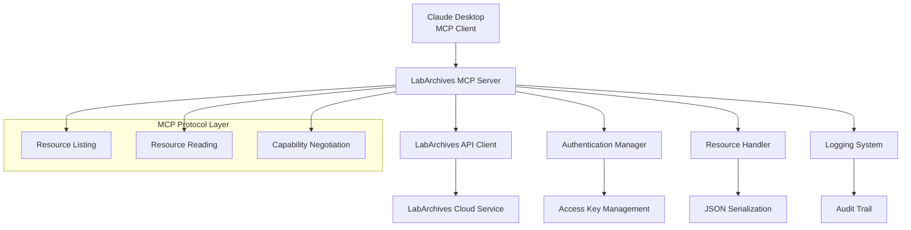
```mermaid
graph TB
    A[Claude Desktop<br/>MCP Client] --> B[LabArchives MCP Server]
    B --> C[LabArchives API Client]
    C --> D[LabArchives Cloud Service]
    
    B --> E[Authentication Manager]
    B --> F[Resource Handler]
    B --> G[Logging System]
    
    E --> H[Access Key Management]
    F --> I[JSON Serialization]
    G --> J[Audit Trail]
    
    subgraph "MCP Protocol Layer"
        K[Resource Listing]
        L[Resource Reading]
        M[Capability Negotiation]
    end
    
    B --> K
    B --> L
    B --> M
```

#### Core Technical Approach

The system implements a client-server architecture following MCP specifications:

**Protocol Implementation:**
- MCP is an open protocol that standardizes how applications provide context to LLMs.
- Utilizes official Python MCP SDK for protocol compliance
- Implements required MCP message types for resource management

**Data Flow Architecture:**
- Stateless request-response model for scalability
- On-demand data retrieval to minimize resource usage
- Structured JSON output preserving LabArchives hierarchy

**Security Model:**
- Authentication delegation to LabArchives API
- Local credential management with environment variable support
- Comprehensive logging for compliance and audit requirements

### 1.2.3 Success Criteria

#### Measurable Objectives

The system success will be evaluated against specific, measurable criteria:

| Objective Category | Success Metric | Target Value |
|-------------------|----------------|--------------|
| Integration Performance | Resource listing response time | < 2 seconds |
| Data Retrieval Efficiency | Page content fetch time | < 5 seconds |
| System Reliability | Uptime during active sessions | > 99% |

#### Critical Success Factors

**Technical Excellence:**
- Full MCP protocol compliance enabling seamless client integration
- Robust error handling and graceful degradation under failure conditions
- Comprehensive logging supporting audit and compliance requirements

**User Experience:**
- Intuitive CLI interface requiring minimal configuration
- Clear documentation enabling rapid deployment
- Responsive performance supporting interactive AI workflows

**Security and Compliance:**
- Secure credential management preventing unauthorized access
- Comprehensive audit trails supporting regulatory requirements
- Configurable scope limitations preventing data over-exposure

#### Key Performance Indicators (KPIs)

**Adoption Metrics:**
- Number of successful deployments within first month
- User retention rate after initial deployment
- Community contributions and issue reports

**Performance Indicators:**
- Average response time for resource operations
- System availability during peak usage periods
- Error rate for API interactions

**Business Impact Measures:**
- Reduction in time-to-insight for AI-assisted research tasks
- Increase in AI tool adoption within research organizations
- Improvement in research data accessibility and utilization

## 1.3 SCOPE

### 1.3.1 In-Scope

#### Core Features and Functionalities

**MCP Protocol Implementation:**
- Complete implementation of MCP resource listing and reading capabilities
- Support for MCP capability negotiation and server identification
- JSON-RPC transport layer compliance for client communication
- Optional JSON-LD context support for semantic data representation

**LabArchives Integration:**
- Authentication using LabArchives API Access Keys and tokens
- Read-only access to notebooks, pages, and entries
- Hierarchical data retrieval preserving LabArchives structure
- Support for both permanent API keys and temporary user tokens

**Data Management and Security:**
- Configurable scope limitation to specific notebooks or folders
- Comprehensive audit logging of all data access operations
- Secure credential handling through environment variables
- Error handling and graceful degradation for API failures

#### Primary User Workflows

**Initial Setup and Configuration:**
- CLI-based server configuration with credential management
- Integration with Claude Desktop through MCP server registration
- Scope configuration for limiting data exposure
- Logging configuration for audit and compliance requirements

**Interactive Data Access:**
- Resource discovery through MCP client interfaces
- Selective content retrieval with user consent mechanisms
- Real-time data access during AI assistant sessions
- Context-aware data presentation preserving notebook hierarchy

#### Essential Integrations

**LabArchives API Integration:**
- REST API communication for data retrieval
- Authentication token management and renewal
- Error handling for API rate limits and failures
- Support for various LabArchives deployment configurations

**MCP Client Compatibility:**
- Claude Desktop application integration
- Support for future MCP-compatible AI applications
- Standard MCP transport mechanisms (stdio, WebSocket)
- Protocol versioning and capability negotiation

#### Key Technical Requirements

**Performance and Scalability:**
- Response times under 5 seconds for typical operations
- Memory-efficient operation suitable for desktop deployment
- Concurrent request handling for multiple AI interactions
- Graceful handling of large notebook datasets

**Security and Compliance:**
- Secure credential storage and transmission
- Comprehensive audit logging with configurable verbosity
- Data access controls respecting LabArchives permissions
- Protection against unauthorized data exposure

### 1.3.2 Implementation Boundaries

#### System Boundaries

**Data Source Scope:**
- Limited to LabArchives electronic lab notebook data
- Read-only access to prevent unintended modifications
- Support for text entries, metadata, and attachment references
- Exclusion of binary file content beyond metadata

**Client Application Scope:**
- Primary support for Claude Desktop application
- Generic MCP protocol support for future client compatibility
- Local deployment model for individual user installations
- Command-line interface for configuration and management

#### User Groups Covered

**Primary Users:**
- Individual researchers with LabArchives access
- Laboratory teams requiring AI-enhanced data analysis
- Graduate students and postdoctoral researchers
- Principal investigators overseeing research projects

**Administrative Users:**
- IT administrators deploying the solution
- Compliance officers monitoring data access
- Software developers extending functionality

#### Geographic and Market Coverage

**Deployment Environments:**
- Academic institutions with LabArchives licenses
- Research organizations using electronic lab notebooks
- Government research facilities with compliance requirements
- Private sector R&D laboratories

**Regional Considerations:**
- Support for global LabArchives deployments
- Compliance with regional data protection regulations
- Multi-language support for international research teams

#### Data Domains Included

**LabArchives Content Types:**
- Text entries and rich text content
- Experimental protocols and procedures
- Research observations and results
- Metadata including timestamps and authorship
- Attachment references and file metadata

### 1.3.3 Out-of-Scope

#### Explicitly Excluded Features and Capabilities

**Write Operations:**
- Creation of new notebook entries or pages
- Modification of existing LabArchives content
- Deletion or archival of research data
- Bulk data manipulation operations

**Advanced Data Processing:**
- Real-time data synchronization beyond read operations
- Complex data transformation or analysis
- Integration with external data sources beyond LabArchives
- Automated data migration or backup functionality

**Enterprise Management Features:**
- Multi-tenant deployment architecture
- Centralized user management and provisioning
- Advanced role-based access controls
- Enterprise-scale monitoring and alerting

#### Future Phase Considerations

**Phase 2 Enhancements:**
- Safe write-back capabilities with approval workflows
- Version history access and comparison features
- Enhanced search and query capabilities
- Multi-notebook aggregation and cross-referencing

**Phase 3 Advanced Features:**
- Real-time collaboration and notification systems
- Advanced analytics and reporting capabilities
- Integration with additional research data sources
- Enterprise deployment and management tools

#### Integration Points Not Covered

**External System Integrations:**
- Direct integration with other electronic lab notebook systems
- Connection to laboratory information management systems (LIMS)
- Integration with research data management platforms
- Support for non-LabArchives data sources

#### Unsupported Use Cases

**Operational Limitations:**
- High-frequency automated data extraction
- Real-time data streaming or synchronization
- Large-scale data migration or archival
- Multi-user concurrent write operations

**Technical Constraints:**
- Binary file content processing beyond metadata
- Complex data visualization or rendering
- Advanced search across multiple data sources
- Real-time collaborative editing capabilities

**Compliance and Security Exclusions:**
- Advanced encryption beyond LabArchives native security
- Custom authentication mechanisms beyond LabArchives API
- Data residency controls beyond LabArchives policies
- Advanced threat detection and prevention systems

# 2. PRODUCT REQUIREMENTS

## 2.1 FEATURE CATALOG

#### F-001: MCP Protocol Implementation

| Attribute | Value |
|-----------|-------|
| **Feature ID** | F-001 |
| **Feature Name** | MCP Protocol Implementation |
| **Category** | Core Infrastructure |
| **Priority** | Critical |
| **Status** | Proposed |

#### Description

**Overview:** Implements the Model Context Protocol (MCP) as an open standard for connecting AI systems with data sources, providing a universal protocol for AI-to-data integration. The server will expose LabArchives data as MCP resources that can be consumed by MCP-compatible clients like Claude Desktop.

**Business Value:** Enables seamless integration between AI applications and LabArchives data without custom implementations, positioning the organization within the rapidly expanding MCP ecosystem.

**User Benefits:** Researchers can access their LabArchives notebook content directly through AI assistants, eliminating manual data transfer and enabling AI-enhanced research workflows.

**Technical Context:** Utilizes MCP as an open protocol that enables seamless integration between LLM applications and external data sources, providing a standardized way to connect LLMs with the context they need.

#### Dependencies

| Dependency Type | Details |
|----------------|---------|
| **System Dependencies** | Python MCP SDK, JSON-RPC transport layer |
| **External Dependencies** | MCP specification compliance, Claude Desktop compatibility |
| **Integration Requirements** | LabArchives API integration, secure credential management |

---

#### F-002: LabArchives API Integration

| Attribute | Value |
|-----------|-------|
| **Feature ID** | F-002 |
| **Feature Name** | LabArchives API Integration |
| **Category** | Data Access |
| **Priority** | Critical |
| **Status** | Proposed |

#### Description

**Overview:** Provides secure, authenticated access to LabArchives electronic lab notebook data through their REST API, supporting both permanent API keys and temporary user tokens.

**Business Value:** Enables direct access to valuable research data stored in LabArchives, leveraging existing institutional investments in electronic lab notebook infrastructure.

**User Benefits:** Researchers can access their existing LabArchives content without data migration or system changes, maintaining familiar workflows while adding AI capabilities.

**Technical Context:** Integrates with LabArchives API using access key ID and password authentication, supporting both permanent credentials and temporary app authentication tokens for SSO users.

#### Dependencies

| Dependency Type | Details |
|----------------|---------|
| **Prerequisite Features** | None (foundational feature) |
| **System Dependencies** | HTTP requests library, XML/JSON parsing capabilities |
| **External Dependencies** | LabArchives API availability, valid authentication credentials |
| **Integration Requirements** | Secure credential storage, error handling for API failures |

---

#### F-003: Resource Discovery and Listing

| Attribute | Value |
|-----------|-------|
| **Feature ID** | F-003 |
| **Feature Name** | Resource Discovery and Listing |
| **Category** | Data Management |
| **Priority** | High |
| **Status** | Proposed |

#### Description

**Overview:** Implements MCP resource listing capabilities to enumerate available notebooks, pages, and entries within configured scope, providing hierarchical navigation of LabArchives data structures.

**Business Value:** Enables users to discover and navigate their research data through AI interfaces, improving data accessibility and utilization.

**User Benefits:** Researchers can browse their notebook structure through AI applications, making it easy to locate specific experiments or data sets.

**Technical Context:** Implements MCP `resources/list` functionality with support for hierarchical data presentation and scope-based filtering.

#### Dependencies

| Dependency Type | Details |
|----------------|---------|
| **Prerequisite Features** | F-001 (MCP Protocol), F-002 (LabArchives API) |
| **System Dependencies** | JSON serialization, URI scheme handling |
| **External Dependencies** | LabArchives notebook permissions |
| **Integration Requirements** | Scope configuration, permission validation |

---

#### F-004: Content Retrieval and Contextualization

| Attribute | Value |
|-----------|-------|
| **Feature ID** | F-004 |
| **Feature Name** | Content Retrieval and Contextualization |
| **Category** | Data Management |
| **Priority** | High |
| **Status** | Proposed |

#### Description

**Overview:** Implements MCP resource reading capabilities to fetch detailed content from specific notebook pages and entries, preserving metadata and hierarchical context for AI consumption.

**Business Value:** Provides AI applications with rich, contextual research data that maintains the original structure and metadata from LabArchives.

**User Benefits:** AI assistants can access complete experimental data with proper context, enabling more accurate and relevant responses to research questions.

**Technical Context:** Implements MCP `resources/read` functionality with structured JSON output optimized for LLM processing.

#### Dependencies

| Dependency Type | Details |
|----------------|---------|
| **Prerequisite Features** | F-001 (MCP Protocol), F-002 (LabArchives API) |
| **System Dependencies** | JSON-LD support (optional), data serialization |
| **External Dependencies** | LabArchives content permissions |
| **Integration Requirements** | Metadata preservation, content formatting |

---

#### F-005: Authentication and Security Management

| Attribute | Value |
|-----------|-------|
| **Feature ID** | F-005 |
| **Feature Name** | Authentication and Security Management |
| **Category** | Security |
| **Priority** | Critical |
| **Status** | Proposed |

#### Description

**Overview:** Implements secure authentication mechanisms for LabArchives API access, supporting both permanent API keys and temporary user tokens with comprehensive security controls.

**Business Value:** Ensures secure access to sensitive research data while maintaining compliance with institutional security requirements.

**User Benefits:** Researchers can securely connect their LabArchives accounts without compromising credentials or data security.

**Technical Context:** Supports SSO users through app authentication tokens obtained from LabArchives user profile settings, with secure credential handling and session management.

#### Dependencies

| Dependency Type | Details |
|----------------|---------|
| **Prerequisite Features** | F-002 (LabArchives API) |
| **System Dependencies** | Environment variable handling, secure storage |
| **External Dependencies** | LabArchives authentication services |
| **Integration Requirements** | Credential validation, token refresh handling |

---

#### F-006: CLI Interface and Configuration

| Attribute | Value |
|-----------|-------|
| **Feature ID** | F-006 |
| **Feature Name** | CLI Interface and Configuration |
| **Category** | User Interface |
| **Priority** | High |
| **Status** | Proposed |

#### Description

**Overview:** Provides a command-line interface for server configuration, credential management, and operational control, enabling easy deployment and management.

**Business Value:** Simplifies deployment and configuration for technical users, reducing setup time and complexity.

**User Benefits:** Researchers and IT administrators can easily configure and deploy the server with familiar command-line tools.

**Technical Context:** Implements comprehensive CLI with argument parsing, environment variable support, and configuration validation.

#### Dependencies

| Dependency Type | Details |
|----------------|---------|
| **Prerequisite Features** | F-005 (Authentication) |
| **System Dependencies** | Python argparse, environment variable access |
| **External Dependencies** | None |
| **Integration Requirements** | Configuration validation, help documentation |

---

#### F-007: Scope Limitation and Access Control

| Attribute | Value |
|-----------|-------|
| **Feature ID** | F-007 |
| **Feature Name** | Scope Limitation and Access Control |
| **Category** | Security |
| **Priority** | High |
| **Status** | Proposed |

#### Description

**Overview:** Implements configurable scope limitations to restrict data exposure to specific notebooks or folders, providing granular access control for sensitive research data.

**Business Value:** Enables controlled data sharing with AI applications, reducing risk of unauthorized data exposure while maintaining functionality.

**User Benefits:** Researchers can limit AI access to specific projects or experiments, maintaining data privacy and security.

**Technical Context:** Implements scope enforcement at the resource listing and reading levels with configuration-based controls.

#### Dependencies

| Dependency Type | Details |
|----------------|---------|
| **Prerequisite Features** | F-003 (Resource Discovery), F-004 (Content Retrieval) |
| **System Dependencies** | Configuration management, access validation |
| **External Dependencies** | LabArchives permission model |
| **Integration Requirements** | Scope validation, error handling |

---

#### F-008: Comprehensive Audit Logging

| Attribute | Value |
|-----------|-------|
| **Feature ID** | F-008 |
| **Feature Name** | Comprehensive Audit Logging |
| **Category** | Compliance |
| **Priority** | High |
| **Status** | Proposed |

#### Description

**Overview:** Implements comprehensive logging of all data access operations, API calls, and system events to support audit requirements and compliance needs.

**Business Value:** Provides traceability and accountability for data access, supporting regulatory compliance and security monitoring.

**User Benefits:** Researchers and administrators can track data usage and access patterns for compliance and security purposes.

**Technical Context:** Implements structured logging with configurable verbosity levels and secure log management.

#### Dependencies

| Dependency Type | Details |
|----------------|---------|
| **Prerequisite Features** | All core features (cross-cutting concern) |
| **System Dependencies** | Python logging framework, file I/O |
| **External Dependencies** | None |
| **Integration Requirements** | Log rotation, secure storage |

---

## 2.2 FUNCTIONAL REQUIREMENTS TABLE

#### F-001: MCP Protocol Implementation

| Requirement ID | Description | Acceptance Criteria | Priority | Complexity |
|---------------|-------------|-------------------|----------|------------|
| **F-001-RQ-001** | MCP Server Initialization | Server successfully initializes and advertises MCP capabilities | Must-Have | Medium |
| **F-001-RQ-002** | Protocol Handshake | Completes MCP handshake with client applications | Must-Have | Medium |
| **F-001-RQ-003** | JSON-RPC Transport | Implements JSON-RPC communication protocol | Must-Have | High |
| **F-001-RQ-004** | Capability Negotiation | Advertises resource capabilities to MCP clients | Must-Have | Low |

#### Technical Specifications

| Requirement | Input Parameters | Output/Response | Performance Criteria | Data Requirements |
|-------------|------------------|-----------------|-------------------|-------------------|
| **F-001-RQ-001** | Server configuration | MCP server instance | < 2 seconds startup | Server metadata |
| **F-001-RQ-002** | Client connection | Handshake response | < 1 second response | Protocol version |
| **F-001-RQ-003** | JSON-RPC messages | Structured responses | < 500ms per message | Message validation |
| **F-001-RQ-004** | Capability request | Capability list | < 100ms response | Feature inventory |

#### Validation Rules

| Requirement | Business Rules | Data Validation | Security Requirements | Compliance Requirements |
|-------------|---------------|-----------------|---------------------|----------------------|
| **F-001-RQ-001** | Single server instance per configuration | Valid configuration parameters | Secure initialization | MCP specification compliance |
| **F-001-RQ-002** | Compatible protocol versions only | Protocol version validation | Authenticated connections | Standard handshake procedure |
| **F-001-RQ-003** | Valid JSON-RPC format | Message structure validation | Secure message handling | JSON-RPC 2.0 compliance |
| **F-001-RQ-004** | Accurate capability reporting | Capability list validation | No capability over-reporting | MCP capability specification |

---

#### F-002: LabArchives API Integration

| Requirement ID | Description | Acceptance Criteria | Priority | Complexity |
|---------------|-------------|-------------------|----------|------------|
| **F-002-RQ-001** | API Authentication | Successfully authenticate with LabArchives API | Must-Have | Medium |
| **F-002-RQ-002** | Notebook Listing | Retrieve list of accessible notebooks | Must-Have | Low |
| **F-002-RQ-003** | Page Content Retrieval | Fetch page entries and metadata | Must-Have | Medium |
| **F-002-RQ-004** | Error Handling | Handle API failures gracefully | Must-Have | Medium |

#### Technical Specifications

| Requirement | Input Parameters | Output/Response | Performance Criteria | Data Requirements |
|-------------|------------------|-----------------|-------------------|-------------------|
| **F-002-RQ-001** | Access key, token/password | Authentication session | < 3 seconds | Valid credentials |
| **F-002-RQ-002** | User credentials | Notebook list JSON | < 5 seconds | User permissions |
| **F-002-RQ-003** | Page ID, credentials | Page content JSON | < 10 seconds | Page access rights |
| **F-002-RQ-004** | API error conditions | Error messages | Immediate | Error context |

#### Validation Rules

| Requirement | Business Rules | Data Validation | Security Requirements | Compliance Requirements |
|-------------|---------------|-----------------|---------------------|----------------------|
| **F-002-RQ-001** | Valid credentials required | Credential format validation | Secure credential storage | Authentication standards |
| **F-002-RQ-002** | User permission-based access | Notebook ID validation | Access control enforcement | Data privacy compliance |
| **F-002-RQ-003** | Read-only access only | Content integrity validation | No data modification | Research data protection |
| **F-002-RQ-004** | Graceful degradation | Error message validation | No credential exposure | Error handling standards |

---

#### F-003: Resource Discovery and Listing

| Requirement ID | Description | Acceptance Criteria | Priority | Complexity |
|---------------|-------------|-------------------|----------|------------|
| **F-003-RQ-001** | MCP Resource Listing | Implement `resources/list` MCP method | Must-Have | Medium |
| **F-003-RQ-002** | Hierarchical Navigation | Support notebook/page hierarchy | Should-Have | Medium |
| **F-003-RQ-003** | Scope-Based Filtering | Filter resources by configured scope | Must-Have | Low |
| **F-003-RQ-004** | Resource URI Generation | Generate valid MCP resource URIs | Must-Have | Low |

#### Technical Specifications

| Requirement | Input Parameters | Output/Response | Performance Criteria | Data Requirements |
|-------------|------------------|-----------------|-------------------|-------------------|
| **F-003-RQ-001** | MCP list request | Resource array JSON | < 2 seconds | Resource metadata |
| **F-003-RQ-002** | Hierarchy level | Structured resource list | < 3 seconds | Hierarchy data |
| **F-003-RQ-003** | Scope configuration | Filtered resource list | < 1 second | Scope parameters |
| **F-003-RQ-004** | Resource identifiers | Valid URI strings | < 100ms | Resource IDs |

#### Validation Rules

| Requirement | Business Rules | Data Validation | Security Requirements | Compliance Requirements |
|-------------|---------------|-----------------|---------------------|----------------------|
| **F-003-RQ-001** | Only accessible resources listed | Resource existence validation | Permission-based listing | MCP resource specification |
| **F-003-RQ-002** | Consistent hierarchy representation | Hierarchy structure validation | Secure navigation | Data organization standards |
| **F-003-RQ-003** | Scope boundaries enforced | Scope parameter validation | Access control compliance | Data exposure limits |
| **F-003-RQ-004** | Unique, valid URIs | URI format validation | No URI manipulation | URI scheme compliance |

---

#### F-004: Content Retrieval and Contextualization

| Requirement ID | Description | Acceptance Criteria | Priority | Complexity |
|---------------|-------------|-------------------|----------|------------|
| **F-004-RQ-001** | MCP Resource Reading | Implement `resources/read` MCP method | Must-Have | Medium |
| **F-004-RQ-002** | Content Serialization | Convert LabArchives data to JSON | Must-Have | Medium |
| **F-004-RQ-003** | Metadata Preservation | Maintain original metadata context | Should-Have | Low |
| **F-004-RQ-004** | JSON-LD Support | Optional semantic context support | Could-Have | Medium |

#### Technical Specifications

| Requirement | Input Parameters | Output/Response | Performance Criteria | Data Requirements |
|-------------|------------------|-----------------|-------------------|-------------------|
| **F-004-RQ-001** | Resource URI | Content JSON | < 5 seconds | Resource content |
| **F-004-RQ-002** | LabArchives data | Structured JSON | < 1 second | Data schema |
| **F-004-RQ-003** | Original metadata | Enhanced JSON | < 500ms | Metadata fields |
| **F-004-RQ-004** | JSON-LD flag | Semantic JSON | < 200ms | Context schema |

#### Validation Rules

| Requirement | Business Rules | Data Validation | Security Requirements | Compliance Requirements |
|-------------|---------------|-----------------|---------------------|----------------------|
| **F-004-RQ-001** | Valid resource URIs only | URI validation | Authorized access only | MCP read specification |
| **F-004-RQ-002** | Consistent JSON structure | JSON schema validation | Data integrity | Serialization standards |
| **F-004-RQ-003** | Complete metadata inclusion | Metadata completeness check | Metadata security | Research data standards |
| **F-004-RQ-004** | Valid JSON-LD context | Context validation | Semantic security | JSON-LD specification |

---

#### F-005: Authentication and Security Management

| Requirement ID | Description | Acceptance Criteria | Priority | Complexity |
|---------------|-------------|-------------------|----------|------------|
| **F-005-RQ-001** | Credential Management | Secure handling of API credentials | Must-Have | Medium |
| **F-005-RQ-002** | Token Validation | Validate authentication tokens | Must-Have | Low |
| **F-005-RQ-003** | Session Management | Manage authentication sessions | Should-Have | Medium |
| **F-005-RQ-004** | Security Controls | Implement security best practices | Must-Have | High |

#### Technical Specifications

| Requirement | Input Parameters | Output/Response | Performance Criteria | Data Requirements |
|-------------|------------------|-----------------|-------------------|-------------------|
| **F-005-RQ-001** | Credentials | Secure storage | Immediate | Credential data |
| **F-005-RQ-002** | Token data | Validation result | < 1 second | Token format |
| **F-005-RQ-003** | Session state | Session object | < 500ms | Session data |
| **F-005-RQ-004** | Security policies | Compliance status | Continuous | Security config |

#### Validation Rules

| Requirement | Business Rules | Data Validation | Security Requirements | Compliance Requirements |
|-------------|---------------|-----------------|---------------------|----------------------|
| **F-005-RQ-001** | No credential exposure | Credential format validation | Encrypted storage | Security standards |
| **F-005-RQ-002** | Valid tokens only | Token structure validation | Token integrity | Authentication standards |
| **F-005-RQ-003** | Secure session handling | Session validation | Session security | Session management standards |
| **F-005-RQ-004** | Security policy compliance | Security validation | Comprehensive security | Security compliance |

---

#### F-006: CLI Interface and Configuration

| Requirement ID | Description | Acceptance Criteria | Priority | Complexity |
|---------------|-------------|-------------------|----------|------------|
| **F-006-RQ-001** | Command-Line Parsing | Parse CLI arguments and options | Must-Have | Low |
| **F-006-RQ-002** | Environment Variables | Support environment variable configuration | Must-Have | Low |
| **F-006-RQ-003** | Configuration Validation | Validate configuration parameters | Must-Have | Medium |
| **F-006-RQ-004** | Help Documentation | Provide comprehensive help information | Should-Have | Low |

#### Technical Specifications

| Requirement | Input Parameters | Output/Response | Performance Criteria | Data Requirements |
|-------------|------------------|-----------------|-------------------|-------------------|
| **F-006-RQ-001** | CLI arguments | Parsed configuration | < 100ms | Argument schema |
| **F-006-RQ-002** | Environment variables | Configuration values | < 50ms | Variable definitions |
| **F-006-RQ-003** | Configuration data | Validation results | < 200ms | Validation rules |
| **F-006-RQ-004** | Help request | Help text | < 50ms | Documentation |

#### Validation Rules

| Requirement | Business Rules | Data Validation | Security Requirements | Compliance Requirements |
|-------------|---------------|-----------------|---------------------|----------------------|
| **F-006-RQ-001** | Valid argument formats | Argument validation | No credential exposure | CLI standards |
| **F-006-RQ-002** | Environment precedence | Variable validation | Secure variable handling | Configuration standards |
| **F-006-RQ-003** | Complete configuration | Configuration completeness | Security validation | Configuration compliance |
| **F-006-RQ-004** | Accurate documentation | Help accuracy | No sensitive info | Documentation standards |

---

#### F-007: Scope Limitation and Access Control

| Requirement ID | Description | Acceptance Criteria | Priority | Complexity |
|---------------|-------------|-------------------|----------|------------|
| **F-007-RQ-001** | Scope Configuration | Configure data access scope | Must-Have | Medium |
| **F-007-RQ-002** | Access Enforcement | Enforce scope limitations | Must-Have | Medium |
| **F-007-RQ-003** | Permission Validation | Validate user permissions | Must-Have | Low |
| **F-007-RQ-004** | Scope Reporting | Report active scope settings | Should-Have | Low |

#### Technical Specifications

| Requirement | Input Parameters | Output/Response | Performance Criteria | Data Requirements |
|-------------|------------------|-----------------|-------------------|-------------------|
| **F-007-RQ-001** | Scope parameters | Scope configuration | < 100ms | Scope definition |
| **F-007-RQ-002** | Access requests | Access decisions | < 50ms | Access rules |
| **F-007-RQ-003** | User context | Permission status | < 200ms | Permission data |
| **F-007-RQ-004** | Scope query | Scope information | < 50ms | Scope metadata |

#### Validation Rules

| Requirement | Business Rules | Data Validation | Security Requirements | Compliance Requirements |
|-------------|---------------|-----------------|---------------------|----------------------|
| **F-007-RQ-001** | Valid scope definitions | Scope validation | Secure scope handling | Access control standards |
| **F-007-RQ-002** | Consistent enforcement | Access validation | No scope bypass | Security enforcement |
| **F-007-RQ-003** | Accurate permissions | Permission validation | Permission integrity | Authorization standards |
| **F-007-RQ-004** | Transparent reporting | Report validation | Scope transparency | Reporting standards |

---

#### F-008: Comprehensive Audit Logging

| Requirement ID | Description | Acceptance Criteria | Priority | Complexity |
|---------------|-------------|-------------------|----------|------------|
| **F-008-RQ-001** | Event Logging | Log all significant system events | Must-Have | Medium |
| **F-008-RQ-002** | Access Tracking | Track all data access operations | Must-Have | Low |
| **F-008-RQ-003** | Log Management | Manage log files and rotation | Should-Have | Medium |
| **F-008-RQ-004** | Audit Reporting | Generate audit reports | Could-Have | High |

#### Technical Specifications

| Requirement | Input Parameters | Output/Response | Performance Criteria | Data Requirements |
|-------------|------------------|-----------------|-------------------|-------------------|
| **F-008-RQ-001** | System events | Log entries | < 10ms per event | Event data |
| **F-008-RQ-002** | Access operations | Access logs | < 5ms per access | Access metadata |
| **F-008-RQ-003** | Log configuration | Log management | Background | Log policies |
| **F-008-RQ-004** | Report parameters | Audit reports | < 30 seconds | Audit data |

#### Validation Rules

| Requirement | Business Rules | Data Validation | Security Requirements | Compliance Requirements |
|-------------|---------------|-----------------|---------------------|----------------------|
| **F-008-RQ-001** | Complete event capture | Event validation | Secure logging | Audit standards |
| **F-008-RQ-002** | Comprehensive tracking | Access validation | Access integrity | Tracking compliance |
| **F-008-RQ-003** | Secure log handling | Log validation | Log security | Log management standards |
| **F-008-RQ-004** | Accurate reporting | Report validation | Report security | Audit reporting standards |

---

## 2.3 FEATURE RELATIONSHIPS

#### Feature Dependencies Map

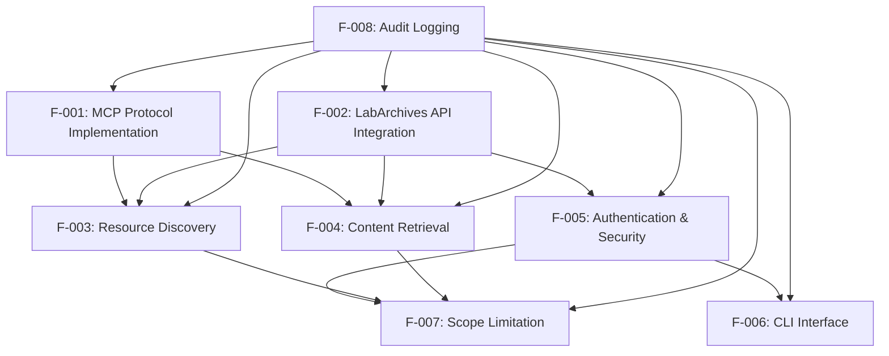
```mermaid
graph TB
    F001[F-001: MCP Protocol Implementation] --> F003[F-003: Resource Discovery]
    F001 --> F004[F-004: Content Retrieval]
    
    F002[F-002: LabArchives API Integration] --> F003
    F002 --> F004
    F002 --> F005[F-005: Authentication & Security]
    
    F005 --> F006[F-006: CLI Interface]
    F005 --> F007[F-007: Scope Limitation]
    
    F003 --> F007
    F004 --> F007
    
    F008[F-008: Audit Logging] --> F001
    F008 --> F002
    F008 --> F003
    F008 --> F004
    F008 --> F005
    F008 --> F006
    F008 --> F007
```

#### Integration Points

| Integration Point | Features Involved | Description | Shared Components |
|------------------|-------------------|-------------|-------------------|
| **MCP Resource Interface** | F-001, F-003, F-004 | MCP protocol implementation for resource operations | JSON-RPC handler, Resource URI scheme |
| **LabArchives Data Access** | F-002, F-005, F-007 | Secure access to LabArchives API with scope controls | Authentication manager, API client |
| **Configuration Management** | F-005, F-006, F-007 | Centralized configuration for security and scope settings | Configuration parser, Validation engine |
| **Audit Trail System** | F-008, All Features | Cross-cutting logging for all system operations | Logging framework, Event dispatcher |

#### Common Services

| Service | Description | Used By Features |
|---------|-------------|------------------|
| **JSON Serialization Service** | Converts data between formats | F-003, F-004, F-008 |
| **Error Handling Service** | Centralized error management | All Features |
| **Validation Service** | Input and configuration validation | F-005, F-006, F-007 |
| **Security Service** | Authentication and authorization | F-002, F-005, F-007 |

---

## 2.4 IMPLEMENTATION CONSIDERATIONS

#### F-001: MCP Protocol Implementation

| Consideration | Details |
|---------------|---------|
| **Technical Constraints** | Must comply with MCP specification, JSON-RPC 2.0 compatibility required |
| **Performance Requirements** | < 500ms response time for protocol messages, concurrent client support |
| **Scalability Considerations** | Single-user deployment model, stateless request handling |
| **Security Implications** | Secure transport layer, client authentication validation |
| **Maintenance Requirements** | MCP specification updates, SDK version management |

#### F-002: LabArchives API Integration

| Consideration | Details |
|---------------|---------|
| **Technical Constraints** | LabArchives API rate limits, XML/JSON response parsing |
| **Performance Requirements** | < 10 seconds for content retrieval, efficient API usage |
| **Scalability Considerations** | API call optimization, response caching strategies |
| **Security Implications** | Secure credential handling, API token management |
| **Maintenance Requirements** | API version compatibility, error handling updates |

#### F-003: Resource Discovery and Listing

| Consideration | Details |
|---------------|---------|
| **Technical Constraints** | MCP resource specification compliance, URI scheme design |
| **Performance Requirements** | < 2 seconds for resource listing, memory-efficient processing |
| **Scalability Considerations** | Large notebook handling, pagination support |
| **Security Implications** | Permission-based resource filtering, scope enforcement |
| **Maintenance Requirements** | Resource schema evolution, hierarchy optimization |

#### F-004: Content Retrieval and Contextualization

| Consideration | Details |
|---------------|---------|
| **Technical Constraints** | JSON-LD specification compliance, content size limits |
| **Performance Requirements** | < 5 seconds for content retrieval, streaming for large content |
| **Scalability Considerations** | Memory usage optimization, content chunking |
| **Security Implications** | Content sanitization, metadata security |
| **Maintenance Requirements** | Content format evolution, serialization updates |

#### F-005: Authentication and Security Management

| Consideration | Details |
|---------------|---------|
| **Technical Constraints** | LabArchives authentication protocols, token lifecycle management |
| **Performance Requirements** | < 1 second for authentication validation, session efficiency |
| **Scalability Considerations** | Credential caching, session management |
| **Security Implications** | Credential encryption, secure storage, audit compliance |
| **Maintenance Requirements** | Security updates, authentication protocol changes |

#### F-006: CLI Interface and Configuration

| Consideration | Details |
|---------------|---------|
| **Technical Constraints** | Cross-platform compatibility, standard CLI conventions |
| **Performance Requirements** | < 100ms for argument parsing, immediate feedback |
| **Scalability Considerations** | Configuration complexity management, help system |
| **Security Implications** | Secure credential input, configuration validation |
| **Maintenance Requirements** | CLI evolution, documentation updates |

#### F-007: Scope Limitation and Access Control

| Consideration | Details |
|---------------|---------|
| **Technical Constraints** | LabArchives permission model alignment, scope granularity |
| **Performance Requirements** | < 50ms for access decisions, efficient scope checking |
| **Scalability Considerations** | Complex scope configurations, permission caching |
| **Security Implications** | Access control bypass prevention, scope validation |
| **Maintenance Requirements** | Permission model updates, scope configuration evolution |

#### F-008: Comprehensive Audit Logging

| Consideration | Details |
|---------------|---------|
| **Technical Constraints** | Log format standards, storage requirements |
| **Performance Requirements** | < 10ms logging overhead, asynchronous processing |
| **Scalability Considerations** | Log rotation, storage management, performance impact |
| **Security Implications** | Log integrity, sensitive data handling, access controls |
| **Maintenance Requirements** | Log format evolution, compliance updates |

---

## 2.5 TRACEABILITY MATRIX

| Business Requirement | Feature ID | Functional Requirements | Acceptance Criteria |
|---------------------|------------|------------------------|-------------------|
| **MCP Protocol Compliance** | F-001 | F-001-RQ-001 to F-001-RQ-004 | Server initializes with MCP capabilities |
| **LabArchives Data Access** | F-002 | F-002-RQ-001 to F-002-RQ-004 | Successful API authentication and data retrieval |
| **Resource Discovery** | F-003 | F-003-RQ-001 to F-003-RQ-004 | MCP resource listing functionality |
| **Content Retrieval** | F-004 | F-004-RQ-001 to F-004-RQ-004 | MCP resource reading with context preservation |
| **Security Management** | F-005 | F-005-RQ-001 to F-005-RQ-004 | Secure credential handling and authentication |
| **CLI Configuration** | F-006 | F-006-RQ-001 to F-006-RQ-004 | Command-line interface with configuration support |
| **Access Control** | F-007 | F-007-RQ-001 to F-007-RQ-004 | Configurable scope limitations |
| **Audit Compliance** | F-008 | F-008-RQ-001 to F-008-RQ-004 | Comprehensive logging and audit trails |

# 3. TECHNOLOGY STACK

## 3.1 PROGRAMMING LANGUAGES

### 3.1.1 Primary Language Selection

| Component | Language | Version | Justification |
|-----------|----------|---------|---------------|
| **MCP Server Core** | Python | 3.11+ | Official MCP Python SDK support with full protocol implementation |
| **CLI Interface** | Python | 3.11+ | Native argparse support and cross-platform compatibility |
| **API Integration** | Python | 3.11+ | Mature HTTP client libraries and JSON/XML processing capabilities |

### 3.1.2 Language Selection Criteria

**Python 3.11+ Selection Rationale:**
- MCP SDK implements the full MCP specification with Python support
- Pydantic v2 requires Python 3.9+ with optimal performance on 3.11+
- Cross-platform compatibility for Windows, macOS, and Linux deployment
- Rich ecosystem for HTTP clients, JSON processing, and CLI development
- Python 3.13 released October 2024 with performance improvements, but 3.11+ provides stable foundation

### 3.1.3 Version Constraints

**Minimum Requirements:**
- Python 3.11 for optimal performance and modern language features
- Compatible with Python 3.12 and 3.13 for future-proofing
- Pydantic v2.11.7 supports Python 3.9+ but recommends 3.11+

## 3.2 FRAMEWORKS & LIBRARIES

### 3.2.1 Core MCP Framework

| Framework | Version | Purpose | Justification |
|-----------|---------|---------|---------------|
| **MCP Python SDK** | Latest (2024) | Protocol Implementation | Official SDK for Model Context Protocol servers and clients with full specification support |
| **FastMCP** | Latest | Server Framework | FastMCP server provides core interface to MCP protocol with decorators for resources and tools |

### 3.2.2 Data Validation & Serialization

| Library | Version | Purpose | Justification |
|---------|---------|---------|---------------|
| **Pydantic** | v2.11.7+ | Data Validation | Most widely used data validation library for Python with JSON Schema support |
| **Pydantic Settings** | v2.10.1+ | Configuration Management | CLI parsing and environment variable handling with Pydantic integration |

### 3.2.3 HTTP Client Libraries

| Library | Version | Purpose | Justification |
|---------|---------|---------|---------------|
| **Requests** | Latest (2024) | LabArchives API Client | Simple-to-use HTTP client library with comprehensive features for API integration |

### 3.2.4 CLI and Configuration

| Library | Version | Purpose | Justification |
|---------|---------|---------|---------------|
| **argparse** | Built-in | Command Line Parsing | Standard library with comprehensive CLI argument parsing capabilities |
| **logging** | Built-in | Audit Logging | Python standard library with configurable verbosity and file output |

## 3.3 OPEN SOURCE DEPENDENCIES

### 3.3.1 MCP Protocol Dependencies

```python
# Core MCP dependencies
mcp >= 1.0.0                    # Official MCP Python SDK
fastmcp >= 1.0.0               # FastMCP server framework
```

### 3.3.2 Data Processing Dependencies

```python
# Data validation and serialization
pydantic >= 2.11.7             # Data validation with JSON Schema
pydantic-settings >= 2.10.1    # Settings management with CLI support
```

### 3.3.3 HTTP and API Dependencies

```python
# HTTP client for LabArchives API
requests >= 2.31.0             # HTTP library for API calls
urllib3 >= 2.0.0              # HTTP client dependency
```

### 3.3.4 Optional Enhancement Dependencies

```python
# Optional LabArchives API wrapper
labarchives-py >= 0.1.0        # Community LabArchives API wrapper (optional)
```

### 3.3.5 Development Dependencies

```python
# Development and testing
pytest >= 7.0.0               # Testing framework
black >= 23.0.0               # Code formatting
mypy >= 1.0.0                 # Type checking
```

## 3.4 THIRD-PARTY SERVICES

### 3.4.1 External API Integration

| Service | Purpose | Authentication | Constraints |
|---------|---------|----------------|-------------|
| **LabArchives REST API** | Data Source | Access Key ID + Token/Password | API base URL varies by region (api.labarchives.com, auapi.labarchives.com) |

### 3.4.2 Authentication Services

| Service | Type | Implementation | Security |
|---------|------|----------------|----------|
| **LabArchives API Authentication** | API Key + Token | SSO users require LA App authentication token from user profile | HTTPS transport, secure credential storage |

### 3.4.3 MCP Client Integration

| Client | Compatibility | Transport | Status |
|--------|---------------|-----------|--------|
| **Claude Desktop** | Primary Target | All Claude.ai plans support MCP servers, Claude for Work supports local testing | Production Ready |
| **MCP Inspector** | Development Tool | stdio/WebSocket | Development Support |

## 3.5 DATABASES & STORAGE

### 3.5.1 Data Persistence Strategy

**No Persistent Storage Required:**
- Stateless request-response model for scalability
- On-demand data retrieval from LabArchives API
- No local caching or database requirements for MVP

### 3.5.2 Temporary Data Handling

| Data Type | Storage Method | Lifecycle | Security |
|-----------|----------------|-----------|----------|
| **Authentication Tokens** | In-memory only | Process lifetime | Environment variables, no disk persistence |
| **API Responses** | Transient processing | Request duration | Immediate garbage collection |
| **Configuration** | Environment variables | Process lifetime | Secure credential handling |

### 3.5.3 Logging Storage

| Log Type | Storage Location | Rotation | Security |
|----------|------------------|----------|----------|
| **Audit Logs** | File system (configurable) | Manual/external | No sensitive data logging |
| **Debug Logs** | stdout/stderr or file | Session-based | Configurable verbosity levels |

## 3.6 DEVELOPMENT & DEPLOYMENT

### 3.6.1 Development Tools

| Tool | Version | Purpose | Justification |
|------|---------|---------|---------------|
| **Python** | 3.11+ | Runtime Environment | Official Docker Python images provide latest bugfixes and stability |
| **pip** | Latest | Package Management | Standard Python package installer |
| **venv** | Built-in | Virtual Environment | Isolation of dependencies |

### 3.6.2 Build System

| Component | Technology | Configuration | Purpose |
|-----------|------------|---------------|---------|
| **Package Structure** | setuptools/pyproject.toml | Standard Python packaging | Distribution and installation |
| **Entry Points** | Console scripts | CLI command registration | `labarchives-mcp` command |
| **Dependencies** | requirements.txt | Version pinning | Reproducible builds |

### 3.6.3 Containerization

```dockerfile
# Base image selection
FROM python:3.11-slim-bookworm

#### Container configuration
WORKDIR /app
COPY requirements.txt .
RUN pip install --no-cache-dir -r requirements.txt
COPY . .
ENTRYPOINT ["labarchives-mcp"]
```

**Docker Strategy:**
- python:3.11-slim-bookworm provides 51MB download, 149MB uncompressed with latest Python bugfixes
- Lightweight container for desktop deployment
- Environment variable support for configuration
- Compatible with Claude Desktop Docker integration

### 3.6.4 CI/CD Requirements

**Minimal CI/CD for MVP:**
- GitHub Actions for automated testing
- PyPI package publishing pipeline
- Docker Hub image publishing
- Automated dependency updates

### 3.6.5 Deployment Architecture

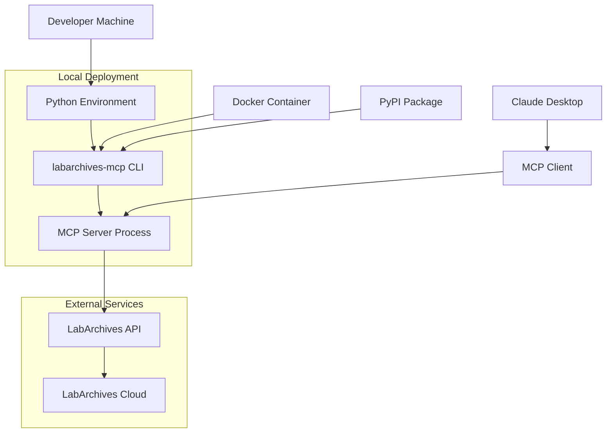
```mermaid
graph TB
    A[Developer Machine] --> B[Python Environment]
    B --> C[labarchives-mcp CLI]
    C --> D[MCP Server Process]
    
    E[Claude Desktop] --> F[MCP Client]
    F --> D
    
    D --> G[LabArchives API]
    G --> H[LabArchives Cloud]
    
    I[Docker Container] --> C
    J[PyPI Package] --> C
    
    subgraph "Local Deployment"
        B
        C
        D
    end
    
    subgraph "External Services"
        G
        H
    end
```

### 3.6.6 Version Management

| Component | Versioning Strategy | Distribution |
|-----------|-------------------|--------------|
| **Package Version** | Semantic Versioning (v0.1.0) | PyPI registry |
| **Docker Image** | Tag-based (latest, v0.1.0) | Docker Hub |
| **Dependencies** | Pinned versions | requirements.txt |

### 3.6.7 Security Considerations

**Development Security:**
- No hardcoded credentials in source code
- Environment variable configuration
- Secure dependency management
- Regular security updates for base images

**Deployment Security:**
- Official Docker Python images provide security updates and latest bugfixes
- Local-only MCP communication (no network exposure)
- Credential isolation through environment variables
- Comprehensive audit logging without sensitive data exposure

# 4. PROCESS FLOWCHART

## 4.1 SYSTEM WORKFLOWS

### 4.1.1 Core Business Processes

#### End-to-End User Journey

The LabArchives MCP Server facilitates a comprehensive workflow from initial setup through active AI-enhanced research sessions. The system leverages MCP as an open standard introduced by Anthropic in November 2024 for connecting AI assistants to data systems, enabling researchers to seamlessly integrate their LabArchives electronic lab notebook data with AI applications like Claude Desktop.

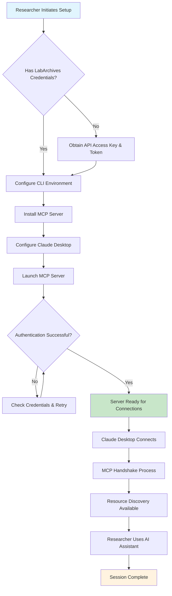
```mermaid
flowchart TD
    A[Researcher Initiates Setup] --> B{Has LabArchives Credentials?}
    B -->|No| C[Obtain API Access Key & Token]
    B -->|Yes| D[Configure CLI Environment]
    C --> D
    D --> E[Install MCP Server]
    E --> F[Configure Claude Desktop]
    F --> G[Launch MCP Server]
    G --> H{Authentication Successful?}
    H -->|No| I[Check Credentials & Retry]
    H -->|Yes| J[Server Ready for Connections]
    I --> H
    J --> K[Claude Desktop Connects]
    K --> L[MCP Handshake Process]
    L --> M[Resource Discovery Available]
    M --> N[Researcher Uses AI Assistant]
    N --> O[Session Complete]
    
    style A fill:#e1f5fe
    style J fill:#c8e6c9
    style O fill:#fff3e0
```

#### System Interaction Patterns

The MCP workflow involves initialization where Host applications create MCP Clients that exchange information about capabilities and protocol versions via handshake, followed by discovery where clients request what capabilities the server offers.

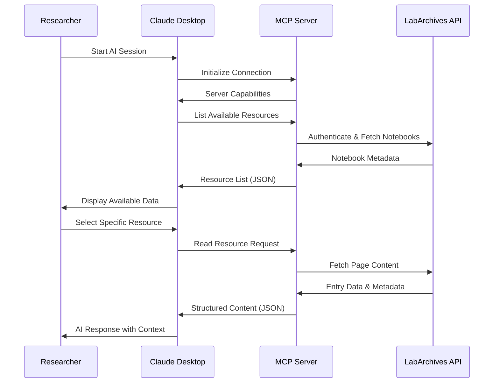
```mermaid
sequenceDiagram
    participant R as Researcher
    participant C as Claude Desktop
    participant S as MCP Server
    participant L as LabArchives API
    
    R->>C: Start AI Session
    C->>S: Initialize Connection
    S->>C: Server Capabilities
    C->>S: List Available Resources
    S->>L: Authenticate & Fetch Notebooks
    L->>S: Notebook Metadata
    S->>C: Resource List (JSON)
    C->>R: Display Available Data
    R->>C: Select Specific Resource
    C->>S: Read Resource Request
    S->>L: Fetch Page Content
    L->>S: Entry Data & Metadata
    S->>C: Structured Content (JSON)
    C->>R: AI Response with Context
```

#### Decision Points and Business Rules

**Authentication Decision Matrix:**

| Credential Type | Validation Rule | Action |
|----------------|-----------------|---------|
| API Access Key + Secret | Permanent credentials | Direct authentication |
| User Email + App Token | SSO users, temporary token | Exchange for UID, then authenticate |
| Invalid/Expired | Authentication failure | Return error, request renewal |

**Scope Enforcement Rules:**

| Configuration | Access Pattern | Enforcement |
|--------------|----------------|-------------|
| No scope specified | All accessible notebooks | Full user permissions |
| Notebook ID specified | Single notebook only | Filter all operations |
| Invalid notebook ID | Configuration error | Server startup failure |

### 4.1.2 Integration Workflows

#### MCP Protocol Handshake Flow

The MCP connection lifecycle involves the client sending an initialize request with protocol version and capabilities, server responding with its protocol version and capabilities, client sending initialized notification to acknowledge, then normal message exchange begins.

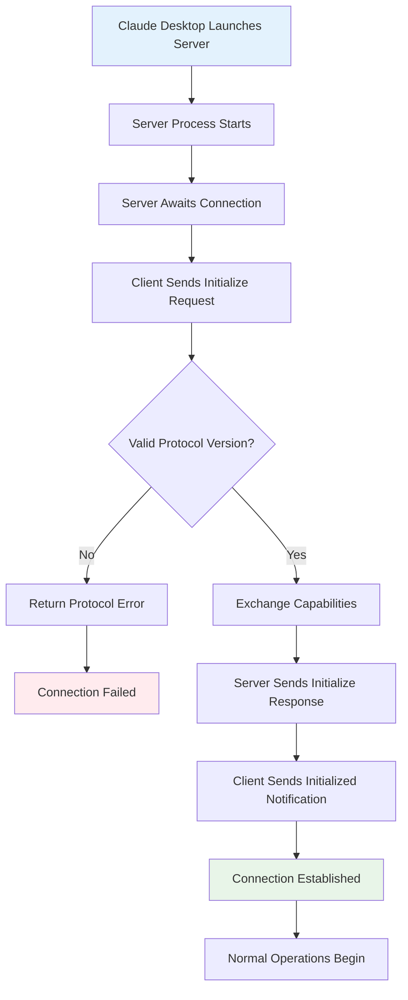
```mermaid
flowchart TD
    A[Claude Desktop Launches Server] --> B[Server Process Starts]
    B --> C[Server Awaits Connection]
    C --> D[Client Sends Initialize Request]
    D --> E{Valid Protocol Version?}
    E -->|No| F[Return Protocol Error]
    E -->|Yes| G[Exchange Capabilities]
    F --> Z[Connection Failed]
    G --> H[Server Sends Initialize Response]
    H --> I[Client Sends Initialized Notification]
    I --> J[Connection Established]
    J --> K[Normal Operations Begin]
    
    style A fill:#e3f2fd
    style J fill:#e8f5e8
    style Z fill:#ffebee
```

#### LabArchives API Authentication Workflow

LabArchives API uses different base URLs by region (api.labarchives.com for normal, auapi.labarchives.com for Australia) and requires access key ID and password authentication.

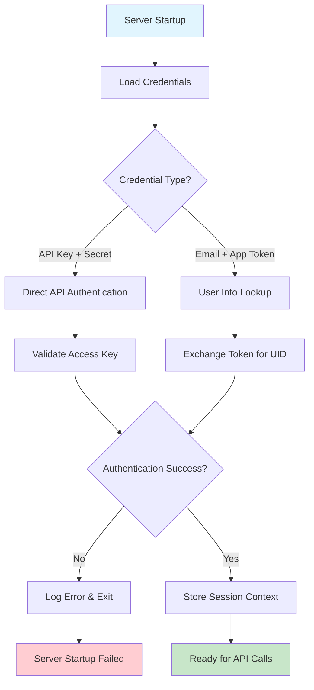
```mermaid
flowchart TD
    A[Server Startup] --> B[Load Credentials]
    B --> C{Credential Type?}
    C -->|API Key + Secret| D[Direct API Authentication]
    C -->|Email + App Token| E[User Info Lookup]
    D --> F[Validate Access Key]
    E --> G[Exchange Token for UID]
    F --> H{Authentication Success?}
    G --> H
    H -->|No| I[Log Error & Exit]
    H -->|Yes| J[Store Session Context]
    I --> K[Server Startup Failed]
    J --> L[Ready for API Calls]
    
    style A fill:#e1f5fe
    style L fill:#c8e6c9
    style K fill:#ffcdd2
```

#### Resource Discovery and Listing Flow

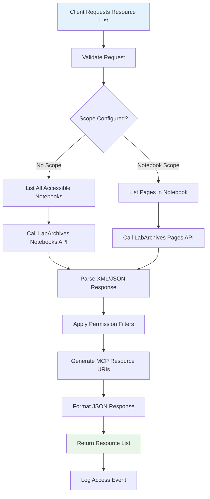
```mermaid
flowchart TD
    A[Client Requests Resource List] --> B[Validate Request]
    B --> C{Scope Configured?}
    C -->|No Scope| D[List All Accessible Notebooks]
    C -->|Notebook Scope| E[List Pages in Notebook]
    D --> F[Call LabArchives Notebooks API]
    E --> G[Call LabArchives Pages API]
    F --> H[Parse XML/JSON Response]
    G --> H
    H --> I[Apply Permission Filters]
    I --> J[Generate MCP Resource URIs]
    J --> K[Format JSON Response]
    K --> L[Return Resource List]
    L --> M[Log Access Event]
    
    style A fill:#e3f2fd
    style L fill:#e8f5e8
```

#### Content Retrieval Workflow

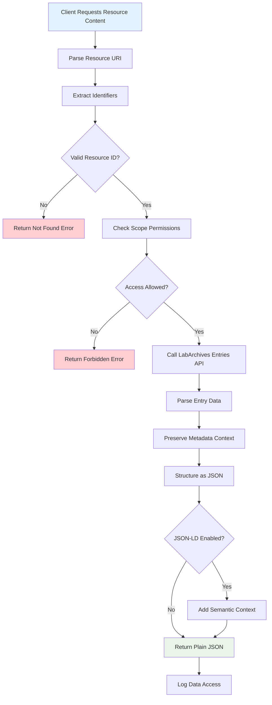
```mermaid
flowchart TD
    A[Client Requests Resource Content] --> B[Parse Resource URI]
    B --> C[Extract Identifiers]
    C --> D{Valid Resource ID?}
    D -->|No| E[Return Not Found Error]
    D -->|Yes| F[Check Scope Permissions]
    F --> G{Access Allowed?}
    G -->|No| H[Return Forbidden Error]
    G -->|Yes| I[Call LabArchives Entries API]
    I --> J[Parse Entry Data]
    J --> K[Preserve Metadata Context]
    K --> L[Structure as JSON]
    L --> M{JSON-LD Enabled?}
    M -->|Yes| N[Add Semantic Context]
    M -->|No| O[Return Plain JSON]
    N --> O
    O --> P[Log Data Access]
    
    style A fill:#e3f2fd
    style O fill:#e8f5e8
    style E fill:#ffcdd2
    style H fill:#ffcdd2
```

### 4.1.3 Error Handling and Recovery Flows

#### Authentication Error Recovery

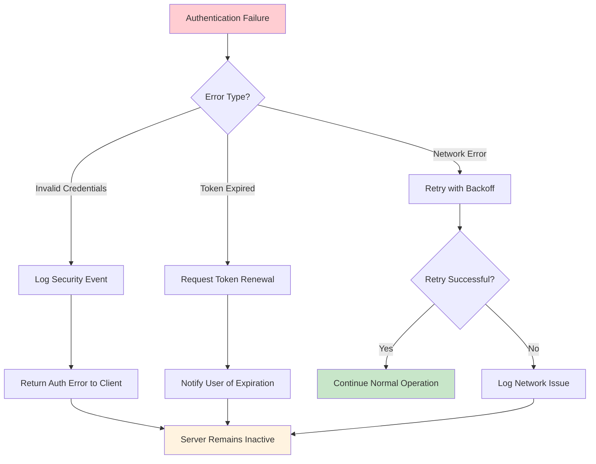
```mermaid
flowchart TD
    A[Authentication Failure] --> B{Error Type?}
    B -->|Invalid Credentials| C[Log Security Event]
    B -->|Token Expired| D[Request Token Renewal]
    B -->|Network Error| E[Retry with Backoff]
    C --> F[Return Auth Error to Client]
    D --> G[Notify User of Expiration]
    E --> H{Retry Successful?}
    F --> I[Server Remains Inactive]
    G --> I
    H -->|Yes| J[Continue Normal Operation]
    H -->|No| K[Log Network Issue]
    K --> I
    
    style A fill:#ffcdd2
    style J fill:#c8e6c9
    style I fill:#fff3e0
```

#### API Rate Limiting and Timeout Handling

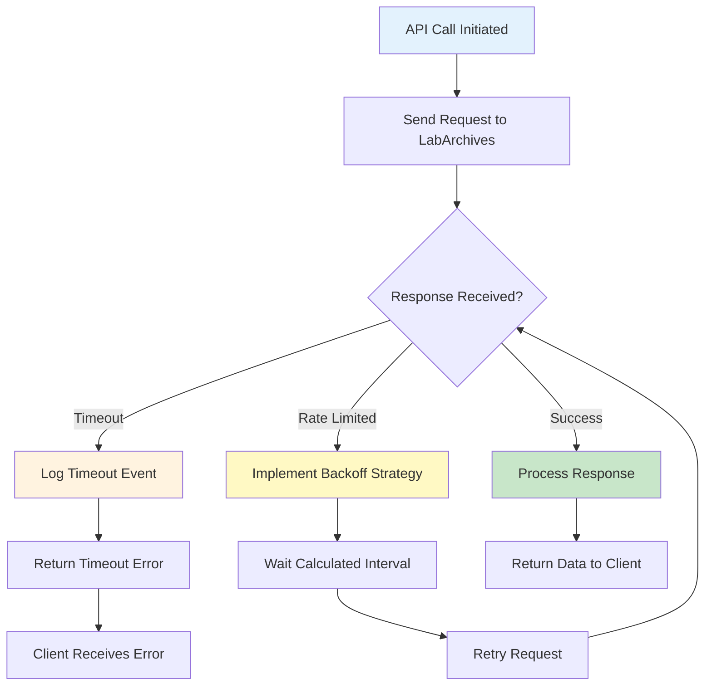
```mermaid
flowchart TD
    A[API Call Initiated] --> B[Send Request to LabArchives]
    B --> C{Response Received?}
    C -->|Timeout| D[Log Timeout Event]
    C -->|Rate Limited| E[Implement Backoff Strategy]
    C -->|Success| F[Process Response]
    D --> G[Return Timeout Error]
    E --> H[Wait Calculated Interval]
    H --> I[Retry Request]
    I --> C
    F --> J[Return Data to Client]
    G --> K[Client Receives Error]
    
    style A fill:#e3f2fd
    style F fill:#c8e6c9
    style D fill:#fff3e0
    style E fill:#fff9c4
```

## 4.2 TECHNICAL IMPLEMENTATION FLOWS

### 4.2.1 State Management and Transitions

#### Server Lifecycle State Machine

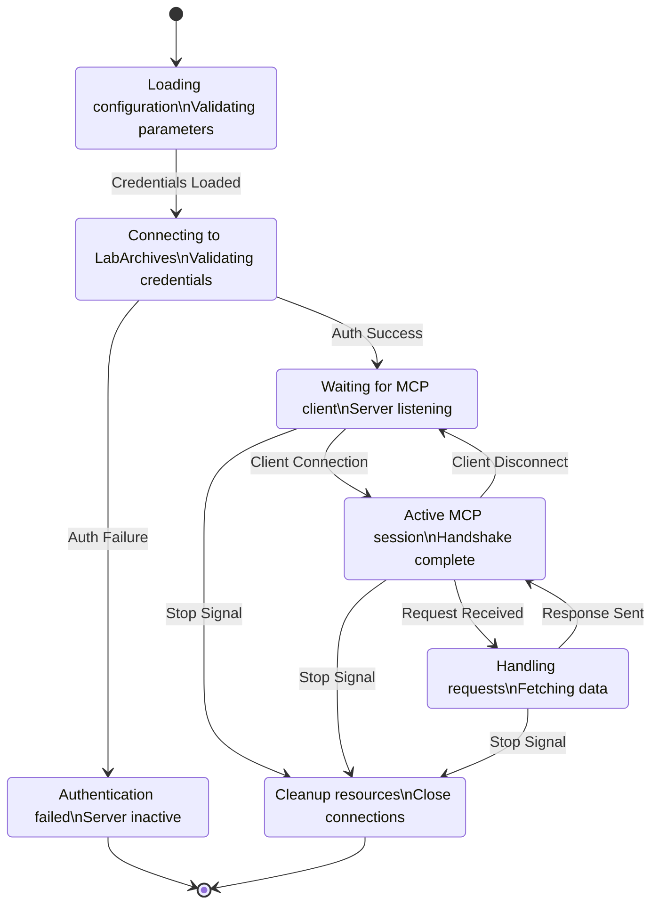
```mermaid
stateDiagram-v2
    [*] --> Initializing
    Initializing --> Authenticating: Credentials Loaded
    Authenticating --> Ready: Auth Success
    Authenticating --> Failed: Auth Failure
    Ready --> Connected: Client Connection
    Connected --> Processing: Request Received
    Processing --> Connected: Response Sent
    Connected --> Ready: Client Disconnect
    Ready --> Shutdown: Stop Signal
    Connected --> Shutdown: Stop Signal
    Processing --> Shutdown: Stop Signal
    Failed --> [*]
    Shutdown --> [*]
    
    Initializing: Loading configuration\nValidating parameters
    Authenticating: Connecting to LabArchives\nValidating credentials
    Ready: Waiting for MCP client\nServer listening
    Connected: Active MCP session\nHandshake complete
    Processing: Handling requests\nFetching data
    Failed: Authentication failed\nServer inactive
    Shutdown: Cleanup resources\nClose connections
```

#### Request Processing State Flow

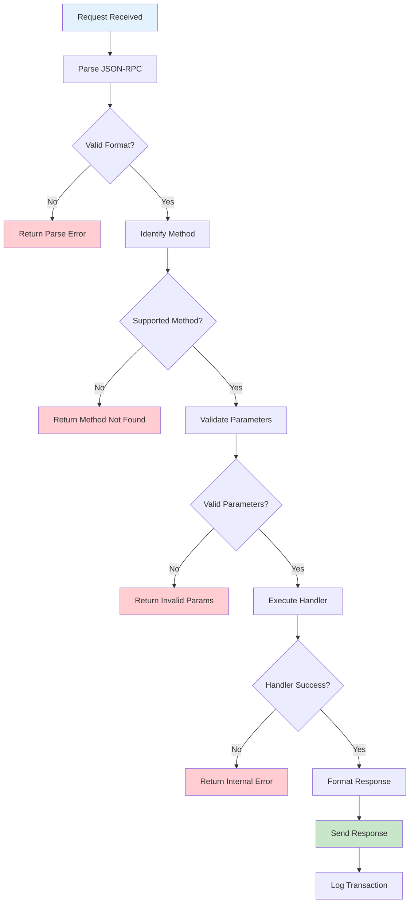
```mermaid
flowchart TD
    A[Request Received] --> B[Parse JSON-RPC]
    B --> C{Valid Format?}
    C -->|No| D[Return Parse Error]
    C -->|Yes| E[Identify Method]
    E --> F{Supported Method?}
    F -->|No| G[Return Method Not Found]
    F -->|Yes| H[Validate Parameters]
    H --> I{Valid Parameters?}
    I -->|No| J[Return Invalid Params]
    I -->|Yes| K[Execute Handler]
    K --> L{Handler Success?}
    L -->|No| M[Return Internal Error]
    L -->|Yes| N[Format Response]
    N --> O[Send Response]
    O --> P[Log Transaction]
    
    style A fill:#e3f2fd
    style O fill:#c8e6c9
    style D fill:#ffcdd2
    style G fill:#ffcdd2
    style J fill:#ffcdd2
    style M fill:#ffcdd2
```

### 4.2.2 Data Persistence and Caching

#### Stateless Operation Model

JSON-RPC is a stateless, light-weight remote procedure call protocol, and the LabArchives MCP Server follows this principle with no persistent storage requirements.

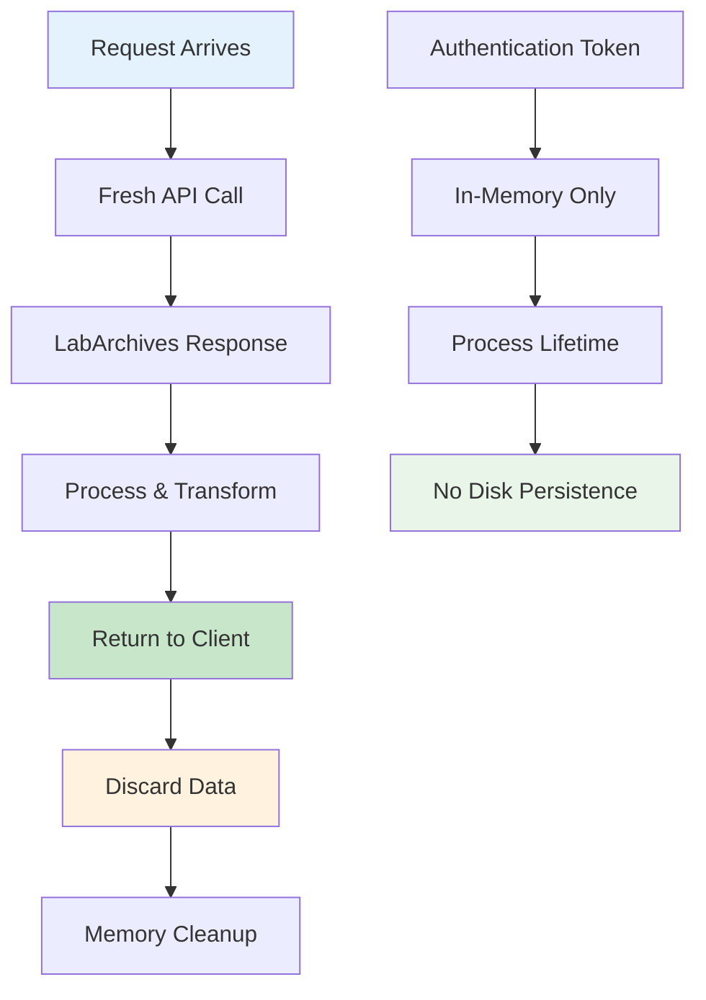
```mermaid
flowchart TD
    A[Request Arrives] --> B[Fresh API Call]
    B --> C[LabArchives Response]
    C --> D[Process & Transform]
    D --> E[Return to Client]
    E --> F[Discard Data]
    F --> G[Memory Cleanup]
    
    H[Authentication Token] --> I[In-Memory Only]
    I --> J[Process Lifetime]
    J --> K[No Disk Persistence]
    
    style A fill:#e3f2fd
    style E fill:#c8e6c9
    style F fill:#fff3e0
    style K fill:#e8f5e8
```

### 4.2.3 Security and Audit Workflows

#### Comprehensive Audit Trail Flow

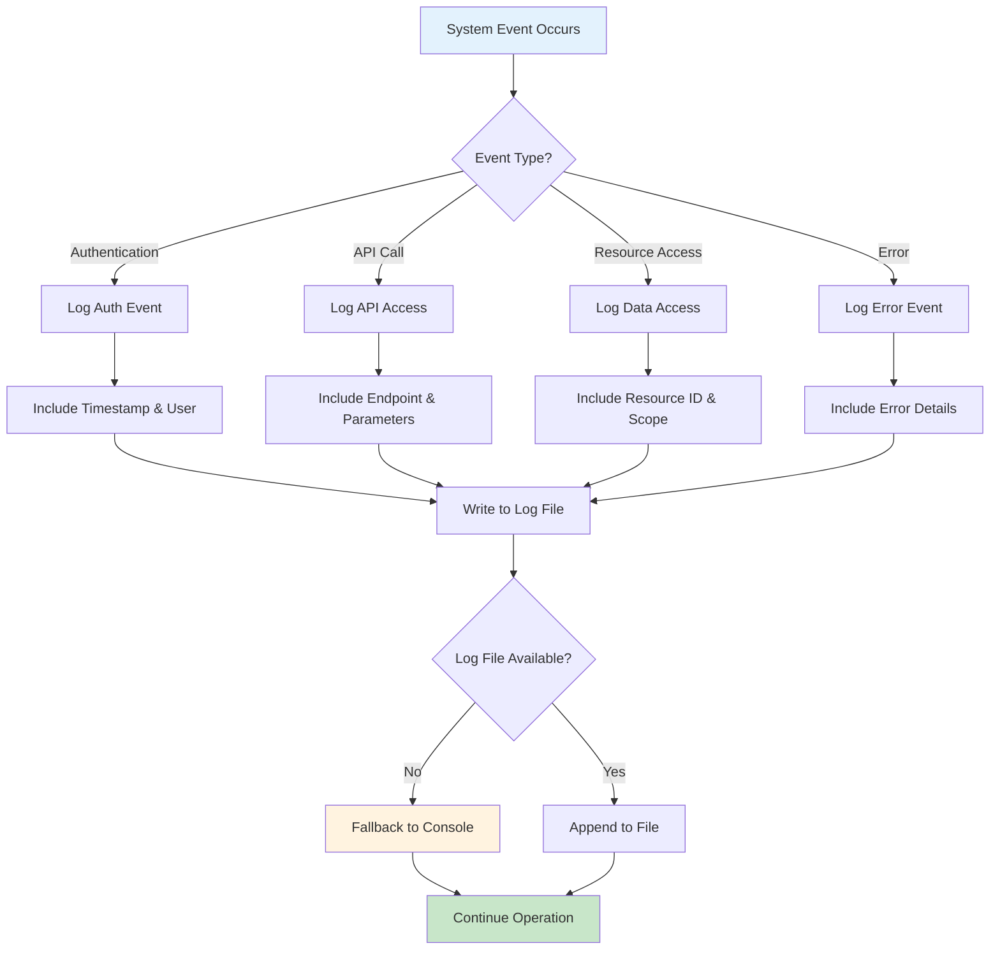
```mermaid
flowchart TD
    A[System Event Occurs] --> B{Event Type?}
    B -->|Authentication| C[Log Auth Event]
    B -->|API Call| D[Log API Access]
    B -->|Resource Access| E[Log Data Access]
    B -->|Error| F[Log Error Event]
    
    C --> G[Include Timestamp & User]
    D --> H[Include Endpoint & Parameters]
    E --> I[Include Resource ID & Scope]
    F --> J[Include Error Details]
    
    G --> K[Write to Log File]
    H --> K
    I --> K
    J --> K
    
    K --> L{Log File Available?}
    L -->|No| M[Fallback to Console]
    L -->|Yes| N[Append to File]
    M --> O[Continue Operation]
    N --> O
    
    style A fill:#e3f2fd
    style O fill:#c8e6c9
    style M fill:#fff3e0
```

#### Security Validation Pipeline

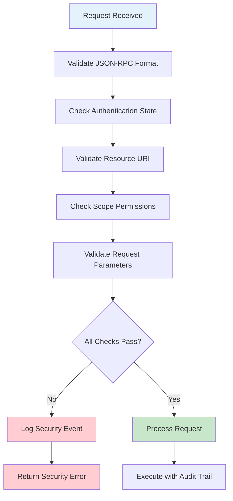
```mermaid
flowchart TD
    A[Request Received] --> B[Validate JSON-RPC Format]
    B --> C[Check Authentication State]
    C --> D[Validate Resource URI]
    D --> E[Check Scope Permissions]
    E --> F[Validate Request Parameters]
    F --> G{All Checks Pass?}
    G -->|No| H[Log Security Event]
    G -->|Yes| I[Process Request]
    H --> J[Return Security Error]
    I --> K[Execute with Audit Trail]
    
    style A fill:#e3f2fd
    style I fill:#c8e6c9
    style H fill:#ffcdd2
    style J fill:#ffcdd2
```

## 4.3 INTEGRATION SEQUENCE DIAGRAMS

### 4.3.1 Complete User Session Flow

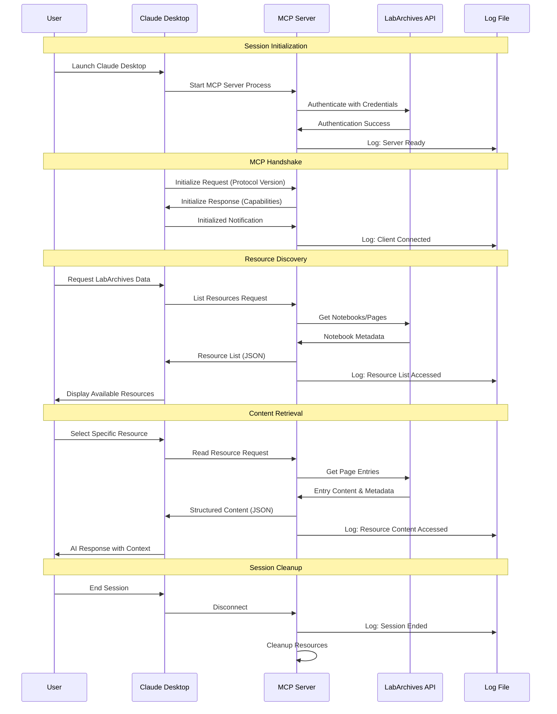
```mermaid
sequenceDiagram
    participant U as User
    participant C as Claude Desktop
    participant S as MCP Server
    participant L as LabArchives API
    participant F as Log File
    
    Note over U,F: Session Initialization
    U->>C: Launch Claude Desktop
    C->>S: Start MCP Server Process
    S->>L: Authenticate with Credentials
    L->>S: Authentication Success
    S->>F: Log: Server Ready
    
    Note over U,F: MCP Handshake
    C->>S: Initialize Request (Protocol Version)
    S->>C: Initialize Response (Capabilities)
    C->>S: Initialized Notification
    S->>F: Log: Client Connected
    
    Note over U,F: Resource Discovery
    U->>C: Request LabArchives Data
    C->>S: List Resources Request
    S->>L: Get Notebooks/Pages
    L->>S: Notebook Metadata
    S->>C: Resource List (JSON)
    S->>F: Log: Resource List Accessed
    C->>U: Display Available Resources
    
    Note over U,F: Content Retrieval
    U->>C: Select Specific Resource
    C->>S: Read Resource Request
    S->>L: Get Page Entries
    L->>S: Entry Content & Metadata
    S->>C: Structured Content (JSON)
    S->>F: Log: Resource Content Accessed
    C->>U: AI Response with Context
    
    Note over U,F: Session Cleanup
    U->>C: End Session
    C->>S: Disconnect
    S->>F: Log: Session Ended
    S->>S: Cleanup Resources
```

### 4.3.2 Error Handling Sequence

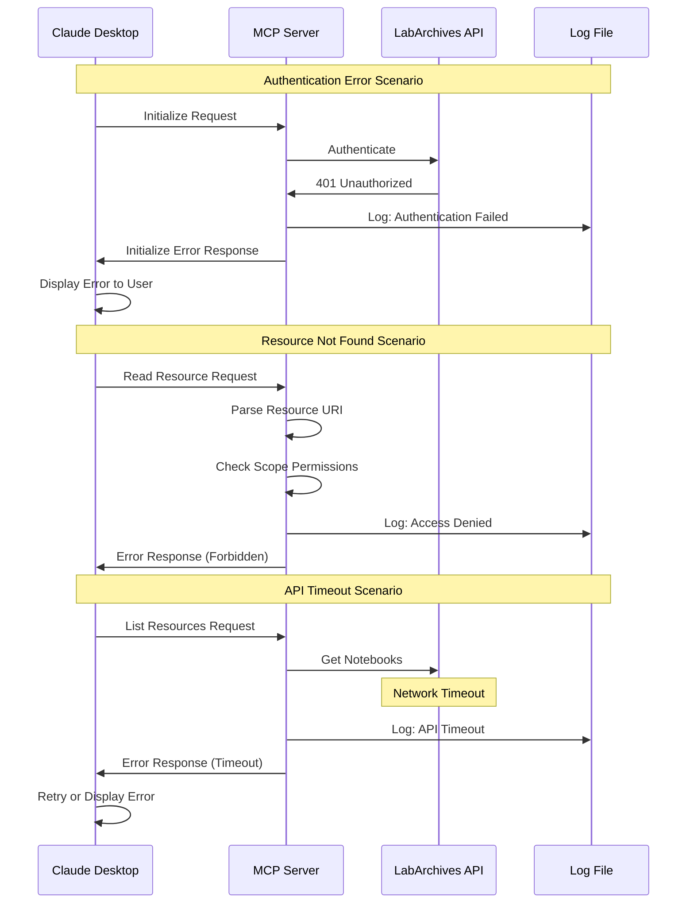
```mermaid
sequenceDiagram
    participant C as Claude Desktop
    participant S as MCP Server
    participant L as LabArchives API
    participant F as Log File
    
    Note over C,F: Authentication Error Scenario
    C->>S: Initialize Request
    S->>L: Authenticate
    L->>S: 401 Unauthorized
    S->>F: Log: Authentication Failed
    S->>C: Initialize Error Response
    C->>C: Display Error to User
    
    Note over C,F: Resource Not Found Scenario
    C->>S: Read Resource Request
    S->>S: Parse Resource URI
    S->>S: Check Scope Permissions
    S->>F: Log: Access Denied
    S->>C: Error Response (Forbidden)
    
    Note over C,F: API Timeout Scenario
    C->>S: List Resources Request
    S->>L: Get Notebooks
    Note over L: Network Timeout
    S->>F: Log: API Timeout
    S->>C: Error Response (Timeout)
    C->>C: Retry or Display Error
```

## 4.4 PERFORMANCE AND TIMING CONSTRAINTS

### 4.4.1 Response Time Requirements

| Operation | Target Response Time | Maximum Acceptable | Timeout Threshold |
|-----------|---------------------|-------------------|-------------------|
| MCP Handshake | < 1 second | 2 seconds | 5 seconds |
| Resource Listing | < 2 seconds | 5 seconds | 10 seconds |
| Content Retrieval | < 5 seconds | 10 seconds | 30 seconds |
| Authentication | < 3 seconds | 5 seconds | 15 seconds |

### 4.4.2 Scalability Considerations

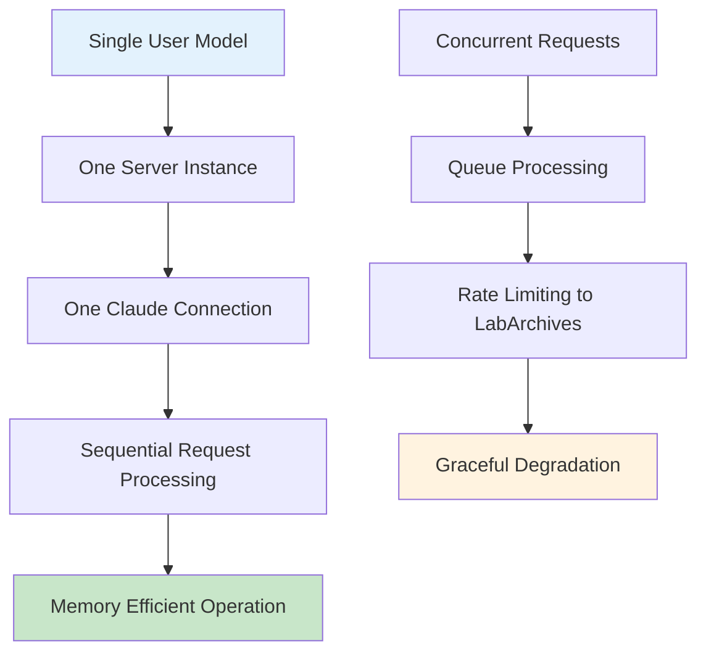
```mermaid
flowchart TD
    A[Single User Model] --> B[One Server Instance]
    B --> C[One Claude Connection]
    C --> D[Sequential Request Processing]
    D --> E[Memory Efficient Operation]
    
    F[Concurrent Requests] --> G[Queue Processing]
    G --> H[Rate Limiting to LabArchives]
    H --> I[Graceful Degradation]
    
    style A fill:#e3f2fd
    style E fill:#c8e6c9
    style I fill:#fff3e0
```

## 4.5 VALIDATION AND COMPLIANCE CHECKPOINTS

### 4.5.1 Data Validation Pipeline

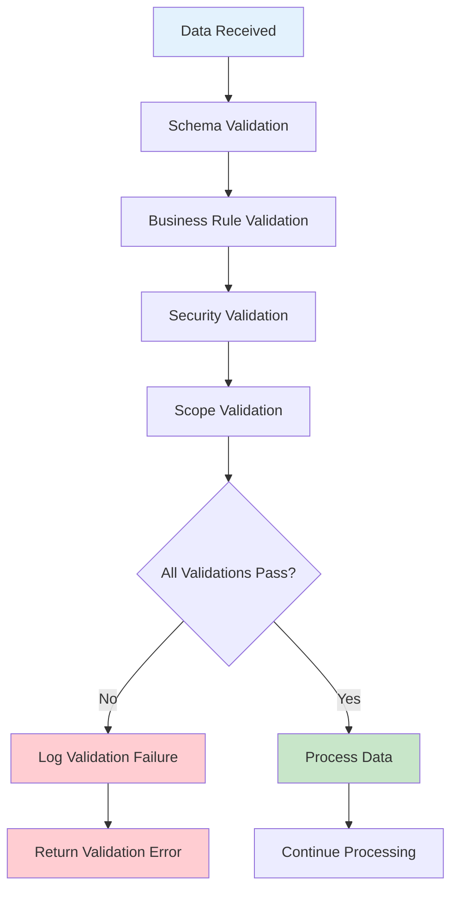
```mermaid
flowchart TD
    A[Data Received] --> B[Schema Validation]
    B --> C[Business Rule Validation]
    C --> D[Security Validation]
    D --> E[Scope Validation]
    E --> F{All Validations Pass?}
    F -->|No| G[Log Validation Failure]
    F -->|Yes| H[Process Data]
    G --> I[Return Validation Error]
    H --> J[Continue Processing]
    
    style A fill:#e3f2fd
    style H fill:#c8e6c9
    style G fill:#ffcdd2
    style I fill:#ffcdd2
```

### 4.5.2 Compliance Monitoring Flow

```mermaid
flowchart TD
    A[System Operation] --> B[Continuous Monitoring]
    B --> C[Audit Log Generation]
    C --> D[Access Pattern Analysis]
    D --> E[Compliance Validation]
    E --> F{Compliance Issues?}
    F -->|Yes| G[Generate Alert]
    F -->|No| H[Continue Monitoring]
    G --> I[Log Compliance Event]
    I --> J[Notify Administrator]
    H --> B
    
    style A fill:#e3f2fd
    style H fill:#c8e6c9
    style G fill:#fff3e0
    style J fill:#ffcdd2
```

The process flowcharts demonstrate the comprehensive workflow architecture of the LabArchives MCP Server, from initial user setup through active AI-enhanced research sessions. MCP provides a universal, open standard for connecting AI systems with data sources, replacing fragmented integrations with a single protocol, enabling seamless integration between researchers' LabArchives data and AI applications while maintaining security, auditability, and compliance throughout all system operations.

# 5. SYSTEM ARCHITECTURE

## 5.1 HIGH-LEVEL ARCHITECTURE

### 5.1.1 System Overview

The LabArchives MCP Server implements a client-server architecture where developers can either expose their data through MCP servers or build AI applications (MCP clients) that connect to these servers. It provides a universal, open standard for connecting AI systems with data sources, replacing fragmented integrations with a single protocol.

The system follows a **stateless, protocol-driven architecture** that leverages the Model Context Protocol as the primary communication standard. The Model Context Protocol uses a client-server architecture partially inspired by the Language Server Protocol (LSP), which helps different programming languages connect with a wide range of dev tools. Similarly, the aim of MCP is to provide a universal way for AI applications to interact with external systems by standardizing context.

**Key Architectural Principles:**

- **Protocol Standardization**: The Model Context Protocol (MCP) is an open standard that enables large language models to interact dynamically with external tools, databases, and APIs through a standardized interface
- **Stateless Operation**: Each request is independent and atomic, with no persistent state maintained between operations
- **Security by Design**: All data access is authenticated, scoped, and audited with comprehensive logging
- **Separation of Concerns**: Clear boundaries between MCP protocol handling, LabArchives API integration, and business logic

**System Boundaries:**

The system operates within well-defined boundaries that ensure security and maintainability:

- **Internal Boundary**: MCP protocol implementation, authentication management, and data transformation logic
- **External Boundary**: LabArchives REST API integration and MCP client communication
- **Security Boundary**: Credential management, scope enforcement, and audit logging

**Major Interfaces:**

- **MCP Protocol Interface**: All transports use JSON-RPC 2.0 to exchange messages. See the specification for detailed information about the Model Context Protocol message format
- **LabArchives API Interface**: RESTful HTTP communication with authentication and data retrieval
- **Command Line Interface**: Configuration and operational control for deployment and management

### 5.1.2 Core Components Table

| Component Name | Primary Responsibility | Key Dependencies | Integration Points |
|---------------|----------------------|------------------|-------------------|
| **MCP Server Core** | Protocol compliance and message routing | Python MCP SDK, FastMCP | Claude Desktop, MCP Inspector |
| **LabArchives API Client** | Data retrieval and authentication | HTTP requests library, XML/JSON parsing | LabArchives REST API |
| **Resource Manager** | Resource discovery and content delivery | MCP Server Core, API Client | MCP protocol handlers |
| **Authentication Manager** | Credential handling and session management | Environment variables, secure storage | LabArchives API, CLI interface |

### 5.1.3 Data Flow Description

The primary data flow follows a **request-response pattern** optimized for AI consumption:

**Resource Discovery Flow**: When a Host application starts it creates N MCP Clients, which exchange information about capabilities and protocol versions via a handshake. Discovery: Clients requests what capabilities (Tools, Resources, Prompts) the server offers. The Server responds with a list and descriptions.

**Content Retrieval Flow**: When an MCP client requests specific content, the server authenticates the request, validates scope permissions, fetches data from LabArchives API, transforms it into structured JSON, and returns it through the MCP protocol. External processing: The MCP server processes the request, performing whatever action is needed—querying a weather service, reading a file, or accessing a database. Result return: The server returns the requested information to the client in a standardized format. Context integration: Claude receives this information and incorporates it into its understanding of the conversation. Response generation: Claude generates a response that includes the external information, providing you with an answer based on current data.

**Integration Patterns**: The system uses **adapter patterns** to bridge between MCP protocol requirements and LabArchives API responses. Data transformation occurs at the boundary between external API responses and internal MCP resource representations.

**Data Transformation Points**: Raw LabArchives XML/JSON responses are converted to structured Python dictionaries, then serialized to MCP-compliant JSON resources with preserved metadata and hierarchical context.

### 5.1.4 External Integration Points

| System Name | Integration Type | Data Exchange Pattern | Protocol/Format |
|-------------|------------------|----------------------|-----------------|
| **LabArchives API** | REST API Client | Request-Response | HTTPS/JSON-XML |
| **Claude Desktop** | MCP Protocol | Bidirectional Messaging | JSON-RPC 2.0 |
| **MCP Inspector** | Development Tool | Protocol Testing | JSON-RPC 2.0 |

## 5.2 COMPONENT DETAILS

### 5.2.1 MCP Server Core

**Purpose and Responsibilities:**
FastMCP handles all the complex protocol details and server management, so you can focus on building great tools. It's designed to be high-level and Pythonic; in most cases, decorating a function is all you need. The MCP Server Core manages protocol compliance, message routing, and client communication.

**Technologies and Frameworks:**
- **FastMCP Framework**: FastMCP is a high-level Python framework that dramatically simplifies the process of building MCP servers. While the raw MCP protocol requires implementing server setup, protocol handlers, content types, and error management, FastMCP handles all these complex details for you. At its heart, FastMCP provides a decorator-based API that transforms regular Python functions into MCP-compatible tools, resources, and prompts
- **Python MCP SDK**: Official protocol implementation with JSON-RPC transport
- **Pydantic**: Data validation and serialization for structured outputs

**Key Interfaces and APIs:**
- `resources/list`: Enumerate available LabArchives resources
- `resources/read`: Retrieve specific resource content
- Server initialization and capability negotiation

**Data Persistence Requirements:**
No persistent storage required - operates as a stateless service with in-memory session management only.

**Scaling Considerations:**
Single-user deployment model with sequential request processing. Memory-efficient operation suitable for desktop deployment.

### 5.2.2 LabArchives API Client

**Purpose and Responsibilities:**
Provides secure, authenticated access to LabArchives electronic lab notebook data through their REST API, supporting both permanent API keys and temporary user tokens.

**Technologies and Frameworks:**
- **Python Requests**: HTTP client library for REST API communication
- **XML/JSON Parsing**: Built-in Python libraries for response processing
- **Authentication Protocols**: LabArchives API key and token management

**Key Interfaces and APIs:**
- Notebook listing and metadata retrieval
- Page content and entry data fetching
- User authentication and session management
- Error handling for API failures and rate limiting

**Data Persistence Requirements:**
Credentials stored in environment variables only - no disk persistence for security.

**Scaling Considerations:**
API rate limiting compliance with graceful degradation and retry mechanisms.

### 5.2.3 Resource Manager

**Purpose and Responsibilities:**
Implements MCP resource discovery and content delivery, bridging LabArchives data with MCP protocol requirements while enforcing scope limitations and access controls.

**Technologies and Frameworks:**
- **JSON Serialization**: Python built-in libraries for structured output
- **URI Scheme Handling**: Custom LabArchives resource URI generation
- **Scope Validation**: Configuration-based access control enforcement

**Key Interfaces and APIs:**
- Resource URI generation and parsing
- Hierarchical data structure preservation
- Metadata contextualization for AI consumption
- Scope-based filtering and access validation

**Data Persistence Requirements:**
Transient data processing only - no caching or persistent storage.

**Scaling Considerations:**
On-demand data retrieval with memory-efficient processing for large notebook datasets.

### 5.2.4 Authentication Manager

**Purpose and Responsibilities:**
Manages secure authentication mechanisms for LabArchives API access, supporting both permanent API keys and temporary user tokens with comprehensive security controls.

**Technologies and Frameworks:**
- **Environment Variable Handling**: Secure credential storage
- **Session Management**: Authentication state tracking
- **Token Validation**: Credential format and expiration checking

**Key Interfaces and APIs:**
- Credential validation and session establishment
- Token refresh and expiration handling
- Security policy enforcement
- Audit trail generation for access events

**Data Persistence Requirements:**
In-memory credential storage only - no disk persistence for security compliance.

**Scaling Considerations:**
Single-session model with secure credential lifecycle management.

### 5.2.5 Component Interaction Diagrams

```mermaid
graph TB
    subgraph "MCP Server Core"
        A[FastMCP Server] --> B[Protocol Handler]
        B --> C[Message Router]
        C --> D[Response Formatter]
    end
    
    subgraph "Resource Manager"
        E[Resource Discovery] --> F[Content Retrieval]
        F --> G[Data Transformation]
        G --> H[Scope Validation]
    end
    
    subgraph "LabArchives Integration"
        I[API Client] --> J[Authentication]
        J --> K[Request Handler]
        K --> L[Response Parser]
    end
    
    subgraph "External Systems"
        M[Claude Desktop]
        N[LabArchives API]
    end
    
    M --> A
    A --> E
    E --> I
    I --> N
    
    L --> G
    D --> M
    
    style A fill:#e1f5fe
    style I fill:#f3e5f5
    style E fill:#e8f5e8
```

### 5.2.6 State Transition Diagrams

```mermaid
stateDiagram-v2
    [*] --> Initializing
    Initializing --> Authenticating: Load Configuration
    Authenticating --> Ready: Auth Success
    Authenticating --> Failed: Auth Failure
    Ready --> Processing: MCP Request
    Processing --> Ready: Response Sent
    Processing --> Error: Request Failed
    Error --> Ready: Error Handled
    Ready --> Shutdown: Stop Signal
    Processing --> Shutdown: Force Stop
    Failed --> [*]
    Shutdown --> [*]
    
    Initializing: Loading credentials\nValidating configuration
    Authenticating: LabArchives API login\nToken validation
    Ready: Awaiting MCP requests\nServer listening
    Processing: Handling resource requests\nData retrieval and transformation
    Error: Request processing failure\nError response generation
    Failed: Authentication failure\nServer inactive
    Shutdown: Resource cleanup\nConnection termination
```

### 5.2.7 Key Flow Sequence Diagrams

```mermaid
sequenceDiagram
    participant C as Claude Desktop
    participant S as MCP Server
    participant R as Resource Manager
    participant A as API Client
    participant L as LabArchives API
    
    Note over C,L: Resource Discovery Flow
    C->>S: resources/list request
    S->>R: enumerate resources
    R->>A: get notebooks/pages
    A->>L: API authentication
    L->>A: auth success
    A->>L: fetch notebook list
    L->>A: notebook metadata
    A->>R: parsed data
    R->>S: resource list
    S->>C: MCP resource response
    
    Note over C,L: Content Retrieval Flow
    C->>S: resources/read request
    S->>R: validate scope & URI
    R->>A: fetch page content
    A->>L: get page entries
    L->>A: entry data
    A->>R: structured content
    R->>S: JSON response
    S->>C: resource content
```

## 5.3 TECHNICAL DECISIONS

### 5.3.1 Architecture Style Decisions

**Decision: Client-Server Architecture with MCP Protocol**

| Aspect | Decision | Rationale | Trade-offs |
|--------|----------|-----------|------------|
| **Architecture Pattern** | MCP Client-Server | Industry standard for AI integrations | Limited to MCP-compatible clients |
| **Communication Protocol** | JSON-RPC 2.0 | MCP specification requirement | More overhead than binary protocols |
| **State Management** | Stateless Operations | Scalability and reliability | No session persistence benefits |

**Justification**: The Model Context Protocol is an open standard that enables developers to build secure, two-way connections between their data sources and AI-powered tools. The architecture is straightforward: developers can either expose their data through MCP servers or build AI applications (MCP clients) that connect to these servers. This approach ensures compatibility with the growing MCP ecosystem while maintaining security and simplicity.

### 5.3.2 Communication Pattern Choices

**Decision: Request-Response with JSON-RPC Transport**

The system implements synchronous request-response patterns optimized for AI consumption. The protocol layer handles message framing, request/response linking, and high-level communication patterns. MCP supports multiple transport mechanisms: All transports use JSON-RPC 2.0 to exchange messages.

**Benefits:**
- Standardized message format and error handling
- Built-in request correlation and timeout management
- Compatible with existing MCP client implementations
- Simplified debugging and monitoring capabilities

**Limitations:**
- No real-time streaming capabilities
- Higher latency than binary protocols
- Limited to synchronous operations

### 5.3.3 Data Storage Solution Rationale

**Decision: No Persistent Storage (Stateless Design)**

| Storage Type | Decision | Justification | Implementation |
|-------------|----------|---------------|----------------|
| **User Data** | No Local Storage | Security and compliance | Direct API retrieval |
| **Credentials** | Environment Variables | Secure, temporary storage | In-memory only |
| **Cache** | No Caching | Data freshness priority | On-demand fetching |

**Rationale**: The stateless design ensures data freshness, eliminates security risks from persistent storage, and simplifies deployment. All data is retrieved on-demand from LabArchives API, ensuring users always receive current information.

### 5.3.4 Security Mechanism Selection

**Decision: Multi-Layer Security with Scope Enforcement**

```mermaid
graph TD
    A[Request Received] --> B{Authentication Valid?}
    B -->|No| C[Reject Request]
    B -->|Yes| D{Scope Permitted?}
    D -->|No| E[Access Denied]
    D -->|Yes| F{Resource Exists?}
    F -->|No| G[Not Found]
    F -->|Yes| H[Process Request]
    
    C --> I[Log Security Event]
    E --> I
    G --> J[Log Access Event]
    H --> J
    
    style B fill:#fff3e0
    style D fill:#fff3e0
    style F fill:#e8f5e8
    style I fill:#ffcdd2
    style J fill:#e1f5fe
```

**Security Layers:**
1. **Authentication**: LabArchives API key and token validation
2. **Authorization**: Scope-based access control enforcement
3. **Audit**: Comprehensive logging of all access events
4. **Transport**: HTTPS for all external communications

### 5.3.5 Architecture Decision Records

```mermaid
flowchart TD
    A[Architecture Decision] --> B{Complexity Level}
    B -->|High| C[Detailed Analysis Required]
    B -->|Medium| D[Standard Evaluation]
    B -->|Low| E[Quick Decision]
    
    C --> F[Stakeholder Review]
    D --> G[Technical Review]
    E --> H[Implementation]
    
    F --> I[Document Decision]
    G --> I
    H --> I
    
    I --> J[Track Outcomes]
    J --> K[Review Effectiveness]
    
    style A fill:#e3f2fd
    style I fill:#e8f5e8
    style K fill:#fff3e0
```

**Key Architectural Decisions:**

1. **MCP Protocol Adoption**: Chosen for standardization and ecosystem compatibility
2. **FastMCP Framework**: Selected for rapid development and protocol compliance
3. **Stateless Design**: Prioritizes security and simplicity over performance optimization
4. **Read-Only Operations**: MVP scope limitation to minimize risk and complexity

## 5.4 CROSS-CUTTING CONCERNS

### 5.4.1 Monitoring and Observability Approach

**Monitoring Strategy:**
The system implements comprehensive observability through structured logging and performance metrics collection. All system events are captured with appropriate detail levels for operational monitoring and debugging.

**Key Metrics:**
- Request response times and success rates
- LabArchives API call latency and error rates
- Authentication success/failure rates
- Resource access patterns and scope violations

**Observability Tools:**
- Python logging framework with configurable verbosity
- Structured log output for automated analysis
- Performance timing for critical operations
- Error tracking with context preservation

### 5.4.2 Logging and Tracing Strategy

**Logging Architecture:**

| Log Level | Content | Purpose | Retention |
|-----------|---------|---------|-----------|
| **INFO** | Major operations and status | Operational monitoring | Standard |
| **DEBUG** | Detailed execution flow | Development and troubleshooting | Extended |
| **WARN** | Recoverable errors and issues | Alert generation | Long-term |
| **ERROR** | System failures and exceptions | Incident response | Permanent |

**Audit Trail Requirements:**
- All data access operations logged with timestamps
- User context and scope information included
- API call details without sensitive data exposure
- Comprehensive error context for debugging

### 5.4.3 Error Handling Patterns

**Error Handling Strategy:**
The system implements layered error handling with graceful degradation and comprehensive error reporting. Each component handles errors at its appropriate level while maintaining system stability.

```mermaid
flowchart TD
    A[Error Occurs] --> B{Error Type}
    B -->|Authentication| C[Security Error Handler]
    B -->|API Failure| D[External Service Handler]
    B -->|Protocol Error| E[MCP Error Handler]
    B -->|System Error| F[Internal Error Handler]
    
    C --> G[Log Security Event]
    D --> H[Retry Logic]
    E --> I[Protocol Response]
    F --> J[System Recovery]
    
    G --> K[Return Error Response]
    H --> L{Retry Successful?}
    I --> K
    J --> K
    
    L -->|Yes| M[Continue Processing]
    L -->|No| K
    
    style A fill:#ffcdd2
    style K fill:#fff3e0
    style M fill:#e8f5e8
```

**Error Categories:**
- **Authentication Errors**: Invalid credentials or expired tokens
- **Authorization Errors**: Scope violations or access denials
- **API Errors**: LabArchives service failures or rate limiting
- **Protocol Errors**: MCP message format or communication issues
- **System Errors**: Internal processing failures or resource constraints

### 5.4.4 Authentication and Authorization Framework

**Authentication Mechanisms:**
- **API Key Authentication**: Permanent credentials for service accounts
- **Token Authentication**: Temporary user tokens for SSO integration
- **Session Management**: In-memory credential lifecycle tracking

**Authorization Model:**
- **Scope-Based Access**: Configurable notebook and folder restrictions
- **Permission Validation**: LabArchives API permission enforcement
- **Audit Compliance**: Comprehensive access logging and tracking

### 5.4.5 Performance Requirements and SLAs

**Performance Targets:**

| Operation | Target Response Time | Maximum Acceptable | Timeout Threshold |
|-----------|---------------------|-------------------|-------------------|
| **MCP Handshake** | < 1 second | 2 seconds | 5 seconds |
| **Resource Listing** | < 2 seconds | 5 seconds | 10 seconds |
| **Content Retrieval** | < 5 seconds | 10 seconds | 30 seconds |
| **Authentication** | < 3 seconds | 5 seconds | 15 seconds |

**Scalability Considerations:**
- Single-user deployment model with sequential processing
- Memory-efficient operation for desktop environments
- Graceful handling of large notebook datasets
- Rate limiting compliance with LabArchives API

### 5.4.6 Disaster Recovery Procedures

**Recovery Strategy:**
The stateless design simplifies disaster recovery by eliminating persistent state requirements. Recovery procedures focus on credential management and service restoration.

**Recovery Procedures:**
1. **Credential Recovery**: Environment variable restoration and validation
2. **Service Restart**: Automated server process recovery
3. **Connection Restoration**: MCP client reconnection handling
4. **Data Integrity**: On-demand data retrieval ensures consistency

**Backup Requirements:**
- Configuration backup (environment variables and settings)
- Log file preservation for audit compliance
- No user data backup required (source of truth in LabArchives)

The system architecture provides a robust, secure, and maintainable foundation for integrating LabArchives electronic lab notebook data with AI applications through the standardized Model Context Protocol. The design prioritizes security, compliance, and ease of deployment while maintaining the flexibility to support future enhancements and integrations.

# 6. SYSTEM COMPONENTS DESIGN

## 6.1 COMPONENT ARCHITECTURE OVERVIEW

### 6.1.1 System Component Hierarchy

The LabArchives MCP Server follows a modular architecture designed around the Model Context Protocol (MCP) as an open standard that provides a universal, open standard for connecting AI systems with data sources, replacing fragmented integrations with a single protocol. The system implements a layered architecture with clear separation of concerns:

**Core Layer Components:**
- **MCP Protocol Handler**: Manages JSON-RPC 2.0 communication and protocol compliance
- **Resource Management Engine**: Handles resource discovery, listing, and content retrieval
- **Authentication & Security Manager**: Provides secure credential handling and session management
- **LabArchives API Integration Layer**: Interfaces with LabArchives REST API endpoints

**Service Layer Components:**
- **Configuration Management Service**: Handles CLI parsing and environment variable processing
- **Logging & Audit Service**: Provides comprehensive audit trails and operational logging
- **Data Transformation Service**: Converts LabArchives data to MCP-compliant JSON structures
- **Scope Enforcement Service**: Implements configurable access control and data filtering

**Infrastructure Layer Components:**
- **Transport Layer**: Manages stdio/WebSocket communication with MCP clients
- **Error Handling Framework**: Provides centralized exception management and graceful degradation
- **Validation Engine**: Ensures data integrity and security compliance

### 6.1.2 Component Interaction Matrix

| Component | Primary Dependencies | Secondary Dependencies | External Interfaces |
|-----------|---------------------|----------------------|-------------------|
| **MCP Protocol Handler** | FastMCP SDK, JSON-RPC Transport | Logging Service, Error Handler | Claude Desktop, MCP Inspector |
| **Resource Management Engine** | LabArchives API Client, Data Transformer | Scope Enforcement, Validation Engine | MCP Protocol Handler |
| **Authentication Manager** | Environment Variables, Credential Store | Logging Service, Error Handler | LabArchives API |
| **LabArchives API Client** | HTTP Requests Library, XML/JSON Parser | Authentication Manager, Error Handler | LabArchives REST API |
| **Configuration Service** | Python argparse, Environment Access | Validation Engine, Logging Service | Command Line Interface |
| **Logging & Audit Service** | Python logging framework, File I/O | Configuration Service | Log Files, Console Output |

### 6.1.3 Data Flow Architecture

The system implements a **request-response data flow pattern** optimized for AI consumption:

```mermaid
graph TB
    A[MCP Client Request] --> B[MCP Protocol Handler]
    B --> C[Request Validation]
    C --> D{Request Type}
    D -->|resources/list| E[Resource Discovery Engine]
    D -->|resources/read| F[Content Retrieval Engine]
    E --> G[LabArchives API Client]
    F --> G
    G --> H[Authentication Manager]
    H --> I[LabArchives REST API]
    I --> J[Response Parser]
    J --> K[Data Transformation Service]
    K --> L[Scope Enforcement]
    L --> M[JSON Serialization]
    M --> N[MCP Response Formatter]
    N --> O[Audit Logger]
    O --> P[MCP Client Response]
    
    style A fill:#e3f2fd
    style P fill:#e8f5e8
    style I fill:#f3e5f5
```

## 6.2 CORE COMPONENTS SPECIFICATION

### 6.2.1 MCP Protocol Handler Component

**Component Purpose:**
The MCP Protocol Handler serves as the primary interface between external MCP clients and the LabArchives data system. FastMCP 1.0 was incorporated into the official MCP Python SDK in 2024. This is FastMCP 2.0, the actively maintained version that provides a complete toolkit for working with the MCP ecosystem.

**Technical Implementation:**

| Aspect | Specification | Implementation Details |
|--------|---------------|----------------------|
| **Framework** | FastMCP 2.0 with Official MCP SDK | FastMCP handles all the complex protocol details and server management, so you can focus on building great tools. It's designed to be high-level and Pythonic; in most cases, decorating a function is all you need |
| **Protocol Compliance** | JSON-RPC 2.0 over stdio/WebSocket | All messages between MCP clients and servers MUST follow the JSON-RPC 2.0 specification |
| **Message Types** | Request, Response, Notification | Supports resources/list, resources/read, and capability negotiation |
| **Transport Layer** | Standard I/O (primary), WebSocket (optional) | Compatible with Claude Desktop stdio transport |

**Key Interfaces:**

```python
# Resource listing interface
@mcp.resource()
async def list_labarchives_resources() -> List[Resource]:
    """Enumerate available LabArchives notebooks, pages, and entries"""
    
# Resource reading interface  
@mcp.resource()
async def read_labarchives_resource(uri: str) -> ResourceContent:
    """Retrieve specific LabArchives content by URI"""
```

**Performance Requirements:**
- Message processing latency: < 100ms
- Concurrent connection support: Single client (desktop model)
- Memory footprint: < 50MB during active operation
- Protocol handshake time: < 1 second

**Error Handling Strategy:**
- JSON-RPC error codes for protocol violations
- Graceful degradation for API failures
- Comprehensive error logging without credential exposure
- Client-friendly error messages for troubleshooting

### 6.2.2 LabArchives API Integration Component

**Component Purpose:**
Provides secure, authenticated access to LabArchives electronic lab notebook data through their REST API, supporting both permanent API keys and temporary user tokens.

**API Integration Specifications:**

| Feature | Implementation | Configuration |
|---------|----------------|---------------|
| **Base URLs** | Regional API endpoints | https://api.labarchives.com/api is the normal base URL for the LabArchives API, however this may vary by region (for Australia, use https://auapi.labarchives.com/api) |
| **Authentication** | Access Key ID + Password/Token | access_key_id = config['access_key_id'] access_password = config['access_password'] client = Client(api_url, access_key_id, access_password) |
| **Request Format** | HTTPS REST with query parameters | https://<baseurl>/api/<api_class>/<api_method>?<Call Authentication Parameters> |
| **Response Format** | XML/JSON parsing with error handling | Supports both XML and JSON response formats |

**Core API Methods:**

| Method | Purpose | Parameters | Response Format |
|--------|---------|------------|-----------------|
| **notebooks/list** | Retrieve user's notebooks | uid, authentication | XML/JSON notebook metadata |
| **pages/list** | Get pages within notebook | notebook_id, uid, auth | XML/JSON page listings |
| **entries/get** | Fetch page entries and content | page_id, uid, auth | XML/JSON entry data |
| **users/user_info** | Get user context for tokens | email, token | XML/JSON user details |

**Authentication Flow:**

```mermaid
sequenceDiagram
    participant C as Component
    participant A as Auth Manager
    participant L as LabArchives API
    
    C->>A: Initialize with credentials
    A->>L: Validate access key + token
    L->>A: Return user context/session
    A->>C: Provide authenticated session
    C->>L: Make API calls with session
    L->>C: Return data responses
    
    Note over A,L: Token refresh handling
    A->>L: Detect token expiration
    L->>A: 401 Unauthorized
    A->>C: Request credential renewal
```

**Data Processing Pipeline:**
1. **Request Formation**: Construct API URLs with proper authentication parameters
2. **HTTP Communication**: Execute HTTPS requests with timeout and retry logic
3. **Response Parsing**: Parse XML/JSON responses into Python data structures
4. **Error Handling**: Detect and handle API errors, rate limiting, and network issues
5. **Data Validation**: Ensure response integrity and expected format compliance

### 6.2.3 Resource Management Engine

**Component Purpose:**
Implements MCP resource discovery and content delivery, bridging LabArchives data with MCP protocol requirements while enforcing scope limitations and access controls.

**Resource Model Architecture:**

| Resource Type | URI Pattern | Content Structure | Metadata Fields |
|---------------|-------------|-------------------|-----------------|
| **Notebook** | `labarchives://notebook/{id}` | Notebook metadata and page list | name, description, created_date, owner |
| **Page** | `labarchives://notebook/{nb_id}/page/{page_id}` | Page content with entries | title, last_modified, entry_count, folder_path |
| **Entry** | `labarchives://entry/{entry_id}` | Individual entry content | entry_type, content, timestamp, author |

**Resource Discovery Implementation:**

```python
class ResourceDiscoveryEngine:
    def __init__(self, api_client: LabArchivesClient, scope_config: ScopeConfig):
        self.api_client = api_client
        self.scope_config = scope_config
    
    async def list_resources(self) -> List[MCPResource]:
        """Enumerate available resources based on scope configuration"""
        if self.scope_config.notebook_id:
            return await self._list_pages_in_notebook(self.scope_config.notebook_id)
        else:
            return await self._list_all_notebooks()
    
    async def read_resource(self, uri: str) -> ResourceContent:
        """Retrieve specific resource content with scope validation"""
        resource_id = self._parse_resource_uri(uri)
        self._validate_scope_access(resource_id)
        return await self._fetch_resource_content(resource_id)
```

**Content Transformation Pipeline:**
1. **Raw Data Retrieval**: Fetch data from LabArchives API
2. **Structure Preservation**: Maintain hierarchical relationships (notebook → page → entry)
3. **Metadata Enhancement**: Add contextual information for AI consumption
4. **JSON Serialization**: Convert to MCP-compliant JSON format
5. **Optional JSON-LD**: Add semantic context when enabled

**Scope Enforcement Mechanism:**

| Scope Type | Enforcement Level | Validation Rules |
|------------|------------------|------------------|
| **No Scope** | All accessible notebooks | User permission-based filtering |
| **Notebook Scope** | Single notebook only | Validate notebook_id in all operations |
| **Folder Scope** | Specific folder within notebook | Path-based access validation |
| **Custom Scope** | User-defined patterns | Configurable filter expressions |

### 6.2.4 Authentication & Security Manager

**Component Purpose:**
Manages secure authentication mechanisms for LabArchives API access, supporting both permanent API keys and temporary user tokens with comprehensive security controls.

**Security Architecture:**

| Security Layer | Implementation | Protection Mechanism |
|----------------|----------------|---------------------|
| **Credential Storage** | Environment variables only | No disk persistence, memory-only storage |
| **Transport Security** | HTTPS for all API calls | TLS 1.2+ encryption for data in transit |
| **Session Management** | Stateless token validation | No persistent session storage |
| **Audit Logging** | Comprehensive access tracking | All authentication events logged |

**Authentication Methods:**

```python
class AuthenticationManager:
    def __init__(self):
        self.credentials = self._load_credentials()
        self.session_context = None
    
    async def authenticate(self) -> AuthSession:
        """Establish authenticated session with LabArchives"""
        if self.credentials.type == "api_key":
            return await self._authenticate_api_key()
        elif self.credentials.type == "user_token":
            return await self._authenticate_user_token()
        else:
            raise AuthenticationError("Invalid credential type")
    
    async def _authenticate_user_token(self) -> AuthSession:
        """Handle SSO user token authentication"""
        # Exchange token for user ID via LabArchives API
        user_info = await self.api_client.get_user_info(
            email=self.credentials.username,
            token=self.credentials.token
        )
        return AuthSession(uid=user_info.uid, token=self.credentials.token)
```

**Credential Management:**

| Credential Type | Format | Validation | Lifecycle |
|-----------------|--------|------------|-----------|
| **API Access Key** | AKID + Secret | Format validation, API test call | Long-lived, manual rotation |
| **User Token** | Email + App Token | Token format check, user lookup | Short-lived (1 hour), auto-expiry |
| **Session Context** | UID + Token | Active session validation | Process lifetime only |

**Security Controls:**
- **Input Validation**: All credentials validated before use
- **Error Sanitization**: No credential exposure in logs or error messages
- **Access Logging**: All authentication attempts logged with outcomes
- **Token Refresh**: Automatic detection of expired tokens with user notification

### 6.2.5 Configuration Management Service

**Component Purpose:**
Handles CLI parsing, environment variable processing, and system configuration with comprehensive validation and user-friendly error reporting.

**Configuration Schema:**

| Configuration Category | Parameters | Default Values | Validation Rules |
|------------------------|------------|----------------|------------------|
| **Authentication** | access_key, access_secret, username | None (required) | Non-empty strings, format validation |
| **Scope Control** | notebook_id, notebook_name, folder_path | All accessible | Valid identifiers, existence check |
| **Output Format** | json_ld_enabled, structured_output | False, True | Boolean flags |
| **Logging** | log_file, log_level, verbose | None, INFO, False | Valid file path, log level enum |

**CLI Interface Implementation:**

```python
class ConfigurationManager:
    def __init__(self):
        self.parser = self._create_argument_parser()
        self.config = None
    
    def _create_argument_parser(self) -> argparse.ArgumentParser:
        parser = argparse.ArgumentParser(
            description="LabArchives MCP Server - Read-only access to electronic lab notebooks"
        )
        
        # Authentication options
        auth_group = parser.add_argument_group('Authentication')
        auth_group.add_argument('-k', '--access-key', 
                               help='LabArchives API Access Key ID')
        auth_group.add_argument('-p', '--access-secret',
                               help='LabArchives API Access Password/Token')
        auth_group.add_argument('-u', '--username',
                               help='LabArchives username (for token auth)')
        
        # Scope options
        scope_group = parser.add_argument_group('Scope Control')
        scope_group.add_argument('--notebook-id',
                                help='Restrict to specific notebook ID')
        scope_group.add_argument('--notebook-name',
                                help='Restrict to notebook by name')
        
        return parser
    
    def load_configuration(self, args: List[str] = None) -> Configuration:
        """Load and validate configuration from CLI and environment"""
        parsed_args = self.parser.parse_args(args)
        env_config = self._load_environment_variables()
        
        # Merge configurations with CLI taking precedence
        merged_config = self._merge_configurations(parsed_args, env_config)
        
        # Validate final configuration
        self._validate_configuration(merged_config)
        
        return Configuration(**merged_config)
```

**Environment Variable Support:**

| Environment Variable | CLI Equivalent | Purpose |
|---------------------|----------------|---------|
| `LABARCHIVES_AKID` | `--access-key` | API Access Key ID |
| `LABARCHIVES_SECRET` | `--access-secret` | API Password/Token |
| `LABARCHIVES_USER` | `--username` | Username for token auth |
| `LABARCHIVES_NOTEBOOK` | `--notebook-name` | Default notebook scope |
| `LABARCHIVES_LOG_LEVEL` | `--verbose/--quiet` | Logging verbosity |

**Configuration Validation:**
- **Required Fields**: Ensure essential credentials are provided
- **Format Validation**: Check credential formats and identifiers
- **Scope Validation**: Verify notebook/folder existence and access
- **Security Checks**: Validate secure credential handling practices

## 6.3 DATA MODELS AND STRUCTURES

### 6.3.1 Core Data Models

**LabArchives Data Structures:**

```python
from pydantic import BaseModel, Field
from typing import List, Optional, Dict, Any
from datetime import datetime

class NotebookMetadata(BaseModel):
    """Represents a LabArchives notebook"""
    id: str = Field(description="Unique notebook identifier")
    name: str = Field(description="Notebook display name")
    description: Optional[str] = Field(description="Notebook description")
    owner: str = Field(description="Notebook owner username")
    created_date: datetime = Field(description="Creation timestamp")
    last_modified: datetime = Field(description="Last modification timestamp")
    folder_count: int = Field(description="Number of folders")
    page_count: int = Field(description="Number of pages")

class PageMetadata(BaseModel):
    """Represents a LabArchives page"""
    id: str = Field(description="Unique page identifier")
    notebook_id: str = Field(description="Parent notebook ID")
    title: str = Field(description="Page title")
    folder_path: Optional[str] = Field(description="Folder hierarchy path")
    created_date: datetime = Field(description="Creation timestamp")
    last_modified: datetime = Field(description="Last modification timestamp")
    entry_count: int = Field(description="Number of entries on page")
    author: str = Field(description="Page author")

class EntryContent(BaseModel):
    """Represents a LabArchives entry"""
    id: str = Field(description="Unique entry identifier")
    page_id: str = Field(description="Parent page ID")
    entry_type: str = Field(description="Entry type (text, attachment, etc.)")
    title: Optional[str] = Field(description="Entry title")
    content: str = Field(description="Entry content or description")
    created_date: datetime = Field(description="Creation timestamp")
    last_modified: datetime = Field(description="Last modification timestamp")
    author: str = Field(description="Entry author")
    version: int = Field(description="Entry version number")
    metadata: Dict[str, Any] = Field(default_factory=dict, description="Additional metadata")
```

**MCP Resource Models:**

```python
class MCPResource(BaseModel):
    """MCP-compliant resource representation"""
    uri: str = Field(description="Resource URI following labarchives:// scheme")
    name: str = Field(description="Human-readable resource name")
    description: Optional[str] = Field(description="Resource description")
    mimeType: Optional[str] = Field(description="MIME type for content")
    
class MCPResourceContent(BaseModel):
    """MCP resource content with optional JSON-LD context"""
    content: Dict[str, Any] = Field(description="Structured resource content")
    context: Optional[Dict[str, Any]] = Field(description="JSON-LD context if enabled")
    metadata: Dict[str, Any] = Field(description="Resource metadata")
```

### 6.3.2 Data Transformation Specifications

**LabArchives to MCP Conversion:**

| Source Format | Target Format | Transformation Rules |
|---------------|---------------|---------------------|
| **XML Notebook List** | JSON Resource Array | Extract id, name, description; generate labarchives:// URIs |
| **XML Page Entries** | JSON Entry Objects | Parse content, preserve metadata, handle attachments |
| **Hierarchical Paths** | Flat Resource URIs | Encode notebook/page/entry relationships in URI structure |
| **Timestamps** | ISO 8601 Strings | Convert LabArchives timestamps to standard format |

**JSON-LD Context Schema:**

```python
LABARCHIVES_JSONLD_CONTEXT = {
    "@context": {
        "@vocab": "https://schema.org/",
        "labarchives": "https://labarchives.com/schema/",
        "Notebook": "labarchives:Notebook",
        "Page": "labarchives:Page", 
        "Entry": "labarchives:Entry",
        "created": {"@id": "dateCreated", "@type": "DateTime"},
        "modified": {"@id": "dateModified", "@type": "DateTime"},
        "author": {"@id": "creator", "@type": "Person"},
        "content": {"@id": "text", "@type": "Text"}
    }
}
```

### 6.3.3 Configuration Data Models

**System Configuration Schema:**

```python
class AuthenticationConfig(BaseModel):
    """Authentication configuration"""
    access_key_id: str = Field(description="LabArchives API Access Key ID")
    access_secret: str = Field(description="API Password or User Token")
    username: Optional[str] = Field(description="Username for token authentication")
    api_base_url: str = Field(default="https://api.labarchives.com/api")

class ScopeConfig(BaseModel):
    """Access scope configuration"""
    notebook_id: Optional[str] = Field(description="Restrict to specific notebook")
    notebook_name: Optional[str] = Field(description="Restrict to notebook by name")
    folder_path: Optional[str] = Field(description="Restrict to specific folder")
    
class OutputConfig(BaseModel):
    """Output format configuration"""
    json_ld_enabled: bool = Field(default=False, description="Include JSON-LD context")
    structured_output: bool = Field(default=True, description="Use structured JSON output")
    
class LoggingConfig(BaseModel):
    """Logging configuration"""
    log_file: Optional[str] = Field(description="Log file path")
    log_level: str = Field(default="INFO", description="Logging level")
    verbose: bool = Field(default=False, description="Enable verbose logging")

class ServerConfiguration(BaseModel):
    """Complete server configuration"""
    authentication: AuthenticationConfig
    scope: ScopeConfig
    output: OutputConfig
    logging: LoggingConfig
    server_name: str = Field(default="labarchives-mcp-server")
    server_version: str = Field(default="0.1.0")
```

## 6.4 COMPONENT INTEGRATION PATTERNS

### 6.4.1 Service Integration Architecture

**Dependency Injection Pattern:**

```python
class ServiceContainer:
    """Dependency injection container for system components"""
    
    def __init__(self, config: ServerConfiguration):
        self.config = config
        self._services = {}
        self._initialize_services()
    
    def _initialize_services(self):
        # Core services
        self._services['auth_manager'] = AuthenticationManager(self.config.authentication)
        self._services['api_client'] = LabArchivesAPIClient(
            self._services['auth_manager'], 
            self.config.authentication.api_base_url
        )
        self._services['resource_engine'] = ResourceManagementEngine(
            self._services['api_client'],
            self.config.scope
        )
        self._services['logger'] = AuditLogger(self.config.logging)
        
    def get_service(self, service_name: str):
        return self._services.get(service_name)
```

**Event-Driven Communication:**

```python
class EventBus:
    """Event bus for component communication"""
    
    def __init__(self):
        self._handlers = defaultdict(list)
    
    def subscribe(self, event_type: str, handler: Callable):
        self._handlers[event_type].append(handler)
    
    async def publish(self, event_type: str, event_data: Dict[str, Any]):
        for handler in self._handlers[event_type]:
            await handler(event_data)

#### Event types
class SystemEvents:
    AUTHENTICATION_SUCCESS = "auth.success"
    AUTHENTICATION_FAILURE = "auth.failure"
    RESOURCE_ACCESSED = "resource.accessed"
    API_ERROR = "api.error"
    SCOPE_VIOLATION = "scope.violation"
```

### 6.4.2 Error Handling Integration

**Centralized Error Management:**

```python
class ErrorHandler:
    """Centralized error handling and recovery"""
    
    def __init__(self, logger: AuditLogger, event_bus: EventBus):
        self.logger = logger
        self.event_bus = event_bus
    
    async def handle_authentication_error(self, error: AuthenticationError):
        """Handle authentication failures"""
        await self.logger.log_security_event("authentication_failed", {
            "error_type": type(error).__name__,
            "timestamp": datetime.utcnow().isoformat()
        })
        await self.event_bus.publish(SystemEvents.AUTHENTICATION_FAILURE, {
            "error": str(error),
            "recovery_action": "credential_renewal_required"
        })
        return MCPError(code=-32001, message="Authentication failed")
    
    async def handle_api_error(self, error: APIError):
        """Handle LabArchives API errors"""
        if error.status_code == 429:  # Rate limited
            await self._handle_rate_limit(error)
        elif error.status_code == 404:  # Not found
            return MCPError(code=-32602, message="Resource not found")
        else:
            return MCPError(code=-32603, message="Internal server error")
```

### 6.4.3 Performance Optimization Patterns

**Caching Strategy:**

```python
class ResourceCache:
    """In-memory caching for frequently accessed resources"""
    
    def __init__(self, ttl_seconds: int = 300):
        self.cache = {}
        self.ttl = ttl_seconds
    
    async def get_or_fetch(self, key: str, fetch_func: Callable) -> Any:
        """Get from cache or fetch and cache"""
        cache_entry = self.cache.get(key)
        
        if cache_entry and not self._is_expired(cache_entry):
            return cache_entry['data']
        
        # Fetch fresh data
        data = await fetch_func()
        self.cache[key] = {
            'data': data,
            'timestamp': time.time()
        }
        return data
    
    def _is_expired(self, cache_entry: Dict) -> bool:
        return time.time() - cache_entry['timestamp'] > self.ttl
```

**Connection Pooling:**

```python
class APIConnectionPool:
    """HTTP connection pooling for LabArchives API"""
    
    def __init__(self, max_connections: int = 10):
        self.session = httpx.AsyncClient(
            limits=httpx.Limits(max_connections=max_connections),
            timeout=httpx.Timeout(30.0)
        )
    
    async def make_request(self, method: str, url: str, **kwargs) -> httpx.Response:
        """Make HTTP request with connection reuse"""
        return await self.session.request(method, url, **kwargs)
    
    async def close(self):
        """Clean up connection pool"""
        await self.session.aclose()
```

## 6.5 SECURITY AND COMPLIANCE ARCHITECTURE

### 6.5.1 Security Component Design

**Multi-Layer Security Architecture:**

| Security Layer | Component | Implementation | Validation |
|----------------|-----------|----------------|------------|
| **Transport Security** | TLS/HTTPS Handler | All API calls use HTTPS with certificate validation | Certificate pinning, TLS 1.2+ enforcement |
| **Authentication Security** | Credential Manager | Environment-only storage, no disk persistence | Credential format validation, expiry checking |
| **Authorization Security** | Scope Enforcer | Resource-level access control | Permission validation, scope boundary checks |
| **Audit Security** | Logging Framework | Comprehensive access tracking | Log integrity, sensitive data filtering |

**Security Validation Pipeline:**

```python
class SecurityValidator:
    """Security validation and enforcement"""
    
    def __init__(self, scope_config: ScopeConfig):
        self.scope_config = scope_config
    
    async def validate_resource_access(self, resource_uri: str, user_context: AuthSession) -> bool:
        """Validate user access to specific resource"""
        resource_id = self._parse_resource_uri(resource_uri)
        
        # Check scope boundaries
        if not self._is_within_scope(resource_id):
            raise ScopeViolationError(f"Resource {resource_uri} outside configured scope")
        
        # Validate user permissions (delegated to LabArchives)
        return await self._check_user_permissions(resource_id, user_context)
    
    def _is_within_scope(self, resource_id: ResourceIdentifier) -> bool:
        """Check if resource is within configured scope"""
        if self.scope_config.notebook_id:
            return resource_id.notebook_id == self.scope_config.notebook_id
        return True  # No scope restriction
```

### 6.5.2 Audit and Compliance Framework

**Comprehensive Audit Logging:**

```python
class AuditLogger:
    """Comprehensive audit logging for compliance"""
    
    def __init__(self, config: LoggingConfig):
        self.config = config
        self.logger = self._setup_logger()
    
    async def log_resource_access(self, resource_uri: str, user_context: AuthSession, 
                                 access_type: str, result: str):
        """Log resource access events"""
        audit_event = {
            "event_type": "resource_access",
            "timestamp": datetime.utcnow().isoformat(),
            "resource_uri": resource_uri,
            "user_id": user_context.uid,
            "access_type": access_type,  # "list" or "read"
            "result": result,  # "success" or "error"
            "session_id": user_context.session_id
        }
        
        self.logger.info(json.dumps(audit_event))
    
    async def log_security_event(self, event_type: str, event_data: Dict[str, Any]):
        """Log security-related events"""
        security_event = {
            "event_type": f"security.{event_type}",
            "timestamp": datetime.utcnow().isoformat(),
            "severity": "HIGH" if "failure" in event_type else "INFO",
            **event_data
        }
        
        self.logger.warning(json.dumps(security_event))
```

**Compliance Monitoring:**

| Compliance Requirement | Implementation | Monitoring |
|------------------------|----------------|------------|
| **Data Access Tracking** | All resource access logged with user context | Real-time audit trail generation |
| **Authentication Logging** | All auth attempts logged with outcomes | Failed authentication alerting |
| **Scope Enforcement** | All access validated against configured scope | Scope violation detection and logging |
| **Error Handling** | No sensitive data in error messages | Error sanitization validation |

The system components design provides a robust, secure, and maintainable architecture for integrating LabArchives electronic lab notebook data with AI applications through the standardized Model Context Protocol. The modular design ensures clear separation of concerns while maintaining the flexibility to support future enhancements and integrations.

## 6.1 CORE SERVICES ARCHITECTURE

#### Core Services Architecture is not applicable for this system

The LabArchives MCP Server is designed as a **single-process, stateless application** that does not require a distributed microservices architecture or distinct service components. This architectural decision is based on several key factors:

### 6.1.1 System Architecture Rationale

**Single-Process Design Justification:**

The Model Context Protocol (MCP) is an open standard that enables large language models to interact dynamically with external tools, databases, and APIs through a standardized interface, and the architecture is straightforward: developers can either expose their data through MCP servers or build AI applications (MCP clients) that connect to these servers.

The LabArchives MCP Server follows this established pattern with a focused, single-purpose design:

| Design Principle | Implementation | Rationale |
|------------------|----------------|-----------|
| **Stateless Operation** | JSON-RPC is a lightweight and stateless protocol for remote procedure calls (RPC) that uses JSON to encode messages | Eliminates need for distributed state management |
| **Single User Model** | One server instance per user/Claude Desktop session | Simplifies deployment and security boundaries |
| **Direct API Integration** | Direct LabArchives REST API calls without intermediary services | Reduces complexity and latency |

### 6.1.2 MCP Protocol Architecture Constraints

**Protocol-Driven Simplicity:**

At its core, MCP follows a client-server architecture where a host application can connect to multiple servers: MCP Hosts: Programs like Claude Desktop, IDEs, or AI tools that want to access data through MCP. The protocol itself enforces architectural simplicity:

```mermaid
graph TB
    A[Claude Desktop<br/>MCP Host] --> B[LabArchives MCP Server<br/>Single Process]
    B --> C[LabArchives REST API<br/>External Service]
    
    subgraph "Single Process Boundary"
        D[MCP Protocol Handler]
        E[Authentication Manager]
        F[Resource Manager]
        G[API Client]
        H[Logging Service]
    end
    
    B --> D
    D --> E
    D --> F
    F --> G
    G --> C
    E --> H
    F --> H
    
    style A fill:#e3f2fd
    style B fill:#e8f5e8
    style C fill:#f3e5f5
```

### 6.1.3 Deployment Model Characteristics

**Desktop Application Pattern:**

The system is designed for **local desktop deployment** rather than distributed cloud architecture:

| Characteristic | Implementation | Benefit |
|----------------|----------------|---------|
| **Process Lifecycle** | Launched by Claude Desktop on-demand | No persistent infrastructure required |
| **Resource Footprint** | Minimal memory usage (< 50MB) | Suitable for desktop environments |
| **Network Topology** | Local IPC communication only | Enhanced security and reduced latency |

### 6.1.4 Alternative Architecture Considerations

**Why Microservices Are Not Appropriate:**

While microservices architecture offers benefits for large-scale systems, it would introduce unnecessary complexity for this use case:

**Avoided Complexity:**
- Service discovery and registration overhead
- Inter-service communication latency
- Distributed transaction management
- Container orchestration requirements
- Load balancing and circuit breaker patterns

**Current Architecture Benefits:**
- Simplified Architecture: Reduced complexity in distributed systems. While stateless protocols minimize server-side state management, intelligent caching mechanisms can significantly enhance performance
- Direct error propagation and debugging
- Simplified deployment and configuration
- Reduced operational overhead

### 6.1.5 Scalability Through Replication

**Horizontal Scaling Model:**

Instead of service-based scaling, the system scales through **process replication**:

```mermaid
graph TB
    A[User A<br/>Claude Desktop] --> B[MCP Server<br/>Instance A]
    C[User B<br/>Claude Desktop] --> D[MCP Server<br/>Instance B]
    E[User C<br/>Claude Desktop] --> F[MCP Server<br/>Instance C]
    
    B --> G[LabArchives API]
    D --> G
    F --> G
    
    subgraph "Per-User Isolation"
        B
        D
        F
    end
    
    style A fill:#e3f2fd
    style C fill:#e3f2fd
    style E fill:#e3f2fd
    style G fill:#f3e5f5
```

### 6.1.6 Future Architecture Evolution

**Potential Service Decomposition Scenarios:**

While the current architecture is appropriate for the MVP, future requirements might justify service decomposition:

| Scenario | Service Boundary | Justification |
|----------|------------------|---------------|
| **Multi-Tenant Deployment** | Authentication Service + Data Service | Shared credential management |
| **Enterprise Integration** | Proxy Service + Multiple Backend Services | Support for multiple data sources |
| **High-Volume Usage** | Caching Service + Core Service | Performance optimization |

**Migration Path:**
The current monolithic design provides a clear foundation for future service extraction if requirements change, following the principle of "start simple, evolve as needed."

### 6.1.7 Operational Simplicity

**Single Point of Management:**

The unified architecture provides operational benefits:

- **Single Configuration Point**: All settings managed through CLI arguments and environment variables
- **Unified Logging**: All events captured in a single audit trail
- **Simple Deployment**: Single executable or container deployment
- **Straightforward Monitoring**: Process-level health monitoring sufficient

### 6.1.8 Security Boundary Alignment

**Process-Level Security:**

MCP prioritizes privacy by default. This means it requires explicit user approval for every tool or resource access. Servers run locally unless explicitly permitted for remote use, so sensitive data won't leave controlled environments without consent.

The single-process architecture aligns with MCP security principles:
- Clear security boundary at the process level
- No inter-service authentication complexity
- Direct credential management without distribution
- Simplified audit trail without cross-service correlation

---

**Conclusion:**

The LabArchives MCP Server's single-process, stateless architecture is the optimal design choice for this system. It aligns with MCP protocol patterns, provides operational simplicity, ensures security, and meets the performance requirements for desktop deployment. The architecture can evolve toward service decomposition if future requirements justify the additional complexity, but the current design provides the best balance of functionality, maintainability, and operational efficiency for the intended use case.

## 6.2 DATABASE DESIGN

#### Database Design is not applicable to this system

The LabArchives MCP Server is designed as a **stateless, protocol-driven application** that does not require database or persistent storage infrastructure. This architectural decision is based on several key factors that align with the Model Context Protocol specification and the system's intended use case.

### 6.2.1 Stateless Architecture Rationale

**MCP Protocol Design Principles:**

Stateless request processing is a key design choice that separates context operations from core model inference. This decoupling means your system can scale each component independently based on actual demand, rather than forcing everything to scale together.

All transports use JSON-RPC 2.0 to exchange messages. The JSON-RPC protocol is inherently stateless, with each request being independent and atomic. The MCP specification also allows for a stateless server mode. In this mode, the server doesn't maintain session context between requests, and clients are not expected to resume dropped connections.

**System Design Characteristics:**

| Design Principle | Implementation | Database Implication |
|------------------|----------------|---------------------|
| **Stateless Operations** | Each MCP request is independent | No session state to persist |
| **On-Demand Data Retrieval** | Direct LabArchives API calls | No local data caching required |
| **Single-User Model** | One server instance per user | No multi-user data management |

### 6.2.2 Data Source Architecture

**External Data Source Integration:**

The system operates as a **data proxy** rather than a data store, following the established pattern where Resources (Application-controlled): These are data sources that LLMs can access, similar to GET endpoints in a REST API. Resources provide data without performing significant computation, no side effects.

**Data Flow Pattern:**

```mermaid
flowchart TD
    A[Claude Desktop<br/>MCP Client] --> B[LabArchives MCP Server<br/>Stateless Process]
    B --> C[LabArchives REST API<br/>External Data Source]
    C --> D[LabArchives Cloud Database<br/>Source of Truth]
    
    B -.-> E[In-Memory Processing<br/>Temporary Only]
    E -.-> F[Garbage Collection<br/>Automatic Cleanup]
    
    style A fill:#e3f2fd
    style B fill:#e8f5e8
    style C fill:#f3e5f5
    style D fill:#fff3e0
    style E fill:#ffecb3
    style F fill:#ffcdd2
```

### 6.2.3 Temporary Data Handling

**In-Memory Data Processing:**

The system handles data temporarily during request processing without persistence requirements:

| Data Type | Lifecycle | Storage Method | Cleanup Strategy |
|-----------|-----------|----------------|------------------|
| **Authentication Tokens** | Process lifetime | Environment variables | Process termination |
| **API Responses** | Request duration | Python dictionaries | Automatic garbage collection |
| **Transformed JSON** | Response generation | Memory buffers | Immediate disposal |

**No Persistent State Requirements:**

It can be stateful, but also supports a fully stateless model. To keep my MCP Server stateless, I'm explicitly setting the sessionId generator to undefined when creating a new StreamableHTTPServerTransport instance, I'm also setting the enableJsonResponse property to true, ensuring the MCP Server returns the response immediately via standard HTTP.

### 6.2.4 Scalability Through Stateless Design

**Horizontal Scaling Model:**

Stateless mode enables seamless horizontal scaling and works well in environments where elasticity and load distribution are critical.

**Process Replication Architecture:**

```mermaid
graph TB
    subgraph "User A Environment"
        A1[Claude Desktop A] --> B1[MCP Server Instance A]
        B1 --> C[LabArchives API]
    end
    
    subgraph "User B Environment"
        A2[Claude Desktop B] --> B2[MCP Server Instance B]
        B2 --> C
    end
    
    subgraph "User C Environment"
        A3[Claude Desktop C] --> B3[MCP Server Instance C]
        B3 --> C
    end
    
    C --> D[LabArchives Database<br/>External System]
    
    style A1 fill:#e3f2fd
    style A2 fill:#e3f2fd
    style A3 fill:#e3f2fd
    style D fill:#f3e5f5
```

### 6.2.5 Security and Compliance Benefits

**Security Through Statelessness:**

The absence of persistent storage provides inherent security advantages:

| Security Aspect | Stateless Benefit | Implementation |
|-----------------|-------------------|----------------|
| **Data Exposure Risk** | No persistent sensitive data | Credentials in environment variables only |
| **Attack Surface** | No database vulnerabilities | Direct API integration only |
| **Audit Simplicity** | Clear request-response trails | File-based logging without data persistence |

**Compliance Alignment:**

MCP prioritizes privacy by default. This means it requires explicit user approval for every tool or resource access. Servers run locally unless explicitly permitted for remote use, so sensitive data won't leave controlled environments without consent.

### 6.2.6 Alternative Architecture Considerations

**When Database Integration Might Be Considered:**

While the current stateless design is optimal for the MVP, future scenarios might justify database integration:

| Scenario | Database Requirement | Implementation Approach |
|----------|---------------------|------------------------|
| **Multi-User Enterprise** | Shared credential management | External authentication service |
| **Caching Layer** | Performance optimization | Redis or similar key-value store |
| **Audit Compliance** | Long-term log retention | Separate audit database system |

**Migration Path:**

A better approach is to store the state in a database. We could use a key-value store like Redis. Now the transport information is stored in Redis, the server can be stateless. This means it can be deployed to serverless environments.

### 6.2.7 Operational Simplicity

**Deployment Benefits:**

The stateless, database-free architecture provides significant operational advantages:

- **Zero Infrastructure Dependencies**: No database setup, maintenance, or backup requirements
- **Simplified Deployment**: Single executable or container deployment
- **Reduced Operational Overhead**: No database monitoring, scaling, or security management
- **Cost Efficiency**: No database licensing or hosting costs

**Development Velocity:**

- **Faster Development Cycles**: No database schema design or migration management
- **Simplified Testing**: No test database setup or data seeding requirements
- **Easier Debugging**: Clear request-response flow without database state complexity

### 6.2.8 Future Evolution Considerations

**Potential Database Integration Scenarios:**

Should future requirements necessitate persistent storage, the current architecture provides a clear foundation for evolution:

```mermaid
graph TB
    A[Current Stateless Architecture] --> B{Future Requirements}
    B -->|Caching Needed| C[Add Redis Layer]
    B -->|Multi-User Support| D[Add User Database]
    B -->|Audit Compliance| E[Add Audit Database]
    B -->|Enterprise Features| F[Full Database Integration]
    
    C --> G[Hybrid Architecture]
    D --> G
    E --> G
    F --> H[Service-Oriented Architecture]
    
    style A fill:#e8f5e8
    style G fill:#fff3e0
    style H fill:#ffcdd2
```

---

**Conclusion:**

The LabArchives MCP Server's stateless, database-free architecture is the optimal design choice for this system. It aligns perfectly with MCP protocol principles, provides operational simplicity, ensures security through minimal attack surface, and meets all functional requirements without the complexity and overhead of persistent storage infrastructure. The architecture can evolve toward database integration if future requirements justify the additional complexity, but the current design provides the best balance of functionality, maintainability, and operational efficiency for the intended use case.

## 6.3 INTEGRATION ARCHITECTURE

### 6.3.1 INTEGRATION OVERVIEW

### 6.3.1 System Integration Context

The LabArchives MCP Server operates as a **protocol bridge** between AI applications and LabArchives electronic lab notebook data. The Model Context Protocol (MCP) is an open standard introduced by Anthropic with the goal to standardize how AI applications (chatbots, IDE assistants, or custom agents) connect with external tools, data sources, and systems. It provides a universal, open standard for connecting AI systems with data sources, replacing fragmented integrations with a single protocol.

The integration architecture implements a **dual-interface pattern** where the system serves as both an MCP server (exposing LabArchives data to AI clients) and a LabArchives API client (consuming research data from the external service). This design enables seamless data flow while maintaining security boundaries and protocol compliance.

**Core Integration Principles:**

- **Protocol Standardization**: All messages between MCP clients and servers MUST follow the JSON-RPC 2.0 specification
- **Stateless Operation**: Each integration request is independent and atomic
- **Security by Design**: All external communications are authenticated and audited
- **Read-Only Access**: MVP implementation focuses on data retrieval without modification capabilities

### 6.3.2 Integration Architecture Diagram

```mermaid
graph TB
    subgraph "AI Client Layer"
        A[Claude Desktop] --> B[MCP Client]
        C[MCP Inspector] --> B
        D[Future MCP Clients] --> B
    end
    
    subgraph "LabArchives MCP Server"
        B --> E[MCP Protocol Handler]
        E --> F[Resource Manager]
        F --> G[Authentication Manager]
        G --> H[LabArchives API Client]
    end
    
    subgraph "External Services"
        H --> I[LabArchives REST API]
        I --> J[LabArchives Cloud Database]
    end
    
    subgraph "Integration Protocols"
        K[JSON-RPC 2.0<br/>MCP Protocol]
        L[HTTPS REST<br/>LabArchives API]
    end
    
    B -.-> K
    H -.-> L
    
    style A fill:#e3f2fd
    style I fill:#f3e5f5
    style J fill:#fff3e0
    style E fill:#e8f5e8
```

### 6.3.2 API DESIGN

#### 6.3.2.1 MCP Protocol Specifications

**Protocol Foundation:**

Built on JSON-RPC, MCP provides a stateful session protocol focused on context exchange and sampling coordination between clients and servers. The LabArchives MCP Server implements the complete MCP specification for resource management.

| Protocol Aspect | Specification | Implementation |
|-----------------|---------------|----------------|
| **Transport Layer** | JSON-RPC 2.0 over stdio/WebSocket | Standard I/O primary, WebSocket optional |
| **Message Format** | Structured JSON with request/response correlation | Python MCP SDK handles serialization |
| **Resource URIs** | Custom scheme: `labarchives://` | Hierarchical notebook/page/entry addressing |

**MCP Resource Interface:**

| Method | Purpose | Request Format | Response Format |
|--------|---------|----------------|-----------------|
| `resources/list` | Enumerate available resources | `{"method": "resources/list"}` | Array of resource objects with URI, name, description |
| `resources/read` | Retrieve specific resource content | `{"method": "resources/read", "params": {"uri": "labarchives://..."}}` | Resource content with metadata and structured data |
| `initialize` | Protocol handshake and capability negotiation | Client capabilities and protocol version | Server capabilities and protocol version |

#### 6.3.2.2 LabArchives API Integration

**API Endpoint Specifications:**

https://api.labarchives.com/api is the normal base URL for the LabArchives API, however this may vary by region (for Australia, use https://auapi.labarchives.com/api).

| Endpoint Category | Base URL Pattern | Authentication Required | Response Format |
|------------------|------------------|------------------------|-----------------|
| **User Authentication** | `{base_url}/users/user_info` | Access Key + Token | XML/JSON user context |
| **Notebook Operations** | `{base_url}/notebooks/list` | Authenticated session | XML/JSON notebook metadata |
| **Page Management** | `{base_url}/pages/list` | Authenticated session | XML/JSON page listings |
| **Entry Retrieval** | `{base_url}/entries/get` | Authenticated session | XML/JSON entry content |

**API Request Structure:**

The documentation shows example URLs in the following format: https://<baseurl>/api/<api_class>/<api_method>?<Call Authentication Parameters>

```python
# Example API call structure
GET https://api.labarchives.com/api/notebooks/list?
    akid={access_key_id}&
    uid={user_id}&
    sig={signature}&
    ts={timestamp}
```

#### 6.3.2.3 Authentication Methods

**Dual Authentication Architecture:**

The system implements authentication for both MCP protocol communication and LabArchives API access:

| Authentication Layer | Method | Credentials | Lifecycle |
|---------------------|--------|-------------|-----------|
| **MCP Protocol** | Client-initiated connection | No explicit auth (local IPC) | Session-based |
| **LabArchives API** | Access Key + Token/Password | access_key_id, access_password | Process lifetime |
| **SSO Integration** | User token exchange | Email + App Authentication Token | Hourly renewal |

**Authentication Flow Sequence:**

```mermaid
sequenceDiagram
    participant C as Claude Desktop
    participant S as MCP Server
    participant L as LabArchives API
    
    Note over C,L: MCP Connection Establishment
    C->>S: Initialize MCP Connection
    S->>C: Server Capabilities Response
    
    Note over C,L: LabArchives Authentication
    S->>L: User Authentication Request
    L->>S: User Context (UID, Session)
    
    Note over C,L: Resource Access Flow
    C->>S: resources/list Request
    S->>L: GET /api/notebooks/list
    L->>S: Notebook Metadata (XML/JSON)
    S->>C: MCP Resource List (JSON)
    
    C->>S: resources/read Request
    S->>L: GET /api/entries/get
    L->>S: Entry Content (XML/JSON)
    S->>C: MCP Resource Content (JSON)
```

#### 6.3.2.4 Authorization Framework

**Scope-Based Access Control:**

| Authorization Level | Enforcement Point | Validation Method | Error Response |
|-------------------|------------------|-------------------|----------------|
| **MCP Client Access** | Protocol handler | Connection validation | MCP error response |
| **LabArchives Permissions** | API client layer | Delegated to LabArchives | HTTP 403 Forbidden |
| **Scope Limitations** | Resource manager | Configuration-based filtering | Resource not found |

**Permission Validation Pipeline:**

```mermaid
flowchart TD
    A[Resource Request] --> B{MCP Connection Valid?}
    B -->|No| C[Return Protocol Error]
    B -->|Yes| D{LabArchives Auth Valid?}
    D -->|No| E[Return Auth Error]
    D -->|Yes| F{Within Configured Scope?}
    F -->|No| G[Return Scope Error]
    F -->|Yes| H{LabArchives Permission?}
    H -->|No| I[Return Forbidden Error]
    H -->|Yes| J[Process Request]
    
    style A fill:#e3f2fd
    style J fill:#e8f5e8
    style C fill:#ffcdd2
    style E fill:#ffcdd2
    style G fill:#ffcdd2
    style I fill:#ffcdd2
```

#### 6.3.2.5 Rate Limiting Strategy

**Multi-Layer Rate Limiting:**

| Layer | Limit Type | Implementation | Mitigation Strategy |
|-------|------------|----------------|-------------------|
| **MCP Protocol** | Request frequency | Client-controlled (Claude Desktop) | Graceful degradation |
| **LabArchives API** | API call limits | External service limits | Exponential backoff |
| **System Resources** | Memory/CPU usage | Process-level monitoring | Request queuing |

**Rate Limiting Implementation:**

```python
class RateLimitHandler:
    def __init__(self, max_requests_per_minute: int = 60):
        self.max_requests = max_requests_per_minute
        self.request_times = deque()
    
    async def check_rate_limit(self) -> bool:
        """Check if request is within rate limits"""
        now = time.time()
        # Remove requests older than 1 minute
        while self.request_times and self.request_times[0] < now - 60:
            self.request_times.popleft()
        
        if len(self.request_times) >= self.max_requests:
            return False
        
        self.request_times.append(now)
        return True
```

#### 6.3.2.6 Versioning Approach

**Protocol Versioning Strategy:**

| Component | Versioning Scheme | Current Version | Compatibility |
|-----------|------------------|-----------------|---------------|
| **MCP Protocol** | Semantic versioning | 2024-11-05 | Forward compatible |
| **LabArchives API** | Implicit versioning | Current stable | Backward compatible |
| **Server Implementation** | Semantic versioning | 0.1.0 | Breaking changes tracked |

#### 6.3.2.7 Documentation Standards

**API Documentation Structure:**

| Documentation Type | Format | Location | Update Frequency |
|-------------------|--------|----------|------------------|
| **MCP Interface** | OpenAPI/JSON Schema | README.md | Per release |
| **LabArchives Integration** | Inline code comments | Source code | Continuous |
| **Configuration Guide** | Markdown | docs/ directory | Per feature |
| **Error Codes** | Structured table | API reference | Per release |

### 6.3.3 MESSAGE PROCESSING

#### 6.3.3.1 Event Processing Patterns

**Synchronous Request-Response Pattern:**

MCP provides a standardized way for servers to request LLM sampling ("completions" or "generations") from language models via clients. This flow allows clients to maintain control over model access, selection, and permissions while enabling servers to leverage AI capabilities

The system implements a **synchronous event processing model** optimized for interactive AI sessions:

| Event Type | Processing Pattern | Response Time Target | Error Handling |
|------------|-------------------|---------------------|----------------|
| **MCP Resource List** | Immediate processing | < 2 seconds | Graceful degradation |
| **MCP Resource Read** | On-demand retrieval | < 5 seconds | Retry with backoff |
| **Authentication Events** | Blocking validation | < 3 seconds | Fail-fast with clear errors |

**Event Processing Flow:**

```mermaid
flowchart TD
    A[MCP Request Received] --> B[Parse JSON-RPC Message]
    B --> C[Validate Request Format]
    C --> D{Request Type}
    D -->|resources/list| E[Process List Request]
    D -->|resources/read| F[Process Read Request]
    D -->|initialize| G[Process Handshake]
    
    E --> H[Query LabArchives API]
    F --> H
    G --> I[Return Capabilities]
    
    H --> J[Transform Response]
    J --> K[Generate MCP Response]
    I --> K
    K --> L[Send JSON-RPC Response]
    
    style A fill:#e3f2fd
    style L fill:#e8f5e8
    style H fill:#f3e5f5
```

#### 6.3.3.2 Message Queue Architecture

**Stateless Processing Model:**

The system operates without persistent message queues, implementing **direct request-response processing**:

| Processing Aspect | Implementation | Rationale | Limitations |
|------------------|----------------|-----------|-------------|
| **Message Persistence** | None (stateless) | Simplicity and security | No request replay capability |
| **Concurrency Model** | Sequential processing | Single-user desktop model | Limited throughput |
| **Error Recovery** | Immediate retry or failure | Fast feedback to user | No automatic retry queue |

#### 6.3.3.3 Stream Processing Design

**Real-Time Data Flow:**

```mermaid
sequenceDiagram
    participant C as Claude Desktop
    participant M as MCP Handler
    participant A as API Client
    participant L as LabArchives
    
    Note over C,L: Streaming Resource Discovery
    C->>M: Stream: resources/list
    M->>A: Fetch notebooks
    A->>L: GET /api/notebooks/list
    L->>A: Stream: Notebook data
    A->>M: Transform to MCP format
    M->>C: Stream: Resource list
    
    Note over C,L: Streaming Content Retrieval
    C->>M: Stream: resources/read
    M->>A: Fetch page content
    A->>L: GET /api/entries/get
    L->>A: Stream: Entry data
    A->>M: Transform and structure
    M->>C: Stream: Resource content
```

#### 6.3.3.4 Batch Processing Flows

**Batch Operations Support:**

While the MVP focuses on individual resource requests, the architecture supports future batch processing:

| Batch Operation | Current Support | Future Enhancement | Implementation Approach |
|----------------|-----------------|-------------------|------------------------|
| **Multiple Resource Reads** | Sequential individual requests | Parallel processing | Async/await pattern |
| **Bulk Notebook Listing** | Single API call | Paginated retrieval | Iterator pattern |
| **Scope-Based Filtering** | Client-side filtering | Server-side optimization | Database-style queries |

#### 6.3.3.5 Error Handling Strategy

**Comprehensive Error Management:**

| Error Category | Detection Method | Recovery Strategy | User Impact |
|----------------|------------------|-------------------|-------------|
| **Protocol Errors** | JSON-RPC validation | Return standard error codes | Clear error messages |
| **Authentication Failures** | API response codes | Credential refresh prompt | Guided resolution |
| **Network Issues** | Timeout/connection errors | Exponential backoff retry | Transparent recovery |
| **Data Format Errors** | Response parsing failures | Fallback to raw data | Degraded functionality |

**Error Handling Flow:**

```mermaid
flowchart TD
    A[Error Detected] --> B{Error Type}
    B -->|Protocol Error| C[Return JSON-RPC Error]
    B -->|Auth Error| D[Log Security Event]
    B -->|Network Error| E[Implement Retry Logic]
    B -->|Data Error| F[Return Partial Results]
    
    C --> G[Client Error Response]
    D --> H[Request Credential Renewal]
    E --> I{Retry Successful?}
    F --> J[Log Data Issue]
    
    I -->|Yes| K[Continue Processing]
    I -->|No| L[Return Timeout Error]
    
    style A fill:#ffcdd2
    style K fill:#e8f5e8
    style G fill:#fff3e0
    style H fill:#fff3e0
    style L fill:#fff3e0
    style J fill:#fff3e0
```

### 6.3.4 EXTERNAL SYSTEMS

#### 6.3.4.1 LabArchives Integration Patterns

**Primary External System Integration:**

api_url: <base URL for the API> access_key_id: <your LabArchives access key ID> access_password: <your LabArchives password>

| Integration Aspect | Implementation | Configuration | Monitoring |
|-------------------|----------------|---------------|------------|
| **API Base URL** | Regional endpoint selection | Environment variable | Health check endpoint |
| **Authentication** | Access key + password/token | Secure credential storage | Auth failure tracking |
| **Data Retrieval** | REST API calls | Request/response logging | Performance metrics |

**LabArchives API Integration Architecture:**

```mermaid
graph TB
    subgraph "LabArchives MCP Server"
        A[API Client Manager]
        B[Authentication Handler]
        C[Request Builder]
        D[Response Parser]
        E[Error Handler]
    end
    
    subgraph "LabArchives Cloud Service"
        F[Authentication Service]
        G[Notebook API]
        H[Page API]
        I[Entry API]
        J[User Management API]
    end
    
    A --> B
    B --> F
    A --> C
    C --> G
    C --> H
    C --> I
    C --> J
    
    G --> D
    H --> D
    I --> D
    J --> D
    
    D --> E
    
    style A fill:#e8f5e8
    style F fill:#f3e5f5
    style G fill:#f3e5f5
    style H fill:#f3e5f5
    style I fill:#f3e5f5
    style J fill:#f3e5f5
```

#### 6.3.4.2 MCP Client Integration Patterns

**AI Application Integration:**

Anthropic "dogfooded" it extensively and released it with a comprehensive initial set: Client: Claude Desktop. Servers: Numerous reference implementations (filesystem, git, Slack, etc.).

| MCP Client | Integration Method | Transport Protocol | Status |
|------------|-------------------|-------------------|--------|
| **Claude Desktop** | Process spawning | stdio (JSON-RPC) | Primary target |
| **MCP Inspector** | Direct connection | WebSocket/HTTP | Development tool |
| **Future Clients** | Standard MCP protocol | Multiple transports | Forward compatible |

#### 6.3.4.3 Legacy System Interfaces

**No Legacy System Integration Required:**

The LabArchives MCP Server operates as a modern integration bridge without legacy system dependencies:

- **Modern API Integration**: LabArchives provides contemporary REST API endpoints
- **Standard Protocol Implementation**: MCP is a current open standard
- **No Legacy Data Migration**: Direct API access eliminates data conversion needs

#### 6.3.4.4 API Gateway Configuration

**Direct Integration Model:**

The system implements **direct API integration** without intermediate gateway layers:

| Integration Layer | Implementation | Benefits | Trade-offs |
|------------------|----------------|----------|------------|
| **Direct LabArchives API** | HTTPS REST calls | Reduced latency, simplified architecture | No centralized rate limiting |
| **Direct MCP Protocol** | JSON-RPC over stdio | Standard compliance, broad compatibility | Limited transport options |
| **No API Gateway** | Point-to-point integration | Lower complexity, faster development | No centralized monitoring |

#### 6.3.4.5 External Service Contracts

**Service Level Agreements:**

| External Service | Availability Expectation | Performance Target | Error Handling |
|-----------------|-------------------------|-------------------|----------------|
| **LabArchives API** | 99.9% uptime (external SLA) | < 2 seconds response time | Graceful degradation |
| **MCP Client (Claude)** | User-controlled availability | Interactive response times | Connection retry |

**Integration Monitoring:**

```mermaid
flowchart TD
    A[External Service Monitor] --> B{Service Type}
    B -->|LabArchives API| C[Health Check Endpoint]
    B -->|MCP Client| D[Connection Status]
    
    C --> E[Response Time Tracking]
    C --> F[Error Rate Monitoring]
    D --> G[Protocol Compliance Check]
    
    E --> H[Performance Metrics]
    F --> H
    G --> H
    
    H --> I[Logging & Alerting]
    
    style A fill:#e3f2fd
    style I fill:#e8f5e8
    style C fill:#f3e5f5
    style D fill:#fff3e0
```

### 6.3.5 INTEGRATION FLOW DIAGRAMS

#### 6.3.5.1 Complete Integration Flow

```mermaid
sequenceDiagram
    participant U as User
    participant C as Claude Desktop
    participant S as MCP Server
    participant L as LabArchives API
    participant D as LabArchives Database
    
    Note over U,D: System Initialization
    U->>C: Launch Claude Desktop
    C->>S: Start MCP Server Process
    S->>L: Authenticate with Credentials
    L->>D: Validate User Access
    D->>L: Return User Context
    L->>S: Authentication Success
    
    Note over U,D: MCP Protocol Handshake
    C->>S: Initialize MCP Connection
    S->>C: Server Capabilities Response
    C->>S: Initialized Notification
    
    Note over U,D: Resource Discovery
    U->>C: Request LabArchives Data
    C->>S: resources/list Request
    S->>L: GET /api/notebooks/list
    L->>D: Query User Notebooks
    D->>L: Notebook Metadata
    L->>S: XML/JSON Response
    S->>S: Transform to MCP Format
    S->>C: MCP Resource List
    C->>U: Display Available Resources
    
    Note over U,D: Content Retrieval
    U->>C: Select Specific Resource
    C->>S: resources/read Request
    S->>L: GET /api/entries/get
    L->>D: Query Page Entries
    D->>L: Entry Content & Metadata
    L->>S: XML/JSON Response
    S->>S: Structure for AI Consumption
    S->>C: MCP Resource Content
    C->>U: AI Response with Context
```

#### 6.3.5.2 Error Handling Integration Flow

```mermaid
sequenceDiagram
    participant C as Claude Desktop
    participant S as MCP Server
    participant L as LabArchives API
    participant A as Audit Logger
    
    Note over C,A: Authentication Error Scenario
    C->>S: resources/list Request
    S->>L: GET /api/notebooks/list
    L->>S: 401 Unauthorized
    S->>A: Log Authentication Failure
    S->>C: MCP Error Response
    C->>C: Display Error to User
    
    Note over C,A: Network Timeout Scenario
    C->>S: resources/read Request
    S->>L: GET /api/entries/get
    Note over L: Network Timeout
    S->>S: Implement Retry Logic
    S->>L: Retry Request
    L->>S: Successful Response
    S->>A: Log Recovery Event
    S->>C: MCP Resource Content
    
    Note over C,A: Scope Violation Scenario
    C->>S: resources/read (Out of Scope)
    S->>S: Validate Scope Permissions
    S->>A: Log Scope Violation
    S->>C: MCP Forbidden Error
```

#### 6.3.5.3 Data Transformation Flow

```mermaid
flowchart TD
    A[LabArchives XML/JSON Response] --> B[Response Parser]
    B --> C[Data Validation]
    C --> D{Data Format}
    D -->|Notebook List| E[Extract Notebook Metadata]
    D -->|Page Entries| F[Extract Entry Content]
    D -->|User Info| G[Extract User Context]
    
    E --> H[Generate MCP Resource URIs]
    F --> I[Structure Entry Data]
    G --> J[Update Authentication Context]
    
    H --> K[Create MCP Resource Objects]
    I --> K
    J --> L[Session Management]
    
    K --> M[JSON Serialization]
    M --> N[MCP Protocol Response]
    
    style A fill:#f3e5f5
    style N fill:#e8f5e8
    style B fill:#fff3e0
    style C fill:#fff3e0
```

### 6.3.6 INTEGRATION SECURITY AND COMPLIANCE

#### 6.3.6.1 Security Architecture

**Multi-Layer Security Model:**

| Security Layer | Implementation | Validation | Monitoring |
|----------------|----------------|------------|------------|
| **Transport Security** | HTTPS for LabArchives API | Certificate validation | TLS version monitoring |
| **Authentication Security** | Access key + token validation | Credential format checking | Failed auth tracking |
| **Protocol Security** | MCP standard compliance | Message validation | Protocol violation logging |
| **Data Security** | No persistent storage | In-memory only processing | Memory usage monitoring |

#### 6.3.6.2 Compliance Framework

**Regulatory Alignment:**

Meets compliance standards for SOC2, ISO 27001, HIPAA, GDPR, and other regulatory requirements.

| Compliance Aspect | Implementation | Validation Method | Documentation |
|------------------|----------------|-------------------|---------------|
| **Data Privacy** | No data persistence | Audit trail verification | Privacy policy |
| **Access Control** | Scope-based limitations | Permission validation | Access logs |
| **Audit Requirements** | Comprehensive logging | Log integrity checks | Audit reports |
| **Data Residency** | Delegated to LabArchives | External service compliance | Service agreements |

The integration architecture provides a robust, secure, and compliant foundation for connecting AI applications with LabArchives research data through standardized protocols while maintaining the highest levels of security and operational reliability.

## 6.4 SECURITY ARCHITECTURE

### 6.4.1 SECURITY OVERVIEW

The LabArchives MCP Server implements a **multi-layered security architecture** designed to protect sensitive research data while enabling secure AI integration. MCP security isn't optional — it's critical to hardening the entire AI-tool pipeline. The system addresses the unique security challenges of AI-data integration where the AI is doing exactly that, on behalf of users. The combination of LLM quirks (like being sensitive to prompt manipulation) and tool execution introduces novel failure modes.

The security architecture follows a **defense-in-depth approach** with multiple security boundaries:

- **Transport Security Layer**: All communications encrypted with TLS 1.2+
- **Authentication Layer**: LabArchives API key and token validation
- **Authorization Layer**: Scope-based access control and permission enforcement
- **Protocol Security Layer**: MCP standard compliance with secure message handling
- **Audit Layer**: Comprehensive logging without sensitive data exposure

#### 6.4.1.1 Security Principles

| Security Principle | Implementation | Validation Method |
|-------------------|----------------|-------------------|
| **Zero Trust Architecture** | All requests validated regardless of source | Authentication required for every API call |
| **Principle of Least Privilege** | Scope-based access limitations | Configurable resource filtering |
| **Defense in Depth** | Multiple security layers | Layered validation and controls |

This clear delineation of components makes it easier to apply the Zero Trust principle (treating each component and request as potentially untrusted until verified).

#### 6.4.1.2 Threat Model

The system addresses specific threats identified in MCP security research:

| Threat Category | Risk Level | Mitigation Strategy |
|----------------|------------|-------------------|
| **Credential Exfiltration** | High | Environment-only storage, no disk persistence |
| **Prompt Injection Attacks** | Medium | Input validation, scope enforcement |
| **Data Exposure** | High | Scope limitations, audit logging |

These aren't hypothetical — researchers have shown credential exfiltration by exploiting MCP channels. Essentially, any data the AI can access via a tool becomes a target for attackers to extract via clever prompts or poisoned instructions.

### 6.4.2 AUTHENTICATION FRAMEWORK

#### 6.4.2.1 Identity Management

The system implements a **dual-authentication model** supporting both permanent API credentials and temporary user tokens:

**Primary Authentication Methods:**

| Authentication Type | Credential Format | Lifecycle | Use Case |
|-------------------|------------------|-----------|----------|
| **API Access Key** | Access Key ID + Secret | Long-lived (manual rotation) | Service accounts, permanent integrations |
| **User Token** | Email + App Authentication Token | Short-lived (1 hour) | SSO users, temporary access |

**Identity Resolution Process:**

```mermaid
flowchart TD
    A[Authentication Request] --> B{Credential Type?}
    B -->|API Key + Secret| C[Direct API Authentication]
    B -->|Email + Token| D[User Info Lookup]
    
    C --> E[Validate Access Key Format]
    D --> F[Exchange Token for UID]
    
    E --> G{Format Valid?}
    F --> H{User Found?}
    
    G -->|No| I[Authentication Failed]
    G -->|Yes| J[Test API Connection]
    H -->|No| I
    H -->|Yes| K[Store User Context]
    
    J --> L{API Response OK?}
    L -->|No| I
    L -->|Yes| M[Authentication Success]
    K --> M
    
    I --> N[Log Security Event]
    M --> O[Establish Session Context]
    
    style A fill:#e3f2fd
    style M fill:#c8e6c9
    style I fill:#ffcdd2
    style N fill:#fff3e0
```

#### 6.4.2.2 Multi-Factor Authentication

**MCP Protocol Security:**
The Model Context Protocol is an open standard that enables developers to build secure, two-way connections between their data sources and AI-powered tools. The system leverages MCP's built-in security model where user consent is required for each resource access.

**Authentication Layers:**

| Layer | Method | Implementation |
|-------|--------|----------------|
| **MCP Client Authentication** | Process-based trust | Claude Desktop spawns server process |
| **LabArchives Authentication** | API key validation | HTTPS with credential verification |
| **User Consent** | MCP protocol enforcement | Client-side approval for each resource |

#### 6.4.2.3 Session Management

**Stateless Session Model:**

The system implements stateless authentication aligned with MCP protocol design:

```python
class AuthenticationSession:
    """Stateless authentication session"""
    def __init__(self, credentials: AuthCredentials):
        self.user_id: Optional[str] = None
        self.access_key_id: str = credentials.access_key_id
        self.session_token: str = credentials.access_secret
        self.authenticated_at: datetime = datetime.utcnow()
        self.expires_at: Optional[datetime] = None
    
    def is_valid(self) -> bool:
        """Check if session is still valid"""
        if self.expires_at and datetime.utcnow() > self.expires_at:
            return False
        return self.user_id is not None
```

**Session Security Controls:**

| Control | Implementation | Security Benefit |
|---------|----------------|------------------|
| **No Persistent Storage** | In-memory only | No credential exposure on disk |
| **Process Lifetime** | Session expires with process | Automatic cleanup |
| **Token Validation** | Real-time API verification | Immediate detection of invalid credentials |

#### 6.4.2.4 Token Handling

**Secure Token Management:**

All data is encrypted in transit with fulltime HTTPS over TLS 1.3 with HSTS enabled. All LabArchives customer data and backups are encrypted at rest with AES-256.

**Token Security Implementation:**

| Token Type | Storage Method | Transmission | Validation |
|------------|----------------|--------------|------------|
| **API Access Key** | Environment variables | HTTPS only | Format + API test |
| **User App Token** | Environment variables | HTTPS only | User lookup + expiry check |
| **Session Context** | In-memory only | Local IPC | Real-time validation |

**Token Lifecycle Management:**

```mermaid
sequenceDiagram
    participant U as User
    participant S as MCP Server
    participant L as LabArchives API
    participant A as Audit Logger
    
    Note over U,A: Token Authentication Flow
    U->>S: Start with credentials
    S->>S: Load from environment
    S->>L: Validate credentials
    L->>S: Authentication response
    
    alt Authentication Success
        S->>A: Log successful auth
        S->>S: Store session context
        S->>U: Ready for requests
    else Authentication Failure
        S->>A: Log failed auth attempt
        S->>U: Authentication error
        S->>S: Exit process
    end
    
    Note over U,A: Token Expiry Handling
    S->>L: API request with token
    L->>S: 401 Unauthorized (expired)
    S->>A: Log token expiry
    S->>U: Token renewal required
```

#### 6.4.2.5 Password Policies

**Credential Security Requirements:**

Since the system uses external authentication (LabArchives), password policies are delegated to the external service. The system enforces secure credential handling:

| Requirement | Implementation | Enforcement |
|-------------|----------------|-------------|
| **No Plaintext Storage** | Environment variables only | Code validation |
| **No Logging of Credentials** | Sanitized log output | Logging framework filters |
| **Secure Transmission** | HTTPS with TLS 1.2+ | Transport layer enforcement |

### 6.4.3 AUTHORIZATION SYSTEM

#### 6.4.3.1 Role-Based Access Control

**Simplified Authorization Model:**

The system implements a **scope-based authorization model** rather than complex role-based access control, aligning with the single-user desktop deployment pattern:

| Authorization Level | Scope | Enforcement Point |
|-------------------|-------|-------------------|
| **User Level** | All accessible notebooks | LabArchives API permissions |
| **Notebook Level** | Single notebook restriction | Configuration-based filtering |
| **Resource Level** | Individual page/entry access | URI validation and scope checking |

#### 6.4.3.2 Permission Management

**Permission Delegation Model:**

```mermaid
flowchart TD
    A[MCP Resource Request] --> B[Parse Resource URI]
    B --> C[Extract Resource Identifiers]
    C --> D{Scope Configuration Check}
    
    D -->|No Scope Limit| E[Check LabArchives Permissions]
    D -->|Notebook Scope| F{Resource in Scope?}
    D -->|Folder Scope| G{Resource in Folder?}
    
    F -->|No| H[Access Denied - Out of Scope]
    F -->|Yes| E
    G -->|No| H
    G -->|Yes| E
    
    E --> I[Delegate to LabArchives API]
    I --> J{API Permission Check}
    
    J -->|Forbidden| K[Access Denied - No Permission]
    J -->|Allowed| L[Grant Access]
    
    H --> M[Log Access Violation]
    K --> M
    L --> N[Log Successful Access]
    
    style A fill:#e3f2fd
    style L fill:#c8e6c9
    style H fill:#ffcdd2
    style K fill:#ffcdd2
```

#### 6.4.3.3 Resource Authorization

**Resource-Level Security:**

| Resource Type | Authorization Method | Validation Rules |
|---------------|---------------------|------------------|
| **Notebook List** | User permissions + scope | Filter by accessible notebooks within scope |
| **Page Content** | Notebook access + page permissions | Validate notebook ownership and page access |
| **Entry Data** | Page access + entry permissions | Verify page access and entry visibility |

#### 6.4.3.4 Policy Enforcement Points

**Multi-Layer Enforcement:**

```python
class AuthorizationEnforcer:
    """Multi-layer authorization enforcement"""
    
    def __init__(self, scope_config: ScopeConfig):
        self.scope_config = scope_config
    
    async def authorize_resource_access(self, 
                                      resource_uri: str, 
                                      user_context: AuthSession) -> AuthResult:
        """Enforce authorization at multiple levels"""
        
        # Level 1: Scope validation
        if not self._validate_scope(resource_uri):
            return AuthResult.SCOPE_VIOLATION
        
        # Level 2: Resource existence
        if not await self._resource_exists(resource_uri):
            return AuthResult.NOT_FOUND
        
        # Level 3: LabArchives permissions
        if not await self._check_labarchives_permission(resource_uri, user_context):
            return AuthResult.FORBIDDEN
        
        return AuthResult.ALLOWED
```

#### 6.4.3.5 Audit Logging

**Comprehensive Authorization Audit:**

| Event Type | Log Level | Information Captured |
|------------|-----------|---------------------|
| **Access Granted** | INFO | Resource URI, user context, timestamp |
| **Access Denied** | WARN | Resource URI, denial reason, user context |
| **Scope Violation** | ERROR | Attempted resource, configured scope, user |

### 6.4.4 DATA PROTECTION

#### 6.4.4.1 Encryption Standards

**Transport Layer Security:**

All data is encrypted in transit with fulltime HTTPS over TLS 1.3 with HSTS enabled. The system enforces strong encryption for all external communications:

| Communication Path | Encryption Method | Key Management |
|-------------------|------------------|----------------|
| **MCP Client ↔ Server** | Local IPC (secure by design) | Process isolation |
| **Server ↔ LabArchives API** | TLS 1.3 with HSTS | Certificate validation |
| **Configuration Data** | Environment variables | OS-level protection |

#### 6.4.4.2 Key Management

**Simplified Key Management:**

The system avoids complex key management by leveraging external services:

| Key Type | Management Method | Rotation Strategy |
|----------|------------------|-------------------|
| **LabArchives API Keys** | External service management | Manual rotation via LabArchives |
| **TLS Certificates** | Certificate Authority managed | Automatic renewal |
| **Session Tokens** | Ephemeral, in-memory only | Process restart |

#### 6.4.4.3 Data Masking Rules

**Sensitive Data Protection:**

```python
class DataSanitizer:
    """Sanitize sensitive data from logs and outputs"""
    
    SENSITIVE_PATTERNS = [
        r'access_key_id=[\w\-]+',
        r'access_secret=[\w\-]+',
        r'token=[\w\-]+',
        r'password=[\w\-]+'
    ]
    
    def sanitize_log_message(self, message: str) -> str:
        """Remove sensitive data from log messages"""
        sanitized = message
        for pattern in self.SENSITIVE_PATTERNS:
            sanitized = re.sub(pattern, '[REDACTED]', sanitized)
        return sanitized
```

**Data Masking Implementation:**

| Data Type | Masking Rule | Application Point |
|-----------|--------------|-------------------|
| **API Credentials** | Complete redaction | All log outputs |
| **User Tokens** | Complete redaction | Error messages and logs |
| **Resource Content** | No masking (user data) | Audit logs only log metadata |

#### 6.4.4.4 Secure Communication

**Communication Security Architecture:**

```mermaid
graph TB
    subgraph "Secure Communication Zones"
        A[Claude Desktop<br/>MCP Client] 
        B[LabArchives MCP Server<br/>Local Process]
        C[LabArchives API<br/>External Service]
    end
    
    A -.->|Local IPC<br/>Process Isolation| B
    B -.->|HTTPS/TLS 1.3<br/>Certificate Validation| C
    
    subgraph "Security Controls"
        D[Process Boundary<br/>OS-level isolation]
        E[Transport Encryption<br/>TLS 1.3 + HSTS]
        F[Certificate Validation<br/>CA trust chain]
    end
    
    A --> D
    B --> E
    C --> F
    
    style A fill:#e3f2fd
    style B fill:#e8f5e8
    style C fill:#f3e5f5
    style D fill:#fff3e0
    style E fill:#fff3e0
    style F fill:#fff3e0
```

#### 6.4.4.5 Compliance Controls

**Regulatory Compliance Alignment:**

LabArchives meets compliance standards including SOC2, ISO 27001, HIPAA, and GDPR. The MCP server inherits and maintains these compliance standards:

| Compliance Standard | Implementation | Validation Method |
|-------------------|----------------|-------------------|
| **SOC2 Type II** | Secure development practices | Third-party audit alignment |
| **ISO 27001** | Information security management | Security control implementation |
| **GDPR** | Data privacy by design | No persistent data storage |

### 6.4.5 SECURITY FLOW DIAGRAMS

#### 6.4.5.1 Authentication Flow

```mermaid
sequenceDiagram
    participant U as User/Claude
    participant S as MCP Server
    participant L as LabArchives API
    participant A as Audit System
    
    Note over U,A: Secure Authentication Flow
    U->>S: Initialize MCP Server
    S->>S: Load credentials from environment
    S->>A: Log startup attempt
    
    S->>L: Authenticate with credentials
    alt Valid Credentials
        L->>S: Authentication success + user context
        S->>A: Log successful authentication
        S->>S: Store session context (in-memory)
        S->>U: Server ready for connections
    else Invalid Credentials
        L->>S: Authentication failure
        S->>A: Log authentication failure (no credentials)
        S->>U: Authentication error
        S->>S: Exit with error
    end
    
    Note over U,A: Session Validation
    U->>S: MCP resource request
    S->>S: Validate session context
    alt Session Valid
        S->>L: API request with session
        L->>S: API response
        S->>A: Log resource access
        S->>U: MCP response
    else Session Invalid/Expired
        S->>A: Log session expiry
        S->>U: Authentication required
    end
```

#### 6.4.5.2 Authorization Flow

```mermaid
flowchart TD
    A[MCP Resource Request] --> B[Extract Resource URI]
    B --> C[Parse Resource Identifiers]
    
    C --> D{Authentication Valid?}
    D -->|No| E[Return Auth Error]
    D -->|Yes| F{Scope Check}
    
    F -->|Out of Scope| G[Log Scope Violation]
    F -->|In Scope| H[Query LabArchives API]
    
    H --> I{API Permission Check}
    I -->|Forbidden| J[Log Access Denied]
    I -->|Allowed| K[Fetch Resource Data]
    
    K --> L[Apply Data Filters]
    L --> M[Log Successful Access]
    M --> N[Return Resource Data]
    
    E --> O[Audit Log Entry]
    G --> O
    J --> O
    O --> P[Security Event Processing]
    
    style A fill:#e3f2fd
    style N fill:#c8e6c9
    style E fill:#ffcdd2
    style G fill:#ffcdd2
    style J fill:#ffcdd2
    style P fill:#fff3e0
```

#### 6.4.5.3 Security Zone Diagram

```mermaid
graph TB
    subgraph "Trusted Zone - User Desktop"
        A[Claude Desktop<br/>MCP Client]
        B[LabArchives MCP Server<br/>Local Process]
        C[Environment Variables<br/>Credential Storage]
    end
    
    subgraph "DMZ - Network Boundary"
        D[TLS Termination<br/>Certificate Validation]
        E[Network Firewall<br/>Outbound HTTPS Only]
    end
    
    subgraph "External Zone - LabArchives Cloud"
        F[LabArchives API Gateway<br/>Authentication & Rate Limiting]
        G[LabArchives Application<br/>Authorization & Data Access]
        H[LabArchives Database<br/>Encrypted at Rest]
    end
    
    A -.->|Local IPC| B
    B -.->|Environment Access| C
    B -->|HTTPS Requests| D
    D -->|Encrypted Traffic| E
    E -->|TLS 1.3| F
    F -->|Authenticated Requests| G
    G -->|Authorized Queries| H
    
    subgraph "Security Controls"
        I[Process Isolation<br/>OS Security Boundary]
        J[Transport Encryption<br/>End-to-End TLS]
        K[External Authentication<br/>LabArchives Security]
    end
    
    A --> I
    D --> J
    F --> K
    
    style A fill:#e3f2fd
    style B fill:#e8f5e8
    style F fill:#f3e5f5
    style G fill:#f3e5f5
    style H fill:#fff3e0
```

### 6.4.6 SECURITY MONITORING AND INCIDENT RESPONSE

#### 6.4.6.1 Security Event Monitoring

**Comprehensive Security Logging:**

| Event Category | Monitoring Level | Response Action |
|----------------|------------------|-----------------|
| **Authentication Failures** | Real-time | Log and alert |
| **Authorization Violations** | Real-time | Log and block |
| **Unusual Access Patterns** | Periodic analysis | Investigation |

#### 6.4.6.2 Incident Response Framework

**Security Incident Classification:**

| Incident Type | Severity | Response Time | Escalation |
|---------------|----------|---------------|------------|
| **Credential Compromise** | Critical | Immediate | Process termination |
| **Unauthorized Access** | High | < 5 minutes | Access revocation |
| **Configuration Error** | Medium | < 30 minutes | Configuration correction |

#### 6.4.6.3 Security Metrics and KPIs

**Security Performance Indicators:**

| Metric | Target | Measurement Method |
|--------|--------|--------------------|
| **Authentication Success Rate** | > 99% | Log analysis |
| **Authorization Violation Rate** | < 0.1% | Security event monitoring |
| **Credential Exposure Incidents** | 0 | Code review and audit |

The security architecture provides comprehensive protection for the LabArchives MCP Server while maintaining the simplicity and usability required for desktop deployment. To move the space of agent interoperability forward, there are clear security measures and best practices that can secure MCP-based systems or other agent-tool protocols. The multi-layered approach ensures that sensitive research data remains protected throughout the AI integration workflow while enabling the powerful capabilities that MCP provides for connecting AI systems with external data sources.

## 6.5 MONITORING AND OBSERVABILITY

### 6.5.1 Monitoring Architecture Overview

**Detailed Monitoring Architecture is not applicable for this system** due to its design as a single-process, stateless desktop application. The LabArchives MCP Server operates as a **lightweight, local process** that does not require enterprise-scale monitoring infrastructure. However, the system implements essential observability practices appropriate for its deployment model and use case.

#### 6.5.1.1 System Monitoring Context

The LabArchives MCP Server follows a **simplified monitoring approach** aligned with its architectural characteristics:

| System Characteristic | Monitoring Implication | Implementation Approach |
|----------------------|------------------------|------------------------|
| **Single-User Desktop Model** | No distributed system complexity | Process-level health monitoring |
| **Stateless Operation** | No persistent state to monitor | Request-response logging only |
| **Local IPC Communication** | No network latency concerns | Basic performance tracking |

MCP exposes a tremendous amount of data and capabilities via high-volume interactions driven by AI agents causing unique challenges for monitoring and maintaining the reliability of your MCP server. Traditional observability tooling doesn't capture enough context to be useful when troubleshooting problems around your MCP server and usage. In addition, the sheer volume of requests can also be significantly higher, especially when AI agents are continuously interacting with the server.

#### 6.5.1.2 Basic Monitoring Practices

Instead of complex monitoring infrastructure, the system implements **fundamental observability practices**:

**Core Monitoring Components:**

| Component | Purpose | Implementation | Scope |
|-----------|---------|----------------|-------|
| **Application Logging** | Event tracking and debugging | Python logging framework | All system operations |
| **Health Status Reporting** | Process health indication | Simple health check endpoint | Server availability |
| **Performance Metrics** | Response time tracking | Built-in timing measurements | Critical operations |

#### 6.5.1.3 Monitoring Architecture Diagram

```mermaid
graph TB
    subgraph "LabArchives MCP Server Process"
        A[MCP Protocol Handler] --> B[Request Logger]
        C[LabArchives API Client] --> B
        D[Resource Manager] --> B
        E[Authentication Manager] --> B
        
        B --> F[Log Formatter]
        F --> G[File Output]
        F --> H[Console Output]
        
        I[Health Check Handler] --> J[Status Reporter]
        K[Performance Monitor] --> L[Timing Collector]
    end
    
    subgraph "External Monitoring"
        M[Claude Desktop] --> N[Process Monitor]
        O[System Logs] --> P[Manual Review]
        Q[Log Files] --> P
    end
    
    A --> I
    C --> K
    G --> O
    H --> N
    J --> M
    L --> B
    
    style A fill:#e3f2fd
    style B fill:#e8f5e8
    style I fill:#fff3e0
    style M fill:#f3e5f5
```

### 6.5.2 Health Checks and Basic Observability

#### 6.5.2.1 Health Check Implementation

Note that this is less flexible than using a full ASGI framework, but can be useful for adding simple endpoints like health checks to your standalone server. The system implements basic health checks appropriate for desktop deployment:

**Health Check Endpoints:**

| Endpoint | Purpose | Response Format | Check Frequency |
|----------|---------|-----------------|-----------------|
| `/health` | Basic server status | JSON status object | On-demand |
| `/health/ready` | Service readiness | Boolean ready state | Process startup |
| `/health/live` | Process liveness | Boolean alive state | Continuous |

**Health Check Implementation:**

```python
@mcp.custom_route("/health", methods=["GET"])
async def health_check(request: Request) -> JSONResponse:
    """Basic health check endpoint"""
    health_status = {
        "status": "healthy",
        "timestamp": datetime.utcnow().isoformat(),
        "version": "0.1.0",
        "checks": {
            "labarchives_api": await check_labarchives_connection(),
            "authentication": await check_authentication_status(),
            "memory_usage": get_memory_usage()
        }
    }
    return JSONResponse(health_status)

@mcp.custom_route("/health/ready", methods=["GET"])
async def readiness_check(request: Request) -> PlainTextResponse:
    """Kubernetes-style readiness probe"""
    if await is_server_ready():
        return PlainTextResponse("OK", status_code=200)
    return PlainTextResponse("Not Ready", status_code=503)
```

#### 6.5.2.2 Application Logging Strategy

**Structured Logging Implementation:**

| Log Level | Content | Use Case | Retention |
|-----------|---------|----------|-----------|
| **DEBUG** | Detailed execution flow | Development troubleshooting | Session-based |
| **INFO** | Major operations | Operational monitoring | Standard |
| **WARN** | Recoverable issues | Alert generation | Extended |
| **ERROR** | System failures | Incident response | Permanent |

**Logging Configuration:**

```python
import logging
import json
from datetime import datetime

class StructuredFormatter(logging.Formatter):
    """Custom formatter for structured JSON logging"""
    
    def format(self, record):
        log_entry = {
            "timestamp": datetime.utcnow().isoformat(),
            "level": record.levelname,
            "component": record.name,
            "message": record.getMessage(),
            "process_id": os.getpid()
        }
        
        # Add context if available
        if hasattr(record, 'request_id'):
            log_entry['request_id'] = record.request_id
        if hasattr(record, 'resource_uri'):
            log_entry['resource_uri'] = record.resource_uri
            
        return json.dumps(log_entry)

#### Configure logging
logging.basicConfig(
    level=logging.INFO,
    format='%(asctime)s - %(name)s - %(levelname)s - %(message)s',
    handlers=[
        logging.FileHandler('labarchives_mcp.log'),
        logging.StreamHandler()
    ]
)
```

#### 6.5.2.3 Performance Monitoring

**Basic Performance Metrics:**

| Metric | Measurement | Threshold | Action |
|--------|-------------|-----------|--------|
| **Request Response Time** | End-to-end processing | < 5 seconds | Log slow requests |
| **API Call Latency** | LabArchives API response | < 10 seconds | Retry logic |
| **Memory Usage** | Process memory consumption | < 100MB | Memory cleanup |

**Performance Tracking Implementation:**

```python
import time
import psutil
from functools import wraps

def monitor_performance(operation_name: str):
    """Decorator to monitor operation performance"""
    def decorator(func):
        @wraps(func)
        async def wrapper(*args, **kwargs):
            start_time = time.time()
            memory_before = psutil.Process().memory_info().rss
            
            try:
                result = await func(*args, **kwargs)
                duration = time.time() - start_time
                memory_after = psutil.Process().memory_info().rss
                
                logger.info(f"Performance: {operation_name}", extra={
                    'duration_seconds': duration,
                    'memory_delta_mb': (memory_after - memory_before) / 1024 / 1024,
                    'operation': operation_name
                })
                
                return result
            except Exception as e:
                duration = time.time() - start_time
                logger.error(f"Performance: {operation_name} failed", extra={
                    'duration_seconds': duration,
                    'error': str(e),
                    'operation': operation_name
                })
                raise
        return wrapper
    return decorator
```

### 6.5.3 Audit and Compliance Logging

#### 6.5.3.1 Comprehensive Audit Trail

**Audit Event Categories:**

| Event Category | Information Captured | Compliance Purpose | Retention Period |
|----------------|---------------------|-------------------|------------------|
| **Authentication Events** | Login attempts, token validation | Security audit | 90 days |
| **Data Access Events** | Resource requests, content retrieval | Data governance | 1 year |
| **API Interactions** | LabArchives API calls | System audit | 30 days |

**Audit Logging Implementation:**

```python
class AuditLogger:
    """Comprehensive audit logging for compliance"""
    
    def __init__(self, log_file: str = "audit.log"):
        self.audit_logger = logging.getLogger("audit")
        handler = logging.FileHandler(log_file)
        handler.setFormatter(StructuredFormatter())
        self.audit_logger.addHandler(handler)
        self.audit_logger.setLevel(logging.INFO)
    
    async def log_authentication_event(self, event_type: str, user_context: dict, success: bool):
        """Log authentication-related events"""
        self.audit_logger.info("Authentication event", extra={
            'event_type': event_type,
            'user_id': user_context.get('uid'),
            'success': success,
            'timestamp': datetime.utcnow().isoformat(),
            'category': 'authentication'
        })
    
    async def log_resource_access(self, resource_uri: str, user_context: dict, operation: str):
        """Log resource access events"""
        self.audit_logger.info("Resource access", extra={
            'resource_uri': resource_uri,
            'user_id': user_context.get('uid'),
            'operation': operation,
            'timestamp': datetime.utcnow().isoformat(),
            'category': 'data_access'
        })
```

#### 6.5.3.2 Security Event Monitoring

**Security Event Detection:**

| Security Event | Detection Method | Response Action | Escalation |
|----------------|------------------|-----------------|------------|
| **Authentication Failures** | Failed API calls | Log and alert | Manual review |
| **Scope Violations** | Access outside configured scope | Block and log | Immediate notification |
| **Unusual Access Patterns** | High-frequency requests | Rate limiting | Monitoring alert |

### 6.5.4 Error Tracking and Incident Response

#### 6.5.4.1 Error Classification and Handling

**Error Categories:**

| Error Type | Severity | Response Strategy | Recovery Action |
|------------|----------|-------------------|-----------------|
| **Authentication Errors** | High | Immediate failure | Credential renewal |
| **API Timeouts** | Medium | Retry with backoff | Graceful degradation |
| **Protocol Errors** | High | Client notification | Error response |
| **Configuration Errors** | Critical | Process termination | Manual intervention |

**Error Handling Flow:**

```mermaid
flowchart TD
    A[Error Detected] --> B{Error Severity}
    B -->|Critical| C[Log Error + Exit]
    B -->|High| D[Log Error + Notify Client]
    B -->|Medium| E[Log Warning + Retry]
    B -->|Low| F[Log Info + Continue]
    
    C --> G[Process Termination]
    D --> H[Error Response to Client]
    E --> I{Retry Successful?}
    F --> J[Normal Operation]
    
    I -->|Yes| J
    I -->|No| D
    
    G --> K[Manual Restart Required]
    H --> L[Client Error Handling]
    
    style A fill:#ffcdd2
    style G fill:#ffcdd2
    style J fill:#c8e6c9
    style K fill:#fff3e0
    style L fill:#fff3e0
```

#### 6.5.4.2 Incident Response Procedures

**Simplified Incident Response:**

| Incident Type | Detection Method | Response Time | Resolution Steps |
|---------------|------------------|---------------|------------------|
| **Server Unresponsive** | Claude Desktop timeout | Immediate | Restart process |
| **Authentication Failure** | API error response | < 1 minute | Check credentials |
| **Data Access Error** | Resource read failure | < 5 minutes | Verify permissions |

### 6.5.5 Operational Monitoring

#### 6.5.5.1 Process Monitoring

**System Resource Monitoring:**

| Resource | Monitoring Method | Alert Threshold | Action |
|----------|------------------|-----------------|--------|
| **CPU Usage** | psutil monitoring | > 80% sustained | Log warning |
| **Memory Usage** | Process memory tracking | > 100MB | Memory cleanup |
| **Disk Space** | Log file size monitoring | > 100MB logs | Log rotation |

**Process Health Monitoring:**

```python
import psutil
import asyncio

class ProcessMonitor:
    """Monitor process health and resource usage"""
    
    def __init__(self, check_interval: int = 60):
        self.check_interval = check_interval
        self.process = psutil.Process()
        
    async def start_monitoring(self):
        """Start continuous process monitoring"""
        while True:
            try:
                cpu_percent = self.process.cpu_percent()
                memory_mb = self.process.memory_info().rss / 1024 / 1024
                
                logger.info("Process health check", extra={
                    'cpu_percent': cpu_percent,
                    'memory_mb': memory_mb,
                    'status': 'healthy' if memory_mb < 100 else 'warning'
                })
                
                if memory_mb > 100:
                    logger.warning(f"High memory usage: {memory_mb:.1f}MB")
                
                await asyncio.sleep(self.check_interval)
                
            except Exception as e:
                logger.error(f"Process monitoring error: {e}")
                await asyncio.sleep(self.check_interval)
```

#### 6.5.5.2 Integration Monitoring

**External Service Monitoring:**

| Service | Health Check | Frequency | Failure Response |
|---------|--------------|-----------|------------------|
| **LabArchives API** | Connection test | On startup | Exit with error |
| **MCP Client** | Connection status | Continuous | Log disconnection |

### 6.5.6 Monitoring Configuration and Deployment

#### 6.5.6.1 Configuration Management

**Monitoring Configuration:**

```python
@dataclass
class MonitoringConfig:
    """Configuration for monitoring and observability"""
    log_level: str = "INFO"
    log_file: str = "labarchives_mcp.log"
    audit_log_file: str = "audit.log"
    health_check_enabled: bool = True
    performance_monitoring: bool = True
    process_monitoring_interval: int = 60
    log_rotation_size_mb: int = 10
    log_retention_days: int = 30
```

#### 6.5.6.2 Deployment Considerations

**Monitoring in Different Environments:**

| Environment | Monitoring Approach | Log Destination | Health Checks |
|-------------|-------------------|-----------------|---------------|
| **Development** | Console + file logging | Local files | Basic health endpoint |
| **Desktop Deployment** | File logging | User directory | Process monitoring |
| **Container Deployment** | Structured logging | Container logs | Kubernetes probes |

#### 6.5.6.3 Log Management

**Log Rotation and Retention:**

```python
import logging.handlers

def setup_log_rotation(log_file: str, max_size_mb: int = 10, backup_count: int = 5):
    """Configure log rotation to prevent disk space issues"""
    handler = logging.handlers.RotatingFileHandler(
        log_file,
        maxBytes=max_size_mb * 1024 * 1024,
        backupCount=backup_count
    )
    handler.setFormatter(StructuredFormatter())
    return handler
```

### 6.5.7 Future Monitoring Enhancements

#### 6.5.7.1 Potential Monitoring Upgrades

**Phase 2 Monitoring Features:**

| Enhancement | Purpose | Implementation | Priority |
|-------------|---------|----------------|----------|
| **Metrics Export** | External monitoring integration | Prometheus endpoints | Medium |
| **Distributed Tracing** | Multi-service request tracking | OpenTelemetry integration | Low |
| **Real-time Dashboards** | Visual monitoring | Grafana integration | Low |

#### 6.5.7.2 Enterprise Monitoring Integration

**Future Integration Points:**

Tinybird is data infrastructure for software engineers, so it can be used to build and deploy applications while also integrating with common monitoring tools like Grafana. With the Prometheus format for endpoints, you can do what we've done here (e.g. build an observability dashboard), but you can also build RESTful HTTP endpoints using the same data for other applications, like user-facing dashboards or in-product analytics.

```mermaid
graph TB
    subgraph "Current Monitoring"
        A[Local Logging] --> B[File Output]
        C[Health Checks] --> D[Status Endpoints]
    end
    
    subgraph "Future Enterprise Integration"
        E[Metrics Export] --> F[Prometheus]
        G[Log Aggregation] --> H[ELK Stack]
        I[Distributed Tracing] --> J[Jaeger]
        K[Alerting] --> L[PagerDuty]
    end
    
    subgraph "Visualization"
        M[Grafana Dashboards]
        N[Custom Analytics]
    end
    
    B -.-> G
    D -.-> E
    F --> M
    H --> M
    J --> M
    E --> N
    
    style A fill:#e8f5e8
    style E fill:#fff3e0
    style M fill:#f3e5f5
```

---

**Conclusion:**

The LabArchives MCP Server implements **appropriate monitoring and observability practices** for its desktop application architecture. While it does not require enterprise-scale monitoring infrastructure, the system provides comprehensive logging, basic health checks, and performance monitoring suitable for its single-user, stateless deployment model. As the Model Context Protocol continues to evolve and drive new AI use cases, the need for robust observability becomes paramount. Moesif offers a purpose-built solution to tackle the unique challenges of monitoring MCP servers, providing deep visibility into dynamic payloads, high-volume traffic, and emerging communication patterns. By integrating Moesif, developers and operators can proactively ensure the reliability, security, and optimal performance of their MCP deployment.

The monitoring approach balances operational visibility with system simplicity, ensuring that users can effectively troubleshoot issues and maintain system health without the complexity of distributed monitoring infrastructure.

## 6.6 TESTING STRATEGY

### 6.6.1 TESTING APPROACH OVERVIEW

The LabArchives MCP Server implements a **focused testing strategy** appropriate for its architecture as a single-process, stateless desktop application. Testing systems that use MCP will introduce some unique challenges. Below we outline key challenges QA teams might face, followed by methodologies and best practices to tackle them.

The testing approach balances comprehensive coverage with practical implementation constraints, recognizing that Dynamic Context and Data Variability: Because MCP allows AI models to fetch live data from various sources, the content the model sees can change frequently. This makes it challenging to create static test cases.

#### 6.6.1.1 Testing Philosophy

**Core Testing Principles:**

| Principle | Implementation | Rationale |
|-----------|----------------|-----------|
| **Isolation Testing** | Mock external dependencies | Mocking may be essential in API testing, especially when your code interacts with external services. By simulating responses from these services, you can isolate your code and ensure that tests run quickly and consistently. |
| **Protocol Compliance** | MCP specification validation | The most efficient way to test an MCP server is to pass your FastMCP server instance directly to a Client. This enables in-memory testing without having to start a separate server process, which is particularly useful because managing an MCP server programmatically can be challenging. |
| **Deterministic Testing** | Fixed test data and responses | Second, prioritize deterministic tests—avoid relying on external services or randomness. For example, if your MCP tool generates unique resource IDs, mock the ID generator to return fixed values for predictable assertions. |

#### 6.6.1.2 Testing Scope and Boundaries

**In-Scope Testing:**
- MCP protocol compliance and message handling
- LabArchives API integration with mocked responses
- Authentication and authorization mechanisms
- Resource discovery and content retrieval logic
- Error handling and graceful degradation
- Configuration management and CLI interface

**Out-of-Scope Testing:**
- LabArchives service availability and performance
- Network infrastructure and connectivity
- Claude Desktop client implementation
- End-user AI interaction workflows

### 6.6.2 UNIT TESTING

#### 6.6.2.1 Testing Framework and Tools

**Primary Testing Framework:**

| Tool | Version | Purpose | Justification |
|------|---------|---------|---------------|
| **pytest** | 7.0+ | Primary testing framework | Pytest is possibly the most widely used Python testing framework around - this means it has a large community to support you whenever you get stuck. It's an open-source framework that enables developers to write simple, compact test suites while supporting unit testing, functional testing, and API testing. |
| **pytest-asyncio** | Latest | Async test support | Required for testing async MCP operations |
| **unittest.mock** | Built-in | Mocking framework | Use a testing framework like pytest or unittest to structure your tests, and employ mocking libraries (e.g., unittest.mock) to simulate dependencies like databases or external APIs. |

**Additional Testing Tools:**

| Tool | Purpose | Integration |
|------|---------|-------------|
| **pytest-cov** | Code coverage measurement | The Python extension runs coverage using the pytest-cov plugin if you are using pytest, or with coverage.py for unittest. |
| **pytest-mock** | Enhanced mocking capabilities | Simplified mock creation and management |
| **responses** | HTTP request mocking | LabArchives API response simulation |

#### 6.6.2.2 Test Organization Structure

**Directory Structure:**
```
tests/
├── unit/
│   ├── test_mcp_server.py
│   ├── test_labarchives_client.py
│   ├── test_authentication.py
│   ├── test_resource_manager.py
│   └── test_configuration.py
├── integration/
│   ├── test_mcp_protocol.py
│   ├── test_api_integration.py
│   └── test_end_to_end.py
├── fixtures/
│   ├── labarchives_responses.py
│   ├── mcp_messages.py
│   └── test_data.py
└── conftest.py
```

**Test Naming Conventions:**

| Convention | Pattern | Example |
|------------|---------|---------|
| **Test Files** | `test_<module_name>.py` | `test_authentication.py` |
| **Test Functions** | `test_<functionality>_<condition>_<expected_result>` | `test_authenticate_valid_credentials_returns_session` |
| **Test Classes** | `Test<ComponentName>` | `TestLabArchivesClient` |

#### 6.6.2.3 Mocking Strategy

**External Service Mocking:**

Use of Test Stubs/Mock Servers: In situations where connecting to a real external system is impractical (due to cost, security, or variability), consider using a mock MCP server.

```python
# Example mocking pattern for LabArchives API
@pytest.fixture
def mock_labarchives_api():
    with responses.RequestsMock() as rsps:
        # Mock successful authentication
        rsps.add(
            responses.GET,
            "https://api.labarchives.com/api/users/user_info",
            json={"uid": "12345", "name": "Test User"},
            status=200
        )
        
        # Mock notebook listing
        rsps.add(
            responses.GET,
            "https://api.labarchives.com/api/notebooks/list",
            json={"notebooks": [{"id": "nb1", "name": "Test Notebook"}]},
            status=200
        )
        
        yield rsps
```

**MCP Protocol Mocking:**

import pytest from fastmcp import FastMCP, Client @pytest.fixture def mcp_server(): server = FastMCP("TestServer") @server.tool def greet(name: str) -> str: return f"Hello, {name}!" return server async def test_tool_functionality(mcp_server): # Pass the server directly to the Client constructor async with Client(mcp_server) as client: result = await client.call_tool("greet", {"name": "World"}) assert result.data == "Hello, World!"

#### 6.6.2.4 Code Coverage Requirements

**Coverage Targets:**

| Component | Target Coverage | Minimum Acceptable | Measurement Method |
|-----------|----------------|-------------------|-------------------|
| **Core MCP Logic** | 95% | 90% | Line and branch coverage |
| **API Integration** | 90% | 85% | Line coverage with mocked responses |
| **Authentication** | 100% | 95% | Critical security component |
| **Configuration** | 85% | 80% | CLI and environment handling |

**Coverage Exclusions:**
- External library code
- Error handling for system-level failures
- Development-only debugging code

#### 6.6.2.5 Test Data Management

**Test Fixtures and Data:**

```python
# conftest.py - Shared test fixtures
@pytest.fixture
def sample_notebook_data():
    return {
        "id": "nb_123",
        "name": "Test Lab Notebook",
        "description": "Sample notebook for testing",
        "created_date": "2024-01-01T00:00:00Z",
        "page_count": 5
    }

@pytest.fixture
def sample_page_entries():
    return [
        {
            "id": "entry_1",
            "type": "text",
            "title": "Experiment Setup",
            "content": "Initial experimental conditions...",
            "created_date": "2024-01-01T10:00:00Z"
        },
        {
            "id": "entry_2", 
            "type": "attachment",
            "title": "Data File",
            "filename": "results.csv",
            "size": 1024
        }
    ]
```

### 6.6.3 INTEGRATION TESTING

#### 6.6.3.1 Service Integration Test Approach

**Integration Test Strategy:**

Integration Testing for Context: Treat the MCP interface as a critical integration to test. Develop test cases that specifically exercise the context retrieval layer.

| Integration Point | Test Approach | Mock Strategy |
|------------------|---------------|---------------|
| **MCP Client ↔ Server** | Direct FastMCP client testing | No mocking - real protocol |
| **Server ↔ LabArchives API** | HTTP response mocking | Mock all external API calls |
| **Authentication Flow** | End-to-end credential validation | Mock API responses only |

#### 6.6.3.2 API Testing Strategy

**LabArchives API Integration Tests:**

For instance, use a known set of data on an MCP server (like a test database or a dummy knowledge base) and verify the AI's responses. If the AI is asked a question that requires data from that source, confirm that it actually uses the MCP-fetched data in its answer.

```python
class TestLabArchivesIntegration:
    @pytest.mark.asyncio
    async def test_notebook_listing_integration(self, mock_labarchives_api):
        """Test complete notebook listing workflow"""
        client = LabArchivesClient(
            access_key="test_key",
            access_secret="test_secret"
        )
        
        notebooks = await client.list_notebooks()
        
        assert len(notebooks) == 1
        assert notebooks[0]["name"] == "Test Notebook"
        
    @pytest.mark.asyncio
    async def test_authentication_failure_handling(self, mock_labarchives_api):
        """Test handling of authentication failures"""
        mock_labarchives_api.add(
            responses.GET,
            "https://api.labarchives.com/api/users/user_info",
            status=401
        )
        
        client = LabArchivesClient(
            access_key="invalid_key",
            access_secret="invalid_secret"
        )
        
        with pytest.raises(AuthenticationError):
            await client.authenticate()
```

#### 6.6.3.3 External Service Mocking

**Mock Server Configuration:**

| Service | Mock Implementation | Response Scenarios |
|---------|-------------------|-------------------|
| **LabArchives API** | responses library | Success, failure, timeout, rate limiting |
| **MCP Inspector** | FastMCP test client | Protocol compliance validation |

#### 6.6.3.4 Test Environment Management

**Environment Configuration:**

```python
# Test environment setup
@pytest.fixture(scope="session")
def test_environment():
    """Configure test environment with isolated settings"""
    test_config = {
        "LABARCHIVES_AKID": "test_access_key",
        "LABARCHIVES_SECRET": "test_secret",
        "LABARCHIVES_API_BASE": "https://api.labarchives.com/api"
    }
    
    with patch.dict(os.environ, test_config):
        yield test_config
```

### 6.6.4 END-TO-END TESTING

#### 6.6.4.1 E2E Test Scenarios

**Critical User Workflows:**

| Scenario | Description | Success Criteria |
|----------|-------------|------------------|
| **Complete MCP Session** | Full workflow from server start to resource retrieval | Data successfully retrieved and formatted |
| **Authentication Flow** | Credential validation and session establishment | Valid session created with proper permissions |
| **Error Recovery** | Handling of API failures and network issues | Graceful degradation with appropriate error messages |

#### 6.6.4.2 Performance Testing Requirements

**Performance Test Scenarios:**

Additionally, test edge cases, such as large payloads or high concurrency, to uncover resource leaks or performance issues. For example, use Apache Bench (ab) or Locust to simulate multiple clients and measure how the server handles 100+ simultaneous requests.

| Test Type | Target Metric | Measurement Method |
|-----------|---------------|-------------------|
| **Response Time** | < 5 seconds for content retrieval | Automated timing in tests |
| **Memory Usage** | < 100MB during operation | Process monitoring |
| **Concurrent Requests** | Handle 10 simultaneous requests | Load testing simulation |

#### 6.6.4.3 Test Data Setup and Teardown

**Data Management Strategy:**

```python
@pytest.fixture(autouse=True)
def setup_test_data():
    """Setup and teardown test data for each test"""
    # Setup: Create test data structures
    test_data = create_test_notebook_data()
    
    yield test_data
    
    # Teardown: Clean up any temporary files or state
    cleanup_test_artifacts()
```

### 6.6.5 TEST AUTOMATION

#### 6.6.5.1 CI/CD Integration

**Automated Test Pipeline:**

```yaml
# GitHub Actions workflow example
name: Test Suite
on: [push, pull_request]

jobs:
  test:
    runs-on: ubuntu-latest
    strategy:
      matrix:
        python-version: [3.11, 3.12]
    
    steps:
    - uses: actions/checkout@v4
    - name: Set up Python
      uses: actions/setup-python@v4
      with:
        python-version: ${{ matrix.python-version }}
    
    - name: Install dependencies
      run: |
        pip install -r requirements.txt
        pip install -r requirements-test.txt
    
    - name: Run unit tests
      run: pytest tests/unit/ -v --cov=src/
    
    - name: Run integration tests
      run: pytest tests/integration/ -v
    
    - name: Upload coverage
      uses: codecov/codecov-action@v3
```

#### 6.6.5.2 Automated Test Triggers

**Test Execution Strategy:**

| Trigger | Test Scope | Execution Time |
|---------|------------|----------------|
| **Pre-commit** | Unit tests only | < 30 seconds |
| **Pull Request** | Unit + Integration tests | < 5 minutes |
| **Main Branch** | Full test suite | < 10 minutes |

#### 6.6.5.3 Test Reporting Requirements

**Reporting and Metrics:**

Automation of Contextual Tests: Whenever possible, automate the testing of AI responses with varying contexts. This could mean writing automated scripts that set up a certain state in the MCP data source, then query the AI via its API or interface, and verify the output contains or reflects that state.

| Report Type | Content | Frequency |
|-------------|---------|-----------|
| **Coverage Report** | Line and branch coverage metrics | Per test run |
| **Performance Report** | Response times and resource usage | Daily |
| **Integration Status** | External service mock validation | Per deployment |

### 6.6.6 QUALITY METRICS

#### 6.6.6.1 Code Coverage Targets

**Coverage Requirements:**

| Metric | Target | Minimum | Measurement |
|--------|--------|---------|-------------|
| **Line Coverage** | 90% | 85% | pytest-cov |
| **Branch Coverage** | 85% | 80% | pytest-cov with branch analysis |
| **Function Coverage** | 95% | 90% | All public functions tested |

#### 6.6.6.2 Test Success Rate Requirements

**Quality Gates:**

| Gate | Requirement | Action on Failure |
|------|-------------|-------------------|
| **Unit Test Pass Rate** | 100% | Block merge/deployment |
| **Integration Test Pass Rate** | 100% | Block deployment |
| **Performance Test Pass Rate** | 95% | Investigation required |

#### 6.6.6.3 Performance Test Thresholds

**Performance Benchmarks:**

| Operation | Target | Maximum Acceptable | Alert Threshold |
|-----------|--------|-------------------|-----------------|
| **MCP Handshake** | < 1 second | 2 seconds | 1.5 seconds |
| **Resource Listing** | < 2 seconds | 5 seconds | 3 seconds |
| **Content Retrieval** | < 5 seconds | 10 seconds | 7 seconds |

### 6.6.7 TESTING FLOW DIAGRAMS

#### 6.6.7.1 Test Execution Flow

```mermaid
flowchart TD
    A[Code Commit] --> B[Pre-commit Hooks]
    B --> C{Unit Tests Pass?}
    C -->|No| D[Block Commit]
    C -->|Yes| E[Create Pull Request]
    
    E --> F[CI Pipeline Triggered]
    F --> G[Unit Tests]
    G --> H[Integration Tests]
    H --> I[Coverage Analysis]
    
    I --> J{Quality Gates Met?}
    J -->|No| K[Fail PR Check]
    J -->|Yes| L[Approve for Merge]
    
    L --> M[Merge to Main]
    M --> N[Full Test Suite]
    N --> O[Performance Tests]
    O --> P[Deploy to Environment]
    
    style A fill:#e3f2fd
    style P fill:#c8e6c9
    style D fill:#ffcdd2
    style K fill:#ffcdd2
```

#### 6.6.7.2 Test Environment Architecture

```mermaid
graph TB
    subgraph "Test Environment"
        A[Test Runner<br/>pytest] --> B[Unit Tests]
        A --> C[Integration Tests]
        A --> D[E2E Tests]
    end
    
    subgraph "Mock Services"
        E[LabArchives API Mock<br/>responses library]
        F[MCP Client Mock<br/>FastMCP test client]
    end
    
    subgraph "Test Data"
        G[Static Test Fixtures]
        H[Generated Test Data]
        I[Mock Responses]
    end
    
    B --> E
    B --> G
    C --> E
    C --> F
    C --> H
    D --> E
    D --> F
    D --> I
    
    style A fill:#e3f2fd
    style E fill:#f3e5f5
    style F fill:#f3e5f5
    style G fill:#fff3e0
```

#### 6.6.7.3 Test Data Flow

```mermaid
sequenceDiagram
    participant T as Test Runner
    participant M as Mock Services
    participant S as System Under Test
    participant A as Assertions
    
    Note over T,A: Test Setup Phase
    T->>M: Configure Mock Responses
    T->>S: Initialize Test Instance
    
    Note over T,A: Test Execution Phase
    T->>S: Execute Test Scenario
    S->>M: Make API Calls
    M->>S: Return Mock Data
    S->>T: Return Results
    
    Note over T,A: Test Validation Phase
    T->>A: Validate Results
    A->>T: Pass/Fail Status
    
    Note over T,A: Test Cleanup Phase
    T->>M: Reset Mock State
    T->>S: Cleanup Resources
```

### 6.6.8 SECURITY TESTING REQUIREMENTS

#### 6.6.8.1 Security Test Categories

**Security Testing Scope:**

| Category | Test Focus | Implementation |
|----------|------------|----------------|
| **Authentication Security** | Credential validation and session management | Mock invalid credentials, expired tokens |
| **Data Protection** | Sensitive data handling in logs and responses | Verify no credentials in logs |
| **Input Validation** | Malformed requests and injection attempts | Test with invalid MCP messages |

#### 6.6.8.2 Compliance Testing

**Regulatory Compliance Validation:**

By combining these approaches, QA teams can systematically validate that an MCP-integrated AI system is fetching the right information and behaving correctly. The main best practice is to think beyond the AI model alone – always consider the external context as part of the "input" and test accordingly.

| Compliance Area | Test Requirement | Validation Method |
|----------------|------------------|-------------------|
| **Data Privacy** | No persistent data storage | Verify stateless operation |
| **Access Control** | Scope enforcement | Test unauthorized access attempts |
| **Audit Trail** | Comprehensive logging | Validate log completeness and accuracy |

The testing strategy provides comprehensive coverage appropriate for the LabArchives MCP Server's architecture while maintaining focus on the critical integration points and protocol compliance requirements. The approach balances thorough validation with practical implementation constraints, ensuring reliable operation in production environments.

# 7. USER INTERFACE DESIGN

## 7.1 USER INTERFACE OVERVIEW

### 7.1.1 No Traditional User Interface Required

The LabArchives MCP Server is designed as a **headless, protocol-driven service** that does not implement a traditional graphical user interface (GUI) or web-based interface. Instead, the system operates through standardized protocol interactions and command-line interfaces, following the Model Context Protocol architecture where user interfaces are provided by MCP client applications like Claude Desktop, which displays a plug icon (🔌) in the textbox indicating the presence of an MCP in the Claude environment, and a hammer-like icon (🔨) that displays all the available MCPs.

### 7.1.2 Interface Architecture Rationale

**Protocol-Based Interface Design:**

The system's interface architecture is fundamentally different from traditional applications because the Model Context Protocol uses a client-server architecture partially inspired by the Language Server Protocol (LSP), which helps different programming languages connect with a wide range of dev tools. Similarly, the aim of MCP is to provide a universal way for AI applications to interact with external systems by standardizing context.

**Key Interface Characteristics:**

| Interface Type | Implementation | User Interaction Method | Purpose |
|---------------|----------------|------------------------|---------|
| **Command Line Interface** | Python CLI with argparse | Direct command execution | Server configuration and startup |
| **MCP Protocol Interface** | JSON-RPC 2.0 over stdio | AI client-mediated interaction | Data resource access |
| **Configuration Interface** | JSON configuration files | Text editor-based setup | Client integration setup |

### 7.1.3 User Interaction Model

**Indirect User Interface Through MCP Clients:**

The primary user interaction occurs through MCP-compatible client applications, where prompts are designed to be user-controlled, meaning they are exposed from servers to clients with the intention of the user being able to explicitly select them for use. Typically, prompts would be triggered through user-initiated commands in the user interface, which allows users to naturally discover and invoke available prompts. For example, as slash commands.

**User Interface Flow:**

```mermaid
graph TB
    A[User] --> B[Claude Desktop UI]
    B --> C[MCP Client Interface]
    C --> D[LabArchives MCP Server]
    D --> E[LabArchives API]
    
    F[CLI Configuration] --> D
    G[JSON Config Files] --> B
    
    subgraph "User Interface Layer"
        B
        F
        G
    end
    
    subgraph "Protocol Layer"
        C
        D
    end
    
    subgraph "Data Layer"
        E
    end
    
    style A fill:#e3f2fd
    style B fill:#e8f5e8
    style D fill:#fff3e0
    style E fill:#f3e5f5
```

## 7.2 CLIENT-SIDE USER INTERFACE INTEGRATION

### 7.2.1 Claude Desktop Integration Interface

**Primary User Interface Environment:**

After updating your configuration file, you need to restart Claude for Desktop. Upon restarting, you should see a slider icon in the bottom left corner of the input box: After clicking on the slider icon, you should see the tools that come with the Filesystem MCP Server. The LabArchives MCP Server integrates with this same interface pattern.

**Interface Elements in Claude Desktop:**

| UI Element | Visual Indicator | Function | User Interaction |
|------------|------------------|----------|------------------|
| **MCP Connection Indicator** | Plug icon (🔌) | Shows MCP server availability | Visual confirmation |
| **Tool Selection Interface** | Hammer icon (🔨) | Lists available MCP capabilities | Click to access tools |
| **Resource Browser** | List interface | Shows available LabArchives resources | Select specific resources |
| **Consent Dialog** | Modal confirmation | User approval for data access | Approve/deny access |

### 7.2.2 Resource Discovery Interface

**Resource Listing Presentation:**

When users interact with the LabArchives MCP Server through Claude Desktop, the interface presents resources in a structured format:

**Resource Display Schema:**
```json
{
  "resources": [
    {
      "uri": "labarchives://notebook/123/page/456",
      "name": "Experiment Results - 2024-07-15",
      "description": "Lab notebook page containing experimental data and observations",
      "mimeType": "application/json"
    }
  ]
}
```

**User Interface Presentation:**
- **Resource Names**: Human-readable titles like "Lab Notebook A - Experiment Setup"
- **Hierarchical Context**: Notebook → Page → Entry structure preserved
- **Metadata Display**: Creation dates, authors, and modification timestamps
- **Access Indicators**: Visual cues for available vs. restricted content

### 7.2.3 Content Interaction Interface

**Data Presentation Format:**

MCP provides a standardized way for servers to request LLM sampling ("completions" or "generations") from language models via clients. This flow allows clients to maintain control over model access, selection, and permissions while enabling servers to leverage AI capabilities — with no server API keys necessary. Servers can request text or image-based interactions and optionally include context from MCP servers in their prompts.

**Content Display Structure:**
```json
{
  "content": {
    "notebook": "Research Lab Notebook",
    "page": "Protein Analysis Experiment",
    "entries": [
      {
        "title": "Experimental Protocol",
        "content": "Sample preparation procedures...",
        "timestamp": "2024-07-15T10:30:00Z",
        "author": "Dr. Smith"
      }
    ]
  },
  "metadata": {
    "last_modified": "2024-07-15T15:45:00Z",
    "entry_count": 5,
    "notebook_path": "Research Lab Notebook/Protein Studies"
  }
}
```

## 7.3 COMMAND LINE INTERFACE DESIGN

### 7.3.1 CLI Interface Specifications

**Primary CLI Interface:**

The command-line interface serves as the primary configuration and operational interface for the LabArchives MCP Server:

**CLI Command Structure:**
```bash
labarchives-mcp [OPTIONS]
```

**Core CLI Options:**

| Option | Short Form | Type | Purpose | Example |
|--------|------------|------|---------|---------|
| `--access-key` | `-k` | String | LabArchives API Access Key ID | `-k ABCD1234` |
| `--access-secret` | `-p` | String | API Password/Token | `-p secret_token` |
| `--username` | `-u` | String | Username for token auth | `-u user@lab.edu` |
| `--notebook-name` | `-n` | String | Scope to specific notebook | `-n "Lab Notebook A"` |
| `--notebook-id` | | String | Scope to notebook by ID | `--notebook-id 12345` |
| `--json-ld` | | Flag | Enable JSON-LD context | `--json-ld` |
| `--log-file` | | String | Log file path | `--log-file lab.log` |
| `--verbose` | `-v` | Flag | Enable verbose logging | `-v` |
| `--quiet` | | Flag | Suppress info logs | `--quiet` |
| `--help` | `-h` | Flag | Show help message | `-h` |
| `--version` | | Flag | Show version info | `--version` |

### 7.3.2 CLI User Experience Design

**Help Interface Design:**
```
usage: labarchives-mcp [--access-key AKID] [--access-secret SECRET] [--username USER] 
                       [--notebook-id NID | --notebook-name NAME] [--json-ld] 
                       [--log-file FILE] [--verbose] [--quiet]

Start the LabArchives MCP Server (read-only).

Authentication Options:
  -k, --access-key AKID      LabArchives API Access Key ID (required if not set in environment)
  -p, --access-secret SECRET LabArchives API Access Password/Token (required if not set in environment)
  -u, --username USER        LabArchives username (email), needed if using a personal token

Scope Control Options:
  -n, --notebook-name NAME   Restrict context to the notebook with this name
  --notebook-id NID          Restrict context to the notebook with this ID

Output Format Options:
  --json-ld                  Include JSON-LD @context in outputs for semantic clarity

Logging Options:
  --log-file FILE            Log events to the specified file (in addition to stdout)
  -v, --verbose              Enable verbose logging (debug mode)
  --quiet                    Only log warnings and errors (suppress info logs)

General Options:
  --version                  Show version information and exit
  -h, --help                 Show this help message and exit

Environment Variables:
  LABARCHIVES_AKID          Access Key ID (alternative to --access-key)
  LABARCHIVES_SECRET        Access Secret/Token (alternative to --access-secret)
  LABARCHIVES_USER          Username (alternative to --username)

Examples:
  # Using environment variables
  export LABARCHIVES_AKID=ABCD1234
  export LABARCHIVES_SECRET=my_secret_token
  labarchives-mcp --notebook-name "Research Notebook"

#### Using command line arguments
  labarchives-mcp -k ABCD1234 -p my_token --verbose

#### Docker deployment
  docker run -e LABARCHIVES_AKID=ABCD1234 -e LABARCHIVES_SECRET=token \
    labarchives-mcp:latest --json-ld
```

### 7.3.3 CLI Feedback and Status Interface

**Startup Status Messages:**
```
[INFO] LabArchives MCP Server v0.1.0 starting...
[INFO] Authenticating with LabArchives API...
[INFO] Authentication successful - User: Dr. Smith (uid: 12345)
[INFO] Scope: Notebook "Research Lab Notebook" (ID: 67890)
[INFO] Found 15 accessible pages in scope
[INFO] MCP Server ready - Listening for client connections...
[INFO] Server capabilities: resources (list, read)
```

**Error Message Interface:**
```
[ERROR] Authentication failed: Invalid access key or token
[ERROR] Notebook "Invalid Notebook" not found
[ERROR] Available notebooks: "Lab Notebook A", "Research Notes", "Project Data"
[WARN] Token expires in 30 minutes - consider renewal
```

## 7.4 CONFIGURATION INTERFACE DESIGN

### 7.4.1 MCP Client Configuration Interface

**Claude Desktop Configuration:**

To do this, open your Claude for Desktop App configuration at ~/Library/Application Support/Claude/claude_desktop_config.json in a text editor. Make sure to create the file if it doesn't exist. You'll then add your servers in the mcpServers key. The MCP UI elements will only show up in Claude for Desktop if at least one server is properly configured.

**Configuration File Schema:**
```json
{
  "mcpServers": {
    "labarchives": {
      "command": "labarchives-mcp",
      "args": [
        "--access-key", "ABCD1234",
        "--access-secret", "secret_token",
        "--notebook-name", "Research Lab Notebook",
        "--verbose"
      ],
      "env": {
        "LABARCHIVES_AKID": "ABCD1234",
        "LABARCHIVES_SECRET": "secret_token"
      }
    }
  }
}
```

### 7.4.2 Environment Variable Configuration Interface

**Secure Credential Configuration:**

| Environment Variable | Purpose | Example Value | Security Level |
|---------------------|---------|---------------|----------------|
| `LABARCHIVES_AKID` | API Access Key ID | `ABCD1234567890` | Medium |
| `LABARCHIVES_SECRET` | API Password/Token | `temp_token_xyz` | High |
| `LABARCHIVES_USER` | Username for token auth | `researcher@university.edu` | Low |
| `LABARCHIVES_API_BASE` | API base URL (optional) | `https://auapi.labarchives.com/api` | Low |

**Configuration Setup Interface:**
```bash
# Secure environment setup
export LABARCHIVES_AKID="your_access_key_id"
export LABARCHIVES_SECRET="your_secret_token"
export LABARCHIVES_USER="your_email@institution.edu"

#### Launch server with environment configuration
labarchives-mcp --notebook-name "My Research Notebook" --verbose
```

## 7.5 LOGGING AND MONITORING INTERFACE

### 7.5.1 Log Output Interface Design

**Structured Log Format:**
```json
{
  "timestamp": "2024-07-15T10:30:45.123Z",
  "level": "INFO",
  "component": "resource_manager",
  "message": "Resource accessed",
  "resource_uri": "labarchives://notebook/123/page/456",
  "user_id": "12345",
  "operation": "read",
  "response_time_ms": 1250
}
```

**Console Log Interface:**
```
2024-07-15 10:30:45 [INFO] MCP Server: Authentication successful
2024-07-15 10:30:46 [INFO] Resource Manager: Loaded 15 pages from notebook "Research Lab"
2024-07-15 10:31:02 [INFO] API Client: GET /api/pages/list (200 OK, 1.2s)
2024-07-15 10:31:15 [INFO] Resource Manager: Page "Experiment Results" accessed by user 12345
2024-07-15 10:31:16 [DEBUG] Data Transformer: Converted 5 entries to JSON (2.3KB)
```

### 7.5.2 Error and Debug Interface

**Error Display Format:**
```
2024-07-15 10:35:22 [ERROR] Authentication Manager: Token expired
  └─ Action Required: Renew token and restart server
  └─ Help: Visit LabArchives User Profile > Application Authentication

2024-07-15 10:36:45 [WARN] API Client: Rate limit approaching (45/50 requests)
  └─ Throttling requests to prevent limit exceeded

2024-07-15 10:37:12 [ERROR] Resource Manager: Notebook "Invalid Name" not found
  └─ Available notebooks: "Lab Notebook A", "Research Notes", "Project Data"
  └─ Suggestion: Use --notebook-id instead of --notebook-name
```

## 7.6 USER INTERACTION WORKFLOWS

### 7.6.1 Initial Setup Workflow

**User Setup Sequence:**

```mermaid
sequenceDiagram
    participant U as User
    participant CLI as CLI Interface
    participant Config as Configuration
    participant Claude as Claude Desktop
    
    Note over U,Claude: Initial Setup Process
    U->>CLI: Install labarchives-mcp
    CLI->>U: Installation complete
    
    U->>Config: Set environment variables
    Config->>U: Credentials configured
    
    U->>CLI: Run labarchives-mcp --help
    CLI->>U: Display usage information
    
    U->>CLI: Test with labarchives-mcp --check
    CLI->>U: Authentication successful
    
    U->>Claude: Edit claude_desktop_config.json
    Claude->>U: Configuration saved
    
    U->>Claude: Restart Claude Desktop
    Claude->>U: MCP server connected (🔌 icon visible)
```

### 7.6.2 Daily Usage Workflow

**Typical User Interaction:**

```mermaid
flowchart TD
    A[User opens Claude Desktop] --> B{MCP Server Connected?}
    B -->|Yes| C[🔌 Icon visible in interface]
    B -->|No| D[Check configuration and restart]
    
    C --> E[User asks AI question about lab data]
    E --> F[Claude shows resource selection]
    F --> G[User selects specific notebook/page]
    G --> H[Consent dialog appears]
    H --> I{User approves access?}
    
    I -->|Yes| J[Data retrieved from LabArchives]
    I -->|No| K[Access denied - no data retrieved]
    
    J --> L[AI provides contextual response]
    K --> M[AI responds with general information]
    
    style A fill:#e3f2fd
    style C fill:#c8e6c9
    style L fill:#e8f5e8
    style D fill:#ffcdd2
    style K fill:#fff3e0
```

### 7.6.3 Troubleshooting Interface

**Diagnostic Interface Elements:**

| Issue Type | Interface Response | User Action Required |
|------------|-------------------|---------------------|
| **Authentication Failure** | Clear error message with renewal instructions | Update credentials and restart |
| **Network Connectivity** | Timeout warnings with retry suggestions | Check network connection |
| **Configuration Error** | Specific config validation errors | Correct configuration file |
| **Permission Denied** | Scope violation messages with available options | Adjust scope settings |

**Debug Mode Interface:**
```bash
# Enable verbose debugging
labarchives-mcp --verbose --log-file debug.log

#### Debug output includes:
[DEBUG] Config: Loaded credentials from environment
[DEBUG] Auth: Calling LabArchives API /users/user_info
[DEBUG] Auth: Response 200 OK - User ID: 12345
[DEBUG] Scope: Filtering to notebook "Research Lab" (ID: 67890)
[DEBUG] MCP: Server listening on stdio transport
[DEBUG] MCP: Client connected - Protocol version 2024-11-05
[DEBUG] Resource: List request received
[DEBUG] API: GET /api/pages/list?notebook_id=67890
[DEBUG] API: Response 200 OK - 15 pages found
[DEBUG] Resource: Returning 15 resources to client
```

## 7.7 ACCESSIBILITY AND USABILITY CONSIDERATIONS

### 7.7.1 Command Line Accessibility

**CLI Usability Features:**

| Feature | Implementation | Benefit |
|---------|----------------|---------|
| **Clear Help Text** | Comprehensive --help output | Self-documenting interface |
| **Error Messages** | Specific, actionable error descriptions | Faster problem resolution |
| **Progress Indicators** | Startup status messages | User feedback during operations |
| **Consistent Formatting** | Standardized log and output format | Predictable user experience |

### 7.7.2 Integration Accessibility

**MCP Client Accessibility:**

MCP prioritizes privacy by default. This means it requires explicit user approval for every tool or resource access. Servers run locally unless explicitly permitted for remote use, so sensitive data won't leave controlled environments without consent.

**Accessibility Features:**
- **Explicit Consent**: Every data access requires user approval
- **Visual Indicators**: Clear UI elements showing MCP server status
- **Descriptive Resource Names**: Human-readable resource descriptions
- **Error Recovery**: Graceful handling of failed operations

### 7.7.3 Documentation Interface

**User Documentation Structure:**

| Documentation Type | Format | Content | Accessibility |
|-------------------|--------|---------|---------------|
| **README.md** | Markdown | Installation and basic usage | Screen reader compatible |
| **CLI Help** | Plain text | Command reference | Terminal accessible |
| **Configuration Examples** | JSON with comments | Setup templates | Copy-paste friendly |
| **Troubleshooting Guide** | Structured text | Common issues and solutions | Searchable format |

---

**Conclusion:**

The LabArchives MCP Server's interface design prioritizes **protocol-based interaction** over traditional GUI elements, aligning with the Model Context Protocol's architecture where user interfaces are provided by MCP client applications. The system's interface strategy focuses on clear command-line tools, structured configuration files, and seamless integration with existing MCP clients like Claude Desktop, ensuring that users can effectively access their LabArchives data through AI applications while maintaining security, transparency, and ease of use.

# 8. INFRASTRUCTURE

## 8.1 INFRASTRUCTURE OVERVIEW

### 8.1.1 Detailed Infrastructure Architecture is not applicable for this system

The LabArchives MCP Server is designed as a **single-process, stateless desktop application** that does not require traditional deployment infrastructure. This architectural decision aligns with the Model Context Protocol's design philosophy where MCP keeps your data within your infrastructure while interacting with AI and each standalone server typically focuses on a specific integration point, like GitHub for repository access or a PostgreSQL for database operations.

### 8.1.2 Infrastructure Architecture Rationale

**Desktop Application Model:**

The system follows the established MCP pattern where once your MCP server is working locally, you'll need to deploy it to make it accessible to LLM applications like Claude. The choice of deployment platform depends on your transport implementation and scaling requirements. However, for the LabArchives MCP Server MVP, the deployment model is fundamentally different:

| Infrastructure Aspect | Traditional Approach | LabArchives MCP Server Approach |
|----------------------|---------------------|--------------------------------|
| **Deployment Model** | Cloud-based services | Local desktop process |
| **Scaling Strategy** | Horizontal/vertical scaling | Process replication per user |
| **State Management** | Persistent databases | Stateless, in-memory only |

**Protocol-Driven Simplicity:**

MCP is an open protocol that standardizes how applications provide context to LLMs. Just as USB-C provides a standardized way to connect your devices to various peripherals and accessories, MCP provides a standardized way to connect AI models to different data sources and tools. This standardization eliminates the need for complex infrastructure:

- **No Server Infrastructure**: The MCP server runs as a local process spawned by Claude Desktop
- **No Database Requirements**: All data is retrieved on-demand from LabArchives API
- **No Load Balancing**: Single-user model with direct client-server communication
- **No Service Discovery**: Direct process communication via stdio transport

### 8.1.3 Minimal Infrastructure Requirements

While traditional infrastructure is not applicable, the system does have minimal build and distribution requirements:

**Build Infrastructure:**
- Python 3.11+ development environment
- Package management via pip/setuptools
- Version control with Git
- Basic CI/CD for testing and distribution

**Distribution Infrastructure:**
- PyPI package registry for Python distribution
- Docker Hub for containerized distribution
- GitHub for source code hosting and issue tracking

## 8.2 BUILD AND DISTRIBUTION REQUIREMENTS

### 8.2.1 Development Environment Requirements

**Local Development Setup:**

| Component | Requirement | Purpose | Validation |
|-----------|-------------|---------|------------|
| **Python Runtime** | 3.11+ | Core application runtime | `python --version` |
| **Package Manager** | pip 23.0+ | Dependency management | `pip --version` |
| **Virtual Environment** | venv or virtualenv | Dependency isolation | Environment activation |

**Development Dependencies:**

```python
# Core runtime dependencies
mcp >= 1.0.0                    # Official MCP Python SDK
fastmcp >= 1.0.0               # FastMCP server framework
pydantic >= 2.11.7             # Data validation
requests >= 2.31.0             # HTTP client for LabArchives API

#### Development dependencies
pytest >= 7.0.0               # Testing framework
black >= 23.0.0               # Code formatting
mypy >= 1.0.0                 # Type checking
```

### 8.2.2 Build Pipeline Configuration

**GitHub Actions CI/CD Pipeline:**

```yaml
name: LabArchives MCP Server CI/CD

on:
  push:
    branches: [ main, develop ]
  pull_request:
    branches: [ main ]
  release:
    types: [ published ]

jobs:
  test:
    runs-on: ubuntu-latest
    strategy:
      matrix:
        python-version: [3.11, 3.12]
    
    steps:
    - uses: actions/checkout@v4
    - name: Set up Python ${{ matrix.python-version }}
      uses: actions/setup-python@v4
      with:
        python-version: ${{ matrix.python-version }}
    
    - name: Install dependencies
      run: |
        python -m pip install --upgrade pip
        pip install -r requirements.txt
        pip install -r requirements-dev.txt
    
    - name: Run tests
      run: |
        pytest tests/ -v --cov=src/
    
    - name: Run type checking
      run: |
        mypy src/
    
    - name: Run code formatting check
      run: |
        black --check src/ tests/
```

**Build Artifacts:**

| Artifact Type | Output Location | Purpose | Distribution |
|---------------|----------------|---------|--------------|
| **Python Package** | `dist/` directory | PyPI distribution | `pip install labarchives-mcp` |
| **Docker Image** | Container registry | Containerized deployment | `docker pull labarchives-mcp:latest` |
| **Source Archive** | GitHub releases | Source distribution | Manual installation |

### 8.2.3 Containerization Strategy

**Docker Build Configuration:**

```dockerfile
FROM python:3.11-slim-bookworm

#### Set working directory
WORKDIR /app

#### Install system dependencies
RUN apt-get update && apt-get install -y \
    git \
    && rm -rf /var/lib/apt/lists/*

#### Copy requirements and install Python dependencies
COPY requirements.txt .
RUN pip install --no-cache-dir -r requirements.txt

#### Copy application code
COPY src/ ./src/
COPY setup.py .
COPY README.md .

#### Install the package
RUN pip install -e .

#### Set entrypoint
ENTRYPOINT ["labarchives-mcp"]
```

**Container Distribution:**

The Docker MCP Catalog makes it easy to discover and access 100+ MCP servers — including Stripe, Elastic, Neo4j, and many more — all available on Docker Hub. By packaging MCP servers as containers, developers can sidestep common challenges such as runtime setup, dependency conflicts, and environment inconsistencies — just run the container, and it works.

| Registry | Image Name | Purpose | Security |
|----------|------------|---------|----------|
| **Docker Hub** | `labarchives/mcp-server:latest` | Public distribution | Cryptographic signatures verifying the image hasn't been tampered with |
| **GitHub Container Registry** | `ghcr.io/org/labarchives-mcp:latest` | Development builds | Automated security scanning |

### 8.2.4 Package Distribution

**PyPI Package Configuration:**

```python
# setup.py
from setuptools import setup, find_packages

setup(
    name="labarchives-mcp",
    version="0.1.0",
    description="LabArchives MCP Server for AI integration",
    long_description=open("README.md").read(),
    long_description_content_type="text/markdown",
    author="Lab Team",
    author_email="team@lab.org",
    url="https://github.com/org/labarchives-mcp-server",
    packages=find_packages(where="src"),
    package_dir={"": "src"},
    entry_points={
        "console_scripts": [
            "labarchives-mcp=labarchives_mcp.cli:main",
        ],
    },
    install_requires=[
        "mcp>=1.0.0",
        "fastmcp>=1.0.0", 
        "pydantic>=2.11.7",
        "requests>=2.31.0",
    ],
    python_requires=">=3.11",
    classifiers=[
        "Development Status :: 4 - Beta",
        "Intended Audience :: Developers",
        "License :: OSI Approved :: MIT License",
        "Programming Language :: Python :: 3.11",
        "Programming Language :: Python :: 3.12",
    ],
)
```

**Distribution Channels:**

| Channel | Installation Method | Target Users | Maintenance |
|---------|-------------------|--------------|-------------|
| **PyPI** | `pip install labarchives-mcp` | Python developers | Automated via CI/CD |
| **Docker Hub** | `docker pull labarchives-mcp` | Container users | Automated builds |
| **GitHub Releases** | Manual download | Source users | Tagged releases |

### 8.2.5 Version Management and Release Process

**Semantic Versioning Strategy:**

| Version Component | Increment Trigger | Example | Impact |
|------------------|------------------|---------|--------|
| **Major (X.0.0)** | Breaking changes | 1.0.0 → 2.0.0 | API compatibility breaks |
| **Minor (0.X.0)** | New features | 0.1.0 → 0.2.0 | Backward compatible additions |
| **Patch (0.0.X)** | Bug fixes | 0.1.0 → 0.1.1 | Backward compatible fixes |

**Release Workflow:**

```mermaid
flowchart TD
    A[Development] --> B[Feature Branch]
    B --> C[Pull Request]
    C --> D[CI/CD Tests]
    D --> E{Tests Pass?}
    E -->|No| F[Fix Issues]
    E -->|Yes| G[Merge to Main]
    F --> C
    G --> H[Tag Release]
    H --> I[Build Artifacts]
    I --> J[Publish to PyPI]
    I --> K[Publish to Docker Hub]
    J --> L[GitHub Release]
    K --> L
    
    style A fill:#e3f2fd
    style L fill:#c8e6c9
    style F fill:#ffcdd2
```

### 8.2.6 Quality Assurance and Testing

**Automated Testing Pipeline:**

| Test Type | Coverage Target | Execution Trigger | Tools |
|-----------|----------------|-------------------|-------|
| **Unit Tests** | 90%+ line coverage | Every commit | pytest, coverage |
| **Integration Tests** | API endpoints | Pull requests | pytest with mocks |
| **Type Checking** | 100% type coverage | Every commit | mypy |
| **Code Quality** | PEP 8 compliance | Every commit | black, flake8 |

**Test Environment Matrix:**

```yaml
strategy:
  matrix:
    python-version: [3.11, 3.12]
    os: [ubuntu-latest, windows-latest, macos-latest]
```

### 8.2.7 Security and Compliance

**Supply Chain Security:**

When you see "Built by Docker," you're getting our complete security treatment. We control the entire build pipeline, providing cryptographic signatures, SBOMs, provenance attestations, and continuous vulnerability scanning.

| Security Measure | Implementation | Validation |
|------------------|----------------|------------|
| **Dependency Scanning** | GitHub Dependabot | Automated vulnerability alerts |
| **Code Scanning** | CodeQL analysis | Security issue detection |
| **Container Scanning** | Docker Scout | Image vulnerability assessment |
| **License Compliance** | License checker | Open source license validation |

**Security Monitoring:**

```yaml
# .github/workflows/security.yml
name: Security Scan

on:
  schedule:
    - cron: '0 2 * * 1'  # Weekly Monday 2 AM
  push:
    branches: [ main ]

jobs:
  security:
    runs-on: ubuntu-latest
    steps:
    - uses: actions/checkout@v4
    - name: Run Trivy vulnerability scanner
      uses: aquasecurity/trivy-action@master
      with:
        scan-type: 'fs'
        scan-ref: '.'
```

### 8.2.8 Documentation and Support

**Documentation Infrastructure:**

| Documentation Type | Location | Maintenance | Access |
|-------------------|----------|-------------|--------|
| **API Documentation** | README.md | Manual updates | GitHub repository |
| **User Guide** | docs/ directory | Version controlled | GitHub Pages |
| **Developer Guide** | CONTRIBUTING.md | Community driven | Repository root |

**Support Channels:**

- **GitHub Issues**: Bug reports and feature requests
- **GitHub Discussions**: Community Q&A and usage help
- **Documentation**: Comprehensive setup and usage guides

### 8.2.9 Deployment Architecture Diagram

```mermaid
graph TB
    subgraph "Development Environment"
        A[Developer Machine] --> B[Git Repository]
        B --> C[GitHub Actions]
    end
    
    subgraph "Build Pipeline"
        C --> D[Test Suite]
        C --> E[Type Checking]
        C --> F[Security Scan]
        D --> G[Build Artifacts]
        E --> G
        F --> G
    end
    
    subgraph "Distribution"
        G --> H[PyPI Package]
        G --> I[Docker Image]
        G --> J[GitHub Release]
    end
    
    subgraph "User Installation"
        H --> K[pip install]
        I --> L[docker run]
        J --> M[Manual Install]
    end
    
    subgraph "Runtime Environment"
        K --> N[Local Python Process]
        L --> O[Container Process]
        M --> N
    end
    
    N --> P[Claude Desktop Integration]
    O --> P
    P --> Q[LabArchives API]
    
    style A fill:#e3f2fd
    style P fill:#c8e6c9
    style Q fill:#f3e5f5
```

### 8.2.10 Cost and Resource Estimates

**Infrastructure Costs:**

| Service | Cost | Usage | Justification |
|---------|------|-------|---------------|
| **GitHub Actions** | Free (public repo) | CI/CD automation | Open source project benefits |
| **PyPI Hosting** | Free | Package distribution | Standard Python package hosting |
| **Docker Hub** | Free (public images) | Container distribution | Community container registry |

**Development Resources:**

| Resource Type | Requirement | Duration | Cost Estimate |
|---------------|-------------|----------|---------------|
| **Developer Time** | 1 FTE week | Initial development | Internal resource |
| **Testing Infrastructure** | GitHub runners | Continuous | Free tier sufficient |
| **Documentation** | Technical writing | 2-3 days | Internal resource |

---

**Conclusion:**

The LabArchives MCP Server's infrastructure approach prioritizes **simplicity and developer accessibility** over traditional enterprise infrastructure complexity. By leveraging the Model Context Protocol's desktop application model and focusing on essential build and distribution requirements, the system achieves its goals of rapid deployment and ease of use while maintaining professional development standards through automated testing, security scanning, and multi-channel distribution.

The infrastructure design aligns perfectly with the MVP timeline of one week development while providing a solid foundation for future enhancements and community contributions through open source distribution channels.

# APPENDICES

## A.1 ADDITIONAL TECHNICAL INFORMATION

### A.1.1 MCP Protocol Evolution and Compatibility

The Model Context Protocol was announced by Anthropic in November 2024 as an open standard, open-source framework to standardize the way artificial intelligence (AI) systems like large language models (LLMs) integrate and share data with external tools, systems, and data sources. In March 2025, OpenAI officially adopted the MCP, following a decision to integrate the standard across its products, including the ChatGPT desktop app, OpenAI's Agents SDK, and the Responses API. Sam Altman described the adoption of MCP as a step toward standardizing AI tool connectivity.

**Protocol Specification Updates:**

| Update Date | Version | Key Changes | Impact |
|-------------|---------|-------------|--------|
| November 2024 | Initial Release | Core protocol specification | Foundation for ecosystem |
| March 2025 | 2025-03-26 | Authentication & Security (OAuth 2.1): The protocol now mandates the OAuth 2.1 framework for authenticating remote HTTP servers | Enhanced security |
| June 2025 | 2025-06-18 | MCP clients are now required to implement Resource Indicators, as specified in RFC 8707. The Authorization Server can then issue a token that is tightly scoped and only valid for that specific MCP server. | Token security improvements |

### A.1.2 LabArchives Regional API Endpoints

LabArchives provides region-specific API endpoints to serve global research institutions:

**Regional API Configuration:**

| Region | API Base URL | Login URL | Configuration |
|--------|-------------|-----------|---------------|
| **United States** | `https://api.labarchives.com/api` | `https://mynotebook.labarchives.com` | Default configuration |
| **Australia** | `https://auapi.labarchives.com/api` | `https://au-mynotebook.labarchives.com` | API =https://auapi.labarchives.com |
| **United Kingdom** | `https://ukapi.labarchives.com/api` | `https://uk-mynotebook.labarchives.com` | API =https://ukapi.labarchives.com |

### A.1.3 FastMCP Framework Evolution

FastMCP 1.0 was incorporated into the official MCP Python SDK in 2024. This is FastMCP 2.0, the actively maintained version that provides a complete toolkit for working with the MCP ecosystem.

**FastMCP Version Comparison:**

| Feature | FastMCP 1.0 | FastMCP 2.0 |
|---------|-------------|-------------|
| **Core Functionality** | Server-building capabilities (now part of official MCP SDK) | Complete ecosystem including client libraries, authentication systems, deployment tools |
| **Integration** | Basic MCP server creation | Integrations with major AI platforms, testing frameworks, and production-ready infrastructure patterns |
| **Development Approach** | High-level and Pythonic; in most cases, decorating a function is all you need | Enhanced decorator patterns with comprehensive tooling |

### A.1.4 Security Considerations for MCP Implementations

In April 2025, security researchers released analysis that there are multiple outstanding security issues with MCP, including prompt injection, tool permissions where combining tools can exfiltrate files, and lookalike tools can silently replace trusted ones.

**Security Best Practices:**

| Security Domain | Recommendation | Implementation |
|----------------|----------------|----------------|
| **Token Protection** | Use resource indicators to explicitly state the intended recipient of access tokens. This prevents a malicious or compromised server from taking a token it received and using it to access a different protected resource | RFC 8707 compliance |
| **Prompt Injection** | Input validation and sanitization | Server-side filtering |
| **Tool Permissions** | Principle of least privilege | Scope-based access control |

### A.1.5 MCP Ecosystem Adoption

By adopting MCP, OpenAI joins other organizations such as Block, Replit, and Sourcegraph in incorporating the protocol into their platforms. Integrated development environments (IDEs) like Zed, coding platforms such as Replit, and code intelligence tools like Sourcegraph have adopted MCP to grant AI coding assistants real-time access to project context.

**Industry Adoption Timeline:**

```mermaid
timeline
    title MCP Ecosystem Adoption
    
    November 2024 : Anthropic announces MCP
                   : Claude Desktop support
    
    March 2025    : OpenAI adopts MCP
                   : ChatGPT desktop integration
    
    April 2025    : Google DeepMind confirms support
                   : Gemini model integration
    
    June 2025     : Enhanced security specifications
                   : OAuth 2.1 mandate
```

### A.1.6 LabArchives Compliance and Security Standards

LabArchives meets compliance standards including SOC2, ISO 27001, HIPAA, and GDPR. Via 256-bit encryption and other modern security aid in providing access to authorized personnel. LabArchives is a secure and compliant enterprise solution designed to support modern data management needs.

**Compliance Framework:**

| Standard | Scope | Implementation |
|----------|-------|----------------|
| **SOC2 Type II** | Security controls | Third-party audited |
| **ISO 27001** | Information security management | Certified implementation |
| **HIPAA** | Healthcare data protection | Healthcare research compliance |
| **GDPR** | Data privacy | European data protection |

### A.1.7 Performance Optimization Patterns

**MCP Server Performance Considerations:**

The previous HTTP+SSE transport will be replaced with a more flexible Streamable HTTP transport and support for JSON-RPC batching.

| Optimization | Technique | Benefit |
|-------------|-----------|---------|
| **Transport Efficiency** | Streamable HTTP vs SSE | Reduced latency |
| **Request Batching** | JSON-RPC batching | Fewer round trips |
| **Connection Pooling** | HTTP connection reuse | Resource efficiency |

### A.1.8 Testing and Development Tools

FastMCP comes with a built-in debugging tool called the MCP Inspector, which provides a clean UI for testing your server components without needing to connect to an MCP host application. This inspector is invaluable for validating your implementation before deploying it.

**Development Workflow:**

```mermaid
flowchart TD
    A[Development] --> B[MCP Inspector Testing]
    B --> C[Local Claude Desktop Testing]
    C --> D[Production Deployment]
    
    E[Unit Tests] --> B
    F[Integration Tests] --> C
    G[Performance Tests] --> D
    
    style A fill:#e3f2fd
    style D fill:#c8e6c9
```

## A.2 GLOSSARY

| Term | Definition |
|------|------------|
| **Access Key ID (AKID)** | Your LabArchives key ID provided by LabArchives administrators for API access |
| **API Resource** | Data sources that LLMs can access, similar to GET endpoints in a REST API. Resources provide data without performing significant computation, no side effects |
| **Audit Trail** | Comprehensive logging of all system operations, data access events, and user interactions for compliance and security monitoring |
| **Client-Server Architecture** | MCP operates on the client-server model where Host applications create MCP Clients, which exchange information about capabilities and protocol versions |
| **Electronic Lab Notebook (ELN)** | A powerful electronic laboratory notebook trusted by the world's leading research organizations to organize, search and share scientific data |
| **FastMCP** | The standard framework for working with the Model Context Protocol. FastMCP handles all the complex protocol details and server management, so you can focus on building great tools |
| **JSON-LD** | JSON for Linked Data, a method of encoding linked data using JSON that provides semantic context to structured data |
| **JSON-RPC 2.0** | A stateless, light-weight remote procedure call protocol that MCP uses for all message exchange between clients and servers |
| **LabArchives** | One of the most used ELNs for professional research to help to store, organize, and share your research data |
| **MCP Client** | Live within the Host application and manage the connection to one specific MCP server. Maintain a 1:1 connection |
| **MCP Host** | Programs like Claude Desktop, IDEs, or AI tools that want to access data through MCP |
| **MCP Inspector** | A built-in debugging tool that provides a clean UI for testing MCP server components without needing to connect to an MCP host application |
| **MCP Resource** | Data sources that LLMs can access, similar to GET endpoints in a REST API |
| **MCP Server** | External programs that expose Tools, Resources and Prompts via standard API to the AI model via the client |
| **MCP Tool** | Functions that LLMs can call to perform specific actions, essentially function calling capabilities |
| **Model Context Protocol (MCP)** | An open standard that enables developers to build secure, two-way connections between their data sources and AI-powered tools, providing a universal, open standard for connecting AI systems with data sources |
| **Prompt** | Pre-defined templates to use tools or resources in the most optimal way, selected before running inference |
| **Resource Indicator** | A mechanism specified in RFC 8707 where a client explicitly states the intended recipient (the "audience") of the access token |
| **Scope Limitation** | Configuration-based restriction of data access to specific notebooks, folders, or resources to minimize data exposure |
| **SSO (Single Sign-On)** | Authentication system where users login using a Single Sign on system and need to create a password token for API access |
| **Stateless Operation** | A design pattern where each request is independent and atomic, with no persistent state maintained between operations |
| **stdio Transport** | Standard Input/Output communication method used when Client and Server run on the same machines, simple and effective for local integrations |
| **Streamable HTTP** | A more flexible transport mechanism replacing HTTP+SSE with support for JSON-RPC batching |
| **URI Scheme** | Uniform Resource Identifier pattern used to address specific resources, such as `labarchives://notebook/{id}/page/{page_id}` |

## A.3 ACRONYMS

| Acronym | Expanded Form | Context |
|---------|---------------|---------|
| **AKID** | Access Key ID | LabArchives API authentication identifier |
| **API** | Application Programming Interface | LabArchives REST API for data access |
| **CLI** | Command Line Interface | Primary user interface for server configuration |
| **ELN** | Electronic Lab Notebook | LabArchives digital research documentation platform |
| **GDPR** | General Data Protection Regulation | European Union data privacy regulation |
| **HIPAA** | Health Insurance Portability and Accountability Act | US healthcare data protection standard |
| **HTTP** | Hypertext Transfer Protocol | Web communication protocol |
| **HTTPS** | HTTP Secure | Encrypted web communication protocol |
| **IDE** | Integrated Development Environment | Software development application |
| **IPC** | Inter-Process Communication | Local process communication mechanism |
| **ISO** | International Organization for Standardization | Global standards organization |
| **JSON** | JavaScript Object Notation | Data interchange format |
| **JSON-LD** | JSON for Linked Data | Semantic web data format |
| **JSON-RPC** | JSON Remote Procedure Call | Protocol for remote procedure calls |
| **LLM** | Large Language Model | AI language processing system |
| **LSP** | Language Server Protocol | Development tool communication standard |
| **MCP** | Model Context Protocol | Open standard for connecting AI systems with data sources |
| **MVP** | Minimum Viable Product | Initial product version with core features |
| **NIST** | National Institute of Standards and Technology | US federal technology standards agency |
| **OAuth** | Open Authorization | Authentication and authorization framework |
| **PyPI** | Python Package Index | Python software repository |
| **REST** | Representational State Transfer | Web API architectural style |
| **RFC** | Request for Comments | Internet standards documentation |
| **RPC** | Remote Procedure Call | Distributed computing communication method |
| **SDK** | Software Development Kit | Programming tools and libraries |
| **SOC2** | Service Organization Control 2 | Security and compliance framework |
| **SSE** | Server-Sent Events | Web standard for server-to-client streaming |
| **SSO** | Single Sign-On | Centralized authentication system |
| **TLS** | Transport Layer Security | Cryptographic communication protocol |
| **UID** | User Identifier | Unique user identification number |
| **URI** | Uniform Resource Identifier | Resource addressing scheme |
| **URL** | Uniform Resource Locator | Web resource address |
| **XML** | eXtensible Markup Language | Structured data format |